# TikZ

- Ti$k$Z
  - [PGFplots]^[\@ref(pgfplots)]^
  - tikzplotlib^[\@ref(tikzplotlib)]^: [Python]^[\@ref(python)]^ matplotlib^[\@ref(matplotlib)]^ export to [TikZ]^[\@ref(tikz)]^ .tex

multi-column \@ref(multi-column)


```r
knitr::opts_chunk$set(fig.pos = "H", out.extra = "")
```

https://bookdown.org/yihui/rmarkdown-cookbook/html-scroll.html

<style type="text/css">
pre {
  max-width: 400px;
  overflow-x: auto;
  max-height: 600px;
  overflow-y: auto;
}

/*
pre {
  max-height: 300px;
  overflow-y: auto;
}

pre[class] {
  max-height: 100px;
}
*/
</style>

:::::: {.cols data-latex=""}
::: {.col data-latex="{0.45\textwidth}"}

```tex
\begin{tikzpicture}
  \draw (-1,1)--(0,0)--(1,2);
\end{tikzpicture}
```
:::

::: {.col data-latex="{0.10\textwidth}"}
\ 
:::

::: {.col data-latex="{0.45\textwidth}"}
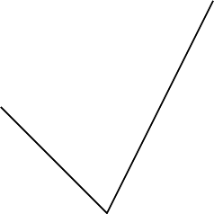
:::
::::::

How to speed up bookdown generation?

https://stackoverflow.com/questions/56541371/how-to-speed-up-bookdown-generation

TikZ and PGFplots

What's the relation between packages PGFplots and TikZ?

https://tex.stackexchange.com/questions/285925/whats-the-relation-between-packages-pgfplots-and-tikz

https://www.youtube.com/watch?v=bQugbYq0BVA

https://www.youtube.com/watch?v=ft4Kg9emK1k&list=PLg5nrpKdkk2DWcg3scb75AknF7DJXs8lk&index=18

:::::: {.cols data-latex=""}
::: {.col data-latex="{0.45\textwidth}"}

```tex
\begin{tikzpicture}
  \def\a{1.5} % amplitude
  \def\b{2}   % frequency
  \draw[->] (-0.2,0)--(4.2,0) node[right, font=\small] {$x$};
  \draw[->] (0,-4)--(0,0.5) node[above] {$y$};
  \draw[domain=0:4,smooth,variable=\t,blue,thick] 
    plot ({\a * (\b*\t - sin(deg(\b*\t)))},{-\a * (1 - cos(deg(\b*\t)))});
  % \node[above] at (2, 0.5) {Brachistochrone Curve};
  \node[above, font=\footnotesize] at (2, 1) {Brachistochrone Curve};
  \node[above, font=\footnotesize] at (2, 0) {$\begin{aligned}
& x=r(t-\sin t) \\
& y=r(1-\cos t)
\end{aligned}$};
\end{tikzpicture}
```
:::

::: {.col data-latex="{0.10\textwidth}"}
\ 
:::

::: {.col data-latex="{0.45\textwidth}"}
<div class="figure">

<p class="caption">(\#fig:unnamed-chunk-6)Brachistochrone Curve</p>
</div>
:::
::::::

<div class="figure">
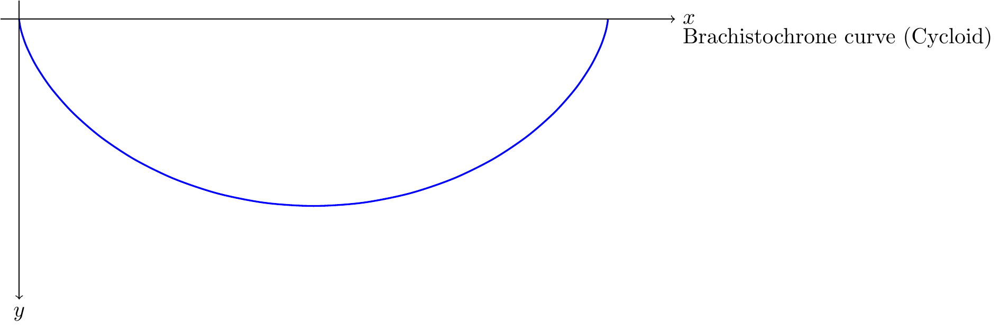
<p class="caption">(\#fig:unnamed-chunk-7)Brachistochrone Curve</p>
</div>

## 2D

https://zhuanlan.zhihu.com/p/127155579?utm_psn=1741479950987960320


```tex
\begin{tikzpicture}
  \draw (-1,1)--(0,0)--(1,2);
\end{tikzpicture}
```

***

:::::: {.cols data-latex=""}
::: {.col data-latex="{0.45\textwidth}"}

```tex
\begin{tikzpicture}
  \draw (-1,1)--(0,0)--(1,2);
\end{tikzpicture}
```
:::

::: {.col data-latex="{0.10\textwidth}"}
\ 
:::

::: {.col data-latex="{0.45\textwidth}"}

:::
::::::

***

:::::: {.cols data-latex=""}
::: {.col data-latex="{0.45\textwidth}"}
`out.width=if (knitr:::is_html_output()) '20%'`


```tex
\begin{tikzpicture}
  \draw (-1,1)--(0,0)--(1,2);
\end{tikzpicture}
```
:::

::: {.col data-latex="{0.10\textwidth}"}
\ 
:::

::: {.col data-latex="{0.45\textwidth}"}

:::
::::::

***

:::::: {.cols data-latex=""}
::: {.col data-latex="{0.45\textwidth}"}

```tex
\begin{tikzpicture}
  \draw[rounded corners] (-1,1)--(0,0)--(1,2)--(-1,1);
\end{tikzpicture}
```
:::

::: {.col data-latex="{0.10\textwidth}"}
\ 
:::

::: {.col data-latex="{0.45\textwidth}"}
<div class="figure">
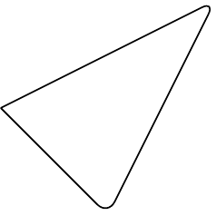
<p class="caption">(\#fig:unnamed-chunk-14)rounded corner pseudo-closed triangle</p>
</div>
:::
::::::

***

:::::: {.cols data-latex=""}
::: {.col data-latex="{0.45\textwidth}"}

```tex
\begin{tikzpicture}
  \draw[rounded corners] (-1,1)--(0,0)--(1,2)--cycle;
\end{tikzpicture}
```
:::

::: {.col data-latex="{0.10\textwidth}"}
\ 
:::

::: {.col data-latex="{0.45\textwidth}"}
<div class="figure">

<p class="caption">(\#fig:unnamed-chunk-16)rounded corner triangle</p>
</div>
:::
::::::

***

:::::: {.cols data-latex=""}
::: {.col data-latex="{0.45\textwidth}"}

```tex
\begin{tikzpicture}
  \draw[rounded corners] (-1,1)--(0,0)--(1,2)--cycle;
  \draw[rounded corners] (-1,1)--(0,0)--(1,2)--(-1,1);
\end{tikzpicture}
```
:::

::: {.col data-latex="{0.10\textwidth}"}
\ 
:::

::: {.col data-latex="{0.45\textwidth}"}
<div class="figure">

<p class="caption">(\#fig:unnamed-chunk-18)triangle vs. pseudo-closed triangle</p>
</div>
:::
::::::

***

:::::: {.cols data-latex=""}
::: {.col data-latex="{0.45\textwidth}"}

```tex
\begin{tikzpicture}
  \draw (0,0) rectangle (4,2);
\end{tikzpicture}
```
:::

::: {.col data-latex="{0.10\textwidth}"}
\ 
:::

::: {.col data-latex="{0.45\textwidth}"}
<div class="figure">

<p class="caption">(\#fig:unnamed-chunk-20)rectangle</p>
</div>
:::
::::::

***

:::::: {.cols data-latex=""}
::: {.col data-latex="{0.45\textwidth}"}

```tex
\begin{tikzpicture}
  \draw (0,0) rectangle (2,2);
\end{tikzpicture}
```
:::

::: {.col data-latex="{0.10\textwidth}"}
\ 
:::

::: {.col data-latex="{0.45\textwidth}"}
<div class="figure">

<p class="caption">(\#fig:unnamed-chunk-22)square</p>
</div>
:::
::::::

***

:::::: {.cols data-latex=""}
::: {.col data-latex="{0.45\textwidth}"}

```tex
\begin{tikzpicture}
  \draw (0,0) circle (1);
\end{tikzpicture}
```
:::

::: {.col data-latex="{0.10\textwidth}"}
\ 
:::

::: {.col data-latex="{0.45\textwidth}"}
<div class="figure">

<p class="caption">(\#fig:unnamed-chunk-24)circle</p>
</div>
:::
::::::

***

:::::: {.cols data-latex=""}
::: {.col data-latex="{0.45\textwidth}"}

```tex
\begin{tikzpicture}
  \draw (0,0) circle (1);
  \draw (0,0) rectangle (2,2);
\end{tikzpicture}
```
:::

::: {.col data-latex="{0.10\textwidth}"}
\ 
:::

::: {.col data-latex="{0.45\textwidth}"}
<div class="figure">

<p class="caption">(\#fig:unnamed-chunk-26)circle and square</p>
</div>
:::
::::::

***

:::::: {.cols data-latex=""}
::: {.col data-latex="{0.45\textwidth}"}

```tex
\begin{tikzpicture}
  \draw (1,1) ellipse (2 and 1);
\end{tikzpicture}
```
:::

::: {.col data-latex="{0.10\textwidth}"}
\ 
:::

::: {.col data-latex="{0.45\textwidth}"}
<div class="figure">

<p class="caption">(\#fig:unnamed-chunk-28)ellipse</p>
</div>
:::
::::::

***

:::::: {.cols data-latex=""}
::: {.col data-latex="{0.45\textwidth}"}

```tex
\begin{tikzpicture}
  \draw (1 ,1) arc (0:270:1);
  \draw (6 ,1) arc (0:270:2 and 1);
\end{tikzpicture}
```
:::

::: {.col data-latex="{0.10\textwidth}"}
\ 
:::

::: {.col data-latex="{0.45\textwidth}"}
<div class="figure">

<p class="caption">(\#fig:unnamed-chunk-30)circle and ellipse arcs</p>
</div>
:::
::::::

***

:::::: {.cols data-latex=""}
::: {.col data-latex="{0.45\textwidth}"}

```tex
\begin{tikzpicture}
  \draw (-1,1) parabola bend (0,0) (2,4);
\end{tikzpicture}
```
:::

::: {.col data-latex="{0.10\textwidth}"}
\ 
:::

::: {.col data-latex="{0.45\textwidth}"}
<div class="figure">
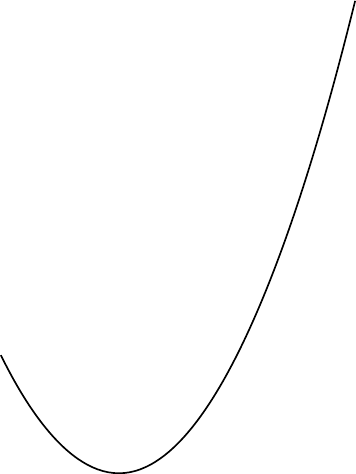
<p class="caption">(\#fig:unnamed-chunk-32)parabola arc</p>
</div>
:::
::::::

***

:::::: {.cols data-latex=""}
::: {.col data-latex="{0.45\textwidth}"}

```tex
\begin{tikzpicture}
  \draw (-1,1) parabola bend (0,0) (2,4);
  \filldraw
    (-1,1) circle (.05)
    ( 0,0) circle (.05)
    ( 1,1) circle (.05)
    ( 2,4) circle (.05);
\end{tikzpicture}
```
:::

::: {.col data-latex="{0.10\textwidth}"}
\ 
:::

::: {.col data-latex="{0.45\textwidth}"}
<div class="figure">
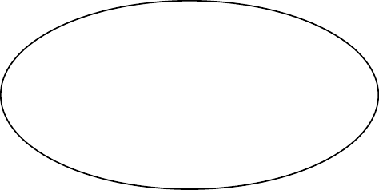
<p class="caption">(\#fig:unnamed-chunk-34)parabola arc with points</p>
</div>
:::
::::::

***

:::::: {.cols data-latex=""}
::: {.col data-latex="{0.45\textwidth}"}

```tex
\begin{tikzpicture}
  \draw[step=20pt] (0,0) grid (3,2);
  \draw[help lines ,step=20pt] (4,0) grid (7,2);
\end{tikzpicture}
```
:::

::: {.col data-latex="{0.10\textwidth}"}
\ 
:::

::: {.col data-latex="{0.45\textwidth}"}
<div class="figure">

<p class="caption">(\#fig:unnamed-chunk-36)grid and help lines</p>
</div>
:::
::::::

***

:::::: {.cols data-latex=""}
::: {.col data-latex="{0.45\textwidth}"}

```tex
\begin{tikzpicture}[scale=0.25]
  \draw[->] (0,0)--(9,0);
  \draw[<-] (0,1)--(9,1);
  \draw[<->] (0,2)--(9,2);
  \draw[>->>] (0,3)--(9,3);
  \draw[|<->|] (0,4)--(9,4);
\end{tikzpicture}
```
:::

::: {.col data-latex="{0.10\textwidth}"}
\ 
:::

::: {.col data-latex="{0.45\textwidth}"}
<div class="figure">
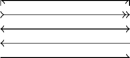
<p class="caption">(\#fig:unnamed-chunk-38)arrows</p>
</div>
:::
::::::

***

:::::: {.cols data-latex=""}
::: {.col data-latex="{0.45\textwidth}"}

```tex
\begin{tikzpicture}
  \draw[line width =2pt] (0,6)--(9,6); 
  \draw[dotted]          (0,5)--(9,5); 
  \draw[densely dotted]  (0,4)--(9,4); 
  \draw[loosely dotted]  (0,3)--(9,3); 
  \draw[dashed]          (0,2)--(9,2); 
  \draw[densely dashed]  (0,1)--(9,1); 
  \draw[loosely dashed]  (0,0)--(9,0);
\end{tikzpicture}
```
:::

::: {.col data-latex="{0.10\textwidth}"}
\ 
:::

::: {.col data-latex="{0.45\textwidth}"}
<div class="figure">

<p class="caption">(\#fig:unnamed-chunk-40)lines</p>
</div>
:::
::::::

***

:::::: {.cols data-latex=""}
::: {.col data-latex="{0.45\textwidth}"}

```tex
\begin{tikzpicture}[dline/.style={color= blue, line width=2pt}]
  \draw[dline] (0,0)--(9,0); 
\end{tikzpicture}
```
:::

::: {.col data-latex="{0.10\textwidth}"}
\ 
:::

::: {.col data-latex="{0.45\textwidth}"}
<div class="figure">

<p class="caption">(\#fig:unnamed-chunk-42)head styling</p>
</div>
:::
::::::

***

:::::: {.cols data-latex=""}
::: {.col data-latex="{0.45\textwidth}"}

```tex
\begin{tikzpicture}
  \draw (0,0) rectangle (2,2);
  \draw[shift={( 3, 0)}] (0,0) rectangle (2,2);
  \draw[shift={( 0, 3)}] (0,0) rectangle (2,2);
  \draw[shift={( 0,-3)}] (0,0) rectangle (2,2);
  \draw[shift={(-3, 0)}] (0,0) rectangle (2,2);
  \draw[shift={( 3, 3)}] (0,0) rectangle (2,2);
  \draw[shift={(-3, 3)}] (0,0) rectangle (2,2);
  \draw[shift={( 3,-3)}] (0,0) rectangle (2,2);
  \draw[shift={(-3,-3)}] (0,0) rectangle (2,2);
\end{tikzpicture}
```
:::

::: {.col data-latex="{0.10\textwidth}"}
\ 
:::

::: {.col data-latex="{0.45\textwidth}"}
<div class="figure">

<p class="caption">(\#fig:unnamed-chunk-44)transform: shift</p>
</div>
:::
::::::

***

:::::: {.cols data-latex=""}
::: {.col data-latex="{0.45\textwidth}"}

```tex
\begin{tikzpicture}
  \draw (0,0) rectangle (2,2);
  \draw[xshift= 100pt] (0,0) rectangle (2,2);
  \draw[xshift=-100pt] (0,0) rectangle (2,2);
  \draw[yshift= 100pt] (0,0) rectangle (2,2);
  \draw[yshift=-100pt] (0,0) rectangle (2,2);
\end{tikzpicture}
```
:::

::: {.col data-latex="{0.10\textwidth}"}
\ 
:::

::: {.col data-latex="{0.45\textwidth}"}
<div class="figure">

<p class="caption">(\#fig:unnamed-chunk-46)transform: shift x, y</p>
</div>
:::
::::::

***

:::::: {.cols data-latex=""}
::: {.col data-latex="{0.45\textwidth}"}

```tex
\begin{tikzpicture}
  \draw (0,0) rectangle (2,2);
  \draw[xshift= 100pt, xscale=1.5] (0,0) rectangle (2,2);
  \draw[yshift= 100pt, xscale=0.5] (0,0) rectangle (2,2);
  \draw[xshift=-100pt, yscale=1.5] (0,0) rectangle (2,2);
  \draw[yshift=-100pt, yscale=0.5] (0,0) rectangle (2,2);
\end{tikzpicture}
```
:::

::: {.col data-latex="{0.10\textwidth}"}
\ 
:::

::: {.col data-latex="{0.45\textwidth}"}
<div class="figure">

<p class="caption">(\#fig:unnamed-chunk-48)transform: scale x, y</p>
</div>
:::
::::::

***

:::::: {.cols data-latex=""}
::: {.col data-latex="{0.45\textwidth}"}

```tex
\begin{tikzpicture}
  \draw (0,0) rectangle (2,2);
  \draw[xshift= 100pt, xscale=1.5] (0,0) rectangle (2,2);
  \draw[yshift= 100pt, yscale=1.5] (0,0) rectangle (2,2);
  \draw[xshift=-100pt, xscale=0.5] (0,0) rectangle (2,2);
  \draw[yshift=-100pt, yscale=0.5] (0,0) rectangle (2,2);
\end{tikzpicture}
```
:::

::: {.col data-latex="{0.10\textwidth}"}
\ 
:::

::: {.col data-latex="{0.45\textwidth}"}
<div class="figure">

<p class="caption">(\#fig:unnamed-chunk-50)transform: scale</p>
</div>
:::
::::::

***

:::::: {.cols data-latex=""}
::: {.col data-latex="{0.45\textwidth}"}

```tex
\begin{tikzpicture}
  \draw (0,0) rectangle (2,2);
  \draw[xshift=125pt,rotate=45] (0,0) rectangle (2,2);
  \draw[xshift=175pt,rotate around={45:(2 ,2)}] (0,0) rectangle (2,2);
\end{tikzpicture}
```
:::

::: {.col data-latex="{0.10\textwidth}"}
\ 
:::

::: {.col data-latex="{0.45\textwidth}"}
<div class="figure">
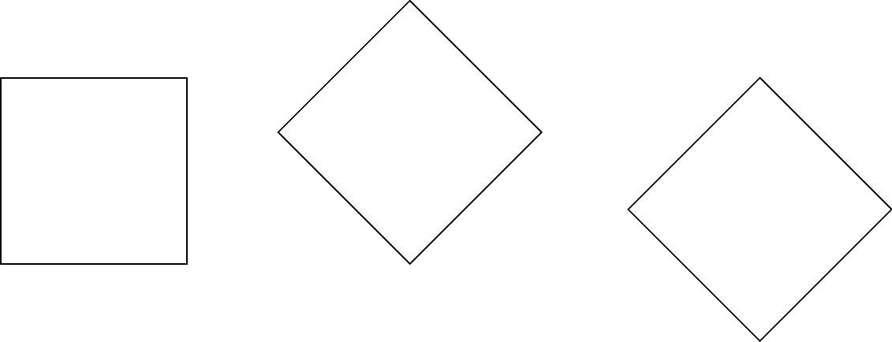
<p class="caption">(\#fig:unnamed-chunk-52)transform: rotate</p>
</div>
:::
::::::

***

:::::: {.cols data-latex=""}
::: {.col data-latex="{0.45\textwidth}"}

```tex
\begin{tikzpicture}
  \draw (0,0) rectangle (2,2);
  \draw[xshift=70pt,xslant=1] (0,0) rectangle (2,2);
  \draw[yshift=70pt,yslant=1] (0,0) rectangle (2,2);
\end{tikzpicture}
```
:::

::: {.col data-latex="{0.10\textwidth}"}
\ 
:::

::: {.col data-latex="{0.45\textwidth}"}
<div class="figure">

<p class="caption">(\#fig:unnamed-chunk-54)transform: slant</p>
</div>
:::
::::::

***

:::::: {.cols data-latex=""}
::: {.col data-latex="{0.45\textwidth}"}

```tex
\tikzset{
  box/.style={
    draw=blue,
    rectangle,
    rounded corners=5pt,
    minimum width=50pt,
    minimum height=20pt,
    inner sep=5pt
  }
}
\begin{tikzpicture}
  \node[box] (1) at (0,0) {1};
  \node[box] (2) at (4,0) {2};
  \node[box] (3) at (8,0) {3};
  \draw[->] (1)--(2);
  \draw[->] (2)--(3);
  \node at (2,1) {a};
  \node at (6,1) {b};
\end{tikzpicture}
```
:::

::: {.col data-latex="{0.10\textwidth}"}
\ 
:::

::: {.col data-latex="{0.45\textwidth}"}
<div class="figure">
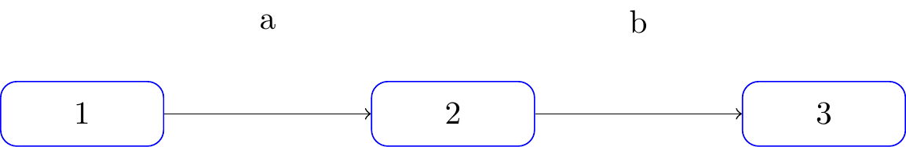
<p class="caption">(\#fig:unnamed-chunk-56)flowchart</p>
</div>
:::
::::::

***

:::::: {.cols data-latex=""}
::: {.col data-latex="{0.45\textwidth}"}

```tex
\tikzset{
  box/.style={
    draw=blue,
    fill=blue!20,
    rectangle,
    rounded corners=5pt,
    minimum height=20pt,
    inner sep=5pt
  }
}
\begin{tikzpicture}
  \node[box] {1}
      child {node[box] {2}}
      child {node[box] {3}
          child {node[box] {4}}
          child {node[box] {5}}
          child {node[box] {6}}
      };
\end{tikzpicture}
```
:::

::: {.col data-latex="{0.10\textwidth}"}
\ 
:::

::: {.col data-latex="{0.45\textwidth}"}
<div class="figure">

<p class="caption">(\#fig:unnamed-chunk-58)tree</p>
</div>
:::
::::::

***

:::::: {.cols data-latex=""}
::: {.col data-latex="{0.45\textwidth}"}

```tex
\begin{tikzpicture}
  \draw[->] (-0.2,0)--(6,0) node[right] {$x$};
  \draw[->] (0,-0.2)--(0,6) node[above] {$f(x)$};
  \draw[domain=0:4] plot (\x ,{0.1* exp(\x)}) node[right] {$f(x)=\frac{1}{10}e^x$};
\end{tikzpicture}
```
:::

::: {.col data-latex="{0.10\textwidth}"}
\ 
:::

::: {.col data-latex="{0.45\textwidth}"}
<div class="figure">

<p class="caption">(\#fig:unnamed-chunk-60)function plot</p>
</div>
:::
::::::

https://stackoverflow.com/questions/64897575/tikz-libraries-in-bookdown

It turns out that you can simply put the `\usetikzlibrary{...}` command directly before the `\begin{tikzpicture}` and everything works fine :)

https://stackoverflow.com/questions/56211210/r-markdown-document-with-html-docx-output-using-latex-package-bbm

https://tex.stackexchange.com/questions/171711/how-to-include-latex-package-in-r-markdown

## 3D

https://zhuanlan.zhihu.com/p/431732330?utm_psn=1741857547550638080

https://github.com/RRWWW/Stereometry

:::::: {.cols data-latex=""}
::: {.col data-latex="{0.45\textwidth}"}

```tex
\begin{tikzpicture}
  \coordinate (A) at ( 1, 1, 1);
  \coordinate (B) at ( 1, 1,-1);
  \coordinate (C) at ( 1,-1,-1);
  \coordinate (D) at ( 1,-1, 1);
  \coordinate (E) at (-1,-1, 1);
  \coordinate (F) at (-1,-1,-1);
  \coordinate (G) at (-1, 1,-1);
  \coordinate (H) at (-1, 1, 1);
  \draw (A) node[right=1pt] {$A$}--
        (B) node[right=1pt] {$B$}--
        (C) node[right=1pt] {$C$}--
        (D) node[right=1pt] {$D$}--
        (E) node[left= 1pt] {$E$}--
        (F) node[right=1pt] {$F$}--
        (G) node[right=1pt] {$G$}--
        (H) node[left= 1pt] {$H$}--
        (A) node[right=1pt] {$A$};
\end{tikzpicture}
```
:::

::: {.col data-latex="{0.10\textwidth}"}
\ 
:::

::: {.col data-latex="{0.45\textwidth}"}
<div class="figure">

<p class="caption">(\#fig:unnamed-chunk-62)cube</p>
</div>
:::
::::::

***

:::::: {.cols data-latex=""}
::: {.col data-latex="{0.45\textwidth}"}

```tex
\usetikzlibrary{patterns}
\usetikzlibrary{3d,calc}
\tdplotsetmaincoords{45}{45}
\begin{tikzpicture}[tdplot_main_coords]
  \coordinate (A) at ( 1, 1, 1);
  \coordinate (B) at ( 1, 1,-1);
  \coordinate (C) at ( 1,-1,-1);
  \coordinate (D) at ( 1,-1, 1);
  \coordinate (E) at (-1,-1, 1);
  \coordinate (F) at (-1,-1,-1);
  \coordinate (G) at (-1, 1,-1);
  \coordinate (H) at (-1, 1, 1);
  \draw (A) node[right=1pt] {$A$}--
        (B) node[right=1pt] {$B$}--
        (C) node[right=1pt] {$C$}--
        (D) node[right=1pt] {$D$}--
        (E) node[left= 1pt] {$E$}--
        (F) node[right=1pt] {$F$}--
        (G) node[right=1pt] {$G$}--
        (H) node[left= 1pt] {$H$}--
        (A) node[right=1pt] {$A$};
\end{tikzpicture}
```
:::

::: {.col data-latex="{0.10\textwidth}"}
\ 
:::

::: {.col data-latex="{0.45\textwidth}"}
<div class="figure">

<p class="caption">(\#fig:unnamed-chunk-64)cube rotate</p>
</div>
:::
::::::

***

:::::: {.cols data-latex=""}
::: {.col data-latex="{0.45\textwidth}"}

```tex
\usetikzlibrary{patterns}
\usetikzlibrary{3d,calc}
%\tdplotsetmaincoords{70}{110}
\begin{tikzpicture}[rotate around y=-15, rotate around z=7]
  \coordinate (A) at ( 1, 1, 1);
  \coordinate (B) at ( 1, 1,-1);
  \coordinate (C) at ( 1,-1,-1);
  \coordinate (D) at ( 1,-1, 1);
  \coordinate (E) at (-1,-1, 1);
  \coordinate (F) at (-1,-1,-1);
  \coordinate (G) at (-1, 1,-1);
  \coordinate (H) at (-1, 1, 1);
  \draw (A) node[right=1pt] {$A$}--
        (B) node[right=1pt] {$B$}--
        (C) node[right=1pt] {$C$}--
        (D) node[right=1pt] {$D$}--
        (E) node[left= 1pt] {$E$}--
        (F) node[right=1pt] {$F$}--
        (G) node[right=1pt] {$G$}--
        (H) node[left= 1pt] {$H$}--
        (A) node[right=1pt] {$A$};
\end{tikzpicture}
```
:::

::: {.col data-latex="{0.10\textwidth}"}
\ 
:::

::: {.col data-latex="{0.45\textwidth}"}
<div class="figure">

<p class="caption">(\#fig:unnamed-chunk-66)cube rotate around</p>
</div>
:::
::::::

https://tex.stackexchange.com/questions/388621/optimizing-perspective-tikz-graphic

:::::: {.cols data-latex=""}
::: {.col data-latex="{0.45\textwidth}"}

```tex
\usetikzlibrary{patterns}
\usetikzlibrary{3d,calc}
\begin{tikzpicture}[y={(.5cm,.7cm)}]
  \coordinate (A) at ( 1, 1, 1);
  \coordinate (B) at ( 1, 1,-1);
  \coordinate (C) at ( 1,-1,-1);
  \coordinate (D) at ( 1,-1, 1);
  \coordinate (E) at (-1,-1, 1);
  \coordinate (F) at (-1,-1,-1);
  \coordinate (G) at (-1, 1,-1);
  \coordinate (H) at (-1, 1, 1);
  \draw (A) node[right=1pt] {$A$}--
        (B) node[right=1pt] {$B$}--
        (C) node[right=1pt] {$C$}--
        (D) node[right=1pt] {$D$}--
        (E) node[left= 1pt] {$E$}--
        (F) node[right=1pt] {$F$}--
        (G) node[right=1pt] {$G$}--
        (H) node[left= 1pt] {$H$}--
        (A) node[right=1pt] {$A$};
\end{tikzpicture}
```
:::

::: {.col data-latex="{0.10\textwidth}"}
\ 
:::

::: {.col data-latex="{0.45\textwidth}"}
<div class="figure">

<p class="caption">(\#fig:unnamed-chunk-68)cube perspective slant</p>
</div>
:::
::::::

https://github.com/XiangyunHuang/bookdown-broken/blob/master/index.Rmd

:::::: {.cols data-latex=""}
::: {.col data-latex="{0.45\textwidth}"}

```tex
\smartdiagramset{planet color=gray!40!white, 
uniform color list=gray!40!white for 10 items}
\smartdiagram[bubble diagram]{Basic skills,
  Edit~/\\ (RStudio), 
  Organize~/\\ (bookdown), 
  Cooperate~/\\ (Git), 
  Typeset~/\\ (LaTeX/Pandoc), 
  Compile~/\\ (GitHub Action)}
```
:::

::: {.col data-latex="{0.10\textwidth}"}
\ 
:::

::: {.col data-latex="{0.45\textwidth}"}
<div class="figure">

<p class="caption">(\#fig:unnamed-chunk-70)modern statistics plot skills</p>
</div>
:::
::::::

## plots of functions

https://tikz.dev/tikz-plots

> A warning before we get started: If you are looking for an easy way to create a normal plot of a function with scientific axes, ignore this section and instead look at the `pgfplots` package or at the `datavisualization` command from Part VI.

https://tikz.dev/tikz-plots#sec-22.5

:::::: {.cols data-latex=""}
::: {.col data-latex="{0.45\textwidth}"}

```tex
\begin{tikzpicture}[domain=0:4]
  \draw[very thin,color=gray] (-0.1,-1.1) grid (3.9,3.9);

  \draw[->] (-0.2,0) -- (4.2,0) node[right] {$x$};
  \draw[->] (0,-1.2) -- (0,4.2) node[above] {$f(x)$};

  \draw[color=red]    plot (\x,\x)             node[right] {$f(x) =x$};
  % \x r means to convert '\x' from degrees to _r_adians:
  \draw[color=blue]   plot (\x,{sin(\x r)})    node[right] {$f(x) = \sin x$};
  \draw[color=orange] plot (\x,{0.05*exp(\x)}) node[right] {$f(x) = \frac{1}{20} \mathrm e^x$};
\end{tikzpicture}
```
:::

::: {.col data-latex="{0.10\textwidth}"}
\ 
:::

::: {.col data-latex="{0.45\textwidth}"}
<div class="figure">
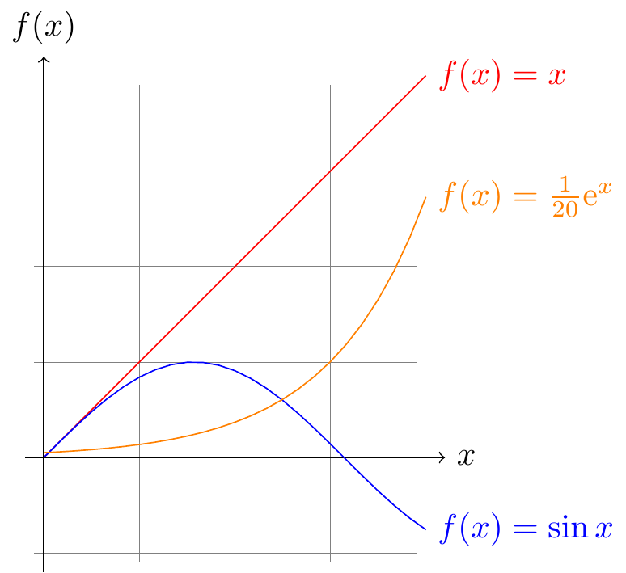
<p class="caption">(\#fig:unnamed-chunk-72)plots of functions</p>
</div>
:::
::::::

***

:::::: {.cols data-latex=""}
::: {.col data-latex="{0.45\textwidth}"}

```tex
\tikz \draw[scale=0.5,domain=-3.141:3.141,smooth,variable=\t]
  plot ({\t*sin(\t r)},{\t*cos(\t r)});
```
:::

::: {.col data-latex="{0.10\textwidth}"}
\ 
:::

::: {.col data-latex="{0.45\textwidth}"}
<div class="figure">

<p class="caption">(\#fig:unnamed-chunk-74)2D parametric function</p>
</div>
:::
::::::

***

:::::: {.cols data-latex=""}
::: {.col data-latex="{0.45\textwidth}"}

```tex
\tikz \draw[domain=0:360,
            smooth,
            variable=\t]
  plot ({sin(\t)},\t/360,{cos(\t)});
```
:::

::: {.col data-latex="{0.10\textwidth}"}
\ 
:::

::: {.col data-latex="{0.45\textwidth}"}
<div class="figure">
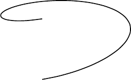
<p class="caption">(\#fig:unnamed-chunk-76)3D parametric function</p>
</div>
:::
::::::

## commutative diagram

cd = CD = commutative diagram

tikz-cd = TikZ-CD

`\usetikzlibrary{cd}` vs. `usepackage{tikz-cd}`

https://tex.stackexchange.com/questions/546392/usepackagetikz-cd-vs-usetikzlibrarycd

> No (practical) difference. The code (excluding copyright comment lines) in `tikz-cd.sty` is
> ```
> \ProvidesPackage{tikz-cd}[2014/10/30 v0.9e Commutative diagrams with tikz]
> \RequirePackage{tikz}[2013/12/13] % pgf version 3.0.0 required
> \usetikzlibrary{cd}
>
> \endinput
> ```

Never put `\begin{tikzcd}` inside `\begin{tikzpicture}`

https://tex.stackexchange.com/questions/425296/half-of-tikzcd-diagram-is-missing

***

:::::: {.cols data-latex=""}
::: {.col data-latex="{0.45\textwidth}"}

```tex
\usetikzlibrary{cd,arrows.meta}
\begin{tikzcd}
11 & 12 & 13 \\
21 & 22 & 23 \\
31 & 32 & 33
\end{tikzcd}
```
:::

::: {.col data-latex="{0.10\textwidth}"}
\ 
:::

::: {.col data-latex="{0.45\textwidth}"}
<div class="figure">
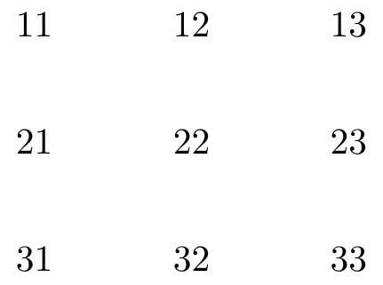
<p class="caption">(\#fig:unnamed-chunk-78)learn TikZ-CD or tikz-cd in one picture</p>
</div>
:::
::::::

***

:::::: {.cols data-latex=""}
::: {.col data-latex="{0.45\textwidth}"}

```tex
\usetikzlibrary{cd,arrows.meta}
\begin{tikzcd}
11
&
12
&
13
\\
21
&
22
&
23
\\
31
&
32
&
33
\end{tikzcd}
```
:::

::: {.col data-latex="{0.10\textwidth}"}
\ 
:::

::: {.col data-latex="{0.45\textwidth}"}
<div class="figure">

<p class="caption">(\#fig:unnamed-chunk-80)TikZ-CD or tikz-cd matrix nodes</p>
</div>
:::
::::::

***

<div class="figure">

<p class="caption">(\#fig:unnamed-chunk-81)TikZ-CD or tikz-cd matrix nodes expanded longitudinally</p>
</div>

:::::: {.cols data-latex=""}
::: {.col data-latex="{0.45\textwidth}"}

```tex
\usetikzlibrary{cd,arrows.meta}
\begin{tikzcd}[column sep=2.75cm]%small,large,huge
00
\ar[r,"\backslash \text{ar[r]}"]
\ar[d,"\backslash \text{ar[d]}"]
&
01
\ar[r,"\text{[,"swap"']}"']
&
02
\ar[r,"\backslash \text{ar[r]}","\text{[,"swap"']}"']
&
03
\\
10
\ar[d,"\text{[,"swap"']}"']
&
11
\ar[u,"\backslash \text{ar[u]}"]
\ar[l,"\backslash \text{ar[l]}"]
\ar[r,-stealth,"\text{[,-}\text{stealth}\text{]}"]
\ar[d,-{Stealth[reversed]},"\text{[,-}\{\text{Stealth[reversed]}\}\text{]}"]
&
12
\ar[r,-{Stealth[open]},"\text{[,-}\{\text{Stealth[open]}\}\text{]}"]
&
13
\\
20
\ar[r,"\text{[,"r" description]}" description]
\ar[d,"\backslash \text{ar[d]}","\text{[,"swap"']}"']
&
21
\ar[r,-{Stealth[harpoon]},"\text{[,-}\{\text{Stealth[harpoon]}\}\text{]}"]
&
22
\ar[u,shift right=1.75pt,"\text{[,shift right=1.75pt]}"']
\ar[lld,-Stealth,"\backslash \text{ar[lld]}" description]
\ar[r,latex-latex,"\text{[,latex-latex]}"]
\ar[d,shift right=1.75pt,"\text{[,shift right=1.75pt]}"]
&
23
\\
30
\ar[ru,"\backslash \text{ar[ru]}" description]
\ar[r,bend right,-stealth,"\text{bend right}"]
\ar[r,bend right=42,-stealth,"\text{bend right=42}"']
\ar[r,bend right=100,-stealth,"\text{bend right=100}"']
\ar[dd,bend right,-stealth,"\text{[,bend right]}"']
&
31
\ar[r,bend left,stealth-stealth,"\text{bend left}"']
\ar[ddr]
&
32
\ar[l,-{Stealth[harpoon]},"\text{[,-}\{\text{Stealth[harpoon]}\}\text{]}"]
\ar[r,-{Stealth[harpoon]},shift left=.75pt,"\text{[,shift left=.75pt]}"]
\ar[ddl,crossing over,"\text{[,crossing over]; rounded corneres, to path}"]
\ar[ddr,
	rounded corners,
	to path={--([yshift=-2ex]\tikztostart.south)
			  --([yshift=-2ex,xshift=+2ex]\tikztostart.south)
			  --([yshift=-2ex,xshift=+8ex]\tikztostart.south)
			  --([xshift=-12ex]\tikztotarget.west)
			  --(\tikztotarget)
			 },
	]
&
33
\ar[l,-{Stealth[harpoon]},shift left=.75pt,"\text{[,shift left=.75pt]}"]
\\
&
&
&
\\
50
\ar[r,-|,"\text{[,}-|\text{,swap]}",swap]
&
51
\ar[r,-stealth,red,text=black,"|\text{[draw=black]}|" description]
&
|[draw=black]|52
&
53
\end{tikzcd}
```
:::

::: {.col data-latex="{0.10\textwidth}"}
\ 
:::

::: {.col data-latex="{0.45\textwidth}"}
<div class="figure">

<p class="caption">(\#fig:unnamed-chunk-83)learn TikZ-CD or tikz-cd in one picture</p>
</div>
:::
::::::

***

https://tex.stackexchange.com/questions/515267/how-can-i-make-arrows-touch-boxed-expressions-in-tikzcd

```
cells={nodes={draw}}

in

\begin{tikzcd}[column sep=2.75cm, %small,large,huge
			         cells={nodes={draw}}
			        ]
```

<div class="figure">

<p class="caption">(\#fig:unnamed-chunk-84)learn TikZ-CD or tikz-cd in one picture 2</p>
</div>

:::::: {.cols data-latex=""}
::: {.col data-latex="{0.45\textwidth}"}

```tex
\usetikzlibrary{cd,arrows.meta}
\begin{tikzcd}[column sep=2.75cm, %small,large,huge
			         cells={nodes={draw}}
			        ]
00
\ar[r,"\backslash \text{ar[r]}"]
\ar[d,"\backslash \text{ar[d]}"]
&
01
\ar[r,"\text{[,"swap"']}"']
&
02
\ar[r,"\backslash \text{ar[r]}","\text{[,"swap"']}"']
&
03
\\
10
\ar[d,"\text{[,"swap"']}"']
&
11
\ar[u,"\backslash \text{ar[u]}"]
\ar[l,"\backslash \text{ar[l]}"]
\ar[r,-stealth,"\text{[,-}\text{stealth}\text{]}"]
\ar[d,-{Stealth[reversed]},"\text{[,-}\{\text{Stealth[reversed]}\}\text{]}"]
&
12
\ar[r,-{Stealth[open]},"\text{[,-}\{\text{Stealth[open]}\}\text{]}"]
&
13
\\
20
\ar[r,"\text{[,"r" description]}" description]
\ar[d,"\backslash \text{ar[d]}","\text{[,"swap"']}"']
&
21
\ar[r,-{Stealth[harpoon]},"\text{[,-}\{\text{Stealth[harpoon]}\}\text{]}"]
&
22
\ar[u,shift right=1.75pt,"\text{[,shift right=1.75pt]}"']
\ar[lld,-Stealth,"\backslash \text{ar[lld]}" description]
\ar[r,latex-latex,"\text{[,latex-latex]}"]
\ar[d,shift right=1.75pt,"\text{[,shift right=1.75pt]}"]
&
23
\\
30
\ar[ru,"\backslash \text{ar[ru]}" description]
\ar[r,bend right,-stealth,"\text{bend right}"]
\ar[r,bend right=42,-stealth,"\text{bend right=42}"']
\ar[r,bend right=100,-stealth,"\text{bend right=100}"']
\ar[dd,bend right,-stealth,"\text{[,bend right]}"']
&
31
\ar[r,bend left,stealth-stealth,"\text{bend left}"']
\ar[ddr]
&
32
\ar[l,-{Stealth[harpoon]},"\text{[,-}\{\text{Stealth[harpoon]}\}\text{]}"]
\ar[r,-{Stealth[harpoon]},shift left=.75pt,"\text{[,shift left=.75pt]}"]
\ar[ddl,crossing over,"\text{[,crossing over]; rounded corneres, to path}"]
\ar[ddr,
	rounded corners,
	to path={--([yshift=-2ex]\tikztostart.south)
			  --([yshift=-2ex,xshift=+2ex]\tikztostart.south)
			  --([yshift=-2ex,xshift=+8ex]\tikztostart.south)
			  --([xshift=-12ex]\tikztotarget.west)
			  --(\tikztotarget)
			 },
	]
&
33
\ar[l,-{Stealth[harpoon]},shift left=.75pt,"\text{[,shift left=.75pt]}"]
\\
&
&
&
\\
50
\ar[r,-|,"\text{[,}-|\text{,swap]}",swap]
&
51
\ar[r,-stealth,red,text=black,"|\text{[draw=none]}|" description]
&
|[draw=none]|52
&
53
\end{tikzcd}
```
:::

::: {.col data-latex="{0.10\textwidth}"}
\ 
:::

::: {.col data-latex="{0.45\textwidth}"}
<div class="figure">

<p class="caption">(\#fig:unnamed-chunk-86)learn TikZ-CD or tikz-cd in one picture 2</p>
</div>
:::
::::::

https://tex.stackexchange.com/questions/484743/format-single-node-in-tikzcd

:::::: {.cols data-latex=""}
::: {.col data-latex="{0.45\textwidth}"}

```tex
\usetikzlibrary{cd,arrows.meta,shapes}
\begin{tikzcd}[cells={nodes={draw=black,ellipse}}]
0 \ar[r] & 1 \ar[r] & |[draw=none]|\dots \ar[r] & n-1 \ar[r] & n
\end{tikzcd}
```
:::

::: {.col data-latex="{0.10\textwidth}"}
\ 
:::

::: {.col data-latex="{0.45\textwidth}"}
<div class="figure">
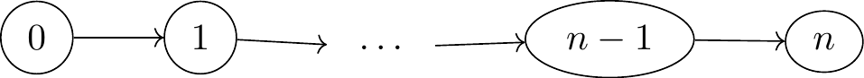
<p class="caption">(\#fig:unnamed-chunk-88)individual node without drawing margin</p>
</div>
:::
::::::

https://tex.stackexchange.com/questions/586160/drawing-commutative-diagram-with-encircled-nodes-in-tikz-cd-package

:::::: {.cols data-latex=""}
::: {.col data-latex="{0.45\textwidth}"}

```tex
\usetikzlibrary{cd,fit,shapes.geometric}
\tikzset{E/.style = {ellipse, draw=blue, dashed,
					inner xsep=-2mm,inner ysep=-4mm,
					rotate=-30,fit=#1
				   }
		}
\begin{tikzcd}[arrows = dash,
			    execute at end picture = {
			    \node[E = (tikz@f@1-2-2) (tikz@f@1-3-3)] {};
			    \node[E = (tikz@f@1-3-1) (tikz@f@1-4-2)] {};
                        }% end of execute at end picture
			  ]
	&	R	\ar[d]	&	\\
	&	A+B	\ar[dl]	\ar[dr]	&	\\
A	\ar[dr]	&	&	B	\ar[dl]	\\
	&	A \cap B	&
\end{tikzcd}
```
:::

::: {.col data-latex="{0.10\textwidth}"}
\ 
:::

::: {.col data-latex="{0.45\textwidth}"}
<div class="figure">
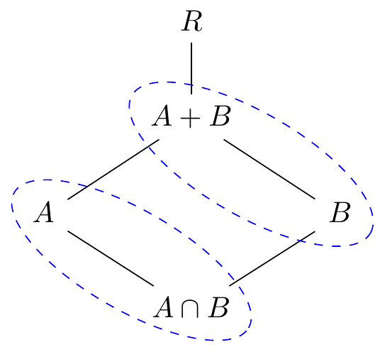
<p class="caption">(\#fig:unnamed-chunk-90)enclosed nodes</p>
</div>
:::
::::::

[box in TikZ-CD]^[\@ref(box-in-tikz-cd)]^

***

:::::: {.cols data-latex=""}
::: {.col data-latex="{0.45\textwidth}"}

```tex
\usetikzlibrary{cd,arrows.meta}
\begin{tikzcd}
A \ar[r,-stealth,"f","g"'] \ar[d,-{Stealth[harpoon]},shift left=0.5pt,"\varphi"] \ar[rr,-stealth,bend left] & B & E \\
C \ar[r,-latex,"g"'] \ar[u,-{Stealth[harpoon]},shift left=0.5pt,"\varphi^{{\scriptscriptstyle -1}}"] \ar[d,harpoon,shift left=0.5pt,"\varphi"] & D & F \\
G \ar[r,"f"] \ar[u,harpoon,shift left=0.5pt,"\varphi^{-1}"] & H \ar[uur,-stealth,"\phi" description]
\end{tikzcd}
```
:::

::: {.col data-latex="{0.10\textwidth}"}
\ 
:::

::: {.col data-latex="{0.45\textwidth}"}
<div class="figure">
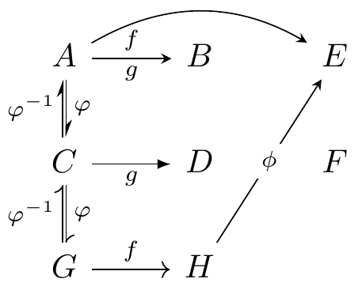
<p class="caption">(\#fig:unnamed-chunk-92)TikZ-CD or tikz-cd + arrows.meta</p>
</div>
:::
::::::

***

:::::: {.cols data-latex=""}
::: {.col data-latex="{0.45\textwidth}"}

```tex
\usetikzlibrary{cd,arrows.meta}
\begin{tikzcd}
A \ar[r,-{Stealth[harpoon,swap,open]}] & B
\end{tikzcd}
```
:::

::: {.col data-latex="{0.10\textwidth}"}
\ 
:::

::: {.col data-latex="{0.45\textwidth}"}
<div class="figure">

<p class="caption">(\#fig:unnamed-chunk-94)TikZ-CD or tikz-cd + arrows.meta</p>
</div>
:::
::::::

TikZcd editor

https://github.com/yishn/tikzcd-editor

https://tikzcd.yichuanshen.de/

https://darknmt.github.io/res/tikzcd-editor/

tikz-cd @ CTAN(Comprehensive TEX Archive Network)

https://ctan.org/tex-archive/graphics/pgf/contrib/tikz-cd

tikzcd manual

https://ctan.mirror.twds.com.tw/tex-archive/graphics/pgf/contrib/tikz-cd/tikz-cd-doc.pdf

### arrows

https://latexdraw.com/exploring-tikz-arrows/

#### predefined arrow tip in TikZ

##### stealth arrow tip

`-stealth` without capital S = `-{Stealth}` in `arrows.meta`

:::::: {.cols data-latex=""}
::: {.col data-latex="{0.45\textwidth}"}

```tex
\begin{tikzpicture}
  \node at (0, 0) {};
	\draw [-stealth]        (0, 0) -- (1, 0);
	\draw [stealth-]        (0,-1) -- (1,-1);
	\draw [stealth-stealth] (0,-2) -- (1,-2);
  \node at (0,-2) {};
\end{tikzpicture}
```
:::

::: {.col data-latex="{0.10\textwidth}"}
\ 
:::

::: {.col data-latex="{0.45\textwidth}"}
<div class="figure">

<p class="caption">(\#fig:unnamed-chunk-96)stealth arrow tip</p>
</div>
:::
::::::

##### reversed stealth arrow tip

`-stealth reversed` = `-{Stealth[reversed]}` in `arrows.meta`

:::::: {.cols data-latex=""}
::: {.col data-latex="{0.45\textwidth}"}

```tex
\begin{tikzpicture}
  \node at (0, 0) {};
	\draw [-stealth reversed]                 (0, 0) -- (1, 0);
	\draw [stealth reversed-]                 (0,-1) -- (1,-1);
	\draw [stealth reversed-stealth reversed] (0,-2) -- (1,-2);
  \node at (0,-2) {};
\end{tikzpicture}
```
:::

::: {.col data-latex="{0.10\textwidth}"}
\ 
:::

::: {.col data-latex="{0.45\textwidth}"}
<div class="figure">

<p class="caption">(\#fig:unnamed-chunk-98)reversed stealth arrow tip</p>
</div>
:::
::::::

##### to arrow tip

`-to`

:::::: {.cols data-latex=""}
::: {.col data-latex="{0.45\textwidth}"}

```tex
\begin{tikzpicture}
  \node at (0, 0) {};
	\draw [-to]   (0, 0) -- (1, 0);
	\draw [to-]   (0,-1) -- (1,-1);
	\draw [to-to] (0,-2) -- (1,-2);
  \node at (0,-2) {};
\end{tikzpicture}
```
:::

::: {.col data-latex="{0.10\textwidth}"}
\ 
:::

::: {.col data-latex="{0.45\textwidth}"}
<div class="figure">

<p class="caption">(\#fig:unnamed-chunk-100)to arrow tip</p>
</div>
:::
::::::

##### latex arrow tip

`-latex` with flat-tailed arrow head, differing from `-stealth`

:::::: {.cols data-latex=""}
::: {.col data-latex="{0.45\textwidth}"}

```tex
\begin{tikzpicture}
  \node at (0, 0) {};
	\draw [-latex]      (0, 0) -- (1, 0);
	\draw [latex-]      (0,-1) -- (1,-1);
	\draw [latex-latex] (0,-2) -- (1,-2);
  \node at (0,-2) {};
\end{tikzpicture}
```
:::

::: {.col data-latex="{0.10\textwidth}"}
\ 
:::

::: {.col data-latex="{0.45\textwidth}"}
<div class="figure">
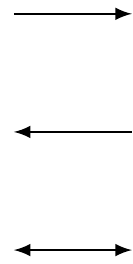
<p class="caption">(\#fig:unnamed-chunk-102)to arrow tip</p>
</div>
:::
::::::

##### | arrow tip

`-|` like inhibition in biological pathway

:::::: {.cols data-latex=""}
::: {.col data-latex="{0.45\textwidth}"}

```tex
\begin{tikzpicture}
  \node at (0, 0) {};
	\draw [-|]  (0, 0) -- (1, 0);
	\draw [|-]  (0,-1) -- (1,-1);
	\draw [|-|] (0,-2) -- (1,-2);
  \node at (0,-2) {};
\end{tikzpicture}
```
:::

::: {.col data-latex="{0.10\textwidth}"}
\ 
:::

::: {.col data-latex="{0.45\textwidth}"}
<div class="figure">

<p class="caption">(\#fig:unnamed-chunk-104)to arrow tip</p>
</div>
:::
::::::

#### arrows.meta

customizing arrow heads

##### reversing, halving, swapping, opening

https://tikz.dev/tikz-arrows#sec-16.3.5

:::::: {.cols data-latex=""}
::: {.col data-latex="{0.45\textwidth}"}

```tex
\usetikzlibrary{arrows.meta}
\begin{tikzpicture}
  \node at (0, 0) {};
	\draw [-{Stealth[reversed]}]      (0, 0) -- (1, 0);
	\draw [-{Stealth[harpoon]}]       (0,-1) -- (1,-1);
	\draw [-{Stealth[harpoon,swap]}]  (0,-2) -- (1,-2);
  \draw [-{Stealth[open]}]          (0,-3) -- (1,-3);
  \node at (0,-2) {};
\end{tikzpicture}
```
:::

::: {.col data-latex="{0.10\textwidth}"}
\ 
:::

::: {.col data-latex="{0.45\textwidth}"}
<div class="figure">

<p class="caption">(\#fig:unnamed-chunk-106)reversing, halving, swapping, opening</p>
</div>
:::
::::::

##### mathematical arrows

- Classical TikZ Rightarrow
- Computer Modern Rightarrow
- Implies
- To

:::::: {.cols data-latex=""}
::: {.col data-latex="{0.45\textwidth}"}

```tex
\usetikzlibrary{arrows.meta}
\begin{tikzpicture}
  \node at (0, 0) {};
	\draw [-{Classical TikZ Rightarrow}]  (0, 0) -- (1, 0);
	\draw [-{Computer Modern Rightarrow}] (0,-1) -- (1,-1);
	\draw [-{Implies},double]             (0,-2) -- (1,-2);
  \draw [-To]                           (0,-3) -- (1,-3);
  \node at (0,-3) {};
\end{tikzpicture}
```
:::

::: {.col data-latex="{0.10\textwidth}"}
\ 
:::

::: {.col data-latex="{0.45\textwidth}"}
<div class="figure">

<p class="caption">(\#fig:unnamed-chunk-108)mathematical arrows</p>
</div>
:::
::::::

##### ray arrow tip

`-Rays`

:::::: {.cols data-latex=""}
::: {.col data-latex="{0.45\textwidth}"}

```tex
\usetikzlibrary{arrows.meta}
\begin{tikzpicture}
  \node at (0, 0) {};
	\draw [-Rays]         (0, 0) -- (1, 0);
	\draw [-{Rays[n=6]}]  (0,-1) -- (1,-1);
	\draw [-{Rays[n=8]}]  (0,-2) -- (1,-2);
  \node at (0,-2) {};
\end{tikzpicture}
```
:::

::: {.col data-latex="{0.10\textwidth}"}
\ 
:::

::: {.col data-latex="{0.45\textwidth}"}
<div class="figure">

<p class="caption">(\#fig:unnamed-chunk-110)Ray arrow tip</p>
</div>
:::
::::::

##### arrow head scale

e.g. `-{Stealth[scale=2]}`

:::::: {.cols data-latex=""}
::: {.col data-latex="{0.45\textwidth}"}

```tex
\usetikzlibrary{arrows.meta}
\begin{tikzpicture}
  \node at (0, 0) {};
	\draw [-stealth]            (0, 0) -- (1, 0);
	\draw [-{Stealth[scale=2]}] (0,-1) -- (1,-1);
  \node at (0,-1) {};
\end{tikzpicture}
```
:::

::: {.col data-latex="{0.10\textwidth}"}
\ 
:::

::: {.col data-latex="{0.45\textwidth}"}
<div class="figure">

<p class="caption">(\#fig:unnamed-chunk-112)arrow head scale</p>
</div>
:::
::::::

##### arrow head size

https://tikz.dev/tikz-arrows#sec-16.3.1

:::::: {.cols data-latex=""}
::: {.col data-latex="{0.45\textwidth}"}

```tex
\usetikzlibrary{arrows.meta}
\begin{tikzpicture}
  \node at (0, 0) {};
	\draw [-stealth]                          (0, 0) -- (1, 0);
	\draw [-{Stealth[length=3mm, width=2mm]}] (0,-1) -- (1,-1);
  \node at (0,-1) {};
\end{tikzpicture}
```
:::

::: {.col data-latex="{0.10\textwidth}"}
\ 
:::

::: {.col data-latex="{0.45\textwidth}"}
<div class="figure">

<p class="caption">(\#fig:unnamed-chunk-114)arrow head size</p>
</div>
:::
::::::

##### arrow head slant

e.g. `-{Stealth[slant=2]}`

:::::: {.cols data-latex=""}
::: {.col data-latex="{0.45\textwidth}"}

```tex
\usetikzlibrary{arrows.meta}
\begin{tikzpicture}
  \node at (0, 0) {};
	\draw [-Stealth]               (0, 0) -- (1, 0);
  \draw [-{Stealth[slant=-0.5]}] (0,-1) -- (1,-1);
  \draw [-{Stealth[slant=   1]}] (0,-2) -- (1,-2);
  \node at (0,-2) {};
\end{tikzpicture}
```
:::

::: {.col data-latex="{0.10\textwidth}"}
\ 
:::

::: {.col data-latex="{0.45\textwidth}"}
<div class="figure">
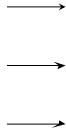
<p class="caption">(\#fig:unnamed-chunk-116)arrow head slant</p>
</div>
:::
::::::

##### arrow head color

e.g. 

- `-{Stealth[color=cyan]}`
- `-{Stealth[fill=red]}`
- `red,-{Stealth}`

:::::: {.cols data-latex=""}
::: {.col data-latex="{0.45\textwidth}"}

```tex
\usetikzlibrary{arrows.meta}
\begin{tikzpicture}
  \node at (0, 0) {};
	\draw [-stealth]               (0, 0) -- (1, 0);
	\draw [-{Stealth[color=cyan]}] (0,-1) -- (1,-1);
  \draw [-{Stealth[fill=red]}  ] (0,-2) -- (1,-2);
  \draw [red,-{Stealth}        ] (0,-3) -- (1,-3);
  \node at (0,-3) {};
\end{tikzpicture}
```
:::

::: {.col data-latex="{0.10\textwidth}"}
\ 
:::

::: {.col data-latex="{0.45\textwidth}"}
<div class="figure">

<p class="caption">(\#fig:unnamed-chunk-118)arrow and arrow head color</p>
</div>
:::
::::::

##### multiple arrow head

e.g. `-{Stealth}{Stealth}{Stealth}`

:::::: {.cols data-latex=""}
::: {.col data-latex="{0.45\textwidth}"}

```tex
\usetikzlibrary{arrows.meta}
\begin{tikzpicture}
  \node at (0, 0) {};
	\draw [-stealth]                     (0, 0) -- (1, 0);
	\draw [-{Stealth}{Stealth}{Stealth}] (0,-1) -- (1,-1);
  \node at (0,-1) {};
\end{tikzpicture}
```
:::

::: {.col data-latex="{0.10\textwidth}"}
\ 
:::

::: {.col data-latex="{0.45\textwidth}"}
<div class="figure">
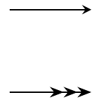
<p class="caption">(\#fig:unnamed-chunk-120)multiple arrow head</p>
</div>
:::
::::::

#### default stealth arrow

https://tex.stackexchange.com/questions/113437/stealth-arrow-in-math

:::::: {.cols data-latex=""}
::: {.col data-latex="{0.45\textwidth}"}

```tex
\usetikzlibrary{cd,arrows}
\tikzset{
  commutative diagrams/.cd, 
  arrow style=tikz, 
  diagrams={>=stealth}
}
\begin{tikzcd}
A \ar[r,"f"] \ar[d,harpoon,shift left=0.5pt,"\varphi"] \ar[rr,bend left] & B & E \\
C \ar[r] \ar[u,harpoon,shift left=0.5pt,"\varphi^{-1}"] & D & F \\
G & H \ar[uur,-stealth]
\end{tikzcd}
```
:::

::: {.col data-latex="{0.10\textwidth}"}
\ 
:::

::: {.col data-latex="{0.45\textwidth}"}
<div class="figure">

<p class="caption">(\#fig:unnamed-chunk-122)default stealth arrow</p>
</div>
:::
::::::

#### harpoon

harpoon ~ half arrow

https://tex.stackexchange.com/questions/715462/rightleftharpoons-in-commutative-diagram

:::::: {.cols data-latex=""}
::: {.col data-latex="{0.45\textwidth}"}

```tex
\usetikzlibrary{cd}
\begin{tikzcd}
cc \ar[r,shift left=1pt,harpoon,"a"] \ar[d,shift left=1pt,harpoon,"r"] &
ct \ar[l,shift left=1pt,harpoon,"b"] \ar[d,shift left=1pt,harpoon,"r"]
\\
tc \ar[r,shift left=1pt,harpoon,"a"] \ar[u,shift left=1pt,harpoon,"l"] &
tt \ar[l,shift left=1pt,harpoon,"b"] \ar[u,shift left=1pt,harpoon,"l"]
\end{tikzcd}
```
:::

::: {.col data-latex="{0.10\textwidth}"}
\ 
:::

::: {.col data-latex="{0.45\textwidth}"}
<div class="figure">

<p class="caption">(\#fig:unnamed-chunk-124)harpoon in cd</p>
</div>
:::
::::::

#### bend

https://tex.stackexchange.com/questions/354480/very-curved-arrow-with-tikzcd

:::::: {.cols data-latex=""}
::: {.col data-latex="{0.45\textwidth}"}

```tex
\usetikzlibrary{cd}
\begin{tikzcd}
A
\ar[r]
\ar[r, bend right]
\ar[r, bend left, blue]
\ar[r, bend left=10]
\ar[r, bend left=20]
\ar[r, bend left=50]
\ar[r, bend left=100]
& B
\end{tikzcd}
```
:::

::: {.col data-latex="{0.10\textwidth}"}
\ 
:::

::: {.col data-latex="{0.45\textwidth}"}
<div class="figure">

<p class="caption">(\#fig:unnamed-chunk-126)arrow bend</p>
</div>
:::
::::::

#### rounded corners

https://tex.stackexchange.com/questions/295428/rounded-arrow-in-tikzcd-with-text-on-it

:::::: {.cols data-latex=""}
::: {.col data-latex="{0.45\textwidth}"}

```tex
\usetikzlibrary{cd,positioning}
\begin{tikzcd}[sep=large, execute at end picture={\node[below = 1mm of tikz@f@1-1-2] {$\scriptstyle  g' \circ g$};}]
    B \ar{r}[swap]{g\vphantom{'}}
    \ar[to path={--([yshift=-4ex]\tikztostart.south)
                 -|(\tikztotarget)},rounded corners=12pt]{rr}
    & B' \ar{r}[swap]{g'} & B''
\end{tikzcd}
```
:::

::: {.col data-latex="{0.10\textwidth}"}
\ 
:::

::: {.col data-latex="{0.45\textwidth}"}
<div class="figure">
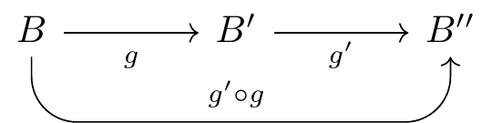
<p class="caption">(\#fig:unnamed-chunk-128)rounded corners</p>
</div>
:::
::::::

#### crossing over

:::::: {.cols data-latex=""}
::: {.col data-latex="{0.45\textwidth}"}

```tex
\usetikzlibrary{cd}
\begin{tikzcd}
 A \ar[dr] & B \ar[dl, crossing over] \\
 C
 & D
 \end{tikzcd}
```
:::

::: {.col data-latex="{0.10\textwidth}"}
\ 
:::

::: {.col data-latex="{0.45\textwidth}"}
<div class="figure">

<p class="caption">(\#fig:unnamed-chunk-130)crossing over</p>
</div>
:::
::::::

***

:::::: {.cols data-latex=""}
::: {.col data-latex="{0.45\textwidth}"}

```tex
\usetikzlibrary{cd}
\begin{tikzcd}[row sep=scriptsize, column sep=scriptsize]
 & f^* E_V \ar[dl] \ar[rr] \ar[dd] & & E_V \ar[dl] \ar[dd] \\
 f^* E \ar[rr, crossing over] \ar[dd] & & E \\
 & U \ar[dl] \ar[rr] & & V \ar[dl] \\
 M \ar[rr] & & N \ar[from=uu, crossing over]\\
 \end{tikzcd}
```
:::

::: {.col data-latex="{0.10\textwidth}"}
\ 
:::

::: {.col data-latex="{0.45\textwidth}"}
<div class="figure">
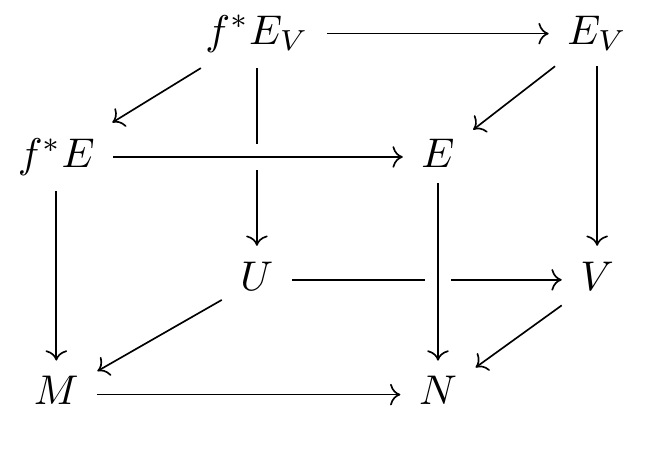
<p class="caption">(\#fig:unnamed-chunk-132)pseudo 3D diagram</p>
</div>
:::
::::::

#### tweaking to paths

:::::: {.cols data-latex=""}
::: {.col data-latex="{0.45\textwidth}"}

```tex
\usetikzlibrary{cd}
\begin{tikzcd}
  A \ar[dr, controls={+(1.5,0.5) and +(-1,0.8)}]
    \ar[dr, dashed, to path=|- (\tikztotarget)]
    & \\
    & B \ar[loop right]
\end{tikzcd}
```
:::

::: {.col data-latex="{0.10\textwidth}"}
\ 
:::

::: {.col data-latex="{0.45\textwidth}"}
<div class="figure">
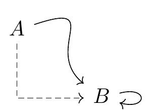
<p class="caption">(\#fig:unnamed-chunk-134)crossing over</p>
</div>
:::
::::::

***

:::::: {.cols data-latex=""}
::: {.col data-latex="{0.45\textwidth}"}

```tex
\usetikzlibrary{cd}
\begin{tikzcd}
  A \ar[r]
    & B \ar[r]
        \ar[d, phantom,""{coordinate,name=Z}]
    & C \ar[dll,
               "\delta",
               rounded corners,
               to path={--([xshift=2ex]\tikztostart.east)
                        |-(Z)[near end]\tikztonodes
                        -|([xshift=-2ex]\tikztotarget.west)
                        --(\tikztotarget)}] \\
  D \ar[r]
    & E \ar[r]
    & F
\end{tikzcd}
```
:::

::: {.col data-latex="{0.10\textwidth}"}
\ 
:::

::: {.col data-latex="{0.45\textwidth}"}
<div class="figure">

<p class="caption">(\#fig:unnamed-chunk-136)crossing over</p>
</div>
:::
::::::

***

:::::: {.cols data-latex=""}
::: {.col data-latex="{0.45\textwidth}"}

```tex
\usetikzlibrary{cd}
\begin{tikzcd}
  A \ar[r]
    & B \ar[r]
    & C \ar[dll,
               "\delta",
               rounded corners,
               to path={--([xshift=2ex]\tikztostart.east)
                        --([xshift=-2ex]\tikztotarget.west)
                        --(\tikztotarget)}] \\
  D \ar[r]
    & E \ar[r]
    & F
\end{tikzcd}
```
:::

::: {.col data-latex="{0.10\textwidth}"}
\ 
:::

::: {.col data-latex="{0.45\textwidth}"}
<div class="figure">

<p class="caption">(\#fig:unnamed-chunk-138)crossing over</p>
</div>
:::
::::::

### label

https://tex.stackexchange.com/questions/477733/two-labels-up-and-down-for-same-arrow

:::::: {.cols data-latex=""}
::: {.col data-latex="{0.45\textwidth}"}

```tex
\usetikzlibrary{cd}
\begin{tikzcd}%              V
A \ar[r, "\alpha", "\beta"'] & B
\end{tikzcd}
```
:::

::: {.col data-latex="{0.10\textwidth}"}
\ 
:::

::: {.col data-latex="{0.45\textwidth}"}
<div class="figure">
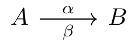
<p class="caption">(\#fig:unnamed-chunk-140)labels over and under the arrow</p>
</div>
:::
::::::

#### single quotation mark to swap

:::::: {.cols data-latex=""}
::: {.col data-latex="{0.45\textwidth}"}

```tex
\usetikzlibrary{cd}
\begin{tikzcd}
A \ar[r, "\alpha"] & B
\end{tikzcd}
```
:::

::: {.col data-latex="{0.10\textwidth}"}
\ 
:::

::: {.col data-latex="{0.45\textwidth}"}
<div class="figure">

<p class="caption">(\#fig:unnamed-chunk-142)label over the arrow without single quotation</p>
</div>
:::
::::::

:::::: {.cols data-latex=""}
::: {.col data-latex="{0.45\textwidth}"}

```tex
\usetikzlibrary{cd}
\begin{tikzcd}
A \ar[r, "\alpha"'] & B
\end{tikzcd}
```
:::

::: {.col data-latex="{0.10\textwidth}"}
\ 
:::

::: {.col data-latex="{0.45\textwidth}"}
<div class="figure">
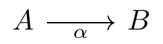
<p class="caption">(\#fig:unnamed-chunk-144)label under the arrow with single quotation</p>
</div>
:::
::::::

#### swap

:::::: {.cols data-latex=""}
::: {.col data-latex="{0.45\textwidth}"}

```tex
\usetikzlibrary{cd}
\begin{tikzcd}
A \ar[r, "\alpha"] & B
\end{tikzcd}
```
:::

::: {.col data-latex="{0.10\textwidth}"}
\ 
:::

::: {.col data-latex="{0.45\textwidth}"}
<div class="figure">

<p class="caption">(\#fig:unnamed-chunk-146)label over the arrow or no swap</p>
</div>
:::
::::::

:::::: {.cols data-latex=""}
::: {.col data-latex="{0.45\textwidth}"}

```tex
\usetikzlibrary{cd}
\begin{tikzcd}
A \ar[r, "\alpha", swap] & B
\end{tikzcd}
```
:::

::: {.col data-latex="{0.10\textwidth}"}
\ 
:::

::: {.col data-latex="{0.45\textwidth}"}
<div class="figure">

<p class="caption">(\#fig:unnamed-chunk-148)label swap under the arrow</p>
</div>
:::
::::::

#### every arrow swap

https://tex.stackexchange.com/questions/515697/how-can-we-change-the-positions-of-the-labels-on-a-tikz-cd-commutative-diagram

`every arrow/.append style={swap}`

### box in TikZ-CD

https://stackoverflow.com/questions/50392582/box-in-commutative-diagram

https://tex.stackexchange.com/questions/360083/filling-of-diagrams-using-tikzcd/360152#360152

### examples

https://tex.stackexchange.com/questions/218274/how-can-i-draw-commutative-diagrams-in-latex

:::::: {.cols data-latex=""}
::: {.col data-latex="{0.45\textwidth}"}

```tex
\usetikzlibrary{cd}
\begin{tikzcd}
A \ar{r}{\varphi} \ar[swap]{d}{\varrho_f} & B \ar{d}{\varrho_g} \\%
A_f \ar{r}{\varphi_f}& B_g
\end{tikzcd}
```
:::

::: {.col data-latex="{0.10\textwidth}"}
\ 
:::

::: {.col data-latex="{0.45\textwidth}"}
<div class="figure">

<p class="caption">(\#fig:unnamed-chunk-150)commutative diagram example 0</p>
</div>
:::
::::::

https://tex.stackexchange.com/questions/402572/how-to-make-a-commutative-diagram-using-tikz-cd

:::::: {.cols data-latex=""}
::: {.col data-latex="{0.45\textwidth}"}

```tex
\usetikzlibrary{cd}
\begin{tikzcd}[row sep=huge]
A \ar[r,"\phi_n"] \ar[d,swap,"\pi"] &
A_n \ar[r,"\epsilon_{i,n}"] \ar[dl,swap,"\psi_n"] \ar[dr,"\pi_n"] &
M_{n_k}(\mathbb{C}) \ar[d,"\eta_{i,n}"]
\\
B(H) & & B(H_n) \ar[ll,dashed]
\end{tikzcd}
```
:::

::: {.col data-latex="{0.10\textwidth}"}
\ 
:::

::: {.col data-latex="{0.45\textwidth}"}
<div class="figure">

<p class="caption">(\#fig:unnamed-chunk-152)commutative diagram example 1</p>
</div>
:::
::::::

https://tex.stackexchange.com/questions/115783/how-to-draw-commutative-diagrams

:::::: {.cols data-latex=""}
::: {.col data-latex="{0.45\textwidth}"}

```tex
\usetikzlibrary{cd,arrows}
\begin{tikzcd}
A \ar{r}{f} \ar[swap]{dr}{g\circ f} & B \ar{d}{g} \\
& C
\end{tikzcd}
```
:::

::: {.col data-latex="{0.10\textwidth}"}
\ 
:::

::: {.col data-latex="{0.45\textwidth}"}
<div class="figure">
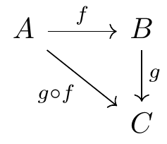
<p class="caption">(\#fig:unnamed-chunk-154)commutative diagram example 2</p>
</div>
:::
::::::

https://tex.stackexchange.com/questions/414292/tikz-commutative-diagrams-compiling-and-best-practice

:::::: {.cols data-latex=""}
::: {.col data-latex="{0.45\textwidth}"}

```tex
\usetikzlibrary{cd}
\begin{tikzcd}
C \ar[d, "\langle f_i \rangle_{i \in I}"', dotted] \ar[rd, "f_i"] &  \\
\prod_{i \in I} A_i \ar[r, "\pi_i"'] & A_i
\end{tikzcd}
```
:::

::: {.col data-latex="{0.10\textwidth}"}
\ 
:::

::: {.col data-latex="{0.45\textwidth}"}
<div class="figure">

<p class="caption">(\#fig:unnamed-chunk-156)commutative diagram example 3</p>
</div>
:::
::::::

https://tex.stackexchange.com/questions/483801/mapping-arrows-in-commutative-diagrams

:::::: {.cols data-latex=""}
::: {.col data-latex="{0.45\textwidth}"}

```tex
\usetikzlibrary{cd}
\begin{tikzcd}
a \ar[r, maps to] & \phi(a) &[-2em] \\[-4ex]
R\ar[r, hook, "\phi"] \ar[dr, hook, "\iota"] & K & \phi(a) \\
& Q(R) \ar[u, dotted, "\exists ! \Phi"'] & \frac{a}{1} \ar[u, maps to] \\[-10ex]
a \ar[dr, maps to] \\
& \frac{a}{1} & 
\end{tikzcd}
```
:::

::: {.col data-latex="{0.10\textwidth}"}
\ 
:::

::: {.col data-latex="{0.45\textwidth}"}
<div class="figure">
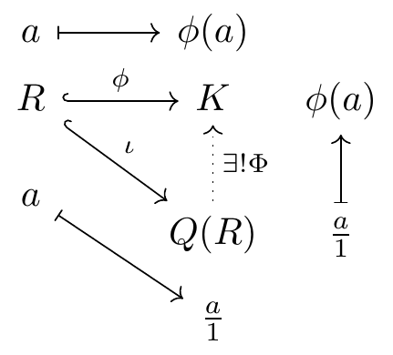
<p class="caption">(\#fig:unnamed-chunk-158)commutative diagram example 4</p>
</div>
:::
::::::

if not using `tikz-cd`,

:::::: {.cols data-latex=""}
::: {.col data-latex="{0.45\textwidth}"}

```tex
\usetikzlibrary{arrows,positioning}
\begin{tikzpicture}
\node (r) at (0,0) {$R$};
\node (k) at (3,0) {$K$};
\node (q) at (3,-3) {$Q(R)$};
\node (ra) at (0,.8) {$a$};
\node (ka) at (3,.8) {$\phi(a)$};
\node (kb) at (4,0) {$\phi(k)$};
\node (qb) at (4,-3) {$\frac a1$};
\path (q) node[below left=1em and 1em] (qc) {$\frac a1$};
\path (r) node[below left=1em and 1em] (rc) {$a$};
\draw[right hook->] (r)--(k) node[midway,above] {$\scriptstyle\phi$};
\draw[right hook->] (r)--(q) node[midway,above right] {$\scriptstyle\iota$};
\draw[dotted,->] (q)--(k) node[midway,right] {$\scriptstyle\exists!\Phi$};
\draw[|->] (ra) edge (ka) (qb) edge (kb) (rc) edge (qc);
\end{tikzpicture}
```
:::

::: {.col data-latex="{0.10\textwidth}"}
\ 
:::

::: {.col data-latex="{0.45\textwidth}"}
<div class="figure">

<p class="caption">(\#fig:unnamed-chunk-160)commutative diagram example 4 not using tikz-cd</p>
</div>
:::
::::::

separated diagrams with `tikz-cd`,

:::::: {.cols data-latex=""}
::: {.col data-latex="{0.45\textwidth}"}

```tex
\usetikzlibrary{cd}
\begin{tikzcd}
R\ar[r, hook, "\phi"] \ar[dr, hook, "\iota"] & K &
a \ar[r, maps to,"\phi"] \ar[dr, maps to,"\iota"] & \phi(a) \\
& Q(R) \ar[u, dotted, "\exists ! \Phi"'] &
& \frac{a}{1} \ar[u, maps to,"\Phi"']
\end{tikzcd}
```
:::

::: {.col data-latex="{0.10\textwidth}"}
\ 
:::

::: {.col data-latex="{0.45\textwidth}"}
<div class="figure">

<p class="caption">(\#fig:unnamed-chunk-162)commutative diagram example 4</p>
</div>
:::
::::::

register map

https://tex.stackexchange.com/questions/510088/tikz-register-map

### put a commutative diagram in a nodepart in a tikzpicture

https://tex.stackexchange.com/questions/524955/put-a-commutative-diagram-in-a-nodepart-in-a-tikzpicture/525046#525046

## PGFplots

axis similar to matplotlib figure anatomy, see Fig: \@ref(fig:matplotlib-figure-anatomy)

https://tikz.dev/pgfplots/

https://tikz.dev/pgfplots/tutorial1

> Not so common is `\pgfplotsset{compat=1.5}` .
> A statement like this should always be used in order to (a) benefit from a more or less recent feature set and (b) avoid changes to your picture if you recompile it with a later version of pgfplots.

:::::: {.cols data-latex=""}
::: {.col data-latex="{0.45\textwidth}"}

```tex
\pgfplotsset{width=7cm,compat=1.18}
\begin{tikzpicture}
\begin{axis}[
]
    % density of Normal distribution:
    \addplot [
        red,
        domain=-3e-3:3e-3,
        samples=201,
    ]
        {exp(-x^2 / (2e-3^2)) / (1e-3 * sqrt(2*pi))};
\end{axis}
\end{tikzpicture}
```
:::

::: {.col data-latex="{0.10\textwidth}"}
\ 
:::

::: {.col data-latex="{0.45\textwidth}"}
<div class="figure">
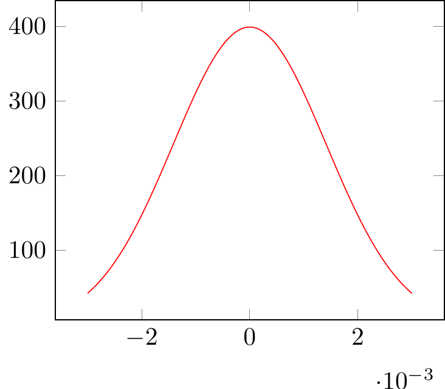
<p class="caption">(\#fig:unnamed-chunk-164)PGFplots: normal distribution</p>
</div>
:::
::::::

### the axis environments

https://tikz.dev/pgfplots/reference-axis

`\pgfplotsset{every linear axis/.append style={...}}`

:::::: {.cols data-latex=""}
::: {.col data-latex="{0.45\textwidth}"}

```tex
\begin{tikzpicture}
	\begin{axis}[
		no markers,
		axis x line = center,
		axis y line = center,
		xlabel = {$ x $}, xlabel style = {right},
		ylabel = {$ y $}, ylabel style = {above},
		xmin = -8, xmax = 8,
		ymin = 0, ymax = 0.45,
		hide obscured x ticks=false, % for origin x tick label i.e. xtick = {0}
		xtick={-4, 0,  4},
		xticklabels={$ \mu_{\scriptscriptstyle{1}} $, 
					$ \mu_{\scriptscriptstyle{0}} $, 
					$ \mu_{\scriptscriptstyle{1}} $},
		%extra x ticks={0},
		ytick = \empty,
		x = 1cm, y = 5cm, % x y scaling
		%grid = major,
		domain = -10:10,
		samples = 1000		
	]
  \end{axis}
\end{tikzpicture}
```
:::

::: {.col data-latex="{0.10\textwidth}"}
\ 
:::

::: {.col data-latex="{0.45\textwidth}"}
<div class="figure">

<p class="caption">(\#fig:unnamed-chunk-166)begin{axis}</p>
</div>
:::
::::::

https://tex.stackexchange.com/questions/134959/axis-lines-middle-and-axis-lines-center

> No, there is no difference.

### axis descriptions

https://tikz.dev/pgfplots/reference-axisdescription

#### placement of axis descriptions

##### coordinate system `axis description cs`

https://tikz.dev/pgfplots/reference-axisdescription#pgfp.axis_description_cs

`\addplot {x};` can change to `\addplot {x^2};` still with auto blue dots

`small dot style,pin=angle:LaTeX label   at PGFplots axis coordinate system  ;`

:::::: {.cols data-latex=""}
::: {.col data-latex="{0.45\textwidth}"}

```tex
\begin{tikzpicture}
    \tikzset{
        every pin/.style={fill=yellow!50!white,rectangle,rounded corners=3pt,font=\tiny},
        small dot/.style={fill=black,circle,scale=0.3},
    }
    \begin{axis}[
        clip=false,
        title=How \texttt{axis description cs} works,
    ]
        \addplot {x};
        %small dot style,pin=angle:LaTeX label   at PGFplots axis coordinate system  ;
        \node [small dot,pin=120:{$(0,0)$}]      at (axis description cs:0,0)      {};
        \node [small dot,pin=-30:{$(1,1)$}]      at (axis description cs:1,1)      {};
        \node [small dot,pin=-90:{$(1.03,0.5)$}] at (axis description cs:1.03,0.5) {};
        \node [small dot,pin=125:{$(0.5,0.5)$}]  at (axis description cs:0.5,0.5)  {};
    \end{axis}
\end{tikzpicture}
```
:::

::: {.col data-latex="{0.10\textwidth}"}
\ 
:::

::: {.col data-latex="{0.45\textwidth}"}
<div class="figure">

<p class="caption">(\#fig:unnamed-chunk-168)PGFplots: $x$</p>
</div>
:::
::::::

***

:::::: {.cols data-latex=""}
::: {.col data-latex="{0.45\textwidth}"}

```tex
\begin{tikzpicture}
    \tikzset{
        every pin/.style={fill=yellow!50!white,rectangle,rounded corners=3pt,font=\tiny},
        small dot/.style={fill=black,circle,scale=0.3},
    }
    \begin{axis}[
        clip=false,
        title=How \texttt{axis description cs} works,
    ]
        \addplot {x^2};
        %small dot style,pin=angle:LaTeX label   at PGFplots axis coordinate system  ;
        \node [small dot,pin=120:{$(0,0)$}]      at (axis description cs:0,0)      {};
        \node [small dot,pin=-30:{$(1,1)$}]      at (axis description cs:1,1)      {};
        \node [small dot,pin=-90:{$(1.03,0.5)$}] at (axis description cs:1.03,0.5) {};
        \node [small dot,pin=125:{$(0.5,0.5)$}]  at (axis description cs:0.5,0.5)  {};
    \end{axis}
\end{tikzpicture}
```
:::

::: {.col data-latex="{0.10\textwidth}"}
\ 
:::

::: {.col data-latex="{0.45\textwidth}"}
<div class="figure">

<p class="caption">(\#fig:unnamed-chunk-170)PGFplots: $x^2$</p>
</div>
:::
::::::

##### legend

https://tikz.dev/pgfplots/reference-axisdescription#sec-4.9.4

##### tick option

https://tikz.dev/pgfplots/reference-tickoptions

### `declare function`

https://tikz.dev/pgfplots/utility-commands#pgf/declare_function

:::::: {.cols data-latex=""}
::: {.col data-latex="{0.45\textwidth}"}

```tex
\begin{tikzpicture}
\begin{axis}[
    declare function={
        C=4;
        square(\t)=(\t)^2 + C;
        },
    ]
    \addplot+ [samples=2] {C*x};
    \addplot {square(x)};
\end{axis}
\end{tikzpicture}
```
:::

::: {.col data-latex="{0.10\textwidth}"}
\ 
:::

::: {.col data-latex="{0.45\textwidth}"}
<div class="figure">

<p class="caption">(\#fig:unnamed-chunk-172)declare function</p>
</div>
:::
::::::

#### `pgfmathparse`

https://tikz.dev/math-parsing

https://tikz.dev/math-parsing#sec-94.1

> This macro parses <expression> and returns the result without units in the macro \pgfmathresult.
> Example: `\pgfmathparse{2pt+3.5pt}` will set `\pgfmathresult` to the text `5.5`.

`\pgfmathsqrt{x}` = `\pgfmathparse{sqrt(x)}`

`\pgfmathln{x}` = `\pgfmathparse{ln(x)}`

...

#### `pgfmathdeclarefunction`

like `pgfplotsinvokeforeach`

> replaces any occurrence of `#1` inside of (math image)command(math image) once for every element in (math image)list(math image). Thus, it actually assumes that (math image)command(math image) is like a `\newcommand` body.

```
% pgfmathdeclarefunction{name}{num_var}{%
%% #1 = \mu, #2 = \sigma
\pgfmathdeclarefunction{gauss}{2}{%
	\pgfmathparse{1/(#2*sqrt(2*pi))*exp(-((x-#1)^2)/(2*#2^2))}%
}
```


```tex
% pgfmathdeclarefunction{name}{num_var}{%
%% #1 = \mu, #2 = \sigma
\pgfmathdeclarefunction{gauss}{2}{%
	\pgfmathparse{1/(#2*sqrt(2*pi))*exp(-((x-#1)^2)/(2*#2^2))}%
}

\begin{tikzpicture}
	\begin{axis}[
		no markers,
		axis x line = center,
		axis y line = center,
		xlabel = {$ x $}, xlabel style = {right},
		ylabel = {$ y $}, ylabel style = {above},
		xmin = -8, xmax = 8,
		ymin = 0, ymax = 0.45,
		hide obscured x ticks=false, % for origin x tick label i.e. xtick = {0}
		xtick={-4, 0,  4},
		xticklabels={$ \mu_{\scriptscriptstyle{1}} $, 
					$ \mu_{\scriptscriptstyle{0}} $, 
					$ \mu_{\scriptscriptstyle{1}} $},
		%extra x ticks={0},
		ytick = \empty,
		x = 1cm, y = 5cm, % x y scaling
		%grid = major,
		domain = -10:10,
		samples = 1000		
	]
		\addplot [fill=cyan!20, draw=none, domain=-10:-2] {gauss(-4, 1)} \closedcycle;
		\addplot [fill=cyan!20, draw=none, domain=   2:10] {gauss( 4, 1)} \closedcycle;
		\addplot [very thick, cyan!50!black] {gauss(-4, 1)};
		\addplot [very thick, cyan!50!black] {gauss( 0, 1)};
		\addplot [very thick, cyan!50!black] {gauss( 4, 1)};
		%\node [anchor=north] at (axis cs: 0, -0.01) {$ \mu $};
		%\node at (axis cs: -4, -0.02) {$ \mu $};
		\draw [dashed, thin] (axis cs: -4, 0) -- (axis cs: -4, 1);
		\draw [dashed, thin] (axis cs:  4, 0) -- (axis cs: 4, 1);
	\end{axis}
\end{tikzpicture}
```

<div class="figure">

<p class="caption">(\#fig:unnamed-chunk-174)PGFmathDeclareFunction: normal distributions hypothesis testing</p>
</div>

https://tex.stackexchange.com/questions/43610/plotting-bell-shaped-curve-in-tikz-pgf


```tex
% pgfmathdeclarefunction{name}{num_var}{%
%% #1 = \mu, #2 = \sigma
\pgfmathdeclarefunction{gauss}{2}{%
  \pgfmathparse{1/(#2*sqrt(2*pi))*exp(-((x-#1)^2)/(2*#2^2))}%
}

\begin{tikzpicture}
\begin{axis}[
  no markers, domain=0:10, samples=100,
  axis lines*=left, xlabel=$x$, ylabel=$y$,
  every axis y label/.style={at=(current axis.above origin),anchor=south},
  every axis x label/.style={at=(current axis.right of origin),anchor=west},
  height=5cm, width=12cm,
  xtick={4,6.5}, ytick=\empty,
  enlargelimits=false, clip=false, axis on top,
  grid = major
  ]
  \addplot [fill=cyan!20, draw=none, domain=0:5.96] {gauss(6.5,1)} \closedcycle;
  \addplot [very thick,cyan!50!black] {gauss(4,1)};
  \addplot [very thick,cyan!50!black] {gauss(6.5,1)};
  \draw [yshift=-0.6cm, latex-latex](axis cs:4,0) -- node [fill=white] {$1.96\sigma$} (axis cs:5.96,0);
\end{axis}

\end{tikzpicture}
```

<div class="figure">

<p class="caption">(\#fig:unnamed-chunk-176)PGFmathDeclareFunction: normal distributions</p>
</div>

### `|-` and `-|` in TikZ

https://tex.stackexchange.com/questions/401425/tikz-what-exactly-does-the-the-notation-for-arrows-do

> `(a -| b)` where `a` and `b` are named nodes or coordinates. This means the coordinate that is at the y-coordinate of `a`, and x-coordinate of `b`. Similarly, `(a |- b)` has the x-coordinate of `a` and y-coordinate of `b`.

### `pgfplotsinvokeforeach`

https://tikz.dev/pgfplots/pgfplotstable-miscellaneous#\pgfplotsinvokeforeach

like `\foreach` in TikZ

> A variant of `\pgfplotsforeachungrouped` (and such also of `\foreach`) which replaces any occurrence of `#1` inside of (math image)command(math image) once for every element in (math image)list(math image). Thus, it actually assumes that (math image)command(math image) is like a `\newcommand` body.

### interpolation dashed lines

https://tex.stackexchange.com/questions/193259/what-is-the-easiest-way-to-accomplish-textual-tick-labels-in-tikz

`interpa = (10,10), interpb = (30,30), interp = interpolation`

`({axis cs:0,0}|-interp#1) = (x of (0,0), y of (interpa)) = (0, 10), ...`

:::::: {.cols data-latex=""}
::: {.col data-latex="{0.45\textwidth}"}

```tex
\begin{tikzpicture}
\begin{axis}[
    axis lines=left,
    xmin = 0, xmax = 40,
    ymin = 0, ymax = 40,
    xtick={10,30},
    xticklabels={$V_i=10$,$V_f=30$},
    ytick={10,30},
    yticklabels={$P_i=10$,$P_f=30$},
    xlabel={Volume},
    ylabel={Pressure}
  ]
  \addplot[very thick,-latex ] coordinates{(10,10) (30,30)}
    % interpa = (10,10), interpb = (30,30), interp = interpolation
    coordinate[at start](interpa)coordinate[at end](interpb);
  \pgfplotsinvokeforeach {a,b} {
    \draw[ultra thin, dashed]
      % ({axis cs:0,0}|-interp#1) = (x of (0,0), y of (interpa)) = (0, 10), ...
      ({axis cs:0,0}|-interp#1)--(interp#1)--(interp#1|-{axis cs:0,0});
    }
\end{axis}
\end{tikzpicture}
```
:::

::: {.col data-latex="{0.10\textwidth}"}
\ 
:::

::: {.col data-latex="{0.45\textwidth}"}
<div class="figure">

<p class="caption">(\#fig:unnamed-chunk-178)tick texts and interpolation dashed lines</p>
</div>
:::
::::::

### Zewbie

https://zhuanlan.zhihu.com/p/551874337

axis similar to matplotlib figure anatomy, see Fig: \@ref(fig:matplotlib-figure-anatomy)

#### coordinate axis/axes fine-tuing

:::::: {.cols data-latex=""}
::: {.col data-latex="{0.45\textwidth}"}

```tex
\begin{tikzpicture}
    \begin{axis}
        % empty
    \end{axis}
\end{tikzpicture}
```
:::

::: {.col data-latex="{0.10\textwidth}"}
\ 
:::

::: {.col data-latex="{0.45\textwidth}"}
<div class="figure">
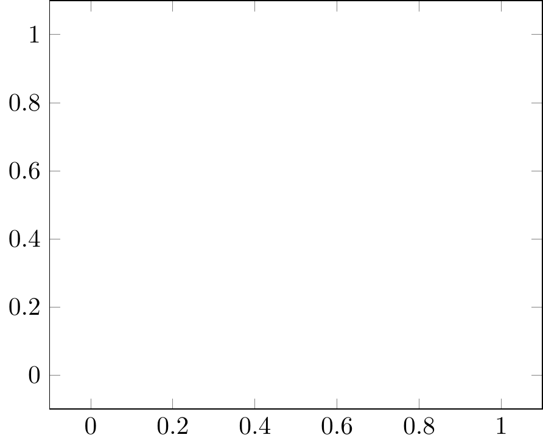
<p class="caption">(\#fig:unnamed-chunk-180)PGFplots: 2D axis/axes</p>
</div>
:::
::::::

##### range

***

:::::: {.cols data-latex=""}
::: {.col data-latex="{0.45\textwidth}"}

```tex
\begin{tikzpicture}
    \begin{axis}[
        xmin = -1, xmax = 11,
        ymin = -3, ymax = 1,
    ]
        % empty
    \end{axis}
\end{tikzpicture}
```
:::

::: {.col data-latex="{0.10\textwidth}"}
\ 
:::

::: {.col data-latex="{0.45\textwidth}"}
<div class="figure">
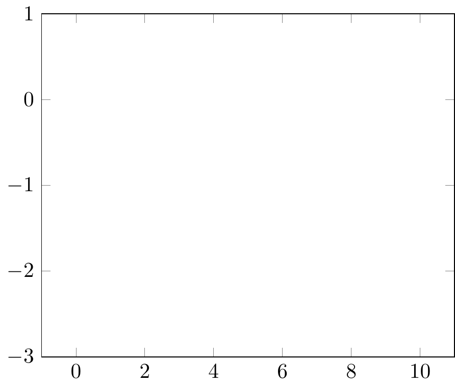
<p class="caption">(\#fig:unnamed-chunk-182)PGFplots: axis/axes range</p>
</div>
:::
::::::

##### scaling

`axis equal image` equivalent to `unit vector ratio = {1 1 1}`

:::::: {.cols data-latex=""}
::: {.col data-latex="{0.45\textwidth}"}

```tex
\begin{tikzpicture}
    \begin{axis}[
        xmin = -1, xmax = 11,
        ymin = -3, ymax = 1,
        axis equal image, % unit vector ratio = {1 1 1},
    ]
        % empty
    \end{axis}
\end{tikzpicture}
```
:::

::: {.col data-latex="{0.10\textwidth}"}
\ 
:::

::: {.col data-latex="{0.45\textwidth}"}
<div class="figure">

<p class="caption">(\#fig:unnamed-chunk-184)PGFplots: axis/axes range</p>
</div>
:::
::::::

***

`scale only axis`

`width` x axis length, `height` y axis length

:::::: {.cols data-latex=""}
::: {.col data-latex="{0.45\textwidth}"}

```tex
\begin{tikzpicture}
    \begin{axis}[
        xmin = -1, xmax = 11,
        ymin = -3, ymax = 1,
        scale only axis,
        width = 5cm, height = 7cm,
    ]
        % empty
    \end{axis}
\end{tikzpicture}
```
:::

::: {.col data-latex="{0.10\textwidth}"}
\ 
:::

::: {.col data-latex="{0.45\textwidth}"}
<div class="figure">

<p class="caption">(\#fig:unnamed-chunk-186)PGFplots: axis/axes range</p>
</div>
:::
::::::

***

`x` x unit vector length, `y` y unit vector length

:::::: {.cols data-latex=""}
::: {.col data-latex="{0.45\textwidth}"}

```tex
\begin{tikzpicture}
    \begin{axis}[
        xmin = -1, xmax = 11,
        ymin = -3, ymax = 1,
        x = 1cm, y = 1cm,
    ]
        % empty
    \end{axis}
\end{tikzpicture}
```
:::

::: {.col data-latex="{0.10\textwidth}"}
\ 
:::

::: {.col data-latex="{0.45\textwidth}"}
<div class="figure">

<p class="caption">(\#fig:unnamed-chunk-188)PGFplots: axis/axes range</p>
</div>
:::
::::::

##### direction vector

***

:::::: {.cols data-latex=""}
::: {.col data-latex="{0.45\textwidth}"}

```tex
\begin{tikzpicture}
    \begin{axis}[
        xmin = -1, xmax = 11,
        ymin = -3, ymax = 1,
        x={(.2cm,-.1cm)}, y={(.5cm,.5cm)},
    ]
        % empty
    \end{axis}
\end{tikzpicture}
```
:::

::: {.col data-latex="{0.10\textwidth}"}
\ 
:::

::: {.col data-latex="{0.45\textwidth}"}
<div class="figure">
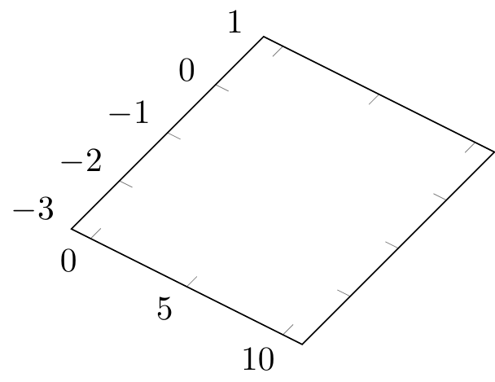
<p class="caption">(\#fig:unnamed-chunk-190)PGFplots: axis/axes range</p>
</div>
:::
::::::

***

`unit vector ratio = {1 1}`

:::::: {.cols data-latex=""}
::: {.col data-latex="{0.45\textwidth}"}

```tex
\begin{tikzpicture}
    \begin{axis}[
        xmin = -1, xmax = 11,
        ymin = -3, ymax = 1,
        unit vector ratio = {1 1},
    ]
        % empty
    \end{axis}
\end{tikzpicture}
```
:::

::: {.col data-latex="{0.10\textwidth}"}
\ 
:::

::: {.col data-latex="{0.45\textwidth}"}
<div class="figure">

<p class="caption">(\#fig:unnamed-chunk-192)PGFplots: axis/axes range</p>
</div>
:::
::::::

##### axis style

`axis lines` to assign all axes, either `axis lines = box`(default), `axis lines = center`(axis lines with arrows, `center`, x: `bottom`, `top`, y: ), or `axis lines = none`(not shown), or even axis lines wihtout arrows `axis lines *= center`

`axis x line`, `axis y line` to assign the respect axis, e.g. `axis x line = center`

`axis lines = center`:

:::::: {.cols data-latex=""}
::: {.col data-latex="{0.45\textwidth}"}

```tex
\begin{tikzpicture}
    \begin{axis}[
        axis lines = center,
        xmin = -1, xmax = 11,
        ymin = -3, ymax = 1,
    ]
        % empty
    \end{axis}
\end{tikzpicture}
```
:::

::: {.col data-latex="{0.10\textwidth}"}
\ 
:::

::: {.col data-latex="{0.45\textwidth}"}
<div class="figure">

<p class="caption">(\#fig:unnamed-chunk-194)PGFplots: axis/axes range</p>
</div>
:::
::::::

`axis lines *= center`:

x axis line without arrow, y axis box

:::::: {.cols data-latex=""}
::: {.col data-latex="{0.45\textwidth}"}

```tex
\begin{tikzpicture}
    \begin{axis}[
        axis x line* = center, % x axis line without arrow, y axis box
        xmin = -1, xmax = 11,
        ymin = -3, ymax = 1,
    ]
        % empty
    \end{axis}
\end{tikzpicture}
```
:::

::: {.col data-latex="{0.10\textwidth}"}
\ 
:::

::: {.col data-latex="{0.45\textwidth}"}
<div class="figure">

<p class="caption">(\#fig:unnamed-chunk-196)PGFplots: axis/axes range</p>
</div>
:::
::::::

***

x axis line with arrow, y axis line without arrow

:::::: {.cols data-latex=""}
::: {.col data-latex="{0.45\textwidth}"}

```tex
\begin{tikzpicture}
    \begin{axis}[
        axis x line = center, % x axis line with arrow
        axis y line* = center, % y axis line without arrow
        xmin = -1, xmax = 11,
        ymin = -3, ymax = 1,
    ]
        % empty
    \end{axis}
\end{tikzpicture}
```
:::

::: {.col data-latex="{0.10\textwidth}"}
\ 
:::

::: {.col data-latex="{0.45\textwidth}"}
<div class="figure">

<p class="caption">(\#fig:unnamed-chunk-198)PGFplots: axis/axes range</p>
</div>
:::
::::::

##### axis discontinuity

`crunch`, `parallel`, `none`

`crunch`

:::::: {.cols data-latex=""}
::: {.col data-latex="{0.45\textwidth}"}

```tex
\begin{tikzpicture}
    \begin{axis}[
        axis x line = bottom,
        axis y line = center,
        xmin = -2, xmax = 10,
        ymin =  0, ymax = 12,
        axis y discontinuity = crunch,
    ]
        % empty
    \end{axis}
\end{tikzpicture}
```
:::

::: {.col data-latex="{0.10\textwidth}"}
\ 
:::

::: {.col data-latex="{0.45\textwidth}"}
<div class="figure">

<p class="caption">(\#fig:unnamed-chunk-200)PGFplots: axis/axes range</p>
</div>
:::
::::::

***

`parallel`

:::::: {.cols data-latex=""}
::: {.col data-latex="{0.45\textwidth}"}

```tex
\begin{tikzpicture}
    \begin{axis}[
        axis x line = bottom,
        axis y line = center,
        xmin = -2, xmax = 10,
        ymin =  0, ymax = 12,
        axis y discontinuity = parallel,
    ]
        % empty
    \end{axis}
\end{tikzpicture}
```
:::

::: {.col data-latex="{0.10\textwidth}"}
\ 
:::

::: {.col data-latex="{0.45\textwidth}"}
<div class="figure">

<p class="caption">(\#fig:unnamed-chunk-202)PGFplots: axis/axes range</p>
</div>
:::
::::::

##### tick

`tick pos` `ticklabel pos`

:::::: {.cols data-latex=""}
::: {.col data-latex="{0.45\textwidth}"}

```tex
\begin{tikzpicture}
    \begin{axis}[
        xtick pos = upper,
        yticklabel pos = upper,
    ]
        % empty
    \end{axis}
\end{tikzpicture}
```
:::

::: {.col data-latex="{0.10\textwidth}"}
\ 
:::

::: {.col data-latex="{0.45\textwidth}"}
<div class="figure">

<p class="caption">(\#fig:unnamed-chunk-204)PGFplots: axis/axes range</p>
</div>
:::
::::::

***

`tick distance`

`tick align`: `inside`, `center`, `outside`

:::::: {.cols data-latex=""}
::: {.col data-latex="{0.45\textwidth}"}

```tex
\begin{tikzpicture}
    \begin{axis}[
        axis lines=center,
        xmin=-1,xmax=3,
        ymin=-3,ymax=3,
        xtick distance=.8,
        ytick distance=1.1,
        tick align=inside,
    ]
        % empty
    \end{axis}
\end{tikzpicture}
```
:::

::: {.col data-latex="{0.10\textwidth}"}
\ 
:::

::: {.col data-latex="{0.45\textwidth}"}
<div class="figure">

<p class="caption">(\#fig:unnamed-chunk-206)PGFplots: axis/axes range</p>
</div>
:::
::::::

***

`minor tick num`

:::::: {.cols data-latex=""}
::: {.col data-latex="{0.45\textwidth}"}

```tex
\begin{tikzpicture}
    \begin{axis}[
        axis y line=none,axis x line=center,
        ymin=0,ymax=0,xmin=-3,xmax=3,
        xtick distance=2,tick align=inside,
        minor tick num=2,
    ]
        % empty
    \end{axis}
\end{tikzpicture}
```
:::

::: {.col data-latex="{0.10\textwidth}"}
\ 
:::

::: {.col data-latex="{0.45\textwidth}"}
<div class="figure">
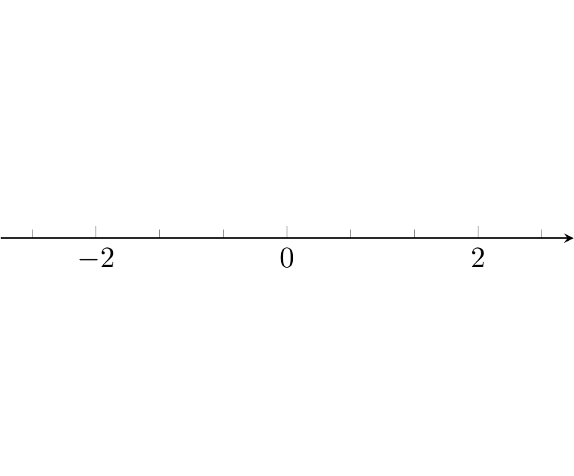
<p class="caption">(\#fig:unnamed-chunk-208)PGFplots: axis/axes range</p>
</div>
:::
::::::

***

`xtick=\empty|data|{<coordinates>}`

:::::: {.cols data-latex=""}
::: {.col data-latex="{0.45\textwidth}"}

```tex
\begin{tikzpicture}
    \begin{axis}[
        axis y line=none,axis x line=center,
        ymin=0,ymax=0,xmin=-3,xmax=3,
        xtick={-2.5,0,1},minor xtick={1/3,2/3},
        tick align=inside,
        ]
        % empty
    \end{axis}
\end{tikzpicture}
```
:::

::: {.col data-latex="{0.10\textwidth}"}
\ 
:::

::: {.col data-latex="{0.45\textwidth}"}
<div class="figure">

<p class="caption">(\#fig:unnamed-chunk-210)PGFplots: axis/axes range</p>
</div>
:::
::::::

***

`extra x ticks={<coordinates>}`

:::::: {.cols data-latex=""}
::: {.col data-latex="{0.45\textwidth}"}

```tex
\begin{tikzpicture}
    \begin{axis}[
        axis y line=none,axis x line=center,
        ymin=0,ymax=0,xmin=-2.3,xmax=4.9,
        xtick distance=2,minor tick num=1,
        extra x ticks={e,pi},
        extra x tick labels={$e$,$\pi$},
        tick align=inside,
    ]
        % empty
    \end{axis}
\end{tikzpicture}
```
:::

::: {.col data-latex="{0.10\textwidth}"}
\ 
:::

::: {.col data-latex="{0.45\textwidth}"}
<div class="figure">

<p class="caption">(\#fig:unnamed-chunk-212)PGFplots: axis/axes range</p>
</div>
:::
::::::

***

`ticklabels={<labels>}` `extra x tick labels={<labels>}`

`hide obscured x ticks = false` for origin x tick label

:::::: {.cols data-latex=""}
::: {.col data-latex="{0.45\textwidth}"}

```tex
\begin{tikzpicture}
    \begin{axis}[
        axis y line=none,axis x line=center,
        ymin=0,ymax=0,xmin=-2.3*pi,xmax=2.3*pi,
        xtick distance=pi,
        xticklabels={$-2\pi$,$-\pi$,$0$,$\pi$,$2\pi$},
    ]
        % empty
    \end{axis}
\end{tikzpicture}
```
:::

::: {.col data-latex="{0.10\textwidth}"}
\ 
:::

::: {.col data-latex="{0.45\textwidth}"}
<div class="figure">

<p class="caption">(\#fig:unnamed-chunk-214)PGFplots: axis/axes range</p>
</div>
:::
::::::

#### `addplot+`

> What does addplot+ do exactly?

https://tex.stackexchange.com/questions/275959/what-does-addplot-do-exactly

https://tikz.dev/pgfplots/reference-addplot#\addplot+

> Every `\addplot` directive receives a pre-defined style (line color, marker style etc) through a pre-defined cycle list that is automatically chosen depending on the index of the current `\addplot` instruction. If you want to add some of your styles manually (like I want red colour instead of blue, say), you can add them through options to `\addplot` like `\addplot[<your options>]`. Now the question is whether you want your own style (your options) to be appended to or replace one of these cycle lists assigned. This is decided by the + sign. If you use `\addplot+ [<your options>]`, your style is appended to and by `\addplot[<your options>]` , your options will replace the assigned cycle list.

#### point

`only marks` only points without lines

zero y axis range `ymin=0, ymax=0` and `axis y line=none`, making 1D x axis

:::::: {.cols data-latex=""}
::: {.col data-latex="{0.45\textwidth}"}

```tex
\begin{tikzpicture}
    \begin{axis}[ 
        xlabel=$x$,
        axis y line=none,
        axis x line=center,
        tick align=inside,
        xmin=-1.5, xmax=4.9, ymin=0, ymax=0,
        xtick distance=1,
        x=1cm
        ]
        \addplot+ coordinates {(e,0)}
            node [pin=90:{$e$}] {};
        \addplot+ coordinates {(pi,0)}
            node [pin=90:{$\pi$}] {};
        \addplot+ coordinates {(-1,0)};
    \end{axis}
\end{tikzpicture}
```
:::

::: {.col data-latex="{0.10\textwidth}"}
\ 
:::

::: {.col data-latex="{0.45\textwidth}"}
<div class="figure">

<p class="caption">(\#fig:unnamed-chunk-216)PGFplots: 1D points with pins</p>
</div>
:::
::::::

***

:::::: {.cols data-latex=""}
::: {.col data-latex="{0.45\textwidth}"}

```tex
\begin{tikzpicture}
    \begin{axis}[
        xlabel=$x$, ylabel=$y$,
        axis lines=center,
        tick align=inside,
        xmin=-1.5, xmax=4.9, ymin=-3.3, ymax=3.9,
        xtick distance=1, ytick distance=1,
        axis equal image
        ]
        \addplot+ [only marks] coordinates {
            (-1,-2) (pi,pi/4) (3,2) (0,0)};
        \addplot+ coordinates {(2,1)};
        \addplot+ coordinates {(3,-2)};
    \end{axis}
\end{tikzpicture}
```
:::

::: {.col data-latex="{0.10\textwidth}"}
\ 
:::

::: {.col data-latex="{0.45\textwidth}"}
<div class="figure">

<p class="caption">(\#fig:unnamed-chunk-218)PGFplots: 2D points</p>
</div>
:::
::::::

***

:::::: {.cols data-latex=""}
::: {.col data-latex="{0.45\textwidth}"}

```tex
\begin{tikzpicture}
    \begin{axis}[axis equal image]
        \addplot+ [only marks]
            table [x=xdata,y=ydata] {data/func.dat};
    \end{axis}
\end{tikzpicture}
```
:::

::: {.col data-latex="{0.10\textwidth}"}
\ 
:::

::: {.col data-latex="{0.45\textwidth}"}
<div class="figure">

<p class="caption">(\#fig:unnamed-chunk-220)PGFplots: data points</p>
</div>
:::
::::::

***

`axis equal image` to fix aspect ratio 1:1

:::::: {.cols data-latex=""}
::: {.col data-latex="{0.45\textwidth}"}

```tex
\begin{tikzpicture}
    \begin{axis}[title=5 sampling points,
        xlabel=$x$,ylabel=$y$,
        axis equal image]
        \addplot+ [only marks,domain=-2:2,samples=5]
            {x^2};
    \end{axis}
\end{tikzpicture}
```
:::

::: {.col data-latex="{0.10\textwidth}"}
\ 
:::

::: {.col data-latex="{0.45\textwidth}"}
<div class="figure">

<p class="caption">(\#fig:unnamed-chunk-222)PGFplots: function sampling 5 points</p>
</div>
:::
::::::

***

:::::: {.cols data-latex=""}
::: {.col data-latex="{0.45\textwidth}"}

```tex
\begin{tikzpicture}
    \begin{axis}[title=55 sampling points,
        xlabel=$x$,ylabel=$y$,
        axis equal image]
        \addplot+ [only marks,domain=-2:2,samples=55]
            {x^2};
    \end{axis}
\end{tikzpicture}
```
:::

::: {.col data-latex="{0.10\textwidth}"}
\ 
:::

::: {.col data-latex="{0.45\textwidth}"}
<div class="figure">

<p class="caption">(\#fig:unnamed-chunk-224)PGFplots: function sampling 55 points</p>
</div>
:::
::::::

***

:::::: {.cols data-latex=""}
::: {.col data-latex="{0.45\textwidth}"}

```tex
\begin{tikzpicture}
    \begin{axis}[
        trig format plots=rad,  % angle in radian
        axis equal image]
        \addplot+ [only marks,variable=t,domain=0:pi*3/2,
            samples=20] ({cos(t)},{sin(t)});
    \end{axis}
\end{tikzpicture}
```
:::

::: {.col data-latex="{0.10\textwidth}"}
\ 
:::

::: {.col data-latex="{0.45\textwidth}"}
<div class="figure">

<p class="caption">(\#fig:unnamed-chunk-226)PGFplots: parametric function sampling</p>
</div>
:::
::::::

***

:::::: {.cols data-latex=""}
::: {.col data-latex="{0.45\textwidth}"}

```tex
\begin{tikzpicture}
    \begin{axis}[
        xlabel=$x$,ylabel=$y$,zlabel=$z$,
        axis lines=center,
        tick align=inside,
        xmin=-1.5,xmax=3.9,
        ymin=-1.5,ymax=3.9,
        zmin=-0.5,zmax=3.9,
        xtick distance=1,
        ytick distance=1,
        ztick distance=1,
        % width=10cm,
        % scale only axis,
        view={120}{30},  % perspective angle
        axis equal image,]
        \addplot3+ coordinates{(1,0,0)};
        \addplot3+ coordinates{(0,1,0)};
        \addplot3+ coordinates{(0,0,1)};
    \end{axis}
\end{tikzpicture}
```
:::

::: {.col data-latex="{0.10\textwidth}"}
\ 
:::

::: {.col data-latex="{0.45\textwidth}"}
<div class="figure">

<p class="caption">(\#fig:unnamed-chunk-228)PGFplots: 3D points</p>
</div>
:::
::::::

***

:::::: {.cols data-latex=""}
::: {.col data-latex="{0.45\textwidth}"}

```tex
\begin{tikzpicture}
    \begin{axis}[
        xlabel=$x$,ylabel=$y$,zlabel=$z$,
        grid=major
        ]
        \addplot3+ [only marks] {x^2+y^2};
    \end{axis}
\end{tikzpicture}
```
:::

::: {.col data-latex="{0.10\textwidth}"}
\ 
:::

::: {.col data-latex="{0.45\textwidth}"}
<div class="figure">

<p class="caption">(\#fig:unnamed-chunk-230)PGFplots: 3D function sampling points</p>
</div>
:::
::::::

#### line

:::::: {.cols data-latex=""}
::: {.col data-latex="{0.45\textwidth}"}

```tex
\begin{tikzpicture}
    \begin{axis}[ytick=data]
        \addplot coordinates {
            (1,0.15) (2,0.21) (3,0.33) (4,0.4)

            (2.5,.1) (3.5,.1)
        };
    \end{axis}
\end{tikzpicture}
```
:::

::: {.col data-latex="{0.10\textwidth}"}
\ 
:::

::: {.col data-latex="{0.45\textwidth}"}
<div class="figure">
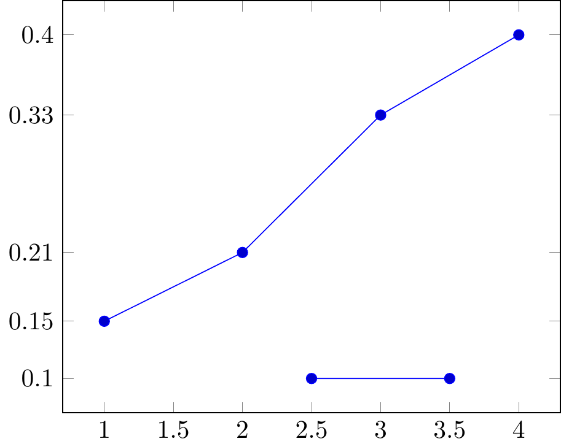
<p class="caption">(\#fig:unnamed-chunk-232)lines connecting adjacent points</p>
</div>
:::
::::::

***

`smooth` to make smooth curves or lines

:::::: {.cols data-latex=""}
::: {.col data-latex="{0.45\textwidth}"}

```tex
\begin{tikzpicture}
    \begin{axis}[ytick=data]
        \addplot+ [smooth] coordinates {
            (1,0.15) (2,0.21) (3,0.33) (4,0.4)};
    \end{axis}
\end{tikzpicture}
```
:::

::: {.col data-latex="{0.10\textwidth}"}
\ 
:::

::: {.col data-latex="{0.45\textwidth}"}
<div class="figure">
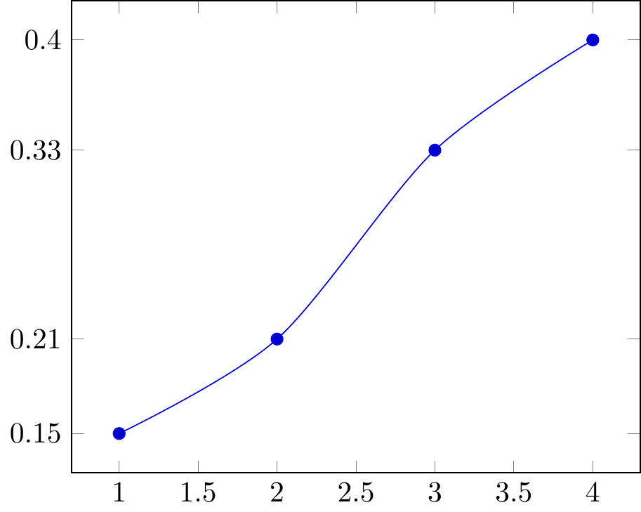
<p class="caption">(\#fig:unnamed-chunk-234)smooth lines connecting adjacent points</p>
</div>
:::
::::::

***

`no markers` to make no markers or points on the curves or lines

`\addlegendentry` to add legends

:::::: {.cols data-latex=""}
::: {.col data-latex="{0.45\textwidth}"}

```tex
\begin{tikzpicture}
    \begin{axis}[
        trig format plots=rad,
        xtick distance=pi/2, ytick distance=1,
        xticklabels={$-\pi$,$-\pi/2$,0,$\pi/2$,$\pi$},
        width=10cm, scale only axis,
        axis equal image]
        \addplot+ [domain=-pi:pi] {sin(x)};
        \addlegendentry{$\sin(x)$}
        \addplot+ [no markers,domain=-pi:pi,samples=100]
            {cos(x)};
        \addlegendentry{$\cos(x)$}
    \end{axis}
\end{tikzpicture}
```
:::

::: {.col data-latex="{0.10\textwidth}"}
\ 
:::

::: {.col data-latex="{0.45\textwidth}"}
<div class="figure">

<p class="caption">(\#fig:unnamed-chunk-236)$\sin(x)$ and $\cos(x)$</p>
</div>
:::
::::::

***

:::::: {.cols data-latex=""}
::: {.col data-latex="{0.45\textwidth}"}

```tex
\begin{tikzpicture}
    \begin{axis}[
        trig format plots=rad,
        ymax=2.3,
        axis equal image]
        \addplot+ [no markers,
                   variable=t,
                   domain=0:2*pi,
                   samples=100] ({2*cos(t)},{sin(t)});
        \node [pin=90:$\dfrac{x^2}{4}+y^2{=}1$]
        at ({2*cos(45)},{sin(45)}) {};
    \end{axis}
\end{tikzpicture}
```
:::

::: {.col data-latex="{0.10\textwidth}"}
\ 
:::

::: {.col data-latex="{0.45\textwidth}"}
<div class="figure">
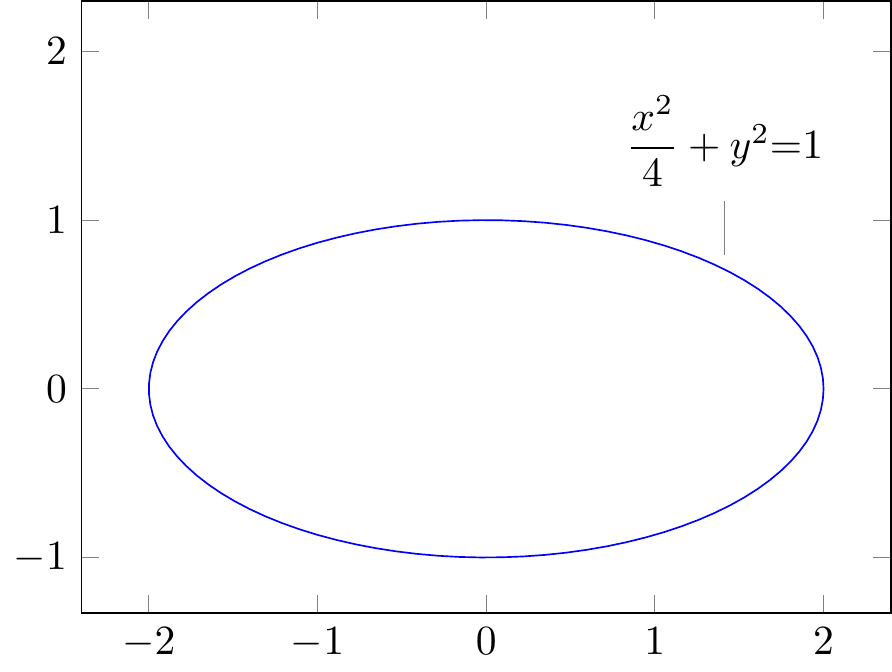
<p class="caption">(\#fig:unnamed-chunk-238)$\dfrac{x^2}{4}+y^2{=}1$</p>
</div>
:::
::::::

***

:::::: {.cols data-latex=""}
::: {.col data-latex="{0.45\textwidth}"}

```tex
\begin{tikzpicture}
    \begin{axis}[trig format plots=rad]
        \addplot3+ [variable=t,
                    domain=0:3*pi,
                    samples=100,
                    samples y=0]
            ({cos(t)},{sin(t)},{t});
    \end{axis}
\end{tikzpicture}
```
:::

::: {.col data-latex="{0.10\textwidth}"}
\ 
:::

::: {.col data-latex="{0.45\textwidth}"}
<div class="figure">

<p class="caption">(\#fig:unnamed-chunk-240)$({\cos(t)},{\sin(t)},{t})$</p>
</div>
:::
::::::

#### plane

`[mesh]`

:::::: {.cols data-latex=""}
::: {.col data-latex="{0.45\textwidth}"}

```tex
\begin{tikzpicture}
    \begin{axis}
        \addplot3+ [no markers, mesh] {x*y};
    \end{axis}
\end{tikzpicture}
```
:::

::: {.col data-latex="{0.10\textwidth}"}
\ 
:::

::: {.col data-latex="{0.45\textwidth}"}
<div class="figure">

<p class="caption">(\#fig:unnamed-chunk-242)$f(x,y)=xy$</p>
</div>
:::
::::::

***

`[surf]` surface

:::::: {.cols data-latex=""}
::: {.col data-latex="{0.45\textwidth}"}

```tex
\begin{tikzpicture}
    \begin{axis}[
        view={120}{30},
        trig format plots=rad,
        width=10cm,
        scale only axis,
        axis equal image
        ]
        \addplot3+ [no markers,
                    surf,
                    domain=0:2*pi,
                    domain y=0:pi]
            ({sin(y)*cos(x)},{sin(y)*sin(x)},{cos(y)});
    \end{axis}
\end{tikzpicture}
```
:::

::: {.col data-latex="{0.10\textwidth}"}
\ 
:::

::: {.col data-latex="{0.45\textwidth}"}
<div class="figure">

<p class="caption">(\#fig:unnamed-chunk-244)$x^2+y^2+z^2=1$</p>
</div>
:::
::::::

#### polar coordinate

`data cs=polar|polarrad`

:::::: {.cols data-latex=""}
::: {.col data-latex="{0.45\textwidth}"}

```tex
\begin{tikzpicture}
    \begin{axis}[
      title={$\rho=\cos 2\theta$},
      axis equal image
      ]
        \addplot+ [no markers,
                   data cs=polar,
                   domain=0:360,
                   samples=360
                   ] (\x,{cos(2*\x)});
    \end{axis}
\end{tikzpicture}
```
:::

::: {.col data-latex="{0.10\textwidth}"}
\ 
:::

::: {.col data-latex="{0.45\textwidth}"}
<div class="figure">
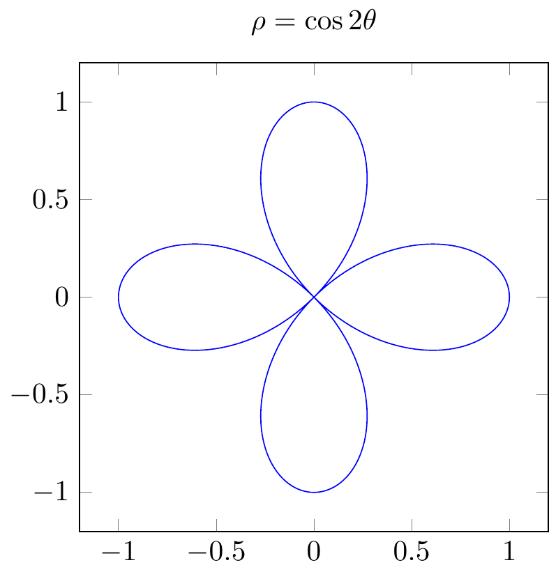
<p class="caption">(\#fig:unnamed-chunk-246)polar coordinate $\rho=\cos 2\theta$</p>
</div>
:::
::::::

***

`\usepgfplotslibrary{polar}` to use `\begin{polaraxis}`

:::::: {.cols data-latex=""}
::: {.col data-latex="{0.45\textwidth}"}

```tex
\usepgfplotslibrary{polar}
\begin{tikzpicture}
    \begin{polaraxis}
        \addplot+ coordinates
            {(0,0) (60,1) (90,{sqrt(3)/2})} -- cycle;
    \end{polaraxis}
\end{tikzpicture}
```
:::

::: {.col data-latex="{0.10\textwidth}"}
\ 
:::

::: {.col data-latex="{0.45\textwidth}"}
<div class="figure">

<p class="caption">(\#fig:unnamed-chunk-248)polar coordinate axes</p>
</div>
:::
::::::

https://zhuanlan.zhihu.com/p/128341873

### Arnav Bandekar: Using pgfplots to make economic graphs in LaTeX

https://towardsdatascience.com/using-pgfplots-to-make-economic-graphs-in-latex-bcdc8e27c0eb

### PGFplots gallery

https://pgfplots.sourceforge.net/gallery.html

:::::: {.cols data-latex=""}
::: {.col data-latex="{0.45\textwidth}"}

```tex
\begin{tikzpicture}
\begin{axis}[
	xmin=-3,   xmax=3,
	ymin=-3,   ymax=3,
	extra x ticks={-1,1},
	extra y ticks={-2,2},
	extra tick style={grid=major},
]
	\draw[red] \pgfextra{
	  \pgfpathellipse{\pgfplotspointaxisxy{0}{0}}
		{\pgfplotspointaxisdirectionxy{1}{0}}
		{\pgfplotspointaxisdirectionxy{0}{2}}
	  % see also the documentation of 
	  % 'axis direction cs' which
	  % allows a simpler way to draw this ellipse
	};
	\draw[blue] \pgfextra{
	  \pgfpathellipse{\pgfplotspointaxisxy{0}{0}}
		{\pgfplotspointaxisdirectionxy{1}{1}}
		{\pgfplotspointaxisdirectionxy{0}{2}}
	};
	\addplot [only marks,mark=*] coordinates { (0,0) };
\end{axis}
\end{tikzpicture}
```
:::

::: {.col data-latex="{0.10\textwidth}"}
\ 
:::

::: {.col data-latex="{0.45\textwidth}"}
<div class="figure">
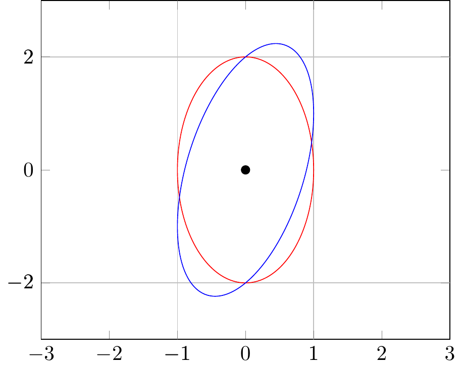
<p class="caption">(\#fig:unnamed-chunk-250)declare function</p>
</div>
:::
::::::

***

## TikZplotLib / tikzplotlib {#tikzplotlib}

[Python]^[\@ref(python)]^


```r
library(reticulate)
```

```
## Warning: package 'reticulate' was built under R version 4.3.3
```

```r
# virtualenv_list()
# virtualenv_python()
# use_virtualenv("r-reticulate")

# conda_list()
use_condaenv(condaenv = 'sandbox-3.9')

## install TikZplotLib
# virtualenv_install("r-reticulate", "tikzplotlib")

## import TikZplotLib (it will be automatically discovered in "r-reticulate")
tikzplotlib <- import("tikzplotlib")
```

```
Error: ImportError: cannot import name 'common_texification' from 'matplotlib.backends.backend_pgf' (D:\Users\115381\Documents\.virtualenvs\r-reticulate\lib\site-packages\matplotlib\backends\backend_pgf.py)
```

https://github.com/NixOS/nixpkgs/issues/289305

> The "solution" is to use **matplotlib 3.6**, but I guess in nixpkgs a single version is used at a time. The last working upgrade is from 0911608 I guess (I tried using virtualenv + pip + nix-ld + export LD_LIBRARY_PATH="$LD_LIBRARY_PATH:$NIX_LD_LIBRARY_PATH")

https://stackoverflow.com/questions/60882638/install-a-particular-version-of-python-package-in-a-virtualenv-created-with-reti


```r
#reticulate::virtualenv_install(packages = c("matplotlib==3.6.0"))
```


```r
reticulate::conda_list()
```

```
##                        name
## 1                      base
## 2                        mm
## 3                       mmr
## 4                     monai
## 5                   pytorch
## 6  pytorch_1.12.1_cuda_11.6
## 7              r-reticulate
## 8                   sandbox
## 9               sandbox-3.9
## 10          sandbox_py_3.10
## 11                      v51
##                                                                 python
## 1                                  C:\\Users\\RW\\anaconda3/python.exe
## 2                        C:\\Users\\RW\\anaconda3\\envs\\mm/python.exe
## 3                       C:\\Users\\RW\\anaconda3\\envs\\mmr/python.exe
## 4                     C:\\Users\\RW\\anaconda3\\envs\\monai/python.exe
## 5                   C:\\Users\\RW\\anaconda3\\envs\\pytorch/python.exe
## 6  C:\\Users\\RW\\anaconda3\\envs\\pytorch_1.12.1_cuda_11.6/python.exe
## 7              C:\\Users\\RW\\anaconda3\\envs\\r-reticulate/python.exe
## 8                   C:\\Users\\RW\\anaconda3\\envs\\sandbox/python.exe
## 9               C:\\Users\\RW\\anaconda3\\envs\\sandbox-3.9/python.exe
## 10          C:\\Users\\RW\\anaconda3\\envs\\sandbox_py_3.10/python.exe
## 11                      C:\\Users\\RW\\anaconda3\\envs\\v51/python.exe
```

```r
reticulate::use_condaenv(condaenv = 'sandbox-3.9')
```


```python
import matplotlib.pyplot as plt

plt.plot([0, 2, 1, 4])
plt.show()
```

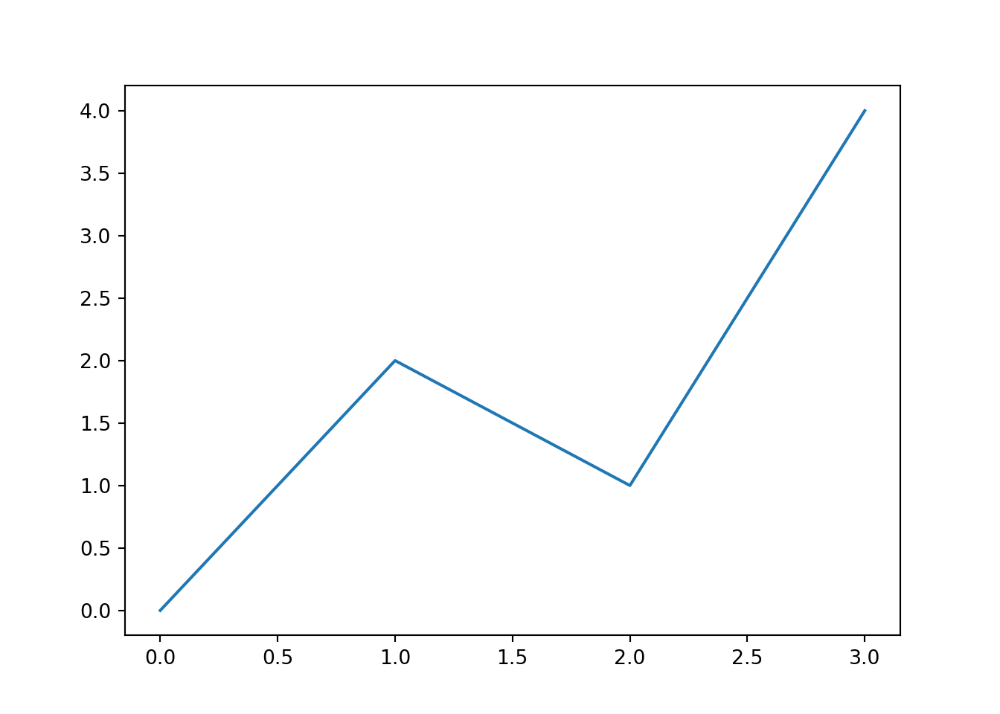

```python
import tikzplotlib

# tikzplotlib.save("test.tex")
tikzplotlib.get_tikz_code()
```

```
## '% This file was created with tikzplotlib v0.10.1.\n\\begin{tikzpicture}\n\n\\end{tikzpicture}\n'
```


```python
import matplotlib.pyplot as plt

plt.close()
```


```python
import matplotlib.pyplot as plt
import numpy as np

plt.style.use("ggplot")

t = np.arange(0.0, 2.0, 0.1)
s = np.sin(2 * np.pi * t)
s2 = np.cos(2 * np.pi * t)
plt.plot(t, s, "o-", lw=4.1)
plt.plot(t, s2, "o-", lw=4.1)
plt.xlabel("time (s)")
plt.ylabel("Voltage (mV)")
plt.title("Simple plot $\\frac{\\alpha}{2}$")
plt.grid(True)
plt.show()
```


```python
import tikzplotlib

# tikzplotlib.save("test.tex")
tikzplotlib.get_tikz_code()
```

```
## '% This file was created with tikzplotlib v0.10.1.\n\\begin{tikzpicture}\n\n\\end{tikzpicture}\n'
```


## animation

https://zhuanlan.zhihu.com/p/338402487
