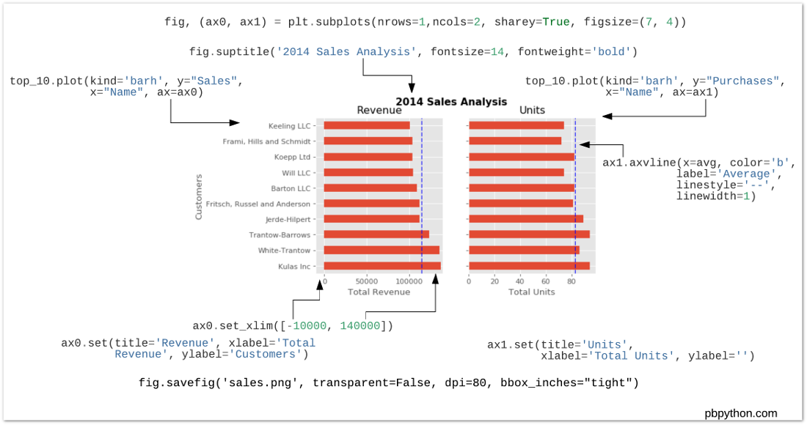
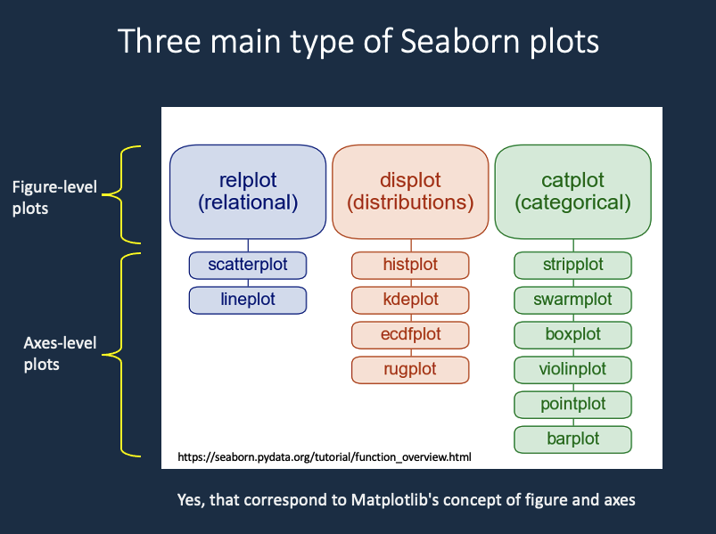

# MatPlotLib / matplotlib {#matplotlib}

- tikzplotlib^[\@ref(tikzplotlib)]^: [Python]^[\@ref(python)]^ matplotlib^[\@ref(matplotlib)]^ export to [TikZ]^[\@ref(tikz)]^ .tex

## Timothy H. Wu

::: {show-in="html"}
巫孟叡
:::

::: {show-in="pdf"}
\begin{CJK}{UTF8}{bsmi}
巫孟叡
\end{CJK}
:::

- API = application programming interface
  - functional^[\@ref(functionalapi)]^
  - object-oriented^[\@ref(ooapi)]^
    - figure
    - axes
    - subplot

https://matplotlib.org/stable/tutorials/introductory/quick_start.html

```{r matplotlib-figure-anatomy, echo=FALSE, cache=TRUE, fig.cap="matplotlib figure anatomy", out.width = '100%'}
knitr::include_graphics("img/matplotlib-figure-anatomy.png")
```

https://pbpython.com/effective-matplotlib.html

```{r, echo=FALSE, cache=TRUE, fig.cap="matplotlib subplot anatomy", out.width = '100%'}

```

https://tex.stackexchange.com/questions/84847/can-i-use-webp-images-in-latex

> You probably need to convert the image to png. 

```{css, echo=FALSE}
pre {
  max-width: 400px;
  overflow-x: auto;
  max-height: 600px;
  overflow-y: auto;
}

/*
pre[class] {
  max-height: 100px;
}
*/
```
  
### funcitonal API {#functionalapi}

:::::: {.cols data-latex=""}
::: {.col data-latex="{0.45\textwidth}"}
```{python, eval=FALSE, echo=TRUE, cache=TRUE}
import matplotlib.pyplot as plt

a1 = list(range(1, 7)) # [1, 2, 3, 4, 5, 6]
a2 = [1, 4, 9, 16, 25, 36]
plt.title('Sales figure')
plt.xlabel('Month')
plt.ylabel('Unit')
plt.plot(a1, a2) # this doesn't actually show the plot.
# plt.show() This is automatically called for Jupyter notebook.
```
:::

::: {.col data-latex="{0.10\textwidth}"}
\ 
:::

::: {.col data-latex="{0.45\textwidth}"}
```{python, eval=TRUE, echo=FALSE, cache=TRUE}
import matplotlib.pyplot as plt

a1 = list(range(1, 7)) # [1, 2, 3, 4, 5, 6]
a2 = [1, 4, 9, 16, 25, 36]
plt.title('Sales figure')
plt.xlabel('Month')
plt.ylabel('Unit')
plt.plot(a1, a2) # this doesn't actually show the plot.
# plt.show() This is automatically called for Jupyter notebook.
```
:::
::::::

***

> To plot a scatterplot, call `scatter()` instead of `plot()`.

:::::: {.cols data-latex=""}
::: {.col data-latex="{0.45\textwidth}"}
```{python, eval=FALSE, echo=TRUE, cache=TRUE}
import matplotlib.pyplot as plt

a1 = list(range(1, 7)) # [1, 2, 3, 4, 5, 6]
a2 = [1, 4, 9, 16, 25, 36]
plt.title('Sales figure')
plt.xlabel('Month')
plt.ylabel('Unit')
plt.scatter(a1, a2) # instead of plot.plot(), use scatter() to show scatter plot
```
:::

::: {.col data-latex="{0.10\textwidth}"}
\ 
:::

::: {.col data-latex="{0.45\textwidth}"}
```{python, eval=TRUE, echo=FALSE, cache=TRUE}
import matplotlib.pyplot as plt

a1 = list(range(1, 7)) # [1, 2, 3, 4, 5, 6]
a2 = [1, 4, 9, 16, 25, 36]
plt.title('Sales figure')
plt.xlabel('Month')
plt.ylabel('Unit')
plt.scatter(a1, a2) # instead of plot.plot(), use scatter() to show scatter plot
```
:::
::::::

***

:::::: {.cols data-latex=""}
::: {.col data-latex="{0.45\textwidth}"}
```{python, eval=FALSE, echo=TRUE, cache=TRUE}
import matplotlib.pyplot as plt

a1 = list(range(1, 7)) # [1, 2, 3, 4, 5, 6]
a2 = [1, 4, 9, 16, 25, 36]
plt.title('Sales figure')
plt.xlabel('Month')
plt.ylabel('Unit')
plt.plot(a1, a2)
plt.plot(a2, a1)
```
:::

::: {.col data-latex="{0.10\textwidth}"}
\ 
:::

::: {.col data-latex="{0.45\textwidth}"}
```{python, eval=TRUE, echo=FALSE, cache=TRUE}
import matplotlib.pyplot as plt

a1 = list(range(1, 7)) # [1, 2, 3, 4, 5, 6]
a2 = [1, 4, 9, 16, 25, 36]
plt.title('Sales figure')
plt.xlabel('Month')
plt.ylabel('Unit')
plt.plot(a1, a2)
plt.plot(a2, a1)
```
:::
::::::

***

> The behavior of the functional API is stateful. What's stateful? An example is when you read a text file. When you `open()` a text file to read, the library read the next line every time you call `readline()`. It rememember where you left off, despite the fact that you do not give it the position to read from. This behavior of the library is called **stateful**.
> The way we've used Matplotlib is also **stateful**. And everytime, `plot.show()` is called (and it automatically gets called on cell ends), some state about plots is reset.
> We can see that here:

```{python, eval=TRUE, echo=TRUE, cache=TRUE}
import matplotlib.pyplot as plt

a1 = list(range(1, 7)) # [1, 2, 3, 4, 5, 6]
a2 = [1, 4, 9, 16, 25, 36]
plt.title('Sales figure')
plt.xlabel('Month')
plt.ylabel('Unit')
plt.plot(a1, a2)
```

```{python, eval=TRUE, echo=TRUE, cache=TRUE}
plt.plot(a2, a1)
plt.ylabel('Unit')
```


> It makes two graphs instead of one. Also note that `ylabel()` was called after `plot()`, and it is still shown before `plot.show()` but `Sales Figure` plot title and other labels don't show up on this graph. Because every time `plot.show()` is called, things are reset. This is a `stateful API` we're using. 
> The functional APIs are used when you plot Matplotlib by calling on `pyplot` module level API (module level functions).

### object-oriented API {#ooapi}

> In object-orinted API, we're getting two type of objects. One is `Figure`, the other one is `Axes`. Figure is the *canvas* of the plot. In English, axes is the plural form of axis. We're talking about the axis in x axis and y axis. Since one **plot** consists of both axis, in MatPlotlib the object that represents one plot is called `Axes`. Since it's an object. We'll call it "a" axes.

```{python, eval=TRUE, echo=TRUE, cache=TRUE}
import matplotlib.pyplot as plt

a1 = list(range(1, 7)) # [1, 2, 3, 4, 5, 6]
a2 = [1, 4, 9, 16, 25, 36]
fig = plt.figure()
print("fig is of type:", type(fig))
ax1 = fig.add_axes([0, 0, 1, 1]) # [left, bottom, width, height]
print("ax1 is of type:", type(ax1))
# ax1.plot(a1, a2)
```

> 1. Call `figure()` to get a Figure type
> 2. Call `add_axes()` to get a ax1 type
> `ax1 = fig.add_axes([0, 0, 1, 1]) # [left, bottom, width, height]`
>   * The list given to `add_axes()` is the rectangular region of where to show the plot:
>     * Bottom left corner at x=0, y=0, width and height of both 1, 1

:::::: {.cols data-latex=""}
::: {.col data-latex="{0.45\textwidth}"}
```{python, eval=FALSE, echo=TRUE, cache=TRUE}
import matplotlib.pyplot as plt

a1 = list(range(1, 7)) # [1, 2, 3, 4, 5, 6]
a2 = [1, 4, 9, 16, 25, 36]
fig = plt.figure()
# print("fig is of type:", type(fig))
ax1 = fig.add_axes([0, 0, 1, 1]) # [left, bottom, width, height]
# print("ax1 is of type:", type(ax1))
ax1.plot(a1, a2)
```
:::

::: {.col data-latex="{0.10\textwidth}"}
\ 
:::

::: {.col data-latex="{0.45\textwidth}"}
```{python, eval=TRUE, echo=FALSE, cache=TRUE}
import matplotlib.pyplot as plt

a1 = list(range(1, 7)) # [1, 2, 3, 4, 5, 6]
a2 = [1, 4, 9, 16, 25, 36]
fig = plt.figure()
# print("fig is of type:", type(fig))
ax1 = fig.add_axes([0, 0, 1, 1]) # [left, bottom, width, height]
# print("ax1 is of type:", type(ax1))
ax1.plot(a1, a2)
```
:::
::::::

***

:::::: {.cols data-latex=""}
::: {.col data-latex="{0.45\textwidth}"}
```{python, eval=FALSE, echo=TRUE, cache=TRUE}
import matplotlib.pyplot as plt

a1 = list(range(1, 7)) # [1, 2, 3, 4, 5, 6]
a2 = [1, 4, 9, 16, 25, 36]
fig = plt.figure()
ax1 = fig.add_axes([0, 0, 1, 1])
ax1.plot(a1, a2)
ax2 = fig.add_axes([0.1, 0.5, .4, .4])
ax2.plot(a2, a1)
```
:::

::: {.col data-latex="{0.10\textwidth}"}
\ 
:::

::: {.col data-latex="{0.45\textwidth}"}
```{python, eval=TRUE, echo=FALSE, cache=TRUE}
import matplotlib.pyplot as plt

a1 = list(range(1, 7)) # [1, 2, 3, 4, 5, 6]
a2 = [1, 4, 9, 16, 25, 36]
fig = plt.figure()
ax1 = fig.add_axes([0, 0, 1, 1])
ax1.plot(a1, a2)
ax2 = fig.add_axes([0.1, 0.5, .4, .4])
ax2.plot(a2, a1)
```
:::
::::::

***

:::::: {.cols data-latex=""}
::: {.col data-latex="{0.45\textwidth}"}
```{python, eval=FALSE, echo=TRUE, cache=TRUE}
import matplotlib.pyplot as plt

a1 = list(range(1, 7)) # [1, 2, 3, 4, 5, 6]
a2 = [1, 4, 9, 16, 25, 36]
fig = plt.figure()
ax = fig.add_axes([0, 0, 1, 1])
ax.plot(a1, a2)
ax.set_xlabel('Time')
ax.set_ylabel('Unit')
ax.set_title('Sales figure')
# alternatively: 
# ax.set(xlabel='Time', ylabel='Unit', title='Sales figure')
```
:::

::: {.col data-latex="{0.10\textwidth}"}
\ 
:::

::: {.col data-latex="{0.45\textwidth}"}
```{python, eval=TRUE, echo=FALSE, cache=TRUE}
import matplotlib.pyplot as plt

a1 = list(range(1, 7)) # [1, 2, 3, 4, 5, 6]
a2 = [1, 4, 9, 16, 25, 36]
fig = plt.figure()
ax = fig.add_axes([0, 0, 1, 1])
ax.plot(a1, a2)
ax.set_xlabel('Time')
ax.set_ylabel('Unit')
ax.set_title('Sales figure')
# alternatively: 
# ax.set(xlabel='Time', ylabel='Unit', title='Sales figure')
```
:::
::::::

#### Configure the figure size and DPI

Get image size for the figure object. 6 by 4 is the default.

`fig.get_size_inches()`

```{python, eval=TRUE, echo=TRUE, cache=TRUE}
import matplotlib.pyplot as plt

fig = plt.figure()
fig.get_size_inches()
```

***

`fig = plt.figure(figsize=(2, 4))`

:::::: {.cols data-latex=""}
::: {.col data-latex="{0.45\textwidth}"}
```{python, eval=FALSE, echo=TRUE, cache=TRUE}
import matplotlib.pyplot as plt

a1 = list(range(1, 7)) # [1, 2, 3, 4, 5, 6]
a2 = [1, 4, 9, 16, 25, 36]
fig = plt.figure(figsize=(2, 4))
# you can also set after getting the figure
# fig.set_size_inches((12, 2))
ax = fig.add_axes([0, 0, 1, 1])
ax.plot(a1, a2)
```
:::

::: {.col data-latex="{0.10\textwidth}"}
\ 
:::

::: {.col data-latex="{0.45\textwidth}"}
```{python, eval=TRUE, echo=FALSE, cache=TRUE}
import matplotlib.pyplot as plt

a1 = list(range(1, 7)) # [1, 2, 3, 4, 5, 6]
a2 = [1, 4, 9, 16, 25, 36]
fig = plt.figure(figsize=(2, 4))
# you can also set after getting the figure
# fig.set_size_inches((12, 2))
ax = fig.add_axes([0, 0, 1, 1])
ax.plot(a1, a2)
```
:::
::::::

***

`fig.set_size_inches((4, 2))`

:::::: {.cols data-latex=""}
::: {.col data-latex="{0.45\textwidth}"}
```{python, eval=FALSE, echo=TRUE, cache=TRUE}
import matplotlib.pyplot as plt

a1 = list(range(1, 7)) # [1, 2, 3, 4, 5, 6]
a2 = [1, 4, 9, 16, 25, 36]
fig = plt.figure()
# you can also set after getting the figure
fig.set_size_inches((4, 2))
ax = fig.add_axes([0, 0, 1, 1])
ax.plot(a1, a2)
```
:::

::: {.col data-latex="{0.10\textwidth}"}
\ 
:::

::: {.col data-latex="{0.45\textwidth}"}
```{python, eval=TRUE, echo=FALSE, cache=TRUE}
import matplotlib.pyplot as plt

a1 = list(range(1, 7)) # [1, 2, 3, 4, 5, 6]
a2 = [1, 4, 9, 16, 25, 36]
fig = plt.figure()
# you can also set after getting the figure
fig.set_size_inches((4, 2))
ax = fig.add_axes([0, 0, 1, 1])
ax.plot(a1, a2)
```
:::
::::::

***

DPI = dots per inch

Get image DPI for the figure object. 100 is the default here.

`fig.get_dpi()`

```{python, eval=TRUE, echo=TRUE, cache=TRUE}
import matplotlib.pyplot as plt

fig = plt.figure()
fig.get_dpi()
```

***

```{python, eval=TRUE, echo=TRUE, cache=TRUE}
import matplotlib.pyplot as plt

a1 = list(range(1, 7)) # [1, 2, 3, 4, 5, 6]
a2 = [1, 4, 9, 16, 25, 36]
fig = plt.figure()
# you can also set after getting the figure
# fig.set_size_inches((12, 2))
ax = fig.add_axes([0, 0, 1, 1])
ax.plot(a1, a2)
fig.get_dpi()
```

***

```{python, eval=TRUE, echo=TRUE, cache=TRUE}
import matplotlib.pyplot as plt

a1 = list(range(1, 7)) # [1, 2, 3, 4, 5, 6]
a2 = [1, 4, 9, 16, 25, 36]
fig = plt.figure()
# you can also set after getting the figure
fig.set_size_inches((12, 2))
ax = fig.add_axes([0, 0, 1, 1])
ax.plot(a1, a2)
fig.get_dpi()
```

***

```{python, eval=TRUE, echo=TRUE, cache=TRUE}
import matplotlib.pyplot as plt

a1 = list(range(1, 7)) # [1, 2, 3, 4, 5, 6]
a2 = [1, 4, 9, 16, 25, 36]
fig = plt.figure()
# you can also set after getting the figure
fig.set_size_inches((12, 2))
ax = fig.add_axes([0, 0, 1, 1])
ax.plot(a1, a2)
plt.title('Sales figure')
fig.get_dpi()
```

#### subplot

```{python, eval=TRUE, echo=TRUE, cache=TRUE}
import matplotlib.pyplot as plt

# Subplots handles add_axes for you according to the number of rows and columns
fig, axes = plt.subplots(nrows=2, ncols=2, figsize=(4, 6))
# axes is a numpy array, you can use it like using a list.
print(axes)
```

***

:::::: {.cols data-latex=""}
::: {.col data-latex="{0.45\textwidth}"}
```{python, eval=FALSE, echo=TRUE, cache=TRUE}
import matplotlib.pyplot as plt

a1 = list(range(1, 7)) # [1, 2, 3, 4, 5, 6]
a2 = [1, 4, 9, 16, 25, 36]
# Subplots handles add_axes for you according to the number of rows and columns
fig, axes = plt.subplots(nrows=2, ncols=2, figsize=(4, 6))
# axes is a numpy array, you can use it like using a list.
# print(axes)
axes[0][0].plot(a1, a2)
axes[0][1].plot(a1, a2)
axes[1][0].plot(a2, a1)
axes[1][1].plot(a2, a1)
```
:::

::: {.col data-latex="{0.10\textwidth}"}
\ 
:::

::: {.col data-latex="{0.45\textwidth}"}
```{python, eval=TRUE, echo=FALSE, cache=TRUE}
import matplotlib.pyplot as plt

a1 = list(range(1, 7)) # [1, 2, 3, 4, 5, 6]
a2 = [1, 4, 9, 16, 25, 36]
# Subplots handles add_axes for you according to the number of rows and columns
fig, axes = plt.subplots(nrows=2, ncols=2, figsize=(4, 6))
# axes is a numpy array, you can use it like using a list.
# print(axes)
axes[0][0].plot(a1, a2)
axes[0][1].plot(a1, a2)
axes[1][0].plot(a2, a1)
axes[1][1].plot(a2, a1)
```
:::
::::::

#### color and linestyle

> * Color
>   * https://matplotlib.org/stable/tutorials/colors/colors.html
> * line-style (ls)
>   * https://matplotlib.org/stable/gallery/lines_bars_and_markers/linestyles.html
> * marker
>   * https://matplotlib.org/stable/api/markers_api.html
> * linewidth (lw)


```{python, eval=TRUE, echo=FALSE, cache=TRUE}
import matplotlib.pyplot as plt

a1 = list(range(1, 7)) # [1, 2, 3, 4, 5, 6]
a2 = [1, 4, 9, 16, 25, 36]
# Subplots handles add_axes for you according to the number of rows and columns
fig, axes = plt.subplots(nrows=1, ncols=2, figsize=(18, 4))
# axes is a numpy array
axes[0].plot(a1, a2, color='green', linestyle='-.')
axes[0].plot(a2, a1, color=(1, 0, 0.5), marker='v', markersize=20)
axes[1].plot(a1, a2, linestyle='dotted')
axes[1].plot(a2, a1, linestyle=(0, (3, 10, 1, 10)))
```

#### other inputs

- NumPy array
- Pandas series

#### legend

:::::: {.cols data-latex=""}
::: {.col data-latex="{0.45\textwidth}"}
```{python, eval=FALSE, echo=TRUE, cache=TRUE}
import matplotlib.pyplot as plt
import numpy as np

x = np.linspace(0, 10, 30)
y = x * x
fig = plt.figure()
ax = fig.add_axes([0, 0, 1, 1])
line1 = ax.plot(x, y, label="Competitor")
line2 = ax.plot(x, y**2, label="Us")
ax.legend()
```
:::

::: {.col data-latex="{0.10\textwidth}"}
\ 
:::

::: {.col data-latex="{0.45\textwidth}"}
```{python, eval=TRUE, echo=FALSE, cache=TRUE}
import matplotlib.pyplot as plt
import numpy as np

x = np.linspace(0, 10, 30)
y = x * x
fig = plt.figure()
ax = fig.add_axes([0, 0, 1, 1])
line1 = ax.plot(x, y, label="Competitor")
line2 = ax.plot(x, y**2, label="Us")
ax.legend()
```
:::
::::::

#### customize style

predefined styles

```{python, eval=TRUE, echo=TRUE, cache=TRUE}
import matplotlib.pyplot as plt

print(plt.style.available)
```

:::::: {.cols data-latex=""}
::: {.col data-latex="{0.45\textwidth}"}
```{python, eval=FALSE, echo=TRUE, cache=TRUE}
import matplotlib.pyplot as plt

a1 = list(range(1, 7)) # [1, 2, 3, 4, 5, 6]
a2 = [1, 4, 9, 16, 25, 36]
fig = plt.figure()
plt.style.use('ggplot')
ax = fig.add_axes([0, 0, 1, 1])
ax.plot(a1, a2)
```
:::

::: {.col data-latex="{0.10\textwidth}"}
\ 
:::

::: {.col data-latex="{0.45\textwidth}"}
```{python, eval=TRUE, echo=FALSE, cache=TRUE}
import matplotlib.pyplot as plt

a1 = list(range(1, 7)) # [1, 2, 3, 4, 5, 6]
a2 = [1, 4, 9, 16, 25, 36]
fig = plt.figure()
plt.style.use('ggplot')
ax = fig.add_axes([0, 0, 1, 1])
ax.plot(a1, a2)
```
:::
::::::

restore default style

```{python, eval=TRUE, echo=TRUE, cache=TRUE}
import matplotlib.pyplot as plt

plt.style.use('default') # But strangely enough figure size gets changed still
```

```{python, eval=TRUE, echo=TRUE, cache=TRUE}
import matplotlib.pyplot as plt

plt.rcParams["figure.figsize"] = (6, 4)
plt.rcParams["figure.dpi"] = 100
```

#### save to file

> `savefig` saves image to file. We also set the `bbox_inches` parameter to `tight` to make sure the image doesn't get out of the image bound.

save to .png

```{python, eval=FALSE, echo=TRUE, cache=TRUE}
import matplotlib.pyplot as plt

a1 = list(range(1, 7)) # [1, 2, 3, 4, 5, 6]
a2 = [1, 4, 9, 16, 25, 36]
fig = plt.figure()
ax = fig.add_axes([0, 0, 1, 1])
ax.plot(a1, a2)
fig.savefig('out.png', bbox_inches = 'tight')
```

save to .pdf

```{python, eval=FALSE, echo=TRUE, cache=TRUE}
import matplotlib.pyplot as plt

a1 = list(range(1, 7)) # [1, 2, 3, 4, 5, 6]
a2 = [1, 4, 9, 16, 25, 36]
fig = plt.figure()
ax = fig.add_axes([0, 0, 1, 1])
ax.plot(a1, a2)
fig.savefig('out.pdf', bbox_inches = 'tight')
```

### Seaborn

- [Kimberly Fessel](https://www.youtube.com/@KimberlyFessel/playlists)
  - [visually explained](https://www.youtube.com/playlist?list=PLtPIclEQf-3cYc7tP_mxrvNtp82NWVf8p)
  - [Seaborn](https://www.youtube.com/playlist?list=PLtPIclEQf-3cG31dxSMZ8KTcDG7zYng1j)
  - [MatPlotLib](https://www.youtube.com/playlist?list=PLtPIclEQf-3dJmAj3IsSRwRoLbX-n3J81)
  - [Pandas](https://www.youtube.com/playlist?list=PLtPIclEQf-3c-pUgSttUGV-3Y2D9g_0sW)
  - [iPyWidgets](https://www.youtube.com/playlist?list=PLtPIclEQf-3fhfoFQU2MJYnQ6CyjQLQEa)

```{r seaborn-plot-type, echo=FALSE, cache=TRUE, fig.cap="seaborn plot type", out.width = '100%'}

```
- Seaborn
  - figure-level plot
  - axes-level plot


R or RStudio run Python with installing packages or modules by using `reticulate`, R package

and directly using Anaconda `conda` environment for convenience, instead of `virtualenv`

https://rstudio.github.io/reticulate/articles/python_packages.html
```{r}
# library(reticulate)
# conda_list()
# use_condaenv(condaenv = 'sandbox-3.9')

## install Seaborn
# conda_install("r-reticulate", "seaborn")

## import Seaborn (it will be automatically discovered in "r-reticulate")
# seaborn <- import("seaborn")
```

#### basic

```{python, eval=FALSE, echo=TRUE, cache=TRUE}
import matplotlib.pyplot as plt  # need it sometimes
import seaborn as sns

sns.set_theme() # set the default theme
```

***

:::::: {.cols data-latex=""}
::: {.col data-latex="{0.45\textwidth}"}
```{python, eval=FALSE, echo=TRUE, cache=TRUE}
import seaborn as sns

x = [3, 5, 1.2, 8.7, 6.4]
y = [8.2, 4.3, 7, 9.6, 4]
sns.scatterplot(x=x, y=y)
```
:::

::: {.col data-latex="{0.10\textwidth}"}
\ 
:::

::: {.col data-latex="{0.45\textwidth}"}
```{python, eval=TRUE, echo=FALSE, cache=TRUE}
import seaborn as sns

x = [3, 5, 1.2, 8.7, 6.4]
y = [8.2, 4.3, 7, 9.6, 4]
sns.scatterplot(x=x, y=y)
```
:::
::::::

***

:::::: {.cols data-latex=""}
::: {.col data-latex="{0.45\textwidth}"}
```{python, eval=FALSE, echo=TRUE, cache=TRUE}
import seaborn as sns

x = [3, 5, 1.2, 8.7, 6.4]
y = [8.2, 4.3, 7, 9.6, 4]
sns.lineplot(x=x, y=y)
```
:::

::: {.col data-latex="{0.10\textwidth}"}
\ 
:::

::: {.col data-latex="{0.45\textwidth}"}
```{python, eval=TRUE, echo=FALSE, cache=TRUE}
import seaborn as sns

x = [3, 5, 1.2, 8.7, 6.4]
y = [8.2, 4.3, 7, 9.6, 4]
sns.lineplot(x=x, y=y)
```
:::
::::::

#### data frame

`sns.load_dataset`

:::::: {.cols data-latex=""}
::: {.col data-latex="{0.45\textwidth}"}
```{python, eval=FALSE, echo=TRUE, cache=TRUE}
import seaborn as sns

tips = sns.load_dataset("tips")
tips
```
:::

::: {.col data-latex="{0.10\textwidth}"}
\ 
:::

::: {.col data-latex="{0.45\textwidth}"}
```{python, eval=TRUE, echo=FALSE, cache=TRUE}
import seaborn as sns

tips = sns.load_dataset("tips")
tips
```
:::
::::::

***

`data`

:::::: {.cols data-latex=""}
::: {.col data-latex="{0.45\textwidth}"}
```{python, eval=FALSE, echo=TRUE, cache=TRUE}
import seaborn as sns

tips = sns.load_dataset("tips")
sns.scatterplot(data=tips, 
                x='total_bill', 
                y='tip')
```
:::

::: {.col data-latex="{0.10\textwidth}"}
\ 
:::

::: {.col data-latex="{0.45\textwidth}"}
```{python, eval=TRUE, echo=FALSE, cache=TRUE}
import seaborn as sns

tips = sns.load_dataset("tips")
sns.scatterplot(data=tips, 
                x='total_bill', 
                y='tip')
```
:::
::::::

***

`hue`

:::::: {.cols data-latex=""}
::: {.col data-latex="{0.45\textwidth}"}
```{python, eval=FALSE, echo=TRUE, cache=TRUE}
import seaborn as sns

tips = sns.load_dataset("tips")
sns.scatterplot(data=tips, 
                x='total_bill', 
                y='tip', 
                hue='smoker')
```
:::

::: {.col data-latex="{0.10\textwidth}"}
\ 
:::

::: {.col data-latex="{0.45\textwidth}"}
```{python, eval=TRUE, echo=FALSE, cache=TRUE}
import seaborn as sns

tips = sns.load_dataset("tips")
sns.scatterplot(data=tips, 
                x='total_bill', 
                y='tip', 
                hue='smoker')
```
:::
::::::

***

`style`

:::::: {.cols data-latex=""}
::: {.col data-latex="{0.45\textwidth}"}
```{python, eval=FALSE, echo=TRUE, cache=TRUE}
import seaborn as sns

tips = sns.load_dataset("tips")
sns.scatterplot(data=tips, 
                x='total_bill', 
                y='tip', 
                hue='smoker', 
                style='time')
```
:::

::: {.col data-latex="{0.10\textwidth}"}
\ 
:::

::: {.col data-latex="{0.45\textwidth}"}
```{python, eval=TRUE, echo=FALSE, cache=TRUE}
import seaborn as sns

tips = sns.load_dataset("tips")
sns.scatterplot(data=tips, 
                x='total_bill', 
                y='tip', 
                hue='smoker', 
                style='time')
```
:::
::::::

***

`size`

:::::: {.cols data-latex=""}
::: {.col data-latex="{0.45\textwidth}"}
```{python, eval=FALSE, echo=TRUE, cache=TRUE}
import seaborn as sns

tips = sns.load_dataset("tips")
sns.scatterplot(data=tips, 
                x='total_bill', 
                y='tip', 
                hue='smoker', 
                style='time', 
                size='size')
```
:::

::: {.col data-latex="{0.10\textwidth}"}
\ 
:::

::: {.col data-latex="{0.45\textwidth}"}
```{python, eval=TRUE, echo=FALSE, cache=TRUE}
import seaborn as sns

tips = sns.load_dataset("tips")
sns.scatterplot(data=tips, 
                x='total_bill', 
                y='tip', 
                hue='smoker', 
                style='time', 
                size='size')
```
:::
::::::

> * Legend is covering up the graph, it's getting out of hand. Let's tune the range of x
> * `sns.scatterplot()` actually returns something that resembles Matplotlib axis. So we use a Matplotlib axis function:

`ax = sns.scatterplot(...)`

https://stackoverflow.com/questions/26597116/seaborn-plots-not-showing-up

:::::: {.cols data-latex=""}
::: {.col data-latex="{0.45\textwidth}"}
```{python, eval=FALSE, echo=TRUE, cache=TRUE}
import matplotlib.pyplot as plt
import seaborn as sns

tips = sns.load_dataset("tips")
ax = sns.scatterplot(data=tips, 
                x='total_bill', 
                y='tip', 
                hue='smoker', 
                style='time', 
                size='size')
ax.set_xlim((0, 70))
# alternatively:
# ax.set(xlim=(0, 70))
plt.show()
```
:::

::: {.col data-latex="{0.10\textwidth}"}
\ 
:::

::: {.col data-latex="{0.45\textwidth}"}
```{python, eval=TRUE, echo=FALSE, cache=TRUE}
import matplotlib.pyplot as plt
import seaborn as sns

tips = sns.load_dataset("tips")
ax = sns.scatterplot(data=tips, 
                x='total_bill', 
                y='tip', 
                hue='smoker', 
                style='time', 
                size='size')
ax.set_xlim((0, 70))
# alternatively:
# ax.set(xlim=(0, 70))
plt.show()
```
:::
::::::

#### axis-level plot and figure-level plot

```{r , echo=FALSE, cache=TRUE, fig.cap="seaborn plot type", out.width = '100%'}

```

:::::: {.cols data-latex=""}
::: {.col data-latex="{0.45\textwidth}"}
```{python, eval=FALSE, echo=TRUE, cache=TRUE}
import seaborn as sns

tips = sns.load_dataset("tips")
sns.relplot(kind='scatter', 
            data=tips, 
            x='total_bill', 
            y='tip')
```
:::

::: {.col data-latex="{0.10\textwidth}"}
\ 
:::

::: {.col data-latex="{0.45\textwidth}"}
```{python, eval=TRUE, echo=FALSE, cache=TRUE}
import seaborn as sns

tips = sns.load_dataset("tips")
sns.relplot(kind='scatter', 
            data=tips, 
            x='total_bill', 
            y='tip')
```
:::
::::::

***

:::::: {.cols data-latex=""}
::: {.col data-latex="{0.45\textwidth}"}
```{python, eval=FALSE, echo=TRUE, cache=TRUE}
import seaborn as sns

tips = sns.load_dataset("tips")
sns.relplot(kind='line', 
            data=tips, 
            x='total_bill', 
            y='tip')
```
:::

::: {.col data-latex="{0.10\textwidth}"}
\ 
:::

::: {.col data-latex="{0.45\textwidth}"}
```{python, eval=TRUE, echo=FALSE, cache=TRUE}
import seaborn as sns

tips = sns.load_dataset("tips")
sns.relplot(kind='line', 
            data=tips, 
            x='total_bill', 
            y='tip')
```
:::
::::::

***

> With figure-level plot, we can draw more than one plot (one `axes`).

> Here we specify that different `sex` be on different column by specifying `col=sex`.

`col=sex`

:::::: {.cols data-latex=""}
::: {.col data-latex="{0.45\textwidth}"}
```{python, eval=FALSE, echo=TRUE, cache=TRUE}
import seaborn as sns

tips = sns.load_dataset("tips")
sns.relplot(kind='scatter',
            data=tips,
            x='total_bill', 
            y='tip', 
            hue='smoker', 
            style='time', 
            size='size',
            col='sex')
```
:::

::: {.col data-latex="{0.10\textwidth}"}
\ 
:::

::: {.col data-latex="{0.45\textwidth}"}
```{python, eval=TRUE, echo=FALSE, cache=TRUE}
import seaborn as sns

tips = sns.load_dataset("tips")
sns.relplot(kind='scatter',
            data=tips,
            x='total_bill', 
            y='tip', 
            hue='smoker', 
            style='time', 
            size='size',
            col='sex')
```
:::
::::::

***

`col=sex` `row=smoker`

:::::: {.cols data-latex=""}
::: {.col data-latex="{0.45\textwidth}"}
```{python, eval=FALSE, echo=TRUE, cache=TRUE}
import seaborn as sns

tips = sns.load_dataset("tips")
sns.relplot(kind='scatter',
            data=tips,
            x='total_bill', 
            y='tip', 
            style='time', 
            hue='size',
            row='smoker', 
            col='sex')
```
:::

::: {.col data-latex="{0.10\textwidth}"}
\ 
:::

::: {.col data-latex="{0.45\textwidth}"}
```{python, eval=TRUE, echo=FALSE, cache=TRUE}
import seaborn as sns

tips = sns.load_dataset("tips")
sns.relplot(kind='scatter',
            data=tips,
            x='total_bill', 
            y='tip', 
            style='time', 
            hue='size',
            row='smoker', 
            col='sex')
```
:::
::::::

#### accessing fgure and axes objects

> Recall that Seaborn uses Matplotlib to draw the graphics. So underneath the Seaborn libray, you can still access Matplotlib's figure object and axes objects if necessary. The call to figure-level plot returns an object.

:::::: {.cols data-latex=""}
::: {.col data-latex="{0.45\textwidth}"}
```{python, eval=FALSE, echo=TRUE, cache=TRUE}
import seaborn as sns

tips = sns.load_dataset("tips")
g = sns.relplot(kind='scatter',
                data=tips,
                x='total_bill', 
                y='tip', 
                style='time', 
                hue='size',
                row='smoker', 
                col='sex')
print(type(g))
print(type(g.fig)) # g.fig gets you the Figure
g.fig
```
:::

::: {.col data-latex="{0.10\textwidth}"}
\ 
:::

::: {.col data-latex="{0.45\textwidth}"}
```{python, eval=TRUE, echo=FALSE, cache=TRUE}
import seaborn as sns

tips = sns.load_dataset("tips")
g = sns.relplot(kind='scatter',
                data=tips,
                x='total_bill', 
                y='tip', 
                style='time', 
                hue='size',
                row='smoker', 
                col='sex')
print(type(g))
print(type(g.fig)) # g.fig gets you the Figure
g.fig
```
:::
::::::

#### distribution plot

##### histogram

:::::: {.cols data-latex=""}
::: {.col data-latex="{0.45\textwidth}"}
```{python, eval=FALSE, echo=TRUE, cache=TRUE}
import seaborn as sns

tips = sns.load_dataset("tips")
sns.displot(kind='hist',
            data=tips,
            x='total_bill')
```
:::

::: {.col data-latex="{0.10\textwidth}"}
\ 
:::

::: {.col data-latex="{0.45\textwidth}"}
```{python, eval=TRUE, echo=FALSE, cache=TRUE}
import seaborn as sns

tips = sns.load_dataset("tips")
sns.displot(kind='hist',
            data=tips,
            x='total_bill')
```
:::
::::::

***

`bins`

:::::: {.cols data-latex=""}
::: {.col data-latex="{0.45\textwidth}"}
```{python, eval=FALSE, echo=TRUE, cache=TRUE}
import seaborn as sns

tips = sns.load_dataset("tips")
sns.displot(kind='hist', bins=20,
            data=tips,
            x='total_bill')
```
:::

::: {.col data-latex="{0.10\textwidth}"}
\ 
:::

::: {.col data-latex="{0.45\textwidth}"}
```{python, eval=TRUE, echo=FALSE, cache=TRUE}
import seaborn as sns

tips = sns.load_dataset("tips")
sns.displot(kind='hist', bins=20,
            data=tips,
            x='total_bill')
```
:::
::::::

##### ECDF = empirical cumulative distrutive function

:::::: {.cols data-latex=""}
::: {.col data-latex="{0.45\textwidth}"}
```{python, eval=FALSE, echo=TRUE, cache=TRUE}
import seaborn as sns

tips = sns.load_dataset("tips")
sns.displot(kind='ecdf',
            data=tips,
            x='total_bill')
```
:::

::: {.col data-latex="{0.10\textwidth}"}
\ 
:::

::: {.col data-latex="{0.45\textwidth}"}
```{python, eval=TRUE, echo=FALSE, cache=TRUE}
import seaborn as sns

tips = sns.load_dataset("tips")
sns.displot(kind='ecdf',
            data=tips,
            x='total_bill')
```
:::
::::::

***

##### KDE = kernel density estimation

:::::: {.cols data-latex=""}
::: {.col data-latex="{0.45\textwidth}"}
```{python, eval=FALSE, echo=TRUE, cache=TRUE}
import seaborn as sns

tips = sns.load_dataset("tips")
sns.displot(kind='kde',
            data=tips,
            x='total_bill')
```
:::

::: {.col data-latex="{0.10\textwidth}"}
\ 
:::

::: {.col data-latex="{0.45\textwidth}"}
```{python, eval=TRUE, echo=FALSE, cache=TRUE}
import seaborn as sns

tips = sns.load_dataset("tips")
sns.displot(kind='kde',
            data=tips,
            x='total_bill')
```
:::
::::::

***

histogram with KDE

:::::: {.cols data-latex=""}
::: {.col data-latex="{0.45\textwidth}"}
```{python, eval=FALSE, echo=TRUE, cache=TRUE}
import seaborn as sns

tips = sns.load_dataset("tips")
sns.displot(kind='hist', bins=20, kde='true',
            data=tips,
            x='total_bill')
```
:::

::: {.col data-latex="{0.10\textwidth}"}
\ 
:::

::: {.col data-latex="{0.45\textwidth}"}
```{python, eval=TRUE, echo=FALSE, cache=TRUE}
import seaborn as sns

tips = sns.load_dataset("tips")
sns.displot(kind='hist', bins=20, kde='true',
            data=tips,
            x='total_bill')
```
:::
::::::

***

:::::: {.cols data-latex=""}
::: {.col data-latex="{0.45\textwidth}"}
```{python, eval=FALSE, echo=TRUE, cache=TRUE}
import seaborn as sns

tips = sns.load_dataset("tips")
sns.displot(kind='hist', bins=20, kde='true',
            data=tips,
            x='total_bill',
            hue='smoker',
            col='sex'
            )
```
:::

::: {.col data-latex="{0.10\textwidth}"}
\ 
:::

::: {.col data-latex="{0.45\textwidth}"}
```{python, eval=TRUE, echo=FALSE, cache=TRUE}
import seaborn as sns

tips = sns.load_dataset("tips")
sns.displot(kind='hist', bins=20, kde='true',
            data=tips,
            x='total_bill',
            hue='smoker',
            col='sex'
            )
```
:::
::::::

***

> Let's cutomize the label and title.

:::::: {.cols data-latex=""}
::: {.col data-latex="{0.45\textwidth}"}
```{python, eval=FALSE, echo=TRUE, cache=TRUE}
import seaborn as sns

tips = sns.load_dataset("tips")
g = sns.displot(kind='hist', bins=20, kde='true',
                data=tips,
                x='total_bill',
                hue='smoker',
                col='sex'
                )
g.set(xlabel='Total bill')
g.axes[0][0].set(title='Male')
g.axes[0][1].set(title='Female')
g.fig
```
:::

::: {.col data-latex="{0.10\textwidth}"}
\ 
:::

::: {.col data-latex="{0.45\textwidth}"}
```{python, eval=TRUE, echo=FALSE, cache=TRUE}
import seaborn as sns

tips = sns.load_dataset("tips")
g = sns.displot(kind='hist', bins=20, kde='true',
                data=tips,
                x='total_bill',
                hue='smoker',
                col='sex'
                )
g.set(xlabel='Total bill')
g.axes[0][0].set(title='Male')
g.axes[0][1].set(title='Female')
g.fig
```
:::
::::::

***