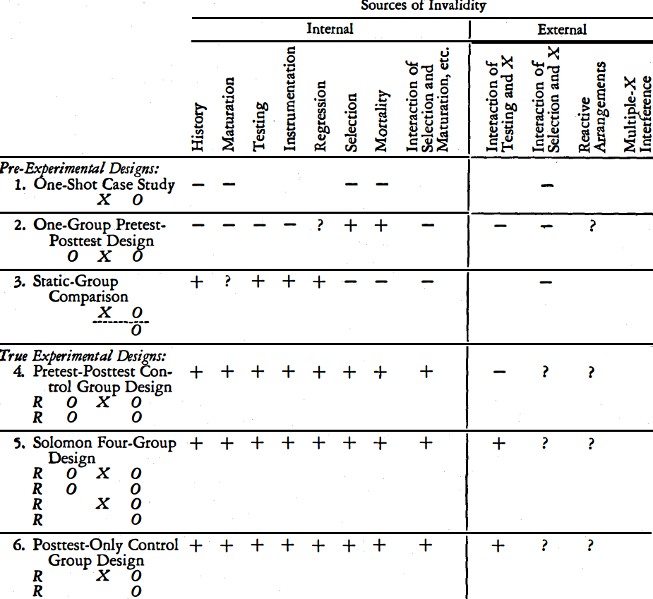
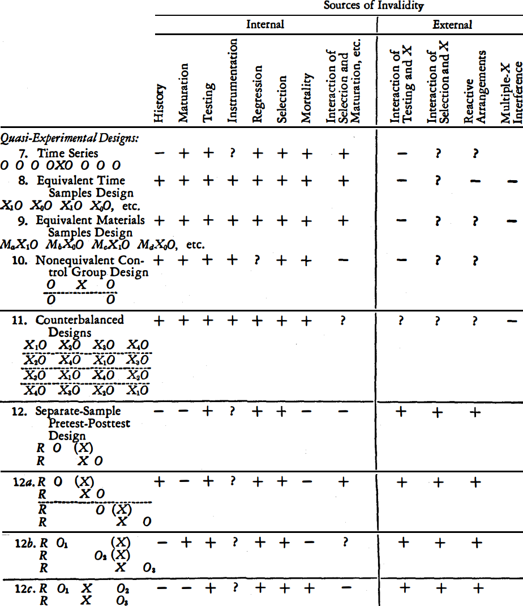
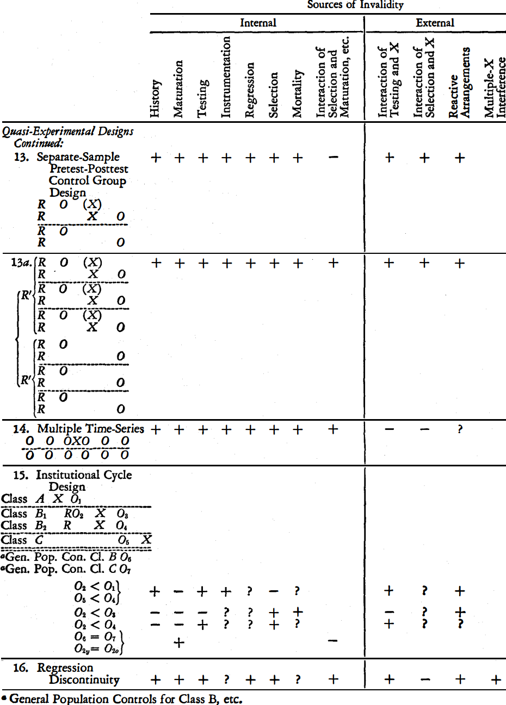

# notational system for design

[@hu2022] p.51

NSD = notational system for design

[@campbell1963]

## graphic notation

[@hu2022] p.51

- $X$: treatment or exposure to an agent or an event of interest
- $P$: **placebo**, i.e. blank treatment or exposure, or standard treatment, or exposure as an active control
- $O$: **observation** or process of measurement
- $R$: **randomization**, i.e. random assignment of research subjects to separate treatment or exposure groups
- subscript
  - $_g$: **groups**
  - $_k$: **kinds** of treatments, exposures, or placebos
  - $_t$: **time** or sequential order

https://tex.stackexchange.com/questions/591882/citation-within-a-latex-figure-caption-in-rmarkdown

`(ref:rudolph) *nice* cite: [@Lam94].`

`(ref:campbell1963) *nice* cite: [@campbell1963].`

`(ref:campbell1963) ([@campbell1963]`

`(ref:campbell1963) \ [@campbell1963]`

(ref:campbell1963) \ [@campbell1963]

```{r, echo=FALSE, cache=TRUE, fig.cap="pre- and true experimental designs ((ref:campbell1963) p.8)", out.width = '65%'}

```

```{r, echo=FALSE, cache=TRUE, fig.cap="quasi-experimental designs ((ref:campbell1963) p.40)", out.width = '65%'}

```

```{r, echo=FALSE, cache=TRUE, fig.cap="quasi-experimental designs continued ((ref:campbell1963) p.56)", out.width = '65%'}

```

## pre-experimental design

[@campbell1963] p.6

### one-shot case study

$$
\begin{array}{ccc}
X & O
\end{array}
$$

### one-group pretest-posttest design

$$
\begin{array}{ccc}
O & X & O
\end{array}
$$
paired $t$ test

[@hu2022] p.62

$$
\begin{array}{ccc}
O & X & O \\
O_{t} & X & O_{t} \\
O_{0} & X & O_{1}
\end{array}
$$

***

$$
\begin{array}{ccc}
O & X & O \\
O_{gt} & X_{g} & O_{gt} \\
O_{10} & X & O_{11}
\end{array}
$$

### static-group comparison

$$
\begin{array}{ccc}
X & O \\
X_{g} & O_{gt} \\
X & O_{11} \\
  & O_{21}
\end{array}
$$

***

$$
\begin{array}{ccc}
X & O \\
X_{g} & O_{gt} \\
X & O_{11} \\
  & O_{01}
\end{array}
$$


## true experimental design

[@campbell1963] p.13

### posttest-only control group design

basic experimental design

two-sample $t$ test

[@hu2022] p.53

$$
\begin{array}{ccc}
R & X & O\\
R &  & O
\end{array}
$$
or, with a placebo or an active control,
$$
\begin{array}{ccc}
R & X & O\\
R & P & O
\end{array}
$$

***

$$
\begin{array}{ccc}
R & X_{g} & O_{gt}\end{array}
$$

***

$$
\begin{array}{ccc}
R & X_{g}=X_{1}=X & O_{gt}=O_{11}\\
R & X_{g}=X_{2}=\emptyset & O_{gt}=O_{21}
\end{array}
$$
or, with a placebo or an active control
$$
\begin{array}{ccc}
R & X_{g}=X_{1}=X & O_{gt}=O_{11}\\
R & X_{g}=X_{2}=P & O_{gt}=O_{21}
\end{array}
$$

***

$$
\begin{array}{ccc}
R & X & O_{11}\\
R &  & O_{21}
\end{array}
$$
or, with a placebo or an active control
$$
\begin{array}{ccc}
R & X & O_{11}\\
R & P & O_{21}
\end{array}
$$

***

$$
\begin{array}{ccc}
R & X_{g} & O_{gt}\\
R & X & O_{11}\\
R & P & O_{21}
\end{array}
$$

***

$$
\begin{array}{ccc}
R & X & O\\
R & X_{g} & O_{gt}\\
R & X & O_{11}\\
R & P & O_{21}
\end{array}
$$

### pretest-posttest control group design

$$
\begin{array}{cccc}
R & O & X & O\\
R & O_{gt} & X_{g} & O_{gt}\\
R & O_{10} & X & O_{11}\\
R & O_{20} &  & O_{21}
\end{array}
$$

### Solomon four-group design

[@hu2022] p.52

Solomon 4-group design = pretest-posttest + posttest-only control group design

$$
\begin{array}{cccc}
R & O_{gt} & X_{g} & O_{gt}\\
R & O_{10} & X & O_{11}\\
R & O_{20} &  & O_{21}\\
R &  & X & O_{31}\\
R &  &  & O_{41}
\end{array}
$$

***

$$
\begin{array}{cccc}
R & O & X & O\\
R & O_{gt} & X_{g} & O_{gt}\\
R & O_{10} & X & O_{11}\\
R & O_{20} &  & O_{21}\\
R &  & X & O_{31}\\
R &  &  & O_{41}
\end{array}
$$

## quasi-experimental design

[@campbell1963] p.34

## correlational and ex post facto designs

[@campbell1963] p.64

## graphic notation, advanced

[@hu2022] p.74

- $X$: treatment or exposure to an agent or an event of interest
- $P$: **placebo**, i.e. blank treatment or exposure, or standard treatment, or exposure as an active control
- $O$: **observation** or process of measurement
- $R$: **randomization**, i.e. random assignment of research subjects to separate treatment or exposure groups
- subscript
  - $_g$: **groups**
  - $_k$: **kinds** of treatments, exposures, or placebos
  - $_t$: **time** or sequential order
- $V$: **variable(s)**
  - $B(V)$: **blocking** by the variable(s)
  - $M(V)$: **matching** by the variable(s)
  - $S(V)$: **stratifying** by the variable(s)
  - $L(V/L)$: **limiting** to the level(s) of the variable(s)
- $M^{*}$: research **material(s)** selected
- $-$: cohort
  