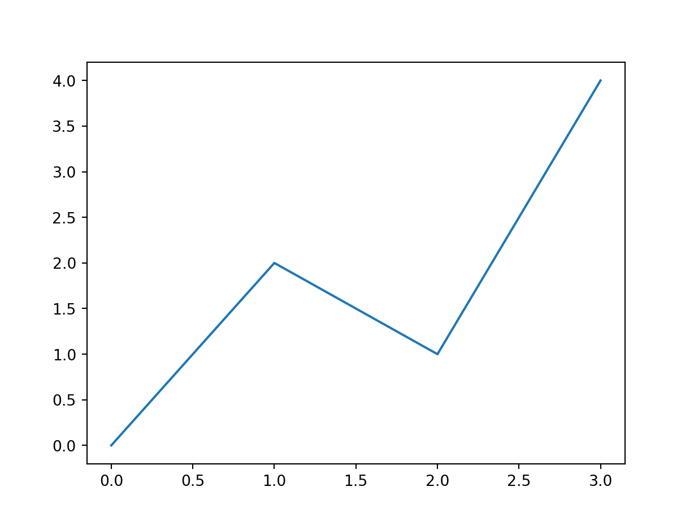

# Python

https://bookdown.org/yihui/rmarkdown/language-engines.html


```r
names(knitr::knit_engines$get())
```

```
##  [1] "awk"         "bash"        "coffee"      "gawk"        "groovy"     
##  [6] "haskell"     "lein"        "mysql"       "node"        "octave"     
## [11] "perl"        "php"         "psql"        "Rscript"     "ruby"       
## [16] "sas"         "scala"       "sed"         "sh"          "stata"      
## [21] "zsh"         "asis"        "asy"         "block"       "block2"     
## [26] "bslib"       "c"           "cat"         "cc"          "comment"    
## [31] "css"         "ditaa"       "dot"         "embed"       "eviews"     
## [36] "exec"        "fortran"     "fortran95"   "go"          "highlight"  
## [41] "js"          "julia"       "python"      "R"           "Rcpp"       
## [46] "sass"        "scss"        "sql"         "stan"        "targets"    
## [51] "tikz"        "verbatim"    "theorem"     "lemma"       "corollary"  
## [56] "proposition" "conjecture"  "definition"  "example"     "exercise"   
## [61] "hypothesis"  "proof"       "remark"      "solution"    "glue"       
## [66] "glue_sql"    "gluesql"
```
https://rstudio.github.io/reticulate/articles/python_packages.html


```python
x = 'hello, python world!'
print(x.split(' '))
```

```
## ['hello,', 'python', 'world!']
```


```r
library(reticulate)
```

```
## Warning: package 'reticulate' was built under R version 4.2.3
```

```r
virtualenv_python()
```

```
## [1] "D:/Users/115381/Documents/.virtualenvs/r-reticulate/Scripts/python.exe"
```


```r
library(reticulate)
conda_list()
```

```
##                name                                            python
## 1              base                          D:\\Anaconda3/python.exe
## 2          fiftyone          D:\\Anaconda3\\envs\\fiftyone/python.exe
## 3             keras             D:\\Anaconda3\\envs\\keras/python.exe
## 4           labelme           D:\\Anaconda3\\envs\\labelme/python.exe
## 5             manim             D:\\Anaconda3\\envs\\manim/python.exe
## 6            mmyolo            D:\\Anaconda3\\envs\\mmyolo/python.exe
## 7 rsconnect-jupyter D:\\Anaconda3\\envs\\rsconnect-jupyter/python.exe
## 8           sandbox           D:\\Anaconda3\\envs\\sandbox/python.exe
## 9       sandbox-3.9       D:\\Anaconda3\\envs\\sandbox-3.9/python.exe
```

```r
library(reticulate)
virtualenv_list()
```

```
## [1] "r-reticulate"
```

https://rstudio.github.io/reticulate/reference/install_python.html


```r
library(reticulate)
version <- "3.9.12"
# install_python(version)

# create a new environment
# virtualenv_create("r-reticulate", version = version)

# use_virtualenv("r-reticulate")

# install MatPlotLib
# virtualenv_install("r-reticulate", "matplotlib")

# import MatPlotLib (it will be automatically discovered in "r-reticulate")
matplotlib <- import("matplotlib")
```

copy `C:\Users\RW\AppData\Local\r-reticulate\r-reticulate\pyenv\pyenv-win\versions\3.9.12\tcl\tcl8.6` and `C:\Users\RW\AppData\Local\r-reticulate\r-reticulate\pyenv\pyenv-win\versions\3.9.12\tcl\tk8.6` two folders to the folder `C:\Users\RW\AppData\Local\r-reticulate\r-reticulate\pyenv\pyenv-win\versions\3.9.12\Lib`


```r
# library(reticulate)
# use_virtualenv("r-reticulate")
# # matplotlib <- import("matplotlib")
# matplotlib$use("Agg", force = TRUE)
```


```python
import matplotlib.pyplot as plt
plt.plot([0, 2, 1, 4])
plt.show()
```


