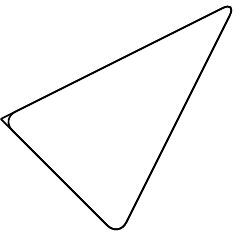
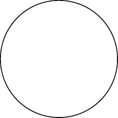

# TiKZ {-}

TiKZ and PGFplots

What's the relation between packages PGFplots and TikZ?

https://tex.stackexchange.com/questions/285925/whats-the-relation-between-packages-pgfplots-and-tikz

https://www.youtube.com/watch?v=bQugbYq0BVA

https://www.youtube.com/watch?v=ft4Kg9emK1k&list=PLg5nrpKdkk2DWcg3scb75AknF7DJXs8lk&index=18


```tex
\begin{tikzpicture}
  \def\a{1.5} % amplitude
  \def\b{2}   % frequency
  \draw[->] (-0.2,0) -- (4.2,0) node[right, font=\small] {$x$};
  \draw[->] (0,-4) -- (0,0.5) node[above] {$y$};
  \draw[domain=0:4,smooth,variable=\t,blue,thick] 
    plot ({\a * (\b*\t - sin(deg(\b*\t)))},{-\a * (1 - cos(deg(\b*\t)))});
  % \node[above] at (2, 0.5) {Brachistochrone Curve};
  \node[above, font=\footnotesize] at (2, 1) {Brachistochrone Curve};
  \node[above, font=\footnotesize] at (2, 0) {$\begin{aligned}
& x=r(t-\sin t) \\
& y=r(1-\cos t)
\end{aligned}$};
\end{tikzpicture}
```

<div class="figure">

<p class="caption">(\#fig:unnamed-chunk-2)Brachistochrone Curve</p>
</div>

<div class="figure">

<p class="caption">(\#fig:unnamed-chunk-3)Brachistochrone Curve</p>
</div>

https://zhuanlan.zhihu.com/p/127155579?utm_psn=1741479950987960320

1

```tex
\begin{tikzpicture}
  \draw (-1,1)--(0,0)--(1,2);
\end{tikzpicture}
```


2


3


```tex
\begin{tikzpicture}
  \draw[rounded corners] (-1,1)--(0,0)--(1,2)--(-1,1);
\end{tikzpicture}
```

<div class="figure">

<p class="caption">(\#fig:unnamed-chunk-11)rounded corner pseudo-closed triangle</p>
</div>


```tex
\begin{tikzpicture}
  \draw[rounded corners] (-1,1)--(0,0)--(1,2)--cycle;
\end{tikzpicture}
```

<div class="figure">

<p class="caption">(\#fig:unnamed-chunk-13)rounded corner triangle</p>
</div>

<div class="figure">

<p class="caption">(\#fig:unnamed-chunk-14)triangle vs. pseudo-closed triangle</p>
</div>


```tex
\begin{tikzpicture}
  \draw (0,0) rectangle (4,2);
\end{tikzpicture}
```

<div class="figure">

<p class="caption">(\#fig:unnamed-chunk-16)rectangle</p>
</div>


```tex
\begin{tikzpicture}
  \draw (0,0) rectangle (2,2);
\end{tikzpicture}
```

<div class="figure">

<p class="caption">(\#fig:unnamed-chunk-18)square</p>
</div>


```tex
\begin{tikzpicture}
  \draw (0,0) circle (1);
\end{tikzpicture}
```

<div class="figure">

<p class="caption">(\#fig:unnamed-chunk-20)circle</p>
</div>


```tex
\begin{tikzpicture}
  \draw (0,0) circle (1);
  \draw (0,0) rectangle (2,2);
\end{tikzpicture}
```

<div class="figure">

<p class="caption">(\#fig:unnamed-chunk-22)circle and square</p>
</div>


```tex
\begin{tikzpicture}
  \draw (1,1) ellipse (2 and 1);
\end{tikzpicture}
```

<div class="figure">

<p class="caption">(\#fig:unnamed-chunk-24)ellipse</p>
</div>


```tex
\begin{tikzpicture}
  \draw (1 ,1) arc (0:270:1);
  \draw (6 ,1) arc (0:270:2 and 1);
\end{tikzpicture}
```

<div class="figure">

<p class="caption">(\#fig:unnamed-chunk-26)circle and ellipse arcs</p>
</div>


```tex
\begin{tikzpicture}
  \draw (-1,1) parabola bend (0,0) (2,4);
\end{tikzpicture}
```

<div class="figure">

<p class="caption">(\#fig:unnamed-chunk-28)parabola arc</p>
</div>


```tex
\begin{tikzpicture}
  \draw (-1,1) parabola bend (0,0) (2,4);
  \filldraw
    (-1,1) circle (.05)
    ( 0,0) circle (.05)
    ( 1,1) circle (.05)
    ( 2,4) circle (.05);
\end{tikzpicture}
```

<div class="figure">

<p class="caption">(\#fig:unnamed-chunk-30)parabola arc with points</p>
</div>


```tex
\begin{tikzpicture}
  \draw [step=20pt] (0,0) grid (3,2);
  \draw [help lines ,step=20pt] (4,0) grid (7,2);
\end{tikzpicture}
```

<div class="figure">

<p class="caption">(\#fig:unnamed-chunk-32)grid and help lines</p>
</div>

<div class="figure">

<p class="caption">(\#fig:unnamed-chunk-33)grid and help lines</p>
</div>


```tex
\begin{tikzpicture}[scale=0.25]
  \draw [->] (0,0)--(9,0);
  \draw [<-] (0,1)--(9,1);
  \draw [<->] (0,2)--(9,2);
  \draw [>->>] (0,3)--(9,3);
  \draw [|<->|] (0,4)--(9,4);
\end{tikzpicture}
```

<div class="figure">

<p class="caption">(\#fig:unnamed-chunk-35)arrows</p>
</div>


```tex
\begin{tikzpicture}
  \draw [line width =2pt] (0,6)--(9,6); 
  \draw [dotted]          (0,5)--(9,5); 
  \draw [densely dotted]  (0,4)--(9,4); 
  \draw [loosely dotted]  (0,3)--(9,3); 
  \draw [dashed]          (0,2)--(9,2); 
  \draw [densely dashed]  (0,1)--(9,1); 
  \draw [loosely dashed]  (0,0)--(9,0);
\end{tikzpicture}
```

<div class="figure">

<p class="caption">(\#fig:unnamed-chunk-37)arrows</p>
</div>


```tex
\begin{tikzpicture}[dline/.style={color= blue, line width=2pt}]
  \draw[dline] (0,0)--(9,0); 
\end{tikzpicture}
```

<div class="figure">

<p class="caption">(\#fig:unnamed-chunk-39)head styling</p>
</div>


```tex
\begin{tikzpicture}
  \draw (0,0) rectangle (2,2);
  \draw[shift={( 3, 0)}] (0,0) rectangle (2,2);
  \draw[shift={( 0, 3)}] (0,0) rectangle (2,2);
  \draw[shift={( 0,-3)}] (0,0) rectangle (2,2);
  \draw[shift={(-3, 0)}] (0,0) rectangle (2,2);
  \draw[shift={( 3, 3)}] (0,0) rectangle (2,2);
  \draw[shift={(-3, 3)}] (0,0) rectangle (2,2);
  \draw[shift={( 3,-3)}] (0,0) rectangle (2,2);
  \draw[shift={(-3,-3)}] (0,0) rectangle (2,2);
\end{tikzpicture}
```

<div class="figure">

<p class="caption">(\#fig:unnamed-chunk-41)transform: shift</p>
</div>


```tex
\begin{tikzpicture}
  \draw (0,0) rectangle (2,2);
  \draw[xshift= 100pt] (0,0) rectangle (2,2);
  \draw[xshift=-100pt] (0,0) rectangle (2,2);
  \draw[yshift= 100pt] (0,0) rectangle (2,2);
  \draw[yshift=-100pt] (0,0) rectangle (2,2);
\end{tikzpicture}
```

<div class="figure">

<p class="caption">(\#fig:unnamed-chunk-43)transform: shift x, y</p>
</div>


```tex
\begin{tikzpicture}
  \draw (0,0) rectangle (2,2);
  \draw[xshift= 100pt, xscale=1.5] (0,0) rectangle (2,2);
  \draw[yshift= 100pt, xscale=0.5] (0,0) rectangle (2,2);
  \draw[xshift=-100pt, yscale=1.5] (0,0) rectangle (2,2);
  \draw[yshift=-100pt, yscale=0.5] (0,0) rectangle (2,2);
\end{tikzpicture}
```

<div class="figure">

<p class="caption">(\#fig:unnamed-chunk-45)transform: scale x, y</p>
</div>


```tex
\begin{tikzpicture}
  \draw (0,0) rectangle (2,2);
  \draw[xshift= 100pt, xscale=1.5] (0,0) rectangle (2,2);
  \draw[yshift= 100pt, yscale=1.5] (0,0) rectangle (2,2);
  \draw[xshift=-100pt, xscale=0.5] (0,0) rectangle (2,2);
  \draw[yshift=-100pt, yscale=0.5] (0,0) rectangle (2,2);
\end{tikzpicture}
```

<div class="figure">

<p class="caption">(\#fig:unnamed-chunk-47)transform: scale</p>
</div>


```tex
\begin{tikzpicture}
  \draw (0,0) rectangle (2,2);
  \draw[xshift=125pt,rotate=45] (0,0) rectangle (2,2);
  \draw[xshift=175pt,rotate around={45:(2 ,2)}] (0,0) rectangle (2,2);
\end{tikzpicture}
```

<div class="figure">

<p class="caption">(\#fig:unnamed-chunk-49)transform: rotate</p>
</div>


```tex
\begin{tikzpicture}
  \draw (0,0) rectangle (2,2);
  \draw[xshift=70pt,xslant=1] (0,0) rectangle (2,2);
  \draw[yshift=70pt,yslant=1] (0,0) rectangle (2,2);
\end{tikzpicture}
```

<div class="figure">

<p class="caption">(\#fig:unnamed-chunk-51)transform: slant</p>
</div>


```tex
\tikzset{
  box/.style={
    draw=blue,
    rectangle,
    rounded corners=5pt,
    minimum width=50pt,
    minimum height=20pt,
    inner sep=5pt
  }
}
\begin{tikzpicture}
  \node[box] (1) at(0,0) {1};
  \node[box] (2) at(4,0) {2};
  \node[box] (3) at(8,0) {3};
  \draw[->] (1)--(2);
  \draw[->] (2)--(3);
  \node at(2,1) {a};
  \node at(6,1) {b};
\end{tikzpicture}
```

<div class="figure">

<p class="caption">(\#fig:unnamed-chunk-53)flowchart</p>
</div>


```tex
\tikzset{
  box/.style={
    draw=blue,
    fill=blue!20,
    rectangle,
    rounded corners=5pt,
    minimum height=20pt,
    inner sep=5pt
  }
}
\begin{tikzpicture}
  \node[box] {1}
      child {node[box] {2}}
      child {node[box] {3}
          child {node[box] {4}}
          child {node[box] {5}}
          child {node[box] {6}}
      };
\end{tikzpicture}
```

<div class="figure">

<p class="caption">(\#fig:unnamed-chunk-55)tree</p>
</div>


```tex
\begin{tikzpicture}
  \draw[->] (-0.2,0)--(6,0) node[right] {$x$};
  \draw[->] (0,-0.2)--(0,6) node[above] {$f(x)$};
  \draw[domain=0:4] plot (\x ,{0.1* exp(\x)}) node[right] {$f(x)=\frac{1}{10}e^x$};
\end{tikzpicture}
```

<div class="figure">

<p class="caption">(\#fig:unnamed-chunk-57)tree</p>
</div>

https://stackoverflow.com/questions/64897575/tikz-libraries-in-bookdown

It turns out that you can simply put the `\usetikzlibrary{...}` command directly before the `\begin{tikzpicture}` and everything works fine :)

https://stackoverflow.com/questions/56211210/r-markdown-document-with-html-docx-output-using-latex-package-bbm

https://tex.stackexchange.com/questions/171711/how-to-include-latex-package-in-r-markdown


## 3D

https://zhuanlan.zhihu.com/p/431732330?utm_psn=1741857547550638080


```tex
\begin{tikzpicture}
  \coordinate (A) at ( 1, 1, 1);
  \coordinate (B) at ( 1, 1,-1);
  \coordinate (C) at ( 1,-1,-1);
  \coordinate (D) at ( 1,-1, 1);
  \coordinate (E) at (-1,-1, 1);
  \coordinate (F) at (-1,-1,-1);
  \coordinate (G) at (-1, 1,-1);
  \coordinate (H) at (-1, 1, 1);
  \draw (A) node[right=1pt] {$A$}--
        (B) node[right=1pt] {$B$}--
        (C) node[right=1pt] {$C$}--
        (D) node[right=1pt] {$D$}--
        (E) node[left= 1pt] {$E$}--
        (F) node[right=1pt] {$F$}--
        (G) node[right=1pt] {$G$}--
        (H) node[left= 1pt] {$H$}--
        (A) node[right=1pt] {$A$};
\end{tikzpicture}
```

<div class="figure">

<p class="caption">(\#fig:unnamed-chunk-59)cube</p>
</div>

https://tex.stackexchange.com/questions/388621/optimizing-perspective-tikz-graphic

<div class="figure">

<p class="caption">(\#fig:unnamed-chunk-60)cube rotate</p>
</div>

<div class="figure">

<p class="caption">(\#fig:unnamed-chunk-61)cube rotate</p>
</div>

https://github.com/XiangyunHuang/bookdown-broken/blob/master/index.Rmd


```tex
\smartdiagramset{planet color=gray!40!white, uniform color list=gray!40!white for 10 items}
\smartdiagram[bubble diagram]{基础技能,
  编辑~/\\ (RStudio), 组织~/\\ (bookdown), 协作~/\\ (Git), 排版~/\\ (LaTeX/Pandoc), 编译~/\\ (GitHub Action)}
```

<div class="figure">

<p class="caption">(\#fig:skills)《现代统计图形》的技能栈</p>
</div>


```tex
\usetikzlibrary{patterns}
\usetikzlibrary{3d,calc}
\tdplotsetmaincoords{45}{45}
\begin{tikzpicture}[tdplot_main_coords]
  \coordinate (A) at ( 1, 1, 1);
  \coordinate (B) at ( 1, 1,-1);
  \coordinate (C) at ( 1,-1,-1);
  \coordinate (D) at ( 1,-1, 1);
  \coordinate (E) at (-1,-1, 1);
  \coordinate (F) at (-1,-1,-1);
  \coordinate (G) at (-1, 1,-1);
  \coordinate (H) at (-1, 1, 1);
  \draw (A) node[right=1pt] {$A$}--
        (B) node[right=1pt] {$B$}--
        (C) node[right=1pt] {$C$}--
        (D) node[right=1pt] {$D$}--
        (E) node[left= 1pt] {$E$}--
        (F) node[right=1pt] {$F$}--
        (G) node[right=1pt] {$G$}--
        (H) node[left= 1pt] {$H$}--
        (A) node[right=1pt] {$A$};
\end{tikzpicture}
```

<div class="figure">

<p class="caption">(\#fig:unnamed-chunk-64)cube rotate</p>
</div>
