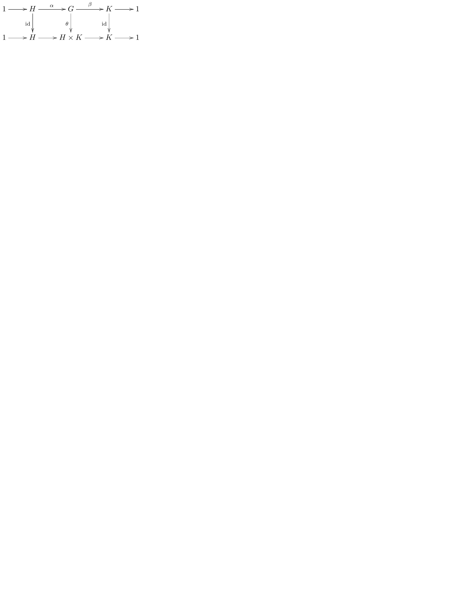

# xy-pic

<https://bookdown.org/yihui/rmarkdown-cookbook/install-latex-pkgs.html>

`tinytex::install_tinytex()`

## pure LaTeX equation environment not rendering xy-pic in HTML

the following xymatrix from LaTeX package xy for xy-pic is not shown or rendered in HTML:

`$\LaTeX$` can only be used in HTML, not PDF

::: {show-in="pdf"}
\xymatrix{U\ar[ddr]_{\psi}\ar[drr]^{\varphi}\ar[dr]|-{(x,y)}\\
 & X\times_{Z}Y\ar[d]^{q}\ar[r]_{p} & X\ar[d]_{f}\\
 & Y\ar[r]^{g} & Z
}
:::

::: {show-in="html"}
<!-- ```{r, engine="tikz", fig.cap="xy-pic", out.width="65%", echo=FALSE, cache=TRUE, engine.opts=list(extra.preamble=c("\\usepackage{xy}"))}
\xymatrix{U\ar[ddr]_{\psi}\ar[drr]^{\varphi}\ar[dr]|-{(x,y)}\\
 & X\times_{Z}Y\ar[d]^{q}\ar[r]_{p} & X\ar[d]_{f}\\
 & Y\ar[r]^{g} & Z
``` -->

\require{xy}\xymatrix{U\ar[ddr]_{\psi}\ar[drr]^{\varphi}\ar[dr]|-{(x,y)}\\
 & X\times_{Z}Y\ar[d]^{q}\ar[r]_{p} & X\ar[d]_{f}\\
 & Y\ar[r]^{g} & Z
}

$$
\require{xy}
\xymatrix{U\ar[ddr]_{\psi}\ar[drr]^{\varphi}\ar[dr]|-{(x,y)}\\
 & X\times_{Z}Y\ar[d]^{q}\ar[r]_{p} & X\ar[d]_{f}\\
 & Y\ar[r]^{g} & Z
}
$$
:::

## R figure knit with TikZ engine


```r
knitr::opts_chunk$set(fig.pos = "H", out.extra = "")
```

https://bookdown.org/yihui/rmarkdown-cookbook/html-scroll.html

<style type="text/css">
pre {
  max-width: 400px;
  overflow-x: auto;
  max-height: 600px;
  overflow-y: auto;
}

/*
pre {
  max-height: 300px;
  overflow-y: auto;
}

pre[class] {
  max-height: 100px;
}
*/
</style>

https://tex.stackexchange.com/questions/669083/how-can-i-draw-the-following-commutative-diagram

<div class="figure">

<p class="caption">(\#fig:unnamed-chunk-3)xy-pic or xymatrix</p>
</div>

<div class="figure">

<p class="caption">(\#fig:unnamed-chunk-4)tikz-cd</p>
</div>

:::::: {.cols data-latex=""}
::: {.col data-latex="{0.45\textwidth}"}

```tex
\xymatrix{
  1 \ar[r] &
  H \ar[r]^{\alpha} \ar[d]_{\mathrm{id}} &
  G \ar[r]^{\beta} \ar[d]_{\theta} &
  K \ar[r] \ar[d]_{\mathrm{id}} &
  1
  \\
  1 \ar[r] &
  H \ar[r] &
  H\times K \ar[r] &
  K \ar[r] &
  1
}
```
:::

::: {.col data-latex="{0.10\textwidth}"}
\ 
:::

::: {.col data-latex="{0.45\textwidth}"}
<div class="figure">

<p class="caption">(\#fig:unnamed-chunk-6)xy-pic or xymatrix</p>
</div>
:::
::::::
