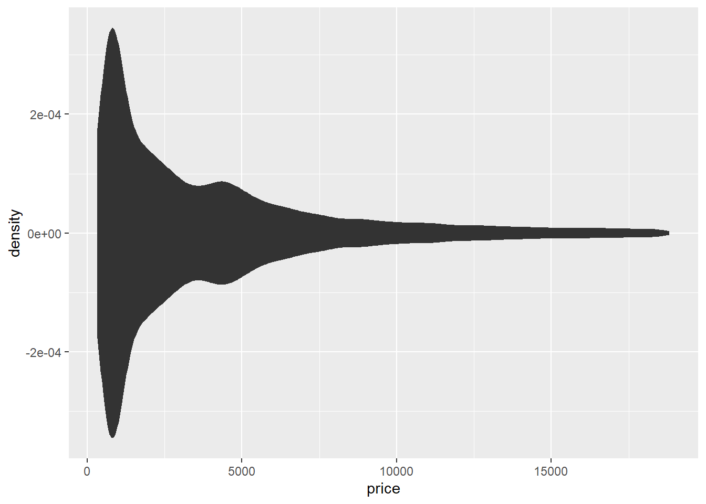
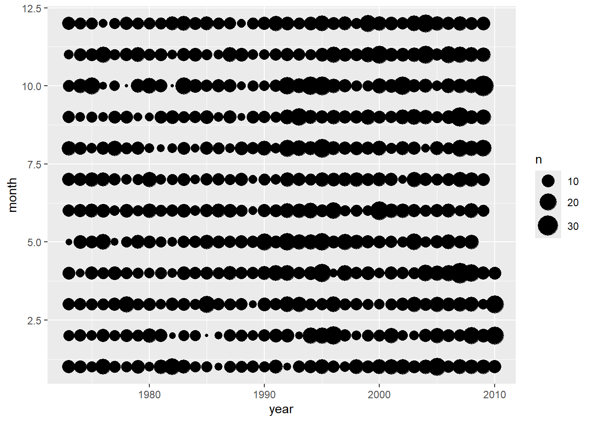
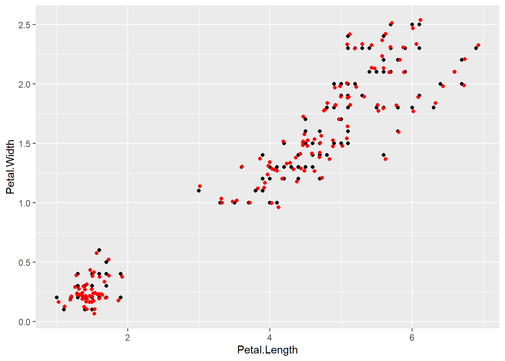

# ggplot2

https://bookdown.org/xiangyun/msg/system.html#chap:system

Modern Statistical Graphics [section 5.1](https://bookdown.org/xiangyun/msg/system.html#sec:ggplot2)

- https://www.rdocumentation.org/ to search function
- ggplot2
  - https://ggplot2.tidyverse.org/index.html to search ggplot2 function
  - panel = layer
    - geom = geometric objects / geometry = element
      - [element](https://bookdown.org/xiangyun/msg/elements.html#cha:elements)
    - statistic
    - scale
    - coordinate system
    - facet

<style type="text/css">
pre {
  max-width: 400px;
  overflow-x: auto;
  max-height: 600px;
  overflow-y: auto;
}

/*
pre {
  max-height: 300px;
  overflow-y: auto;
}

pre[class] {
  max-height: 100px;
}
*/
</style>

:::::: {.cols data-latex=""}
::: {.col data-latex="{0.45\textwidth}"}

```r
library(ggplot2)

p <- ggplot(aes(x = hp, y = mpg), data = mtcars) +
  geom_point() # layer of scatterplot
p + geom_smooth(method = "loess") # add layer of smooth
```
:::

::: {.col data-latex="{0.10\textwidth}"}
\ 
:::

::: {.col data-latex="{0.45\textwidth}"}

```
## Warning: package 'ggplot2' was built under R version 4.3.3
```

```
## `geom_smooth()` using formula = 'y ~ x'
```


:::
::::::

## geom

https://bookdown.org/xiangyun/msg/system.html#section-13

:::::: {.cols data-latex=""}
::: {.col data-latex="{0.45\textwidth}"}

```r
library(ggplot2)

ggplot(aes(x = hp, y = mpg), data = mtcars) +
  geom_point() +
  geom_smooth(method = "loess")
```
:::

::: {.col data-latex="{0.10\textwidth}"}
\ 
:::

::: {.col data-latex="{0.45\textwidth}"}

```
## `geom_smooth()` using formula = 'y ~ x'
```


:::
::::::

points https://ggplot2.tidyverse.org/reference/geom_point.html?q=geom_point#null

`geom_point`

smoothed conditional means https://ggplot2.tidyverse.org/reference/geom_smooth.html?q=geom_sm#null

> Aids the eye in seeing patterns in the presence of overplotting. `geom_smooth()` and `stat_smooth()` are effectively aliases: they both use the same arguments. Use `stat_smooth()` if you want to display the results with a non-standard geom.

`geom_smooth`

`stat_smooth`

> `method` Smoothing method (function) to use, accepts either NULL or a character vector, e.g. `"lm"`, `"glm"`, `"gam"`, `"loess"` or a function, e.g. `MASS::rlm` or `mgcv::gam`, `stats::lm`, or `stats::loess`. `"auto"` is also accepted for backwards compatibility. It is equivalent to `NULL`.

***


```r
# install.packages("hexbin")
```

:::::: {.cols data-latex=""}
::: {.col data-latex="{0.45\textwidth}"}

```r
library(ggplot2)

ggplot(aes(x = carat, y = price), data = diamonds) +
  geom_hex() +
  scale_fill_gradient(low = "blue3", high = "red3")
```
:::

::: {.col data-latex="{0.10\textwidth}"}
\ 
:::

::: {.col data-latex="{0.45\textwidth}"}

:::
::::::

gradient color scales https://ggplot2.tidyverse.org/reference/scale_gradient.html?q=scale_fill_gradient#ref-usage

https://ggplot2.tidyverse.org/reference/scale_gradient.html?q=scale_fill_gradient#ref-examples

***

:::::: {.cols data-latex=""}
::: {.col data-latex="{0.45\textwidth}"}

```r
library(ggplot2)

ggplot(aes(x = Petal.Length, y = Petal.Width), data = iris) +
  geom_point(aes(color = Species, shape = Species))
```
:::

::: {.col data-latex="{0.10\textwidth}"}
\ 
:::

::: {.col data-latex="{0.45\textwidth}"}

:::
::::::

***

basic plot system

https://bookdown.org/xiangyun/msg/elements.html#sec:points

:::::: {.cols data-latex=""}
::: {.col data-latex="{0.45\textwidth}"}

```r
# iris species converted to type integer 1, 2, 3 for further using vectors
idx <- as.integer(iris[["Species"]])
plot(iris[, 3:4],
  pch = c(24, 21, 25)[idx],
  col = c("black", "red", "blue")[idx], panel.first = grid()
)
legend("topleft",
  legend = levels(iris[["Species"]]),
  col = c("black", "red", "blue"), pch = c(24, 21, 25), bty = "n"
)
```
:::

::: {.col data-latex="{0.10\textwidth}"}
\ 
:::

::: {.col data-latex="{0.45\textwidth}"}

:::
::::::

`plot` https://www.rdocumentation.org/packages/graphics/versions/3.6.2/topics/plot.default

> `pch` a vector of **plotting characters** or symbols: see [`points`](https://www.rdocumentation.org/packages/graphics/versions/3.6.2/topics/points).

> `col` The **colors** for lines and points. Multiple colors can be specified so that each point can be given its own color. If there are fewer colors than points they are recycled in the standard fashion. Lines will all be plotted in the first colour specified.

> `panel.first` an ‘expression’ to be evaluated after the plot axes are set up but before any plotting takes place. This can be useful for drawing **background grids** or **scatterplot smooths**. Note that this works by lazy evaluation: passing this argument from other plot methods may well not work since it may be evaluated too early.

`legend` https://www.rdocumentation.org/packages/graphics/versions/3.6.2/topics/legend

> `bty` the **type of box** to be drawn around the legend. The allowed values are "o" (the default) and "n".

https://stackoverflow.com/questions/10108073/plot-legends-without-border-and-with-white-background

> Use option `bty = "n"` in legend to remove the box around the legend.

> `legend` a character or expression vector of length $\ge 1$ to appear in the legend. Other objects will be coerced by [`as.graphicsAnnot`](https://www.rdocumentation.org/packages/grDevices/versions/3.6.2/topics/as.graphicsAnnot)

### basic plot system decomposition

:::::: {.cols data-latex=""}
::: {.col data-latex="{0.45\textwidth}"}

```r
iris
```
:::

::: {.col data-latex="{0.10\textwidth}"}
\ 
:::

::: {.col data-latex="{0.45\textwidth}"}

```
##     Sepal.Length Sepal.Width Petal.Length Petal.Width    Species
## 1            5.1         3.5          1.4         0.2     setosa
## 2            4.9         3.0          1.4         0.2     setosa
## 3            4.7         3.2          1.3         0.2     setosa
## 4            4.6         3.1          1.5         0.2     setosa
## 5            5.0         3.6          1.4         0.2     setosa
## 6            5.4         3.9          1.7         0.4     setosa
## 7            4.6         3.4          1.4         0.3     setosa
## 8            5.0         3.4          1.5         0.2     setosa
## 9            4.4         2.9          1.4         0.2     setosa
## 10           4.9         3.1          1.5         0.1     setosa
## 11           5.4         3.7          1.5         0.2     setosa
## 12           4.8         3.4          1.6         0.2     setosa
## 13           4.8         3.0          1.4         0.1     setosa
## 14           4.3         3.0          1.1         0.1     setosa
## 15           5.8         4.0          1.2         0.2     setosa
## 16           5.7         4.4          1.5         0.4     setosa
## 17           5.4         3.9          1.3         0.4     setosa
## 18           5.1         3.5          1.4         0.3     setosa
## 19           5.7         3.8          1.7         0.3     setosa
## 20           5.1         3.8          1.5         0.3     setosa
## 21           5.4         3.4          1.7         0.2     setosa
## 22           5.1         3.7          1.5         0.4     setosa
## 23           4.6         3.6          1.0         0.2     setosa
## 24           5.1         3.3          1.7         0.5     setosa
## 25           4.8         3.4          1.9         0.2     setosa
## 26           5.0         3.0          1.6         0.2     setosa
## 27           5.0         3.4          1.6         0.4     setosa
## 28           5.2         3.5          1.5         0.2     setosa
## 29           5.2         3.4          1.4         0.2     setosa
## 30           4.7         3.2          1.6         0.2     setosa
## 31           4.8         3.1          1.6         0.2     setosa
## 32           5.4         3.4          1.5         0.4     setosa
## 33           5.2         4.1          1.5         0.1     setosa
## 34           5.5         4.2          1.4         0.2     setosa
## 35           4.9         3.1          1.5         0.2     setosa
## 36           5.0         3.2          1.2         0.2     setosa
## 37           5.5         3.5          1.3         0.2     setosa
## 38           4.9         3.6          1.4         0.1     setosa
## 39           4.4         3.0          1.3         0.2     setosa
## 40           5.1         3.4          1.5         0.2     setosa
## 41           5.0         3.5          1.3         0.3     setosa
## 42           4.5         2.3          1.3         0.3     setosa
## 43           4.4         3.2          1.3         0.2     setosa
## 44           5.0         3.5          1.6         0.6     setosa
## 45           5.1         3.8          1.9         0.4     setosa
## 46           4.8         3.0          1.4         0.3     setosa
## 47           5.1         3.8          1.6         0.2     setosa
## 48           4.6         3.2          1.4         0.2     setosa
## 49           5.3         3.7          1.5         0.2     setosa
## 50           5.0         3.3          1.4         0.2     setosa
## 51           7.0         3.2          4.7         1.4 versicolor
## 52           6.4         3.2          4.5         1.5 versicolor
## 53           6.9         3.1          4.9         1.5 versicolor
## 54           5.5         2.3          4.0         1.3 versicolor
## 55           6.5         2.8          4.6         1.5 versicolor
## 56           5.7         2.8          4.5         1.3 versicolor
## 57           6.3         3.3          4.7         1.6 versicolor
## 58           4.9         2.4          3.3         1.0 versicolor
## 59           6.6         2.9          4.6         1.3 versicolor
## 60           5.2         2.7          3.9         1.4 versicolor
## 61           5.0         2.0          3.5         1.0 versicolor
## 62           5.9         3.0          4.2         1.5 versicolor
## 63           6.0         2.2          4.0         1.0 versicolor
## 64           6.1         2.9          4.7         1.4 versicolor
## 65           5.6         2.9          3.6         1.3 versicolor
## 66           6.7         3.1          4.4         1.4 versicolor
## 67           5.6         3.0          4.5         1.5 versicolor
## 68           5.8         2.7          4.1         1.0 versicolor
## 69           6.2         2.2          4.5         1.5 versicolor
## 70           5.6         2.5          3.9         1.1 versicolor
## 71           5.9         3.2          4.8         1.8 versicolor
## 72           6.1         2.8          4.0         1.3 versicolor
## 73           6.3         2.5          4.9         1.5 versicolor
## 74           6.1         2.8          4.7         1.2 versicolor
## 75           6.4         2.9          4.3         1.3 versicolor
## 76           6.6         3.0          4.4         1.4 versicolor
## 77           6.8         2.8          4.8         1.4 versicolor
## 78           6.7         3.0          5.0         1.7 versicolor
## 79           6.0         2.9          4.5         1.5 versicolor
## 80           5.7         2.6          3.5         1.0 versicolor
## 81           5.5         2.4          3.8         1.1 versicolor
## 82           5.5         2.4          3.7         1.0 versicolor
## 83           5.8         2.7          3.9         1.2 versicolor
## 84           6.0         2.7          5.1         1.6 versicolor
## 85           5.4         3.0          4.5         1.5 versicolor
## 86           6.0         3.4          4.5         1.6 versicolor
## 87           6.7         3.1          4.7         1.5 versicolor
## 88           6.3         2.3          4.4         1.3 versicolor
## 89           5.6         3.0          4.1         1.3 versicolor
## 90           5.5         2.5          4.0         1.3 versicolor
## 91           5.5         2.6          4.4         1.2 versicolor
## 92           6.1         3.0          4.6         1.4 versicolor
## 93           5.8         2.6          4.0         1.2 versicolor
## 94           5.0         2.3          3.3         1.0 versicolor
## 95           5.6         2.7          4.2         1.3 versicolor
## 96           5.7         3.0          4.2         1.2 versicolor
## 97           5.7         2.9          4.2         1.3 versicolor
## 98           6.2         2.9          4.3         1.3 versicolor
## 99           5.1         2.5          3.0         1.1 versicolor
## 100          5.7         2.8          4.1         1.3 versicolor
## 101          6.3         3.3          6.0         2.5  virginica
## 102          5.8         2.7          5.1         1.9  virginica
## 103          7.1         3.0          5.9         2.1  virginica
## 104          6.3         2.9          5.6         1.8  virginica
## 105          6.5         3.0          5.8         2.2  virginica
## 106          7.6         3.0          6.6         2.1  virginica
## 107          4.9         2.5          4.5         1.7  virginica
## 108          7.3         2.9          6.3         1.8  virginica
## 109          6.7         2.5          5.8         1.8  virginica
## 110          7.2         3.6          6.1         2.5  virginica
## 111          6.5         3.2          5.1         2.0  virginica
## 112          6.4         2.7          5.3         1.9  virginica
## 113          6.8         3.0          5.5         2.1  virginica
## 114          5.7         2.5          5.0         2.0  virginica
## 115          5.8         2.8          5.1         2.4  virginica
## 116          6.4         3.2          5.3         2.3  virginica
## 117          6.5         3.0          5.5         1.8  virginica
## 118          7.7         3.8          6.7         2.2  virginica
## 119          7.7         2.6          6.9         2.3  virginica
## 120          6.0         2.2          5.0         1.5  virginica
## 121          6.9         3.2          5.7         2.3  virginica
## 122          5.6         2.8          4.9         2.0  virginica
## 123          7.7         2.8          6.7         2.0  virginica
## 124          6.3         2.7          4.9         1.8  virginica
## 125          6.7         3.3          5.7         2.1  virginica
## 126          7.2         3.2          6.0         1.8  virginica
## 127          6.2         2.8          4.8         1.8  virginica
## 128          6.1         3.0          4.9         1.8  virginica
## 129          6.4         2.8          5.6         2.1  virginica
## 130          7.2         3.0          5.8         1.6  virginica
## 131          7.4         2.8          6.1         1.9  virginica
## 132          7.9         3.8          6.4         2.0  virginica
## 133          6.4         2.8          5.6         2.2  virginica
## 134          6.3         2.8          5.1         1.5  virginica
## 135          6.1         2.6          5.6         1.4  virginica
## 136          7.7         3.0          6.1         2.3  virginica
## 137          6.3         3.4          5.6         2.4  virginica
## 138          6.4         3.1          5.5         1.8  virginica
## 139          6.0         3.0          4.8         1.8  virginica
## 140          6.9         3.1          5.4         2.1  virginica
## 141          6.7         3.1          5.6         2.4  virginica
## 142          6.9         3.1          5.1         2.3  virginica
## 143          5.8         2.7          5.1         1.9  virginica
## 144          6.8         3.2          5.9         2.3  virginica
## 145          6.7         3.3          5.7         2.5  virginica
## 146          6.7         3.0          5.2         2.3  virginica
## 147          6.3         2.5          5.0         1.9  virginica
## 148          6.5         3.0          5.2         2.0  virginica
## 149          6.2         3.4          5.4         2.3  virginica
## 150          5.9         3.0          5.1         1.8  virginica
```
:::
::::::

***

:::::: {.cols data-latex=""}
::: {.col data-latex="{0.45\textwidth}"}

```r
iris$Species
```
:::

::: {.col data-latex="{0.10\textwidth}"}
\ 
:::

::: {.col data-latex="{0.45\textwidth}"}

```
##   [1] setosa     setosa     setosa     setosa     setosa     setosa    
##   [7] setosa     setosa     setosa     setosa     setosa     setosa    
##  [13] setosa     setosa     setosa     setosa     setosa     setosa    
##  [19] setosa     setosa     setosa     setosa     setosa     setosa    
##  [25] setosa     setosa     setosa     setosa     setosa     setosa    
##  [31] setosa     setosa     setosa     setosa     setosa     setosa    
##  [37] setosa     setosa     setosa     setosa     setosa     setosa    
##  [43] setosa     setosa     setosa     setosa     setosa     setosa    
##  [49] setosa     setosa     versicolor versicolor versicolor versicolor
##  [55] versicolor versicolor versicolor versicolor versicolor versicolor
##  [61] versicolor versicolor versicolor versicolor versicolor versicolor
##  [67] versicolor versicolor versicolor versicolor versicolor versicolor
##  [73] versicolor versicolor versicolor versicolor versicolor versicolor
##  [79] versicolor versicolor versicolor versicolor versicolor versicolor
##  [85] versicolor versicolor versicolor versicolor versicolor versicolor
##  [91] versicolor versicolor versicolor versicolor versicolor versicolor
##  [97] versicolor versicolor versicolor versicolor virginica  virginica 
## [103] virginica  virginica  virginica  virginica  virginica  virginica 
## [109] virginica  virginica  virginica  virginica  virginica  virginica 
## [115] virginica  virginica  virginica  virginica  virginica  virginica 
## [121] virginica  virginica  virginica  virginica  virginica  virginica 
## [127] virginica  virginica  virginica  virginica  virginica  virginica 
## [133] virginica  virginica  virginica  virginica  virginica  virginica 
## [139] virginica  virginica  virginica  virginica  virginica  virginica 
## [145] virginica  virginica  virginica  virginica  virginica  virginica 
## Levels: setosa versicolor virginica
```
:::
::::::

***

:::::: {.cols data-latex=""}
::: {.col data-latex="{0.45\textwidth}"}

```r
iris[["Species"]]
```
:::

::: {.col data-latex="{0.10\textwidth}"}
\ 
:::

::: {.col data-latex="{0.45\textwidth}"}

```
##   [1] setosa     setosa     setosa     setosa     setosa     setosa    
##   [7] setosa     setosa     setosa     setosa     setosa     setosa    
##  [13] setosa     setosa     setosa     setosa     setosa     setosa    
##  [19] setosa     setosa     setosa     setosa     setosa     setosa    
##  [25] setosa     setosa     setosa     setosa     setosa     setosa    
##  [31] setosa     setosa     setosa     setosa     setosa     setosa    
##  [37] setosa     setosa     setosa     setosa     setosa     setosa    
##  [43] setosa     setosa     setosa     setosa     setosa     setosa    
##  [49] setosa     setosa     versicolor versicolor versicolor versicolor
##  [55] versicolor versicolor versicolor versicolor versicolor versicolor
##  [61] versicolor versicolor versicolor versicolor versicolor versicolor
##  [67] versicolor versicolor versicolor versicolor versicolor versicolor
##  [73] versicolor versicolor versicolor versicolor versicolor versicolor
##  [79] versicolor versicolor versicolor versicolor versicolor versicolor
##  [85] versicolor versicolor versicolor versicolor versicolor versicolor
##  [91] versicolor versicolor versicolor versicolor versicolor versicolor
##  [97] versicolor versicolor versicolor versicolor virginica  virginica 
## [103] virginica  virginica  virginica  virginica  virginica  virginica 
## [109] virginica  virginica  virginica  virginica  virginica  virginica 
## [115] virginica  virginica  virginica  virginica  virginica  virginica 
## [121] virginica  virginica  virginica  virginica  virginica  virginica 
## [127] virginica  virginica  virginica  virginica  virginica  virginica 
## [133] virginica  virginica  virginica  virginica  virginica  virginica 
## [139] virginica  virginica  virginica  virginica  virginica  virginica 
## [145] virginica  virginica  virginica  virginica  virginica  virginica 
## Levels: setosa versicolor virginica
```
:::
::::::

***

:::::: {.cols data-latex=""}
::: {.col data-latex="{0.45\textwidth}"}

```r
as.integer(iris[["Species"]])
```
:::

::: {.col data-latex="{0.10\textwidth}"}
\ 
:::

::: {.col data-latex="{0.45\textwidth}"}

```
##   [1] 1 1 1 1 1 1 1 1 1 1 1 1 1 1 1 1 1 1 1 1 1 1 1 1 1 1 1 1 1 1 1 1 1 1 1 1 1
##  [38] 1 1 1 1 1 1 1 1 1 1 1 1 1 2 2 2 2 2 2 2 2 2 2 2 2 2 2 2 2 2 2 2 2 2 2 2 2
##  [75] 2 2 2 2 2 2 2 2 2 2 2 2 2 2 2 2 2 2 2 2 2 2 2 2 2 2 3 3 3 3 3 3 3 3 3 3 3
## [112] 3 3 3 3 3 3 3 3 3 3 3 3 3 3 3 3 3 3 3 3 3 3 3 3 3 3 3 3 3 3 3 3 3 3 3 3 3
## [149] 3 3
```
:::
::::::

***

:::::: {.cols data-latex=""}
::: {.col data-latex="{0.45\textwidth}"}

```r
levels(iris[["Species"]])
```
:::

::: {.col data-latex="{0.10\textwidth}"}
\ 
:::

::: {.col data-latex="{0.45\textwidth}"}

```
## [1] "setosa"     "versicolor" "virginica"
```
:::
::::::

***

:::::: {.cols data-latex=""}
::: {.col data-latex="{0.45\textwidth}"}

```r
idx <- as.integer(iris[["Species"]])
idx
```
:::

::: {.col data-latex="{0.10\textwidth}"}
\ 
:::

::: {.col data-latex="{0.45\textwidth}"}

```
##   [1] 1 1 1 1 1 1 1 1 1 1 1 1 1 1 1 1 1 1 1 1 1 1 1 1 1 1 1 1 1 1 1 1 1 1 1 1 1
##  [38] 1 1 1 1 1 1 1 1 1 1 1 1 1 2 2 2 2 2 2 2 2 2 2 2 2 2 2 2 2 2 2 2 2 2 2 2 2
##  [75] 2 2 2 2 2 2 2 2 2 2 2 2 2 2 2 2 2 2 2 2 2 2 2 2 2 2 3 3 3 3 3 3 3 3 3 3 3
## [112] 3 3 3 3 3 3 3 3 3 3 3 3 3 3 3 3 3 3 3 3 3 3 3 3 3 3 3 3 3 3 3 3 3 3 3 3 3
## [149] 3 3
```
:::
::::::

***

:::::: {.cols data-latex=""}
::: {.col data-latex="{0.45\textwidth}"}

```r
idx <- as.integer(iris[["Species"]])
c(24, 21, 25)[idx]
```
:::

::: {.col data-latex="{0.10\textwidth}"}
\ 
:::

::: {.col data-latex="{0.45\textwidth}"}

```
##   [1] 24 24 24 24 24 24 24 24 24 24 24 24 24 24 24 24 24 24 24 24 24 24 24 24 24
##  [26] 24 24 24 24 24 24 24 24 24 24 24 24 24 24 24 24 24 24 24 24 24 24 24 24 24
##  [51] 21 21 21 21 21 21 21 21 21 21 21 21 21 21 21 21 21 21 21 21 21 21 21 21 21
##  [76] 21 21 21 21 21 21 21 21 21 21 21 21 21 21 21 21 21 21 21 21 21 21 21 21 21
## [101] 25 25 25 25 25 25 25 25 25 25 25 25 25 25 25 25 25 25 25 25 25 25 25 25 25
## [126] 25 25 25 25 25 25 25 25 25 25 25 25 25 25 25 25 25 25 25 25 25 25 25 25 25
```
:::
::::::

## statistic

https://bookdown.org/xiangyun/msg/system.html#section-14

:::::: {.cols data-latex=""}
::: {.col data-latex="{0.45\textwidth}"}

```r
library(ggplot2)

ggplot(diamonds, aes(x = price)) +
  stat_density(aes(ymax = ..density.., ymin = -..density..),
    geom = "ribbon", position = "identity"
  )
```
:::

::: {.col data-latex="{0.10\textwidth}"}
\ 
:::

::: {.col data-latex="{0.45\textwidth}"}

```
## Warning: The dot-dot notation (`..density..`) was deprecated in ggplot2 3.4.0.
## ℹ Please use `after_stat(density)` instead.
## This warning is displayed once every 8 hours.
## Call `lifecycle::last_lifecycle_warnings()` to see where this warning was
## generated.
```


:::
::::::

smoothed density estimates https://ggplot2.tidyverse.org/reference/geom_density.html

> Computes and draws kernel density estimate, which is a smoothed version of the histogram. This is a useful alternative to the histogram for continuous data that comes from an underlying smooth distribution.

`geom_density`

`stat_density`

https://ggplot2.tidyverse.org/reference/geom_density.html#ref-examples

## scale

ggplot2

https://bookdown.org/xiangyun/msg/system.html#section-15

:::::: {.cols data-latex=""}
::: {.col data-latex="{0.45\textwidth}"}

```r
library(ggplot2)

data(quake6, package = "MSG")
ggplot(quake6, aes(x = year, y = month)) +
  stat_sum(aes(size = ..n..)) + scale_size(range = c(1, 8))
```
:::

::: {.col data-latex="{0.10\textwidth}"}
\ 
:::

::: {.col data-latex="{0.45\textwidth}"}

```
## Warning: 套件 'ggplot2' 是用 R 版本 4.3.3 來建造的
```

```
## Warning: The dot-dot notation (`..n..`) was deprecated in ggplot2 3.4.0.
## ℹ Please use `after_stat(n)` instead.
## This warning is displayed once every 8 hours.
## Call `lifecycle::last_lifecycle_warnings()` to see where this warning was
## generated.
```


:::
::::::

count overlapping points https://ggplot2.tidyverse.org/reference/geom_count.html?q=stat_sum#ref-usage

> This is a variant `geom_point()` that counts the number of observations at each location, then maps the count to point area. It useful when you have discrete data and overplotting.

`geom_count`

`stat_sum`

https://ggplot2.tidyverse.org/reference/geom_count.html?q=stat_sum#ref-examples

scales for area or radius https://ggplot2.tidyverse.org/reference/scale_size.html?q=scale_size#null

`scale_size`

## coordinate system

https://bookdown.org/xiangyun/msg/system.html#section-16

:::::: {.cols data-latex=""}
::: {.col data-latex="{0.45\textwidth}"}

```r
library(ggplot2)

p <- ggplot(aes(x = cut, y = log(price)), data = diamonds) +
  geom_boxplot()
p
p + coord_flip()
```
:::

::: {.col data-latex="{0.10\textwidth}"}
\ 
:::

::: {.col data-latex="{0.45\textwidth}"}

:::
::::::

***

:::::: {.cols data-latex=""}
::: {.col data-latex="{0.45\textwidth}"}

```r
library(ggplot2)

ggplot(aes(x = cut, fill = cut), data = diamonds) +
  coord_polar() +
  geom_bar(width = 1, show.legend = FALSE)
```
:::

::: {.col data-latex="{0.10\textwidth}"}
\ 
:::

::: {.col data-latex="{0.45\textwidth}"}

:::
::::::

## facet

https://bookdown.org/xiangyun/msg/system.html#subsec:facet

:::::: {.cols data-latex=""}
::: {.col data-latex="{0.45\textwidth}"}

```r
library(ggplot2)

ggplot(aes(x = carat), data = diamonds) +
  geom_density() +
  facet_grid(cut ~ .)
```
:::

::: {.col data-latex="{0.10\textwidth}"}
\ 
:::

::: {.col data-latex="{0.45\textwidth}"}

:::
::::::

## jitter

https://bookdown.org/xiangyun/msg/system.html#section-17

:::::: {.cols data-latex=""}
::: {.col data-latex="{0.45\textwidth}"}

```r
library(ggplot2)

ggplot(aes(x = Petal.Length, y = Petal.Width), data = iris) +
  geom_point() +
  geom_jitter(color = "red")
```
:::

::: {.col data-latex="{0.10\textwidth}"}
\ 
:::

::: {.col data-latex="{0.45\textwidth}"}

:::
::::::

## font

https://bookdown.org/xiangyun/msg/system.html#subsec:font
