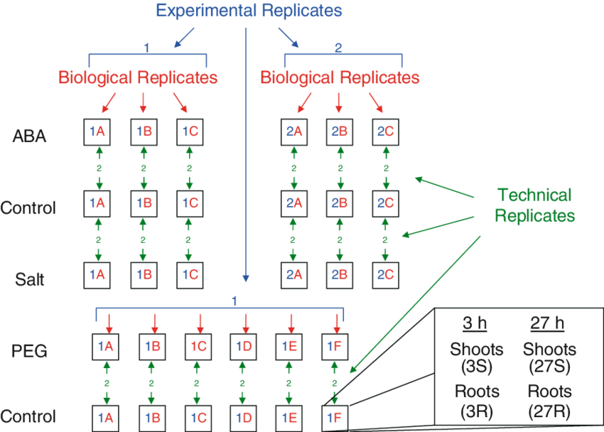
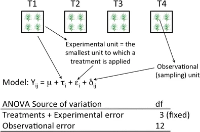
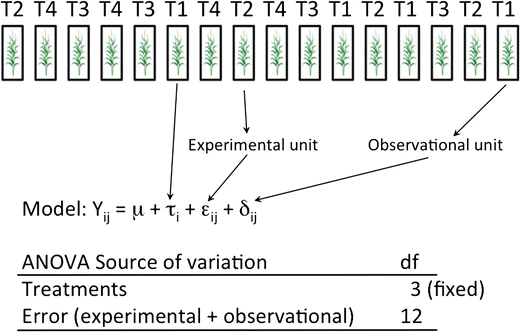
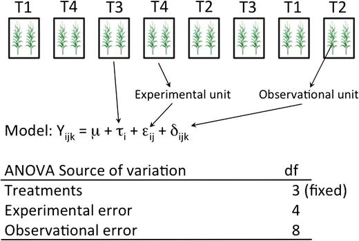

# design of experiment

experimental design = experiment design = design of experiments = DoE

[@hu2022] p.72

question-design-analysis loop

## [notational system for design]^[\@ref(notational-system-for-design)]^

[graphic notation, advanced]^[\@ref(graphic-notation-advanced)]^

## terminology

- population
  - sample
    - subsample
- unit
  - experimental unit
    - response
    - block: group of similar experimental unit ([@milliken2004] p.74)
  - observational unit / measurement unit ^[https://passel2.unl.edu/view/lesson/2e09f0055f13/6]
- replication ([@hu2022] p.76): an independent observation of the treatment ([@milliken2004] p.74)
  - treatment replication: experimental-unit-to-experimental-unit variation
  - measurement replication = subsample: measurement-to-measurement variation
- replicate
  - experimental replicate
  - biological replicate
  - technical replicate

***

[@milliken2004] p.73

$Y_{\scriptscriptstyle{ij}}$: the response observed from the $j$^th^ experimental unit assigned to the $i$^th^ treatment

$\mu_{\scriptscriptstyle{i}}$: the mean response to the $i$^th^ treatment

$\mathcal{E}_{\scriptscriptstyle{ij}}$: the noise from other possible natural variation or nonrandom and random error

$$
Y_{{\scriptscriptstyle i}{\scriptscriptstyle j}}=\mu_{{\scriptscriptstyle i}}+\mathcal{E}_{{\scriptscriptstyle i}{\scriptscriptstyle j}},\begin{cases}
i\in\mathbb{N}\cap\left[1,n_{{\scriptscriptstyle i}}\right] & \mathbb{N}\ni n_{{\scriptscriptstyle i}}\text{ treatments}\\
j\in\mathbb{N}\cap\left[1,n_{{\scriptscriptstyle j}}\right] & \mathbb{N}\ni n_{{\scriptscriptstyle j}}\text{ experimental units per treatment}
\end{cases}
$$

Each treatment has $n_{j}$ experimental units, so there are totally $n_{i}n_{j}$ experimental units.

If experimental units cannot be homogeneous, we can try to 

- stratify them
- group them, and measure group to group variation
- block them

here $n_{j}$ blocks each with $n_{i}$ experimental units where **each treatment occurs once in each block**

$$
\begin{aligned}
Y_{{\scriptscriptstyle i}{\scriptscriptstyle j}}= & \mu_{{\scriptscriptstyle i}}+\mathcal{E}_{{\scriptscriptstyle i}{\scriptscriptstyle j}}\\
= & \mu_{{\scriptscriptstyle i}}+b_{{\scriptscriptstyle j}}+\mathcal{E}_{{\scriptscriptstyle i}{\scriptscriptstyle j}}^{*},\begin{cases}
i\in\mathbb{N}\cap\left[1,n_{{\scriptscriptstyle i}}\right] & \mathbb{N}\ni n_{{\scriptscriptstyle i}}\text{ experimental units per block}\\
j\in\mathbb{N}\cap\left[1,n_{{\scriptscriptstyle j}}\right] & \mathbb{N}\ni n_{{\scriptscriptstyle j}}\text{ blocks}
\end{cases}
\end{aligned}
$$

where

$$
\mathcal{E}_{{\scriptscriptstyle i}{\scriptscriptstyle j}}=b_{{\scriptscriptstyle j}}+\mathcal{E}_{{\scriptscriptstyle i}{\scriptscriptstyle j}}^{*}
$$

> i.e. the variation between groups or blocks of experimental units has been identified and isolated from $\mathcal{E}_{ij}^{*}$, which represents the variability of experimental units within a block. By isolating the block effect from the experimental units, the within-block variation can be used to compare treatment effects, which involves computing the estimated standard errors of contrasts of the treatments.

$$
\begin{aligned}
Y_{{\scriptscriptstyle i}{\scriptscriptstyle j}}-Y_{{\scriptscriptstyle i^{\prime}}{\scriptscriptstyle j}}= & \left(\mu_{{\scriptscriptstyle i}}+b_{{\scriptscriptstyle j}}+\mathcal{E}_{{\scriptscriptstyle i}{\scriptscriptstyle j}}^{*}\right)\\
- & \left(\mu_{{\scriptscriptstyle i^{\prime}}}+b_{{\scriptscriptstyle j}}+\mathcal{E}_{{\scriptscriptstyle i^{\prime}}{\scriptscriptstyle j}}^{*}\right)\\
= & \left(\mu_{{\scriptscriptstyle i}}-\mu_{{\scriptscriptstyle i^{\prime}}}\right)+\left(\mathcal{E}_{{\scriptscriptstyle i}{\scriptscriptstyle j}}^{*}-\mathcal{E}_{{\scriptscriptstyle i^{\prime}}{\scriptscriptstyle j}}^{*}\right)
\end{aligned}
$$

> which does not depend on the block effect $b_{j}$ or free of block effects. The result of this difference is that the variance of the difference of two treatment responses within a block depends on the within-block variation among the experimental units and not the between-block variation.

### replication vs. subsample

> It is very important to distinguish between a **subsample** and a **replication** since the error variance estimated from between subsamples is in general considerably smaller than the error variance estimated from replications or between experimental units. ([@milliken2004] p.77)

https://www.researchgate.net/post/What-is-Experimental-Unit-Replicate-Total-sample-size-treatment-size

### replication vs. repeated measurements

### replication, replicate

#### technical replicate, biological replicate

https://www.youtube.com/watch?v=c_cpl5YsBV8

(ref:buchanan2005) \ [@buchanan2005]

(\#fig:unnamed-chunk-1)experimental, biological, technical replicates ((ref:buchanan2005))

### Latin square design

LSD = Latin square design

[@zhang2021] p.505~507

https://tex.stackexchange.com/questions/501671/how-to-get-math-mode-curly-braces-in-tikz

`\\usepackage{pgfplots}` in `engine.opts=list(extra.preamble=c("\\usepackage{pgfplots}"))`

`\usetikzlibrary{decorations}`

(\#fig:unnamed-chunk-2)Latin square example

$$
Y_{{\scriptscriptstyle ijk}}=\mu+\alpha_{{\scriptscriptstyle i}}+\beta_{{\scriptscriptstyle j}}+\gamma_{{\scriptscriptstyle k}}+\mathcal{E}_{{\scriptscriptstyle ijk}},\begin{cases}
i\in\mathbb{N}\cap\left[1,p\right] & \mathbb{N}\ni p\text{ treatments}\\
j\in\mathbb{N}\cap\left[1,p\right] & \mathbb{N}\ni p\text{ rows}\\
k\in\mathbb{N}\cap\left[1,p\right] & \mathbb{N}\ni p\text{ columns}
\end{cases}
$$

$$
\mathcal{E}_{{\scriptscriptstyle ijk}}\overset{\text{i.i.d.}}{\sim}\mathrm{n}\left(0,\sigma^{2}\right)
$$

***

$\rho_{{\scriptscriptstyle i}}$: $i$^th^ row

$\kappa_{{\scriptscriptstyle j}}$: $j$^th^ column

$\tau_{{\scriptscriptstyle k}}$: $k$^th^ treatment

$$
\begin{aligned}
Y_{{\scriptscriptstyle ijk}}= & \mu+\alpha_{{\scriptscriptstyle i}}+\beta_{{\scriptscriptstyle j}}+\gamma_{{\scriptscriptstyle k}}+\mathcal{E}_{{\scriptscriptstyle ijk}},\begin{cases}
i\in\mathbb{N}\cap\left[1,p\right] & \mathbb{N}\ni p\text{ treatments}\\
j\in\mathbb{N}\cap\left[1,p\right] & \mathbb{N}\ni p\text{ rows}\\
k\in\mathbb{N}\cap\left[1,p\right] & \mathbb{N}\ni p\text{ columns}
\end{cases}\\
= & \mu+\rho_{{\scriptscriptstyle i}}+\kappa_{{\scriptscriptstyle j}}+\tau_{{\scriptscriptstyle k}}+\mathcal{E}_{{\scriptscriptstyle ijk}},\begin{cases}
i\in\mathbb{N}\cap\left[1,p\right] & \mathbb{N}\ni p\text{ rows}\\
j\in\mathbb{N}\cap\left[1,p\right] & \mathbb{N}\ni p\text{ columns}\\
k\in\mathbb{N}\cap\left[1,p\right] & \mathbb{N}\ni p\text{ treatments}
\end{cases}
\end{aligned}
$$

### model assumption and experimental unit, measurement/observational unit

(ref:casler2015) \ [@casler2015]

(\#fig:unnamed-chunk-3)model assumption and experimental unit 1 ((ref:casler2015) fig.1)

(\#fig:unnamed-chunk-4)model assumption and experimental unit 2 ((ref:casler2015) fig.2)

(\#fig:unnamed-chunk-5)model assumption and experimental unit 3 ((ref:casler2015) fig.3)

(\#fig:unnamed-chunk-6)model assumption and experimental unit 4 ((ref:casler2015) fig.4)

***

$$
Y_{{\scriptscriptstyle ijk}}=\mu+\tau_{{\scriptscriptstyle i}}+\beta_{{\scriptscriptstyle j}}+\epsilon_{{\scriptscriptstyle ij}}+\varDelta_{{\scriptscriptstyle ijk}}
$$

## experiment structure

### treatment structure

[@milliken2004] p.77

- 1-way treatment structure
- 2-way treatment structure
- factorial arrangement treatment structure
- *fractional* factorial arrangement treatment structure
- factorial arrangement with one or more controls

### design structure

[@milliken2004] p.77

- CRD = completely randomized design
- RCBD = randomized complete block design
  - ? why not called CRBD = completely randomized block design
- LSD = [Latin square design]^[\@ref(latin-square-design)]^
- IBD = incomplete block design
  - BIBD = balanced IBD
- various combinations and generalizations

### size of experimental unit

- split-plot design
  - split-split-plot design
  - split-split-split-plot design
- repeated measures design
  - cross-over design
  - change-over design
- nested design = hierarchical design
- variations and combinations
  - SSEU = several sizes of experimental units

## approach to experimentation

[@hu2022] p.75

- approach to experimentation
  - best-guess approach
  - one-factor-at-a-time approach = OFAT
  - factorial approach

## sample size estimation

## statistical analysis plan

## protocol

[@hu2022] p.95

- study objective
- study endpoint
  - primary endpoint
  - secondary endpoint(s)
- experimental unit(s)
- [treatment structure]^[\@ref(treatment-structure)]^
- [design structure]^[\@ref(design-structure)]^
- potential confounder(s)
- randomization
- blinding
- chance reduction
- [sample size estimation]^[\@ref(sample-size-estimation)]^
- data collection
- data management system
- [statistical analysis plan]^[\@ref(statistical-analysis-plan)]^
- DSMB / DSMC = data and safety monitoring board / committee

## DoE course with six sigma and Mintab

https://zhuanlan.zhihu.com/p/265914617

https://www.zhihu.com/question/416312693/answer/1426399810

### evolution

- Fisher
- Rao
