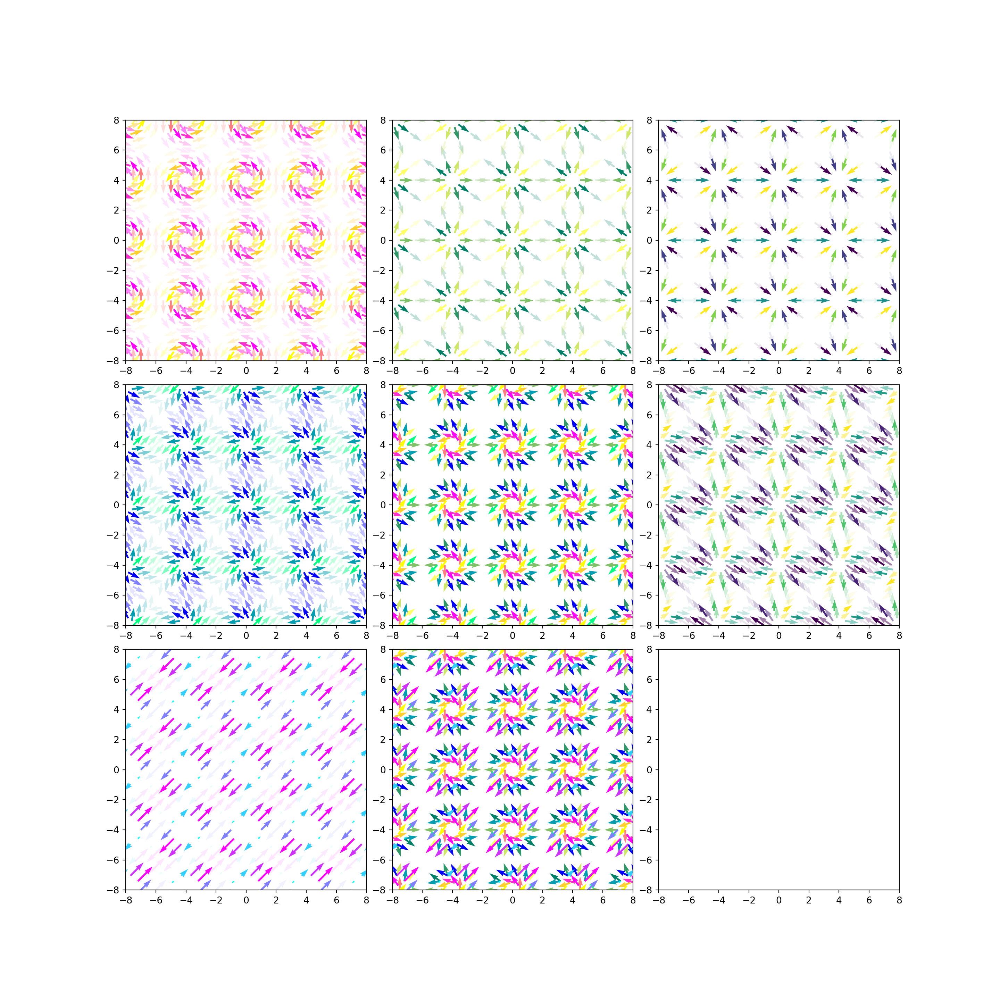

# tensor

## Einstein summation convention

### dummy index

### free index

## EpicOrganism = AIRoswell = Pan, Yi-Wen^[https://www.linkedin.com/in/yiwen-pan-16a90076]

https://space.bilibili.com/14316464/video

https://www.bilibili.com/video/BV1T5411D7mS

::: {show-in="html"}
<iframe width=500 height=300 frameborder="0" allowfullscreen src="https://player.bilibili.com/player.html?bvid=BV1T5411D7mS&autoplay=0&t=845"></iframe>
:::

https://www.bilibili.com/video/BV1QA4y1X7Xk

::: {show-in="html"}
<iframe width=500 height=300 frameborder="0" allowfullscreen src="https://player.bilibili.com/player.html?bvid=BV1QA4y1X7Xk&autoplay=0&t=845"></iframe>
:::

https://www.bilibili.com/video/BV1K34y1i75w

::: {show-in="html"}
<iframe width=500 height=300 frameborder="0" allowfullscreen src="https://player.bilibili.com/player.html?bvid=BV1K34y1i75w&autoplay=0&t=845"></iframe>
:::

https://www.bilibili.com/video/BV1ZU411o7xL

::: {show-in="html"}
<iframe width=500 height=300 frameborder="0" allowfullscreen src="https://player.bilibili.com/player.html?bvid=BV1ZU411o7xL&autoplay=0&t=845"></iframe>
:::

## EigenChris

### tensor for beginner

https://www.youtube.com/playlist?list=PLJHszsWbB6hrkmmq57lX8BV-o-YIOFsiG

### tensor calculus

https://www.youtube.com/playlist?list=PLJHszsWbB6hpk5h8lSfBkVrpjsqvUGTCx

## Elliot Schneider

- Elliot Schneider: [Physics with Elliot](https://www.youtube.com/@PhysicswithElliot/playlists)

### Fundamentals of Cartesian Tensors

https://courses.physicswithelliot.com/products/part-i-fundamentals-of-cartesian-tensors/categories/2154478208/posts/2176662131

https://courses.physicswithelliot.com/products/part-i-fundamentals-of-cartesian-tensors/categories/2154478208/posts/2174076341

https://courses.physicswithelliot.com/products/part-i-fundamentals-of-cartesian-tensors/categories/2154478208/posts/2174076344

https://courses.physicswithelliot.com/products/part-i-fundamentals-of-cartesian-tensors/categories/2155140686/posts/2176745848

https://courses.physicswithelliot.com/products/part-i-fundamentals-of-cartesian-tensors/categories/2155140686/posts/2176745896

https://courses.physicswithelliot.com/products/part-i-fundamentals-of-cartesian-tensors/categories/2155140686/posts/2176745882

vector notation

$$
\vec{V}=\overrightarrow{V}=\overset{\backslash\text{harpoon}}{V}=\mathbf{V}=\boldsymbol{V}
$$

`\boldsymbol{}` is relatively more elegant.

`\del` or `\nabla`

vector del = vector nabla

$$
\vec{\nabla}=\overrightarrow{\nabla}=\overset{\backslash\text{harpoon}}{\nabla}=\mathbf{\nabla}=\boldsymbol{\nabla}
$$

scalar del = scalar nabla

$$
\nabla
$$

vector field

e.g. [magnetic] vector potential

$$
\begin{aligned}
\boldsymbol{A}\left(\boldsymbol{r}\right)=\vec{A}\left(\vec{r}\right)= & \boldsymbol{A}\left(\left(x_{{\scriptscriptstyle 1}},x_{{\scriptscriptstyle 2}},x_{{\scriptscriptstyle 3}}\right)\right)=\boldsymbol{A}\left(x_{{\scriptscriptstyle 1}},x_{{\scriptscriptstyle 2}},x_{{\scriptscriptstyle 3}}\right)=\begin{pmatrix}A_{{\scriptscriptstyle 1}}\left(x_{{\scriptscriptstyle 1}},x_{{\scriptscriptstyle 2}},x_{{\scriptscriptstyle 3}}\right)\\
A_{{\scriptscriptstyle 2}}\left(x_{{\scriptscriptstyle 1}},x_{{\scriptscriptstyle 2}},x_{{\scriptscriptstyle 3}}\right)\\
A_{{\scriptscriptstyle 3}}\left(x_{{\scriptscriptstyle 1}},x_{{\scriptscriptstyle 2}},x_{{\scriptscriptstyle 3}}\right)
\end{pmatrix}\\
= & \boldsymbol{A}\left(\begin{pmatrix}x_{{\scriptscriptstyle 1}}\\
x_{{\scriptscriptstyle 2}}\\
x_{{\scriptscriptstyle 3}}
\end{pmatrix}\right)=\boldsymbol{A}\begin{pmatrix}x_{{\scriptscriptstyle 1}}\\
x_{{\scriptscriptstyle 2}}\\
x_{{\scriptscriptstyle 3}}
\end{pmatrix}=\begin{pmatrix}A_{{\scriptscriptstyle 1}}\left(\begin{pmatrix}x_{{\scriptscriptstyle 1}}\\
x_{{\scriptscriptstyle 2}}\\
x_{{\scriptscriptstyle 3}}
\end{pmatrix}\right)\\
A_{{\scriptscriptstyle 2}}\left(\begin{pmatrix}x_{{\scriptscriptstyle 1}}\\
x_{{\scriptscriptstyle 2}}\\
x_{{\scriptscriptstyle 3}}
\end{pmatrix}\right)\\
A_{{\scriptscriptstyle 3}}\left(\begin{pmatrix}x_{{\scriptscriptstyle 1}}\\
x_{{\scriptscriptstyle 2}}\\
x_{{\scriptscriptstyle 3}}
\end{pmatrix}\right)
\end{pmatrix}=\begin{pmatrix}A_{{\scriptscriptstyle 1}}\begin{pmatrix}x_{{\scriptscriptstyle 1}}\\
x_{{\scriptscriptstyle 2}}\\
x_{{\scriptscriptstyle 3}}
\end{pmatrix}\\
A_{{\scriptscriptstyle 2}}\begin{pmatrix}x_{{\scriptscriptstyle 1}}\\
x_{{\scriptscriptstyle 2}}\\
x_{{\scriptscriptstyle 3}}
\end{pmatrix}\\
A_{{\scriptscriptstyle 3}}\begin{pmatrix}x_{{\scriptscriptstyle 1}}\\
x_{{\scriptscriptstyle 2}}\\
x_{{\scriptscriptstyle 3}}
\end{pmatrix}
\end{pmatrix}
\end{aligned}
$$

scalar field

e.g. temperature

$$
\begin{aligned}
T\left(\boldsymbol{r}\right)=T\left(\vec{r}\right)= & T\left(\left(x_{{\scriptscriptstyle 1}},x_{{\scriptscriptstyle 2}},x_{{\scriptscriptstyle 3}}\right)\right)=T\left(x_{{\scriptscriptstyle 1}},x_{{\scriptscriptstyle 2}},x_{{\scriptscriptstyle 3}}\right)\\
= & T\left(\begin{pmatrix}x_{{\scriptscriptstyle 1}}\\
x_{{\scriptscriptstyle 2}}\\
x_{{\scriptscriptstyle 3}}
\end{pmatrix}\right)=T\begin{pmatrix}x_{{\scriptscriptstyle 1}}\\
x_{{\scriptscriptstyle 2}}\\
x_{{\scriptscriptstyle 3}}
\end{pmatrix}
\end{aligned}
$$

or generally

$$
f\left(\boldsymbol{r}\right)=f\left(\vec{r}\right)=f\left(x_{{\scriptscriptstyle 1}},x_{{\scriptscriptstyle 2}},x_{{\scriptscriptstyle 3}}\right)=f\left(\cdots,x_{{\scriptscriptstyle i}},\cdots\right)
$$

::: {.definition #unnamed-chunk-1}
directional derivative
:::

$$
\begin{aligned}
\nabla_{{\scriptscriptstyle \boldsymbol{V}}}f\left(\boldsymbol{r}\right)= & \lim\limits _{\epsilon\rightarrow0}\dfrac{f\left(\boldsymbol{r}+\epsilon\boldsymbol{V}\right)-f\left(\boldsymbol{r}\right)}{\epsilon}\\
=\nabla_{{\scriptscriptstyle \vec{V}}}f\left(\vec{r}\right)= & \lim\limits _{\epsilon\rightarrow0}\dfrac{f\left(\vec{r}+\epsilon\vec{V}\right)-f\left(\vec{r}\right)}{\epsilon}
\end{aligned}
$$

1D directional derivative

$$
\begin{aligned}
f_{{\scriptscriptstyle x}}\left(\boldsymbol{r}\right)=f^{\prime}\left(x\right)= & \begin{cases}
\dfrac{\partial f}{\partial x} & f=f\left(\cdots,x,\cdots\right)\\
\dfrac{\mathrm{d}f}{\mathrm{d}x} & f=f\left(x\right)
\end{cases}\\
= & \nabla_{{\scriptscriptstyle \frac{\vec{x}}{\left\Vert \vec{x}\right\Vert }}}f\left(\vec{r}\right)=\nabla_{{\scriptscriptstyle \frac{\boldsymbol{x}}{\left\Vert \boldsymbol{x}\right\Vert }}}f\left(\boldsymbol{r}\right)=\nabla_{{\scriptscriptstyle \frac{\vec{x}}{\left|\vec{x}\right|}}}f\left(\vec{r}\right)=\nabla_{{\scriptscriptstyle \frac{\boldsymbol{x}}{\left|\boldsymbol{x}\right|}}}f\left(\boldsymbol{r}\right)\\
= & \nabla_{{\scriptscriptstyle \hat{x}}}f\left(\vec{r}\right)=\nabla_{{\scriptscriptstyle \hat{\boldsymbol{x}}}}f\left(\boldsymbol{r}\right)=\begin{cases}
\lim\limits _{\epsilon\rightarrow0}\dfrac{f\left(\boldsymbol{r}+\epsilon\hat{\boldsymbol{x}}\right)-f\left(\boldsymbol{r}\right)}{\epsilon} & f=f\left(\cdots,x,\cdots\right)\\
\lim\limits _{\epsilon\rightarrow0}\dfrac{f\left(x+\epsilon\right)-f\left(x\right)}{\epsilon} & f=f\left(x\right)
\end{cases}
\end{aligned}
$$

***

According to [$\mathrm{d}f$]^[\@ref(mathrmdf)]^,

$$
\mathrm{d}f=f^{\prime}\left(x\right)\mathrm{d}x=\left(\dfrac{\mathrm{d}f}{\mathrm{d}x}\right)\mathrm{d}x=\dfrac{\mathrm{d}f}{\mathrm{d}x}\mathrm{d}x
$$

is the differential of $f$, read as "d $f$".

$$
\begin{aligned}
\mathrm{d}f=\left(\dfrac{\mathrm{d}f}{\mathrm{d}x}\right)\mathrm{d}x=\dfrac{\mathrm{d}f}{\mathrm{d}x}\mathrm{d}x= & \left(\dfrac{\mathrm{d}f}{\mathrm{d}x}\hat{\boldsymbol{x}}\right)\cdot\left(\mathrm{d}x\hat{\boldsymbol{x}}\right)\\
= & \boldsymbol{\nabla}_{{\scriptscriptstyle \hat{\boldsymbol{x}}}}f\left(\boldsymbol{r}\right)\cdot\mathrm{d}\hat{\boldsymbol{x}}\\
= & \boldsymbol{\nabla}f\cdot\mathrm{d}\boldsymbol{r}=\vec{\nabla}f\cdot\mathrm{d}\vec{r}\\
\overset{\text{commutative}}{=} & \mathrm{d}\boldsymbol{r}\cdot\boldsymbol{\nabla}f=\mathrm{d}\vec{r}\cdot\vec{\nabla}f
\end{aligned}
$$

***

$$
\begin{aligned}
\mathrm{d}f=\mathrm{d}\boldsymbol{r}\cdot\boldsymbol{\nabla}f=\mathrm{d}\vec{r}\cdot\vec{\nabla}f
\end{aligned}
$$

$\boldsymbol{\nabla}f$ is the gradient of $f$, read as "del $f$".

***

According to [$\mathrm{d}f$]^[\@ref(mathrmdf)]^,

$$
\mathrm{d}f=f^{\prime}\left(x\right)\mathrm{d}x=\left(\dfrac{\mathrm{d}f}{\mathrm{d}x}\right)\mathrm{d}x=\dfrac{\mathrm{d}f}{\mathrm{d}x}\mathrm{d}x
$$

is the differential of $f$, read as "d $f$".

***

2D directional derivative

According to [$\mathrm{d}f$]^[\@ref(mathrmdf)]^,

$$
\mathrm{d}f=\dfrac{\partial f}{\partial x}\mathrm{d}x+\dfrac{\partial f}{\partial y}\mathrm{d}y
$$

$$
\begin{aligned}
\mathrm{d}f= & \dfrac{\partial f}{\partial x}\mathrm{d}x+\dfrac{\partial f}{\partial y}\mathrm{d}y\\
= & \left(\dfrac{\partial f}{\partial x}\hat{\boldsymbol{x}}+\dfrac{\partial f}{\partial y}\hat{\boldsymbol{y}}\right)\cdot\left(\mathrm{d}x\hat{\boldsymbol{x}}+\mathrm{d}y\hat{\boldsymbol{y}}\right)\\
= & \boldsymbol{\nabla}f\cdot\mathrm{d}\boldsymbol{r},\begin{cases}
\boldsymbol{\nabla}f=\dfrac{\partial f}{\partial x}\hat{\boldsymbol{x}}+\dfrac{\partial f}{\partial y}\hat{\boldsymbol{y}}\\
\mathrm{d}\boldsymbol{r}=\mathrm{d}x\hat{\boldsymbol{x}}+\mathrm{d}y\hat{\boldsymbol{y}}
\end{cases}
\end{aligned}
$$

***

example:

$f\left(\boldsymbol{r}\right)=f\left(x_{{\scriptscriptstyle 1}},x_{{\scriptscriptstyle 2}}\right)=f\left(x,y\right)=\sqrt{x^{2}+y^{2}}$

using [Feynman method of differentiation / derivative technique]^[\@ref(feynman-method-of-differentiation-derivative-technique)]^,

$$
\begin{aligned}
\boldsymbol{\nabla}f=\dfrac{\partial f}{\partial x}\hat{\boldsymbol{x}}+\dfrac{\partial f}{\partial y}\hat{\boldsymbol{y}}= & \dfrac{\partial\sqrt{x^{2}+y^{2}}}{\partial x}\hat{\boldsymbol{x}}+\dfrac{\partial\sqrt{x^{2}+y^{2}}}{\partial y}\hat{\boldsymbol{y}}\\
\overset{\text{Feynman}}{=} & \dfrac{\frac{1}{2}\cdot2x}{\sqrt{x^{2}+y^{2}}}\hat{\boldsymbol{x}}+\dfrac{\frac{1}{2}\cdot2y}{\sqrt{x^{2}+y^{2}}}\hat{\boldsymbol{y}}\\
= & \dfrac{x}{\sqrt{x^{2}+y^{2}}}\hat{\boldsymbol{x}}+\dfrac{y}{\sqrt{x^{2}+y^{2}}}\hat{\boldsymbol{y}}\\
= & \dfrac{x\hat{\boldsymbol{x}}+y\hat{\boldsymbol{y}}}{\sqrt{x^{2}+y^{2}}}=\dfrac{\boldsymbol{r}}{\left|\boldsymbol{r}\right|}=\frac{\boldsymbol{r}}{\left\Vert \boldsymbol{r}\right\Vert }=\frac{\vec{r}}{\left\Vert \vec{r}\right\Vert }
\end{aligned}
$$

***

geometric meaning of a gradient

$\boldsymbol{\nabla}f$ points in the direction of "steepest ascent" of $f$.

directional derivative: from definition to calculation

$$
\begin{aligned}
\mathrm{d}f= & \mathrm{d}\boldsymbol{r}\cdot\boldsymbol{\nabla}f=\mathrm{d}\vec{r}\cdot\vec{\nabla}f\\
= & \epsilon\boldsymbol{V}\cdot\boldsymbol{\nabla}f=\epsilon\vec{V}\cdot\vec{\nabla}f
\end{aligned}
$$

$$
\mathrm{d}f=f\left(\boldsymbol{r}+\epsilon\boldsymbol{V}\right)-f\left(\boldsymbol{r}\right)=f\left(\vec{r}+\epsilon\vec{V}\right)-f\left(\vec{r}\right)
$$

$$
\begin{aligned}
 & \nabla_{{\scriptscriptstyle \boldsymbol{V}}}f\left(\boldsymbol{r}\right)=\nabla_{{\scriptscriptstyle \vec{V}}}f\left(\vec{r}\right)\\
= & \lim\limits _{\epsilon\rightarrow0}\dfrac{f\left(\boldsymbol{r}+\epsilon\boldsymbol{V}\right)-f\left(\boldsymbol{r}\right)}{\epsilon}=\lim\limits _{\epsilon\rightarrow0}\dfrac{f\left(\vec{r}+\epsilon\vec{V}\right)-f\left(\vec{r}\right)}{\epsilon}\\
= & \lim\limits _{\epsilon\rightarrow0}\dfrac{\mathrm{d}f}{\epsilon}=\lim\limits _{\epsilon\rightarrow0}\dfrac{\mathrm{d}f}{\epsilon}\\
= & \lim\limits _{\epsilon\rightarrow0}\dfrac{\mathrm{d}\boldsymbol{r}\cdot\boldsymbol{\nabla}f}{\epsilon}=\lim\limits _{\epsilon\rightarrow0}\dfrac{\mathrm{d}\vec{r}\cdot\vec{\nabla}f}{\epsilon}\\
= & \lim\limits _{\epsilon\rightarrow0}\dfrac{\epsilon\boldsymbol{V}\cdot\boldsymbol{\nabla}f}{\epsilon}=\lim\limits _{\epsilon\rightarrow0}\dfrac{\epsilon\vec{V}\cdot\vec{\nabla}f}{\epsilon}\\
= & \lim\limits _{\epsilon\rightarrow0}\dfrac{\boldsymbol{V}\cdot\boldsymbol{\nabla}f}{1}=\lim\limits _{\epsilon\rightarrow0}\dfrac{\vec{V}\cdot\vec{\nabla}f}{1}\\
= & \boldsymbol{V}\cdot\boldsymbol{\nabla}f=\vec{V}\cdot\vec{\nabla}f
\end{aligned}
$$

***

$$
\nabla_{{\scriptscriptstyle \boldsymbol{V}}}f=\nabla_{{\scriptscriptstyle \boldsymbol{V}}}f\left(\boldsymbol{r}\right)=\boldsymbol{V}\cdot\boldsymbol{\nabla}f=\nabla_{{\scriptscriptstyle \vec{V}}}f=\nabla_{{\scriptscriptstyle \vec{V}}}f\left(\vec{r}\right)=\vec{V}\cdot\vec{\nabla}f
$$

***

$$
\begin{aligned}
\nabla_{{\scriptscriptstyle \boldsymbol{V}}}f= & \boldsymbol{V}\cdot\boldsymbol{\nabla}f\\
=\nabla_{{\scriptscriptstyle \vec{V}}}f= & \vec{V}\cdot\vec{\nabla}f
\end{aligned}
$$

***

in the view of operator acting on scalar field(s)

$$
\boldsymbol{V}=V_{{\scriptscriptstyle x}}\hat{\boldsymbol{x}}+V_{{\scriptscriptstyle y}}\hat{\boldsymbol{y}}
$$

grad or gradient = vector del or vector nabla as a vector operator acting on scalar field(s)

$$
\begin{aligned}
\boldsymbol{\nabla}f=\vec{\nabla}f= & \dfrac{\partial f}{\partial x}\hat{\boldsymbol{x}}+\dfrac{\partial f}{\partial y}\hat{\boldsymbol{y}}=\nabla_{{\scriptscriptstyle \hat{\boldsymbol{x}}}}f\hat{\boldsymbol{x}}+\nabla_{{\scriptscriptstyle \hat{\boldsymbol{y}}}}f\hat{\boldsymbol{y}}\\
= & \hat{\boldsymbol{x}}\dfrac{\partial f}{\partial x}+\hat{\boldsymbol{y}}\dfrac{\partial f}{\partial y}=\hat{\boldsymbol{x}}\nabla_{{\scriptscriptstyle \hat{\boldsymbol{x}}}}f+\hat{\boldsymbol{y}}\nabla_{{\scriptscriptstyle \hat{\boldsymbol{y}}}}f\\
= & \left(\hat{\boldsymbol{x}}\dfrac{\partial}{\partial x}+\hat{\boldsymbol{y}}\dfrac{\partial}{\partial y}\right)f=\left(\hat{\boldsymbol{x}}\nabla_{{\scriptscriptstyle \hat{\boldsymbol{x}}}}+\hat{\boldsymbol{y}}\nabla_{{\scriptscriptstyle \hat{\boldsymbol{y}}}}\right)f\\
\Downarrow\\
\boldsymbol{\nabla}=\vec{\nabla}= & \hat{\boldsymbol{x}}\dfrac{\partial}{\partial x}+\hat{\boldsymbol{y}}\dfrac{\partial}{\partial y}=\hat{\boldsymbol{x}}\nabla_{{\scriptscriptstyle \hat{\boldsymbol{x}}}}+\hat{\boldsymbol{y}}\nabla_{{\scriptscriptstyle \hat{\boldsymbol{y}}}}
\end{aligned}
$$

directional derivative = scalar del or scalar nabla as a scalar operator acting on scalar field(s)

$$
\begin{aligned}
\nabla_{{\scriptscriptstyle \boldsymbol{V}}}f=\nabla_{{\scriptscriptstyle \vec{V}}}f= & \boldsymbol{V}\cdot\boldsymbol{\nabla}f=\vec{V}\cdot\vec{\nabla}f\\
= & \left(V_{{\scriptscriptstyle x}}\hat{\boldsymbol{x}}+V_{{\scriptscriptstyle y}}\hat{\boldsymbol{y}}\right)\cdot\left(\nabla_{{\scriptscriptstyle \hat{\boldsymbol{x}}}}f\hat{\boldsymbol{x}}+\nabla_{{\scriptscriptstyle \hat{\boldsymbol{y}}}}f\hat{\boldsymbol{y}}\right)\\
= & V_{{\scriptscriptstyle x}}\nabla_{{\scriptscriptstyle \hat{\boldsymbol{x}}}}f+V_{{\scriptscriptstyle y}}\nabla_{{\scriptscriptstyle \hat{\boldsymbol{y}}}}f=\left(V_{{\scriptscriptstyle x}}\nabla_{{\scriptscriptstyle \hat{\boldsymbol{x}}}}+V_{{\scriptscriptstyle y}}\nabla_{{\scriptscriptstyle \hat{\boldsymbol{y}}}}\right)f\\
= & V_{{\scriptscriptstyle x}}\dfrac{\partial f}{\partial x}+V_{{\scriptscriptstyle y}}\dfrac{\partial f}{\partial y}=\left(V_{{\scriptscriptstyle x}}\dfrac{\partial}{\partial x}+V_{{\scriptscriptstyle y}}\dfrac{\partial}{\partial y}\right)f\\
\Downarrow\\
\nabla_{{\scriptscriptstyle \boldsymbol{V}}}=\nabla_{{\scriptscriptstyle \vec{V}}}= & V_{{\scriptscriptstyle x}}\nabla_{{\scriptscriptstyle \hat{\boldsymbol{x}}}}+V_{{\scriptscriptstyle y}}\nabla_{{\scriptscriptstyle \hat{\boldsymbol{y}}}}=V_{{\scriptscriptstyle x}}\dfrac{\partial}{\partial x}+V_{{\scriptscriptstyle y}}\dfrac{\partial}{\partial y}
\end{aligned}
$$

***

product rule

$$
\begin{aligned}
\nabla_{{\scriptscriptstyle \boldsymbol{V}}}\left(fg\right)= & \nabla_{{\scriptscriptstyle \vec{V}}}\left(fg\right)=\boldsymbol{V}\cdot\boldsymbol{\nabla}\left(fg\right)=\vec{V}\cdot\vec{\nabla}\left(fg\right)\\
= & \boldsymbol{V}\cdot\left[\left(\boldsymbol{\nabla}f\right)g+f\boldsymbol{\nabla}g\right]=\boldsymbol{V}\cdot\left[g\boldsymbol{\nabla}f+f\boldsymbol{\nabla}g\right]=\boldsymbol{V}\cdot\left[f\boldsymbol{\nabla}g+g\boldsymbol{\nabla}f\right]\\
= & f\left(\boldsymbol{V}\cdot\boldsymbol{\nabla}g\right)+g\left(\boldsymbol{V}\cdot\boldsymbol{\nabla}f\right)=g\left(\boldsymbol{V}\cdot\boldsymbol{\nabla}f\right)+f\left(\boldsymbol{V}\cdot\boldsymbol{\nabla}g\right)\\
 & =f\left(\nabla_{{\scriptscriptstyle \boldsymbol{V}}}g\right)+g\left(\nabla_{{\scriptscriptstyle \boldsymbol{V}}}f\right)=g\left(\nabla_{{\scriptscriptstyle \boldsymbol{V}}}f\right)+f\left(\nabla_{{\scriptscriptstyle \boldsymbol{V}}}g\right)\\
= & f\boldsymbol{V}\cdot\boldsymbol{\nabla}g+g\boldsymbol{V}\cdot\boldsymbol{\nabla}f=g\boldsymbol{V}\cdot\boldsymbol{\nabla}f+f\boldsymbol{V}\cdot\boldsymbol{\nabla}g\\
 & =f\nabla_{{\scriptscriptstyle \boldsymbol{V}}}g+g\nabla_{{\scriptscriptstyle \boldsymbol{V}}}f=g\nabla_{{\scriptscriptstyle \boldsymbol{V}}}f+f\nabla_{{\scriptscriptstyle \boldsymbol{V}}}g\\
\nabla_{{\scriptscriptstyle \boldsymbol{V}}}\left(fg\right)= & f\nabla_{{\scriptscriptstyle \boldsymbol{V}}}g+g\nabla_{{\scriptscriptstyle \boldsymbol{V}}}f
\end{aligned}
$$

***

two kinds of linearities or bilinearity of directional derivative operator

$$
\begin{aligned}
\nabla_{{\scriptscriptstyle \boldsymbol{V}}}\left(f+\lambda g\right)= & \nabla_{{\scriptscriptstyle \vec{V}}}\left(f+\lambda g\right)=\boldsymbol{V}\cdot\boldsymbol{\nabla}\left(f+\lambda g\right)=\vec{V}\cdot\vec{\nabla}\left(f+\lambda g\right)\\
= & \boldsymbol{V}\cdot\left[\boldsymbol{\nabla}f+\boldsymbol{\nabla}\left(\lambda g\right)\right]=\boldsymbol{V}\cdot\left[\boldsymbol{\nabla}f+\lambda\boldsymbol{\nabla}g\right]\\
= & \boldsymbol{V}\cdot\boldsymbol{\nabla}f+\lambda\left(\boldsymbol{V}\cdot\boldsymbol{\nabla}g\right)\\
= & \nabla_{{\scriptscriptstyle \boldsymbol{V}}}f+\lambda\nabla_{{\scriptscriptstyle \boldsymbol{V}}}g\\
\nabla_{{\scriptscriptstyle \boldsymbol{V}}}\left(f+\lambda g\right)= & \nabla_{{\scriptscriptstyle \boldsymbol{V}}}f+\lambda\nabla_{{\scriptscriptstyle \boldsymbol{V}}}g
\end{aligned}
$$

$$
\begin{aligned}
\nabla_{{\scriptscriptstyle \boldsymbol{V}+\lambda\boldsymbol{W}}}f= & \nabla_{{\scriptscriptstyle \vec{V}+\lambda\vec{W}}}f=\left(\boldsymbol{V}+\lambda\boldsymbol{W}\right)\cdot\boldsymbol{\nabla}f=\left(\vec{V}+\lambda\vec{W}\right)\cdot\vec{\nabla}f\\
= & \boldsymbol{V}\cdot\boldsymbol{\nabla}f+\lambda\boldsymbol{W}\cdot\boldsymbol{\nabla}f=\vec{V}\cdot\vec{\nabla}f+\lambda\vec{W}\cdot\vec{\nabla}f\\
= & \nabla_{{\scriptscriptstyle \boldsymbol{V}}}f+\lambda\nabla_{{\scriptscriptstyle \boldsymbol{W}}}f=\nabla_{{\scriptscriptstyle \vec{V}}}f+\lambda\nabla_{{\scriptscriptstyle \vec{W}}}f\\
\nabla_{{\scriptscriptstyle \boldsymbol{V}+\lambda\boldsymbol{W}}}f= & \nabla_{{\scriptscriptstyle \boldsymbol{V}}}f+\lambda\nabla_{{\scriptscriptstyle \boldsymbol{W}}}f
\end{aligned}
$$

***

$$
\begin{cases}
\nabla_{{\scriptscriptstyle \boldsymbol{V}}}\left(f+\lambda g\right) & =\nabla_{{\scriptscriptstyle \boldsymbol{V}}}f+\lambda\nabla_{{\scriptscriptstyle \boldsymbol{V}}}g\\
\nabla_{{\scriptscriptstyle \boldsymbol{V}+\lambda\boldsymbol{W}}}f & =\nabla_{{\scriptscriptstyle \boldsymbol{V}}}f+\lambda\nabla_{{\scriptscriptstyle \boldsymbol{W}}}f
\end{cases}
$$

$$
\begin{cases}
\nabla_{{\scriptscriptstyle \boldsymbol{V}}}\left(f+\lambda g\right)=\nabla_{{\scriptscriptstyle \boldsymbol{V}}}f+\lambda\nabla_{{\scriptscriptstyle \boldsymbol{V}}}g & \Leftrightarrow\nabla_{{\scriptscriptstyle \boldsymbol{V}}}\left(\lambda f+\mu g\right)=\lambda\nabla_{{\scriptscriptstyle \boldsymbol{V}}}f+\mu\nabla_{{\scriptscriptstyle \boldsymbol{V}}}g\\
\nabla_{{\scriptscriptstyle \boldsymbol{V}+\lambda\boldsymbol{W}}}f=\nabla_{{\scriptscriptstyle \boldsymbol{V}}}f+\lambda\nabla_{{\scriptscriptstyle \boldsymbol{W}}}f & \Leftrightarrow\nabla_{{\scriptscriptstyle \lambda\boldsymbol{V}+\mu\boldsymbol{W}}}f=\lambda\nabla_{{\scriptscriptstyle \boldsymbol{V}}}f+\mu\nabla_{{\scriptscriptstyle \boldsymbol{W}}}f
\end{cases}
$$

$$
\begin{aligned}
\nabla_{{\scriptscriptstyle \lambda\boldsymbol{V}+\mu\boldsymbol{W}}}f= & \nabla_{{\scriptscriptstyle \lambda\boldsymbol{V}}}f+\nabla_{{\scriptscriptstyle \mu\boldsymbol{W}}}f\\
= & \lambda\nabla_{{\scriptscriptstyle \boldsymbol{V}}}f+\mu\nabla_{{\scriptscriptstyle \boldsymbol{W}}}f\\
= & \lambda\dfrac{\partial}{\partial V}f+\mu\dfrac{\partial}{\partial W}f\\
= & \lambda\dfrac{\partial f}{\partial V}+\mu\dfrac{\partial f}{\partial W}\\
\nabla_{{\scriptscriptstyle \boldsymbol{V}}}f=\nabla_{{\scriptscriptstyle V_{{\scriptscriptstyle x}}\hat{\boldsymbol{x}}+V_{{\scriptscriptstyle y}}\hat{\boldsymbol{y}}}}f= & \nabla_{{\scriptscriptstyle V_{{\scriptscriptstyle x}}\hat{\boldsymbol{x}}}}f+\nabla_{{\scriptscriptstyle V_{{\scriptscriptstyle y}}\hat{\boldsymbol{y}}}}f\\
= & V_{{\scriptscriptstyle x}}\nabla_{{\scriptscriptstyle \hat{\boldsymbol{x}}}}f+V_{{\scriptscriptstyle y}}\nabla_{{\scriptscriptstyle \hat{\boldsymbol{y}}}}f\\
= & V_{{\scriptscriptstyle x}}\dfrac{\partial}{\partial x}f+V_{{\scriptscriptstyle y}}\dfrac{\partial}{\partial y}f\\
= & V_{{\scriptscriptstyle x}}\dfrac{\partial f}{\partial x}+V_{{\scriptscriptstyle y}}\dfrac{\partial f}{\partial y}
\end{aligned}
$$

***

directional derivative of a 3D vector field

$$
\begin{aligned}
\nabla_{{\scriptscriptstyle \boldsymbol{V}}}\boldsymbol{A}=\nabla_{{\scriptscriptstyle \vec{V}}}\vec{A}= & \boldsymbol{V}\cdot\boldsymbol{\nabla}\boldsymbol{A}=\vec{V}\cdot\vec{\nabla}\vec{A}\\
= & \left(\hat{\boldsymbol{x}}V_{{\scriptscriptstyle x}}+\hat{\boldsymbol{y}}V_{{\scriptscriptstyle y}}+\hat{\boldsymbol{z}}V_{{\scriptscriptstyle z}}\right)\cdot\left(\hat{\boldsymbol{x}}\dfrac{\partial\boldsymbol{A}}{\partial x}+\hat{\boldsymbol{y}}\dfrac{\partial\boldsymbol{A}}{\partial x}+\hat{\boldsymbol{z}}\dfrac{\partial\boldsymbol{A}}{\partial x}\right)\\
 & =\left(\hat{\boldsymbol{x}}V_{{\scriptscriptstyle x}}+\hat{\boldsymbol{y}}V_{{\scriptscriptstyle y}}+\hat{\boldsymbol{z}}V_{{\scriptscriptstyle z}}\right)\cdot\left(\hat{\boldsymbol{x}}\dfrac{\partial\vec{A}}{\partial x}+\hat{\boldsymbol{y}}\dfrac{\partial\vec{A}}{\partial x}+\hat{\boldsymbol{z}}\dfrac{\partial\vec{A}}{\partial x}\right)\\
\boldsymbol{\nabla}\boldsymbol{A}=\vec{\nabla}\vec{A}= & \hat{\boldsymbol{x}}\dfrac{\partial\boldsymbol{A}}{\partial x}+\hat{\boldsymbol{y}}\dfrac{\partial\boldsymbol{A}}{\partial x}+\hat{\boldsymbol{z}}\dfrac{\partial\boldsymbol{A}}{\partial x}=\hat{\boldsymbol{x}}\dfrac{\partial\vec{A}}{\partial x}+\hat{\boldsymbol{y}}\dfrac{\partial\vec{A}}{\partial x}+\hat{\boldsymbol{z}}\dfrac{\partial\vec{A}}{\partial x}\\
= & \hat{\boldsymbol{x}}\dfrac{\partial\left(\hat{\boldsymbol{x}}A_{{\scriptscriptstyle x}}+\hat{\boldsymbol{y}}A_{{\scriptscriptstyle y}}+\hat{\boldsymbol{z}}A_{{\scriptscriptstyle z}}\right)}{\partial x}\\
+ & \hat{\boldsymbol{y}}\dfrac{\partial\left(\hat{\boldsymbol{x}}A_{{\scriptscriptstyle x}}+\hat{\boldsymbol{y}}A_{{\scriptscriptstyle y}}+\hat{\boldsymbol{z}}A_{{\scriptscriptstyle z}}\right)}{\partial x}\\
+ & \hat{\boldsymbol{z}}\dfrac{\partial\left(\hat{\boldsymbol{x}}A_{{\scriptscriptstyle x}}+\hat{\boldsymbol{y}}A_{{\scriptscriptstyle y}}+\hat{\boldsymbol{z}}A_{{\scriptscriptstyle z}}\right)}{\partial x}\\
= & \hat{\boldsymbol{x}}\hat{\boldsymbol{x}}\dfrac{\partial A_{{\scriptscriptstyle x}}}{\partial x}+\hat{\boldsymbol{x}}\hat{\boldsymbol{y}}\dfrac{\partial A_{{\scriptscriptstyle y}}}{\partial x}+\hat{\boldsymbol{x}}\hat{\boldsymbol{z}}\dfrac{\partial A_{{\scriptscriptstyle z}}}{\partial x}\\
+ & \hat{\boldsymbol{y}}\hat{\boldsymbol{x}}\dfrac{\partial A_{{\scriptscriptstyle x}}}{\partial x}+\hat{\boldsymbol{y}}\hat{\boldsymbol{y}}\dfrac{\partial A_{{\scriptscriptstyle y}}}{\partial x}+\hat{\boldsymbol{y}}\hat{\boldsymbol{z}}\dfrac{\partial A_{{\scriptscriptstyle z}}}{\partial x}\\
+ & \hat{\boldsymbol{z}}\hat{\boldsymbol{x}}\dfrac{\partial A_{{\scriptscriptstyle x}}}{\partial x}+\hat{\boldsymbol{z}}\hat{\boldsymbol{y}}\dfrac{\partial A_{{\scriptscriptstyle y}}}{\partial x}+\hat{\boldsymbol{z}}\hat{\boldsymbol{z}}\dfrac{\partial A_{{\scriptscriptstyle z}}}{\partial x}\\
= & \hat{\boldsymbol{x}}\otimes\hat{\boldsymbol{x}}\dfrac{\partial A_{{\scriptscriptstyle x}}}{\partial x}+\hat{\boldsymbol{x}}\otimes\hat{\boldsymbol{y}}\dfrac{\partial A_{{\scriptscriptstyle y}}}{\partial x}+\hat{\boldsymbol{x}}\otimes\hat{\boldsymbol{z}}\dfrac{\partial A_{{\scriptscriptstyle z}}}{\partial x}\\
+ & \hat{\boldsymbol{y}}\otimes\hat{\boldsymbol{x}}\dfrac{\partial A_{{\scriptscriptstyle x}}}{\partial x}+\hat{\boldsymbol{y}}\otimes\hat{\boldsymbol{y}}\dfrac{\partial A_{{\scriptscriptstyle y}}}{\partial x}+\hat{\boldsymbol{y}}\otimes\hat{\boldsymbol{z}}\dfrac{\partial A_{{\scriptscriptstyle z}}}{\partial x}\\
+ & \hat{\boldsymbol{z}}\otimes\hat{\boldsymbol{x}}\dfrac{\partial A_{{\scriptscriptstyle x}}}{\partial x}+\hat{\boldsymbol{z}}\otimes\hat{\boldsymbol{y}}\dfrac{\partial A_{{\scriptscriptstyle y}}}{\partial x}+\hat{\boldsymbol{z}}\otimes\hat{\boldsymbol{z}}\dfrac{\partial A_{{\scriptscriptstyle z}}}{\partial x}
\end{aligned}
$$

$\boldsymbol{\nabla}\boldsymbol{A}=\vec{\nabla}\vec{A}$ is a rank-2 tensor.

$\otimes$ is tensor product.

$\nabla_{{\scriptscriptstyle \boldsymbol{V}}}\boldsymbol{A}=\nabla_{{\scriptscriptstyle \vec{V}}}\vec{A}=\boldsymbol{V}\cdot\boldsymbol{\nabla}\boldsymbol{A}=\vec{V}\cdot\vec{\nabla}\vec{A}$ yields a vector, instead of a scalar.

Dan Fleisch: What's a Tensor?

https://www.youtube.com/watch?v=f5liqUk0ZTw

::: {show-in="html"}
<iframe width=500 height=300 frameborder="0" allowfullscreen src="https://www.youtube.com/embed/f5liqUk0ZTw"></iframe>
:::

[UdiProd](https://www.youtube.com/@udiprod/playlists): [tensor](https://www.youtube.com/playlist?list=PL2aHrV9pFqNTEMuDFre16Wx2SwBCNiR7j)

https://www.youtube.com/watch?v=YxXyN2ifK8A&list=PL2aHrV9pFqNTEMuDFre16Wx2SwBCNiR7j&index=1

::: {show-in="html"}
<iframe width=500 height=300 frameborder="0" allowfullscreen src="https://www.youtube.com/embed/YxXyN2ifK8A"></iframe>
:::

https://www.youtube.com/watch?v=A95jdIuUUW0&list=PL2aHrV9pFqNTEMuDFre16Wx2SwBCNiR7j&index=2

::: {show-in="html"}
<iframe width=500 height=300 frameborder="0" allowfullscreen src="https://www.youtube.com/embed/A95jdIuUUW0"></iframe>
:::

https://www.youtube.com/watch?v=51ARho2bvQY&list=PL2aHrV9pFqNTEMuDFre16Wx2SwBCNiR7j&index=3

::: {show-in="html"}
<iframe width=500 height=300 frameborder="0" allowfullscreen src="https://www.youtube.com/embed/51ARho2bvQY"></iframe>
:::

<style type="text/css">
pre {
  max-width: 400px;
  overflow-x: auto;
  max-height: 600px;
  overflow-y: auto;
}

/*
pre[class] {
  max-height: 100px;
}
*/
</style>


```
## (-8.0, 8.0, -8.0, 8.0)
## (-8.0, 8.0, -8.0, 8.0)
## (-8.0, 8.0, -8.0, 8.0)
## (-8.0, 8.0, -8.0, 8.0)
## (-8.0, 8.0, -8.0, 8.0)
## (-8.0, 8.0, -8.0, 8.0)
## (-8.0, 8.0, -8.0, 8.0)
## (-8.0, 8.0, -8.0, 8.0)
## (-8.0, 8.0, -8.0, 8.0)
```



:::::: {.cols data-latex=""}
::: {.col data-latex="{0.45\textwidth}"}

```python
import numpy as np
import matplotlib.pyplot as plt

A = np.array([[ 0,-1],
              [ 1, 0]])

B = np.array([[ 1, 0],
              [ 0, 1]])

C = np.array([[ 1,-1],
              [ 1, 1]])

D = np.array([[ 1, 1],
              [ 1, 1]])

E = np.array([[-1, 0],
              [ 0,-1]])

F = np.array([[ 3, 1],
              [-2, 2]])

t = np.arange(0, 2 * np.pi, np.pi/5)

# Creating arrow 
X = np.cos(t)
Y = np.sin(t)
 
# X, Y = np.meshgrid(x, y)

# V = np.array([X, Y])

# u = x
# v = y

# u, v = np.matmul(A, V)
u, v = np.matmul(A, np.array([X, Y]))
dx, dy = np.matmul(B, np.array([X, Y]))
dx2, dy2 = np.matmul(C, np.array([X, Y]))
dx3, dy3 = np.matmul(D, np.array([X, Y]))
dx4, dy4 = np.matmul(E, np.array([X, Y]))
dx5, dy5 = np.matmul(F, np.array([X, Y]))

# n = -2
 
# Defining color
# color = np.sqrt(((v-n)/2)*2 + ((u-n)/2)*2)
# color = (u**2+v**2)**(1/2)
color = u*v
 
# Creating plot
fig, ax = plt.subplots(3,3,figsize =(15,15), gridspec_kw = {'wspace':0.1, 'hspace':0.1})

# ax.quiver(X, Y, u, v, color, alpha = 1)
for i in range(-2,3):
    for j in range(-2,3):
        # ax.quiver(1.0*X+4*i, 1.0*Y+4*j, u, v)#, color, alpha = 1)
        # ax.quiver(1.5*X+4*i, 1.5*Y+4*j, u, v)#, color, alpha = 1)
        # ax.quiver(2.0*X+4*i, 2.0*Y+4*j, u, v)#, color, alpha = 1)

        ax[0,0].quiver(0.5*X+4*i, 0.5*Y+4*j, u, v, u*v, alpha = 0.50, cmap='spring')
        ax[0,0].quiver(1.0*X+4*i, 1.0*Y+4*j, u, v, u*v, alpha = 1.00, cmap='spring')
        ax[0,0].quiver(1.5*X+4*i, 1.5*Y+4*j, u, v, u*v, alpha = 0.25, cmap='spring')
        ax[0,0].quiver(2.0*X+4*i, 2.0*Y+4*j, u, v, u*v, alpha = 0.10, cmap='spring')

        ax[0,1].quiver(0.5*X+4*i, 0.5*Y+4*j, dx, dy, dx*dy, alpha = 1.00, cmap='summer')
        # ax[0,1].quiver(1.0*X+4*i, 1.0*Y+4*j, dx, dy, dx*dy, alpha = 0.50, cmap='summer')
        ax[0,1].quiver(1.5*X+4*i, 1.5*Y+4*j, dx, dy, dx*dy, alpha = 0.25, cmap='summer')
        # ax[0,1].quiver(2.0*X+4*i, 2.0*Y+4*j, dx, dy, dx*dy, alpha = 0.10, cmap='summer')

        ax[1,0].quiver(0.5*X+4*i, 0.5*Y+4*j, dx2, dy2, dx2*dy2, alpha = 1.00, cmap='winter')
        ax[1,0].quiver(1.0*X+4*i, 1.0*Y+4*j, dx2, dy2, dx2*dy2, alpha = 0.50, cmap='winter')
        ax[1,0].quiver(1.5*X+4*i, 1.5*Y+4*j, dx2, dy2, dx2*dy2, alpha = 0.25, cmap='winter')
        ax[1,0].quiver(2.0*X+4*i, 2.0*Y+4*j, dx2, dy2, dx2*dy2, alpha = 0.10, cmap='winter')

        # ax[2,0].quiver(0.5*X+4*i, 0.5*Y+4*j, dx3, dy3, dx3*dy3, alpha = 0.50, cmap='cool')
        ax[2,0].quiver(1.0*X+4*i, 1.0*Y+4*j, dx3, dy3, dx3*dy3, alpha = 1.00, cmap='cool')
        # ax[2,0].quiver(1.5*X+4*i, 1.5*Y+4*j, dx3, dy3, dx3*dy3, alpha = 0.25, cmap='cool')
        ax[2,0].quiver(2.0*X+4*i, 2.0*Y+4*j, dx3, dy3, dx3*dy3, alpha = 0.10, cmap='cool')

        # ax[0,2].quiver(0.5*X+4*i, 0.5*Y+4*j, dx4, dy4, dx4*dy4, alpha = 0.50)
        # ax[0,2].quiver(1.0*X+4*i, 1.0*Y+4*j, dx4, dy4, dx4*dy4, alpha = 0.25)
        ax[0,2].quiver(1.5*X+4*i, 1.5*Y+4*j, dx4, dy4, dx4*dy4, alpha = 1.00)
        ax[0,2].quiver(2.0*X+4*i, 2.0*Y+4*j, dx4, dy4, dx4*dy4, alpha = 0.10)

        ax[1,2].quiver(0.5*X+4*i, 0.5*Y+4*j, dx5, dy5, dx5*dy5, alpha = 0.50)
        ax[1,2].quiver(1.0*X+4*i, 1.0*Y+4*j, dx5, dy5, dx5*dy5, alpha = 1.00)
        ax[1,2].quiver(1.5*X+4*i, 1.5*Y+4*j, dx5, dy5, dx5*dy5, alpha = 0.25)
        ax[1,2].quiver(2.0*X+4*i, 2.0*Y+4*j, dx5, dy5, dx5*dy5, alpha = 0.10)

        ax[1,1].quiver(0.5*X+4*i, 0.5*Y+4*j, u, v, u*v, alpha = 1.00, cmap='spring')
        ax[1,1].quiver(1.0*X+4*i, 1.0*Y+4*j, dx, dy, dx*dy, alpha = 1.00, cmap='summer')
        ax[1,1].quiver(1.0*X+4*i, 1.0*Y+4*j, dx2, dy2, dx2*dy2, alpha = 1.00, cmap='winter')

        ax[2,1].quiver(0.5*X+4*i, 0.5*Y+4*j, u, v, u*v, alpha = 1.00, cmap='spring')
        ax[2,1].quiver(1.0*X+4*i, 1.0*Y+4*j, dx, dy, dx*dy, alpha = 1.00, cmap='summer')
        ax[2,1].quiver(1.0*X+4*i, 1.0*Y+4*j, dx2, dy2, dx2*dy2, alpha = 1.00, cmap='winter')
        ax[2,1].quiver(1.0*X+4*i, 1.0*Y+4*j, dx3, dy3, dx3*dy3, alpha = 1.00, cmap='cool')

for ax in fig.get_axes():
    # ax.xaxis.set_ticks([])
    # ax.yaxis.set_ticks([])
    ax.axis([-8, 8, -8, 8])
    ax.set_aspect('equal')
 
# show plot
plt.show()
```
:::

::: {.col data-latex="{0.10\textwidth}"}
\ 
:::

::: {.col data-latex="{0.45\textwidth}"}

```
## (-8.0, 8.0, -8.0, 8.0)
## (-8.0, 8.0, -8.0, 8.0)
## (-8.0, 8.0, -8.0, 8.0)
## (-8.0, 8.0, -8.0, 8.0)
## (-8.0, 8.0, -8.0, 8.0)
## (-8.0, 8.0, -8.0, 8.0)
## (-8.0, 8.0, -8.0, 8.0)
## (-8.0, 8.0, -8.0, 8.0)
## (-8.0, 8.0, -8.0, 8.0)
```

```
## Traceback (most recent call last):
##   File "D:\Anaconda3\lib\site-packages\matplotlib\backends\backend_qt.py", line 468, in _draw_idle
##     self.draw()
##   File "D:\Anaconda3\lib\site-packages\matplotlib\backends\backend_agg.py", line 400, in draw
##     self.figure.draw(self.renderer)
##   File "D:\Anaconda3\lib\site-packages\matplotlib\artist.py", line 95, in draw_wrapper
##     result = draw(artist, renderer, *args, **kwargs)
##   File "D:\Anaconda3\lib\site-packages\matplotlib\artist.py", line 72, in draw_wrapper
##     return draw(artist, renderer)
##   File "D:\Anaconda3\lib\site-packages\matplotlib\figure.py", line 3140, in draw
##     mimage._draw_list_compositing_images(
##   File "D:\Anaconda3\lib\site-packages\matplotlib\image.py", line 131, in _draw_list_compositing_images
##     a.draw(renderer)
##   File "D:\Anaconda3\lib\site-packages\matplotlib\artist.py", line 72, in draw_wrapper
##     return draw(artist, renderer)
##   File "D:\Anaconda3\lib\site-packages\matplotlib\axes\_base.py", line 3028, in draw
##     self._update_title_position(renderer)
##   File "D:\Anaconda3\lib\site-packages\matplotlib\axes\_base.py", line 2961, in _update_title_position
##     if (ax.xaxis.get_ticks_position() in ['top', 'unknown']
##   File "D:\Anaconda3\lib\site-packages\matplotlib\axis.py", line 2451, in get_ticks_position
##     self._get_ticks_position()]
##   File "D:\Anaconda3\lib\site-packages\matplotlib\axis.py", line 2156, in _get_ticks_position
##     minor = self.minorTicks[0]
## IndexError: list index out of range
```


:::
::::::

https://courses.physicswithelliot.com/products/part-i-fundamentals-of-cartesian-tensors/categories/2155140686/posts/2176745916

### Fundamentals of Curvilinear Tensors

### Fundamentals of Spacetime Tensors

## Lin, Hsiu-Hau / Porcupine Lin / Hedgehog Note
