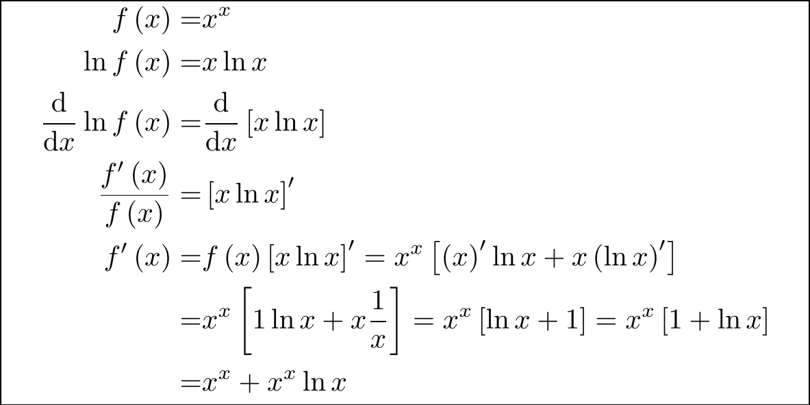
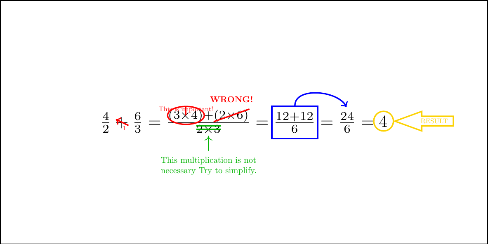
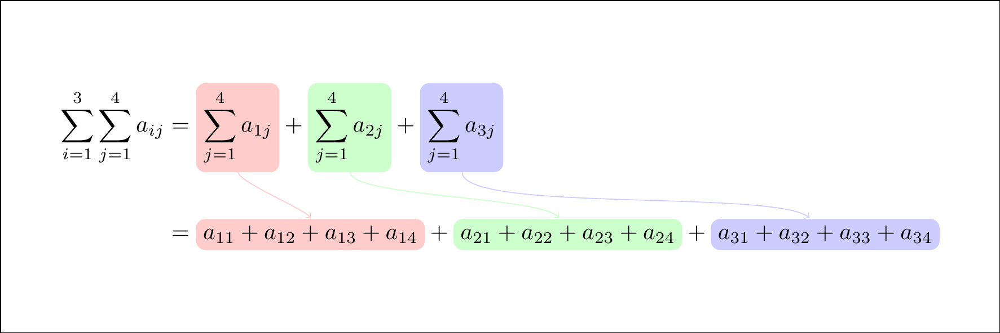

# LaTeX annotation by TikZ


```r
knitr::opts_chunk$set(fig.pos = "H", out.extra = "")
```

<div class="figure">

<p class="caption">(\#fig:unnamed-chunk-2)test</p>
</div>

https://tex.stackexchange.com/questions/670153/how-to-annotate-calculations

<div class="figure">

<p class="caption">(\#fig:unnamed-chunk-3)test</p>
</div>

https://tex.stackexchange.com/questions/494884/anchor-alignment-in-tikzmarknode

<div class="figure">

<p class="caption">(\#fig:unnamed-chunk-4)test</p>
</div>

https://github.com/synercys/annotated_latex_equations

https://github.com/synercys/annotated_latex_equations/blob/main/example_prob.tex

<div class="figure">

<p class="caption">(\#fig:unnamed-chunk-5)test</p>
</div>
