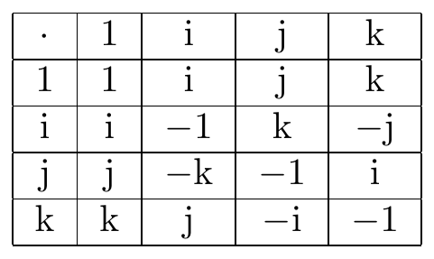
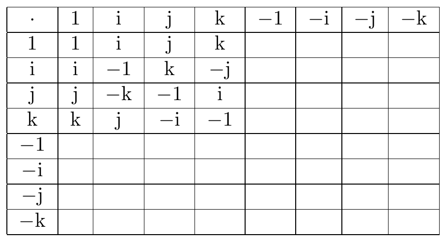
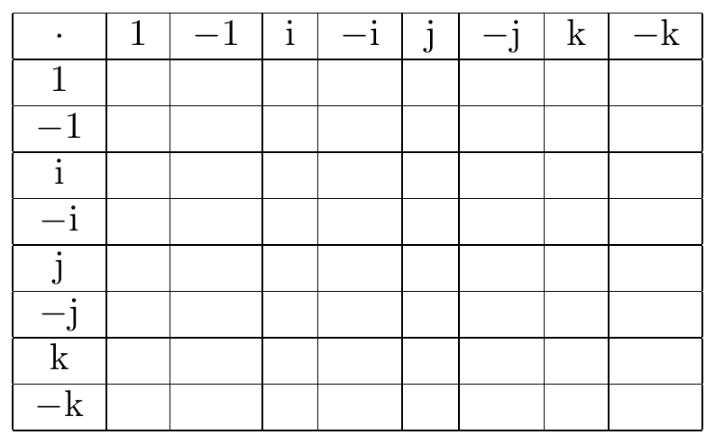

# quaternion

## TaylorCatAlice

::: {show-in="html"}
<iframe width=500 height=300 frameborder="0" allowfullscreen src="https://player.bilibili.com/player.html?bvid=BV1PV411P7w4&autoplay=0"></iframe>

曹則賢 2022 跨年演說

<iframe width=500 height=300 frameborder="0" allowfullscreen src="https://player.bilibili.com/player.html?bvid=BV1qa411B792&autoplay=0"></iframe>
:::

https://en.wikipedia.org/wiki/Blackboard_bold

### complex / dionion / bionion

$$
\begin{aligned}
 & c=a+b\mathrm{i}=a+\mathrm{i}b,\begin{cases}
c\in\mathbb{C}\\
\mathrm{i}^{2}=-1\\
a,b\in\mathbb{R} & \Leftrightarrow\left\langle a,b\right\rangle \in\mathbb{R}^{2}
\end{cases}\\
= & z=x+y\mathrm{i}=x+\mathrm{i}y,\begin{cases}
z\in\mathbb{C}\\
\mathrm{i}^{2}=-1\\
x,y\in\mathbb{R} & \Leftrightarrow\left\langle x,y\right\rangle \in\mathbb{R}^{2}
\end{cases}\\
= & \sqrt{x^{2}+y^{2}}\left(\dfrac{x}{\sqrt{x^{2}+y^{2}}}+\dfrac{y}{\sqrt{x^{2}+y^{2}}}\mathrm{i}\right)=r\left(\cos\theta+\mathrm{i}\sin\theta\right)=r\mathrm{e}^{\mathrm{i}\theta}
\end{aligned}
$$

Also see [complex group representation]^[\@ref(complex-group-representation)]^.

### trionion / triernion / triplex / ternion

https://zh.wikipedia.org/zh-tw/%E4%B8%89%E5%85%83%E6%95%B8

https://math.stackexchange.com/questions/1784166/why-are-there-no-triernions-3-dimensional-analogue-of-complex-numbers-quate

https://math.stackexchange.com/questions/32100/is-there-a-third-dimension-of-numbers/4453131

$$
\begin{aligned}
 & t=a+b\mathrm{i}+c\mathrm{j}=a+\mathrm{i}b+\mathrm{j}c,\begin{cases}
t\in\mathbb{T}\\
\mathrm{i}^{2}=-1\\
\mathrm{j}^{2}=-1
\end{cases}\\
= & w=x+y\mathrm{i}+z\mathrm{j}=x+\mathrm{i}y+\mathrm{j}z,\begin{cases}
w\in\mathbb{T}\\
\mathrm{i}^{2}=-1\\
\mathrm{j}^{2}=-1
\end{cases}\\
= & \sqrt{x^{2}+y^{2}+z^{2}}\left(\dfrac{x}{\sqrt{x^{2}+y^{2}+z^{2}}}+\dfrac{y}{\sqrt{x^{2}+y^{2}+z^{2}}}\mathrm{i}+\dfrac{z}{\sqrt{x^{2}+y^{2}+z^{2}}}\mathrm{j}\right)=?
\end{aligned}
$$

***

$$
\begin{cases}
A\left(BC\right)=\left(AB\right)C & \left(a\right)\text{associativity}\\
A\left(B+C\right)=AB+AC & \left(d\right)\text{distributivity}
\end{cases}
$$

$$
\begin{aligned}
\mathbb{T}\ni\mathrm{i}\mathrm{j}= & X+Y\mathrm{i}+Z\mathrm{j}\in\mathbb{T}\\
-\mathrm{j}=\left(\mathrm{i}^{2}\right)\mathrm{j}\overset{\left(a\right)}{=}\mathrm{i}\left(\mathrm{i}\mathrm{j}\right)= & \mathrm{i}\left(X+Y\mathrm{i}+Z\mathrm{j}\right)\overset{\left(d\right)}{=}-Y+X\mathrm{i}+Z\mathrm{i}\mathrm{j}\\
\mathrm{i}\mathrm{j}= & \dfrac{Y}{Z}-\dfrac{X}{Z}\mathrm{i}-\dfrac{1}{Z}\mathrm{j}\Rightarrow\begin{cases}
X=\dfrac{Y}{Z}\\
Y=-\dfrac{X}{Z}\\
Z=-\dfrac{1}{Z} & \Rightarrow Z^{2}=-1\Rightarrow Z\notin\mathbb{R}
\end{cases}\\
-\mathrm{i}=\mathrm{i}\left(\mathrm{j}^{2}\right)\overset{\left(a\right)}{=}\left(\mathrm{i}\mathrm{j}\right)\mathrm{j}= & \left(X+Y\mathrm{i}+Z\mathrm{j}\right)\mathrm{j}\overset{\left(d\right)}{=}-Z+X\mathrm{j}+Y\mathrm{i}\mathrm{j}\\
\mathrm{i}\mathrm{j}= & \dfrac{Z}{Y}-\dfrac{1}{Y}\mathrm{i}-\dfrac{X}{Y}\mathrm{j}\Rightarrow\begin{cases}
X=\dfrac{Z}{Y}\\
Y=-\dfrac{1}{Y} & \Rightarrow Y^{2}=-1\Rightarrow Y\notin\mathbb{R}\\
Z=-\dfrac{X}{Y}
\end{cases}
\end{aligned}
$$

### quaternion

https://en.wikipedia.org/wiki/Quaternion

$$
\begin{aligned}
 & q=a+b\mathrm{i}+c\mathrm{j}+d\mathrm{k}=a+\mathrm{i}b+\mathrm{j}c+\mathrm{k}d,\begin{cases}
q\in\mathbb{H}\\
a,b,c,d\in\mathbb{R} & \Leftrightarrow\left\langle a,b,c,d\right\rangle \in\mathbb{R}^{4}
\end{cases}\\
= & w=t+x\mathrm{i}+y\mathrm{j}+z\mathrm{k}=t+\mathrm{i}x+\mathrm{j}y+\mathrm{k}z,\begin{cases}
w\in\mathbb{H}\\
t,x,y,z\in\mathbb{R} & \Leftrightarrow\left\langle t,x,y,z\right\rangle \in\mathbb{R}^{4}
\end{cases}\\
= & ?
\end{aligned}
$$

$$
\begin{aligned}
 & q=a+b\mathrm{i}+c\mathrm{j}+d\mathrm{k}=a+\mathrm{i}b+\mathrm{j}c+\mathrm{k}d,\begin{cases}
q\in\mathbb{H}\\
\mathrm{i}^{2}=\mathrm{j}^{2}=\mathrm{k}^{2}=-1=\mathrm{i}\mathrm{j}\mathrm{k} & \Rightarrow\mathrm{i}\mathrm{j}=\mathrm{k}\\
a,b,c,d\in\mathbb{R} & \Leftrightarrow\left\langle a,b,c,d\right\rangle \in\mathbb{R}^{4}
\end{cases}\\
= & w=t+x\mathrm{i}+y\mathrm{j}+z\mathrm{k}=t+\mathrm{i}x+\mathrm{j}y+\mathrm{k}z,\begin{cases}
w\in\mathbb{H}\\
\mathrm{i}^{2}=\mathrm{j}^{2}=\mathrm{k}^{2}=-1=\mathrm{i}\mathrm{j}\mathrm{k} & \Rightarrow\mathrm{i}\mathrm{j}=\mathrm{k}\\
t,x,y,z\in\mathbb{R} & \Leftrightarrow\left\langle t,x,y,z\right\rangle \in\mathbb{R}^{4}
\end{cases}\\
= & t+\begin{pmatrix}\mathrm{i} & \mathrm{j} & \mathrm{k}\end{pmatrix}\begin{pmatrix}x\\
y\\
z
\end{pmatrix}=x_{{\scriptscriptstyle 0}}+\begin{pmatrix}\boldsymbol{i} & \boldsymbol{j} & \boldsymbol{k}\end{pmatrix}\begin{pmatrix}x\\
y\\
z
\end{pmatrix}=x_{{\scriptscriptstyle 0}}+\begin{pmatrix}\boldsymbol{e}_{{\scriptscriptstyle 1}} & \boldsymbol{e}_{{\scriptscriptstyle 2}} & \boldsymbol{e}_{{\scriptscriptstyle 3}}\end{pmatrix}\begin{pmatrix}x_{{\scriptscriptstyle 1}}\\
x_{{\scriptscriptstyle 2}}\\
x_{{\scriptscriptstyle 3}}
\end{pmatrix}=x_{{\scriptscriptstyle 0}}+\boldsymbol{x},\begin{cases}
\boldsymbol{e}_{{\scriptscriptstyle 1}}=\boldsymbol{i}=\mathrm{i}\\
\boldsymbol{e}_{{\scriptscriptstyle 2}}=\boldsymbol{j}=\mathrm{j}\\
\boldsymbol{e}_{{\scriptscriptstyle 3}}=\boldsymbol{k}=\mathrm{k}
\end{cases}\\
= & t+\dfrac{\mathrm{i}x+\mathrm{j}y+\mathrm{k}z}{r}r,\begin{cases}
r^{2}=x^{2}+y^{2}+z^{2} & \left|q\right|^{2}=t^{2}+r^{2}\\
\left\Vert \boldsymbol{n}\right\Vert ^{2}=\left(\dfrac{\mathrm{i}x+\mathrm{j}y+\mathrm{k}z}{r}\right)^{2}=-1
\end{cases}\\
= & \sqrt{t^{2}+r^{2}}\left(\dfrac{t}{\sqrt{t^{2}+r^{2}}}+\boldsymbol{n}\dfrac{r}{\sqrt{t^{2}+r^{2}}}\right)=\left|q\right|\left(\cos\dfrac{\theta}{2}+\boldsymbol{n}\sin\dfrac{\theta}{2}\right)=\left|q\right|\mathrm{e}^{\boldsymbol{n}\frac{\theta}{2}}
\end{aligned}
$$

***

The quaternion set is denoted $\mathbb{H}$ for Sir R.W. **Hamilton**, because he suddenly and strikingly realized

$$
\begin{cases}
\mathrm{i}\mathrm{j}=\mathrm{k}\\
\mathrm{k}\in\mathbb{H}
\end{cases}\Rightarrow\mathrm{i}\mathrm{j}\in\mathbb{H}\text{ for closure property}
$$

***

for the sake of rigorosity, see [group theory]^[\@ref(group-theory)]^

$$
\mathrm{k}^{2}=-1
$$

$$
\begin{aligned}
\mathrm{i}\mathrm{j} & =\mathrm{k}\\
\mathrm{i}\mathrm{j}\mathrm{k}=\mathrm{i}\left(\mathrm{j}\mathrm{k}\right)\overset{\left(a\right)}{=}\left(\mathrm{i}\mathrm{j}\right)\mathrm{k} & =\mathrm{k}\mathrm{k}=\mathrm{k}^{2}=-1\\
\mathrm{k}\mathrm{i}\mathrm{j}=\left(\mathrm{k}\mathrm{i}\right)\mathrm{j}\overset{\left(a\right)}{=}\mathrm{k}\left(\mathrm{i}\mathrm{j}\right) & =\mathrm{k}\mathrm{k}=\mathrm{k}^{2}=-1
\end{aligned}
$$

$$
\begin{aligned}
\mathrm{i}\mathrm{j} & =\mathrm{k}\\
-\mathrm{j}=\left(\mathrm{i}^{2}\right)\mathrm{j}\overset{\left(a\right)}{=}\mathrm{i}\left(\mathrm{i}\mathrm{j}\right) & =\mathrm{i}\mathrm{k}\\
-\mathrm{i}=\mathrm{i}\left(\mathrm{j}^{2}\right)\overset{\left(a\right)}{=}\left(\mathrm{i}\mathrm{j}\right)\mathrm{j} & =\mathrm{k}\mathrm{j}
\end{aligned}
$$

$$
\begin{aligned}
-\mathrm{j}=\left(\mathrm{i}^{2}\right)\mathrm{j}\overset{\left(a\right)}{=}\mathrm{i}\left(\mathrm{i}\mathrm{j}\right) & =\mathrm{i}\mathrm{k}\\
1=-\mathrm{j}^{2}=\mathrm{j}\left(-\mathrm{j}\right) & =\mathrm{j}\left(\mathrm{i}\mathrm{k}\right)\overset{\left(a\right)}{=}\left(\mathrm{j}\mathrm{i}\right)\mathrm{k}\\
\mathrm{k}=\left[1\right]\mathrm{k} & =\left[\left(\mathrm{j}\mathrm{i}\right)\mathrm{k}\right]\mathrm{k}\overset{\left(a\right)}{=}\left(\mathrm{j}\mathrm{i}\right)\left(\mathrm{k}^{2}\right)=\left(\mathrm{j}\mathrm{i}\right)\left(-1\right)\\
-\mathrm{k} & =\mathrm{j}\mathrm{i}\\
-\mathrm{i}=\mathrm{i}\left(\mathrm{j}^{2}\right)\overset{\left(a\right)}{=}\left(\mathrm{i}\mathrm{j}\right)\mathrm{j} & =\mathrm{k}\mathrm{j}\\
1=\left(-\mathrm{i}\right)\mathrm{i} & =\left(\mathrm{k}\mathrm{j}\right)\mathrm{i}\overset{\left(a\right)}{=}\mathrm{k}\left(\mathrm{j}\mathrm{i}\right)=\mathrm{k}\mathrm{j}\mathrm{i}\\
1 & =\mathrm{k}\mathrm{j}\mathrm{i}
\end{aligned}
$$

There is no more [commutativity]^[\@ref(commutativity)]^, i.e.

$$
AB\not\equiv BA
$$

but

$$
AB+BA=0\Leftrightarrow AB=-BA
$$
satisfying [anticommutativity]^[\@ref(anticommutativity)]^.

$$
\begin{aligned}
\begin{cases}
\mathrm{i}\mathrm{j}=\mathrm{k}\\
\mathrm{j}\mathrm{i}=-\mathrm{k}
\end{cases}\Leftrightarrow & \mathrm{j}\mathrm{i}=-\mathrm{k}=-\mathrm{i}\mathrm{j}\\
\Rightarrow & \mathrm{j}\mathrm{i}=-\mathrm{i}\mathrm{j}\\
\Leftrightarrow & \mathrm{i}\mathrm{j}+\mathrm{j}\mathrm{i}=0
\end{aligned}
$$

$$
\begin{aligned}
\begin{cases}
\mathrm{k}\mathrm{i}\mathrm{j}=-1\\
\mathrm{k}\mathrm{j}\mathrm{i}=1
\end{cases}\Leftrightarrow & \mathrm{k}\mathrm{i}\mathrm{j}=-1=-\mathrm{k}\mathrm{j}\mathrm{i}\\
\Rightarrow & \mathrm{k}\mathrm{i}\mathrm{j}=-\mathrm{k}\mathrm{j}\mathrm{i}\\
\Leftrightarrow & \mathrm{k}\mathrm{i}\mathrm{j}+\mathrm{k}\mathrm{j}\mathrm{i}=0
\end{aligned}
$$

***

$$
\begin{aligned}
 & q=a+b\mathrm{i}+c\mathrm{j}+d\mathrm{k}=a+\mathrm{i}b+\mathrm{j}c+\mathrm{k}d,\begin{cases}
q\in\mathbb{H}\\
\mathrm{i}^{2}=\mathrm{j}^{2}=\mathrm{k}^{2}=-1=\mathrm{i}\mathrm{j}\mathrm{k} & \Rightarrow\mathrm{i}\mathrm{j}=\mathrm{k}\\
a,b,c,d\in\mathbb{R} & \Leftrightarrow\left\langle a,b,c,d\right\rangle \in\mathbb{R}^{4}
\end{cases}\\
= & w=t+x\mathrm{i}+y\mathrm{j}+z\mathrm{k}=t+\mathrm{i}x+\mathrm{j}y+\mathrm{k}z,\begin{cases}
w\in\mathbb{H}\\
\mathrm{i}^{2}=\mathrm{j}^{2}=\mathrm{k}^{2}=-1=\mathrm{i}\mathrm{j}\mathrm{k} & \Rightarrow\mathrm{i}\mathrm{j}=\mathrm{k}\\
t,x,y,z\in\mathbb{R} & \Leftrightarrow\left\langle t,x,y,z\right\rangle \in\mathbb{R}^{4}
\end{cases}\\
= & t+\begin{pmatrix}\mathrm{i} & \mathrm{j} & \mathrm{k}\end{pmatrix}\begin{pmatrix}x\\
y\\
z
\end{pmatrix}=x_{{\scriptscriptstyle 0}}+\begin{pmatrix}\boldsymbol{i} & \boldsymbol{j} & \boldsymbol{k}\end{pmatrix}\begin{pmatrix}x\\
y\\
z
\end{pmatrix}=x_{{\scriptscriptstyle 0}}+\begin{pmatrix}\boldsymbol{e}_{{\scriptscriptstyle 1}} & \boldsymbol{e}_{{\scriptscriptstyle 2}} & \boldsymbol{e}_{{\scriptscriptstyle 3}}\end{pmatrix}\begin{pmatrix}x_{{\scriptscriptstyle 1}}\\
x_{{\scriptscriptstyle 2}}\\
x_{{\scriptscriptstyle 3}}
\end{pmatrix}=x_{{\scriptscriptstyle 0}}+\boldsymbol{x},\begin{cases}
\boldsymbol{e}_{{\scriptscriptstyle 1}}=\boldsymbol{i}=\mathrm{i}\\
\boldsymbol{e}_{{\scriptscriptstyle 2}}=\boldsymbol{j}=\mathrm{j}\\
\boldsymbol{e}_{{\scriptscriptstyle 3}}=\boldsymbol{k}=\mathrm{k}
\end{cases}
\end{aligned}
$$

(\#fig:unnamed-chunk-1)quaternion multiplication table

(\#fig:unnamed-chunk-2)quaternion basis group table

(\#fig:unnamed-chunk-3)quaternion basis group table 2

#### true origin of ( dot product & cross product ) / ( inner product & outer product )

product of two pure imaginary quaternions

$$
\begin{aligned}
\boldsymbol{x}_{{\scriptscriptstyle 1}}\boldsymbol{x}_{{\scriptscriptstyle 2}}= & \left(x_{{\scriptscriptstyle 1}{\scriptscriptstyle 1}}\mathrm{i}+x_{{\scriptscriptstyle 1}{\scriptscriptstyle 2}}\mathrm{j}+x_{{\scriptscriptstyle 1}{\scriptscriptstyle 3}}\mathrm{k}\right)\left(x_{{\scriptscriptstyle 2}{\scriptscriptstyle 1}}\mathrm{i}+x_{{\scriptscriptstyle 2}{\scriptscriptstyle 2}}\mathrm{j}+x_{{\scriptscriptstyle 2}{\scriptscriptstyle 3}}\mathrm{k}\right)\\
= & x_{{\scriptscriptstyle 1}{\scriptscriptstyle 1}}x_{{\scriptscriptstyle 2}{\scriptscriptstyle 1}}\mathrm{i}^{{\scriptscriptstyle 2}}+x_{{\scriptscriptstyle 1}{\scriptscriptstyle 1}}x_{{\scriptscriptstyle 2}{\scriptscriptstyle 2}}\mathrm{i}\mathrm{j}+x_{{\scriptscriptstyle 1}{\scriptscriptstyle 1}}x_{{\scriptscriptstyle 2}{\scriptscriptstyle 3}}\mathrm{i}\mathrm{k}\\
+ & x_{{\scriptscriptstyle 1}{\scriptscriptstyle 2}}x_{{\scriptscriptstyle 2}{\scriptscriptstyle 1}}\mathrm{j}\mathrm{i}+x_{{\scriptscriptstyle 1}{\scriptscriptstyle 2}}x_{{\scriptscriptstyle 2}{\scriptscriptstyle 2}}\mathrm{j}^{{\scriptscriptstyle 2}}+x_{{\scriptscriptstyle 1}{\scriptscriptstyle 2}}x_{{\scriptscriptstyle 2}{\scriptscriptstyle 3}}\mathrm{j}\mathrm{k}\\
+ & x_{{\scriptscriptstyle 1}{\scriptscriptstyle 3}}x_{{\scriptscriptstyle 2}{\scriptscriptstyle 1}}\mathrm{k}\mathrm{i}+x_{{\scriptscriptstyle 1}{\scriptscriptstyle 3}}x_{{\scriptscriptstyle 2}{\scriptscriptstyle 2}}\mathrm{k}\mathrm{j}+x_{{\scriptscriptstyle 1}{\scriptscriptstyle 3}}x_{{\scriptscriptstyle 2}{\scriptscriptstyle 3}}\mathrm{k}^{{\scriptscriptstyle 2}}\\
= & -\left(x_{{\scriptscriptstyle 1}{\scriptscriptstyle 1}}x_{{\scriptscriptstyle 2}{\scriptscriptstyle 1}}+x_{{\scriptscriptstyle 1}{\scriptscriptstyle 2}}x_{{\scriptscriptstyle 2}{\scriptscriptstyle 2}}+x_{{\scriptscriptstyle 1}{\scriptscriptstyle 3}}x_{{\scriptscriptstyle 2}{\scriptscriptstyle 3}}\right)\\
+ & \left(x_{{\scriptscriptstyle 1}{\scriptscriptstyle 2}}x_{{\scriptscriptstyle 2}{\scriptscriptstyle 3}}-x_{{\scriptscriptstyle 1}{\scriptscriptstyle 3}}x_{{\scriptscriptstyle 2}{\scriptscriptstyle 2}}\right)\mathrm{j}\mathrm{k}+\left(x_{{\scriptscriptstyle 1}{\scriptscriptstyle 3}}x_{{\scriptscriptstyle 2}{\scriptscriptstyle 1}}-x_{{\scriptscriptstyle 1}{\scriptscriptstyle 1}}x_{{\scriptscriptstyle 2}{\scriptscriptstyle 3}}\right)\mathrm{k}\mathrm{i}+\left(x_{{\scriptscriptstyle 1}{\scriptscriptstyle 1}}x_{{\scriptscriptstyle 2}{\scriptscriptstyle 2}}-x_{{\scriptscriptstyle 1}{\scriptscriptstyle 2}}x_{{\scriptscriptstyle 2}{\scriptscriptstyle 1}}\right)\mathrm{i}\mathrm{j}\\
= & -\left(x_{{\scriptscriptstyle 1}{\scriptscriptstyle 1}}x_{{\scriptscriptstyle 2}{\scriptscriptstyle 1}}+x_{{\scriptscriptstyle 1}{\scriptscriptstyle 2}}x_{{\scriptscriptstyle 2}{\scriptscriptstyle 2}}+x_{{\scriptscriptstyle 1}{\scriptscriptstyle 3}}x_{{\scriptscriptstyle 2}{\scriptscriptstyle 3}}\right)\\
+ & \left(x_{{\scriptscriptstyle 1}{\scriptscriptstyle 2}}x_{{\scriptscriptstyle 2}{\scriptscriptstyle 3}}-x_{{\scriptscriptstyle 1}{\scriptscriptstyle 3}}x_{{\scriptscriptstyle 2}{\scriptscriptstyle 2}}\right)\mathrm{i}+\left(x_{{\scriptscriptstyle 1}{\scriptscriptstyle 3}}x_{{\scriptscriptstyle 2}{\scriptscriptstyle 1}}-x_{{\scriptscriptstyle 1}{\scriptscriptstyle 1}}x_{{\scriptscriptstyle 2}{\scriptscriptstyle 3}}\right)\mathrm{j}+\left(x_{{\scriptscriptstyle 1}{\scriptscriptstyle 1}}x_{{\scriptscriptstyle 2}{\scriptscriptstyle 2}}-x_{{\scriptscriptstyle 1}{\scriptscriptstyle 2}}x_{{\scriptscriptstyle 2}{\scriptscriptstyle 1}}\right)\mathrm{k}\\
= & -\left(\boldsymbol{x}_{{\scriptscriptstyle 1}}\cdot\boldsymbol{x}_{{\scriptscriptstyle 2}}\right)+\left(\boldsymbol{x}_{{\scriptscriptstyle 1}}\times\boldsymbol{x}_{{\scriptscriptstyle 2}}\right),\begin{cases}
\boldsymbol{x}_{{\scriptscriptstyle 1}}\cdot\boldsymbol{x}_{{\scriptscriptstyle 2}}=x_{{\scriptscriptstyle 1}{\scriptscriptstyle 1}}x_{{\scriptscriptstyle 2}{\scriptscriptstyle 1}}+x_{{\scriptscriptstyle 1}{\scriptscriptstyle 2}}x_{{\scriptscriptstyle 2}{\scriptscriptstyle 2}}+x_{{\scriptscriptstyle 1}{\scriptscriptstyle 3}}x_{{\scriptscriptstyle 2}{\scriptscriptstyle 3}}\\
\boldsymbol{x}_{{\scriptscriptstyle 1}}\times\boldsymbol{x}_{{\scriptscriptstyle 2}}=\begin{vmatrix}\mathrm{i} & \mathrm{j} & \mathrm{k}\\
x_{{\scriptscriptstyle 1}{\scriptscriptstyle 1}} & x_{{\scriptscriptstyle 1}{\scriptscriptstyle 2}} & x_{{\scriptscriptstyle 1}{\scriptscriptstyle 3}}\\
x_{{\scriptscriptstyle 2}{\scriptscriptstyle 1}} & x_{{\scriptscriptstyle 2}{\scriptscriptstyle 2}} & x_{{\scriptscriptstyle 2}{\scriptscriptstyle 3}}
\end{vmatrix}
\end{cases}\\
= & -\boldsymbol{x}_{{\scriptscriptstyle 1}}\cdot\boldsymbol{x}_{{\scriptscriptstyle 2}}+\boldsymbol{x}_{{\scriptscriptstyle 1}}\times\boldsymbol{x}_{{\scriptscriptstyle 2}}
\end{aligned}
$$

product of two general quaternions / ordinary quaternions = Grassmann product

$$
\begin{aligned}
q_{{\scriptscriptstyle 1}}q_{{\scriptscriptstyle 2}}= & \left(q_{{\scriptscriptstyle 10}}+q_{{\scriptscriptstyle 11}}\mathrm{i}+q_{{\scriptscriptstyle 12}}\mathrm{j}+q_{{\scriptscriptstyle 13}}\mathrm{k}\right)\left(q_{{\scriptscriptstyle 20}}+q_{{\scriptscriptstyle 21}}\mathrm{i}+q_{{\scriptscriptstyle 22}}\mathrm{j}+q_{{\scriptscriptstyle 23}}\mathrm{k}\right)\\
= & \left(x_{{\scriptscriptstyle 10}}+\boldsymbol{x}_{{\scriptscriptstyle 1}}\right)\left(x_{{\scriptscriptstyle 20}}+\boldsymbol{x}_{{\scriptscriptstyle 2}}\right),\begin{cases}
x_{{\scriptscriptstyle i\mu}}=q_{{\scriptscriptstyle i\mu}} & \mu\in\left\{ 0\right\} \cup\left(\mathbb{N}\cap\left[1,3\right]\right)\\
\boldsymbol{x}_{{\scriptscriptstyle i}}=x_{{\scriptscriptstyle ij}}\boldsymbol{e}_{{\scriptscriptstyle j}} & i,j\in\mathbb{N}\cap\left[1,3\right],\begin{cases}
\boldsymbol{e}_{{\scriptscriptstyle 1}}=\mathrm{i}\\
\boldsymbol{e}_{{\scriptscriptstyle 2}}=\mathrm{j}\\
\boldsymbol{e}_{{\scriptscriptstyle 3}}=\mathrm{k}
\end{cases}
\end{cases}\\
= & x_{{\scriptscriptstyle 10}}x_{{\scriptscriptstyle 20}}+x_{{\scriptscriptstyle 10}}\boldsymbol{x}_{{\scriptscriptstyle 2}}+x_{{\scriptscriptstyle 20}}\boldsymbol{x}_{{\scriptscriptstyle 1}}+\boldsymbol{x}_{{\scriptscriptstyle 1}}\boldsymbol{x}_{{\scriptscriptstyle 2}}\\
= & x_{{\scriptscriptstyle 10}}x_{{\scriptscriptstyle 20}}+x_{{\scriptscriptstyle 10}}\boldsymbol{x}_{{\scriptscriptstyle 2}}+x_{{\scriptscriptstyle 20}}\boldsymbol{x}_{{\scriptscriptstyle 1}}-\boldsymbol{x}_{{\scriptscriptstyle 1}}\cdot\boldsymbol{x}_{{\scriptscriptstyle 2}}+\boldsymbol{x}_{{\scriptscriptstyle 1}}\times\boldsymbol{x}_{{\scriptscriptstyle 2}}\\
= & \left(x_{{\scriptscriptstyle 10}}x_{{\scriptscriptstyle 20}}-\boldsymbol{x}_{{\scriptscriptstyle 1}}\cdot\boldsymbol{x}_{{\scriptscriptstyle 2}}\right)+\left(x_{{\scriptscriptstyle 10}}\boldsymbol{x}_{{\scriptscriptstyle 2}}+x_{{\scriptscriptstyle 20}}\boldsymbol{x}_{{\scriptscriptstyle 1}}+\boldsymbol{x}_{{\scriptscriptstyle 1}}\times\boldsymbol{x}_{{\scriptscriptstyle 2}}\right)\\
x_{{\scriptscriptstyle 10}}x_{{\scriptscriptstyle 20}}-\boldsymbol{x}_{{\scriptscriptstyle 1}}\cdot\boldsymbol{x}_{{\scriptscriptstyle 2}}= & \begin{pmatrix}q_{{\scriptscriptstyle 10}} & q_{{\scriptscriptstyle 11}} & q_{{\scriptscriptstyle 12}} & q_{{\scriptscriptstyle 13}}\end{pmatrix}\begin{pmatrix}1\\
 & -1\\
 &  & -1\\
 &  &  & -1
\end{pmatrix}\begin{pmatrix}q_{{\scriptscriptstyle 20}}\\
q_{{\scriptscriptstyle 21}}\\
q_{{\scriptscriptstyle 22}}\\
q_{{\scriptscriptstyle 23}}
\end{pmatrix}=q_{{\scriptscriptstyle 1}}^{{\scriptscriptstyle \mu}}\eta_{{\scriptscriptstyle \mu\nu}}q_{{\scriptscriptstyle 2}}^{{\scriptscriptstyle \nu}}\\
= & \begin{pmatrix}q_{{\scriptscriptstyle 10}} & q_{{\scriptscriptstyle 11}} & q_{{\scriptscriptstyle 12}} & q_{{\scriptscriptstyle 13}}\end{pmatrix}\begin{pmatrix}1 & 0 & 0 & 0\\
0 & -1 & 0 & 0\\
0 & 0 & -1 & 0\\
0 & 0 & 0 & -1
\end{pmatrix}\begin{pmatrix}q_{{\scriptscriptstyle 20}}\\
q_{{\scriptscriptstyle 21}}\\
q_{{\scriptscriptstyle 22}}\\
q_{{\scriptscriptstyle 23}}
\end{pmatrix}=\boldsymbol{q}_{{\scriptscriptstyle 1}}^{\intercal}H\boldsymbol{q}_{{\scriptscriptstyle 2}},H=\left[\eta_{{\scriptscriptstyle \mu\nu}}\right]_{4\times4}=\eta_{{\scriptscriptstyle \mu\nu}}
\end{aligned}
$$

$$
\begin{aligned}
q_{{\scriptscriptstyle 1}}q_{{\scriptscriptstyle 2}}= & \left(x_{{\scriptscriptstyle 10}}x_{{\scriptscriptstyle 20}}-\boldsymbol{x}_{{\scriptscriptstyle 1}}\cdot\boldsymbol{x}_{{\scriptscriptstyle 2}}\right)+\left(x_{{\scriptscriptstyle 10}}\boldsymbol{x}_{{\scriptscriptstyle 2}}+x_{{\scriptscriptstyle 20}}\boldsymbol{x}_{{\scriptscriptstyle 1}}+\boldsymbol{x}_{{\scriptscriptstyle 1}}\times\boldsymbol{x}_{{\scriptscriptstyle 2}}\right)\\
QP= & \left(Q_{{\scriptscriptstyle 0}}P_{{\scriptscriptstyle 0}}-\boldsymbol{Q}\cdot\boldsymbol{P}\right)+\left(Q_{{\scriptscriptstyle 0}}\boldsymbol{P}+P_{{\scriptscriptstyle 0}}\boldsymbol{Q}+\boldsymbol{Q}\times\boldsymbol{P}\right)
\end{aligned}
$$

$$
ab=\left(a_{{\scriptscriptstyle 0}}b_{{\scriptscriptstyle 0}}-\boldsymbol{a}\cdot\boldsymbol{b}\right)+\left(a_{{\scriptscriptstyle 0}}\boldsymbol{b}+b_{{\scriptscriptstyle 0}}\boldsymbol{a}+\boldsymbol{a}\times\boldsymbol{b}\right)
$$

Minkowski metric tensor

$$
\eta=H=\left[\eta_{{\scriptscriptstyle \mu\nu}}\right]_{4\times4}=\begin{pmatrix}1 & 0 & 0 & 0\\
0 & -1 & 0 & 0\\
0 & 0 & -1 & 0\\
0 & 0 & 0 & -1
\end{pmatrix}=\begin{pmatrix}1\\
 & -1\\
 &  & -1\\
 &  &  & -1
\end{pmatrix}=\eta_{{\scriptscriptstyle \mu\nu}}
$$

and quaternions as 4-vectors or four-vectors

$$
\boldsymbol{q}_{{\scriptscriptstyle 1}}^{\intercal}=\begin{pmatrix}q_{{\scriptscriptstyle 10}} & q_{{\scriptscriptstyle 11}} & q_{{\scriptscriptstyle 12}} & q_{{\scriptscriptstyle 13}}\end{pmatrix}
$$

$$
\boldsymbol{q}_{{\scriptscriptstyle 2}}=\begin{pmatrix}q_{{\scriptscriptstyle 20}}\\
q_{{\scriptscriptstyle 21}}\\
q_{{\scriptscriptstyle 22}}\\
q_{{\scriptscriptstyle 23}}
\end{pmatrix}
$$

#### commutativity vs. anticommutativity

##### commutativity

::: {show-in="html"}
交換律 = 交換性 = 對易性
:::

::: {show-in="pdf"}
\begin{CJK}{UTF8}{bsmi}
交換律 = 交換性 = 對易性
\end{CJK}
:::

$$
AB=BA\Leftrightarrow AB-BA=0
$$

$$
AB=BA\Rightarrow AB\equiv BA
$$

##### anticommutativity

::: {show-in="html"}
反交換律 = 反交換性 = 反對易性
:::

::: {show-in="pdf"}
\begin{CJK}{UTF8}{bsmi}
反交換律 = 反交換性 = 反對易性
\end{CJK}
:::

$$
AB+BA=0\Leftrightarrow AB=-BA
$$

$$
AB=-BA\Rightarrow AB\not\equiv BA
$$

#### bracket

##### self-invented bracket

::: {show-in="html"}
自創括號 = 自創括
:::

::: {show-in="pdf"}
\begin{CJK}{UTF8}{bsmi}
自創括號 = 自創括
\end{CJK}
:::

###### commutative bracket

::: {show-in="html"}
交換括號 = 對易式
:::

::: {show-in="pdf"}
\begin{CJK}{UTF8}{bsmi}
交換括號 = 對易式
\end{CJK}
:::

$$
\left[X,Y\right]=\dfrac{XY-YX}{2}
$$

###### anticommutative bracket

::: {show-in="html"}
反交換括號 = 反對易式
:::

::: {show-in="pdf"}
\begin{CJK}{UTF8}{bsmi}
反交換括號 = 反對易式
\end{CJK}
:::

$$
\left\{ X,Y\right\} =\dfrac{XY+YX}{2}
$$

##### Poisson bracket

https://en.wikipedia.org/wiki/Poisson_bracket

##### Lagrange bracket

##### Lie bracket

#### triple product

product = double product = Grassmann product

$$
ab=\left(a_{{\scriptscriptstyle 0}}b_{{\scriptscriptstyle 0}}-\boldsymbol{a}\cdot\boldsymbol{b}\right)+\left(a_{{\scriptscriptstyle 0}}\boldsymbol{b}+b_{{\scriptscriptstyle 0}}\boldsymbol{a}+\boldsymbol{a}\times\boldsymbol{b}\right)
$$
pure imaginary

$$
\begin{aligned}
ab= & \left(a_{{\scriptscriptstyle 0}}b_{{\scriptscriptstyle 0}}-\boldsymbol{a}\cdot\boldsymbol{b}\right)+\left(a_{{\scriptscriptstyle 0}}\boldsymbol{b}+b_{{\scriptscriptstyle 0}}\boldsymbol{a}+\boldsymbol{a}\times\boldsymbol{b}\right)\\
\overset{\begin{cases}
a_{0}=0\\
b_{0}=0
\end{cases}}{=} & \left(00-\boldsymbol{a}\cdot\boldsymbol{b}\right)+\left(0\boldsymbol{b}+0\boldsymbol{a}+\boldsymbol{a}\times\boldsymbol{b}\right)\\
= & -\boldsymbol{a}\cdot\boldsymbol{b}+\boldsymbol{a}\times\boldsymbol{b}
\end{aligned}
$$

pure imaginary product can get both ( real & imaginary ) / ( scalar & vector ) parts

$$
ab=\boldsymbol{a}\boldsymbol{b}=-\boldsymbol{a}\cdot\boldsymbol{b}+\boldsymbol{a}\times\boldsymbol{b},\begin{cases}
a=0+\boldsymbol{a}=\boldsymbol{a}\\
b=0+\boldsymbol{b}=\boldsymbol{b}
\end{cases}
$$

***

triple product

https://en.wikipedia.org/wiki/Triple_product

pure imaginary

$$
\begin{cases}
a=0+\boldsymbol{a}=\boldsymbol{a}\\
b=0+\boldsymbol{b}=\boldsymbol{b}\\
c=0+\boldsymbol{c}=\boldsymbol{c}
\end{cases}
$$

$$
\begin{aligned}
abc=\boldsymbol{a}\boldsymbol{b}\boldsymbol{c}= & \left(\boldsymbol{a}\boldsymbol{b}\right)\boldsymbol{c}=\left(-\boldsymbol{a}\cdot\boldsymbol{b}+\boldsymbol{a}\times\boldsymbol{b}\right)\boldsymbol{c}\\
= & \boldsymbol{a}\left(\boldsymbol{b}\boldsymbol{c}\right)=\boldsymbol{a}\left(-\boldsymbol{b}\cdot\boldsymbol{c}+\boldsymbol{b}\times\boldsymbol{c}\right)
\end{aligned}
$$

$$
\begin{aligned}
\boldsymbol{a}\boldsymbol{b}\boldsymbol{c}=\left(\boldsymbol{a}\boldsymbol{b}\right)\boldsymbol{c}= & \left(-\boldsymbol{a}\cdot\boldsymbol{b}+\boldsymbol{a}\times\boldsymbol{b}\right)\boldsymbol{c}\\
= & -\left(\boldsymbol{a}\cdot\boldsymbol{b}\right)\boldsymbol{c}+\left(\boldsymbol{a}\times\boldsymbol{b}\right)\boldsymbol{c}\\
= & -\left(\boldsymbol{a}\cdot\boldsymbol{b}\right)\boldsymbol{c}+\left(-\left(\boldsymbol{a}\times\boldsymbol{b}\right)\cdot\boldsymbol{c}+\left(\boldsymbol{a}\times\boldsymbol{b}\right)\times\boldsymbol{c}\right)\\
= & \left[-\left(\boldsymbol{a}\times\boldsymbol{b}\right)\cdot\boldsymbol{c}\right]+\left[\left(\boldsymbol{a}\times\boldsymbol{b}\right)\times\boldsymbol{c}-\left(\boldsymbol{a}\cdot\boldsymbol{b}\right)\boldsymbol{c}\right]\\
=\boldsymbol{a}\left(\boldsymbol{b}\boldsymbol{c}\right)= & \boldsymbol{a}\left(-\boldsymbol{b}\cdot\boldsymbol{c}+\boldsymbol{b}\times\boldsymbol{c}\right)\\
= & -\boldsymbol{a}\left(\boldsymbol{b}\cdot\boldsymbol{c}\right)+\boldsymbol{a}\left(\boldsymbol{b}\times\boldsymbol{c}\right)\\
= & -\boldsymbol{a}\left(\boldsymbol{b}\cdot\boldsymbol{c}\right)+\left(-\boldsymbol{a}\cdot\left(\boldsymbol{b}\times\boldsymbol{c}\right)+\boldsymbol{a}\times\left(\boldsymbol{b}\times\boldsymbol{c}\right)\right)\\
= & \left[-\boldsymbol{a}\cdot\left(\boldsymbol{b}\times\boldsymbol{c}\right)\right]+\left[\boldsymbol{a}\times\left(\boldsymbol{b}\times\boldsymbol{c}\right)-\boldsymbol{a}\left(\boldsymbol{b}\cdot\boldsymbol{c}\right)\right]
\end{aligned}
$$

by comparing ( real & imaginary ) / ( scalar & vector ) parts,

$$
\begin{aligned}
 & \begin{cases}
-\left(\boldsymbol{a}\times\boldsymbol{b}\right)\cdot\boldsymbol{c}=-\boldsymbol{a}\cdot\left(\boldsymbol{b}\times\boldsymbol{c}\right)\\
\left(\boldsymbol{a}\times\boldsymbol{b}\right)\times\boldsymbol{c}-\left(\boldsymbol{a}\cdot\boldsymbol{b}\right)\boldsymbol{c}=\boldsymbol{a}\times\left(\boldsymbol{b}\times\boldsymbol{c}\right)-\boldsymbol{a}\left(\boldsymbol{b}\cdot\boldsymbol{c}\right)
\end{cases}\\
\Rightarrow & \begin{cases}
\left(\boldsymbol{a}\times\boldsymbol{b}\right)\cdot\boldsymbol{c}=\boldsymbol{a}\cdot\left(\boldsymbol{b}\times\boldsymbol{c}\right) & \left(s\right)\\
\left(\boldsymbol{a}\times\boldsymbol{b}\right)\times\boldsymbol{c}-\left(\boldsymbol{a}\cdot\boldsymbol{b}\right)\boldsymbol{c}=\boldsymbol{a}\times\left(\boldsymbol{b}\times\boldsymbol{c}\right)-\boldsymbol{a}\left(\boldsymbol{b}\cdot\boldsymbol{c}\right) & \left(v\right)
\end{cases}
\end{aligned}
$$

***

permutation

$$
\sigma=\begin{pmatrix}x_{{\scriptscriptstyle 1}} & x_{{\scriptscriptstyle 2}} & \cdots\\
\sigma\left(x_{{\scriptscriptstyle 1}}\right) & \sigma\left(x_{{\scriptscriptstyle 2}}\right) & \cdots
\end{pmatrix}
$$

$$
\begin{pmatrix}a & b & c\\
a & b & c
\end{pmatrix},\begin{pmatrix}a & b & c\\
b & c & a
\end{pmatrix},\begin{pmatrix}a & b & c\\
c & a & b
\end{pmatrix},\begin{pmatrix}a & b & c\\
a & c & b
\end{pmatrix},\begin{pmatrix}a & b & c\\
b & a & c
\end{pmatrix},\begin{pmatrix}a & b & c\\
c & b & a
\end{pmatrix}
$$

***

$$
\begin{aligned}
\left(s\right)\Rightarrow & \begin{cases}
\left(\boldsymbol{a}\times\boldsymbol{b}\right)\cdot\boldsymbol{c}=\boldsymbol{a}\cdot\left(\boldsymbol{b}\times\boldsymbol{c}\right) & \begin{pmatrix}a & b & c\\
a & b & c
\end{pmatrix},s_{{\scriptscriptstyle 1}}\\
\left(\boldsymbol{b}\times\boldsymbol{c}\right)\cdot\boldsymbol{a}=\boldsymbol{b}\cdot\left(\boldsymbol{c}\times\boldsymbol{a}\right) & \begin{pmatrix}a & b & c\\
b & c & a
\end{pmatrix},s_{{\scriptscriptstyle 2}}\\
\left(\boldsymbol{c}\times\boldsymbol{a}\right)\cdot\boldsymbol{b}=\boldsymbol{c}\cdot\left(\boldsymbol{a}\times\boldsymbol{b}\right) & \begin{pmatrix}a & b & c\\
c & a & b
\end{pmatrix},s_{{\scriptscriptstyle 3}}\\
\left(\boldsymbol{b}\times\boldsymbol{a}\right)\cdot\boldsymbol{c}=\boldsymbol{b}\cdot\left(\boldsymbol{a}\times\boldsymbol{c}\right) & \begin{pmatrix}a & b & c\\
b & a & c
\end{pmatrix},s_{{\scriptscriptstyle 4}}\\
\left(\boldsymbol{a}\times\boldsymbol{c}\right)\cdot\boldsymbol{b}=\boldsymbol{a}\cdot\left(\boldsymbol{c}\times\boldsymbol{b}\right) & \begin{pmatrix}a & b & c\\
a & c & b
\end{pmatrix},s_{{\scriptscriptstyle 5}}\\
\left(\boldsymbol{c}\times\boldsymbol{b}\right)\cdot\boldsymbol{a}=\boldsymbol{c}\cdot\left(\boldsymbol{b}\times\boldsymbol{a}\right) & \begin{pmatrix}a & b & c\\
c & b & a
\end{pmatrix},s_{{\scriptscriptstyle 6}}
\end{cases}\\
\overset{\cdot\text{ commutative}}{\Rightarrow} & \left(\boldsymbol{a}\times\boldsymbol{b}\right)\cdot\boldsymbol{c}\overset{s_{{\scriptscriptstyle 1}}}{=}\left(\boldsymbol{b}\times\boldsymbol{c}\right)\cdot\boldsymbol{a}\overset{s_{{\scriptscriptstyle 2}}}{=}\left(\boldsymbol{c}\times\boldsymbol{a}\right)\cdot\boldsymbol{b}\overset{s_{{\scriptscriptstyle 3}}}{=}\left(\boldsymbol{a}\times\boldsymbol{b}\right)\cdot\boldsymbol{c}\\
\overset{\times\text{ anticommutative}}{=} & -\left(\boldsymbol{b}\times\boldsymbol{a}\right)\cdot\boldsymbol{c}\overset{s_{{\scriptscriptstyle 6}}}{=}-\left(\boldsymbol{c}\times\boldsymbol{b}\right)\cdot\boldsymbol{a}\overset{s_{{\scriptscriptstyle 5}}}{=}-\left(\boldsymbol{a}\times\boldsymbol{c}\right)\cdot\boldsymbol{b}\overset{s_{{\scriptscriptstyle 4}}}{=}-\left(\boldsymbol{b}\times\boldsymbol{a}\right)\cdot\boldsymbol{c}\\
\Leftrightarrow & \boldsymbol{a}\cdot\left(\boldsymbol{b}\times\boldsymbol{c}\right)=\boldsymbol{b}\cdot\left(\boldsymbol{c}\times\boldsymbol{a}\right)=\boldsymbol{c}\cdot\left(\boldsymbol{a}\times\boldsymbol{b}\right)\\
= & -\boldsymbol{a}\cdot\left(\boldsymbol{c}\times\boldsymbol{b}\right)=-\boldsymbol{b}\cdot\left(\boldsymbol{a}\times\boldsymbol{c}\right)=-\boldsymbol{c}\cdot\left(\boldsymbol{b}\times\boldsymbol{a}\right)
\end{aligned}
$$

***

$$
\begin{aligned}
\left(v\right)\Rightarrow & \begin{cases}
\left(\boldsymbol{a}\times\boldsymbol{b}\right)\times\boldsymbol{c}-\left(\boldsymbol{a}\cdot\boldsymbol{b}\right)\boldsymbol{c}=\boldsymbol{a}\times\left(\boldsymbol{b}\times\boldsymbol{c}\right)-\boldsymbol{a}\left(\boldsymbol{b}\cdot\boldsymbol{c}\right) & \begin{pmatrix}a & b & c\\
a & b & c
\end{pmatrix},v_{{\scriptscriptstyle 1}}\\
\left(\boldsymbol{b}\times\boldsymbol{c}\right)\times\boldsymbol{a}-\left(\boldsymbol{b}\cdot\boldsymbol{c}\right)\boldsymbol{a}=\boldsymbol{b}\times\left(\boldsymbol{c}\times\boldsymbol{a}\right)-\boldsymbol{b}\left(\boldsymbol{c}\cdot\boldsymbol{a}\right) & \begin{pmatrix}a & b & c\\
b & c & a
\end{pmatrix},v_{{\scriptscriptstyle 2}}\\
\left(\boldsymbol{c}\times\boldsymbol{a}\right)\times\boldsymbol{b}-\left(\boldsymbol{c}\cdot\boldsymbol{a}\right)\boldsymbol{b}=\boldsymbol{c}\times\left(\boldsymbol{a}\times\boldsymbol{b}\right)-\boldsymbol{c}\left(\boldsymbol{a}\cdot\boldsymbol{b}\right) & \begin{pmatrix}a & b & c\\
c & a & b
\end{pmatrix},v_{{\scriptscriptstyle 3}}\\
\left(\boldsymbol{b}\times\boldsymbol{a}\right)\times\boldsymbol{c}-\left(\boldsymbol{b}\cdot\boldsymbol{a}\right)\boldsymbol{c}=\boldsymbol{b}\times\left(\boldsymbol{a}\times\boldsymbol{c}\right)-\boldsymbol{b}\left(\boldsymbol{a}\cdot\boldsymbol{c}\right) & \begin{pmatrix}a & b & c\\
b & a & c
\end{pmatrix},v_{{\scriptscriptstyle 4}}\\
\left(\boldsymbol{a}\times\boldsymbol{c}\right)\times\boldsymbol{b}-\left(\boldsymbol{a}\cdot\boldsymbol{c}\right)\boldsymbol{b}=\boldsymbol{a}\times\left(\boldsymbol{c}\times\boldsymbol{b}\right)-\boldsymbol{a}\left(\boldsymbol{c}\cdot\boldsymbol{b}\right) & \begin{pmatrix}a & b & c\\
a & c & b
\end{pmatrix},v_{{\scriptscriptstyle 5}}\\
\left(\boldsymbol{c}\times\boldsymbol{b}\right)\times\boldsymbol{a}-\left(\boldsymbol{c}\cdot\boldsymbol{b}\right)\boldsymbol{a}=\boldsymbol{c}\times\left(\boldsymbol{b}\times\boldsymbol{a}\right)-\boldsymbol{c}\left(\boldsymbol{b}\cdot\boldsymbol{a}\right) & \begin{pmatrix}a & b & c\\
c & b & a
\end{pmatrix},v_{{\scriptscriptstyle 6}}
\end{cases}\\
\Rightarrow & \begin{cases}
-Z-C=X-A & v_{{\scriptscriptstyle 1}}\\
-X-A=Y-B & v_{{\scriptscriptstyle 2}}\\
-Y-B=Z-C & v_{{\scriptscriptstyle 3}}\\
Z-C=-Y-B & v_{{\scriptscriptstyle 4}}\\
Y-B=-X-A & v_{{\scriptscriptstyle 5}}\\
X-A=-Z-C & v_{{\scriptscriptstyle 6}}
\end{cases},\begin{cases}
\cdot\text{ and scalar-vector product} & \text{commutative}\\
\times & \text{anticommutative}
\end{cases},\\
 & \begin{cases}
X=\boldsymbol{a}\times\left(\boldsymbol{b}\times\boldsymbol{c}\right)=-\left(\boldsymbol{b}\times\boldsymbol{c}\right)\times\boldsymbol{a}=-\boldsymbol{a}\times\left(\boldsymbol{c}\times\boldsymbol{b}\right)=\left(\boldsymbol{c}\times\boldsymbol{b}\right)\times\boldsymbol{a}\\
Y=\boldsymbol{b}\times\left(\boldsymbol{c}\times\boldsymbol{a}\right)=-\left(\boldsymbol{c}\times\boldsymbol{a}\right)\times\boldsymbol{b}=-\boldsymbol{b}\times\left(\boldsymbol{a}\times\boldsymbol{c}\right)=\left(\boldsymbol{a}\times\boldsymbol{c}\right)\times\boldsymbol{b}\\
Z=\boldsymbol{c}\times\left(\boldsymbol{a}\times\boldsymbol{b}\right)=-\left(\boldsymbol{a}\times\boldsymbol{b}\right)\times\boldsymbol{c}=-\boldsymbol{c}\times\left(\boldsymbol{b}\times\boldsymbol{a}\right)=\left(\boldsymbol{b}\times\boldsymbol{a}\right)\times\boldsymbol{c}\\
A=\boldsymbol{a}\left(\boldsymbol{b}\cdot\boldsymbol{c}\right)=\boldsymbol{a}\left(\boldsymbol{c}\cdot\boldsymbol{b}\right)=\left(\boldsymbol{c}\cdot\boldsymbol{b}\right)\boldsymbol{a}=\left(\boldsymbol{b}\cdot\boldsymbol{c}\right)\boldsymbol{a}\\
B=\boldsymbol{b}\left(\boldsymbol{c}\cdot\boldsymbol{a}\right)=\boldsymbol{b}\left(\boldsymbol{a}\cdot\boldsymbol{c}\right)=\left(\boldsymbol{a}\cdot\boldsymbol{c}\right)\boldsymbol{b}=\left(\boldsymbol{c}\cdot\boldsymbol{a}\right)\boldsymbol{b}\\
C=\boldsymbol{c}\left(\boldsymbol{a}\cdot\boldsymbol{b}\right)=\boldsymbol{c}\left(\boldsymbol{b}\cdot\boldsymbol{a}\right)=\left(\boldsymbol{b}\cdot\boldsymbol{a}\right)\boldsymbol{c}=\left(\boldsymbol{a}\cdot\boldsymbol{b}\right)\boldsymbol{c}
\end{cases}\\
\Rightarrow & \begin{cases}
-Z-C=X-A & v_{{\scriptscriptstyle 1}}=v_{{\scriptscriptstyle 6}}\\
-X-A=Y-B & v_{{\scriptscriptstyle 2}}=v_{{\scriptscriptstyle 5}}\\
-Y-B=Z-C & v_{{\scriptscriptstyle 3}}=v_{{\scriptscriptstyle 4}}
\end{cases}\Leftrightarrow\begin{cases}
Z+X=A-C\\
X+Y=B-A\\
Y+Z=C-B
\end{cases}\Leftrightarrow\begin{cases}
X+Y=B-A\\
Y+Z=C-B\\
Z+X=A-C
\end{cases}\\
\Leftrightarrow & \begin{cases}
2\left(X+Y+Z\right)=0 & \Rightarrow X+Y+Z=0\\
Y+Z=C-B & \Rightarrow X=B-C\Leftrightarrow\boldsymbol{a}\times\left(\boldsymbol{b}\times\boldsymbol{c}\right)=\boldsymbol{b}\left(\boldsymbol{c}\cdot\boldsymbol{a}\right)-\boldsymbol{c}\left(\boldsymbol{a}\cdot\boldsymbol{b}\right)\text{ "back cab"}\\
Z+X=A-C & \Rightarrow Y=C-A\Leftrightarrow\boldsymbol{b}\times\left(\boldsymbol{c}\times\boldsymbol{a}\right)=\boldsymbol{c}\left(\boldsymbol{a}\cdot\boldsymbol{b}\right)-\boldsymbol{a}\left(\boldsymbol{b}\cdot\boldsymbol{c}\right)\\
X+Y=B-A & \Rightarrow Z=A-B\Leftrightarrow\boldsymbol{c}\times\left(\boldsymbol{a}\times\boldsymbol{b}\right)=\boldsymbol{a}\left(\boldsymbol{b}\cdot\boldsymbol{c}\right)-\boldsymbol{b}\left(\boldsymbol{c}\cdot\boldsymbol{a}\right)
\end{cases}
\end{aligned}
$$

#### differential operator

https://en.wikipedia.org/wiki/Differential_operator

##### 4-differential operator

4-differential operator / four-differential operator = d'Alembert operator

$$
\begin{aligned}
\mathrm{D}= & \dfrac{\partial}{\partial t}+\mathrm{i}\dfrac{\partial}{\partial x}+\mathrm{j}\dfrac{\partial}{\partial y}+\mathrm{k}\dfrac{\partial}{\partial z}=\partial_{{\scriptscriptstyle t}}+\mathrm{i}\partial_{{\scriptscriptstyle x}}+\mathrm{j}\partial_{{\scriptscriptstyle y}}+\mathrm{k}\partial_{z}\\
= & \dfrac{\partial}{\partial t}+\boldsymbol{i}\dfrac{\partial}{\partial x}+\boldsymbol{j}\dfrac{\partial}{\partial y}+\boldsymbol{k}\dfrac{\partial}{\partial z}=\partial_{{\scriptscriptstyle t}}+\boldsymbol{i}\partial_{{\scriptscriptstyle x}}+\boldsymbol{j}\partial_{{\scriptscriptstyle y}}+\boldsymbol{k}\partial_{z}\\
= & \dfrac{\partial}{\partial x_{{\scriptscriptstyle 0}}}+\boldsymbol{e}_{{\scriptscriptstyle 1}}\dfrac{\partial}{\partial x_{{\scriptscriptstyle 1}}}+\boldsymbol{e}_{{\scriptscriptstyle 2}}\dfrac{\partial}{\partial x_{{\scriptscriptstyle 2}}}+\boldsymbol{e}_{{\scriptscriptstyle 3}}\dfrac{\partial}{\partial x_{{\scriptscriptstyle 3}}}=\partial_{{\scriptscriptstyle 0}}+\boldsymbol{e}_{{\scriptscriptstyle i}}\partial_{{\scriptscriptstyle i}}=\partial_{{\scriptscriptstyle 0}}+\boldsymbol{\nabla}
\end{aligned}
$$

$$
\mathrm{D}=\partial_{{\scriptscriptstyle 0}}+\mathrm{i}\partial_{{\scriptscriptstyle 1}}+\mathrm{j}\partial_{{\scriptscriptstyle 2}}+\mathrm{k}\partial_{{\scriptscriptstyle 3}}=\partial_{{\scriptscriptstyle 0}}+\boldsymbol{\nabla}=\mathrm{D}_{{\scriptscriptstyle 0}}+\boldsymbol{\mathrm{D}}
$$

##### nabla

nabla = spatial differential operator = 3-differential operator / three-differential operator

$$
\boldsymbol{\nabla}=\boldsymbol{e}_{{\scriptscriptstyle i}}\partial_{{\scriptscriptstyle i}}=\sum_{i=1}^{3}\boldsymbol{e}_{{\scriptscriptstyle i}}\partial_{{\scriptscriptstyle i}}=\sum_{i=1}^{3}\boldsymbol{e}_{{\scriptscriptstyle i}}\dfrac{\partial}{\partial x_{{\scriptscriptstyle i}}}=\begin{pmatrix}\dfrac{\partial}{\partial x} & \dfrac{\partial}{\partial y} & \dfrac{\partial}{\partial z}\end{pmatrix}^{\intercal}=\begin{pmatrix}\dfrac{\partial}{\partial x}\\
\dfrac{\partial}{\partial y}\\
\dfrac{\partial}{\partial z}
\end{pmatrix}
$$

##### Laplace operator

Laplace operator = Laplacian

$$
\triangle=\boldsymbol{\nabla}^{2}=\boldsymbol{\nabla}\cdot\boldsymbol{\nabla}=\dfrac{\partial^{2}}{\partial x^{2}}+\dfrac{\partial^{2}}{\partial y^{2}}+\dfrac{\partial^{2}}{\partial z^{2}}
$$

##### d'Alembert operator

$$
\square=\square_{{\scriptscriptstyle c}}=\dfrac{1}{c^{2}}\dfrac{\partial^{2}}{\partial t^{2}}-\dfrac{\partial^{2}}{\partial x^{2}}-\dfrac{\partial^{2}}{\partial y^{2}}-\dfrac{\partial^{2}}{\partial z^{2}}=\dfrac{1}{c^{2}}\dfrac{\partial^{2}}{\partial t^{2}}-\triangle=\dfrac{1}{c^{2}}\dfrac{\partial^{2}}{\partial t^{2}}-\boldsymbol{\nabla}^{2}
$$

$$
\square_{{\scriptscriptstyle 1}}=\square_{{\scriptscriptstyle c=1}}=\dfrac{\partial^{2}}{\partial t^{2}}-\dfrac{\partial^{2}}{\partial x^{2}}-\dfrac{\partial^{2}}{\partial y^{2}}-\dfrac{\partial^{2}}{\partial z^{2}}=\dfrac{\partial^{2}}{\partial t^{2}}-\triangle=\dfrac{\partial^{2}}{\partial t^{2}}-\boldsymbol{\nabla}^{2}
$$

#### electromagnetism

Maxwell

##### 4-potential

electromagnetic 4-potential / four-potential

$$
A=A_{{\scriptscriptstyle 0}}++\mathrm{i}A_{{\scriptscriptstyle 1}}+\mathrm{j}A_{{\scriptscriptstyle 2}}+\mathrm{k}A_{{\scriptscriptstyle 3}}=A_{0}+\boldsymbol{A}
$$

[4-differential operator]^[\@ref(differential-operator-1)]^

$$
\mathrm{D}=\partial_{{\scriptscriptstyle 0}}+\mathrm{i}\partial_{{\scriptscriptstyle 1}}+\mathrm{j}\partial_{{\scriptscriptstyle 2}}+\mathrm{k}\partial_{{\scriptscriptstyle 3}}=\partial_{{\scriptscriptstyle 0}}+\boldsymbol{\nabla}=\mathrm{D}_{{\scriptscriptstyle 0}}+\boldsymbol{\mathrm{D}}
$$

$$
QP=\left(Q_{{\scriptscriptstyle 0}}P_{{\scriptscriptstyle 0}}-\boldsymbol{Q}\cdot\boldsymbol{P}\right)+\left(Q_{{\scriptscriptstyle 0}}\boldsymbol{P}+P_{{\scriptscriptstyle 0}}\boldsymbol{Q}+\boldsymbol{Q}\times\boldsymbol{P}\right)
$$

[commutative bracket]^[\@ref(commutative-bracket)]^

$$
\begin{aligned}
\left[\mathrm{D},A\right]= & \dfrac{\mathrm{D}A-A\mathrm{D}}{2}\\
2\left[\mathrm{D},A\right]= & \mathrm{D}A-A\mathrm{D}\\
= & \left(\partial_{{\scriptscriptstyle 0}}+\mathrm{i}\partial_{{\scriptscriptstyle 1}}+\mathrm{j}\partial_{{\scriptscriptstyle 2}}+\mathrm{k}\partial_{{\scriptscriptstyle 3}}\right)\left(A_{{\scriptscriptstyle 0}}++\mathrm{i}A_{{\scriptscriptstyle 1}}+\mathrm{j}A_{{\scriptscriptstyle 2}}+\mathrm{k}A_{{\scriptscriptstyle 3}}\right)\\
- & \left(A_{{\scriptscriptstyle 0}}++\mathrm{i}A_{{\scriptscriptstyle 1}}+\mathrm{j}A_{{\scriptscriptstyle 2}}+\mathrm{k}A_{{\scriptscriptstyle 3}}\right)\left(\partial_{{\scriptscriptstyle 0}}+\mathrm{i}\partial_{{\scriptscriptstyle 1}}+\mathrm{j}\partial_{{\scriptscriptstyle 2}}+\mathrm{k}\partial_{{\scriptscriptstyle 3}}\right)\\
\mathrm{D}A= & \left(\mathrm{D}_{{\scriptscriptstyle 0}}A_{{\scriptscriptstyle 0}}-\boldsymbol{\mathrm{D}}\cdot\boldsymbol{A}\right)+\left(\mathrm{D}_{{\scriptscriptstyle 0}}\boldsymbol{A}+A_{{\scriptscriptstyle 0}}\boldsymbol{\mathrm{D}}+\boldsymbol{\mathrm{D}}\times\boldsymbol{A}\right)\\
= & \left(\mathrm{D}_{{\scriptscriptstyle 0}}A_{{\scriptscriptstyle 0}}-\boldsymbol{\mathrm{D}}\cdot\boldsymbol{A}\right)+\left(\mathrm{D}_{{\scriptscriptstyle 0}}\boldsymbol{A}+\boldsymbol{\mathrm{D}}A_{{\scriptscriptstyle 0}}+\boldsymbol{\mathrm{D}}\times\boldsymbol{A}\right)\\
= & \mathrm{D}_{{\scriptscriptstyle 0}}\left(A_{{\scriptscriptstyle 0}}+\boldsymbol{A}\right)-\boldsymbol{\mathrm{D}}\cdot\boldsymbol{A}+\boldsymbol{\mathrm{D}}A_{{\scriptscriptstyle 0}}+\boldsymbol{\mathrm{D}}\times\boldsymbol{A}\\
= & \mathrm{D}_{{\scriptscriptstyle 0}}A-\boldsymbol{\mathrm{D}}\cdot\boldsymbol{A}+\boldsymbol{\mathrm{D}}A_{{\scriptscriptstyle 0}}+\boldsymbol{\mathrm{D}}\times\boldsymbol{A}\\
= & \partial_{{\scriptscriptstyle 0}}A-\boldsymbol{\nabla}\cdot\boldsymbol{A}+\boldsymbol{\nabla}A_{{\scriptscriptstyle 0}}+\boldsymbol{\nabla}\times\boldsymbol{A}\\
A\mathrm{D}= & \left(A_{{\scriptscriptstyle 0}}\mathrm{D}_{{\scriptscriptstyle 0}}-\boldsymbol{A}\cdot\boldsymbol{\mathrm{D}}\right)+\left(A_{{\scriptscriptstyle 0}}\boldsymbol{\mathrm{D}}+\mathrm{D}_{{\scriptscriptstyle 0}}\boldsymbol{A}+\boldsymbol{A}\times\boldsymbol{\mathrm{D}}\right)\\
= & \left(\mathrm{D}_{{\scriptscriptstyle 0}}A_{{\scriptscriptstyle 0}}-\boldsymbol{\mathrm{D}}\cdot\boldsymbol{A}\right)+\left(\boldsymbol{\mathrm{D}}A_{{\scriptscriptstyle 0}}+\mathrm{D}_{{\scriptscriptstyle 0}}\boldsymbol{A}-\boldsymbol{\mathrm{D}}\times\boldsymbol{A}\right)\\
= & \left(\mathrm{D}_{{\scriptscriptstyle 0}}A_{{\scriptscriptstyle 0}}-\boldsymbol{\mathrm{D}}\cdot\boldsymbol{A}\right)+\left(\mathrm{D}_{{\scriptscriptstyle 0}}\boldsymbol{A}+\boldsymbol{\mathrm{D}}A_{{\scriptscriptstyle 0}}-\boldsymbol{\mathrm{D}}\times\boldsymbol{A}\right)\\
= & \mathrm{D}_{{\scriptscriptstyle 0}}\left(A_{{\scriptscriptstyle 0}}+\boldsymbol{A}\right)-\boldsymbol{\mathrm{D}}\cdot\boldsymbol{A}+\boldsymbol{\mathrm{D}}A_{{\scriptscriptstyle 0}}-\boldsymbol{\mathrm{D}}\times\boldsymbol{A}\\
= & \mathrm{D}_{{\scriptscriptstyle 0}}A-\boldsymbol{\mathrm{D}}\cdot\boldsymbol{A}+\boldsymbol{\mathrm{D}}A_{{\scriptscriptstyle 0}}-\boldsymbol{\mathrm{D}}\times\boldsymbol{A}\\
= & \partial_{{\scriptscriptstyle 0}}A-\boldsymbol{\nabla}\cdot\boldsymbol{A}+\boldsymbol{\nabla}A_{{\scriptscriptstyle 0}}-\boldsymbol{\nabla}\times\boldsymbol{A}
\end{aligned}
$$

$$
\begin{aligned}
\mathrm{D}A= & \mathrm{D}_{{\scriptscriptstyle 0}}A-\boldsymbol{\mathrm{D}}\cdot\boldsymbol{A}+\boldsymbol{\mathrm{D}}A_{{\scriptscriptstyle 0}}+\boldsymbol{\mathrm{D}}\times\boldsymbol{A}=\partial_{{\scriptscriptstyle 0}}A-\boldsymbol{\nabla}\cdot\boldsymbol{A}+\boldsymbol{\nabla}A_{{\scriptscriptstyle 0}}+\boldsymbol{\nabla}\times\boldsymbol{A}\\
A\mathrm{D}= & \mathrm{D}_{{\scriptscriptstyle 0}}A-\boldsymbol{\mathrm{D}}\cdot\boldsymbol{A}+\boldsymbol{\mathrm{D}}A_{{\scriptscriptstyle 0}}-\boldsymbol{\mathrm{D}}\times\boldsymbol{A}=\partial_{{\scriptscriptstyle 0}}A-\boldsymbol{\nabla}\cdot\boldsymbol{A}+\boldsymbol{\nabla}A_{{\scriptscriptstyle 0}}-\boldsymbol{\nabla}\times\boldsymbol{A}
\end{aligned}
$$

$$
\begin{aligned}
 & \mathrm{D}A-A\mathrm{D}=2\boldsymbol{\mathrm{D}}\times\boldsymbol{A}=2\boldsymbol{\nabla}\times\boldsymbol{A}\\
\left[\mathrm{D},A\right]= & \dfrac{\mathrm{D}A-A\mathrm{D}}{2}=\boldsymbol{\mathrm{D}}\times\boldsymbol{A}=\boldsymbol{\nabla}\times\boldsymbol{A}
\end{aligned}
$$

[anticommutative bracket]^[\@ref(anticommutative-bracket)]^

$$
\begin{aligned}
 & \mathrm{D}A+A\mathrm{D}=2\left(\mathrm{D}_{{\scriptscriptstyle 0}}A-\boldsymbol{\mathrm{D}}\cdot\boldsymbol{A}+\boldsymbol{\mathrm{D}}A_{{\scriptscriptstyle 0}}\right)=2\left(\partial_{{\scriptscriptstyle 0}}A-\boldsymbol{\nabla}\cdot\boldsymbol{A}+\boldsymbol{\nabla}A_{{\scriptscriptstyle 0}}\right)\\
\left\{ \mathrm{D},A\right\} = & \dfrac{\mathrm{D}A+A\mathrm{D}}{2}=\mathrm{D}_{{\scriptscriptstyle 0}}A-\boldsymbol{\mathrm{D}}\cdot\boldsymbol{A}+\boldsymbol{\mathrm{D}}A_{{\scriptscriptstyle 0}}=\partial_{{\scriptscriptstyle 0}}A-\boldsymbol{\nabla}\cdot\boldsymbol{A}+\boldsymbol{\nabla}A_{{\scriptscriptstyle 0}}
\end{aligned}
$$

commutation and anticommutation on differential operator and any quaternion

$$
\begin{aligned}
\left[\mathrm{D},Q\right]= & \boldsymbol{\nabla}\times\boldsymbol{Q}\\
\left\{ \mathrm{D},Q\right\} = & \partial_{{\scriptscriptstyle 0}}Q-\boldsymbol{\nabla}\cdot\boldsymbol{Q}+\boldsymbol{\nabla}Q_{{\scriptscriptstyle 0}}
\end{aligned}
$$

or more evident

$$
\begin{aligned}
\left[\mathrm{D},Q\right]= & \boldsymbol{\nabla}\times\boldsymbol{Q}\\
\left\{ \mathrm{D},Q\right\} = & \partial_{{\scriptscriptstyle 0}}Q-\boldsymbol{\nabla}\cdot\boldsymbol{Q}+\boldsymbol{\nabla}Q_{{\scriptscriptstyle 0}}\\
= & \partial_{{\scriptscriptstyle 0}}\left(Q_{{\scriptscriptstyle 0}}+\boldsymbol{Q}\right)-\boldsymbol{\nabla}\cdot\boldsymbol{Q}+\boldsymbol{\nabla}Q_{{\scriptscriptstyle 0}}\\
= & \left(\partial_{{\scriptscriptstyle 0}}Q_{{\scriptscriptstyle 0}}-\boldsymbol{\nabla}\cdot\boldsymbol{Q}\right)+\left(\partial_{{\scriptscriptstyle 0}}\boldsymbol{Q}+\boldsymbol{\nabla}Q_{{\scriptscriptstyle 0}}\right)\\
= & \left(\dfrac{\partial Q_{{\scriptscriptstyle 0}}}{\partial t}-\boldsymbol{\nabla}\cdot\boldsymbol{Q}\right)+\left(\dfrac{\partial\boldsymbol{Q}}{\partial t}+\boldsymbol{\nabla}Q_{{\scriptscriptstyle 0}}\right)
\end{aligned}
$$

##### Maxwell compromise for both quaternion and 3-vector

electric potential and vector potential

$$
A=A_{{\scriptscriptstyle 0}}++\mathrm{i}A_{{\scriptscriptstyle 1}}+\mathrm{j}A_{{\scriptscriptstyle 2}}+\mathrm{k}A_{{\scriptscriptstyle 3}}=A_{0}+\boldsymbol{A}=U+\boldsymbol{A}
$$

electric quaternion and electric field

$$
\begin{aligned}
E= & -\left\{ \mathrm{D},A\right\} \\
= & -\left(\partial_{{\scriptscriptstyle 0}}A-\boldsymbol{\nabla}\cdot\boldsymbol{A}+\boldsymbol{\nabla}A_{{\scriptscriptstyle 0}}\right)\\
= & -\partial_{{\scriptscriptstyle 0}}A+\boldsymbol{\nabla}\cdot\boldsymbol{A}-\boldsymbol{\nabla}A_{{\scriptscriptstyle 0}}\\
= & -\partial_{{\scriptscriptstyle t}}\left(U+\boldsymbol{A}\right)+\boldsymbol{\nabla}\cdot\boldsymbol{A}-\boldsymbol{\nabla}U\\
= & -\dfrac{\partial U}{\partial t}+\boldsymbol{\nabla}\cdot\boldsymbol{A}-\boldsymbol{\nabla}U-\dfrac{\partial\boldsymbol{A}}{\partial t}\\
= & E_{{\scriptscriptstyle 0}}+\boldsymbol{E},\begin{cases}
E_{{\scriptscriptstyle 0}}=-\dfrac{\partial U}{\partial t}+\boldsymbol{\nabla}\cdot\boldsymbol{A}\\
\boldsymbol{E}=-\boldsymbol{\nabla}U-\dfrac{\partial\boldsymbol{A}}{\partial t} & \text{electric field 3-vector}
\end{cases}
\end{aligned}
$$

magnetic field

$$
B=\left[\mathrm{D},A\right]=\boldsymbol{\nabla}\times\boldsymbol{A}=\begin{vmatrix}\boldsymbol{i} & \boldsymbol{j} & \boldsymbol{k}\\
\dfrac{\partial}{\partial x} & \dfrac{\partial}{\partial y} & \dfrac{\partial}{\partial z}\\
A_{{\scriptscriptstyle 1}} & A_{{\scriptscriptstyle 2}} & A_{{\scriptscriptstyle 3}}
\end{vmatrix}=\boldsymbol{B}
$$

Work on time? Yes.

$$
qE=qE_{{\scriptscriptstyle 0}}+q\boldsymbol{E}=qE_{{\scriptscriptstyle 0}}+\boldsymbol{F}_{E}
$$

force equivalent on time

$$
qE_{{\scriptscriptstyle 0}}
$$

***

$$
\begin{cases}
E=-\left\{ \mathrm{D},A\right\} =E_{{\scriptscriptstyle 0}}+\boldsymbol{E}\\
B=+\left[\mathrm{D},A\right]=B_{{\scriptscriptstyle 0}}+\boldsymbol{B}=0+\boldsymbol{B}=\boldsymbol{B} & B_{{\scriptscriptstyle 0}}=0
\end{cases}
$$

***

for any quaternion commutating and anticommutating with differential operator

$$
\begin{aligned}
\left[\mathrm{D},Q\right]= & \boldsymbol{\nabla}\times\boldsymbol{Q}\\
\left\{ \mathrm{D},Q\right\} = & \partial_{{\scriptscriptstyle 0}}Q-\boldsymbol{\nabla}\cdot\boldsymbol{Q}+\boldsymbol{\nabla}Q_{{\scriptscriptstyle 0}}\\
= & \partial_{{\scriptscriptstyle 0}}\left(Q_{{\scriptscriptstyle 0}}+\boldsymbol{Q}\right)-\boldsymbol{\nabla}\cdot\boldsymbol{Q}+\boldsymbol{\nabla}Q_{{\scriptscriptstyle 0}}\\
= & \left(\partial_{{\scriptscriptstyle 0}}Q_{{\scriptscriptstyle 0}}-\boldsymbol{\nabla}\cdot\boldsymbol{Q}\right)+\left(\partial_{{\scriptscriptstyle 0}}\boldsymbol{Q}+\boldsymbol{\nabla}Q_{{\scriptscriptstyle 0}}\right)\\
= & \left(\dfrac{\partial Q_{{\scriptscriptstyle 0}}}{\partial t}-\boldsymbol{\nabla}\cdot\boldsymbol{Q}\right)+\left(\dfrac{\partial\boldsymbol{Q}}{\partial t}+\boldsymbol{\nabla}Q_{{\scriptscriptstyle 0}}\right)
\end{aligned}
$$

***

$$
\begin{cases}
\left[\mathrm{D},E\right]=\boldsymbol{\nabla}\times\boldsymbol{E}=\left(0\right)+\left(\boldsymbol{\nabla}\times\boldsymbol{E}\right)\\
\left\{ \mathrm{D},E\right\} =\left(\partial_{{\scriptscriptstyle 0}}E_{{\scriptscriptstyle 0}}-\boldsymbol{\nabla}\cdot\boldsymbol{E}\right)+\left(\partial_{{\scriptscriptstyle 0}}\boldsymbol{E}+\boldsymbol{\nabla}E_{{\scriptscriptstyle 0}}\right)=\left(\dfrac{\partial E_{{\scriptscriptstyle 0}}}{\partial t}-\boldsymbol{\nabla}\cdot\boldsymbol{E}\right)+\left(\dfrac{\partial\boldsymbol{E}}{\partial t}+\boldsymbol{\nabla}E_{{\scriptscriptstyle 0}}\right)\\
\left[\mathrm{D},B\right]=\boldsymbol{\nabla}\times\boldsymbol{B}=\left(0\right)+\left(\boldsymbol{\nabla}\times\boldsymbol{B}\right)\\
\left\{ \mathrm{D},B\right\} =\left(\partial_{{\scriptscriptstyle 0}}B_{{\scriptscriptstyle 0}}-\boldsymbol{\nabla}\cdot\boldsymbol{B}\right)+\left(\partial_{{\scriptscriptstyle 0}}\boldsymbol{B}+\boldsymbol{\nabla}B_{{\scriptscriptstyle 0}}\right)\overset{B_{{\scriptscriptstyle 0}}=0}{=}-\boldsymbol{\nabla}\cdot\boldsymbol{B}+\partial_{{\scriptscriptstyle 0}}\boldsymbol{B}=\left(-\boldsymbol{\nabla}\cdot\boldsymbol{B}\right)+\left(\dfrac{\partial\boldsymbol{B}}{\partial t}\right)
\end{cases}
$$

by comparing ( real & imaginary ) / ( scalar & vector ) parts,

Maxwell equations without source terms

::: {show-in="html"}
$$
\begin{aligned}
 & \begin{cases}
\left[\mathrm{D},B\right]=+\left\{ \mathrm{D},E\right\}  & \Leftrightarrow\left(0\right)+\left(\boldsymbol{\nabla}\times\boldsymbol{B}\right)=\left(\dfrac{\partial E_{{\scriptscriptstyle 0}}}{\partial t}-\boldsymbol{\nabla}\cdot\boldsymbol{E}\right)+\left(\dfrac{\partial\boldsymbol{E}}{\partial t}+\boldsymbol{\nabla}E_{{\scriptscriptstyle 0}}\right)\\
\left[\mathrm{D},E\right]=-\left\{ \mathrm{D},B\right\}  & \Leftrightarrow\left(0\right)+\left(\boldsymbol{\nabla}\times\boldsymbol{E}\right)=\left(-\boldsymbol{\nabla}\cdot\boldsymbol{B}\right)+\left(\dfrac{\partial\boldsymbol{B}}{\partial t}\right)
\end{cases}\\
\Leftrightarrow & \begin{cases}
\dfrac{\partial E_{{\scriptscriptstyle 0}}}{\partial t}-\boldsymbol{\nabla}\cdot\boldsymbol{E}=0 & \Leftrightarrow\boldsymbol{\nabla}\cdot\boldsymbol{E}=\dfrac{\partial E_{{\scriptscriptstyle 0}}}{\partial t}\\
\dfrac{\partial\boldsymbol{E}}{\partial t}+\boldsymbol{\nabla}E_{{\scriptscriptstyle 0}}=\boldsymbol{\nabla}\times\boldsymbol{B} & \Leftrightarrow\boldsymbol{\nabla}\times\boldsymbol{B}=\dfrac{\partial\boldsymbol{E}}{\partial t}+\boldsymbol{\nabla}E_{{\scriptscriptstyle 0}}\text{ 動電生磁}\\
-\boldsymbol{\nabla}\cdot\boldsymbol{B}=0 & \Leftrightarrow\boldsymbol{\nabla}\cdot\boldsymbol{B}=0\\
\dfrac{\partial\boldsymbol{B}}{\partial t}=\boldsymbol{\nabla}\times\boldsymbol{E} & \Leftrightarrow\boldsymbol{\nabla}\times\boldsymbol{E}=\dfrac{\partial\boldsymbol{B}}{\partial t}\text{ 動磁生電}
\end{cases}
\end{aligned}
$$
:::

::: {show-in="pdf"}
\begin{CJK}{UTF8}{bsmi}
$$
\begin{aligned}
 & \begin{cases}
\left[\mathrm{D},B\right]=+\left\{ \mathrm{D},E\right\}  & \Leftrightarrow\left(0\right)+\left(\boldsymbol{\nabla}\times\boldsymbol{B}\right)=\left(\dfrac{\partial E_{{\scriptscriptstyle 0}}}{\partial t}-\boldsymbol{\nabla}\cdot\boldsymbol{E}\right)+\left(\dfrac{\partial\boldsymbol{E}}{\partial t}+\boldsymbol{\nabla}E_{{\scriptscriptstyle 0}}\right)\\
\left[\mathrm{D},E\right]=-\left\{ \mathrm{D},B\right\}  & \Leftrightarrow\left(0\right)+\left(\boldsymbol{\nabla}\times\boldsymbol{E}\right)=\left(-\boldsymbol{\nabla}\cdot\boldsymbol{B}\right)+\left(\dfrac{\partial\boldsymbol{B}}{\partial t}\right)
\end{cases}\\
\Leftrightarrow & \begin{cases}
\dfrac{\partial E_{{\scriptscriptstyle 0}}}{\partial t}-\boldsymbol{\nabla}\cdot\boldsymbol{E}=0 & \Leftrightarrow\boldsymbol{\nabla}\cdot\boldsymbol{E}=\dfrac{\partial E_{{\scriptscriptstyle 0}}}{\partial t}\\
\dfrac{\partial\boldsymbol{E}}{\partial t}+\boldsymbol{\nabla}E_{{\scriptscriptstyle 0}}=\boldsymbol{\nabla}\times\boldsymbol{B} & \Leftrightarrow\boldsymbol{\nabla}\times\boldsymbol{B}=\dfrac{\partial\boldsymbol{E}}{\partial t}+\boldsymbol{\nabla}E_{{\scriptscriptstyle 0}}\text{ 動電生磁}\\
-\boldsymbol{\nabla}\cdot\boldsymbol{B}=0 & \Leftrightarrow\boldsymbol{\nabla}\cdot\boldsymbol{B}=0\\
\dfrac{\partial\boldsymbol{B}}{\partial t}=\boldsymbol{\nabla}\times\boldsymbol{E} & \Leftrightarrow\boldsymbol{\nabla}\times\boldsymbol{E}=\dfrac{\partial\boldsymbol{B}}{\partial t}\text{ 動磁生電}
\end{cases}
\end{aligned}
$$
\end{CJK}
:::

#### Joule heat vs. Thomson heat (Kelvin heat?)

The Lord Kelvin = William Thomson

##### thermoelectric effect

thermoelectric effect = Seebeck effect = Peltier effect = Thomson effect

#### source term

$$
J=J_{{\scriptscriptstyle 0}}+\mathrm{i}J_{{\scriptscriptstyle 1}}+\mathrm{j}J_{{\scriptscriptstyle 2}}+\mathrm{k}J_{{\scriptscriptstyle 3}}=J_{{\scriptscriptstyle 0}}+\boldsymbol{J}=\rho+\boldsymbol{J}
$$

Maxwell equations with source terms

::: {show-in="html"}
$$
\begin{aligned}
 & \begin{cases}
\left[\mathrm{D},B\right]=J+\left\{ \mathrm{D},E\right\}  & \Leftrightarrow\left(0\right)+\left(\boldsymbol{\nabla}\times\boldsymbol{B}\right)=\left(\rho+\dfrac{\partial E_{{\scriptscriptstyle 0}}}{\partial t}-\boldsymbol{\nabla}\cdot\boldsymbol{E}\right)+\left(\boldsymbol{J}+\dfrac{\partial\boldsymbol{E}}{\partial t}+\boldsymbol{\nabla}E_{{\scriptscriptstyle 0}}\right)\\
\left[\mathrm{D},E\right]=0-\left\{ \mathrm{D},B\right\}  & \Leftrightarrow\left(0\right)+\left(\boldsymbol{\nabla}\times\boldsymbol{E}\right)=\left(-\boldsymbol{\nabla}\cdot\boldsymbol{B}\right)+\left(\dfrac{\partial\boldsymbol{B}}{\partial t}\right)
\end{cases}\\
\Leftrightarrow & \begin{cases}
\rho+\dfrac{\partial E_{{\scriptscriptstyle 0}}}{\partial t}-\boldsymbol{\nabla}\cdot\boldsymbol{E}=0 & \Leftrightarrow\boldsymbol{\nabla}\cdot\boldsymbol{E}=\rho+\dfrac{\partial E_{{\scriptscriptstyle 0}}}{\partial t}\\
\boldsymbol{J}+\dfrac{\partial\boldsymbol{E}}{\partial t}+\boldsymbol{\nabla}E_{{\scriptscriptstyle 0}}=\boldsymbol{\nabla}\times\boldsymbol{B} & \Leftrightarrow\boldsymbol{\nabla}\times\boldsymbol{B}=\boldsymbol{J}+\dfrac{\partial\boldsymbol{E}}{\partial t}+\boldsymbol{\nabla}E_{{\scriptscriptstyle 0}}\text{ 動電生磁}\\
-\boldsymbol{\nabla}\cdot\boldsymbol{B}=0 & \Leftrightarrow\boldsymbol{\nabla}\cdot\boldsymbol{B}=0\\
\dfrac{\partial\boldsymbol{B}}{\partial t}=\boldsymbol{\nabla}\times\boldsymbol{E} & \Leftrightarrow\boldsymbol{\nabla}\times\boldsymbol{E}=\dfrac{\partial\boldsymbol{B}}{\partial t}\text{ 動磁生電}
\end{cases}
\end{aligned}
$$
:::

::: {show-in="pdf"}
\begin{CJK}{UTF8}{bsmi}
$$
\begin{aligned}
 & \begin{cases}
\left[\mathrm{D},B\right]=J+\left\{ \mathrm{D},E\right\}  & \Leftrightarrow\left(0\right)+\left(\boldsymbol{\nabla}\times\boldsymbol{B}\right)=\left(\rho+\dfrac{\partial E_{{\scriptscriptstyle 0}}}{\partial t}-\boldsymbol{\nabla}\cdot\boldsymbol{E}\right)+\left(\boldsymbol{J}+\dfrac{\partial\boldsymbol{E}}{\partial t}+\boldsymbol{\nabla}E_{{\scriptscriptstyle 0}}\right)\\
\left[\mathrm{D},E\right]=0-\left\{ \mathrm{D},B\right\}  & \Leftrightarrow\left(0\right)+\left(\boldsymbol{\nabla}\times\boldsymbol{E}\right)=\left(-\boldsymbol{\nabla}\cdot\boldsymbol{B}\right)+\left(\dfrac{\partial\boldsymbol{B}}{\partial t}\right)
\end{cases}\\
\Leftrightarrow & \begin{cases}
\rho+\dfrac{\partial E_{{\scriptscriptstyle 0}}}{\partial t}-\boldsymbol{\nabla}\cdot\boldsymbol{E}=0 & \Leftrightarrow\boldsymbol{\nabla}\cdot\boldsymbol{E}=\rho+\dfrac{\partial E_{{\scriptscriptstyle 0}}}{\partial t}\\
\boldsymbol{J}+\dfrac{\partial\boldsymbol{E}}{\partial t}+\boldsymbol{\nabla}E_{{\scriptscriptstyle 0}}=\boldsymbol{\nabla}\times\boldsymbol{B} & \Leftrightarrow\boldsymbol{\nabla}\times\boldsymbol{B}=\boldsymbol{J}+\dfrac{\partial\boldsymbol{E}}{\partial t}+\boldsymbol{\nabla}E_{{\scriptscriptstyle 0}}\text{ 動電生磁}\\
-\boldsymbol{\nabla}\cdot\boldsymbol{B}=0 & \Leftrightarrow\boldsymbol{\nabla}\cdot\boldsymbol{B}=0\\
\dfrac{\partial\boldsymbol{B}}{\partial t}=\boldsymbol{\nabla}\times\boldsymbol{E} & \Leftrightarrow\boldsymbol{\nabla}\times\boldsymbol{E}=\dfrac{\partial\boldsymbol{B}}{\partial t}\text{ 動磁生電}
\end{cases}
\end{aligned}
$$
\end{CJK}
:::

### quaternion group

https://en.wikipedia.org/wiki/Quaternion_group

[group theory]^[\@ref(group-theory)]^

or please first see [quaternion group representation]^[\@ref(quaternion-group-representation)]^.

::: {show-in="html"}
<iframe width=500 height=300 frameborder="0" allowfullscreen src="https://player.bilibili.com/player.html?bvid=BV1rj41117VW&autoplay=0"></iframe>
:::

#### 2D rotation

##### matrix

$$
\boldsymbol{r}=\left(x,y\right)=\left\langle x,y\right\rangle =\begin{pmatrix}x\\
y
\end{pmatrix}=\begin{pmatrix}r\cos\alpha\\
r\sin\alpha
\end{pmatrix}
$$

$$
\boldsymbol{r}^{\prime}=\left(x^{\prime},y^{\prime}\right)=\left\langle x^{\prime},y^{\prime}\right\rangle =\begin{pmatrix}x^{\prime}\\
y^{\prime}
\end{pmatrix}=\begin{pmatrix}r\cos\left(\alpha+\theta\right)\\
r\sin\left(\alpha+\theta\right)
\end{pmatrix}
$$

$$
\begin{aligned}
\boldsymbol{r}^{\prime}= & \begin{pmatrix}r\cos\left(\alpha+\theta\right)\\
r\sin\left(\alpha+\theta\right)
\end{pmatrix}=r\begin{pmatrix}\cos\left(\alpha+\theta\right)\\
\sin\left(\alpha+\theta\right)
\end{pmatrix}\\
= & r\begin{pmatrix}\cos\alpha\cos\theta-\sin\alpha\sin\theta\\
\sin\alpha\cos\theta+\cos\alpha\sin\theta
\end{pmatrix}=r\begin{pmatrix}\cos\theta\cos\alpha-\sin\theta\sin\alpha\\
\sin\theta\cos\alpha+\cos\theta\sin\alpha
\end{pmatrix}\\
= & r\begin{pmatrix}\cos\theta & -\sin\theta\\
\sin\theta & \cos\theta
\end{pmatrix}\begin{pmatrix}\cos\alpha\\
\sin\alpha
\end{pmatrix}=\begin{pmatrix}\cos\theta & -\sin\theta\\
\sin\theta & \cos\theta
\end{pmatrix}\begin{pmatrix}r\cos\alpha\\
r\sin\alpha
\end{pmatrix}\\
= & R\boldsymbol{r},\begin{cases}
R=\begin{pmatrix}\cos\theta & -\sin\theta\\
\sin\theta & \cos\theta
\end{pmatrix}=R\left(\theta\right)=R_{{\scriptscriptstyle \theta}}\\
\boldsymbol{r}=\begin{pmatrix}r\cos\alpha\\
r\sin\alpha
\end{pmatrix},\boldsymbol{r}^{\prime}=\begin{pmatrix}r\cos\left(\alpha+\theta\right)\\
r\sin\left(\alpha+\theta\right)
\end{pmatrix}
\end{cases}
\end{aligned}
$$

orthonormal matrix

$$
\boldsymbol{r}^{\prime}=O\boldsymbol{r}
$$

$$
\begin{aligned}
\left|\boldsymbol{r}^{\prime}\right|^{2}= & \left|\boldsymbol{r}\right|^{2}\\
\boldsymbol{r}^{\prime}\cdot\boldsymbol{r}^{\prime}= & \boldsymbol{r}\cdot\boldsymbol{r}\\
\boldsymbol{r}^{\prime\intercal}\boldsymbol{r}^{\prime}= & \boldsymbol{r}^{\intercal}\boldsymbol{r}\\
\left(O\boldsymbol{r}\right)^{\intercal}\left(O\boldsymbol{r}\right)=\\
\boldsymbol{r}^{\intercal}O^{\intercal}O\boldsymbol{r}=\\
\boldsymbol{r}^{\intercal}O^{\intercal}O\boldsymbol{r}= & \boldsymbol{r}^{\intercal}\boldsymbol{r}\\
O^{\intercal}O= & 1=I=I_{{\scriptscriptstyle 2}}
\end{aligned}
$$

$$
\begin{aligned}
R^{\intercal}R= & \begin{pmatrix}\cos\theta & -\sin\theta\\
\sin\theta & \cos\theta
\end{pmatrix}^{\intercal}\begin{pmatrix}\cos\theta & -\sin\theta\\
\sin\theta & \cos\theta
\end{pmatrix}\\
= & \begin{pmatrix}\cos\theta & \sin\theta\\
-\sin\theta & \cos\theta
\end{pmatrix}\begin{pmatrix}\cos\theta & -\sin\theta\\
\sin\theta & \cos\theta
\end{pmatrix}\\
= & \begin{pmatrix}\cos^{2}\theta+\sin^{2}\theta & -\cos\theta\sin\theta+\sin\theta\cos\theta\\
-\sin\theta\cos\theta+\cos\theta\sin\theta & \sin^{2}\theta+\cos^{2}\theta
\end{pmatrix}\\
= & \begin{pmatrix}1 & 0\\
0 & 1
\end{pmatrix}=1=I\\
R^{\intercal}R= & 1\Rightarrow R\in\left\{ O\middle|O^{\intercal}O=1\right\} 
\end{aligned}
$$

https://en.wikipedia.org/wiki/Transformation_matrix#Affine_transformations

reflection matrix

$$
\begin{cases}
P_{{\scriptscriptstyle x}}=\begin{pmatrix}-1 & 0\\
0 & 1
\end{pmatrix} & P_{{\scriptscriptstyle x}}^{\intercal}P_{{\scriptscriptstyle x}}=P_{{\scriptscriptstyle x}}^{2}=\begin{pmatrix}-1 & 0\\
0 & 1
\end{pmatrix}^{2}=\begin{pmatrix}1 & 0\\
0 & 1
\end{pmatrix}=1\Rightarrow P_{{\scriptscriptstyle x}}\in\left\{ O\middle|O^{\intercal}O=1\right\} \\
P_{{\scriptscriptstyle y}}=\begin{pmatrix}1 & 0\\
0 & -1
\end{pmatrix} & P_{{\scriptscriptstyle y}}^{\intercal}P_{{\scriptscriptstyle y}}=P_{{\scriptscriptstyle y}}^{2}=\begin{pmatrix}1 & 0\\
0 & -1
\end{pmatrix}^{2}=\begin{pmatrix}1 & 0\\
0 & 1
\end{pmatrix}=1\Rightarrow P_{{\scriptscriptstyle y}}\in\left\{ O\middle|O^{\intercal}O=1\right\} 
\end{cases}
$$

translation matrix?

$$
\begin{pmatrix}0 & 1\\
1 & 0
\end{pmatrix}\begin{pmatrix}0 & 1\\
1 & 0
\end{pmatrix}=\begin{pmatrix}1 & 0\\
0 & 1
\end{pmatrix}=1
$$

$$
\begin{pmatrix}0 & -1\\
-1 & 0
\end{pmatrix}\begin{pmatrix}0 & -1\\
-1 & 0
\end{pmatrix}=\begin{pmatrix}1 & 0\\
0 & 1
\end{pmatrix}=1
$$

$O\left(2\right)$ group

$$
\begin{aligned}
O\left(2\right)=&\left\{ 1,R,P_{{\scriptscriptstyle x}},P_{{\scriptscriptstyle y}}\right\} \\=&\left\{ I_{{\scriptscriptstyle 2}},R_{{\scriptscriptstyle \theta}},P_{{\scriptscriptstyle x}},P_{{\scriptscriptstyle y}}\right\} \subseteq\left\{ O\middle|O^{\intercal}O=1\right\}
\end{aligned}
$$

$$
\begin{aligned}
1= & O^{\intercal}O\\
1= & \det1=\det I=\det\left(I_{{\scriptscriptstyle 2}}\right)\\
= & \det\left(O^{\intercal}O\right)=\left(\det O^{\intercal}\right)\left(\det O\right)=\left(\det O\right)\left(\det O\right)=\left(\det O\right)^{2}\\
1= & \left(\det O\right)^{2}\\
\det O= & \pm1
\end{aligned}
$$

$$
\det R=\det R_{{\scriptscriptstyle \theta}}=\begin{vmatrix}\cos\theta & -\sin\theta\\
\sin\theta & \cos\theta
\end{vmatrix}=\cos^{2}\theta-\left(-\sin^{2}\theta\right)=\cos^{2}\theta+\sin^{2}\theta=1
$$

$$
\begin{cases}
P_{{\scriptscriptstyle x}}=\begin{pmatrix}-1 & 0\\
0 & 1
\end{pmatrix} & \det P_{{\scriptscriptstyle x}}=-1\\
P_{{\scriptscriptstyle y}}=\begin{pmatrix}1 & 0\\
0 & -1
\end{pmatrix} & \det P_{{\scriptscriptstyle y}}=-1
\end{cases}
$$

special orthonormal group of degree 2

$$
\begin{aligned}
SO\left(2\right)= & \left\{ 1,R\right\} =\left\{ I_{{\scriptscriptstyle 2}},R_{{\scriptscriptstyle \theta}}\right\} \subseteq\left\{ O\middle|\begin{cases}
O^{\intercal}O=1 & O\\
\det O=1 & S
\end{cases}\right\} \\
\subset & \left\{ 1,R,P_{{\scriptscriptstyle x}},P_{{\scriptscriptstyle y}}\right\} =O\left(2\right)\subseteq\left\{ O\middle|O^{\intercal}O=1\right\} 
\end{aligned}
$$

##### complex

$$
z=r\left(\cos\alpha+\mathrm{i}\sin\alpha\right)=r\mathrm{e}^{\mathrm{i}\alpha}
$$

$$
z^{\prime}=r\left(\cos\left(\alpha+\theta\right)+\mathrm{i}\sin\left(\alpha+\theta\right)\right)=r\mathrm{e}^{\mathrm{i}\left(\alpha+\theta\right)}
$$

$$
\begin{aligned}
z^{\prime}= & z_{{\scriptscriptstyle \theta}}z\\
z_{{\scriptscriptstyle \theta}}= & \dfrac{z^{\prime}}{z}=\dfrac{r^{\prime}\mathrm{e}^{\mathrm{i}\left(\alpha+\theta\right)}}{r\mathrm{e}^{\mathrm{i}\alpha}}=\dfrac{r^{\prime}}{r}\mathrm{e}^{\mathrm{i}\theta}=\dfrac{r^{\prime}}{r}\left(\cos\theta+\mathrm{i}\sin\theta\right)
\end{aligned}
$$

$$
\begin{aligned}
z_{{\scriptscriptstyle \theta}}z= & \left[\dfrac{r^{\prime}}{r}\left(\cos\theta+\mathrm{i}\sin\theta\right)\right]\left[r\left(\cos\alpha+\mathrm{i}\sin\alpha\right)\right]\\
= & r^{\prime}\left[\left(\cos\theta\cos\alpha-\sin\theta\sin\alpha\right)+\mathrm{i}\left(\sin\theta\cos\alpha+\cos\theta\sin\alpha\right)\right]\\
= & r^{\prime}\left[\cos\left(\alpha+\theta\right)+\mathrm{i}\sin\left(\alpha+\theta\right)\right]=z^{\prime}
\end{aligned}
$$

$$
\hat{z}_{{\scriptscriptstyle \theta}}=z_{{\scriptscriptstyle \theta}}\left(\dfrac{r^{\prime}}{r}=1\right)=\mathrm{e}^{\mathrm{i}\theta}=\cos\theta+\mathrm{i}\sin\theta
$$

$$
\hat{z}_{{\scriptscriptstyle \theta}}^{*}=\overline{\hat{z}_{{\scriptscriptstyle \theta}}}=\mathrm{e}^{-\mathrm{i}\theta}=\cos\theta-\mathrm{i}\sin\theta
$$

$$
\hat{z}_{{\scriptscriptstyle \theta}}^{*}\hat{z}_{{\scriptscriptstyle \theta}}=\mathrm{e}^{\mathrm{i}\theta}\mathrm{e}^{-\mathrm{i}\theta}=\mathrm{e}^{\mathrm{i}\theta+\left(-\mathrm{i}\theta\right)}=\mathrm{e}^{\mathrm{i}0}=\mathrm{e}^{0}=1
$$

unitary group of degree 1

$$
U\left(1\right)=\left\{ 1,\hat{z}_{{\scriptscriptstyle \theta}}\right\} =\left\{ \mathrm{e}^{\mathrm{i}0},\mathrm{e}^{\mathrm{i}\theta}\right\} 
$$

##### $SO\left(2\right)\cong U\left(1\right)$

$\mathbb{C}\leftrightarrow\mathcal{M}_{2\times2}\left(\mathbb{R}\right)=\mathcal{M}_{2}\left(\mathbb{R}\right)$ [complex group representation]^[\@ref(complex-group-representation)]^

$$
x+y\mathrm{i}\leftrightarrow\begin{pmatrix}x & -y\\
y & x
\end{pmatrix}=xI+yJ
$$

$$
\begin{aligned}
U\left(1\right)= & \left\{ 1,\hat{z}_{{\scriptscriptstyle \theta}}\right\} =\left\{ \mathrm{e}^{\mathrm{i}0},\mathrm{e}^{\mathrm{i}\theta}\right\} \\
= & \left\{ \cos0+\mathrm{i}\sin0,\cos\theta+\mathrm{i}\sin\theta\right\} \\
\leftrightarrow & \left\{ \begin{pmatrix}1 & 0\\
0 & 1
\end{pmatrix}\cos0+\begin{pmatrix}0 & -1\\
1 & 0
\end{pmatrix}\sin0,\begin{pmatrix}1 & 0\\
0 & 1
\end{pmatrix}\cos\theta+\begin{pmatrix}0 & -1\\
1 & 0
\end{pmatrix}\sin\theta\right\} \\
= & \left\{ \begin{pmatrix}1 & 0\\
0 & 1
\end{pmatrix}1+\begin{pmatrix}0 & -1\\
1 & 0
\end{pmatrix}0,\begin{pmatrix}1 & 0\\
0 & 1
\end{pmatrix}\cos\theta+\begin{pmatrix}0 & -1\\
1 & 0
\end{pmatrix}\sin\theta\right\} \\
= & \left\{ \begin{pmatrix}1 & 0\\
0 & 1
\end{pmatrix},\begin{pmatrix}\cos\theta & -\sin\theta\\
\sin\theta & \cos\theta
\end{pmatrix}\right\} =\left\{ I_{{\scriptscriptstyle 2}},R_{{\scriptscriptstyle \theta}}\right\} =\left\{ 1,R\right\} =SO\left(2\right)\\
U\left(1\right)\cong & SO\left(2\right)\Leftrightarrow SO\left(2\right)\cong U\left(1\right)
\end{aligned}
$$

unitary group of degree 1 and special orthonormal group of degree 2 are isomorphism

#### 3D rotation

##### matrix

###### construction with 2D rotation matrix

$$
\begin{aligned}
\boldsymbol{r}^{\prime}= & \begin{pmatrix}r\cos\left(\alpha+\theta\right)\\
r\sin\left(\alpha+\theta\right)\\
z^{\prime}
\end{pmatrix}\overset{z^{\prime}=z}{=}\begin{pmatrix}r\cos\left(\alpha+\theta\right)\\
r\sin\left(\alpha+\theta\right)\\
z
\end{pmatrix}=\begin{pmatrix}R\left(\theta\right)\\
 & 1
\end{pmatrix}\begin{pmatrix}r\cos\alpha\\
r\sin\alpha\\
z
\end{pmatrix}\\
= & \begin{pmatrix}\cos\theta & -\sin\theta & 0\\
\sin\theta & \cos\theta & 0\\
0 & 0 & 1
\end{pmatrix}\begin{pmatrix}r\cos\alpha\\
r\sin\alpha\\
z
\end{pmatrix}=R_{{\scriptscriptstyle z}}\left(\theta\right)\boldsymbol{r},\begin{cases}
R_{{\scriptscriptstyle z}}\left(\theta\right)=\begin{pmatrix}\cos\theta & -\sin\theta & 0\\
\sin\theta & \cos\theta & 0\\
0 & 0 & 1
\end{pmatrix}\\
\boldsymbol{r}=\begin{pmatrix}r\cos\alpha\\
r\sin\alpha\\
z
\end{pmatrix}
\end{cases}
\end{aligned}
$$

$$
\begin{aligned}
\boldsymbol{r}^{\prime}= & \begin{pmatrix}x^{\prime}\\
r\cos\left(\alpha+\theta\right)\\
r\sin\left(\alpha+\theta\right)
\end{pmatrix}\overset{x^{\prime}=x}{=}\begin{pmatrix}x\\
r\cos\left(\alpha+\theta\right)\\
r\sin\left(\alpha+\theta\right)
\end{pmatrix}=\begin{pmatrix}1\\
 & R\left(\theta\right)
\end{pmatrix}\begin{pmatrix}x\\
r\cos\alpha\\
r\sin\alpha
\end{pmatrix}\\
= & \begin{pmatrix}1 & 0 & 0\\
0 & \cos\theta & -\sin\theta\\
0 & \sin\theta & \cos\theta
\end{pmatrix}\begin{pmatrix}x\\
r\cos\alpha\\
r\sin\alpha
\end{pmatrix}=R_{{\scriptscriptstyle x}}\left(\theta\right)\boldsymbol{r},\begin{cases}
R_{{\scriptscriptstyle x}}\left(\theta\right)=\begin{pmatrix}1 & 0 & 0\\
0 & \cos\theta & -\sin\theta\\
0 & \sin\theta & \cos\theta
\end{pmatrix}\\
\boldsymbol{r}=\begin{pmatrix}x\\
r\cos\alpha\\
r\sin\alpha
\end{pmatrix}
\end{cases}
\end{aligned}
$$

$$
\begin{aligned}
\boldsymbol{r}^{\prime}= & \begin{pmatrix}r\sin\left(\alpha+\theta\right)\\
y^{\prime}\\
r\cos\left(\alpha+\theta\right)
\end{pmatrix}\overset{y^{\prime}=y}{=}\begin{pmatrix}r\sin\left(\alpha+\theta\right)\\
y\\
r\cos\left(\alpha+\theta\right)
\end{pmatrix}\\
= & \begin{pmatrix}\cos\theta & 0 & \sin\theta\\
0 & 1 & 0\\
-\sin\theta & 0 & \cos\theta
\end{pmatrix}\begin{pmatrix}r\sin\alpha\\
y\\
r\cos\alpha
\end{pmatrix}=R_{{\scriptscriptstyle y}}\left(\theta\right)\boldsymbol{r},\begin{cases}
R_{{\scriptscriptstyle y}}\left(\theta\right)=\begin{pmatrix}\cos\theta & 0 & \sin\theta\\
0 & 1 & 0\\
-\sin\theta & 0 & \cos\theta
\end{pmatrix}\\
\boldsymbol{r}=\begin{pmatrix}r\sin\alpha\\
y\\
r\cos\alpha
\end{pmatrix}
\end{cases}
\end{aligned}
$$

###### Euler angle

$z\rightarrow x\rightarrow z:\alpha\rightarrow\beta\rightarrow\gamma$

$$
\begin{aligned}
 & R_{{\scriptscriptstyle z}}\left(\gamma\right)R_{{\scriptscriptstyle x}}\left(\beta\right)R_{{\scriptscriptstyle z}}\left(\alpha\right)\\
= & \begin{pmatrix}\cos\gamma & -\sin\gamma & 0\\
\sin\gamma & \cos\gamma & 0\\
0 & 0 & 1
\end{pmatrix}\begin{pmatrix}1 & 0 & 0\\
0 & \cos\beta & -\sin\beta\\
0 & \sin\beta & \cos\beta
\end{pmatrix}\begin{pmatrix}\cos\alpha & -\sin\alpha & 0\\
\sin\alpha & \cos\alpha & 0\\
0 & 0 & 1
\end{pmatrix}\\
= & \begin{pmatrix}\cos\gamma & -\sin\gamma & 0\\
\sin\gamma & \cos\gamma & 0\\
0 & 0 & 1
\end{pmatrix}\begin{pmatrix}\cos\alpha & -\sin\alpha & 0\\
\cos\beta\sin\alpha & \cos\beta\cos\alpha & -\sin\beta\\
\sin\beta\sin\alpha & \sin\beta\cos\alpha & \cos\beta
\end{pmatrix}\\
= & \begin{pmatrix}\cos\gamma\cos\alpha-\sin\gamma\cos\beta\sin\alpha & -\cos\gamma\sin\alpha-\sin\gamma\cos\beta\cos\alpha & \sin\gamma\sin\beta\\
\sin\gamma\cos\alpha+\cos\gamma\cos\beta\sin\alpha & -\sin\gamma\sin\alpha-\cos\gamma\cos\beta\cos\alpha & -\cos\gamma\sin\beta\\
\sin\beta\sin\alpha & \sin\beta\cos\alpha & \cos\beta
\end{pmatrix}
\end{aligned}
$$

$x\rightarrow y\rightarrow z:\alpha\rightarrow\beta\rightarrow\gamma$

$$
\begin{aligned}
 & R_{{\scriptscriptstyle z}}\left(\gamma\right)R_{{\scriptscriptstyle y}}\left(\beta\right)R_{{\scriptscriptstyle x}}\left(\alpha\right)\\
= & \begin{pmatrix}\cos\gamma & -\sin\gamma & 0\\
\sin\gamma & \cos\gamma & 0\\
0 & 0 & 1
\end{pmatrix}\begin{pmatrix}\cos\beta & 0 & \sin\beta\\
0 & 1 & 0\\
-\sin\beta & 0 & \cos\beta
\end{pmatrix}\begin{pmatrix}1 & 0 & 0\\
0 & \cos\alpha & -\sin\alpha\\
0 & \sin\alpha & \cos\alpha
\end{pmatrix}\\
= & \begin{pmatrix}\cos\gamma & -\sin\gamma & 0\\
\sin\gamma & \cos\gamma & 0\\
0 & 0 & 1
\end{pmatrix}\begin{pmatrix}\cos\beta & \sin\beta\sin\alpha & \sin\beta\cos\alpha\\
0 & \cos\alpha & -\sin\alpha\\
-\sin\beta & \cos\beta\sin\alpha & \cos\beta\cos\alpha
\end{pmatrix}\\
= & \begin{pmatrix}\cos\gamma\cos\beta & \cos\gamma\sin\beta\sin\alpha-\sin\gamma\cos\alpha & \cos\gamma\sin\beta\cos\alpha+\sin\gamma\sin\alpha\\
\sin\gamma\cos\beta & \sin\gamma\sin\beta\sin\alpha+\cos\gamma\cos\alpha & \sin\gamma\sin\beta\cos\alpha-\cos\gamma\sin\alpha\\
-\sin\beta & \cos\beta\sin\alpha & \cos\beta\cos\alpha
\end{pmatrix}
\end{aligned}
$$

###### 3D rotation about an arbitrary axis

https://math.stackexchange.com/questions/4550704/rotation-around-an-arbitrary-axis

spherical coordinate unit vector

$$
\begin{cases}
\hat{x}=r\sin\theta\cos\phi & \overset{r=1}{=}\sin\theta\cos\phi\\
\hat{y}=r\sin\theta\sin\phi & \overset{r=1}{=}\sin\theta\sin\phi\\
\hat{z}=r\cos\theta & \overset{r=1}{=}\cos\theta
\end{cases}
$$

although I prefer $\theta$ and $\phi$ switched back to be compatible with 2D coordinate

$$
\begin{cases}
\hat{x}=r\sin\phi\cos\theta & \overset{r=1}{=}\sin\phi\cos\theta\\
\hat{y}=r\sin\phi\sin\theta & \overset{r=1}{=}\sin\phi\sin\theta\\
\hat{z}=r\cos\phi & \overset{r=1}{=}\cos\phi
\end{cases}
$$

or $\cos$ first in $x,y$-plane

$$
\begin{cases}
\hat{x}=r\cos\phi\cos\theta & \overset{r=1}{=}\cos\phi\cos\theta\\
\hat{y}=r\cos\phi\sin\theta & \overset{r=1}{=}\cos\phi\sin\theta\\
\hat{z}=r\sin\phi & \overset{r=1}{=}\sin\phi
\end{cases}
$$

***

still use the most convention

$$
\hat{\boldsymbol{n}}=\begin{pmatrix}\hat{x}\\
\hat{y}\\
\hat{z}
\end{pmatrix}=\begin{pmatrix}\sin\theta\cos\phi\\
\sin\theta\sin\phi\\
\cos\theta
\end{pmatrix}
$$

***

$$
\begin{cases}
\hat{\boldsymbol{n}}=\begin{pmatrix}\sin\theta\cos\phi\\
\sin\theta\sin\phi\\
\cos\theta
\end{pmatrix}\\
\hat{\boldsymbol{u}}=\begin{pmatrix}\cos\theta\cos\phi\\
\cos\theta\sin\phi\\
-\sin\theta
\end{pmatrix}\Leftarrow\cos\theta\sin\theta-\cos\theta\sin\theta=0\Rightarrow & \hat{\boldsymbol{u}}\cdot\hat{\boldsymbol{n}}=0\Leftrightarrow\hat{\boldsymbol{u}}\perp\hat{\boldsymbol{n}}\\
\hat{\boldsymbol{v}}=\hat{\boldsymbol{n}}\times\hat{\boldsymbol{u}}=\begin{vmatrix}\boldsymbol{i} & \boldsymbol{j} & \boldsymbol{k}\\
\sin\theta\cos\phi & \sin\theta\sin\phi & \cos\theta\\
\cos\theta\cos\phi & \cos\theta\sin\phi & -\sin\theta
\end{vmatrix}=\begin{pmatrix}-\sin\phi\\
\cos\phi\\
0
\end{pmatrix} & \Rightarrow\begin{cases}
\hat{\boldsymbol{v}}\perp\hat{\boldsymbol{n}}\\
\hat{\boldsymbol{v}}\perp\hat{\boldsymbol{u}}
\end{cases}
\end{cases}
$$

$$
S=\left\{ \hat{\boldsymbol{n}},\hat{\boldsymbol{u}},\hat{\boldsymbol{v}}\right\} =\left\{ \hat{\boldsymbol{u}},\hat{\boldsymbol{v}},\hat{\boldsymbol{n}}\right\} \text{ is a basis of the spherical coordinate}
$$

$$
\left[\boldsymbol{V}\right]_{S}=\begin{pmatrix}u\\
v\\
n
\end{pmatrix}
$$

$$
\begin{aligned}
\boldsymbol{V}= & \begin{pmatrix}\hat{\boldsymbol{u}} & \hat{\boldsymbol{v}} & \hat{\boldsymbol{n}}\end{pmatrix}\begin{pmatrix}u\\
v\\
n
\end{pmatrix}=u\hat{\boldsymbol{u}}+v\hat{\boldsymbol{v}}+n\hat{\boldsymbol{n}}\\
= & \begin{pmatrix}\cos\theta\cos\phi & -\sin\phi & \sin\theta\cos\phi\\
\cos\theta\sin\phi & \cos\phi & \sin\theta\sin\phi\\
-\sin\theta & 0 & \cos\theta
\end{pmatrix}\begin{pmatrix}u\\
v\\
n
\end{pmatrix}=S\left[\boldsymbol{V}\right]_{S}\\
\begin{pmatrix}u\\
v\\
n
\end{pmatrix}= & \begin{pmatrix}\cos\theta\cos\phi & -\sin\phi & \sin\theta\cos\phi\\
\cos\theta\sin\phi & \cos\phi & \sin\theta\sin\phi\\
-\sin\theta & 0 & \cos\theta
\end{pmatrix}^{-1}\boldsymbol{V}\\
\left[\boldsymbol{V}\right]_{S}= & S^{-1}\boldsymbol{V}
\end{aligned}
$$

$$
\begin{aligned}
S^{-1}= & \begin{pmatrix}\cos\theta\cos\phi & -\sin\phi & \sin\theta\cos\phi\\
\cos\theta\sin\phi & \cos\phi & \sin\theta\sin\phi\\
-\sin\theta & 0 & \cos\theta
\end{pmatrix}^{-1},S\in\left\{ O\middle|O^{\intercal}O=1\right\} \\
= & \begin{pmatrix}\cos\theta\cos\phi & -\sin\phi & \sin\theta\cos\phi\\
\cos\theta\sin\phi & \cos\phi & \sin\theta\sin\phi\\
-\sin\theta & 0 & \cos\theta
\end{pmatrix}^{\intercal}\\
= & \begin{pmatrix}\cos\theta\cos\phi & \cos\theta\sin\phi & -\sin\theta\\
-\sin\phi & \cos\phi & 0\\
\sin\theta\cos\phi & \sin\theta\sin\phi & \cos\theta
\end{pmatrix}=\begin{pmatrix}\hat{\boldsymbol{u}}^{\intercal}\\
\hat{\boldsymbol{v}}^{\intercal}\\
\hat{\boldsymbol{n}}^{\intercal}
\end{pmatrix}\\
S^{-1}S= & \begin{pmatrix}\cos\theta\cos\phi & \cos\theta\sin\phi & -\sin\theta\\
-\sin\phi & \cos\phi & 0\\
\sin\theta\cos\phi & \sin\theta\sin\phi & \cos\theta
\end{pmatrix}\begin{pmatrix}\cos\theta\cos\phi & -\sin\phi & \sin\theta\cos\phi\\
\cos\theta\sin\phi & \cos\phi & \sin\theta\sin\phi\\
-\sin\theta & 0 & \cos\theta
\end{pmatrix}\\
= & \begin{pmatrix}1 & 0 & 0\\
0 & 1 & 0\\
0 & 0 & 1
\end{pmatrix}=1
\end{aligned}
$$

$\hat{\boldsymbol{n}}$ as $z$ direction

$$
\begin{aligned}
\left[\boldsymbol{V}\right]_{S}= & S^{-1}\boldsymbol{V}\\
\left[\boldsymbol{V}^{\prime}\right]_{S}=R_{{\scriptscriptstyle z}}\left(\gamma\right)\left[\boldsymbol{V}\right]_{S}= & R_{{\scriptscriptstyle z}}\left(\gamma\right)S^{-1}\boldsymbol{V}\\
\boldsymbol{V}^{\prime}=S\left[\boldsymbol{V}^{\prime}\right]_{S}= & SR_{{\scriptscriptstyle z}}\left(\gamma\right)\left[\boldsymbol{V}\right]_{S}=SR_{{\scriptscriptstyle z}}\left(\gamma\right)S^{-1}\boldsymbol{V}\\
\boldsymbol{V}^{\prime}= & SR_{{\scriptscriptstyle z}}\left(\gamma\right)S^{-1}\boldsymbol{V}
\end{aligned}
$$
https://www.symbolab.com/

$$
\begin{aligned}
 & SR_{{\scriptscriptstyle z}}\left(\gamma\right)S^{-1}\\
= & \begin{pmatrix}\cos\theta\cos\phi & -\sin\phi & \sin\theta\cos\phi\\
\cos\theta\sin\phi & \cos\phi & \sin\theta\sin\phi\\
-\sin\theta & 0 & \cos\theta
\end{pmatrix}\begin{pmatrix}\cos\gamma & -\sin\gamma & 0\\
\sin\gamma & \cos\gamma & 0\\
0 & 0 & 1
\end{pmatrix}\begin{pmatrix}\cos\theta\cos\phi & \cos\theta\sin\phi & -\sin\theta\\
-\sin\phi & \cos\phi & 0\\
\sin\theta\cos\phi & \sin\theta\sin\phi & \cos\theta
\end{pmatrix}\\
= & \begin{pmatrix}c_{1}c_{2} & -s_{2} & s_{1}c_{2}\\
c_{1}s_{2} & c_{2} & s_{1}s_{2}\\
-s_{1} & 0 & c_{1}
\end{pmatrix}\begin{pmatrix}c_{3} & -s_{3} & 0\\
s_{3} & c_{3} & 0\\
0 & 0 & 1
\end{pmatrix}\begin{pmatrix}c_{1}c_{2} & c_{1}s_{2} & -s_{1}\\
-s_{2} & c_{2} & 0\\
s_{1}c_{2} & s_{1}s_{2} & c_{1}
\end{pmatrix},\begin{cases}
c_{1}=\cos\theta & s_{1}=\sin\theta\\
c_{2}=\cos\phi & s_{2}=\sin\phi\\
c_{3}=\cos\gamma & s_{3}=\sin\gamma
\end{cases}\\
= & \begin{pmatrix}c_{1}c_{2} & -s_{2} & s_{1}c_{2}\\
c_{1}s_{2} & c_{2} & s_{1}s_{2}\\
-s_{1} & 0 & c_{1}
\end{pmatrix}\begin{pmatrix}c_{3}c_{1}c_{2}+s_{3}s_{2} & c_{3}c_{1}s_{2}-c_{2}s_{3} & -c_{3}s_{1}\\
c_{1}c_{2}s_{3}-c_{3}s_{2} & c_{3}c_{2}+c_{1}s_{3}s_{2} & -s_{3}s_{1}\\
c_{2}s_{1} & s_{2}s_{1} & c_{1}
\end{pmatrix}\\
= & \begin{pmatrix}c_{1}^{2}c_{2}^{2}c_{3}+c_{3}s_{2}^{2}+c_{2}^{2}s_{1}^{2} & c_{1}s_{2}\left(c_{1}c_{2}c_{3}-s_{2}s_{3}\right)+c_{2}\left(-c_{1}c_{2}s_{3}-c_{3}s_{2}\right)+c_{2}s_{2}s_{1}^{2} & c_{1}c_{2}s_{1}-s_{1}\left(c_{1}c_{2}c_{3}-s_{2}s_{3}\right)\\
c_{1}c_{2}\left(c_{1}c_{3}s_{2}+c_{2}s_{3}\right)-s_{2}\left(c_{2}c_{3}-c_{1}s_{2}s_{3}\right)+c_{2}s_{2}s_{1}^{2} & c_{1}^{2}c_{3}s_{2}^{2}+s_{2}^{2}s_{1}^{2}+c_{2}^{2}c_{3} & c_{1}s_{2}s_{1}-s_{1}\left(c_{1}c_{3}s_{2}+c_{2}s_{3}\right)\\
-c_{1}c_{2}c_{3}s_{1}-s_{2}s_{1}s_{3}+c_{1}c_{2}s_{1} & -c_{1}c_{3}s_{2}s_{1}+c_{2}s_{1}s_{3}+c_{1}s_{2}s_{1} & c_{3}s_{1}^{2}+c_{1}^{2}
\end{pmatrix}
\end{aligned}
$$

##### quaternion

https://math.stackexchange.com/questions/328117/how-does-one-derive-this-rotation-quaternion-formula

$$
\begin{aligned}
 & q=a+b\mathrm{i}+c\mathrm{j}+d\mathrm{k}=a+\mathrm{i}b+\mathrm{j}c+\mathrm{k}d,\begin{cases}
q\in\mathbb{H}\\
\mathrm{i}^{2}=\mathrm{j}^{2}=\mathrm{k}^{2}=-1=\mathrm{i}\mathrm{j}\mathrm{k} & \Rightarrow\mathrm{i}\mathrm{j}=\mathrm{k}\\
a,b,c,d\in\mathbb{R} & \Leftrightarrow\left\langle a,b,c,d\right\rangle \in\mathbb{R}^{4}
\end{cases}\\
= & w=t+x\mathrm{i}+y\mathrm{j}+z\mathrm{k}=t+\mathrm{i}x+\mathrm{j}y+\mathrm{k}z,\begin{cases}
w\in\mathbb{H}\\
\mathrm{i}^{2}=\mathrm{j}^{2}=\mathrm{k}^{2}=-1=\mathrm{i}\mathrm{j}\mathrm{k} & \Rightarrow\mathrm{i}\mathrm{j}=\mathrm{k}\\
t,x,y,z\in\mathbb{R} & \Leftrightarrow\left\langle t,x,y,z\right\rangle \in\mathbb{R}^{4}
\end{cases}\\
= & t+\begin{pmatrix}\mathrm{i} & \mathrm{j} & \mathrm{k}\end{pmatrix}\begin{pmatrix}x\\
y\\
z
\end{pmatrix}=x_{{\scriptscriptstyle 0}}+\begin{pmatrix}\boldsymbol{i} & \boldsymbol{j} & \boldsymbol{k}\end{pmatrix}\begin{pmatrix}x\\
y\\
z
\end{pmatrix}=x_{{\scriptscriptstyle 0}}+\begin{pmatrix}\boldsymbol{e}_{{\scriptscriptstyle 1}} & \boldsymbol{e}_{{\scriptscriptstyle 2}} & \boldsymbol{e}_{{\scriptscriptstyle 3}}\end{pmatrix}\begin{pmatrix}x_{{\scriptscriptstyle 1}}\\
x_{{\scriptscriptstyle 2}}\\
x_{{\scriptscriptstyle 3}}
\end{pmatrix}=x_{{\scriptscriptstyle 0}}+\boldsymbol{x},\begin{cases}
\boldsymbol{e}_{{\scriptscriptstyle 1}}=\boldsymbol{i}=\mathrm{i}\\
\boldsymbol{e}_{{\scriptscriptstyle 2}}=\boldsymbol{j}=\mathrm{j}\\
\boldsymbol{e}_{{\scriptscriptstyle 3}}=\boldsymbol{k}=\mathrm{k}
\end{cases}
\end{aligned}
$$

$$
q_{{\scriptscriptstyle 1}}q_{{\scriptscriptstyle 2}}=\left(x_{{\scriptscriptstyle 10}}x_{{\scriptscriptstyle 20}}-\boldsymbol{x}_{{\scriptscriptstyle 1}}\cdot\boldsymbol{x}_{{\scriptscriptstyle 2}}\right)+\left(x_{{\scriptscriptstyle 10}}\boldsymbol{x}_{{\scriptscriptstyle 2}}+x_{{\scriptscriptstyle 20}}\boldsymbol{x}_{{\scriptscriptstyle 1}}+\boldsymbol{x}_{{\scriptscriptstyle 1}}\times\boldsymbol{x}_{{\scriptscriptstyle 2}}\right)
$$

$$
QP=\left(Q_{{\scriptscriptstyle 0}}P_{{\scriptscriptstyle 0}}-\boldsymbol{Q}\cdot\boldsymbol{P}\right)+\left(Q_{{\scriptscriptstyle 0}}\boldsymbol{P}+P_{{\scriptscriptstyle 0}}\boldsymbol{Q}+\boldsymbol{Q}\times\boldsymbol{P}\right)
$$

$$
q=q_{{\scriptscriptstyle 0}}+\boldsymbol{q}=q_{{\scriptscriptstyle 0}}+q_{{\scriptscriptstyle 1}}\mathrm{i}+q_{{\scriptscriptstyle 2}}\mathrm{j}+q_{{\scriptscriptstyle 3}}\mathrm{k}=q_{{\scriptscriptstyle 0}}+q_{{\scriptscriptstyle 1}}\boldsymbol{\mathrm{i}}+q_{{\scriptscriptstyle 2}}\boldsymbol{\mathrm{j}}+q_{{\scriptscriptstyle 3}}\boldsymbol{\mathrm{k}}
$$

$$
\begin{aligned}
q^{*}=\overline{q}= & \overline{q_{{\scriptscriptstyle 0}}+\boldsymbol{q}}=q_{{\scriptscriptstyle 0}}-\boldsymbol{q}\\
= & \overline{q_{{\scriptscriptstyle 0}}+q_{{\scriptscriptstyle 1}}\mathrm{i}+q_{{\scriptscriptstyle 2}}\mathrm{j}+q_{{\scriptscriptstyle 3}}\mathrm{k}}=q_{{\scriptscriptstyle 0}}-q_{{\scriptscriptstyle 1}}\mathrm{i}-q_{{\scriptscriptstyle 2}}\mathrm{j}-q_{{\scriptscriptstyle 3}}\mathrm{k}\\
= & q_{{\scriptscriptstyle 0}}-q_{{\scriptscriptstyle 1}}\boldsymbol{\mathrm{i}}-q_{{\scriptscriptstyle 2}}\boldsymbol{\mathrm{j}}-q_{{\scriptscriptstyle 3}}\boldsymbol{\mathrm{k}}
\end{aligned}
$$

$$
v=v_{{\scriptscriptstyle 0}}+\boldsymbol{v}=v_{{\scriptscriptstyle 0}}+v_{{\scriptscriptstyle 1}}\mathrm{i}+v_{{\scriptscriptstyle 2}}\mathrm{j}+v_{{\scriptscriptstyle 3}}\mathrm{k}=v_{{\scriptscriptstyle 0}}+v_{{\scriptscriptstyle 1}}\boldsymbol{\mathrm{i}}+v_{{\scriptscriptstyle 2}}\boldsymbol{\mathrm{j}}+v_{{\scriptscriptstyle 3}}\boldsymbol{\mathrm{k}}
$$

$$
\boldsymbol{v}=v_{{\scriptscriptstyle 1}}\mathrm{i}+v_{{\scriptscriptstyle 2}}\mathrm{j}+v_{{\scriptscriptstyle 3}}\mathrm{k}=v_{{\scriptscriptstyle 1}}\boldsymbol{\mathrm{i}}+v_{{\scriptscriptstyle 2}}\boldsymbol{\mathrm{j}}+v_{{\scriptscriptstyle 3}}\boldsymbol{\mathrm{k}}
$$

$$
\begin{aligned}
qv= & \left(q_{{\scriptscriptstyle 0}}v_{{\scriptscriptstyle 0}}-\boldsymbol{q}\cdot\boldsymbol{v}\right)+\left(q_{{\scriptscriptstyle 0}}\boldsymbol{v}+v_{{\scriptscriptstyle 0}}\boldsymbol{q}+\boldsymbol{q}\times\boldsymbol{v}\right)\\
 & \overset{v_{{\scriptscriptstyle 0}}=0}{=}\left(q_{{\scriptscriptstyle 0}}0-\boldsymbol{q}\cdot\boldsymbol{v}\right)+\left(q_{{\scriptscriptstyle 0}}\boldsymbol{v}+0\boldsymbol{q}+\boldsymbol{q}\times\boldsymbol{v}\right)\\
 & =\left(-\boldsymbol{q}\cdot\boldsymbol{v}\right)+\left(q_{{\scriptscriptstyle 0}}\boldsymbol{v}+\boldsymbol{q}\times\boldsymbol{v}\right)\\
q\boldsymbol{v}= & \left(-\boldsymbol{q}\cdot\boldsymbol{v}\right)+\left(q_{{\scriptscriptstyle 0}}\boldsymbol{v}+\boldsymbol{q}\times\boldsymbol{v}\right)
\end{aligned}
$$

$$
\begin{aligned}
v\overline{q}= & \left(v_{{\scriptscriptstyle 0}}q_{{\scriptscriptstyle 0}}-\boldsymbol{v}\cdot\overline{\boldsymbol{q}}\right)+\left(v_{{\scriptscriptstyle 0}}\overline{\boldsymbol{q}}+q_{{\scriptscriptstyle 0}}\boldsymbol{v}+\boldsymbol{v}\times\overline{\boldsymbol{q}}\right)\\
 & \overset{v_{{\scriptscriptstyle 0}}=0}{=}\left(0q_{{\scriptscriptstyle 0}}-\boldsymbol{v}\cdot\overline{\boldsymbol{q}}\right)+\left(0\overline{\boldsymbol{q}}+q_{{\scriptscriptstyle 0}}\boldsymbol{v}+\boldsymbol{v}\times\overline{\boldsymbol{q}}\right)\\
 & =\left(-\boldsymbol{v}\cdot\overline{\boldsymbol{q}}\right)+\left(q_{{\scriptscriptstyle 0}}\boldsymbol{v}+\boldsymbol{v}\times\overline{\boldsymbol{q}}\right)\\
 & =\left(-\boldsymbol{v}\cdot\left(-\boldsymbol{q}\right)\right)+\left(q_{{\scriptscriptstyle 0}}\boldsymbol{v}+\boldsymbol{v}\times\left(-\boldsymbol{q}\right)\right)\\
 & =\left(\boldsymbol{v}\cdot\boldsymbol{q}\right)+\left(q_{{\scriptscriptstyle 0}}\boldsymbol{v}-\boldsymbol{v}\times\boldsymbol{q}\right)\\
\boldsymbol{v}\overline{q}= & \left(\boldsymbol{v}\cdot\boldsymbol{q}\right)+\left(q_{{\scriptscriptstyle 0}}\boldsymbol{v}-\boldsymbol{v}\times\boldsymbol{q}\right)
\end{aligned}
$$

https://math.stackexchange.com/questions/41574/can-eulers-identity-be-extended-to-quaternions

$$
\begin{aligned}
q= & a+b\mathrm{i}+c\mathrm{j}+d\mathrm{k}=a+\mathrm{i}b+\mathrm{j}c+\mathrm{k}d\\
= & a+r\dfrac{\mathrm{i}b+\mathrm{j}c+\mathrm{k}d}{r},r^{2}=b^{2}+c^{2}+d^{2}\\
= & a+\theta\dfrac{\mathrm{i}b+\mathrm{j}c+\mathrm{k}d}{\theta},\theta^{2}=b^{2}+c^{2}+d^{2}
\end{aligned}
$$

$$
\begin{aligned}
\left(\dfrac{\mathrm{i}b+\mathrm{j}c+\mathrm{k}d}{r}\right)^{2}= & \dfrac{-b^{2}-c^{2}-d^{2}+bc\left(\mathrm{i}\mathrm{j}+\mathrm{j}\mathrm{i}\right)+cd\left(\mathrm{j}\mathrm{k}+\mathrm{k}\mathrm{j}\right)+db\left(\mathrm{k}\mathrm{i}+\mathrm{i}\mathrm{k}\right)}{r^{2}}\\
= & \dfrac{-b^{2}-c^{2}-d^{2}+bc\left(\mathrm{k}-\mathrm{k}\right)+cd\left(\mathrm{i}-\mathrm{i}\right)+db\left(\mathrm{j}-\mathrm{j}\right)}{r^{2}}\\
= & \dfrac{-b^{2}-c^{2}-d^{2}+bc0+cd0+db0}{r^{2}}=\dfrac{-b^{2}-c^{2}-d^{2}}{r^{2}}\\
= & \dfrac{-b^{2}-c^{2}-d^{2}}{b^{2}+c^{2}+d^{2}}=-1\\
\dfrac{\mathrm{i}b+\mathrm{j}c+\mathrm{k}d}{r}= & \pm\sqrt{-1}
\end{aligned}
$$

$$
\begin{aligned}
\mathrm{e}^{q}= & \mathrm{e}^{a+\mathrm{i}b+\mathrm{j}c+\mathrm{k}d}\\
= & \mathrm{e}^{a+r\sqrt{-1}}=\mathrm{e}^{a}\mathrm{e}^{r\sqrt{-1}}=\mathrm{e}^{a+\theta\sqrt{-1}}=\mathrm{e}^{a}\mathrm{e}^{\theta\sqrt{-1}}\\
= & \mathrm{e}^{a}\left(\cos r+\sqrt{-1}\sin r\right)=\mathrm{e}^{a}\left(\cos\theta+\sqrt{-1}\sin\theta\right)\\
= & \mathrm{e}^{a}\left(\cos r+\dfrac{\mathrm{i}b+\mathrm{j}c+\mathrm{k}d}{r}\sin r\right)=\mathrm{e}^{a}\left[\cos r+\left(\mathrm{i}b+\mathrm{j}c+\mathrm{k}d\right)\dfrac{\sin r}{r}\right]\\
= & \mathrm{e}^{a}\left(\cos\theta+\dfrac{\mathrm{i}b+\mathrm{j}c+\mathrm{k}d}{\theta}\sin\theta\right)=\mathrm{e}^{a}\left[\cos\theta+\left(\mathrm{i}b+\mathrm{j}c+\mathrm{k}d\right)\dfrac{\sin\theta}{\theta}\right]
\end{aligned}
$$

$$
\begin{aligned}
q= & a+b\mathrm{i}+c\mathrm{j}+d\mathrm{k}=a+\mathrm{i}b+\mathrm{j}c+\mathrm{k}d\\
= & a+r\dfrac{\mathrm{i}b+\mathrm{j}c+\mathrm{k}d}{r},r^{2}=b^{2}+c^{2}+d^{2}\\
= & \sqrt{a^{2}+r^{2}}\left(\dfrac{a}{\sqrt{a^{2}+r^{2}}}+\dfrac{\mathrm{i}b+\mathrm{j}c+\mathrm{k}d}{r}\dfrac{r}{\sqrt{a^{2}+r^{2}}}\right)\\
= & \rho\left(\cos\phi+\sqrt{-1}\sin\phi\right),\begin{cases}
\rho=\sqrt{a^{2}+r^{2}}\\
\tan\phi=\dfrac{r}{a}\Leftrightarrow\phi=\arctan\dfrac{r}{a}
\end{cases}\\
= & \rho\mathrm{e}^{\phi\sqrt{-1}}\\
q= & \rho\mathrm{e}^{\phi\sqrt{-1}},\begin{cases}
q=a+\mathrm{i}b+\mathrm{j}c+\mathrm{k}d\\
\rho=\sqrt{a^{2}+r^{2}}=\sqrt{a^{2}+b^{2}+c^{2}+d^{2}}\\
\tan\phi=\dfrac{r}{a}\Leftrightarrow\phi=\arctan\dfrac{r}{a}=\arctan\dfrac{\pm\sqrt{b^{2}+c^{2}+d^{2}}}{a}
\end{cases}
\end{aligned}
$$

$$
\begin{aligned}
\rho\mathrm{e}^{-\phi\sqrt{-1}}= & \rho\left[\cos\left(-\phi\right)+\sqrt{-1}\sin\left(-\phi\right)\right]\\
= & \rho\left[\cos\phi-\sqrt{-1}\sin\phi\right]\\
= & \sqrt{a^{2}+r^{2}}\left[\dfrac{a}{\sqrt{a^{2}+r^{2}}}-\dfrac{\mathrm{i}b+\mathrm{j}c+\mathrm{k}d}{r}\dfrac{r}{\sqrt{a^{2}+r^{2}}}\right]\\
= & a-\left(\mathrm{i}b+\mathrm{j}c+\mathrm{k}d\right)=a-\mathrm{i}b-\mathrm{j}c-\mathrm{k}d=\overline{q}=q^{*}
\end{aligned}
$$

### octonion

## Krasjet

https://github.com/Krasjet/quaternion

https://krasjet.github.io/quaternion/

https://krasjet.github.io/quaternion/bonus_gimbal_lock.pdf

### Rodrigues rotation

$$
\boldsymbol{v}\rightarrow\boldsymbol{v}^{\prime}
$$

$$
\boldsymbol{v}\xrightarrow{\text{rotate about }\boldsymbol{u}}\boldsymbol{v}^{\prime}
$$

$$
\boldsymbol{v}\xrightarrow{\text{rotate about }\boldsymbol{n}}\boldsymbol{v}^{\prime}
$$

$$
\begin{cases}
\boldsymbol{v}=\boldsymbol{v}_{{\scriptscriptstyle \parallel\boldsymbol{n}}}+\boldsymbol{v}_{{\scriptscriptstyle \perp\boldsymbol{n}}}=\boldsymbol{v}_{{\scriptscriptstyle \parallel}}+\boldsymbol{v}_{{\scriptscriptstyle \perp}} & \Rightarrow\boldsymbol{v}_{{\scriptscriptstyle \perp}}=\boldsymbol{v}-\boldsymbol{v}_{{\scriptscriptstyle \parallel}}\\
\boldsymbol{v}^{\prime}=\boldsymbol{v}_{{\scriptscriptstyle \parallel\boldsymbol{n}}}^{\prime}+\boldsymbol{v}_{{\scriptscriptstyle \perp\boldsymbol{n}}}^{\prime}=\boldsymbol{v}_{{\scriptscriptstyle \parallel}}^{\prime}+\boldsymbol{v}_{{\scriptscriptstyle \perp}}^{\prime} & \Rightarrow\boldsymbol{v}_{{\scriptscriptstyle \perp}}^{\prime}=\boldsymbol{v}^{\prime}-\boldsymbol{v}_{{\scriptscriptstyle \parallel}}^{\prime}
\end{cases}
$$

$$
\begin{aligned}
\boldsymbol{v}_{{\scriptscriptstyle \parallel\boldsymbol{n}}}=\boldsymbol{v}_{{\scriptscriptstyle \parallel}}= & \mathrm{proj}_{{\scriptscriptstyle \boldsymbol{n}}}\boldsymbol{v}=\dfrac{\boldsymbol{v}\cdot\boldsymbol{n}}{\left\Vert \boldsymbol{n}\right\Vert }\hat{\boldsymbol{n}}\\
= & \dfrac{\boldsymbol{v}\cdot\boldsymbol{n}}{\left\Vert \boldsymbol{n}\right\Vert }\dfrac{\boldsymbol{n}}{\left\Vert \boldsymbol{n}\right\Vert }=\dfrac{\boldsymbol{v}\cdot\boldsymbol{n}}{\left\Vert \boldsymbol{n}\right\Vert ^{2}}\boldsymbol{n}
\end{aligned}
$$

$$
\begin{aligned}
\boldsymbol{v}_{{\scriptscriptstyle \parallel\hat{\boldsymbol{n}}}}=\boldsymbol{v}_{{\scriptscriptstyle \parallel}}= & \mathrm{proj}_{\hat{{\scriptscriptstyle \boldsymbol{n}}}}\boldsymbol{v}=\dfrac{\boldsymbol{v}\cdot\hat{\boldsymbol{n}}}{\left\Vert \hat{\boldsymbol{n}}\right\Vert }\hat{\boldsymbol{n}}\overset{\left\Vert \hat{\boldsymbol{n}}\right\Vert =1}{=}\left(\boldsymbol{v}\cdot\hat{\boldsymbol{n}}\right)\hat{\boldsymbol{n}}=\boldsymbol{v}\cdot\hat{\boldsymbol{n}}\hat{\boldsymbol{n}}\\
= & \dfrac{\boldsymbol{v}\cdot\hat{\boldsymbol{n}}}{\left\Vert \hat{\boldsymbol{n}}\right\Vert }\dfrac{\hat{\boldsymbol{n}}}{\left\Vert \hat{\boldsymbol{n}}\right\Vert }=\dfrac{\boldsymbol{v}\cdot\hat{\boldsymbol{n}}}{\left\Vert \hat{\boldsymbol{n}}\right\Vert ^{2}}\hat{\boldsymbol{n}}\overset{\left\Vert \hat{\boldsymbol{n}}\right\Vert =1}{=}\left(\boldsymbol{v}\cdot\hat{\boldsymbol{n}}\right)\hat{\boldsymbol{n}}=\boldsymbol{v}\cdot\hat{\boldsymbol{n}}\hat{\boldsymbol{n}}
\end{aligned}
$$

$$
\boldsymbol{n}=\hat{\boldsymbol{n}}
$$

$$
\begin{aligned}
\boldsymbol{v}_{{\scriptscriptstyle \parallel\boldsymbol{n}}}=\boldsymbol{v}_{{\scriptscriptstyle \parallel}}= & \mathrm{proj}_{{\scriptscriptstyle \boldsymbol{n}}}\boldsymbol{v}=\dfrac{\boldsymbol{v}\cdot\boldsymbol{n}}{\left\Vert \boldsymbol{n}\right\Vert }\hat{\boldsymbol{n}}\overset{\left\Vert \boldsymbol{n}\right\Vert =1}{=}\left(\boldsymbol{v}\cdot\hat{\boldsymbol{n}}\right)\hat{\boldsymbol{n}}=\boldsymbol{v}\cdot\hat{\boldsymbol{n}}\hat{\boldsymbol{n}}\\
= & \dfrac{\boldsymbol{v}\cdot\boldsymbol{n}}{\left\Vert \boldsymbol{n}\right\Vert }\dfrac{\boldsymbol{n}}{\left\Vert \boldsymbol{n}\right\Vert }=\dfrac{\boldsymbol{v}\cdot\boldsymbol{n}}{\left\Vert \boldsymbol{n}\right\Vert ^{2}}\boldsymbol{n}\overset{\left\Vert \boldsymbol{n}\right\Vert =1}{=}\left(\boldsymbol{v}\cdot\boldsymbol{n}\right)\boldsymbol{n}=\boldsymbol{v}\cdot\boldsymbol{n}\boldsymbol{n}
\end{aligned}
$$

$$
\boldsymbol{v}_{{\scriptscriptstyle \parallel}}=\left(\boldsymbol{v}\cdot\boldsymbol{n}\right)\boldsymbol{n}
$$

$$
\boldsymbol{v}_{{\scriptscriptstyle \perp}}=\boldsymbol{v}-\boldsymbol{v}_{{\scriptscriptstyle \parallel}}=\boldsymbol{v}-\left(\boldsymbol{v}\cdot\boldsymbol{n}\right)\boldsymbol{n}
$$

$$
\boldsymbol{v}_{{\scriptscriptstyle \parallel}}+\boldsymbol{v}_{{\scriptscriptstyle \perp}}=\boldsymbol{v}\xrightarrow{\text{rotate about }\boldsymbol{n}}\boldsymbol{v}^{\prime}=\boldsymbol{v}_{{\scriptscriptstyle \parallel}}^{\prime}+\boldsymbol{v}_{{\scriptscriptstyle \perp}}^{\prime}
$$

$$
\boldsymbol{v}_{{\scriptscriptstyle \parallel}}\xrightarrow{\text{rotate about }\boldsymbol{n}}\boldsymbol{v}_{{\scriptscriptstyle \parallel}}^{\prime}
$$

$$
\boldsymbol{v}_{{\scriptscriptstyle \parallel}}=\boldsymbol{v}_{{\scriptscriptstyle \parallel\boldsymbol{n}}}=\boldsymbol{v}_{{\scriptscriptstyle \parallel\boldsymbol{n}}}^{\prime}=\boldsymbol{v}_{{\scriptscriptstyle \parallel}}^{\prime}
$$

$$
\boldsymbol{v}_{{\scriptscriptstyle \parallel}}=\boldsymbol{v}_{{\scriptscriptstyle \parallel}}^{\prime}
$$

$$
\boldsymbol{v}_{{\scriptscriptstyle \parallel}}^{\prime}=\boldsymbol{v}_{{\scriptscriptstyle \parallel}}
$$

$$
\begin{cases}
\boldsymbol{u}=\boldsymbol{n}\times\boldsymbol{v}_{{\scriptscriptstyle \perp}} & \begin{cases}
\boldsymbol{u}\perp\boldsymbol{n}\\
\boldsymbol{u}\perp\boldsymbol{v}_{{\scriptscriptstyle \perp}}
\end{cases}\\
\left\Vert \boldsymbol{u}\right\Vert =\left\Vert \boldsymbol{n}\times\boldsymbol{v}_{{\scriptscriptstyle \perp}}\right\Vert =\left\Vert \boldsymbol{n}\right\Vert \left\Vert \boldsymbol{v}_{{\scriptscriptstyle \perp}}\right\Vert \sin\dfrac{\pi}{2}=\left\Vert \boldsymbol{v}_{{\scriptscriptstyle \perp}}\right\Vert  & \begin{cases}
\boldsymbol{n}\perp\boldsymbol{v}_{{\scriptscriptstyle \perp}}\\
\left\Vert \boldsymbol{n}\right\Vert =1
\end{cases}
\end{cases}
$$

$$
\begin{aligned}
\boldsymbol{v}_{{\scriptscriptstyle \perp}}^{\prime}= & \boldsymbol{v}_{{\scriptscriptstyle \parallel\boldsymbol{v}_{{\scriptscriptstyle \perp}}}}^{\prime}+\boldsymbol{v}_{{\scriptscriptstyle \parallel\boldsymbol{u}}}^{\prime}\\
= & \left(\cos\theta\right)\boldsymbol{v}_{{\scriptscriptstyle \perp}}+\left(\sin\theta\right)\boldsymbol{u},\theta=\angle\boldsymbol{v}_{{\scriptscriptstyle \perp}}^{\prime}\boldsymbol{v}_{{\scriptscriptstyle \perp}}\\
= & \cos\theta\boldsymbol{v}_{{\scriptscriptstyle \perp}}+\sin\theta\boldsymbol{u}\\
= & \cos\theta\boldsymbol{v}_{{\scriptscriptstyle \perp}}+\sin\theta\left(\boldsymbol{n}\times\boldsymbol{v}_{{\scriptscriptstyle \perp}}\right)\\
\boldsymbol{v}_{{\scriptscriptstyle \perp}}^{\prime}= & \cos\theta\boldsymbol{v}_{{\scriptscriptstyle \perp}}+\sin\theta\left(\boldsymbol{n}\times\boldsymbol{v}_{{\scriptscriptstyle \perp}}\right)
\end{aligned}
$$

$$
\boldsymbol{v}_{{\scriptscriptstyle \perp}}^{\prime}=\cos\theta\boldsymbol{v}_{{\scriptscriptstyle \perp}}+\sin\theta\left(\boldsymbol{n}\times\boldsymbol{v}_{{\scriptscriptstyle \perp}}\right),\theta=\angle\boldsymbol{v}_{{\scriptscriptstyle \perp}}^{\prime}\boldsymbol{v}_{{\scriptscriptstyle \perp}}
$$

***

$$
\boldsymbol{v}_{{\scriptscriptstyle \perp}}^{\prime}=\cos\theta\boldsymbol{v}_{{\scriptscriptstyle \perp}}+\sin\theta\left(\boldsymbol{n}\times\boldsymbol{v}_{{\scriptscriptstyle \perp}}\right)
$$

***

$$
\begin{aligned}
\boldsymbol{v}^{\prime}= & \boldsymbol{v}_{{\scriptscriptstyle \parallel}}^{\prime}+\boldsymbol{v}_{{\scriptscriptstyle \perp}}^{\prime},\begin{cases}
\boldsymbol{v}_{{\scriptscriptstyle \parallel}}^{\prime}=\boldsymbol{v}_{{\scriptscriptstyle \parallel}}\\
\boldsymbol{v}_{{\scriptscriptstyle \perp}}^{\prime}=\cos\theta\boldsymbol{v}_{{\scriptscriptstyle \perp}}+\sin\theta\left(\boldsymbol{n}\times\boldsymbol{v}_{{\scriptscriptstyle \perp}}\right),\theta=\angle\boldsymbol{v}_{{\scriptscriptstyle \perp}}^{\prime}\boldsymbol{v}_{{\scriptscriptstyle \perp}}
\end{cases}\\
= & \boldsymbol{v}_{{\scriptscriptstyle \parallel}}+\cos\theta\boldsymbol{v}_{{\scriptscriptstyle \perp}}+\sin\theta\left(\boldsymbol{n}\times\boldsymbol{v}_{{\scriptscriptstyle \perp}}\right),\theta=\angle\boldsymbol{v}_{{\scriptscriptstyle \perp}}^{\prime}\boldsymbol{v}_{{\scriptscriptstyle \perp}}\\
= & \boldsymbol{v}_{{\scriptscriptstyle \parallel}}+\cos\theta\boldsymbol{v}_{{\scriptscriptstyle \perp}}+\sin\theta\left(\boldsymbol{n}\times\boldsymbol{v}_{{\scriptscriptstyle \perp}}\right),\begin{cases}
\boldsymbol{v}_{{\scriptscriptstyle \parallel}}=\left(\boldsymbol{v}\cdot\boldsymbol{n}\right)\boldsymbol{n}\\
\boldsymbol{v}_{{\scriptscriptstyle \perp}}=\boldsymbol{v}-\boldsymbol{v}_{{\scriptscriptstyle \parallel}}=\boldsymbol{v}-\left(\boldsymbol{v}\cdot\boldsymbol{n}\right)\boldsymbol{n}
\end{cases}\\
= & \left(\boldsymbol{v}\cdot\boldsymbol{n}\right)\boldsymbol{n}+\cos\theta\left[\boldsymbol{v}-\left(\boldsymbol{v}\cdot\boldsymbol{n}\right)\boldsymbol{n}\right]+\sin\theta\left[\boldsymbol{n}\times\left(\boldsymbol{v}-\boldsymbol{v}_{{\scriptscriptstyle \parallel}}\right)\right]\\
= & \left(\boldsymbol{v}\cdot\boldsymbol{n}\right)\boldsymbol{n}+\cos\theta\boldsymbol{v}-\cos\theta\left(\boldsymbol{v}\cdot\boldsymbol{n}\right)\boldsymbol{n}+\sin\theta\left[\boldsymbol{n}\times\boldsymbol{v}-\boldsymbol{n}\times\boldsymbol{v}_{{\scriptscriptstyle \parallel}}\right]\\
= & \cos\theta\boldsymbol{v}+\left(1-\cos\theta\right)\left(\boldsymbol{v}\cdot\boldsymbol{n}\right)\boldsymbol{n}+\sin\theta\left[\boldsymbol{n}\times\boldsymbol{v}-\boldsymbol{0}\right]\\
= & \cos\theta\boldsymbol{v}+\left(1-\cos\theta\right)\left(\boldsymbol{v}\cdot\boldsymbol{n}\right)\boldsymbol{n}+\sin\theta\boldsymbol{n}\times\boldsymbol{v}
\end{aligned}
$$

***

$$
\boldsymbol{v}^{\prime}=\cos\theta\boldsymbol{v}+\left(1-\cos\theta\right)\left(\boldsymbol{v}\cdot\boldsymbol{n}\right)\boldsymbol{n}+\sin\theta\boldsymbol{n}\times\boldsymbol{v}
$$

***

$$
\begin{aligned}
\boldsymbol{v}^{\prime}= & \cos\theta\boldsymbol{v}+\left(1-\cos\theta\right)\left(\boldsymbol{v}\cdot\boldsymbol{n}\right)\boldsymbol{n}+\sin\theta\boldsymbol{n}\times\boldsymbol{v}\\
= & \cos\theta\boldsymbol{v}+\left[1-\left(1-2\sin^{2}\dfrac{\theta}{2}\right)\right]\left(\boldsymbol{v}\cdot\boldsymbol{n}\right)\boldsymbol{n}+\left[2\sin\dfrac{\theta}{2}\cos\dfrac{\theta}{2}\right]\boldsymbol{n}\times\boldsymbol{v}\\
= & \cos\theta\boldsymbol{v}+\left[2\sin^{2}\dfrac{\theta}{2}\right]\left(\boldsymbol{v}\cdot\boldsymbol{n}\right)\boldsymbol{n}+\left[2\sin\dfrac{\theta}{2}\cos\dfrac{\theta}{2}\right]\boldsymbol{n}\times\boldsymbol{v}\\
= & \cos\theta\boldsymbol{v}+2\sin\dfrac{\theta}{2}\left[\left(\sin\dfrac{\theta}{2}\right)\left(\boldsymbol{v}\cdot\boldsymbol{n}\right)\boldsymbol{n}+\left(\cos\dfrac{\theta}{2}\right)\boldsymbol{n}\times\boldsymbol{v}\right]\\
= & \cos\theta\boldsymbol{v}+2\sin\dfrac{\theta}{2}\left[\left(\cos\dfrac{\theta}{2}\right)\boldsymbol{n}\times\boldsymbol{v}+\left(\sin\dfrac{\theta}{2}\right)\left(\boldsymbol{v}\cdot\boldsymbol{n}\right)\boldsymbol{n}\right]\\
= & \left[2\cos^{2}\dfrac{\theta}{2}-1\right]\boldsymbol{v}+2\sin\dfrac{\theta}{2}\left[\left(\cos\dfrac{\theta}{2}\right)\boldsymbol{n}\times\boldsymbol{v}+\left(\sin\dfrac{\theta}{2}\right)\left(\boldsymbol{v}\cdot\boldsymbol{n}\right)\boldsymbol{n}\right]
\end{aligned}
$$

### quaternion operation

$$
\begin{aligned}
q= & a+b\mathrm{i}+c\mathrm{j}+d\mathrm{k}\\
\varrho= & \alpha+\beta\mathrm{i}+\gamma\mathrm{j}+\delta\mathrm{k}
\end{aligned}
$$

$$
\begin{aligned}
\begin{pmatrix}a\\
b\\
c\\
d
\end{pmatrix}\begin{pmatrix}\alpha\\
\beta\\
\gamma\\
\delta
\end{pmatrix}\leftarrow q\varrho= & \left(a+b\mathrm{i}+c\mathrm{j}+d\mathrm{k}\right)\left(\alpha+\beta\mathrm{i}+\gamma\mathrm{j}+\delta\mathrm{k}\right)\\
= & a\left(\alpha+\beta\mathrm{i}+\gamma\mathrm{j}+\delta\mathrm{k}\right)\\
+ & b\mathrm{i}\left(\alpha+\beta\mathrm{i}+\gamma\mathrm{j}+\delta\mathrm{k}\right)\\
+ & c\mathrm{j}\left(\alpha+\beta\mathrm{i}+\gamma\mathrm{j}+\delta\mathrm{k}\right)\\
+ & d\mathrm{k}\left(\alpha+\beta\mathrm{i}+\gamma\mathrm{j}+\delta\mathrm{k}\right)\\
= & a\alpha+a\beta\mathrm{i}+a\gamma\mathrm{j}+a\delta\mathrm{k}\\
+ & b\alpha\mathrm{i}-b\beta+b\gamma\mathrm{k}-b\delta\mathrm{j}\\
+ & c\alpha\mathrm{j}-c\beta\mathrm{k}-c\gamma+c\delta\mathrm{i}\\
+ & d\alpha\mathrm{k}+d\beta\mathrm{j}-d\gamma\mathrm{i}-d\delta\\
= & \left(a\alpha-b\beta-c\gamma-d\delta\right)\\
+ & \left(b\alpha+a\beta-d\gamma+c\delta\right)\mathrm{i}\\
+ & \left(c\alpha+d\beta+a\gamma-b\delta\right)\mathrm{j}\\
+ & \left(d\alpha-c\beta+b\gamma+a\delta\right)\mathrm{k}\\
\begin{pmatrix}a & -b & -c & -d\\
b & a & -d & c\\
c & d & a & -b\\
d & -c & b & a
\end{pmatrix}\begin{pmatrix}\alpha\\
\beta\\
\gamma\\
\delta
\end{pmatrix}\leftarrow\\
= & \left(\alpha a-\beta b-\gamma c-\delta d\right)\\
+ & \left(\beta a+\alpha b+\delta c-\gamma d\right)\mathrm{i}\\
+ & \left(\gamma a-\delta b+\alpha c+\beta d\right)\mathrm{j}\\
+ & \left(\delta a+\gamma b-\beta c+\alpha d\right)\mathrm{k}\\
\begin{pmatrix}\alpha & -\beta & -\gamma & -\delta\\
\beta & \alpha & \delta & -\gamma\\
\gamma & -\delta & \alpha & \beta\\
\delta & \gamma & -\beta & \alpha
\end{pmatrix}\begin{pmatrix}a\\
b\\
c\\
d
\end{pmatrix}\leftarrow
\end{aligned}
$$

$$
qv\leftrightarrow\begin{pmatrix}a & -b & -c & -d\\
b & a & -d & c\\
c & d & a & -b\\
d & -c & b & a
\end{pmatrix}\begin{pmatrix}v_{{\scriptscriptstyle 0}}\\
v_{{\scriptscriptstyle 1}}\\
v_{{\scriptscriptstyle 2}}\\
v_{{\scriptscriptstyle 3}}
\end{pmatrix}=Q_{{\scriptscriptstyle l}}v
$$

concept like [quaternion group representation]^[\@ref(quaternion-group-representation)]^

$$
\begin{aligned}
L\left(q\right)=Q_{{\scriptscriptstyle l}}=\begin{pmatrix}a & -b & -c & -d\\
b & a & -d & c\\
c & d & a & -b\\
d & -c & b & a
\end{pmatrix}= & \begin{pmatrix}1 & 0 & 0 & 0\\
0 & 1 & 0 & 0\\
0 & 0 & 1 & 0\\
0 & 0 & 0 & 1
\end{pmatrix}a+\begin{pmatrix}0 & -1 & 0 & 0\\
1 & 0 & 0 & 0\\
0 & 0 & 0 & -1\\
0 & 0 & 1 & 0
\end{pmatrix}b\\
+ & \begin{pmatrix}0 & 0 & -1 & 0\\
0 & 0 & 0 & 1\\
1 & 0 & 0 & 0\\
0 & -1 & 0 & 0
\end{pmatrix}c+\begin{pmatrix}0 & 0 & 0 & -1\\
0 & 0 & -1 & 0\\
0 & 1 & 0 & 0\\
1 & 0 & 0 & 0
\end{pmatrix}d\\
\leftrightarrow & 1a+\mathrm{i}b+\mathrm{j}c+\mathrm{k}d
\end{aligned}
$$

$$
\mathrm{i}\mathrm{j}\leftrightarrow\begin{pmatrix}0 & -1 & 0 & 0\\
1 & 0 & 0 & 0\\
0 & 0 & 0 & -1\\
0 & 0 & 1 & 0
\end{pmatrix}\begin{pmatrix}0 & 0 & -1 & 0\\
0 & 0 & 0 & 1\\
1 & 0 & 0 & 0\\
0 & -1 & 0 & 0
\end{pmatrix}=\begin{pmatrix}0 & 0 & 0 & -1\\
0 & 0 & -1 & 0\\
0 & 1 & 0 & 0\\
1 & 0 & 0 & 0
\end{pmatrix}\leftrightarrow\mathrm{k}
$$
$$
\mathrm{j}\mathrm{i}\leftrightarrow\begin{pmatrix}0 & 0 & -1 & 0\\
0 & 0 & 0 & 1\\
1 & 0 & 0 & 0\\
0 & -1 & 0 & 0
\end{pmatrix}\begin{pmatrix}0 & -1 & 0 & 0\\
1 & 0 & 0 & 0\\
0 & 0 & 0 & -1\\
0 & 0 & 1 & 0
\end{pmatrix}=-\begin{pmatrix}0 & 0 & 0 & -1\\
0 & 0 & -1 & 0\\
0 & 1 & 0 & 0\\
1 & 0 & 0 & 0
\end{pmatrix}\leftrightarrow-\mathrm{k}
$$
$$
\mathrm{k}\mathrm{i}\leftrightarrow\begin{pmatrix}0 & 0 & 0 & -1\\
0 & 0 & -1 & 0\\
0 & 1 & 0 & 0\\
1 & 0 & 0 & 0
\end{pmatrix}\begin{pmatrix}0 & -1 & 0 & 0\\
1 & 0 & 0 & 0\\
0 & 0 & 0 & -1\\
0 & 0 & 1 & 0
\end{pmatrix}=\begin{pmatrix}0 & 0 & -1 & 0\\
0 & 0 & 0 & 1\\
1 & 0 & 0 & 0\\
0 & -1 & 0 & 0
\end{pmatrix}\leftrightarrow\mathrm{j}
$$

$$
Q_{{\scriptscriptstyle l}}=\begin{pmatrix}a & -b & -c & -d\\
b & a & -d & c\\
c & d & a & -b\\
d & -c & b & a
\end{pmatrix}=\begin{pmatrix}a & -\begin{pmatrix}b & c & d\end{pmatrix}\\
\begin{pmatrix}b\\
c\\
d
\end{pmatrix} & \begin{pmatrix}a & -d & c\\
d & a & -b\\
-c & b & a
\end{pmatrix}
\end{pmatrix}=\begin{pmatrix}q_{{\scriptscriptstyle 0}} & -\boldsymbol{q}^{\intercal}\\
\boldsymbol{q} & Q_{{\scriptscriptstyle i}}
\end{pmatrix},\begin{cases}
a=q_{{\scriptscriptstyle 0}}\\
\boldsymbol{q}=\begin{pmatrix}b\\
c\\
d
\end{pmatrix}\\
Q_{{\scriptscriptstyle i}}=\begin{pmatrix}a & -d & c\\
d & a & -b\\
-c & b & a
\end{pmatrix}
\end{cases}
$$

Grassmann product

$$
qv\leftrightarrow\begin{pmatrix}a & -b & -c & -d\\
b & a & -d & c\\
c & d & a & -b\\
d & -c & b & a
\end{pmatrix}\begin{pmatrix}v_{{\scriptscriptstyle 0}}\\
v_{{\scriptscriptstyle 1}}\\
v_{{\scriptscriptstyle 2}}\\
v_{{\scriptscriptstyle 3}}
\end{pmatrix}=Q_{{\scriptscriptstyle l}}v=\begin{pmatrix}q_{{\scriptscriptstyle 0}} & -\boldsymbol{q}^{\intercal}\\
\boldsymbol{q} & Q_{{\scriptscriptstyle i}}
\end{pmatrix}\begin{pmatrix}v_{{\scriptscriptstyle 0}}\\
\boldsymbol{v}
\end{pmatrix}=\begin{pmatrix}q_{{\scriptscriptstyle 0}}v_{{\scriptscriptstyle 0}}-\boldsymbol{q}^{\intercal}\boldsymbol{v}\\
\boldsymbol{q}v_{{\scriptscriptstyle 0}}+Q_{{\scriptscriptstyle i}}\boldsymbol{v}
\end{pmatrix}=\begin{pmatrix}q_{{\scriptscriptstyle 0}}v_{{\scriptscriptstyle 0}}-\boldsymbol{q}\cdot\boldsymbol{v}\\
\boldsymbol{q}v_{{\scriptscriptstyle 0}}+q_{{\scriptscriptstyle 0}}\boldsymbol{v}+\boldsymbol{q}\times\boldsymbol{v}
\end{pmatrix}
$$

$$
vq\leftrightarrow\begin{pmatrix}a & -b & -c & -d\\
b & a & d & -c\\
c & -d & a & b\\
d & c & -b & a
\end{pmatrix}\begin{pmatrix}v_{{\scriptscriptstyle 0}}\\
v_{{\scriptscriptstyle 1}}\\
v_{{\scriptscriptstyle 2}}\\
v_{{\scriptscriptstyle 3}}
\end{pmatrix}=Q_{{\scriptscriptstyle r}}v
$$

$$
\begin{aligned}
R\left(q\right)=Q_{{\scriptscriptstyle r}}=\begin{pmatrix}a & -b & -c & -d\\
b & a & d & -c\\
c & -d & a & b\\
d & c & -b & a
\end{pmatrix}= & a\begin{pmatrix}1 & 0 & 0 & 0\\
0 & 1 & 0 & 0\\
0 & 0 & 1 & 0\\
0 & 0 & 0 & 1
\end{pmatrix}+b\begin{pmatrix}0 & -1 & 0 & 0\\
1 & 0 & 0 & 0\\
0 & 0 & 0 & 1\\
0 & 0 & -1 & 0
\end{pmatrix}\\
+ & c\begin{pmatrix}0 & 0 & -1 & 0\\
0 & 0 & 0 & -1\\
1 & 0 & 0 & 0\\
0 & 1 & 0 & 0
\end{pmatrix}+d\begin{pmatrix}0 & 0 & 0 & -1\\
0 & 0 & 1 & 0\\
0 & -1 & 0 & 0\\
1 & 0 & 0 & 0
\end{pmatrix}\\
\leftrightarrow & a1+b\mathrm{i}+c\mathrm{j}+d\mathrm{k}
\end{aligned}
$$

$$
\mathrm{i}\mathrm{j}\leftrightarrow\begin{pmatrix}0 & -1 & 0 & 0\\
1 & 0 & 0 & 0\\
0 & 0 & 0 & 1\\
0 & 0 & -1 & 0
\end{pmatrix}\begin{pmatrix}0 & 0 & -1 & 0\\
0 & 0 & 0 & -1\\
1 & 0 & 0 & 0\\
0 & 1 & 0 & 0
\end{pmatrix}=-\begin{pmatrix}0 & 0 & 0 & -1\\
0 & 0 & 1 & 0\\
0 & -1 & 0 & 0\\
1 & 0 & 0 & 0
\end{pmatrix}\leftrightarrow-\mathrm{k}
$$

$$
\mathrm{j}\mathrm{i}\leftrightarrow\begin{pmatrix}0 & 0 & -1 & 0\\
0 & 0 & 0 & -1\\
1 & 0 & 0 & 0\\
0 & 1 & 0 & 0
\end{pmatrix}\begin{pmatrix}0 & -1 & 0 & 0\\
1 & 0 & 0 & 0\\
0 & 0 & 0 & 1\\
0 & 0 & -1 & 0
\end{pmatrix}=\begin{pmatrix}0 & 0 & 0 & -1\\
0 & 0 & 1 & 0\\
0 & -1 & 0 & 0\\
1 & 0 & 0 & 0
\end{pmatrix}\leftrightarrow\mathrm{k}
$$

$$
\mathrm{k}\mathrm{i}\leftrightarrow\begin{pmatrix}0 & 0 & 0 & -1\\
0 & 0 & 1 & 0\\
0 & -1 & 0 & 0\\
1 & 0 & 0 & 0
\end{pmatrix}\begin{pmatrix}0 & -1 & 0 & 0\\
1 & 0 & 0 & 0\\
0 & 0 & 0 & 1\\
0 & 0 & -1 & 0
\end{pmatrix}=-\begin{pmatrix}0 & 0 & -1 & 0\\
0 & 0 & 0 & -1\\
1 & 0 & 0 & 0\\
0 & 1 & 0 & 0
\end{pmatrix}\leftrightarrow-\mathrm{j}
$$

$$
\begin{aligned}
R\left(q\right)=Q_{{\scriptscriptstyle r}}=\begin{pmatrix}a & -b & -c & -d\\
b & a & d & -c\\
c & -d & a & b\\
d & c & -b & a
\end{pmatrix}\leftrightarrow & \begin{pmatrix}a+bi & -c+di\\
c+di & a-bi
\end{pmatrix}\\
= & \begin{pmatrix}\alpha & -\overline{\beta}\\
\beta & \overline{\alpha}
\end{pmatrix},\begin{cases}
\alpha=a+bi & \overline{\alpha}=a-bi\\
\beta=c+di & \overline{\beta}=c-di
\end{cases}
\end{aligned}
$$

$$
Q_{{\scriptscriptstyle r}}=\begin{pmatrix}a & -b & -c & -d\\
b & a & d & -c\\
c & -d & a & b\\
d & c & -b & a
\end{pmatrix}=\begin{pmatrix}a & -\begin{pmatrix}b & c & d\end{pmatrix}\\
\begin{pmatrix}b\\
c\\
d
\end{pmatrix} & \begin{pmatrix}a & d & -c\\
-d & a & b\\
c & -b & a
\end{pmatrix}
\end{pmatrix}=\begin{pmatrix}q_{{\scriptscriptstyle 0}} & -\boldsymbol{q}^{\intercal}\\
\boldsymbol{q} & Q_{{\scriptscriptstyle i}}^{\intercal}
\end{pmatrix},\begin{cases}
a=q_{{\scriptscriptstyle 0}}\\
\boldsymbol{q}=\begin{pmatrix}b\\
c\\
d
\end{pmatrix}\\
Q_{{\scriptscriptstyle i}}=\begin{pmatrix}a & -d & c\\
d & a & -b\\
-c & b & a
\end{pmatrix}
\end{cases}
$$

$$
vq\leftrightarrow\begin{pmatrix}a & -b & -c & -d\\
b & a & d & -c\\
c & -d & a & b\\
d & c & -b & a
\end{pmatrix}\begin{pmatrix}v_{{\scriptscriptstyle 0}}\\
v_{{\scriptscriptstyle 1}}\\
v_{{\scriptscriptstyle 2}}\\
v_{{\scriptscriptstyle 3}}
\end{pmatrix}=Q_{{\scriptscriptstyle r}}v=\begin{pmatrix}q_{{\scriptscriptstyle 0}} & -\boldsymbol{q}^{\intercal}\\
\boldsymbol{q} & Q_{{\scriptscriptstyle i}}^{\intercal}
\end{pmatrix}\begin{pmatrix}v_{{\scriptscriptstyle 0}}\\
\boldsymbol{v}
\end{pmatrix}=\begin{pmatrix}v_{{\scriptscriptstyle 0}}q_{{\scriptscriptstyle 0}}-\boldsymbol{q}^{\intercal}\boldsymbol{v}\\
v_{{\scriptscriptstyle 0}}\boldsymbol{q}+Q_{{\scriptscriptstyle i}}^{\intercal}\boldsymbol{v}
\end{pmatrix}=\begin{pmatrix}v_{{\scriptscriptstyle 0}}q_{{\scriptscriptstyle 0}}-\boldsymbol{v}\cdot\boldsymbol{q}\\
v_{{\scriptscriptstyle 0}}\boldsymbol{q}+q_{{\scriptscriptstyle 0}}\boldsymbol{v}+\boldsymbol{v}\times\boldsymbol{q}
\end{pmatrix}=\begin{pmatrix}q_{{\scriptscriptstyle 0}}v_{{\scriptscriptstyle 0}}-\boldsymbol{q}\cdot\boldsymbol{v}\\
\boldsymbol{q}v_{{\scriptscriptstyle 0}}+q_{{\scriptscriptstyle 0}}\boldsymbol{v}-\boldsymbol{q}\times\boldsymbol{v}
\end{pmatrix}
$$

$$
\begin{cases}
qv\leftrightarrow Q_{{\scriptscriptstyle l}}v=\begin{pmatrix}q_{{\scriptscriptstyle 0}} & -\boldsymbol{q}^{\intercal}\\
\boldsymbol{q} & Q_{{\scriptscriptstyle i}}
\end{pmatrix}\begin{pmatrix}v_{{\scriptscriptstyle 0}}\\
\boldsymbol{v}
\end{pmatrix}=\begin{pmatrix}q_{{\scriptscriptstyle 0}}v_{{\scriptscriptstyle 0}}-\boldsymbol{q}^{\intercal}\boldsymbol{v}\\
\boldsymbol{q}v_{{\scriptscriptstyle 0}}+Q_{{\scriptscriptstyle i}}\boldsymbol{v}
\end{pmatrix}=\begin{pmatrix}q_{{\scriptscriptstyle 0}}v_{{\scriptscriptstyle 0}}-\boldsymbol{q}\cdot\boldsymbol{v}\\
\boldsymbol{q}v_{{\scriptscriptstyle 0}}+q_{{\scriptscriptstyle 0}}\boldsymbol{v}+\boldsymbol{q}\times\boldsymbol{v}
\end{pmatrix}=\begin{pmatrix}q_{{\scriptscriptstyle 0}}v_{{\scriptscriptstyle 0}}-\boldsymbol{q}\cdot\boldsymbol{v}\\
\boldsymbol{q}v_{{\scriptscriptstyle 0}}+q_{{\scriptscriptstyle 0}}\boldsymbol{v}+\boldsymbol{q}\times\boldsymbol{v}
\end{pmatrix}\\
vq\leftrightarrow Q_{{\scriptscriptstyle r}}v=\begin{pmatrix}q_{{\scriptscriptstyle 0}} & -\boldsymbol{q}^{\intercal}\\
\boldsymbol{q} & Q_{{\scriptscriptstyle i}}^{\intercal}
\end{pmatrix}\begin{pmatrix}v_{{\scriptscriptstyle 0}}\\
\boldsymbol{v}
\end{pmatrix}=\begin{pmatrix}v_{{\scriptscriptstyle 0}}q_{{\scriptscriptstyle 0}}-\boldsymbol{q}^{\intercal}\boldsymbol{v}\\
v_{{\scriptscriptstyle 0}}\boldsymbol{q}+Q_{{\scriptscriptstyle i}}^{\intercal}\boldsymbol{v}
\end{pmatrix}=\begin{pmatrix}v_{{\scriptscriptstyle 0}}q_{{\scriptscriptstyle 0}}-\boldsymbol{v}\cdot\boldsymbol{q}\\
v_{{\scriptscriptstyle 0}}\boldsymbol{q}+\boldsymbol{v}q_{{\scriptscriptstyle 0}}+\boldsymbol{v}\times\boldsymbol{q}
\end{pmatrix}=\begin{pmatrix}q_{{\scriptscriptstyle 0}}v_{{\scriptscriptstyle 0}}-\boldsymbol{q}\cdot\boldsymbol{v}\\
\boldsymbol{q}v_{{\scriptscriptstyle 0}}+q_{{\scriptscriptstyle 0}}\boldsymbol{v}-\boldsymbol{q}\times\boldsymbol{v}
\end{pmatrix}
\end{cases}
$$

$$
\begin{cases}
qv=\begin{pmatrix}q_{{\scriptscriptstyle 0}}\\
\boldsymbol{q}
\end{pmatrix}\begin{pmatrix}v_{{\scriptscriptstyle 0}}\\
\boldsymbol{v}
\end{pmatrix}=L\left(q\right)v=Q_{{\scriptscriptstyle l}}v=\begin{pmatrix}q_{{\scriptscriptstyle 0}} & -\boldsymbol{q}^{\intercal}\\
\boldsymbol{q} & Q_{{\scriptscriptstyle i}}
\end{pmatrix}\begin{pmatrix}v_{{\scriptscriptstyle 0}}\\
\boldsymbol{v}
\end{pmatrix}\\
vq=\begin{pmatrix}v_{{\scriptscriptstyle 0}}\\
\boldsymbol{v}
\end{pmatrix}\begin{pmatrix}q_{{\scriptscriptstyle 0}}\\
\boldsymbol{q}
\end{pmatrix}=R\left(q\right)v=Q_{{\scriptscriptstyle r}}v=\begin{pmatrix}q_{{\scriptscriptstyle 0}} & -\boldsymbol{q}^{\intercal}\\
\boldsymbol{q} & Q_{{\scriptscriptstyle i}}^{\intercal}
\end{pmatrix}\begin{pmatrix}v_{{\scriptscriptstyle 0}}\\
\boldsymbol{v}
\end{pmatrix}
\end{cases}
$$

$$
\begin{aligned}
 & \begin{cases}
\boldsymbol{v}\xrightarrow{\text{rotate about }\boldsymbol{n}}\boldsymbol{v}^{\prime}\\
\begin{cases}
\boldsymbol{v}=\boldsymbol{v}_{{\scriptscriptstyle \parallel\boldsymbol{n}}}+\boldsymbol{v}_{{\scriptscriptstyle \perp\boldsymbol{n}}}=\boldsymbol{v}_{{\scriptscriptstyle \parallel}}+\boldsymbol{v}_{{\scriptscriptstyle \perp}}= & \Rightarrow\boldsymbol{v}_{{\scriptscriptstyle \perp}}=\boldsymbol{v}-\boldsymbol{v}_{{\scriptscriptstyle \parallel}}\\
\boldsymbol{v}^{\prime}=\boldsymbol{v}_{{\scriptscriptstyle \parallel\boldsymbol{n}}}^{\prime}+\boldsymbol{v}_{{\scriptscriptstyle \perp\boldsymbol{n}}}^{\prime}=\boldsymbol{v}_{{\scriptscriptstyle \parallel}}^{\prime}+\boldsymbol{v}_{{\scriptscriptstyle \perp}}^{\prime} & \Rightarrow\boldsymbol{v}_{{\scriptscriptstyle \perp}}^{\prime}=\boldsymbol{v}^{\prime}-\boldsymbol{v}_{{\scriptscriptstyle \parallel}}^{\prime}
\end{cases}\\
\begin{cases}
\boldsymbol{u}=\boldsymbol{n}\times\boldsymbol{v}_{{\scriptscriptstyle \perp}} & \begin{cases}
\boldsymbol{u}\perp\boldsymbol{n}\\
\boldsymbol{u}\perp\boldsymbol{v}_{{\scriptscriptstyle \perp}}
\end{cases}\\
\left\Vert \boldsymbol{u}\right\Vert =\left\Vert \boldsymbol{n}\times\boldsymbol{v}_{{\scriptscriptstyle \perp}}\right\Vert =\left\Vert \boldsymbol{n}\right\Vert \left\Vert \boldsymbol{v}_{{\scriptscriptstyle \perp}}\right\Vert \sin\dfrac{\pi}{2}=\left\Vert \boldsymbol{v}_{{\scriptscriptstyle \perp}}\right\Vert  & \begin{cases}
\boldsymbol{n}\perp\boldsymbol{v}_{{\scriptscriptstyle \perp}}\\
\left\Vert \boldsymbol{n}\right\Vert =1
\end{cases}
\end{cases}\\
\boldsymbol{v}_{{\scriptscriptstyle \parallel}}^{\prime}=\boldsymbol{v}_{{\scriptscriptstyle \parallel}}\\
\boldsymbol{v}_{{\scriptscriptstyle \perp}}^{\prime}=\cos\theta\boldsymbol{v}_{{\scriptscriptstyle \perp}}+\sin\theta\left(\boldsymbol{n}\times\boldsymbol{v}_{{\scriptscriptstyle \perp}}\right),\theta=\angle\boldsymbol{v}_{{\scriptscriptstyle \perp}}^{\prime}\boldsymbol{v}_{{\scriptscriptstyle \perp}}
\end{cases}\\
\leftrightarrow & \begin{cases}
v\xrightarrow{\text{rotate about }n}v^{\prime}\\
\begin{cases}
v=\begin{pmatrix}0\\
\boldsymbol{v}
\end{pmatrix}=\begin{pmatrix}0\\
\boldsymbol{v}_{{\scriptscriptstyle \parallel\boldsymbol{n}}}
\end{pmatrix}+\begin{pmatrix}0\\
\boldsymbol{v}_{{\scriptscriptstyle \perp\boldsymbol{n}}}
\end{pmatrix}=\begin{pmatrix}0\\
\boldsymbol{v}_{{\scriptscriptstyle \parallel}}
\end{pmatrix}+\begin{pmatrix}0\\
\boldsymbol{v}_{{\scriptscriptstyle \perp}}
\end{pmatrix}=v_{{\scriptscriptstyle \parallel}}+v_{{\scriptscriptstyle \perp}} & \Rightarrow v_{{\scriptscriptstyle \perp}}=v-v_{{\scriptscriptstyle \parallel}}\\
v^{\prime}=\begin{pmatrix}0\\
\boldsymbol{v}^{\prime}
\end{pmatrix}=\begin{pmatrix}0\\
\boldsymbol{v}^{\prime}_{{\scriptscriptstyle \parallel\boldsymbol{n}}}
\end{pmatrix}+\begin{pmatrix}0\\
\boldsymbol{v}^{\prime}_{{\scriptscriptstyle \perp\boldsymbol{n}}}
\end{pmatrix}=\begin{pmatrix}0\\
\boldsymbol{v}^{\prime}_{{\scriptscriptstyle \parallel}}
\end{pmatrix}+\begin{pmatrix}0\\
\boldsymbol{v}^{\prime}_{{\scriptscriptstyle \perp}}
\end{pmatrix}=v_{{\scriptscriptstyle \parallel}}^{\prime}+v_{{\scriptscriptstyle \perp}}^{\prime} & \Rightarrow v_{{\scriptscriptstyle \perp}}^{\prime}=v^{\prime}-v_{{\scriptscriptstyle \parallel}}^{\prime}
\end{cases}\\
\begin{cases}
u=\begin{pmatrix}0\\
\boldsymbol{u}
\end{pmatrix}=\begin{pmatrix}0\\
\boldsymbol{n}\times\boldsymbol{v}_{{\scriptscriptstyle \perp}}
\end{pmatrix}=\begin{pmatrix}00-0\\
\boldsymbol{n}0+0\boldsymbol{v}_{{\scriptscriptstyle \perp}}+\boldsymbol{n}\times\boldsymbol{v}_{{\scriptscriptstyle \perp}}
\end{pmatrix}=\begin{pmatrix}n_{{\scriptscriptstyle 0}}v_{{\scriptscriptstyle \perp}0}-\boldsymbol{n}\cdot\boldsymbol{v}_{{\scriptscriptstyle \perp}}\\
\boldsymbol{n}v_{{\scriptscriptstyle \perp}0}+n_{{\scriptscriptstyle 0}}\boldsymbol{v}_{{\scriptscriptstyle \perp}}+\boldsymbol{n}\times\boldsymbol{v}_{{\scriptscriptstyle \perp}}
\end{pmatrix}=nv_{{\scriptscriptstyle \perp}} & \begin{cases}
\boldsymbol{u}\perp\boldsymbol{n}\\
\boldsymbol{u}\perp\boldsymbol{v}_{{\scriptscriptstyle \perp}}
\end{cases}\\
\left\Vert \boldsymbol{u}\right\Vert =\left\Vert \boldsymbol{n}\times\boldsymbol{v}_{{\scriptscriptstyle \perp}}\right\Vert =\left\Vert \boldsymbol{n}\right\Vert \left\Vert \boldsymbol{v}_{{\scriptscriptstyle \perp}}\right\Vert \sin\dfrac{\pi}{2}=\left\Vert \boldsymbol{v}_{{\scriptscriptstyle \perp}}\right\Vert  & \begin{cases}
\boldsymbol{n}\perp\boldsymbol{v}_{{\scriptscriptstyle \perp}}\\
\left\Vert \boldsymbol{n}\right\Vert =1
\end{cases}
\end{cases}\\
v_{{\scriptscriptstyle \parallel}}^{\prime}=\begin{pmatrix}0\\
\boldsymbol{v}_{{\scriptscriptstyle \parallel}}^{\prime}
\end{pmatrix}=\begin{pmatrix}0\\
\boldsymbol{v}_{{\scriptscriptstyle \parallel}}
\end{pmatrix}=v_{{\scriptscriptstyle \parallel}}\\
v_{{\scriptscriptstyle \perp}}^{\prime}=\begin{pmatrix}0\\
\boldsymbol{v}_{{\scriptscriptstyle \perp}}^{\prime}
\end{pmatrix}=\cos\theta\begin{pmatrix}0\\
\boldsymbol{v}_{{\scriptscriptstyle \perp}}
\end{pmatrix}+\sin\theta\begin{pmatrix}0\\
\boldsymbol{n}\times\boldsymbol{v}_{{\scriptscriptstyle \perp}}
\end{pmatrix}=\cos\theta v_{{\scriptscriptstyle \perp}}+\sin\theta nv_{{\scriptscriptstyle \perp}}=\left(\cos\theta+\sin\theta n\right)v_{{\scriptscriptstyle \perp}}
\end{cases}
\end{aligned}
$$

$$
v_{{\scriptscriptstyle \perp}}^{\prime}=\left(\cos\theta+\sin\theta n\right)v_{{\scriptscriptstyle \perp}}
$$

$$
v_{{\scriptscriptstyle \perp}}^{\prime}=pv_{{\scriptscriptstyle \perp}},p=\cos\theta+\sin\theta n=\cos\theta\begin{pmatrix}1\\
\boldsymbol{0}
\end{pmatrix}+\sin\theta\begin{pmatrix}0\\
\boldsymbol{n}
\end{pmatrix}=\begin{pmatrix}\cos\theta\\
\sin\theta\boldsymbol{n}
\end{pmatrix}
$$

$$
p=\begin{pmatrix}p_{{\scriptscriptstyle 0}}\\
\boldsymbol{p}
\end{pmatrix}=\begin{pmatrix}\cos\theta\\
\sin\theta\boldsymbol{n}
\end{pmatrix}=\cos\theta+\sin\theta n,\left\Vert \boldsymbol{n}\right\Vert =1
$$

$$
\left|p\right|=\left\Vert \begin{pmatrix}\cos\theta\\
\sin\theta\boldsymbol{n}
\end{pmatrix}\right\Vert =\sqrt{\begin{pmatrix}\cos\theta\\
\sin\theta\boldsymbol{n}
\end{pmatrix}^{\intercal}\begin{pmatrix}\cos\theta\\
\sin\theta\boldsymbol{n}
\end{pmatrix}}=\sqrt{\cos^{2}\theta+\sin^{2}\theta\left\Vert \boldsymbol{n}\right\Vert ^{2}}=\sqrt{\cos^{2}\theta+\sin^{2}\theta}=1
$$

$$
\left|p\right|=\left\Vert \begin{pmatrix}\cos\theta\\
\sin\theta\boldsymbol{n}
\end{pmatrix}\right\Vert =1
$$

$$
p^{*}=\overline{p}=\begin{pmatrix}p_{{\scriptscriptstyle 0}}\\
-\boldsymbol{p}
\end{pmatrix}=\begin{pmatrix}\cos\theta\\
-\sin\theta\boldsymbol{n}
\end{pmatrix}=\cos\theta-\sin\theta n
$$

$$
\begin{aligned}
p^{*}p=\overline{p}p= & \begin{pmatrix}p_{{\scriptscriptstyle 0}}\\
-\boldsymbol{p}
\end{pmatrix}\begin{pmatrix}p_{{\scriptscriptstyle 0}}\\
\boldsymbol{p}
\end{pmatrix}=\begin{pmatrix}p_{{\scriptscriptstyle 0}}p_{{\scriptscriptstyle 0}}-\left(-\boldsymbol{p}\right)\cdot\boldsymbol{p}\\
-\boldsymbol{p}p_{{\scriptscriptstyle 0}}+p_{{\scriptscriptstyle 0}}\boldsymbol{p}+\left(-\boldsymbol{p}\right)\times\boldsymbol{p}
\end{pmatrix}\\
= & \begin{pmatrix}p_{{\scriptscriptstyle 0}}p_{{\scriptscriptstyle 0}}+\boldsymbol{p}\cdot\boldsymbol{p}\\
\boldsymbol{0}+\boldsymbol{0}
\end{pmatrix}=p_{{\scriptscriptstyle 0}}p_{{\scriptscriptstyle 0}}+\boldsymbol{p}\cdot\boldsymbol{p}=p_{{\scriptscriptstyle 0}}^{2}+\left\Vert \boldsymbol{p}\right\Vert ^{2}=\left|p\right|^{2}=1^{2}=1\\
= & \begin{pmatrix}p_{{\scriptscriptstyle 0}}p_{{\scriptscriptstyle 0}}-\boldsymbol{p}\cdot\left(-\boldsymbol{p}\right)\\
\boldsymbol{p}p_{{\scriptscriptstyle 0}}+p_{{\scriptscriptstyle 0}}\left(-\boldsymbol{p}\right)+\boldsymbol{p}\times\left(-\boldsymbol{p}\right)
\end{pmatrix}=p\overline{p}=pp^{*}
\end{aligned}
$$

$$
p^{*}p=\overline{p}p=1=p\overline{p}=pp^{*}=\left|p\right|^{2}=p_{{\scriptscriptstyle 0}}^{2}+\left\Vert \boldsymbol{p}\right\Vert ^{2}\Rightarrow p^{*}=\dfrac{1}{p}=p^{-1}
$$

$$
\begin{aligned}
p^{2}=pp= & \begin{pmatrix}p_{{\scriptscriptstyle 0}}p_{{\scriptscriptstyle 0}}-\boldsymbol{p}\cdot\boldsymbol{p}\\
\boldsymbol{p}p_{{\scriptscriptstyle 0}}+p_{{\scriptscriptstyle 0}}\boldsymbol{p}+\boldsymbol{p}\times\boldsymbol{p}
\end{pmatrix}=\begin{pmatrix}\cos^{2}\theta-\sin^{2}\theta\left\Vert \boldsymbol{n}\right\Vert ^{2}\\
2\left(\sin\theta\boldsymbol{n}\right)\cos\theta+\boldsymbol{0}
\end{pmatrix}\\
= & \begin{pmatrix}\cos^{2}\theta-\sin^{2}\theta\\
2\sin\theta\cos\theta\boldsymbol{n}
\end{pmatrix}=\begin{pmatrix}\cos2\theta\\
\sin2\theta\boldsymbol{n}
\end{pmatrix}\\
\begin{pmatrix}\cos\theta\\
\sin\theta\boldsymbol{n}
\end{pmatrix}^{2}= & \begin{pmatrix}\cos2\theta\\
\sin2\theta\boldsymbol{n}
\end{pmatrix}\\
q^{2}=\begin{pmatrix}\cos\dfrac{\theta}{2}\\
\sin\dfrac{\theta}{2}\boldsymbol{n}
\end{pmatrix}^{2}= & \begin{pmatrix}\cos\theta\\
\sin\theta\boldsymbol{n}
\end{pmatrix}=p
\end{aligned}
$$

$qv_{{\scriptscriptstyle \parallel}}=v_{{\scriptscriptstyle \parallel}}q$

$$
\begin{aligned}
\begin{pmatrix}\alpha\\
\beta\boldsymbol{n}
\end{pmatrix}v_{{\scriptscriptstyle \parallel\boldsymbol{n}}}= & \begin{pmatrix}\alpha\\
\beta\boldsymbol{n}
\end{pmatrix}v_{{\scriptscriptstyle \parallel}}=\begin{pmatrix}\alpha\\
\beta\boldsymbol{n}
\end{pmatrix}\begin{pmatrix}0\\
\boldsymbol{v}_{{\scriptscriptstyle \parallel}}
\end{pmatrix}\\
= & \begin{pmatrix}\alpha0-\beta\boldsymbol{n}\cdot\boldsymbol{v}_{{\scriptscriptstyle \parallel}}\\
\beta\boldsymbol{n}0+\alpha\boldsymbol{v}_{{\scriptscriptstyle \parallel}}+\beta\boldsymbol{n}\times\boldsymbol{v}_{{\scriptscriptstyle \parallel}}
\end{pmatrix}=\begin{pmatrix}-\beta\boldsymbol{n}\cdot\boldsymbol{v}_{{\scriptscriptstyle \parallel}}\\
\alpha\boldsymbol{v}_{{\scriptscriptstyle \parallel}}+\boldsymbol{0}
\end{pmatrix}=\begin{pmatrix}-\beta\boldsymbol{n}\cdot\boldsymbol{v}_{{\scriptscriptstyle \parallel}}\\
\alpha\boldsymbol{v}_{{\scriptscriptstyle \parallel}}
\end{pmatrix}\\
= & \begin{pmatrix}0\alpha-\boldsymbol{v}_{{\scriptscriptstyle \parallel}}\cdot\beta\boldsymbol{n}\\
\boldsymbol{v}_{{\scriptscriptstyle \parallel}}\alpha+0\beta\boldsymbol{n}+\boldsymbol{v}_{{\scriptscriptstyle \parallel}}\times\beta\boldsymbol{n}
\end{pmatrix}=\begin{pmatrix}-\boldsymbol{v}_{{\scriptscriptstyle \parallel}}\cdot\beta\boldsymbol{n}\\
\alpha\boldsymbol{v}_{{\scriptscriptstyle \parallel}}+\boldsymbol{0}
\end{pmatrix}=\begin{pmatrix}-\beta\boldsymbol{n}\cdot\boldsymbol{v}_{{\scriptscriptstyle \parallel}}\\
\alpha\boldsymbol{v}_{{\scriptscriptstyle \parallel}}
\end{pmatrix}\\
= & \begin{pmatrix}0\\
\boldsymbol{v}_{{\scriptscriptstyle \parallel}}
\end{pmatrix}\begin{pmatrix}\alpha\\
\beta\boldsymbol{n}
\end{pmatrix}=v_{{\scriptscriptstyle \parallel}}\begin{pmatrix}\alpha\\
\beta\boldsymbol{n}
\end{pmatrix}=v_{{\scriptscriptstyle \parallel\boldsymbol{n}}}\begin{pmatrix}\alpha\\
\beta\boldsymbol{n}
\end{pmatrix}\\
\begin{pmatrix}\alpha\\
\beta\boldsymbol{n}
\end{pmatrix}v_{{\scriptscriptstyle \parallel}}= & v_{{\scriptscriptstyle \parallel}}\begin{pmatrix}\alpha\\
\beta\boldsymbol{n}
\end{pmatrix}
\end{aligned}
$$

$qv_{{\scriptscriptstyle \perp}}=v_{{\scriptscriptstyle \perp}}q^{*}$

$$
\begin{aligned}
\begin{pmatrix}\alpha\\
\beta\boldsymbol{n}
\end{pmatrix}v_{{\scriptscriptstyle \perp\boldsymbol{n}}}= & \begin{pmatrix}\alpha\\
\beta\boldsymbol{n}
\end{pmatrix}v_{{\scriptscriptstyle \perp}}=\begin{pmatrix}\alpha\\
\beta\boldsymbol{n}
\end{pmatrix}\begin{pmatrix}0\\
\boldsymbol{v}_{{\scriptscriptstyle \perp}}
\end{pmatrix}\\
= & \begin{pmatrix}\alpha0-\beta\boldsymbol{n}\cdot\boldsymbol{v}_{{\scriptscriptstyle \perp}}\\
\beta\boldsymbol{n}0+\alpha\boldsymbol{v}_{{\scriptscriptstyle \perp}}+\beta\boldsymbol{n}\times\boldsymbol{v}_{{\scriptscriptstyle \perp}}
\end{pmatrix}=\begin{pmatrix}0-0\\
\alpha\boldsymbol{v}_{{\scriptscriptstyle \perp}}+\beta\boldsymbol{n}\times\boldsymbol{v}_{{\scriptscriptstyle \perp}}
\end{pmatrix}=\begin{pmatrix}0\\
\alpha\boldsymbol{v}_{{\scriptscriptstyle \perp}}+\boldsymbol{v}_{{\scriptscriptstyle \perp}}\times\left(-\beta\boldsymbol{n}\right)
\end{pmatrix}\\
= & \begin{pmatrix}0\alpha-\boldsymbol{v}_{{\scriptscriptstyle \perp}}\cdot\left(-\beta\boldsymbol{n}\right)\\
\boldsymbol{v}_{{\scriptscriptstyle \perp}}\alpha+0\left(-\beta\boldsymbol{n}\right)+\boldsymbol{v}_{{\scriptscriptstyle \perp}}\times\left(-\beta\boldsymbol{n}\right)
\end{pmatrix}=\begin{pmatrix}0-0\\
\alpha\boldsymbol{v}_{{\scriptscriptstyle \perp}}+\boldsymbol{v}_{{\scriptscriptstyle \perp}}\times\left(-\beta\boldsymbol{n}\right)
\end{pmatrix}=\begin{pmatrix}0\\
\alpha\boldsymbol{v}_{{\scriptscriptstyle \perp}}+\beta\boldsymbol{n}\times\boldsymbol{v}_{{\scriptscriptstyle \perp}}
\end{pmatrix}\\
= & \begin{pmatrix}0\\
\boldsymbol{v}_{{\scriptscriptstyle \perp}}
\end{pmatrix}\begin{pmatrix}\alpha\\
-\beta\boldsymbol{n}
\end{pmatrix}=v_{{\scriptscriptstyle \perp}}\begin{pmatrix}\alpha\\
-\beta\boldsymbol{n}
\end{pmatrix}=v_{{\scriptscriptstyle \perp\boldsymbol{n}}}\begin{pmatrix}\alpha\\
-\beta\boldsymbol{n}
\end{pmatrix}\\
\begin{pmatrix}\alpha\\
\beta\boldsymbol{n}
\end{pmatrix}v_{{\scriptscriptstyle \perp}}= & v_{{\scriptscriptstyle \perp}}\begin{pmatrix}\alpha\\
-\beta\boldsymbol{n}
\end{pmatrix}=v_{{\scriptscriptstyle \perp}}\begin{pmatrix}\alpha\\
\beta\boldsymbol{n}
\end{pmatrix}^{*}=v_{{\scriptscriptstyle \perp}}\overline{\begin{pmatrix}\alpha\\
\beta\boldsymbol{n}
\end{pmatrix}}
\end{aligned}
$$

$$
\begin{aligned}
q=\cos\dfrac{\theta}{2}+\sin\dfrac{\theta}{2}n\in & \left\{ p\middle|\begin{cases}
p=\cos\theta+\sin\theta n\\
n=\begin{pmatrix}0\\
\boldsymbol{n}
\end{pmatrix},\left\Vert \boldsymbol{n}\right\Vert =1
\end{cases}\right\} \subset\left\{ \begin{pmatrix}\alpha\\
\beta\boldsymbol{n}
\end{pmatrix}\middle|\begin{cases}
\alpha,\beta\in\mathbb{R}\\
\left\Vert \boldsymbol{n}\right\Vert =1
\end{cases}\right\} \\
\Rightarrow & \begin{cases}
q^{*}q=\overline{q}q=1=q\overline{q}=qq^{*}=\left|q\right|^{2}=q_{{\scriptscriptstyle 0}}^{2}+\left\Vert \boldsymbol{q}\right\Vert ^{2}\Rightarrow q^{*}=\dfrac{1}{q}=q^{-1} & \left(u\right)\text{unit quaternion}\\
qv_{{\scriptscriptstyle \parallel}}=v_{{\scriptscriptstyle \parallel}}q & \left(c\right)\text{commutativity}\\
qv_{{\scriptscriptstyle \perp}}=v_{{\scriptscriptstyle \perp}}q^{*}=v_{{\scriptscriptstyle \perp}}\overline{q}\Leftrightarrow\begin{pmatrix}\cos\dfrac{\theta}{2}\\
\sin\dfrac{\theta}{2}\boldsymbol{n}
\end{pmatrix}v_{{\scriptscriptstyle \perp}}=v_{{\scriptscriptstyle \perp}}\begin{pmatrix}\cos\dfrac{\theta}{2}\\
-\sin\dfrac{\theta}{2}\boldsymbol{n}
\end{pmatrix} & \left(a\right)\text{anticommutativity}
\end{cases}
\end{aligned}
$$

$$
\begin{aligned}
v^{\prime}= & v_{{\scriptscriptstyle \parallel}}^{\prime}+v_{{\scriptscriptstyle \perp}}^{\prime},\begin{cases}
v_{{\scriptscriptstyle \parallel}}^{\prime}=v_{{\scriptscriptstyle \parallel}} & q=\cos\dfrac{\theta}{2}+\sin\dfrac{\theta}{2}n,\left|n\right|=1\\
v_{{\scriptscriptstyle \perp}}^{\prime}=pv_{{\scriptscriptstyle \perp}}=q^{2}v_{{\scriptscriptstyle \perp}} & p=q^{2}=\cos\theta+\sin\theta n
\end{cases}\\
= & v_{{\scriptscriptstyle \parallel}}+q^{2}v_{{\scriptscriptstyle \perp}}\overset{\left(u\right)}{=}1v_{{\scriptscriptstyle \parallel}}+qqv_{{\scriptscriptstyle \perp}}\\
\overset{\left(a\right)}{=} & qq^{*}v_{{\scriptscriptstyle \parallel}}+qv_{{\scriptscriptstyle \perp}}q^{*}\overset{\left(c\right)}{=}qv_{{\scriptscriptstyle \parallel}}q^{*}+qv_{{\scriptscriptstyle \perp}}q^{*}\\
= & q\left(v_{{\scriptscriptstyle \parallel}}+v_{{\scriptscriptstyle \perp}}\right)q^{*}=q\left(v\right)q^{*}=qvq^{*}
\end{aligned}
$$

***

$$
\begin{aligned}
v^{\prime}= & qvq^{-1},q=\cos\dfrac{\theta}{2}+\sin\dfrac{\theta}{2}n,\left|n\right|=1\\
= & qvq^{*}=q\left(v_{{\scriptscriptstyle \parallel}}+v_{{\scriptscriptstyle \perp}}\right)q^{*}\\
= & qv_{{\scriptscriptstyle \parallel}}q^{*}+qv_{{\scriptscriptstyle \perp}}q^{*}=qq^{*}v_{{\scriptscriptstyle \parallel}}+qqv_{{\scriptscriptstyle \perp}}=1v_{{\scriptscriptstyle \parallel}}+q^{2}v_{{\scriptscriptstyle \perp}}\\
= & v_{{\scriptscriptstyle \parallel}}+pv_{{\scriptscriptstyle \perp}},p=q^{2}=\cos\theta+\sin\theta n
\end{aligned}
$$

***

$$
\begin{aligned}
v^{\prime}=qvq^{*}=q\left(vq^{*}\right)\leftrightarrow & L\left(q\right)R\left(q^{*}\right)v=Q_{{\scriptscriptstyle l}}Q_{{\scriptscriptstyle r}}v=\begin{pmatrix}q_{{\scriptscriptstyle 0}} & -\boldsymbol{q}^{\intercal}\\
\boldsymbol{q} & Q_{{\scriptscriptstyle i}}
\end{pmatrix}\begin{pmatrix}q_{{\scriptscriptstyle 0}} & -\boldsymbol{q}^{\intercal}\\
\boldsymbol{q} & Q_{{\scriptscriptstyle i}}^{\intercal}
\end{pmatrix}\begin{pmatrix}v_{{\scriptscriptstyle 0}}\\
\boldsymbol{v}
\end{pmatrix}\\
=\left(qv\right)q^{*}\leftrightarrow & R\left(q^{*}\right)L\left(q\right)v=Q_{{\scriptscriptstyle r}}Q_{{\scriptscriptstyle l}}v=\begin{pmatrix}q_{{\scriptscriptstyle 0}} & -\boldsymbol{q}^{\intercal}\\
\boldsymbol{q} & Q_{{\scriptscriptstyle i}}^{\intercal}
\end{pmatrix}\begin{pmatrix}q_{{\scriptscriptstyle 0}} & -\boldsymbol{q}^{\intercal}\\
\boldsymbol{q} & Q_{{\scriptscriptstyle i}}
\end{pmatrix}\begin{pmatrix}v_{{\scriptscriptstyle 0}}\\
\boldsymbol{v}
\end{pmatrix}\\
\begin{pmatrix}q_{{\scriptscriptstyle 0}} & -\boldsymbol{q}^{\intercal}\\
\boldsymbol{q} & Q_{{\scriptscriptstyle i}}
\end{pmatrix}\begin{pmatrix}q_{{\scriptscriptstyle 0}} & -\boldsymbol{q}^{\intercal}\\
\boldsymbol{q} & Q_{{\scriptscriptstyle i}}^{\intercal}
\end{pmatrix}= & \begin{pmatrix}q_{{\scriptscriptstyle 0}}^{2}-\boldsymbol{q}^{\intercal}\boldsymbol{q} & -q_{{\scriptscriptstyle 0}}\boldsymbol{q}^{\intercal}-\boldsymbol{q}^{\intercal}Q_{{\scriptscriptstyle i}}^{\intercal}\\
\boldsymbol{q}q_{{\scriptscriptstyle 0}}+Q_{{\scriptscriptstyle i}}\boldsymbol{q} & -\boldsymbol{q}\boldsymbol{q}^{\intercal}+Q_{{\scriptscriptstyle i}}Q_{{\scriptscriptstyle i}}^{\intercal}
\end{pmatrix}=L\left(q\right)R\left(q^{*}\right)\\
\begin{pmatrix}q_{{\scriptscriptstyle 0}} & -\boldsymbol{q}^{\intercal}\\
\boldsymbol{q} & Q_{{\scriptscriptstyle i}}^{\intercal}
\end{pmatrix}\begin{pmatrix}q_{{\scriptscriptstyle 0}} & -\boldsymbol{q}^{\intercal}\\
\boldsymbol{q} & Q_{{\scriptscriptstyle i}}
\end{pmatrix}= & \begin{pmatrix}q_{{\scriptscriptstyle 0}}^{2}-\boldsymbol{q}^{\intercal}\boldsymbol{q} & -q_{{\scriptscriptstyle 0}}\boldsymbol{q}^{\intercal}-\boldsymbol{q}^{\intercal}Q_{{\scriptscriptstyle i}}\\
\boldsymbol{q}q_{{\scriptscriptstyle 0}}+Q_{{\scriptscriptstyle i}}^{\intercal}\boldsymbol{q} & -\boldsymbol{q}\boldsymbol{q}^{\intercal}+Q_{{\scriptscriptstyle i}}^{\intercal}Q_{{\scriptscriptstyle i}}
\end{pmatrix}=R\left(q^{*}\right)L\left(q\right)
\end{aligned}
$$

$$
\begin{aligned}
q= & a+b\mathrm{i}+c\mathrm{j}+d\mathrm{k}=\cos\dfrac{\theta}{2}+\sin\dfrac{\theta}{2}n=\cos\dfrac{\theta}{2}+b\mathrm{i}+c\mathrm{j}+d\mathrm{k}\\
\Rightarrow Q_{{\scriptscriptstyle i}}Q_{{\scriptscriptstyle i}}^{\intercal}= & \begin{pmatrix}a & -d & c\\
d & a & -b\\
-c & b & a
\end{pmatrix}\begin{pmatrix}a & d & -c\\
-d & a & b\\
c & -b & a
\end{pmatrix}=\begin{pmatrix}a^{2}+d^{2}+c^{2} & -cb & -db\\
-cb & d^{2}+a^{2}+b^{2} & -dc\\
-db & -dc & c^{2}+b^{2}+a^{2}
\end{pmatrix}\\
=Q_{{\scriptscriptstyle i}}^{\intercal}Q_{{\scriptscriptstyle i}}= & \begin{pmatrix}a & d & -c\\
-d & a & b\\
c & -b & a
\end{pmatrix}\begin{pmatrix}a & -d & c\\
d & a & -b\\
-c & b & a
\end{pmatrix}=\begin{pmatrix}a^{2}+d^{2}+c^{2} & -cb & -db\\
-cb & d^{2}+a^{2}+b^{2} & -dc\\
-db & -dc & c^{2}+b^{2}+a^{2}
\end{pmatrix}\\
\boldsymbol{q}^{\intercal}Q_{{\scriptscriptstyle i}}^{\intercal}= & \begin{pmatrix}b & c & d\end{pmatrix}\begin{pmatrix}a & d & -c\\
-d & a & b\\
c & -b & a
\end{pmatrix}=\begin{pmatrix}ba & ca & da\end{pmatrix}\\
=\boldsymbol{q}^{\intercal}Q_{{\scriptscriptstyle i}}= & \begin{pmatrix}b & c & d\end{pmatrix}\begin{pmatrix}a & -d & c\\
d & a & -b\\
-c & b & a
\end{pmatrix}=\begin{pmatrix}ba & ca & da\end{pmatrix}\\
Q_{{\scriptscriptstyle i}}\boldsymbol{q}= & \begin{pmatrix}a & -d & c\\
d & a & -b\\
-c & b & a
\end{pmatrix}\begin{pmatrix}b\\
c\\
d
\end{pmatrix}=\begin{pmatrix}ab\\
ac\\
ad
\end{pmatrix}\\
=Q_{{\scriptscriptstyle i}}^{\intercal}\boldsymbol{q}= & \begin{pmatrix}a & d & -c\\
-d & a & b\\
c & -b & a
\end{pmatrix}\begin{pmatrix}b\\
c\\
d
\end{pmatrix}=\begin{pmatrix}ab\\
ac\\
ad
\end{pmatrix}
\end{aligned}
$$

$$
\begin{aligned}
 & \begin{pmatrix}q_{{\scriptscriptstyle 0}} & -\boldsymbol{q}^{\intercal}\\
\boldsymbol{q} & Q_{{\scriptscriptstyle i}}
\end{pmatrix}\begin{pmatrix}q_{{\scriptscriptstyle 0}} & -\boldsymbol{q}^{\intercal}\\
\boldsymbol{q} & Q_{{\scriptscriptstyle i}}^{\intercal}
\end{pmatrix}=\begin{pmatrix}q_{{\scriptscriptstyle 0}}^{2}-\boldsymbol{q}^{\intercal}\boldsymbol{q} & -q_{{\scriptscriptstyle 0}}\boldsymbol{q}^{\intercal}-\boldsymbol{q}^{\intercal}Q_{{\scriptscriptstyle i}}^{\intercal}\\
\boldsymbol{q}q_{{\scriptscriptstyle 0}}+Q_{{\scriptscriptstyle i}}\boldsymbol{q} & -\boldsymbol{q}\boldsymbol{q}^{\intercal}+Q_{{\scriptscriptstyle i}}Q_{{\scriptscriptstyle i}}^{\intercal}
\end{pmatrix}=L\left(q\right)R\left(q^{*}\right)\\
= & \begin{pmatrix}q_{{\scriptscriptstyle 0}} & -\boldsymbol{q}^{\intercal}\\
\boldsymbol{q} & Q_{{\scriptscriptstyle i}}^{\intercal}
\end{pmatrix}\begin{pmatrix}q_{{\scriptscriptstyle 0}} & -\boldsymbol{q}^{\intercal}\\
\boldsymbol{q} & Q_{{\scriptscriptstyle i}}
\end{pmatrix}=\begin{pmatrix}q_{{\scriptscriptstyle 0}}^{2}-\boldsymbol{q}^{\intercal}\boldsymbol{q} & -q_{{\scriptscriptstyle 0}}\boldsymbol{q}^{\intercal}-\boldsymbol{q}^{\intercal}Q_{{\scriptscriptstyle i}}\\
\boldsymbol{q}q_{{\scriptscriptstyle 0}}+Q_{{\scriptscriptstyle i}}^{\intercal}\boldsymbol{q} & -\boldsymbol{q}\boldsymbol{q}^{\intercal}+Q_{{\scriptscriptstyle i}}^{\intercal}Q_{{\scriptscriptstyle i}}
\end{pmatrix}=R\left(q^{*}\right)L\left(q\right)\\
\Downarrow\\
L\left(q\right)R\left(q^{*}\right)= & R\left(q^{*}\right)L\left(q\right)\\
\updownarrow\\
v^{\prime}=qvq^{*}=q\left(vq^{*}\right)= & \left(qv\right)q^{*}
\end{aligned}
$$

***

$$
a=\cos\dfrac{\theta}{2}\Rightarrow\theta=2\arccos a=2\cos^{-1}a
$$

$$
\sin\dfrac{\theta}{2}n=\sin\dfrac{2\arccos a}{2}n=\sin\left(\cos^{-1}a\right)n
$$

$$
n=\begin{pmatrix}0\\
\boldsymbol{n}
\end{pmatrix}=\begin{pmatrix}0\\
\hat{\boldsymbol{n}}
\end{pmatrix},\left\Vert \boldsymbol{n}\right\Vert =1,\boldsymbol{n}=\begin{pmatrix}\sin\gamma\cos\alpha\\
\sin\gamma\sin\alpha\\
\cos\gamma
\end{pmatrix},\begin{cases}
\alpha=\angle\hat{\boldsymbol{n}}_{{\scriptscriptstyle xy}}\hat{\boldsymbol{x}}\\
\gamma=\angle\hat{\boldsymbol{n}}\hat{\boldsymbol{z}}
\end{cases}
$$

***

$$
\begin{aligned}
q= & a+b\mathrm{i}+c\mathrm{j}+d\mathrm{k}\\
= & \cos\dfrac{\theta}{2}+\sin\dfrac{\theta}{2}n,n=\begin{pmatrix}0\\
\boldsymbol{n}
\end{pmatrix}=\begin{pmatrix}0\\
\hat{\boldsymbol{n}}
\end{pmatrix}=\begin{pmatrix}0\\
\sin\gamma\cos\alpha\\
\sin\gamma\sin\alpha\\
\cos\gamma
\end{pmatrix},\left\Vert \boldsymbol{n}\right\Vert =1,\begin{cases}
\alpha=\angle\hat{\boldsymbol{n}}_{{\scriptscriptstyle xy}}\hat{\boldsymbol{x}}\\
\gamma=\angle\hat{\boldsymbol{n}}\hat{\boldsymbol{z}}
\end{cases}\\
= & \cos\dfrac{\theta}{2}+\sin\dfrac{\theta}{2}\boldsymbol{n},\boldsymbol{n}=\left(\sin\gamma\cos\alpha\right)\mathrm{i}+\left(\sin\gamma\sin\alpha\right)\mathrm{j}+\left(\cos\gamma\right)\mathrm{k}\\
= & \cos\dfrac{\theta}{2}+\sin\dfrac{\theta}{2}\left[\left(\sin\gamma\cos\alpha\right)\mathrm{i}+\left(\sin\gamma\sin\alpha\right)\mathrm{j}+\left(\cos\gamma\right)\mathrm{k}\right]\\
= & \cos\dfrac{\theta}{2}+\boldsymbol{n}\sin\dfrac{\theta}{2}\\
q^{-1}=q^{*}= & \cos\dfrac{\theta}{2}-\boldsymbol{n}\sin\dfrac{\theta}{2}\\
= & \cos\dfrac{\theta}{2}-\sin\dfrac{\theta}{2}\left[\left(\sin\gamma\cos\alpha\right)\mathrm{i}+\left(\sin\gamma\sin\alpha\right)\mathrm{j}+\left(\cos\gamma\right)\mathrm{k}\right]\\
\boldsymbol{v}^{\prime}=v^{\prime}= & qvq^{-1}=q\boldsymbol{v}q^{-1},\begin{cases}
v=\boldsymbol{v}=v_{{\scriptscriptstyle 1}}\mathrm{i}+v_{{\scriptscriptstyle 2}}\mathrm{j}+v_{{\scriptscriptstyle 3}}\mathrm{k}\\
v^{\prime}=\boldsymbol{v}^{\prime}=v_{{\scriptscriptstyle 1}}^{\prime}\mathrm{i}+v_{{\scriptscriptstyle 2}}^{\prime}\mathrm{j}+v_{{\scriptscriptstyle 3}}^{\prime}\mathrm{k}
\end{cases}\\
= & \left\{ \cos\dfrac{\theta}{2}+\sin\dfrac{\theta}{2}\left[\left(\sin\gamma\cos\alpha\right)\mathrm{i}+\left(\sin\gamma\sin\alpha\right)\mathrm{j}+\left(\cos\gamma\right)\mathrm{k}\right]\right\} \boldsymbol{v}\\
 & \left\{ \cos\dfrac{\theta}{2}-\sin\dfrac{\theta}{2}\left[\left(\sin\gamma\cos\alpha\right)\mathrm{i}+\left(\sin\gamma\sin\alpha\right)\mathrm{j}+\left(\cos\gamma\right)\mathrm{k}\right]\right\} \\
= & q\left(\theta,\gamma,\alpha\right)\boldsymbol{v}q^{-1}\left(\theta,\gamma,\alpha\right)\\
= & \left\{ \cos\dfrac{\theta}{2}+\sin\dfrac{\theta}{2}\left[n_{{\scriptscriptstyle x}}\mathrm{i}+n_{{\scriptscriptstyle y}}\mathrm{j}+n_{{\scriptscriptstyle z}}\mathrm{k}\right]\right\} \boldsymbol{v}\left\{ \cos\dfrac{\theta}{2}-\sin\dfrac{\theta}{2}\left[n_{{\scriptscriptstyle x}}\mathrm{i}+n_{{\scriptscriptstyle y}}\mathrm{j}+n_{{\scriptscriptstyle z}}\mathrm{k}\right]\right\} \\
= & \left\{ \cos\dfrac{\theta}{2}+\sin\dfrac{\theta}{2}\left[n_{{\scriptscriptstyle x}}\mathrm{i}\pm\sqrt{1-n_{{\scriptscriptstyle x}}^{2}-n_{{\scriptscriptstyle z}}^{2}}\mathrm{j}+n_{{\scriptscriptstyle z}}\mathrm{k}\right]\right\} \boldsymbol{v}\\
 & \left\{ \cos\dfrac{\theta}{2}-\sin\dfrac{\theta}{2}\left[n_{{\scriptscriptstyle x}}\mathrm{i}\pm\sqrt{1-n_{{\scriptscriptstyle x}}^{2}-n_{{\scriptscriptstyle z}}^{2}}\mathrm{j}+n_{{\scriptscriptstyle z}}\mathrm{k}\right]\right\} \\
= & q\left(\theta,n_{{\scriptscriptstyle z}},n_{{\scriptscriptstyle x}}\right)\boldsymbol{v}q^{-1}\left(\theta,n_{{\scriptscriptstyle z}},n_{{\scriptscriptstyle x}}\right)
\end{aligned}
$$

***

$$
\boldsymbol{v}^{\prime}=v^{\prime}=qvq^{-1}=q\boldsymbol{v}q^{-1},\begin{cases}
v=\boldsymbol{v}=v_{{\scriptscriptstyle 1}}\mathrm{i}+v_{{\scriptscriptstyle 2}}\mathrm{j}+v_{{\scriptscriptstyle 3}}\mathrm{k}\\
v^{\prime}=\boldsymbol{v}^{\prime}=v_{{\scriptscriptstyle 1}}^{\prime}\mathrm{i}+v_{{\scriptscriptstyle 2}}^{\prime}\mathrm{j}+v_{{\scriptscriptstyle 3}}^{\prime}\mathrm{k}\\
q=\cos\dfrac{\theta}{2}+\sin\dfrac{\theta}{2}\left[\left(\sin\gamma\cos\alpha\right)\mathrm{i}+\left(\sin\gamma\sin\alpha\right)\mathrm{j}+\left(\cos\gamma\right)\mathrm{k}\right]\\
q^{-1}=\cos\dfrac{\theta}{2}-\sin\dfrac{\theta}{2}\left[\left(\sin\gamma\cos\alpha\right)\mathrm{i}+\left(\sin\gamma\sin\alpha\right)\mathrm{j}+\left(\cos\gamma\right)\mathrm{k}\right]
\end{cases}
$$

### matrix form

$$
q\overset{\left|q\right|=1}{=}a+b\mathrm{i}+c\mathrm{j}+d\mathrm{k},\begin{cases}
a=\cos\dfrac{\theta}{2}\\
b=\sin\dfrac{\theta}{2}\sin\gamma\cos\alpha\\
c=\sin\dfrac{\theta}{2}\sin\gamma\sin\alpha\\
d=\sin\dfrac{\theta}{2}\cos\gamma
\end{cases}
$$

$$
L\left(q\right)=Q_{{\scriptscriptstyle l}}=\begin{pmatrix}a & -b & -c & -d\\
b & a & -d & c\\
c & d & a & -b\\
d & -c & b & a
\end{pmatrix}
$$

$$
R\left(q\right)=Q_{{\scriptscriptstyle r}}=\begin{pmatrix}a & -b & -c & -d\\
b & a & d & -c\\
c & -d & a & b\\
d & c & -b & a
\end{pmatrix}
$$

$$
R\left(q^{*}\right)=\begin{pmatrix}a & b & c & d\\
-b & a & -d & c\\
-c & d & a & -b\\
-d & -c & b & a
\end{pmatrix}
$$

$$
\begin{aligned}
v^{\prime}=qvq^{*}=\left(qv\right)q^{*}\leftrightarrow & R\left(q^{*}\right)L\left(q\right)v\\
=q\left(vq^{*}\right)\leftrightarrow & L\left(q\right)R\left(q^{*}\right)v\\
= & \begin{pmatrix}a & -b & -c & -d\\
b & a & -d & c\\
c & d & a & -b\\
d & -c & b & a
\end{pmatrix}\begin{pmatrix}a & b & c & d\\
-b & a & -d & c\\
-c & d & a & -b\\
-d & -c & b & a
\end{pmatrix}v\\
= & \begin{pmatrix}a^{2}+b^{2}+c^{2}+d^{2} & 0 & 0 & 0\\
0 & b^{2}+a^{2}-d^{2}-c^{2} & -2ad+2bc & 2ac+2bd\\
0 & 2ad+2bc & c^{2}-d^{2}+a^{2}-b^{2} & 2cd-2ab\\
0 & -2ac+2bd & 2cd+2ab & d^{2}-c^{2}-b^{2}+a^{2}
\end{pmatrix}v\\
= & \begin{pmatrix}1 & 0 & 0 & 0\\
0 & 1-2\left(d^{2}+c^{2}\right) & 2\left(bc-ad\right) & 2\left(bd+ac\right)\\
0 & 2\left(bc+ad\right) & 1-2\left(d^{2}+b^{2}\right) & 2\left(cd-ab\right)\\
0 & 2\left(bd-ac\right) & 2\left(cd+ab\right) & 1-2\left(c^{2}+b^{2}\right)
\end{pmatrix}v\\
\begin{pmatrix}0\\
\boldsymbol{v}^{\prime}
\end{pmatrix}= & \begin{pmatrix}1 & 0 & 0 & 0\\
0 & 1-2\left(d^{2}+c^{2}\right) & 2\left(bc-ad\right) & 2\left(bd+ac\right)\\
0 & 2\left(bc+ad\right) & 1-2\left(d^{2}+b^{2}\right) & 2\left(cd-ab\right)\\
0 & 2\left(bd-ac\right) & 2\left(cd+ab\right) & 1-2\left(c^{2}+b^{2}\right)
\end{pmatrix}\begin{pmatrix}0\\
\boldsymbol{v}
\end{pmatrix}
\end{aligned}
$$

***

$$
\boldsymbol{v}^{\prime}=\begin{pmatrix}1-2\left(d^{2}+c^{2}\right) & 2\left(bc-ad\right) & 2\left(bd+ac\right)\\
2\left(bc+ad\right) & 1-2\left(d^{2}+b^{2}\right) & 2\left(cd-ab\right)\\
2\left(bd-ac\right) & 2\left(cd+ab\right) & 1-2\left(c^{2}+b^{2}\right)
\end{pmatrix}\boldsymbol{v}
$$

***

$$
q\overset{\left|q\right|=1}{=}a+b\mathrm{i}+c\mathrm{j}+d\mathrm{k},\begin{cases}
a=\cos\dfrac{\theta}{2}\\
b=\sin\dfrac{\theta}{2}\sin\gamma\cos\alpha\\
c=\sin\dfrac{\theta}{2}\sin\gamma\sin\alpha\\
d=\sin\dfrac{\theta}{2}\cos\gamma
\end{cases}
$$

### exponential form

$$
\begin{aligned}
q= & a+b\mathrm{i}+c\mathrm{j}+d\mathrm{k}=a+\mathrm{i}b+\mathrm{j}c+\mathrm{k}d\\
= & a+r\dfrac{\mathrm{i}b+\mathrm{j}c+\mathrm{k}d}{r},r^{2}=b^{2}+c^{2}+d^{2}\\
\overset{\left|q\right|=1}{=} & \cos\dfrac{\theta}{2}+\sin\dfrac{\theta}{2}\boldsymbol{n},\begin{cases}
a=\cos\dfrac{\theta}{2} & \cos\dfrac{\theta}{2}=a\\
r=\sin\dfrac{\theta}{2} & \sin\dfrac{\theta}{2}=r\\
\dfrac{\mathrm{i}b+\mathrm{j}c+\mathrm{k}d}{r}=\boldsymbol{n} & \boldsymbol{n}=\dfrac{\mathrm{i}b+\mathrm{j}c+\mathrm{k}d}{r}
\end{cases}
\end{aligned}
$$

$$
\begin{aligned}
\left\Vert \boldsymbol{n}\right\Vert ^{2}=\left(\dfrac{\mathrm{i}b+\mathrm{j}c+\mathrm{k}d}{r}\right)^{2}= & \dfrac{-b^{2}-c^{2}-d^{2}+bc\left(\mathrm{i}\mathrm{j}+\mathrm{j}\mathrm{i}\right)+cd\left(\mathrm{j}\mathrm{k}+\mathrm{k}\mathrm{j}\right)+db\left(\mathrm{k}\mathrm{i}+\mathrm{i}\mathrm{k}\right)}{r^{2}}\\
= & \dfrac{-b^{2}-c^{2}-d^{2}+bc\left(\mathrm{k}-\mathrm{k}\right)+cd\left(\mathrm{i}-\mathrm{i}\right)+db\left(\mathrm{j}-\mathrm{j}\right)}{r^{2}}\\
= & \dfrac{-b^{2}-c^{2}-d^{2}+bc0+cd0+db0}{r^{2}}=\dfrac{-b^{2}-c^{2}-d^{2}}{r^{2}}\\
= & \dfrac{-b^{2}-c^{2}-d^{2}}{b^{2}+c^{2}+d^{2}}=-1\\
\boldsymbol{n}=\dfrac{\mathrm{i}b+\mathrm{j}c+\mathrm{k}d}{r}= & \pm\sqrt{-1}
\end{aligned}
$$

$$
\begin{aligned}
q= & a+b\mathrm{i}+c\mathrm{j}+d\mathrm{k}=a+\mathrm{i}b+\mathrm{j}c+\mathrm{k}d\\
= & a+r\dfrac{\mathrm{i}b+\mathrm{j}c+\mathrm{k}d}{r},r^{2}=b^{2}+c^{2}+d^{2}\\
= & \sqrt{a^{2}+r^{2}}\left(\dfrac{a}{\sqrt{a^{2}+r^{2}}}+\dfrac{\mathrm{i}b+\mathrm{j}c+\mathrm{k}d}{r}\dfrac{r}{\sqrt{a^{2}+r^{2}}}\right)\\
= & \rho\left(\cos\phi+\sqrt{-1}\sin\phi\right),\begin{cases}
\rho=\sqrt{a^{2}+r^{2}}\\
\tan\phi=\dfrac{r}{a}\Leftrightarrow\phi=\arctan\dfrac{r}{a}=\dfrac{\theta}{2}
\end{cases}\\
= & \rho\mathrm{e}^{\phi\sqrt{-1}}\overset{\left|q\right|=1}{=}\left|q\right|\mathrm{e}^{\boldsymbol{n}\frac{\theta}{2}}=\mathrm{e}^{\boldsymbol{n}\frac{\theta}{2}}\\
q= & \rho\mathrm{e}^{\phi\sqrt{-1}}\overset{\left|q\right|=1}{=}\mathrm{e}^{\boldsymbol{n}\frac{\theta}{2}},\begin{cases}
q=a+\mathrm{i}b+\mathrm{j}c+\mathrm{k}d\\
\rho=\sqrt{a^{2}+r^{2}}=\left|q\right|=\sqrt{a^{2}+b^{2}+c^{2}+d^{2}}=1\\
\tan\dfrac{\theta}{2}=\dfrac{r}{a}\Leftrightarrow\dfrac{\theta}{2}=\arctan\dfrac{r}{a}=\arctan\dfrac{\pm\sqrt{b^{2}+c^{2}+d^{2}}}{a}
\end{cases}
\end{aligned}
$$

$$
\begin{aligned}
\boldsymbol{v}^{\prime}=v^{\prime}= & qvq^{-1}=q\boldsymbol{v}q^{-1},\begin{cases}
v=\boldsymbol{v}=v_{{\scriptscriptstyle 1}}\mathrm{i}+v_{{\scriptscriptstyle 2}}\mathrm{j}+v_{{\scriptscriptstyle 3}}\mathrm{k}\\
v^{\prime}=\boldsymbol{v}^{\prime}=v_{{\scriptscriptstyle 1}}^{\prime}\mathrm{i}+v_{{\scriptscriptstyle 2}}^{\prime}\mathrm{j}+v_{{\scriptscriptstyle 3}}^{\prime}\mathrm{k}
\end{cases},\boldsymbol{n}=\begin{pmatrix}\sin\gamma\cos\alpha\\
\sin\gamma\sin\alpha\\
\cos\gamma
\end{pmatrix},\begin{cases}
\alpha=\angle\hat{\boldsymbol{n}}_{{\scriptscriptstyle xy}}\hat{\boldsymbol{x}}\\
\gamma=\angle\hat{\boldsymbol{n}}\hat{\boldsymbol{z}}
\end{cases}\\
= & \left\{ \cos\dfrac{\theta}{2}+\sin\dfrac{\theta}{2}\left[\left(\sin\gamma\cos\alpha\right)\mathrm{i}+\left(\sin\gamma\sin\alpha\right)\mathrm{j}+\left(\cos\gamma\right)\mathrm{k}\right]\right\} \boldsymbol{v}\\
 & \left\{ \cos\dfrac{\theta}{2}-\sin\dfrac{\theta}{2}\left[\left(\sin\gamma\cos\alpha\right)\mathrm{i}+\left(\sin\gamma\sin\alpha\right)\mathrm{j}+\left(\cos\gamma\right)\mathrm{k}\right]\right\} \\
= & q\left(\theta,\gamma,\alpha\right)\boldsymbol{v}q^{-1}\left(\theta,\gamma,\alpha\right)=q\left(\dfrac{\theta}{2},\gamma,\alpha\right)\boldsymbol{v}q^{-1}\left(\dfrac{\theta}{2},\gamma,\alpha\right)\\
= & \left\{ \cos\dfrac{\theta}{2}+\sin\dfrac{\theta}{2}\left[n_{{\scriptscriptstyle x}}\mathrm{i}+n_{{\scriptscriptstyle y}}\mathrm{j}+n_{{\scriptscriptstyle z}}\mathrm{k}\right]\right\} \boldsymbol{v}\left\{ \cos\dfrac{\theta}{2}-\sin\dfrac{\theta}{2}\left[n_{{\scriptscriptstyle x}}\mathrm{i}+n_{{\scriptscriptstyle y}}\mathrm{j}+n_{{\scriptscriptstyle z}}\mathrm{k}\right]\right\} \\
= & \left\{ \cos\dfrac{\theta}{2}+\sin\dfrac{\theta}{2}\left[n_{{\scriptscriptstyle x}}\mathrm{i}\pm\sqrt{1-n_{{\scriptscriptstyle x}}^{2}-n_{{\scriptscriptstyle z}}^{2}}\mathrm{j}+n_{{\scriptscriptstyle z}}\mathrm{k}\right]\right\} \boldsymbol{v}\\
 & \left\{ \cos\dfrac{\theta}{2}-\sin\dfrac{\theta}{2}\left[n_{{\scriptscriptstyle x}}\mathrm{i}\pm\sqrt{1-n_{{\scriptscriptstyle x}}^{2}-n_{{\scriptscriptstyle z}}^{2}}\mathrm{j}+n_{{\scriptscriptstyle z}}\mathrm{k}\right]\right\} \\
= & q\left(\theta,n_{{\scriptscriptstyle z}},n_{{\scriptscriptstyle x}}\right)\boldsymbol{v}q^{-1}\left(\theta,n_{{\scriptscriptstyle z}},n_{{\scriptscriptstyle x}}\right)=q\left(\dfrac{\theta}{2},n_{{\scriptscriptstyle z}},n_{{\scriptscriptstyle x}}\right)\boldsymbol{v}q^{-1}\left(\dfrac{\theta}{2},n_{{\scriptscriptstyle z}},n_{{\scriptscriptstyle x}}\right)\\
= & \mathrm{e}^{\boldsymbol{n}\frac{\theta}{2}}\boldsymbol{v}\mathrm{e}^{-\boldsymbol{n}\frac{\theta}{2}}
\end{aligned}
$$

***

$$
\boldsymbol{v}^{\prime}=\mathrm{e}^{\boldsymbol{n}\frac{\theta}{2}}\boldsymbol{v}\mathrm{e}^{-\boldsymbol{n}\frac{\theta}{2}}
$$

***

general quaternion exponential form

$$
\begin{aligned}
q= & \rho\mathrm{e}^{\phi\sqrt{-1}}=\left|q\right|\mathrm{e}^{\boldsymbol{n}\phi},\begin{cases}
q=a+\mathrm{i}b+\mathrm{j}c+\mathrm{k}d=a+r\dfrac{\mathrm{i}b+\mathrm{j}c+\mathrm{k}d}{r}=a+r\boldsymbol{n}\\
\rho=\sqrt{a^{2}+r^{2}}=\left|q\right|=\sqrt{a^{2}+b^{2}+c^{2}+d^{2}}\\
\tan\phi=\dfrac{r}{a}\Leftrightarrow\phi=\arctan\dfrac{r}{a}=\arctan\dfrac{\pm\sqrt{b^{2}+c^{2}+d^{2}}}{a}
\end{cases}\\
= & \mathrm{e}^{\ln\left|q\right|}\mathrm{e}^{\boldsymbol{n}\phi}=\mathrm{e}^{\ln\left|q\right|+\boldsymbol{n}\phi}
\end{aligned}
$$

### double cover

### right-hand vs. left-hand

### gimbal lock

https://krasjet.github.io/quaternion/bonus_gimbal_lock.pdf

### Lie group

#### special unitary group

### geometric algebra and Clifford algebra

https://en.wikipedia.org/wiki/Geometric_algebra

https://en.wikipedia.org/wiki/Clifford_algebra

John Vince_2009_Geometric Algebra_ An Algebraic System for Computer Games and Animation

https://www.amazon.com/Geometric-Algebra-Algebraic-Computer-Animation/dp/1848823789

### dual quaternion

### interpolation

#### Lerp

#### Nlerp

#### Slerp

## 3Blue1Brown

### Ben Eater

https://eater.net/quaternions/video/intro

https://eater.net/quaternions

### 3B1B

::: {show-in="html"}
<iframe width=500 height=300 frameborder="0" allowfullscreen src="https://www.youtube.com/embed/zjMuIxRvygQ"></iframe>

<iframe width=500 height=300 frameborder="0" allowfullscreen src="https://www.youtube.com/embed/d4EgbgTm0Bg"></iframe>
:::

### Sutrabla

::: {show-in="html"}
<iframe width=500 height=300 frameborder="0" allowfullscreen src="https://www.youtube.com/embed/syQnn_xuB8U"></iframe>

<iframe width=500 height=300 frameborder="0" allowfullscreen src="https://www.youtube.com/embed/4mXL751ko0w"></iframe>
:::

https://www.newscientist.com/article/mg20427391-600-alices-adventures-in-algebra-wonderland-solved/

https://threejs.org/

## CCJou: LA Revelation

::: {show-in="html"}
https://ccjou.wordpress.com/2014/04/21/四元數/
:::

::: {show-in="pdf"}
\begin{CJK}{UTF8}{bsmi}
https://ccjou.wordpress.com/2014/04/21/四元數/
\end{CJK}
:::

