# index {.unnumbered}

math on bookdown started on 2024/01/28

Joey Yu Hsu, MD

"If you are doing research, you may not get a bunch of money but \$\$." by Joey Yu Hsu, MD

<!--chapter:end:index.Rmd-->

# (PART) by descipline {-}
# mathematics

## tool

- formula typesetting
  - TeX
    - LaTeX
      - pdfLaTeX
      - XeLaTeX
      - editor/tool:
        - LyX
        - OverLeaf
        - MathPix Snip
        - Micro$oft Office Word
          - WordTeX https://tomwildenhain.com/wordtex/
            - Pandoc dependent
          - https://superuser.com/questions/1114697/select-a-different-math-font-in-microsoft-word
          - https://www.youtube.com/watch?v=jlX_pThh7z8
        - Micro$oft Office PowerPoint
          - IguanaTeX https://www.jonathanleroux.org/software/iguanatex/
  - MathML
  - MathJax: JavaScript
- [plot]^[\@ref(plot)]^
- symbolic computing
  - Maple:          by MapleSoft
  - Mathematica:    by Wolfram
- numeric computing
  - MatLab:         by MathWorks

[equivalence relation]^[\@ref(equivalence-relation)]^

[equivalence class]^[\@ref(equivalence-class)]^

[partition]^[\@ref(partition)]^

## discipline

::: {show-in="html"}

## learning map

- pure mathematics
  - [logic]^[\@ref(logic-1)]^
    - [Shai Ben-David](https://www.youtube.com/playlist?list=PLPW2keNyw-utXOOzLR-Wp1p0eE5LEtv3N)
  - 林秀豪 Lin, Hsiu-Hau / Porcupine Lin / Hedgehog Note
    - [應數: 2019](https://www.youtube.com/playlist?list=PLS0SUwlYe8cyfYWKPb8v55pCqfw0MnL0T)
      - [1](https://www.youtube.com/playlist?list=PLS0SUwlYe8cy7eNFtSWru7EtJ_yXM94YH)
      - [2](https://www.youtube.com/playlist?list=PLS0SUwlYe8cxiepObAy7dGDs29AdViZdj)
    - 普物
    - 熱物
  - algebra
    - [linear algebra]^[\@ref(linear-algebra)]^
      - [漫士沉思錄: 無痛線代](https://space.bilibili.com/266765166/channel/collectiondetail?sid=1794944)
      - [周志成](https://www.youtube.com/playlist?list=PLP-JUp2VR1LsFtHT-i_vZ3oNFIAc3t_Ju) CCJou
        - [線代啟示錄](https://ccjou.wordpress.com/) CCJou: LA Revelation
      - [3B1B](https://www.youtube.com/playlist?list=PLZHQObOWTQDPD3MizzM2xVFitgF8hE_ab)
      - 齊震宇 [線性代數](https://www.youtube.com/playlist?list=PLJWAeYEa8SXBej3kuQMz8vV41VabZUILb)
    - abstract algebra
      - group theory
        - EpicOrganism = AIRoswell = Pan, Yi-Wen^[https://www.linkedin.com/in/yiwen-pan-16a90076]: [群論](https://space.bilibili.com/14316464/channel/collectiondetail?sid=1768137)
  - [analysis]^[\@ref(analysis)]^
    - real analysis
      - [陳金次](https://www.youtube.com/playlist?list=PLil-R4o6jmGjoxAWZurHXAY0q9yxwXv5F)
    - complex analysis
    - [齊震宇](https://www.youtube.com/@ws2computer252/videos)
      - [微積分1](https://www.youtube.com/playlist?list=PLVJXJebpO4PhAc21JW-cYbzT3sq4s7Qg8)
      - [微積分2](https://www.youtube.com/playlist?list=PLil-R4o6jmGihq7XzdNzb0d5hHqEJbr6L)
      - [分析1](https://www.youtube.com/playlist?list=PLil-R4o6jmGhUqtKbZf0LIFKd-xN__g_M)
      - [分析2](https://www.youtube.com/playlist?list=PLil-R4o6jmGhkuZPmKL_A5Y7N4HOsa1nX)
      - [複變函數](https://www.youtube.com/playlist?list=PLDeGIcQNsaL7FnyhQhaVO7JU231RCYxnl)
    - 林琦焜
      - [Fourier analysis](https://www.youtube.com/playlist?list=PLj6E8qlqmkFuX5N1O3FKoDfoySC6Hku-2)
      - [vector analysis](https://www.youtube.com/playlist?list=PLj6E8qlqmkFuFrce6JQR-FGxM2rIbXUvr)
      - [calculus of variation](https://www.youtube.com/playlist?list=PLj6E8qlqmkFviK2-k7f-XjBLx3_37BPoP)
      - [PDE1](https://www.youtube.com/playlist?list=PLj6E8qlqmkFsD6ppAsmxs-VnWWo9uwWTK)
      - [PDE2](https://www.youtube.com/playlist?list=PLj6E8qlqmkFvOYhjGCYMnrF4oQ-8eH91H)
    - tensor analysis
- applied mathematics
  - [statistics]^[\@ref(statistics)]^
    - 洪弘 Hung Hung
      - [mathematical statistics](https://www.youtube.com/playlist?list=PLTpF-A8hKVUOqfNyA6mOD6lo2cc6clZZP)
      - [biostatistics](https://www.youtube.com/playlist?list=PLTp0eSi9MdkNZB4kyLSzIXIUy9JQOJ5AM)
    - [陳鄰安](https://www.youtube.com/playlist?list=PLTpF-A8hKVUPXtNAX9lro-leGgEK0OSEW)
    - [張翔](https://www.youtube.com/@shiangsir/playlists)/廖崇智
    - [Brandon Foltz](https://www.youtube.com/@BrandonFoltz/playlists)
      - [nonparametric methods](https://www.youtube.com/playlist?list=PLIeGtxpvyG-IV0Yf8AyeMgmNkpFBxBJlh)
    - [楊欣洲: genetics](https://www.youtube.com/playlist?list=PLTp0eSi9MdkPp0swo8-VVplaG8bateq7q)
    - [王超辰: 醫學統計學/LSHTM notes](https://bookdown.org/ccwang/medical_statistics6/)
    - [Brady Neal: causal inference](https://www.bradyneal.com/causal-inference-course)
      - [full lecture](https://www.youtube.com/playlist?list=PLoazKTcS0RzZ1SUgeOgc6SWt51gfT80N0)
      - [short lecture](https://www.youtube.com/playlist?list=PLoazKTcS0Rzb6bb9L508cyJ1z-U9iWkA0)
  - [computer graphics]^[\@ref(computer-graphics)]^
    - Cem Yuksel
      - [get into your slides with OBS](https://www.youtube.com/playlist?list=PLplnkTzzqsZT2-rLDXArSi8LnhWQu0mqv)
      - [introduction](https://www.youtube.com/playlist?list=PLplnkTzzqsZTfYh4UbhLGpI5kGd5oW_Hh)
      - [interactive](https://www.youtube.com/playlist?list=PLplnkTzzqsZS3R5DjmCQsqupu43oS9CFN)

:::

<!--chapter:end:202401260001-mathematics.Rmd-->

# physics

## discipline

- relativity
  - special relativity
    - [Lorentz transformation]^[\@ref(lorentz-transformation)]^
  - general relativity
- analytic mechanics
  - Lagrangian mechanics
  - Hamiltonian mechanics
- electromagnetism
- quantum mechanics
- field theory

::: {show-in="html"}

## learning map

- 林秀豪 Lin, Hsiu-Hau / Porcupine Lin / Hedgehog Note
  - [應數: 2019](https://www.youtube.com/playlist?list=PLS0SUwlYe8cyfYWKPb8v55pCqfw0MnL0T)
    - [1](https://www.youtube.com/playlist?list=PLS0SUwlYe8cy7eNFtSWru7EtJ_yXM94YH)
    - [2](https://www.youtube.com/playlist?list=PLS0SUwlYe8cxiepObAy7dGDs29AdViZdj)
  - 普物
    - [1](https://www.youtube.com/playlist?list=PLS0SUwlYe8cytymmM8nCY9tYhcCfe-WGD)
    - [2](https://www.youtube.com/playlist?list=PLS0SUwlYe8czNqxfQq2XWeAHDqT8vYjmC)
  - 熱物
    - [1](https://www.youtube.com/playlist?list=PLS0SUwlYe8cyk1WY3t4GcL5AjWhE9w_9b)
    - [2](https://www.youtube.com/playlist?list=PLS0SUwlYe8cx_e0nB79ZGXJ3TShBxWdIS)
- Elliot Schneider: [Physics with Elliot](https://www.youtube.com/@PhysicswithElliot/playlists)
  - [all notes](https://www.physicswithelliot.com/all-notes)
  - [courses](https://www.physicswithelliot.com/courses)
    - [Lagrangian fundamentals](https://courses.physicswithelliot.com/products/fundamentals-of-lagrangian-mechanics)
    - tensor fundamentals
      - [cartesian](https://courses.physicswithelliot.com/products/part-i-fundamentals-of-cartesian-tensors)
      - [curvilinear](https://courses.physicswithelliot.com/products/part-ii-fundamentals-of-curvilinear-tensors)
      - [spacetime](https://courses.physicswithelliot.com/products/part-iii-fundamentals-of-spacetime-tensors)
  - [classic physics](https://www.youtube.com/playlist?list=PL-IZN8QRUw-ypTrpytuMWMEBcqVGAhVPl)
  - analytic mechanics
    - [Lagrangian mechanics](https://www.youtube.com/playlist?list=PL-IZN8QRUw-xRsoJPtXBlJyWlWrjVEF0x)
    - [Hamiltonian mechanics](https://www.youtube.com/playlist?list=PL-IZN8QRUw-zBECgfYLuDQ3qkWsXWAGhM)
  - [field theory](https://www.youtube.com/playlist?list=PL-IZN8QRUw-wEGbrXwziZTV30M_WiVs72)
  - [gravity](https://www.youtube.com/playlist?list=PL-IZN8QRUw-zEQgxVkaUIn567bkGoq_4c)
    - EpicOrganism = AIRoswell = Pan, Yi-Wen^[https://www.linkedin.com/in/yiwen-pan-16a90076]: [廣相](https://www.bilibili.com/video/BV1ZU411o7xL)
- [泰勒貓愛麗絲](https://space.bilibili.com/11008987/channel/series) TaylorCatAlice
  - [黑體輻射的故事](https://space.bilibili.com/11008987/channel/collectiondetail?sid=1643054)

:::

<!--chapter:end:202401260002-physics.Rmd-->

# plot

- LaTeX
  - [TikZ]^[\@ref(tikz)]^
    - https://tikz.dev/
    - TikZ-3Dplot
    - [PGFplots]^[\@ref(pgfplots)]^
      - https://tikz.dev/pgfplots/
      - https://pgfplots.sourceforge.net/gallery.html
      - https://pgfplots.net/
    - editor / export
      - https://zhuanlan.zhihu.com/p/660371706
      - offline
        - [TikzEdt](http://www.tikzedt.org/): WYSIWYG and live preview
        - [TikZiT](https://tikzit.github.io/)
      - online
        - OverLeaf
        - MathCha
        - GeoGebra Classic
      - Python
        - TikZplotLib / tikzplotlib^[\@ref(tikzplotlib)]^
          - matplotlib export to TikZ .tex
          - [PyPI](https://pypi.org/project/tikzplotlib/)
          - [GitHub](https://github.com/nschloe/tikzplotlib)
      - R
        - TikZDevice / tikzDevice
          - r chunk `engine='tikz'` knitr `out.width=if (knitr:::is_html_output()) '100%'`
          - [CRAN](https://cran.r-project.org/web/packages/tikzDevice/index.html)
            - [reference manual](https://cran.r-project.org/web/packages/tikzDevice/tikzDevice.pdf)
            - vignette: [TikZDevice - LaTeX Graphics for R](https://cran.r-project.org/web/packages/tikzDevice/vignettes/tikzDevice.pdf)
          - [GitHub](https://github.com/daqana/tikzDevice)
    - [TikZ library](https://tex.stackexchange.com/questions/42611/list-of-available-tikz-libraries-with-a-short-introduction)
  - xypic = [xy-pic]^[\@ref(xy-pic)]^
- [OverLeaf](https://www.overleaf.com/)
- [MathCha](https://www.mathcha.io/)
- [GeoGebra](https://www.geogebra.org/)
  - [GeoGebra Classic](https://www.geogebra.org/classic): to export TikZ
  - [GeoGebra Calculator Suite](https://www.geogebra.org/calculator)
- Python
  - MatPlotLib / matplotlib^[\@ref(matplotlib)]^
  - [Seaborn] / seaborn^[\@ref(seaborn)]^
  - Plotly
  - Manim
- R
  - [Modern Statistical Graphics](https://bookdown.org/xiangyun/msg/)
  - [ggplot2]^[\@ref(ggplot2)]^
    - Modern Statistical Graphics [section 5.1](https://bookdown.org/xiangyun/msg/system.html#sec:ggplot2)
  - GraphViz `.gv`
  - Mermaid `.mmd`
    - [about](https://mermaid.js.org/intro/)
    - JavaScript based diagramming and charting tool that renders Markdown-inspired text definitions to create and modify diagrams dynamically
  - Shiny
    - R Markdown Guide [section 5.1](https://cosname.github.io/rmarkdown-guide/rmarkdown-interaction.html#rmarkdown-shiny)
  - tool
    - Jamovi

neural network plot/draw
https://github.com/ashishpatel26/Tools-to-Design-or-Visualize-Architecture-of-Neural-Network

<!--chapter:end:202401260003-plot.Rmd-->

# programming language

## discipline

- [Python]^[\@ref(python)]^
- JavaScript
- SQL = structured query language
- [R]^[\@ref(r)]^
  - RMarkdown
    - Bookdown
  - knitr: engine
    - [TikZ]^[\@ref(tikz)]^
  - reticulate: Python
  - Jamovi
- C#
  - web
    - MVC
    - .NET
  - desktop
    - UWP = Universal Windows Platform
    - WPF = Windows Presentation Foundation
    - WinForms = Windows Forms
  - 3D/game
    - Unity

## learning map

- [W3School](https://www.w3schools.com/)
- [SoloLearn](https://www.sololearn.com/)
- [Codecademy](https://www.codecademy.com/)

<!--chapter:end:202401260004-programming-language.Rmd-->

# machine learning

## Shai Ben-David

https://www.youtube.com/playlist?list=PLPW2keNyw-usgvmR7FTQ3ZRjfLs5jT4BO

## deep learning

::: {show-in="html"}
### 我妻幸長
:::

::: {show-in="pdf"}
\begin{CJK}{UTF8}{bsmi}
我妻幸長
\end{CJK}
:::

Esc = Einstein summation convention

$$
\begin{aligned}
W\boldsymbol{x}= & \begin{pmatrix}w_{{\scriptscriptstyle 00}} & w_{{\scriptscriptstyle 01}} & \cdots & w_{{\scriptscriptstyle 0n}}\\
w_{{\scriptscriptstyle 10}} & w_{{\scriptscriptstyle 11}} & \cdots & w_{{\scriptscriptstyle 1n}}\\
\vdots & \vdots & \ddots & \vdots\\
w_{{\scriptscriptstyle m0}} & w_{{\scriptscriptstyle m1}} & \cdots & w_{{\scriptscriptstyle mn}}
\end{pmatrix}\begin{pmatrix}x_{{\scriptscriptstyle 0}}\\
x_{{\scriptscriptstyle 1}}\\
\vdots\\
x_{{\scriptscriptstyle n}}
\end{pmatrix}=\begin{pmatrix}\sum\limits _{\nu=0}^{n}w_{{\scriptscriptstyle 0\nu}}x_{{\scriptscriptstyle \nu}}\\
\sum\limits _{\nu=0}^{n}w_{{\scriptscriptstyle 1\nu}}x_{{\scriptscriptstyle \nu}}\\
\vdots\\
\sum\limits _{\nu=0}^{n}w_{{\scriptscriptstyle m\nu}}x_{{\scriptscriptstyle \nu}}
\end{pmatrix}\overset{\text{Esc}}{=}\begin{pmatrix}w_{{\scriptscriptstyle 0\nu}}x_{{\scriptscriptstyle \nu}}\\
w_{{\scriptscriptstyle 1\nu}}x_{{\scriptscriptstyle \nu}}\\
\vdots\\
w_{{\scriptscriptstyle m\nu}}x_{{\scriptscriptstyle \nu}}
\end{pmatrix}=w_{{\scriptscriptstyle \mu\nu}}x_{{\scriptscriptstyle \nu}}\\
\boldsymbol{y}=\begin{pmatrix}y_{{\scriptscriptstyle 0}}\\
y_{{\scriptscriptstyle 1}}\\
\vdots\\
y_{{\scriptscriptstyle \mu}}
\end{pmatrix}=y_{{\scriptscriptstyle \mu}}= & w_{{\scriptscriptstyle \mu\nu}}x_{{\scriptscriptstyle \nu}}=\begin{pmatrix}w_{{\scriptscriptstyle 0\nu}}x_{{\scriptscriptstyle \nu}}\\
w_{{\scriptscriptstyle 1\nu}}x_{{\scriptscriptstyle \nu}}\\
\vdots\\
w_{{\scriptscriptstyle m\nu}}x_{{\scriptscriptstyle \nu}}
\end{pmatrix}=\begin{pmatrix}w_{{\scriptscriptstyle 00}} & w_{{\scriptscriptstyle 01}} & \cdots & w_{{\scriptscriptstyle 0n}}\\
w_{{\scriptscriptstyle 10}} & w_{{\scriptscriptstyle 11}} & \cdots & w_{{\scriptscriptstyle 1n}}\\
\vdots & \vdots & \ddots & \vdots\\
w_{{\scriptscriptstyle m0}} & w_{{\scriptscriptstyle m1}} & \cdots & w_{{\scriptscriptstyle mn}}
\end{pmatrix}\begin{pmatrix}x_{{\scriptscriptstyle 0}}\\
x_{{\scriptscriptstyle 1}}\\
\vdots\\
x_{{\scriptscriptstyle n}}
\end{pmatrix}=W\boldsymbol{x}\\
\boldsymbol{y}^{\intercal}=\begin{pmatrix}y_{{\scriptscriptstyle 0}}\\
y_{{\scriptscriptstyle 1}}\\
\vdots\\
y_{{\scriptscriptstyle m}}
\end{pmatrix}^{\intercal}=y_{{\scriptscriptstyle \mu}}^{\intercal}= & \left(w_{{\scriptscriptstyle \mu\nu}}x_{{\scriptscriptstyle \nu}}\right)^{\intercal}=\begin{pmatrix}w_{{\scriptscriptstyle 0\nu}}x_{{\scriptscriptstyle \nu}}\\
w_{{\scriptscriptstyle 1\nu}}x_{{\scriptscriptstyle \nu}}\\
\vdots\\
w_{{\scriptscriptstyle m\nu}}x_{{\scriptscriptstyle \nu}}
\end{pmatrix}^{\intercal}=\left[\begin{pmatrix}w_{{\scriptscriptstyle 00}} & w_{{\scriptscriptstyle 01}} & \cdots & w_{{\scriptscriptstyle 0n}}\\
w_{{\scriptscriptstyle 10}} & w_{{\scriptscriptstyle 11}} & \cdots & w_{{\scriptscriptstyle 1n}}\\
\vdots & \vdots & \ddots & \vdots\\
w_{{\scriptscriptstyle m0}} & w_{{\scriptscriptstyle m1}} & \cdots & w_{{\scriptscriptstyle mn}}
\end{pmatrix}\begin{pmatrix}x_{{\scriptscriptstyle 0}}\\
x_{{\scriptscriptstyle 1}}\\
\vdots\\
x_{{\scriptscriptstyle n}}
\end{pmatrix}\right]^{\intercal}=\left[W\boldsymbol{x}\right]^{\intercal}\\
= & x_{{\scriptscriptstyle \nu}}^{\intercal}w_{{\scriptscriptstyle \mu\nu}}^{\intercal}=\begin{pmatrix}w_{{\scriptscriptstyle 0\nu}}x_{{\scriptscriptstyle \nu}}\\
w_{{\scriptscriptstyle 1\nu}}x_{{\scriptscriptstyle \nu}}\\
\vdots\\
w_{{\scriptscriptstyle m\nu}}x_{{\scriptscriptstyle \nu}}
\end{pmatrix}^{\intercal}=\begin{pmatrix}x_{{\scriptscriptstyle 0}}\\
x_{{\scriptscriptstyle 1}}\\
\vdots\\
x_{{\scriptscriptstyle n}}
\end{pmatrix}^{\intercal}\begin{pmatrix}w_{{\scriptscriptstyle 00}} & w_{{\scriptscriptstyle 01}} & \cdots & w_{{\scriptscriptstyle 0n}}\\
w_{{\scriptscriptstyle 10}} & w_{{\scriptscriptstyle 11}} & \cdots & w_{{\scriptscriptstyle 1n}}\\
\vdots & \vdots & \ddots & \vdots\\
w_{{\scriptscriptstyle m0}} & w_{{\scriptscriptstyle m1}} & \cdots & w_{{\scriptscriptstyle mn}}
\end{pmatrix}^{\intercal}=\boldsymbol{x}^{\intercal}W^{\intercal}\\
\boldsymbol{x}^{\intercal}W^{\intercal}=\begin{pmatrix}x_{{\scriptscriptstyle 0}}\\
x_{{\scriptscriptstyle 1}}\\
\vdots\\
x_{{\scriptscriptstyle n}}
\end{pmatrix}^{\intercal} & \begin{pmatrix}w_{{\scriptscriptstyle 00}} & w_{{\scriptscriptstyle 01}} & \cdots & w_{{\scriptscriptstyle 0n}}\\
w_{{\scriptscriptstyle 10}} & w_{{\scriptscriptstyle 11}} & \cdots & w_{{\scriptscriptstyle 1n}}\\
\vdots & \vdots & \ddots & \vdots\\
w_{{\scriptscriptstyle m0}} & w_{{\scriptscriptstyle m1}} & \cdots & w_{{\scriptscriptstyle mn}}
\end{pmatrix}^{\intercal}=\begin{pmatrix}w_{{\scriptscriptstyle 0\nu}}x_{{\scriptscriptstyle \nu}}\\
w_{{\scriptscriptstyle 1\nu}}x_{{\scriptscriptstyle \nu}}\\
\vdots\\
w_{{\scriptscriptstyle m\nu}}x_{{\scriptscriptstyle \nu}}
\end{pmatrix}^{\intercal}=x_{{\scriptscriptstyle \nu}}^{\intercal}w_{{\scriptscriptstyle \mu\nu}}^{\intercal}=y_{{\scriptscriptstyle \mu}}^{\intercal}=\begin{pmatrix}y_{{\scriptscriptstyle 0}}\\
y_{{\scriptscriptstyle 1}}\\
\vdots\\
y_{{\scriptscriptstyle m}}
\end{pmatrix}^{\intercal}=\boldsymbol{y}^{\intercal}
\end{aligned}
$$

***

$$
\begin{aligned}
W\boldsymbol{x}= & \begin{pmatrix}w_{{\scriptscriptstyle 00}} & w_{{\scriptscriptstyle 01}} & \cdots & w_{{\scriptscriptstyle 0n}}\\
w_{{\scriptscriptstyle 10}} & w_{{\scriptscriptstyle 11}} & \cdots & w_{{\scriptscriptstyle 1n}}\\
\vdots & \vdots & \ddots & \vdots\\
w_{{\scriptscriptstyle m0}} & w_{{\scriptscriptstyle m1}} & \cdots & w_{{\scriptscriptstyle mn}}
\end{pmatrix}\begin{pmatrix}x_{{\scriptscriptstyle 0}}\\
x_{{\scriptscriptstyle 1}}\\
\vdots\\
x_{{\scriptscriptstyle n}}
\end{pmatrix}=\begin{pmatrix}\sum\limits _{\nu=0}^{n}w_{{\scriptscriptstyle 0\nu}}x_{{\scriptscriptstyle \nu}}\\
\sum\limits _{\nu=0}^{n}w_{{\scriptscriptstyle 1\nu}}x_{{\scriptscriptstyle \nu}}\\
\vdots\\
\sum\limits _{\nu=0}^{n}w_{{\scriptscriptstyle m\nu}}x_{{\scriptscriptstyle \nu}}
\end{pmatrix}\overset{\text{Esc}}{=}\begin{pmatrix}w_{{\scriptscriptstyle 0\nu}}x_{{\scriptscriptstyle \nu}}\\
w_{{\scriptscriptstyle 1\nu}}x_{{\scriptscriptstyle \nu}}\\
\vdots\\
w_{{\scriptscriptstyle m\nu}}x_{{\scriptscriptstyle \nu}}
\end{pmatrix}=w_{{\scriptscriptstyle \mu\nu}}x_{{\scriptscriptstyle \nu}},\begin{cases}
x_{{\scriptscriptstyle 0}}=1\\
w_{{\scriptscriptstyle \mu0}}=b_{{\scriptscriptstyle \mu}}
\end{cases}\\
=W\boldsymbol{x}= & \begin{pmatrix}b_{{\scriptscriptstyle 0}} & w_{{\scriptscriptstyle 01}} & \cdots & w_{{\scriptscriptstyle 0n}}\\
b_{{\scriptscriptstyle 1}} & w_{{\scriptscriptstyle 11}} & \cdots & w_{{\scriptscriptstyle 1n}}\\
\vdots & \vdots & \ddots & \vdots\\
b_{{\scriptscriptstyle m}} & w_{{\scriptscriptstyle m1}} & \cdots & w_{{\scriptscriptstyle mn}}
\end{pmatrix}\begin{pmatrix}1\\
x_{{\scriptscriptstyle 1}}\\
\vdots\\
x_{{\scriptscriptstyle n}}
\end{pmatrix}=\begin{pmatrix}b_{{\scriptscriptstyle 0}}+\sum\limits _{j=1}^{n}w_{{\scriptscriptstyle 0j}}x_{{\scriptscriptstyle j}}\\
b_{{\scriptscriptstyle 1}}+\sum\limits _{j=1}^{n}w_{{\scriptscriptstyle 1j}}x_{{\scriptscriptstyle j}}\\
\vdots\\
b_{{\scriptscriptstyle m}}+\sum\limits _{j=1}^{n}w_{{\scriptscriptstyle mj}}x_{{\scriptscriptstyle j}}
\end{pmatrix}\overset{\text{Esc}}{=}\begin{pmatrix}b_{{\scriptscriptstyle 0}}+w_{{\scriptscriptstyle 0j}}x_{{\scriptscriptstyle j}}\\
b_{{\scriptscriptstyle 1}}+w_{{\scriptscriptstyle 1j}}x_{{\scriptscriptstyle j}}\\
\vdots\\
b_{{\scriptscriptstyle m}}+w_{{\scriptscriptstyle mj}}x_{{\scriptscriptstyle j}}
\end{pmatrix}=b_{{\scriptscriptstyle \mu}}+w_{{\scriptscriptstyle \mu j}}x_{{\scriptscriptstyle j}}\\
\boldsymbol{y}=\begin{pmatrix}y_{{\scriptscriptstyle 0}}\\
y_{{\scriptscriptstyle 1}}\\
\vdots\\
y_{{\scriptscriptstyle \mu}}
\end{pmatrix}=y_{{\scriptscriptstyle \mu}}= & w_{{\scriptscriptstyle \mu\nu}}x_{{\scriptscriptstyle \nu}}=\begin{pmatrix}w_{{\scriptscriptstyle 0\nu}}x_{{\scriptscriptstyle \nu}}\\
w_{{\scriptscriptstyle 1\nu}}x_{{\scriptscriptstyle \nu}}\\
\vdots\\
w_{{\scriptscriptstyle m\nu}}x_{{\scriptscriptstyle \nu}}
\end{pmatrix}=\begin{pmatrix}w_{{\scriptscriptstyle 00}} & w_{{\scriptscriptstyle 01}} & \cdots & w_{{\scriptscriptstyle 0n}}\\
w_{{\scriptscriptstyle 10}} & w_{{\scriptscriptstyle 11}} & \cdots & w_{{\scriptscriptstyle 1n}}\\
\vdots & \vdots & \ddots & \vdots\\
w_{{\scriptscriptstyle m0}} & w_{{\scriptscriptstyle m1}} & \cdots & w_{{\scriptscriptstyle mn}}
\end{pmatrix}\begin{pmatrix}x_{{\scriptscriptstyle 0}}\\
x_{{\scriptscriptstyle 1}}\\
\vdots\\
x_{{\scriptscriptstyle n}}
\end{pmatrix}=W\boldsymbol{x},\begin{cases}
x_{{\scriptscriptstyle 0}}=1\\
w_{{\scriptscriptstyle \mu0}}=b_{{\scriptscriptstyle \mu}}
\end{cases}\\
=\boldsymbol{y}=\begin{pmatrix}y_{{\scriptscriptstyle 0}}\\
y_{{\scriptscriptstyle 1}}\\
\vdots\\
y_{{\scriptscriptstyle \mu}}
\end{pmatrix}=y_{{\scriptscriptstyle \mu}}= & w_{{\scriptscriptstyle \mu j}}x_{{\scriptscriptstyle j}}+b_{{\scriptscriptstyle \mu}}=\begin{pmatrix}b_{{\scriptscriptstyle 0}}+w_{{\scriptscriptstyle 0j}}x_{{\scriptscriptstyle j}}\\
b_{{\scriptscriptstyle 1}}+w_{{\scriptscriptstyle 1j}}x_{{\scriptscriptstyle j}}\\
\vdots\\
b_{{\scriptscriptstyle m}}+w_{{\scriptscriptstyle mj}}x_{{\scriptscriptstyle j}}
\end{pmatrix}=\begin{pmatrix}b_{{\scriptscriptstyle 0}} & w_{{\scriptscriptstyle 01}} & \cdots & w_{{\scriptscriptstyle 0n}}\\
b_{{\scriptscriptstyle 1}} & w_{{\scriptscriptstyle 11}} & \cdots & w_{{\scriptscriptstyle 1n}}\\
\vdots & \vdots & \ddots & \vdots\\
b_{{\scriptscriptstyle m}} & w_{{\scriptscriptstyle m1}} & \cdots & w_{{\scriptscriptstyle mn}}
\end{pmatrix}\begin{pmatrix}1\\
x_{{\scriptscriptstyle 1}}\\
\vdots\\
x_{{\scriptscriptstyle n}}
\end{pmatrix}=W\boldsymbol{x},\begin{cases}
1=x_{{\scriptscriptstyle 0}}\\
b_{{\scriptscriptstyle \mu}}=w_{{\scriptscriptstyle \mu0}}
\end{cases}\\
\boldsymbol{y}^{\intercal}=\begin{pmatrix}y_{{\scriptscriptstyle 0}}\\
y_{{\scriptscriptstyle 1}}\\
\vdots\\
y_{{\scriptscriptstyle m}}
\end{pmatrix}^{\intercal}=y_{{\scriptscriptstyle \mu}}^{\intercal}= & \left(w_{{\scriptscriptstyle \mu\nu}}x_{{\scriptscriptstyle \nu}}\right)^{\intercal}=\begin{pmatrix}w_{{\scriptscriptstyle 0\nu}}x_{{\scriptscriptstyle \nu}}\\
w_{{\scriptscriptstyle 1\nu}}x_{{\scriptscriptstyle \nu}}\\
\vdots\\
w_{{\scriptscriptstyle m\nu}}x_{{\scriptscriptstyle \nu}}
\end{pmatrix}^{\intercal}=\left[\begin{pmatrix}w_{{\scriptscriptstyle 00}} & w_{{\scriptscriptstyle 01}} & \cdots & w_{{\scriptscriptstyle 0n}}\\
w_{{\scriptscriptstyle 10}} & w_{{\scriptscriptstyle 11}} & \cdots & w_{{\scriptscriptstyle 1n}}\\
\vdots & \vdots & \ddots & \vdots\\
w_{{\scriptscriptstyle m0}} & w_{{\scriptscriptstyle m1}} & \cdots & w_{{\scriptscriptstyle mn}}
\end{pmatrix}\begin{pmatrix}x_{{\scriptscriptstyle 0}}\\
x_{{\scriptscriptstyle 1}}\\
\vdots\\
x_{{\scriptscriptstyle n}}
\end{pmatrix}\right]^{\intercal}=\left[W\boldsymbol{x}\right]^{\intercal}\\
= & x_{{\scriptscriptstyle \nu}}^{\intercal}w_{{\scriptscriptstyle \mu\nu}}^{\intercal}=\begin{pmatrix}w_{{\scriptscriptstyle 0\nu}}x_{{\scriptscriptstyle \nu}}\\
w_{{\scriptscriptstyle 1\nu}}x_{{\scriptscriptstyle \nu}}\\
\vdots\\
w_{{\scriptscriptstyle m\nu}}x_{{\scriptscriptstyle \nu}}
\end{pmatrix}^{\intercal}=\begin{pmatrix}x_{{\scriptscriptstyle 0}}\\
x_{{\scriptscriptstyle 1}}\\
\vdots\\
x_{{\scriptscriptstyle n}}
\end{pmatrix}^{\intercal}\begin{pmatrix}w_{{\scriptscriptstyle 00}} & w_{{\scriptscriptstyle 01}} & \cdots & w_{{\scriptscriptstyle 0n}}\\
w_{{\scriptscriptstyle 10}} & w_{{\scriptscriptstyle 11}} & \cdots & w_{{\scriptscriptstyle 1n}}\\
\vdots & \vdots & \ddots & \vdots\\
w_{{\scriptscriptstyle m0}} & w_{{\scriptscriptstyle m1}} & \cdots & w_{{\scriptscriptstyle mn}}
\end{pmatrix}^{\intercal}=\boldsymbol{x}^{\intercal}W^{\intercal},\begin{cases}
x_{{\scriptscriptstyle 0}}=1\\
w_{{\scriptscriptstyle \mu0}}=b_{{\scriptscriptstyle \mu}}
\end{cases}\\
= & b_{{\scriptscriptstyle \mu}}^{\intercal}+x_{{\scriptscriptstyle j}}^{\intercal}w_{{\scriptscriptstyle \mu j}}^{\intercal}=\begin{pmatrix}b_{{\scriptscriptstyle 0}}+w_{{\scriptscriptstyle 0j}}x_{{\scriptscriptstyle j}}\\
b_{{\scriptscriptstyle 1}}+w_{{\scriptscriptstyle 1j}}x_{{\scriptscriptstyle j}}\\
\vdots\\
b_{{\scriptscriptstyle m}}+w_{{\scriptscriptstyle mj}}x_{{\scriptscriptstyle j}}
\end{pmatrix}^{\intercal}=\begin{pmatrix}1\\
x_{{\scriptscriptstyle 1}}\\
\vdots\\
x_{{\scriptscriptstyle n}}
\end{pmatrix}^{\intercal}\begin{pmatrix}b_{{\scriptscriptstyle 0}} & w_{{\scriptscriptstyle 01}} & \cdots & w_{{\scriptscriptstyle 0n}}\\
b_{{\scriptscriptstyle 1}} & w_{{\scriptscriptstyle 11}} & \cdots & w_{{\scriptscriptstyle 1n}}\\
\vdots & \vdots & \ddots & \vdots\\
b_{{\scriptscriptstyle m}} & w_{{\scriptscriptstyle m1}} & \cdots & w_{{\scriptscriptstyle mn}}
\end{pmatrix}^{\intercal}=\boldsymbol{x}^{\intercal}W^{\intercal}\\
\boldsymbol{x}^{\intercal}W^{\intercal}=\begin{pmatrix}x_{{\scriptscriptstyle 0}}\\
x_{{\scriptscriptstyle 1}}\\
\vdots\\
x_{{\scriptscriptstyle n}}
\end{pmatrix}^{\intercal} & \begin{pmatrix}w_{{\scriptscriptstyle 00}} & w_{{\scriptscriptstyle 01}} & \cdots & w_{{\scriptscriptstyle 0n}}\\
w_{{\scriptscriptstyle 10}} & w_{{\scriptscriptstyle 11}} & \cdots & w_{{\scriptscriptstyle 1n}}\\
\vdots & \vdots & \ddots & \vdots\\
w_{{\scriptscriptstyle m0}} & w_{{\scriptscriptstyle m1}} & \cdots & w_{{\scriptscriptstyle mn}}
\end{pmatrix}^{\intercal}=\begin{pmatrix}w_{{\scriptscriptstyle 0\nu}}x_{{\scriptscriptstyle \nu}}\\
w_{{\scriptscriptstyle 1\nu}}x_{{\scriptscriptstyle \nu}}\\
\vdots\\
w_{{\scriptscriptstyle m\nu}}x_{{\scriptscriptstyle \nu}}
\end{pmatrix}^{\intercal}=x_{{\scriptscriptstyle \nu}}^{\intercal}w_{{\scriptscriptstyle \mu\nu}}^{\intercal}=y_{{\scriptscriptstyle \mu}}^{\intercal}=\begin{pmatrix}y_{{\scriptscriptstyle 0}}\\
y_{{\scriptscriptstyle 1}}\\
\vdots\\
y_{{\scriptscriptstyle m}}
\end{pmatrix}^{\intercal}=\boldsymbol{y}^{\intercal}\\
\boldsymbol{x}^{\intercal}W^{\intercal}=\begin{pmatrix}1\\
x_{{\scriptscriptstyle 1}}\\
\vdots\\
x_{{\scriptscriptstyle n}}
\end{pmatrix}^{\intercal} & \begin{pmatrix}b_{{\scriptscriptstyle 0}} & w_{{\scriptscriptstyle 01}} & \cdots & w_{{\scriptscriptstyle 0n}}\\
b_{{\scriptscriptstyle 1}} & w_{{\scriptscriptstyle 11}} & \cdots & w_{{\scriptscriptstyle 1n}}\\
\vdots & \vdots & \ddots & \vdots\\
b_{{\scriptscriptstyle m}} & w_{{\scriptscriptstyle m1}} & \cdots & w_{{\scriptscriptstyle mn}}
\end{pmatrix}^{\intercal}=\begin{pmatrix}b_{{\scriptscriptstyle 0}}+w_{{\scriptscriptstyle 0j}}x_{{\scriptscriptstyle j}}\\
b_{{\scriptscriptstyle 1}}+w_{{\scriptscriptstyle 1j}}x_{{\scriptscriptstyle j}}\\
\vdots\\
b_{{\scriptscriptstyle m}}+w_{{\scriptscriptstyle mj}}x_{{\scriptscriptstyle j}}
\end{pmatrix}^{\intercal}=b_{{\scriptscriptstyle \mu}}^{\intercal}+x_{{\scriptscriptstyle j}}^{\intercal}w_{{\scriptscriptstyle \mu j}}^{\intercal}=y_{{\scriptscriptstyle \mu}}^{\intercal}=\begin{pmatrix}y_{{\scriptscriptstyle 0}}\\
y_{{\scriptscriptstyle 1}}\\
\vdots\\
y_{{\scriptscriptstyle m}}
\end{pmatrix}^{\intercal}=\boldsymbol{y}^{\intercal}
\end{aligned}
$$

***

$$
\begin{aligned}
W\boldsymbol{x}= & \begin{pmatrix}w_{{\scriptscriptstyle 00}} & w_{{\scriptscriptstyle 01}} & \cdots & w_{{\scriptscriptstyle 0n}}\\
w_{{\scriptscriptstyle 10}} & w_{{\scriptscriptstyle 11}} & \cdots & w_{{\scriptscriptstyle 1n}}\\
\vdots & \vdots & \ddots & \vdots\\
w_{{\scriptscriptstyle m0}} & w_{{\scriptscriptstyle m1}} & \cdots & w_{{\scriptscriptstyle mn}}
\end{pmatrix}\begin{pmatrix}x_{{\scriptscriptstyle 0}}\\
x_{{\scriptscriptstyle 1}}\\
\vdots\\
x_{{\scriptscriptstyle n}}
\end{pmatrix}=\begin{pmatrix}\sum\limits _{\nu=0}^{n}w_{{\scriptscriptstyle 0\nu}}x_{{\scriptscriptstyle \nu}}\\
\sum\limits _{\nu=0}^{n}w_{{\scriptscriptstyle 1\nu}}x_{{\scriptscriptstyle \nu}}\\
\vdots\\
\sum\limits _{\nu=0}^{n}w_{{\scriptscriptstyle m\nu}}x_{{\scriptscriptstyle \nu}}
\end{pmatrix}\overset{\text{Esc}}{=}\begin{pmatrix}w_{{\scriptscriptstyle 0\nu}}x_{{\scriptscriptstyle \nu}}\\
w_{{\scriptscriptstyle 1\nu}}x_{{\scriptscriptstyle \nu}}\\
\vdots\\
w_{{\scriptscriptstyle m\nu}}x_{{\scriptscriptstyle \nu}}
\end{pmatrix}=w_{{\scriptscriptstyle \mu\nu}}x_{{\scriptscriptstyle \nu}},\begin{cases}
x_{{\scriptscriptstyle 0}}=1\\
w_{{\scriptscriptstyle \mu0}}=b_{{\scriptscriptstyle \mu}}
\end{cases}\\
=W\boldsymbol{x}= & \begin{pmatrix}b_{{\scriptscriptstyle 0}} & w_{{\scriptscriptstyle 01}} & \cdots & w_{{\scriptscriptstyle 0n}}\\
b_{{\scriptscriptstyle 1}} & w_{{\scriptscriptstyle 11}} & \cdots & w_{{\scriptscriptstyle 1n}}\\
\vdots & \vdots & \ddots & \vdots\\
b_{{\scriptscriptstyle m}} & w_{{\scriptscriptstyle m1}} & \cdots & w_{{\scriptscriptstyle mn}}
\end{pmatrix}\begin{pmatrix}1\\
x_{{\scriptscriptstyle 1}}\\
\vdots\\
x_{{\scriptscriptstyle n}}
\end{pmatrix}=\begin{pmatrix}b_{{\scriptscriptstyle 0}}+\sum\limits _{j=1}^{n}w_{{\scriptscriptstyle 0j}}x_{{\scriptscriptstyle j}}\\
b_{{\scriptscriptstyle 1}}+\sum\limits _{j=1}^{n}w_{{\scriptscriptstyle 1j}}x_{{\scriptscriptstyle j}}\\
\vdots\\
b_{{\scriptscriptstyle m}}+\sum\limits _{j=1}^{n}w_{{\scriptscriptstyle mj}}x_{{\scriptscriptstyle j}}
\end{pmatrix}\overset{\text{Esc}}{=}\begin{pmatrix}b_{{\scriptscriptstyle 0}}+w_{{\scriptscriptstyle 0j}}x_{{\scriptscriptstyle j}}\\
b_{{\scriptscriptstyle 1}}+w_{{\scriptscriptstyle 1j}}x_{{\scriptscriptstyle j}}\\
\vdots\\
b_{{\scriptscriptstyle m}}+w_{{\scriptscriptstyle mj}}x_{{\scriptscriptstyle j}}
\end{pmatrix}=b_{{\scriptscriptstyle \mu}}+w_{{\scriptscriptstyle \mu j}}x_{{\scriptscriptstyle j}}\\
\boldsymbol{y}=\begin{pmatrix}y_{{\scriptscriptstyle 0}}\\
y_{{\scriptscriptstyle 1}}\\
\vdots\\
y_{{\scriptscriptstyle \mu}}
\end{pmatrix}=y_{{\scriptscriptstyle \mu}}= & w_{{\scriptscriptstyle \mu\nu}}x_{{\scriptscriptstyle \nu}}=\begin{pmatrix}w_{{\scriptscriptstyle 0\nu}}x_{{\scriptscriptstyle \nu}}\\
w_{{\scriptscriptstyle 1\nu}}x_{{\scriptscriptstyle \nu}}\\
\vdots\\
w_{{\scriptscriptstyle m\nu}}x_{{\scriptscriptstyle \nu}}
\end{pmatrix}=\begin{pmatrix}w_{{\scriptscriptstyle 00}} & w_{{\scriptscriptstyle 01}} & \cdots & w_{{\scriptscriptstyle 0n}}\\
w_{{\scriptscriptstyle 10}} & w_{{\scriptscriptstyle 11}} & \cdots & w_{{\scriptscriptstyle 1n}}\\
\vdots & \vdots & \ddots & \vdots\\
w_{{\scriptscriptstyle m0}} & w_{{\scriptscriptstyle m1}} & \cdots & w_{{\scriptscriptstyle mn}}
\end{pmatrix}\begin{pmatrix}x_{{\scriptscriptstyle 0}}\\
x_{{\scriptscriptstyle 1}}\\
\vdots\\
x_{{\scriptscriptstyle n}}
\end{pmatrix}=W\boldsymbol{x},\begin{cases}
x_{{\scriptscriptstyle 0}}=1\\
w_{{\scriptscriptstyle \mu0}}=b_{{\scriptscriptstyle \mu}}
\end{cases}\\
=\boldsymbol{y}=\begin{pmatrix}y_{{\scriptscriptstyle 0}}\\
y_{{\scriptscriptstyle 1}}\\
\vdots\\
y_{{\scriptscriptstyle \mu}}
\end{pmatrix}=y_{{\scriptscriptstyle \mu}}= & w_{{\scriptscriptstyle \mu j}}x_{{\scriptscriptstyle j}}+b_{{\scriptscriptstyle \mu}}=\begin{pmatrix}b_{{\scriptscriptstyle 0}}+w_{{\scriptscriptstyle 0j}}x_{{\scriptscriptstyle j}}\\
b_{{\scriptscriptstyle 1}}+w_{{\scriptscriptstyle 1j}}x_{{\scriptscriptstyle j}}\\
\vdots\\
b_{{\scriptscriptstyle m}}+w_{{\scriptscriptstyle mj}}x_{{\scriptscriptstyle j}}
\end{pmatrix}=\begin{pmatrix}b_{{\scriptscriptstyle 0}} & w_{{\scriptscriptstyle 01}} & \cdots & w_{{\scriptscriptstyle 0n}}\\
b_{{\scriptscriptstyle 1}} & w_{{\scriptscriptstyle 11}} & \cdots & w_{{\scriptscriptstyle 1n}}\\
\vdots & \vdots & \ddots & \vdots\\
b_{{\scriptscriptstyle m}} & w_{{\scriptscriptstyle m1}} & \cdots & w_{{\scriptscriptstyle mn}}
\end{pmatrix}\begin{pmatrix}1\\
x_{{\scriptscriptstyle 1}}\\
\vdots\\
x_{{\scriptscriptstyle n}}
\end{pmatrix}=W\boldsymbol{x},\begin{cases}
1=x_{{\scriptscriptstyle 0}}\\
b_{{\scriptscriptstyle \mu}}=w_{{\scriptscriptstyle \mu0}}
\end{cases}\\
\boldsymbol{y}^{\intercal}=\begin{pmatrix}y_{{\scriptscriptstyle 0}}\\
y_{{\scriptscriptstyle 1}}\\
\vdots\\
y_{{\scriptscriptstyle m}}
\end{pmatrix}^{\intercal}=y_{{\scriptscriptstyle \mu}}^{\intercal}= & \left(w_{{\scriptscriptstyle \mu\nu}}x_{{\scriptscriptstyle \nu}}\right)^{\intercal}=\begin{pmatrix}w_{{\scriptscriptstyle 0\nu}}x_{{\scriptscriptstyle \nu}}\\
w_{{\scriptscriptstyle 1\nu}}x_{{\scriptscriptstyle \nu}}\\
\vdots\\
w_{{\scriptscriptstyle m\nu}}x_{{\scriptscriptstyle \nu}}
\end{pmatrix}^{\intercal}=\left[\begin{pmatrix}w_{{\scriptscriptstyle 00}} & w_{{\scriptscriptstyle 01}} & \cdots & w_{{\scriptscriptstyle 0n}}\\
w_{{\scriptscriptstyle 10}} & w_{{\scriptscriptstyle 11}} & \cdots & w_{{\scriptscriptstyle 1n}}\\
\vdots & \vdots & \ddots & \vdots\\
w_{{\scriptscriptstyle m0}} & w_{{\scriptscriptstyle m1}} & \cdots & w_{{\scriptscriptstyle mn}}
\end{pmatrix}\begin{pmatrix}x_{{\scriptscriptstyle 0}}\\
x_{{\scriptscriptstyle 1}}\\
\vdots\\
x_{{\scriptscriptstyle n}}
\end{pmatrix}\right]^{\intercal}=\left[W\boldsymbol{x}\right]^{\intercal}\\
= & x_{{\scriptscriptstyle \nu}}^{\intercal}w_{{\scriptscriptstyle \mu\nu}}^{\intercal}=x_{{\scriptscriptstyle \nu}}^{\intercal}w_{{\scriptscriptstyle \nu\mu}}=\begin{pmatrix}w_{{\scriptscriptstyle 0\nu}}x_{{\scriptscriptstyle \nu}}\\
w_{{\scriptscriptstyle 1\nu}}x_{{\scriptscriptstyle \nu}}\\
\vdots\\
w_{{\scriptscriptstyle m\nu}}x_{{\scriptscriptstyle \nu}}
\end{pmatrix}^{\intercal}=\begin{pmatrix}x_{{\scriptscriptstyle 0}}\\
x_{{\scriptscriptstyle 1}}\\
\vdots\\
x_{{\scriptscriptstyle n}}
\end{pmatrix}^{\intercal}\begin{pmatrix}w_{{\scriptscriptstyle 00}} & w_{{\scriptscriptstyle 01}} & \cdots & w_{{\scriptscriptstyle 0n}}\\
w_{{\scriptscriptstyle 10}} & w_{{\scriptscriptstyle 11}} & \cdots & w_{{\scriptscriptstyle 1n}}\\
\vdots & \vdots & \ddots & \vdots\\
w_{{\scriptscriptstyle m0}} & w_{{\scriptscriptstyle m1}} & \cdots & w_{{\scriptscriptstyle mn}}
\end{pmatrix}^{\intercal}=\boldsymbol{x}^{\intercal}W^{\intercal}\\
= & b_{{\scriptscriptstyle \mu}}^{\intercal}+x_{{\scriptscriptstyle j}}^{\intercal}w_{{\scriptscriptstyle \mu j}}^{\intercal}=b_{{\scriptscriptstyle \mu}}^{\intercal}+x_{{\scriptscriptstyle j}}^{\intercal}w_{{\scriptscriptstyle j\mu}}=\begin{pmatrix}b_{{\scriptscriptstyle 0}}+w_{{\scriptscriptstyle 0j}}x_{{\scriptscriptstyle j}}\\
b_{{\scriptscriptstyle 1}}+w_{{\scriptscriptstyle 1j}}x_{{\scriptscriptstyle j}}\\
\vdots\\
b_{{\scriptscriptstyle m}}+w_{{\scriptscriptstyle mj}}x_{{\scriptscriptstyle j}}
\end{pmatrix}^{\intercal}=\begin{pmatrix}1\\
x_{{\scriptscriptstyle 1}}\\
\vdots\\
x_{{\scriptscriptstyle n}}
\end{pmatrix}^{\intercal}\begin{pmatrix}b_{{\scriptscriptstyle 0}} & w_{{\scriptscriptstyle 01}} & \cdots & w_{{\scriptscriptstyle 0n}}\\
b_{{\scriptscriptstyle 1}} & w_{{\scriptscriptstyle 11}} & \cdots & w_{{\scriptscriptstyle 1n}}\\
\vdots & \vdots & \ddots & \vdots\\
b_{{\scriptscriptstyle m}} & w_{{\scriptscriptstyle m1}} & \cdots & w_{{\scriptscriptstyle mn}}
\end{pmatrix}^{\intercal}\\
\boldsymbol{x}^{\intercal}W^{\intercal}=\begin{pmatrix}x_{{\scriptscriptstyle 0}}\\
x_{{\scriptscriptstyle 1}}\\
\vdots\\
x_{{\scriptscriptstyle n}}
\end{pmatrix}^{\intercal} & \begin{pmatrix}w_{{\scriptscriptstyle 00}} & w_{{\scriptscriptstyle 01}} & \cdots & w_{{\scriptscriptstyle 0n}}\\
w_{{\scriptscriptstyle 10}} & w_{{\scriptscriptstyle 11}} & \cdots & w_{{\scriptscriptstyle 1n}}\\
\vdots & \vdots & \ddots & \vdots\\
w_{{\scriptscriptstyle m0}} & w_{{\scriptscriptstyle m1}} & \cdots & w_{{\scriptscriptstyle mn}}
\end{pmatrix}^{\intercal}=\begin{pmatrix}w_{{\scriptscriptstyle 0\nu}}x_{{\scriptscriptstyle \nu}}\\
w_{{\scriptscriptstyle 1\nu}}x_{{\scriptscriptstyle \nu}}\\
\vdots\\
w_{{\scriptscriptstyle m\nu}}x_{{\scriptscriptstyle \nu}}
\end{pmatrix}^{\intercal}=x_{{\scriptscriptstyle \nu}}^{\intercal}w_{{\scriptscriptstyle \nu\mu}}=y_{{\scriptscriptstyle \mu}}^{\intercal}=\begin{pmatrix}y_{{\scriptscriptstyle 0}}\\
y_{{\scriptscriptstyle 1}}\\
\vdots\\
y_{{\scriptscriptstyle m}}
\end{pmatrix}^{\intercal}=\boldsymbol{y}^{\intercal}\\
\boldsymbol{x}^{\intercal}W^{\intercal}=\begin{pmatrix}1\\
x_{{\scriptscriptstyle 1}}\\
\vdots\\
x_{{\scriptscriptstyle n}}
\end{pmatrix}^{\intercal} & \begin{pmatrix}b_{{\scriptscriptstyle 0}} & w_{{\scriptscriptstyle 01}} & \cdots & w_{{\scriptscriptstyle 0n}}\\
b_{{\scriptscriptstyle 1}} & w_{{\scriptscriptstyle 11}} & \cdots & w_{{\scriptscriptstyle 1n}}\\
\vdots & \vdots & \ddots & \vdots\\
b_{{\scriptscriptstyle m}} & w_{{\scriptscriptstyle m1}} & \cdots & w_{{\scriptscriptstyle mn}}
\end{pmatrix}^{\intercal}=\begin{pmatrix}b_{{\scriptscriptstyle 0}}+w_{{\scriptscriptstyle 0j}}x_{{\scriptscriptstyle j}}\\
b_{{\scriptscriptstyle 1}}+w_{{\scriptscriptstyle 1j}}x_{{\scriptscriptstyle j}}\\
\vdots\\
b_{{\scriptscriptstyle m}}+w_{{\scriptscriptstyle mj}}x_{{\scriptscriptstyle j}}
\end{pmatrix}^{\intercal}=b_{{\scriptscriptstyle \mu}}^{\intercal}+x_{{\scriptscriptstyle j}}^{\intercal}w_{{\scriptscriptstyle j\mu}}=y_{{\scriptscriptstyle \mu}}^{\intercal}=\begin{pmatrix}y_{{\scriptscriptstyle 0}}\\
y_{{\scriptscriptstyle 1}}\\
\vdots\\
y_{{\scriptscriptstyle m}}
\end{pmatrix}^{\intercal}
\end{aligned}
$$

***

$$
\begin{aligned}
\boldsymbol{y}=\begin{pmatrix}y_{{\scriptscriptstyle 0}}\\
y_{{\scriptscriptstyle 1}}\\
\vdots\\
y_{{\scriptscriptstyle \mu}}
\end{pmatrix}=y_{{\scriptscriptstyle \mu}}= & w_{{\scriptscriptstyle \mu\nu}}x_{{\scriptscriptstyle \nu}}=\begin{pmatrix}w_{{\scriptscriptstyle 0\nu}}x_{{\scriptscriptstyle \nu}}\\
w_{{\scriptscriptstyle 1\nu}}x_{{\scriptscriptstyle \nu}}\\
\vdots\\
w_{{\scriptscriptstyle m\nu}}x_{{\scriptscriptstyle \nu}}
\end{pmatrix}=\begin{pmatrix}w_{{\scriptscriptstyle 00}} & w_{{\scriptscriptstyle 01}} & \cdots & w_{{\scriptscriptstyle 0n}}\\
w_{{\scriptscriptstyle 10}} & w_{{\scriptscriptstyle 11}} & \cdots & w_{{\scriptscriptstyle 1n}}\\
\vdots & \vdots & \ddots & \vdots\\
w_{{\scriptscriptstyle m0}} & w_{{\scriptscriptstyle m1}} & \cdots & w_{{\scriptscriptstyle mn}}
\end{pmatrix}\begin{pmatrix}x_{{\scriptscriptstyle 0}}\\
x_{{\scriptscriptstyle 1}}\\
\vdots\\
x_{{\scriptscriptstyle n}}
\end{pmatrix}=W\boldsymbol{x},\begin{cases}
x_{{\scriptscriptstyle 0}}=1\\
w_{{\scriptscriptstyle \mu0}}=b_{{\scriptscriptstyle \mu}}
\end{cases}\\
=\boldsymbol{y}=\begin{pmatrix}y_{{\scriptscriptstyle 0}}\\
y_{{\scriptscriptstyle 1}}\\
\vdots\\
y_{{\scriptscriptstyle \mu}}
\end{pmatrix}=y_{{\scriptscriptstyle \mu}}= & w_{{\scriptscriptstyle \mu j}}x_{{\scriptscriptstyle j}}+b_{{\scriptscriptstyle \mu}}=\begin{pmatrix}b_{{\scriptscriptstyle 0}}+w_{{\scriptscriptstyle 0j}}x_{{\scriptscriptstyle j}}\\
b_{{\scriptscriptstyle 1}}+w_{{\scriptscriptstyle 1j}}x_{{\scriptscriptstyle j}}\\
\vdots\\
b_{{\scriptscriptstyle m}}+w_{{\scriptscriptstyle mj}}x_{{\scriptscriptstyle j}}
\end{pmatrix}=\begin{pmatrix}b_{{\scriptscriptstyle 0}} & w_{{\scriptscriptstyle 01}} & \cdots & w_{{\scriptscriptstyle 0n}}\\
b_{{\scriptscriptstyle 1}} & w_{{\scriptscriptstyle 11}} & \cdots & w_{{\scriptscriptstyle 1n}}\\
\vdots & \vdots & \ddots & \vdots\\
b_{{\scriptscriptstyle m}} & w_{{\scriptscriptstyle m1}} & \cdots & w_{{\scriptscriptstyle mn}}
\end{pmatrix}\begin{pmatrix}1\\
x_{{\scriptscriptstyle 1}}\\
\vdots\\
x_{{\scriptscriptstyle n}}
\end{pmatrix}=W\boldsymbol{x},\begin{cases}
1=x_{{\scriptscriptstyle 0}}\\
b_{{\scriptscriptstyle \mu}}=w_{{\scriptscriptstyle \mu0}}
\end{cases}\\
\boldsymbol{x}^{\intercal}W^{\intercal}=\begin{pmatrix}x_{{\scriptscriptstyle 0}}\\
x_{{\scriptscriptstyle 1}}\\
\vdots\\
x_{{\scriptscriptstyle n}}
\end{pmatrix}^{\intercal} & \begin{pmatrix}w_{{\scriptscriptstyle 00}} & w_{{\scriptscriptstyle 01}} & \cdots & w_{{\scriptscriptstyle 0n}}\\
w_{{\scriptscriptstyle 10}} & w_{{\scriptscriptstyle 11}} & \cdots & w_{{\scriptscriptstyle 1n}}\\
\vdots & \vdots & \ddots & \vdots\\
w_{{\scriptscriptstyle m0}} & w_{{\scriptscriptstyle m1}} & \cdots & w_{{\scriptscriptstyle mn}}
\end{pmatrix}^{\intercal}=\begin{pmatrix}w_{{\scriptscriptstyle 0\nu}}x_{{\scriptscriptstyle \nu}}\\
w_{{\scriptscriptstyle 1\nu}}x_{{\scriptscriptstyle \nu}}\\
\vdots\\
w_{{\scriptscriptstyle m\nu}}x_{{\scriptscriptstyle \nu}}
\end{pmatrix}^{\intercal}=x_{{\scriptscriptstyle \nu}}^{\intercal}w_{{\scriptscriptstyle \mu\nu}}^{\intercal}=x_{{\scriptscriptstyle \nu}}^{\intercal}w_{{\scriptscriptstyle \nu\mu}}=y_{{\scriptscriptstyle \mu}}^{\intercal}=\begin{pmatrix}y_{{\scriptscriptstyle 0}}\\
y_{{\scriptscriptstyle 1}}\\
\vdots\\
y_{{\scriptscriptstyle m}}
\end{pmatrix}^{\intercal}=\boldsymbol{y}^{\intercal}\\
=\boldsymbol{x}^{\intercal}W^{\intercal}=\begin{pmatrix}1\\
x_{{\scriptscriptstyle 1}}\\
\vdots\\
x_{{\scriptscriptstyle n}}
\end{pmatrix}^{\intercal} & \begin{pmatrix}b_{{\scriptscriptstyle 0}} & w_{{\scriptscriptstyle 01}} & \cdots & w_{{\scriptscriptstyle 0n}}\\
b_{{\scriptscriptstyle 1}} & w_{{\scriptscriptstyle 11}} & \cdots & w_{{\scriptscriptstyle 1n}}\\
\vdots & \vdots & \ddots & \vdots\\
b_{{\scriptscriptstyle m}} & w_{{\scriptscriptstyle m1}} & \cdots & w_{{\scriptscriptstyle mn}}
\end{pmatrix}^{\intercal}=\begin{pmatrix}b_{{\scriptscriptstyle 0}}+w_{{\scriptscriptstyle 0j}}x_{{\scriptscriptstyle j}}\\
b_{{\scriptscriptstyle 1}}+w_{{\scriptscriptstyle 1j}}x_{{\scriptscriptstyle j}}\\
\vdots\\
b_{{\scriptscriptstyle m}}+w_{{\scriptscriptstyle mj}}x_{{\scriptscriptstyle j}}
\end{pmatrix}^{\intercal}=b_{{\scriptscriptstyle \mu}}^{\intercal}+x_{{\scriptscriptstyle j}}^{\intercal}w_{{\scriptscriptstyle j\mu}}=y_{{\scriptscriptstyle \mu}}^{\intercal}=\begin{pmatrix}y_{{\scriptscriptstyle 0}}\\
y_{{\scriptscriptstyle 1}}\\
\vdots\\
y_{{\scriptscriptstyle m}}
\end{pmatrix}^{\intercal}=\boldsymbol{y}^{\intercal}
\end{aligned}
$$

***

$$
\begin{aligned}
\sigma\left(\boldsymbol{y}\right)=\sigma\begin{pmatrix}y_{{\scriptscriptstyle 0}}\\
y_{{\scriptscriptstyle 1}}\\
\vdots\\
y_{{\scriptscriptstyle \mu}}
\end{pmatrix}=\sigma\left(y_{{\scriptscriptstyle \mu}}\right)= & \sigma\left(w_{{\scriptscriptstyle \mu\nu}}x_{{\scriptscriptstyle \nu}}\right)=\sigma\begin{pmatrix}w_{{\scriptscriptstyle 0\nu}}x_{{\scriptscriptstyle \nu}}\\
w_{{\scriptscriptstyle 1\nu}}x_{{\scriptscriptstyle \nu}}\\
\vdots\\
w_{{\scriptscriptstyle m\nu}}x_{{\scriptscriptstyle \nu}}
\end{pmatrix}=\sigma\left(\begin{pmatrix}w_{{\scriptscriptstyle 00}} & w_{{\scriptscriptstyle 01}} & \cdots & w_{{\scriptscriptstyle 0n}}\\
w_{{\scriptscriptstyle 10}} & w_{{\scriptscriptstyle 11}} & \cdots & w_{{\scriptscriptstyle 1n}}\\
\vdots & \vdots & \ddots & \vdots\\
w_{{\scriptscriptstyle m0}} & w_{{\scriptscriptstyle m1}} & \cdots & w_{{\scriptscriptstyle mn}}
\end{pmatrix}\begin{pmatrix}x_{{\scriptscriptstyle 0}}\\
x_{{\scriptscriptstyle 1}}\\
\vdots\\
x_{{\scriptscriptstyle n}}
\end{pmatrix}\right)=\sigma\left(W\boldsymbol{x}\right),\begin{cases}
x_{{\scriptscriptstyle 0}}=1\\
w_{{\scriptscriptstyle \mu0}}=b_{{\scriptscriptstyle \mu}}
\end{cases}\\
=\sigma\left(\boldsymbol{y}\right)=\sigma\begin{pmatrix}y_{{\scriptscriptstyle 0}}\\
y_{{\scriptscriptstyle 1}}\\
\vdots\\
y_{{\scriptscriptstyle \mu}}
\end{pmatrix}=\sigma\left(y_{{\scriptscriptstyle \mu}}\right)= & \sigma\left(w_{{\scriptscriptstyle \mu j}}x_{{\scriptscriptstyle j}}+b_{{\scriptscriptstyle \mu}}\right)=\sigma\begin{pmatrix}b_{{\scriptscriptstyle 0}}+w_{{\scriptscriptstyle 0j}}x_{{\scriptscriptstyle j}}\\
b_{{\scriptscriptstyle 1}}+w_{{\scriptscriptstyle 1j}}x_{{\scriptscriptstyle j}}\\
\vdots\\
b_{{\scriptscriptstyle m}}+w_{{\scriptscriptstyle mj}}x_{{\scriptscriptstyle j}}
\end{pmatrix}=\sigma\left(\begin{pmatrix}b_{{\scriptscriptstyle 0}} & w_{{\scriptscriptstyle 01}} & \cdots & w_{{\scriptscriptstyle 0n}}\\
b_{{\scriptscriptstyle 1}} & w_{{\scriptscriptstyle 11}} & \cdots & w_{{\scriptscriptstyle 1n}}\\
\vdots & \vdots & \ddots & \vdots\\
b_{{\scriptscriptstyle m}} & w_{{\scriptscriptstyle m1}} & \cdots & w_{{\scriptscriptstyle mn}}
\end{pmatrix}\begin{pmatrix}1\\
x_{{\scriptscriptstyle 1}}\\
\vdots\\
x_{{\scriptscriptstyle n}}
\end{pmatrix}\right)=\sigma\left(W\boldsymbol{x}\right),\begin{cases}
1=x_{{\scriptscriptstyle 0}}\\
b_{{\scriptscriptstyle \mu}}=w_{{\scriptscriptstyle \mu0}}
\end{cases}\\
\left(\boldsymbol{x}^{\intercal}W^{\intercal}\right)\varsigma=\begin{pmatrix}x_{{\scriptscriptstyle 0}}\\
x_{{\scriptscriptstyle 1}}\\
\vdots\\
x_{{\scriptscriptstyle n}}
\end{pmatrix}^{\intercal} & \begin{pmatrix}w_{{\scriptscriptstyle 00}} & w_{{\scriptscriptstyle 01}} & \cdots & w_{{\scriptscriptstyle 0n}}\\
w_{{\scriptscriptstyle 10}} & w_{{\scriptscriptstyle 11}} & \cdots & w_{{\scriptscriptstyle 1n}}\\
\vdots & \vdots & \ddots & \vdots\\
w_{{\scriptscriptstyle m0}} & w_{{\scriptscriptstyle m1}} & \cdots & w_{{\scriptscriptstyle mn}}
\end{pmatrix}^{\intercal}\varsigma=\begin{pmatrix}w_{{\scriptscriptstyle 0\nu}}x_{{\scriptscriptstyle \nu}}\\
w_{{\scriptscriptstyle 1\nu}}x_{{\scriptscriptstyle \nu}}\\
\vdots\\
w_{{\scriptscriptstyle m\nu}}x_{{\scriptscriptstyle \nu}}
\end{pmatrix}^{\intercal}\varsigma=\left(x_{{\scriptscriptstyle \nu}}^{\intercal}w_{{\scriptscriptstyle \mu\nu}}^{\intercal}\right)\varsigma=\left(x_{{\scriptscriptstyle \nu}}^{\intercal}w_{{\scriptscriptstyle \nu\mu}}\right)\varsigma=\left(y_{{\scriptscriptstyle \mu}}^{\intercal}\right)\varsigma=\begin{pmatrix}y_{{\scriptscriptstyle 0}}\\
y_{{\scriptscriptstyle 1}}\\
\vdots\\
y_{{\scriptscriptstyle m}}
\end{pmatrix}^{\intercal}\varsigma=\left(\boldsymbol{y}^{\intercal}\right)\varsigma\\
=\left(\boldsymbol{x}^{\intercal}W^{\intercal}\right)\varsigma=\begin{pmatrix}1\\
x_{{\scriptscriptstyle 1}}\\
\vdots\\
x_{{\scriptscriptstyle n}}
\end{pmatrix}^{\intercal} & \begin{pmatrix}b_{{\scriptscriptstyle 0}} & w_{{\scriptscriptstyle 01}} & \cdots & w_{{\scriptscriptstyle 0n}}\\
b_{{\scriptscriptstyle 1}} & w_{{\scriptscriptstyle 11}} & \cdots & w_{{\scriptscriptstyle 1n}}\\
\vdots & \vdots & \ddots & \vdots\\
b_{{\scriptscriptstyle m}} & w_{{\scriptscriptstyle m1}} & \cdots & w_{{\scriptscriptstyle mn}}
\end{pmatrix}^{\intercal}\varsigma=\begin{pmatrix}b_{{\scriptscriptstyle 0}}+w_{{\scriptscriptstyle 0j}}x_{{\scriptscriptstyle j}}\\
b_{{\scriptscriptstyle 1}}+w_{{\scriptscriptstyle 1j}}x_{{\scriptscriptstyle j}}\\
\vdots\\
b_{{\scriptscriptstyle m}}+w_{{\scriptscriptstyle mj}}x_{{\scriptscriptstyle j}}
\end{pmatrix}^{\intercal}\varsigma=\left(b_{{\scriptscriptstyle \mu}}^{\intercal}+x_{{\scriptscriptstyle j}}^{\intercal}w_{{\scriptscriptstyle j\mu}}\right)\varsigma=\left(y_{{\scriptscriptstyle \mu}}^{\intercal}\right)\varsigma=\begin{pmatrix}y_{{\scriptscriptstyle 0}}\\
y_{{\scriptscriptstyle 1}}\\
\vdots\\
y_{{\scriptscriptstyle m}}
\end{pmatrix}^{\intercal}\varsigma=\left(\boldsymbol{y}^{\intercal}\right)\varsigma
\end{aligned}
$$

***

$$
\begin{aligned}
\sigma\left(\boldsymbol{y}\right)=\sigma\begin{pmatrix}y_{{\scriptscriptstyle 0}}\\
y_{{\scriptscriptstyle 1}}\\
\vdots\\
y_{{\scriptscriptstyle \mu}}
\end{pmatrix}=\sigma\left(y_{{\scriptscriptstyle \mu}}\right)= & \sigma\left(w_{{\scriptscriptstyle \mu\nu}}x_{{\scriptscriptstyle \nu}}\right)=\sigma\begin{pmatrix}w_{{\scriptscriptstyle 0\nu}}x_{{\scriptscriptstyle \nu}}\\
w_{{\scriptscriptstyle 1\nu}}x_{{\scriptscriptstyle \nu}}\\
\vdots\\
w_{{\scriptscriptstyle m\nu}}x_{{\scriptscriptstyle \nu}}
\end{pmatrix}=\sigma\left(\begin{pmatrix}w_{{\scriptscriptstyle 00}} & w_{{\scriptscriptstyle 01}} & \cdots & w_{{\scriptscriptstyle 0n}}\\
w_{{\scriptscriptstyle 10}} & w_{{\scriptscriptstyle 11}} & \cdots & w_{{\scriptscriptstyle 1n}}\\
\vdots & \vdots & \ddots & \vdots\\
w_{{\scriptscriptstyle m0}} & w_{{\scriptscriptstyle m1}} & \cdots & w_{{\scriptscriptstyle mn}}
\end{pmatrix}\begin{pmatrix}x_{{\scriptscriptstyle 0}}\\
x_{{\scriptscriptstyle 1}}\\
\vdots\\
x_{{\scriptscriptstyle n}}
\end{pmatrix}\right)=\sigma\left(W\boldsymbol{x}\right),\begin{cases}
x_{{\scriptscriptstyle 0}}=1\\
w_{{\scriptscriptstyle \mu0}}=b_{{\scriptscriptstyle \mu}}
\end{cases}\\
=\sigma\boldsymbol{y}=\sigma_{{\scriptscriptstyle \mu}}\begin{pmatrix}y_{{\scriptscriptstyle 0}}\\
y_{{\scriptscriptstyle 1}}\\
\vdots\\
y_{{\scriptscriptstyle \mu}}
\end{pmatrix}=\sigma_{{\scriptscriptstyle \mu}}y_{{\scriptscriptstyle \mu}}= & \sigma_{{\scriptscriptstyle \mu}}w_{{\scriptscriptstyle \mu\nu}}x_{{\scriptscriptstyle \nu}}=\sigma_{{\scriptscriptstyle \mu}}\begin{pmatrix}w_{{\scriptscriptstyle 0\nu}}x_{{\scriptscriptstyle \nu}}\\
w_{{\scriptscriptstyle 1\nu}}x_{{\scriptscriptstyle \nu}}\\
\vdots\\
w_{{\scriptscriptstyle m\nu}}x_{{\scriptscriptstyle \nu}}
\end{pmatrix}=\sigma\begin{pmatrix}w_{{\scriptscriptstyle 00}} & w_{{\scriptscriptstyle 01}} & \cdots & w_{{\scriptscriptstyle 0n}}\\
w_{{\scriptscriptstyle 10}} & w_{{\scriptscriptstyle 11}} & \cdots & w_{{\scriptscriptstyle 1n}}\\
\vdots & \vdots & \ddots & \vdots\\
w_{{\scriptscriptstyle m0}} & w_{{\scriptscriptstyle m1}} & \cdots & w_{{\scriptscriptstyle mn}}
\end{pmatrix}\begin{pmatrix}x_{{\scriptscriptstyle 0}}\\
x_{{\scriptscriptstyle 1}}\\
\vdots\\
x_{{\scriptscriptstyle n}}
\end{pmatrix}=\sigma W\boldsymbol{x},\begin{cases}
x_{{\scriptscriptstyle 0}}=1\\
w_{{\scriptscriptstyle \mu0}}=b_{{\scriptscriptstyle \mu}}
\end{cases}\\
=\sigma\left(\boldsymbol{y}\right)=\sigma\begin{pmatrix}y_{{\scriptscriptstyle 0}}\\
y_{{\scriptscriptstyle 1}}\\
\vdots\\
y_{{\scriptscriptstyle \mu}}
\end{pmatrix}=\sigma\left(y_{{\scriptscriptstyle \mu}}\right)= & \sigma\left(w_{{\scriptscriptstyle \mu j}}x_{{\scriptscriptstyle j}}+b_{{\scriptscriptstyle \mu}}\right)=\sigma\begin{pmatrix}b_{{\scriptscriptstyle 0}}+w_{{\scriptscriptstyle 0j}}x_{{\scriptscriptstyle j}}\\
b_{{\scriptscriptstyle 1}}+w_{{\scriptscriptstyle 1j}}x_{{\scriptscriptstyle j}}\\
\vdots\\
b_{{\scriptscriptstyle m}}+w_{{\scriptscriptstyle mj}}x_{{\scriptscriptstyle j}}
\end{pmatrix}=\sigma\left(\begin{pmatrix}b_{{\scriptscriptstyle 0}} & w_{{\scriptscriptstyle 01}} & \cdots & w_{{\scriptscriptstyle 0n}}\\
b_{{\scriptscriptstyle 1}} & w_{{\scriptscriptstyle 11}} & \cdots & w_{{\scriptscriptstyle 1n}}\\
\vdots & \vdots & \ddots & \vdots\\
b_{{\scriptscriptstyle m}} & w_{{\scriptscriptstyle m1}} & \cdots & w_{{\scriptscriptstyle mn}}
\end{pmatrix}\begin{pmatrix}1\\
x_{{\scriptscriptstyle 1}}\\
\vdots\\
x_{{\scriptscriptstyle n}}
\end{pmatrix}\right)=\sigma\left(W\boldsymbol{x}\right),\begin{cases}
1=x_{{\scriptscriptstyle 0}}\\
b_{{\scriptscriptstyle \mu}}=w_{{\scriptscriptstyle \mu0}}
\end{cases}\\
=\sigma\boldsymbol{y}=\sigma_{{\scriptscriptstyle \mu}}\begin{pmatrix}y_{{\scriptscriptstyle 0}}\\
y_{{\scriptscriptstyle 1}}\\
\vdots\\
y_{{\scriptscriptstyle \mu}}
\end{pmatrix}=\sigma_{{\scriptscriptstyle \mu}}y_{{\scriptscriptstyle \mu}}= & \sigma_{{\scriptscriptstyle \mu}}\left(w_{{\scriptscriptstyle \mu j}}x_{{\scriptscriptstyle j}}+b_{{\scriptscriptstyle \mu}}\right)=\sigma_{{\scriptscriptstyle \mu}}\begin{pmatrix}b_{{\scriptscriptstyle 0}}+w_{{\scriptscriptstyle 0j}}x_{{\scriptscriptstyle j}}\\
b_{{\scriptscriptstyle 1}}+w_{{\scriptscriptstyle 1j}}x_{{\scriptscriptstyle j}}\\
\vdots\\
b_{{\scriptscriptstyle m}}+w_{{\scriptscriptstyle mj}}x_{{\scriptscriptstyle j}}
\end{pmatrix}=\sigma\begin{pmatrix}b_{{\scriptscriptstyle 0}} & w_{{\scriptscriptstyle 01}} & \cdots & w_{{\scriptscriptstyle 0n}}\\
b_{{\scriptscriptstyle 1}} & w_{{\scriptscriptstyle 11}} & \cdots & w_{{\scriptscriptstyle 1n}}\\
\vdots & \vdots & \ddots & \vdots\\
b_{{\scriptscriptstyle m}} & w_{{\scriptscriptstyle m1}} & \cdots & w_{{\scriptscriptstyle mn}}
\end{pmatrix}\begin{pmatrix}1\\
x_{{\scriptscriptstyle 1}}\\
\vdots\\
x_{{\scriptscriptstyle n}}
\end{pmatrix}=\sigma W\boldsymbol{x},\begin{cases}
1=x_{{\scriptscriptstyle 0}}\\
b_{{\scriptscriptstyle \mu}}=w_{{\scriptscriptstyle \mu0}}
\end{cases}\\
\left(\boldsymbol{x}^{\intercal}W^{\intercal}\right)\varsigma=\begin{pmatrix}x_{{\scriptscriptstyle 0}}\\
x_{{\scriptscriptstyle 1}}\\
\vdots\\
x_{{\scriptscriptstyle n}}
\end{pmatrix}^{\intercal} & \begin{pmatrix}w_{{\scriptscriptstyle 00}} & w_{{\scriptscriptstyle 01}} & \cdots & w_{{\scriptscriptstyle 0n}}\\
w_{{\scriptscriptstyle 10}} & w_{{\scriptscriptstyle 11}} & \cdots & w_{{\scriptscriptstyle 1n}}\\
\vdots & \vdots & \ddots & \vdots\\
w_{{\scriptscriptstyle m0}} & w_{{\scriptscriptstyle m1}} & \cdots & w_{{\scriptscriptstyle mn}}
\end{pmatrix}^{\intercal}\varsigma=\begin{pmatrix}w_{{\scriptscriptstyle 0\nu}}x_{{\scriptscriptstyle \nu}}\\
w_{{\scriptscriptstyle 1\nu}}x_{{\scriptscriptstyle \nu}}\\
\vdots\\
w_{{\scriptscriptstyle m\nu}}x_{{\scriptscriptstyle \nu}}
\end{pmatrix}^{\intercal}\varsigma=\left(x_{{\scriptscriptstyle \nu}}^{\intercal}w_{{\scriptscriptstyle \mu\nu}}^{\intercal}\right)\varsigma=\left(x_{{\scriptscriptstyle \nu}}^{\intercal}w_{{\scriptscriptstyle \nu\mu}}\right)\varsigma=\left(y_{{\scriptscriptstyle \mu}}^{\intercal}\right)\varsigma=\begin{pmatrix}y_{{\scriptscriptstyle 0}}\\
y_{{\scriptscriptstyle 1}}\\
\vdots\\
y_{{\scriptscriptstyle m}}
\end{pmatrix}^{\intercal}\varsigma=\left(\boldsymbol{y}^{\intercal}\right)\varsigma\\
=\boldsymbol{x}^{\intercal}W^{\intercal}\varsigma=\begin{pmatrix}x_{{\scriptscriptstyle 0}}\\
x_{{\scriptscriptstyle 1}}\\
\vdots\\
x_{{\scriptscriptstyle n}}
\end{pmatrix}^{\intercal} & \begin{pmatrix}w_{{\scriptscriptstyle 00}} & w_{{\scriptscriptstyle 01}} & \cdots & w_{{\scriptscriptstyle 0n}}\\
w_{{\scriptscriptstyle 10}} & w_{{\scriptscriptstyle 11}} & \cdots & w_{{\scriptscriptstyle 1n}}\\
\vdots & \vdots & \ddots & \vdots\\
w_{{\scriptscriptstyle m0}} & w_{{\scriptscriptstyle m1}} & \cdots & w_{{\scriptscriptstyle mn}}
\end{pmatrix}^{\intercal}\varsigma=\begin{pmatrix}w_{{\scriptscriptstyle 0\nu}}x_{{\scriptscriptstyle \nu}}\\
w_{{\scriptscriptstyle 1\nu}}x_{{\scriptscriptstyle \nu}}\\
\vdots\\
w_{{\scriptscriptstyle m\nu}}x_{{\scriptscriptstyle \nu}}
\end{pmatrix}^{\intercal}\varsigma=x_{{\scriptscriptstyle \nu}}^{\intercal}w_{{\scriptscriptstyle \mu\nu}}^{\intercal}\varsigma_{{\scriptscriptstyle \mu}}=x_{{\scriptscriptstyle \nu}}^{\intercal}w_{{\scriptscriptstyle \nu\mu}}\varsigma_{{\scriptscriptstyle \mu}}=y_{{\scriptscriptstyle \mu}}^{\intercal}\varsigma_{{\scriptscriptstyle \mu}}=\begin{pmatrix}y_{{\scriptscriptstyle 0}}\\
y_{{\scriptscriptstyle 1}}\\
\vdots\\
y_{{\scriptscriptstyle m}}
\end{pmatrix}^{\intercal}\varsigma_{{\scriptscriptstyle \mu}}=\boldsymbol{y}^{\intercal}\varsigma\\
=\left(\boldsymbol{x}^{\intercal}W^{\intercal}\right)\varsigma=\begin{pmatrix}1\\
x_{{\scriptscriptstyle 1}}\\
\vdots\\
x_{{\scriptscriptstyle n}}
\end{pmatrix}^{\intercal} & \begin{pmatrix}b_{{\scriptscriptstyle 0}} & w_{{\scriptscriptstyle 01}} & \cdots & w_{{\scriptscriptstyle 0n}}\\
b_{{\scriptscriptstyle 1}} & w_{{\scriptscriptstyle 11}} & \cdots & w_{{\scriptscriptstyle 1n}}\\
\vdots & \vdots & \ddots & \vdots\\
b_{{\scriptscriptstyle m}} & w_{{\scriptscriptstyle m1}} & \cdots & w_{{\scriptscriptstyle mn}}
\end{pmatrix}^{\intercal}\varsigma=\begin{pmatrix}b_{{\scriptscriptstyle 0}}+w_{{\scriptscriptstyle 0j}}x_{{\scriptscriptstyle j}}\\
b_{{\scriptscriptstyle 1}}+w_{{\scriptscriptstyle 1j}}x_{{\scriptscriptstyle j}}\\
\vdots\\
b_{{\scriptscriptstyle m}}+w_{{\scriptscriptstyle mj}}x_{{\scriptscriptstyle j}}
\end{pmatrix}^{\intercal}\varsigma=\left(b_{{\scriptscriptstyle \mu}}^{\intercal}+x_{{\scriptscriptstyle j}}^{\intercal}w_{{\scriptscriptstyle j\mu}}\right)\varsigma=\left(y_{{\scriptscriptstyle \mu}}^{\intercal}\right)\varsigma=\begin{pmatrix}y_{{\scriptscriptstyle 0}}\\
y_{{\scriptscriptstyle 1}}\\
\vdots\\
y_{{\scriptscriptstyle m}}
\end{pmatrix}^{\intercal}\varsigma=\left(\boldsymbol{y}^{\intercal}\right)\varsigma\\
=\boldsymbol{x}^{\intercal}W^{\intercal}\varsigma=\begin{pmatrix}1\\
x_{{\scriptscriptstyle 1}}\\
\vdots\\
x_{{\scriptscriptstyle n}}
\end{pmatrix}^{\intercal} & \begin{pmatrix}b_{{\scriptscriptstyle 0}} & w_{{\scriptscriptstyle 01}} & \cdots & w_{{\scriptscriptstyle 0n}}\\
b_{{\scriptscriptstyle 1}} & w_{{\scriptscriptstyle 11}} & \cdots & w_{{\scriptscriptstyle 1n}}\\
\vdots & \vdots & \ddots & \vdots\\
b_{{\scriptscriptstyle m}} & w_{{\scriptscriptstyle m1}} & \cdots & w_{{\scriptscriptstyle mn}}
\end{pmatrix}^{\intercal}\varsigma=\begin{pmatrix}b_{{\scriptscriptstyle 0}}+w_{{\scriptscriptstyle 0j}}x_{{\scriptscriptstyle j}}\\
b_{{\scriptscriptstyle 1}}+w_{{\scriptscriptstyle 1j}}x_{{\scriptscriptstyle j}}\\
\vdots\\
b_{{\scriptscriptstyle m}}+w_{{\scriptscriptstyle mj}}x_{{\scriptscriptstyle j}}
\end{pmatrix}^{\intercal}\varsigma=\left(b_{{\scriptscriptstyle \mu}}^{\intercal}+x_{{\scriptscriptstyle j}}^{\intercal}w_{{\scriptscriptstyle j\mu}}\right)\varsigma_{{\scriptscriptstyle \mu}}=y_{{\scriptscriptstyle \mu}}^{\intercal}\varsigma_{{\scriptscriptstyle \mu}}=\begin{pmatrix}y_{{\scriptscriptstyle 0}}\\
y_{{\scriptscriptstyle 1}}\\
\vdots\\
y_{{\scriptscriptstyle m}}
\end{pmatrix}^{\intercal}\varsigma_{{\scriptscriptstyle \mu}}=\boldsymbol{y}^{\intercal}\varsigma
\end{aligned}
$$

***

$$
\begin{aligned}
\sigma\boldsymbol{y}=\sigma_{{\scriptscriptstyle \mu}}\begin{pmatrix}y_{{\scriptscriptstyle 0}}\\
y_{{\scriptscriptstyle 1}}\\
\vdots\\
y_{{\scriptscriptstyle \mu}}
\end{pmatrix}=\sigma_{{\scriptscriptstyle \mu}}y_{{\scriptscriptstyle \mu}}= & \sigma_{{\scriptscriptstyle \mu}}w_{{\scriptscriptstyle \mu\nu}}x_{{\scriptscriptstyle \nu}}=\sigma_{{\scriptscriptstyle \mu}}\begin{pmatrix}w_{{\scriptscriptstyle 0\nu}}x_{{\scriptscriptstyle \nu}}\\
w_{{\scriptscriptstyle 1\nu}}x_{{\scriptscriptstyle \nu}}\\
\vdots\\
w_{{\scriptscriptstyle m\nu}}x_{{\scriptscriptstyle \nu}}
\end{pmatrix}=\sigma\begin{pmatrix}w_{{\scriptscriptstyle 00}} & w_{{\scriptscriptstyle 01}} & \cdots & w_{{\scriptscriptstyle 0n}}\\
w_{{\scriptscriptstyle 10}} & w_{{\scriptscriptstyle 11}} & \cdots & w_{{\scriptscriptstyle 1n}}\\
\vdots & \vdots & \ddots & \vdots\\
w_{{\scriptscriptstyle m0}} & w_{{\scriptscriptstyle m1}} & \cdots & w_{{\scriptscriptstyle mn}}
\end{pmatrix}\begin{pmatrix}x_{{\scriptscriptstyle 0}}\\
x_{{\scriptscriptstyle 1}}\\
\vdots\\
x_{{\scriptscriptstyle n}}
\end{pmatrix}=\sigma W\boldsymbol{x},\begin{cases}
x_{{\scriptscriptstyle 0}}=1\\
w_{{\scriptscriptstyle \mu0}}=b_{{\scriptscriptstyle \mu}}
\end{cases}\\
=\sigma\boldsymbol{y}=\sigma_{{\scriptscriptstyle \mu}}\begin{pmatrix}y_{{\scriptscriptstyle 0}}\\
y_{{\scriptscriptstyle 1}}\\
\vdots\\
y_{{\scriptscriptstyle \mu}}
\end{pmatrix}=\sigma_{{\scriptscriptstyle \mu}}y_{{\scriptscriptstyle \mu}}= & \sigma_{{\scriptscriptstyle \mu}}\left(w_{{\scriptscriptstyle \mu j}}x_{{\scriptscriptstyle j}}+b_{{\scriptscriptstyle \mu}}\right)=\sigma_{{\scriptscriptstyle \mu}}\begin{pmatrix}b_{{\scriptscriptstyle 0}}+w_{{\scriptscriptstyle 0j}}x_{{\scriptscriptstyle j}}\\
b_{{\scriptscriptstyle 1}}+w_{{\scriptscriptstyle 1j}}x_{{\scriptscriptstyle j}}\\
\vdots\\
b_{{\scriptscriptstyle m}}+w_{{\scriptscriptstyle mj}}x_{{\scriptscriptstyle j}}
\end{pmatrix}=\sigma\begin{pmatrix}b_{{\scriptscriptstyle 0}} & w_{{\scriptscriptstyle 01}} & \cdots & w_{{\scriptscriptstyle 0n}}\\
b_{{\scriptscriptstyle 1}} & w_{{\scriptscriptstyle 11}} & \cdots & w_{{\scriptscriptstyle 1n}}\\
\vdots & \vdots & \ddots & \vdots\\
b_{{\scriptscriptstyle m}} & w_{{\scriptscriptstyle m1}} & \cdots & w_{{\scriptscriptstyle mn}}
\end{pmatrix}\begin{pmatrix}1\\
x_{{\scriptscriptstyle 1}}\\
\vdots\\
x_{{\scriptscriptstyle n}}
\end{pmatrix}=\sigma W\boldsymbol{x},\begin{cases}
1=x_{{\scriptscriptstyle 0}}\\
b_{{\scriptscriptstyle \mu}}=w_{{\scriptscriptstyle \mu0}}
\end{cases}\\
\boldsymbol{x}^{\intercal}W^{\intercal}\varsigma=\begin{pmatrix}x_{{\scriptscriptstyle 0}}\\
x_{{\scriptscriptstyle 1}}\\
\vdots\\
x_{{\scriptscriptstyle n}}
\end{pmatrix}^{\intercal} & \begin{pmatrix}w_{{\scriptscriptstyle 00}} & w_{{\scriptscriptstyle 01}} & \cdots & w_{{\scriptscriptstyle 0n}}\\
w_{{\scriptscriptstyle 10}} & w_{{\scriptscriptstyle 11}} & \cdots & w_{{\scriptscriptstyle 1n}}\\
\vdots & \vdots & \ddots & \vdots\\
w_{{\scriptscriptstyle m0}} & w_{{\scriptscriptstyle m1}} & \cdots & w_{{\scriptscriptstyle mn}}
\end{pmatrix}^{\intercal}\varsigma=\begin{pmatrix}w_{{\scriptscriptstyle 0\nu}}x_{{\scriptscriptstyle \nu}}\\
w_{{\scriptscriptstyle 1\nu}}x_{{\scriptscriptstyle \nu}}\\
\vdots\\
w_{{\scriptscriptstyle m\nu}}x_{{\scriptscriptstyle \nu}}
\end{pmatrix}^{\intercal}\varsigma=x_{{\scriptscriptstyle \nu}}^{\intercal}w_{{\scriptscriptstyle \mu\nu}}^{\intercal}\varsigma_{{\scriptscriptstyle \mu}}=x_{{\scriptscriptstyle \nu}}^{\intercal}w_{{\scriptscriptstyle \nu\mu}}\varsigma_{{\scriptscriptstyle \mu}}=y_{{\scriptscriptstyle \mu}}^{\intercal}\varsigma_{{\scriptscriptstyle \mu}}=\begin{pmatrix}y_{{\scriptscriptstyle 0}}\\
y_{{\scriptscriptstyle 1}}\\
\vdots\\
y_{{\scriptscriptstyle m}}
\end{pmatrix}^{\intercal}\varsigma_{{\scriptscriptstyle \mu}}=\boldsymbol{y}^{\intercal}\varsigma\\
=\boldsymbol{x}^{\intercal}W^{\intercal}\varsigma=\begin{pmatrix}1\\
x_{{\scriptscriptstyle 1}}\\
\vdots\\
x_{{\scriptscriptstyle n}}
\end{pmatrix}^{\intercal} & \begin{pmatrix}b_{{\scriptscriptstyle 0}} & w_{{\scriptscriptstyle 01}} & \cdots & w_{{\scriptscriptstyle 0n}}\\
b_{{\scriptscriptstyle 1}} & w_{{\scriptscriptstyle 11}} & \cdots & w_{{\scriptscriptstyle 1n}}\\
\vdots & \vdots & \ddots & \vdots\\
b_{{\scriptscriptstyle m}} & w_{{\scriptscriptstyle m1}} & \cdots & w_{{\scriptscriptstyle mn}}
\end{pmatrix}^{\intercal}\varsigma=\begin{pmatrix}b_{{\scriptscriptstyle 0}}+w_{{\scriptscriptstyle 0j}}x_{{\scriptscriptstyle j}}\\
b_{{\scriptscriptstyle 1}}+w_{{\scriptscriptstyle 1j}}x_{{\scriptscriptstyle j}}\\
\vdots\\
b_{{\scriptscriptstyle m}}+w_{{\scriptscriptstyle mj}}x_{{\scriptscriptstyle j}}
\end{pmatrix}^{\intercal}\varsigma=\left(b_{{\scriptscriptstyle \mu}}^{\intercal}+x_{{\scriptscriptstyle j}}^{\intercal}w_{{\scriptscriptstyle j\mu}}\right)\varsigma_{{\scriptscriptstyle \mu}}=y_{{\scriptscriptstyle \mu}}^{\intercal}\varsigma_{{\scriptscriptstyle \mu}}=\begin{pmatrix}y_{{\scriptscriptstyle 0}}\\
y_{{\scriptscriptstyle 1}}\\
\vdots\\
y_{{\scriptscriptstyle m}}
\end{pmatrix}^{\intercal}\varsigma_{{\scriptscriptstyle \mu}}=\boldsymbol{y}^{\intercal}\varsigma
\end{aligned}
$$

***

$$
\begin{aligned}
\boldsymbol{z}=\sigma\boldsymbol{y}=\sigma_{{\scriptscriptstyle \mu}}\begin{pmatrix}y_{{\scriptscriptstyle 0}}\\
y_{{\scriptscriptstyle 1}}\\
\vdots\\
y_{{\scriptscriptstyle \mu}}
\end{pmatrix}=\sigma_{{\scriptscriptstyle \mu}}y_{{\scriptscriptstyle \mu}}= & \sigma_{{\scriptscriptstyle \mu}}w_{{\scriptscriptstyle \mu\nu}}x_{{\scriptscriptstyle \nu}}=\sigma_{{\scriptscriptstyle \mu}}\begin{pmatrix}w_{{\scriptscriptstyle 0\nu}}x_{{\scriptscriptstyle \nu}}\\
w_{{\scriptscriptstyle 1\nu}}x_{{\scriptscriptstyle \nu}}\\
\vdots\\
w_{{\scriptscriptstyle m\nu}}x_{{\scriptscriptstyle \nu}}
\end{pmatrix}=\sigma\begin{pmatrix}w_{{\scriptscriptstyle 00}} & w_{{\scriptscriptstyle 01}} & \cdots & w_{{\scriptscriptstyle 0n}}\\
w_{{\scriptscriptstyle 10}} & w_{{\scriptscriptstyle 11}} & \cdots & w_{{\scriptscriptstyle 1n}}\\
\vdots & \vdots & \ddots & \vdots\\
w_{{\scriptscriptstyle m0}} & w_{{\scriptscriptstyle m1}} & \cdots & w_{{\scriptscriptstyle mn}}
\end{pmatrix}\begin{pmatrix}x_{{\scriptscriptstyle 0}}\\
x_{{\scriptscriptstyle 1}}\\
\vdots\\
x_{{\scriptscriptstyle n}}
\end{pmatrix}=\sigma W\boldsymbol{x},\begin{cases}
x_{{\scriptscriptstyle 0}}=1\\
w_{{\scriptscriptstyle \mu0}}=b_{{\scriptscriptstyle \mu}}
\end{cases}\\
=\boldsymbol{z}=z_{{\scriptscriptstyle \mu}}=\sigma_{{\scriptscriptstyle \mu}}\begin{pmatrix}y_{{\scriptscriptstyle 0}}\\
y_{{\scriptscriptstyle 1}}\\
\vdots\\
y_{{\scriptscriptstyle \mu}}
\end{pmatrix}=\sigma_{{\scriptscriptstyle \mu}}y_{{\scriptscriptstyle \mu}}= & \sigma_{{\scriptscriptstyle \mu}}\left(w_{{\scriptscriptstyle \mu j}}x_{{\scriptscriptstyle j}}+b_{{\scriptscriptstyle \mu}}\right)=\sigma_{{\scriptscriptstyle \mu}}\begin{pmatrix}b_{{\scriptscriptstyle 0}}+w_{{\scriptscriptstyle 0j}}x_{{\scriptscriptstyle j}}\\
b_{{\scriptscriptstyle 1}}+w_{{\scriptscriptstyle 1j}}x_{{\scriptscriptstyle j}}\\
\vdots\\
b_{{\scriptscriptstyle m}}+w_{{\scriptscriptstyle mj}}x_{{\scriptscriptstyle j}}
\end{pmatrix}=\sigma\begin{pmatrix}b_{{\scriptscriptstyle 0}} & w_{{\scriptscriptstyle 01}} & \cdots & w_{{\scriptscriptstyle 0n}}\\
b_{{\scriptscriptstyle 1}} & w_{{\scriptscriptstyle 11}} & \cdots & w_{{\scriptscriptstyle 1n}}\\
\vdots & \vdots & \ddots & \vdots\\
b_{{\scriptscriptstyle m}} & w_{{\scriptscriptstyle m1}} & \cdots & w_{{\scriptscriptstyle mn}}
\end{pmatrix}\begin{pmatrix}1\\
x_{{\scriptscriptstyle 1}}\\
\vdots\\
x_{{\scriptscriptstyle n}}
\end{pmatrix}=\sigma W\boldsymbol{x},\begin{cases}
1=x_{{\scriptscriptstyle 0}}\\
b_{{\scriptscriptstyle \mu}}=w_{{\scriptscriptstyle \mu0}}
\end{cases}\\
\boldsymbol{x}^{\intercal}W^{\intercal}\varsigma=\begin{pmatrix}x_{{\scriptscriptstyle 0}}\\
x_{{\scriptscriptstyle 1}}\\
\vdots\\
x_{{\scriptscriptstyle n}}
\end{pmatrix}^{\intercal} & \begin{pmatrix}w_{{\scriptscriptstyle 00}} & w_{{\scriptscriptstyle 01}} & \cdots & w_{{\scriptscriptstyle 0n}}\\
w_{{\scriptscriptstyle 10}} & w_{{\scriptscriptstyle 11}} & \cdots & w_{{\scriptscriptstyle 1n}}\\
\vdots & \vdots & \ddots & \vdots\\
w_{{\scriptscriptstyle m0}} & w_{{\scriptscriptstyle m1}} & \cdots & w_{{\scriptscriptstyle mn}}
\end{pmatrix}^{\intercal}\varsigma=\begin{pmatrix}w_{{\scriptscriptstyle 0\nu}}x_{{\scriptscriptstyle \nu}}\\
w_{{\scriptscriptstyle 1\nu}}x_{{\scriptscriptstyle \nu}}\\
\vdots\\
w_{{\scriptscriptstyle m\nu}}x_{{\scriptscriptstyle \nu}}
\end{pmatrix}^{\intercal}\varsigma=x_{{\scriptscriptstyle \nu}}^{\intercal}w_{{\scriptscriptstyle \mu\nu}}^{\intercal}\varsigma_{{\scriptscriptstyle \mu}}=x_{{\scriptscriptstyle \nu}}^{\intercal}w_{{\scriptscriptstyle \nu\mu}}\varsigma_{{\scriptscriptstyle \mu}}=y_{{\scriptscriptstyle \mu}}^{\intercal}\varsigma_{{\scriptscriptstyle \mu}}=\begin{pmatrix}y_{{\scriptscriptstyle 0}}\\
y_{{\scriptscriptstyle 1}}\\
\vdots\\
y_{{\scriptscriptstyle m}}
\end{pmatrix}^{\intercal}\varsigma_{{\scriptscriptstyle \mu}}=\boldsymbol{y}^{\intercal}\varsigma=\boldsymbol{z}^{\intercal}\\
=\boldsymbol{x}^{\intercal}W^{\intercal}\varsigma=\begin{pmatrix}1\\
x_{{\scriptscriptstyle 1}}\\
\vdots\\
x_{{\scriptscriptstyle n}}
\end{pmatrix}^{\intercal} & \begin{pmatrix}b_{{\scriptscriptstyle 0}} & w_{{\scriptscriptstyle 01}} & \cdots & w_{{\scriptscriptstyle 0n}}\\
b_{{\scriptscriptstyle 1}} & w_{{\scriptscriptstyle 11}} & \cdots & w_{{\scriptscriptstyle 1n}}\\
\vdots & \vdots & \ddots & \vdots\\
b_{{\scriptscriptstyle m}} & w_{{\scriptscriptstyle m1}} & \cdots & w_{{\scriptscriptstyle mn}}
\end{pmatrix}^{\intercal}\varsigma=\begin{pmatrix}b_{{\scriptscriptstyle 0}}+w_{{\scriptscriptstyle 0j}}x_{{\scriptscriptstyle j}}\\
b_{{\scriptscriptstyle 1}}+w_{{\scriptscriptstyle 1j}}x_{{\scriptscriptstyle j}}\\
\vdots\\
b_{{\scriptscriptstyle m}}+w_{{\scriptscriptstyle mj}}x_{{\scriptscriptstyle j}}
\end{pmatrix}^{\intercal}\varsigma=\left(b_{{\scriptscriptstyle \mu}}^{\intercal}+x_{{\scriptscriptstyle j}}^{\intercal}w_{{\scriptscriptstyle j\mu}}\right)\varsigma_{{\scriptscriptstyle \mu}}=y_{{\scriptscriptstyle \mu}}^{\intercal}\varsigma_{{\scriptscriptstyle \mu}}=\begin{pmatrix}y_{{\scriptscriptstyle 0}}\\
y_{{\scriptscriptstyle 1}}\\
\vdots\\
y_{{\scriptscriptstyle m}}
\end{pmatrix}^{\intercal}\varsigma_{{\scriptscriptstyle \mu}}=z_{{\scriptscriptstyle \mu}}^{\intercal}=\boldsymbol{z}^{\intercal}
\end{aligned}
$$

***

$$
\begin{aligned}
\boldsymbol{z}= & \sigma\boldsymbol{y}=\sigma_{{\scriptscriptstyle \mu}}w_{{\scriptscriptstyle \mu\nu}}x_{{\scriptscriptstyle \nu}}=\sigma W\boldsymbol{x},\begin{cases}
x_{{\scriptscriptstyle 0}}=1\\
w_{{\scriptscriptstyle \mu0}}=b_{{\scriptscriptstyle \mu}}
\end{cases}\\
=z_{{\scriptscriptstyle \mu}}= & \sigma_{{\scriptscriptstyle \mu}}y_{{\scriptscriptstyle \mu}}=\sigma_{{\scriptscriptstyle \mu}}\left(w_{{\scriptscriptstyle \mu j}}x_{{\scriptscriptstyle j}}+b_{{\scriptscriptstyle \mu}}\right),\begin{cases}
1=x_{{\scriptscriptstyle 0}}\\
b_{{\scriptscriptstyle \mu}}=w_{{\scriptscriptstyle \mu0}}
\end{cases}\\
\boldsymbol{x}^{\intercal}W^{\intercal}\varsigma= & x_{{\scriptscriptstyle \nu}}^{\intercal}w_{{\scriptscriptstyle \mu\nu}}^{\intercal}\varsigma_{{\scriptscriptstyle \mu}}=x_{{\scriptscriptstyle \nu}}^{\intercal}w_{{\scriptscriptstyle \nu\mu}}\varsigma_{{\scriptscriptstyle \mu}}=\boldsymbol{y}^{\intercal}\varsigma=\boldsymbol{z}^{\intercal}\\
= & \left(b_{{\scriptscriptstyle \mu}}^{\intercal}+x_{{\scriptscriptstyle j}}^{\intercal}w_{{\scriptscriptstyle j\mu}}\right)\varsigma_{{\scriptscriptstyle \mu}}=y_{{\scriptscriptstyle \mu}}^{\intercal}\varsigma_{{\scriptscriptstyle \mu}}=z_{{\scriptscriptstyle \mu}}^{\intercal}
\end{aligned}
$$

***

[matrix calculus]^[\@ref(matrix-calculus)]^

4-15

wrong or incompatible transpose

$$
\begin{aligned}
\boldsymbol{x}^{\intercal}W= & \begin{pmatrix}x_{{\scriptscriptstyle 0}} & x_{{\scriptscriptstyle 1}} & \cdots & x_{{\scriptscriptstyle m}}\end{pmatrix}\begin{pmatrix}w_{{\scriptscriptstyle 00}} & w_{{\scriptscriptstyle 01}} & \cdots & w_{{\scriptscriptstyle 0n}}\\
w_{{\scriptscriptstyle 10}} & w_{{\scriptscriptstyle 11}} & \cdots & w_{{\scriptscriptstyle 1n}}\\
\vdots & \vdots & \ddots & \vdots\\
w_{{\scriptscriptstyle m0}} & w_{{\scriptscriptstyle m1}} & \cdots & w_{{\scriptscriptstyle mn}}
\end{pmatrix}\\
= & \begin{pmatrix}x_{{\scriptscriptstyle 0}}\\
x_{{\scriptscriptstyle 1}}\\
\vdots\\
x_{{\scriptscriptstyle m}}
\end{pmatrix}^{\intercal}\begin{pmatrix}w_{{\scriptscriptstyle 00}} & w_{{\scriptscriptstyle 01}} & \cdots & w_{{\scriptscriptstyle 0n}}\\
w_{{\scriptscriptstyle 10}} & w_{{\scriptscriptstyle 11}} & \cdots & w_{{\scriptscriptstyle 1n}}\\
\vdots & \vdots & \ddots & \vdots\\
w_{{\scriptscriptstyle m0}} & w_{{\scriptscriptstyle m1}} & \cdots & w_{{\scriptscriptstyle mn}}
\end{pmatrix}=\begin{pmatrix}\sum\limits _{\mu=1}^{m}x_{{\scriptscriptstyle \mu}}w_{{\scriptscriptstyle \mu0}}\\
\sum\limits _{\mu=1}^{m}x_{{\scriptscriptstyle \mu}}w_{{\scriptscriptstyle \mu1}}\\
\vdots\\
\sum\limits _{\mu=1}^{m}x_{{\scriptscriptstyle \mu}}w_{{\scriptscriptstyle \mu n}}
\end{pmatrix}^{\intercal}\\
\overset{\text{Einstein summation convention}}{=} & \begin{pmatrix}x_{{\scriptscriptstyle 0}}\\
x_{{\scriptscriptstyle 1}}\\
\vdots\\
x_{{\scriptscriptstyle m}}
\end{pmatrix}^{\intercal}\begin{pmatrix}w_{{\scriptscriptstyle 00}} & w_{{\scriptscriptstyle 01}} & \cdots & w_{{\scriptscriptstyle 0n}}\\
w_{{\scriptscriptstyle 10}} & w_{{\scriptscriptstyle 11}} & \cdots & w_{{\scriptscriptstyle 1n}}\\
\vdots & \vdots & \ddots & \vdots\\
w_{{\scriptscriptstyle m0}} & w_{{\scriptscriptstyle m1}} & \cdots & w_{{\scriptscriptstyle mn}}
\end{pmatrix}=\begin{pmatrix}x_{{\scriptscriptstyle \mu}}w_{{\scriptscriptstyle \mu0}}\\
x_{{\scriptscriptstyle \mu}}w_{{\scriptscriptstyle \mu1}}\\
\vdots\\
x_{{\scriptscriptstyle \mu}}w_{{\scriptscriptstyle \mu n}}
\end{pmatrix}^{\intercal}\\
= & x_{{\scriptscriptstyle \mu}}^{\intercal}w_{{\scriptscriptstyle \mu\nu}}=\left(x_{{\scriptscriptstyle \mu}}w_{{\scriptscriptstyle \mu\nu}}\right)^{\intercal}?
\end{aligned}
$$

4-18

wrong or incompatible transpose

$$
\begin{aligned}
\boldsymbol{x}^{\intercal}W= & \begin{pmatrix}x_{{\scriptscriptstyle 0}}\\
x_{{\scriptscriptstyle 1}}\\
\vdots\\
x_{{\scriptscriptstyle m}}
\end{pmatrix}^{\intercal}\begin{pmatrix}w_{{\scriptscriptstyle 00}} & w_{{\scriptscriptstyle 01}} & \cdots & w_{{\scriptscriptstyle 0n}}\\
w_{{\scriptscriptstyle 10}} & w_{{\scriptscriptstyle 11}} & \cdots & w_{{\scriptscriptstyle 1n}}\\
\vdots & \vdots & \ddots & \vdots\\
w_{{\scriptscriptstyle m0}} & w_{{\scriptscriptstyle m1}} & \cdots & w_{{\scriptscriptstyle mn}}
\end{pmatrix}=\begin{pmatrix}x_{{\scriptscriptstyle \mu}}w_{{\scriptscriptstyle \mu0}}\\
x_{{\scriptscriptstyle \mu}}w_{{\scriptscriptstyle \mu1}}\\
\vdots\\
x_{{\scriptscriptstyle \mu}}w_{{\scriptscriptstyle \mu n}}
\end{pmatrix}^{\intercal},\begin{cases}
x_{{\scriptscriptstyle 0}}=1\\
w_{{\scriptscriptstyle 0\nu}}=b_{{\scriptscriptstyle \nu}}
\end{cases}\\
= & \begin{pmatrix}1\\
x_{{\scriptscriptstyle 1}}\\
\vdots\\
x_{{\scriptscriptstyle m}}
\end{pmatrix}^{\intercal}\begin{pmatrix}b_{{\scriptscriptstyle 0}} & b_{{\scriptscriptstyle 1}} & \cdots & b_{{\scriptscriptstyle n}}\\
w_{{\scriptscriptstyle 10}} & w_{{\scriptscriptstyle 11}} & \cdots & w_{{\scriptscriptstyle 1n}}\\
\vdots & \vdots & \ddots & \vdots\\
w_{{\scriptscriptstyle m0}} & w_{{\scriptscriptstyle m1}} & \cdots & w_{{\scriptscriptstyle mn}}
\end{pmatrix}=\begin{pmatrix}x_{{\scriptscriptstyle i}}w_{{\scriptscriptstyle i0}}+b_{{\scriptscriptstyle 0}}\\
x_{{\scriptscriptstyle i}}w_{{\scriptscriptstyle i1}}+b_{{\scriptscriptstyle 1}}\\
\vdots\\
x_{i}w_{{\scriptscriptstyle in}}+b_{{\scriptscriptstyle n}}
\end{pmatrix}^{\intercal},\begin{cases}
1=x_{{\scriptscriptstyle 0}}\\
b_{{\scriptscriptstyle \nu}}=w_{{\scriptscriptstyle 0\nu}}
\end{cases}
\end{aligned}
$$

wrong or incompatible transpose

$$
\begin{aligned}
\sigma\left(\boldsymbol{x}^{\intercal}W\right)= & \sigma\left(\begin{pmatrix}x_{{\scriptscriptstyle 0}}\\
x_{{\scriptscriptstyle 1}}\\
\vdots\\
x_{{\scriptscriptstyle m}}
\end{pmatrix}^{\intercal}\begin{pmatrix}w_{{\scriptscriptstyle 00}} & w_{{\scriptscriptstyle 01}} & \cdots & w_{{\scriptscriptstyle 0n}}\\
w_{{\scriptscriptstyle 10}} & w_{{\scriptscriptstyle 11}} & \cdots & w_{{\scriptscriptstyle 1n}}\\
\vdots & \vdots & \ddots & \vdots\\
w_{{\scriptscriptstyle m0}} & w_{{\scriptscriptstyle m1}} & \cdots & w_{{\scriptscriptstyle mn}}
\end{pmatrix}\right)=\sigma\left(\begin{pmatrix}x_{{\scriptscriptstyle \mu}}w_{{\scriptscriptstyle \mu0}}\\
x_{{\scriptscriptstyle \mu}}w_{{\scriptscriptstyle \mu1}}\\
\vdots\\
x_{{\scriptscriptstyle \mu}}w_{{\scriptscriptstyle \mu n}}
\end{pmatrix}^{\intercal}\right)=\begin{pmatrix}\sigma_{{\scriptscriptstyle 0}}\left(x_{{\scriptscriptstyle \mu}}w_{{\scriptscriptstyle \mu0}}\right)\\
\sigma_{{\scriptscriptstyle 1}}\left(x_{{\scriptscriptstyle \mu}}w_{{\scriptscriptstyle \mu1}}\right)\\
\vdots\\
\sigma_{{\scriptscriptstyle n}}\left(x_{{\scriptscriptstyle \mu}}w_{{\scriptscriptstyle \mu n}}\right)
\end{pmatrix}^{\intercal},\begin{cases}
x_{{\scriptscriptstyle 0}}=1\\
w_{{\scriptscriptstyle 0\nu}}=b_{{\scriptscriptstyle \nu}}
\end{cases}\\
= & \sigma\left(\begin{pmatrix}1\\
x_{{\scriptscriptstyle 1}}\\
\vdots\\
x_{{\scriptscriptstyle m}}
\end{pmatrix}^{\intercal}\begin{pmatrix}b_{{\scriptscriptstyle 0}} & b_{{\scriptscriptstyle 1}} & \cdots & b_{{\scriptscriptstyle n}}\\
w_{{\scriptscriptstyle 10}} & w_{{\scriptscriptstyle 11}} & \cdots & w_{{\scriptscriptstyle 1n}}\\
\vdots & \vdots & \ddots & \vdots\\
w_{{\scriptscriptstyle m0}} & w_{{\scriptscriptstyle m1}} & \cdots & w_{{\scriptscriptstyle mn}}
\end{pmatrix}\right)=\sigma\left(\begin{pmatrix}x_{{\scriptscriptstyle i}}w_{{\scriptscriptstyle i0}}+b_{{\scriptscriptstyle 0}}\\
x_{{\scriptscriptstyle i}}w_{{\scriptscriptstyle i1}}+b_{{\scriptscriptstyle 1}}\\
\vdots\\
x_{i}w_{{\scriptscriptstyle in}}+b_{{\scriptscriptstyle n}}
\end{pmatrix}^{\intercal}\right)=\sigma_{{\scriptscriptstyle \nu}}\left(x_{{\scriptscriptstyle \mu}}w_{{\scriptscriptstyle \mu\nu}}\right),\begin{cases}
1=x_{{\scriptscriptstyle 0}}\\
b_{{\scriptscriptstyle \nu}}=w_{{\scriptscriptstyle 0\nu}}
\end{cases}
\end{aligned}
$$

<!--chapter:end:202401260005-machine-learning.Rmd-->

# (PART) by date {-}
# A Minimal Book Example

## About

This is a _sample_ book written in **Markdown**. You can use anything that Pandoc's Markdown supports; for example, a math equation $a^2 + b^2 = c^2$.

### Usage 

Each **bookdown** chapter is an .Rmd file, and each .Rmd file can contain one (and only one) chapter. A chapter *must* start with a first-level heading: `# A good chapter`, and can contain one (and only one) first-level heading.

Use second-level and higher headings within chapters like: `## A short section` or `### An even shorter section`.

The `index.Rmd` file is required, and is also your first book chapter. It will be the homepage when you render the book.

### Render book

You can render the HTML version of this example book without changing anything:

1. Find the **Build** pane in the RStudio IDE, and

1. Click on **Build Book**, then select your output format, or select "All formats" if you'd like to use multiple formats from the same book source files.

Or build the book from the R console:


```r
bookdown::render_book()
```

To render this example to PDF as a `bookdown::pdf_book`, you'll need to install XeLaTeX. You are recommended to install TinyTeX (which includes XeLaTeX): <https://yihui.org/tinytex/>.

### Preview book

As you work, you may start a local server to live preview this HTML book. This preview will update as you edit the book when you save individual .Rmd files. You can start the server in a work session by using the RStudio add-in "Preview book", or from the R console:


```r
bookdown::serve_book()
```


## Hello bookdown 

All chapters start with a first-level heading followed by your chapter title, like the line above. There should be only one first-level heading (`#`) per .Rmd file.

### A section

All chapter sections start with a second-level (`##`) or higher heading followed by your section title, like the sections above and below here. You can have as many as you want within a chapter.

#### An unnumbered section {-}

Chapters and sections are numbered by default. To un-number a heading, add a `{.unnumbered}` or the shorter `{-}` at the end of the heading, like in this section.

## Cross-references {#cross}

Cross-references make it easier for your readers to find and link to elements in your book.

### Chapters and sub-chapters

There are two steps to cross-reference any heading:

1. Label the heading: `# Hello world {#nice-label}`. 
    - Leave the label off if you like the automated heading generated based on your heading title: for example, `# Hello world` = `# Hello world {#hello-world}`.
    - To label an un-numbered heading, use: `# Hello world {-#nice-label}` or `{# Hello world .unnumbered}`.

1. Next, reference the labeled heading anywhere in the text using `\@ref(nice-label)`; for example, please see Chapter \@ref(cross). 
    - If you prefer text as the link instead of a numbered reference use: [any text you want can go here](#cross).

### Captioned figures and tables

Figures and tables *with captions* can also be cross-referenced from elsewhere in your book using `\@ref(fig:chunk-label)` and `\@ref(tab:chunk-label)`, respectively.

See Figure \@ref(fig:nice-fig).


```r
par(mar = c(4, 4, .1, .1))
plot(pressure, type = 'b', pch = 19)
```

<div class="figure" style="text-align: center">

<p class="caption">(\#fig:nice-fig)Here is a nice figure!</p>
</div>

Don't miss Table \@ref(tab:nice-tab).


```r
knitr::kable(
  head(pressure, 10), caption = 'Here is a nice table!',
  booktabs = TRUE
)
```


Table: (\#tab:nice-tab)Here is a nice table!

| temperature| pressure|
|-----------:|--------:|
|           0|   0.0002|
|          20|   0.0012|
|          40|   0.0060|
|          60|   0.0300|
|          80|   0.0900|
|         100|   0.2700|
|         120|   0.7500|
|         140|   1.8500|
|         160|   4.2000|
|         180|   8.8000|

## Parts

You can add parts to organize one or more book chapters together. Parts can be inserted at the top of an .Rmd file, before the first-level chapter heading in that same file. 

Add a numbered part: `# (PART) Act one {-}` (followed by `# A chapter`)

Add an unnumbered part: `# (PART\*) Act one {-}` (followed by `# A chapter`)

Add an appendix as a special kind of un-numbered part: `# (APPENDIX) Other stuff {-}` (followed by `# A chapter`). Chapters in an appendix are prepended with letters instead of numbers.

## Footnotes and citations 

### Footnotes

Footnotes are put inside the square brackets after a caret `^[]`. Like this one ^[This is a footnote.]. 

### Citations

Reference items in your bibliography file(s) using `@key`.

For example, we are using the **bookdown** package [@R-bookdown] (check out the last code chunk in index.Rmd to see how this citation key was added) in this sample book, which was built on top of R Markdown and **knitr** [@xie2015] (this citation was added manually in an external file book.bib). 
Note that the `.bib` files need to be listed in the index.Rmd with the YAML `bibliography` key.


The RStudio Visual Markdown Editor can also make it easier to insert citations: <https://rstudio.github.io/visual-markdown-editing/#/citations>

## Blocks

### Equations

Here is an equation.

\begin{equation} 
  f\left(k\right) = \binom{n}{k} p^k\left(1-p\right)^{n-k}
  (\#eq:binom)
\end{equation} 

You may refer to using `\@ref(eq:binom)`, like see Equation \@ref(eq:binom).


### Theorems and proofs

Labeled theorems can be referenced in text using `\@ref(thm:tri)`, for example, check out this smart theorem \@ref(thm:tri).

::: {.theorem #tri}
For a right triangle, if $c$ denotes the *length* of the hypotenuse
and $a$ and $b$ denote the lengths of the **other** two sides, we have
$$a^2 + b^2 = c^2$$
:::

Read more here <https://bookdown.org/yihui/bookdown/markdown-extensions-by-bookdown.html>.

### Callout blocks


The R Markdown Cookbook provides more help on how to use custom blocks to design your own callouts: https://bookdown.org/yihui/rmarkdown-cookbook/custom-blocks.html


## Sharing your book

### Publishing

HTML books can be published online, see: https://bookdown.org/yihui/bookdown/publishing.html

### 404 pages

By default, users will be directed to a 404 page if they try to access a webpage that cannot be found. If you'd like to customize your 404 page instead of using the default, you may add either a `_404.Rmd` or `_404.md` file to your project root and use code and/or Markdown syntax.

### Metadata for sharing

Bookdown HTML books will provide HTML metadata for social sharing on platforms like Twitter, Facebook, and LinkedIn, using information you provide in the `index.Rmd` YAML. To setup, set the `url` for your book and the path to your `cover-image` file. Your book's `title` and `description` are also used.


This `gitbook` uses the same social sharing data across all chapters in your book- all links shared will look the same.

Specify your book's source repository on GitHub using the `edit` key under the configuration options in the `_output.yml` file, which allows users to suggest an edit by linking to a chapter's source file. 

Read more about the features of this output format here:

https://pkgs.rstudio.com/bookdown/reference/gitbook.html

Or use:


```r
?bookdown::gitbook
```


<!--chapter:end:202401280000-minimal-book-example.Rmd-->

# test

## RStudio

### RMarkdown preview LaTeX equation options

https://tex.stackexchange.com/questions/474458/r-markdown-preview-latex-by-scrolling-over

### writer options

https://rstudio.github.io/visual-markdown-editing/markdown.html#writer-options

#### line wrapping

https://rstudio.github.io/visual-markdown-editing/markdown.html#line-wrapping

#### ensuring the same markdown between source / visual mode

https://stackoverflow.com/questions/71775027/rstudio-switch-markdown-editing-mode-between-source-and-visual-changes-special

**canonical mode**

https://rstudio.github.io/visual-markdown-editing/markdown.html#canonical-mode


```yaml
---
title: "My Document"
editor_options:
  markdown:
    wrap: 72
    references: 
      location: block
    canonical: true
---
```

### Rtools

Rtools43 for Windows
https://cran.r-project.org/bin/windows/Rtools/rtools43/rtools.html

### addins

https://github.com/rstudio/addinexamples

```
if (!requireNamespace("devtools", quietly = TRUE))
  install.packages("devtools")
  
devtools::install_github("rstudio/htmltools")
devtools::install_github("rstudio/shiny")
devtools::install_github("rstudio/miniUI")
```

### Git

commit: filename or extension is too long

https://stackoverflow.com/questions/22575662/filename-too-long-in-git-for-windows

https://stackoverflow.com/questions/55327408/how-to-fix-git-for-windows-error-could-not-lock-config-file-c-file-path-to-g

## RMarkdown

::: {show-in="html"}

[R Markdown 指南](https://cosname.github.io/rmarkdown-guide/index.html)

:::

::: {show-in="pdf"}

\begin{CJK}{UTF8}{bsmi}
R Markdown 指南 https://cosname.github.io/rmarkdown-guide/index.html
\end{CJK}

:::

https://www.rstudio.com/wp-content/uploads/2015/02/rmarkdown-cheatsheet.pdf

https://slides.yihui.org/2020-taipei-satrday-rmarkdown.html#1

### verbatim

<https://community.rstudio.com/t/continued-issues-with-new-verbatim-in-rstudio/139737>

<https://bookdown.org/yihui/rmarkdown-cookbook/verbatim-code-chunks.html>

### Pandoc link

https://pandoc.org/chunkedhtml-demo/8.16-links-1.html

https://stackoverflow.com/questions/39281266/use-internal-links-in-rmarkdown-html-output

https://community.rstudio.com/t/how-to-hyperlink-between-different-rmd-files-in-rmarkdown/62289

### URL

https://stackoverflow.com/questions/29787850/how-do-i-add-a-url-to-r-markdown

```
[I'm an inline-style link](https://www.google.com)

[I'm an inline-style link with title](https://www.google.com "Google's Homepage")

[I'm a reference-style link][Arbitrary case-insensitive reference text]

[I'm a relative reference to a repository file](../blob/master/LICENSE)

[You can use numbers for reference-style link definitions][1]

Or leave it empty and use the [link text itself]

Some text to show that the reference links can follow later.

[arbitrary case-insensitive reference text]: https://www.mozilla.org
[1]: http://slashdot.org
[link text itself]: http://www.reddit.com
```

### arrow

https://reimbar.org/dev/arrows/

Up arrow: `&uarr;`

Down arrow: `&darr;`

Left arrow: `&larr;`

Right arrow: `&rarr;`

Double headed arrow: `&harr;`

### superscript and subscript

script^superscript^~subscript~


```rmd
script^superscript^
```
script^superscript^


```rmd
~subscript~
```
script~subscript~

#### LaTeX

https://tex.stackexchange.com/questions/580824/subscript-not-distinguished-enough

https://tex.stackexchange.com/questions/262295/make-subscript-size-smaller-always

#### equation

https://stackoverflow.com/questions/26049762/erroneous-nesting-of-equation-structures-in-using-beginalign-in-a-multi-l

#### aligned

$$
\begin{aligned}
c^{2} = & a^{2}+b^{2}                           \\
      = & b^{2}+a^{2} \quad  +\text{commutavie} \\
      = & b^{2}+a^{2} \qquad +\text{commutavie} \\
      = & b^{2}+a^{2} \qquad \Box
\end{aligned}
$$

$$
\begin{aligned}
c^{2} = & a^{2}+b^{2}                      \\
      = & b^{2}+a^{2} & +\text{commutavie} \\
      = & a^{2}+b^{2} & +\text{commutavie} \\
      = & b^{2}+a^{2} & \Box
\end{aligned}
$$

$$
\begin{aligned}
c^{2} = & a^{2}+b^{2} &                    &                    & c^{2} = & a^{2}+b^{2}                      \\
      = & b^{2}+a^{2} & +\text{commutavie} & +\text{commutavie} &       = & b^{2}+a^{2} & +\text{commutavie} \\
      = & a^{2}+b^{2} & +\text{commutavie} & +\text{commutavie} &       = & a^{2}+b^{2} & +\text{commutavie} \\
      = & b^{2}+a^{2} & \Box               & +\text{commutavie} &       = & b^{2}+a^{2} & \Box
\end{aligned}
$$

#### proof QED

https://math.meta.stackexchange.com/questions/3582/qed-for-mathjax-here-on-stackexchange

`\tag*{$\Box$}`

$$
a^2+b^2=c^2 \tag*{$\Box$}
$$

`\tag*{$\blacksquare$}`

$$
a^2+b^2=c^2 \tag*{$\blacksquare$}
$$

### image

https://stackoverflow.com/questions/25166624/insert-picture-table-in-r-markdown

#### DiagrammeR / mermaid flowchart

```
Error: Functions that produce HTML output found in document targeting latex output.
Please change the output type of this document to HTML.
If your aiming to have some HTML widgets shown in non-HTML format as a screenshot,
please install webshot or webshot2 R package for knitr to do the screenshot.
Alternatively, you can allow HTML output in non-HTML formats
by adding this option to the YAML front-matter of
your rmarkdown file:

  always_allow_html: true

Note however that the HTML output will not be visible in non-HTML formats.
```

https://bookdown.org/yihui/rmarkdown-cookbook/diagrams.html#diagrams

https://stackoverflow.com/questions/40803017/how-to-include-diagrammer-mermaid-flowchart-in-a-rmarkdown-file

```
{r}
library(DiagrammeR)
mermaid("
graph LR
    A-->B
",
width = 100
)
```
https://github.com/rich-iannone/DiagrammeR/issues/364

https://stackoverflow.com/questions/55994210/how-to-solve-diagrammer-waste-of-space-issue-in-rmarkdown

#### multiple images / figures in the same line

https://cosname.github.io/rmarkdown-guide/rmarkdown-base.html#element-figure

```
{r, fig.show = "hold", out.width = "50%"}
plot(cars)
plot(nhtemp)
```


```r
plot(cars)
plot(nhtemp)
```


cf.

```
{r}
plot(cars)
plot(nhtemp)
```


```r
plot(cars)
```


```r
plot(nhtemp)
```


#### figure size

https://sebastiansauer.github.io/figure_sizing_knitr/

YAML in index.Rmd


```yaml
--- 
title: "My Document" 
output: html_document: 
fig_width: 6 
fig_height: 4 
--- 
```

first R-chunk in your RMD document

```
knitr::opts_chunk$set(fig.width=12, fig.height=8) 
```

width, height and options

` ```{r fig.height = 3, fig.width = 5`

`plot(pressure)`

` ``` `

`{r fig.height = 3, fig.width = 5`


```r
plot(pressure)
```


`{r fig.height = 3, fig.width = 3, fig.align = "center"`


```r
plot(pressure)
```


`{r fig.width = 5, fig.asp = .62`


```r
plot(pressure)
```


```markdown
<center>
{width=20%}
</center>
```


::: {show-in="html"}

<center>
{width=20%}
</center>

:::


##### `knitr`

https://yihui.org/knitr/options/

https://bookdown.org/yihui/rmarkdown/tufte-figures.html


```r
par(mar = c(4, 4, .1, .2)); plot(sunspots)
```


```r
plot(cars)
```


```marginfigure
We know from _the first fundamental theorem of calculus_ that
for $x$ in $[a, b]$:
$$\frac{d}{dx}\left( \int_{a}^{x} f(u)\,du\right)=f(x).$$
```

##### `out.width` vs. `fig.width`

https://stackoverflow.com/questions/29657777/how-to-make-fig-width-and-out-width-consistent-with-knitr

when chunk option `cache=FALSE` is set, then `out.width` has no effect because no PDF output is created. Hence one has to specify exact measures in inches for `fig.width` and `fig.height` for each chunk

https://stackoverflow.com/questions/59567235/a-ggmap-too-small-when-rendered-within-a-rmd-file

<!-- using knitr::spin()
 out.width = "100%", fig.align = "center", echo=FALSE
-->


```r
plot(pressure)
```


problem: `out.width='100%'` causing `LaTeX Error: Not in outer par mode.`

solution: `out.width=if (knitr:::is_html_output()) '100%'`

:::::: {.cols data-latex=""}
::: {.col data-latex="{0.4\textwidth}"}

```tex
\begin{tikzpicture}
  \draw (-1,1)--(0,0)--(1,2);
\end{tikzpicture}
```
:::

::: {.col data-latex="{0.05\textwidth}"}
\ 
<!-- an empty Div (with a white space), serving as a column separator -->
:::

::: {.col data-latex="{0.55\textwidth}"}

:::
::::::

`fig.width=10, fig.height=2`

:::::: {.cols data-latex=""}
::: {.col data-latex="{0.4\textwidth}"}

```tex
\begin{tikzpicture}
  \draw (-1,1)--(0,0)--(1,2);
\end{tikzpicture}
```
:::

::: {.col data-latex="{0.05\textwidth}"}
\ 
<!-- an empty Div (with a white space), serving as a column separator -->
:::

::: {.col data-latex="{0.55\textwidth}"}

:::
::::::

`out.width=if (knitr:::is_html_output()) '100%'`

:::::: {.cols data-latex=""}

::: {.col data-latex="{0.4\textwidth}"}

```tex
\begin{tikzpicture}
  \draw (-1,1)--(0,0)--(1,2);
\end{tikzpicture}
```
:::

::: {.col data-latex="{0.05\textwidth}"}
\ 
<!-- an empty Div (with a white space), serving as a column separator -->
:::

::: {.col data-latex="{0.55\textwidth}"}

:::
::::::

#### dynamic knitr plot width and height

https://stackoverflow.com/questions/15365829/dynamic-height-and-width-for-knitr-plots


```r
plot(pressure)
```


#### web image in PDF

https://stackoverflow.com/questions/46331896/how-can-i-insert-an-image-from-internet-to-the-pdf-file-produced-by-r-bookdown-i

```
cover_url = 'https://bookdown.org/yihui/bookdown/images/cover.jpg'
if (!file.exists(cover_file <- xfun::url_filename(cover_url)))
  xfun::download_file(cover_url)
knitr::include_graphics(if (knitr::pandoc_to('html')) cover_url else cover_file)
```

::: {show-in="html"}

<iframe src="https://www.geogebra.org/calculator/qdd2yqhk?embed" width="600" height="450" allowfullscreen style="border: 1px solid #e4e4e4;border-radius: 4px;" frameborder="0"></iframe>


<div class="figure">

<p class="caption">(\#fig:unnamed-chunk-23)conic sections</p>
</div>

:::

<div class="figure">

<p class="caption">(\#fig:unnamed-chunk-24)conic sections</p>
</div>

#### SVG

https://stackoverflow.com/questions/50165404/how-to-make-a-pdf-using-bookdown-including-svg-images


<!-- -->

<div class="figure">

<p class="caption">(\#fig:unnamed-chunk-26)conic sections</p>
</div>

https://stackoverflow.com/questions/34064292/is-it-possible-to-include-svg-image-in-pdf-document-rendered-by-rmarkdown

### horizontal rule


```markdown
***
```

horizontal rule (or slide break)

***


```r
dim(iris) 
```


```
## [1] 150   5
```

### footnote

### hyperlink

PDF pandoc internal link will lose focus

[equivalence relation] [\@ref(equivalence-relation)] [equivalence relation](#equivalence-relation)^[{\@ref(equivalence-relation)} [equivalence relation]] [equivalence relation]^[\@ref(equivalence-relation)]^

[equivalence class] [\@ref(equivalence-class)] [equivalence class](#equivalence-class)^[{\@ref(equivalence-class)} [equivalence class]] [equivalence class]^[\@ref(equivalence-class)]^

[partition] [\@ref(partition)] [partition](#partition)^[{\@ref(partition)} [partition]] [partition]^[\@ref(partition)]^

- LaTeX
    - [TikZ]^[\@ref(tikz)]^
        - TikZ-3Dplot
        - PGFplots
    - xypic = [xy-pic](#xy-pic)^[{\@ref(xy-pic)} [xy-pic]]
- OverLeaf
- MathCha
- GeoGebra
- Python
    - MatPlotLib
    - Seaborn
    - Plotly

### code chunk

#### code folding

https://cosname.github.io/rmarkdown-guide/rmarkdown-document.html#html-code-folding

### xaringan

slide realtime preview with RStudio addin Infinite Moon Reader in RStudio viewer

https://github.com/yihui/xaringan

https://www.youtube.com/watch?v=3n9nASHg9gc

### embed HTML or web page

#### iframe

::: {show-in="html"}
<iframe width=250 height=250 frameborder="0" allowfullscreen src="ThreeJS/06.html"></iframe>
:::

::: {show-in="html"}
<iframe width=400 height=400 frameborder="0" allowfullscreen src="ThreeJS/06.html"></iframe>
:::

::: {show-in="html"}
<iframe width=500 height=500 frameborder="0" allowfullscreen src="ThreeJS/06.html"></iframe>
:::

::: {show-in="html"}
<iframe width=750 height=750 frameborder="0" allowfullscreen src="ThreeJS/06.html"></iframe>
:::

::: {show-in="html"}
<iframe width=800 height=800 frameborder="0" allowfullscreen src="ThreeJS/06.html"></iframe>
:::

::: {show-in="html"}
<iframe width=1000 height=1000 frameborder="0" allowfullscreen src="ThreeJS/06.html"></iframe>
:::

#### include URL

https://bookdown.org/yihui/rmarkdown-cookbook/include-url.html

```
knitr::include_url("https://yihui.org")
```

<iframe src="https://yihui.org" width="672" height="400px" data-external="1"></iframe>

#### htmltools

https://stackoverflow.com/questions/36524238/include-html-files-in-r-markdown-file


```
## Warning: `includeHTML()` was provided a `path` that appears to be a complete HTML document.
## ✖ Path: ThreeJS/06.html
## ℹ Use `tags$iframe()` to include an HTML document. You can either ensure `path` is accessible in your app or document (see e.g. `shiny::addResourcePath()`) and pass the relative path to the `src` argument. Or you can read the contents of `path` and pass the contents to `srcdoc`.
```

```{=html}
<!DOCTYPE html>
<html lang="en">
<head>
    <meta charset="UTF-8">

    <title>Three.js</title>
    <style>
        body {
            margin: 0;
            overflow: hidden;
            background-color: #000000;
        }

        #button-container {
            display: flex;
            /* justify-content: center; */
            align-items: center;
            height: 10vh;
            background-color: #000000;
        }
        #reset-camera-button {
            padding: 10px 20px;
            background-color: #0074d9;
            color: #fff;
            border: none;
            cursor: pointer;
        }
    </style>
</head>
<body>
    <div id="button-container">
        <button id="reset-camera-button">Reset Camera Position</button>
    </div>

    <script type="module">
        import * as THREE from 'https://cdn.skypack.dev/three@0.130.0';
        import { OrbitControls } from 'https://cdn.skypack.dev/three@0.130.0/examples/jsm/controls/OrbitControls.js';
        
        // Create a scene
        const scene = new THREE.Scene();

        // https://stackoverflow.com/questions/44630265/how-can-i-set-z-up-coordinate-system-in-three-js/58554774#58554774
        // In three.js Y axis represent up and down and Z axis represent forward and backward. But I want Z axis to represent up and down and Y axis to forward and backward.
        THREE.Object3D.DefaultUp = new THREE.Vector3(0,0,1);
        
        // Create a camera
        const camera = new THREE.PerspectiveCamera(100, window.innerWidth / window.innerHeight, 0.1, 100);
        // camera.up.set(0,0,1); // effect like THREE.Object3D.DefaultUp = new THREE.Vector3(0,0,1);
        camera.position.x = 2.5;
        camera.position.y = 2.5;
        camera.position.z = 2.5;

        // Create a WebGLRenderer
        const renderer = new THREE.WebGLRenderer();
        renderer.setSize(window.innerWidth, window.innerHeight);
        renderer.shadowMap.enabled = true;
        // renderer.shadowMap.type = THREE.BasicShadowMap;
        // renderer.shadowMap.type = THREE.PCFShadowMap; // default
        renderer.shadowMap.type = THREE.PCFSoftShadowMap; 
        // renderer.shadowMap.type = THREE.VSMShadowMap;
        
        // Add Orbital Controls
        const controls = new OrbitControls(camera, renderer.domElement);
        
        // Append the renderer to the container
        document.body.appendChild(renderer.domElement);
        
        // Create X, Y, and Z axes
        const axesHelper = new THREE.AxesHelper(2);
        scene.add(axesHelper);
        
        // origin vector (0,0,0)
        const origin = new THREE.Vector3(0, 0, 0);

        // Create light sources
        var light1 = new THREE.AmbientLight(0xffffff, 0.55);
        var light2 = new THREE.DirectionalLight(0xffffff, 1);
        // var light = new THREE.HemisphereLight(0xffffff, 1);
        // var light = new THREE.PointLight(0xffffff, 1);
        // var light = new THREE.RectAreaLight(0xffffff, 1);
        // var light = new THREE.SpotLight(0xffffff, 1);
        // light.position.set(0, 10, 10);
        // light.castShadow = true;
        light1.position.set(0, -5, 10);
        light1.castShadow = true;
        light2.position.set(0, 5, 10);
        light2.castShadow = true;
        // light1.intensity = 1.1;
        // scene.add(light);
        scene.add(light1);
        scene.add(light2);

        //Set up shadow properties for the light
        light2.shadow.mapSize.width = 512; // default
        light2.shadow.mapSize.height = 512; // default
        light2.shadow.camera.near = 0.1; // default
        light2.shadow.camera.far = 64; // default
                
        const geometry = new THREE.SphereGeometry( 1, 32, 16 ); 
        // const material = new THREE.MeshBasicMaterial( { color: 0xffffff, transparent: true, opacity: 0.25 } ); 
        // const material = new THREE.MeshDepthMaterial( { color: 0xffffff, transparent: true, opacity: 0.25 } ); 
        // const material = new THREE.MeshDistanceMaterial( { color: 0xffffff, transparent: true, opacity: 0.25 } ); 
        // const material = new THREE.MeshLambertMaterial( { color: 0xffffff, transparent: true, opacity: 0.25 } ); 
        // const material = new THREE.MeshMatcapMaterial( { color: 0xffffff, transparent: true, opacity: 0.25 } ); 
        // const material = new THREE.MeshNormalMaterial( { color: 0xffffff, transparent: true, opacity: 0.25 } ); 
        const material = new THREE.MeshPhongMaterial( { color: 0x999999, transparent: true, opacity: 0.2 } ); 
        // const material = new THREE.MeshPhysicalMaterial( { color: 0xffffff, transparent: true, opacity: 0.25 } ); 
        // const material = new THREE.MeshStandardMaterial( { color: 0xffffff, transparent: true, opacity: 0.25 } ); 
        // const material = new THREE.MeshToonMaterial( { color: 0xffffff, transparent: true, opacity: 0.25 } ); 
        const sphere_unit = new THREE.Mesh( geometry, material );
        // sphere_unit.castShadow = true;
        sphere_unit.receiveShadow = false; //default
        scene.add(sphere_unit);

        //Create a plane that receives shadows (but does not cast them)
        const planeGeometry = new THREE.PlaneGeometry( 20, 20, 32, 32 );
        const planeMaterial = new THREE.MeshStandardMaterial( { color: 0x111111 } )
        const plane = new THREE.Mesh( planeGeometry, planeMaterial );
        plane.receiveShadow = true;
        plane.position.z = -1;
        scene.add( plane );

        // set normal vector
        // var vector_normal = new THREE.Vector3(1, 1, 1).normalize();
        var vector_normal = new THREE.Vector3(1, 1, 10).normalize();
        // var vector_normal = new THREE.Vector3(1, 1, -10).normalize();
        // var vector_normal = new THREE.Vector3(0, 1, 1).normalize();
        // var vector_normal = new THREE.Vector3(0, 1, -1).normalize();
        // var vector_normal = new THREE.Vector3(1-2 * Math.random(), 1-2 * Math.random(), 1-2 * Math.random()).normalize();
        var arrow_normal = new THREE.ArrowHelper(vector_normal, origin, vector_normal.length(), 0xff00ff);
        scene.add(arrow_normal);

        // Define positron charge orbit position vector perpendicular to the normal vector
        var z = vector_normal.x / vector_normal.z;
        var vector = new THREE.Vector3(-1, 0, z).normalize();

        // Create an arrow helper to visualize the vector
        var arrow = new THREE.ArrowHelper(vector.clone().normalize(), origin, vector.length(), 0xffff00);
        arrow.castShadow = true;
        scene.add(arrow);

        // for aligning cylinder to the normal vector
        var quaternion = new THREE.Quaternion();
        quaternion.setFromUnitVectors(new THREE.Vector3(0,1,0), vector_normal);

        // create a cylinder
        var geometry2 = new THREE.CylinderGeometry( 0.001, 0.05, 1, 32 );
        geometry2.applyQuaternion(quaternion);
        const material2 = new THREE.MeshPhysicalMaterial( {color: 0x00ffff} ); 
        var cylinder = new THREE.Mesh( geometry2, material2 ); 
        cylinder.castShadow = true;
        cylinder.receiveShadow = false; //default
        scene.add(cylinder);

        // Rotation angle in radians
        const dt = 0.00001;
        const angularVelocity_precession = 200;
        const angularVelocity_orbit = 5000;
        // const rotationZ  = new THREE.Matrix4();
        const rotationZ = new THREE.Matrix4().makeRotationZ(2 * Math.PI * angularVelocity_precession * dt);
        // var rotation = new THREE.Matrix4().makeRotationAxis(vector_normal, 2 * Math.PI * angularVelocity_orbit * dt);

        var n = 1;

        // Animation loop
        const animate = () => {
            requestAnimationFrame(animate);

            // Update the controls
            controls.update();     

            // Update the positron charge position vector
            // simulate random normal vector
            n++; // switch of this simulation
            if (n%120 == 0) {
                var _vector_normal = vector_normal; // memory of the last normal vector
                vector_normal = new THREE.Vector3(1-2 * Math.random(), 1-2 * Math.random(), 1-2 * Math.random()).normalize();
                quaternion.setFromUnitVectors(_vector_normal, vector_normal); // from the last normal vector to the current normal vector
                cylinder.applyQuaternion(quaternion);
                z = vector_normal.x / vector_normal.z;
                vector = new THREE.Vector3(-1, 0, z).normalize();
            }

            // simulate precession about z axis
            vector_normal.applyMatrix4(rotationZ);
            cylinder.applyMatrix4(rotationZ);
            const rotation = new THREE.Matrix4().makeRotationAxis(vector_normal, 2 * Math.PI * angularVelocity_orbit * dt);
            vector.applyMatrix4(rotation);

            // Update the arrow helper
            // arrow.position.copy();
            arrow_normal.setDirection(vector_normal.clone().normalize());
            arrow.setDirection(vector.clone().normalize());

            // arrow = new THREE.ArrowHelper(vector.clone().normalize(), origin, vector.length(), 0xffffff);
            // scene.add(arrow);

            // Render the scene
            renderer.render(scene, camera);
        };

        animate();

        // Button click event handler to set the camera position
        const setCameraButton = document.getElementById('reset-camera-button');
        setCameraButton.addEventListener('click', () => {
        // Set the camera position (example: move the camera closer to the scene)
        camera.position.set(2.5, 2.5, 2.5);
        camera.lookAt(0, 0, 0); // Look at the origin (0, 0, 0)
        });
    </script>
</body>
</html>
```

however `out.height` etc. not works


```
## Warning: `includeHTML()` was provided a `path` that appears to be a complete HTML document.
## ✖ Path: ThreeJS/06.html
## ℹ Use `tags$iframe()` to include an HTML document. You can either ensure `path` is accessible in your app or document (see e.g. `shiny::addResourcePath()`) and pass the relative path to the `src` argument. Or you can read the contents of `path` and pass the contents to `srcdoc`.
```

```{=html}
<!DOCTYPE html>
<html lang="en">
<head>
    <meta charset="UTF-8">

    <title>Three.js</title>
    <style>
        body {
            margin: 0;
            overflow: hidden;
            background-color: #000000;
        }

        #button-container {
            display: flex;
            /* justify-content: center; */
            align-items: center;
            height: 10vh;
            background-color: #000000;
        }
        #reset-camera-button {
            padding: 10px 20px;
            background-color: #0074d9;
            color: #fff;
            border: none;
            cursor: pointer;
        }
    </style>
</head>
<body>
    <div id="button-container">
        <button id="reset-camera-button">Reset Camera Position</button>
    </div>

    <script type="module">
        import * as THREE from 'https://cdn.skypack.dev/three@0.130.0';
        import { OrbitControls } from 'https://cdn.skypack.dev/three@0.130.0/examples/jsm/controls/OrbitControls.js';
        
        // Create a scene
        const scene = new THREE.Scene();

        // https://stackoverflow.com/questions/44630265/how-can-i-set-z-up-coordinate-system-in-three-js/58554774#58554774
        // In three.js Y axis represent up and down and Z axis represent forward and backward. But I want Z axis to represent up and down and Y axis to forward and backward.
        THREE.Object3D.DefaultUp = new THREE.Vector3(0,0,1);
        
        // Create a camera
        const camera = new THREE.PerspectiveCamera(100, window.innerWidth / window.innerHeight, 0.1, 100);
        // camera.up.set(0,0,1); // effect like THREE.Object3D.DefaultUp = new THREE.Vector3(0,0,1);
        camera.position.x = 2.5;
        camera.position.y = 2.5;
        camera.position.z = 2.5;

        // Create a WebGLRenderer
        const renderer = new THREE.WebGLRenderer();
        renderer.setSize(window.innerWidth, window.innerHeight);
        renderer.shadowMap.enabled = true;
        // renderer.shadowMap.type = THREE.BasicShadowMap;
        // renderer.shadowMap.type = THREE.PCFShadowMap; // default
        renderer.shadowMap.type = THREE.PCFSoftShadowMap; 
        // renderer.shadowMap.type = THREE.VSMShadowMap;
        
        // Add Orbital Controls
        const controls = new OrbitControls(camera, renderer.domElement);
        
        // Append the renderer to the container
        document.body.appendChild(renderer.domElement);
        
        // Create X, Y, and Z axes
        const axesHelper = new THREE.AxesHelper(2);
        scene.add(axesHelper);
        
        // origin vector (0,0,0)
        const origin = new THREE.Vector3(0, 0, 0);

        // Create light sources
        var light1 = new THREE.AmbientLight(0xffffff, 0.55);
        var light2 = new THREE.DirectionalLight(0xffffff, 1);
        // var light = new THREE.HemisphereLight(0xffffff, 1);
        // var light = new THREE.PointLight(0xffffff, 1);
        // var light = new THREE.RectAreaLight(0xffffff, 1);
        // var light = new THREE.SpotLight(0xffffff, 1);
        // light.position.set(0, 10, 10);
        // light.castShadow = true;
        light1.position.set(0, -5, 10);
        light1.castShadow = true;
        light2.position.set(0, 5, 10);
        light2.castShadow = true;
        // light1.intensity = 1.1;
        // scene.add(light);
        scene.add(light1);
        scene.add(light2);

        //Set up shadow properties for the light
        light2.shadow.mapSize.width = 512; // default
        light2.shadow.mapSize.height = 512; // default
        light2.shadow.camera.near = 0.1; // default
        light2.shadow.camera.far = 64; // default
                
        const geometry = new THREE.SphereGeometry( 1, 32, 16 ); 
        // const material = new THREE.MeshBasicMaterial( { color: 0xffffff, transparent: true, opacity: 0.25 } ); 
        // const material = new THREE.MeshDepthMaterial( { color: 0xffffff, transparent: true, opacity: 0.25 } ); 
        // const material = new THREE.MeshDistanceMaterial( { color: 0xffffff, transparent: true, opacity: 0.25 } ); 
        // const material = new THREE.MeshLambertMaterial( { color: 0xffffff, transparent: true, opacity: 0.25 } ); 
        // const material = new THREE.MeshMatcapMaterial( { color: 0xffffff, transparent: true, opacity: 0.25 } ); 
        // const material = new THREE.MeshNormalMaterial( { color: 0xffffff, transparent: true, opacity: 0.25 } ); 
        const material = new THREE.MeshPhongMaterial( { color: 0x999999, transparent: true, opacity: 0.2 } ); 
        // const material = new THREE.MeshPhysicalMaterial( { color: 0xffffff, transparent: true, opacity: 0.25 } ); 
        // const material = new THREE.MeshStandardMaterial( { color: 0xffffff, transparent: true, opacity: 0.25 } ); 
        // const material = new THREE.MeshToonMaterial( { color: 0xffffff, transparent: true, opacity: 0.25 } ); 
        const sphere_unit = new THREE.Mesh( geometry, material );
        // sphere_unit.castShadow = true;
        sphere_unit.receiveShadow = false; //default
        scene.add(sphere_unit);

        //Create a plane that receives shadows (but does not cast them)
        const planeGeometry = new THREE.PlaneGeometry( 20, 20, 32, 32 );
        const planeMaterial = new THREE.MeshStandardMaterial( { color: 0x111111 } )
        const plane = new THREE.Mesh( planeGeometry, planeMaterial );
        plane.receiveShadow = true;
        plane.position.z = -1;
        scene.add( plane );

        // set normal vector
        // var vector_normal = new THREE.Vector3(1, 1, 1).normalize();
        var vector_normal = new THREE.Vector3(1, 1, 10).normalize();
        // var vector_normal = new THREE.Vector3(1, 1, -10).normalize();
        // var vector_normal = new THREE.Vector3(0, 1, 1).normalize();
        // var vector_normal = new THREE.Vector3(0, 1, -1).normalize();
        // var vector_normal = new THREE.Vector3(1-2 * Math.random(), 1-2 * Math.random(), 1-2 * Math.random()).normalize();
        var arrow_normal = new THREE.ArrowHelper(vector_normal, origin, vector_normal.length(), 0xff00ff);
        scene.add(arrow_normal);

        // Define positron charge orbit position vector perpendicular to the normal vector
        var z = vector_normal.x / vector_normal.z;
        var vector = new THREE.Vector3(-1, 0, z).normalize();

        // Create an arrow helper to visualize the vector
        var arrow = new THREE.ArrowHelper(vector.clone().normalize(), origin, vector.length(), 0xffff00);
        arrow.castShadow = true;
        scene.add(arrow);

        // for aligning cylinder to the normal vector
        var quaternion = new THREE.Quaternion();
        quaternion.setFromUnitVectors(new THREE.Vector3(0,1,0), vector_normal);

        // create a cylinder
        var geometry2 = new THREE.CylinderGeometry( 0.001, 0.05, 1, 32 );
        geometry2.applyQuaternion(quaternion);
        const material2 = new THREE.MeshPhysicalMaterial( {color: 0x00ffff} ); 
        var cylinder = new THREE.Mesh( geometry2, material2 ); 
        cylinder.castShadow = true;
        cylinder.receiveShadow = false; //default
        scene.add(cylinder);

        // Rotation angle in radians
        const dt = 0.00001;
        const angularVelocity_precession = 200;
        const angularVelocity_orbit = 5000;
        // const rotationZ  = new THREE.Matrix4();
        const rotationZ = new THREE.Matrix4().makeRotationZ(2 * Math.PI * angularVelocity_precession * dt);
        // var rotation = new THREE.Matrix4().makeRotationAxis(vector_normal, 2 * Math.PI * angularVelocity_orbit * dt);

        var n = 1;

        // Animation loop
        const animate = () => {
            requestAnimationFrame(animate);

            // Update the controls
            controls.update();     

            // Update the positron charge position vector
            // simulate random normal vector
            n++; // switch of this simulation
            if (n%120 == 0) {
                var _vector_normal = vector_normal; // memory of the last normal vector
                vector_normal = new THREE.Vector3(1-2 * Math.random(), 1-2 * Math.random(), 1-2 * Math.random()).normalize();
                quaternion.setFromUnitVectors(_vector_normal, vector_normal); // from the last normal vector to the current normal vector
                cylinder.applyQuaternion(quaternion);
                z = vector_normal.x / vector_normal.z;
                vector = new THREE.Vector3(-1, 0, z).normalize();
            }

            // simulate precession about z axis
            vector_normal.applyMatrix4(rotationZ);
            cylinder.applyMatrix4(rotationZ);
            const rotation = new THREE.Matrix4().makeRotationAxis(vector_normal, 2 * Math.PI * angularVelocity_orbit * dt);
            vector.applyMatrix4(rotation);

            // Update the arrow helper
            // arrow.position.copy();
            arrow_normal.setDirection(vector_normal.clone().normalize());
            arrow.setDirection(vector.clone().normalize());

            // arrow = new THREE.ArrowHelper(vector.clone().normalize(), origin, vector.length(), 0xffffff);
            // scene.add(arrow);

            // Render the scene
            renderer.render(scene, camera);
        };

        animate();

        // Button click event handler to set the camera position
        const setCameraButton = document.getElementById('reset-camera-button');
        setCameraButton.addEventListener('click', () => {
        // Set the camera position (example: move the camera closer to the scene)
        camera.position.set(2.5, 2.5, 2.5);
        camera.lookAt(0, 0, 0); // Look at the origin (0, 0, 0)
        });
    </script>
</body>
</html>
```

### embed PDF

https://stackoverflow.com/questions/39173714/r-markdown-can-i-insert-a-pdf-to-the-r-markdown-file-as-an-image

## Bookdown

### system locale

https://bookdown.org/tpemartin/ntpu-programming-for-data-science/appendix-d-.html

```
Sys.getlocale()
```

Windows
```
Sys.setlocale(category = "LC_ALL", locale = "UTF-8")
```

MacOS
```
Sys.setlocale(category = "LC_ALL", locale = "en_US.UTF-8")
```

https://bookdown.org/yihui/rmarkdown-cookbook/multi-column.html

### `render_book()`

https://bookdown.org/yihui/bookdown/build-the-book.html

```
render_book(input = ".", output_format = NULL, ..., clean = TRUE,
  envir = parent.frame(), clean_envir = !interactive(),
  output_dir = NULL, new_session = NA, preview = FALSE,
  config_file = "_bookdown.yml")
```

### `serve_book()`

https://bookdown.org/yihui/bookdown/serve-the-book.html

```
serve_book(dir = ".", output_dir = "_book", preview = TRUE,
  in_session = TRUE, quiet = FALSE, ...)
```

### LaTeX

#### hyperlink, URL, href

https://www.baeldung.com/cs/latex-hyperref-url-hyperlinks

::: {show-in="html"}

https://www.omdte.com/小技巧讓-facebook和-line顯示中文網址，網址不再變亂碼/

:::

::: {show-in="pdf"}

\begin{CJK}{UTF8}{bsmi}
https://www.omdte.com/小技巧讓-facebook和-line顯示中文網址，網址不再變亂碼/
\end{CJK}

:::

#### ugly mathptmx $\sum$

PDF LaTeX `\usepackage{fdsymbol}` to have `\overrightharpoon` vector; however, there are too many side effects, including ugly mathptmx $\sum$, ...

```

\usepackage{fdsymbol} % vector over accent, but will use mathptmx
% replace the rather ugly mathptmx \sum operator with the equivalent Computer Modern one
\let\sum\relax
\DeclareSymbolFont{CMlargesymbols}{OMX}{cmex}{m}{n}
\DeclareMathSymbol{\sum}{\mathop}{CMlargesymbols}{"50}

```

https://tex.stackexchange.com/questions/315102/different-sum-signs

https://tex.stackexchange.com/questions/275038/how-to-replace-mathptmx-sum-with-cm-sum

https://tex.stackexchange.com/questions/391410/calligraphic-symbols-are-too-fancy-with-mathptmx-package

https://blog.csdn.net/kongtaoxing/article/details/131005044

In  `preamble.tex`, add

```

% replace the rather ugly mathptmx \sum operator with the equivalent Computer Modern one
\let\sum\relax
\DeclareSymbolFont{CMlargesymbols}{OMX}{cmex}{m}{n}
\DeclareMathSymbol{\sum}{\mathop}{CMlargesymbols}{"50}

\DeclareMathAlphabet{\mathcal}{OMS}{cmsy}{m}{n}
\DeclareSymbolFont{largesymbols}{OMX}{cmex}{m}{n}

```

#### LaTeX package in HTML document

https://github.com/rstudio/rmarkdown/issues/1829

```
---
title: "assignment"
author: "author"
output: html_document
---

$$
  \require{cancel}
  \cancel{x}
$$
```
::: {show-in="html"}

$$
  \require{cancel}
  \cancel{x}
$$

:::

::: {show-in="pdf"}

$$
  \cancel{x}
$$

:::

https://stackoverflow.com/questions/18189175/how-to-use-textup-with-mathjax

> `\textup` is not available in MathJax. You can replace it with `\mathrm`, **but `\mathrm` does not interpret spaces**.

### depth of table of contents `toc_depth`

https://stackoverflow.com/questions/49009212/how-to-change-toc-depth-in-r-bookdown-gitbook


```yaml
bookdown::gitbook:
    toc_depth: 2
```

https://stackoverflow.com/questions/68537309/how-can-i-specific-the-initial-level-to-have-my-table-of-contents-be-expanded-to


```yaml
toc:
  collapse: section
```

### multi-column layout / two columns {#multi-column}

https://bookdown.org/yihui/rmarkdown-cookbook/multi-column.html

#### for both HTML and PDF

[figure size]^[\@ref(figure-size)]^

> Below is a Div containing three child Divs side by side. The Div in the middle is empty, just to add more space between the left and right Divs.

```
:::::: {.cols data-latex=""}

::: {.col data-latex="{0.55\textwidth}"}

:::

::: {.col data-latex="{0.05\textwidth}"}
\ 
<!-- an empty Div (with a white space), serving as
a column separator -->
:::

::: {.col data-latex="{0.4\textwidth}"}
The figure on the left-hand side shows the `cars` data.

Lorem ipsum dolor sit amet, consectetur adipiscing elit, sed do
eiusmod tempor incididunt ut labore et dolore magna aliqua. Ut
enim ad minim veniam, quis nostrud exercitation ullamco laboris
nisi ut aliquip ex ea commodo consequat. Duis aute irure dolor
in reprehenderit in voluptate velit esse cillum dolore eu fugiat
nulla pariatur.
:::
::::::
```

`{r, echo=FALSE, fig.width=5, fig.height=4}`

:::::: {.cols data-latex=""}

::: {.col data-latex="{0.55\textwidth}"}

:::

::: {.col data-latex="{0.05\textwidth}"}
\ 
<!-- an empty Div (with a white space), serving as
a column separator -->
:::

::: {.col data-latex="{0.4\textwidth}"}
The figure on the left-hand side shows the `cars` data.

Lorem ipsum dolor sit amet, consectetur adipiscing elit, sed do
eiusmod tempor incididunt ut labore et dolore magna aliqua. Ut
enim ad minim veniam, quis nostrud exercitation ullamco laboris
nisi ut aliquip ex ea commodo consequat. Duis aute irure dolor
in reprehenderit in voluptate velit esse cillum dolore eu fugiat
nulla pariatur.
:::
::::::

`{r, echo=FALSE, fig.width=10, fig.height=8, out.width = "100%"}`

:::::: {.cols data-latex=""}

::: {.col data-latex="{0.55\textwidth}"}

:::

::: {.col data-latex="{0.05\textwidth}"}
\ 
<!-- an empty Div (with a white space), serving as
a column separator -->
:::

::: {.col data-latex="{0.4\textwidth}"}
The figure on the left-hand side shows the `cars` data.

Lorem ipsum dolor sit amet, consectetur adipiscing elit, sed do
eiusmod tempor incididunt ut labore et dolore magna aliqua. Ut
enim ad minim veniam, quis nostrud exercitation ullamco laboris
nisi ut aliquip ex ea commodo consequat. Duis aute irure dolor
in reprehenderit in voluptate velit esse cillum dolore eu fugiat
nulla pariatur.
:::
::::::

`{r, echo=FALSE, fig.width=10, fig.height=8}`

:::::: {.cols data-latex=""}

::: {.col data-latex="{0.55\textwidth}"}

:::

::: {.col data-latex="{0.05\textwidth}"}
\ 
<!-- an empty Div (with a white space), serving as
a column separator -->
:::

::: {.col data-latex="{0.4\textwidth}"}
The figure on the left-hand side shows the `cars` data.

Lorem ipsum dolor sit amet, consectetur adipiscing elit, sed do
eiusmod tempor incididunt ut labore et dolore magna aliqua. Ut
enim ad minim veniam, quis nostrud exercitation ullamco laboris
nisi ut aliquip ex ea commodo consequat. Duis aute irure dolor
in reprehenderit in voluptate velit esse cillum dolore eu fugiat
nulla pariatur.
:::
::::::

#### multi-column `fig.cap` must use `fig.pos="H"`

https://community.rstudio.com/t/adding-fig-cap-caption-text-to-code-chunk-causes-figure-to-print-at-top-of-page-instead-of-where-it-should-be/30297

https://bookdown.org/yihui/rmarkdown-cookbook/figure-placement.html

to avoid `LaTeX Error: Not in outer par mode` for caption in multi-column LaTeX PDF

in `output.yml` add `extra_dependencies: ["float"]` under `bookdown::pdf_book:`

include first chunk `knitr::opts_chunk$set(fig.pos = "H", out.extra = "")` in .Rmd

add `out.width=if (knitr:::is_html_output()) '50%'` for TikZ chunk

thus complete chunk beginning with `{r, echo=FALSE, cache=TRUE, engine='tikz', fig.ext=if (knitr:::is_latex_output()) 'pdf' else 'png', fig.width=10, fig.height=2, out.width=if (knitr:::is_html_output()) '100%', fig.cap=''}`

:::::: {.cols data-latex=""}
::: {.col data-latex="{0.45\textwidth}"}

```tex
\begin{tikzpicture}
  \draw (-1,1)--(0,0)--(1,2);
\end{tikzpicture}
```
:::

::: {.col data-latex="{0.10\textwidth}"}
\ 
:::

::: {.col data-latex="{0.45\textwidth}"}

:::
::::::

LaTeX package `caption`

https://tex.stackexchange.com/questions/128485/how-to-make-a-caption-via-captionof-and-extra-margins-adhere-to-minipage-marg

What is the different between using `\captionof{table}{ABC}` and `\caption{ABC}`?

https://tex.stackexchange.com/questions/514286/what-is-the-different-between-using-captionoftableabc-and-captionabc

side-by-side table

https://stackoverflow.com/questions/73745714/how-to-print-gt-tbl-tables-side-by-side-with-knitr-kable

R ternary operator

https://stackoverflow.com/questions/8790143/does-the-ternary-operator-exist-in-r

#### caption above figure

https://stackoverflow.com/questions/56979022/caption-above-figure-in-html-rmarkdown

`fig.topcaption=TRUE`

#### for only HTML

##### CSS flex

:::: {style="display: flex;"}

::: {}
Here is the **first** Div.


```r
str(iris)
```

```
## 'data.frame':	150 obs. of  5 variables:
##  $ Sepal.Length: num  5.1 4.9 4.7 4.6 5 5.4 4.6 5 4.4 4.9 ...
##  $ Sepal.Width : num  3.5 3 3.2 3.1 3.6 3.9 3.4 3.4 2.9 3.1 ...
##  $ Petal.Length: num  1.4 1.4 1.3 1.5 1.4 1.7 1.4 1.5 1.4 1.5 ...
##  $ Petal.Width : num  0.2 0.2 0.2 0.2 0.2 0.4 0.3 0.2 0.2 0.1 ...
##  $ Species     : Factor w/ 3 levels "setosa","versicolor",..: 1 1 1 1 1 1 1 1 1 1 ...
```
:::

::: {}
And this block will be put on the right:


```r
plot(iris[, -5])
```


:::

::::

##### CSS grid

https://github.com/yihui/knitr/issues/1743


::: {show-in="html"}

https://medium.com/enjoy-life-enjoy-coding/css-所以我說那個版能不能好切一點-grid-基本用法-cd763091cf70

:::

::: {show-in="pdf"}

\begin{CJK}{UTF8}{bsmi}
https://medium.com/enjoy-life-enjoy-coding/css-所以我說那個版能不能好切一點-grid-基本用法-cd763091cf70
\end{CJK}

:::


:::: {style="display: grid; grid-template-columns: 1fr 1fr; grid-column-gap: 10px; "}

::: {}


```r
head(iris)
```

```
##   Sepal.Length Sepal.Width Petal.Length Petal.Width Species
## 1          5.1         3.5          1.4         0.2  setosa
## 2          4.9         3.0          1.4         0.2  setosa
## 3          4.7         3.2          1.3         0.2  setosa
## 4          4.6         3.1          1.5         0.2  setosa
## 5          5.0         3.6          1.4         0.2  setosa
## 6          5.4         3.9          1.7         0.4  setosa
```


:::

::: {}


```r
plot(iris)
```


:::

::::

## conditional block/chunk for either HTML or PDF, and Chinese issue

::: {show-in="html"}

:::

::: {show-in="pdf"}

:::

<!-- \begin{CJK}{UTF8}{bsmi} -->
<!-- \begin{defn} -->
等價關係 equivalence relation


等價關係 equivalence relation


等價關係 equivalence relation


等價關係 equivalence relation


等價關係 equivalence relation


$$
a+b
$$


\begingroup
\fontfamily{ppl}\fontsize{1}{1}\selectfont
\begin{align*}
 & R\text{ is an equivalence relation over }A\times B\\
\Leftrightarrow & \begin{cases}
R=\sim=\left\{ \left\langle x,y\right\rangle \middle|x\sim y\right\} \subseteq A\times B & \left(\text{e}\right)\text{equivalence 等價}\\
\vdots & \vdots
\end{cases}\\
\Leftrightarrow & \begin{cases}
R=\left\{ \left\langle x,y\right\rangle \middle|xRy\right\} \subseteq A\times B & \left(R\right)\text{relation}\\
\forall\left\langle x,y\right\rangle \in R\left(xRx\right) & \left(r\right)\text{reflexive}\\
\forall\left\langle x,y\right\rangle \in R\left(xRy\Rightarrow yRx\right) & \left(s\right)\text{symmetric}\\
\forall\left\langle x,y\right\rangle ,\left\langle y,z\right\rangle \in R\left(\begin{cases}
xRy\\
yRz
\end{cases}\Rightarrow xRz\right) & \left(t\right)\text{transitive}
\end{cases}\Leftrightarrow\begin{cases}
R=\left\{ \left\langle x,y\right\rangle \middle|xRy\right\} \subseteq A\times B & \text{關係}\\
\forall\left\langle x,y\right\rangle \in R\left(\left\langle x,x\right\rangle \in R\right) & \text{自反}\\
\forall\left\langle x,y\right\rangle \in R\left(\left\langle y,x\right\rangle \in R\right) & \text{對稱}\\
\forall\left\langle x,y\right\rangle ,\left\langle y,z\right\rangle \in R\left(\left\langle x,z\right\rangle \in R\right) & \text{遞移}
\end{cases}
\end{align*}
\endgroup

https://stackoverflow.com/questions/76240244/bookdown-conditional-display-of-text-and-code-blocks-latex-pdf-vs-html

::: {show-in="html"}

\begingroup
\fontfamily{ppl}\fontsize{1}{1}\selectfont
\begin{align*}
 & R\text{ is an equivalence relation over }A\times B\\
\Leftrightarrow & \begin{cases}
R=\sim=\left\{ \left\langle x,y\right\rangle \middle|x\sim y\right\} \subseteq A\times B & \left(\text{e}\right)\text{equivalence 等價}\\
\vdots & \vdots
\end{cases}\\
\Leftrightarrow & \begin{cases}
R=\left\{ \left\langle x,y\right\rangle \middle|xRy\right\} \subseteq A\times B & \left(R\right)\text{relation}\\
\forall\left\langle x,y\right\rangle \in R\left(xRx\right) & \left(r\right)\text{reflexive}\\
\forall\left\langle x,y\right\rangle \in R\left(xRy\Rightarrow yRx\right) & \left(s\right)\text{symmetric}\\
\forall\left\langle x,y\right\rangle ,\left\langle y,z\right\rangle \in R\left(\begin{cases}
xRy\\
yRz
\end{cases}\Rightarrow xRz\right) & \left(t\right)\text{transitive}
\end{cases}\Leftrightarrow\begin{cases}
R=\left\{ \left\langle x,y\right\rangle \middle|xRy\right\} \subseteq A\times B & \text{關係}\\
\forall\left\langle x,y\right\rangle \in R\left(\left\langle x,x\right\rangle \in R\right) & \text{自反}\\
\forall\left\langle x,y\right\rangle \in R\left(\left\langle y,x\right\rangle \in R\right) & \text{對稱}\\
\forall\left\langle x,y\right\rangle ,\left\langle y,z\right\rangle \in R\left(\left\langle x,z\right\rangle \in R\right) & \text{遞移}
\end{cases}
\end{align*}
\endgroup

:::

::: {show-in="pdf"}

\begin{CJK}{UTF8}{bsmi}等價關係 equivalence relation \label{def:equivalence-relation}
\end{CJK}
\begin{CJK}{UTF8}{bsmi}
\begin{align*}
 & R\text{ is an equivalence relation over }A\times B\\
\Leftrightarrow & \begin{cases}
R=\sim=\left\{ \left\langle x,y\right\rangle \middle|x\sim y\right\} \subseteq A\times B & \left(\text{e}\right)\text{equivalence 等價}\\
\vdots & \vdots
\end{cases}\\
\Leftrightarrow & \begin{cases}
R=\left\{ \left\langle x,y\right\rangle \middle|xRy\right\} \subseteq A\times B & \left(R\right)\text{relation}\\
\forall\left\langle x,y\right\rangle \in R\left(xRx\right) & \left(r\right)\text{reflexive}\\
\forall\left\langle x,y\right\rangle \in R\left(xRy\Rightarrow yRx\right) & \left(s\right)\text{symmetric}\\
\forall\left\langle x,y\right\rangle ,\left\langle y,z\right\rangle \in R\left(\begin{cases}
xRy\\
yRz
\end{cases}\Rightarrow xRz\right) & \left(t\right)\text{transitive}
\end{cases}\Leftrightarrow\begin{cases}
R=\left\{ \left\langle x,y\right\rangle \middle|xRy\right\} \subseteq A\times B & \text{關係}\\
\forall\left\langle x,y\right\rangle \in R\left(\left\langle x,x\right\rangle \in R\right) & \text{自反}\\
\forall\left\langle x,y\right\rangle \in R\left(\left\langle y,x\right\rangle \in R\right) & \text{對稱}\\
\forall\left\langle x,y\right\rangle ,\left\langle y,z\right\rangle \in R\left(\left\langle x,z\right\rangle \in R\right) & \text{遞移}
\end{cases}
\end{align*}
\end{CJK}

:::

## video embedding

https://stackoverflow.com/questions/42543206/r-markdown-compile-error

always_allow_html: true


```r
install.packages("webshot")
webshot::install_phantomjs()
```

however webshot not work

::: {show-in="html"}

<iframe src="//player.bilibili.com/player.html?bvid=BV1ZX4y1o7EB&autoplay=0" scrolling="no" border="0" frameborder="no" framespacing="0" allowfullscreen="true" style="width:50%"> </iframe>

<iframe src="//player.bilibili.com/player.html?bvid=BV1ZX4y1o7EB&high_quality=1&autoplay=0" scrolling="no" border="0" frameborder="no" framespacing="0" allowfullscreen="true" style="width:50%; height:600px"> </iframe>

<iframe width="560" height="315" src="https://www.youtube.com/embed/0LFg5dvPOoc" frameborder="0" allowfullscreen></iframe>


{width='50%'}

https://cran.r-project.org/web/packages/vembedr/vignettes/embed.html


```{=html}
<div class="vembedr">
<div>
<iframe src="https://www.youtube.com/embed/qeMqtt7NFDM" width="533" height="300" frameborder="0" allowfullscreen="" data-external="1"></iframe>
</div>
</div>
```

:::

Error: cannot find bilibili.com
<!-- ```{r, echo=FALSE}
library("vembedr")
embed_url("https://www.bilibili.com/video/BV1ZX4y1o7EB")
``` -->

https://cran.r-project.org/web/packages/vembedr/vignettes/embed.html


```{=html}
<div class="vembedr">
<div>
<iframe src="https://www.youtube.com/embed/0LFg5dvPOoc" width="533" height="300" frameborder="0" allowfullscreen="" data-external="1"></iframe>
</div>
</div>
```


```
## embed_youtube("0LFg5dvPOoc")
```

### timestamp

- YouTube: https://www.youtube.com/embed/{videoID}?start={second}
- BiliBili: https://player.bilibili.com/player.html?bvid={videoID}&autoplay=0&t={second}

## equation term coloring

[LaTeX annotation by TikZ]^[\@ref(latex-annotation-by-tikz)]^

### font color

RegEx replacement in RStudio for `{\\color{(\w+)}` in LyX to be replaced with `\\color{$1}{` in HTML document, and remain the same for PDF document

In HTML document, if no `{}` for text range, only the first following term will take effect

`\color{orange}x=y`

$$\color{orange}x=y$$
`\color{orange}` and `\color{cyan}` are better color for HTML GitBook `White` and `Night` themes and PDF

`\color{cyan}{x=y}`

$$\color{orange}{x=y}$$

`\color{cyan}{x=y}`

$$\color{cyan}{x=y}$$


```markdown
::: {show-in="html"}

$$
\dfrac{\colorbox{#FFD1DC}{$\epsilon^{2}\left(y_{{\scriptscriptstyle F}}-y_{{\scriptscriptstyle L}}\right)^{2}$}}{1-\epsilon^{2}}
$$

:::

::: {show-in="pdf"}

$$
\dfrac{\colorbox{red!50}{\text{\ensuremath{\epsilon^{2}\left(y_{{\scriptscriptstyle F}}-y_{{\scriptscriptstyle L}}\right)^{2}}}}}{1-\epsilon^{2}}
$$

:::
```

### background color

https://bookdown.org/yihui/rmarkdown-cookbook/font-color.html

LaTex color

https://latexcolor.com/

https://www.overleaf.com/learn/latex/Using_colors_in_LaTeX

https://latex-tutorial.com/color-latex/#:~:text=To%20summarize%2C%20pyellow!50efined%20colors%20in,when%20loading%20the%20xcolor%20package.

LaTex color methods

color frame

https://tex.stackexchange.com/questions/582748/highlight-equation-with-boxes-and-arrows

color box

https://tex.stackexchange.com/questions/567739/how-to-move-and-size-colorbox

color box with round corners

https://tex.stackexchange.com/questions/568880/color-box-with-rounded-corners

highlighting

https://tex.stackexchange.com/questions/318991/highlighting-math

https://forum.remnote.io/t/highlighting-latex-formulas/149

LyX

https://tex.stackexchange.com/questions/250069/create-a-color-box
https://latexlyx.blogspot.com/2013/12/lyx.html

https://tex.stackexchange.com/questions/635486/prevent-lyx-from-escaping-math-in-color-box-title

Bookdown - conditional display of text and code blocks (LaTeX/PDF vs. HTML)
https://stackoverflow.com/questions/76240244/bookdown-conditional-display-of-text-and-code-blocks-latex-pdf-vs-html

::: {show-in="pdf"}
\begin{align*}
\colorbox{yellow!50}{$F$}= & \colorbox{yellow!50}{$ma$}\\
\end{align*}

https://community.rstudio.com/t/highlighting-text-inline-in-rmarkdown-or-bookdown-pdf/35118/4
\definecolor{hightlightColor}{HTML}{FFFF66}

\begin{align*}
\colorbox{hightlightColor}{$F$}= & \colorbox{yellow!50}{$ma$}\\
\end{align*}

\begin{align*}
\colorbox{hightlightColor}{\ensuremath{F}}= & \colorbox{yellow!50}{\ensuremath{F}}\\
\end{align*}

\begin{equation}
\colorbox{yellow!50}{$F$}=\colorbox{yellow!50}{$ma$}
\end{equation}

$$
\colorbox{hightlightColor}{$F$}=\colorbox{yellow!50}{$ma$}
$$

$$
\colorbox{yellow!50}{$Y = \beta_0 + \beta_1 X_1 + \ldots + \beta_n X_n$}
$$
:::

::: {show-in="html"}
$$
\require{color}
\colorbox{#FFD1DC}{$F$}=\colorbox{#FFD1DC}{$ma$}
$$
:::

## link and reference

https://stackoverflow.com/questions/57469501/cross-referencing-bookdownhtml-document2-not-working

\begin{equation}
  E=mc^2
  (\#eq:emc)
\end{equation}

`\@ref(nice-label)` \@ref(nice-label)

`[link to partition][partition]` [link to partition][partition]

`[partition]` `\@ref(partition)`

[partition] [#partition] (\@ref(partition)) \@ref(#partition)

`[equivalence class]` `\@ref(equivalence-class)`

[equivalence class] (\@ref(equivalence-class))

[equivalence class] [#equivalence class] (\@ref(equivalence class)) \@ref(#equivalence class)

[equivalence-class] [#equivalence-class] (\@ref(equivalence-class)) \@ref(#equivalence-class)

X [equivalence-class.html] [equivalence-class.html#equivalence-class] (\@ref(equivalence-class.html)) \@ref(equivalence-class.html#equivalence-class)

[equivalence relation] [#equivalence relation] (\@ref(equivalence relation)) \@ref(#equivalence relation)

[equivalence-relation] [#equivalence-relation] (\@ref(equivalence-relation)) \@ref(#equivalence-relation)

X [equivalence-relation.html] [equivalence-relation.html#equivalence-relation] (\@ref(equivalence-relation.html)) \@ref(equivalence-relation.html#equivalence-relation)

## number and reference equations {#nice-label}

https://stackoverflow.com/questions/71595882/rstudio-error-in-windows-running-pdflatex-exe-on-file-name-tex-exit-code-10

https://bookdown.org/yihui/rmarkdown/bookdown-markdown.html#equations

`\#eq:emc` 
`\@ref(eq:emc)`

https://stackoverflow.com/questions/55923290/consistent-math-equation-numbering-in-bookdown-across-pdf-docx-html-output

\begin{equation}
\begin{aligned}
 & C\text{ is an equivalence class of }a\text{ on }A\\
\Leftrightarrow & \left[a\right]_{\sim}=C=\left\{ x\middle|\begin{cases}
a\in A\\
x\in A\\
x\sim a\\
\sim\text{ is an equivalence relation over }A\times A=A^{2}
\end{cases}\right\} \subseteq A\ne\emptyset\\
\Leftrightarrow & \left[a\right]=\left[a\right]_{\sim}=\left\{ x\middle|\begin{cases}
a\in A\\
x\in A\\
x\sim a\\
\sim\text{ is an equivalence relation on }A
\end{cases}\right\} \subseteq A\ne\emptyset\\
\Rightarrow & \left[a\right]_{\sim}=\left\{ x\middle|x\sim a\right\} \subseteq A\ne\emptyset
\end{aligned}
(\#eq:eqclass)
\end{equation}

https://bookdown.org/yihui/rmarkdown/bookdown-markdown.html#cross-referencing

This cross reference is the Fig. \@ref(fig:parabola-arc-with-points)

https://stackoverflow.com/questions/51595939/bookdown-cross-reference-figure-in-another-file

I ran into the same issue and came up with this solution if you aim at compiling 2 different pdfs. It relies on LaTeX's xr package for cross references: https://stackoverflow.com/a/52532269/576684

## footnote


```markdown
noun^[This is a footnote]

noun[^202401260000-test-cross-link-1]

[^202401260000-test-cross-link-1]: This is a footnote.
```

noun[^202401260000-test-cross-link-1]

[^202401260000-test-cross-link-1]: This is a footnote.

## citation

https://stackoverflow.com/questions/48965247/use-csl-file-for-pdf-output-in-bookdown/49145699#49145699

citation 1[@noauthor_bookdown_2019] citation 2 @noauthor_bookdown_2019

citation 3[@ccjou2009] citation 4 @ccjou2009

### citation in `fig.cap`

https://tex.stackexchange.com/questions/591882/citation-within-a-latex-figure-caption-in-rmarkdown

`(ref:rudolph) *nice* cite: [@Lam94].`

`(ref:campbell1963) *nice* cite: [@campbell1963].`

`(ref:campbell1963) ([@campbell1963]`

`(ref:campbell1963) \ [@campbell1963]`

(ref:campbell1963) \ [@campbell1963]

<div class="figure">

<p class="caption">(\#fig:unnamed-chunk-55)pre- and true experimental designs ((ref:campbell1963) p.8)</p>
</div>

### backreference

https://community.rstudio.com/t/how-to-create-a-backreference-to-place-of-citation-in-rmarkdown/84866

https://blog.csdn.net/RobertChenGuangzhi/article/details/50455429

https://latex.org/forum/viewtopic.php?t=3722

## environment for definition, theorem, proof

https://bookdown.org/yihui/rmarkdown/bookdown-markdown.html

https://github.com/rstudio/rstudio/issues/5264

`@howthebodyworks` Ideally, previews of such equations should also work inside a theorem, although I could survive without that.

https://github.com/rstudio/rstudio/issues/8773

::: {.theorem #label name="Theorem Name"}
Here is my theorem.
:::

::: {.proof name="Proof Name"}
Here is my proof.
:::

::: {.theorem #pyth name="Pythagorean theorem"}
For a right triangle, if $c$ denotes the length of the hypotenuse
and $a$ and $b$ denote the lengths of the other two sides, we have

$$a^2 + \color{cyan}b^2 \overset{\ref{eq:emc}}= \color{red}{c^2} $$
:::

::: {.definition #unnamed-chunk-57 name="Definition Name"}
Here is my definition.
:::

[number and reference equations]

\@ref(eq:eqclass)

\@ref(eq:emc)

\@ref(thm:pyth)

<div class="figure">

<p class="caption">(\#fig:parabola-arc-with-points)parabola arc with points</p>
</div>

### collapsible panel or HTML component

https://stackoverflow.com/questions/52576626/rmarkdown-collapsible-panel

::: {.theorem #unnamed-chunk-58}
This is the description of a theorem
:::

$$
c^2=a^2+b^2
$$

::: {show-in="html"}
<details>
<summary>Proof:</summary>
$$
c^2=a^2+b^2
$$

$$
\tag*{$\Box$}
$$
</details> 
:::

::: {show-in="pdf"}
Proof:

$$
c^2=a^2+b^2
$$

$$
\tag*{$\Box$}
$$
:::

#### nested collapsible panel or HTML component

::: {show-in="html"}
<details>
<summary>Hidden theorem</summary>
::: {.theorem #unnamed-chunk-59}
This is the description of a theorem
:::

$$
c^2=a^2+b^2
$$

  <details>
  <summary>Proof:</summary>
  $$
  c^2=a^2+b^2
  $$
  
  $$
  \tag*{$\Box$}
  $$
  </details>
</details>
:::

## slide or presentation

### Xaringan and Infinite Moon Reader

https://rpubs.com/RW1304/xarigan-zh

https://slides.yihui.org/xaringan/#1

https://slides.yihui.org/xaringan/zh-CN.html#1

https://github.com/yihui/xaringan/tree/master

https://bookdown.org/yihui/rmarkdown/xaringan.html

### ioslides

https://www.youtube.com/watch?v=gkyjTcpCITM

https://bookdown.org/yihui/rmarkdown/ioslides-presentation.html

https://stackoverflow.com/questions/63749683/how-to-set-up-theorem-environment-in-the-rmarkdown-presentation


```yaml
---
title: "Theorem demo"
output:
  ioslides_presentation:
    css: style.css
---
```


```css

/* theorem environment _ plain */

/*
.theorem {
  display: block;
  font-style: italic;
  font-size: 24px;
  font-family: "Times New Roman";
  color: black;
}
.theorem::before {
  content: "Theorem. ";
  font-weight: bold;
  font-style: normal;
}
.theorem[text]::before {
  content: "Theorem (" attr(text) ") ";
}
.theorem p {
  display: inline;
}
*/

/* theorem environment _ Copenhagen style */

/*
.theorem {
  display: block;
  font-style: italic;
  font-size: 24px;
  font-family: "Times New Roman";
  color: black;
  border-radius: 10px;
  background-color: rgb(222,222,231);
  box-shadow: 5px 10px 8px #888888;
}
.theorem::before {
  content: "Theorem. ";
  font-weight: bold;
  font-style: normal;
  display: inline-block;
  width: -webkit-fill-available;
  color: white;
  border-radius: 10px 10px 0 0;
  padding: 10px 5px 5px 15px;
  background-color: rgb(38, 38, 134);
}
.theorem p {
  padding: 15px 15px 15px 15px;
}
*/
```


<style type="text/css">

/* theorem environment _ plain */

/*
.theorem {
  display: block;
  font-style: italic;
  font-size: 24px;
  font-family: "Times New Roman";
  color: black;
}
.theorem::before {
  content: "Theorem. ";
  font-weight: bold;
  font-style: normal;
}
.theorem[text]::before {
  content: "Theorem (" attr(text) ") ";
}
.theorem p {
  display: inline;
}
*/

/* theorem environment _ Copenhagen style */

/*
.theorem {
  display: block;
  font-style: italic;
  font-size: 24px;
  font-family: "Times New Roman";
  color: black;
  border-radius: 10px;
  background-color: rgb(222,222,231);
  box-shadow: 5px 10px 8px #888888;
}
.theorem::before {
  content: "Theorem. ";
  font-weight: bold;
  font-style: normal;
  display: inline-block;
  width: -webkit-fill-available;
  color: white;
  border-radius: 10px 10px 0 0;
  padding: 10px 5px 5px 15px;
  background-color: rgb(38, 38, 134);
}
.theorem p {
  padding: 15px 15px 15px 15px;
}
*/
</style>

### PowerPoint

https://bookdown.org/yihui/rmarkdown/powerpoint-presentation.html

<!--chapter:end:202401280001-test.Rmd-->

# test2

https://www.overleaf.com/learn/latex/Commands

`\newcommand`

`\renewcommand` to replace existing command

https://www.physicsread.com/latex-newcommand/

\newcommand{\trig}[3][]{\mathrm{#2^{#1}}\left(#3\right)}

[font color]^[\@ref(font-color)]^
\newcommand{\trigx}[3][]{\mathrm{#2}\left(\color{#1}{#3}\right)}

$$
\trig{sin}{\alpha}, \trig[n]{sin}{\beta},\trig[m]{sin}{\gamma}
$$

$$
\trigx[red]{cos}{2\theta}-\trigx[blue]{sin}{2\theta}=\trigx[green]{cos}{4\theta}
$$

$$
\theta = \trigx[red]{tan^{-1}}{\frac{x}{y}}
$$

$$
\trigx[red]{tan}{\alpha+\beta} = \frac{\trigx[blue]{tan}{\alpha} + \trigx[blue]{tan}{\beta}}{1 - \trigx[blue]{tan}{\alpha} \trigx[blue]{tan}{\beta}}
$$

https://www.alanshawn.com/latex3-tutorial/#latex3-regular-expression-xxviii

`\regex_replace_all`

https://tex.stackexchange.com/questions/422631/expl3-regex-and-missing-semicolon

```
\documentclass{article}

\usepackage{tikz,xparse}

\ExplSyntaxOn

\tl_new:N \l_bob_func_tl

\NewDocumentCommand \makelinesegment { m }
 {
  \pgfextra
  \tl_set:Nn \l_bob_func_tl { #1 }
  \regex_replace_all:nnN { ([0-9])- } { \1)--( } \l_bob_func_tl
  \regex_replace_all:nnN { : } { , } \l_bob_func_tl
  \exp_last_unbraced:NNV % this is not necessary, but I find it cleaner, correct me if I'm wrong
  \endpgfextra
  (\l_bob_func_tl)
 }

\ExplSyntaxOff

\begin{document}

% \makelinesegment{1:1--1:2-2:2} % do not use outside `\tikz` or `{tikzpicture}`

\tikz\draw\makelinesegment{1:1--1:2-2:2};

\end{document}

```

https://stackoverflow.com/questions/41655383/r-markdown-similar-feature-to-newcommand-in-latex

\newcommand{\Var}{\operatorname{Var}}

$\Var(X)$

$$
\begin{aligned}
\Var[Y] &= x \\
&= 3
\end{aligned}
$$

\newcommand{\zl}{\color{blue} z_l}

$$
0 = \frac{\partial}{\partial \zl}\big(\|h(z_{l-1})\cdot w_l- \zl \| + \lambda \| h( \zl )\cdot w_{l+1} - z_{l+1}\| \big)
$$

https://tex.stackexchange.com/questions/353114/latex-equations-colour-all-instances-of-symbol

\def\zl{{\ensuremath{\color{blue} z_l}}}

$$
0 = \frac{\partial}{\partial\zl}\big(\|h(z_{l-1})\cdot w_l-\zl\| + \lambda \| h(\zl)\cdot w_{l+1} - z_{l+1}\| \big)
$$

\def\zl{{\color{blue} z_l}}

$$
0 = \frac{\partial}{\partial\zl}\big(\|h(z_{l-1})\cdot w_l-\zl\| + \lambda \| h(\zl)\cdot w_{l+1} - z_{l+1}\| \big)
$$

***

::: {show-in="html"}
$$
\require{color}
\begin{aligned}
0\le\epsilon=\dfrac{\overline{PF}}{d\left(P,L\right)}=\dfrac{\overline{PF}}{\overline{PP^{\prime}}}= & \dfrac{\left\Vert \left(x,y\right)-\left(0,y_{{\scriptscriptstyle F}}\right)\right\Vert }{\left\Vert \left(x,y\right)-\left(x,y_{{\scriptscriptstyle L}}\right)\right\Vert }=\dfrac{\left\Vert \left(x,y-y_{{\scriptscriptstyle F}}\right)\right\Vert }{\left\Vert \left(0,y-y_{{\scriptscriptstyle L}}\right)\right\Vert }=\dfrac{\sqrt{x^{2}+\left(y-y_{{\scriptscriptstyle F}}\right)^{2}}}{\sqrt{\left(y-y_{{\scriptscriptstyle L}}\right)^{2}}}\\
\epsilon^{2}= & \dfrac{x^{2}+\left(y-y_{{\scriptscriptstyle F}}\right)^{2}}{\left(y-y_{{\scriptscriptstyle L}}\right)^{2}}=\dfrac{x^{2}+y^{2}-2y_{{\scriptscriptstyle F}}y+y_{{\scriptscriptstyle F}}^{2}}{y^{2}-2y_{{\scriptscriptstyle L}}y+y_{{\scriptscriptstyle L}}^{2}}\\
0= & x^{2}+\left(1-\epsilon^{2}\right)y^{2}-2\left(y_{{\scriptscriptstyle F}}-\epsilon^{2}y_{{\scriptscriptstyle L}}\right)y+\left(y_{{\scriptscriptstyle F}}^{2}-\epsilon^{2}y_{{\scriptscriptstyle L}}^{2}\right)\\
\overset{\epsilon\ne1}{=} & x^{2}+\left(1-\epsilon^{2}\right)\left[y^{2}-\dfrac{2\left(y_{{\scriptscriptstyle F}}-\epsilon^{2}y_{{\scriptscriptstyle L}}\right)}{1-\epsilon^{2}}y+\dfrac{y_{{\scriptscriptstyle F}}^{2}-\epsilon^{2}y_{{\scriptscriptstyle L}}^{2}}{1-\epsilon^{2}}\right]\\
= & x^{2}+\left(1-\epsilon^{2}\right)\\
 & \left[y^{2}-\dfrac{2\left(y_{{\scriptscriptstyle F}}-\epsilon^{2}y_{{\scriptscriptstyle L}}\right)}{1-\epsilon^{2}}y+\left(\dfrac{y_{{\scriptscriptstyle F}}-\epsilon^{2}y_{{\scriptscriptstyle L}}}{1-\epsilon^{2}}\right)^{2}-\left(\dfrac{y_{{\scriptscriptstyle F}}-\epsilon^{2}y_{{\scriptscriptstyle L}}}{1-\epsilon^{2}}\right)^{2}+\dfrac{y_{{\scriptscriptstyle F}}^{2}-\epsilon^{2}y_{{\scriptscriptstyle L}}^{2}}{1-\epsilon^{2}}\right]\\
= & x^{2}+\left(1-\epsilon^{2}\right)\left[\left(y-\dfrac{y_{{\scriptscriptstyle F}}-\epsilon^{2}y_{{\scriptscriptstyle L}}}{1-\epsilon^{2}}\right)^{2}+\dfrac{\left(y_{{\scriptscriptstyle F}}^{2}-\epsilon^{2}y_{{\scriptscriptstyle L}}^{2}\right)\left(1-\epsilon^{2}\right)-\left(y_{{\scriptscriptstyle F}}-\epsilon^{2}y_{{\scriptscriptstyle L}}\right)^{2}}{\left(1-\epsilon^{2}\right)^{2}}\right]\\
= & x^{2}+\left(1-\epsilon^{2}\right)\left(y-\dfrac{y_{{\scriptscriptstyle F}}-\epsilon^{2}y_{{\scriptscriptstyle L}}}{1-\epsilon^{2}}\right)^{2}+\dfrac{\left(y_{{\scriptscriptstyle F}}^{2}-\epsilon^{2}y_{{\scriptscriptstyle L}}^{2}\right)\left(1-\epsilon^{2}\right)-\left(y_{{\scriptscriptstyle F}}-\epsilon^{2}y_{{\scriptscriptstyle L}}\right)^{2}}{1-\epsilon^{2}}
\end{aligned}
$$
:::

::: {show-in="html"}
$$
\require{color}
\begin{aligned}
& \left(y_{{\scriptscriptstyle F}}^{2}-\epsilon^{2}y_{{\scriptscriptstyle L}}^{2}\right)\left(1-\epsilon^{2}\right)-\left(y_{{\scriptscriptstyle F}}-\epsilon^{2}y_{{\scriptscriptstyle L}}\right)^{2}\\
= & \left(1-\epsilon^{2}\right)y_{{\scriptscriptstyle F}}^{2}-\left(\epsilon^{2}-\epsilon^{4}\right)y_{{\scriptscriptstyle L}}^{2}-y_{{\scriptscriptstyle F}}^{2}+2\epsilon^{2}y_{{\scriptscriptstyle F}}y_{{\scriptscriptstyle L}}-\epsilon^{4}y_{{\scriptscriptstyle L}}^{2}\\
= & -\epsilon^{2}y_{{\scriptscriptstyle F}}^{2}-\epsilon^{2}y_{{\scriptscriptstyle L}}^{2}+2\epsilon^{2}y_{{\scriptscriptstyle F}}y_{{\scriptscriptstyle L}}=-\epsilon^{2}\left(y_{{\scriptscriptstyle F}}-y_{{\scriptscriptstyle L}}\right)^{2}
\end{aligned}
$$
:::

***

::: {show-in="html"}
\def\01{\colorbox{#FFFF66}{$\left(y_{{\scriptscriptstyle F}}^{2}-\epsilon^{2}y_{{\scriptscriptstyle L}}^{2}\right)\left(1-\epsilon^{2}\right)-\left(y_{{\scriptscriptstyle F}}-\epsilon^{2}y_{{\scriptscriptstyle L}}\right)^{2}$}}


$$
\require{color}
\begin{aligned}
0\le\epsilon=\dfrac{\overline{PF}}{d\left(P,L\right)}=\dfrac{\overline{PF}}{\overline{PP^{\prime}}}= & \dfrac{\left\Vert \left(x,y\right)-\left(0,y_{{\scriptscriptstyle F}}\right)\right\Vert }{\left\Vert \left(x,y\right)-\left(x,y_{{\scriptscriptstyle L}}\right)\right\Vert }=\dfrac{\left\Vert \left(x,y-y_{{\scriptscriptstyle F}}\right)\right\Vert }{\left\Vert \left(0,y-y_{{\scriptscriptstyle L}}\right)\right\Vert }=\dfrac{\sqrt{x^{2}+\left(y-y_{{\scriptscriptstyle F}}\right)^{2}}}{\sqrt{\left(y-y_{{\scriptscriptstyle L}}\right)^{2}}}\\
\epsilon^{2}= & \dfrac{x^{2}+\left(y-y_{{\scriptscriptstyle F}}\right)^{2}}{\left(y-y_{{\scriptscriptstyle L}}\right)^{2}}=\dfrac{x^{2}+y^{2}-2y_{{\scriptscriptstyle F}}y+y_{{\scriptscriptstyle F}}^{2}}{y^{2}-2y_{{\scriptscriptstyle L}}y+y_{{\scriptscriptstyle L}}^{2}}\\
0= & x^{2}+\left(1-\epsilon^{2}\right)y^{2}-2\left(y_{{\scriptscriptstyle F}}-\epsilon^{2}y_{{\scriptscriptstyle L}}\right)y+\left(y_{{\scriptscriptstyle F}}^{2}-\epsilon^{2}y_{{\scriptscriptstyle L}}^{2}\right)\\
\overset{\epsilon\ne1}{=} & x^{2}+\left(1-\epsilon^{2}\right)\left[y^{2}-\dfrac{2\left(y_{{\scriptscriptstyle F}}-\epsilon^{2}y_{{\scriptscriptstyle L}}\right)}{1-\epsilon^{2}}y+\dfrac{y_{{\scriptscriptstyle F}}^{2}-\epsilon^{2}y_{{\scriptscriptstyle L}}^{2}}{1-\epsilon^{2}}\right]\\
= & x^{2}+\left(1-\epsilon^{2}\right)\\
 & \left[y^{2}-\dfrac{2\left(y_{{\scriptscriptstyle F}}-\epsilon^{2}y_{{\scriptscriptstyle L}}\right)}{1-\epsilon^{2}}y+\left(\dfrac{y_{{\scriptscriptstyle F}}-\epsilon^{2}y_{{\scriptscriptstyle L}}}{1-\epsilon^{2}}\right)^{2}-\left(\dfrac{y_{{\scriptscriptstyle F}}-\epsilon^{2}y_{{\scriptscriptstyle L}}}{1-\epsilon^{2}}\right)^{2}+\dfrac{y_{{\scriptscriptstyle F}}^{2}-\epsilon^{2}y_{{\scriptscriptstyle L}}^{2}}{1-\epsilon^{2}}\right]\\
= & x^{2}+\left(1-\epsilon^{2}\right)\left[\left(y-\dfrac{y_{{\scriptscriptstyle F}}-\epsilon^{2}y_{{\scriptscriptstyle L}}}{1-\epsilon^{2}}\right)^{2}+\dfrac{\01}{\left(1-\epsilon^{2}\right)^{2}}\right]\\
= & x^{2}+\left(1-\epsilon^{2}\right)\left(y-\dfrac{y_{{\scriptscriptstyle F}}-\epsilon^{2}y_{{\scriptscriptstyle L}}}{1-\epsilon^{2}}\right)^{2}+\dfrac{\01}{1-\epsilon^{2}}
\end{aligned}
$$
:::

::: {show-in="html"}
$$
\require{color}
\begin{aligned}
& \01 \\
= & \left(1-\epsilon^{2}\right)y_{{\scriptscriptstyle F}}^{2}-\left(\epsilon^{2}-\epsilon^{4}\right)y_{{\scriptscriptstyle L}}^{2}-y_{{\scriptscriptstyle F}}^{2}+2\epsilon^{2}y_{{\scriptscriptstyle F}}y_{{\scriptscriptstyle L}}-\epsilon^{4}y_{{\scriptscriptstyle L}}^{2}\\
= & -\epsilon^{2}y_{{\scriptscriptstyle F}}^{2}-\epsilon^{2}y_{{\scriptscriptstyle L}}^{2}+2\epsilon^{2}y_{{\scriptscriptstyle F}}y_{{\scriptscriptstyle L}}=-\epsilon^{2}\left(y_{{\scriptscriptstyle F}}-y_{{\scriptscriptstyle L}}\right)^{2}
\end{aligned}
$$
:::

::: {show-in="pdf"}
\def\01{\colorbox{yellow!50}{$\left(y_{{\scriptscriptstyle F}}^{2}-\epsilon^{2}y_{{\scriptscriptstyle L}}^{2}\right)\left(1-\epsilon^{2}\right)-\left(y_{{\scriptscriptstyle F}}-\epsilon^{2}y_{{\scriptscriptstyle L}}\right)^{2}$}}

$$
\begin{aligned}
& \left(y_{{\scriptscriptstyle F}}^{2}-\epsilon^{2}y_{{\scriptscriptstyle L}}^{2}\right)\left(1-\epsilon^{2}\right)-\left(y_{{\scriptscriptstyle F}}-\epsilon^{2}y_{{\scriptscriptstyle L}}\right)^{2}\\
= & \left(1-\epsilon^{2}\right)y_{{\scriptscriptstyle F}}^{2}-\left(\epsilon^{2}-\epsilon^{4}\right)y_{{\scriptscriptstyle L}}^{2}-y_{{\scriptscriptstyle F}}^{2}+2\epsilon^{2}y_{{\scriptscriptstyle F}}y_{{\scriptscriptstyle L}}-\epsilon^{4}y_{{\scriptscriptstyle L}}^{2}\\
= & -\epsilon^{2}y_{{\scriptscriptstyle F}}^{2}-\epsilon^{2}y_{{\scriptscriptstyle L}}^{2}+2\epsilon^{2}y_{{\scriptscriptstyle F}}y_{{\scriptscriptstyle L}}=-\epsilon^{2}\left(y_{{\scriptscriptstyle F}}-y_{{\scriptscriptstyle L}}\right)^{2}
\end{aligned}
$$
:::

<!--chapter:end:202401280002-test2.Rmd-->

# partition

\begin{align*}
 & \left\{ A_{i}\right\} _{i\in I}=\left\{ A_{i}\middle|i\in I\right\} \text{ is a partition of a set }A\\
\Leftrightarrow & \begin{cases}
\forall i\in I\left(A_{i}\ne\emptyset\right)\\
A=\bigcup\limits _{i\in I}A_{i}\\
\forall i,j\in I\left(i\ne j\Rightarrow A_{i}\cap A_{j}=\emptyset\right)
\end{cases}
\end{align*}

https://proofwiki.org/wiki/Definition:Set_Partition

<!--chapter:end:202401280003-partition.Rmd-->

# equivalence class

\begin{align*}
 & C\text{ is an equivalence class of }a\text{ on }A\\
\Leftrightarrow & \left[a\right]_{\sim}=C=\left\{ x\middle|\begin{cases}
a\in A\\
x\in A\\
x\sim a\\
\sim\text{ is an equivalence relation over }A\times A=A^{2}
\end{cases}\right\} \subseteq A\ne\emptyset\\
\Leftrightarrow & \left[a\right]=\left[a\right]_{\sim}=\left\{ x\middle|\begin{cases}
a\in A\\
x\in A\\
x\sim a\\
\sim\text{ is an equivalence relation on }A
\end{cases}\right\} \subseteq A\ne\emptyset\\
\Rightarrow & \left[a\right]_{\sim}=\left\{ x\middle|x\sim a\right\} \subseteq A\ne\emptyset
\end{align*}

where the definition of [equivalence relation] can be found in \@ref(equivalence-relation).

<!--chapter:end:202401291028-equivalence-class.Rmd-->

# equivalence relation

::: {show-in="html"}

等價關係 equivalence relation

\begingroup
\fontfamily{ppl}\fontsize{1}{1}\selectfont
\begin{align*}
 & R\text{ is an equivalence relation over }A\times B\\
\Leftrightarrow & \begin{cases}
R=\sim=\left\{ \left\langle x,y\right\rangle \middle|x\sim y\right\} \subseteq A\times B & \left(\text{e}\right)\text{equivalence 等價}\\
\vdots & \vdots
\end{cases}\\
\Leftrightarrow & \begin{cases}
R=\left\{ \left\langle x,y\right\rangle \middle|xRy\right\} \subseteq A\times B & \left(R\right)\text{relation}\\
\forall\left\langle x,y\right\rangle \in R\left(xRx\right) & \left(r\right)\text{reflexive}\\
\forall\left\langle x,y\right\rangle \in R\left(xRy\Rightarrow yRx\right) & \left(s\right)\text{symmetric}\\
\forall\left\langle x,y\right\rangle ,\left\langle y,z\right\rangle \in R\left(\begin{cases}
xRy\\
yRz
\end{cases}\Rightarrow xRz\right) & \left(t\right)\text{transitive}
\end{cases}\Leftrightarrow\begin{cases}
R=\left\{ \left\langle x,y\right\rangle \middle|xRy\right\} \subseteq A\times B & \text{關係}\\
\forall\left\langle x,y\right\rangle \in R\left(\left\langle x,x\right\rangle \in R\right) & \text{自反}\\
\forall\left\langle x,y\right\rangle \in R\left(\left\langle y,x\right\rangle \in R\right) & \text{對稱}\\
\forall\left\langle x,y\right\rangle ,\left\langle y,z\right\rangle \in R\left(\left\langle x,z\right\rangle \in R\right) & \text{遞移}
\end{cases}
\end{align*}
\endgroup

:::

::: {show-in="pdf"}

\begin{CJK}{UTF8}{bsmi}等價關係 equivalence relation \label{def:equivalence-relation}
\end{CJK}
\begin{CJK}{UTF8}{bsmi}
\begin{align*}
 & R\text{ is an equivalence relation over }A\times B\\
\Leftrightarrow & \begin{cases}
R=\sim=\left\{ \left\langle x,y\right\rangle \middle|x\sim y\right\} \subseteq A\times B & \left(\text{e}\right)\text{equivalence 等價}\\
\vdots & \vdots
\end{cases}\\
\Leftrightarrow & \begin{cases}
R=\left\{ \left\langle x,y\right\rangle \middle|xRy\right\} \subseteq A\times B & \left(R\right)\text{relation}\\
\forall\left\langle x,y\right\rangle \in R\left(xRx\right) & \left(r\right)\text{reflexive}\\
\forall\left\langle x,y\right\rangle \in R\left(xRy\Rightarrow yRx\right) & \left(s\right)\text{symmetric}\\
\forall\left\langle x,y\right\rangle ,\left\langle y,z\right\rangle \in R\left(\begin{cases}
xRy\\
yRz
\end{cases}\Rightarrow xRz\right) & \left(t\right)\text{transitive}
\end{cases}\Leftrightarrow\begin{cases}
R=\left\{ \left\langle x,y\right\rangle \middle|xRy\right\} \subseteq A\times B & \text{關係}\\
\forall\left\langle x,y\right\rangle \in R\left(\left\langle x,x\right\rangle \in R\right) & \text{自反}\\
\forall\left\langle x,y\right\rangle \in R\left(\left\langle y,x\right\rangle \in R\right) & \text{對稱}\\
\forall\left\langle x,y\right\rangle ,\left\langle y,z\right\rangle \in R\left(\left\langle x,z\right\rangle \in R\right) & \text{遞移}
\end{cases}
\end{align*}
\end{CJK}

:::

<!--chapter:end:202401291233-equivalence-relation.Rmd-->

# Python

<style type="text/css">
pre {
  max-width: 400px;
  overflow-x: auto;
  max-height: 600px;
  overflow-y: auto;
}
</style>

## using Python in R / RMarkdown

https://bookdown.org/yihui/rmarkdown/language-engines.html


```r
names(knitr::knit_engines$get())
```

```
##  [1] "awk"         "bash"        "coffee"      "gawk"        "groovy"     
##  [6] "haskell"     "lein"        "mysql"       "node"        "octave"     
## [11] "perl"        "php"         "psql"        "Rscript"     "ruby"       
## [16] "sas"         "scala"       "sed"         "sh"          "stata"      
## [21] "zsh"         "asis"        "asy"         "block"       "block2"     
## [26] "bslib"       "c"           "cat"         "cc"          "comment"    
## [31] "css"         "ditaa"       "dot"         "embed"       "eviews"     
## [36] "exec"        "fortran"     "fortran95"   "go"          "highlight"  
## [41] "js"          "julia"       "python"      "R"           "Rcpp"       
## [46] "sass"        "scss"        "sql"         "stan"        "targets"    
## [51] "tikz"        "verbatim"    "theorem"     "lemma"       "corollary"  
## [56] "proposition" "conjecture"  "definition"  "example"     "exercise"   
## [61] "hypothesis"  "proof"       "remark"      "solution"
```
https://rstudio.github.io/reticulate/articles/python_packages.html


```python
x = 'hello, python world!'
print(x.split(' '))
```

```
## ['hello,', 'python', 'world!']
```


```r
library(reticulate)
virtualenv_python()
```


```r
library(reticulate)
# conda_list()
```


```r
library(reticulate)
virtualenv_list()
```

https://rstudio.github.io/reticulate/reference/install_python.html


```r
library(reticulate)
version <- "3.9.12"
# install_python(version)

## create a new environment
# virtualenv_create("r-reticulate", version = version)

# use_virtualenv("r-reticulate")

## install MatPlotLib
# virtualenv_install("r-reticulate", "matplotlib")

## import MatPlotLib (it will be automatically discovered in "r-reticulate")
matplotlib <- import("matplotlib")
```

copy `C:\Users\RW\AppData\Local\r-reticulate\r-reticulate\pyenv\pyenv-win\versions\3.9.12\tcl\tcl8.6` and `C:\Users\RW\AppData\Local\r-reticulate\r-reticulate\pyenv\pyenv-win\versions\3.9.12\tcl\tk8.6` two folders to the folder `C:\Users\RW\AppData\Local\r-reticulate\r-reticulate\pyenv\pyenv-win\versions\3.9.12\Lib`


```r
# library(reticulate)
# use_virtualenv("r-reticulate")
# # matplotlib <- import("matplotlib")
# matplotlib$use("Agg", force = TRUE)
```


```python
import matplotlib.pyplot as plt
plt.plot([0, 2, 1, 4])
plt.show()
```


## SoloLearn

https://www.sololearn.com/

https://www.sololearn.com/en/learn/courses/python-intermediate

## list comprehension

https://www.sololearn.com/en/learn/courses/python-intermediate/lesson/1188906590?p=1

:::::: {.cols data-latex=""}
::: {.col data-latex="{0.45\textwidth}"}

```python
cubes = [i**3 for i in range(5)]

print(cubes)
```
:::

::: {.col data-latex="{0.10\textwidth}"}
\ 
:::

::: {.col data-latex="{0.45\textwidth}"}

```
## [0, 1, 8, 27, 64]
```
:::
::::::

## functional programming

- pure function
- lambda
- map
- filter
- generator
- decorator
- recursion
- *args
- **kwargs

## object-oriented programming = OOP

- class
- inheritance
- magic method
- operator overloading
- data hiding
- static method
- property

<!--chapter:end:202401292317-Python.Rmd-->

# TikZ

- Ti$k$Z
  - [PGFplots]^[\@ref(pgfplots)]^
  - tikzplotlib^[\@ref(tikzplotlib)]^: [Python]^[\@ref(python)]^ matplotlib^[\@ref(matplotlib)]^ export to [TikZ]^[\@ref(tikz)]^ .tex

multi-column \@ref(multi-column)


```r
knitr::opts_chunk$set(fig.pos = "H", out.extra = "")
```

https://bookdown.org/yihui/rmarkdown-cookbook/html-scroll.html

<style type="text/css">
pre {
  max-width: 400px;
  overflow-x: auto;
  max-height: 600px;
  overflow-y: auto;
}

/*
pre {
  max-height: 300px;
  overflow-y: auto;
}

pre[class] {
  max-height: 100px;
}
*/
</style>

:::::: {.cols data-latex=""}
::: {.col data-latex="{0.45\textwidth}"}

```tex
\begin{tikzpicture}
  \draw (-1,1)--(0,0)--(1,2);
\end{tikzpicture}
```
:::

::: {.col data-latex="{0.10\textwidth}"}
\ 
:::

::: {.col data-latex="{0.45\textwidth}"}

:::
::::::

How to speed up bookdown generation?

https://stackoverflow.com/questions/56541371/how-to-speed-up-bookdown-generation

TikZ and PGFplots

What's the relation between packages PGFplots and TikZ?

https://tex.stackexchange.com/questions/285925/whats-the-relation-between-packages-pgfplots-and-tikz

https://www.youtube.com/watch?v=bQugbYq0BVA

https://www.youtube.com/watch?v=ft4Kg9emK1k&list=PLg5nrpKdkk2DWcg3scb75AknF7DJXs8lk&index=18

:::::: {.cols data-latex=""}
::: {.col data-latex="{0.45\textwidth}"}

```tex
\begin{tikzpicture}
  \def\a{1.5} % amplitude
  \def\b{2}   % frequency
  \draw[->] (-0.2,0)--(4.2,0) node[right, font=\small] {$x$};
  \draw[->] (0,-4)--(0,0.5) node[above] {$y$};
  \draw[domain=0:4,smooth,variable=\t,blue,thick] 
    plot ({\a * (\b*\t - sin(deg(\b*\t)))},{-\a * (1 - cos(deg(\b*\t)))});
  % \node[above] at (2, 0.5) {Brachistochrone Curve};
  \node[above, font=\footnotesize] at (2, 1) {Brachistochrone Curve};
  \node[above, font=\footnotesize] at (2, 0) {$\begin{aligned}
& x=r(t-\sin t) \\
& y=r(1-\cos t)
\end{aligned}$};
\end{tikzpicture}
```
:::

::: {.col data-latex="{0.10\textwidth}"}
\ 
:::

::: {.col data-latex="{0.45\textwidth}"}
<div class="figure">
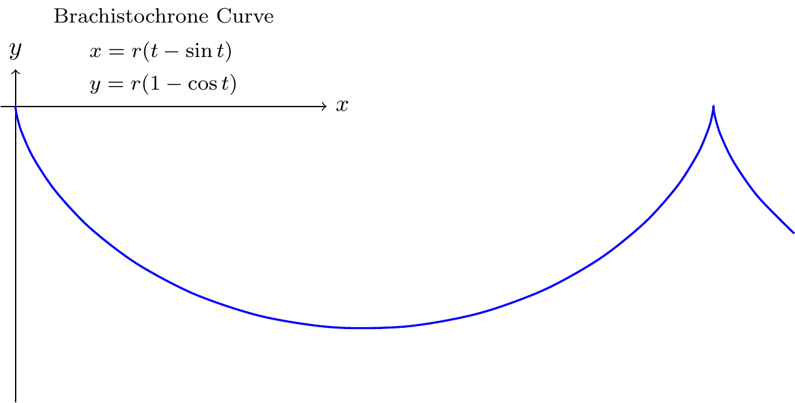
<p class="caption">(\#fig:unnamed-chunk-6)Brachistochrone Curve</p>
</div>
:::
::::::

<div class="figure">

<p class="caption">(\#fig:unnamed-chunk-7)Brachistochrone Curve</p>
</div>

## 2D

https://zhuanlan.zhihu.com/p/127155579?utm_psn=1741479950987960320


```tex
\begin{tikzpicture}
  \draw (-1,1)--(0,0)--(1,2);
\end{tikzpicture}
```

***

:::::: {.cols data-latex=""}
::: {.col data-latex="{0.45\textwidth}"}

```tex
\begin{tikzpicture}
  \draw (-1,1)--(0,0)--(1,2);
\end{tikzpicture}
```
:::

::: {.col data-latex="{0.10\textwidth}"}
\ 
:::

::: {.col data-latex="{0.45\textwidth}"}

:::
::::::

***

:::::: {.cols data-latex=""}
::: {.col data-latex="{0.45\textwidth}"}
`out.width=if (knitr:::is_html_output()) '20%'`


```tex
\begin{tikzpicture}
  \draw (-1,1)--(0,0)--(1,2);
\end{tikzpicture}
```
:::

::: {.col data-latex="{0.10\textwidth}"}
\ 
:::

::: {.col data-latex="{0.45\textwidth}"}

:::
::::::

***

:::::: {.cols data-latex=""}
::: {.col data-latex="{0.45\textwidth}"}

```tex
\begin{tikzpicture}
  \draw[rounded corners] (-1,1)--(0,0)--(1,2)--(-1,1);
\end{tikzpicture}
```
:::

::: {.col data-latex="{0.10\textwidth}"}
\ 
:::

::: {.col data-latex="{0.45\textwidth}"}
<div class="figure">

<p class="caption">(\#fig:unnamed-chunk-14)rounded corner pseudo-closed triangle</p>
</div>
:::
::::::

***

:::::: {.cols data-latex=""}
::: {.col data-latex="{0.45\textwidth}"}

```tex
\begin{tikzpicture}
  \draw[rounded corners] (-1,1)--(0,0)--(1,2)--cycle;
\end{tikzpicture}
```
:::

::: {.col data-latex="{0.10\textwidth}"}
\ 
:::

::: {.col data-latex="{0.45\textwidth}"}
<div class="figure">

<p class="caption">(\#fig:unnamed-chunk-16)rounded corner triangle</p>
</div>
:::
::::::

***

:::::: {.cols data-latex=""}
::: {.col data-latex="{0.45\textwidth}"}

```tex
\begin{tikzpicture}
  \draw[rounded corners] (-1,1)--(0,0)--(1,2)--cycle;
  \draw[rounded corners] (-1,1)--(0,0)--(1,2)--(-1,1);
\end{tikzpicture}
```
:::

::: {.col data-latex="{0.10\textwidth}"}
\ 
:::

::: {.col data-latex="{0.45\textwidth}"}
<div class="figure">

<p class="caption">(\#fig:unnamed-chunk-18)triangle vs. pseudo-closed triangle</p>
</div>
:::
::::::

***

:::::: {.cols data-latex=""}
::: {.col data-latex="{0.45\textwidth}"}

```tex
\begin{tikzpicture}
  \draw (0,0) rectangle (4,2);
\end{tikzpicture}
```
:::

::: {.col data-latex="{0.10\textwidth}"}
\ 
:::

::: {.col data-latex="{0.45\textwidth}"}
<div class="figure">

<p class="caption">(\#fig:unnamed-chunk-20)rectangle</p>
</div>
:::
::::::

***

:::::: {.cols data-latex=""}
::: {.col data-latex="{0.45\textwidth}"}

```tex
\begin{tikzpicture}
  \draw (0,0) rectangle (2,2);
\end{tikzpicture}
```
:::

::: {.col data-latex="{0.10\textwidth}"}
\ 
:::

::: {.col data-latex="{0.45\textwidth}"}
<div class="figure">

<p class="caption">(\#fig:unnamed-chunk-22)square</p>
</div>
:::
::::::

***

:::::: {.cols data-latex=""}
::: {.col data-latex="{0.45\textwidth}"}

```tex
\begin{tikzpicture}
  \draw (0,0) circle (1);
\end{tikzpicture}
```
:::

::: {.col data-latex="{0.10\textwidth}"}
\ 
:::

::: {.col data-latex="{0.45\textwidth}"}
<div class="figure">

<p class="caption">(\#fig:unnamed-chunk-24)circle</p>
</div>
:::
::::::

***

:::::: {.cols data-latex=""}
::: {.col data-latex="{0.45\textwidth}"}

```tex
\begin{tikzpicture}
  \draw (0,0) circle (1);
  \draw (0,0) rectangle (2,2);
\end{tikzpicture}
```
:::

::: {.col data-latex="{0.10\textwidth}"}
\ 
:::

::: {.col data-latex="{0.45\textwidth}"}
<div class="figure">

<p class="caption">(\#fig:unnamed-chunk-26)circle and square</p>
</div>
:::
::::::

***

:::::: {.cols data-latex=""}
::: {.col data-latex="{0.45\textwidth}"}

```tex
\begin{tikzpicture}
  \draw (1,1) ellipse (2 and 1);
\end{tikzpicture}
```
:::

::: {.col data-latex="{0.10\textwidth}"}
\ 
:::

::: {.col data-latex="{0.45\textwidth}"}
<div class="figure">

<p class="caption">(\#fig:unnamed-chunk-28)ellipse</p>
</div>
:::
::::::

***

:::::: {.cols data-latex=""}
::: {.col data-latex="{0.45\textwidth}"}

```tex
\begin{tikzpicture}
  \draw (1 ,1) arc (0:270:1);
  \draw (6 ,1) arc (0:270:2 and 1);
\end{tikzpicture}
```
:::

::: {.col data-latex="{0.10\textwidth}"}
\ 
:::

::: {.col data-latex="{0.45\textwidth}"}
<div class="figure">

<p class="caption">(\#fig:unnamed-chunk-30)circle and ellipse arcs</p>
</div>
:::
::::::

***

:::::: {.cols data-latex=""}
::: {.col data-latex="{0.45\textwidth}"}

```tex
\begin{tikzpicture}
  \draw (-1,1) parabola bend (0,0) (2,4);
\end{tikzpicture}
```
:::

::: {.col data-latex="{0.10\textwidth}"}
\ 
:::

::: {.col data-latex="{0.45\textwidth}"}
<div class="figure">

<p class="caption">(\#fig:unnamed-chunk-32)parabola arc</p>
</div>
:::
::::::

***

:::::: {.cols data-latex=""}
::: {.col data-latex="{0.45\textwidth}"}

```tex
\begin{tikzpicture}
  \draw (-1,1) parabola bend (0,0) (2,4);
  \filldraw
    (-1,1) circle (.05)
    ( 0,0) circle (.05)
    ( 1,1) circle (.05)
    ( 2,4) circle (.05);
\end{tikzpicture}
```
:::

::: {.col data-latex="{0.10\textwidth}"}
\ 
:::

::: {.col data-latex="{0.45\textwidth}"}
<div class="figure">

<p class="caption">(\#fig:unnamed-chunk-34)parabola arc with points</p>
</div>
:::
::::::

***

:::::: {.cols data-latex=""}
::: {.col data-latex="{0.45\textwidth}"}

```tex
\begin{tikzpicture}
  \draw[step=20pt] (0,0) grid (3,2);
  \draw[help lines ,step=20pt] (4,0) grid (7,2);
\end{tikzpicture}
```
:::

::: {.col data-latex="{0.10\textwidth}"}
\ 
:::

::: {.col data-latex="{0.45\textwidth}"}
<div class="figure">

<p class="caption">(\#fig:unnamed-chunk-36)grid and help lines</p>
</div>
:::
::::::

***

:::::: {.cols data-latex=""}
::: {.col data-latex="{0.45\textwidth}"}

```tex
\begin{tikzpicture}[scale=0.25]
  \draw[->] (0,0)--(9,0);
  \draw[<-] (0,1)--(9,1);
  \draw[<->] (0,2)--(9,2);
  \draw[>->>] (0,3)--(9,3);
  \draw[|<->|] (0,4)--(9,4);
\end{tikzpicture}
```
:::

::: {.col data-latex="{0.10\textwidth}"}
\ 
:::

::: {.col data-latex="{0.45\textwidth}"}
<div class="figure">

<p class="caption">(\#fig:unnamed-chunk-38)arrows</p>
</div>
:::
::::::

***

:::::: {.cols data-latex=""}
::: {.col data-latex="{0.45\textwidth}"}

```tex
\begin{tikzpicture}
  \draw[line width =2pt] (0,6)--(9,6); 
  \draw[dotted]          (0,5)--(9,5); 
  \draw[densely dotted]  (0,4)--(9,4); 
  \draw[loosely dotted]  (0,3)--(9,3); 
  \draw[dashed]          (0,2)--(9,2); 
  \draw[densely dashed]  (0,1)--(9,1); 
  \draw[loosely dashed]  (0,0)--(9,0);
\end{tikzpicture}
```
:::

::: {.col data-latex="{0.10\textwidth}"}
\ 
:::

::: {.col data-latex="{0.45\textwidth}"}
<div class="figure">

<p class="caption">(\#fig:unnamed-chunk-40)lines</p>
</div>
:::
::::::

***

:::::: {.cols data-latex=""}
::: {.col data-latex="{0.45\textwidth}"}

```tex
\begin{tikzpicture}[dline/.style={color= blue, line width=2pt}]
  \draw[dline] (0,0)--(9,0); 
\end{tikzpicture}
```
:::

::: {.col data-latex="{0.10\textwidth}"}
\ 
:::

::: {.col data-latex="{0.45\textwidth}"}
<div class="figure">

<p class="caption">(\#fig:unnamed-chunk-42)head styling</p>
</div>
:::
::::::

***

:::::: {.cols data-latex=""}
::: {.col data-latex="{0.45\textwidth}"}

```tex
\begin{tikzpicture}
  \draw (0,0) rectangle (2,2);
  \draw[shift={( 3, 0)}] (0,0) rectangle (2,2);
  \draw[shift={( 0, 3)}] (0,0) rectangle (2,2);
  \draw[shift={( 0,-3)}] (0,0) rectangle (2,2);
  \draw[shift={(-3, 0)}] (0,0) rectangle (2,2);
  \draw[shift={( 3, 3)}] (0,0) rectangle (2,2);
  \draw[shift={(-3, 3)}] (0,0) rectangle (2,2);
  \draw[shift={( 3,-3)}] (0,0) rectangle (2,2);
  \draw[shift={(-3,-3)}] (0,0) rectangle (2,2);
\end{tikzpicture}
```
:::

::: {.col data-latex="{0.10\textwidth}"}
\ 
:::

::: {.col data-latex="{0.45\textwidth}"}
<div class="figure">

<p class="caption">(\#fig:unnamed-chunk-44)transform: shift</p>
</div>
:::
::::::

***

:::::: {.cols data-latex=""}
::: {.col data-latex="{0.45\textwidth}"}

```tex
\begin{tikzpicture}
  \draw (0,0) rectangle (2,2);
  \draw[xshift= 100pt] (0,0) rectangle (2,2);
  \draw[xshift=-100pt] (0,0) rectangle (2,2);
  \draw[yshift= 100pt] (0,0) rectangle (2,2);
  \draw[yshift=-100pt] (0,0) rectangle (2,2);
\end{tikzpicture}
```
:::

::: {.col data-latex="{0.10\textwidth}"}
\ 
:::

::: {.col data-latex="{0.45\textwidth}"}
<div class="figure">

<p class="caption">(\#fig:unnamed-chunk-46)transform: shift x, y</p>
</div>
:::
::::::

***

:::::: {.cols data-latex=""}
::: {.col data-latex="{0.45\textwidth}"}

```tex
\begin{tikzpicture}
  \draw (0,0) rectangle (2,2);
  \draw[xshift= 100pt, xscale=1.5] (0,0) rectangle (2,2);
  \draw[yshift= 100pt, xscale=0.5] (0,0) rectangle (2,2);
  \draw[xshift=-100pt, yscale=1.5] (0,0) rectangle (2,2);
  \draw[yshift=-100pt, yscale=0.5] (0,0) rectangle (2,2);
\end{tikzpicture}
```
:::

::: {.col data-latex="{0.10\textwidth}"}
\ 
:::

::: {.col data-latex="{0.45\textwidth}"}
<div class="figure">

<p class="caption">(\#fig:unnamed-chunk-48)transform: scale x, y</p>
</div>
:::
::::::

***

:::::: {.cols data-latex=""}
::: {.col data-latex="{0.45\textwidth}"}

```tex
\begin{tikzpicture}
  \draw (0,0) rectangle (2,2);
  \draw[xshift= 100pt, xscale=1.5] (0,0) rectangle (2,2);
  \draw[yshift= 100pt, yscale=1.5] (0,0) rectangle (2,2);
  \draw[xshift=-100pt, xscale=0.5] (0,0) rectangle (2,2);
  \draw[yshift=-100pt, yscale=0.5] (0,0) rectangle (2,2);
\end{tikzpicture}
```
:::

::: {.col data-latex="{0.10\textwidth}"}
\ 
:::

::: {.col data-latex="{0.45\textwidth}"}
<div class="figure">

<p class="caption">(\#fig:unnamed-chunk-50)transform: scale</p>
</div>
:::
::::::

***

:::::: {.cols data-latex=""}
::: {.col data-latex="{0.45\textwidth}"}

```tex
\begin{tikzpicture}
  \draw (0,0) rectangle (2,2);
  \draw[xshift=125pt,rotate=45] (0,0) rectangle (2,2);
  \draw[xshift=175pt,rotate around={45:(2 ,2)}] (0,0) rectangle (2,2);
\end{tikzpicture}
```
:::

::: {.col data-latex="{0.10\textwidth}"}
\ 
:::

::: {.col data-latex="{0.45\textwidth}"}
<div class="figure">

<p class="caption">(\#fig:unnamed-chunk-52)transform: rotate</p>
</div>
:::
::::::

***

:::::: {.cols data-latex=""}
::: {.col data-latex="{0.45\textwidth}"}

```tex
\begin{tikzpicture}
  \draw (0,0) rectangle (2,2);
  \draw[xshift=70pt,xslant=1] (0,0) rectangle (2,2);
  \draw[yshift=70pt,yslant=1] (0,0) rectangle (2,2);
\end{tikzpicture}
```
:::

::: {.col data-latex="{0.10\textwidth}"}
\ 
:::

::: {.col data-latex="{0.45\textwidth}"}
<div class="figure">

<p class="caption">(\#fig:unnamed-chunk-54)transform: slant</p>
</div>
:::
::::::

***

:::::: {.cols data-latex=""}
::: {.col data-latex="{0.45\textwidth}"}

```tex
\tikzset{
  box/.style={
    draw=blue,
    rectangle,
    rounded corners=5pt,
    minimum width=50pt,
    minimum height=20pt,
    inner sep=5pt
  }
}
\begin{tikzpicture}
  \node[box] (1) at (0,0) {1};
  \node[box] (2) at (4,0) {2};
  \node[box] (3) at (8,0) {3};
  \draw[->] (1)--(2);
  \draw[->] (2)--(3);
  \node at (2,1) {a};
  \node at (6,1) {b};
\end{tikzpicture}
```
:::

::: {.col data-latex="{0.10\textwidth}"}
\ 
:::

::: {.col data-latex="{0.45\textwidth}"}
<div class="figure">

<p class="caption">(\#fig:unnamed-chunk-56)flowchart</p>
</div>
:::
::::::

***

:::::: {.cols data-latex=""}
::: {.col data-latex="{0.45\textwidth}"}

```tex
\tikzset{
  box/.style={
    draw=blue,
    fill=blue!20,
    rectangle,
    rounded corners=5pt,
    minimum height=20pt,
    inner sep=5pt
  }
}
\begin{tikzpicture}
  \node[box] {1}
      child {node[box] {2}}
      child {node[box] {3}
          child {node[box] {4}}
          child {node[box] {5}}
          child {node[box] {6}}
      };
\end{tikzpicture}
```
:::

::: {.col data-latex="{0.10\textwidth}"}
\ 
:::

::: {.col data-latex="{0.45\textwidth}"}
<div class="figure">

<p class="caption">(\#fig:unnamed-chunk-58)tree</p>
</div>
:::
::::::

***

:::::: {.cols data-latex=""}
::: {.col data-latex="{0.45\textwidth}"}

```tex
\begin{tikzpicture}
  \draw[->] (-0.2,0)--(6,0) node[right] {$x$};
  \draw[->] (0,-0.2)--(0,6) node[above] {$f(x)$};
  \draw[domain=0:4] plot (\x ,{0.1* exp(\x)}) node[right] {$f(x)=\frac{1}{10}e^x$};
\end{tikzpicture}
```
:::

::: {.col data-latex="{0.10\textwidth}"}
\ 
:::

::: {.col data-latex="{0.45\textwidth}"}
<div class="figure">

<p class="caption">(\#fig:unnamed-chunk-60)function plot</p>
</div>
:::
::::::

https://stackoverflow.com/questions/64897575/tikz-libraries-in-bookdown

It turns out that you can simply put the `\usetikzlibrary{...}` command directly before the `\begin{tikzpicture}` and everything works fine :)

https://stackoverflow.com/questions/56211210/r-markdown-document-with-html-docx-output-using-latex-package-bbm

https://tex.stackexchange.com/questions/171711/how-to-include-latex-package-in-r-markdown

## 3D

https://zhuanlan.zhihu.com/p/431732330?utm_psn=1741857547550638080

https://github.com/RRWWW/Stereometry

:::::: {.cols data-latex=""}
::: {.col data-latex="{0.45\textwidth}"}

```tex
\begin{tikzpicture}
  \coordinate (A) at ( 1, 1, 1);
  \coordinate (B) at ( 1, 1,-1);
  \coordinate (C) at ( 1,-1,-1);
  \coordinate (D) at ( 1,-1, 1);
  \coordinate (E) at (-1,-1, 1);
  \coordinate (F) at (-1,-1,-1);
  \coordinate (G) at (-1, 1,-1);
  \coordinate (H) at (-1, 1, 1);
  \draw (A) node[right=1pt] {$A$}--
        (B) node[right=1pt] {$B$}--
        (C) node[right=1pt] {$C$}--
        (D) node[right=1pt] {$D$}--
        (E) node[left= 1pt] {$E$}--
        (F) node[right=1pt] {$F$}--
        (G) node[right=1pt] {$G$}--
        (H) node[left= 1pt] {$H$}--
        (A) node[right=1pt] {$A$};
\end{tikzpicture}
```
:::

::: {.col data-latex="{0.10\textwidth}"}
\ 
:::

::: {.col data-latex="{0.45\textwidth}"}
<div class="figure">

<p class="caption">(\#fig:unnamed-chunk-62)cube</p>
</div>
:::
::::::

***

:::::: {.cols data-latex=""}
::: {.col data-latex="{0.45\textwidth}"}

```tex
\usetikzlibrary{patterns}
\usetikzlibrary{3d,calc}
\tdplotsetmaincoords{45}{45}
\begin{tikzpicture}[tdplot_main_coords]
  \coordinate (A) at ( 1, 1, 1);
  \coordinate (B) at ( 1, 1,-1);
  \coordinate (C) at ( 1,-1,-1);
  \coordinate (D) at ( 1,-1, 1);
  \coordinate (E) at (-1,-1, 1);
  \coordinate (F) at (-1,-1,-1);
  \coordinate (G) at (-1, 1,-1);
  \coordinate (H) at (-1, 1, 1);
  \draw (A) node[right=1pt] {$A$}--
        (B) node[right=1pt] {$B$}--
        (C) node[right=1pt] {$C$}--
        (D) node[right=1pt] {$D$}--
        (E) node[left= 1pt] {$E$}--
        (F) node[right=1pt] {$F$}--
        (G) node[right=1pt] {$G$}--
        (H) node[left= 1pt] {$H$}--
        (A) node[right=1pt] {$A$};
\end{tikzpicture}
```
:::

::: {.col data-latex="{0.10\textwidth}"}
\ 
:::

::: {.col data-latex="{0.45\textwidth}"}
<div class="figure">

<p class="caption">(\#fig:unnamed-chunk-64)cube rotate</p>
</div>
:::
::::::

***

:::::: {.cols data-latex=""}
::: {.col data-latex="{0.45\textwidth}"}

```tex
\usetikzlibrary{patterns}
\usetikzlibrary{3d,calc}
%\tdplotsetmaincoords{70}{110}
\begin{tikzpicture}[rotate around y=-15, rotate around z=7]
  \coordinate (A) at ( 1, 1, 1);
  \coordinate (B) at ( 1, 1,-1);
  \coordinate (C) at ( 1,-1,-1);
  \coordinate (D) at ( 1,-1, 1);
  \coordinate (E) at (-1,-1, 1);
  \coordinate (F) at (-1,-1,-1);
  \coordinate (G) at (-1, 1,-1);
  \coordinate (H) at (-1, 1, 1);
  \draw (A) node[right=1pt] {$A$}--
        (B) node[right=1pt] {$B$}--
        (C) node[right=1pt] {$C$}--
        (D) node[right=1pt] {$D$}--
        (E) node[left= 1pt] {$E$}--
        (F) node[right=1pt] {$F$}--
        (G) node[right=1pt] {$G$}--
        (H) node[left= 1pt] {$H$}--
        (A) node[right=1pt] {$A$};
\end{tikzpicture}
```
:::

::: {.col data-latex="{0.10\textwidth}"}
\ 
:::

::: {.col data-latex="{0.45\textwidth}"}
<div class="figure">

<p class="caption">(\#fig:unnamed-chunk-66)cube rotate around</p>
</div>
:::
::::::

https://tex.stackexchange.com/questions/388621/optimizing-perspective-tikz-graphic

:::::: {.cols data-latex=""}
::: {.col data-latex="{0.45\textwidth}"}

```tex
\usetikzlibrary{patterns}
\usetikzlibrary{3d,calc}
\begin{tikzpicture}[y={(.5cm,.7cm)}]
  \coordinate (A) at ( 1, 1, 1);
  \coordinate (B) at ( 1, 1,-1);
  \coordinate (C) at ( 1,-1,-1);
  \coordinate (D) at ( 1,-1, 1);
  \coordinate (E) at (-1,-1, 1);
  \coordinate (F) at (-1,-1,-1);
  \coordinate (G) at (-1, 1,-1);
  \coordinate (H) at (-1, 1, 1);
  \draw (A) node[right=1pt] {$A$}--
        (B) node[right=1pt] {$B$}--
        (C) node[right=1pt] {$C$}--
        (D) node[right=1pt] {$D$}--
        (E) node[left= 1pt] {$E$}--
        (F) node[right=1pt] {$F$}--
        (G) node[right=1pt] {$G$}--
        (H) node[left= 1pt] {$H$}--
        (A) node[right=1pt] {$A$};
\end{tikzpicture}
```
:::

::: {.col data-latex="{0.10\textwidth}"}
\ 
:::

::: {.col data-latex="{0.45\textwidth}"}
<div class="figure">

<p class="caption">(\#fig:unnamed-chunk-68)cube perspective slant</p>
</div>
:::
::::::

https://github.com/XiangyunHuang/bookdown-broken/blob/master/index.Rmd

:::::: {.cols data-latex=""}
::: {.col data-latex="{0.45\textwidth}"}

```tex
\smartdiagramset{planet color=gray!40!white, 
uniform color list=gray!40!white for 10 items}
\smartdiagram[bubble diagram]{Basic skills,
  Edit~/\\ (RStudio), 
  Organize~/\\ (bookdown), 
  Cooperate~/\\ (Git), 
  Typeset~/\\ (LaTeX/Pandoc), 
  Compile~/\\ (GitHub Action)}
```
:::

::: {.col data-latex="{0.10\textwidth}"}
\ 
:::

::: {.col data-latex="{0.45\textwidth}"}
<div class="figure">

<p class="caption">(\#fig:unnamed-chunk-70)modern statistics plot skills</p>
</div>
:::
::::::

## plots of functions

https://tikz.dev/tikz-plots

> A warning before we get started: If you are looking for an easy way to create a normal plot of a function with scientific axes, ignore this section and instead look at the `pgfplots` package or at the `datavisualization` command from Part VI.

https://tikz.dev/tikz-plots#sec-22.5

:::::: {.cols data-latex=""}
::: {.col data-latex="{0.45\textwidth}"}

```tex
\begin{tikzpicture}[domain=0:4]
  \draw[very thin,color=gray] (-0.1,-1.1) grid (3.9,3.9);

  \draw[->] (-0.2,0) -- (4.2,0) node[right] {$x$};
  \draw[->] (0,-1.2) -- (0,4.2) node[above] {$f(x)$};

  \draw[color=red]    plot (\x,\x)             node[right] {$f(x) =x$};
  % \x r means to convert '\x' from degrees to _r_adians:
  \draw[color=blue]   plot (\x,{sin(\x r)})    node[right] {$f(x) = \sin x$};
  \draw[color=orange] plot (\x,{0.05*exp(\x)}) node[right] {$f(x) = \frac{1}{20} \mathrm e^x$};
\end{tikzpicture}
```
:::

::: {.col data-latex="{0.10\textwidth}"}
\ 
:::

::: {.col data-latex="{0.45\textwidth}"}
<div class="figure">

<p class="caption">(\#fig:unnamed-chunk-72)plots of functions</p>
</div>
:::
::::::

***

:::::: {.cols data-latex=""}
::: {.col data-latex="{0.45\textwidth}"}

```tex
\tikz \draw[scale=0.5,domain=-3.141:3.141,smooth,variable=\t]
  plot ({\t*sin(\t r)},{\t*cos(\t r)});
```
:::

::: {.col data-latex="{0.10\textwidth}"}
\ 
:::

::: {.col data-latex="{0.45\textwidth}"}
<div class="figure">

<p class="caption">(\#fig:unnamed-chunk-74)2D parametric function</p>
</div>
:::
::::::

***

:::::: {.cols data-latex=""}
::: {.col data-latex="{0.45\textwidth}"}

```tex
\tikz \draw[domain=0:360,
            smooth,
            variable=\t]
  plot ({sin(\t)},\t/360,{cos(\t)});
```
:::

::: {.col data-latex="{0.10\textwidth}"}
\ 
:::

::: {.col data-latex="{0.45\textwidth}"}
<div class="figure">

<p class="caption">(\#fig:unnamed-chunk-76)3D parametric function</p>
</div>
:::
::::::

## commutative diagram

cd = CD = commutative diagram

tikz-cd = TikZ-CD

`\usetikzlibrary{cd}` vs. `usepackage{tikz-cd}`

https://tex.stackexchange.com/questions/546392/usepackagetikz-cd-vs-usetikzlibrarycd

> No (practical) difference. The code (excluding copyright comment lines) in `tikz-cd.sty` is
> ```
> \ProvidesPackage{tikz-cd}[2014/10/30 v0.9e Commutative diagrams with tikz]
> \RequirePackage{tikz}[2013/12/13] % pgf version 3.0.0 required
> \usetikzlibrary{cd}
>
> \endinput
> ```

Never put `\begin{tikzcd}` inside `\begin{tikzpicture}`

https://tex.stackexchange.com/questions/425296/half-of-tikzcd-diagram-is-missing

***

:::::: {.cols data-latex=""}
::: {.col data-latex="{0.45\textwidth}"}

```tex
\usetikzlibrary{cd,arrows.meta}
\begin{tikzcd}
11 & 12 & 13 \\
21 & 22 & 23 \\
31 & 32 & 33
\end{tikzcd}
```
:::

::: {.col data-latex="{0.10\textwidth}"}
\ 
:::

::: {.col data-latex="{0.45\textwidth}"}
<div class="figure">

<p class="caption">(\#fig:unnamed-chunk-78)learn TikZ-CD or tikz-cd in one picture</p>
</div>
:::
::::::

***

:::::: {.cols data-latex=""}
::: {.col data-latex="{0.45\textwidth}"}

```tex
\usetikzlibrary{cd,arrows.meta}
\begin{tikzcd}
11
&
12
&
13
\\
21
&
22
&
23
\\
31
&
32
&
33
\end{tikzcd}
```
:::

::: {.col data-latex="{0.10\textwidth}"}
\ 
:::

::: {.col data-latex="{0.45\textwidth}"}
<div class="figure">

<p class="caption">(\#fig:unnamed-chunk-80)TikZ-CD or tikz-cd matrix nodes</p>
</div>
:::
::::::

***

<div class="figure">

<p class="caption">(\#fig:unnamed-chunk-81)TikZ-CD or tikz-cd matrix nodes expanded longitudinally</p>
</div>

:::::: {.cols data-latex=""}
::: {.col data-latex="{0.45\textwidth}"}

```tex
\usetikzlibrary{cd,arrows.meta}
\begin{tikzcd}[column sep=2.75cm]%small,large,huge
00
\ar[r,"\backslash \text{ar[r]}"]
\ar[d,"\backslash \text{ar[d]}"]
&
01
\ar[r,"\text{[,"swap"']}"']
&
02
\ar[r,"\backslash \text{ar[r]}","\text{[,"swap"']}"']
&
03
\\
10
\ar[d,"\text{[,"swap"']}"']
&
11
\ar[u,"\backslash \text{ar[u]}"]
\ar[l,"\backslash \text{ar[l]}"]
\ar[r,-stealth,"\text{[,-}\text{stealth}\text{]}"]
\ar[d,-{Stealth[reversed]},"\text{[,-}\{\text{Stealth[reversed]}\}\text{]}"]
&
12
\ar[r,-{Stealth[open]},"\text{[,-}\{\text{Stealth[open]}\}\text{]}"]
&
13
\\
20
\ar[r,"\text{[,"r" description]}" description]
\ar[d,"\backslash \text{ar[d]}","\text{[,"swap"']}"']
&
21
\ar[r,-{Stealth[harpoon]},"\text{[,-}\{\text{Stealth[harpoon]}\}\text{]}"]
&
22
\ar[u,shift right=1.75pt,"\text{[,shift right=1.75pt]}"']
\ar[lld,-Stealth,"\backslash \text{ar[lld]}" description]
\ar[r,latex-latex,"\text{[,latex-latex]}"]
\ar[d,shift right=1.75pt,"\text{[,shift right=1.75pt]}"]
&
23
\\
30
\ar[ru,"\backslash \text{ar[ru]}" description]
\ar[r,bend right,-stealth,"\text{bend right}"]
\ar[r,bend right=42,-stealth,"\text{bend right=42}"']
\ar[r,bend right=100,-stealth,"\text{bend right=100}"']
\ar[dd,bend right,-stealth,"\text{[,bend right]}"']
&
31
\ar[r,bend left,stealth-stealth,"\text{bend left}"']
\ar[ddr]
&
32
\ar[l,-{Stealth[harpoon]},"\text{[,-}\{\text{Stealth[harpoon]}\}\text{]}"]
\ar[r,-{Stealth[harpoon]},shift left=.75pt,"\text{[,shift left=.75pt]}"]
\ar[ddl,crossing over,"\text{[,crossing over]; rounded corneres, to path}"]
\ar[ddr,
	rounded corners,
	to path={--([yshift=-2ex]\tikztostart.south)
			  --([yshift=-2ex,xshift=+2ex]\tikztostart.south)
			  --([yshift=-2ex,xshift=+8ex]\tikztostart.south)
			  --([xshift=-12ex]\tikztotarget.west)
			  --(\tikztotarget)
			 },
	]
&
33
\ar[l,-{Stealth[harpoon]},shift left=.75pt,"\text{[,shift left=.75pt]}"]
\\
&
&
&
\\
50
\ar[r,-|,"\text{[,}-|\text{,swap]}",swap]
&
51
\ar[r,-stealth,red,text=black,"|\text{[draw=black]}|" description]
&
|[draw=black]|52
&
53
\end{tikzcd}
```
:::

::: {.col data-latex="{0.10\textwidth}"}
\ 
:::

::: {.col data-latex="{0.45\textwidth}"}
<div class="figure">

<p class="caption">(\#fig:unnamed-chunk-83)learn TikZ-CD or tikz-cd in one picture</p>
</div>
:::
::::::

***

https://tex.stackexchange.com/questions/515267/how-can-i-make-arrows-touch-boxed-expressions-in-tikzcd

```
cells={nodes={draw}}

in

\begin{tikzcd}[column sep=2.75cm, %small,large,huge
			         cells={nodes={draw}}
			        ]
```

<div class="figure">

<p class="caption">(\#fig:unnamed-chunk-84)learn TikZ-CD or tikz-cd in one picture 2</p>
</div>

:::::: {.cols data-latex=""}
::: {.col data-latex="{0.45\textwidth}"}

```tex
\usetikzlibrary{cd,arrows.meta}
\begin{tikzcd}[column sep=2.75cm, %small,large,huge
			         cells={nodes={draw}}
			        ]
00
\ar[r,"\backslash \text{ar[r]}"]
\ar[d,"\backslash \text{ar[d]}"]
&
01
\ar[r,"\text{[,"swap"']}"']
&
02
\ar[r,"\backslash \text{ar[r]}","\text{[,"swap"']}"']
&
03
\\
10
\ar[d,"\text{[,"swap"']}"']
&
11
\ar[u,"\backslash \text{ar[u]}"]
\ar[l,"\backslash \text{ar[l]}"]
\ar[r,-stealth,"\text{[,-}\text{stealth}\text{]}"]
\ar[d,-{Stealth[reversed]},"\text{[,-}\{\text{Stealth[reversed]}\}\text{]}"]
&
12
\ar[r,-{Stealth[open]},"\text{[,-}\{\text{Stealth[open]}\}\text{]}"]
&
13
\\
20
\ar[r,"\text{[,"r" description]}" description]
\ar[d,"\backslash \text{ar[d]}","\text{[,"swap"']}"']
&
21
\ar[r,-{Stealth[harpoon]},"\text{[,-}\{\text{Stealth[harpoon]}\}\text{]}"]
&
22
\ar[u,shift right=1.75pt,"\text{[,shift right=1.75pt]}"']
\ar[lld,-Stealth,"\backslash \text{ar[lld]}" description]
\ar[r,latex-latex,"\text{[,latex-latex]}"]
\ar[d,shift right=1.75pt,"\text{[,shift right=1.75pt]}"]
&
23
\\
30
\ar[ru,"\backslash \text{ar[ru]}" description]
\ar[r,bend right,-stealth,"\text{bend right}"]
\ar[r,bend right=42,-stealth,"\text{bend right=42}"']
\ar[r,bend right=100,-stealth,"\text{bend right=100}"']
\ar[dd,bend right,-stealth,"\text{[,bend right]}"']
&
31
\ar[r,bend left,stealth-stealth,"\text{bend left}"']
\ar[ddr]
&
32
\ar[l,-{Stealth[harpoon]},"\text{[,-}\{\text{Stealth[harpoon]}\}\text{]}"]
\ar[r,-{Stealth[harpoon]},shift left=.75pt,"\text{[,shift left=.75pt]}"]
\ar[ddl,crossing over,"\text{[,crossing over]; rounded corneres, to path}"]
\ar[ddr,
	rounded corners,
	to path={--([yshift=-2ex]\tikztostart.south)
			  --([yshift=-2ex,xshift=+2ex]\tikztostart.south)
			  --([yshift=-2ex,xshift=+8ex]\tikztostart.south)
			  --([xshift=-12ex]\tikztotarget.west)
			  --(\tikztotarget)
			 },
	]
&
33
\ar[l,-{Stealth[harpoon]},shift left=.75pt,"\text{[,shift left=.75pt]}"]
\\
&
&
&
\\
50
\ar[r,-|,"\text{[,}-|\text{,swap]}",swap]
&
51
\ar[r,-stealth,red,text=black,"|\text{[draw=none]}|" description]
&
|[draw=none]|52
&
53
\end{tikzcd}
```
:::

::: {.col data-latex="{0.10\textwidth}"}
\ 
:::

::: {.col data-latex="{0.45\textwidth}"}
<div class="figure">

<p class="caption">(\#fig:unnamed-chunk-86)learn TikZ-CD or tikz-cd in one picture 2</p>
</div>
:::
::::::

https://tex.stackexchange.com/questions/484743/format-single-node-in-tikzcd

:::::: {.cols data-latex=""}
::: {.col data-latex="{0.45\textwidth}"}

```tex
\usetikzlibrary{cd,arrows.meta,shapes}
\begin{tikzcd}[cells={nodes={draw=black,ellipse}}]
0 \ar[r] & 1 \ar[r] & |[draw=none]|\dots \ar[r] & n-1 \ar[r] & n
\end{tikzcd}
```
:::

::: {.col data-latex="{0.10\textwidth}"}
\ 
:::

::: {.col data-latex="{0.45\textwidth}"}
<div class="figure">

<p class="caption">(\#fig:unnamed-chunk-88)individual node without drawing margin</p>
</div>
:::
::::::

https://tex.stackexchange.com/questions/586160/drawing-commutative-diagram-with-encircled-nodes-in-tikz-cd-package

:::::: {.cols data-latex=""}
::: {.col data-latex="{0.45\textwidth}"}

```tex
\usetikzlibrary{cd,fit,shapes.geometric}
\tikzset{E/.style = {ellipse, draw=blue, dashed,
					inner xsep=-2mm,inner ysep=-4mm,
					rotate=-30,fit=#1
				   }
		}
\begin{tikzcd}[arrows = dash,
			    execute at end picture = {
			    \node[E = (tikz@f@1-2-2) (tikz@f@1-3-3)] {};
			    \node[E = (tikz@f@1-3-1) (tikz@f@1-4-2)] {};
                        }% end of execute at end picture
			  ]
	&	R	\ar[d]	&	\\
	&	A+B	\ar[dl]	\ar[dr]	&	\\
A	\ar[dr]	&	&	B	\ar[dl]	\\
	&	A \cap B	&
\end{tikzcd}
```
:::

::: {.col data-latex="{0.10\textwidth}"}
\ 
:::

::: {.col data-latex="{0.45\textwidth}"}
<div class="figure">

<p class="caption">(\#fig:unnamed-chunk-90)enclosed nodes</p>
</div>
:::
::::::

[box in TikZ-CD]^[\@ref(box-in-tikz-cd)]^

***

:::::: {.cols data-latex=""}
::: {.col data-latex="{0.45\textwidth}"}

```tex
\usetikzlibrary{cd,arrows.meta}
\begin{tikzcd}
A \ar[r,-stealth,"f","g"'] \ar[d,-{Stealth[harpoon]},shift left=0.5pt,"\varphi"] \ar[rr,-stealth,bend left] & B & E \\
C \ar[r,-latex,"g"'] \ar[u,-{Stealth[harpoon]},shift left=0.5pt,"\varphi^{{\scriptscriptstyle -1}}"] \ar[d,harpoon,shift left=0.5pt,"\varphi"] & D & F \\
G \ar[r,"f"] \ar[u,harpoon,shift left=0.5pt,"\varphi^{-1}"] & H \ar[uur,-stealth,"\phi" description]
\end{tikzcd}
```
:::

::: {.col data-latex="{0.10\textwidth}"}
\ 
:::

::: {.col data-latex="{0.45\textwidth}"}
<div class="figure">

<p class="caption">(\#fig:unnamed-chunk-92)TikZ-CD or tikz-cd + arrows.meta</p>
</div>
:::
::::::

***

:::::: {.cols data-latex=""}
::: {.col data-latex="{0.45\textwidth}"}

```tex
\usetikzlibrary{cd,arrows.meta}
\begin{tikzcd}
A \ar[r,-{Stealth[harpoon,swap,open]}] & B
\end{tikzcd}
```
:::

::: {.col data-latex="{0.10\textwidth}"}
\ 
:::

::: {.col data-latex="{0.45\textwidth}"}
<div class="figure">
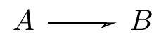
<p class="caption">(\#fig:unnamed-chunk-94)TikZ-CD or tikz-cd + arrows.meta</p>
</div>
:::
::::::

TikZcd editor

https://github.com/yishn/tikzcd-editor

https://tikzcd.yichuanshen.de/

https://darknmt.github.io/res/tikzcd-editor/

tikz-cd @ CTAN(Comprehensive TEX Archive Network)

https://ctan.org/tex-archive/graphics/pgf/contrib/tikz-cd

tikzcd manual

https://ctan.mirror.twds.com.tw/tex-archive/graphics/pgf/contrib/tikz-cd/tikz-cd-doc.pdf

### arrows

https://latexdraw.com/exploring-tikz-arrows/

#### predefined arrow tip in TikZ

##### stealth arrow tip

`-stealth` without capital S = `-{Stealth}` in `arrows.meta`

:::::: {.cols data-latex=""}
::: {.col data-latex="{0.45\textwidth}"}

```tex
\begin{tikzpicture}
  \node at (0, 0) {};
	\draw [-stealth]        (0, 0) -- (1, 0);
	\draw [stealth-]        (0,-1) -- (1,-1);
	\draw [stealth-stealth] (0,-2) -- (1,-2);
  \node at (0,-2) {};
\end{tikzpicture}
```
:::

::: {.col data-latex="{0.10\textwidth}"}
\ 
:::

::: {.col data-latex="{0.45\textwidth}"}
<div class="figure">

<p class="caption">(\#fig:unnamed-chunk-96)stealth arrow tip</p>
</div>
:::
::::::

##### reversed stealth arrow tip

`-stealth reversed` = `-{Stealth[reversed]}` in `arrows.meta`

:::::: {.cols data-latex=""}
::: {.col data-latex="{0.45\textwidth}"}

```tex
\begin{tikzpicture}
  \node at (0, 0) {};
	\draw [-stealth reversed]                 (0, 0) -- (1, 0);
	\draw [stealth reversed-]                 (0,-1) -- (1,-1);
	\draw [stealth reversed-stealth reversed] (0,-2) -- (1,-2);
  \node at (0,-2) {};
\end{tikzpicture}
```
:::

::: {.col data-latex="{0.10\textwidth}"}
\ 
:::

::: {.col data-latex="{0.45\textwidth}"}
<div class="figure">

<p class="caption">(\#fig:unnamed-chunk-98)reversed stealth arrow tip</p>
</div>
:::
::::::

##### to arrow tip

`-to`

:::::: {.cols data-latex=""}
::: {.col data-latex="{0.45\textwidth}"}

```tex
\begin{tikzpicture}
  \node at (0, 0) {};
	\draw [-to]   (0, 0) -- (1, 0);
	\draw [to-]   (0,-1) -- (1,-1);
	\draw [to-to] (0,-2) -- (1,-2);
  \node at (0,-2) {};
\end{tikzpicture}
```
:::

::: {.col data-latex="{0.10\textwidth}"}
\ 
:::

::: {.col data-latex="{0.45\textwidth}"}
<div class="figure">

<p class="caption">(\#fig:unnamed-chunk-100)to arrow tip</p>
</div>
:::
::::::

##### latex arrow tip

`-latex` with flat-tailed arrow head, differing from `-stealth`

:::::: {.cols data-latex=""}
::: {.col data-latex="{0.45\textwidth}"}

```tex
\begin{tikzpicture}
  \node at (0, 0) {};
	\draw [-latex]      (0, 0) -- (1, 0);
	\draw [latex-]      (0,-1) -- (1,-1);
	\draw [latex-latex] (0,-2) -- (1,-2);
  \node at (0,-2) {};
\end{tikzpicture}
```
:::

::: {.col data-latex="{0.10\textwidth}"}
\ 
:::

::: {.col data-latex="{0.45\textwidth}"}
<div class="figure">

<p class="caption">(\#fig:unnamed-chunk-102)to arrow tip</p>
</div>
:::
::::::

##### | arrow tip

`-|` like inhibition in biological pathway

:::::: {.cols data-latex=""}
::: {.col data-latex="{0.45\textwidth}"}

```tex
\begin{tikzpicture}
  \node at (0, 0) {};
	\draw [-|]  (0, 0) -- (1, 0);
	\draw [|-]  (0,-1) -- (1,-1);
	\draw [|-|] (0,-2) -- (1,-2);
  \node at (0,-2) {};
\end{tikzpicture}
```
:::

::: {.col data-latex="{0.10\textwidth}"}
\ 
:::

::: {.col data-latex="{0.45\textwidth}"}
<div class="figure">

<p class="caption">(\#fig:unnamed-chunk-104)to arrow tip</p>
</div>
:::
::::::

#### arrows.meta

customizing arrow heads

##### reversing, halving, swapping, opening

https://tikz.dev/tikz-arrows#sec-16.3.5

:::::: {.cols data-latex=""}
::: {.col data-latex="{0.45\textwidth}"}

```tex
\usetikzlibrary{arrows.meta}
\begin{tikzpicture}
  \node at (0, 0) {};
	\draw [-{Stealth[reversed]}]      (0, 0) -- (1, 0);
	\draw [-{Stealth[harpoon]}]       (0,-1) -- (1,-1);
	\draw [-{Stealth[harpoon,swap]}]  (0,-2) -- (1,-2);
  \draw [-{Stealth[open]}]          (0,-3) -- (1,-3);
  \node at (0,-2) {};
\end{tikzpicture}
```
:::

::: {.col data-latex="{0.10\textwidth}"}
\ 
:::

::: {.col data-latex="{0.45\textwidth}"}
<div class="figure">

<p class="caption">(\#fig:unnamed-chunk-106)reversing, halving, swapping, opening</p>
</div>
:::
::::::

##### mathematical arrows

- Classical TikZ Rightarrow
- Computer Modern Rightarrow
- Implies
- To

:::::: {.cols data-latex=""}
::: {.col data-latex="{0.45\textwidth}"}

```tex
\usetikzlibrary{arrows.meta}
\begin{tikzpicture}
  \node at (0, 0) {};
	\draw [-{Classical TikZ Rightarrow}]  (0, 0) -- (1, 0);
	\draw [-{Computer Modern Rightarrow}] (0,-1) -- (1,-1);
	\draw [-{Implies},double]             (0,-2) -- (1,-2);
  \draw [-To]                           (0,-3) -- (1,-3);
  \node at (0,-3) {};
\end{tikzpicture}
```
:::

::: {.col data-latex="{0.10\textwidth}"}
\ 
:::

::: {.col data-latex="{0.45\textwidth}"}
<div class="figure">
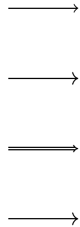
<p class="caption">(\#fig:unnamed-chunk-108)mathematical arrows</p>
</div>
:::
::::::

##### ray arrow tip

`-Rays`

:::::: {.cols data-latex=""}
::: {.col data-latex="{0.45\textwidth}"}

```tex
\usetikzlibrary{arrows.meta}
\begin{tikzpicture}
  \node at (0, 0) {};
	\draw [-Rays]         (0, 0) -- (1, 0);
	\draw [-{Rays[n=6]}]  (0,-1) -- (1,-1);
	\draw [-{Rays[n=8]}]  (0,-2) -- (1,-2);
  \node at (0,-2) {};
\end{tikzpicture}
```
:::

::: {.col data-latex="{0.10\textwidth}"}
\ 
:::

::: {.col data-latex="{0.45\textwidth}"}
<div class="figure">

<p class="caption">(\#fig:unnamed-chunk-110)Ray arrow tip</p>
</div>
:::
::::::

##### arrow head scale

e.g. `-{Stealth[scale=2]}`

:::::: {.cols data-latex=""}
::: {.col data-latex="{0.45\textwidth}"}

```tex
\usetikzlibrary{arrows.meta}
\begin{tikzpicture}
  \node at (0, 0) {};
	\draw [-stealth]            (0, 0) -- (1, 0);
	\draw [-{Stealth[scale=2]}] (0,-1) -- (1,-1);
  \node at (0,-1) {};
\end{tikzpicture}
```
:::

::: {.col data-latex="{0.10\textwidth}"}
\ 
:::

::: {.col data-latex="{0.45\textwidth}"}
<div class="figure">

<p class="caption">(\#fig:unnamed-chunk-112)arrow head scale</p>
</div>
:::
::::::

##### arrow head size

https://tikz.dev/tikz-arrows#sec-16.3.1

:::::: {.cols data-latex=""}
::: {.col data-latex="{0.45\textwidth}"}

```tex
\usetikzlibrary{arrows.meta}
\begin{tikzpicture}
  \node at (0, 0) {};
	\draw [-stealth]                          (0, 0) -- (1, 0);
	\draw [-{Stealth[length=3mm, width=2mm]}] (0,-1) -- (1,-1);
  \node at (0,-1) {};
\end{tikzpicture}
```
:::

::: {.col data-latex="{0.10\textwidth}"}
\ 
:::

::: {.col data-latex="{0.45\textwidth}"}
<div class="figure">
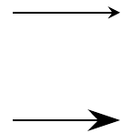
<p class="caption">(\#fig:unnamed-chunk-114)arrow head size</p>
</div>
:::
::::::

##### arrow head slant

e.g. `-{Stealth[slant=2]}`

:::::: {.cols data-latex=""}
::: {.col data-latex="{0.45\textwidth}"}

```tex
\usetikzlibrary{arrows.meta}
\begin{tikzpicture}
  \node at (0, 0) {};
	\draw [-Stealth]               (0, 0) -- (1, 0);
  \draw [-{Stealth[slant=-0.5]}] (0,-1) -- (1,-1);
  \draw [-{Stealth[slant=   1]}] (0,-2) -- (1,-2);
  \node at (0,-2) {};
\end{tikzpicture}
```
:::

::: {.col data-latex="{0.10\textwidth}"}
\ 
:::

::: {.col data-latex="{0.45\textwidth}"}
<div class="figure">

<p class="caption">(\#fig:unnamed-chunk-116)arrow head slant</p>
</div>
:::
::::::

##### arrow head color

e.g. 

- `-{Stealth[color=cyan]}`
- `-{Stealth[fill=red]}`
- `red,-{Stealth}`

:::::: {.cols data-latex=""}
::: {.col data-latex="{0.45\textwidth}"}

```tex
\usetikzlibrary{arrows.meta}
\begin{tikzpicture}
  \node at (0, 0) {};
	\draw [-stealth]               (0, 0) -- (1, 0);
	\draw [-{Stealth[color=cyan]}] (0,-1) -- (1,-1);
  \draw [-{Stealth[fill=red]}  ] (0,-2) -- (1,-2);
  \draw [red,-{Stealth}        ] (0,-3) -- (1,-3);
  \node at (0,-3) {};
\end{tikzpicture}
```
:::

::: {.col data-latex="{0.10\textwidth}"}
\ 
:::

::: {.col data-latex="{0.45\textwidth}"}
<div class="figure">
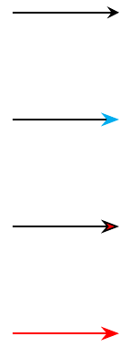
<p class="caption">(\#fig:unnamed-chunk-118)arrow and arrow head color</p>
</div>
:::
::::::

##### multiple arrow head

e.g. `-{Stealth}{Stealth}{Stealth}`

:::::: {.cols data-latex=""}
::: {.col data-latex="{0.45\textwidth}"}

```tex
\usetikzlibrary{arrows.meta}
\begin{tikzpicture}
  \node at (0, 0) {};
	\draw [-stealth]                     (0, 0) -- (1, 0);
	\draw [-{Stealth}{Stealth}{Stealth}] (0,-1) -- (1,-1);
  \node at (0,-1) {};
\end{tikzpicture}
```
:::

::: {.col data-latex="{0.10\textwidth}"}
\ 
:::

::: {.col data-latex="{0.45\textwidth}"}
<div class="figure">

<p class="caption">(\#fig:unnamed-chunk-120)multiple arrow head</p>
</div>
:::
::::::

#### default stealth arrow

https://tex.stackexchange.com/questions/113437/stealth-arrow-in-math

:::::: {.cols data-latex=""}
::: {.col data-latex="{0.45\textwidth}"}

```tex
\usetikzlibrary{cd,arrows}
\tikzset{
  commutative diagrams/.cd, 
  arrow style=tikz, 
  diagrams={>=stealth}
}
\begin{tikzcd}
A \ar[r,"f"] \ar[d,harpoon,shift left=0.5pt,"\varphi"] \ar[rr,bend left] & B & E \\
C \ar[r] \ar[u,harpoon,shift left=0.5pt,"\varphi^{-1}"] & D & F \\
G & H \ar[uur,-stealth]
\end{tikzcd}
```
:::

::: {.col data-latex="{0.10\textwidth}"}
\ 
:::

::: {.col data-latex="{0.45\textwidth}"}
<div class="figure">
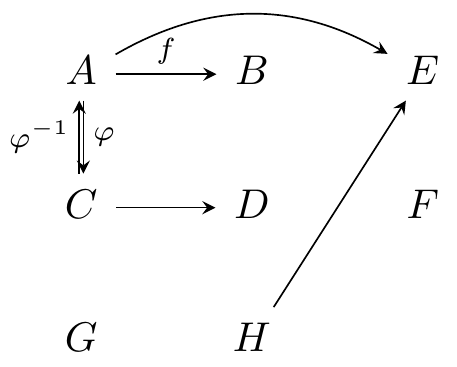
<p class="caption">(\#fig:unnamed-chunk-122)default stealth arrow</p>
</div>
:::
::::::

#### harpoon

harpoon ~ half arrow

https://tex.stackexchange.com/questions/715462/rightleftharpoons-in-commutative-diagram

:::::: {.cols data-latex=""}
::: {.col data-latex="{0.45\textwidth}"}

```tex
\usetikzlibrary{cd}
\begin{tikzcd}
cc \ar[r,shift left=1pt,harpoon,"a"] \ar[d,shift left=1pt,harpoon,"r"] &
ct \ar[l,shift left=1pt,harpoon,"b"] \ar[d,shift left=1pt,harpoon,"r"]
\\
tc \ar[r,shift left=1pt,harpoon,"a"] \ar[u,shift left=1pt,harpoon,"l"] &
tt \ar[l,shift left=1pt,harpoon,"b"] \ar[u,shift left=1pt,harpoon,"l"]
\end{tikzcd}
```
:::

::: {.col data-latex="{0.10\textwidth}"}
\ 
:::

::: {.col data-latex="{0.45\textwidth}"}
<div class="figure">
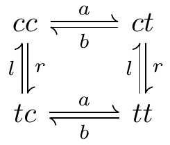
<p class="caption">(\#fig:unnamed-chunk-124)harpoon in cd</p>
</div>
:::
::::::

#### bend

https://tex.stackexchange.com/questions/354480/very-curved-arrow-with-tikzcd

:::::: {.cols data-latex=""}
::: {.col data-latex="{0.45\textwidth}"}

```tex
\usetikzlibrary{cd}
\begin{tikzcd}
A
\ar[r]
\ar[r, bend right]
\ar[r, bend left, blue]
\ar[r, bend left=10]
\ar[r, bend left=20]
\ar[r, bend left=50]
\ar[r, bend left=100]
& B
\end{tikzcd}
```
:::

::: {.col data-latex="{0.10\textwidth}"}
\ 
:::

::: {.col data-latex="{0.45\textwidth}"}
<div class="figure">
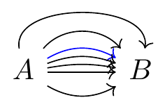
<p class="caption">(\#fig:unnamed-chunk-126)arrow bend</p>
</div>
:::
::::::

#### rounded corners

https://tex.stackexchange.com/questions/295428/rounded-arrow-in-tikzcd-with-text-on-it

:::::: {.cols data-latex=""}
::: {.col data-latex="{0.45\textwidth}"}

```tex
\usetikzlibrary{cd,positioning}
\begin{tikzcd}[sep=large, execute at end picture={\node[below = 1mm of tikz@f@1-1-2] {$\scriptstyle  g' \circ g$};}]
    B \ar{r}[swap]{g\vphantom{'}}
    \ar[to path={--([yshift=-4ex]\tikztostart.south)
                 -|(\tikztotarget)},rounded corners=12pt]{rr}
    & B' \ar{r}[swap]{g'} & B''
\end{tikzcd}
```
:::

::: {.col data-latex="{0.10\textwidth}"}
\ 
:::

::: {.col data-latex="{0.45\textwidth}"}
<div class="figure">

<p class="caption">(\#fig:unnamed-chunk-128)rounded corners</p>
</div>
:::
::::::

#### crossing over

:::::: {.cols data-latex=""}
::: {.col data-latex="{0.45\textwidth}"}

```tex
\usetikzlibrary{cd}
\begin{tikzcd}
 A \ar[dr] & B \ar[dl, crossing over] \\
 C
 & D
 \end{tikzcd}
```
:::

::: {.col data-latex="{0.10\textwidth}"}
\ 
:::

::: {.col data-latex="{0.45\textwidth}"}
<div class="figure">

<p class="caption">(\#fig:unnamed-chunk-130)crossing over</p>
</div>
:::
::::::

***

:::::: {.cols data-latex=""}
::: {.col data-latex="{0.45\textwidth}"}

```tex
\usetikzlibrary{cd}
\begin{tikzcd}[row sep=scriptsize, column sep=scriptsize]
 & f^* E_V \ar[dl] \ar[rr] \ar[dd] & & E_V \ar[dl] \ar[dd] \\
 f^* E \ar[rr, crossing over] \ar[dd] & & E \\
 & U \ar[dl] \ar[rr] & & V \ar[dl] \\
 M \ar[rr] & & N \ar[from=uu, crossing over]\\
 \end{tikzcd}
```
:::

::: {.col data-latex="{0.10\textwidth}"}
\ 
:::

::: {.col data-latex="{0.45\textwidth}"}
<div class="figure">

<p class="caption">(\#fig:unnamed-chunk-132)pseudo 3D diagram</p>
</div>
:::
::::::

#### tweaking to paths

:::::: {.cols data-latex=""}
::: {.col data-latex="{0.45\textwidth}"}

```tex
\usetikzlibrary{cd}
\begin{tikzcd}
  A \ar[dr, controls={+(1.5,0.5) and +(-1,0.8)}]
    \ar[dr, dashed, to path=|- (\tikztotarget)]
    & \\
    & B \ar[loop right]
\end{tikzcd}
```
:::

::: {.col data-latex="{0.10\textwidth}"}
\ 
:::

::: {.col data-latex="{0.45\textwidth}"}
<div class="figure">

<p class="caption">(\#fig:unnamed-chunk-134)crossing over</p>
</div>
:::
::::::

***

:::::: {.cols data-latex=""}
::: {.col data-latex="{0.45\textwidth}"}

```tex
\usetikzlibrary{cd}
\begin{tikzcd}
  A \ar[r]
    & B \ar[r]
        \ar[d, phantom,""{coordinate,name=Z}]
    & C \ar[dll,
               "\delta",
               rounded corners,
               to path={--([xshift=2ex]\tikztostart.east)
                        |-(Z)[near end]\tikztonodes
                        -|([xshift=-2ex]\tikztotarget.west)
                        --(\tikztotarget)}] \\
  D \ar[r]
    & E \ar[r]
    & F
\end{tikzcd}
```
:::

::: {.col data-latex="{0.10\textwidth}"}
\ 
:::

::: {.col data-latex="{0.45\textwidth}"}
<div class="figure">
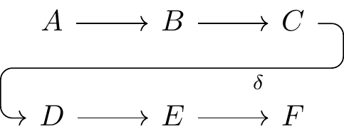
<p class="caption">(\#fig:unnamed-chunk-136)crossing over</p>
</div>
:::
::::::

***

:::::: {.cols data-latex=""}
::: {.col data-latex="{0.45\textwidth}"}

```tex
\usetikzlibrary{cd}
\begin{tikzcd}
  A \ar[r]
    & B \ar[r]
    & C \ar[dll,
               "\delta",
               rounded corners,
               to path={--([xshift=2ex]\tikztostart.east)
                        --([xshift=-2ex]\tikztotarget.west)
                        --(\tikztotarget)}] \\
  D \ar[r]
    & E \ar[r]
    & F
\end{tikzcd}
```
:::

::: {.col data-latex="{0.10\textwidth}"}
\ 
:::

::: {.col data-latex="{0.45\textwidth}"}
<div class="figure">

<p class="caption">(\#fig:unnamed-chunk-138)crossing over</p>
</div>
:::
::::::

### label

https://tex.stackexchange.com/questions/477733/two-labels-up-and-down-for-same-arrow

:::::: {.cols data-latex=""}
::: {.col data-latex="{0.45\textwidth}"}

```tex
\usetikzlibrary{cd}
\begin{tikzcd}%              V
A \ar[r, "\alpha", "\beta"'] & B
\end{tikzcd}
```
:::

::: {.col data-latex="{0.10\textwidth}"}
\ 
:::

::: {.col data-latex="{0.45\textwidth}"}
<div class="figure">

<p class="caption">(\#fig:unnamed-chunk-140)labels over and under the arrow</p>
</div>
:::
::::::

#### single quotation mark to swap

:::::: {.cols data-latex=""}
::: {.col data-latex="{0.45\textwidth}"}

```tex
\usetikzlibrary{cd}
\begin{tikzcd}
A \ar[r, "\alpha"] & B
\end{tikzcd}
```
:::

::: {.col data-latex="{0.10\textwidth}"}
\ 
:::

::: {.col data-latex="{0.45\textwidth}"}
<div class="figure">

<p class="caption">(\#fig:unnamed-chunk-142)label over the arrow without single quotation</p>
</div>
:::
::::::

:::::: {.cols data-latex=""}
::: {.col data-latex="{0.45\textwidth}"}

```tex
\usetikzlibrary{cd}
\begin{tikzcd}
A \ar[r, "\alpha"'] & B
\end{tikzcd}
```
:::

::: {.col data-latex="{0.10\textwidth}"}
\ 
:::

::: {.col data-latex="{0.45\textwidth}"}
<div class="figure">

<p class="caption">(\#fig:unnamed-chunk-144)label under the arrow with single quotation</p>
</div>
:::
::::::

#### swap

:::::: {.cols data-latex=""}
::: {.col data-latex="{0.45\textwidth}"}

```tex
\usetikzlibrary{cd}
\begin{tikzcd}
A \ar[r, "\alpha"] & B
\end{tikzcd}
```
:::

::: {.col data-latex="{0.10\textwidth}"}
\ 
:::

::: {.col data-latex="{0.45\textwidth}"}
<div class="figure">
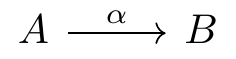
<p class="caption">(\#fig:unnamed-chunk-146)label over the arrow or no swap</p>
</div>
:::
::::::

:::::: {.cols data-latex=""}
::: {.col data-latex="{0.45\textwidth}"}

```tex
\usetikzlibrary{cd}
\begin{tikzcd}
A \ar[r, "\alpha", swap] & B
\end{tikzcd}
```
:::

::: {.col data-latex="{0.10\textwidth}"}
\ 
:::

::: {.col data-latex="{0.45\textwidth}"}
<div class="figure">

<p class="caption">(\#fig:unnamed-chunk-148)label swap under the arrow</p>
</div>
:::
::::::

#### every arrow swap

https://tex.stackexchange.com/questions/515697/how-can-we-change-the-positions-of-the-labels-on-a-tikz-cd-commutative-diagram

`every arrow/.append style={swap}`

### box in TikZ-CD

https://stackoverflow.com/questions/50392582/box-in-commutative-diagram

https://tex.stackexchange.com/questions/360083/filling-of-diagrams-using-tikzcd/360152#360152

### examples

https://tex.stackexchange.com/questions/218274/how-can-i-draw-commutative-diagrams-in-latex

:::::: {.cols data-latex=""}
::: {.col data-latex="{0.45\textwidth}"}

```tex
\usetikzlibrary{cd}
\begin{tikzcd}
A \ar{r}{\varphi} \ar[swap]{d}{\varrho_f} & B \ar{d}{\varrho_g} \\%
A_f \ar{r}{\varphi_f}& B_g
\end{tikzcd}
```
:::

::: {.col data-latex="{0.10\textwidth}"}
\ 
:::

::: {.col data-latex="{0.45\textwidth}"}
<div class="figure">
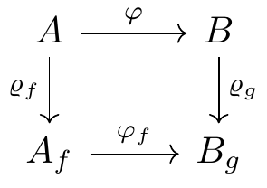
<p class="caption">(\#fig:unnamed-chunk-150)commutative diagram example 0</p>
</div>
:::
::::::

https://tex.stackexchange.com/questions/402572/how-to-make-a-commutative-diagram-using-tikz-cd

:::::: {.cols data-latex=""}
::: {.col data-latex="{0.45\textwidth}"}

```tex
\usetikzlibrary{cd}
\begin{tikzcd}[row sep=huge]
A \ar[r,"\phi_n"] \ar[d,swap,"\pi"] &
A_n \ar[r,"\epsilon_{i,n}"] \ar[dl,swap,"\psi_n"] \ar[dr,"\pi_n"] &
M_{n_k}(\mathbb{C}) \ar[d,"\eta_{i,n}"]
\\
B(H) & & B(H_n) \ar[ll,dashed]
\end{tikzcd}
```
:::

::: {.col data-latex="{0.10\textwidth}"}
\ 
:::

::: {.col data-latex="{0.45\textwidth}"}
<div class="figure">

<p class="caption">(\#fig:unnamed-chunk-152)commutative diagram example 1</p>
</div>
:::
::::::

https://tex.stackexchange.com/questions/115783/how-to-draw-commutative-diagrams

:::::: {.cols data-latex=""}
::: {.col data-latex="{0.45\textwidth}"}

```tex
\usetikzlibrary{cd,arrows}
\begin{tikzcd}
A \ar{r}{f} \ar[swap]{dr}{g\circ f} & B \ar{d}{g} \\
& C
\end{tikzcd}
```
:::

::: {.col data-latex="{0.10\textwidth}"}
\ 
:::

::: {.col data-latex="{0.45\textwidth}"}
<div class="figure">

<p class="caption">(\#fig:unnamed-chunk-154)commutative diagram example 2</p>
</div>
:::
::::::

https://tex.stackexchange.com/questions/414292/tikz-commutative-diagrams-compiling-and-best-practice

:::::: {.cols data-latex=""}
::: {.col data-latex="{0.45\textwidth}"}

```tex
\usetikzlibrary{cd}
\begin{tikzcd}
C \ar[d, "\langle f_i \rangle_{i \in I}"', dotted] \ar[rd, "f_i"] &  \\
\prod_{i \in I} A_i \ar[r, "\pi_i"'] & A_i
\end{tikzcd}
```
:::

::: {.col data-latex="{0.10\textwidth}"}
\ 
:::

::: {.col data-latex="{0.45\textwidth}"}
<div class="figure">

<p class="caption">(\#fig:unnamed-chunk-156)commutative diagram example 3</p>
</div>
:::
::::::

https://tex.stackexchange.com/questions/483801/mapping-arrows-in-commutative-diagrams

:::::: {.cols data-latex=""}
::: {.col data-latex="{0.45\textwidth}"}

```tex
\usetikzlibrary{cd}
\begin{tikzcd}
a \ar[r, maps to] & \phi(a) &[-2em] \\[-4ex]
R\ar[r, hook, "\phi"] \ar[dr, hook, "\iota"] & K & \phi(a) \\
& Q(R) \ar[u, dotted, "\exists ! \Phi"'] & \frac{a}{1} \ar[u, maps to] \\[-10ex]
a \ar[dr, maps to] \\
& \frac{a}{1} & 
\end{tikzcd}
```
:::

::: {.col data-latex="{0.10\textwidth}"}
\ 
:::

::: {.col data-latex="{0.45\textwidth}"}
<div class="figure">

<p class="caption">(\#fig:unnamed-chunk-158)commutative diagram example 4</p>
</div>
:::
::::::

if not using `tikz-cd`,

:::::: {.cols data-latex=""}
::: {.col data-latex="{0.45\textwidth}"}

```tex
\usetikzlibrary{arrows,positioning}
\begin{tikzpicture}
\node (r) at (0,0) {$R$};
\node (k) at (3,0) {$K$};
\node (q) at (3,-3) {$Q(R)$};
\node (ra) at (0,.8) {$a$};
\node (ka) at (3,.8) {$\phi(a)$};
\node (kb) at (4,0) {$\phi(k)$};
\node (qb) at (4,-3) {$\frac a1$};
\path (q) node[below left=1em and 1em] (qc) {$\frac a1$};
\path (r) node[below left=1em and 1em] (rc) {$a$};
\draw[right hook->] (r)--(k) node[midway,above] {$\scriptstyle\phi$};
\draw[right hook->] (r)--(q) node[midway,above right] {$\scriptstyle\iota$};
\draw[dotted,->] (q)--(k) node[midway,right] {$\scriptstyle\exists!\Phi$};
\draw[|->] (ra) edge (ka) (qb) edge (kb) (rc) edge (qc);
\end{tikzpicture}
```
:::

::: {.col data-latex="{0.10\textwidth}"}
\ 
:::

::: {.col data-latex="{0.45\textwidth}"}
<div class="figure">

<p class="caption">(\#fig:unnamed-chunk-160)commutative diagram example 4 not using tikz-cd</p>
</div>
:::
::::::

separated diagrams with `tikz-cd`,

:::::: {.cols data-latex=""}
::: {.col data-latex="{0.45\textwidth}"}

```tex
\usetikzlibrary{cd}
\begin{tikzcd}
R\ar[r, hook, "\phi"] \ar[dr, hook, "\iota"] & K &
a \ar[r, maps to,"\phi"] \ar[dr, maps to,"\iota"] & \phi(a) \\
& Q(R) \ar[u, dotted, "\exists ! \Phi"'] &
& \frac{a}{1} \ar[u, maps to,"\Phi"']
\end{tikzcd}
```
:::

::: {.col data-latex="{0.10\textwidth}"}
\ 
:::

::: {.col data-latex="{0.45\textwidth}"}
<div class="figure">
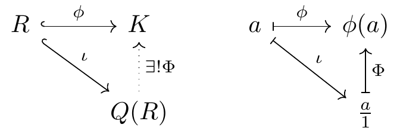
<p class="caption">(\#fig:unnamed-chunk-162)commutative diagram example 4</p>
</div>
:::
::::::

register map

https://tex.stackexchange.com/questions/510088/tikz-register-map

### put a commutative diagram in a nodepart in a tikzpicture

https://tex.stackexchange.com/questions/524955/put-a-commutative-diagram-in-a-nodepart-in-a-tikzpicture/525046#525046

## PGFplots

axis similar to matplotlib figure anatomy, see Fig: \@ref(fig:matplotlib-figure-anatomy)

https://tikz.dev/pgfplots/

https://tikz.dev/pgfplots/tutorial1

> Not so common is `\pgfplotsset{compat=1.5}` .
> A statement like this should always be used in order to (a) benefit from a more or less recent feature set and (b) avoid changes to your picture if you recompile it with a later version of pgfplots.

:::::: {.cols data-latex=""}
::: {.col data-latex="{0.45\textwidth}"}

```tex
\pgfplotsset{width=7cm,compat=1.18}
\begin{tikzpicture}
\begin{axis}[
]
    % density of Normal distribution:
    \addplot [
        red,
        domain=-3e-3:3e-3,
        samples=201,
    ]
        {exp(-x^2 / (2e-3^2)) / (1e-3 * sqrt(2*pi))};
\end{axis}
\end{tikzpicture}
```
:::

::: {.col data-latex="{0.10\textwidth}"}
\ 
:::

::: {.col data-latex="{0.45\textwidth}"}
<div class="figure">

<p class="caption">(\#fig:unnamed-chunk-164)PGFplots: normal distribution</p>
</div>
:::
::::::

### the axis environments

https://tikz.dev/pgfplots/reference-axis

`\pgfplotsset{every linear axis/.append style={...}}`

:::::: {.cols data-latex=""}
::: {.col data-latex="{0.45\textwidth}"}

```tex
\begin{tikzpicture}
	\begin{axis}[
		no markers,
		axis x line = center,
		axis y line = center,
		xlabel = {$ x $}, xlabel style = {right},
		ylabel = {$ y $}, ylabel style = {above},
		xmin = -8, xmax = 8,
		ymin = 0, ymax = 0.45,
		hide obscured x ticks=false, % for origin x tick label i.e. xtick = {0}
		xtick={-4, 0,  4},
		xticklabels={$ \mu_{\scriptscriptstyle{1}} $, 
					$ \mu_{\scriptscriptstyle{0}} $, 
					$ \mu_{\scriptscriptstyle{1}} $},
		%extra x ticks={0},
		ytick = \empty,
		x = 1cm, y = 5cm, % x y scaling
		%grid = major,
		domain = -10:10,
		samples = 1000		
	]
  \end{axis}
\end{tikzpicture}
```
:::

::: {.col data-latex="{0.10\textwidth}"}
\ 
:::

::: {.col data-latex="{0.45\textwidth}"}
<div class="figure">
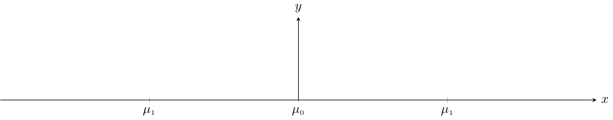
<p class="caption">(\#fig:unnamed-chunk-166)begin{axis}</p>
</div>
:::
::::::

https://tex.stackexchange.com/questions/134959/axis-lines-middle-and-axis-lines-center

> No, there is no difference.

### axis descriptions

https://tikz.dev/pgfplots/reference-axisdescription

#### placement of axis descriptions

##### coordinate system `axis description cs`

https://tikz.dev/pgfplots/reference-axisdescription#pgfp.axis_description_cs

`\addplot {x};` can change to `\addplot {x^2};` still with auto blue dots

`small dot style,pin=angle:LaTeX label   at PGFplots axis coordinate system  ;`

:::::: {.cols data-latex=""}
::: {.col data-latex="{0.45\textwidth}"}

```tex
\begin{tikzpicture}
    \tikzset{
        every pin/.style={fill=yellow!50!white,rectangle,rounded corners=3pt,font=\tiny},
        small dot/.style={fill=black,circle,scale=0.3},
    }
    \begin{axis}[
        clip=false,
        title=How \texttt{axis description cs} works,
    ]
        \addplot {x};
        %small dot style,pin=angle:LaTeX label   at PGFplots axis coordinate system  ;
        \node [small dot,pin=120:{$(0,0)$}]      at (axis description cs:0,0)      {};
        \node [small dot,pin=-30:{$(1,1)$}]      at (axis description cs:1,1)      {};
        \node [small dot,pin=-90:{$(1.03,0.5)$}] at (axis description cs:1.03,0.5) {};
        \node [small dot,pin=125:{$(0.5,0.5)$}]  at (axis description cs:0.5,0.5)  {};
    \end{axis}
\end{tikzpicture}
```
:::

::: {.col data-latex="{0.10\textwidth}"}
\ 
:::

::: {.col data-latex="{0.45\textwidth}"}
<div class="figure">

<p class="caption">(\#fig:unnamed-chunk-168)PGFplots: $x$</p>
</div>
:::
::::::

***

:::::: {.cols data-latex=""}
::: {.col data-latex="{0.45\textwidth}"}

```tex
\begin{tikzpicture}
    \tikzset{
        every pin/.style={fill=yellow!50!white,rectangle,rounded corners=3pt,font=\tiny},
        small dot/.style={fill=black,circle,scale=0.3},
    }
    \begin{axis}[
        clip=false,
        title=How \texttt{axis description cs} works,
    ]
        \addplot {x^2};
        %small dot style,pin=angle:LaTeX label   at PGFplots axis coordinate system  ;
        \node [small dot,pin=120:{$(0,0)$}]      at (axis description cs:0,0)      {};
        \node [small dot,pin=-30:{$(1,1)$}]      at (axis description cs:1,1)      {};
        \node [small dot,pin=-90:{$(1.03,0.5)$}] at (axis description cs:1.03,0.5) {};
        \node [small dot,pin=125:{$(0.5,0.5)$}]  at (axis description cs:0.5,0.5)  {};
    \end{axis}
\end{tikzpicture}
```
:::

::: {.col data-latex="{0.10\textwidth}"}
\ 
:::

::: {.col data-latex="{0.45\textwidth}"}
<div class="figure">

<p class="caption">(\#fig:unnamed-chunk-170)PGFplots: $x^2$</p>
</div>
:::
::::::

##### legend

https://tikz.dev/pgfplots/reference-axisdescription#sec-4.9.4

##### tick option

https://tikz.dev/pgfplots/reference-tickoptions

### `declare function`

https://tikz.dev/pgfplots/utility-commands#pgf/declare_function

:::::: {.cols data-latex=""}
::: {.col data-latex="{0.45\textwidth}"}

```tex
\begin{tikzpicture}
\begin{axis}[
    declare function={
        C=4;
        square(\t)=(\t)^2 + C;
        },
    ]
    \addplot+ [samples=2] {C*x};
    \addplot {square(x)};
\end{axis}
\end{tikzpicture}
```
:::

::: {.col data-latex="{0.10\textwidth}"}
\ 
:::

::: {.col data-latex="{0.45\textwidth}"}
<div class="figure">

<p class="caption">(\#fig:unnamed-chunk-172)declare function</p>
</div>
:::
::::::

#### `pgfmathparse`

https://tikz.dev/math-parsing

https://tikz.dev/math-parsing#sec-94.1

> This macro parses <expression> and returns the result without units in the macro \pgfmathresult.
> Example: `\pgfmathparse{2pt+3.5pt}` will set `\pgfmathresult` to the text `5.5`.

`\pgfmathsqrt{x}` = `\pgfmathparse{sqrt(x)}`

`\pgfmathln{x}` = `\pgfmathparse{ln(x)}`

...

#### `pgfmathdeclarefunction`

like `pgfplotsinvokeforeach`

> replaces any occurrence of `#1` inside of (math image)command(math image) once for every element in (math image)list(math image). Thus, it actually assumes that (math image)command(math image) is like a `\newcommand` body.

```
% pgfmathdeclarefunction{name}{num_var}{%
%% #1 = \mu, #2 = \sigma
\pgfmathdeclarefunction{gauss}{2}{%
	\pgfmathparse{1/(#2*sqrt(2*pi))*exp(-((x-#1)^2)/(2*#2^2))}%
}
```


```tex
% pgfmathdeclarefunction{name}{num_var}{%
%% #1 = \mu, #2 = \sigma
\pgfmathdeclarefunction{gauss}{2}{%
	\pgfmathparse{1/(#2*sqrt(2*pi))*exp(-((x-#1)^2)/(2*#2^2))}%
}

\begin{tikzpicture}
	\begin{axis}[
		no markers,
		axis x line = center,
		axis y line = center,
		xlabel = {$ x $}, xlabel style = {right},
		ylabel = {$ y $}, ylabel style = {above},
		xmin = -8, xmax = 8,
		ymin = 0, ymax = 0.45,
		hide obscured x ticks=false, % for origin x tick label i.e. xtick = {0}
		xtick={-4, 0,  4},
		xticklabels={$ \mu_{\scriptscriptstyle{1}} $, 
					$ \mu_{\scriptscriptstyle{0}} $, 
					$ \mu_{\scriptscriptstyle{1}} $},
		%extra x ticks={0},
		ytick = \empty,
		x = 1cm, y = 5cm, % x y scaling
		%grid = major,
		domain = -10:10,
		samples = 1000		
	]
		\addplot [fill=cyan!20, draw=none, domain=-10:-2] {gauss(-4, 1)} \closedcycle;
		\addplot [fill=cyan!20, draw=none, domain=   2:10] {gauss( 4, 1)} \closedcycle;
		\addplot [very thick, cyan!50!black] {gauss(-4, 1)};
		\addplot [very thick, cyan!50!black] {gauss( 0, 1)};
		\addplot [very thick, cyan!50!black] {gauss( 4, 1)};
		%\node [anchor=north] at (axis cs: 0, -0.01) {$ \mu $};
		%\node at (axis cs: -4, -0.02) {$ \mu $};
		\draw [dashed, thin] (axis cs: -4, 0) -- (axis cs: -4, 1);
		\draw [dashed, thin] (axis cs:  4, 0) -- (axis cs: 4, 1);
	\end{axis}
\end{tikzpicture}
```

<div class="figure">

<p class="caption">(\#fig:unnamed-chunk-174)PGFmathDeclareFunction: normal distributions hypothesis testing</p>
</div>

https://tex.stackexchange.com/questions/43610/plotting-bell-shaped-curve-in-tikz-pgf


```tex
% pgfmathdeclarefunction{name}{num_var}{%
%% #1 = \mu, #2 = \sigma
\pgfmathdeclarefunction{gauss}{2}{%
  \pgfmathparse{1/(#2*sqrt(2*pi))*exp(-((x-#1)^2)/(2*#2^2))}%
}

\begin{tikzpicture}
\begin{axis}[
  no markers, domain=0:10, samples=100,
  axis lines*=left, xlabel=$x$, ylabel=$y$,
  every axis y label/.style={at=(current axis.above origin),anchor=south},
  every axis x label/.style={at=(current axis.right of origin),anchor=west},
  height=5cm, width=12cm,
  xtick={4,6.5}, ytick=\empty,
  enlargelimits=false, clip=false, axis on top,
  grid = major
  ]
  \addplot [fill=cyan!20, draw=none, domain=0:5.96] {gauss(6.5,1)} \closedcycle;
  \addplot [very thick,cyan!50!black] {gauss(4,1)};
  \addplot [very thick,cyan!50!black] {gauss(6.5,1)};
  \draw [yshift=-0.6cm, latex-latex](axis cs:4,0) -- node [fill=white] {$1.96\sigma$} (axis cs:5.96,0);
\end{axis}

\end{tikzpicture}
```

<div class="figure">

<p class="caption">(\#fig:unnamed-chunk-176)PGFmathDeclareFunction: normal distributions</p>
</div>

### `|-` and `-|` in TikZ

https://tex.stackexchange.com/questions/401425/tikz-what-exactly-does-the-the-notation-for-arrows-do

> `(a -| b)` where `a` and `b` are named nodes or coordinates. This means the coordinate that is at the y-coordinate of `a`, and x-coordinate of `b`. Similarly, `(a |- b)` has the x-coordinate of `a` and y-coordinate of `b`.

### `pgfplotsinvokeforeach`

https://tikz.dev/pgfplots/pgfplotstable-miscellaneous#\pgfplotsinvokeforeach

like `\foreach` in TikZ

> A variant of `\pgfplotsforeachungrouped` (and such also of `\foreach`) which replaces any occurrence of `#1` inside of (math image)command(math image) once for every element in (math image)list(math image). Thus, it actually assumes that (math image)command(math image) is like a `\newcommand` body.

### interpolation dashed lines

https://tex.stackexchange.com/questions/193259/what-is-the-easiest-way-to-accomplish-textual-tick-labels-in-tikz

`interpa = (10,10), interpb = (30,30), interp = interpolation`

`({axis cs:0,0}|-interp#1) = (x of (0,0), y of (interpa)) = (0, 10), ...`

:::::: {.cols data-latex=""}
::: {.col data-latex="{0.45\textwidth}"}

```tex
\begin{tikzpicture}
\begin{axis}[
    axis lines=left,
    xmin = 0, xmax = 40,
    ymin = 0, ymax = 40,
    xtick={10,30},
    xticklabels={$V_i=10$,$V_f=30$},
    ytick={10,30},
    yticklabels={$P_i=10$,$P_f=30$},
    xlabel={Volume},
    ylabel={Pressure}
  ]
  \addplot[very thick,-latex ] coordinates{(10,10) (30,30)}
    % interpa = (10,10), interpb = (30,30), interp = interpolation
    coordinate[at start](interpa)coordinate[at end](interpb);
  \pgfplotsinvokeforeach {a,b} {
    \draw[ultra thin, dashed]
      % ({axis cs:0,0}|-interp#1) = (x of (0,0), y of (interpa)) = (0, 10), ...
      ({axis cs:0,0}|-interp#1)--(interp#1)--(interp#1|-{axis cs:0,0});
    }
\end{axis}
\end{tikzpicture}
```
:::

::: {.col data-latex="{0.10\textwidth}"}
\ 
:::

::: {.col data-latex="{0.45\textwidth}"}
<div class="figure">

<p class="caption">(\#fig:unnamed-chunk-178)tick texts and interpolation dashed lines</p>
</div>
:::
::::::

### Zewbie

https://zhuanlan.zhihu.com/p/551874337

axis similar to matplotlib figure anatomy, see Fig: \@ref(fig:matplotlib-figure-anatomy)

#### coordinate axis/axes fine-tuing

:::::: {.cols data-latex=""}
::: {.col data-latex="{0.45\textwidth}"}

```tex
\begin{tikzpicture}
    \begin{axis}
        % empty
    \end{axis}
\end{tikzpicture}
```
:::

::: {.col data-latex="{0.10\textwidth}"}
\ 
:::

::: {.col data-latex="{0.45\textwidth}"}
<div class="figure">

<p class="caption">(\#fig:unnamed-chunk-180)PGFplots: 2D axis/axes</p>
</div>
:::
::::::

##### range

***

:::::: {.cols data-latex=""}
::: {.col data-latex="{0.45\textwidth}"}

```tex
\begin{tikzpicture}
    \begin{axis}[
        xmin = -1, xmax = 11,
        ymin = -3, ymax = 1,
    ]
        % empty
    \end{axis}
\end{tikzpicture}
```
:::

::: {.col data-latex="{0.10\textwidth}"}
\ 
:::

::: {.col data-latex="{0.45\textwidth}"}
<div class="figure">

<p class="caption">(\#fig:unnamed-chunk-182)PGFplots: axis/axes range</p>
</div>
:::
::::::

##### scaling

`axis equal image` equivalent to `unit vector ratio = {1 1 1}`

:::::: {.cols data-latex=""}
::: {.col data-latex="{0.45\textwidth}"}

```tex
\begin{tikzpicture}
    \begin{axis}[
        xmin = -1, xmax = 11,
        ymin = -3, ymax = 1,
        axis equal image, % unit vector ratio = {1 1 1},
    ]
        % empty
    \end{axis}
\end{tikzpicture}
```
:::

::: {.col data-latex="{0.10\textwidth}"}
\ 
:::

::: {.col data-latex="{0.45\textwidth}"}
<div class="figure">

<p class="caption">(\#fig:unnamed-chunk-184)PGFplots: axis/axes range</p>
</div>
:::
::::::

***

`scale only axis`

`width` x axis length, `height` y axis length

:::::: {.cols data-latex=""}
::: {.col data-latex="{0.45\textwidth}"}

```tex
\begin{tikzpicture}
    \begin{axis}[
        xmin = -1, xmax = 11,
        ymin = -3, ymax = 1,
        scale only axis,
        width = 5cm, height = 7cm,
    ]
        % empty
    \end{axis}
\end{tikzpicture}
```
:::

::: {.col data-latex="{0.10\textwidth}"}
\ 
:::

::: {.col data-latex="{0.45\textwidth}"}
<div class="figure">

<p class="caption">(\#fig:unnamed-chunk-186)PGFplots: axis/axes range</p>
</div>
:::
::::::

***

`x` x unit vector length, `y` y unit vector length

:::::: {.cols data-latex=""}
::: {.col data-latex="{0.45\textwidth}"}

```tex
\begin{tikzpicture}
    \begin{axis}[
        xmin = -1, xmax = 11,
        ymin = -3, ymax = 1,
        x = 1cm, y = 1cm,
    ]
        % empty
    \end{axis}
\end{tikzpicture}
```
:::

::: {.col data-latex="{0.10\textwidth}"}
\ 
:::

::: {.col data-latex="{0.45\textwidth}"}
<div class="figure">

<p class="caption">(\#fig:unnamed-chunk-188)PGFplots: axis/axes range</p>
</div>
:::
::::::

##### direction vector

***

:::::: {.cols data-latex=""}
::: {.col data-latex="{0.45\textwidth}"}

```tex
\begin{tikzpicture}
    \begin{axis}[
        xmin = -1, xmax = 11,
        ymin = -3, ymax = 1,
        x={(.2cm,-.1cm)}, y={(.5cm,.5cm)},
    ]
        % empty
    \end{axis}
\end{tikzpicture}
```
:::

::: {.col data-latex="{0.10\textwidth}"}
\ 
:::

::: {.col data-latex="{0.45\textwidth}"}
<div class="figure">

<p class="caption">(\#fig:unnamed-chunk-190)PGFplots: axis/axes range</p>
</div>
:::
::::::

***

`unit vector ratio = {1 1}`

:::::: {.cols data-latex=""}
::: {.col data-latex="{0.45\textwidth}"}

```tex
\begin{tikzpicture}
    \begin{axis}[
        xmin = -1, xmax = 11,
        ymin = -3, ymax = 1,
        unit vector ratio = {1 1},
    ]
        % empty
    \end{axis}
\end{tikzpicture}
```
:::

::: {.col data-latex="{0.10\textwidth}"}
\ 
:::

::: {.col data-latex="{0.45\textwidth}"}
<div class="figure">

<p class="caption">(\#fig:unnamed-chunk-192)PGFplots: axis/axes range</p>
</div>
:::
::::::

##### axis style

`axis lines` to assign all axes, either `axis lines = box`(default), `axis lines = center`(axis lines with arrows, `center`, x: `bottom`, `top`, y: ), or `axis lines = none`(not shown), or even axis lines wihtout arrows `axis lines *= center`

`axis x line`, `axis y line` to assign the respect axis, e.g. `axis x line = center`

`axis lines = center`:

:::::: {.cols data-latex=""}
::: {.col data-latex="{0.45\textwidth}"}

```tex
\begin{tikzpicture}
    \begin{axis}[
        axis lines = center,
        xmin = -1, xmax = 11,
        ymin = -3, ymax = 1,
    ]
        % empty
    \end{axis}
\end{tikzpicture}
```
:::

::: {.col data-latex="{0.10\textwidth}"}
\ 
:::

::: {.col data-latex="{0.45\textwidth}"}
<div class="figure">

<p class="caption">(\#fig:unnamed-chunk-194)PGFplots: axis/axes range</p>
</div>
:::
::::::

`axis lines *= center`:

x axis line without arrow, y axis box

:::::: {.cols data-latex=""}
::: {.col data-latex="{0.45\textwidth}"}

```tex
\begin{tikzpicture}
    \begin{axis}[
        axis x line* = center, % x axis line without arrow, y axis box
        xmin = -1, xmax = 11,
        ymin = -3, ymax = 1,
    ]
        % empty
    \end{axis}
\end{tikzpicture}
```
:::

::: {.col data-latex="{0.10\textwidth}"}
\ 
:::

::: {.col data-latex="{0.45\textwidth}"}
<div class="figure">

<p class="caption">(\#fig:unnamed-chunk-196)PGFplots: axis/axes range</p>
</div>
:::
::::::

***

x axis line with arrow, y axis line without arrow

:::::: {.cols data-latex=""}
::: {.col data-latex="{0.45\textwidth}"}

```tex
\begin{tikzpicture}
    \begin{axis}[
        axis x line = center, % x axis line with arrow
        axis y line* = center, % y axis line without arrow
        xmin = -1, xmax = 11,
        ymin = -3, ymax = 1,
    ]
        % empty
    \end{axis}
\end{tikzpicture}
```
:::

::: {.col data-latex="{0.10\textwidth}"}
\ 
:::

::: {.col data-latex="{0.45\textwidth}"}
<div class="figure">

<p class="caption">(\#fig:unnamed-chunk-198)PGFplots: axis/axes range</p>
</div>
:::
::::::

##### axis discontinuity

`crunch`, `parallel`, `none`

`crunch`

:::::: {.cols data-latex=""}
::: {.col data-latex="{0.45\textwidth}"}

```tex
\begin{tikzpicture}
    \begin{axis}[
        axis x line = bottom,
        axis y line = center,
        xmin = -2, xmax = 10,
        ymin =  0, ymax = 12,
        axis y discontinuity = crunch,
    ]
        % empty
    \end{axis}
\end{tikzpicture}
```
:::

::: {.col data-latex="{0.10\textwidth}"}
\ 
:::

::: {.col data-latex="{0.45\textwidth}"}
<div class="figure">

<p class="caption">(\#fig:unnamed-chunk-200)PGFplots: axis/axes range</p>
</div>
:::
::::::

***

`parallel`

:::::: {.cols data-latex=""}
::: {.col data-latex="{0.45\textwidth}"}

```tex
\begin{tikzpicture}
    \begin{axis}[
        axis x line = bottom,
        axis y line = center,
        xmin = -2, xmax = 10,
        ymin =  0, ymax = 12,
        axis y discontinuity = parallel,
    ]
        % empty
    \end{axis}
\end{tikzpicture}
```
:::

::: {.col data-latex="{0.10\textwidth}"}
\ 
:::

::: {.col data-latex="{0.45\textwidth}"}
<div class="figure">

<p class="caption">(\#fig:unnamed-chunk-202)PGFplots: axis/axes range</p>
</div>
:::
::::::

##### tick

`tick pos` `ticklabel pos`

:::::: {.cols data-latex=""}
::: {.col data-latex="{0.45\textwidth}"}

```tex
\begin{tikzpicture}
    \begin{axis}[
        xtick pos = upper,
        yticklabel pos = upper,
    ]
        % empty
    \end{axis}
\end{tikzpicture}
```
:::

::: {.col data-latex="{0.10\textwidth}"}
\ 
:::

::: {.col data-latex="{0.45\textwidth}"}
<div class="figure">

<p class="caption">(\#fig:unnamed-chunk-204)PGFplots: axis/axes range</p>
</div>
:::
::::::

***

`tick distance`

`tick align`: `inside`, `center`, `outside`

:::::: {.cols data-latex=""}
::: {.col data-latex="{0.45\textwidth}"}

```tex
\begin{tikzpicture}
    \begin{axis}[
        axis lines=center,
        xmin=-1,xmax=3,
        ymin=-3,ymax=3,
        xtick distance=.8,
        ytick distance=1.1,
        tick align=inside,
    ]
        % empty
    \end{axis}
\end{tikzpicture}
```
:::

::: {.col data-latex="{0.10\textwidth}"}
\ 
:::

::: {.col data-latex="{0.45\textwidth}"}
<div class="figure">

<p class="caption">(\#fig:unnamed-chunk-206)PGFplots: axis/axes range</p>
</div>
:::
::::::

***

`minor tick num`

:::::: {.cols data-latex=""}
::: {.col data-latex="{0.45\textwidth}"}

```tex
\begin{tikzpicture}
    \begin{axis}[
        axis y line=none,axis x line=center,
        ymin=0,ymax=0,xmin=-3,xmax=3,
        xtick distance=2,tick align=inside,
        minor tick num=2,
    ]
        % empty
    \end{axis}
\end{tikzpicture}
```
:::

::: {.col data-latex="{0.10\textwidth}"}
\ 
:::

::: {.col data-latex="{0.45\textwidth}"}
<div class="figure">

<p class="caption">(\#fig:unnamed-chunk-208)PGFplots: axis/axes range</p>
</div>
:::
::::::

***

`xtick=\empty|data|{<coordinates>}`

:::::: {.cols data-latex=""}
::: {.col data-latex="{0.45\textwidth}"}

```tex
\begin{tikzpicture}
    \begin{axis}[
        axis y line=none,axis x line=center,
        ymin=0,ymax=0,xmin=-3,xmax=3,
        xtick={-2.5,0,1},minor xtick={1/3,2/3},
        tick align=inside,
        ]
        % empty
    \end{axis}
\end{tikzpicture}
```
:::

::: {.col data-latex="{0.10\textwidth}"}
\ 
:::

::: {.col data-latex="{0.45\textwidth}"}
<div class="figure">

<p class="caption">(\#fig:unnamed-chunk-210)PGFplots: axis/axes range</p>
</div>
:::
::::::

***

`extra x ticks={<coordinates>}`

:::::: {.cols data-latex=""}
::: {.col data-latex="{0.45\textwidth}"}

```tex
\begin{tikzpicture}
    \begin{axis}[
        axis y line=none,axis x line=center,
        ymin=0,ymax=0,xmin=-2.3,xmax=4.9,
        xtick distance=2,minor tick num=1,
        extra x ticks={e,pi},
        extra x tick labels={$e$,$\pi$},
        tick align=inside,
    ]
        % empty
    \end{axis}
\end{tikzpicture}
```
:::

::: {.col data-latex="{0.10\textwidth}"}
\ 
:::

::: {.col data-latex="{0.45\textwidth}"}
<div class="figure">

<p class="caption">(\#fig:unnamed-chunk-212)PGFplots: axis/axes range</p>
</div>
:::
::::::

***

`ticklabels={<labels>}` `extra x tick labels={<labels>}`

`hide obscured x ticks = false` for origin x tick label

:::::: {.cols data-latex=""}
::: {.col data-latex="{0.45\textwidth}"}

```tex
\begin{tikzpicture}
    \begin{axis}[
        axis y line=none,axis x line=center,
        ymin=0,ymax=0,xmin=-2.3*pi,xmax=2.3*pi,
        xtick distance=pi,
        xticklabels={$-2\pi$,$-\pi$,$0$,$\pi$,$2\pi$},
    ]
        % empty
    \end{axis}
\end{tikzpicture}
```
:::

::: {.col data-latex="{0.10\textwidth}"}
\ 
:::

::: {.col data-latex="{0.45\textwidth}"}
<div class="figure">

<p class="caption">(\#fig:unnamed-chunk-214)PGFplots: axis/axes range</p>
</div>
:::
::::::

#### `addplot+`

> What does addplot+ do exactly?

https://tex.stackexchange.com/questions/275959/what-does-addplot-do-exactly

https://tikz.dev/pgfplots/reference-addplot#\addplot+

> Every `\addplot` directive receives a pre-defined style (line color, marker style etc) through a pre-defined cycle list that is automatically chosen depending on the index of the current `\addplot` instruction. If you want to add some of your styles manually (like I want red colour instead of blue, say), you can add them through options to `\addplot` like `\addplot[<your options>]`. Now the question is whether you want your own style (your options) to be appended to or replace one of these cycle lists assigned. This is decided by the + sign. If you use `\addplot+ [<your options>]`, your style is appended to and by `\addplot[<your options>]` , your options will replace the assigned cycle list.

#### point

`only marks` only points without lines

zero y axis range `ymin=0, ymax=0` and `axis y line=none`, making 1D x axis

:::::: {.cols data-latex=""}
::: {.col data-latex="{0.45\textwidth}"}

```tex
\begin{tikzpicture}
    \begin{axis}[ 
        xlabel=$x$,
        axis y line=none,
        axis x line=center,
        tick align=inside,
        xmin=-1.5, xmax=4.9, ymin=0, ymax=0,
        xtick distance=1,
        x=1cm
        ]
        \addplot+ coordinates {(e,0)}
            node [pin=90:{$e$}] {};
        \addplot+ coordinates {(pi,0)}
            node [pin=90:{$\pi$}] {};
        \addplot+ coordinates {(-1,0)};
    \end{axis}
\end{tikzpicture}
```
:::

::: {.col data-latex="{0.10\textwidth}"}
\ 
:::

::: {.col data-latex="{0.45\textwidth}"}
<div class="figure">

<p class="caption">(\#fig:unnamed-chunk-216)PGFplots: 1D points with pins</p>
</div>
:::
::::::

***

:::::: {.cols data-latex=""}
::: {.col data-latex="{0.45\textwidth}"}

```tex
\begin{tikzpicture}
    \begin{axis}[
        xlabel=$x$, ylabel=$y$,
        axis lines=center,
        tick align=inside,
        xmin=-1.5, xmax=4.9, ymin=-3.3, ymax=3.9,
        xtick distance=1, ytick distance=1,
        axis equal image
        ]
        \addplot+ [only marks] coordinates {
            (-1,-2) (pi,pi/4) (3,2) (0,0)};
        \addplot+ coordinates {(2,1)};
        \addplot+ coordinates {(3,-2)};
    \end{axis}
\end{tikzpicture}
```
:::

::: {.col data-latex="{0.10\textwidth}"}
\ 
:::

::: {.col data-latex="{0.45\textwidth}"}
<div class="figure">

<p class="caption">(\#fig:unnamed-chunk-218)PGFplots: 2D points</p>
</div>
:::
::::::

***

:::::: {.cols data-latex=""}
::: {.col data-latex="{0.45\textwidth}"}

```tex
\begin{tikzpicture}
    \begin{axis}[axis equal image]
        \addplot+ [only marks]
            table [x=xdata,y=ydata] {data/func.dat};
    \end{axis}
\end{tikzpicture}
```
:::

::: {.col data-latex="{0.10\textwidth}"}
\ 
:::

::: {.col data-latex="{0.45\textwidth}"}
<div class="figure">

<p class="caption">(\#fig:unnamed-chunk-220)PGFplots: data points</p>
</div>
:::
::::::

***

`axis equal image` to fix aspect ratio 1:1

:::::: {.cols data-latex=""}
::: {.col data-latex="{0.45\textwidth}"}

```tex
\begin{tikzpicture}
    \begin{axis}[title=5 sampling points,
        xlabel=$x$,ylabel=$y$,
        axis equal image]
        \addplot+ [only marks,domain=-2:2,samples=5]
            {x^2};
    \end{axis}
\end{tikzpicture}
```
:::

::: {.col data-latex="{0.10\textwidth}"}
\ 
:::

::: {.col data-latex="{0.45\textwidth}"}
<div class="figure">

<p class="caption">(\#fig:unnamed-chunk-222)PGFplots: function sampling 5 points</p>
</div>
:::
::::::

***

:::::: {.cols data-latex=""}
::: {.col data-latex="{0.45\textwidth}"}

```tex
\begin{tikzpicture}
    \begin{axis}[title=55 sampling points,
        xlabel=$x$,ylabel=$y$,
        axis equal image]
        \addplot+ [only marks,domain=-2:2,samples=55]
            {x^2};
    \end{axis}
\end{tikzpicture}
```
:::

::: {.col data-latex="{0.10\textwidth}"}
\ 
:::

::: {.col data-latex="{0.45\textwidth}"}
<div class="figure">

<p class="caption">(\#fig:unnamed-chunk-224)PGFplots: function sampling 55 points</p>
</div>
:::
::::::

***

:::::: {.cols data-latex=""}
::: {.col data-latex="{0.45\textwidth}"}

```tex
\begin{tikzpicture}
    \begin{axis}[
        trig format plots=rad,  % angle in radian
        axis equal image]
        \addplot+ [only marks,variable=t,domain=0:pi*3/2,
            samples=20] ({cos(t)},{sin(t)});
    \end{axis}
\end{tikzpicture}
```
:::

::: {.col data-latex="{0.10\textwidth}"}
\ 
:::

::: {.col data-latex="{0.45\textwidth}"}
<div class="figure">

<p class="caption">(\#fig:unnamed-chunk-226)PGFplots: parametric function sampling</p>
</div>
:::
::::::

***

:::::: {.cols data-latex=""}
::: {.col data-latex="{0.45\textwidth}"}

```tex
\begin{tikzpicture}
    \begin{axis}[
        xlabel=$x$,ylabel=$y$,zlabel=$z$,
        axis lines=center,
        tick align=inside,
        xmin=-1.5,xmax=3.9,
        ymin=-1.5,ymax=3.9,
        zmin=-0.5,zmax=3.9,
        xtick distance=1,
        ytick distance=1,
        ztick distance=1,
        % width=10cm,
        % scale only axis,
        view={120}{30},  % perspective angle
        axis equal image,]
        \addplot3+ coordinates{(1,0,0)};
        \addplot3+ coordinates{(0,1,0)};
        \addplot3+ coordinates{(0,0,1)};
    \end{axis}
\end{tikzpicture}
```
:::

::: {.col data-latex="{0.10\textwidth}"}
\ 
:::

::: {.col data-latex="{0.45\textwidth}"}
<div class="figure">

<p class="caption">(\#fig:unnamed-chunk-228)PGFplots: 3D points</p>
</div>
:::
::::::

***

:::::: {.cols data-latex=""}
::: {.col data-latex="{0.45\textwidth}"}

```tex
\begin{tikzpicture}
    \begin{axis}[
        xlabel=$x$,ylabel=$y$,zlabel=$z$,
        grid=major
        ]
        \addplot3+ [only marks] {x^2+y^2};
    \end{axis}
\end{tikzpicture}
```
:::

::: {.col data-latex="{0.10\textwidth}"}
\ 
:::

::: {.col data-latex="{0.45\textwidth}"}
<div class="figure">

<p class="caption">(\#fig:unnamed-chunk-230)PGFplots: 3D function sampling points</p>
</div>
:::
::::::

#### line

:::::: {.cols data-latex=""}
::: {.col data-latex="{0.45\textwidth}"}

```tex
\begin{tikzpicture}
    \begin{axis}[ytick=data]
        \addplot coordinates {
            (1,0.15) (2,0.21) (3,0.33) (4,0.4)

            (2.5,.1) (3.5,.1)
        };
    \end{axis}
\end{tikzpicture}
```
:::

::: {.col data-latex="{0.10\textwidth}"}
\ 
:::

::: {.col data-latex="{0.45\textwidth}"}
<div class="figure">

<p class="caption">(\#fig:unnamed-chunk-232)lines connecting adjacent points</p>
</div>
:::
::::::

***

`smooth` to make smooth curves or lines

:::::: {.cols data-latex=""}
::: {.col data-latex="{0.45\textwidth}"}

```tex
\begin{tikzpicture}
    \begin{axis}[ytick=data]
        \addplot+ [smooth] coordinates {
            (1,0.15) (2,0.21) (3,0.33) (4,0.4)};
    \end{axis}
\end{tikzpicture}
```
:::

::: {.col data-latex="{0.10\textwidth}"}
\ 
:::

::: {.col data-latex="{0.45\textwidth}"}
<div class="figure">

<p class="caption">(\#fig:unnamed-chunk-234)smooth lines connecting adjacent points</p>
</div>
:::
::::::

***

`no markers` to make no markers or points on the curves or lines

`\addlegendentry` to add legends

:::::: {.cols data-latex=""}
::: {.col data-latex="{0.45\textwidth}"}

```tex
\begin{tikzpicture}
    \begin{axis}[
        trig format plots=rad,
        xtick distance=pi/2, ytick distance=1,
        xticklabels={$-\pi$,$-\pi/2$,0,$\pi/2$,$\pi$},
        width=10cm, scale only axis,
        axis equal image]
        \addplot+ [domain=-pi:pi] {sin(x)};
        \addlegendentry{$\sin(x)$}
        \addplot+ [no markers,domain=-pi:pi,samples=100]
            {cos(x)};
        \addlegendentry{$\cos(x)$}
    \end{axis}
\end{tikzpicture}
```
:::

::: {.col data-latex="{0.10\textwidth}"}
\ 
:::

::: {.col data-latex="{0.45\textwidth}"}
<div class="figure">

<p class="caption">(\#fig:unnamed-chunk-236)$\sin(x)$ and $\cos(x)$</p>
</div>
:::
::::::

***

:::::: {.cols data-latex=""}
::: {.col data-latex="{0.45\textwidth}"}

```tex
\begin{tikzpicture}
    \begin{axis}[
        trig format plots=rad,
        ymax=2.3,
        axis equal image]
        \addplot+ [no markers,
                   variable=t,
                   domain=0:2*pi,
                   samples=100] ({2*cos(t)},{sin(t)});
        \node [pin=90:$\dfrac{x^2}{4}+y^2{=}1$]
        at ({2*cos(45)},{sin(45)}) {};
    \end{axis}
\end{tikzpicture}
```
:::

::: {.col data-latex="{0.10\textwidth}"}
\ 
:::

::: {.col data-latex="{0.45\textwidth}"}
<div class="figure">

<p class="caption">(\#fig:unnamed-chunk-238)$\dfrac{x^2}{4}+y^2{=}1$</p>
</div>
:::
::::::

***

:::::: {.cols data-latex=""}
::: {.col data-latex="{0.45\textwidth}"}

```tex
\begin{tikzpicture}
    \begin{axis}[trig format plots=rad]
        \addplot3+ [variable=t,
                    domain=0:3*pi,
                    samples=100,
                    samples y=0]
            ({cos(t)},{sin(t)},{t});
    \end{axis}
\end{tikzpicture}
```
:::

::: {.col data-latex="{0.10\textwidth}"}
\ 
:::

::: {.col data-latex="{0.45\textwidth}"}
<div class="figure">

<p class="caption">(\#fig:unnamed-chunk-240)$({\cos(t)},{\sin(t)},{t})$</p>
</div>
:::
::::::

#### plane

`[mesh]`

:::::: {.cols data-latex=""}
::: {.col data-latex="{0.45\textwidth}"}

```tex
\begin{tikzpicture}
    \begin{axis}
        \addplot3+ [no markers, mesh] {x*y};
    \end{axis}
\end{tikzpicture}
```
:::

::: {.col data-latex="{0.10\textwidth}"}
\ 
:::

::: {.col data-latex="{0.45\textwidth}"}
<div class="figure">

<p class="caption">(\#fig:unnamed-chunk-242)$f(x,y)=xy$</p>
</div>
:::
::::::

***

`[surf]` surface

:::::: {.cols data-latex=""}
::: {.col data-latex="{0.45\textwidth}"}

```tex
\begin{tikzpicture}
    \begin{axis}[
        view={120}{30},
        trig format plots=rad,
        width=10cm,
        scale only axis,
        axis equal image
        ]
        \addplot3+ [no markers,
                    surf,
                    domain=0:2*pi,
                    domain y=0:pi]
            ({sin(y)*cos(x)},{sin(y)*sin(x)},{cos(y)});
    \end{axis}
\end{tikzpicture}
```
:::

::: {.col data-latex="{0.10\textwidth}"}
\ 
:::

::: {.col data-latex="{0.45\textwidth}"}
<div class="figure">

<p class="caption">(\#fig:unnamed-chunk-244)$x^2+y^2+z^2=1$</p>
</div>
:::
::::::

#### polar coordinate

`data cs=polar|polarrad`

:::::: {.cols data-latex=""}
::: {.col data-latex="{0.45\textwidth}"}

```tex
\begin{tikzpicture}
    \begin{axis}[
      title={$\rho=\cos 2\theta$},
      axis equal image
      ]
        \addplot+ [no markers,
                   data cs=polar,
                   domain=0:360,
                   samples=360
                   ] (\x,{cos(2*\x)});
    \end{axis}
\end{tikzpicture}
```
:::

::: {.col data-latex="{0.10\textwidth}"}
\ 
:::

::: {.col data-latex="{0.45\textwidth}"}
<div class="figure">

<p class="caption">(\#fig:unnamed-chunk-246)polar coordinate $\rho=\cos 2\theta$</p>
</div>
:::
::::::

***

`\usepgfplotslibrary{polar}` to use `\begin{polaraxis}`

:::::: {.cols data-latex=""}
::: {.col data-latex="{0.45\textwidth}"}

```tex
\usepgfplotslibrary{polar}
\begin{tikzpicture}
    \begin{polaraxis}
        \addplot+ coordinates
            {(0,0) (60,1) (90,{sqrt(3)/2})} -- cycle;
    \end{polaraxis}
\end{tikzpicture}
```
:::

::: {.col data-latex="{0.10\textwidth}"}
\ 
:::

::: {.col data-latex="{0.45\textwidth}"}
<div class="figure">

<p class="caption">(\#fig:unnamed-chunk-248)polar coordinate axes</p>
</div>
:::
::::::

https://zhuanlan.zhihu.com/p/128341873

### Arnav Bandekar: Using pgfplots to make economic graphs in LaTeX

https://towardsdatascience.com/using-pgfplots-to-make-economic-graphs-in-latex-bcdc8e27c0eb

### PGFplots gallery

https://pgfplots.sourceforge.net/gallery.html

:::::: {.cols data-latex=""}
::: {.col data-latex="{0.45\textwidth}"}

```tex
\begin{tikzpicture}
\begin{axis}[
	xmin=-3,   xmax=3,
	ymin=-3,   ymax=3,
	extra x ticks={-1,1},
	extra y ticks={-2,2},
	extra tick style={grid=major},
]
	\draw[red] \pgfextra{
	  \pgfpathellipse{\pgfplotspointaxisxy{0}{0}}
		{\pgfplotspointaxisdirectionxy{1}{0}}
		{\pgfplotspointaxisdirectionxy{0}{2}}
	  % see also the documentation of 
	  % 'axis direction cs' which
	  % allows a simpler way to draw this ellipse
	};
	\draw[blue] \pgfextra{
	  \pgfpathellipse{\pgfplotspointaxisxy{0}{0}}
		{\pgfplotspointaxisdirectionxy{1}{1}}
		{\pgfplotspointaxisdirectionxy{0}{2}}
	};
	\addplot [only marks,mark=*] coordinates { (0,0) };
\end{axis}
\end{tikzpicture}
```
:::

::: {.col data-latex="{0.10\textwidth}"}
\ 
:::

::: {.col data-latex="{0.45\textwidth}"}
<div class="figure">

<p class="caption">(\#fig:unnamed-chunk-250)declare function</p>
</div>
:::
::::::

***

## TikZplotLib / tikzplotlib {#tikzplotlib}

[Python]^[\@ref(python)]^


```r
library(reticulate)
```

```
## Warning: package 'reticulate' was built under R version 4.3.3
```

```r
# virtualenv_list()
# virtualenv_python()
# use_virtualenv("r-reticulate")

# conda_list()
use_condaenv(condaenv = 'sandbox-3.9')

## install TikZplotLib
# virtualenv_install("r-reticulate", "tikzplotlib")

## import TikZplotLib (it will be automatically discovered in "r-reticulate")
tikzplotlib <- import("tikzplotlib")
```

```
Error: ImportError: cannot import name 'common_texification' from 'matplotlib.backends.backend_pgf' (D:\Users\115381\Documents\.virtualenvs\r-reticulate\lib\site-packages\matplotlib\backends\backend_pgf.py)
```

https://github.com/NixOS/nixpkgs/issues/289305

> The "solution" is to use **matplotlib 3.6**, but I guess in nixpkgs a single version is used at a time. The last working upgrade is from 0911608 I guess (I tried using virtualenv + pip + nix-ld + export LD_LIBRARY_PATH="$LD_LIBRARY_PATH:$NIX_LD_LIBRARY_PATH")

https://stackoverflow.com/questions/60882638/install-a-particular-version-of-python-package-in-a-virtualenv-created-with-reti


```r
#reticulate::virtualenv_install(packages = c("matplotlib==3.6.0"))
```


```r
reticulate::conda_list()
```

```
##                        name
## 1                      base
## 2                        mm
## 3                       mmr
## 4                     monai
## 5                   pytorch
## 6  pytorch_1.12.1_cuda_11.6
## 7              r-reticulate
## 8                   sandbox
## 9               sandbox-3.9
## 10          sandbox_py_3.10
## 11                      v51
##                                                                 python
## 1                                  C:\\Users\\RW\\anaconda3/python.exe
## 2                        C:\\Users\\RW\\anaconda3\\envs\\mm/python.exe
## 3                       C:\\Users\\RW\\anaconda3\\envs\\mmr/python.exe
## 4                     C:\\Users\\RW\\anaconda3\\envs\\monai/python.exe
## 5                   C:\\Users\\RW\\anaconda3\\envs\\pytorch/python.exe
## 6  C:\\Users\\RW\\anaconda3\\envs\\pytorch_1.12.1_cuda_11.6/python.exe
## 7              C:\\Users\\RW\\anaconda3\\envs\\r-reticulate/python.exe
## 8                   C:\\Users\\RW\\anaconda3\\envs\\sandbox/python.exe
## 9               C:\\Users\\RW\\anaconda3\\envs\\sandbox-3.9/python.exe
## 10          C:\\Users\\RW\\anaconda3\\envs\\sandbox_py_3.10/python.exe
## 11                      C:\\Users\\RW\\anaconda3\\envs\\v51/python.exe
```

```r
reticulate::use_condaenv(condaenv = 'sandbox-3.9')
```


```python
import matplotlib.pyplot as plt

plt.plot([0, 2, 1, 4])
plt.show()
```


```python
import tikzplotlib

# tikzplotlib.save("test.tex")
tikzplotlib.get_tikz_code()
```

```
## '% This file was created with tikzplotlib v0.10.1.\n\\begin{tikzpicture}\n\n\\end{tikzpicture}\n'
```


```python
import matplotlib.pyplot as plt

plt.close()
```


```python
import matplotlib.pyplot as plt
import numpy as np

plt.style.use("ggplot")

t = np.arange(0.0, 2.0, 0.1)
s = np.sin(2 * np.pi * t)
s2 = np.cos(2 * np.pi * t)
plt.plot(t, s, "o-", lw=4.1)
plt.plot(t, s2, "o-", lw=4.1)
plt.xlabel("time (s)")
plt.ylabel("Voltage (mV)")
plt.title("Simple plot $\\frac{\\alpha}{2}$")
plt.grid(True)
plt.show()
```


```python
import tikzplotlib

# tikzplotlib.save("test.tex")
tikzplotlib.get_tikz_code()
```

```
## '% This file was created with tikzplotlib v0.10.1.\n\\begin{tikzpicture}\n\n\\end{tikzpicture}\n'
```


## animation

https://zhuanlan.zhihu.com/p/338402487

<!--chapter:end:202401311000-TikZ.Rmd-->

# xy-pic

<https://bookdown.org/yihui/rmarkdown-cookbook/install-latex-pkgs.html>

`tinytex::install_tinytex()`

## pure LaTeX equation environment not rendering xy-pic in HTML

the following xymatrix from LaTeX package xy for xy-pic is not shown or rendered in HTML:

`$\LaTeX$` can only be used in HTML, not PDF

::: {show-in="pdf"}
\xymatrix{U\ar[ddr]_{\psi}\ar[drr]^{\varphi}\ar[dr]|-{(x,y)}\\
 & X\times_{Z}Y\ar[d]^{q}\ar[r]_{p} & X\ar[d]_{f}\\
 & Y\ar[r]^{g} & Z
}
:::

::: {show-in="html"}
<!-- ```{r, engine="tikz", fig.cap="xy-pic", out.width="65%", echo=FALSE, cache=TRUE, engine.opts=list(extra.preamble=c("\\usepackage{xy}"))}
\xymatrix{U\ar[ddr]_{\psi}\ar[drr]^{\varphi}\ar[dr]|-{(x,y)}\\
 & X\times_{Z}Y\ar[d]^{q}\ar[r]_{p} & X\ar[d]_{f}\\
 & Y\ar[r]^{g} & Z
``` -->

\require{xy}\xymatrix{U\ar[ddr]_{\psi}\ar[drr]^{\varphi}\ar[dr]|-{(x,y)}\\
 & X\times_{Z}Y\ar[d]^{q}\ar[r]_{p} & X\ar[d]_{f}\\
 & Y\ar[r]^{g} & Z
}

$$
\require{xy}
\xymatrix{U\ar[ddr]_{\psi}\ar[drr]^{\varphi}\ar[dr]|-{(x,y)}\\
 & X\times_{Z}Y\ar[d]^{q}\ar[r]_{p} & X\ar[d]_{f}\\
 & Y\ar[r]^{g} & Z
}
$$
:::

## R figure knit with TikZ engine


```r
knitr::opts_chunk$set(fig.pos = "H", out.extra = "")
```

https://bookdown.org/yihui/rmarkdown-cookbook/html-scroll.html

<style type="text/css">
pre {
  max-width: 400px;
  overflow-x: auto;
  max-height: 600px;
  overflow-y: auto;
}

/*
pre {
  max-height: 300px;
  overflow-y: auto;
}

pre[class] {
  max-height: 100px;
}
*/
</style>

https://tex.stackexchange.com/questions/669083/how-can-i-draw-the-following-commutative-diagram

<div class="figure">

<p class="caption">(\#fig:unnamed-chunk-3)xy-pic or xymatrix</p>
</div>

<div class="figure">

<p class="caption">(\#fig:unnamed-chunk-4)tikz-cd</p>
</div>

:::::: {.cols data-latex=""}
::: {.col data-latex="{0.45\textwidth}"}

```tex
\xymatrix{
  1 \ar[r] &
  H \ar[r]^{\alpha} \ar[d]_{\mathrm{id}} &
  G \ar[r]^{\beta} \ar[d]_{\theta} &
  K \ar[r] \ar[d]_{\mathrm{id}} &
  1
  \\
  1 \ar[r] &
  H \ar[r] &
  H\times K \ar[r] &
  K \ar[r] &
  1
}
```
:::

::: {.col data-latex="{0.10\textwidth}"}
\ 
:::

::: {.col data-latex="{0.45\textwidth}"}
<div class="figure">

<p class="caption">(\#fig:unnamed-chunk-6)xy-pic or xymatrix</p>
</div>
:::
::::::

<!--chapter:end:202401311126-LaTeX-xypic.Rmd-->

# statistics

::: {show-in="html"}
{width=100% height=1000}
:::


## Hung Hung

https://www.youtube.com/playlist?list=PLTpF-A8hKVUOqfNyA6mOD6lo2cc6clZZP

https://www.youtube.com/watch?v=3S2r4XBzKts

::: {show-in="html"}
<iframe width=500 height=300 frameborder="0" allowfullscreen src="https://www.youtube.com/embed/3S2r4XBzKts"></iframe>
:::

population

::: {show-in="html"}
普查 vs. 統計
:::

::: {show-in="pdf"}
\begin{CJK}{UTF8}{bsmi}
普查 vs. 統計
\end{CJK}
:::

random variable

$$
X
$$

sample has randomness

probability function

$$
\mathrm{P}_{{\scriptscriptstyle X}}\left(E\right)\in\left[0,1\right]
$$

event = subset of sample space

$$
E
$$

input event with output probability in 0 to 1

$$
\mathrm{P}_{{\scriptscriptstyle X}}:\left\{ E_{{\scriptscriptstyle i}}\right\} _{{\scriptscriptstyle i\in I}}\rightarrow\left[0,1\right]
$$

target of interest

- probability function

but events are hard to be listed or enumerated

$$
X:\left\{ \omega_{{\scriptscriptstyle i}}\right\} _{{\scriptscriptstyle i}\in I}\rightarrow\mathbb{R}
$$

CDF = cumulative distribution function

$$
F_{{\scriptscriptstyle X}}\left(x\right)=\mathrm{P}_{{\scriptscriptstyle X}}\left(\left(-\infty,x\right]\right)=\mathrm{P}_{{\scriptscriptstyle X}}\left(X\le x\right)
$$

real function is much easier to be operable, there is differentiation or difference operation

target of interest

- CDF = cumulative distribution function
- probability function

target of interest

- $\mathrm{P}_{{\scriptscriptstyle X}}\left(\cdot\right)$ PF = [probability function]
  - $f_{{\scriptscriptstyle X}}\left(x\right)=\mathrm{P}_{{\scriptscriptstyle X}}\left(X=x\right)$ PMF = probability mass function
  - $f_{{\scriptscriptstyle X}}\left(x\right)=\dfrac{\mathrm{d}}{\mathrm{d}x}\mathrm{P}_{{\scriptscriptstyle X}}\left(X\le x\right)$ PDF = [probability density function]
- $F_{{\scriptscriptstyle X}}\left(x\right)$ CDF = [cumulative distribution function]^[\@ref(cumulative-distribution-function)]^
- $M_{{\scriptscriptstyle X}}\left(\xi\right)$ MGF = [moment generating function]^[\@ref(moment-generating-function)]^
- $\varphi_{{\scriptscriptstyle X}}\left(\xi\right)$ CF = [characteristic function]^[\@ref(characteristic-function)]^

$$
\begin{array}{ccccccc}
X & \sim & F_{{\scriptscriptstyle X}}\left(x\right) & \overset{\text{FToC}}{\longleftrightarrow} & f_{{\scriptscriptstyle X}}\left(x\right) & \leftrightarrow & \mathrm{P}_{{\scriptscriptstyle X}}\\
 & \text{inversion formula}\ : & \updownarrow & \forall\xi\approx0\left[M_{{\scriptscriptstyle X}}\left(\xi\right)\in\mathbb{R}\right]\ \wedge & \uparrow\downarrow & \searrow\nwarrow & \looparrowleft\wedge\ \mathrm{supp}\left(f_{{\scriptscriptstyle X}}\right)\text{ is bounded}\\
 &  & \varphi_{{\scriptscriptstyle X}}\left(\xi\right) & \leftrightarrows & M_{{\scriptscriptstyle X}}\left(\xi\right) & \rightarrow & \left\{ \mu_{{\scriptscriptstyle n}}\middle|n\in\mathbb{N}\right\} 
\end{array}
$$

In population,

$$
X\sim F_{{\scriptscriptstyle X}}\left(x\right)
$$

by sampling,

$$
X_{{\scriptscriptstyle 1}},\cdots,X_{{\scriptscriptstyle i}},\cdots,X_{{\scriptscriptstyle n}}=X_{{\scriptscriptstyle i}}\sim F_{{\scriptscriptstyle X}}\left(x\right)
$$

or

$$
X_{{\scriptscriptstyle 1}},\cdots,X_{{\scriptscriptstyle i}},\cdots,X_{{\scriptscriptstyle n}}=X_{{\scriptscriptstyle i}}\overset{\text{i.i.d.}}{\sim}F_{{\scriptscriptstyle X}}\left(x\right)
$$

$\text{i.i.d.}$ = independently identically distributed

and inference back

parametrically

$$
\widehat{X}\sim\widehat{F}_{{\scriptscriptstyle X}}\left(x\right)=\widehat{F}_{{\scriptscriptstyle X}}\left(x|\theta\right)
$$

or nonparametrically

$$
\hat{X}\sim\hat{F}_{{\scriptscriptstyle X}}\left(x\right)
$$

inference is function of samples, or called random function, to estimate unknown parameters

$$
\widehat{\Theta}\leftarrow\left(X_{{\scriptscriptstyle 1}},\cdots,X_{{\scriptscriptstyle i}},\cdots,X_{{\scriptscriptstyle n}}\right)=T\left(X_{{\scriptscriptstyle 1}},\cdots,X_{{\scriptscriptstyle n}}\right)=T\left(\cdots,X_{{\scriptscriptstyle i}},\cdots\right)=T\left(X_{{\scriptscriptstyle i}}\right)
$$

correspondng CDF for inference or estimation function of sampling random variables

$$
T\left(X_{{\scriptscriptstyle 1}},\cdots,X_{{\scriptscriptstyle n}}\right)=T\sim F_{{\scriptscriptstyle T}}\left(t\right)
$$

wish to be unbiased and consistent

$$
\begin{cases}
\mathrm{E}\left(\widehat{\Theta}\right)=\theta\Leftrightarrow\mathrm{E}\left(\widehat{\Theta}\right)-\theta=0 & \text{unbiasedness}\\
\mathrm{V}\left(\widehat{\Theta}\right)=0 & \text{consistency}
\end{cases}
$$

unbiasedness usually harder than consistency, thus usually first considered consistency.

modeling or parameterizing with unknown parameter $\theta$

$$
F_{{\scriptscriptstyle X}}\left(x\right)\overset{M}{=}F_{{\scriptscriptstyle X}}\left(x|\theta\right)=F_{{\scriptscriptstyle X}}\left(x;\theta\right)
$$

parameterization is to reduce unknown parameters from infinite ones to finite ones

e.g. for normally distributed data

$$
f_{{\scriptscriptstyle X}}\left(x\right)\overset{M}{=}f_{{\scriptscriptstyle X}}\left(x|\theta\right)=\dfrac{\mathrm{e}^{{\scriptscriptstyle \frac{-1}{2}\left(\frac{x-\mu}{\sigma}\right)^{2}}}}{\sqrt{2\pi\sigma^{2}}}=f_{{\scriptscriptstyle X}}\left(x|\mu,\sigma^{2}\right)=f_{{\scriptscriptstyle X}}\left(x|\mu,\sigma\right)
$$

the price of parameterization is guess wrong model.

For some non-negative data, instead of normal distribution, consider distributions skewed to the right

- [gamma](https://en.wikipedia.org/wiki/Gamma_distribution)
- [exponential](https://en.wikipedia.org/wiki/Exponential_distribution)
- [Weibull](https://en.wikipedia.org/wiki/Weibull_distribution)
- [log-normal](https://en.wikipedia.org/wiki/Log-normal_distribution)

topics

1. $\mathrm{P}_{{\scriptscriptstyle X}}$ probability theory
2. $f_{{\scriptscriptstyle X}}\left(x\right)\overset{M}{=}f_{{\scriptscriptstyle X}}\left(x|\theta\right)=f_{{\scriptscriptstyle X}}\left(x;\theta\right)$ various univariable distribution
3. $f_{\boldsymbol{{\scriptscriptstyle X}}}\left(\boldsymbol{x}\right)\overset{M}{=}f_{\boldsymbol{{\scriptscriptstyle X}}}\left(\boldsymbol{x}|\boldsymbol{\theta}\right)=f_{\boldsymbol{{\scriptscriptstyle X}}}\left(\boldsymbol{x};\boldsymbol{\theta}\right)$ multivariable distribution
4. $T\left(X_{{\scriptscriptstyle 1}},\cdots,X_{{\scriptscriptstyle n}}\right)$ inference
    - point estimation
      $$
        \widehat{\mu}=\begin{cases}
        \overline{X} & \rightarrow\mu\\
        \mathrm{median}\left(X_{{\scriptscriptstyle 1}},\cdots,X_{{\scriptscriptstyle n}}\right) & \rightarrow\mu\\
        \vdots
        \end{cases}
      $$
    - interval estimation = hypothesis testing
      $$
        \begin{cases}
        H_{{\scriptscriptstyle 0}}:\theta=\theta_{{\scriptscriptstyle 0}}\\
        H_{{\scriptscriptstyle 1}}:\theta\ne\theta_{{\scriptscriptstyle 0}}
        \end{cases}\leftarrow T\in\left\{ 0,1\right\} 
      $$
5. how to find $T$
6. behavior of random function $T\left(X_{{\scriptscriptstyle 1}},\cdots,X_{{\scriptscriptstyle n}}\right)=T\sim F_{{\scriptscriptstyle T}}\left(t\right)$
    - statistical properties of $T$
    - asymptotic properties
      $$
        n\rightarrow\infty\begin{cases}
        \text{CLT}=\text{central limit theorem}\\
        \text{LLN}=\text{law of large number}
        \end{cases}
      $$

### probability theory

https://www.youtube.com/watch?v=HBmTDtMBr3c

::: {show-in="html"}
<iframe width=500 height=300 frameborder="0" allowfullscreen src="https://www.youtube.com/embed/HBmTDtMBr3c"></iframe>
:::

::: {.definition #unnamed-chunk-2}
sample space: The set $S$ of all possible outcomes of an experiment is called the sample space
:::

$$
S=\left\{ \omega_{{\scriptscriptstyle i}}\right\} _{{\scriptscriptstyle i}\in I}
$$

::: {.definition #unnamed-chunk-3}
event: An event $E$ is any collection of possible outcomes of an experiment, i.e. any subset of $S$
:::

$$
E \subseteq S
$$
set operation

commutativity, associativity, distributivity

De Morgan law

pairwise disjoint = mutually exclusive

partition

#### probability function

probability function axioms = probability function definition

Kolmogorov axioms of probability [@zhang2021] p.72

::: {.definition #unnamed-chunk-4}
probability function: Given a sample space $S$ and its event $E$, a probability function is a function $\mathrm{P}$ satisfying
:::

$$
\begin{cases}
\mathrm{P}\left(S\right)=1\\
\forall E\subseteq S\left(\mathrm{P}\left(E\right)\ge0\right)\\
E_{{\scriptscriptstyle 1}},\cdots,E_{{\scriptscriptstyle i}},\cdots\text{ are pairwise disjoint}\Rightarrow\mathrm{P}\left(\bigcup\limits _{i\in I}E_{{\scriptscriptstyle i}}\right)=\sum\limits _{i\in I}E_{{\scriptscriptstyle i}}
\end{cases}
$$

tossing a dice

theorems

$$
\mathrm{P}\left(\emptyset\right)=0
$$

$$
\mathrm{P}\left(E\right)\le1
$$

$$
\mathrm{P}\left(E^{\mathrm{C}}\right)=\mathrm{P}\left(\overline{E}\right)=1-\mathrm{P}\left(E\right)
$$

$$
\mathrm{P}\left(E_{{\scriptscriptstyle 2}}\cap\overline{E}_{{\scriptscriptstyle 1}}\right)=\mathrm{P}\left(E_{{\scriptscriptstyle 2}}\right)-\mathrm{P}\left(E_{{\scriptscriptstyle 2}}\cap E_{{\scriptscriptstyle 1}}\right)
$$

$$
E_{{\scriptscriptstyle 1}}\subseteq E_{{\scriptscriptstyle 2}}\Rightarrow\mathrm{P}\left(E_{{\scriptscriptstyle 1}}\right)\le\mathrm{P}\left(E_{{\scriptscriptstyle 2}}\right)
$$

addition rule [@zhang2021] p.75 and extended addition rule [@zhang2021] p.76

inclusion-exclusion principle = sieve principle

$$
\mathrm{P}\left(E_{{\scriptscriptstyle 1}}\cup E_{{\scriptscriptstyle 2}}\right)=\mathrm{P}\left(E_{{\scriptscriptstyle 1}}\right)+\mathrm{P}\left(E_{{\scriptscriptstyle 2}}\right)-\mathrm{P}\left(E_{{\scriptscriptstyle 1}}\cap E_{{\scriptscriptstyle 2}}\right)
$$

$$
\mathrm{P}\left(E_{{\scriptscriptstyle 1}}\cup E_{{\scriptscriptstyle 2}}\cup E_{{\scriptscriptstyle 3}}\right)=\mathrm{P}\left(E_{{\scriptscriptstyle 1}}\right)+\mathrm{P}\left(E_{{\scriptscriptstyle 2}}\right)+\mathrm{P}\left(E_{{\scriptscriptstyle 3}}\right)-\mathrm{P}\left(E_{{\scriptscriptstyle 1}}\cap E_{{\scriptscriptstyle 2}}\right)-\mathrm{P}\left(E_{{\scriptscriptstyle 2}}\cap E_{{\scriptscriptstyle 3}}\right)-\mathrm{P}\left(E_{{\scriptscriptstyle 3}}\cap E_{{\scriptscriptstyle 1}}\right)+\mathrm{P}\left(E_{{\scriptscriptstyle 1}}\cap E_{{\scriptscriptstyle 2}}\cap E_{{\scriptscriptstyle 3}}\right)
$$

$$
\mathrm{P}\left(\bigcup\limits _{i=1}^{n}E_{{\scriptscriptstyle i}}\right)=\sum\limits _{k=1}^{n}\left(\left(-1\right)^{k-1}\sum\limits _{1\le i_{1}<\cdots<i_{k}\le n}\mathrm{P}\left(\bigcap\limits _{i\in\left\{ i_{1},\dots,i_{k}\right\} }E_{{\scriptscriptstyle i}}\right)\right)
$$

symmetric difference [@zhang2021] p.75

union probability upper-bounded by sum of indivisual probability

$$
\mathrm{P}\left(E_{{\scriptscriptstyle 1}}\cup E_{{\scriptscriptstyle 2}}\right)=\mathrm{P}\left(E_{{\scriptscriptstyle 1}}\right)+\mathrm{P}\left(E_{{\scriptscriptstyle 2}}\right)-\mathrm{P}\left(E_{{\scriptscriptstyle 1}}\cap E_{{\scriptscriptstyle 2}}\right)\le\mathrm{P}\left(E_{{\scriptscriptstyle 1}}\right)+\mathrm{P}\left(E_{{\scriptscriptstyle 2}}\right)
$$

$$
E_{{\scriptscriptstyle 1}}\cap E_{{\scriptscriptstyle 2}}=\emptyset\Leftrightarrow\mathrm{P}\left(E_{{\scriptscriptstyle 1}}\cup E_{{\scriptscriptstyle 2}}\right)=\mathrm{P}\left(E_{{\scriptscriptstyle 1}}\right)+\mathrm{P}\left(E_{{\scriptscriptstyle 2}}\right)
$$

Boole inequality

$$
\mathrm{P}\left(\bigcup\limits _{i\in I}E_{{\scriptscriptstyle i}}\right)\le\sum\limits _{i\in I}E_{{\scriptscriptstyle i}}
$$

$$
\mathrm{P}\left(\overbrace{H_{{\scriptscriptstyle 0}}}\middle|H_{{\scriptscriptstyle 0}}\right)=\mathrm{P}\left(\text{reject }H_{{\scriptscriptstyle 0}}\middle|H_{{\scriptscriptstyle 0}}\text{ is true}\right)=\alpha=\text{type 1 error}
$$

multiple hypothesis testing

How to control the family-wise error rate?

Ideally,

FWER = family-wise error rate

$$
\begin{aligned}
\alpha= & \mathrm{P}\left(\overbrace{H_{{\scriptscriptstyle 0}}^{{\scriptscriptstyle 1}}}\cup\cdots\cup\overbrace{H_{{\scriptscriptstyle 0}}^{{\scriptscriptstyle m}}}\middle|H_{{\scriptscriptstyle 0}}^{{\scriptscriptstyle 1}}\cap\cdots\cap H_{{\scriptscriptstyle 0}}^{{\scriptscriptstyle m}}\right)=\mathrm{P}\left(\text{reject any }H_{{\scriptscriptstyle 0}}^{{\scriptscriptstyle i}}\middle|\text{any }H_{{\scriptscriptstyle 0}}^{{\scriptscriptstyle j}}\text{ is true}\right)\\
= & \mathrm{P}\left(\bigcup\limits _{i=1}^{m}\overbrace{H_{{\scriptscriptstyle 0}}^{{\scriptscriptstyle i}}}\middle|\bigcap\limits _{j=1}^{m}H_{{\scriptscriptstyle 0}}^{{\scriptscriptstyle j}}\right)=1-\mathrm{P}\left(\overbrace{\bigcup\limits _{i=1}^{m}\overbrace{H_{{\scriptscriptstyle 0}}^{{\scriptscriptstyle i}}}}\middle|\bigcap\limits _{j=1}^{m}H_{{\scriptscriptstyle 0}}^{{\scriptscriptstyle j}}\right)\\
= & 1-\mathrm{P}\left(\bigcap\limits _{i=1}^{m}\underbrace{H_{{\scriptscriptstyle 0}}^{{\scriptscriptstyle i}}}\middle|\bigcap\limits _{j=1}^{m}H_{{\scriptscriptstyle 0}}^{{\scriptscriptstyle j}}\right)=1-\mathrm{P}\left(\text{not to reject any }H_{{\scriptscriptstyle 0}}^{{\scriptscriptstyle i}}\middle|\bigcap\limits _{j=1}^{m}H_{{\scriptscriptstyle 0}}^{{\scriptscriptstyle j}}\right)\\
 & \overset{H_{{\scriptscriptstyle 0}}^{{\scriptscriptstyle j}}\text{ pairwise independent}}{=}1-\prod\limits _{i=1}^{m}\mathrm{P}\left(\underbrace{H_{{\scriptscriptstyle 0}}^{{\scriptscriptstyle i}}}\middle|\bigcap\limits _{j=1}^{m}H_{{\scriptscriptstyle 0}}^{{\scriptscriptstyle j}}\right)=1-\prod\limits _{i=1}^{m}\left(1-\mathrm{P}\left(\overbrace{H_{{\scriptscriptstyle 0}}^{{\scriptscriptstyle i}}}\middle|\bigcap\limits _{j=1}^{m}H_{{\scriptscriptstyle 0}}^{{\scriptscriptstyle j}}\right)\right)\\
 & \overset{\forall i,j\left[\mathrm{P}\left(\overbrace{H_{{\scriptscriptstyle 0}}^{{\scriptscriptstyle i}}}\middle|\bigcap\limits _{j=1}^{m}H_{{\scriptscriptstyle 0}}^{{\scriptscriptstyle j}}\right)=\alpha_{{\scriptscriptstyle 0}}\right]}{=}1-\prod\limits _{i=1}^{m}\left(1-\alpha_{{\scriptscriptstyle 0}}\right)=1-\left(1-\alpha_{{\scriptscriptstyle 0}}\right)^{m}\\
\alpha= & 1-\left(1-\alpha_{{\scriptscriptstyle 0}}\right)^{m}\\
\alpha_{{\scriptscriptstyle 0}}= & 1-\left(1-\alpha\right)^{\frac{1}{m}}=1-\sqrt[m]{1-\alpha}\\
\Downarrow\\
\text{set } & \mathrm{P}\left(\overbrace{H_{{\scriptscriptstyle 0}}^{{\scriptscriptstyle i}}}\middle|\bigcap\limits _{j=1}^{m}H_{{\scriptscriptstyle 0}}^{{\scriptscriptstyle j}}\right)=\alpha_{{\scriptscriptstyle 0}}=1-\sqrt[m]{1-\alpha}
\end{aligned}
$$

But condition $H_{{\scriptscriptstyle 0}}^{{\scriptscriptstyle j}}\text{ pairwise independent}$ is too strong.

Practically,

$$
\begin{aligned}
\alpha= & \mathrm{P}\left(\overbrace{H_{{\scriptscriptstyle 0}}^{{\scriptscriptstyle 1}}}\cup\cdots\cup\overbrace{H_{{\scriptscriptstyle 0}}^{{\scriptscriptstyle m}}}\middle|H_{{\scriptscriptstyle 0}}^{{\scriptscriptstyle 1}}\cap\cdots\cap H_{{\scriptscriptstyle 0}}^{{\scriptscriptstyle m}}\right)=\mathrm{P}\left(\text{reject any}H_{{\scriptscriptstyle 0}}^{{\scriptscriptstyle i}}\middle|\text{any }H_{{\scriptscriptstyle 0}}^{{\scriptscriptstyle j}}\text{ is true}\right)\\
= & \mathrm{P}\left(\bigcup\limits _{i=1}^{m}\overbrace{H_{{\scriptscriptstyle 0}}^{{\scriptscriptstyle i}}}\middle|\bigcap\limits _{j=1}^{m}H_{{\scriptscriptstyle 0}}^{{\scriptscriptstyle j}}\right)\overset{\mathrm{P}\left(\bigcup\limits _{i\in I}E_{{\scriptscriptstyle i}}\right)\le\sum\limits _{i\in I}E_{{\scriptscriptstyle i}}}{\underset{\text{Boole inequality}}{\le}}\sum\limits _{i=1}^{m}\mathrm{P}\left(\overbrace{H_{{\scriptscriptstyle 0}}^{{\scriptscriptstyle i}}}\middle|\bigcap\limits _{j=1}^{m}H_{{\scriptscriptstyle 0}}^{{\scriptscriptstyle j}}\right)\underset{\Uparrow}{=}\sum\limits _{i=1}^{m}\alpha_{{\scriptscriptstyle 0}}=m\alpha_{{\scriptscriptstyle 0}}\underset{\Downarrow}{=}\alpha\\
\text{let }\forall i,j & \left[\mathrm{P}\left(\overbrace{H_{{\scriptscriptstyle 0}}^{{\scriptscriptstyle i}}}\middle|\bigcap\limits _{j=1}^{m}H_{{\scriptscriptstyle 0}}^{{\scriptscriptstyle j}}\right)=\alpha_{{\scriptscriptstyle 0}}\right]\Rightarrow\sum\limits _{i=1}^{m}\mathrm{P}\left(\overbrace{H_{{\scriptscriptstyle 0}}^{{\scriptscriptstyle i}}}\middle|\bigcap\limits _{j=1}^{m}H_{{\scriptscriptstyle 0}}^{{\scriptscriptstyle j}}\right)=\sum\limits _{i=1}^{m}\alpha_{{\scriptscriptstyle 0}}=m\alpha_{{\scriptscriptstyle 0}}\Rightarrow\alpha_{{\scriptscriptstyle 0}}=\dfrac{\alpha}{m}\\
\Downarrow\\
\text{set } & \mathrm{P}\left(\overbrace{H_{{\scriptscriptstyle 0}}^{{\scriptscriptstyle i}}}\middle|\bigcap\limits _{j=1}^{m}H_{{\scriptscriptstyle 0}}^{{\scriptscriptstyle j}}\right)=\alpha_{{\scriptscriptstyle 0}}=\dfrac{\alpha}{m}
\end{aligned}
$$

Bonferroni correction

$$
\mathrm{P}\left(\overbrace{H_{{\scriptscriptstyle 0}}^{{\scriptscriptstyle i}}}\middle|\bigcap\limits _{j=1}^{m}H_{{\scriptscriptstyle 0}}^{{\scriptscriptstyle j}}\right)=\dfrac{\alpha}{m}\Rightarrow\mathrm{P}\left(\bigcup\limits _{i=1}^{m}\overbrace{H_{{\scriptscriptstyle 0}}^{{\scriptscriptstyle i}}}\middle|\bigcap\limits _{j=1}^{m}H_{{\scriptscriptstyle 0}}^{{\scriptscriptstyle j}}\right)\le\alpha
$$

Bonferroni inequality [@zhang2021] p.77

Bonferroni inequality and Boole inequality are equivalent inequalities

birthday problem [@zhang2021] p.78

#### conditional probability


### univariable distribution

$$
\begin{cases}
\mathrm{P}_{{\scriptscriptstyle X}}\left(X\in E\right) & \forall E\subseteq S\\
\mathrm{P}_{{\scriptscriptstyle X}}\left(X\le x\right) & \forall x\in\mathbb{R}
\end{cases}
$$

$$
\begin{cases}
\mathrm{P}_{{\scriptscriptstyle X}}\left(X\in E\right) & \forall E\subseteq S\\
\mathrm{P}_{{\scriptscriptstyle X}}\left(X\le x\right)=\mathrm{P}_{{\scriptscriptstyle X}}\left(\left(-\infty,x\right]\right)=F_{{\scriptscriptstyle X}}\left(x\right) & \forall x\in\mathbb{R}
\end{cases}
$$

$$
\begin{aligned}
 & \mathrm{P}_{{\scriptscriptstyle X}}\left(X\le x\right)=\mathrm{P}_{{\scriptscriptstyle X}}\left(\left(-\infty,x\right]\right)\\
= & \mathrm{P}_{{\scriptscriptstyle X}}\left(\bigcup\limits _{\epsilon>0}\left(-\infty,x-\epsilon\right]\right)=\lim_{\epsilon\rightarrow0}\mathrm{P}_{{\scriptscriptstyle X}}\left(\left(-\infty,x-\epsilon\right]\right)\\
\leftrightarrow & \mathrm{P}_{{\scriptscriptstyle X}}\left(\left(-\infty,x\right)\right)=\mathrm{P}_{{\scriptscriptstyle X}}\left(E\right),E=\left(-\infty,x\right)
\end{aligned}
$$

#### cumulative distribution function

CDF = cumulative distribution function

$$
F_{{\scriptscriptstyle X}}\left(x\right)=\mathrm{P}_{{\scriptscriptstyle X}}\left(\left(-\infty,x\right]\right)=\mathrm{P}_{{\scriptscriptstyle X}}\left(X\le x\right)
$$
$$
X\sim\mathrm{P}_{{\scriptscriptstyle X}}\leftrightarrow F_{{\scriptscriptstyle X}}\left(x\right)
$$

$$
X\sim F_{{\scriptscriptstyle X}}\left(x\right)\leftrightarrow\mathrm{P}_{{\scriptscriptstyle X}}
$$

***

::: {.definition #unnamed-chunk-5}
CDF = cumulative distribution function: A cumulative distribution function is a function $F:\mathbb{R} \rightarrow \left[0,1\right]$ satisfying
:::

$$
F_{{\scriptscriptstyle X}}\left(x\right)=\mathrm{P}_{{\scriptscriptstyle X}}\left(\left(-\infty,x\right]\right)=\mathrm{P}_{{\scriptscriptstyle X}}\left(X\le x\right)
$$

::: {.theorem #unnamed-chunk-6}
CDF = cumulative distribution function: $F\left(x\right)$ is a cumulative distribution function iff
:::

$$
\begin{cases}
\begin{cases}
\lim\limits _{x\rightarrow-\infty}F\left(x\right)=0 & \lim\limits _{x\rightarrow+\infty}F\left(x\right)=1\end{cases} & \left(01\right)\left[0,1\right]\\
\forall x_{{\scriptscriptstyle 1}}<x_{{\scriptscriptstyle 2}}\left[F\left(x_{{\scriptscriptstyle 1}}\right)\le F\left(x_{{\scriptscriptstyle 2}}\right)\right] & \left(nd\right)\text{non-decreasing}\\
\lim\limits _{x\rightarrow x_{{\scriptscriptstyle 0}}^{+}}F\left(x\right)=F\left(x_{{\scriptscriptstyle 0}}\right) & \left(rc\right)\text{right-continuous}
\end{cases}
$$

***

::: {.definition #unnamed-chunk-7}
RV = r.v. = random variable
:::

$$
\begin{cases}
X\text{ is a continuous RV} & \lim\limits _{x\rightarrow x_{{\scriptscriptstyle 0}}}F_{{\scriptscriptstyle X}}\left(x\right)=F_{{\scriptscriptstyle X}}\left(x_{{\scriptscriptstyle 0}}\right)\\
X\text{ is a discrete RV} & F_{{\scriptscriptstyle X}}\text{ is a step function of }x
\end{cases}
$$

[@zhang2021] p.103

::: {.definition #unnamed-chunk-8}
RV = r.v. = random variable
:::

[@zhang2021] p.104

::: {.definition #unnamed-chunk-9}
range of r.v. = range of RV = the range of a random variable
:::

$$
\begin{aligned}
\mathcal{R}_{{\scriptscriptstyle X}}=&\left\{ x\middle|\begin{cases}
\omega\in S\\
x\in X\left(\omega\right)
\end{cases}\right\} \\=&\left\{ x\middle|\forall\omega\in S\left[x\in X\left(\omega\right)\right]\right\} \\=&\left\{ x\middle|x\in X\left(\Omega\right)\right\} =X\left(\Omega\right)
\end{aligned}
$$

#### probability density function

$$
\begin{cases}
\mathrm{P}_{{\scriptscriptstyle X}}\left(X\le x\right)=\mathrm{P}_{{\scriptscriptstyle X}}\left(\left(-\infty,x\right]\right)=F_{{\scriptscriptstyle X}}\left(x\right)\\
\mathrm{P}_{{\scriptscriptstyle X}}\left(X=x\right)=\mathrm{P}_{{\scriptscriptstyle X}}\left(x\right)=?
\end{cases}
$$

::: {.definition #unnamed-chunk-10}

PDF = probability density function

PMF = probability mass function
:::

$$
\begin{cases}
f_{{\scriptscriptstyle X}}\left(x\right)=\dfrac{\mathrm{d}}{\mathrm{d}x}F_{{\scriptscriptstyle X}}\left(x\right) & X\text{ continuous RV}\\
f_{{\scriptscriptstyle X}}\left(x\right)=F_{{\scriptscriptstyle X}}\left(x\right)-F_{{\scriptscriptstyle X}}\left(x^{-}\right) & X\text{ discrete RV}
\end{cases}
$$

$$
\begin{cases}
f_{{\scriptscriptstyle X}}\left(x\right)=\text{derivative of }F_{{\scriptscriptstyle X}}\left(x\right) & X\text{ continuous}\\
f_{{\scriptscriptstyle X}}\left(x\right)=\text{difference of }F_{{\scriptscriptstyle X}}\left(x\right) & X\text{ discrete}
\end{cases}
$$

$$
\begin{cases}
f_{{\scriptscriptstyle X}}\left(x\right)=\dfrac{\mathrm{d}}{\mathrm{d}x}F_{{\scriptscriptstyle X}}\left(x\right) & \Leftrightarrow F_{{\scriptscriptstyle X}}\left(x\right)=\intop\limits _{-\infty}^{x}f_{{\scriptscriptstyle X}}\left(t\right)\mathrm{d}t\\
f_{{\scriptscriptstyle X}}\left(x\right)=F_{{\scriptscriptstyle X}}\left(x\right)-F_{{\scriptscriptstyle X}}\left(x^{-}\right) & \Leftrightarrow F_{{\scriptscriptstyle X}}\left(x\right)=\sum\limits _{t\le x}f_{{\scriptscriptstyle X}}\left(t\right)
\end{cases}
$$

$$
\begin{cases}
X\sim\mathrm{P}_{{\scriptscriptstyle X}}\leftrightarrow F_{{\scriptscriptstyle X}}\left(x\right)\leftrightarrow f_{{\scriptscriptstyle X}}\left(x\right) & \text{ e.g. probability theory}\\
X\sim F_{{\scriptscriptstyle X}}\left(x\right)\leftrightarrow\mathrm{P}_{{\scriptscriptstyle X}} & \Rightarrow F_{{\scriptscriptstyle X}}\left(x\right)\overset{M}{=}F_{{\scriptscriptstyle X}}\left(x|\theta\right)\text{ e.g. survial analysis}\\
X\sim f_{{\scriptscriptstyle X}}\left(x\right)\leftrightarrow F_{{\scriptscriptstyle X}}\left(x\right)\leftrightarrow\mathrm{P}_{{\scriptscriptstyle X}} & \Rightarrow f_{{\scriptscriptstyle X}}\left(x\right)\overset{M}{=}f_{{\scriptscriptstyle X}}\left(x|\theta\right)\text{ e.g. general statistics}
\end{cases}
$$

***

::: {.theorem #unnamed-chunk-11}
PDF = probability density function or PMF = probability mass function: $f\left(x\right)$ is a probability density function or probability mass function iff
:::

$$
\begin{cases}
\forall x\in\mathbb{R}\left[f\left(x\right)\ge0\right]\\
\begin{cases}
\intop\limits _{-\infty}^{+\infty}f\left(x\right)\mathrm{d}x=1 & t\text{ continuous}\\
\sum\limits _{x\in X\left(\Omega\right)}f\left(x\right)=1 & t\text{ discrete}
\end{cases}
\end{cases}
$$

***

$$
\forall E\subseteq S\left[\mathrm{P}_{{\scriptscriptstyle X}}\left(X\in E\right)=\begin{cases}
\int_{x\in E}f_{{\scriptscriptstyle X}}\left(x\right)\mathrm{d}x & X\text{ continuous}\\
\sum\limits _{x\in E}f_{{\scriptscriptstyle X}}\left(x\right) & X\text{ discrete}
\end{cases}\right]
$$

***

https://www.youtube.com/watch?v=KIXBlj-3M2k

::: {show-in="html"}
<iframe width=500 height=300 frameborder="0" allowfullscreen src="https://www.youtube.com/embed/KIXBlj-3M2k"></iframe>
:::

$$
\begin{aligned}
\mathrm{P}_{{\scriptscriptstyle X}}\left(X=x\right)= & \lim_{\epsilon\rightarrow0}\mathrm{P}_{{\scriptscriptstyle X}}\left(\left[x-\epsilon,x+\epsilon\right]\right)\\
= & \lim_{\epsilon\rightarrow0}\mathrm{P}_{{\scriptscriptstyle X}}\left(x-\epsilon\le X\le x+\epsilon\right)\\
= & \lim_{\epsilon\rightarrow0}\left[F_{{\scriptscriptstyle X}}\left(x+\epsilon\right)-F_{{\scriptscriptstyle X}}\left(x-\epsilon\right)\right]\\
= & \begin{cases}
F_{{\scriptscriptstyle X}}\left(x\right)-F_{{\scriptscriptstyle X}}\left(x\right)=0 & X\text{ continuous}\\
F_{{\scriptscriptstyle X}}\left(x\right)-F_{{\scriptscriptstyle X}}\left(x^{-}\right)=f_{{\scriptscriptstyle X}}\left(x\right) & X\text{ discrete}
\end{cases}
\end{aligned}
$$

$$
X\sim F_{{\scriptscriptstyle X}}\left(x\right)\leftrightarrow\mathrm{P}_{{\scriptscriptstyle X}}
$$

$$
Y=g\left(X\right)
$$

$$
\begin{cases}
Y\sim F_{{\scriptscriptstyle Y}}\left(y\right)\leftrightarrow f_{{\scriptscriptstyle Y}}\left(y\right) & \Rightarrow F_{{\scriptscriptstyle Y}}\left(y\right)\overset{M}{=}F_{{\scriptscriptstyle Y}}\left(y|\theta\right)\\
Y\sim f_{{\scriptscriptstyle Y}}\left(y\right)\leftrightarrow F_{{\scriptscriptstyle Y}}\left(y\right)\leftrightarrow\mathrm{P}_{{\scriptscriptstyle Y}} & \Rightarrow f_{{\scriptscriptstyle Y}}\left(y\right)\overset{M}{=}f_{{\scriptscriptstyle Y}}\left(y|\theta\right)
\end{cases}
$$

#### range vs. support

::: {.definition #unnamed-chunk-12}
range of r.v. = range of RV = the range of a random variable
:::

$$
\begin{aligned}
\mathcal{R}_{{\scriptscriptstyle X}}=&\left\{ x\middle|\begin{cases}
\omega\in S\\
x\in X\left(\omega\right)
\end{cases}\right\} \\=&\left\{ x\middle|\forall\omega\in S\left[x\in X\left(\omega\right)\right]\right\} \\=&\left\{ x\middle|x\in X\left(\Omega\right)\right\} =X\left(\Omega\right)
\end{aligned}
$$

::: {.definition #unnamed-chunk-13}
support
:::

$$
\mathrm{supp}\left(f\right)=\left\{ x\middle|\begin{cases}
f:D\rightarrow\mathcal{R}\\
x\in D\\
f_{{\scriptscriptstyle X}}\left(x\right)\ne0
\end{cases}\right\} 
$$

::: {.definition #unnamed-chunk-14}
support of r.v. = support of RV = the support of a random variable
:::

$$
\mathrm{supp}\left(f_{{\scriptscriptstyle X}}\right)=\left\{ x\middle|\begin{cases}
x\in X\left(\Omega\right)\\
f_{{\scriptscriptstyle X}}\left(x\right)\ne0
\end{cases}\right\} \overset{f_{{\scriptscriptstyle X}}\left(x\right)\ge0}{=}\left\{ x\middle|\begin{cases}
x\in X\left(\Omega\right)\\
f_{{\scriptscriptstyle X}}\left(x\right)>0
\end{cases}\right\} 
$$

#### continuous monotone transformation

::: {.theorem #unnamed-chunk-15}
Random variable $Y$ is monotone transformation of random variable $X$, i.e. $\begin{cases}
X\sim F_{{\scriptscriptstyle X}}\left(x\right)\leftrightarrow f_{{\scriptscriptstyle X}}\left(x\right)\\
Y=g\left(X\right)\begin{cases}
\forall x_{{\scriptscriptstyle 1}}<x_{{\scriptscriptstyle 2}}\left[g\left(x_{{\scriptscriptstyle 1}}\right)<g\left(x_{{\scriptscriptstyle 2}}\right)\right]\\
\forall x_{{\scriptscriptstyle 1}}<x_{{\scriptscriptstyle 2}}\left[g\left(x_{{\scriptscriptstyle 1}}\right)>g\left(x_{{\scriptscriptstyle 2}}\right)\right]
\end{cases}\Rightarrow & \exists g^{-1}:Y\rightarrow X
\end{cases}$, then
:::

$$
f_{{\scriptscriptstyle Y}}\left(y\right)=f_{{\scriptscriptstyle X}}\left(g^{-1}\left(y\right)\right)\left|\dfrac{\mathrm{d}g^{-1}\left(y\right)}{\mathrm{d}y}\right|
$$

Proof:

$$
\begin{aligned}
F_{{\scriptscriptstyle Y}}\left(y\right)= & \mathrm{P}_{{\scriptscriptstyle Y}}\left(Y\le y\right)\\
= & \mathrm{P}\left(g\left(X\right)\le y\right)\begin{cases}
\forall x_{{\scriptscriptstyle 1}}<x_{{\scriptscriptstyle 2}}\left[g\left(x_{{\scriptscriptstyle 1}}\right)<g\left(x_{{\scriptscriptstyle 2}}\right)\right] & \Leftrightarrow\forall g\left(x_{{\scriptscriptstyle 1}}\right)<g\left(x_{{\scriptscriptstyle 2}}\right)\left[x_{{\scriptscriptstyle 1}}<x_{{\scriptscriptstyle 2}}\right]\\
\forall x_{{\scriptscriptstyle 1}}<x_{{\scriptscriptstyle 2}}\left[g\left(x_{{\scriptscriptstyle 1}}\right)>g\left(x_{{\scriptscriptstyle 2}}\right)\right] & \Leftrightarrow\forall g\left(x_{{\scriptscriptstyle 1}}\right)>g\left(x_{{\scriptscriptstyle 2}}\right)\left[x_{{\scriptscriptstyle 1}}<x_{{\scriptscriptstyle 2}}\right]
\end{cases}\\
= & \begin{cases}
\mathrm{P}_{{\scriptscriptstyle X}}\left(X\le g^{-1}\left(y\right)=x\right) & \forall y_{{\scriptscriptstyle 1}}<y_{{\scriptscriptstyle 2}}\left[g^{-1}\left(y_{{\scriptscriptstyle 1}}\right)<g^{-1}\left(y_{{\scriptscriptstyle 2}}\right)\right]\\
\mathrm{P}_{{\scriptscriptstyle X}}\left(X\ge g^{-1}\left(y\right)=x\right) & \forall y_{{\scriptscriptstyle 1}}>y_{{\scriptscriptstyle 2}}\left[g^{-1}\left(y_{{\scriptscriptstyle 1}}\right)<g^{-1}\left(y_{{\scriptscriptstyle 2}}\right)\right]
\end{cases}\\
= & \begin{cases}
\mathrm{P}_{{\scriptscriptstyle X}}\left(X\le g^{-1}\left(y\right)=x\right) & \forall y_{{\scriptscriptstyle 1}}<y_{{\scriptscriptstyle 2}}\left[g^{-1}\left(y_{{\scriptscriptstyle 1}}\right)<g^{-1}\left(y_{{\scriptscriptstyle 2}}\right)\right]\\
\mathrm{P}_{{\scriptscriptstyle X}}\left(X\ge g^{-1}\left(y\right)=x\right) & \forall y_{{\scriptscriptstyle 1}}<y_{{\scriptscriptstyle 2}}\left[g^{-1}\left(y_{{\scriptscriptstyle 1}}\right)>g^{-1}\left(y_{{\scriptscriptstyle 2}}\right)\right]
\end{cases}\\
= & \begin{cases}
F_{{\scriptscriptstyle X}}\left(g^{-1}\left(y\right)\right) & \forall y_{{\scriptscriptstyle 1}}<y_{{\scriptscriptstyle 2}}\left[g^{-1}\left(y_{{\scriptscriptstyle 1}}\right)<g^{-1}\left(y_{{\scriptscriptstyle 2}}\right)\right]\\
1-F_{{\scriptscriptstyle X}}\left(g^{-1}\left(y\right)\right) & \forall y_{{\scriptscriptstyle 1}}<y_{{\scriptscriptstyle 2}}\left[g^{-1}\left(y_{{\scriptscriptstyle 1}}\right)>g^{-1}\left(y_{{\scriptscriptstyle 2}}\right)\right]
\end{cases}\\
F_{{\scriptscriptstyle Y}}\left(y\right)= & \begin{cases}
F_{{\scriptscriptstyle X}}\left(g^{-1}\left(y\right)\right) & \forall y_{{\scriptscriptstyle 1}}<y_{{\scriptscriptstyle 2}}\left[g^{-1}\left(y_{{\scriptscriptstyle 1}}\right)<g^{-1}\left(y_{{\scriptscriptstyle 2}}\right)\right]\\
1-F_{{\scriptscriptstyle X}}\left(g^{-1}\left(y\right)\right) & \forall y_{{\scriptscriptstyle 1}}<y_{{\scriptscriptstyle 2}}\left[g^{-1}\left(y_{{\scriptscriptstyle 1}}\right)>g^{-1}\left(y_{{\scriptscriptstyle 2}}\right)\right]
\end{cases}
\end{aligned}
$$

$$
\begin{aligned}
f_{{\scriptscriptstyle Y}}\left(y\right)=\dfrac{\mathrm{d}}{\mathrm{d}y}F_{{\scriptscriptstyle Y}}\left(y\right)= & \begin{cases}
\dfrac{\mathrm{d}}{\mathrm{d}y}F_{{\scriptscriptstyle X}}\left(g^{-1}\left(y\right)\right) & \forall y_{{\scriptscriptstyle 1}}<y_{{\scriptscriptstyle 2}}\left[g^{-1}\left(y_{{\scriptscriptstyle 1}}\right)<g^{-1}\left(y_{{\scriptscriptstyle 2}}\right)\right]\\
\dfrac{\mathrm{d}}{\mathrm{d}y}\left[1-F_{{\scriptscriptstyle X}}\left(g^{-1}\left(y\right)\right)\right] & \forall y_{{\scriptscriptstyle 1}}<y_{{\scriptscriptstyle 2}}\left[g^{-1}\left(y_{{\scriptscriptstyle 1}}\right)>g^{-1}\left(y_{{\scriptscriptstyle 2}}\right)\right]
\end{cases}\\
= & \begin{cases}
\dfrac{\mathrm{d}F_{{\scriptscriptstyle X}}\left(g^{-1}\left(y\right)\right)}{\mathrm{d}g^{-1}\left(y\right)}\dfrac{\mathrm{d}g^{-1}\left(y\right)}{\mathrm{d}y} & \forall y_{{\scriptscriptstyle 1}}<y_{{\scriptscriptstyle 2}}\left[g^{-1}\left(y_{{\scriptscriptstyle 1}}\right)<g^{-1}\left(y_{{\scriptscriptstyle 2}}\right)\right]\\
\dfrac{-\mathrm{d}F_{{\scriptscriptstyle X}}\left(g^{-1}\left(y\right)\right)}{\mathrm{d}g^{-1}\left(y\right)}\dfrac{\mathrm{d}g^{-1}\left(y\right)}{\mathrm{d}y} & \forall y_{{\scriptscriptstyle 1}}<y_{{\scriptscriptstyle 2}}\left[g^{-1}\left(y_{{\scriptscriptstyle 1}}\right)>g^{-1}\left(y_{{\scriptscriptstyle 2}}\right)\right]
\end{cases}\\
= & \begin{cases}
\dfrac{\mathrm{d}F_{{\scriptscriptstyle X}}\left(g^{-1}\left(y\right)\right)}{\mathrm{d}g^{-1}\left(y\right)}\dfrac{\mathrm{d}g^{-1}\left(y\right)}{\mathrm{d}y} & \forall y_{{\scriptscriptstyle 1}}<y_{{\scriptscriptstyle 2}}\left[g^{-1}\left(y_{{\scriptscriptstyle 1}}\right)<g^{-1}\left(y_{{\scriptscriptstyle 2}}\right)\right]\\
\dfrac{\mathrm{d}F_{{\scriptscriptstyle X}}\left(g^{-1}\left(y\right)\right)}{\mathrm{d}g^{-1}\left(y\right)}\dfrac{-\mathrm{d}g^{-1}\left(y\right)}{\mathrm{d}y} & \forall y_{{\scriptscriptstyle 1}}<y_{{\scriptscriptstyle 2}}\left[g^{-1}\left(y_{{\scriptscriptstyle 1}}\right)>g^{-1}\left(y_{{\scriptscriptstyle 2}}\right)\right]
\end{cases}\\
= & \begin{cases}
f_{{\scriptscriptstyle X}}\left(g^{-1}\left(y\right)\right)\dfrac{\mathrm{d}g^{-1}\left(y\right)}{\mathrm{d}y} & \begin{cases}
\dfrac{\mathrm{d}g^{-1}\left(y\right)}{\mathrm{d}y}\ge0\\
f_{{\scriptscriptstyle X}}\left(g^{-1}\left(y\right)\right)\ge0
\end{cases}\Rightarrow f_{{\scriptscriptstyle Y}}\left(y\right)\ge0\\
f_{{\scriptscriptstyle X}}\left(g^{-1}\left(y\right)\right)\dfrac{-\mathrm{d}g^{-1}\left(y\right)}{\mathrm{d}y} & \begin{cases}
\dfrac{-\mathrm{d}g^{-1}\left(y\right)}{\mathrm{d}y}\ge0\\
f_{{\scriptscriptstyle X}}\left(g^{-1}\left(y\right)\right)\ge0
\end{cases}\Rightarrow f_{{\scriptscriptstyle Y}}\left(y\right)\ge0
\end{cases}\\
f_{{\scriptscriptstyle Y}}\left(y\right)= & \begin{cases}
f_{{\scriptscriptstyle X}}\left(g^{-1}\left(y\right)\right)\dfrac{\mathrm{d}g^{-1}\left(y\right)}{\mathrm{d}y} & \dfrac{\mathrm{d}g^{-1}\left(y\right)}{\mathrm{d}y}\ge0\\
f_{{\scriptscriptstyle X}}\left(g^{-1}\left(y\right)\right)\dfrac{-\mathrm{d}g^{-1}\left(y\right)}{\mathrm{d}y} & \dfrac{-\mathrm{d}g^{-1}\left(y\right)}{\mathrm{d}y}\ge0
\end{cases}\\
f_{{\scriptscriptstyle Y}}\left(y\right)= & f_{{\scriptscriptstyle X}}\left(g^{-1}\left(y\right)\right)\left|\dfrac{\mathrm{d}g^{-1}\left(y\right)}{\mathrm{d}y}\right|
\end{aligned}
$$

$$
\tag*{$\Box$}
$$

segment $g\left(X\right)$ into monotone functions

For example, $\begin{cases}
g\left(x\right)=x^{2}\\
Y=g\left(X\right)
\end{cases}\Rightarrow Y=g\left(X\right)=X^{2}$,

$$
\begin{cases}
Y=g\left(X\right)=X^{2}\\
X\in\left(-\infty,+\infty\right)
\end{cases}
$$

$$
\begin{aligned}
 & Y=g\left(X\right)=X^{2}\\
\Rightarrow & Y=\begin{cases}
X^{2}=g\left(X\right) & X\ge0\Leftrightarrow X\in\left[0,+\infty\right)\Rightarrow\forall X_{{\scriptscriptstyle 1}}<X_{{\scriptscriptstyle 2}}\left[X_{{\scriptscriptstyle 1}}^{2}<X_{{\scriptscriptstyle 2}}^{2}\right]\\
X^{2}=g\left(X\right) & X<0\Leftrightarrow X\in\left(-\infty,0\right)\Rightarrow\forall X_{{\scriptscriptstyle 1}}<X_{{\scriptscriptstyle 2}}\left[X_{{\scriptscriptstyle 1}}^{2}>X_{{\scriptscriptstyle 2}}^{2}\right]
\end{cases}\\
\Rightarrow & X=\begin{cases}
\sqrt{Y}=g^{-1}\left(Y\right) & X\ge0\Rightarrow\forall X_{{\scriptscriptstyle 1}}^{2}<X_{{\scriptscriptstyle 2}}^{2}\left[X_{{\scriptscriptstyle 1}}<X_{{\scriptscriptstyle 2}}\right]\Rightarrow\forall Y_{{\scriptscriptstyle 1}}<Y_{{\scriptscriptstyle 2}}\left[X_{{\scriptscriptstyle 1}}<X_{{\scriptscriptstyle 2}}\right]\\
-\sqrt{Y}=g^{-1}\left(Y\right) & X<0\Rightarrow\forall X_{{\scriptscriptstyle 1}}^{2}<X_{{\scriptscriptstyle 2}}^{2}\left[X_{{\scriptscriptstyle 1}}>X_{{\scriptscriptstyle 2}}\right]\Rightarrow\forall Y_{{\scriptscriptstyle 1}}<Y_{{\scriptscriptstyle 2}}\left[X_{{\scriptscriptstyle 1}}>X_{{\scriptscriptstyle 2}}\right]
\end{cases}\\
\Rightarrow & X=\begin{cases}
\sqrt{Y}=g^{-1}\left(Y\right) & Y\in\left[0,\infty\right)\Rightarrow X\ge0\Rightarrow\forall Y_{{\scriptscriptstyle 1}}<Y_{{\scriptscriptstyle 2}}\left[g^{-1}\left(Y_{{\scriptscriptstyle 1}}\right)<g^{-1}\left(Y_{{\scriptscriptstyle 2}}\right)\right]\\
-\sqrt{Y}=g^{-1}\left(Y\right) & Y\in\left[0,\infty\right)\Rightarrow X<0\Rightarrow\forall Y_{{\scriptscriptstyle 1}}<Y_{{\scriptscriptstyle 2}}\left[g^{-1}\left(Y_{{\scriptscriptstyle 1}}\right)>g^{-1}\left(Y_{{\scriptscriptstyle 2}}\right)\right]
\end{cases}
\end{aligned}
$$

$$
\begin{aligned}
F_{{\scriptscriptstyle Y}}\left(y\right)= & \mathrm{P}_{{\scriptscriptstyle Y}}\left(Y\le y\right)=\mathrm{P}\left(X^{2}\le y\right)\\
= & \mathrm{P}\left(\left\{ X^{2}\le y\right\} \cap\left(\left\{ X<0\right\} \cup\left\{ X\ge0\right\} \right)\right)\\
= & \mathrm{P}\left(\left(\left\{ X^{2}\le y\right\} \cap\left\{ X<0\right\} \right)\cup\left(\left\{ X^{2}\le y\right\} \cap\left\{ X\ge0\right\} \right)\right)\\
= & \mathrm{P}\left(\left\{ X^{2}\le y\right\} \cap\left\{ X<0\right\} \right)+\mathrm{P}\left(\left\{ X^{2}\le y\right\} \cap\left\{ X\ge0\right\} \right)\\
 & -\mathrm{P}\left(\left(\left\{ X^{2}\le y\right\} \cap\left\{ X<0\right\} \right)\cap\left(\left\{ X^{2}\le y\right\} \cap\left\{ X\ge0\right\} \right)\right)\\
= & \mathrm{P}\left(\left\{ X^{2}\le y\right\} \cap\left\{ X<0\right\} \right)+\mathrm{P}\left(\left\{ X^{2}\le y\right\} \cap\left\{ X\ge0\right\} \right)-\mathrm{P}\left(\emptyset\right)\\
= & \mathrm{P}\left(\left\{ X^{2}\le y\right\} \cap\left\{ X<0\right\} \right)+\mathrm{P}\left(\left\{ X^{2}\le y\right\} \cap\left\{ X\ge0\right\} \right)-0\\
= & \mathrm{P}\left(\left\{ X^{2}\le y\right\} \cap\left\{ X<0\right\} \right)+\mathrm{P}\left(\left\{ X^{2}\le y\right\} \cap\left\{ X\ge0\right\} \right)\\
= & \mathrm{P}\left(\left\{ -X\le\sqrt{y}\right\} \cap\left\{ X<0\right\} \right)+\mathrm{P}\left(\left\{ X\le\sqrt{y}\right\} \cap\left\{ X\ge0\right\} \right)\\
= & \mathrm{P}\left(\left\{ X\ge-\sqrt{y}\right\} \cap\left\{ X<0\right\} \right)+\mathrm{P}\left(\left\{ X\le\sqrt{y}\right\} \cap\left\{ X\ge0\right\} \right)\\
= & \mathrm{P}_{{\scriptscriptstyle X}}\left(-\sqrt{y}\le X<0\right)+\mathrm{P}_{{\scriptscriptstyle X}}\left(0\le X\le\sqrt{y}\right)\\
= & \left[F_{{\scriptscriptstyle X}}\left(0\right)-F_{{\scriptscriptstyle X}}\left(-\sqrt{y}\right)\right]+\left[F_{{\scriptscriptstyle X}}\left(\sqrt{y}\right)-F_{{\scriptscriptstyle X}}\left(0\right)\right]\\
= & F_{{\scriptscriptstyle X}}\left(\sqrt{y}\right)-F_{{\scriptscriptstyle X}}\left(-\sqrt{y}\right)
\end{aligned}
$$

$$
\tag*{$\Box$}
$$

Another example, $\begin{cases}
Y=g\left(X\right)=X^{2}\\
X\in\left[-1,\infty\right)
\end{cases}$,

$$
\begin{aligned}
 & Y=g\left(X\right)=X^{2}\\
\Rightarrow & Y=\begin{cases}
X^{2}=g\left(X\right) & X\ge0\Leftrightarrow X\in\left[0,+\infty\right)\Rightarrow\forall X_{{\scriptscriptstyle 1}}<X_{{\scriptscriptstyle 2}}\left[X_{{\scriptscriptstyle 1}}^{2}<X_{{\scriptscriptstyle 2}}^{2}\right]\\
X^{2}=g\left(X\right) & -1\le X<0\Leftrightarrow X\in\left[-1,0\right)\Rightarrow\forall X_{{\scriptscriptstyle 1}}<X_{{\scriptscriptstyle 2}}\left[X_{{\scriptscriptstyle 1}}^{2}>X_{{\scriptscriptstyle 2}}^{2}\right]
\end{cases}\\
\Rightarrow & X=\begin{cases}
\sqrt{Y}=g^{-1}\left(Y\right) & X\in\left[0,\infty\right)\Rightarrow\forall X_{{\scriptscriptstyle 1}}^{2}<X_{{\scriptscriptstyle 2}}^{2}\left[X_{{\scriptscriptstyle 1}}<X_{{\scriptscriptstyle 2}}\right]\Rightarrow\forall Y_{{\scriptscriptstyle 1}}<Y_{{\scriptscriptstyle 2}}\left[X_{{\scriptscriptstyle 1}}<X_{{\scriptscriptstyle 2}}\right]\\
-\sqrt{Y}=g^{-1}\left(Y\right) & X\in\left[-1,0\right)\Rightarrow\forall X_{{\scriptscriptstyle 1}}^{2}<X_{{\scriptscriptstyle 2}}^{2}\left[X_{{\scriptscriptstyle 1}}>X_{{\scriptscriptstyle 2}}\right]\Rightarrow\forall Y_{{\scriptscriptstyle 1}}<Y_{{\scriptscriptstyle 2}}\left[X_{{\scriptscriptstyle 1}}>X_{{\scriptscriptstyle 2}}\right]
\end{cases}\\
\Rightarrow & X=\begin{cases}
\sqrt{Y}=g^{-1}\left(Y\right) & Y\in\left[0,\infty\right)\Rightarrow X\in\left[0,\infty\right)\Rightarrow\forall Y_{{\scriptscriptstyle 1}}<Y_{{\scriptscriptstyle 2}}\left[g^{-1}\left(Y_{{\scriptscriptstyle 1}}\right)<g^{-1}\left(Y_{{\scriptscriptstyle 2}}\right)\right]\\
-\sqrt{Y}=g^{-1}\left(Y\right) & Y\in\left(0,1\right]\Rightarrow X\in\left[-1,0\right)\Rightarrow\forall Y_{{\scriptscriptstyle 1}}<Y_{{\scriptscriptstyle 2}}\left[g^{-1}\left(Y_{{\scriptscriptstyle 1}}\right)>g^{-1}\left(Y_{{\scriptscriptstyle 2}}\right)\right]
\end{cases}\\
\Rightarrow & X=\begin{cases}
\sqrt{Y}=g^{-1}\left(Y\right) & Y\in\left(1,\infty\right)\Rightarrow X\in\left(1,\infty\right)\Rightarrow\forall Y_{{\scriptscriptstyle 1}}<Y_{{\scriptscriptstyle 2}}\left[g^{-1}\left(Y_{{\scriptscriptstyle 1}}\right)<g^{-1}\left(Y_{{\scriptscriptstyle 2}}\right)\right]\\
\sqrt{Y}=g^{-1}\left(Y\right) & Y\in\left[0,1\right]\Rightarrow X\in\left[0,1\right]\Rightarrow\forall Y_{{\scriptscriptstyle 1}}<Y_{{\scriptscriptstyle 2}}\left[g^{-1}\left(Y_{{\scriptscriptstyle 1}}\right)<g^{-1}\left(Y_{{\scriptscriptstyle 2}}\right)\right]\\
-\sqrt{Y}=g^{-1}\left(Y\right) & Y\in\left(0,1\right]\Rightarrow X\in\left[-1,0\right)\Rightarrow\forall Y_{{\scriptscriptstyle 1}}<Y_{{\scriptscriptstyle 2}}\left[g^{-1}\left(Y_{{\scriptscriptstyle 1}}\right)>g^{-1}\left(Y_{{\scriptscriptstyle 2}}\right)\right]
\end{cases}
\end{aligned}
$$

$$
\begin{aligned}
 & F_{{\scriptscriptstyle Y}}\left(y\right)=\mathrm{P}_{{\scriptscriptstyle Y}}\left(Y\le y\right)=\mathrm{P}\left(X^{2}\le y\right)\begin{cases}
Y=g\left(X\right)=X^{2}\\
X\in\left[-1,\infty\right)
\end{cases}\\
= & \mathrm{P}\left(\left\{ X^{2}\le y\right\} \cap\left(\left\{ X<0\right\} \cup\left\{ X\ge0\right\} \right)\right)=\cdots\text{ as }\begin{cases}
Y=g\left(X\right)=X^{2}\\
X\in\left(-\infty,+\infty\right)
\end{cases}\\
= & \mathrm{P}\left(\left\{ X^{2}\le y\right\} \cap\left\{ X<0\right\} \right)+\mathrm{P}\left(\left\{ X^{2}\le y\right\} \cap\left\{ X\ge0\right\} \right)\\
= & \mathrm{P}\left(\left\{ -X\le\sqrt{y}\right\} \cap\left\{ X<0\right\} \right)+\mathrm{P}\left(\left\{ X\le\sqrt{y}\right\} \cap\left\{ X\ge0\right\} \right)\\
= & \begin{cases}
\mathrm{P}\left(\left\{ -X\le\sqrt{y}\right\} \cap\left\{ X<0\right\} \cap\left\{ X>1\right\} \right)+\mathrm{P}\left(\left\{ X\le\sqrt{y}\right\} \cap\left\{ X\ge0\right\} \cap\left\{ X>1\right\} \right) & Y\in\left(1,\infty\right)\Rightarrow X\in\left(1,\infty\right)\\
\mathrm{P}\left(\left\{ -X\le\sqrt{y}\right\} \cap\left\{ X<0\right\} \cap\left\{ X\ge-1\right\} \right)+\mathrm{P}\left(\left\{ X\le\sqrt{y}\right\} \cap\left\{ X\ge0\right\} \cap\left\{ X\le1\right\} \right) & Y\in\left[0,1\right]\Rightarrow\begin{cases}
X\in\left[0,1\right]\\
X\in\left[-1,0\right)
\end{cases}
\end{cases}\\
= & \begin{cases}
\mathrm{P}\left(\emptyset\right)+\mathrm{P}_{{\scriptscriptstyle X}}\left(1<X\le\sqrt{y}\right) & Y\in\left(1,\infty\right)\Rightarrow X\in\left(1,\infty\right)\\
\mathrm{P}\left(\left\{ X\ge-\sqrt{y}\right\} \cap\left\{ X<0\right\} \cap\left\{ X\ge-1\right\} \right)+\mathrm{P}_{{\scriptscriptstyle X}}\left(0\le X\le\min\left\{ \sqrt{y},1\right\} \right) & Y\in\left[0,1\right]\Rightarrow\begin{cases}
X\in\left[0,1\right]\\
X\in\left[-1,0\right)
\end{cases}
\end{cases}\\
= & \begin{cases}
0+\left[F_{{\scriptscriptstyle X}}\left(\sqrt{y}\right)-F_{{\scriptscriptstyle X}}\left(1\right)\right] & Y\in\left(1,\infty\right)\Rightarrow X\in\left(1,\infty\right)\\
\mathrm{P}_{{\scriptscriptstyle X}}\left(\max\left\{ -1,-\sqrt{y}\right\} \le X<0\right)+\mathrm{P}_{{\scriptscriptstyle X}}\left(0\le X\le\sqrt{y}\right) & Y\in\left[0,1\right]\Rightarrow\begin{cases}
X\in\left[0,1\right]\\
X\in\left[-1,0\right)
\end{cases}
\end{cases}\\
= & \begin{cases}
F_{{\scriptscriptstyle X}}\left(\sqrt{y}\right)-F_{{\scriptscriptstyle X}}\left(1\right) & Y\in\left(1,\infty\right)\Rightarrow X\in\left(1,\infty\right)\\
\mathrm{P}_{{\scriptscriptstyle X}}\left(-\sqrt{y}\le X<0\right)+\left[F_{{\scriptscriptstyle X}}\left(\sqrt{y}\right)-F_{{\scriptscriptstyle X}}\left(0\right)\right] & Y\in\left[0,1\right]\Rightarrow\begin{cases}
X\in\left[0,1\right]\\
X\in\left[-1,0\right)
\end{cases}
\end{cases}\\
= & \begin{cases}
F_{{\scriptscriptstyle X}}\left(\sqrt{y}\right)-F_{{\scriptscriptstyle X}}\left(1\right) & y>1\\
F_{{\scriptscriptstyle X}}\left(\sqrt{y}\right)-F_{{\scriptscriptstyle X}}\left(-\sqrt{y}\right) & -1\le y\le1
\end{cases}
\end{aligned}
$$

$$
\tag*{$\Box$}
$$

#### discrete monotone transformation

$$
\begin{cases}
Y=g\left(X\right)=X^{2}\\
X\text{ discrete}\Rightarrow & Y\text{ discrete}
\end{cases}
$$

$$
\begin{aligned}
f_{{\scriptscriptstyle Y}}\left(y\right)= & \mathrm{P}_{{\scriptscriptstyle Y}}\left(Y=y\right)\\
= & \mathrm{P}\left(X^{2}=y\right)\\
= & \mathrm{P}\left(\left\{ X=\sqrt{y}\right\} \cup\left\{ X=-\sqrt{y}\right\} \right)\\
= & \mathrm{P}\left(\left\{ X=\sqrt{y}\right\} \right)+\mathrm{P}\left(\left\{ X=-\sqrt{y}\right\} \right)-\mathrm{P}\left(\left\{ X=\sqrt{y}\right\} \cap\left\{ X=-\sqrt{y}\right\} \right)\\
= & \mathrm{P}_{{\scriptscriptstyle X}}\left(X=\sqrt{y}\right)+\mathrm{P}_{{\scriptscriptstyle X}}\left(X=-\sqrt{y}\right)-\mathrm{P}\left(\emptyset\right)\\
= & \mathrm{P}_{{\scriptscriptstyle X}}\left(X=\sqrt{y}\right)+\mathrm{P}_{{\scriptscriptstyle X}}\left(X=-\sqrt{y}\right)-0\\
= & \mathrm{P}_{{\scriptscriptstyle X}}\left(X=\sqrt{y}\right)+\mathrm{P}_{{\scriptscriptstyle X}}\left(X=-\sqrt{y}\right)\\
= & f_{{\scriptscriptstyle X}}\left(\sqrt{y}\right)+f_{{\scriptscriptstyle X}}\left(-\sqrt{y}\right)
\end{aligned}
$$

$$
\tag*{$\Box$}
$$

::: {.theorem #unnamed-chunk-16}
discrete monotone transformation
:::

$$
\begin{array}{c}
\begin{cases}
Y=g\left(X\right)\\
X\text{ discrete}\Rightarrow & Y\text{ discrete}
\end{cases}\\
\Downarrow\\
f_{{\scriptscriptstyle Y}}\left(y\right)=\sum\limits _{\left\{ x\middle|g\left(x\right)=y\right\} }f_{{\scriptscriptstyle X}}\left(x\right)=\sum\limits _{\left\{ x\middle|x=g^{-1}\left(y\right)\right\} }f_{{\scriptscriptstyle X}}\left(x\right)
\end{array}
$$

Proof:

$$
\begin{aligned}
f_{{\scriptscriptstyle Y}}\left(y\right)= & \mathrm{P}_{{\scriptscriptstyle Y}}\left(Y=y\right)\\
= & \mathrm{P}\left(g\left(X\right)=y\right)=\sum_{t\in\left\{ x\middle|g\left(x\right)=y\right\} }f_{{\scriptscriptstyle X}}\left(t\right)=\sum_{x\in\left\{ x\middle|g\left(x\right)=y\right\} }f_{{\scriptscriptstyle X}}\left(x\right)=\sum\limits _{\left\{ x\middle|g\left(x\right)=y\right\} }f_{{\scriptscriptstyle X}}\left(x\right)\\
= & \mathrm{P}_{{\scriptscriptstyle X}}\left(X=g^{-1}\left(y\right)\right)=\sum_{t\in\left\{ x\middle|x=g^{-1}\left(y\right)\right\} }f_{{\scriptscriptstyle X}}\left(t\right)=\sum_{x\in\left\{ x\middle|x=g^{-1}\left(y\right)\right\} }f_{{\scriptscriptstyle X}}\left(x\right)=\sum\limits _{\left\{ x\middle|x=g^{-1}\left(y\right)\right\} }f_{{\scriptscriptstyle X}}\left(x\right)
\end{aligned}
$$

$$
\begin{array}{ccccccccc}
f_{{\scriptscriptstyle Y}}\left(y\right) & = & \mathrm{P}_{{\scriptscriptstyle Y}}\left(Y=y\right)\\
 & = & \mathrm{P}\left(g\left(X\right)=y\right) & = & \sum\limits _{t\in\left\{ x\middle|g\left(x\right)=y\right\} }f_{{\scriptscriptstyle X}}\left(t\right) & = & \sum\limits _{x\in\left\{ x\middle|g\left(x\right)=y\right\} }f_{{\scriptscriptstyle X}}\left(x\right) & = & \sum\limits _{\left\{ x\middle|g\left(x\right)=y\right\} }f_{{\scriptscriptstyle X}}\left(x\right)\\
 & = & \mathrm{P}_{{\scriptscriptstyle X}}\left(X=g^{-1}\left(y\right)\right) & = & \sum\limits _{t\in\left\{ x\middle|x=g^{-1}\left(y\right)\right\} }f_{{\scriptscriptstyle X}}\left(t\right) & = & \sum\limits _{x\in\left\{ x\middle|x=g^{-1}\left(y\right)\right\} }f_{{\scriptscriptstyle X}}\left(x\right) & = & \sum\limits _{\left\{ x\middle|x=g^{-1}\left(y\right)\right\} }f_{{\scriptscriptstyle X}}\left(x\right)
\end{array}
$$

$$
\tag*{$\Box$}
$$

::: {.theorem #probability-integral-transformation}
probability integral transformation
:::

$$
\begin{array}{c}
\begin{cases}
\begin{cases}
X\text{ continuous} & \left(c\right)\\
X\sim F_{{\scriptscriptstyle X}}\left(x\right) & \left(d\right)
\end{cases}\\
Y=F_{{\scriptscriptstyle X}}\left(X\right) & \left(t\right)
\end{cases}\\
\Downarrow\\
F_{{\scriptscriptstyle Y}}\left(y\right)=y,\forall y\in\left[0,1\right]\\
\Updownarrow\text{def.}\\
Y\sim U=U\left(y\right)\Leftrightarrow Y\sim U\left(y\right)\Leftrightarrow Y\text{ is uniformly distributed on }\left[0,1\right]
\end{array}
$$

Proof:

$$
\begin{aligned}
F_{{\scriptscriptstyle Y}}\left(y\right)= & \mathrm{P}_{{\scriptscriptstyle Y}}\left(Y\le y\right)\overset{\left(t\right)}{=}\mathrm{P}\left(F_{{\scriptscriptstyle X}}\left(X\right)\le y\right),\forall x_{{\scriptscriptstyle 1}}<x_{{\scriptscriptstyle 2}}\left[F_{{\scriptscriptstyle X}}\left(x_{{\scriptscriptstyle 1}}\right)<F_{{\scriptscriptstyle X}}\left(x_{{\scriptscriptstyle 2}}\right)\right]\Rightarrow\begin{cases}
\exists F_{{\scriptscriptstyle X}}^{-1}:Y\rightarrow X\\
\forall y_{{\scriptscriptstyle 1}}<y_{{\scriptscriptstyle 2}}\left[F_{{\scriptscriptstyle X}}^{-1}\left(y_{{\scriptscriptstyle 1}}\right)<F_{{\scriptscriptstyle X}}^{-1}\left(y_{{\scriptscriptstyle 2}}\right)\right]
\end{cases}\\
= & \mathrm{P}_{{\scriptscriptstyle X}}\left(X\le F_{{\scriptscriptstyle X}}^{-1}\left(y\right)=x\right)=\mathrm{P}_{{\scriptscriptstyle X}}\left(X\le x\right),x=F_{{\scriptscriptstyle X}}^{-1}\left(y\right)\\
= & \mathrm{P}_{{\scriptscriptstyle X}}\left(X\le x\right)=F_{{\scriptscriptstyle X}}\left(x\right)\overset{x=F_{{\scriptscriptstyle X}}^{-1}\left(y\right)}{=}F_{{\scriptscriptstyle X}}\left(F_{{\scriptscriptstyle X}}^{-1}\left(y\right)\right)=y\\
F_{{\scriptscriptstyle Y}}\left(y\right)= & y
\end{aligned}
$$

$$
\tag*{$\Box$}
$$

Note:

According to Theorem \@ref(thm:probability-integral-transformation),


$$
\begin{aligned}
 & U=F_{{\scriptscriptstyle X}}\left(X\right)\overset{\ref{thm:probability-integral-transformation}}{\sim}U\left(u\right)\text{ on }\left[0,1\right]\\
\Rightarrow & X=F_{{\scriptscriptstyle X}}^{-1}\left(U\right)\wedge X\sim F_{{\scriptscriptstyle X}}\left(x\right)\Rightarrow F_{{\scriptscriptstyle X}}^{-1}\left(U\right)=X\sim F_{{\scriptscriptstyle X}}\left(x\right)\Rightarrow F_{{\scriptscriptstyle X}}^{-1}\left(U\right)\sim F_{{\scriptscriptstyle X}}\left(x\right)\\
\Rightarrow & X=F_{{\scriptscriptstyle X}}^{-1}\left(U\right)\sim F_{{\scriptscriptstyle X}}\left(x\right)\\
\text{i.e. } & \text{uniform random variables subsituted into the inverse of }F_{{\scriptscriptstyle X}}\text{,}\\
 & \text{ we can get random variables follow }F_{{\scriptscriptstyle X}}\left(x\right)
\end{aligned}
$$

#### expected value


$$
\mathrm{E}\left(g\left(X\right)\right)=\mathrm{E}\left[g\left(X\right)\right]=\mathrm{E}g\left(X\right)=\mathbb{E}\left[g\left(X\right)\right]=\mathbb{E}g\left(X\right)
$$

::: {.definition #unnamed-chunk-17}
expected value: The expected value of a random variable $g\left(X\right)$ is
:::

$$
\mathrm{E}\left(g\left(X\right)\right)=\mathrm{E}\left[g\left(X\right)\right]=\begin{cases}
\intop\limits _{-\infty}^{+\infty}g\left(x\right)f_{{\scriptscriptstyle X}}\left(x\right)\mathrm{d}x & X\text{ continuous}\\
\sum\limits _{x\in X\left(\Omega\right)}g\left(x\right)f_{{\scriptscriptstyle X}}\left(x\right) & X\text{ discrete}
\end{cases}
$$

[@zhang2021] p.126

::: {.definition #unnamed-chunk-18}
expected value or expectation function: The expected value of a random variable $X$ is
:::

$$
\mathrm{E}\left(X\right)=\mathrm{E}\left[X\right]=\begin{cases}
\intop\limits _{-\infty}^{+\infty}xf_{{\scriptscriptstyle X}}\left(x\right)\mathrm{d}x=1 & X\text{ continuous}\\
\sum\limits _{x\in X\left(\Omega\right)}xf_{{\scriptscriptstyle X}}\left(x\right)=1 & X\text{ discrete}
\end{cases}
$$

::: {.theorem #unnamed-chunk-19}
the rule of the lazy statistician

the law of the unconscious statistician = the LOTUS
:::

$$
\mathrm{E}\left(g\left(X\right)\right)=\mathrm{E}\left[g\left(X\right)\right]=\begin{cases}
\intop\limits _{-\infty}^{+\infty}g\left(x\right)f_{{\scriptscriptstyle X}}\left(x\right)\mathrm{d}x & X\text{ continuous}\\
\sum\limits _{x\in X\left(\Omega\right)}g\left(x\right)f_{{\scriptscriptstyle X}}\left(x\right) & X\text{ discrete}
\end{cases}
$$

Proof: [@mittelhammer2013] p.162 for p.119

Discrete case:

$$
\begin{aligned}
\text{to be proved}
\end{aligned}
$$

Continuous case:

$$
\begin{aligned}
\text{to be proved}
\end{aligned}
$$

$$
\tag*{$\Box$}
$$

***

By linearity of $\intop$ and $\sum$, expected values have the following properties or theorems,

- $\mathrm{E}\left[a_{{\scriptscriptstyle 1}}g_{{\scriptscriptstyle 1}}\left(X_{{\scriptscriptstyle 1}}\right)+a_{{\scriptscriptstyle 2}}g_{{\scriptscriptstyle 2}}\left(X_{{\scriptscriptstyle 2}}\right)+c\right]=a_{{\scriptscriptstyle 1}}\mathrm{E}\left[g_{{\scriptscriptstyle 1}}\left(X_{{\scriptscriptstyle 1}}\right)\right]+a_{{\scriptscriptstyle 2}}\mathrm{E}\left[g_{{\scriptscriptstyle 2}}\left(X_{{\scriptscriptstyle 2}}\right)\right]+c$
- $\forall x\in\mathbb{R}\left[g\left(x\right)\ge0\right]\Rightarrow\mathrm{E}\left[g\left(X\right)\right]\ge0$
- $\forall x\in\mathbb{R}\left[g_{{\scriptscriptstyle 1}}\left(x\right)\ge g_{{\scriptscriptstyle 2}}\left(x\right)\right]\Rightarrow\mathrm{E}\left[g_{{\scriptscriptstyle 1}}\left(X\right)\right]\ge\mathrm{E}\left[g_{{\scriptscriptstyle 2}}\left(X\right)\right]$
- $\forall x\in\mathbb{R}\left[a\le g\left(x\right)\le b\right]\Rightarrow a\le\mathrm{E}\left[g\left(X\right)\right]\le b$

***

::: {.theorem #unnamed-chunk-20}
$\mathrm{E}\left[X\right]$ minimizes Euclidean distance $\mathrm{E}\left[\left(X-b\right)^{2}\right]$ over $b$, i.e.
:::

$$
\mathrm{E}\left[X\right]=\underset{b}{\arg\min}\thinspace\mathrm{E}\left[\left(X-b\right)^{2}\right]
$$

Proof:


$$
\begin{aligned}
\mathrm{E}\left[\left(X-b\right)^{2}\right]= & \mathrm{E}\left[\left(X-\mathrm{E}\left[X\right]+\mathrm{E}\left[X\right]-b\right)^{2}\right]\\
= & \mathrm{E}\left[\left\{ \left(X-\mathrm{E}\left[X\right]\right)+\left(\mathrm{E}\left[X\right]-b\right)\right\} ^{2}\right]\\
= & \mathrm{E}\left[\left(X-\mathrm{E}\left[X\right]\right)^{2}+2\left(X-\mathrm{E}\left[X\right]\right)\left(\mathrm{E}\left[X\right]-b\right)+\left(\mathrm{E}\left[X\right]-b\right)^{2}\right]\\
= & \mathrm{E}\left[\left(X-\mathrm{E}\left[X\right]\right)^{2}\right]+2\left(\mathrm{E}\left[X\right]-b\right)\mathrm{E}\left[\left(X-\mathrm{E}\left[X\right]\right)\right]+\mathrm{E}\left[\left(\mathrm{E}\left[X\right]-b\right)^{2}\right]\\
= & \mathrm{E}\left[\left(X-\mathrm{E}\left[X\right]\right)^{2}\right]+2\left(\mathrm{E}\left[X\right]-b\right)\mathrm{E}\left[X-\mathrm{E}\left[X\right]\right]+\left(\mathrm{E}\left[X\right]-b\right)^{2}\\
= & \mathrm{E}\left[\left(X-\mathrm{E}\left[X\right]\right)^{2}\right]+2\left(\mathrm{E}\left[X\right]-b\right)\left(\mathrm{E}\left[X\right]-\mathrm{E}\left[X\right]\right)+\left(\mathrm{E}\left[X\right]-b\right)^{2}\\
= & \mathrm{E}\left[\left(X-\mathrm{E}\left[X\right]\right)^{2}\right]+2\left(\mathrm{E}\left[X\right]-b\right)0+\left(\mathrm{E}\left[X\right]-b\right)^{2}\\
= & \mathrm{E}\left[\left(X-\mathrm{E}\left[X\right]\right)^{2}\right]+0+\left(\mathrm{E}\left[X\right]-b\right)^{2}\\
= & \mathrm{E}\left[\left(X-\mathrm{E}\left[X\right]\right)^{2}\right]+\left(\mathrm{E}\left[X\right]-b\right)^{2}\overset{\left(\mathrm{E}\left[X\right]-b\right)^{2}\ge0}{\ge}\mathrm{E}\left[\left(X-\mathrm{E}\left[X\right]\right)^{2}\right]\\
\mathrm{E}\left[\left(X-b\right)^{2}\right]\ge & \mathrm{E}\left[\left(X-\mathrm{E}\left[X\right]\right)^{2}\right]\\
\Downarrow\\
\mathrm{E}\left[\left(X-b\right)^{2}\right]= & \mathrm{E}\left[\left(X-\mathrm{E}\left[X\right]\right)^{2}\right]\text{ holds if }\left(\mathrm{E}\left[X\right]-b\right)^{2}=0\Rightarrow b=\mathrm{E}\left[X\right]\Rightarrow\mathrm{E}\left[X\right]=\underset{b}{\arg\min}\thinspace\mathrm{E}\left[\left(X-b\right)^{2}\right]
\end{aligned}
$$

$$
\tag*{$\Box$}
$$

Note:

When $b=\mathrm{E}\left[X\right]$, $\mathrm{E}\left[\left(X-b\right)^{2}\right]$ has minimum loss $\mathrm{E}\left[\left(X-\mathrm{E}\left[X\right]\right)^{2}\right]=\mathrm{V}\left[X\right]=\mathrm{V}\left(X\right)$, i.e. defintion of variance appears.

***

::: {.theorem #unnamed-chunk-21}
$\mathrm{median}\left[X\right]$ minimizes $\mathrm{E}\left[\left|X-b\right|\right]$ over $b$, i.e.
:::

$$
\mathrm{median}\left[X\right]=\underset{b}{\arg\min}\thinspace\mathrm{E}\left[\left|X-b\right|\right]
$$

Proof:


$$
\begin{aligned}
\text{to be proved}
\end{aligned}
$$

$$
\tag*{$\Box$}
$$

Note:

When $b=\mathrm{median}\left[X\right]$, $\mathrm{E}\left[\left(X-b\right)^{2}\right]$ has minimum loss $\mathrm{E}\left[\left|X-\mathrm{median}\left[X\right]\right|\right]$, i.e. defintion of MAD(mean absolute deviation) in robust statistics appears.

***

::: {.definition #indicator-function}
indicator function
:::

$$
\begin{aligned}
1\left(E\right)=1\left(x\in E\right)=1\left(\left\{ x\in E\right\} \right)=1\left(\left\{ x\middle|x\in E\right\} \right)= & \begin{cases}
1 & E\\
0 & \overline{E}
\end{cases}=\begin{cases}
1 & \text{if }E\\
0 & \text{if }\overline{E}=E^{\mathrm{C}}
\end{cases}\\
= & \begin{cases}
1 & \text{if event }E\text{ occurs}\\
0 & \text{if event }E\text{ does not occur}
\end{cases}
\end{aligned}
$$

Note:

::: {.theorem #unnamed-chunk-22}
probability as expected value
:::

$$
\mathrm{P}_{{\scriptscriptstyle X}}\left(E\right)=\mathrm{P}\left(x\in E\right)=\mathrm{E}\left[1\left(X\in E\right)\right]
$$

Proof:

$$
\begin{aligned}
\mathrm{P}_{{\scriptscriptstyle X}}\left(E\right)=\mathrm{P}\left(x\in E\right)= & \int_{x\in E}f_{{\scriptscriptstyle X}}\left(x\right)\mathrm{d}x=\int_{E}f_{{\scriptscriptstyle X}}\left(x\right)\mathrm{d}x\\
= & \int1\left(x\in E\right)f_{{\scriptscriptstyle X}}\left(x\right)\mathrm{d}x\\
= & \int g\left(x\right)f_{{\scriptscriptstyle X}}\left(x\right)\mathrm{d}x,g\left(x\right)=1\left(x\in E\right)\\
= & \mathrm{E}\left[g\left(X\right)\right],g\left(X\right)=1\left(X\in E\right)\\
= & \mathrm{E}\left[1\left(X\in E\right)\right]\\
\mathrm{P}_{{\scriptscriptstyle X}}\left(E\right)=\mathrm{P}\left(x\in E\right)= & \mathrm{E}\left[1\left(X\in E\right)\right]
\end{aligned}
$$

$$
\tag*{$\Box$}
$$

***

Iverson bracket  https://en.wikipedia.org/wiki/Iverson_bracket

$$
\begin{cases}
v\left(p\left(x\right)\right)=\mathrm{T} & \Leftrightarrow\left[p\left(x\right)\right]=1\\
v\left(p\left(x\right)\right)=\mathrm{F} & \Leftrightarrow\left[p\left(x\right)\right]=0
\end{cases}
$$

$$
\left[p\left(x\right)\right]=\begin{cases}
1 & v\left(p\left(x\right)\right)=\mathrm{T}\\
0 & v\left(\neg p\left(x\right)\right)=\mathrm{T}
\end{cases}=\begin{cases}
1 & p\left(x\right)\\
0 & \neg p\left(x\right)
\end{cases}
$$

negation = NOT

$$
\left[\neg p\right]=1-\left[p\right]
$$

in set theory or domain of events,

$$
1\left(\overline{E}\right)=1-1\left(E\right)
$$

conjunction = AND

$$
\left[p\wedge q\right]=\left[p\right]\left[q\right]
$$

in set theory or domain of events,

$$
1\left(E_{{\scriptscriptstyle 1}}\cap E_{{\scriptscriptstyle 2}}\right)=1\left(E_{{\scriptscriptstyle 1}}\right)1\left(E_{{\scriptscriptstyle 2}}\right)
$$

disjunction = OR

$$
\left[p\vee q\right]=\left[p\right]+\left[q\right]-\left[p\right]\left[q\right]=\left[p\right]+\left[q\right]-\left[p\wedge q\right]
$$

Proof:

in set theory or domain of events,

$$
\begin{aligned}
1\left(E_{{\scriptscriptstyle 1}}\cup E_{{\scriptscriptstyle 2}}\right)\overset{\text{de Moivre}}{=} & 1\left(\overline{\overline{E}_{{\scriptscriptstyle 1}}\cap\overline{E}_{{\scriptscriptstyle 2}}}\right)\\
= & 1-1\left(\overline{E}_{{\scriptscriptstyle 1}}\cap\overline{E}_{{\scriptscriptstyle 2}}\right)=1-1\left(\overline{E}_{{\scriptscriptstyle 1}}\right)1\left(\overline{E}_{{\scriptscriptstyle 2}}\right)\\
= & 1-\left[1-1\left(E_{{\scriptscriptstyle 1}}\right)\right]\left[1-1\left(E_{{\scriptscriptstyle 2}}\right)\right]\\
= & 1-\left[1-1\left(E_{{\scriptscriptstyle 1}}\right)\right]\left[1-1\left(E_{{\scriptscriptstyle 2}}\right)\right]\\
= & 1-\left[1-1\left(E_{{\scriptscriptstyle 1}}\right)-1\left(E_{{\scriptscriptstyle 2}}\right)+1\left(E_{{\scriptscriptstyle 1}}\right)1\left(E_{{\scriptscriptstyle 2}}\right)\right]\\
= & 1\left(E_{{\scriptscriptstyle 1}}\right)+1\left(E_{{\scriptscriptstyle 2}}\right)-1\left(E_{{\scriptscriptstyle 1}}\right)1\left(E_{{\scriptscriptstyle 2}}\right)\\
= & 1\left(E_{{\scriptscriptstyle 1}}\right)+1\left(E_{{\scriptscriptstyle 2}}\right)-1\left(E_{{\scriptscriptstyle 1}}\cap E_{{\scriptscriptstyle 2}}\right)
\end{aligned}
$$

$$
1\left(E_{{\scriptscriptstyle 1}}\cup E_{{\scriptscriptstyle 2}}\right)=1\left(E_{{\scriptscriptstyle 1}}\right)+1\left(E_{{\scriptscriptstyle 2}}\right)-1\left(E_{{\scriptscriptstyle 1}}\right)1\left(E_{{\scriptscriptstyle 2}}\right)=1\left(E_{{\scriptscriptstyle 1}}\right)+1\left(E_{{\scriptscriptstyle 2}}\right)-1\left(E_{{\scriptscriptstyle 1}}\cap E_{{\scriptscriptstyle 2}}\right)
$$

$$
\tag*{$\Box$}
$$

implication = conditional

$$
\begin{aligned}
\left[p\rightarrow q\right]= & \left[\neg p\vee q\right]\\
= & \left[\neg p\right]+\left[q\right]-\left[\neg p\right]\left[q\right]\\
= & 1-\left[p\right]+\left[q\right]-\left(1-\left[p\right]\right)\left[q\right]\\
= & 1-\left[p\right]+\left[p\right]\left[q\right]
\end{aligned}
$$

exclusive disjunction = XOR

$$
\begin{aligned}
\left[p\veebar q\right]=\left[p\oplus q\right]= & \left|\left[p\right]-\left[q\right]\right|=\left(\left[p\right]-\left[q\right]\right)^{2}\\
= & \left[p\right]\left(1-\left[q\right]\right)+\left(1-\left[p\right]\right)\left[q\right]
\end{aligned}
$$

biconditional = XNOR

$$
\left[p\leftrightarrow q\right]=\left[p\odot q\right]=\left[\neg\left(p\oplus q\right)\right]=\left[\neg\left(p\veebar q\right)\right]=\left(\left[p\right]+\left(1-\left[q\right]\right)\right)\left(\left(1-\left[p\right]\right)+\left[q\right]\right)
$$

Kronecker delta

$$
\delta_{ij}=\left[i=j\right]
$$

single-argument notation

$$
\delta_{i}=\delta_{i0}=\begin{cases}
1 & i=j=0\\
0 & i\neq j=0
\end{cases}
$$

sign function

$$
\mathrm{sgn}\left(x\right)=\begin{cases}
1 & x>0\\
0 & x=0=\left[x>0\right]-\left[x<0\right]\\
-1 & x<0
\end{cases}
$$

absolute function

$$
\begin{aligned}
\left|x\right|= & \begin{cases}
x & x\ge0\\
-x & x<0
\end{cases}=\begin{cases}
x & x>0\\
-x & x\le0
\end{cases}=\begin{cases}
x & x>0\\
0 & x=0\\
-x & x<0
\end{cases}\\
= & \begin{cases}
x\cdot1 & x>0\\
x\cdot0 & x=0\\
x\cdot\left(-1\right) & x<0
\end{cases}=\begin{cases}
x\cdot\mathrm{sgn}\left(x\right) & x>0\\
x\cdot\mathrm{sgn}\left(x\right) & x=0\\
x\cdot\mathrm{sgn}\left(x\right) & x<0
\end{cases}\\
= & x\cdot\mathrm{sgn}\left(x\right)=x\left(\left[x>0\right]-\left[x<0\right]\right)=x\left[x>0\right]-x\left[x<0\right]
\end{aligned}
$$

binary min and max function

$$
\max\left(x,y\right)=x\left[x>y\right]+y\left[x\le y\right]
$$

$$
\min\left(x,y\right)=x\left[x\le y\right]+y\left[x>y\right]
$$

binary max function

$$
\max\left(x,y\right)=\dfrac{x+y+\left|x-y\right|}{2}
$$

floor and ceiling functions

floor function

$$
\begin{aligned}
\left\lfloor x\right\rfloor = & n,\,n\le x<n+1\\
= & \sum_{n\in\mathbb{N}}n\left[n\le x<n+1\right]
\end{aligned}
$$

ceiling function

$$
\begin{aligned}
\left\lceil x\right\rceil = & n,\,n-1<x\le n\\
= & \sum_{n\in\mathbb{N}}n\left[n-1<x\le n\right]
\end{aligned}
$$

Heaviside step function

$$
\mathrm{H}\left(x\right)=\begin{cases}
1 & x>0\\
0 & x\le0
\end{cases}=\left[x>0\right]=1_{\left(0,\infty\right)}\left(x\right)
$$

or conveniently define "unit step function"

$$
u\left(x\right)=\begin{cases}
1 & x\ge0\\
0 & x<0
\end{cases}=\left[x\ge0\right]=1_{\left[0,\infty\right)}\left(x\right)
$$

ramp function = rectified linear unit activation function = ReLU

$$
\mathrm{ReLU}\left(x\right)=\begin{cases}
x & x\ge0\\
0 & x<0
\end{cases}=x\left[x\ge0\right]
$$

indicator function

$$
A\subseteq X\Rightarrow\begin{cases}
1_{A}:X\rightarrow\left\{ 0,1\right\}  & \Leftrightarrow x\in X\overset{1_{A}}{\rightarrow}\left\{ 0,1\right\} \\
1_{A}\left(x\right)=\begin{cases}
1 & x\in A\\
0 & x\notin A
\end{cases} & =\left[x\in A\right]=\begin{cases}
1 & v\left(x\in A\right)=\mathrm{T}\\
0 & v\left(\neg\left(x\in A\right)\right)=\mathrm{T}
\end{cases}
\end{cases}
$$

$A,B\subseteq\Omega$,

$$
A=B\Leftrightarrow1_{A}=1_{B}
$$

$$
A=\Omega\Leftrightarrow1_{A}\left(x\right)=1
$$

$$
A=\emptyset\Leftrightarrow1_{A}\left(x\right)=0
$$

::: {.theorem #unnamed-chunk-23}
subset indicator order
:::

$$
A\subset B\Rightarrow1_{A}\left(x\right)\le1_{B}\left(x\right)
$$

Proof:

$$
\begin{aligned}
 & \forall x\left(1_{A}\left(x\right)=1\Rightarrow1_{B}\left(x\right)=1\right)\\
\Leftrightarrow & \forall x\left(\neg1_{A}\left(x\right)=1\vee1_{B}\left(x\right)=1\right)\\
\Leftrightarrow & \forall x\neg\left(1_{A}\left(x\right)=1\wedge\neg1_{B}\left(x\right)=1\right)\\
\Rightarrow & \neg\exists x\left(1_{A}\left(x\right)=1\wedge1_{B}\left(x\right)=0\right)\\
\Rightarrow & \neg\exists x\left(1_{B}\left(x\right)=0<1=1_{A}\left(x\right)\right)\\
\Rightarrow & \neg\exists x\left(1_{B}\left(x\right)<1_{A}\left(x\right)\right)\\
\Rightarrow & \forall x\left(1_{B}\left(x\right)\ge1_{A}\left(x\right)\right)
\end{aligned}
$$

$$
\tag*{$\Box$}
$$

***

in set theory or domain of events,

$$
1\left(E_{{\scriptscriptstyle 1}}\cap E_{{\scriptscriptstyle 2}}\right)=1\left(E_{{\scriptscriptstyle 1}}\right)1\left(E_{{\scriptscriptstyle 2}}\right)
$$

$$
1\left(\overline{E}\right)=1-1\left(E\right)
$$

$$
1\left(E_{{\scriptscriptstyle 1}}\cup E_{{\scriptscriptstyle 2}}\right)=1\left(E_{{\scriptscriptstyle 1}}\right)+1\left(E_{{\scriptscriptstyle 2}}\right)-1\left(E_{{\scriptscriptstyle 1}}\right)1\left(E_{{\scriptscriptstyle 2}}\right)=1\left(E_{{\scriptscriptstyle 1}}\right)+1\left(E_{{\scriptscriptstyle 2}}\right)-1\left(E_{{\scriptscriptstyle 1}}\cap E_{{\scriptscriptstyle 2}}\right)
$$

***

expectation in many perspectives

$$
Y=g\left(X\right)
$$

$$
\intop\limits _{-\infty}^{+\infty}y\thinspace f_{{\scriptscriptstyle Y}}\left(y\right)\mathrm{d}y=\mathrm{E}\left[Y\right]=\mathrm{E}\left[g\left(X\right)\right]=\intop\limits _{-\infty}^{+\infty}g\left(x\right)f_{{\scriptscriptstyle X}}\left(x\right)\mathrm{d}x
$$

$$
\mathrm{E}_{{\scriptscriptstyle Y}}\left[Y\right]=\intop\limits _{-\infty}^{+\infty}y\thinspace f_{{\scriptscriptstyle Y}}\left(y\right)\mathrm{d}y=\mathrm{E}\left[Y\right]=\mathrm{E}\left[g\left(X\right)\right]=\intop\limits _{-\infty}^{+\infty}g\left(x\right)f_{{\scriptscriptstyle X}}\left(x\right)\mathrm{d}x=\mathrm{E}_{{\scriptscriptstyle X}}\left[g\left(X\right)\right]
$$

$$
\mathrm{E}_{{\scriptscriptstyle Y}}\left[Y\right]=\mathrm{E}_{{\scriptscriptstyle X}}\left[g\left(X\right)\right]
$$

***

$$
\begin{aligned}
 & \mathrm{E}\left[a_{{\scriptscriptstyle 1}}g_{{\scriptscriptstyle 1}}\left(X_{{\scriptscriptstyle 1}}\right)+a_{{\scriptscriptstyle 2}}g_{{\scriptscriptstyle 2}}\left(X_{{\scriptscriptstyle 2}}\right)+c\right],\begin{cases}
Y_{{\scriptscriptstyle 1}}=g_{{\scriptscriptstyle 1}}\left(X_{{\scriptscriptstyle 1}}\right)\\
Y_{{\scriptscriptstyle 2}}=g_{{\scriptscriptstyle 2}}\left(X_{{\scriptscriptstyle 2}}\right)
\end{cases}\\
= & \mathrm{E}\left[a_{{\scriptscriptstyle 1}}Y_{{\scriptscriptstyle 1}}+a_{{\scriptscriptstyle 2}}Y_{{\scriptscriptstyle 2}}+c\right]
\end{aligned}
$$

$$
\begin{aligned}
 & \mathrm{E}\left[a_{{\scriptscriptstyle 1}}g_{{\scriptscriptstyle 1}}\left(X_{{\scriptscriptstyle 1}}\right)+a_{{\scriptscriptstyle 2}}g_{{\scriptscriptstyle 2}}\left(X_{{\scriptscriptstyle 2}}\right)+c\right]=a_{{\scriptscriptstyle 1}}\mathrm{E}\left[g_{{\scriptscriptstyle 1}}\left(X_{{\scriptscriptstyle 1}}\right)\right]+a_{{\scriptscriptstyle 2}}\mathrm{E}\left[g_{{\scriptscriptstyle 2}}\left(X_{{\scriptscriptstyle 2}}\right)\right]+c\\
= & \mathrm{E}\left[a_{{\scriptscriptstyle 1}}Y_{{\scriptscriptstyle 1}}+a_{{\scriptscriptstyle 2}}Y_{{\scriptscriptstyle 2}}+c\right]=a_{{\scriptscriptstyle 1}}\mathrm{E}\left[Y_{{\scriptscriptstyle 1}}\right]+a_{{\scriptscriptstyle 2}}\mathrm{E}\left[Y_{{\scriptscriptstyle 2}}\right]+c
\end{aligned}
$$

$$
a_{{\scriptscriptstyle 1}}\mathrm{E}\left[g_{{\scriptscriptstyle 1}}\left(X_{{\scriptscriptstyle 1}}\right)\right]+a_{{\scriptscriptstyle 2}}\mathrm{E}\left[g_{{\scriptscriptstyle 2}}\left(X_{{\scriptscriptstyle 2}}\right)\right]+c=a_{{\scriptscriptstyle 1}}\mathrm{E}_{{\scriptscriptstyle X_{{\scriptscriptstyle 1}}}}\left[g_{{\scriptscriptstyle 1}}\left(X_{{\scriptscriptstyle 1}}\right)\right]+a_{{\scriptscriptstyle 2}}\mathrm{E}_{{\scriptscriptstyle X_{{\scriptscriptstyle 2}}}}\left[g_{{\scriptscriptstyle 2}}\left(X_{{\scriptscriptstyle 2}}\right)\right]+c
$$

$$
a_{{\scriptscriptstyle 1}}\mathrm{E}\left[Y_{{\scriptscriptstyle 1}}\right]+a_{{\scriptscriptstyle 2}}\mathrm{E}\left[Y_{{\scriptscriptstyle 2}}\right]+c=a_{{\scriptscriptstyle 1}}\mathrm{E}_{{\scriptscriptstyle Y_{{\scriptscriptstyle 1}}}}\left[Y_{{\scriptscriptstyle 1}}\right]+a_{{\scriptscriptstyle 2}}\mathrm{E}_{{\scriptscriptstyle Y_{{\scriptscriptstyle 1}}}}\left[Y_{{\scriptscriptstyle 2}}\right]+c
$$

$$
a_{{\scriptscriptstyle 1}}\mathrm{E}_{{\scriptscriptstyle X_{{\scriptscriptstyle 1}}}}\left[g_{{\scriptscriptstyle 1}}\left(X_{{\scriptscriptstyle 1}}\right)\right]+a_{{\scriptscriptstyle 2}}\mathrm{E}_{{\scriptscriptstyle X_{{\scriptscriptstyle 2}}}}\left[g_{{\scriptscriptstyle 2}}\left(X_{{\scriptscriptstyle 2}}\right)\right]+c=a_{{\scriptscriptstyle 1}}\mathrm{E}_{{\scriptscriptstyle Y_{{\scriptscriptstyle 1}}}}\left[Y_{{\scriptscriptstyle 1}}\right]+a_{{\scriptscriptstyle 2}}\mathrm{E}_{{\scriptscriptstyle Y_{{\scriptscriptstyle 1}}}}\left[Y_{{\scriptscriptstyle 2}}\right]+c
$$

#### moment

::: {.definition #unnamed-chunk-24}
$n^\text{th}$ moment: For each integer $n$, the $n^\text{th}$ moment of $X$ is $\mathrm{E}\left[X^{n}\right]$.

The $n^\text{th}$ central moment of $X$ is $\mu_{{\scriptscriptstyle n}}=\mathrm{E}\left[\left(X-\mathrm{E}\left[X\right]\right)^{n}\right]$.
:::

$$
\mathrm{E}\left[X^{n}\right]=\begin{cases}
\intop\limits _{-\infty}^{+\infty}x^{n}f_{{\scriptscriptstyle X}}\left(x\right)\mathrm{d}x & X\text{ continuous}\\
\sum\limits _{x\in X\left(\Omega\right)}x^{n}f_{{\scriptscriptstyle X}}\left(x\right) & X\text{ discrete}
\end{cases}
$$

$$
\mu=\mathrm{E}\left[X^{1}\right]=\mathrm{E}\left[X\right]=\begin{cases}
\intop\limits _{-\infty}^{+\infty}x^{1}f_{{\scriptscriptstyle X}}\left(x\right)\mathrm{d}x & X\text{ continuous}\\
\sum\limits _{x\in X\left(\Omega\right)}x^{1}f_{{\scriptscriptstyle X}}\left(x\right) & X\text{ discrete}
\end{cases}=\begin{cases}
\intop\limits _{-\infty}^{+\infty}x\thinspace f_{{\scriptscriptstyle X}}\left(x\right)\mathrm{d}x & X\text{ continuous}\\
\sum\limits _{x\in X\left(\Omega\right)}x\thinspace f_{{\scriptscriptstyle X}}\left(x\right) & X\text{ discrete}
\end{cases}
$$

$$
\begin{aligned}
\mu_{{\scriptscriptstyle n}}=\mathrm{E}\left[\left(X-\mathrm{E}\left[X\right]\right)^{n}\right]=\begin{cases}
\intop\limits _{-\infty}^{+\infty}\left(x-\mu\right)^{n}f_{{\scriptscriptstyle X}}\left(x\right)\mathrm{d}x & X\text{ continuous}\\
\sum\limits _{x\in X\left(\Omega\right)}\left(x-\mu\right)^{n}f_{{\scriptscriptstyle X}}\left(x\right) & X\text{ discrete}
\end{cases}
\end{aligned}
$$

***

$1^\text{st}$ moment of $X$ = mean

$$
\mu=\mathrm{E}\left[X^{1}\right]=\mathrm{E}\left[X\right]=\begin{cases}
\intop\limits _{-\infty}^{+\infty}x^{1}f_{{\scriptscriptstyle X}}\left(x\right)\mathrm{d}x & X\text{ continuous}\\
\sum\limits _{x\in X\left(\Omega\right)}x^{1}f_{{\scriptscriptstyle X}}\left(x\right) & X\text{ discrete}
\end{cases}=\begin{cases}
\intop\limits _{-\infty}^{+\infty}x\thinspace f_{{\scriptscriptstyle X}}\left(x\right)\mathrm{d}x & X\text{ continuous}\\
\sum\limits _{x\in X\left(\Omega\right)}x\thinspace f_{{\scriptscriptstyle X}}\left(x\right) & X\text{ discrete}
\end{cases}
$$

$1^\text{st}$ central moment of $X$ = $0$

$$
\begin{aligned}
\mu_{{\scriptscriptstyle 1}}=\mathrm{E}\left[\left(X-\mathrm{E}\left[X\right]\right)^{1}\right]= & \begin{cases}
\intop\limits _{-\infty}^{+\infty}\left(x-\mu\right)^{1}f_{{\scriptscriptstyle X}}\left(x\right)\mathrm{d}x & X\text{ continuous}\\
\sum\limits _{x\in X\left(\Omega\right)}\left(x-\mu\right)^{1}f_{{\scriptscriptstyle X}}\left(x\right) & X\text{ discrete}
\end{cases}=\begin{cases}
\intop\limits _{-\infty}^{+\infty}\left(x-\mu\right)f_{{\scriptscriptstyle X}}\left(x\right)\mathrm{d}x & X\text{ continuous}\\
\sum\limits _{x\in X\left(\Omega\right)}\left(x-\mu\right)f_{{\scriptscriptstyle X}}\left(x\right) & X\text{ discrete}
\end{cases}\\
= & \begin{cases}
\intop\limits _{-\infty}^{+\infty}x\thinspace f_{{\scriptscriptstyle X}}\left(x\right)\mathrm{d}x-\intop\limits _{-\infty}^{+\infty}\mu\thinspace f_{{\scriptscriptstyle X}}\left(x\right)\mathrm{d}x & X\text{ continuous}\\
\sum\limits _{x\in X\left(\Omega\right)}x\thinspace f_{{\scriptscriptstyle X}}\left(x\right)-\sum\limits _{x\in X\left(\Omega\right)}\mu\thinspace f_{{\scriptscriptstyle X}}\left(x\right) & X\text{ discrete}
\end{cases}\\
= & \begin{cases}
\mathrm{E}\left[X\right]-\mu\intop\limits _{-\infty}^{+\infty}f_{{\scriptscriptstyle X}}\left(x\right)\mathrm{d}x & X\text{ continuous}\\
\mathrm{E}\left[X\right]-\mu\sum\limits _{x\in X\left(\Omega\right)}f_{{\scriptscriptstyle X}}\left(x\right) & X\text{ discrete}
\end{cases}=\begin{cases}
\mathrm{E}\left[X\right]-\mu\cdot1 & X\text{ continuous}\\
\mathrm{E}\left[X\right]-\mu\cdot1 & X\text{ discrete}
\end{cases}\\
= & \begin{cases}
\mathrm{E}\left[X\right]-\mu & X\text{ continuous}\\
\mathrm{E}\left[X\right]-\mu & X\text{ discrete}
\end{cases}=\begin{cases}
\mathrm{E}\left[X\right]-\mathrm{E}\left[X\right] & X\text{ continuous}\\
\mathrm{E}\left[X\right]-\mathrm{E}\left[X\right] & X\text{ discrete}
\end{cases}\\
= & \begin{cases}
0 & X\text{ continuous}\\
0 & X\text{ discrete}
\end{cases}=0\\
\mathrm{E}\left[\left(X-\mathrm{E}\left[X\right]\right)\right]= & 0\\
\mathrm{E}\left[X-\mathrm{E}\left[X\right]\right]= & 0
\end{aligned}
$$

$$
\forall X\left(\mathrm{E}\left[X-\mathrm{E}\left[X\right]\right]=0\right)
$$

For normal distribution, actually for any distribution,

$$
\begin{array}{c}
X\sim\mathrm{n}\left(0,1\right)=\mathcal{N}\left(0,1^{2}\right)\\
\Downarrow\\
\mathrm{E}\left[X-\mathrm{E}\left[X\right]\right]=0
\end{array}
$$

***

$2^\text{nd}$ central moment of $X$ = variance

$$
\begin{aligned}
\mu_{{\scriptscriptstyle 2}}=\mathrm{E}\left[\left(X-\mathrm{E}\left[X\right]\right)^{2}\right]= & \begin{cases}
\intop\limits _{-\infty}^{+\infty}\left(x-\mu\right)^{2}f_{{\scriptscriptstyle X}}\left(x\right)\mathrm{d}x & X\text{ continuous}\\
\sum\limits _{x\in X\left(\Omega\right)}\left(x-\mu\right)^{2}f_{{\scriptscriptstyle X}}\left(x\right) & X\text{ discrete}
\end{cases}\\
= & \mathrm{E}\left[\left(X-\mathrm{E}\left[X\right]\right)^{2}\right]=\mathrm{V}\left[X\right]=\mathrm{V}\left(X\right)
\end{aligned}
$$

For normal distribution,

$$
\begin{array}{c}
X\sim\mathrm{n}\left(0,1\right)=\mathcal{N}\left(0,1^{2}\right)=\mathcal{N}\left(\mu=0,\mathrm{V}^{2}\left[X\right]=1^{2}\right)\\
\Downarrow\\
\mathrm{V}\left[X\right]=\mathrm{V}\left(X\right)=1
\end{array}
$$

variance properties

$$
\begin{aligned}
\mathrm{V}\left[aX+b\right]=a^{2}\mathrm{V}\left[X\right]
\end{aligned}
$$

Proof:

$$
\begin{aligned}
\text{to be proved}
\end{aligned}
$$

$$
\tag*{$\Box$}
$$

***

$3^\text{rd}$ central moment of $X$

$$
\mu_{{\scriptscriptstyle 3}}=\mathrm{E}\left[\left(X-\mathrm{E}\left[X\right]\right)^{3}\right]=\begin{cases}
\intop\limits _{-\infty}^{+\infty}\left(x-\mu\right)^{3}f_{{\scriptscriptstyle X}}\left(x\right)\mathrm{d}x & X\text{ continuous}\\
\sum\limits _{x\in X\left(\Omega\right)}\left(x-\mu\right)^{3}f_{{\scriptscriptstyle X}}\left(x\right) & X\text{ discrete}
\end{cases}
$$

skewness

::: {show-in="html"}

偏度

:::

::: {show-in="pdf"}

\begin{CJK}{UTF8}{bsmi}
偏度
\end{CJK}

:::

$$
\begin{aligned}
\mathrm{skewness}\left[X\right]= & \dfrac{\mu_{{\scriptscriptstyle 3}}}{\mu_{{\scriptscriptstyle 2}}^{\frac{3}{2}}}=\dfrac{\mathrm{E}\left[\left(X-\mathrm{E}\left[X\right]\right)^{3}\right]}{\left(\mathrm{V}\left[X\right]\right)^{\frac{3}{2}}}=\dfrac{\mathrm{E}\left[\left(X-\mathrm{E}\left[X\right]\right)^{3}\right]}{\left(\mathrm{E}\left[\left(X-\mathrm{E}\left[X\right]\right)^{2}\right]\right)^{\frac{3}{2}}}\\
= & \begin{cases}
\dfrac{\intop\limits _{-\infty}^{+\infty}\left(x-\mu\right)^{3}f_{{\scriptscriptstyle X}}\left(x\right)\mathrm{d}x}{\left(\intop\limits _{-\infty}^{+\infty}\left(x-\mu\right)^{2}f_{{\scriptscriptstyle X}}\left(x\right)\mathrm{d}x\right)^{\frac{3}{2}}} & X\text{ continuous}\\
\dfrac{\sum\limits _{x\in X\left(\Omega\right)}\left(x-\mu\right)^{3}f_{{\scriptscriptstyle X}}\left(x\right)}{\left(\sum\limits _{x\in X\left(\Omega\right)}\left(x-\mu\right)^{2}f_{{\scriptscriptstyle X}}\left(x\right)\right)^{\frac{3}{2}}} & X\text{ discrete}
\end{cases}
\end{aligned}
$$

For normal distribution,

$$
\begin{array}{c}
X\sim\mathrm{n}\left(0,1\right)=\mathcal{N}\left(0,1^{2}\right)=\mathcal{N}\left(\mu=0,\mathrm{V}^{2}\left[X\right]=1^{2}\right)\\
\Downarrow\\
\mathrm{skewness}\left[X\right]=\dfrac{\mathrm{E}\left[\left(X-\mathrm{E}\left[X\right]\right)^{3}\right]}{\left(\mathrm{V}\left[X\right]\right)^{\frac{3}{2}}}=\dfrac{\mathrm{E}\left[\left(X-\mathrm{E}\left[X\right]\right)^{3}\right]}{1^{\frac{3}{2}}}=0
\end{array}
$$

Proof:

$$
\begin{aligned}
\text{to be proved}
\end{aligned}
$$

$$
\tag*{$\Box$}
$$

***

$4^\text{th}$ central moment of $X$

$$
\mu_{{\scriptscriptstyle 4}}=\mathrm{E}\left[\left(X-\mathrm{E}\left[X\right]\right)^{4}\right]=\begin{cases}
\intop\limits _{-\infty}^{+\infty}\left(x-\mu\right)^{4}f_{{\scriptscriptstyle X}}\left(x\right)\mathrm{d}x & X\text{ continuous}\\
\sum\limits _{x\in X\left(\Omega\right)}\left(x-\mu\right)^{4}f_{{\scriptscriptstyle X}}\left(x\right) & X\text{ discrete}
\end{cases}
$$

kurtosis

::: {show-in="html"}

峰度

:::

::: {show-in="pdf"}

\begin{CJK}{UTF8}{bsmi}
峰度
\end{CJK}

:::

$$
\begin{aligned}
\mathrm{kurtosis}\left[X\right]= & \dfrac{\mu_{{\scriptscriptstyle 4}}}{\mu_{{\scriptscriptstyle 2}}^{2}}=\dfrac{\mathrm{E}\left[\left(X-\mathrm{E}\left[X\right]\right)^{4}\right]}{\left(\mathrm{V}\left[X\right]\right)^{2}}=\dfrac{\mathrm{E}\left[\left(X-\mathrm{E}\left[X\right]\right)^{4}\right]}{\left(\mathrm{E}\left[\left(X-\mathrm{E}\left[X\right]\right)^{2}\right]\right)^{2}}\\
= & \begin{cases}
\dfrac{\intop\limits _{-\infty}^{+\infty}\left(x-\mu\right)^{4}f_{{\scriptscriptstyle X}}\left(x\right)\mathrm{d}x}{\left(\intop\limits _{-\infty}^{+\infty}\left(x-\mu\right)^{2}f_{{\scriptscriptstyle X}}\left(x\right)\mathrm{d}x\right)^{2}} & X\text{ continuous}\\
\dfrac{\sum\limits _{x\in X\left(\Omega\right)}\left(x-\mu\right)^{4}f_{{\scriptscriptstyle X}}\left(x\right)}{\left(\sum\limits _{x\in X\left(\Omega\right)}\left(x-\mu\right)^{2}f_{{\scriptscriptstyle X}}\left(x\right)\right)^{2}} & X\text{ discrete}
\end{cases}
\end{aligned}
$$

For normal distribution,

$$
\begin{array}{c}
X\sim\mathrm{n}\left(0,1\right)=\mathcal{N}\left(0,1^{2}\right)=\mathcal{N}\left(\mu=0,\mathrm{V}^{2}\left[X\right]=1^{2}\right)\\
\Downarrow\\
\mathrm{kurtosis}\left[X\right]=\dfrac{\mathrm{E}\left[\left(X-\mathrm{E}\left[X\right]\right)^{4}\right]}{\left(\mathrm{V}\left[X\right]\right)^{2}}=\dfrac{\left[\left(X-\mathrm{E}\left[X\right]\right)^{4}\right]}{1^{2}}=3
\end{array}
$$

Proof:

$$
\begin{aligned}
\text{to be proved}
\end{aligned}
$$

$$
\tag*{$\Box$}
$$

***

For normal distribution,

$$
\begin{array}{c}
X\sim\mathrm{n}\left(0,1\right)=\mathcal{N}\left(0,1^{2}\right)=\mathcal{N}\left(\mu=0,\mathrm{V}^{2}\left[X\right]=1^{2}\right)\\
\Downarrow\\
\end{array}
$$

$$
\begin{cases}
\mu=\mathrm{E}\left[X\right] & =0\\
\mu_{{\scriptscriptstyle 1}}=\mathrm{E}\left[X-\mathrm{E}\left[X\right]\right] & =0\\
\mathrm{variance}\left[X\right]=\mathrm{V}\left[X\right]=\mathrm{E}\left[\left(X-\mathrm{E}\left[X\right]\right)^{2}\right] & =1\\
\mathrm{skewness}\left[X\right]=\dfrac{\mathrm{E}\left[\left(X-\mathrm{E}\left[X\right]\right)^{3}\right]}{\left(\mathrm{V}\left[X\right]\right)^{\frac{3}{2}}} & =0\\
\mathrm{kurtosis}\left[X\right]=\dfrac{\mathrm{E}\left[\left(X-\mathrm{E}\left[X\right]\right)^{4}\right]}{\left(\mathrm{V}\left[X\right]\right)^{2}} & =3
\end{cases}
$$

$$
\begin{aligned}
\mu= & \mathrm{E}\left[X\right]=0\\
\mu_{{\scriptscriptstyle 1}}= & \mathrm{E}\left[X-\mathrm{E}\left[X\right]\right]=0\\
\mathrm{variance}\left[X\right]= & \mathrm{V}\left[X\right]=\mathrm{E}\left[\left(X-\mathrm{E}\left[X\right]\right)^{2}\right]=1\\
\mathrm{skewness}\left[X\right]= & \dfrac{\mathrm{E}\left[\left(X-\mathrm{E}\left[X\right]\right)^{3}\right]}{\left(\mathrm{V}\left[X\right]\right)^{\frac{3}{2}}}=0\\
\mathrm{kurtosis}\left[X\right]= & \dfrac{\mathrm{E}\left[\left(X-\mathrm{E}\left[X\right]\right)^{4}\right]}{\left(\mathrm{V}\left[X\right]\right)^{2}}=3
\end{aligned}
$$

***

$$
X\sim F_{{\scriptscriptstyle X}}\left(x\right)\leftrightarrow f_{{\scriptscriptstyle X}}\left(x\right)\rightarrow\left\{ \mu_{{\scriptscriptstyle n}}\middle|n\in\mathbb{N}\right\} =\left\{ \mu_{{\scriptscriptstyle n}}\middle|\begin{cases}
n\in\mathbb{N}\\
\mu_{{\scriptscriptstyle n}}=\mathrm{E}\left[\left(X-\mathrm{E}\left[X\right]\right)^{n}\right]
\end{cases}\right\} 
$$

***

##### moment generating function

::: {.definition #unnamed-chunk-25}
MGF = moment generating function: The moment generating function of $X$ is $M\left(\xi\right)=M_{{\scriptscriptstyle X}}\left(\xi\right)=\mathrm{E}\left[\mathrm{e}^{\xi X}\right]$, provided that the expression exists for $t\approx0$.
:::

$$
M\left(t\right)=M_{{\scriptscriptstyle X}}\left(t\right)=\mathrm{E}\left[\mathrm{e}^{tX}\right]
$$

$$
M\left(\xi\right)=M_{{\scriptscriptstyle X}}\left(\xi\right)=\mathrm{E}\left[\mathrm{e}^{\xi X}\right]
$$

::: {.theorem #unnamed-chunk-26}
moment generating function(MGF) generating moment
:::

$$
M_{{\scriptscriptstyle X}}^{\left(n\right)}\left(\xi\right)=\mathrm{E}\left[X^{n}\right]
$$

where

$$
M_{{\scriptscriptstyle X}}^{\left(n\right)}\left(\xi\right)=\dfrac{\mathrm{d}^{n}}{\mathrm{d}\xi^{n}}M_{{\scriptscriptstyle X}}\left(\xi\right)
$$

Proof:


$$
\begin{aligned}
\text{to be proved}
\end{aligned}
$$

$$
\tag*{$\Box$}
$$

$$
X\sim F_{{\scriptscriptstyle X}}\left(x\right)\leftrightarrow f_{{\scriptscriptstyle X}}\left(x\right)\rightarrow\left\{ \mu_{{\scriptscriptstyle n}}\middle|n\in\mathbb{N}\right\} =\left\{ \mu_{{\scriptscriptstyle n}}\middle|\begin{cases}
n\in\mathbb{N}\\
\mu_{{\scriptscriptstyle n}}=\mathrm{E}\left[\left(X-\mathrm{E}\left[X\right]\right)^{n}\right]
\end{cases}\right\} 
$$

$$
\begin{array}{ccccccc}
X & \sim & F_{{\scriptscriptstyle X}}\left(x\right) & \leftrightarrow & f_{{\scriptscriptstyle X}}\left(x\right) & \rightarrow & \left\{ \mu_{{\scriptscriptstyle n}}\middle|n\in\mathbb{N}\right\} \\
 &  &  &  & \downarrow & \nearrow\\
 &  &  &  & M_{{\scriptscriptstyle X}}\left(\xi\right)
\end{array}
$$

$$
\begin{array}{ccccccc}
X & \sim & F_{{\scriptscriptstyle X}}\left(x\right) & \leftrightarrow & f_{{\scriptscriptstyle X}}\left(x\right)\\
 &  &  &  & \downarrow & \searrow\\
 &  &  &  & M_{{\scriptscriptstyle X}}\left(\xi\right) & \rightarrow & \left\{ \mu_{{\scriptscriptstyle n}}\middle|n\in\mathbb{N}\right\} 
\end{array}
$$

::: {.theorem #unnamed-chunk-27}
If $X$ and $Y$ have bounded support, then $\forall u\left[F_{{\scriptscriptstyle X}}\left(u\right)=F_{{\scriptscriptstyle Y}}\left(u\right)\right]$ iff $\forall n\in\mathbb{N}\left(\mathrm{E}\left[X^{n}\right]=\mathrm{E}\left[Y^{n}\right]\right)$.
:::

$$
\forall u\left[F_{{\scriptscriptstyle X}}\left(u\right)=F_{{\scriptscriptstyle Y}}\left(u\right)\right]\Rightarrow\forall n\in\mathbb{N}\left(\mathrm{E}\left[X^{n}\right]=\mathrm{E}\left[Y^{n}\right]\right)
$$

$$
\begin{cases}
\forall n\in\mathbb{N}\left(\mathrm{E}\left[X^{n}\right]=\mathrm{E}\left[Y^{n}\right]\right)\\
\begin{cases}
\mathrm{supp}\left(f_{{\scriptscriptstyle X}}\right)\text{ is bounded}\\
\mathrm{supp}\left(f_{{\scriptscriptstyle Y}}\right)\text{ is bounded}
\end{cases}
\end{cases}\Rightarrow \forall u\left[F_{{\scriptscriptstyle X}}\left(u\right)=F_{{\scriptscriptstyle Y}}\left(u\right)\right]
$$

Proof:

$$
\begin{aligned}
\text{to be proved}
\end{aligned}
$$

$$
\tag*{$\Box$}
$$

::: {.theorem #unnamed-chunk-28}
If $M_{{\scriptscriptstyle X}}\left(t\right)$ and $M_{{\scriptscriptstyle Y}}\left(t\right)$ exist, then $\forall u\left[F_{{\scriptscriptstyle X}}\left(u\right)=F_{{\scriptscriptstyle Y}}\left(u\right)\right]$ iff $\forall t\approx0\left[M_{{\scriptscriptstyle X}}\left(t\right)=M_{{\scriptscriptstyle Y}}\left(t\right)\right]$.
:::

$$
\forall u\left[F_{{\scriptscriptstyle X}}\left(u\right)=F_{{\scriptscriptstyle Y}}\left(u\right)\right]\Rightarrow\forall t\approx0\left[M_{{\scriptscriptstyle X}}\left(t\right)=M_{{\scriptscriptstyle Y}}\left(t\right)\right]
$$

$$
\begin{cases}
\forall t\approx0\left[M_{{\scriptscriptstyle X}}\left(t\right)=M_{{\scriptscriptstyle Y}}\left(t\right)\right]\\
\begin{cases}
\exists M_{{\scriptscriptstyle X}}\left(t\right)\in\mathbb{R}\\
\exists M_{{\scriptscriptstyle Y}}\left(t\right)\in\mathbb{R}
\end{cases}
\end{cases}\Rightarrow\forall u\left[F_{{\scriptscriptstyle X}}\left(u\right)=F_{{\scriptscriptstyle Y}}\left(u\right)\right]
$$

Proof:

$$
\begin{aligned}
\text{to be proved}
\end{aligned}
$$

$$
\tag*{$\Box$}
$$

$$
\begin{array}{ccccccc}
X & \sim & F_{{\scriptscriptstyle X}}\left(x\right) & \leftrightarrow & f_{{\scriptscriptstyle X}}\left(x\right)\\
 &  &  & \looparrowright & \uparrow\downarrow & \searrow\nwarrow & \looparrowleft\wedge\ \mathrm{supp}\left(f_{{\scriptscriptstyle X}}\right)\text{ is bounded}\\
 &  & \forall\xi\approx0\left[M_{{\scriptscriptstyle X}}\left(\xi\right)\in\mathbb{R}\right] & \wedge & M_{{\scriptscriptstyle X}}\left(\xi\right) & \rightarrow & \left\{ \mu_{{\scriptscriptstyle n}}\middle|n\in\mathbb{N}\right\} 
\end{array}
$$

##### characteristic function

::: {.definition #unnamed-chunk-29}
CF = characteristic function: The characteristic function of $X$ is $\varphi\left(\xi\right)=\varphi_{{\scriptscriptstyle X}}\left(\xi\right)=\mathrm{E}\left[\mathrm{e}^{\mathrm{i}\xi X}\right]$, provided that the expression always exists.
:::

$$
\varphi\left(t\right)=\varphi_{{\scriptscriptstyle X}}\left(t\right)=\mathrm{E}\left[\mathrm{e}^{\mathrm{i}tX}\right]
$$

$$
\varphi\left(\xi\right)=\varphi_{{\scriptscriptstyle X}}\left(\xi\right)=\mathrm{E}\left[\mathrm{e}^{\mathrm{i}\xi X}\right]
$$

Note:

1. $\varphi\left(\xi\right)=\varphi_{{\scriptscriptstyle X}}\left(\xi\right)=\mathrm{E}\left[\mathrm{e}^{\mathrm{i}\xi X}\right]$ always exists.

$$
\forall X\left(\varphi\left(\xi\right)=\varphi_{{\scriptscriptstyle X}}\left(\xi\right)=\mathrm{E}\left[\mathrm{e}^{\mathrm{i}\xi X}\right]\in\mathbb{R}\right)
$$

2. moment generating function to characteristic function

$$
M\left(\xi\right)=M_{{\scriptscriptstyle X}}\left(\xi\right)=\mathrm{E}\left[\mathrm{e}^{\xi X}\right]\in\mathbb{R}\Rightarrow M_{{\scriptscriptstyle X}}\left(\mathrm{i}\xi\right)=\varphi_{{\scriptscriptstyle X}}\left(\xi\right)
$$

3. inversion theorem or inversion formula

For $a<b$,

$$
\begin{aligned}
 & \lim_{T\rightarrow\infty}\dfrac{1}{2\pi}\intop_{-T}^{+T}\dfrac{\mathrm{e}^{-\mathrm{i}ta}-\mathrm{e}^{-\mathrm{i}tb}}{\mathrm{i}t}\varphi_{{\scriptscriptstyle X}}\left(t\right)\mathrm{d}t\\
= & \mathrm{P}\left(a<X<b\right)+\dfrac{1}{2}\left[\mathrm{P}\left(X=a\right)+\mathrm{P}\left(X=b\right)\right]
\end{aligned}
$$

i.e. $\varphi_{{\scriptscriptstyle X}}\left(\xi\right)$ determines $F_{{\scriptscriptstyle X}}\left(x\right)$.

$$
\begin{array}{ccccccc}
X & \sim & F_{{\scriptscriptstyle X}}\left(x\right) & \leftrightarrow & f_{{\scriptscriptstyle X}}\left(x\right)\\
 &  & \updownarrow & \forall\xi\approx0\left[M_{{\scriptscriptstyle X}}\left(\xi\right)\in\mathbb{R}\right]\ \wedge & \uparrow\downarrow & \searrow\nwarrow & \looparrowleft\wedge\ \mathrm{supp}\left(f_{{\scriptscriptstyle X}}\right)\text{ is bounded}\\
 &  & \varphi_{{\scriptscriptstyle X}}\left(\xi\right) & \leftrightarrows & M_{{\scriptscriptstyle X}}\left(\xi\right) & \rightarrow & \left\{ \mu_{{\scriptscriptstyle n}}\middle|n\in\mathbb{N}\right\} 
\end{array}
$$

$$
\begin{array}{ccccccc}
X & \sim & F_{{\scriptscriptstyle X}}\left(x\right) & \overset{\text{FToC}}{\longleftrightarrow} & f_{{\scriptscriptstyle X}}\left(x\right) & \leftrightarrow & \mathrm{P}_{{\scriptscriptstyle X}}\\
 & \text{inversion formula}\ : & \updownarrow & \forall\xi\approx0\left[M_{{\scriptscriptstyle X}}\left(\xi\right)\in\mathbb{R}\right]\ \wedge & \uparrow\downarrow & \searrow\nwarrow & \looparrowleft\wedge\ \mathrm{supp}\left(f_{{\scriptscriptstyle X}}\right)\text{ is bounded}\\
 &  & \varphi_{{\scriptscriptstyle X}}\left(\xi\right) & \leftrightarrows & M_{{\scriptscriptstyle X}}\left(\xi\right) & \rightarrow & \left\{ \mu_{{\scriptscriptstyle n}}\middle|n\in\mathbb{N}\right\} 
\end{array}
$$

***

https://www.youtube.com/watch?v=fSbs6im6wqY

::: {show-in="html"}
<iframe width=500 height=300 frameborder="0" allowfullscreen src="https://www.youtube.com/embed/fSbs6im6wqY"></iframe>
:::

MGF theorems

$$
\ 
$$

https://www.youtube.com/watch?v=fSbs6im6wqY&t=524s

::: {.theorem #unnamed-chunk-30}
If 
:::

$$
\ 
$$

CLT

#### common families of distributions

[mean and variance of discrete probability distributions]^[\@ref(mean-and-variance-of-discrete-probability-distributions)]^

##### discrete distribution

###### discrete uniform distribution

$$
\begin{array}{c}
X\sim\mathcal{DU}\left(1,N\right)\\
\Updownarrow\\
\begin{cases}
f_{{\scriptscriptstyle X}}\left(x|N\right)=\dfrac{1}{N}\\
x\in X\left(\Omega\right)=\left\{ 1,2,\cdots,N\right\} 
\end{cases}\\
\Downarrow\\
\begin{cases}
\mathrm{E}\left[X\right]= & \dfrac{N+1}{2}\\
\mathrm{V}\left[X\right]= & \dfrac{\left(N+1\right)\left(N-1\right)}{12}
\end{cases}
\end{array}
$$

$$
\begin{aligned}
\mathrm{E}\left[X\right]= & \sum_{x\in X\left(\Omega\right)}x\thinspace f_{{\scriptscriptstyle X}}\left(x|N\right)=\sum_{x=1}^{N}x\dfrac{1}{N}\\
= & \dfrac{1}{N}\sum_{x=1}^{N}x=\dfrac{1}{N}\dfrac{N\left(N+1\right)}{2}=\dfrac{N+1}{2}\\
\mathrm{E}\left[X\right]= & \dfrac{N+1}{2}
\end{aligned}
$$

$$
\begin{aligned}
\mathrm{V}\left[X\right]= & \sum_{x\in X\left(\Omega\right)}\left(x-\mathrm{E}\left[X\right]\right)^{2}f_{{\scriptscriptstyle X}}\left(x|N\right)=\sum_{x=1}^{N}\left(x-\dfrac{N+1}{2}\right)^{2}\dfrac{1}{N}\\
= & \dfrac{1}{N}\sum_{x=1}^{N}\left[x^{2}-\left(N+1\right)x+\left(\dfrac{N+1}{2}\right)^{2}\right]\\
= & \dfrac{1}{N}\left[\sum_{x=1}^{N}x^{2}-\left(N+1\right)\sum_{x=1}^{N}x+N\left(\dfrac{N+1}{2}\right)^{2}\right]\\
= & \dfrac{1}{N}\left[\dfrac{N\left(N+1\right)\left(2N+1\right)}{6}-\left(N+1\right)\dfrac{N\left(N+1\right)}{2}+N\left(\dfrac{N+1}{2}\right)^{2}\right]\\
= & \left(N+1\right)\left[\dfrac{2N+1}{6}-\dfrac{N+1}{2}+\dfrac{N+1}{4}\right]=\left(N+1\right)\dfrac{4N+2-\left(3N+3\right)}{12}\\
= & \dfrac{\left(N+1\right)\left(N-1\right)}{12}\\
\mathrm{V}\left[X\right]= & \dfrac{\left(N+1\right)\left(N-1\right)}{12}
\end{aligned}
$$

***

$$
X\sim\mathcal{DU}\left(a,b\right)\\\Updownarrow\\\begin{cases}
f_{{\scriptscriptstyle X}}\left(x|N\right)=\dfrac{1}{N}=\dfrac{1}{b-a+1} & N=b-a+1\\
x\in X\left(\Omega\right)=\left\{ a,a+1,\cdots,b\right\} 
\end{cases}\\\Updownarrow\\F_{{\scriptscriptstyle X}}\left(x|a,b\right)=\dfrac{\left\lfloor x\right\rfloor -a+1}{b-a+1}
$$


###### hypergeometric distribution

$$
\begin{array}{c}
X\sim\mathcal{HG}\left(N,M,K\right)\\
\Updownarrow\\
\begin{cases}
f_{{\scriptscriptstyle X}}\left(x|N,M,K\right)=\dfrac{\dbinom{N-M}{K-x}\dbinom{M}{x}}{\dbinom{N}{K}}\\
x\in X\left(\Omega\right)=\left\{ \max\left\{ 0,K-\left(N-M\right)\right\} ,\cdots,\min\left\{ K,M\right\} \right\} 
\end{cases}\\
\Downarrow K\ll N,M\\
x\in X\left(\Omega\right)=\left\{ 0,1,\cdots,K\right\} \\
\Downarrow\\
\begin{cases}
\mathrm{E}\left[X\right]= & \dfrac{KM}{N}\\
\mathrm{V}\left[X\right]= & \dfrac{KM}{N}\dfrac{\left(N-M\right)\left(N-K\right)}{N\left(N-1\right)}
\end{cases}
\end{array}
$$

###### Bernoulli distribution

$$
\begin{array}{c}
X\sim\mathcal{B}\left(p\right),p=\mathrm{P}\left(X=1\right)\\
\Updownarrow\\
\begin{cases}
f_{{\scriptscriptstyle X}}\left(x|p\right)=\left(1-p\right)^{1-x}p^{x}\\
x\in X\left(\Omega\right)=\left\{ 0,1\right\} 
\end{cases}\\
\Downarrow\\
\begin{cases}
\mathrm{E}\left[X\right]= & p\\
\mathrm{V}\left[X\right]= & p\left(1-p\right)\\
M_{{\scriptscriptstyle X}}\left(\xi\right)= & \left(1-p\right)+p\mathrm{e}^{\xi}
\end{cases}
\end{array}
$$

###### binomial distribution

independent and identical Bernoulli trials

$$
\begin{array}{c}
X\sim\mathrm{b}\left(n,p\right),p=\mathrm{P}\left(X=1\right)\\
\Updownarrow\\
\begin{cases}
f_{{\scriptscriptstyle X}}\left(x|n,p\right)=\dbinom{n}{x}\left(1-p\right)^{n-x}p^{x}\\
x\in X\left(\Omega\right)=\left\{ 0,1,\cdots,n\right\} 
\end{cases}\\
\Downarrow\\
\begin{cases}
\mathrm{E}\left[X\right]= & np\\
\mathrm{V}\left[X\right]= & np\left(1-p\right)\\
M_{{\scriptscriptstyle X}}\left(\xi\right)= & \left[\left(1-p\right)+p\mathrm{e}^{\xi}\right]^{n}
\end{cases}
\end{array}
$$

reparameterization technique

$$
\begin{aligned}
M_{{\scriptscriptstyle X}}\left(\xi\right)= & \mathrm{E}\left[\mathrm{e}^{\xi X}\right]=\sum_{x\in X\left(\Omega\right)}\mathrm{e}^{\xi x}f_{{\scriptscriptstyle X}}\left(x|n,p\right)\\
= & \sum_{x=1}^{n}\mathrm{e}^{\xi x}\dbinom{n}{x}\left(1-p\right)^{n-x}p^{x}=\sum_{x=1}^{n}\dbinom{n}{x}\left(1-p\right)^{n-x}\left(p\mathrm{e}^{\xi}\right)^{x}\\
= & \sum_{x=1}^{n}\dbinom{n}{x}\left[\dfrac{1-p}{\left(1-p\right)+p\mathrm{e}^{\xi}}\right]^{n-x}\left[\dfrac{p\mathrm{e}^{\xi}}{\left(1-p\right)+p\mathrm{e}^{\xi}}\right]^{x}\left[\left(1-p\right)+p\mathrm{e}^{\xi}\right]^{n-x}\left[\left(1-p\right)+p\mathrm{e}^{\xi}\right]^{x}\\
= & \sum_{x=1}^{n}\dbinom{n}{x}\left[\dfrac{1-p}{\left(1-p\right)+p\mathrm{e}^{\xi}}\right]^{n-x}\left[\dfrac{p\mathrm{e}^{\xi}}{\left(1-p\right)+p\mathrm{e}^{\xi}}\right]^{x}\left[\left(1-p\right)+p\mathrm{e}^{\xi}\right]^{n}\\
= & \left[\left(1-p\right)+p\mathrm{e}^{\xi}\right]^{n}\sum_{x=1}^{n}\dbinom{n}{x}\left[\dfrac{1-p}{\left(1-p\right)+p\mathrm{e}^{\xi}}\right]^{n-x}\left[\dfrac{p\mathrm{e}^{\xi}}{\left(1-p\right)+p\mathrm{e}^{\xi}}\right]^{x}\\
= & \left[\left(1-p\right)+p\mathrm{e}^{\xi}\right]^{n}\sum_{x=1}^{n}\dbinom{n}{x}\left[p^{*}\right]^{n-x}\left[1-p^{*}\right]^{x},p^{*}=\dfrac{1-p}{\left(1-p\right)+p\mathrm{e}^{\xi}}\\
= & \left[\left(1-p\right)+p\mathrm{e}^{\xi}\right]^{n}\sum_{x=1}^{n}f_{{\scriptscriptstyle X}}\left(x|n,p^{*}\right),X\sim\mathrm{b}\left(n,p^{*}\right)\\
= & \left[\left(1-p\right)+p\mathrm{e}^{\xi}\right]^{n}\cdot1=\left[\left(1-p\right)+p\mathrm{e}^{\xi}\right]^{n}\\
M_{{\scriptscriptstyle X}}\left(\xi\right)= & \left[\left(1-p\right)+p\mathrm{e}^{\xi}\right]^{n}
\end{aligned}
$$

###### Poisson distribution

count = number of events

an unbounded discrete distribution we first see or met

$$
\begin{array}{c}
X\sim\mathcal{P}\left(\lambda\right)\\
\Updownarrow\\
\begin{cases}
f_{{\scriptscriptstyle X}}\left(x|\lambda\right)=\dfrac{\mathrm{e}^{-\lambda}\lambda^{x}}{x!}\\
x\in X\left(\Omega\right)=\left\{ 0,1,\cdots\right\} 
\end{cases}\\
\Downarrow\\
\begin{cases}
\mathrm{E}\left[X\right]= & \lambda\\
\mathrm{V}\left[X\right]= & \lambda=\mathrm{E}\left[X\right]\\
M_{{\scriptscriptstyle X}}\left(\xi\right)= & \exp\left[\lambda\left(\mathrm{e}^{\xi}-1\right)\right]=\mathrm{e}^{\lambda\left(\mathrm{e}^{\xi}-1\right)}
\end{cases}
\end{array}
$$

the Poisson postulates

$$
\begin{array}{c}
\begin{cases}
N_{{\scriptscriptstyle t}} & \text{a r.v. denoting the of events in }\left[0,t\right]\\
N_{{\scriptscriptstyle 0}}=N_{{\scriptscriptstyle t=0}}=0 & \text{reset the count at the initial point}\\
\forall s<t\left[N_{{\scriptscriptstyle s}}\perp N_{{\scriptscriptstyle t}}-N_{{\scriptscriptstyle s}}\right] & \text{disjoint intervals independent}\\
N_{{\scriptscriptstyle s}}=N_{{\scriptscriptstyle t+s}}-N_{{\scriptscriptstyle t}} & \text{depends on length instead of initial point}\\
\lim\limits _{t\rightarrow0}\dfrac{\mathrm{P}\left(N_{{\scriptscriptstyle t}}=1\right)}{t}=\lambda & \Rightarrow\forall t\approx0\left[\mathrm{P}\left(N_{{\scriptscriptstyle t}}=1\right)\approx\lambda t\right]\\
\lim\limits _{t\rightarrow0}\dfrac{\mathrm{P}\left(N_{{\scriptscriptstyle t}}>1\right)}{t}=0 & \text{no coincidence for small }t
\end{cases}\\
\text{solve the differential equations }\Downarrow\text{ with probability axioms}\\
f_{{\scriptscriptstyle X}}\left(x|\lambda t\right)=\mathrm{P}\left(N_{{\scriptscriptstyle t}}=x\right)=\dfrac{\mathrm{e}^{-\lambda t}\left(\lambda t\right)^{x}}{x!}
\end{array}
$$

###### negative binomial distribution

also an unbounded discrete distribution

Count the number of independent and identical Bernoulli trials until $r$ a fixed number of success.

$$
\begin{array}{c}
X\sim\mathcal{NB}\left(r,p\right)\\
\Updownarrow\\
\begin{cases}
f_{{\scriptscriptstyle X}}\left(x|r,p\right)=\dbinom{x-1}{r-1}\left(1-p\right)^{x-r}p^{r}\\
x\in X\left(\Omega\right)=\left\{ r,r+1,\cdots\right\} 
\end{cases}\\
\Downarrow\\
\begin{cases}
\mathrm{E}\left[X\right]=\\
\mathrm{V}\left[X\right]=\\
M_{{\scriptscriptstyle X}}\left(\xi\right)=
\end{cases}
\end{array}
$$

$$
\begin{array}{c}
Y=X-r,X\sim\mathcal{NB}\left(r,p\right)\Rightarrow X=Y+r\\
\Updownarrow\\
\begin{cases}
f_{{\scriptscriptstyle Y}}\left(y|r,p\right)=\dbinom{r+y-1}{r-1}\left(1-p\right)^{y}p^{r}\\
y\in Y\left(\Omega\right)=\left\{ 0,1,\cdots\right\} 
\end{cases}\\
\Downarrow\\
\begin{cases}
\mathrm{E}\left[Y\right]= & r\dfrac{1-p}{p}=r\left(\dfrac{1}{p}-1\right)\\
\mathrm{V}\left[Y\right]= & r\dfrac{1-p}{p^{2}}=r\left(\dfrac{1}{p^{2}}-\dfrac{1}{p}\right)\\
M_{{\scriptscriptstyle Y}}\left(\xi\right)= & \left[\dfrac{p}{1-\left(1-p\right)\mathrm{e}^{\xi}}\right]^{r}
\end{cases}
\end{array}
$$

Note:

$$
\begin{aligned}
Y=X-r\Rightarrow f_{{\scriptscriptstyle Y}}\left(y|r,p\right)= & \mathrm{P}\left(Y=y\right)\\
= & \mathrm{P}\left(X-r=y\right)\\
= & \mathrm{P}\left(X=r+y\right)
\end{aligned}
$$

reparameterization technique

$$
\begin{aligned}
M_{{\scriptscriptstyle Y}}\left(\xi\right)= & \mathrm{E}\left[\mathrm{e}^{\xi Y}\right]=\sum_{y\in Y\left(\Omega\right)}\mathrm{e}^{\xi y}f_{{\scriptscriptstyle Y}}\left(y|r,p\right)\\
= & \sum_{y=0}^{\infty}\mathrm{e}^{\xi y}\dbinom{r+y-1}{r-1}\left(1-p\right)^{y}p^{r}\\
= & p^{r}\sum_{y=0}^{\infty}\dbinom{r+y-1}{r-1}\left[\left(1-p\right)\mathrm{e}^{\xi}\right]^{y}\\
= & p^{r}\sum_{y=0}^{\infty}\dbinom{r+y-1}{r-1}\left[1-p^{*}\right]^{y}\left[p^{*}\right]^{r}\dfrac{1}{\left[p^{*}\right]^{r}},1-p^{*}=\left(1-p\right)\mathrm{e}^{\xi}\\
= & \left[\dfrac{p}{p^{*}}\right]^{r}\sum_{y=0}^{\infty}f_{{\scriptscriptstyle Y}}\left(y|r,p^{*}\right),Y\sim\mathcal{NB}\left(r,p^{*}\right),p^{*}=1-\left(1-p\right)\mathrm{e}^{\xi}\\
= & \left[\dfrac{p}{p^{*}}\right]^{r}\cdot1=\left[\dfrac{p}{p^{*}}\right]^{r}=\left[\dfrac{p}{1-\left(1-p\right)\mathrm{e}^{\xi}}\right]^{r}
\end{aligned}
$$

Note:

For sufficiently small $t$ such that

$$
0\le p^* = \left(1-p\right)\mathrm{e}^{\xi} \le 1
$$

or else $t \gg 1$

$$
p^* = \left(1-p\right)\mathrm{e}^{\xi} > 1
$$

###### geometric distribution

$$
\begin{array}{c}
X\sim\mathcal{NB}\left(r,p\right)\\
\Updownarrow\\
\begin{cases}
f_{{\scriptscriptstyle X}}\left(x|r,p\right)=\dbinom{x-1}{r-1}\left(1-p\right)^{x-r}p^{r}\\
x\in X\left(\Omega\right)=\left\{ r,r+1,\cdots\right\} 
\end{cases}\\
\Downarrow\\
\begin{cases}
\mathrm{E}\left[X\right]=\\
\mathrm{V}\left[X\right]=\\
M_{{\scriptscriptstyle X}}\left(\xi\right)=
\end{cases}
\end{array}
$$

$r=1$,

$$
\begin{array}{c}
X\sim\mathcal{NB}\left(r=1,p\right)=\mathcal{G}\left(p\right)\\
\Updownarrow\\
\begin{cases}
f_{{\scriptscriptstyle X}}\left(x|r=1,p\right)=\left[\dbinom{x-1}{r-1}\left(1-p\right)^{x-r}p^{r}\right]_{{\scriptscriptstyle r=1}}=\dbinom{x-1}{1-1}\left(1-p\right)^{x-1}p^{1}=\left(1-p\right)^{x-1}p\\
x\in X\left(\Omega\right)=\left\{ r,r+1,\cdots\right\} _{{\scriptscriptstyle r=1}}=\left\{ 1,2,\cdots\right\} 
\end{cases}\\
\Downarrow\\
\begin{cases}
\mathrm{E}\left[X\right]=\\
\mathrm{V}\left[X\right]=\\
M_{{\scriptscriptstyle X}}\left(\xi\right)=
\end{cases}
\end{array}
$$

the only "memoryless" discrete distribution, and there is also a "memoryless" continuous distribution.

memoryless property

$$
\forall s>t\left[\mathrm{P}\left(X>s|X>t\right)=\mathrm{P}\left(X>s-t\right)\right]
$$

Survival depends on length instead of initial point; it might be proper assumption for stuff survival, but might not be proper for human suvival.

##### continuous distribution

###### uniform distribution = continuous uniform distribution

$$
\begin{array}{c}
X\sim\mathcal{U}\left(a,b\right)\\
\Updownarrow\\
\begin{cases}
f_{{\scriptscriptstyle X}}\left(x|a,b\right)=\dfrac{1\left(a\le x\le b\right)}{b-a}=\dfrac{1\left(x\in\left[a,b\right]\right)}{b-a}\\
x\in X\left(\Omega\right)=\left[a,b\right]
\end{cases}\\
\Downarrow\\
\begin{cases}
\mathrm{E}\left[X\right]= & \dfrac{a+b}{2}\\
\mathrm{V}\left[X\right]= & \dfrac{\left(b-a\right)^{2}}{12}\\
M_{{\scriptscriptstyle X}}\left(\xi\right)= & \dfrac{\mathrm{e}^{b\xi}-\mathrm{e}^{a\xi}}{\left(b-a\right)\xi}
\end{cases}
\end{array}
$$

$a=0,b=1$

$$
\begin{array}{c}
X\sim\mathcal{U}\left(a=0,b=1\right)=\mathcal{U}\left(0,1\right)\\
\Updownarrow\\
\begin{cases}
f_{{\scriptscriptstyle X}}\left(x|a=0,b=1\right)=\left[\dfrac{1\left(a\le x\le b\right)}{b-a}\right]_{{\scriptscriptstyle a=0,b=1}}=1\left(0\le x\le1\right)=1\left(x\in\left[0,1\right]\right)\\
x\in X\left(\Omega\right)=\left[a,b\right]|_{{\scriptscriptstyle a=0,b=1}}=\left[0,1\right]
\end{cases}\\
\Downarrow\\
\begin{cases}
\mathrm{E}\left[X\right]= & \dfrac{1}{2}\\
\mathrm{V}\left[X\right]= & \dfrac{1}{12}\\
M_{{\scriptscriptstyle X}}\left(\xi\right)= & \dfrac{\mathrm{e}^{\xi}-1}{\xi}
\end{cases}
\end{array}
$$

###### gamma distribution

###### exponential distribution

###### Chi-square distribution

###### Weibull distribution

https://www.youtube.com/watch?v=ojZb6nZWdvI

::: {show-in="html"}
<iframe width=500 height=300 frameborder="0" allowfullscreen src="https://www.youtube.com/embed/ojZb6nZWdvI"></iframe>
:::

###### normal distribution

$$
\begin{array}{c}
X\sim\mathcal{N}\left(\mu,\sigma^{2}\right)\\
\Updownarrow\\
\begin{cases}
f_{{\scriptscriptstyle X}}\left(x|\mu,\sigma^{2}\right)=\dfrac{1}{\sigma\sqrt{2\pi}}\mathrm{e}^{\frac{-1}{2}\left(\frac{x-\mu}{\sigma}\right)^{2}}=\frac{\mathrm{e}^{\frac{-1}{2}\left(\frac{x-\mu}{\sigma}\right)^{2}}}{\sigma\sqrt{2\pi}}=\dfrac{\mathrm{e}^{-\left(x-\mu\right)^{2}/\left(2\sigma^{2}\right)}}{\sigma\sqrt{2\pi}}=\dfrac{\mathrm{exp}\left\{ \frac{-1}{2}\left(\frac{x-\mu}{\sigma}\right)^{2}\right\} }{\sigma\sqrt{2\pi}}\\
x\in X\left(\Omega\right)=\mathbb{R}
\end{cases}\\
\Downarrow\\
\begin{cases}
\mathrm{E}\left[X\right]= & \mu\\
\mathrm{V}\left[X\right]= & \sigma^{2}\\
M_{{\scriptscriptstyle X}}\left(\xi\right)= & \mathrm{e}^{\left(\mu\xi+\frac{\sigma^{2}}{2}\xi^{2}\right)}=\mathrm{e}^{\mu\xi+\frac{\sigma^{2}}{2}\xi^{2}}
\end{cases}
\end{array}
$$

###### beta distribution

random success probability

###### Cauchy distribution

https://www.youtube.com/watch?v=ojZb6nZWdvI&t=33m34s

https://en.wikipedia.org/wiki/Cauchy_distribution

$$
\begin{array}{c}
X\sim\mathcal{C}\left(\theta,\sigma\right)\\
\Updownarrow\\
\begin{cases}
f_{{\scriptscriptstyle X}}\left(x|\theta,\sigma\right)=\dfrac{1}{\pi\sigma}\left[1+\left(\dfrac{x-\theta}{\sigma}\right)^{2}\right]^{-1}=\dfrac{1}{\pi\sigma\left[1+\left(\dfrac{x-\theta}{\sigma}\right)^{2}\right]}=\dfrac{1}{\pi}\left[\dfrac{\sigma}{\left(x-\theta\right)^{2}+\sigma^{2}}\right]\\
x\in X\left(\Omega\right)=\mathbb{R}
\end{cases}\\
\Downarrow\\
\begin{cases}
\mathrm{E}\left[X\right] & \text{diverges}\\
\mathrm{V}\left[X\right] & \text{diverges}\\
M_{{\scriptscriptstyle X}}\left(\xi\right) & \text{diverges}
\end{cases}
\end{array}
$$

<div class="figure">

<p class="caption">(\#fig:unnamed-chunk-31)not completed: Cauchy distribution vs. normal distribution</p>
</div>

heavy tail

$t$ distribution is also heavy tail

box plot

###### log-normal distribution

#### exponential family

::: {.definition #unnamed-chunk-32}
exponential family: A family of PDF/PMF is called exponential family if
:::

$$
f\left(x|\boldsymbol{\theta}\right)=h\left(x\right)c\left(\boldsymbol{\theta}\right)\mathrm{e}^{{\scriptscriptstyle \sum\limits _{j=1}^{k}w_{{\scriptscriptstyle j}}\left(\boldsymbol{\theta}\right)t_{{\scriptscriptstyle j}}\left(x\right)}}=h\left(x\right)c\left(\boldsymbol{\theta}\right)\exp\left(\sum\limits _{j=1}^{k}w_{{\scriptscriptstyle j}}\left(\boldsymbol{\theta}\right)t_{{\scriptscriptstyle j}}\left(x\right)\right)
$$

with $\boldsymbol{\theta}=\boldsymbol{\theta}\left(\theta_{{\scriptscriptstyle 1}},\cdots,\theta_{{\scriptscriptstyle k}}\right)=\left(\theta_{{\scriptscriptstyle 1}},\cdots,\theta_{{\scriptscriptstyle k}}\right)$ for some $h\left(x\right),c\left(\boldsymbol{\theta}\right),w_{{\scriptscriptstyle j}}\left(\boldsymbol{\theta}\right),t_{{\scriptscriptstyle j}}\left(x\right)$, where

$$
h\left(x\right)c\left(\boldsymbol{\theta}\right)\ge0\Rightarrow f\left(x|\theta\right)\ge0
$$

and parameters $\boldsymbol{\theta}$ and statistic or real number $x$ can be separated.

$$
\mathcal{E}^{f}=\left\{ f\middle|f=f\left(x|\boldsymbol{\theta}\right)=h\left(x\right)c\left(\boldsymbol{\theta}\right)\mathrm{e}^{{\scriptscriptstyle \sum\limits _{j=1}^{k}w_{{\scriptscriptstyle j}}\left(\boldsymbol{\theta}\right)t_{{\scriptscriptstyle j}}\left(x\right)}}=h\left(x\right)c\left(\boldsymbol{\theta}\right)\exp\left(\sum\limits _{j=1}^{k}w_{{\scriptscriptstyle j}}\left(\boldsymbol{\theta}\right)t_{{\scriptscriptstyle j}}\left(x\right)\right)\right\} 
$$

- exponential family
  - [normal distribution]^[\@ref(normal-distribution)]^
  - [gamma distribution]^[\@ref(gamma-distribution)]^
  - [log-normal distribution]^[\@ref(log-normal-distribution)]^
- non-exponential family
  - [Cauchy distribution]^[\@ref(cauchy-distribution)]^ https://www.youtube.com/watch?v=ojZb6nZWdvI&t=1h7m43s

##### binomial distribution with known $n$

$$
f\left(x|p\right)=\dbinom{n}{x}\left(1-p\right)^{n-x}p^{x}
$$

or

$$
f\left(x|p\right)=\dbinom{n}{x}\left(1-p\right)^{n-x}p^{x}=f\left(x|n=n,p\right)
$$

***

not

$$
f\left(x|n,p\right)=\dbinom{n}{x}\left(1-p\right)^{n-x}p^{x}
$$

***

$$
\begin{aligned}
f\left(x|p\right)= & \dbinom{n}{x}\left(1-p\right)^{n-x}p^{x}\\
= & \dbinom{n}{x}\left(1-p\right)^{n}\left(\dfrac{p}{1-p}\right)^{x}\\
= & \dbinom{n}{x}\left(1-p\right)^{n}\mathrm{e}^{\left(\ln\frac{p}{1-p}\right)x}\\
= & h\left(x\right)c\left(\boldsymbol{\theta}\right)\mathrm{e}^{{\scriptscriptstyle \sum\limits _{j=1}^{k}w_{{\scriptscriptstyle j}}\left(\boldsymbol{\theta}\right)t_{{\scriptscriptstyle j}}\left(x\right)}},\begin{cases}
h\left(x\right)= & \dbinom{n}{x}\\
c\left(\boldsymbol{\theta}\right)=c\left(\theta_{{\scriptscriptstyle 1}}\right)=c\left(p\right)= & \left(1-p\right)^{n}\\
w_{{\scriptscriptstyle 1}}\left(\boldsymbol{\theta}\right)=w\left(\theta_{{\scriptscriptstyle 1}}\right)=w\left(p\right)= & \ln\frac{p}{1-p}\\
t_{{\scriptscriptstyle 1}}\left(x\right)= & x\\
k= & 1
\end{cases}\\
\Downarrow\\
f\left(x|p\right)=\dbinom{n}{x}\left(1-p\right)^{n-x}p^{x}\in & \mathcal{E}^{f}=\left\{ f\middle|f=f\left(x|\boldsymbol{\theta}\right)=h\left(x\right)c\left(\boldsymbol{\theta}\right)\exp\left(\sum\limits _{j=1}^{k}w_{{\scriptscriptstyle j}}\left(\boldsymbol{\theta}\right)t_{{\scriptscriptstyle j}}\left(x\right)\right)\right\} 
\end{aligned}
$$

why known $n$?

known $n$

$$
\dbinom{n}{x}=h\left(x\right)
$$

unknown $n$

$$
\dbinom{n}{x}=h\left(x,n\right)\ne h_{{\scriptscriptstyle 1}}\left(n\right)h_{{\scriptscriptstyle 2}}\left(x\right)
$$

##### continuous uniform distribution not in exponential family

$$
X\sim\mathcal{U}\left(a,b\right)
$$

$$
\begin{aligned}
f_{{\scriptscriptstyle X}}\left(x|a,b\right)= & \dfrac{1\left(x\in\left[a,b\right]\right)}{b-a}\\
= & \dfrac{1}{b-a},x\in\left[a,b\right]
\end{aligned}
$$

$$
\dfrac{1}{b-a}=h\left(x\right)c\left(\boldsymbol{\theta}\right)\mathrm{e}^{{\scriptscriptstyle \sum\limits _{j=1}^{k}w_{{\scriptscriptstyle j}}\left(\boldsymbol{\theta}\right)t_{{\scriptscriptstyle j}}\left(x\right)}},\begin{cases}
h\left(x\right)= & 1\\
c\left(\boldsymbol{\theta}\right)=c\left(\theta_{{\scriptscriptstyle 1}},\theta_{{\scriptscriptstyle 2}}\right)=c\left(a,b\right)= & \dfrac{1}{b-a}\\
w_{{\scriptscriptstyle 1}}\left(\theta_{{\scriptscriptstyle 1}}\right)=w_{{\scriptscriptstyle 2}}\left(\theta_{{\scriptscriptstyle 2}}\right)= & 0\\
t_{{\scriptscriptstyle 1}}\left(x\right)=t_{{\scriptscriptstyle 2}}\left(x\right)= & x\\
k= & 2
\end{cases}
$$

however,

$$
1\left(x\in\left[a,b\right]\right)\ne h\left(x\right)c\left(\boldsymbol{\theta}\right)=h\left(x\right)c\left(a,b\right)
$$

thus

$$
f_{{\scriptscriptstyle X}}\left(x|a,b\right)=\dfrac{1\left(x\in\left[a,b\right]\right)}{b-a}\notin\mathcal{E}^{f}=\left\{ f\middle|f=f\left(x|\boldsymbol{\theta}\right)=h\left(x\right)c\left(\boldsymbol{\theta}\right)\exp\left(\sum\limits _{j=1}^{k}w_{{\scriptscriptstyle j}}\left(\boldsymbol{\theta}\right)t_{{\scriptscriptstyle j}}\left(x\right)\right)\right\} 
$$

##### normal distribution is in exponential family

$$
\begin{array}{c}
X\sim\mathcal{N}\left(\mu,\sigma^{2}\right)\\
\Updownarrow\\
\begin{cases}
f_{{\scriptscriptstyle X}}\left(x|\mu,\sigma^{2}\right)=\dfrac{1}{\sigma\sqrt{2\pi}}\mathrm{e}^{\frac{-1}{2}\left(\frac{x-\mu}{\sigma}\right)^{2}}=\frac{\mathrm{e}^{\frac{-1}{2}\left(\frac{x-\mu}{\sigma}\right)^{2}}}{\sigma\sqrt{2\pi}}=\dfrac{\mathrm{e}^{-\left(x-\mu\right)^{2}/\left(2\sigma^{2}\right)}}{\sigma\sqrt{2\pi}}=\dfrac{\mathrm{exp}\left\{ \frac{-1}{2}\left(\frac{x-\mu}{\sigma}\right)^{2}\right\} }{\sigma\sqrt{2\pi}}\\
x\in X\left(\Omega\right)=\mathbb{R}
\end{cases}\\
\Downarrow\\
\begin{cases}
\mathrm{E}\left[X\right]= & \mu\\
\mathrm{V}\left[X\right]= & \sigma^{2}\\
M_{{\scriptscriptstyle X}}\left(\xi\right)= & \mathrm{e}^{\left(\mu\xi+\frac{\sigma^{2}}{2}\xi^{2}\right)}=\mathrm{e}^{\mu\xi+\frac{\sigma^{2}}{2}\xi^{2}}
\end{cases}
\end{array}
$$

***

$$
\begin{aligned}
f_{{\scriptscriptstyle X}}\left(x|\mu,\sigma^{2}\right)=f_{{\scriptscriptstyle X}}\left(x|\mu,\sigma\right)= & \dfrac{1}{\sigma\sqrt{2\pi}}\mathrm{e}^{\frac{-1}{2}\left(\frac{x-\mu}{\sigma}\right)^{2}}\\
= & \dfrac{1}{\sigma\sqrt{2\pi}}\mathrm{e}^{\frac{-1}{2\sigma^{2}}\left(x^{2}-2x\mu+\mu^{2}\right)}=\dfrac{\mathrm{e}^{\frac{-1}{2}\left(\frac{\mu}{\sigma}\right)^{2}}}{\sigma\sqrt{2\pi}}\mathrm{e}^{\frac{-1}{2\sigma^{2}}x^{2}+\frac{\mu}{\sigma^{2}}x}=\dfrac{\mathrm{e}^{\frac{-1}{2}\left(\frac{\mu}{\sigma}\right)^{2}}}{\sigma\sqrt{2\pi}}\mathrm{e}^{\frac{\mu}{\sigma^{2}}x-\frac{1}{2\sigma^{2}}x^{2}}\\
= & h\left(x\right)c\left(\boldsymbol{\theta}\right)\mathrm{e}^{{\scriptscriptstyle \sum\limits _{j=1}^{k}w_{{\scriptscriptstyle j}}\left(\boldsymbol{\theta}\right)t_{{\scriptscriptstyle j}}\left(x\right)}},\begin{cases}
h\left(x\right)= & 1\\
c\left(\boldsymbol{\theta}\right)=c\left(\theta_{{\scriptscriptstyle 1}},\theta_{{\scriptscriptstyle 2}}\right)=c\left(\mu,\sigma\right)= & \dfrac{\mathrm{e}^{\frac{-1}{2}\left(\frac{\mu}{\sigma}\right)^{2}}}{\sigma\sqrt{2\pi}}\\
w_{{\scriptscriptstyle 1}}\left(\theta_{{\scriptscriptstyle 1}},\theta_{{\scriptscriptstyle 2}}\right)=w_{{\scriptscriptstyle 1}}\left(\mu,\sigma\right)= & \frac{\mu}{\sigma^{2}}\\
w_{{\scriptscriptstyle 2}}\left(\theta_{{\scriptscriptstyle 2}}\right)=w_{{\scriptscriptstyle 2}}\left(\sigma\right)= & \frac{-1}{2\sigma^{2}}\\
t_{{\scriptscriptstyle 1}}\left(x\right)= & x\\
t_{{\scriptscriptstyle 2}}\left(x\right)= & x^{2}\\
k= & 2
\end{cases}\\
\Downarrow\\
f_{{\scriptscriptstyle X}}\left(x|\mu,\sigma\right)=\dfrac{1}{\sigma\sqrt{2\pi}}\mathrm{e}^{\frac{-1}{2}\left(\frac{x-\mu}{\sigma}\right)^{2}}\in & \mathcal{E}^{f}=\left\{ f\middle|f=f\left(x|\boldsymbol{\theta}\right)=h\left(x\right)c\left(\boldsymbol{\theta}\right)\exp\left(\sum\limits _{j=1}^{k}w_{{\scriptscriptstyle j}}\left(\boldsymbol{\theta}\right)t_{{\scriptscriptstyle j}}\left(x\right)\right)\right\} 
\end{aligned}
$$

##### normal distribution with unknown equal mean and standard deviation in curved exponential family

$$
\begin{array}{c}
X\sim\mathcal{N}\left(\mu,\sigma^{2}=\mu^{2}\right)=\mathcal{N}\left(\mu,\mu^{2}\right)\\
\Updownarrow\\
\begin{cases}
f_{{\scriptscriptstyle X}}\left(x|\mu,\mu^{2}\right)=f_{{\scriptscriptstyle X}}\left(x|\mu\right)=\left[\dfrac{1}{\sigma\sqrt{2\pi}}\mathrm{e}^{\frac{-1}{2}\left(\frac{x-\mu}{\sigma}\right)^{2}}\right]_{\sigma=\mu}=\dfrac{1}{\mu\sqrt{2\pi}}\mathrm{e}^{\frac{-1}{2}\left(\frac{x-\mu}{\mu}\right)^{2}}\\
x\in X\left(\Omega\right)=\mathbb{R}
\end{cases}\\
\Downarrow\\
\begin{cases}
\mathrm{E}\left[X\right]= & \mu\\
\mathrm{V}\left[X\right]= & \mu^{2}\\
M_{{\scriptscriptstyle X}}\left(\xi\right)= & \mathrm{e}^{\left(\mu\xi+\frac{\mu^{2}}{2}\xi^{2}\right)}=\mathrm{e}^{\mu\xi+\frac{\mu^{2}}{2}\xi^{2}}
\end{cases}
\end{array}
$$

***

$$
\begin{aligned}
f_{{\scriptscriptstyle X}}\left(x|\mu,\mu^{2}\right)=f_{{\scriptscriptstyle X}}\left(x|\mu\right)= & \dfrac{1}{\mu\sqrt{2\pi}}\mathrm{e}^{\frac{-1}{2}\left(\frac{x-\mu}{\mu}\right)^{2}}\\
= & \dfrac{1}{\mu\sqrt{2\pi}}\mathrm{e}^{\frac{-1}{2\mu^{2}}\left(x^{2}-2x\mu+\mu^{2}\right)}=\dfrac{\mathrm{e}^{\frac{-1}{2}}}{\mu\sqrt{2\pi}}\mathrm{e}^{\frac{-1}{2\mu^{2}}x^{2}+\frac{\mu}{\mu^{2}}x}=\dfrac{\mathrm{e}^{\frac{-1}{2}}}{\mu\sqrt{2\pi}}\mathrm{e}^{\frac{1}{\mu}x-\frac{1}{2\mu^{2}}x^{2}}\\
= & h\left(x\right)c\left(\boldsymbol{\theta}\right)\mathrm{e}^{{\scriptscriptstyle \sum\limits _{j=1}^{k}w_{{\scriptscriptstyle j}}\left(\boldsymbol{\theta}\right)t_{{\scriptscriptstyle j}}\left(x\right)}},\begin{cases}
h\left(x\right)= & 1\\
c\left(\boldsymbol{\theta}\right)=c\left(\theta_{{\scriptscriptstyle 1}}\right)=c\left(\mu\right)= & \dfrac{\mathrm{e}^{\frac{-1}{2}}}{\mu\sqrt{2\pi}}\\
w_{{\scriptscriptstyle 1}}\left(\theta_{{\scriptscriptstyle 1}}\right)=w_{{\scriptscriptstyle 1}}\left(\mu\right)= & \frac{1}{\mu}\\
w_{{\scriptscriptstyle 2}}\left(\theta_{{\scriptscriptstyle 1}}\right)=w_{{\scriptscriptstyle 2}}\left(\mu\right)= & \frac{-1}{2\mu^{2}}\\
t_{{\scriptscriptstyle 1}}\left(x\right)= & x\\
t_{{\scriptscriptstyle 2}}\left(x\right)= & x^{2}\\
k= & 2>1=p
\end{cases}\\
\Downarrow & \begin{cases}
p=\dim\boldsymbol{\theta}\\
k=\dim\boldsymbol{w}
\end{cases}\\
f_{{\scriptscriptstyle X}}\left(x|\mu,\sigma\right)=\dfrac{1}{\sigma\sqrt{2\pi}}\mathrm{e}^{\frac{-1}{2}\left(\frac{x-\mu}{\sigma}\right)^{2}}\in & \mathcal{C}^{f}=\left\{ f\middle|f=f\left(x|\boldsymbol{\theta}\right)=h\left(x\right)c\left(\boldsymbol{\theta}\right)\exp\left(\sum\limits _{j=1}^{k>p}w_{{\scriptscriptstyle j}}\left(\boldsymbol{\theta}\right)t_{{\scriptscriptstyle j}}\left(x\right)\right)\right\} \\
\subset & \mathcal{E}^{f}=\left\{ f\middle|f=f\left(x|\boldsymbol{\theta}\right)=h\left(x\right)c\left(\boldsymbol{\theta}\right)\exp\left(\sum\limits _{j=1}^{k}w_{{\scriptscriptstyle j}}\left(\boldsymbol{\theta}\right)t_{{\scriptscriptstyle j}}\left(x\right)\right)\right\} 
\end{aligned}
$$

***

curved exponential family

$$
\mathcal{C}^{f}=\left\{ f\middle|f=f\left(x|\boldsymbol{\theta}\right)=h\left(x\right)c\left(\boldsymbol{\theta}\right)\exp\left(\sum\limits _{j=1}^{k>p}w_{{\scriptscriptstyle j}}\left(\boldsymbol{\theta}\right)t_{{\scriptscriptstyle j}}\left(x\right)\right)\right\} 
$$

***

exponential family

$$
\mathcal{E}^{f}=\left\{ f\middle|f=f\left(x|\boldsymbol{\theta}\right)=h\left(x\right)c\left(\boldsymbol{\theta}\right)\exp\left(\sum\limits _{j=1}^{k}w_{{\scriptscriptstyle j}}\left(\boldsymbol{\theta}\right)t_{{\scriptscriptstyle j}}\left(x\right)\right)\right\} 
$$

***

https://tex.stackexchange.com/questions/145969/filling-specified-area-by-random-dots-in-tikz

<div class="figure">

<p class="caption">(\#fig:unnamed-chunk-33)curved exponential family vs. exponential family</p>
</div>

##### properties of exponential family

###### fundamentals of statistical inference

::: {.lemma #unnamed-chunk-34}
Leibnitz rule
:::

$$
\begin{aligned}
\dfrac{\mathrm{d}}{\mathrm{d}\theta}\int_{a\left(\theta\right)}^{b\left(\theta\right)}g\left(x,\theta\right)\mathrm{d}x= & \dfrac{\mathrm{d}\int_{a\left(\theta\right)}^{b\left(\theta\right)}g\left(x,\theta\right)\mathrm{d}x}{\mathrm{d}\theta}\\
= & g\left(x,b\left(\theta\right)\right)\dfrac{\mathrm{d}b\left(\theta\right)}{\mathrm{d}\theta}-g\left(x,a\left(\theta\right)\right)\dfrac{\mathrm{d}a\left(\theta\right)}{\mathrm{d}\theta}+\int_{a\left(\theta\right)}^{b\left(\theta\right)}\dfrac{\mathrm{d}}{\mathrm{d}\theta}g\left(x,\theta\right)\mathrm{d}x\\
= & g\left(x,b\left(\theta\right)\right)\dfrac{\mathrm{d}b\left(\theta\right)}{\mathrm{d}\theta}-g\left(x,a\left(\theta\right)\right)\dfrac{\mathrm{d}a\left(\theta\right)}{\mathrm{d}\theta}+\int_{a\left(\theta\right)}^{b\left(\theta\right)}\dfrac{\mathrm{d}g\left(x,\theta\right)}{\mathrm{d}\theta}\mathrm{d}x
\end{aligned}
$$

$$
\dfrac{\mathrm{d}}{\mathrm{d}\theta}\int_{a\left(\theta\right)}^{b\left(\theta\right)}g\left(x,\theta\right)\mathrm{d}x=g\left(x,b\left(\theta\right)\right)\dfrac{\mathrm{d}b\left(\theta\right)}{\mathrm{d}\theta}-g\left(x,a\left(\theta\right)\right)\dfrac{\mathrm{d}a\left(\theta\right)}{\mathrm{d}\theta}+\int_{a\left(\theta\right)}^{b\left(\theta\right)}\dfrac{\mathrm{d}g\left(x,\theta\right)}{\mathrm{d}\theta}\mathrm{d}x
$$

***

$$
\begin{aligned}
\dfrac{\mathrm{d}}{\mathrm{d}\theta}\int_{a\left(\theta\right)=a}^{b\left(\theta\right)=b}g\left(x,\theta\right)\mathrm{d}x= & g\left(x,b\left(\theta\right)\right)\dfrac{\mathrm{d}b\left(\theta\right)}{\mathrm{d}\theta}-g\left(x,a\left(\theta\right)\right)\dfrac{\mathrm{d}a\left(\theta\right)}{\mathrm{d}\theta}+\int_{a\left(\theta\right)}^{b\left(\theta\right)}\dfrac{\mathrm{d}g\left(x,\theta\right)}{\mathrm{d}\theta}\mathrm{d}x\\
= & g\left(x,b\right)\dfrac{\mathrm{d}b}{\mathrm{d}\theta}-g\left(x,a\right)\dfrac{\mathrm{d}a}{\mathrm{d}\theta}+\int_{a}^{b}\dfrac{\mathrm{d}g\left(x,\theta\right)}{\mathrm{d}\theta}\mathrm{d}x\\
= & g\left(x,b\right)0-g\left(x,a\right)0+\int_{a}^{b}\dfrac{\mathrm{d}g\left(x,\theta\right)}{\mathrm{d}\theta}\mathrm{d}x=0+0+\int_{a}^{b}\dfrac{\mathrm{d}g\left(x,\theta\right)}{\mathrm{d}\theta}\mathrm{d}x\\
= & \int_{a}^{b}\dfrac{\mathrm{d}g\left(x,\theta\right)}{\mathrm{d}\theta}\mathrm{d}x\\
\dfrac{\mathrm{d}}{\mathrm{d}\theta}\int_{X\left(\Omega\right)\perp\theta}g\left(x,\theta\right)\mathrm{d}x= & \dfrac{\mathrm{d}}{\mathrm{d}\theta}\int_{a\left(\theta\right)=a}^{b\left(\theta\right)=b}g\left(x,\theta\right)\mathrm{d}x=\int_{a}^{b}\dfrac{\mathrm{d}g\left(x,\theta\right)}{\mathrm{d}\theta}\mathrm{d}x=\int_{X\left(\Omega\right)\perp\theta}\dfrac{\mathrm{d}g\left(x,\theta\right)}{\mathrm{d}\theta}\mathrm{d}x\\
\dfrac{\mathrm{d}}{\mathrm{d}\theta}\int_{X\left(\Omega\right)\perp\theta}g\left(x,\theta\right)\mathrm{d}x= & \int_{X\left(\Omega\right)\perp\theta}\dfrac{\mathrm{d}g\left(x,\theta\right)}{\mathrm{d}\theta}\mathrm{d}x
\end{aligned}
$$

$$
\begin{aligned}
\dfrac{\mathrm{d}}{\mathrm{d}\theta}\int_{X\left(\Omega\right)\perp\theta}g\left(x,\theta\right)\mathrm{d}x=&\int_{X\left(\Omega\right)\perp\theta}\dfrac{\mathrm{d}g\left(x,\theta\right)}{\mathrm{d}\theta}\mathrm{d}x
\end{aligned}
$$

***

point estimation

::: {.lemma #unnamed-chunk-35}
parameter-independent expectation:
  
Assume the domain of $X$ independent of $\theta$, then
:::

$$
\mathrm{E}\left[\dfrac{\partial\ln f\left(X|\boldsymbol{\theta}\right)}{\partial\theta_{{\scriptscriptstyle i}}}\right]=0,\forall i=1,\cdots,p
$$

Proof:

$$
\begin{aligned}
\mathrm{E}\left[\dfrac{\partial\ln f\left(X|\boldsymbol{\theta}\right)}{\partial\theta_{{\scriptscriptstyle i}}}\right]= & \int\dfrac{\partial\ln f\left(x|\boldsymbol{\theta}\right)}{\partial\theta_{{\scriptscriptstyle i}}}f\left(x|\boldsymbol{\theta}\right)\mathrm{d}x\\
= & \int\left[\dfrac{\partial\ln f\left(x|\boldsymbol{\theta}\right)}{\partial\theta_{{\scriptscriptstyle i}}}\right]f\left(x|\boldsymbol{\theta}\right)\mathrm{d}x\\
= & \int\left[\dfrac{1}{f\left(x|\boldsymbol{\theta}\right)}\dfrac{\partial f\left(x|\boldsymbol{\theta}\right)}{\partial\theta_{{\scriptscriptstyle i}}}\right]f\left(x|\boldsymbol{\theta}\right)\mathrm{d}x=\int\dfrac{1}{f\left(x|\boldsymbol{\theta}\right)}\dfrac{\partial f\left(x|\boldsymbol{\theta}\right)}{\partial\theta_{{\scriptscriptstyle i}}}f\left(x|\boldsymbol{\theta}\right)\mathrm{d}x\\
= & \int\dfrac{f\left(x|\boldsymbol{\theta}\right)}{f\left(x|\boldsymbol{\theta}\right)}\dfrac{\partial f\left(x|\boldsymbol{\theta}\right)}{\partial\theta_{{\scriptscriptstyle i}}}\mathrm{d}x=\int1\dfrac{\partial f\left(x|\boldsymbol{\theta}\right)}{\partial\theta_{{\scriptscriptstyle i}}}\mathrm{d}x=\int\dfrac{\partial f\left(x|\boldsymbol{\theta}\right)}{\partial\theta_{{\scriptscriptstyle i}}}\mathrm{d}x\\
\overset{\begin{cases}
\text{Leibnitz rule}\\
x\perp\boldsymbol{\theta}
\end{cases}}{=} & \dfrac{\partial}{\partial\theta_{{\scriptscriptstyle i}}}\int f\left(x|\boldsymbol{\theta}\right)\mathrm{d}x
\end{aligned}
$$

$$
\tag*{$\Box$}
$$

Note:

$$
\begin{aligned}
\mathrm{E}\left[\dfrac{\partial\ln f\left(X|\boldsymbol{\theta}\right)}{\partial\theta_{{\scriptscriptstyle i}}}\right]=\int\dfrac{\partial\ln f\left(x|\boldsymbol{\theta}\right)}{\partial\theta_{{\scriptscriptstyle i}}}f\left(x|\boldsymbol{\theta}\right)\mathrm{d}x= & \int\left(\frac{\frac{\partial f\left(x|\boldsymbol{\theta}\right)}{\partial\theta_{{\scriptscriptstyle i}}}}{f\left(x|\boldsymbol{\theta}\right)}\right)f\left(x|\boldsymbol{\theta}\right)\mathrm{d}x\\
X\sim f_{{\scriptscriptstyle X}}\left(x|\boldsymbol{\theta}\right)\Rightarrow\mathrm{E}\left[\dfrac{\partial\ln f_{{\scriptscriptstyle X}}\left(X|\boldsymbol{\theta}\right)}{\partial\theta_{{\scriptscriptstyle i}}}\right]=\int\dfrac{\partial\ln f_{{\scriptscriptstyle X}}\left(x|\boldsymbol{\theta}\right)}{\partial\theta_{{\scriptscriptstyle i}}}f_{{\scriptscriptstyle X}}\left(x|\boldsymbol{\theta}\right)\mathrm{d}x= & \int\left(\frac{\frac{\partial f_{{\scriptscriptstyle X}}\left(x|\boldsymbol{\theta}\right)}{\partial\theta_{{\scriptscriptstyle i}}}}{f_{{\scriptscriptstyle X}}\left(x|\boldsymbol{\theta}\right)}\right)f_{{\scriptscriptstyle X}}\left(x|\boldsymbol{\theta}\right)\mathrm{d}x\\
= & \int\dfrac{\partial f\left(x|\boldsymbol{\theta}\right)}{\partial\theta_{{\scriptscriptstyle i}}}\mathrm{d}x\\
X\sim f_{{\scriptscriptstyle X}}\left(x|\boldsymbol{\theta}\right)\Rightarrow\mathrm{E}\left[\dfrac{\partial\ln f_{{\scriptscriptstyle X}}\left(X|\boldsymbol{\theta}^{*}\right)}{\partial\theta_{{\scriptscriptstyle i}}}\right]=\int\dfrac{\partial\ln f_{{\scriptscriptstyle X}}\left(x|\boldsymbol{\theta}^{*}\right)}{\partial\theta_{{\scriptscriptstyle i}}}f_{{\scriptscriptstyle X}}\left(x|\boldsymbol{\theta}\right)\mathrm{d}x= & \int\left(\frac{\frac{\partial f_{{\scriptscriptstyle X}}\left(x|\boldsymbol{\theta}^{*}\right)}{\partial\theta_{{\scriptscriptstyle i}}}}{f_{{\scriptscriptstyle X}}\left(x|\boldsymbol{\theta}^{*}\right)}\right)f\left(x|\boldsymbol{\theta}\right)\mathrm{d}x\\
= & \int\dfrac{\partial f_{{\scriptscriptstyle X}}\left(x|\boldsymbol{\theta}^{*}\right)}{\partial\theta_{{\scriptscriptstyle i}}}\left(\dfrac{f_{{\scriptscriptstyle X}}\left(x|\boldsymbol{\theta}\right)}{f_{{\scriptscriptstyle X}}\left(x|\boldsymbol{\theta}^{*}\right)}\right)\mathrm{d}x
\end{aligned}
$$

***

$$
\mathrm{E}\left[\dfrac{\partial\ln f_{{\scriptscriptstyle X}}\left(X|\boldsymbol{\theta}^{*}\right)}{\partial\theta_{{\scriptscriptstyle i}}}\right]=\mathrm{E}_{{\scriptscriptstyle \boldsymbol{\theta}^{*}}}\left[\dfrac{\partial\ln f_{{\scriptscriptstyle X}}\left(X|\boldsymbol{\theta}^{*}\right)}{\partial\theta_{{\scriptscriptstyle i}}}\right]=\int\dfrac{\partial\ln f_{{\scriptscriptstyle X}}\left(x|\boldsymbol{\theta}^{*}\right)}{\partial\theta_{{\scriptscriptstyle i}}}f_{{\scriptscriptstyle X}}\left(x|\boldsymbol{\theta}^{*}\right)\mathrm{d}x
$$

$$
\mathrm{E}\left[\dfrac{\partial\ln f_{{\scriptscriptstyle X}}\left(X|\boldsymbol{\theta}^{*}\right)}{\partial\theta_{{\scriptscriptstyle i}}}\right]=\mathrm{E}_{{\scriptscriptstyle \boldsymbol{\theta}}}\left[\dfrac{\partial\ln f_{{\scriptscriptstyle X}}\left(X|\boldsymbol{\theta}^{*}\right)}{\partial\theta_{{\scriptscriptstyle i}}}\right]=\int\dfrac{\partial\ln f_{{\scriptscriptstyle X}}\left(x|\boldsymbol{\theta}^{*}\right)}{\partial\theta_{{\scriptscriptstyle i}}}f_{{\scriptscriptstyle X}}\left(x|\boldsymbol{\theta}\right)\mathrm{d}x
$$

$$
\mathrm{E}_{{\scriptscriptstyle \boldsymbol{\theta}}}\left[\dfrac{\partial\ln f_{{\scriptscriptstyle X}}\left(X|\boldsymbol{\theta}^{*}\right)}{\partial\theta_{{\scriptscriptstyle i}}}\right]=\int\dfrac{\partial\ln f_{{\scriptscriptstyle X}}\left(x|\boldsymbol{\theta}^{*}\right)}{\partial\theta_{{\scriptscriptstyle i}}}f_{{\scriptscriptstyle X}}\left(x|\boldsymbol{\theta}\right)\mathrm{d}x
$$

$$
\mathrm{E}_{{\scriptscriptstyle \boldsymbol{\theta}}}\left[\dfrac{\partial\ln f_{{\scriptscriptstyle X}}\left(X|\boldsymbol{\theta}^{*}\right)}{\partial\theta_{{\scriptscriptstyle i}}}\right]\not\equiv0
$$

$$
\mathrm{E}_{{\scriptscriptstyle \boldsymbol{\theta}}}\left[\dfrac{\partial\ln f_{{\scriptscriptstyle X}}\left(X|\boldsymbol{\theta}^{*}\right)}{\partial\theta_{{\scriptscriptstyle i}}}\right]\overset{\boldsymbol{\theta}^{*}=\boldsymbol{\theta}}{=}0
$$

as the fundamental to estimate parameters.

interval estimation

::: {.lemma #unnamed-chunk-36}
parameter-independent variance:

Assume the domain of $X$ independent of $\theta$, then
:::

$$
\mathrm{E}\left[\dfrac{\partial^{2}\ln f\left(X|\boldsymbol{\theta}\right)}{\partial\theta_{{\scriptscriptstyle i}}^{2}}\right]=-\mathrm{E}\left[\left(\dfrac{\partial\ln f\left(X|\boldsymbol{\theta}\right)}{\partial\theta_{{\scriptscriptstyle i}}}\right)^{2}\right],\forall i=1,\cdots,p
$$

Proof:

$$
\begin{aligned}
 & \mathrm{E}\left[\dfrac{\partial^{2}\ln f\left(X|\boldsymbol{\theta}\right)}{\partial\theta_{{\scriptscriptstyle i}}^{2}}\right]=\int\dfrac{\partial^{2}\ln f\left(X|\boldsymbol{\theta}\right)}{\partial\theta_{{\scriptscriptstyle i}}^{2}}f\left(x|\boldsymbol{\theta}\right)\mathrm{d}x=\int\dfrac{\partial}{\partial\theta_{{\scriptscriptstyle i}}}\dfrac{\partial\ln f\left(x|\boldsymbol{\theta}\right)}{\partial\theta_{{\scriptscriptstyle i}}}f\left(x|\boldsymbol{\theta}\right)\mathrm{d}x\\
= & \int\left\{ \dfrac{\partial}{\partial\theta_{{\scriptscriptstyle i}}}\left(\dfrac{1}{f\left(x|\boldsymbol{\theta}\right)}\dfrac{\partial f\left(x|\boldsymbol{\theta}\right)}{\partial\theta_{{\scriptscriptstyle i}}}\right)\right\} f\left(x|\boldsymbol{\theta}\right)\mathrm{d}x=\int\left\{ \dfrac{\partial}{\partial\theta_{{\scriptscriptstyle i}}}\left(\frac{\frac{\partial f\left(x|\boldsymbol{\theta}\right)}{\partial\theta_{{\scriptscriptstyle i}}}}{f\left(x|\boldsymbol{\theta}\right)}\right)\right\} f\left(x|\boldsymbol{\theta}\right)\mathrm{d}x\\
= & \int\dfrac{\dfrac{\partial^{2}f\left(x|\boldsymbol{\theta}\right)}{\partial\theta_{{\scriptscriptstyle i}}^{2}}f\left(x|\boldsymbol{\theta}\right)-\dfrac{\partial f\left(x|\boldsymbol{\theta}\right)}{\partial\theta_{{\scriptscriptstyle i}}}\dfrac{\partial f\left(x|\boldsymbol{\theta}\right)}{\partial\theta_{{\scriptscriptstyle i}}}}{\left[f\left(x|\boldsymbol{\theta}\right)\right]^{2}}f\left(x|\boldsymbol{\theta}\right)\mathrm{d}x=\int\dfrac{\dfrac{\partial^{2}f\left(x|\boldsymbol{\theta}\right)}{\partial\theta_{{\scriptscriptstyle i}}^{2}}\left[f\left(x|\boldsymbol{\theta}\right)\right]^{2}-\left[\dfrac{\partial f\left(x|\boldsymbol{\theta}\right)}{\partial\theta_{{\scriptscriptstyle i}}}\right]^{2}\left[f\left(x|\boldsymbol{\theta}\right)\right]}{\left[f\left(x|\boldsymbol{\theta}\right)\right]^{2}}\mathrm{d}x\\
= & \int\dfrac{\partial^{2}f\left(x|\boldsymbol{\theta}\right)}{\partial\theta_{{\scriptscriptstyle i}}^{2}}\mathrm{d}x-\int\left(\frac{\frac{\partial f\left(x|\boldsymbol{\theta}\right)}{\partial\theta_{{\scriptscriptstyle i}}}}{f\left(x|\boldsymbol{\theta}\right)}\right)^{2}f\left(x|\boldsymbol{\theta}\right)\mathrm{d}x\overset{\begin{cases}
\text{Leibnitz rule}\\
X\left(\Omega\right)\perp\boldsymbol{\theta}
\end{cases}}{=}\dfrac{\partial^{2}}{\partial\theta_{{\scriptscriptstyle i}}^{2}}\int f\left(x|\boldsymbol{\theta}\right)\mathrm{d}x-\int\left(\frac{\frac{\partial f\left(x|\boldsymbol{\theta}\right)}{\partial\theta_{{\scriptscriptstyle i}}}}{f\left(x|\boldsymbol{\theta}\right)}\right)^{2}f\left(x|\boldsymbol{\theta}\right)\mathrm{d}x\\
= & \dfrac{\partial^{2}}{\partial\theta_{{\scriptscriptstyle i}}^{2}}1-\int\left(\frac{\frac{\partial f\left(x|\boldsymbol{\theta}\right)}{\partial\theta_{{\scriptscriptstyle i}}}}{f\left(x|\boldsymbol{\theta}\right)}\right)^{2}f\left(x|\boldsymbol{\theta}\right)\mathrm{d}x=0-\int\left(\frac{\frac{\partial f\left(x|\boldsymbol{\theta}\right)}{\partial\theta_{{\scriptscriptstyle i}}}}{f\left(x|\boldsymbol{\theta}\right)}\right)^{2}f\left(x|\boldsymbol{\theta}\right)\mathrm{d}x=-\int\left(\frac{\frac{\partial f\left(x|\boldsymbol{\theta}\right)}{\partial\theta_{{\scriptscriptstyle i}}}}{f\left(x|\boldsymbol{\theta}\right)}\right)^{2}f\left(x|\boldsymbol{\theta}\right)\mathrm{d}x\\
= & -\int\left(\dfrac{\partial\ln f\left(x|\boldsymbol{\theta}\right)}{\partial\theta_{{\scriptscriptstyle i}}}\right)^{2}f\left(x|\boldsymbol{\theta}\right)\mathrm{d}x=-\mathrm{E}\left[\left(\dfrac{\partial\ln f\left(X|\boldsymbol{\theta}\right)}{\partial\theta_{{\scriptscriptstyle i}}}\right)^{2}\right]
\end{aligned}
$$

$$
\tag*{$\Box$}
$$

***

$$
\begin{cases}
\mathrm{E}\left[\dfrac{\partial\ln f\left(X|\boldsymbol{\theta}\right)}{\partial\theta_{{\scriptscriptstyle i}}}\right]= & 0\\
\mathrm{E}\left[\dfrac{\partial^{2}\ln f\left(X|\boldsymbol{\theta}\right)}{\partial\theta_{{\scriptscriptstyle i}}^{2}}\right]= & -\mathrm{E}\left[\left(\dfrac{\partial\ln f\left(X|\boldsymbol{\theta}\right)}{\partial\theta_{{\scriptscriptstyle i}}}\right)^{2}\right]
\end{cases},\forall i=1,\cdots,p
$$

####### exponential family expectation and variance

::: {.theorem #unnamed-chunk-37}
exponential family expectation
:::

$$
\begin{array}{c}
X\in\mathcal{E}^{f}=\left\{ f\middle|f=h\left(x\right)c\left(\boldsymbol{\theta}\right)\exp\left(\sum\limits _{j=1}^{k}w_{{\scriptscriptstyle j}}\left(\boldsymbol{\theta}\right)t_{{\scriptscriptstyle j}}\left(x\right)\right)\right\} \\
\Downarrow\forall i=1,\cdots,p\\
\mathrm{E}\left[\sum\limits _{j=1}^{k}\dfrac{\partial w_{{\scriptscriptstyle j}}\left(\boldsymbol{\theta}\right)}{\partial\theta_{{\scriptscriptstyle i}}}t_{{\scriptscriptstyle j}}\left(X\right)\right]=\dfrac{-\partial\ln c\left(\boldsymbol{\theta}\right)}{\partial\theta_{{\scriptscriptstyle i}}}
\end{array}
$$

Proof:

$$
\begin{aligned}
f\left(x|\boldsymbol{\theta}\right)= & h\left(x\right)c\left(\boldsymbol{\theta}\right)\mathrm{e}^{{\scriptscriptstyle \sum\limits _{j=1}^{k}w_{{\scriptscriptstyle j}}\left(\boldsymbol{\theta}\right)t_{{\scriptscriptstyle j}}\left(x\right)}}=h\left(x\right)c\left(\boldsymbol{\theta}\right)\exp\left(\sum\limits _{j=1}^{k}w_{{\scriptscriptstyle j}}\left(\boldsymbol{\theta}\right)t_{{\scriptscriptstyle j}}\left(x\right)\right)\\
\ln f\left(x|\boldsymbol{\theta}\right)= & \ln h\left(x\right)c\left(\boldsymbol{\theta}\right)\mathrm{e}^{{\scriptscriptstyle \sum\limits _{j=1}^{k}w_{{\scriptscriptstyle j}}\left(\boldsymbol{\theta}\right)t_{{\scriptscriptstyle j}}\left(x\right)}}\\
= & \ln h\left(x\right)+\ln c\left(\boldsymbol{\theta}\right)+\ln\mathrm{e}^{{\scriptscriptstyle \sum\limits _{j=1}^{k}w_{{\scriptscriptstyle j}}\left(\boldsymbol{\theta}\right)t_{{\scriptscriptstyle j}}\left(x\right)}}\\
= & \ln h\left(x\right)+\ln c\left(\boldsymbol{\theta}\right)+\sum\limits _{j=1}^{k}w_{{\scriptscriptstyle j}}\left(\boldsymbol{\theta}\right)t_{{\scriptscriptstyle j}}\left(x\right)\\
\ln f\left(x|\boldsymbol{\theta}\right)= & \ln h\left(x\right)+\ln c\left(\boldsymbol{\theta}\right)+\sum\limits _{j=1}^{k}w_{{\scriptscriptstyle j}}\left(\boldsymbol{\theta}\right)t_{{\scriptscriptstyle j}}\left(x\right)\\
\ln f\left(X|\boldsymbol{\theta}\right)= & \ln h\left(X\right)+\ln c\left(\boldsymbol{\theta}\right)+\sum\limits _{j=1}^{k}w_{{\scriptscriptstyle j}}\left(\boldsymbol{\theta}\right)t_{{\scriptscriptstyle j}}\left(X\right)\\
\dfrac{\partial}{\partial\theta_{{\scriptscriptstyle i}}}\ln f\left(X|\boldsymbol{\theta}\right)= & \dfrac{\partial}{\partial\theta_{{\scriptscriptstyle i}}}\left[\ln h\left(X\right)+\ln c\left(\boldsymbol{\theta}\right)+\sum\limits _{j=1}^{k}w_{{\scriptscriptstyle j}}\left(\boldsymbol{\theta}\right)t_{{\scriptscriptstyle j}}\left(X\right)\right]\\
= & \dfrac{\partial}{\partial\theta_{{\scriptscriptstyle i}}}\ln h\left(X\right)+\dfrac{\partial}{\partial\theta_{{\scriptscriptstyle i}}}\ln c\left(\boldsymbol{\theta}\right)+\dfrac{\partial}{\partial\theta_{{\scriptscriptstyle i}}}\sum\limits _{j=1}^{k}w_{{\scriptscriptstyle j}}\left(\boldsymbol{\theta}\right)t_{{\scriptscriptstyle j}}\left(X\right)\\
= & 0+\dfrac{\partial}{\partial\theta_{{\scriptscriptstyle i}}}\ln c\left(\boldsymbol{\theta}\right)+\sum\limits _{j=1}^{k}\dfrac{\partial}{\partial\theta_{{\scriptscriptstyle i}}}\left\{ w_{{\scriptscriptstyle j}}\left(\boldsymbol{\theta}\right)t_{{\scriptscriptstyle j}}\left(X\right)\right\} \\
= & \dfrac{\partial\ln c\left(\boldsymbol{\theta}\right)}{\partial\theta_{{\scriptscriptstyle i}}}+\sum\limits _{j=1}^{k}\left\{ \left(\dfrac{\partial}{\partial\theta_{{\scriptscriptstyle i}}}w_{{\scriptscriptstyle j}}\left(\boldsymbol{\theta}\right)\right)t_{{\scriptscriptstyle j}}\left(X\right)+w_{{\scriptscriptstyle j}}\left(\boldsymbol{\theta}\right)\left(\dfrac{\partial}{\partial\theta_{{\scriptscriptstyle i}}}t_{{\scriptscriptstyle j}}\left(X\right)\right)\right\} \\
= & \dfrac{\partial\ln c\left(\boldsymbol{\theta}\right)}{\partial\theta_{{\scriptscriptstyle i}}}+\sum\limits _{j=1}^{k}\left\{ \left(\dfrac{\partial}{\partial\theta_{{\scriptscriptstyle i}}}w_{{\scriptscriptstyle j}}\left(\boldsymbol{\theta}\right)\right)t_{{\scriptscriptstyle j}}\left(X\right)+w_{{\scriptscriptstyle j}}\left(\boldsymbol{\theta}\right)0\right\} \\
= & \dfrac{\partial\ln c\left(\boldsymbol{\theta}\right)}{\partial\theta_{{\scriptscriptstyle i}}}+\sum\limits _{j=1}^{k}\left\{ \left(\dfrac{\partial}{\partial\theta_{{\scriptscriptstyle i}}}w_{{\scriptscriptstyle j}}\left(\boldsymbol{\theta}\right)\right)t_{{\scriptscriptstyle j}}\left(X\right)\right\} \\
\dfrac{\partial\ln f\left(X|\boldsymbol{\theta}\right)}{\partial\theta_{{\scriptscriptstyle i}}}= & \dfrac{\partial\ln c\left(\boldsymbol{\theta}\right)}{\partial\theta_{{\scriptscriptstyle i}}}+\sum\limits _{j=1}^{k}\left\{ \dfrac{\partial w_{{\scriptscriptstyle j}}\left(\boldsymbol{\theta}\right)}{\partial\theta_{{\scriptscriptstyle i}}}t_{{\scriptscriptstyle j}}\left(X\right)\right\} \\
\end{aligned}
$$

$$
\begin{aligned}
\dfrac{\partial\ln f\left(X|\boldsymbol{\theta}\right)}{\partial\theta_{{\scriptscriptstyle i}}}= & \dfrac{\partial\ln c\left(\boldsymbol{\theta}\right)}{\partial\theta_{{\scriptscriptstyle i}}}+\sum\limits _{j=1}^{k}\left\{ \dfrac{\partial w_{{\scriptscriptstyle j}}\left(\boldsymbol{\theta}\right)}{\partial\theta_{{\scriptscriptstyle i}}}t_{{\scriptscriptstyle j}}\left(X\right)\right\} \\
0\overset{\text{lemma: }\mathrm{E}\left[\dfrac{\partial\ln f\left(X|\boldsymbol{\theta}\right)}{\partial\theta_{{\scriptscriptstyle i}}}\right]=0}{=}\mathrm{E}\left[\dfrac{\partial\ln f\left(X|\boldsymbol{\theta}\right)}{\partial\theta_{{\scriptscriptstyle i}}}\right]= & \mathrm{E}\left[\dfrac{\partial\ln c\left(\boldsymbol{\theta}\right)}{\partial\theta_{{\scriptscriptstyle i}}}+\sum\limits _{j=1}^{k}\left\{ \dfrac{\partial w_{{\scriptscriptstyle j}}\left(\boldsymbol{\theta}\right)}{\partial\theta_{{\scriptscriptstyle i}}}t_{{\scriptscriptstyle j}}\left(X\right)\right\} \right]\\
= & \mathrm{E}\left[\dfrac{\partial\ln c\left(\boldsymbol{\theta}\right)}{\partial\theta_{{\scriptscriptstyle i}}}\right]+\mathrm{E}\left[\sum\limits _{j=1}^{k}\dfrac{\partial w_{{\scriptscriptstyle j}}\left(\boldsymbol{\theta}\right)}{\partial\theta_{{\scriptscriptstyle i}}}t_{{\scriptscriptstyle j}}\left(X\right)\right]\\
\overset{\mathrm{E}\left[c\right]=c}{=} & \dfrac{\partial\ln c\left(\boldsymbol{\theta}\right)}{\partial\theta_{{\scriptscriptstyle i}}}+\mathrm{E}\left[\sum\limits _{j=1}^{k}\dfrac{\partial w_{{\scriptscriptstyle j}}\left(\boldsymbol{\theta}\right)}{\partial\theta_{{\scriptscriptstyle i}}}t_{{\scriptscriptstyle j}}\left(X\right)\right]\\
= & \dfrac{\partial\ln c\left(\boldsymbol{\theta}\right)}{\partial\theta_{{\scriptscriptstyle i}}}+\sum\limits _{j=1}^{k}\mathrm{E}\left[\dfrac{\partial w_{{\scriptscriptstyle j}}\left(\boldsymbol{\theta}\right)}{\partial\theta_{{\scriptscriptstyle i}}}t_{{\scriptscriptstyle j}}\left(X\right)\right]\\
= & \dfrac{\partial\ln c\left(\boldsymbol{\theta}\right)}{\partial\theta_{{\scriptscriptstyle i}}}+\sum\limits _{j=1}^{k}\dfrac{\partial w_{{\scriptscriptstyle j}}\left(\boldsymbol{\theta}\right)}{\partial\theta_{{\scriptscriptstyle i}}}\mathrm{E}\left[t_{{\scriptscriptstyle j}}\left(X\right)\right]\\
0= & \dfrac{\partial\ln c\left(\boldsymbol{\theta}\right)}{\partial\theta_{{\scriptscriptstyle i}}}+\mathrm{E}\left[\sum\limits _{j=1}^{k}\dfrac{\partial w_{{\scriptscriptstyle j}}\left(\boldsymbol{\theta}\right)}{\partial\theta_{{\scriptscriptstyle i}}}t_{{\scriptscriptstyle j}}\left(X\right)\right]\\
\mathrm{E}\left[\sum\limits _{j=1}^{k}\dfrac{\partial w_{{\scriptscriptstyle j}}\left(\boldsymbol{\theta}\right)}{\partial\theta_{{\scriptscriptstyle i}}}t_{{\scriptscriptstyle j}}\left(X\right)\right]= & \dfrac{-\partial\ln c\left(\boldsymbol{\theta}\right)}{\partial\theta_{{\scriptscriptstyle i}}}
\end{aligned}
$$

$$
\tag*{$\Box$}
$$

::: {.theorem #unnamed-chunk-38}
exponential family variance
:::

$$
\begin{array}{c}
X\in\mathcal{E}^{f}=\left\{ f\middle|f=h\left(x\right)c\left(\boldsymbol{\theta}\right)\exp\left(\sum\limits _{j=1}^{k}w_{{\scriptscriptstyle j}}\left(\boldsymbol{\theta}\right)t_{{\scriptscriptstyle j}}\left(x\right)\right)\right\} \\
\Downarrow\forall i=1,\cdots,p\\
\mathrm{V}\left[\sum\limits _{j=1}^{k}\dfrac{\partial w_{{\scriptscriptstyle j}}\left(\boldsymbol{\theta}\right)}{\partial\theta_{{\scriptscriptstyle i}}}t_{{\scriptscriptstyle j}}\left(X\right)\right]=\dfrac{-\partial^{2}\ln c\left(\boldsymbol{\theta}\right)}{\partial\theta_{{\scriptscriptstyle i}}^{2}}-\mathrm{E}\left[\sum\limits _{j=1}^{k}\dfrac{\partial^{2}w_{{\scriptscriptstyle j}}\left(\boldsymbol{\theta}\right)}{\partial\theta_{{\scriptscriptstyle i}}^{2}}t_{{\scriptscriptstyle j}}\left(X\right)\right]
\end{array}
$$

Proof:

same as the above

$$
\begin{aligned}
f\left(x|\boldsymbol{\theta}\right)= & h\left(x\right)c\left(\boldsymbol{\theta}\right)\mathrm{e}^{{\scriptscriptstyle \sum\limits _{j=1}^{k}w_{{\scriptscriptstyle j}}\left(\boldsymbol{\theta}\right)t_{{\scriptscriptstyle j}}\left(x\right)}}=h\left(x\right)c\left(\boldsymbol{\theta}\right)\exp\left(\sum\limits _{j=1}^{k}w_{{\scriptscriptstyle j}}\left(\boldsymbol{\theta}\right)t_{{\scriptscriptstyle j}}\left(x\right)\right)\\
\ln f\left(x|\boldsymbol{\theta}\right)= & \ln h\left(x\right)c\left(\boldsymbol{\theta}\right)\mathrm{e}^{{\scriptscriptstyle \sum\limits _{j=1}^{k}w_{{\scriptscriptstyle j}}\left(\boldsymbol{\theta}\right)t_{{\scriptscriptstyle j}}\left(x\right)}}\\
= & \ln h\left(x\right)+\ln c\left(\boldsymbol{\theta}\right)+\ln\mathrm{e}^{{\scriptscriptstyle \sum\limits _{j=1}^{k}w_{{\scriptscriptstyle j}}\left(\boldsymbol{\theta}\right)t_{{\scriptscriptstyle j}}\left(x\right)}}\\
= & \ln h\left(x\right)+\ln c\left(\boldsymbol{\theta}\right)+\sum\limits _{j=1}^{k}w_{{\scriptscriptstyle j}}\left(\boldsymbol{\theta}\right)t_{{\scriptscriptstyle j}}\left(x\right)\\
\ln f\left(x|\boldsymbol{\theta}\right)= & \ln h\left(x\right)+\ln c\left(\boldsymbol{\theta}\right)+\sum\limits _{j=1}^{k}w_{{\scriptscriptstyle j}}\left(\boldsymbol{\theta}\right)t_{{\scriptscriptstyle j}}\left(x\right)\\
\ln f\left(X|\boldsymbol{\theta}\right)= & \ln h\left(X\right)+\ln c\left(\boldsymbol{\theta}\right)+\sum\limits _{j=1}^{k}w_{{\scriptscriptstyle j}}\left(\boldsymbol{\theta}\right)t_{{\scriptscriptstyle j}}\left(X\right)\\
\dfrac{\partial}{\partial\theta_{{\scriptscriptstyle i}}}\ln f\left(X|\boldsymbol{\theta}\right)= & \dfrac{\partial}{\partial\theta_{{\scriptscriptstyle i}}}\left[\ln h\left(X\right)+\ln c\left(\boldsymbol{\theta}\right)+\sum\limits _{j=1}^{k}w_{{\scriptscriptstyle j}}\left(\boldsymbol{\theta}\right)t_{{\scriptscriptstyle j}}\left(X\right)\right]\\
= & \dfrac{\partial}{\partial\theta_{{\scriptscriptstyle i}}}\ln h\left(X\right)+\dfrac{\partial}{\partial\theta_{{\scriptscriptstyle i}}}\ln c\left(\boldsymbol{\theta}\right)+\dfrac{\partial}{\partial\theta_{{\scriptscriptstyle i}}}\sum\limits _{j=1}^{k}w_{{\scriptscriptstyle j}}\left(\boldsymbol{\theta}\right)t_{{\scriptscriptstyle j}}\left(X\right)\\
= & 0+\dfrac{\partial}{\partial\theta_{{\scriptscriptstyle i}}}\ln c\left(\boldsymbol{\theta}\right)+\sum\limits _{j=1}^{k}\dfrac{\partial}{\partial\theta_{{\scriptscriptstyle i}}}\left\{ w_{{\scriptscriptstyle j}}\left(\boldsymbol{\theta}\right)t_{{\scriptscriptstyle j}}\left(X\right)\right\} \\
= & \dfrac{\partial\ln c\left(\boldsymbol{\theta}\right)}{\partial\theta_{{\scriptscriptstyle i}}}+\sum\limits _{j=1}^{k}\left\{ \left(\dfrac{\partial}{\partial\theta_{{\scriptscriptstyle i}}}w_{{\scriptscriptstyle j}}\left(\boldsymbol{\theta}\right)\right)t_{{\scriptscriptstyle j}}\left(X\right)+w_{{\scriptscriptstyle j}}\left(\boldsymbol{\theta}\right)\left(\dfrac{\partial}{\partial\theta_{{\scriptscriptstyle i}}}t_{{\scriptscriptstyle j}}\left(X\right)\right)\right\} \\
= & \dfrac{\partial\ln c\left(\boldsymbol{\theta}\right)}{\partial\theta_{{\scriptscriptstyle i}}}+\sum\limits _{j=1}^{k}\left\{ \left(\dfrac{\partial}{\partial\theta_{{\scriptscriptstyle i}}}w_{{\scriptscriptstyle j}}\left(\boldsymbol{\theta}\right)\right)t_{{\scriptscriptstyle j}}\left(X\right)+w_{{\scriptscriptstyle j}}\left(\boldsymbol{\theta}\right)0\right\} \\
= & \dfrac{\partial\ln c\left(\boldsymbol{\theta}\right)}{\partial\theta_{{\scriptscriptstyle i}}}+\sum\limits _{j=1}^{k}\left\{ \left(\dfrac{\partial}{\partial\theta_{{\scriptscriptstyle i}}}w_{{\scriptscriptstyle j}}\left(\boldsymbol{\theta}\right)\right)t_{{\scriptscriptstyle j}}\left(X\right)\right\} \\
\dfrac{\partial\ln f\left(X|\boldsymbol{\theta}\right)}{\partial\theta_{{\scriptscriptstyle i}}}= & \dfrac{\partial\ln c\left(\boldsymbol{\theta}\right)}{\partial\theta_{{\scriptscriptstyle i}}}+\sum\limits _{j=1}^{k}\left\{ \dfrac{\partial w_{{\scriptscriptstyle j}}\left(\boldsymbol{\theta}\right)}{\partial\theta_{{\scriptscriptstyle i}}}t_{{\scriptscriptstyle j}}\left(X\right)\right\} \\
\end{aligned}
$$

$$
\begin{aligned}
\dfrac{\partial\ln f\left(X|\boldsymbol{\theta}\right)}{\partial\theta_{{\scriptscriptstyle i}}}= & \dfrac{\partial\ln c\left(\boldsymbol{\theta}\right)}{\partial\theta_{{\scriptscriptstyle i}}}+\sum\limits _{j=1}^{k}\dfrac{\partial w_{{\scriptscriptstyle j}}\left(\boldsymbol{\theta}\right)}{\partial\theta_{{\scriptscriptstyle i}}}t_{{\scriptscriptstyle j}}\left(X\right)\\
\mathrm{V}\left[\dfrac{\partial\ln f\left(X|\boldsymbol{\theta}\right)}{\partial\theta_{{\scriptscriptstyle i}}}\right]= & \mathrm{V}\left[\dfrac{\partial\ln c\left(\boldsymbol{\theta}\right)}{\partial\theta_{{\scriptscriptstyle i}}}+\sum\limits _{j=1}^{k}\dfrac{\partial w_{{\scriptscriptstyle j}}\left(\boldsymbol{\theta}\right)}{\partial\theta_{{\scriptscriptstyle i}}}t_{{\scriptscriptstyle j}}\left(X\right)\right]\\
\overset{\mathrm{V}\left[aX+b\right]=a^{2}\mathrm{V}\left[X\right]}{=} & \mathrm{V}\left[\sum\limits _{j=1}^{k}\dfrac{\partial w_{{\scriptscriptstyle j}}\left(\boldsymbol{\theta}\right)}{\partial\theta_{{\scriptscriptstyle i}}}t_{{\scriptscriptstyle j}}\left(X\right)\right]\\
\mathrm{V}\left[\sum\limits _{j=1}^{k}\dfrac{\partial w_{{\scriptscriptstyle j}}\left(\boldsymbol{\theta}\right)}{\partial\theta_{{\scriptscriptstyle i}}}t_{{\scriptscriptstyle j}}\left(X\right)\right]= & \mathrm{V}\left[\dfrac{\partial\ln f\left(X|\boldsymbol{\theta}\right)}{\partial\theta_{{\scriptscriptstyle i}}}\right]
\end{aligned}
$$

$$
\begin{aligned}
\mathrm{V}\left[\sum\limits _{j=1}^{k}\dfrac{\partial w_{{\scriptscriptstyle j}}\left(\boldsymbol{\theta}\right)}{\partial\theta_{{\scriptscriptstyle i}}}t_{{\scriptscriptstyle j}}\left(X\right)\right]= & \mathrm{V}\left[\dfrac{\partial\ln f\left(X|\boldsymbol{\theta}\right)}{\partial\theta_{{\scriptscriptstyle i}}}\right]=\mathrm{E}\left[\left(\dfrac{\partial\ln f\left(X|\boldsymbol{\theta}\right)}{\partial\theta_{{\scriptscriptstyle i}}}-\mathrm{E}\left[\dfrac{\partial\ln f\left(X|\boldsymbol{\theta}\right)}{\partial\theta_{{\scriptscriptstyle i}}}\right]\right)^{2}\right]\\
\overset{\text{lemma: }\mathrm{E}\left[\dfrac{\partial\ln f\left(X|\boldsymbol{\theta}\right)}{\partial\theta_{{\scriptscriptstyle i}}}\right]=0}{=} & \mathrm{E}\left[\left(\dfrac{\partial\ln f\left(X|\boldsymbol{\theta}\right)}{\partial\theta_{{\scriptscriptstyle i}}}-0\right)^{2}\right]=\mathrm{E}\left[\left(\dfrac{\partial\ln f\left(X|\boldsymbol{\theta}\right)}{\partial\theta_{{\scriptscriptstyle i}}}\right)^{2}\right]\\
\overset{\text{lemma: }\mathrm{E}\left[\dfrac{\partial^{2}\ln f\left(X|\boldsymbol{\theta}\right)}{\partial\theta_{{\scriptscriptstyle i}}^{2}}\right]=-\mathrm{E}\left[\left(\dfrac{\partial\ln f\left(X|\boldsymbol{\theta}\right)}{\partial\theta_{{\scriptscriptstyle i}}}\right)^{2}\right]}{=} & -\mathrm{E}\left[\dfrac{\partial^{2}\ln f\left(X|\boldsymbol{\theta}\right)}{\partial\theta_{{\scriptscriptstyle i}}^{2}}\right]=-\mathrm{E}\left[\dfrac{\partial}{\partial\theta_{{\scriptscriptstyle i}}}\dfrac{\partial\ln f\left(X|\boldsymbol{\theta}\right)}{\partial\theta_{{\scriptscriptstyle i}}}\right]\\
\overset{\dfrac{\partial\ln f\left(X|\boldsymbol{\theta}\right)}{\partial\theta_{{\scriptscriptstyle i}}}=\dfrac{\partial\ln c\left(\boldsymbol{\theta}\right)}{\partial\theta_{{\scriptscriptstyle i}}}+\sum\limits _{j=1}^{k}\dfrac{\partial w_{{\scriptscriptstyle j}}\left(\boldsymbol{\theta}\right)}{\partial\theta_{{\scriptscriptstyle i}}}t_{{\scriptscriptstyle j}}\left(X\right)}{=} & -\mathrm{E}\left[\dfrac{\partial}{\partial\theta_{{\scriptscriptstyle i}}}\left\{ \dfrac{\partial\ln c\left(\boldsymbol{\theta}\right)}{\partial\theta_{{\scriptscriptstyle i}}}+\sum\limits _{j=1}^{k}\dfrac{\partial w_{{\scriptscriptstyle j}}\left(\boldsymbol{\theta}\right)}{\partial\theta_{{\scriptscriptstyle i}}}t_{{\scriptscriptstyle j}}\left(X\right)\right\} \right]\\
= & -\mathrm{E}\left[\dfrac{\partial^{2}\ln c\left(\boldsymbol{\theta}\right)}{\partial\theta_{{\scriptscriptstyle i}}^{2}}+\dfrac{\partial}{\partial\theta_{{\scriptscriptstyle i}}}\sum\limits _{j=1}^{k}\dfrac{\partial w_{{\scriptscriptstyle j}}\left(\boldsymbol{\theta}\right)}{\partial\theta_{{\scriptscriptstyle i}}}t_{{\scriptscriptstyle j}}\left(X\right)\right]\\
= & \dfrac{-\partial^{2}\ln c\left(\boldsymbol{\theta}\right)}{\partial\theta_{{\scriptscriptstyle i}}^{2}}-\mathrm{E}\left[\sum\limits _{j=1}^{k}\dfrac{\partial}{\partial\theta_{{\scriptscriptstyle i}}}\left\{ \dfrac{\partial w_{{\scriptscriptstyle j}}\left(\boldsymbol{\theta}\right)}{\partial\theta_{{\scriptscriptstyle i}}}t_{{\scriptscriptstyle j}}\left(X\right)\right\} \right]\\
= & \dfrac{-\partial^{2}\ln c\left(\boldsymbol{\theta}\right)}{\partial\theta_{{\scriptscriptstyle i}}^{2}}-\mathrm{E}\left[\sum\limits _{j=1}^{k}\left\{ \left(\dfrac{\partial}{\partial\theta_{{\scriptscriptstyle i}}}\dfrac{\partial w_{{\scriptscriptstyle j}}\left(\boldsymbol{\theta}\right)}{\partial\theta_{{\scriptscriptstyle i}}}\right)t_{{\scriptscriptstyle j}}\left(X\right)+\dfrac{\partial w_{{\scriptscriptstyle j}}\left(\boldsymbol{\theta}\right)}{\partial\theta_{{\scriptscriptstyle i}}}\dfrac{\partial}{\partial\theta_{{\scriptscriptstyle i}}}t_{{\scriptscriptstyle j}}\left(X\right)\right\} \right]\\
= & \dfrac{-\partial^{2}\ln c\left(\boldsymbol{\theta}\right)}{\partial\theta_{{\scriptscriptstyle i}}^{2}}-\mathrm{E}\left[\sum\limits _{j=1}^{k}\left\{ \dfrac{\partial^{2}w_{{\scriptscriptstyle j}}\left(\boldsymbol{\theta}\right)}{\partial\theta_{{\scriptscriptstyle i}}^{2}}t_{{\scriptscriptstyle j}}\left(X\right)+\dfrac{\partial w_{{\scriptscriptstyle j}}\left(\boldsymbol{\theta}\right)}{\partial\theta_{{\scriptscriptstyle i}}}0\right\} \right]\\
= & \dfrac{-\partial^{2}\ln c\left(\boldsymbol{\theta}\right)}{\partial\theta_{{\scriptscriptstyle i}}^{2}}-\mathrm{E}\left[\sum\limits _{j=1}^{k}\dfrac{\partial^{2}w_{{\scriptscriptstyle j}}\left(\boldsymbol{\theta}\right)}{\partial\theta_{{\scriptscriptstyle i}}^{2}}t_{{\scriptscriptstyle j}}\left(X\right)\right]\\
\mathrm{V}\left[\sum\limits _{j=1}^{k}\dfrac{\partial w_{{\scriptscriptstyle j}}\left(\boldsymbol{\theta}\right)}{\partial\theta_{{\scriptscriptstyle i}}}t_{{\scriptscriptstyle j}}\left(X\right)\right]= & \dfrac{-\partial^{2}\ln c\left(\boldsymbol{\theta}\right)}{\partial\theta_{{\scriptscriptstyle i}}^{2}}-\mathrm{E}\left[\sum\limits _{j=1}^{k}\dfrac{\partial^{2}w_{{\scriptscriptstyle j}}\left(\boldsymbol{\theta}\right)}{\partial\theta_{{\scriptscriptstyle i}}^{2}}t_{{\scriptscriptstyle j}}\left(X\right)\right]
\end{aligned}
$$

$$
\tag*{$\Box$}
$$

***

exponential family expectation and variance

sense of downgrading by differentiation instead of integration

$$
\begin{aligned}
 & X\in\mathcal{E}^{f}=\left\{ f\middle|f=h\left(x\right)c\left(\boldsymbol{\theta}\right)\exp\left(\sum\limits _{j=1}^{k}w_{{\scriptscriptstyle j}}\left(\boldsymbol{\theta}\right)t_{{\scriptscriptstyle j}}\left(x\right)\right)\right\} \\
\Rightarrow & \begin{cases}
\mathrm{E}\left[\sum\limits _{j=1}^{k}\dfrac{\partial w_{{\scriptscriptstyle j}}\left(\boldsymbol{\theta}\right)}{\partial\theta_{{\scriptscriptstyle i}}}t_{{\scriptscriptstyle j}}\left(X\right)\right]= & \dfrac{-\partial\ln c\left(\boldsymbol{\theta}\right)}{\partial\theta_{{\scriptscriptstyle i}}}\\
\mathrm{V}\left[\sum\limits _{j=1}^{k}\dfrac{\partial w_{{\scriptscriptstyle j}}\left(\boldsymbol{\theta}\right)}{\partial\theta_{{\scriptscriptstyle i}}}t_{{\scriptscriptstyle j}}\left(X\right)\right]= & \dfrac{-\partial^{2}\ln c\left(\boldsymbol{\theta}\right)}{\partial\theta_{{\scriptscriptstyle i}}^{2}}-\mathrm{E}\left[\sum\limits _{j=1}^{k}\dfrac{\partial^{2}w_{{\scriptscriptstyle j}}\left(\boldsymbol{\theta}\right)}{\partial\theta_{{\scriptscriptstyle i}}^{2}}t_{{\scriptscriptstyle j}}\left(X\right)\right]
\end{cases},\forall i=1,\cdots,p
\end{aligned}
$$

### multivariable distribution

https://www.youtube.com/watch?v=y-Oi5voWQKo

::: {show-in="html"}
<iframe width=500 height=300 frameborder="0" allowfullscreen src="https://www.youtube.com/embed/y-Oi5voWQKo"></iframe>
:::

univariable random vector

discrete: PMF equals probability function

$$
f_{{\scriptscriptstyle X}}\left(x\right)=\mathrm{P}\left(X=x\right)
$$

continuous: PDF equals probability intensity

$$
f_{{\scriptscriptstyle X}}\left(x\right)\mathrm{d}x=\mathrm{d}\mathrm{P}\left(X\le x\right)
$$

Given $\left(X,Y\right)=\left(X_{{\scriptscriptstyle 1}},X_{{\scriptscriptstyle 2}}\right)=\left\langle X,Y\right\rangle =\left\langle X_{{\scriptscriptstyle 1}},X_{{\scriptscriptstyle 2}}\right\rangle \sim f_{{\scriptscriptstyle XY}}=f_{{\scriptscriptstyle XY}}\left(x,y\right)=f_{{\scriptscriptstyle X_{{\scriptscriptstyle 1}}X_{{\scriptscriptstyle 2}}}}=f_{{\scriptscriptstyle X_{{\scriptscriptstyle 1}}X_{{\scriptscriptstyle 2}}}}\left(x_{{\scriptscriptstyle 1}},x_{{\scriptscriptstyle 2}}\right)$

discrete:

::: {.definition #unnamed-chunk-39}
JPMF = joint probability mass function: the JPMF of $\left(X_{{\scriptscriptstyle 1}},X_{{\scriptscriptstyle 2}}\right)=\left\langle X_{{\scriptscriptstyle 1}},X_{{\scriptscriptstyle 2}}\right\rangle$ is
:::

$$
f_{{\scriptscriptstyle X_{{\scriptscriptstyle 1}}X_{{\scriptscriptstyle 2}}}}=f_{{\scriptscriptstyle X_{{\scriptscriptstyle 1}}X_{{\scriptscriptstyle 2}}}}\left(x_{{\scriptscriptstyle 1}},x_{{\scriptscriptstyle 2}}\right)=\mathrm{P}\left(X_{{\scriptscriptstyle 1}}=x_{{\scriptscriptstyle 1}},X_{{\scriptscriptstyle 2}}=x_{{\scriptscriptstyle 2}}\right)
$$

joint vs. marginal

::: {.theorem #unnamed-chunk-40}
joint probability mass function can inference marginal probability mass function:
  
The marginal PMF of $X_{{\scriptscriptstyle 1}}$, $f_{{\scriptscriptstyle X_{{\scriptscriptstyle 1}}}}\left(x_{{\scriptscriptstyle 1}}\right)=\mathrm{P}\left(X_{{\scriptscriptstyle 1}}=x_{{\scriptscriptstyle 1}}\right)$ is given by 
:::

$$
f_{{\scriptscriptstyle X_{{\scriptscriptstyle 1}}}}\left(x_{{\scriptscriptstyle 1}}\right)=\sum_{x_{{\scriptscriptstyle 2}}\in X_{{\scriptscriptstyle 2}}\left(\Omega\right)}f_{{\scriptscriptstyle X_{{\scriptscriptstyle 1}}X_{{\scriptscriptstyle 2}}}}\left(x_{{\scriptscriptstyle 1}},x_{{\scriptscriptstyle 2}}\right)=\sum_{x_{{\scriptscriptstyle 2}}\in X_{{\scriptscriptstyle 2}}\left(\Omega\right)}\mathrm{P}\left(X_{{\scriptscriptstyle 1}}=x_{{\scriptscriptstyle 1}},X_{{\scriptscriptstyle 2}}=x_{{\scriptscriptstyle 2}}\right)
$$

Proof:

$$
\begin{aligned}
f_{{\scriptscriptstyle X_{{\scriptscriptstyle 1}}}}\left(x_{{\scriptscriptstyle 1}}\right)= & \mathrm{P}\left(X_{{\scriptscriptstyle 1}}=x_{{\scriptscriptstyle 1}}\right)\\
= & \mathrm{P}\left(\left\{ X_{{\scriptscriptstyle 1}}=x_{{\scriptscriptstyle 1}}\right\} \cap\left\{ X_{{\scriptscriptstyle 2}}\in\left(-\infty,\infty\right)\right\} \right)\\
= & \mathrm{P}\left(\bigcup_{x_{{\scriptscriptstyle 2}}\in\left(-\infty,\infty\right)}\left\{ X_{{\scriptscriptstyle 1}}=x_{{\scriptscriptstyle 1}}\wedge X_{{\scriptscriptstyle 2}}=x_{{\scriptscriptstyle 2}}\right\} \right)\\
= & \bigcup_{x_{{\scriptscriptstyle 2}}\in\left(-\infty,\infty\right)}\mathrm{P}\left(X_{{\scriptscriptstyle 1}}=x_{{\scriptscriptstyle 1}}\wedge X_{{\scriptscriptstyle 2}}=x_{{\scriptscriptstyle 2}}\right)=\bigcup_{x_{{\scriptscriptstyle 2}}\in X_{{\scriptscriptstyle 2}}\left(\Omega\right)}\mathrm{P}\left(X_{{\scriptscriptstyle 1}}=x_{{\scriptscriptstyle 1}},X_{{\scriptscriptstyle 2}}=x_{{\scriptscriptstyle 2}}\right)\\
= & \bigcup_{x_{{\scriptscriptstyle 2}}\in X_{{\scriptscriptstyle 2}}\left(\Omega\right)}\mathrm{P}\left(X_{{\scriptscriptstyle 1}}=x_{{\scriptscriptstyle 1}},X_{{\scriptscriptstyle 2}}=x_{{\scriptscriptstyle 2}}\right)=\sum_{x_{{\scriptscriptstyle 2}}\in X_{{\scriptscriptstyle 2}}\left(\Omega\right)}f_{{\scriptscriptstyle X_{{\scriptscriptstyle 1}}X_{{\scriptscriptstyle 2}}}}\left(x_{{\scriptscriptstyle 1}},x_{{\scriptscriptstyle 2}}\right)
\end{aligned}
$$

$$
\tag*{$\Box$}
$$

continuous:

::: {.definition #unnamed-chunk-41}
JCDF = joint cumulative distribution function: the JCDF of $\left(X_{{\scriptscriptstyle 1}},X_{{\scriptscriptstyle 2}}\right)=\left\langle X_{{\scriptscriptstyle 1}},X_{{\scriptscriptstyle 2}}\right\rangle$ is
:::

$$
F_{{\scriptscriptstyle X_{{\scriptscriptstyle 1}}X_{{\scriptscriptstyle 2}}}}=F_{{\scriptscriptstyle X_{{\scriptscriptstyle 1}}X_{{\scriptscriptstyle 2}}}}\left(x_{{\scriptscriptstyle 1}},x_{{\scriptscriptstyle 2}}\right)=\mathrm{P}\left(X_{{\scriptscriptstyle 1}}\le x_{{\scriptscriptstyle 1}},X_{{\scriptscriptstyle 2}}\le x_{{\scriptscriptstyle 2}}\right)
$$

::: {.definition #unnamed-chunk-42}
JPDF = joint probability density function: the JPDF of $\left(X_{{\scriptscriptstyle 1}},X_{{\scriptscriptstyle 2}}\right)=\left\langle X_{{\scriptscriptstyle 1}},X_{{\scriptscriptstyle 2}}\right\rangle$ is
:::

$$
f_{{\scriptscriptstyle X_{{\scriptscriptstyle 1}}X_{{\scriptscriptstyle 2}}}}=f_{{\scriptscriptstyle X_{{\scriptscriptstyle 1}}X_{{\scriptscriptstyle 2}}}}\left(x_{{\scriptscriptstyle 1}},x_{{\scriptscriptstyle 2}}\right)=\dfrac{\partial^{2}}{\partial x_{{\scriptscriptstyle 1}}\partial x_{{\scriptscriptstyle 2}}}F_{{\scriptscriptstyle X_{{\scriptscriptstyle 1}}X_{{\scriptscriptstyle 2}}}}\left(x_{{\scriptscriptstyle 1}},x_{{\scriptscriptstyle 2}}\right)
$$

joint vs. marginal

::: {.theorem #unnamed-chunk-43}
joint cumulative distribution function can inference marginal cumulative distribution function:
  
The marginal CDF of $X_{{\scriptscriptstyle 1}}$ is
:::

$$
F_{{\scriptscriptstyle X_{{\scriptscriptstyle 1}}}}\left(x_{{\scriptscriptstyle 1}}\right)=F_{{\scriptscriptstyle X_{{\scriptscriptstyle 1}}X_{{\scriptscriptstyle 2}}}}\left(x_{{\scriptscriptstyle 1}},\infty\right)
$$

Proof:

$$
\begin{aligned}
F_{{\scriptscriptstyle X_{{\scriptscriptstyle 1}}}}\left(x_{{\scriptscriptstyle 1}}\right)= & \mathrm{P}\left(X_{{\scriptscriptstyle 1}}\le x_{{\scriptscriptstyle 1}}\right)\\
= & \mathrm{P}\left(X_{{\scriptscriptstyle 1}}\le x_{{\scriptscriptstyle 1}}\wedge X_{{\scriptscriptstyle 2}}\le\infty\right)\\
= & \mathrm{P}\left(X_{{\scriptscriptstyle 1}}\le x_{{\scriptscriptstyle 1}},X_{{\scriptscriptstyle 2}}\le\infty\right)\\
= & F_{{\scriptscriptstyle X_{{\scriptscriptstyle 1}}X_{{\scriptscriptstyle 2}}}}\left(x_{{\scriptscriptstyle 1}},\infty\right)
\end{aligned}
$$

$$
\tag*{$\Box$}
$$

Note:

$F_{{\scriptscriptstyle X_{{\scriptscriptstyle 1}}}}\left(x_{{\scriptscriptstyle 1}}\right)$

$$
F_{{\scriptscriptstyle X_{{\scriptscriptstyle 1}}}}\left(x_{{\scriptscriptstyle 1}}\right)=F_{{\scriptscriptstyle X_{{\scriptscriptstyle 1}}X_{{\scriptscriptstyle 2}}}}\left(x_{{\scriptscriptstyle 1}},\infty\right)=\int_{-\infty}^{\infty}\int_{-\infty}^{x_{{\scriptscriptstyle 1}}}f_{{\scriptscriptstyle X_{{\scriptscriptstyle 1}}X_{{\scriptscriptstyle 2}}}}\left(u_{{\scriptscriptstyle 1}},u_{{\scriptscriptstyle 2}}\right)\mathrm{d}u_{{\scriptscriptstyle 1}}\mathrm{d}u_{{\scriptscriptstyle 2}}
$$

***

$$
F_{{\scriptscriptstyle X_{{\scriptscriptstyle 1}}}}\left(x_{{\scriptscriptstyle 1}}\right)=\int_{-\infty}^{\infty}\int_{-\infty}^{x_{{\scriptscriptstyle 1}}}f_{{\scriptscriptstyle X_{{\scriptscriptstyle 1}}X_{{\scriptscriptstyle 2}}}}\left(u_{{\scriptscriptstyle 1}},u_{{\scriptscriptstyle 2}}\right)\mathrm{d}u_{{\scriptscriptstyle 1}}\mathrm{d}u_{{\scriptscriptstyle 2}}
$$

***

$f_{{\scriptscriptstyle X_{{\scriptscriptstyle 1}}}}\left(x_{{\scriptscriptstyle 1}}\right)$

According to the fundamental theorem of calculus,

$$
f_{{\scriptscriptstyle X_{{\scriptscriptstyle 1}}}}\left(x_{{\scriptscriptstyle 1}}\right)=\dfrac{\mathrm{d}}{\mathrm{d}x_{{\scriptscriptstyle 1}}}F_{{\scriptscriptstyle X_{{\scriptscriptstyle 1}}}}\left(x_{{\scriptscriptstyle 1}}\right)=\dfrac{\mathrm{d}}{\mathrm{d}x_{{\scriptscriptstyle 1}}}F_{{\scriptscriptstyle X_{{\scriptscriptstyle 1}}X_{{\scriptscriptstyle 2}}}}\left(x_{{\scriptscriptstyle 1}},\infty\right)=\dfrac{\mathrm{d}}{\mathrm{d}x_{{\scriptscriptstyle 1}}}\int_{-\infty}^{\infty}\int_{-\infty}^{x}f_{{\scriptscriptstyle X_{{\scriptscriptstyle 1}}X_{{\scriptscriptstyle 2}}}}\left(u_{{\scriptscriptstyle 1}},u_{{\scriptscriptstyle 2}}\right)\mathrm{d}u_{{\scriptscriptstyle 1}}\mathrm{d}u_{{\scriptscriptstyle 2}}=\int_{-\infty}^{\infty}f_{{\scriptscriptstyle X_{{\scriptscriptstyle 1}}X_{{\scriptscriptstyle 2}}}}\left(x_{{\scriptscriptstyle 1}},u_{{\scriptscriptstyle 2}}\right)\mathrm{d}u_{{\scriptscriptstyle 2}}
$$

***

$$
f_{{\scriptscriptstyle X_{{\scriptscriptstyle 1}}}}\left(x_{{\scriptscriptstyle 1}}\right)=\int_{-\infty}^{\infty}f_{{\scriptscriptstyle X_{{\scriptscriptstyle 1}}X_{{\scriptscriptstyle 2}}}}\left(x_{{\scriptscriptstyle 1}},u_{{\scriptscriptstyle 2}}\right)\mathrm{d}u_{{\scriptscriptstyle 2}}
$$

$$
f_{{\scriptscriptstyle X_{{\scriptscriptstyle 1}}}}\left(x_{{\scriptscriptstyle 1}}\right)=\int_{-\infty}^{\infty}f_{{\scriptscriptstyle X_{{\scriptscriptstyle 1}}X_{{\scriptscriptstyle 2}}}}\left(x_{{\scriptscriptstyle 1}},x_{{\scriptscriptstyle 2}}\right)\mathrm{d}x_{{\scriptscriptstyle 2}}
$$

***

$$
f_{{\scriptscriptstyle X_{{\scriptscriptstyle 1}}}}\left(x_{{\scriptscriptstyle 1}}\right)=\begin{cases}
\int_{-\infty}^{\infty}f_{{\scriptscriptstyle X_{{\scriptscriptstyle 1}}X_{{\scriptscriptstyle 2}}}}\left(x_{{\scriptscriptstyle 1}},x_{{\scriptscriptstyle 2}}\right)\mathrm{d}x_{{\scriptscriptstyle 2}} & \text{continuous}\\
\sum\limits _{x_{{\scriptscriptstyle 2}}\in X_{{\scriptscriptstyle 2}}\left(\Omega\right)}f_{{\scriptscriptstyle X_{{\scriptscriptstyle 1}}X_{{\scriptscriptstyle 2}}}}\left(x_{{\scriptscriptstyle 1}},x_{{\scriptscriptstyle 2}}\right) & \text{discrete}
\end{cases}
$$

::: {.theorem #unnamed-chunk-44}
A function $f(x,y)$ is a joint PDF/PMF or JPDF/JPMF iff
:::

$$
\begin{cases}
f\left(x,y\right)\ge0 & \left(ne\right)\text{non-negative}\\
\begin{cases}
\int_{-\infty}^{\infty}\int_{-\infty}^{\infty}f\left(x,y\right)\mathrm{d}x\mathrm{d}y=1 & \text{continuous}\\
\sum\limits _{x\in X\left(\Omega_{{\scriptscriptstyle X}}\right)}\sum\limits _{y\in Y\left(\Omega_{{\scriptscriptstyle Y}}\right)}f\left(x,y\right)=1 & \text{discrete}
\end{cases} & \left(1\right)\text{total event}
\end{cases}
$$

::: {.definition #unnamed-chunk-45}
expected value: The expected value of a random vector $g\left(X,Y\right)$ is
:::

$$
\mathrm{E}_{{\scriptscriptstyle X,Y}}\left[g\left(X,Y\right)\right]=\mathrm{E}\left[g\left(X,Y\right)\right]=\begin{cases}
\intop\limits _{-\infty}^{+\infty}\intop\limits _{-\infty}^{+\infty}g\left(x,y\right)f_{{\scriptscriptstyle XY}}\left(x,y\right)\mathrm{d}x\mathrm{d}y & \text{continuous}\\
\sum\limits _{x\in X\left(\Omega_{{\scriptscriptstyle X}}\right)}\sum\limits _{y\in Y\left(\Omega_{{\scriptscriptstyle Y}}\right)}g\left(x,y\right)f_{{\scriptscriptstyle XY}}\left(x,y\right) & \text{discrete}
\end{cases}
$$

Def: \@ref(def:indicator-function)

$$
\begin{aligned}
\mathrm{P}\left(\left(X,Y\right)\in E\right)=\mathrm{E}\left[1\left(\left(X,Y\right)\in E\right)\right]= & \begin{cases}
\int_{y\in Y\left(\Omega_{{\scriptscriptstyle Y}}\right)}\int_{x\in X\left(\Omega_{{\scriptscriptstyle X}}\right)}1\left(\left(X,Y\right)\in E\right)f_{{\scriptscriptstyle XY}}\left(x,y\right)\mathrm{d}x\mathrm{d}y & \text{continuous}\\
\sum\limits _{x\in X\left(\Omega_{{\scriptscriptstyle X}}\right)}\sum\limits _{y\in Y\left(\Omega_{{\scriptscriptstyle Y}}\right)}1\left(\left(X,Y\right)\in E\right)g\left(x,y\right)f_{{\scriptscriptstyle XY}}\left(x,y\right) & \text{discrete}
\end{cases}\\
= & \begin{cases}
\iint_{\left(X,Y\right)\in E}f_{{\scriptscriptstyle XY}}\left(x,y\right)\mathrm{d}x\mathrm{d}y & \text{continuous}\\
\sum\sum\limits _{\left(X,Y\right)\in E}f_{{\scriptscriptstyle XY}}\left(x,y\right) & \text{discrete}
\end{cases}
\end{aligned}
$$

***

example

$f_{{\scriptscriptstyle XY}}\left(x,y\right)=\mathrm{e}^{-y}1\left(0<x<y<\infty\right)\Rightarrow\mathrm{P}\left(X+Y\le1\right)$

Check if

$$
f_{{\scriptscriptstyle XY}}\left(x,y\right)=\mathrm{e}^{-y}1\left(0<x<y<\infty\right)
$$

is a JPDF:

$$
\begin{cases}
f_{{\scriptscriptstyle XY}}\left(x,y\right)=\mathrm{e}^{-y}1\left(0<x<y<\infty\right)\overset{\begin{cases}
\mathrm{e}^{-y}>0\\
1\left(0<x<y<\infty\right)=\begin{cases}
0\\
1
\end{cases}
\end{cases}}{\ge}0 & \left(ne\right)\text{non-negative}\\
\int_{-\infty}^{\infty}\int_{-\infty}^{\infty}f_{{\scriptscriptstyle XY}}\left(x,y\right)\mathrm{d}x\mathrm{d}y=? & \left(1\right)\text{total event}
\end{cases}
$$

$$
\begin{aligned}
 & \int_{-\infty}^{\infty}\int_{-\infty}^{\infty}f_{{\scriptscriptstyle XY}}\left(x,y\right)\mathrm{d}x\mathrm{d}y=\int_{-\infty}^{\infty}\int_{-\infty}^{\infty}\mathrm{e}^{-y}1\left(0<x<y<\infty\right)\mathrm{d}x\mathrm{d}y,x\in\left(0,\infty\right)\\
= & \int_{-\infty}^{\infty}\int_{0}^{\infty}\mathrm{e}^{-y}1\left(0<x<y<\infty\right)\mathrm{d}x\mathrm{d}y,y>x\in\left(0,\infty\right)\\
= & \int_{0}^{\infty}\int_{0}^{\infty}\mathrm{e}^{-y}1\left(0<x<y<\infty\right)\mathrm{d}x\mathrm{d}y\overset{\text{Fubini}}{=}\int_{0}^{\infty}\int_{0}^{\infty}\mathrm{e}^{-y}1\left(0<x<y<\infty\right)\mathrm{d}y\mathrm{d}x,y>x\\
= & \int_{0}^{\infty}\int_{x}^{\infty}\mathrm{e}^{-y}1\mathrm{d}y\mathrm{d}x=\int_{0}^{\infty}\int_{x}^{\infty}\mathrm{e}^{-y}\mathrm{d}y\mathrm{d}x=\int_{0}^{\infty}\left[-\mathrm{e}^{-y}\right]_{{\scriptscriptstyle y=x}}^{\infty}\mathrm{d}x=\int_{0}^{\infty}\left[-\mathrm{e}^{-\infty}-\left(-\mathrm{e}^{-x}\right)\right]\mathrm{d}x\\
= & \int_{0}^{\infty}\left[-0-\left(-\mathrm{e}^{-x}\right)\right]\mathrm{d}x=\int_{0}^{\infty}\mathrm{e}^{-x}\mathrm{d}x=\left[-\mathrm{e}^{-x}\right]_{{\scriptscriptstyle x=0}}^{\infty}=\left[-\mathrm{e}^{-\infty}-\left(-\mathrm{e}^{-0}\right)\right]=\left[-0-\left(-1\right)\right]=1
\end{aligned}
$$

$$
\begin{cases}
f_{{\scriptscriptstyle XY}}\left(x,y\right)=\mathrm{e}^{-y}1\left(0<x<y<\infty\right)\ge0 & \left(ne\right)\text{non-negative}\\
\int_{-\infty}^{\infty}\int_{-\infty}^{\infty}f_{{\scriptscriptstyle XY}}\left(x,y\right)\mathrm{d}x\mathrm{d}y=1 & \left(1\right)\text{total event}
\end{cases}
$$

$\mathrm{P}\left(X+Y\le1\right)$

https://tex.stackexchange.com/questions/75933/how-to-draw-the-region-of-inequality

https://tex.stackexchange.com/questions/352511/how-to-fill-in-inequality-where-all-inequalities-overlap

[interpolation dashed lines]^[\@ref(interpolation-dashed-lines)]^

<div class="figure">

<p class="caption">(\#fig:unnamed-chunk-46)$X+Y\le1$</p>
</div>

$$
\begin{aligned}
\mathrm{P}\left(X+Y\le1\right)= & \iint_{\left(X,Y\right)\in E}f_{{\scriptscriptstyle XY}}\left(x,y\right)\mathrm{d}x\mathrm{d}y,E=\left\{ X+Y\le1\right\} \\
= & \iint_{E}\mathrm{e}^{-y}1\left(0<x<y<\infty\right)\mathrm{d}x\mathrm{d}y,E=\left\{ X+Y\le1\right\} \\
= & \int_{0}^{0.5}\int_{x}^{1-x}\mathrm{e}^{-y}\mathrm{d}y\mathrm{d}x=\int_{0}^{0.5}\left[-\mathrm{e}^{-y}\right]_{{\scriptscriptstyle y=x}}^{{\scriptscriptstyle 1-x}}\mathrm{d}x=\int_{0}^{0.5}\left[-\mathrm{e}^{-\left(1-x\right)}-\left(-\mathrm{e}^{-x}\right)\right]\mathrm{d}x\\
= & \int_{0}^{0.5}\left[\mathrm{e}^{-x}-\mathrm{e}^{x-1}\right]\mathrm{d}x=\left[-\mathrm{e}^{-x}-\mathrm{e}^{x-1}\right]_{{\scriptscriptstyle x=0}}^{{\scriptscriptstyle 0.5}}=\left[-\mathrm{e}^{-0.5}-\mathrm{e}^{0.5-1}\right]-\left[-\mathrm{e}^{-0}-\mathrm{e}^{0-1}\right]\\
= & 1+\mathrm{e}^{-1}-2\mathrm{e}^{-0.5}\fallingdotseq0.154818\cdots
\end{aligned}
$$

$$
\tag*{$\Box$}
$$

https://www.youtube.com/watch?v=r-bsPw2-sRg

::: {show-in="html"}
<iframe width=500 height=300 frameborder="0" allowfullscreen src="https://www.youtube.com/embed/r-bsPw2-sRg"></iframe>
:::

https://www.youtube.com/watch?v=EwMFsvERFVw

::: {show-in="html"}
<iframe width=500 height=300 frameborder="0" allowfullscreen src="https://www.youtube.com/embed/EwMFsvERFVw"></iframe>
:::

https://www.youtube.com/watch?v=Os6HJLDtYgM

::: {show-in="html"}
<iframe width=500 height=300 frameborder="0" allowfullscreen src="https://www.youtube.com/embed/Os6HJLDtYgM"></iframe>
:::

https://www.youtube.com/watch?v=8GefzYp6iBE

::: {show-in="html"}
<iframe width=500 height=300 frameborder="0" allowfullscreen src="https://www.youtube.com/embed/8GefzYp6iBE"></iframe>
:::

https://www.youtube.com/watch?v=nOSXlzxXrPY

::: {show-in="html"}
<iframe width=500 height=300 frameborder="0" allowfullscreen src="https://www.youtube.com/embed/nOSXlzxXrPY"></iframe>
:::

https://www.youtube.com/watch?v=hwU7JLCRCgo

::: {show-in="html"}
<iframe width=500 height=300 frameborder="0" allowfullscreen src="https://www.youtube.com/embed/hwU7JLCRCgo"></iframe>
:::

https://www.youtube.com/watch?v=duKMBB1bdCU

::: {show-in="html"}
<iframe width=500 height=300 frameborder="0" allowfullscreen src="https://www.youtube.com/embed/duKMBB1bdCU"></iframe>
:::

https://www.youtube.com/watch?v=H7wBXhvjZfg

::: {show-in="html"}
<iframe width=500 height=300 frameborder="0" allowfullscreen src="https://www.youtube.com/embed/H7wBXhvjZfg"></iframe>
:::

https://www.youtube.com/playlist?list=PLTp0eSi9MdkNZB4kyLSzIXIUy9JQOJ5AM

https://www.youtube.com/watch?v=qgef6G9rzts

::: {show-in="html"}
<iframe width=500 height=300 frameborder="0" allowfullscreen src="https://www.youtube.com/embed/qgef6G9rzts"></iframe>
:::

https://www.youtube.com/watch?v=telisdm9Aus

::: {show-in="html"}
<iframe width=500 height=300 frameborder="0" allowfullscreen src="https://www.youtube.com/embed/telisdm9Aus"></iframe>
:::

https://www.youtube.com/watch?v=qeRsAId5f5U

::: {show-in="html"}
<iframe width=500 height=300 frameborder="0" allowfullscreen src="https://www.youtube.com/embed/qeRsAId5f5U"></iframe>
:::

https://www.youtube.com/watch?v=cuR-HsEq_fs

::: {show-in="html"}
<iframe width=500 height=300 frameborder="0" allowfullscreen src="https://www.youtube.com/embed/cuR-HsEq_fs"></iframe>
:::

https://www.youtube.com/watch?v=Ue1mgEVDwq0

::: {show-in="html"}
<iframe width=500 height=300 frameborder="0" allowfullscreen src="https://www.youtube.com/embed/Ue1mgEVDwq0"></iframe>
:::

https://www.youtube.com/watch?v=1meJoxJ5_UA

::: {show-in="html"}
<iframe width=500 height=300 frameborder="0" allowfullscreen src="https://www.youtube.com/embed/1meJoxJ5_UA"></iframe>
:::

https://www.youtube.com/watch?v=UB0kwppDucI

::: {show-in="html"}
<iframe width=500 height=300 frameborder="0" allowfullscreen src="https://www.youtube.com/embed/UB0kwppDucI"></iframe>
:::

https://www.youtube.com/watch?v=YrqcdCPM1nw

::: {show-in="html"}
<iframe width=500 height=300 frameborder="0" allowfullscreen src="https://www.youtube.com/embed/YrqcdCPM1nw"></iframe>
:::

https://www.youtube.com/watch?v=GCw1T_lUunw

::: {show-in="html"}
<iframe width=500 height=300 frameborder="0" allowfullscreen src="https://www.youtube.com/embed/GCw1T_lUunw"></iframe>
:::

https://www.youtube.com/watch?v=MF0mZ5MpcSw

::: {show-in="html"}
<iframe width=500 height=300 frameborder="0" allowfullscreen src="https://www.youtube.com/embed/MF0mZ5MpcSw"></iframe>
:::

https://www.youtube.com/watch?v=zX8L8yGlYaU

::: {show-in="html"}
<iframe width=500 height=300 frameborder="0" allowfullscreen src="https://www.youtube.com/embed/zX8L8yGlYaU"></iframe>
:::

https://www.youtube.com/watch?v=XJgvphHKXwY

::: {show-in="html"}
<iframe width=500 height=300 frameborder="0" allowfullscreen src="https://www.youtube.com/embed/XJgvphHKXwY"></iframe>
:::

https://www.youtube.com/watch?v=8Qzqf51O6ZE

::: {show-in="html"}
<iframe width=500 height=300 frameborder="0" allowfullscreen src="https://www.youtube.com/embed/8Qzqf51O6ZE"></iframe>
:::

https://www.youtube.com/watch?v=7x8QN1pYT7c

::: {show-in="html"}
<iframe width=500 height=300 frameborder="0" allowfullscreen src="https://www.youtube.com/embed/7x8QN1pYT7c"></iframe>
:::

https://www.youtube.com/watch?v=oTf3n-OD7EI

::: {show-in="html"}
<iframe width=500 height=300 frameborder="0" allowfullscreen src="https://www.youtube.com/embed/oTf3n-OD7EI"></iframe>
:::

https://www.youtube.com/watch?v=Igo2EJPz3sU

::: {show-in="html"}
<iframe width=500 height=300 frameborder="0" allowfullscreen src="https://www.youtube.com/embed/Igo2EJPz3sU"></iframe>
:::

https://www.youtube.com/watch?v=NVemOifoMqw

::: {show-in="html"}
<iframe width=500 height=300 frameborder="0" allowfullscreen src="https://www.youtube.com/embed/NVemOifoMqw"></iframe>
:::

https://www.youtube.com/watch?v=HrrBA3v-xTQ

::: {show-in="html"}
<iframe width=500 height=300 frameborder="0" allowfullscreen src="https://www.youtube.com/embed/HrrBA3v-xTQ"></iframe>
:::

https://www.youtube.com/watch?v=9HbtJ3ZIPxQ

::: {show-in="html"}
<iframe width=500 height=300 frameborder="0" allowfullscreen src="https://www.youtube.com/embed/9HbtJ3ZIPxQ"></iframe>
:::

https://www.youtube.com/watch?v=elPnSU4AF1o

::: {show-in="html"}
<iframe width=500 height=300 frameborder="0" allowfullscreen src="https://www.youtube.com/embed/elPnSU4AF1o"></iframe>
:::

https://www.youtube.com/watch?v=_OVHGnQ7Rug

::: {show-in="html"}
<iframe width=500 height=300 frameborder="0" allowfullscreen src="https://www.youtube.com/embed/_OVHGnQ7Rug"></iframe>
:::

https://www.youtube.com/watch?v=pqHEXAAW_vk

::: {show-in="html"}
<iframe width=500 height=300 frameborder="0" allowfullscreen src="https://www.youtube.com/embed/pqHEXAAW_vk"></iframe>
:::

https://www.youtube.com/watch?v=BTK_1Lz5ox8

::: {show-in="html"}
<iframe width=500 height=300 frameborder="0" allowfullscreen src="https://www.youtube.com/embed/BTK_1Lz5ox8"></iframe>
:::

https://www.youtube.com/watch?v=iATKGYnlomU

::: {show-in="html"}
<iframe width=500 height=300 frameborder="0" allowfullscreen src="https://www.youtube.com/embed/iATKGYnlomU"></iframe>
:::

https://www.youtube.com/watch?v=5LlTeUeAqDc

::: {show-in="html"}
<iframe width=500 height=300 frameborder="0" allowfullscreen src="https://www.youtube.com/embed/5LlTeUeAqDc"></iframe>
:::

https://www.youtube.com/watch?v=usCaJRQ2i6E

::: {show-in="html"}
<iframe width=500 height=300 frameborder="0" allowfullscreen src="https://www.youtube.com/embed/usCaJRQ2i6E"></iframe>
:::

https://www.youtube.com/watch?v=p8NXibyDKDo

::: {show-in="html"}
<iframe width=500 height=300 frameborder="0" allowfullscreen src="https://www.youtube.com/embed/p8NXibyDKDo"></iframe>
:::

## Chen, Lin-An

https://www.youtube.com/playlist?list=PLTpF-A8hKVUPXtNAX9lro-leGgEK0OSEW

https://en.wikipedia.org/wiki/Inverse_distance_weighting Shepard interpolation

<!--chapter:end:202402170031-statistics.Rmd-->

# covariance matrix

## vector direct product

- scalar = rank-0 tensor
- vector = rank-1 tensor
- matrix = rank-2 tensor
- vector direct product = rank-1 tensor times rank-1 tensor equals rank-2 tensor: increasing rank
- vector inner product = rank-1 tensor times rank-1 tensor equals rank-0 tensor: decreasing rank

scalar = rank-0 tensor

vector = rank-1 tensor

matrix = rank-2 tensor

### vector direct product: increasing rank

vector direct product = rank-1 tensor times rank-1 tensor equals rank-2 tensor: increasing rank

$$
\begin{aligned}
U\otimes V= & UV^{\intercal}=U_{i}V_{j}\\
=\begin{pmatrix}U_{1}\\
U_{2}\\
U_{3}
\end{pmatrix}\otimes\begin{pmatrix}V_{1}\\
V_{2}\\
V_{3}
\end{pmatrix}= & \begin{pmatrix}U_{1}\\
U_{2}\\
U_{3}
\end{pmatrix}\begin{pmatrix}V_{1} & V_{2} & V_{3}\end{pmatrix}=\begin{pmatrix}U_{1}V_{1} & U_{1}V_{2} & U_{1}V_{3}\\
U_{\text{2}}V_{1} & U_{2}V_{2} & U_{2}V_{3}\\
U_{3}V_{1} & U_{3}V_{2} & U_{3}V_{3}
\end{pmatrix}\\
= & \begin{pmatrix}U_{1}V^{\intercal}\\
U_{2}V^{\intercal}\\
U_{3}V^{\intercal}
\end{pmatrix}=\begin{pmatrix}UV_{1} & UV_{2} & UV_{3}\end{pmatrix}
\end{aligned}
$$

### vector inner product: decreasing rank

vector inner product = rank-1 tensor times rank-1 tensor equals rank-0 tensor: decreasing rank

$$
\begin{aligned}
U\cdot V= & V^{\intercal}U=V_{i}U_{i}\\
=\begin{pmatrix}U_{1}\\
U_{2}\\
U_{3}
\end{pmatrix}\cdot\begin{pmatrix}V_{1}\\
V_{2}\\
V_{3}
\end{pmatrix}= & \begin{pmatrix}V_{1} & V_{2} & V_{3}\end{pmatrix}\begin{pmatrix}U_{1}\\
U_{2}\\
U_{3}
\end{pmatrix}=V_{1}U_{1}+V_{2}U_{2}+V_{3}U_{3}
\end{aligned}
$$

### tensor direct product: increasing rank

\begin{eqnarray}
S\otimes T & = & S_{ik}T_{jl}\\
\left(i,j\right),\left(k,l\right) & \in & \left\{ \left(1,1\right),\left(1,2\right),\left(2,1\right),\left(2,2\right)\right\} \\
\begin{pmatrix}S_{11} & S_{12}\\
S_{21} & S_{22}
\end{pmatrix}\otimes\begin{pmatrix}T_{11} & T_{12}\\
T_{21} & T_{22}
\end{pmatrix} & = & \begin{pmatrix}S_{11}T_{11} & S_{11}T_{12} & S_{12}T_{11} & S_{12}T_{12}\\
S_{11}T_{21} & S_{11}T_{22} & S_{12}T_{21} & S_{12}T_{22}\\
S_{21}T_{11} & S_{21}T_{12} & S_{22}T_{11} & S_{22}T_{12}\\
S_{21}T_{21} & S_{21}T_{22} & S_{22}T_{21} & S_{22}T_{22}
\end{pmatrix}\\
\begin{pmatrix}S_{11} & S_{12}\\
S_{21} & S_{22}
\end{pmatrix}\begin{pmatrix}T_{11} & T_{12}\\
T_{21} & T_{22}
\end{pmatrix} & = & \begin{pmatrix}S_{11}T & S_{12}T\\
S_{21}T & S_{22}T
\end{pmatrix}\\
 & = & \begin{pmatrix}S_{11}\begin{pmatrix}T_{11} & T_{12}\\
T_{21} & T_{22}
\end{pmatrix} & S_{12}\begin{pmatrix}T_{11} & T_{12}\\
T_{21} & T_{22}
\end{pmatrix}\\
S_{21}\begin{pmatrix}T_{11} & T_{12}\\
T_{21} & T_{22}
\end{pmatrix} & S_{22}\begin{pmatrix}T_{11} & T_{12}\\
T_{21} & T_{22}
\end{pmatrix}
\end{pmatrix}
\end{eqnarray}

## covariance matrix and its properties

@ccjou2014a

$$
\begin{aligned}
\mathrm{C}\left[\boldsymbol{X}\right]=\mathrm{Cov}\left[\boldsymbol{X}\right]=\mathrm{V}\left[\boldsymbol{X}\right]= & \mathrm{E}\left[\left[\boldsymbol{X}-\mathrm{E}\left(\boldsymbol{X}\right)\right]\left[\boldsymbol{X}-\mathrm{E}\left(\boldsymbol{X}\right)\right]^{\intercal}\right]\\
= & \mathrm{E}\left[\left[\boldsymbol{X}-\mathrm{E}\left(\boldsymbol{X}\right)\right]\left[\boldsymbol{X}^{\intercal}-\mathrm{E}\left(\boldsymbol{X}\right)^{\intercal}\right]\right]\\
= & \mathrm{E}\left[\boldsymbol{X}\boldsymbol{X}^{\intercal}-\mathrm{E}\left(\boldsymbol{X}\right)\boldsymbol{X}^{\intercal}-\boldsymbol{X}\mathrm{E}\left(\boldsymbol{X}\right)^{\intercal}+\mathrm{E}\left(\boldsymbol{X}\right)\mathrm{E}\left(\boldsymbol{X}\right)^{\intercal}\right]\\
= & \mathrm{E}\left[\boldsymbol{X}\boldsymbol{X}^{\intercal}\right]-\mathrm{E}\left[\mathrm{E}\left(\boldsymbol{X}\right)\boldsymbol{X}^{\intercal}\right]-\mathrm{E}\left[\boldsymbol{X}\mathrm{E}\left(\boldsymbol{X}\right)^{\intercal}\right]+\mathrm{E}\left[\mathrm{E}\left(\boldsymbol{X}\right)\mathrm{E}\left(\boldsymbol{X}\right)^{\intercal}\right]\\
= & \mathrm{E}\left[\boldsymbol{X}\boldsymbol{X}^{\intercal}\right]-\mathrm{E}\left(\boldsymbol{X}\right)\mathrm{E}\left[\boldsymbol{X}^{\intercal}\right]-\mathrm{E}\left[\boldsymbol{X}\right]\mathrm{E}\left(\boldsymbol{X}\right)^{\intercal}+\mathrm{E}\left(\boldsymbol{X}\right)\mathrm{E}\left(\boldsymbol{X}\right)^{\intercal}\\
= & \mathrm{E}\left[\boldsymbol{X}\boldsymbol{X}^{\intercal}\right]-\mathrm{E}\left(\boldsymbol{X}\right)\mathrm{E}\left(\boldsymbol{X}\right)^{\intercal}-\mathrm{E}\left(\boldsymbol{X}\right)\mathrm{E}\left(\boldsymbol{X}\right)^{\intercal}+\mathrm{E}\left(\boldsymbol{X}\right)\mathrm{E}\left(\boldsymbol{X}\right)^{\intercal}\\
= & \mathrm{E}\left[\boldsymbol{X}\boldsymbol{X}^{\intercal}\right]-\mathrm{E}\left(\boldsymbol{X}\right)\mathrm{E}\left(\boldsymbol{X}\right)^{\intercal}
\end{aligned}
$$

$$
\begin{aligned}
\boldsymbol{X}=\left[X\right]_{1\times1}=X\Rightarrow C\left(X\right)=\mathrm{C}\left[\boldsymbol{X}\right]= & \mathrm{E}\left[\boldsymbol{X}\boldsymbol{X}^{\intercal}\right]-\mathrm{E}\left(\boldsymbol{X}\right)\mathrm{E}\left(\boldsymbol{X}\right)^{\intercal}\\
= & \mathrm{E}\left[XX\right]-\mathrm{E}\left(X\right)\mathrm{E}\left(X\right)\\
= & \mathrm{E}\left(X^{2}\right)-\left[\mathrm{E}\left(X\right)\right]^{2}=\mathrm{V}\left(X\right)
\end{aligned}
$$

### $\mathrm{V}\left[\boldsymbol{X}+\boldsymbol{b}\right]=\mathrm{V}\left[\boldsymbol{X}\right]$

$$
\begin{aligned}
\mathrm{V}\left[\boldsymbol{X}+\boldsymbol{b}\right]= & \mathrm{E}\left[\left[\left(\boldsymbol{X}+\boldsymbol{b}\right)-\mathrm{E}\left(\boldsymbol{X}+\boldsymbol{b}\right)\right]\left[\left(\boldsymbol{X}+\boldsymbol{b}\right)-\mathrm{E}\left(\boldsymbol{X}+\boldsymbol{b}\right)\right]^{\intercal}\right]\\
\overset{\mathrm{E}\left(\boldsymbol{X}+\boldsymbol{b}\right)=\mathrm{E}\left(\boldsymbol{X}\right)+\boldsymbol{b}}{=} & \mathrm{E}\left[\left[\boldsymbol{X}+\boldsymbol{b}-\mathrm{E}\left(\boldsymbol{X}\right)-\boldsymbol{b}\right]\left[\boldsymbol{X}+\boldsymbol{b}-\mathrm{E}\left(\boldsymbol{X}\right)-\boldsymbol{b}\right]^{\intercal}\right]\\
= & \mathrm{E}\left[\left[\boldsymbol{X}-\mathrm{E}\left(\boldsymbol{X}\right)\right]\left[\boldsymbol{X}-\mathrm{E}\left(\boldsymbol{X}\right)\right]^{\intercal}\right]=\mathrm{V}\left[\boldsymbol{X}\right]
\end{aligned}
$$

### $\mathrm{V}\left[A\boldsymbol{X}\right]=A\mathrm{V}\left[\boldsymbol{X}\right]A^{\intercal}$

$$
\begin{aligned}
\mathrm{V}\left[A\boldsymbol{X}\right]= & \mathrm{E}\left[\left[\left(A\boldsymbol{X}\right)-\mathrm{E}\left(A\boldsymbol{X}\right)\right]\left[\left(A\boldsymbol{X}\right)-\mathrm{E}\left(A\boldsymbol{X}\right)\right]^{\intercal}\right]\\
\overset{\mathrm{E}\left(A\boldsymbol{X}\right)=A\mathrm{E}\left(\boldsymbol{X}\right)}{=} & \mathrm{E}\left[\left[A\boldsymbol{X}-A\mathrm{E}\left(\boldsymbol{X}\right)\right]\left[A\boldsymbol{X}-A\mathrm{E}\left(\boldsymbol{X}\right)\right]^{\intercal}\right]\\
= & \mathrm{E}\left[A\left[\boldsymbol{X}-\mathrm{E}\left(\boldsymbol{X}\right)\right]\left[A\left[\boldsymbol{X}-\mathrm{E}\left(\boldsymbol{X}\right)\right]\right]^{\intercal}\right]\\
= & \mathrm{E}\left[A\left[\boldsymbol{X}-\mathrm{E}\left(\boldsymbol{X}\right)\right]\left[\boldsymbol{X}-\mathrm{E}\left(\boldsymbol{X}\right)\right]^{\intercal}A^{\intercal}\right]\\
= & A\mathrm{E}\left[\left[\boldsymbol{X}-\mathrm{E}\left(\boldsymbol{X}\right)\right]\left[\boldsymbol{X}-\mathrm{E}\left(\boldsymbol{X}\right)\right]^{\intercal}\right]A^{\intercal}=A\mathrm{V}\left[\boldsymbol{X}\right]A^{\intercal}
\end{aligned}
$$

### $\mathrm{V}\left[A\boldsymbol{X}+\boldsymbol{b}\right]=A\mathrm{V}\left[\boldsymbol{X}\right]A^{\intercal}$

$$
\mathrm{V}\left[A\boldsymbol{X}+\boldsymbol{b}\right]=\mathrm{V}\left[A\boldsymbol{X}\right]=A\mathrm{V}\left[\boldsymbol{X}\right]A^{\intercal}
$$

<!--chapter:end:202402170033-covariance-matrix.Rmd-->

# Gosper algorithm

## Zhuli

https://www.youtube.com/watch?v=0LFg5dvPOoc

::: {show-in="html"}
<iframe width=500 height=300 frameborder="0" allowfullscreen src="https://www.youtube.com/embed/0LFg5dvPOoc"></iframe>
:::

## TaylorCatAlice

https://www.bilibili.com/video/BV1ZX4y1o7EB

::: {show-in="html"}
<iframe width=500 height=300 frameborder="0" allowfullscreen src="https://player.bilibili.com/player.html?bvid=BV1ZX4y1o7EB&autoplay=0"></iframe>
:::

https://www.bilibili.com/video/BV1wv4y1H7m8

::: {show-in="html"}
<iframe width=500 height=300 frameborder="0" allowfullscreen src="https://player.bilibili.com/player.html?bvid=BV1wv4y1H7m8&autoplay=0"></iframe>
:::

https://www.bilibili.com/video/BV1Ua4y1q7Q9

::: {show-in="html"}
<iframe width=500 height=300 frameborder="0" allowfullscreen src="https://player.bilibili.com/player.html?bvid=BV1Ua4y1q7Q9&autoplay=0"></iframe>
:::

<!--chapter:end:202402180237-Gosper-algorithm.Rmd-->

# Lorentz transformation

## Einstein

https://www.youtube.com/watch?v=FvqutkaPmas

::: {show-in="html"}
<iframe width=500 height=300 frameborder="0" allowfullscreen src="https://www.youtube.com/embed/FvqutkaPmas"></iframe>
:::

https://wap.hillpublisher.com/UpFile/202204/20220414165340.pdf

## Bondi $k$-calculus

https://www.youtube.com/watch?v=Ghql2UNlWYA

::: {show-in="html"}
<iframe width=500 height=300 frameborder="0" allowfullscreen src="https://www.youtube.com/embed/Ghql2UNlWYA"></iframe>

<iframe width=500 height=300 frameborder="0" allowfullscreen src="https://www.youtube.com/embed/bZnmF-UKvq0?start=1412"></iframe>
:::

https://en.wikipedia.org/wiki/Bondi_k-calculus

https://www.youtube.com/watch?v=bZnmF-UKvq0

## wordline in Minkowski space

https://www.bilibili.com/video/BV1sV4y1Y7fX

<iframe width=500 height=300 frameborder="0" allowfullscreen src="https://player.bilibili.com/player.html?bvid=BV1sV4y1Y7fX&autoplay=0&t=295"></iframe>

### Wick rotation

https://ncatlab.org/nlab/show/Wick+rotation

#### Osterwalder-Schrader reconstruction theorem

https://ncatlab.org/nlab/show/Osterwalder-Schrader+theorem

<!--chapter:end:202402191138-Lorentz-transformation.Rmd-->

# R

## TonyKuoYJ

::: {show-in="html"}
郭耀仁 認識 R 的美好
:::

::: {show-in="pdf"}
\begin{CJK}{UTF8}{bsmi}
郭耀仁 認識 R 的美好
\end{CJK}
:::

https://bookdown.org/tonykuoyj/eloquentr/getting-started.html

https://bookdown.org/tonykuoyj/eloquentr/easy-installation.html#about-packages

`install.pacakges()`

`library()`

https://bookdown.org/tonykuoyj/eloquentr/getting-started.html

### quick intro

`Ctrl + Alt + I` to insert a new code chunk in RStudio

`Ctrl + Enter` to run the current line

`Ctrl + Shift + Enter` to run the current chunk


```r
R.version
```

```
##                _                                
## platform       x86_64-w64-mingw32               
## arch           x86_64                           
## os             mingw32                          
## crt            ucrt                             
## system         x86_64, mingw32                  
## status                                          
## major          4                                
## minor          3.2                              
## year           2023                             
## month          10                               
## day            31                               
## svn rev        85441                            
## language       R                                
## version.string R version 4.3.2 (2023-10-31 ucrt)
## nickname       Eye Holes
```


```r
a <- 23 # prime
a
```

```
## [1] 23
```


```r
combine <- c(11, 13) # twin prime
combine
```

```
## [1] 11 13
```


```r
# ?c
# help(c)
```

`Ctrl + L` to clean R console

path with slash `/` in R, differing backslash `\` in M$ Windows

#### function


```r
add <- function(x, y) {
  return(x + y)
}

add(11, 13)
```

```
## [1] 24
```

$$
BMI = \dfrac{BW\left[\text{Kg}\right]}{{BH\left[\text{m}\right]}^2}
$$


```r
get_bmi <- function (bw, bh) {
  return (bw/(bh/100)^2)
}

get_bmi(70, 170)
```

```
## [1] 24.22145
```
### R style

https://bookdown.org/tonykuoyj/eloquentr/styleguide.html

snake_case rather than camelCase

### data workflow or forward pipe

from _chaining method_ in *object-oriented programming*
to **functional programming**

#### `%>%` operator


```r
abs(-5:5)
```

```
##  [1] 5 4 3 2 1 0 1 2 3 4 5
```


```r
# install.packages("magrittr")

library(magrittr)
```

```
## 
## Attaching package: 'magrittr'
```

```
## The following object is masked _by_ '.GlobalEnv':
## 
##     add
```

```r
-5:5 %>% abs()
```

```
##  [1] 5 4 3 2 1 0 1 2 3 4 5
```


```r
# with readability but too many lines
sys_date <- Sys.Date()
sys_date_yr <- format(sys_date, format = "%Y")
sys_date_num <- as.numeric(sys_date_yr)
sys_date_num
```

```
## [1] 2024
```


```r
# less line but also less readability
sys_date_num <- as.numeric(format(Sys.Date(), format = "%Y"))
sys_date_num
```

```
## [1] 2024
```

```r
# use %>% operator to demonstrate data workflow or forward pipe
sys_date_num <- Sys.Date() %>%
   format(format = "%Y") %>%
   as.numeric()
sys_date_num
```

```
## [1] 2024
```

### data processing with `dplyr`

https://bookdown.org/tonykuoyj/eloquentr/dplyr.html

some functions functioning like those in **SQL**


```r
library(dplyr)
```

```
## 
## Attaching package: 'dplyr'
```

```
## The following objects are masked from 'package:stats':
## 
##     filter, lag
```

```
## The following objects are masked from 'package:base':
## 
##     intersect, setdiff, setequal, union
```

```r
# install.packages("gapminder")

library(gapminder)
```

```
## Warning: package 'gapminder' was built under R version 4.3.3
```

```r
head(gapminder)
```

```
## # A tibble: 6 × 6
##   country     continent  year lifeExp      pop gdpPercap
##   <fct>       <fct>     <int>   <dbl>    <int>     <dbl>
## 1 Afghanistan Asia       1952    28.8  8425333      779.
## 2 Afghanistan Asia       1957    30.3  9240934      821.
## 3 Afghanistan Asia       1962    32.0 10267083      853.
## 4 Afghanistan Asia       1967    34.0 11537966      836.
## 5 Afghanistan Asia       1972    36.1 13079460      740.
## 6 Afghanistan Asia       1977    38.4 14880372      786.
```


```r
library(gapminder)
library(dplyr)
library(magrittr)

gapminder %>%
  filter(year == 2007)
```

```
## # A tibble: 142 × 6
##    country     continent  year lifeExp       pop gdpPercap
##    <fct>       <fct>     <int>   <dbl>     <int>     <dbl>
##  1 Afghanistan Asia       2007    43.8  31889923      975.
##  2 Albania     Europe     2007    76.4   3600523     5937.
##  3 Algeria     Africa     2007    72.3  33333216     6223.
##  4 Angola      Africa     2007    42.7  12420476     4797.
##  5 Argentina   Americas   2007    75.3  40301927    12779.
##  6 Australia   Oceania    2007    81.2  20434176    34435.
##  7 Austria     Europe     2007    79.8   8199783    36126.
##  8 Bahrain     Asia       2007    75.6    708573    29796.
##  9 Bangladesh  Asia       2007    64.1 150448339     1391.
## 10 Belgium     Europe     2007    79.4  10392226    33693.
## # ℹ 132 more rows
```


```r
library(gapminder)
library(dplyr)
library(magrittr)

gapminder %>%
  filter(year == 2007) %>%
  select(country)
```

```
## # A tibble: 142 × 1
##    country    
##    <fct>      
##  1 Afghanistan
##  2 Albania    
##  3 Algeria    
##  4 Angola     
##  5 Argentina  
##  6 Australia  
##  7 Austria    
##  8 Bahrain    
##  9 Bangladesh 
## 10 Belgium    
## # ℹ 132 more rows
```


```r
library(gapminder)
library(dplyr)
library(magrittr)

gapminder %>%
  mutate(pop_in_thousands = pop / 1000)
```

```
## # A tibble: 1,704 × 7
##    country     continent  year lifeExp      pop gdpPercap pop_in_thousands
##    <fct>       <fct>     <int>   <dbl>    <int>     <dbl>            <dbl>
##  1 Afghanistan Asia       1952    28.8  8425333      779.            8425.
##  2 Afghanistan Asia       1957    30.3  9240934      821.            9241.
##  3 Afghanistan Asia       1962    32.0 10267083      853.           10267.
##  4 Afghanistan Asia       1967    34.0 11537966      836.           11538.
##  5 Afghanistan Asia       1972    36.1 13079460      740.           13079.
##  6 Afghanistan Asia       1977    38.4 14880372      786.           14880.
##  7 Afghanistan Asia       1982    39.9 12881816      978.           12882.
##  8 Afghanistan Asia       1987    40.8 13867957      852.           13868.
##  9 Afghanistan Asia       1992    41.7 16317921      649.           16318.
## 10 Afghanistan Asia       1997    41.8 22227415      635.           22227.
## # ℹ 1,694 more rows
```


```r
library(gapminder)
library(dplyr)
library(magrittr)

gapminder %>%
  arrange(year)
```

```
## # A tibble: 1,704 × 6
##    country     continent  year lifeExp      pop gdpPercap
##    <fct>       <fct>     <int>   <dbl>    <int>     <dbl>
##  1 Afghanistan Asia       1952    28.8  8425333      779.
##  2 Albania     Europe     1952    55.2  1282697     1601.
##  3 Algeria     Africa     1952    43.1  9279525     2449.
##  4 Angola      Africa     1952    30.0  4232095     3521.
##  5 Argentina   Americas   1952    62.5 17876956     5911.
##  6 Australia   Oceania    1952    69.1  8691212    10040.
##  7 Austria     Europe     1952    66.8  6927772     6137.
##  8 Bahrain     Asia       1952    50.9   120447     9867.
##  9 Bangladesh  Asia       1952    37.5 46886859      684.
## 10 Belgium     Europe     1952    68    8730405     8343.
## # ℹ 1,694 more rows
```

total population in the world in 2007


```r
library(gapminder)
library(dplyr)
library(magrittr)

gapminder %>%
  filter(year == 2007) %>%
  summarise(ttl_pop = sum(as.numeric(pop)))
```

```
## # A tibble: 1 × 1
##      ttl_pop
##        <dbl>
## 1 6251013179
```

total population group by the continents in 2007


```r
library(gapminder)
library(dplyr)
library(magrittr)

gapminder %>%
  filter(year == 2007) %>%
  group_by(continent) %>%
  summarise(ttl_pop = sum(as.numeric(pop)))
```

```
## # A tibble: 5 × 2
##   continent    ttl_pop
##   <fct>          <dbl>
## 1 Africa     929539692
## 2 Americas   898871184
## 3 Asia      3811953827
## 4 Europe     586098529
## 5 Oceania     24549947
```

### visualization statically with `ggplot2`


```r
library(ggplot2)
```

```
## Warning: package 'ggplot2' was built under R version 4.3.3
```

```r
library(gapminder)

gapminder_2007 <- gapminder %>%
  filter(year == 2007)
scatter_plot <- ggplot(gapminder_2007, aes(x = gdpPercap, y = lifeExp)) +
  geom_point()
scatter_plot
```


```r
library(ggplot2)
library(gapminder)

north_asia <- gapminder %>%
  filter(country %in% c("China", "Japan", "Taiwan", "Korea, Rep."))
line_plot <- ggplot(north_asia, aes(x = year, y = gdpPercap, colour = country)) +
  geom_line()
line_plot
```

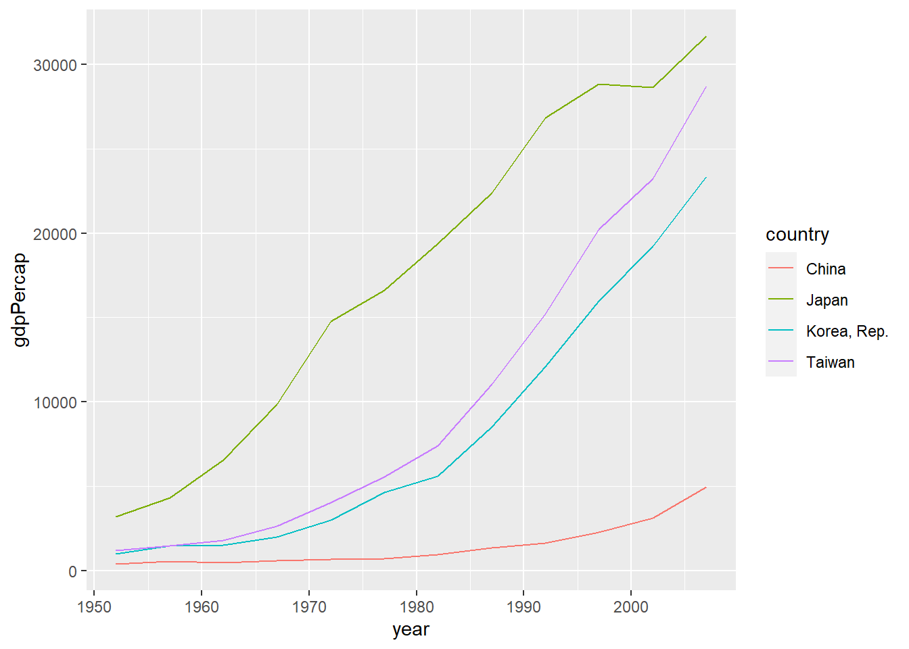


```r
library(ggplot2)
library(gapminder)

hist_plot <- ggplot(gapminder_2007, aes(x = gdpPercap)) +
  geom_histogram()
hist_plot
```

```
## `stat_bin()` using `bins = 30`. Pick better value with `binwidth`.
```


```r
hist_plot <- ggplot(gapminder_2007, aes(x = gdpPercap)) +
  geom_histogram(bins = 20)
hist_plot
```


```r
library(ggplot2)
library(gapminder)

box_plot <- ggplot(gapminder_2007, aes(x = continent, y = gdpPercap)) +
  geom_boxplot()
box_plot
```


```r
library(ggplot2)
library(gapminder)

gdpPercap_2007_na <- gapminder %>%
  filter(year == 2007 & country %in% c("China", "Japan", "Taiwan", "Korea, Rep."))
bar_plot <- ggplot(gdpPercap_2007_na, aes(x = country, y = gdpPercap)) +
  geom_bar(stat = "identity")
bar_plot
```


### loop

https://bookdown.org/tonykuoyj/eloquentr/for.html


```r
month.name
```

```
##  [1] "January"   "February"  "March"     "April"     "May"       "June"     
##  [7] "July"      "August"    "September" "October"   "November"  "December"
```


```r
month.name[1]
```

```
## [1] "January"
```


```r
for (month in month.name) {
  print(month)
}
```

```
## [1] "January"
## [1] "February"
## [1] "March"
## [1] "April"
## [1] "May"
## [1] "June"
## [1] "July"
## [1] "August"
## [1] "September"
## [1] "October"
## [1] "November"
## [1] "December"
```

### variable type

https://bookdown.org/tonykuoyj/eloquentr/variable-types.html

https://www.w3schools.com/r/r_data_types.asp

- numeric
- integer
- complex =  complex number
- character
- logical = boolean


```r
class(2L)
```

```
## [1] "integer"
```

```r
class(2.0L)
```

```
## [1] "integer"
```

```r
class(2.3L)
```

```
## [1] "numeric"
```
time: POSIXct POSIXt

```r
class(Sys.time())
```

```
## [1] "POSIXct" "POSIXt"
```


```r
0 %in% -5:5
```

```
## [1] TRUE
```
#### date

1970-01-01 = 0L


```r
date_of_origin <- as.Date("1970-01-01")
as.integer(date_of_origin)
```

```
## [1] 0
```
check if type of `x` is `Date`

`inherits(x, what = "Date")`

convert `character` to `Date`

`as.Date("01-01-1970", format = "%m-%d-%Y")`

#### time

1970-01-01 00:00:00 GMT = 0L

tz = time zone


```r
time_of_origin <- as.POSIXct("1970-01-01 00:00:00", tz = "GMT")
as.integer(time_of_origin)
```

```
## [1] 0
```
check if type of `x` is time

`inherits(x, what = "POSIXct")`

convert `character` to time

`as.POSIXct("1970-01-01 00:00:00", tz = "GMT")`


#### quotient `%/%` operator

https://www.w3schools.com/r/r_operators.asp


```r
7 %/% 3
```

```
## [1] 2
```

### data type

https://bookdown.org/tonykuoyj/eloquentr/vector-factor.html

- 1D
  - [vector]^[\@ref(vector)]^
  - [factor]^[\@ref(factor)]^
- 2D
  - [matrix]^[\@ref(matrix)]^
  - [data frame]^[\@ref(data-frame)]^
- $n$D
  - [array]^[\@ref(array)]^
  - [list]^[\@ref(list)]^
  
#### vector


```r
four_seasons <- c("spring", "summer", "autumn", "winter")
four_seasons
```

```
## [1] "spring" "summer" "autumn" "winter"
```

```r
favorite_season <- four_seasons[3]
favorite_season
```

```
## [1] "autumn"
```

```r
favorite_seasons <- four_seasons[c(-2, -4)]
favorite_seasons
```

```
## [1] "spring" "autumn"
```

only one variable type for a vector


```r
lucky_numbers <- c(7L, 24)
class(lucky_numbers[1])
```

```
## [1] "numeric"
```


```r
lucky_numbers <- c(7L, FALSE)
lucky_numbers
```

```
## [1] 7 0
```

```r
class(lucky_numbers[2])
```

```
## [1] "integer"
```


```r
mixed_vars <- c(TRUE, 7L, 24, "spring")
mixed_vars
```

```
## [1] "TRUE"   "7"      "24"     "spring"
```

```r
class(mixed_vars[1])
```

```
## [1] "character"
```

```r
class(mixed_vars[2])
```

```
## [1] "character"
```

```r
class(mixed_vars[3])
```

```
## [1] "character"
```

##### logic


```r
four_seasons <- c("spring", "summer", "autumn", "winter")
my_favorite_seasons <- four_seasons == "spring" | four_seasons == "autumn"
four_seasons[my_favorite_seasons]
```

```
## [1] "spring" "autumn"
```

##### `rep` repeat


```r
rep(7L, times = 8)
```

```
## [1] 7 7 7 7 7 7 7 7
```


```r
rep("R", times = 10)
```

```
##  [1] "R" "R" "R" "R" "R" "R" "R" "R" "R" "R"
```
##### `seq` sequence


```r
seq(from = 7, to = 77, by = 7)
```

```
##  [1]  7 14 21 28 35 42 49 56 63 70 77
```


```r
11:20
```

```
##  [1] 11 12 13 14 15 16 17 18 19 20
```

#### factor

https://bookdown.org/tonykuoyj/eloquentr/vector-factor.html#factor


```r
four_seasons <- c("spring", "summer", "autumn", "winter")
four_seasons
```

```
## [1] "spring" "summer" "autumn" "winter"
```


```r
four_seasons_factor <- factor(four_seasons)
four_seasons_factor
```

```
## [1] spring summer autumn winter
## Levels: autumn spring summer winter
```


```r
four_seasons <- c("spring", "summer", "autumn", "winter")
four_seasons_factor <- factor(four_seasons, ordered = TRUE, levels = c("summer", "winter", "spring", "autumn"))
four_seasons_factor
```

```
## [1] spring summer autumn winter
## Levels: summer < winter < spring < autumn
```


```r
temperatures <- c("warm", "hot", "cold")
temp_factors <- factor(temperatures, ordered = TRUE, levels = c("cold", "warm", "hot"))
temp_factors
```

```
## [1] warm hot  cold
## Levels: cold < warm < hot
```
if no levels specified, the levels will be specified alphabetically, sometimes not really true


```r
temperatures <- c("warm", "hot", "cold")
temp_factors <- factor(temperatures, ordered = TRUE)
temp_factors
```

```
## [1] warm hot  cold
## Levels: cold < hot < warm
```
#### matrix

https://bookdown.org/tonykuoyj/eloquentr/matrix-dataframe-more.html


```r
my_mat <- matrix(1:6, nrow = 2)
my_mat
```

```
##      [,1] [,2] [,3]
## [1,]    1    3    5
## [2,]    2    4    6
```

```r
class(my_mat)
```

```
## [1] "matrix" "array"
```


```r
my_mat2 <- matrix(1:6, nrow = 2, byrow = TRUE)
my_mat2
```

```
##      [,1] [,2] [,3]
## [1,]    1    2    3
## [2,]    4    5    6
```


```r
my_mat2[2, 3]
```

```
## [1] 6
```


```r
my_mat2[2, ]
```

```
## [1] 4 5 6
```


```r
my_mat2[, 3]
```

```
## [1] 3 6
```


```r
filter <- my_mat2 < 6 & my_mat2 > 1
my_mat2[filter]
```

```
## [1] 4 2 5 3
```
boolean will become value in a matrix, like vector


```r
my_mat3 <- matrix(c(1, 2, TRUE, FALSE, 3, 4), nrow = 2)
my_mat3
```

```
##      [,1] [,2] [,3]
## [1,]    1    1    3
## [2,]    2    0    4
```


```r
class(my_mat3[, 2])
```

```
## [1] "numeric"
```
#### data frame

- variable: column
- observation: row
- value: cell

::: {show-in="html"}
<center>

</center>
:::


```r
team_name <- c("Chicago Bulls", "Golden State Warriors")
wins <- c(72, 73)
losses <- c(10, 9)
is_champion <- c(TRUE, FALSE)
season <- c("1995-96", "2015-16")

great_nba_teams <- data.frame(team_name, wins, losses, is_champion, season)
great_nba_teams
```

```
##               team_name wins losses is_champion  season
## 1         Chicago Bulls   72     10        TRUE 1995-96
## 2 Golden State Warriors   73      9       FALSE 2015-16
```


```r
great_nba_teams[1, 1]
```

```
## [1] "Chicago Bulls"
```


```r
great_nba_teams[1, ]
```

```
##       team_name wins losses is_champion  season
## 1 Chicago Bulls   72     10        TRUE 1995-96
```


```r
great_nba_teams[, 1]
```

```
## [1] "Chicago Bulls"         "Golden State Warriors"
```
`stringsAsFactors = TRUE`


```r
team_name <- c("Chicago Bulls", "Golden State Warriors")
wins <- c(72, 73)
losses <- c(10, 9)
is_champion <- c(TRUE, FALSE)
season <- c("1995-96", "2015-16")
 
great_nba_teams <- data.frame(team_name, wins, losses, is_champion, season, stringsAsFactors = TRUE)
great_nba_teams[, 1]
```

```
## [1] Chicago Bulls         Golden State Warriors
## Levels: Chicago Bulls Golden State Warriors
```

`stringsAsFactors = FALSE`


```r
team_name <- c("Chicago Bulls", "Golden State Warriors")
wins <- c(72, 73)
losses <- c(10, 9)
is_champion <- c(TRUE, FALSE)
season <- c("1995-96", "2015-16")
 
great_nba_teams <- data.frame(team_name, wins, losses, is_champion, season, stringsAsFactors = FALSE)
great_nba_teams[, 1]
```

```
## [1] "Chicago Bulls"         "Golden State Warriors"
```
##### selecting variable or column


```r
great_nba_teams$team_name
```

```
## [1] "Chicago Bulls"         "Golden State Warriors"
```


```r
great_nba_teams[, "team_name"]
```

```
## [1] "Chicago Bulls"         "Golden State Warriors"
```
##### filtering observation or row


```r
filter <- great_nba_teams$is_champion == TRUE
great_nba_teams[filter, ]
```

```
##       team_name wins losses is_champion  season
## 1 Chicago Bulls   72     10        TRUE 1995-96
```

##### check mixed data type


```r
str(great_nba_teams)
```

```
## 'data.frame':	2 obs. of  5 variables:
##  $ team_name  : chr  "Chicago Bulls" "Golden State Warriors"
##  $ wins       : num  72 73
##  $ losses     : num  10 9
##  $ is_champion: logi  TRUE FALSE
##  $ season     : chr  "1995-96" "2015-16"
```

## W3School

https://www.w3schools.com/r/default.asp

### same multiple variable

https://www.w3schools.com/r/r_variables_multiple.asp


```r
# Assign the same value to multiple variables in one line
var1 <- var2 <- var3 <- "Orange"

# Print variable values
var1
```

```
## [1] "Orange"
```

```r
var2
```

```
## [1] "Orange"
```

```r
var3
```

```
## [1] "Orange"
```
### legal variable name

https://www.w3schools.com/r/r_variables_name.asp


```r
# Legal variable names:
myvar <- "John"
my_var <- "John"
myVar <- "John"
MYVAR <- "John"
myvar2 <- "John"
.myvar <- "John"

## Illegal variable names:
# 2myvar <- "John"
# my-var <- "John"
# my var <- "John"
# _my_var <- "John"
# my_v@ar <- "John"
# TRUE <- "John"
```
### complex number

https://www.w3schools.com/r/r_data_types.asp

https://www.w3schools.com/r/r_numbers.asp

### escape character

https://www.w3schools.com/r/r_strings_esc.asp

### global assignment `<<-`


```r
my_function <- function() {
txt <<- "fantastic"
  paste("R is", txt)
}

my_function()
```

```
## [1] "R is fantastic"
```

```r
print(txt)
```

```
## [1] "fantastic"
```


```r
txt <- "awesome"
my_function <- function() {
  txt <<- "fantastic"
  paste("R is", txt)
}

my_function()
```

```
## [1] "R is fantastic"
```

```r
paste("R is", txt)
```

```
## [1] "R is fantastic"
```
### data type

#### array

https://www.w3schools.com/r/r_arrays.asp


```r
# An array with one dimension with values ranging from 1 to 24
thisarray <- c(1:24)
thisarray
```

```
##  [1]  1  2  3  4  5  6  7  8  9 10 11 12 13 14 15 16 17 18 19 20 21 22 23 24
```

```r
# An array with more than one dimension
multiarray <- array(thisarray, dim = c(4, 3, 2))
multiarray
```

```
## , , 1
## 
##      [,1] [,2] [,3]
## [1,]    1    5    9
## [2,]    2    6   10
## [3,]    3    7   11
## [4,]    4    8   12
## 
## , , 2
## 
##      [,1] [,2] [,3]
## [1,]   13   17   21
## [2,]   14   18   22
## [3,]   15   19   23
## [4,]   16   20   24
```


```r
multiarray[2, 3, 2]
```

```
## [1] 22
```

#### list

https://www.w3schools.com/r/r_lists.asp

## Apan Liao

::: {show-in="html"}

R 演習室

:::

::: {show-in="pdf"}

\begin{CJK}{UTF8}{bsmi}
R 演習室
\end{CJK}

:::

https://www.youtube.com/playlist?list=PL5AC0ADBF65924EAD

### data input

https://www.youtube.com/watch?v=STcIxf_vUWY&list=PL5AC0ADBF65924EAD&index=1

- `scan()`
- read
  - `read.table()`
  - `read.csv()`
  
### descriptive statistics

https://www.youtube.com/watch?v=GL3Wv_45LaU&list=PL5AC0ADBF65924EAD&index=2

<!--chapter:end:202402211401-R.Rmd-->

# Laplace transform

https://www.youtube.com/watch?v=lg90shB1TrU

::: {show-in="html"}
<iframe width=500 height=300 frameborder="0" allowfullscreen src="https://www.youtube.com/embed/lg90shB1TrU"></iframe>
:::

https://www.youtube.com/watch?v=WEkuV55B4q4

::: {show-in="html"}
<iframe width=500 height=300 frameborder="0" allowfullscreen src="https://www.youtube.com/embed/WEkuV55B4q4"></iframe>
:::

<!--chapter:end:202402221300-Laplace-transform.Rmd-->

# conic section

::: {show-in="html"}
conic section 圓錐曲線 / 圓錐截痕
:::

::: {show-in="pdf"}
```{=tex}
\begin{CJK}{UTF8}{bsmi}
conic section 圓錐曲線 / 圓錐截痕
\end{CJK}
```
:::

<https://en.wikipedia.org/wiki/Conic_section>

<https://tex.stackexchange.com/questions/222882/drawing-minimal-xy-axis>

<div class="figure">

<p class="caption">(\#fig:unnamed-chunk-1)parabola defined by focus, directrix, eccentricity</p>
</div>

## Cartesian coordinate: focus, directrix, eccentricity

::: {show-in="html"}
focus, directrix, eccentricity 焦點, 準線, 離心率
:::

::: {show-in="pdf"}
```{=tex}
\begin{CJK}{UTF8}{bsmi}
focus, directrix, eccentricity 焦點, 準線, 離心率
\end{CJK}
```
:::

$$
\begin{cases}
F=\left(0,y_{{\scriptscriptstyle F}}\right) & F:\text{focus}\\
L=y-y_{{\scriptscriptstyle L}}=0 & L:\text{directrix}\\
\epsilon=\dfrac{\overline{PF}}{d\left(P,L\right)}=\dfrac{\left\Vert \left(x,y\right)-\left(0,y_{{\scriptscriptstyle F}}\right)\right\Vert }{\left\Vert y-y_{{\scriptscriptstyle L}}\right\Vert } & \begin{cases}
P=\left(x,y\right)\\
\epsilon:\text{eccentricity}
\end{cases}
\end{cases}
$$

::: {show-in="html"}
$$
\require{color}
\begin{align}
0\le\epsilon=\dfrac{\overline{PF}}{d\left(P,L\right)}=\dfrac{\overline{PF}}{\overline{PP^{\prime}}}= & \dfrac{\left\Vert \left(x,y\right)-\left(0,y_{{\scriptscriptstyle F}}\right)\right\Vert }{\left\Vert \left(x,y\right)-\left(x,y_{{\scriptscriptstyle L}}\right)\right\Vert }=\dfrac{\left\Vert \left(x,y-y_{{\scriptscriptstyle F}}\right)\right\Vert }{\left\Vert \left(0,y-y_{{\scriptscriptstyle L}}\right)\right\Vert } =  \dfrac{\sqrt{x^{2}+\left(y-y_{{\scriptscriptstyle F}}\right)^{2}}}{\sqrt{\left(y-y_{{\scriptscriptstyle L}}\right)^{2}}} (\#eq:eccentricity)\\
\epsilon^{2}= & \dfrac{x^{2}+\left(y-y_{{\scriptscriptstyle F}}\right)^{2}}{\left(y-y_{{\scriptscriptstyle L}}\right)^{2}}=\dfrac{x^{2}+y^{2}-2y_{{\scriptscriptstyle F}}y+y_{{\scriptscriptstyle F}}^{2}}{y^{2}-2y_{{\scriptscriptstyle L}}y+y_{{\scriptscriptstyle L}}^{2}}\\
0= & x^{2}+\left(1-\epsilon^{2}\right)y^{2}-2\left(y_{{\scriptscriptstyle F}}-\epsilon^{2}y_{{\scriptscriptstyle L}}\right)y+\left(y_{{\scriptscriptstyle F}}^{2}-\epsilon^{2}y_{{\scriptscriptstyle L}}^{2}\right)\\
\overset{\epsilon\ne1}{=} & x^{2}+\left(1-\epsilon^{2}\right)\left[y^{2}-\dfrac{2\left(y_{{\scriptscriptstyle F}}-\epsilon^{2}y_{{\scriptscriptstyle L}}\right)}{1-\epsilon^{2}}y+\dfrac{y_{{\scriptscriptstyle F}}^{2}-\epsilon^{2}y_{{\scriptscriptstyle L}}^{2}}{1-\epsilon^{2}}\right]\\
= & x^{2}+\left(1-\epsilon^{2}\right)\\
 & \left[y^{2}-\dfrac{2\left(y_{{\scriptscriptstyle F}}-\epsilon^{2}y_{{\scriptscriptstyle L}}\right)}{1-\epsilon^{2}}y+\left(\dfrac{y_{{\scriptscriptstyle F}}-\epsilon^{2}y_{{\scriptscriptstyle L}}}{1-\epsilon^{2}}\right)^{2}-\left(\dfrac{y_{{\scriptscriptstyle F}}-\epsilon^{2}y_{{\scriptscriptstyle L}}}{1-\epsilon^{2}}\right)^{2}+\dfrac{y_{{\scriptscriptstyle F}}^{2}-\epsilon^{2}y_{{\scriptscriptstyle L}}^{2}}{1-\epsilon^{2}}\right]\\
= & x^{2}+\left(1-\epsilon^{2}\right)\left[\left(y-\dfrac{y_{{\scriptscriptstyle F}}-\epsilon^{2}y_{{\scriptscriptstyle L}}}{1-\epsilon^{2}}\right)^{2}+\dfrac{\left(y_{{\scriptscriptstyle F}}^{2}-\epsilon^{2}y_{{\scriptscriptstyle L}}^{2}\right)\left(1-\epsilon^{2}\right)-\left(y_{{\scriptscriptstyle F}}-\epsilon^{2}y_{{\scriptscriptstyle L}}\right)^{2}}{\left(1-\epsilon^{2}\right)^{2}}\right]\\
= & x^{2}+\left(1-\epsilon^{2}\right)\left(y-\dfrac{y_{{\scriptscriptstyle F}}-\epsilon^{2}y_{{\scriptscriptstyle L}}}{1-\epsilon^{2}}\right)^{2}+\dfrac{\colorbox{#FFFF66}{$\left(y_{{\scriptscriptstyle F}}^{2}-\epsilon^{2}y_{{\scriptscriptstyle L}}^{2}\right)\left(1-\epsilon^{2}\right)-\left(y_{{\scriptscriptstyle F}}-\epsilon^{2}y_{{\scriptscriptstyle L}}\right)^{2}$}}{1-\epsilon^{2}}
\end{align}
$$
:::

::: {show-in="pdf"}
```{=tex}
\begin{align}
0\le\epsilon=\dfrac{\overline{PF}}{d\left(P,L\right)}=\dfrac{\overline{PF}}{\overline{PP^{\prime}}}= & \dfrac{\left\Vert \left(x,y\right)-\left(0,y_{{\scriptscriptstyle F}}\right)\right\Vert }{\left\Vert \left(x,y\right)-\left(x,y_{{\scriptscriptstyle L}}\right)\right\Vert }=\dfrac{\left\Vert \left(x,y-y_{{\scriptscriptstyle F}}\right)\right\Vert }{\left\Vert \left(0,y-y_{{\scriptscriptstyle L}}\right)\right\Vert }=\dfrac{\sqrt{x^{2}+\left(y-y_{{\scriptscriptstyle F}}\right)^{2}}}{\sqrt{\left(y-y_{{\scriptscriptstyle L}}\right)^{2}}} (\#eq:eccentricity)\\
\epsilon^{2}= & \dfrac{x^{2}+\left(y-y_{{\scriptscriptstyle F}}\right)^{2}}{\left(y-y_{{\scriptscriptstyle L}}\right)^{2}}=\dfrac{x^{2}+y^{2}-2y_{{\scriptscriptstyle F}}y+y_{{\scriptscriptstyle F}}^{2}}{y^{2}-2y_{{\scriptscriptstyle L}}y+y_{{\scriptscriptstyle L}}^{2}}\\
0= & x^{2}+\left(1-\epsilon^{2}\right)y^{2}-2\left(y_{{\scriptscriptstyle F}}-\epsilon^{2}y_{{\scriptscriptstyle L}}\right)y+\left(y_{{\scriptscriptstyle F}}^{2}-\epsilon^{2}y_{{\scriptscriptstyle L}}^{2}\right)\\
\overset{\epsilon\ne1}{=} & x^{2}+\left(1-\epsilon^{2}\right)\left[y^{2}-\dfrac{2\left(y_{{\scriptscriptstyle F}}-\epsilon^{2}y_{{\scriptscriptstyle L}}\right)}{1-\epsilon^{2}}y+\dfrac{y_{{\scriptscriptstyle F}}^{2}-\epsilon^{2}y_{{\scriptscriptstyle L}}^{2}}{1-\epsilon^{2}}\right]\\
= & x^{2}+\left(1-\epsilon^{2}\right)\\
 & \left[y^{2}-\dfrac{2\left(y_{{\scriptscriptstyle F}}-\epsilon^{2}y_{{\scriptscriptstyle L}}\right)}{1-\epsilon^{2}}y+\left(\dfrac{y_{{\scriptscriptstyle F}}-\epsilon^{2}y_{{\scriptscriptstyle L}}}{1-\epsilon^{2}}\right)^{2}-\left(\dfrac{y_{{\scriptscriptstyle F}}-\epsilon^{2}y_{{\scriptscriptstyle L}}}{1-\epsilon^{2}}\right)^{2}+\dfrac{y_{{\scriptscriptstyle F}}^{2}-\epsilon^{2}y_{{\scriptscriptstyle L}}^{2}}{1-\epsilon^{2}}\right]\\
= & x^{2}+\left(1-\epsilon^{2}\right)\left[\left(y-\dfrac{y_{{\scriptscriptstyle F}}-\epsilon^{2}y_{{\scriptscriptstyle L}}}{1-\epsilon^{2}}\right)^{2}+\dfrac{\left(y_{{\scriptscriptstyle F}}^{2}-\epsilon^{2}y_{{\scriptscriptstyle L}}^{2}\right)\left(1-\epsilon^{2}\right)-\left(y_{{\scriptscriptstyle F}}-\epsilon^{2}y_{{\scriptscriptstyle L}}\right)^{2}}{\left(1-\epsilon^{2}\right)^{2}}\right]\\
= & x^{2}+\left(1-\epsilon^{2}\right)\left(y-\dfrac{y_{{\scriptscriptstyle F}}-\epsilon^{2}y_{{\scriptscriptstyle L}}}{1-\epsilon^{2}}\right)^{2}+\dfrac{\colorbox{yellow!50}{\text{\ensuremath{\left(y_{{\scriptscriptstyle F}}^{2}-\epsilon^{2}y_{{\scriptscriptstyle L}}^{2}\right)\left(1-\epsilon^{2}\right)}-\ensuremath{\left(y_{{\scriptscriptstyle F}}-\epsilon^{2}y_{{\scriptscriptstyle L}}\right)^{2}}}}}{1-\epsilon^{2}}
\end{align}
```
:::

::: {show-in="html"}
$$
\require{color}
\begin{aligned}
 & \colorbox{#FFFF66}{$\left(y_{{\scriptscriptstyle F}}^{2}-\epsilon^{2}y_{{\scriptscriptstyle L}}^{2}\right)\left(1-\epsilon^{2}\right)-\left(y_{{\scriptscriptstyle F}}-\epsilon^{2}y_{{\scriptscriptstyle L}}\right)^{2}$}\\
= & \left(1-\epsilon^{2}\right)y_{{\scriptscriptstyle F}}^{2}-\left(\epsilon^{2}-\epsilon^{4}\right)y_{{\scriptscriptstyle L}}^{2}-y_{{\scriptscriptstyle F}}^{2}+2\epsilon^{2}y_{{\scriptscriptstyle F}}y_{{\scriptscriptstyle L}}-\epsilon^{4}y_{{\scriptscriptstyle L}}^{2}\\
= & \left(1-\epsilon^{2}\right)y_{{\scriptscriptstyle F}}^{2}-\left(\epsilon^{2}-\epsilon^{4}\right)y_{{\scriptscriptstyle L}}^{2}-y_{{\scriptscriptstyle F}}^{2}+2\epsilon^{2}y_{{\scriptscriptstyle F}}y_{{\scriptscriptstyle L}}-\epsilon^{4}y_{{\scriptscriptstyle L}}^{2}\\
= & -\epsilon^{2}y_{{\scriptscriptstyle F}}^{2}-\epsilon^{2}y_{{\scriptscriptstyle L}}^{2}+2\epsilon^{2}y_{{\scriptscriptstyle F}}y_{{\scriptscriptstyle L}}=-\colorbox{#FFD1DC}{$\epsilon^{2}\left(y_{{\scriptscriptstyle F}}-y_{{\scriptscriptstyle L}}\right)^{2}$}
\end{aligned}
$$
:::

::: {show-in="pdf"}
$$
\begin{aligned}
 & \colorbox{yellow!50}{\text{\ensuremath{\left(y_{{\scriptscriptstyle F}}^{2}-\epsilon^{2}y_{{\scriptscriptstyle L}}^{2}\right)\left(1-\epsilon^{2}\right)}-\ensuremath{\left(y_{{\scriptscriptstyle F}}-\epsilon^{2}y_{{\scriptscriptstyle L}}\right)^{2}}}}\\
= & \left(1-\epsilon^{2}\right)y_{{\scriptscriptstyle F}}^{2}-\left(\epsilon^{2}-\epsilon^{4}\right)y_{{\scriptscriptstyle L}}^{2}-y_{{\scriptscriptstyle F}}^{2}+2\epsilon^{2}y_{{\scriptscriptstyle F}}y_{{\scriptscriptstyle L}}-\epsilon^{4}y_{{\scriptscriptstyle L}}^{2}\\
= & -\epsilon^{2}y_{{\scriptscriptstyle F}}^{2}-\epsilon^{2}y_{{\scriptscriptstyle L}}^{2}+2\epsilon^{2}y_{{\scriptscriptstyle F}}y_{{\scriptscriptstyle L}}=-\colorbox{red!50}{\text{\ensuremath{\epsilon^{2}\left(y_{{\scriptscriptstyle F}}-y_{{\scriptscriptstyle L}}\right)^{2}}}}
\end{aligned}
$$
:::

::: {show-in="html"}
$$
\begin{aligned}
\dfrac{\colorbox{#FFD1DC}{$\epsilon^{2}\left(y_{{\scriptscriptstyle F}}-y_{{\scriptscriptstyle L}}\right)^{2}$}}{1-\epsilon^{2}}\overset{\epsilon\ne1}{=} & x^{2}+\left(1-\epsilon^{2}\right)\left(y-\dfrac{y_{{\scriptscriptstyle F}}-\epsilon^{2}y_{{\scriptscriptstyle L}}}{1-\epsilon^{2}}\right)^{2}\\
1\overset{\epsilon\ne0,1}{=} & \begin{cases}
\left(\dfrac{x-0}{\dfrac{\epsilon\left(y_{{\scriptscriptstyle F}}-y_{{\scriptscriptstyle L}}\right)}{\sqrt{1-\epsilon^{2}}}}\right)^{2}+\left(\dfrac{y-\dfrac{y_{{\scriptscriptstyle F}}-\epsilon^{2}y_{{\scriptscriptstyle L}}}{1-\epsilon^{2}}}{\dfrac{\epsilon\left(y_{{\scriptscriptstyle F}}-y_{{\scriptscriptstyle L}}\right)}{1-\epsilon^{2}}}\right)^{2} & 1-\epsilon^{2}>0\overset{\epsilon\ge0}{\Rightarrow}0<\epsilon<1\\
-\left(\dfrac{x-0}{\dfrac{\epsilon\left(y_{{\scriptscriptstyle F}}-y_{{\scriptscriptstyle L}}\right)}{\sqrt{\epsilon^{2}-1}}}\right)^{2}+\left(\dfrac{y-\dfrac{y_{{\scriptscriptstyle F}}-\epsilon^{2}y_{{\scriptscriptstyle L}}}{1-\epsilon^{2}}}{\dfrac{\epsilon\left(y_{{\scriptscriptstyle F}}-y_{{\scriptscriptstyle L}}\right)}{1-\epsilon^{2}}}\right)^{2} & 1-\epsilon^{2}<0\overset{\epsilon\ge0}{\Rightarrow}\epsilon>1
\end{cases}
\end{aligned}
$$
:::

::: {show-in="pdf"}
$$
\begin{aligned}
\dfrac{\colorbox{red!50}{\text{\ensuremath{\epsilon^{2}\left(y_{{\scriptscriptstyle F}}-y_{{\scriptscriptstyle L}}\right)^{2}}}}}{1-\epsilon^{2}}\overset{\epsilon\ne1}{=} & x^{2}+\left(1-\epsilon^{2}\right)\left(y-\dfrac{y_{{\scriptscriptstyle F}}-\epsilon^{2}y_{{\scriptscriptstyle L}}}{1-\epsilon^{2}}\right)^{2}\\
1\overset{\epsilon\ne0,1}{=} & \begin{cases}
\left(\dfrac{x-0}{\dfrac{\epsilon\left(y_{{\scriptscriptstyle F}}-y_{{\scriptscriptstyle L}}\right)}{\sqrt{1-\epsilon^{2}}}}\right)^{2}+\left(\dfrac{y-\dfrac{y_{{\scriptscriptstyle F}}-\epsilon^{2}y_{{\scriptscriptstyle L}}}{1-\epsilon^{2}}}{\dfrac{\epsilon\left(y_{{\scriptscriptstyle F}}-y_{{\scriptscriptstyle L}}\right)}{1-\epsilon^{2}}}\right)^{2} & 1-\epsilon^{2}>0\overset{\epsilon\ge0}{\Rightarrow}0<\epsilon<1\\
-\left(\dfrac{x-0}{\dfrac{\epsilon\left(y_{{\scriptscriptstyle F}}-y_{{\scriptscriptstyle L}}\right)}{\sqrt{\epsilon^{2}-1}}}\right)^{2}+\left(\dfrac{y-\dfrac{y_{{\scriptscriptstyle F}}-\epsilon^{2}y_{{\scriptscriptstyle L}}}{1-\epsilon^{2}}}{\dfrac{\epsilon\left(y_{{\scriptscriptstyle F}}-y_{{\scriptscriptstyle L}}\right)}{1-\epsilon^{2}}}\right)^{2} & 1-\epsilon^{2}<0\overset{\epsilon\ge0}{\Rightarrow}\epsilon>1
\end{cases}
\end{aligned}
$$
:::

$\epsilon=0$ or $\lim\limits _{\left|y_{L}\right|\rightarrow\infty}\epsilon=0$

$$
r=\overline{PF}=\left\Vert \left(x,y\right)-\left(0,y_{{\scriptscriptstyle F}}\right)\right\Vert =\left\Vert \left(x,y-y_{{\scriptscriptstyle F}}\right)\right\Vert =\sqrt{x^{2}+\left(y-y_{{\scriptscriptstyle F}}\right)^{2}}
$$

$$
\epsilon=\dfrac{r}{d\left(P,L\right)}=\dfrac{\overline{PF}}{\overline{PP^{\prime}}}=\dfrac{\left\Vert \left(x,y\right)-\left(0,y_{{\scriptscriptstyle F}}\right)\right\Vert }{\left\Vert \left(x,y\right)-\left(x,y_{{\scriptscriptstyle L}}\right)\right\Vert }=\dfrac{\left\Vert \left(x,y-y_{{\scriptscriptstyle F}}\right)\right\Vert }{\left\Vert \left(0,y-y_{{\scriptscriptstyle L}}\right)\right\Vert }=\dfrac{\sqrt{x^{2}+\left(y-y_{{\scriptscriptstyle F}}\right)^{2}}}{\left|y-y_{{\scriptscriptstyle L}}\right|}
$$

$$
\lim_{\left|y_{L}\right|\rightarrow\infty}\epsilon=\lim_{\left|y_{L}\right|\rightarrow\infty}\dfrac{r}{d\left(P,L\right)}=\lim_{\left|y_{L}\right|\rightarrow\infty}\dfrac{\sqrt{x^{2}+\left(y-y_{{\scriptscriptstyle F}}\right)^{2}}}{\left|y-y_{{\scriptscriptstyle L}}\right|}=0
$$

$\epsilon=1$

$$
\begin{aligned}
0= & x^{2}+\left(1-\epsilon^{2}\right)y^{2}-2\left(y_{{\scriptscriptstyle F}}-\epsilon^{2}y_{{\scriptscriptstyle L}}\right)y+\left(y_{{\scriptscriptstyle F}}^{2}-\epsilon^{2}y_{{\scriptscriptstyle L}}^{2}\right)\\
\overset{\epsilon=1}{=} & x^{2}+\left(1-1^{2}\right)y^{2}-2\left(y_{{\scriptscriptstyle F}}-1^{2}y_{{\scriptscriptstyle L}}\right)y+\left(y_{{\scriptscriptstyle F}}^{2}-1^{2}y_{{\scriptscriptstyle L}}^{2}\right)\\
= & x^{2}-2\left(y_{{\scriptscriptstyle F}}-y_{{\scriptscriptstyle L}}\right)y+\left(y_{{\scriptscriptstyle F}}^{2}-y_{{\scriptscriptstyle L}}^{2}\right)\\
= & x^{2}-2\left(y_{{\scriptscriptstyle F}}-y_{{\scriptscriptstyle L}}\right)y+\left(y_{{\scriptscriptstyle F}}+y_{{\scriptscriptstyle L}}\right)\left(y_{{\scriptscriptstyle F}}-y_{{\scriptscriptstyle L}}\right)\\
x^{2}= & 2\left(y_{{\scriptscriptstyle F}}-y_{{\scriptscriptstyle L}}\right)\left(y-\dfrac{y_{{\scriptscriptstyle F}}+y_{{\scriptscriptstyle L}}}{2}\right)
\end{aligned}
$$

Let one curve vertex $P=V=\left(0,0\right)$ on the curve, and fix the directrix $L$ or $y_{{\scriptscriptstyle L}}$,

$\epsilon\ne1$ $$
\begin{aligned}
 & 1\overset{P\left(x,y\right)=V\left(0,0\right)}{=}0+\left(\dfrac{0-\dfrac{y_{{\scriptscriptstyle F}}-\epsilon^{2}y_{{\scriptscriptstyle L}}}{1-\epsilon^{2}}}{\dfrac{\epsilon\left(y_{{\scriptscriptstyle F}}-y_{{\scriptscriptstyle L}}\right)}{1-\epsilon^{2}}}\right)^{2}\\
\Rightarrow & y_{{\scriptscriptstyle F}}-\epsilon^{2}y_{{\scriptscriptstyle L}}=\pm\epsilon\left(y_{{\scriptscriptstyle F}}-y_{{\scriptscriptstyle L}}\right)\\
\Rightarrow & \begin{cases}
\left(1-\epsilon\right)y_{{\scriptscriptstyle F}}=\epsilon\left(\epsilon-1\right)y_{{\scriptscriptstyle L}} & +\\
\left(1+\epsilon\right)y_{{\scriptscriptstyle F}}=\epsilon\left(\epsilon+1\right)y_{{\scriptscriptstyle L}} & -
\end{cases}\\
\Rightarrow & y_{{\scriptscriptstyle F}}=\begin{cases}
-\epsilon y_{{\scriptscriptstyle L}} & +\\
\epsilon y_{{\scriptscriptstyle L}} & -
\end{cases}
\end{aligned}
$$

$\epsilon=1$ $$
\begin{aligned}
 & x^{2}=2\left(y_{{\scriptscriptstyle F}}-y_{{\scriptscriptstyle L}}\right)\left(y-\dfrac{y_{{\scriptscriptstyle F}}+y_{{\scriptscriptstyle L}}}{2}\right)\\
\overset{P\left(x,y\right)=V\left(0,0\right)}{\Rightarrow} & 0^{2}=2\left(y_{{\scriptscriptstyle F}}-y_{{\scriptscriptstyle L}}\right)\left(0-\dfrac{y_{{\scriptscriptstyle F}}+y_{{\scriptscriptstyle L}}}{2}\right)\\
\Rightarrow & 0=\left(y_{{\scriptscriptstyle F}}-y_{{\scriptscriptstyle L}}\right)\left(y_{{\scriptscriptstyle F}}+y_{{\scriptscriptstyle L}}\right)\\
\Rightarrow & y_{{\scriptscriptstyle F}}=\mp y_{{\scriptscriptstyle L}}
\end{aligned}
$$

or by definition of eccentricity \@ref(eq:eccentricity)

$$
\begin{aligned}
0\le\epsilon=\dfrac{\overline{PF}}{d\left(P,L\right)}=\dfrac{\overline{PF}}{\overline{PP^{\prime}}}= & \dfrac{\left\Vert \left(x,y\right)-\left(0,y_{{\scriptscriptstyle F}}\right)\right\Vert }{\left\Vert \left(x,y\right)-\left(x,y_{{\scriptscriptstyle L}}\right)\right\Vert }=\dfrac{\left\Vert \left(x,y-y_{{\scriptscriptstyle F}}\right)\right\Vert }{\left\Vert \left(0,y-y_{{\scriptscriptstyle L}}\right)\right\Vert }=\dfrac{\sqrt{x^{2}+\left(y-y_{{\scriptscriptstyle F}}\right)^{2}}}{\sqrt{\left(y-y_{{\scriptscriptstyle L}}\right)^{2}}}\\
 & \overset{P\left(x,y\right)=V\left(0,0\right)}{=}\dfrac{\sqrt{0^{2}+\left(0-y_{{\scriptscriptstyle F}}\right)^{2}}}{\sqrt{\left(0-y_{{\scriptscriptstyle L}}\right)^{2}}}=\sqrt{\left(\dfrac{y_{{\scriptscriptstyle F}}}{y_{{\scriptscriptstyle L}}}\right)^{2}}\\
\epsilon^{2}= & \left(\dfrac{y_{{\scriptscriptstyle F}}}{y_{{\scriptscriptstyle L}}}\right)^{2}\Rightarrow y_{{\scriptscriptstyle F}}=\mp\epsilon y_{{\scriptscriptstyle L}}
\end{aligned}
$$

actually,

$$
y_{{\scriptscriptstyle F}}=-\epsilon y_{{\scriptscriptstyle L}}
$$

## two-definition equivalence for ellipse and hyperbola

<https://math.stackexchange.com/questions/1833973/prove-that-the-directrix-focus-and-focus-focus-definitions-are-equivalent>

<https://www.geogebra.org/calculator/zkppuxwp>

::: {show-in="html"}
<iframe src="https://www.geogebra.org/calculator/qdd2yqhk?embed" width="600" height="450" allowfullscreen style="border: 1px solid #e4e4e4;border-radius: 4px;" frameborder="0">

</iframe>
:::


<div class="figure">

<p class="caption">(\#fig:unnamed-chunk-3)conic sections</p>
</div>

$$
\begin{cases}
P=\left(x,y\right)\\
F=\left(x_{{\scriptscriptstyle F}},y_{{\scriptscriptstyle F}}\right)=\left(\alpha,\varphi\right) & F^{\prime}=\left(x_{{\scriptscriptstyle F^{\prime}}},y_{{\scriptscriptstyle F^{\prime}}}\right)=\left(\chi,\psi\right)\\
L=A^{\prime}x+B^{\prime}y+C^{\prime}=0
\end{cases}
$$

### first definition for conic sections including ellipses and hyperbolas

[distance from a point to a line]^[\^^\@ref(distance-from-a-point-to-a-line)^\^]^

$$
0\le\epsilon=\dfrac{\overline{PF}}{d\left(P,L\right)}=\dfrac{\sqrt{\left(x-x_{{\scriptscriptstyle F}}\right)^{2}+\left(y-y_{{\scriptscriptstyle F}}\right)^{2}}}{\dfrac{\left|A^{\prime}x+B^{\prime}y+C^{\prime}\right|}{\sqrt{A^{\prime}{}^{2}+B^{\prime}{}^{2}}}}=\dfrac{\sqrt{\left(x-\alpha\right)^{2}+\left(y-\varphi\right)^{2}}}{\left|Ax+By+C\right|},\begin{cases}
A=\dfrac{A^{\prime}}{\sqrt{A^{\prime}{}^{2}+B^{\prime}{}^{2}}}\\
B=\dfrac{B^{\prime}}{\sqrt{A^{\prime}{}^{2}+B^{\prime}{}^{2}}}\\
C=\dfrac{C^{\prime}}{\sqrt{A^{\prime}{}^{2}+B^{\prime}{}^{2}}}
\end{cases}
$$

$$
A^{2}+B^{2}=\left(\dfrac{A^{\prime}}{\sqrt{A^{\prime}{}^{2}+B^{\prime}{}^{2}}}\right)^{2}+\left(\dfrac{B^{\prime}}{\sqrt{A^{\prime}{}^{2}+B^{\prime}{}^{2}}}\right)^{2}=1
$$

or allowing $\epsilon<0$ by squaring the definition

$$
\epsilon^{2}=\dfrac{\left(x-\alpha\right)^{2}+\left(y-\varphi\right)^{2}}{\left(Ax+By+C\right)^{2}}=\dfrac{\left(x-x_{{\scriptscriptstyle F}}\right)^{2}+\left(y-y_{{\scriptscriptstyle F}}\right)^{2}}{\dfrac{\left(A^{\prime}x+B^{\prime}y+C^{\prime}\right)^{2}}{A^{\prime}{}^{2}+B^{\prime}{}^{2}}}
$$

$$
\left(x-\alpha\right)^{2}+\left(y-\varphi\right)^{2}=\left[\epsilon\left(Ax+By+C\right)\right]^{2}
$$

### second definition for ellipses and hyperbolas

$$
\begin{aligned}
2c=\overline{FF^{\prime}}= & \left\Vert \left(x_{{\scriptscriptstyle F}},y_{{\scriptscriptstyle F}}\right)-\left(x_{{\scriptscriptstyle F^{\prime}}},y_{{\scriptscriptstyle F^{\prime}}}\right)\right\Vert =\left\Vert \left(\alpha,\varphi\right)-\left(\chi,\psi\right)\right\Vert \\
= & \sqrt{\left(\alpha-\chi\right)^{2}+\left(\chi-\psi\right)^{2}}
\end{aligned}
$$

$$
\begin{aligned}
D= & \begin{cases}
\sqrt{\left(x-x_{{\scriptscriptstyle F}}\right)^{2}+\left(y-y_{{\scriptscriptstyle F}}\right)^{2}}+\sqrt{\left(x-x_{{\scriptscriptstyle F^{\prime}}}\right)^{2}+\left(y-y_{{\scriptscriptstyle F^{\prime}}}\right)^{2}} & \text{ellipse}\\
\sqrt{\left(x-x_{{\scriptscriptstyle F}}\right)^{2}+\left(y-y_{{\scriptscriptstyle F}}\right)^{2}}-\sqrt{\left(x-x_{{\scriptscriptstyle F^{\prime}}}\right)^{2}+\left(y-y_{{\scriptscriptstyle F^{\prime}}}\right)^{2}} & \text{hyperbola}
\end{cases}\\
= & \sqrt{\left(x-x_{{\scriptscriptstyle F}}\right)^{2}+\left(y-y_{{\scriptscriptstyle F}}\right)^{2}}\pm\sqrt{\left(x-x_{{\scriptscriptstyle F^{\prime}}}\right)^{2}+\left(y-y_{{\scriptscriptstyle F^{\prime}}}\right)^{2}}\\
= & \sqrt{\left(x-\alpha\right)^{2}+\left(y-\varphi\right)^{2}}\pm\sqrt{\left(x-\chi\right)^{2}+\left(y-\psi\right)^{2}}
\end{aligned}
$$

$$
\begin{aligned}
\left(x-\alpha\right)^{2}+\left(y-\varphi\right)^{2}= & \left(D\mp\sqrt{\left(x-\chi\right)^{2}+\left(y-\psi\right)^{2}}\right)^{2}\\
= & D^{2}\mp2D\sqrt{\left(x-\chi\right)^{2}+\left(y-\psi\right)^{2}}\\
 & +\left(x-\chi\right)^{2}+\left(y-\psi\right)^{2}
\end{aligned}
$$

$$
\begin{aligned}
D^{2}= & \left(x-\alpha\right)^{2}+\left(y-\varphi\right)^{2}+\left(x-\chi\right)^{2}+\left(y-\psi\right)^{2}\\
 & \pm2\sqrt{\left[\left(x-\alpha\right)^{2}+\left(y-\varphi\right)^{2}\right]\left[\left(x-\chi\right)^{2}+\left(y-\psi\right)^{2}\right]}\\
 & \left(x-\alpha\right)^{2}+\left(y-\varphi\right)^{2}+\left(x-\chi\right)^{2}+\left(y-\psi\right)^{2}-D^{2}\\
= & \mp2\sqrt{\left[\left(x-\alpha\right)^{2}+\left(y-\varphi\right)^{2}\right]\left[\left(x-\chi\right)^{2}+\left(y-\psi\right)^{2}\right]}\\
 & \left[\left(x-\alpha\right)^{2}+\left(y-\varphi\right)^{2}+\left(x-\chi\right)^{2}+\left(y-\psi\right)^{2}\right]^{2}+D^{4}\\
 & -2D^{2}\left[\left(x-\alpha\right)^{2}+\left(y-\varphi\right)^{2}+\left(x-\chi\right)^{2}+\left(y-\psi\right)^{2}\right]\\
= & 4\left[\left(x-\alpha\right)^{2}+\left(y-\varphi\right)^{2}\right]\left[\left(x-\chi\right)^{2}+\left(y-\psi\right)^{2}\right]\\
 & \left[\left(x-\alpha\right)^{2}+\left(y-\varphi\right)^{2}\right]^{2}+\left[\left(x-\chi\right)^{2}+\left(y-\psi\right)^{2}\right]^{2}\\
 & +2\left[\left(x-\alpha\right)^{2}+\left(y-\varphi\right)^{2}\right]\left[\left(x-\chi\right)^{2}+\left(y-\psi\right)^{2}\right]+D^{4}\\
 & -2D^{2}\left[\left(x-\alpha\right)^{2}+\left(y-\varphi\right)^{2}+\left(x-\chi\right)^{2}+\left(y-\psi\right)^{2}\right]\\
= & 4\left[\left(x-\alpha\right)^{2}+\left(y-\varphi\right)^{2}\right]\left[\left(x-\chi\right)^{2}+\left(y-\psi\right)^{2}\right]\\
0= & \left[\left(x-\alpha\right)^{2}+\left(y-\varphi\right)^{2}\right]^{2}+\left[\left(x-\chi\right)^{2}+\left(y-\psi\right)^{2}\right]^{2}\\
 & -2\left[\left(x-\alpha\right)^{2}+\left(y-\varphi\right)^{2}\right]\left[\left(x-\chi\right)^{2}+\left(y-\psi\right)^{2}\right]+D^{4}\\
 & -2D^{2}\left[\left(x-\alpha\right)^{2}+\left(y-\varphi\right)^{2}+\left(x-\chi\right)^{2}+\left(y-\psi\right)^{2}\right]\\
0= & \left\{ \left[\left(x-\alpha\right)^{2}+\left(y-\varphi\right)^{2}\right]-\left[\left(x-\chi\right)^{2}+\left(y-\psi\right)^{2}\right]\right\} ^{2}+D^{4}\\
 & -2D^{2}\left\{ \left[\left(x-\alpha\right)^{2}+\left(y-\varphi\right)^{2}\right]+\left[\left(x-\chi\right)^{2}+\left(y-\psi\right)^{2}\right]\right\} \\
0= & \left\{ \left[\left(x-\chi\right)^{2}+\left(y-\psi\right)^{2}\right]-\left[\left(x-\alpha\right)^{2}+\left(y-\varphi\right)^{2}\right]\right\} ^{2}+D^{4}\\
 & -2D^{2}\left\{ \left[\left(x-\chi\right)^{2}+\left(y-\psi\right)^{2}\right]-\left[\left(x-\alpha\right)^{2}+\left(y-\varphi\right)^{2}\right]\right\} \\
 & -4D^{2}\left[\left(x-\alpha\right)^{2}+\left(y-\varphi\right)^{2}\right]\\
 & \left(2D\right)^{2}\left[\left(x-\alpha\right)^{2}+\left(y-\varphi\right)^{2}\right]\\
= & \left\{ \left[\left(x-\chi\right)^{2}+\left(y-\psi\right)^{2}\right]-\left[\left(x-\alpha\right)^{2}+\left(y-\varphi\right)^{2}\right]-D^{2}\right\} ^{2}\\
= & \left\{ \left[\left(x-\chi\right)^{2}-\left(x-\alpha\right)^{2}\right]+\left[\left(y-\psi\right)^{2}-\left(y-\varphi\right)^{2}\right]-D^{2}\right\} ^{2}\\
= & \left\{ \left(2x-\chi-\alpha\right)\left(\alpha-\chi\right)+\left(2y-\psi-\varphi\right)\left(\varphi-\psi\right)-D^{2}\right\} ^{2}\\
= & \left\{ 2\left(\alpha-\chi\right)x-\left(\alpha^{2}-\chi^{2}\right)+2\left(\varphi-\psi\right)y-\left(\varphi^{2}-\psi^{2}\right)-D^{2}\right\} ^{2}\\
= & \left\{ 2\left(\alpha-\chi\right)x+2\left(\varphi-\psi\right)y-\left[\left(\alpha^{2}-\chi^{2}\right)+\left(\varphi^{2}-\psi^{2}\right)+D^{2}\right]\right\} ^{2}\\
D\ne0\\
 & \left(x-\alpha\right)^{2}+\left(y-\varphi\right)^{2}\\
= & \left[\dfrac{\alpha-\chi}{D}x+\dfrac{\varphi-\psi}{D}y-\left(\dfrac{\alpha^{2}-\chi^{2}}{2D}+\dfrac{\varphi^{2}-\psi^{2}}{2D}+\dfrac{D}{2}\right)\right]^{2}
\end{aligned}
$$

$$
\begin{cases}
\left(x-\alpha\right)^{2}+\left(y-\varphi\right)^{2}=\left[\epsilon\left(Ax+By+C\right)\right]^{2}\\
\left(x-\alpha\right)^{2}+\left(y-\varphi\right)^{2}=\left[\dfrac{\alpha-\chi}{D}x+\dfrac{\varphi-\psi}{D}y-\left(\dfrac{\alpha^{2}-\chi^{2}}{2D}+\dfrac{\varphi^{2}-\psi^{2}}{2D}+\dfrac{D}{2}\right)\right]^{2}
\end{cases}
$$

$$
\left(A,B,C\right)\rightleftarrows\left(\chi,\psi,D\right)
$$

$$
\begin{cases}
\epsilon A=\pm\dfrac{\alpha-\chi}{D} & \chi\pm\epsilon AD=\alpha\\
\epsilon B=\pm\dfrac{\varphi-\psi}{D} & \psi\pm\epsilon BD=\varphi\\
\epsilon C=\mp\left(\dfrac{\alpha^{2}-\chi^{2}}{2D}+\dfrac{\varphi^{2}-\psi^{2}}{2D}+\dfrac{D}{2}\right)
\end{cases}
$$

$$
\begin{aligned}
2\epsilon C= & \mp\left(\dfrac{\alpha-\chi}{D}\left(\alpha+\chi\right)+\dfrac{\varphi-\psi}{D}\left(\varphi+\psi\right)+D\right)\\
= & \mp\left(\pm\epsilon A\left(\alpha+\chi\right)\pm\epsilon B\left(\varphi+\psi\right)+D\right)\\
\mp\epsilon\left(A\alpha+B\varphi+2C\right)= & \pm\epsilon A\chi\pm\epsilon B\psi+D
\end{aligned}
$$

$$
\begin{pmatrix}1 & 0 & \pm\epsilon A\\
0 & 1 & \pm\epsilon B\\
\pm\epsilon A & \pm\epsilon B & 1
\end{pmatrix}\begin{pmatrix}\chi\\
\psi\\
D
\end{pmatrix}=\begin{pmatrix}\alpha\\
\varphi\\
\mp\epsilon\left(A\alpha+B\varphi+2C\right)
\end{pmatrix}
$$

$$
\begin{pmatrix}1 & 0 & \pm\epsilon A & \alpha\\
0 & 1 & \pm\epsilon B & \varphi\\
0 & \pm\epsilon B & 1\mp\epsilon^{2}A^{2} & \mp\epsilon\left(2A\alpha+B\varphi+2C\right)
\end{pmatrix}
$$

$$
\begin{pmatrix}1 & 0 & \pm\epsilon A & \alpha\\
0 & 1 & \pm\epsilon B & \varphi\\
0 & 0 & 1\mp\epsilon^{2}A^{2}\mp\epsilon^{2}B^{2} & \mp\epsilon\left(2A\alpha+2B\varphi+2C\right)
\end{pmatrix}
$$

$$
\begin{pmatrix}1 & 0 & \pm\epsilon A & \alpha\\
0 & 1 & \pm\epsilon B & \varphi\\
0 & 0 & 1 & \dfrac{\mp2\epsilon\left(A\alpha+B\varphi+C\right)}{1\mp\epsilon^{2}\left(A^{2}+B^{2}\right)}
\end{pmatrix}
$$

$$
A^{2}+B^{2}=\left(\dfrac{A^{\prime}}{\sqrt{A^{\prime}{}^{2}+B^{\prime}{}^{2}}}\right)^{2}+\left(\dfrac{B^{\prime}}{\sqrt{A^{\prime}{}^{2}+B^{\prime}{}^{2}}}\right)^{2}=1
$$

$$
\begin{cases}
\chi=\alpha\mp\epsilon AD=\alpha\mp\epsilon\dfrac{A^{\prime}}{\sqrt{A^{\prime}{}^{2}+B^{\prime}{}^{2}}}D\\
\psi=\varphi\mp\epsilon BD=\varphi\mp\epsilon\dfrac{B^{\prime}}{\sqrt{A^{\prime}{}^{2}+B^{\prime}{}^{2}}}D\\
D=\dfrac{\mp2\epsilon\left(A\alpha+B\varphi+C\right)}{1\mp\epsilon^{2}\left(A^{2}+B^{2}\right)}=\dfrac{\mp2\epsilon}{1\mp\epsilon^{2}}\dfrac{A^{\prime}\alpha+B^{\prime}\varphi+C^{\prime}}{\sqrt{A^{\prime}{}^{2}+B^{\prime}{}^{2}}} & A^{2}+B^{2}=1
\end{cases}
$$

actually, only one of two solutions is true

$$
\begin{cases}
\chi=\alpha-\epsilon AD=\alpha-\epsilon\dfrac{A^{\prime}}{\sqrt{A^{\prime}{}^{2}+B^{\prime}{}^{2}}}D=\alpha-\dfrac{2\epsilon^{2}}{\epsilon^{2}-1}\dfrac{A^{\prime}{}^{2}\alpha+A^{\prime}B^{\prime}\varphi+A^{\prime}C^{\prime}}{A^{\prime}{}^{2}+B^{\prime}{}^{2}}\\
\psi=\varphi-\epsilon BD=\varphi-\epsilon\dfrac{B^{\prime}}{\sqrt{A^{\prime}{}^{2}+B^{\prime}{}^{2}}}D=\varphi-\dfrac{2\epsilon^{2}}{\epsilon^{2}-1}\dfrac{A^{\prime}B^{\prime}\alpha+B^{\prime}{}^{2}\varphi+B^{\prime}C^{\prime}}{A^{\prime}{}^{2}+B^{\prime}{}^{2}}\\
D=\dfrac{-2\epsilon\left(A\alpha+B\varphi+C\right)}{1-\epsilon^{2}\left(A^{2}+B^{2}\right)}=\dfrac{-2\epsilon}{1-\epsilon^{2}}\dfrac{A^{\prime}\alpha+B^{\prime}\varphi+C^{\prime}}{\sqrt{A^{\prime}{}^{2}+B^{\prime}{}^{2}}}=\dfrac{2\epsilon}{\epsilon^{2}-1}\dfrac{A^{\prime}\alpha+B^{\prime}\varphi+C^{\prime}}{\sqrt{A^{\prime}{}^{2}+B^{\prime}{}^{2}}}
\end{cases}
$$

$$
\begin{cases}
\chi=\dfrac{\left(\epsilon^{2}-1\right)\left(A^{\prime}{}^{2}+B^{\prime}{}^{2}\right)\alpha-2\epsilon^{2}\left(A^{\prime}{}^{2}\alpha+A^{\prime}B^{\prime}\varphi+A^{\prime}C^{\prime}\right)}{\left(\epsilon^{2}-1\right)\left(A^{\prime}{}^{2}+B^{\prime}{}^{2}\right)}\\
\psi=\dfrac{\left(\epsilon^{2}-1\right)\left(A^{\prime}{}^{2}+B^{\prime}{}^{2}\right)\varphi-2\epsilon^{2}\left(A^{\prime}B^{\prime}\alpha+B^{\prime}{}^{2}\varphi+B^{\prime}C^{\prime}\right)}{\left(\epsilon^{2}-1\right)\left(A^{\prime}{}^{2}+B^{\prime}{}^{2}\right)}\\
\left|\dfrac{D}{d\left(F,L\right)}\right|=\left|\dfrac{2\epsilon}{1-\epsilon^{2}}\right|\Rightarrow\left(\dfrac{D}{d\left(F,L\right)}\right)^{2}=\left(\dfrac{2\epsilon}{1-\epsilon^{2}}\right)^{2}
\end{cases}
$$

$$
\begin{aligned}
 & \left(\epsilon^{2}-1\right)\left(A^{\prime}{}^{2}+B^{\prime}{}^{2}\right)\alpha-2\epsilon^{2}\left(A^{\prime}{}^{2}\alpha+A^{\prime}B^{\prime}\varphi+A^{\prime}C^{\prime}\right)\\
= & \left(-\left(\epsilon^{2}+1\right)A^{\prime}{}^{2}+\left(\epsilon^{2}-1\right)B^{\prime}{}^{2}\right)\alpha-2\epsilon^{2}\left(A^{\prime}B^{\prime}\varphi+A^{\prime}C^{\prime}\right)\\
= & \left(-\left(\epsilon^{2}+1\right)A^{\prime}{}^{2}+\left(\epsilon^{2}-1\right)B^{\prime}{}^{2}\right)\alpha-2\epsilon^{2}\left(A^{\prime}B^{\prime}\varphi+A^{\prime}C^{\prime}\right)
\end{aligned}
$$

Can the above be more simplified?

$$
\begin{aligned}
\overline{FF^{\prime}}^{2}= & \left(\alpha-\chi\right)^{2}+\left(\varphi-\psi\right)^{2}\\
= & \left(\alpha-\left(\alpha-\epsilon AD\right)\right)^{2}+\left(\varphi-\left(\varphi-\epsilon BD\right)\right)^{2}\\
= & \left(\epsilon D\right)^{2}\left(A^{2}+B^{2}\right)\\
= & \left(\epsilon D\right)^{2}
\end{aligned}
$$

### eccentricity and its equivalent representation

$$
\left(\dfrac{c}{a}\right)^{2}=\left(\dfrac{\overline{PF}}{d\left(P,L\right)}\right)^{2}=\epsilon^{2}=\left(\dfrac{\overline{FF^{\prime}}}{D}\right)^{2}=\left(\dfrac{2c}{D}\right)^{2}\Rightarrow D=2a
$$

$$
\left(\dfrac{D}{d\left(F,L\right)}\right)^{2}=\left(\dfrac{2\epsilon}{1-\epsilon^{2}}\right)^{2}
$$

<div class="figure">

<p class="caption">(\#fig:unnamed-chunk-4)conic sections: ellipse</p>
</div>

<div class="figure">

<p class="caption">(\#fig:unnamed-chunk-5)conic sections: parabola</p>
</div>

<div class="figure">

<p class="caption">(\#fig:unnamed-chunk-6)conic sections: hyperbola</p>
</div>

## Cartesian coordinate: standard form / standard equation

$$
\begin{array}{ccccc}
\text{circle} & \left(\dfrac{y-k}{a}\right)^{2}+\left(\dfrac{x-h}{a}\right)^{2} & =1 &  & b=a\\
\text{ellipse} & \left(\dfrac{y-k}{b}\right)^{2}+\left(\dfrac{x-h}{a}\right)^{2} & =1 & \text{vertical} & b>a\\
 & \left(\dfrac{y-k}{b}\right)^{2}+\left(\dfrac{x-h}{a}\right)^{2} & =1 & \text{horizontal} & a>b\\
\text{parabola} & \left(y-k\right)-4c\left(x-h\right)^{2} & =0 & \text{vertical}\\
 & -4c\left(y-k\right)^{2}+\left(x-h\right) & =0 & \text{horizontal}\\
\text{hyperbola} & \left(\dfrac{y-k}{b}\right)^{2}-\left(\dfrac{x-h}{a}\right)^{2} & =1 & \text{vertical} & \dfrac{x-h}{a}=0\Rightarrow\dfrac{y-k}{b}=\pm1\\
 & -\left(\dfrac{y-k}{b}\right)^{2}+\left(\dfrac{x-h}{a}\right)^{2} & =1 & \text{horizontal} & \dfrac{y-k}{b}=0\Rightarrow\dfrac{x-h}{a}=\pm1
\end{array}
$$

## parametric equation

$$
\begin{array}{cccccccc}
\text{circle} & \left(\dfrac{y-k}{a}\right)^{2}+\left(\dfrac{x-h}{a}\right)^{2} & =1 & \begin{pmatrix}x\\
y\\
1
\end{pmatrix}= & \begin{pmatrix}a & 0 & h\\
0 & a & k\\
0 & 0 & 1
\end{pmatrix} & \begin{pmatrix}\cos t\\
\sin t\\
1
\end{pmatrix} & =\begin{pmatrix}\cos t & 0 & h\\
0 & \sin t & k\\
0 & 0 & 1
\end{pmatrix} & \begin{pmatrix}a\\
a\\
1
\end{pmatrix}\\
\text{ellipse} & \left(\dfrac{y-k}{b}\right)^{2}+\left(\dfrac{x-h}{a}\right)^{2} & =1 & \begin{pmatrix}x\\
y\\
1
\end{pmatrix}= & \begin{pmatrix}a & 0 & h\\
0 & b & k\\
0 & 0 & 1
\end{pmatrix} & \begin{pmatrix}\cos t\\
\sin t\\
1
\end{pmatrix} & =\begin{pmatrix}\cos t & 0 & h\\
0 & \sin t & k\\
0 & 0 & 1
\end{pmatrix} & \begin{pmatrix}a\\
b\\
1
\end{pmatrix}\\
\text{parabola} & \left(y-k\right)-4c\left(x-h\right)^{2} & =0 & \begin{pmatrix}x\\
y\\
1
\end{pmatrix}= & \begin{pmatrix}1 & 0 & h\\
0 & 4c & k\\
0 & 0 & 1
\end{pmatrix} & \begin{pmatrix}t\\
t^{2}\\
1
\end{pmatrix} & =\begin{pmatrix}t & 0 & h\\
0 & t^{2} & k\\
0 & 0 & 1
\end{pmatrix} & \begin{pmatrix}1\\
4c\\
1
\end{pmatrix}\\
 & -4c\left(y-k\right)^{2}+\left(x-h\right) & =0 & \begin{pmatrix}x\\
y\\
1
\end{pmatrix}= & \begin{pmatrix}4c & 0 & h\\
0 & 1 & k\\
0 & 0 & 1
\end{pmatrix} & \begin{pmatrix}t^{2}\\
t\\
1
\end{pmatrix} & =\begin{pmatrix}t^{2} & 0 & h\\
0 & t & k\\
0 & 0 & 1
\end{pmatrix} & \begin{pmatrix}4c\\
1\\
1
\end{pmatrix}\\
\text{hyperbola} & \left(\dfrac{y-k}{b}\right)^{2}-\left(\dfrac{x-h}{a}\right)^{2} & =1 & \begin{pmatrix}x\\
y\\
1
\end{pmatrix}= & \begin{pmatrix}a & 0 & h\\
0 & b & k\\
0 & 0 & 1
\end{pmatrix} & \begin{pmatrix}\pm\cosh t\\
\sinh t\\
1
\end{pmatrix} & =\begin{pmatrix}\tan t & 0 & h\\
0 & \sec t & k\\
0 & 0 & 1
\end{pmatrix} & \begin{pmatrix}a\\
b\\
1
\end{pmatrix}\\
 & -\left(\dfrac{y-k}{b}\right)^{2}+\left(\dfrac{x-h}{a}\right)^{2} & =1 & \begin{pmatrix}x\\
y\\
1
\end{pmatrix}= & \begin{pmatrix}a & 0 & h\\
0 & b & k\\
0 & 0 & 1
\end{pmatrix} & \begin{pmatrix}\sinh t\\
\pm\cosh t\\
1
\end{pmatrix} & =\begin{pmatrix}\sec t & 0 & h\\
0 & \tan t & k\\
0 & 0 & 1
\end{pmatrix} & \begin{pmatrix}a\\
b\\
1
\end{pmatrix}
\end{array}
$$

[tangent half-angle formula]^[\@ref(tangent-half-angle-formula)]^

## polar coordinate

$$
\left(x-\alpha\right)^{2}+\left(y-\varphi\right)^{2}=\left[\epsilon\left(Ax+By+C\right)\right]^{2}
$$

$\begin{cases}x=r\cos\theta\\y=r\sin\theta\end{cases}$

$$
\left(r\cos\theta-\alpha\right)^{2}+\left(r\sin\theta-\varphi\right)^{2}=\left[\epsilon\left(Ar\cos\theta+Br\sin\theta+C\right)\right]^{2}
$$

If $\begin{cases}F=\left(x_{{\scriptscriptstyle F}},y_{{\scriptscriptstyle F}}\right)=\left(\alpha,\varphi\right)=\left(0,0\right)\\L=Ax+By+C=x+p=0\end{cases}$

$$
\begin{aligned}
\left(r\cos\theta\right)^{2}+\left(r\sin\theta\right)^{2}= & \left[\epsilon\left(r\cos\theta+p\right)\right]^{2}\\
r^{2}=\\
r= & \pm\epsilon\left(r\cos\theta+p\right)\\
= & \pm\left(r\epsilon\cos\theta+\epsilon p\right)\\
r\left(1\mp\epsilon\cos\theta\right)= & \epsilon p\\
r= & \dfrac{\epsilon p}{1\mp\epsilon\cos\theta}
\end{aligned}
$$

<https://www.geogebra.org/calculator/azksjxbq>

::: {show-in="html"}
<iframe src="https://www.geogebra.org/calculator/azksjxbq?embed" width="800" height="600" allowfullscreen style="border: 1px solid #e4e4e4;border-radius: 4px;" frameborder="0">

</iframe>
:::

$r=\dfrac{\epsilon p}{1-\epsilon\cos\theta}$ will not cross $L=x+p=0$ on graphs, so maybe it is a more correct solution

$$
r=\dfrac{\epsilon p}{1-\epsilon\cos\theta}
$$

<div class="figure">

<p class="caption">(\#fig:unnamed-chunk-7)polar conic sections: ellipse</p>
</div>

<div class="figure">

<p class="caption">(\#fig:unnamed-chunk-8)polar conic sections: parabola</p>
</div>

<div class="figure">

<p class="caption">(\#fig:unnamed-chunk-9)polar conic sections: hyperbola</p>
</div>

## Cartesian coordinate: general form / quadratic equation

::: {show-in="html"}
<https://ccjou.wordpress.com/2013/05/24/圓錐曲線/>
:::

::: {show-in="pdf"}
```{=tex}
\begin{CJK}{UTF8}{bsmi}
https://ccjou.wordpress.com/2013/05/24/圓錐曲線/
\end{CJK}
```
:::

<https://en.wikipedia.org/wiki/Matrix_representation_of_conic_sections>

$$
ax^{2}+bxy+cy^{2}+dx+ey+f=0
$$

$$
\begin{pmatrix}x & y\end{pmatrix}\begin{pmatrix}a & b/2\\
b/2 & c
\end{pmatrix}\begin{pmatrix}x\\
y
\end{pmatrix}=\begin{pmatrix}x & y\end{pmatrix}\begin{pmatrix}ax+\left(b/2\right)y\\
\left(b/2\right)x+cy
\end{pmatrix}=ax^{2}+bxy+cy^{2}
$$

$$
\begin{aligned}
0= & \begin{pmatrix}x & y\end{pmatrix}\begin{pmatrix}a & b/2\\
b/2 & c
\end{pmatrix}\begin{pmatrix}x\\
y
\end{pmatrix}+\begin{pmatrix}d & e\end{pmatrix}\begin{pmatrix}x\\
y
\end{pmatrix}+f\\
= & \boldsymbol{x}^{\intercal}A\boldsymbol{x}+\boldsymbol{b}^{\intercal}\boldsymbol{x}+f,\begin{cases}
A=\begin{pmatrix}a & b/2\\
b/2 & c
\end{pmatrix} & A\text{ real symmetric}\\
\boldsymbol{b}=\begin{pmatrix}d\\
e
\end{pmatrix}\\
\boldsymbol{x}=\begin{pmatrix}x\\
y
\end{pmatrix}
\end{cases}
\end{aligned}
$$

[real symmetric matrix diagonalizable]^[\@ref(real-symmetric-matrix-diagonalizable)]^

## homogeneous coordinate {#homogeneous-coordinate}

X [homogeneous coordinate](homogeneous-coordinate-1)

[homogeneous coordinate](homogeneous-coordinate-1.html) O: HTML, X: PDF becoming web link

O [homogeneous coordinate](#homogeneous-coordinate-1)^[\@ref(homogeneous-coordinate-1)]^

X [homogeneous coordinate](#homogeneous-coordinate)

X [homogeneous coordinate](#homogeneous-coordinate)^[\@ref(homogeneous-coordinate)]^

::: {show-in="html"}
<https://ccjou.wordpress.com/2013/05/24/圓錐曲線/>
:::

::: {show-in="pdf"}
```{=tex}
\begin{CJK}{UTF8}{bsmi}
https://ccjou.wordpress.com/2013/05/24/圓錐曲線/
\end{CJK}
```
:::

$$
\begin{pmatrix}x & y\end{pmatrix}\begin{pmatrix}a & b/2\\
b/2 & c
\end{pmatrix}\begin{pmatrix}x\\
y
\end{pmatrix}=\begin{pmatrix}x & y & 1\end{pmatrix}\begin{pmatrix}a & b/2 & ~\\
b/2 & c\\
\\
\end{pmatrix}\begin{pmatrix}x\\
y\\
1
\end{pmatrix}=\begin{pmatrix}x & y & 1\end{pmatrix}\begin{pmatrix}a & b/2 & 0\\
b/2 & c & 0\\
0 & 0 & 0
\end{pmatrix}\begin{pmatrix}x\\
y\\
1
\end{pmatrix}
$$

$$
\begin{aligned}
\begin{pmatrix}d & e\end{pmatrix}\begin{pmatrix}x\\
y
\end{pmatrix}= & \begin{pmatrix}x & y & 1\end{pmatrix}\begin{pmatrix}\alpha & \beta & \gamma\\
\delta & \epsilon & \zeta\\
\eta & \theta & \kappa
\end{pmatrix}\begin{pmatrix}x\\
y\\
1
\end{pmatrix}=\begin{pmatrix}x & y & 1\end{pmatrix}\begin{pmatrix}\alpha x+\beta y+\gamma\\
\delta x+\epsilon y+\zeta\\
\eta x+\theta y+\kappa
\end{pmatrix},\begin{cases}
\gamma+\eta=d\\
\zeta+\theta=e
\end{cases}\\
= & \begin{pmatrix}x & y & 1\end{pmatrix}\begin{pmatrix}0 & 0 & \gamma\\
0 & 0 & \zeta\\
\eta & \theta & 0
\end{pmatrix}\begin{pmatrix}x\\
y\\
1
\end{pmatrix}=\begin{pmatrix}x & y & 1\end{pmatrix}\begin{pmatrix}0 & 0 & d/2\\
0 & 0 & e/2\\
d/2 & e/2 & 0
\end{pmatrix}\begin{pmatrix}x\\
y\\
1
\end{pmatrix}
\end{aligned}
$$

$$
\begin{aligned}
0= & ax^{2}+bxy+cy^{2}+dx+ey+f\\
= & \begin{pmatrix}x & y\end{pmatrix}\begin{pmatrix}a & b/2\\
b/2 & c
\end{pmatrix}\begin{pmatrix}x\\
y
\end{pmatrix}+\begin{pmatrix}d & e\end{pmatrix}\begin{pmatrix}x\\
y
\end{pmatrix}+f=\boldsymbol{x}^{\intercal}A\boldsymbol{x}+\boldsymbol{b}^{\intercal}\boldsymbol{x}+f\\
= & \begin{pmatrix}x & y & 1\end{pmatrix}\begin{pmatrix}a & b/2 & d/2\\
b/2 & c & e/2\\
d/2 & e/2 & f
\end{pmatrix}\begin{pmatrix}x\\
y\\
1
\end{pmatrix}=\begin{pmatrix}\boldsymbol{x}^{\intercal} & 1\end{pmatrix}M\begin{pmatrix}\boldsymbol{x}\\
1
\end{pmatrix},M=\begin{pmatrix}a & b/2 & d/2\\
b/2 & c & e/2\\
d/2 & e/2 & f
\end{pmatrix}
\end{aligned}
$$

$$
\begin{aligned}
0= & ax^{2}+bxy+cy^{2}+dx+ey+f\\
= & \begin{pmatrix}x & y\end{pmatrix}\begin{pmatrix}a & b/2\\
b/2 & c
\end{pmatrix}\begin{pmatrix}x\\
y
\end{pmatrix}+\begin{pmatrix}d & e\end{pmatrix}\begin{pmatrix}x\\
y
\end{pmatrix}+f=\boldsymbol{x}^{\intercal}A\boldsymbol{x}+\boldsymbol{b}^{\intercal}\boldsymbol{x}+f\\
= & \begin{pmatrix}x & y & 1\end{pmatrix}\begin{pmatrix}a & b/2 & d/2\\
b/2 & c & e/2\\
d/2 & e/2 & f
\end{pmatrix}\begin{pmatrix}x\\
y\\
1
\end{pmatrix}=\begin{pmatrix}\boldsymbol{x}^{\intercal} & 1\end{pmatrix}M\begin{pmatrix}\boldsymbol{x}\\
1
\end{pmatrix},M=\begin{pmatrix}a & b/2 & d/2\\
b/2 & c & e/2\\
d/2 & e/2 & f
\end{pmatrix}
\end{aligned}
$$

<https://en.wikipedia.org/wiki/Matrix_representation_of_conic_sections>

$$
\begin{aligned}
0=Q= & Ax^{2}+Bxy+Cy^{2}+Dx+Ey+F\\
= & \begin{bmatrix}x & y & 1\end{bmatrix}\begin{bmatrix}A & B/2 & D/2\\
B/2 & C & E/2\\
D/2 & E/2 & F
\end{bmatrix}\begin{bmatrix}x\\
y\\
1
\end{bmatrix}=\boldsymbol{x}_{{\scriptscriptstyle \text{h}}}^{\intercal}A_{{\scriptscriptstyle Q}}\boldsymbol{x}_{{\scriptscriptstyle \text{h}}}\\
= & \begin{bmatrix}x & y\end{bmatrix}\begin{bmatrix}A & B/2\\
B/2 & C
\end{bmatrix}\begin{bmatrix}x\\
y
\end{bmatrix}+\begin{bmatrix}D & E\end{bmatrix}\begin{bmatrix}x\\
y
\end{bmatrix}+F=\boldsymbol{x}^{\intercal}A_{{\scriptscriptstyle Q,33}}\boldsymbol{x}+\boldsymbol{b}^{\intercal}\boldsymbol{x}+F
\end{aligned}
$$

## TalyorCatAlice: projective geometry

https://www.bilibili.com/video/BV1pK42117UZ

::: {show-in="html"}
<iframe width=500 height=300 frameborder="0" allowfullscreen src="https://player.bilibili.com/player.html?bvid=BV1pK42117UZ&autoplay=0"></iframe>
:::

https://www.bilibili.com/video/BV1cx4y1f7w6

::: {show-in="html"}
<iframe width=500 height=300 frameborder="0" allowfullscreen src="https://player.bilibili.com/player.html?bvid=BV1cx4y1f7w6&autoplay=0"></iframe>
:::

https://www.bilibili.com/video/BV1sy421h7aF

::: {show-in="html"}
<iframe width=500 height=300 frameborder="0" allowfullscreen src="https://player.bilibili.com/player.html?bvid=BV1sy421h7aF&autoplay=0"></iframe>
:::

https://www.bilibili.com/video/BV1zv421y7iH

::: {show-in="html"}
<iframe width=500 height=300 frameborder="0" allowfullscreen src="https://player.bilibili.com/player.html?bvid=BV1zv421y7iH&autoplay=0"></iframe>
:::

https://www.bilibili.com/video/BV1ZH4y1h7vC

::: {show-in="html"}
<iframe width=500 height=300 frameborder="0" allowfullscreen src="https://player.bilibili.com/player.html?bvid=BV1ZH4y1h7vC&autoplay=0"></iframe>
:::

## double cone

https://space.bilibili.com/87052889/channel/collectiondetail?sid=1691820

## theorem proof without analytic method

https://www.zhihu.com/question/470672139/answer/2873265380

<!--chapter:end:202402252333-conic-section.Rmd-->

# distance from a point to a line

::: {show-in="html"}
點到直線距離
:::

::: {show-in="pdf"}
\begin{CJK}{UTF8}{bsmi}
點到直線距離
\end{CJK}
:::

::: {.theorem #unnamed-chunk-1}
$$
\begin{array}{c}
\begin{cases}
P=P\left(x_{0},y_{0}\right)\\
L=L\left(x,y\right)=Ax+By+C=0,A^{2}+B^{2}\ne0
\end{cases}\\
\Downarrow\\
d\left(P,L\right)=\dfrac{\left|Ax_{0}+By_{0}+C\right|}{\sqrt{A^{2}+B^{2}}}
\end{array}
$$
:::

https://en.wikipedia.org/wiki/Distance_from_a_point_to_a_line

https://highscope.ch.ntu.edu.tw/wordpress/?p=47407

https://web.math.sinica.edu.tw/mathmedia/HTMLarticle18.jsp?mID=40312

Proofs:

## by shortest $\overline{PP^{\prime}}$

$$
\begin{aligned}
 & P^{\prime}=P^{\prime}\left(x,y\right)\in L=Ax+By+C=0\\
\Rightarrow & y=\dfrac{-1}{B}\left(Ax+C\right)
\end{aligned}
$$


$$
\begin{aligned}
\overline{PP^{\prime}}^{2}\left(x,y\right)= & \left(x_{0}-x\right)^{2}+\left(y_{0}-y\right)^{2}\\
= & \left(x_{0}-x\right)^{2}+\left(y_{0}-\dfrac{-1}{B}\left(Ax+C\right)\right)^{2}\\
= & \left(x-x_{0}\right)^{2}+\left(\dfrac{A}{B}x+\dfrac{C}{B}+y_{0}\right)^{2}=\overline{PP^{\prime}}^{2}\left(x\right)
\end{aligned}
$$

$$
\begin{aligned}
0=\dfrac{\partial}{\partial x}\overline{PP^{\prime}}^{2}\left(x\right)= & 2\left(x-x_{0}\right)+2\left(\dfrac{A}{B}x+\dfrac{C}{B}+y_{0}\right)\dfrac{A}{B}\\
= & \dfrac{2}{B^{2}}\left(B^{2}\left(x-x_{0}\right)+A^{2}x+AC+ABy_{0}\right)\\
= & \dfrac{2}{B^{2}}\left[\left(A^{2}+B^{2}\right)x-\left(B^{2}x_{0}-ABy_{0}-AC\right)\right]\\
x= & \dfrac{B^{2}x_{0}-ABy_{0}-AC}{A^{2}+B^{2}}
\end{aligned}
$$
or by completing the square to find $x$.

$$
\begin{aligned}
 & \overline{PP^{\prime}}^{2}\left(x=\dfrac{B^{2}x_{0}-ABy_{0}-AC}{A^{2}+B^{2}}\right)\\
= & \left(\dfrac{B^{2}x_{0}-ABy_{0}-AC}{A^{2}+B^{2}}-x_{0}\right)^{2}+\left(\dfrac{A}{B}\dfrac{B^{2}x_{0}-ABy_{0}-AC}{A^{2}+B^{2}}+\dfrac{C}{B}+y_{0}\right)^{2}\\
= & \left(\dfrac{-A^{2}x_{0}-ABy_{0}-AC}{A^{2}+B^{2}}\right)^{2}+\left(\dfrac{A\left(B^{2}x_{0}-ABy_{0}-AC\right)+C\left(A^{2}+B^{2}\right)+B\left(A^{2}+B^{2}\right)y_{0}}{B\left(A^{2}+B^{2}\right)}\right)^{2}\\
= & \left(\dfrac{-A\left(Ax_{0}+By_{0}+C\right)}{A^{2}+B^{2}}\right)^{2}+\left(\dfrac{AB^{2}x_{0}+B^{3}y_{0}+B^{2}C}{B\left(A^{2}+B^{2}\right)}\right)^{2}\\
= & \dfrac{A^{2}\left(Ax_{0}+By_{0}+C\right)^{2}}{\left(A^{2}+B^{2}\right)^{2}}+\dfrac{B^{2}\left(Ax_{0}+By_{0}+C\right)^{2}}{\left(A^{2}+B^{2}\right)^{2}}\\
= & \dfrac{\left(Ax_{0}+By_{0}+C\right)^{2}}{A^{2}+B^{2}}\\
\overline{PP^{\prime}}= & \overline{PP^{\prime}}\left(x=\dfrac{B^{2}x_{0}-ABy_{0}-AC}{A^{2}+B^{2}}\right)=\dfrac{\left|Ax_{0}+By_{0}+C\right|}{\sqrt{A^{2}+B^{2}}}
\end{aligned}
$$

## by perpendicular foot

$$
y=\dfrac{-A}{B}x-\dfrac{C}{B}=\dfrac{-1}{B}\left(Ax+C\right),\text{ if }B\ne0
$$

$$
L_{\perp}:\left(y=\dfrac{B}{A}x+K\right)\perp\left(y=\dfrac{-A}{B}x-\dfrac{C}{B}\right):L
$$

$$
L_{\perp}=L_{\perp}\left(x,y\right)=Bx-Ay+K=0
$$
$$
P=P\left(x_{0},y_{0}\right)\in L_{\perp}=B\left(x-x_{0}\right)-A\left(y-y_{0}\right)=0
$$

$$
L_{\perp}=Bx-Ay-\left(Bx_{0}-Ay_{0}\right)=0
$$
perpendicular foot = foot of the perpendicular $P^{\prime}$

$$
\begin{aligned}
P^{\prime}\in\left(L_{\perp}\cap L\right)= & \begin{cases}
L=Ax+By+C=0\\
L_{\perp}=Bx-Ay-\left(Bx_{0}-Ay_{0}\right)=0
\end{cases}\\
= & \begin{cases}
Ax+By=-C\\
Bx-Ay=Bx_{0}-Ay_{0}
\end{cases}\\
P^{\prime}=P^{\prime}\left(x,y\right)= & \left(\dfrac{\begin{vmatrix}-C & B\\
Bx_{0}-Ay_{0} & -A
\end{vmatrix}}{\begin{vmatrix}A & B\\
B & -A
\end{vmatrix}},\dfrac{\begin{vmatrix}A & -C\\
B & Bx_{0}-Ay_{0}
\end{vmatrix}}{\begin{vmatrix}A & B\\
B & -A
\end{vmatrix}}\right)\\
= & \left(\dfrac{\begin{vmatrix}C & B\\
-Bx_{0}+Ay_{0} & -A
\end{vmatrix}}{\begin{vmatrix}A & -B\\
B & A
\end{vmatrix}},\dfrac{\begin{vmatrix}A & C\\
B & -Bx_{0}+Ay_{0}
\end{vmatrix}}{\begin{vmatrix}A & -B\\
B & A
\end{vmatrix}}\right)\\
= & \left(\dfrac{B^{2}x_{0}-ABy_{0}-AC}{A^{2}+B^{2}},\dfrac{-ABx_{0}+A^{2}y_{0}-BC}{A^{2}+B^{2}}\right)
\end{aligned}
$$

$$
\begin{aligned}
 & d\left(P,L\right)=\overline{PP^{\prime}}\\
= & \left\Vert \left(x_{0},y_{0}\right)-\left(\dfrac{B^{2}x_{0}-ABy_{0}-AC}{A^{2}+B^{2}},\dfrac{-ABx_{0}+A^{2}y_{0}-BC}{A^{2}+B^{2}}\right)\right\Vert \\
= & \sqrt{\left(x_{0}-\dfrac{B^{2}x_{0}-ABy_{0}-AC}{A^{2}+B^{2}}\right)^{2}+\left(y_{0}-\dfrac{-ABx_{0}+A^{2}y_{0}-BC}{A^{2}+B^{2}}\right)^{2}}\\
= & \sqrt{\left(\dfrac{A^{2}x_{0}+ABy_{0}+AC}{A^{2}+B^{2}}\right)^{2}+\left(\dfrac{ABx_{0}+B^{2}y_{0}+BC}{A^{2}+B^{2}}\right)^{2}}\\
= & \sqrt{\dfrac{A^{2}\left(Ax_{0}+By_{0}+C\right)^{2}+B^{2}\left(Ax_{0}+By_{0}+C\right)^{2}}{\left(A^{2}+B^{2}\right)^{2}}}=\sqrt{\dfrac{\left(Ax_{0}+By_{0}+C\right)^{2}}{A^{2}+B^{2}}}\\
= & \dfrac{\left|Ax_{0}+By_{0}+C\right|}{\sqrt{A^{2}+B^{2}}}
\end{aligned}
$$

## by normal vector

$$
\begin{cases}
\overset{\rightharpoonup}{n}=\left(A,B\right)\perp L=Ax+By+C=0\\
\overset{\rightharpoonup}{PP^{\prime}}=P^{\prime}-P=\left(x-x_{0},y-y_{0}\right)
\end{cases}
$$

::: {show-in="html"}

$P$到$L$的距離$d\left(P,L\right)$即為$L$線上一點$P^{\prime}$對應之$\overset{\rightharpoonup}{PP^{\prime}}$在$L$法向量$\overset{\rightharpoonup}{n}$方向上的投影長

:::

::: {show-in="pdf"}

\begin{CJK}{UTF8}{bsmi}
$P$到$L$的距離$d\left(P,L\right)$即為$L$線上一點$P^{\prime}$對應之$\overset{\rightharpoonup}{PP^{\prime}}$在$L$法向量$\overset{\rightharpoonup}{n}$方向上的投影長
\end{CJK}

:::

$$
\begin{aligned}
\overset{\rightharpoonup}{PP^{\prime}}\cdot\overset{\rightharpoonup}{n}= & \left\Vert \overset{\rightharpoonup}{PP^{\prime}}\right\Vert \left\Vert \overset{\rightharpoonup}{n}\right\Vert \cos\theta\\
\left|\overset{\rightharpoonup}{PP^{\prime}}\cdot\overset{\rightharpoonup}{n}\right|= & \left\Vert \overset{\rightharpoonup}{PP^{\prime}}\right\Vert \left\Vert \overset{\rightharpoonup}{n}\right\Vert \left|\cos\theta\right|\\
\left\Vert \overset{\rightharpoonup}{PP^{\prime}}\right\Vert \left|\cos\theta\right|= & \left|\overset{\rightharpoonup}{PP^{\prime}}\cdot\widehat{\boldsymbol{n}}\right|=\dfrac{\left|\overset{\rightharpoonup}{PP^{\prime}}\cdot\overset{\rightharpoonup}{n}\right|}{\left\Vert \overset{\rightharpoonup}{n}\right\Vert }=\dfrac{\left|\left(x-x_{0},y-y_{0}\right)\cdot\left(A,B\right)\right|}{\left\Vert \left(A,B\right)\right\Vert }\\
= & \dfrac{\left|A\left(x-x_{0}\right)+B\left(y-y_{0}\right)\right|}{\sqrt{A^{2}+B^{2}}}=\dfrac{\left|-Ax_{0}-By_{0}+Ax+By\right|}{\sqrt{A^{2}+B^{2}}}\\
\begin{subarray}{c}
Ax+By+C=0\\
=\\
Ax+By=-C
\end{subarray} & \dfrac{\left|-Ax_{0}-By_{0}-C\right|}{\sqrt{A^{2}+B^{2}}}=\dfrac{\left|Ax_{0}+By_{0}+C\right|}{\sqrt{A^{2}+B^{2}}}
\end{aligned}
$$

PDF LaTeX `\usepackage{fdsymbol}` to have `\overrightharpoon` vector; however, there are too many side effects, including ugly mathptmx $\sum$, ...

```
\usepackage{fdsymbol} % vector over accent, but will use mathptmx
% replace the rather ugly mathptmx \sum operator with the equivalent Computer Modern one
\let\sum\relax
\DeclareSymbolFont{CMlargesymbols}{OMX}{cmex}{m}{n}
\DeclareMathSymbol{\sum}{\mathop}{CMlargesymbols}{"50}
```

## by Cauchy inequality

$$
\begin{aligned}
Ax+By+C= & 0\\
Ax+By= & -C\\
\left(Ax+By\right)-\left(Ax_{0}+By_{0}\right)= & -C-\left(Ax_{0}+By_{0}\right)\\
A\left(x-x_{0}\right)+B\left(y-y_{0}\right)= & -\left(Ax_{0}+By_{0}+C\right)
\end{aligned}
$$

$$
\begin{aligned}
\overline{PP^{\prime}}^{2}= & \left(x_{0}-x\right)^{2}+\left(y_{0}-y\right)^{2}\\
\left[A^{2}+B^{2}\right]\overline{PP^{\prime}}^{2}= & \left[A^{2}+B^{2}\right]\left[\left(x_{0}-x\right)^{2}+\left(y_{0}-y\right)^{2}\right]\\
\ge & \left[A\left(x-x_{0}\right)+B\left(y-y_{0}\right)\right]^{2}\\
= & \left[-\left(Ax_{0}+By_{0}+C\right)\right]^{2}=\left(Ax_{0}+By_{0}+C\right)^{2}\\
\overline{PP^{\prime}}^{2}\ge & \dfrac{\left(Ax_{0}+By_{0}+C\right)^{2}}{A^{2}+B^{2}}\\
\overline{PP^{\prime}}\ge & \dfrac{\left|Ax_{0}+By_{0}+C\right|}{\sqrt{A^{2}+B^{2}}}
\end{aligned}
$$

<!--chapter:end:202402282215-point-to-line.Rmd-->

# real symmetric matrix diagonalizable

::: {show-in="html"}

https://ccjou.wordpress.com/2011/02/09/實對稱矩陣可正交對角化的證明/

:::

::: {show-in="pdf"}

\begin{CJK}{UTF8}{bsmi}
https://ccjou.wordpress.com/2011/02/09/實對稱矩陣可正交對角化的證明/
\end{CJK}

:::

https://tex.stackexchange.com/questions/30619/what-is-the-best-symbol-for-vector-matrix-transpose

::: {.theorem #real-sym-real-eigen}

::: {show-in="html"}

實對稱矩陣的特徵值皆是實數，且對應特徵向量是實向量。

$$
\begin{array}{c}
\begin{cases}
\begin{cases}
A\in\mathcal{M}_{n\times n}\left(\mathbb{R}\right) & \text{real matrix}\\
A^{\intercal}=A & \text{symmetric matrix}
\end{cases} & \text{real symmetric matrix}\\
A\boldsymbol{x}=\lambda\boldsymbol{x} & \begin{cases}
\lambda\in\mathbb{C} & \text{complex eigenvalue}\\
\boldsymbol{0}\ne\boldsymbol{x}\in\mathbb{C}^{n} & \text{complex eigenvector}
\end{cases}
\end{cases}\\
\Downarrow\\
\begin{cases}
\lambda\in\mathbb{R} & \text{real eigenvalue}\left(1\right)\\
\boldsymbol{x}\in\mathbb{R}^{n} & \text{real eigenvector}\left(2\right)
\end{cases}
\end{array}
$$

:::

::: {show-in="pdf"}

\begin{CJK}{UTF8}{bsmi}
實對稱矩陣的特徵值皆是實數，且對應特徵向量是實向量。
\end{CJK}

$$
\begin{array}{c}
\begin{cases}
\begin{cases}
A\in\mathcal{M}_{n\times n}\left(\mathbb{R}\right) & \textup{real matrix}\\
A^{\intercal}=A & \textup{symmetric matrix}
\end{cases} & \textup{real symmetric matrix}\\
A\boldsymbol{x}=\lambda\boldsymbol{x} & \begin{cases}
\lambda\in\mathbb{C} & \textup{complex eigenvalue}\\
\boldsymbol{0}\ne\boldsymbol{x}\in\mathbb{C}^{n} & \textup{complex eigenvector}
\end{cases}
\end{cases}\\
\Downarrow\\
\begin{cases}
\lambda\in\mathbb{R} & \textup{real eigenvalue}\left(1\right)\\
\boldsymbol{x}\in\mathbb{R}^{n} & \textup{real eigenvector}\left(2\right)
\end{cases}
\end{array}
$$

:::

:::

::: {.proof}
$\left(1\right)$

$$
\begin{aligned}
A\boldsymbol{x}= & \lambda\boldsymbol{x}\\
\overline{A}\overline{\boldsymbol{x}}=\overline{A\boldsymbol{x}}= & \overline{\lambda\boldsymbol{x}}=\overline{\lambda}\overline{\boldsymbol{x}}\\
\overline{\boldsymbol{x}}^{\intercal}\overline{A}^{\intercal}=\left(\overline{A}\overline{\boldsymbol{x}}\right)^{\intercal}= & \left(\overline{\lambda}\overline{\boldsymbol{x}}\right)^{\intercal}=\overline{\lambda}\overline{\boldsymbol{x}}^{\intercal}\\
\overline{\boldsymbol{x}}^{\intercal}A\overset{\text{symmetric}}{=}\overline{\boldsymbol{x}}^{\intercal}A^{\intercal}\overset{\text{real}}{=}\\
\overline{\boldsymbol{x}}^{\intercal}A= & \overline{\lambda}\overline{\boldsymbol{x}}^{\intercal}\\
\lambda\overline{\boldsymbol{x}}^{\intercal}\boldsymbol{x}=\overline{\boldsymbol{x}}^{\intercal}\left(\lambda\boldsymbol{x}\right)\underset{A\boldsymbol{x}=\lambda\boldsymbol{x}}{\overset{\cdot\boldsymbol{x}}{=}}\overline{\boldsymbol{x}}^{\intercal}A\boldsymbol{x}= & \overline{\lambda}\overline{\boldsymbol{x}}^{\intercal}\boldsymbol{x}\\
\lambda\overline{\boldsymbol{x}}^{\intercal}\boldsymbol{x}= & \overline{\lambda}\overline{\boldsymbol{x}}^{\intercal}\boldsymbol{x}\\
\left(\lambda-\overline{\lambda}\right)\overline{\boldsymbol{x}}^{\intercal}\boldsymbol{x}= & 0\wedge\begin{cases}
\overline{\boldsymbol{x}}^{\intercal}\boldsymbol{x}=\sum\limits _{i=1}^{n}\left|x_{i}\right|^{2}\\
\boldsymbol{x}\ne\boldsymbol{0}
\end{cases}\Rightarrow\overline{\boldsymbol{x}}^{\intercal}\boldsymbol{x}\ne0\\
\lambda-\overline{\lambda}= & 0\\
\lambda= & \overline{\lambda}\Leftrightarrow\lambda\in\mathbb{R}
\end{aligned}
$$
:::

::: {.proof}
$\left(1\right)$ fast concept

::: {show-in="html"}

$$
\begin{aligned}
\color{orange}{\left(\overline{A}\overline{\boldsymbol{x}}\right)^{\intercal}\boldsymbol{x}}=\left(\overline{\boldsymbol{x}}^{\intercal}\overline{A}^{\intercal}\right)\boldsymbol{x}\overset{\text{symmetric}}{=} & \left(\overline{\boldsymbol{x}}^{\intercal}\overline{A}\right)\boldsymbol{x}=\color{orange}{\overline{\boldsymbol{x}}^{\intercal}\left(\overline{A}\boldsymbol{x}\right)}\\
\left(L\right)=\color{orange}{\left(\overline{A}\overline{\boldsymbol{x}}\right)^{\intercal}\boldsymbol{x}=} & \color{orange}{\overline{\boldsymbol{x}}^{\intercal}\left(\overline{A}\boldsymbol{x}\right)}=\left(R\right)\\
\left(L\right)=\color{orange}{\left(\overline{A}\overline{\boldsymbol{x}}\right)^{\intercal}\boldsymbol{x}}\overset{A\boldsymbol{x}=\lambda\boldsymbol{x}}{=} & \left(\overline{\lambda}\overline{\boldsymbol{x}}\right)^{\intercal}\boldsymbol{x}=\overline{\lambda}\overline{\boldsymbol{x}}^{\intercal}\boldsymbol{x}\\
\left(R\right)=\color{orange}{\overline{\boldsymbol{x}}^{\intercal}\left(\overline{A}\boldsymbol{x}\right)}\overset{\text{real}}{=}\overline{\boldsymbol{x}}^{\intercal}\left(A\boldsymbol{x}\right)\overset{A\boldsymbol{x}=\lambda\boldsymbol{x}}{=} & \overline{\boldsymbol{x}}^{\intercal}\left(\lambda\boldsymbol{x}\right)=\lambda\overline{\boldsymbol{x}}^{\intercal}\boldsymbol{x}\\
\overline{\lambda}\overline{\boldsymbol{x}}^{\intercal}\boldsymbol{x}=\color{orange}{\left(\overline{A}\overline{\boldsymbol{x}}\right)^{\intercal}\boldsymbol{x}=} & \color{orange}{\overline{\boldsymbol{x}}^{\intercal}\left(\overline{A}\boldsymbol{x}\right)}=\lambda\overline{\boldsymbol{x}}^{\intercal}\boldsymbol{x}\\
\overline{\lambda}\overline{\boldsymbol{x}}^{\intercal}\boldsymbol{x}= & \lambda\overline{\boldsymbol{x}}^{\intercal}\boldsymbol{x}
\end{aligned}
$$

:::

::: {show-in="pdf"}

$$
\begin{aligned}
{\color{orange}\left(\overline{A}\overline{\boldsymbol{x}}\right)^{\intercal}\boldsymbol{x}}=\left(\overline{\boldsymbol{x}}^{\intercal}\overline{A}^{\intercal}\right)\boldsymbol{x}\overset{\text{symmetric}}{=} & \left(\overline{\boldsymbol{x}}^{\intercal}\overline{A}\right)\boldsymbol{x}={\color{orange}\overline{\boldsymbol{x}}^{\intercal}\left(\overline{A}\boldsymbol{x}\right)}\\
\left(L\right)={\color{orange}\left(\overline{A}\overline{\boldsymbol{x}}\right)^{\intercal}\boldsymbol{x}=} & {\color{orange}\overline{\boldsymbol{x}}^{\intercal}\left(\overline{A}\boldsymbol{x}\right)}=\left(R\right)\\
\left(L\right)={\color{orange}\left(\overline{A}\overline{\boldsymbol{x}}\right)^{\intercal}\boldsymbol{x}}\overset{A\boldsymbol{x}=\lambda\boldsymbol{x}}{=} & \left(\overline{\lambda}\overline{\boldsymbol{x}}\right)^{\intercal}\boldsymbol{x}=\overline{\lambda}\overline{\boldsymbol{x}}^{\intercal}\boldsymbol{x}\\
\left(R\right)={\color{orange}\overline{\boldsymbol{x}}^{\intercal}\left(\overline{A}\boldsymbol{x}\right)}\overset{\text{real}}{=}\overline{\boldsymbol{x}}^{\intercal}\left(A\boldsymbol{x}\right)\overset{A\boldsymbol{x}=\lambda\boldsymbol{x}}{=} & \overline{\boldsymbol{x}}^{\intercal}\left(\lambda\boldsymbol{x}\right)=\lambda\overline{\boldsymbol{x}}^{\intercal}\boldsymbol{x}\\
\overline{\lambda}\overline{\boldsymbol{x}}^{\intercal}\boldsymbol{x}={\color{orange}\left(\overline{A}\overline{\boldsymbol{x}}\right)^{\intercal}\boldsymbol{x}=} & {\color{orange}\overline{\boldsymbol{x}}^{\intercal}\left(\overline{A}\boldsymbol{x}\right)}=\lambda\overline{\boldsymbol{x}}^{\intercal}\boldsymbol{x}\\
\overline{\lambda}\overline{\boldsymbol{x}}^{\intercal}\boldsymbol{x}= & \lambda\overline{\boldsymbol{x}}^{\intercal}\boldsymbol{x}
\end{aligned}
$$

:::

:::

::: {.proof}
$\left(2\right)$

???
  
::: {show-in="html"}

推論特徵空間 $N(A-\lambda I)$ ($A-\lambda I$ 的零空間) 為 $\mathbb{R}^n$ 的子空間，故 $\boldsymbol{x}\in N(A-\lambda I)$  是一個非零實向量。

:::

::: {show-in="pdf"}

\begin{CJK}{UTF8}{bsmi}
推論特徵空間 $N(A-\lambda I)$ ($A-\lambda I$ 的零空間) 為 $\mathbb{R}^n$ 的子空間，故 $\boldsymbol{x}\in N(A-\lambda I)$  是一個非零實向量。
\end{CJK}

:::

:::

::: {.theorem #unnamed-chunk-4}

::: {show-in="html"}

實對稱矩陣對應相異特徵值的特徵向量互為正交。

$$
\begin{array}{c}
\begin{cases}
\begin{cases}
A\in\mathcal{M}_{n\times n}\left(\mathbb{R}\right) & \text{real matrix}\\
A^{\intercal}=A & \text{symmetric matrix}
\end{cases} & \text{real symmetric matrix}\\
A\boldsymbol{x}=\lambda\boldsymbol{x} & \ref{real-sym-real-eigen}\begin{cases}
\lambda\in\mathbb{R} & \text{real eigenvalue}\\
\boldsymbol{x}\in\mathbb{R}^{n} & \text{real eigenvector}
\end{cases}\\
\begin{cases}
A\boldsymbol{x}_{{\scriptscriptstyle 1}}=\lambda_{{\scriptscriptstyle 1}}\boldsymbol{x}_{{\scriptscriptstyle 1}} & \left(e_{{\scriptscriptstyle 1}}\right)\\
A\boldsymbol{x}_{{\scriptscriptstyle 2}}=\lambda_{{\scriptscriptstyle 2}}\boldsymbol{x}_{{\scriptscriptstyle 2}} & \left(e_{{\scriptscriptstyle 2}}\right)
\end{cases} & \lambda_{{\scriptscriptstyle 1}}\ne\lambda_{{\scriptscriptstyle 2}}
\end{cases}\\
\Downarrow\\
\boldsymbol{x}_{{\scriptscriptstyle 1}}^{\intercal}\boldsymbol{x}_{{\scriptscriptstyle 2}}=0\Leftrightarrow\boldsymbol{x}_{{\scriptscriptstyle 1}}\perp\boldsymbol{x}_{{\scriptscriptstyle 2}}
\end{array}
$$

:::

::: {show-in="pdf"}

\begin{CJK}{UTF8}{bsmi}
實對稱矩陣對應相異特徵值的特徵向量互為正交。
\end{CJK}

$$
\begin{array}{c}
\begin{cases}
\begin{cases}
A\in\mathcal{M}_{n\times n}\left(\mathbb{R}\right) & \textup{real matrix}\\
A^{\intercal}=A & \textup{symmetric matrix}
\end{cases} & \textup{real symmetric matrix}\\
A\boldsymbol{x}=\lambda\boldsymbol{x} & \ref{thm:real-sym-real-eigen}\begin{cases}
\lambda\in\mathbb{R} & \textup{real eigenvalue}\\
\boldsymbol{x}\in\mathbb{R}^{n} & \textup{real eigenvector}
\end{cases}\\
\begin{cases}
A\boldsymbol{x}_{{\scriptscriptstyle 1}}=\lambda_{{\scriptscriptstyle 1}}\boldsymbol{x}_{{\scriptscriptstyle 1}} & \left(e_{{\scriptscriptstyle 1}}\right)\\
A\boldsymbol{x}_{{\scriptscriptstyle 2}}=\lambda_{{\scriptscriptstyle 2}}\boldsymbol{x}_{{\scriptscriptstyle 2}} & \left(e_{{\scriptscriptstyle 2}}\right)
\end{cases} & \lambda_{{\scriptscriptstyle 1}}\ne\lambda_{{\scriptscriptstyle 2}}
\end{cases}\\
\Downarrow\\
\boldsymbol{x}_{{\scriptscriptstyle 1}}^{\intercal}\boldsymbol{x}_{{\scriptscriptstyle 2}}=0\Leftrightarrow\boldsymbol{x}_{{\scriptscriptstyle 1}}\perp\boldsymbol{x}_{{\scriptscriptstyle 2}}
\end{array}
$$

:::

:::

::: {.proof}
$\left(1\right)$

$$
\begin{aligned}
A\boldsymbol{x}_{{\scriptscriptstyle 2}}= & \lambda_{{\scriptscriptstyle 2}}\boldsymbol{x}_{{\scriptscriptstyle 2}}\\
\boldsymbol{x}_{{\scriptscriptstyle 1}}^{\intercal}A\boldsymbol{x}_{{\scriptscriptstyle 2}}\overset{\boldsymbol{x}_{{\scriptscriptstyle 1}}^{\intercal}\cdot}{=} & \boldsymbol{x}_{{\scriptscriptstyle 1}}^{\intercal}\lambda_{{\scriptscriptstyle 2}}\boldsymbol{x}_{{\scriptscriptstyle 2}}=\lambda_{{\scriptscriptstyle 2}}\boldsymbol{x}_{{\scriptscriptstyle 1}}^{\intercal}\boldsymbol{x}_{{\scriptscriptstyle 2}}=\left(1\right)\\
A\boldsymbol{x}_{{\scriptscriptstyle 1}}= & \lambda_{{\scriptscriptstyle 1}}\boldsymbol{x}_{{\scriptscriptstyle 1}}\\
\boldsymbol{x}_{{\scriptscriptstyle 1}}^{\intercal}A^{\intercal}=\left(A\boldsymbol{x}_{{\scriptscriptstyle 1}}\right)^{\intercal}= & \left(\lambda_{{\scriptscriptstyle 1}}\boldsymbol{x}_{{\scriptscriptstyle 1}}\right)^{\intercal}=\lambda_{{\scriptscriptstyle 1}}\boldsymbol{x}_{{\scriptscriptstyle 1}}^{\intercal}\\
\boldsymbol{x}_{{\scriptscriptstyle 1}}^{\intercal}A^{\intercal}= & \lambda_{{\scriptscriptstyle 1}}\boldsymbol{x}_{{\scriptscriptstyle 1}}^{\intercal}\\
\boldsymbol{x}_{{\scriptscriptstyle 1}}^{\intercal}A\boldsymbol{x}_{{\scriptscriptstyle 2}}\overset{\text{symmetric}}{=}\boldsymbol{x}_{{\scriptscriptstyle 1}}^{\intercal}A^{\intercal}\boldsymbol{x}_{{\scriptscriptstyle 2}}\overset{\cdot\boldsymbol{x}_{{\scriptscriptstyle 2}}}{=} & \lambda_{{\scriptscriptstyle 1}}\boldsymbol{x}_{{\scriptscriptstyle 1}}^{\intercal}\boldsymbol{x}_{{\scriptscriptstyle 2}}=\left(2\right)\\
\lambda_{{\scriptscriptstyle 2}}\boldsymbol{x}_{{\scriptscriptstyle 1}}^{\intercal}\boldsymbol{x}_{{\scriptscriptstyle 2}}\overset{\left(1\right)}{=}\boldsymbol{x}_{{\scriptscriptstyle 1}}^{\intercal}A\boldsymbol{x}_{{\scriptscriptstyle 2}}\overset{\left(2\right)}{=} & \lambda_{{\scriptscriptstyle 1}}\boldsymbol{x}_{{\scriptscriptstyle 1}}^{\intercal}\boldsymbol{x}_{{\scriptscriptstyle 2}}\\
\lambda_{{\scriptscriptstyle 2}}\boldsymbol{x}_{{\scriptscriptstyle 1}}^{\intercal}\boldsymbol{x}_{{\scriptscriptstyle 2}}= & \lambda_{{\scriptscriptstyle 1}}\boldsymbol{x}_{{\scriptscriptstyle 1}}^{\intercal}\boldsymbol{x}_{{\scriptscriptstyle 2}}\\
\left(\lambda_{{\scriptscriptstyle 2}}-\lambda_{{\scriptscriptstyle 1}}\right)\boldsymbol{x}_{{\scriptscriptstyle 1}}^{\intercal}\boldsymbol{x}_{{\scriptscriptstyle 2}}= & 0\wedge\lambda_{{\scriptscriptstyle 1}}\ne\lambda_{{\scriptscriptstyle 2}}\\
\boldsymbol{x}_{{\scriptscriptstyle 1}}^{\intercal}\boldsymbol{x}_{{\scriptscriptstyle 2}}= & 0
\end{aligned}
$$
:::

::: {.proof}
$\left(1\right)$ fast concept

::: {show-in="html"}

$$
\begin{aligned}
\color{orange}{\left(A\boldsymbol{x}_{{\scriptscriptstyle 1}}\right)^{\intercal}\boldsymbol{x}_{{\scriptscriptstyle 2}}}=\left(\boldsymbol{x}_{{\scriptscriptstyle 1}}^{\intercal}A^{\intercal}\right)\boldsymbol{x}_{{\scriptscriptstyle 2}}\overset{\text{symmetric}}{=} & \left(\boldsymbol{x}_{{\scriptscriptstyle 1}}^{\intercal}A\right)\boldsymbol{x}_{{\scriptscriptstyle 2}}=\color{orange}{\boldsymbol{x}_{{\scriptscriptstyle 1}}^{\intercal}\left(A\boldsymbol{x}_{{\scriptscriptstyle 2}}\right)}\\
\left(L\right)=\color{orange}{\left(A\boldsymbol{x}_{{\scriptscriptstyle 1}}\right)^{\intercal}\boldsymbol{x}_{{\scriptscriptstyle 2}}=} & \color{orange}{\boldsymbol{x}_{{\scriptscriptstyle 1}}^{\intercal}\left(A\boldsymbol{x}_{{\scriptscriptstyle 2}}\right)}
=\left(R\right)\\
\left(L\right)=\color{orange}{\left(A\boldsymbol{x}_{{\scriptscriptstyle 1}}\right)^{\intercal}\boldsymbol{x}_{{\scriptscriptstyle 2}}}
\overset{\left(e_{{\scriptscriptstyle 1}}\right)}{=} & \left(\lambda_{{\scriptscriptstyle 1}}\boldsymbol{x}_{{\scriptscriptstyle 1}}\right)^{\intercal}\boldsymbol{x}_{{\scriptscriptstyle 2}}=\lambda_{{\scriptscriptstyle 1}}\boldsymbol{x}_{{\scriptscriptstyle 1}}^{\intercal}\boldsymbol{x}_{{\scriptscriptstyle 2}}\\
\left(R\right)=\color{orange}{\boldsymbol{x}_{{\scriptscriptstyle 1}}^{\intercal}\left(A\boldsymbol{x}_{{\scriptscriptstyle 2}}\right)}\overset{\left(e_{{\scriptscriptstyle 2}}\right)}{=} & \boldsymbol{x}_{{\scriptscriptstyle 1}}^{\intercal}\left(\lambda_{{\scriptscriptstyle 2}}\boldsymbol{x}_{{\scriptscriptstyle 2}}\right)=\lambda_{{\scriptscriptstyle 2}}\boldsymbol{x}_{{\scriptscriptstyle 1}}^{\intercal}\boldsymbol{x}_{{\scriptscriptstyle 2}}\\
\lambda_{{\scriptscriptstyle 1}}\boldsymbol{x}_{{\scriptscriptstyle 1}}^{\intercal}\boldsymbol{x}_{{\scriptscriptstyle 2}}=\color{orange}{\left(A\boldsymbol{x}_{{\scriptscriptstyle 1}}\right)^{\intercal}\boldsymbol{x}_{{\scriptscriptstyle 2}}=} & \color{orange}{\boldsymbol{x}_{{\scriptscriptstyle 1}}^{\intercal}\left(A\boldsymbol{x}_{{\scriptscriptstyle 2}}\right)}=\lambda_{{\scriptscriptstyle 2}}\boldsymbol{x}_{{\scriptscriptstyle 1}}^{\intercal}\boldsymbol{x}_{{\scriptscriptstyle 2}}\\
\lambda_{{\scriptscriptstyle 1}}\boldsymbol{x}_{{\scriptscriptstyle 1}}^{\intercal}\boldsymbol{x}_{{\scriptscriptstyle 2}}= & \lambda_{{\scriptscriptstyle 2}}\boldsymbol{x}_{{\scriptscriptstyle 1}}^{\intercal}\boldsymbol{x}_{{\scriptscriptstyle 2}}
\end{aligned}
$$

:::

::: {show-in="pdf"}

$$
\begin{aligned}
{\color{orange}\left(A\boldsymbol{x}_{{\scriptscriptstyle 1}}\right)^{\intercal}\boldsymbol{x}_{{\scriptscriptstyle 2}}}=\left(\boldsymbol{x}_{{\scriptscriptstyle 1}}^{\intercal}A^{\intercal}\right)\boldsymbol{x}_{{\scriptscriptstyle 2}}\overset{\text{symmetric}}{=} & \left(\boldsymbol{x}_{{\scriptscriptstyle 1}}^{\intercal}A\right)\boldsymbol{x}_{{\scriptscriptstyle 2}}={\color{orange}\boldsymbol{x}_{{\scriptscriptstyle 1}}^{\intercal}\left(A\boldsymbol{x}_{{\scriptscriptstyle 2}}\right)}\\
\left(L\right)={\color{orange}\left(A\boldsymbol{x}_{{\scriptscriptstyle 1}}\right)^{\intercal}\boldsymbol{x}_{{\scriptscriptstyle 2}}=} & {\color{orange}\boldsymbol{x}_{{\scriptscriptstyle 1}}^{\intercal}\left(A\boldsymbol{x}_{{\scriptscriptstyle 2}}\right)}=\left(R\right)\\
\left(L\right)={\color{orange}\left(A\boldsymbol{x}_{{\scriptscriptstyle 1}}\right)^{\intercal}\boldsymbol{x}_{{\scriptscriptstyle 2}}}\overset{\left(e_{{\scriptscriptstyle 1}}\right)}{=} & \left(\lambda_{{\scriptscriptstyle 1}}\boldsymbol{x}_{{\scriptscriptstyle 1}}\right)^{\intercal}\boldsymbol{x}_{{\scriptscriptstyle 2}}=\lambda_{{\scriptscriptstyle 1}}\boldsymbol{x}_{{\scriptscriptstyle 1}}^{\intercal}\boldsymbol{x}_{{\scriptscriptstyle 2}}\\
\left(R\right)={\color{orange}\boldsymbol{x}_{{\scriptscriptstyle 1}}^{\intercal}\left(A\boldsymbol{x}_{{\scriptscriptstyle 2}}\right)}\overset{\left(e_{{\scriptscriptstyle 2}}\right)}{=} & \boldsymbol{x}_{{\scriptscriptstyle 1}}^{\intercal}\left(\lambda_{{\scriptscriptstyle 2}}\boldsymbol{x}_{{\scriptscriptstyle 2}}\right)=\lambda_{{\scriptscriptstyle 2}}\boldsymbol{x}_{{\scriptscriptstyle 1}}^{\intercal}\boldsymbol{x}_{{\scriptscriptstyle 2}}\\
\lambda_{{\scriptscriptstyle 1}}\boldsymbol{x}_{{\scriptscriptstyle 1}}^{\intercal}\boldsymbol{x}_{{\scriptscriptstyle 2}}={\color{orange}\left(A\boldsymbol{x}_{{\scriptscriptstyle 1}}\right)^{\intercal}\boldsymbol{x}_{{\scriptscriptstyle 2}}=} & {\color{orange}\boldsymbol{x}_{{\scriptscriptstyle 1}}^{\intercal}\left(A\boldsymbol{x}_{{\scriptscriptstyle 2}}\right)}=\lambda_{{\scriptscriptstyle 2}}\boldsymbol{x}_{{\scriptscriptstyle 1}}^{\intercal}\boldsymbol{x}_{{\scriptscriptstyle 2}}\\
\lambda_{{\scriptscriptstyle 1}}\boldsymbol{x}_{{\scriptscriptstyle 1}}^{\intercal}\boldsymbol{x}_{{\scriptscriptstyle 2}}= & \lambda_{{\scriptscriptstyle 2}}\boldsymbol{x}_{{\scriptscriptstyle 1}}^{\intercal}\boldsymbol{x}_{{\scriptscriptstyle 2}}
\end{aligned}
$$

:::
:::

::: {.theorem #unnamed-chunk-7}

::: {show-in="html"}

$$
\begin{array}{c}
\begin{cases}
\begin{cases}
A\in\mathcal{M}_{n\times n}\left(\mathbb{R}\right) & \text{real matrix}\\
A^{\intercal}=A & \text{symmetric matrix}
\end{cases} & \text{real symmetric matrix}\\
A\boldsymbol{x}_{{\scriptscriptstyle 1}}=\lambda\boldsymbol{x}_{{\scriptscriptstyle 1}} & \left(e\right)\\
\boldsymbol{x}_{{\scriptscriptstyle 2}}^{\intercal}\boldsymbol{x}_{{\scriptscriptstyle 1}}=0\Leftrightarrow\boldsymbol{x}_{{\scriptscriptstyle 2}}\perp\boldsymbol{x}_{{\scriptscriptstyle 1}} & \left(o\right)
\end{cases}\\
\Downarrow\\
A\boldsymbol{x}_{{\scriptscriptstyle 2}}\perp\boldsymbol{x}_{{\scriptscriptstyle 1}}\Leftrightarrow\left(A\boldsymbol{x}_{{\scriptscriptstyle 2}}\right)^{\intercal}\boldsymbol{x}_{{\scriptscriptstyle 1}}=0
\end{array}
$$

:::

::: {show-in="pdf"}

$$
\begin{array}{c}
\begin{cases}
\begin{cases}
A\in\mathcal{M}_{n\times n}\left(\mathbb{R}\right) & \textup{real matrix}\\
A^{\intercal}=A & \textup{symmetric matrix}
\end{cases} & \textup{real symmetric matrix}\\
A\boldsymbol{x}_{{\scriptscriptstyle 1}}=\lambda\boldsymbol{x}_{{\scriptscriptstyle 1}} & \left(e\right)\\
\boldsymbol{x}_{{\scriptscriptstyle 2}}^{\intercal}\boldsymbol{x}_{{\scriptscriptstyle 1}}=0\Leftrightarrow\boldsymbol{x}_{{\scriptscriptstyle 2}}\perp\boldsymbol{x}_{{\scriptscriptstyle 1}} & \left(o\right)
\end{cases}\\
\Downarrow\\
A\boldsymbol{x}_{{\scriptscriptstyle 2}}\perp\boldsymbol{x}_{{\scriptscriptstyle 1}}\Leftrightarrow\left(A\boldsymbol{x}_{{\scriptscriptstyle 2}}\right)^{\intercal}\boldsymbol{x}_{{\scriptscriptstyle 1}}=0
\end{array}
$$

:::

:::

::: {.proof}
$$
\begin{aligned}
\left(A\boldsymbol{x}_{{\scriptscriptstyle 2}}\right)^{\intercal}\boldsymbol{x}_{{\scriptscriptstyle 1}}= & \left(\boldsymbol{x}_{{\scriptscriptstyle 2}}^{\intercal}A^{\intercal}\right)\boldsymbol{x}_{{\scriptscriptstyle 1}}\overset{\text{symmetric}}{=}\left(\boldsymbol{x}_{{\scriptscriptstyle 2}}^{\intercal}A\right)\boldsymbol{x}_{{\scriptscriptstyle 1}}\\
= & \boldsymbol{x}_{{\scriptscriptstyle 2}}^{\intercal}\left(A\boldsymbol{x}_{{\scriptscriptstyle 1}}\right)\overset{\left(e\right)}{=}\boldsymbol{x}_{{\scriptscriptstyle 2}}^{\intercal}\left(\lambda\boldsymbol{x}_{{\scriptscriptstyle 1}}\right)\\
= & \lambda\boldsymbol{x}_{{\scriptscriptstyle 2}}^{\intercal}\boldsymbol{x}_{{\scriptscriptstyle 1}}\overset{\left(o\right)}{=}\lambda\cdot0=0\\
\left(A\boldsymbol{x}_{{\scriptscriptstyle 2}}\right)^{\intercal}\boldsymbol{x}_{{\scriptscriptstyle 1}}= & 0\Leftrightarrow A\boldsymbol{x}_{{\scriptscriptstyle 2}}\perp\boldsymbol{x}_{{\scriptscriptstyle 1}}
\end{aligned}
$$
:::

<!--chapter:end:202403012223-real-symmetric-matrix-diagonalizable.Rmd-->

# tangent half-angle formula

https://en.wikipedia.org/wiki/Tangent_half-angle_formula

::: {show-in="html"}

https://zh.wikipedia.org/zh-tw/正切半角公式

正切半形公式又稱萬能公式

以切表弦公式，簡稱以切表弦

:::

::: {show-in="pdf"}

\begin{CJK}{UTF8}{bsmi}

https://zh.wikipedia.org/zh-tw/正切半角公式

正切半形公式又稱萬能公式

以切表弦公式，簡稱以切表弦

\end{CJK}

:::


<!--chapter:end:202403022014-tangent-half-angle.Rmd-->

# homogeneous coordinate

## Cem Yuksel

https://youtu.be/EKN7dTJ4ep8?si=8woajZxbqPfEXhdK&t=2263

https://youtu.be/1z1S2kQKXDs?si=71o339yBtIQYhWtj&t=3082

<!--chapter:end:202403030910-homogeneous-coordinate.Rmd-->

# Archimedean property

## integer Archimedean property

## rational Archimedean property

https://math.stackexchange.com/questions/3699023/proof-the-the-field-of-rational-numbers-has-the-archimedean-property

https://math.stackexchange.com/questions/1919829/proving-the-archimedean-properties-of-rational-numbers

## real Archimedean property

https://www.youtube.com/watch?v=6wBVk1fBKXQ&t=2326

::: {show-in="html"}
<iframe width=500 height=300 frameborder="0" allowfullscreen src="https://www.youtube.com/embed/6wBVk1fBKXQ?start=2326"></iframe>
:::


<!--chapter:end:202403091400-Archimedean-property.Rmd-->

# MatPlotLib / matplotlib {#matplotlib}


```r
library(reticulate)
```

```
## Warning: package 'reticulate' was built under R version 4.3.3
```

```r
# conda_list()
use_condaenv(condaenv = 'sandbox-3.9')

## install Seaborn
# conda_install("r-reticulate", "seaborn")

## import Seaborn (it will be automatically discovered in "r-reticulate")
seaborn <- import("seaborn")
```

- tikzplotlib^[\@ref(tikzplotlib)]^: [Python]^[\@ref(python)]^ matplotlib^[\@ref(matplotlib)]^ export to [TikZ]^[\@ref(tikz)]^ .tex

## Timothy H. Wu

::: {show-in="html"}
巫孟叡
:::

::: {show-in="pdf"}
\begin{CJK}{UTF8}{bsmi}
巫孟叡
\end{CJK}
:::

- API = application programming interface
  - functional^[\@ref(functionalapi)]^
  - object-oriented^[\@ref(ooapi)]^
    - figure
    - axes
    - subplot

https://matplotlib.org/stable/tutorials/introductory/quick_start.html

<div class="figure">

<p class="caption">(\#fig:matplotlib-figure-anatomy)matplotlib figure anatomy</p>
</div>

https://pbpython.com/effective-matplotlib.html

<div class="figure">

<p class="caption">(\#fig:unnamed-chunk-2)matplotlib subplot anatomy</p>
</div>

https://tex.stackexchange.com/questions/84847/can-i-use-webp-images-in-latex

> You probably need to convert the image to png. 

<style type="text/css">
pre {
  max-width: 400px;
  overflow-x: auto;
  max-height: 600px;
  overflow-y: auto;
}

/*
pre[class] {
  max-height: 100px;
}
*/
</style>
  
### funcitonal API {#functionalapi}

:::::: {.cols data-latex=""}
::: {.col data-latex="{0.45\textwidth}"}

```python
import matplotlib.pyplot as plt

a1 = list(range(1, 7)) # [1, 2, 3, 4, 5, 6]
a2 = [1, 4, 9, 16, 25, 36]
plt.title('Sales figure')
plt.xlabel('Month')
plt.ylabel('Unit')
plt.plot(a1, a2) # this doesn't actually show the plot.
# plt.show() This is automatically called for Jupyter notebook.
```
:::

::: {.col data-latex="{0.10\textwidth}"}
\ 
:::

::: {.col data-latex="{0.45\textwidth}"}

:::
::::::

***

> To plot a scatterplot, call `scatter()` instead of `plot()`.

:::::: {.cols data-latex=""}
::: {.col data-latex="{0.45\textwidth}"}

```python
import matplotlib.pyplot as plt

a1 = list(range(1, 7)) # [1, 2, 3, 4, 5, 6]
a2 = [1, 4, 9, 16, 25, 36]
plt.title('Sales figure')
plt.xlabel('Month')
plt.ylabel('Unit')
plt.scatter(a1, a2) # instead of plot.plot(), use scatter() to show scatter plot
```
:::

::: {.col data-latex="{0.10\textwidth}"}
\ 
:::

::: {.col data-latex="{0.45\textwidth}"}

:::
::::::

***

:::::: {.cols data-latex=""}
::: {.col data-latex="{0.45\textwidth}"}

```python
import matplotlib.pyplot as plt

a1 = list(range(1, 7)) # [1, 2, 3, 4, 5, 6]
a2 = [1, 4, 9, 16, 25, 36]
plt.title('Sales figure')
plt.xlabel('Month')
plt.ylabel('Unit')
plt.plot(a1, a2)
plt.plot(a2, a1)
```
:::

::: {.col data-latex="{0.10\textwidth}"}
\ 
:::

::: {.col data-latex="{0.45\textwidth}"}

:::
::::::

***

> The behavior of the functional API is stateful. What's stateful? An example is when you read a text file. When you `open()` a text file to read, the library read the next line every time you call `readline()`. It rememember where you left off, despite the fact that you do not give it the position to read from. This behavior of the library is called **stateful**.
> The way we've used Matplotlib is also **stateful**. And everytime, `plot.show()` is called (and it automatically gets called on cell ends), some state about plots is reset.
> We can see that here:


```python
import matplotlib.pyplot as plt

a1 = list(range(1, 7)) # [1, 2, 3, 4, 5, 6]
a2 = [1, 4, 9, 16, 25, 36]
plt.title('Sales figure')
plt.xlabel('Month')
plt.ylabel('Unit')
plt.plot(a1, a2)
```

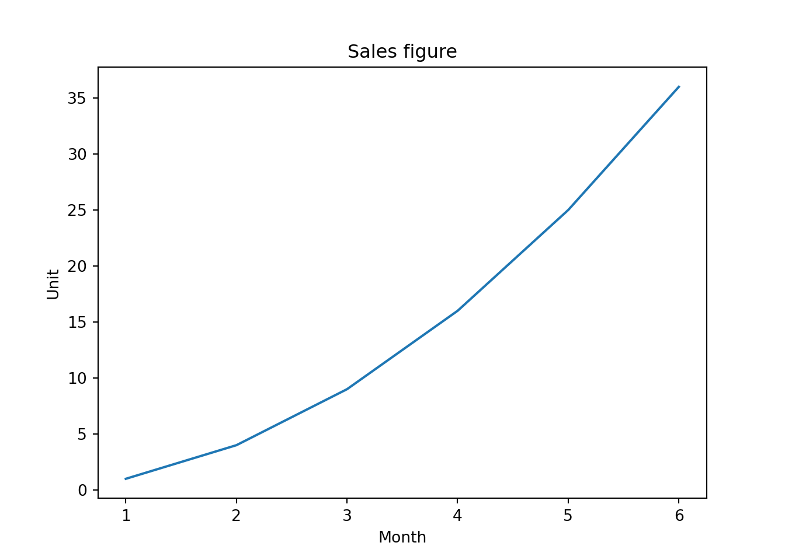


```python
plt.plot(a2, a1)
plt.ylabel('Unit')
```


> It makes two graphs instead of one. Also note that `ylabel()` was called after `plot()`, and it is still shown before `plot.show()` but `Sales Figure` plot title and other labels don't show up on this graph. Because every time `plot.show()` is called, things are reset. This is a `stateful API` we're using. 
> The functional APIs are used when you plot Matplotlib by calling on `pyplot` module level API (module level functions).

### object-oriented API {#ooapi}

> In object-orinted API, we're getting two type of objects. One is `Figure`, the other one is `Axes`. Figure is the *canvas* of the plot. In English, axes is the plural form of axis. We're talking about the axis in x axis and y axis. Since one **plot** consists of both axis, in MatPlotlib the object that represents one plot is called `Axes`. Since it's an object. We'll call it "a" axes.


```python
import matplotlib.pyplot as plt

a1 = list(range(1, 7)) # [1, 2, 3, 4, 5, 6]
a2 = [1, 4, 9, 16, 25, 36]
fig = plt.figure()
print("fig is of type:", type(fig))
```

```
## fig is of type: <class 'matplotlib.figure.Figure'>
```

```python
ax1 = fig.add_axes([0, 0, 1, 1]) # [left, bottom, width, height]
print("ax1 is of type:", type(ax1))
```

```
## ax1 is of type: <class 'matplotlib.axes._axes.Axes'>
```

```python
# ax1.plot(a1, a2)
```


> 1. Call `figure()` to get a Figure type
> 2. Call `add_axes()` to get a ax1 type
> `ax1 = fig.add_axes([0, 0, 1, 1]) # [left, bottom, width, height]`
>   * The list given to `add_axes()` is the rectangular region of where to show the plot:
>     * Bottom left corner at x=0, y=0, width and height of both 1, 1

:::::: {.cols data-latex=""}
::: {.col data-latex="{0.45\textwidth}"}

```python
import matplotlib.pyplot as plt

a1 = list(range(1, 7)) # [1, 2, 3, 4, 5, 6]
a2 = [1, 4, 9, 16, 25, 36]
fig = plt.figure()
# print("fig is of type:", type(fig))
ax1 = fig.add_axes([0, 0, 1, 1]) # [left, bottom, width, height]
# print("ax1 is of type:", type(ax1))
ax1.plot(a1, a2)
```
:::

::: {.col data-latex="{0.10\textwidth}"}
\ 
:::

::: {.col data-latex="{0.45\textwidth}"}

:::
::::::

***

:::::: {.cols data-latex=""}
::: {.col data-latex="{0.45\textwidth}"}

```python
import matplotlib.pyplot as plt

a1 = list(range(1, 7)) # [1, 2, 3, 4, 5, 6]
a2 = [1, 4, 9, 16, 25, 36]
fig = plt.figure()
ax1 = fig.add_axes([0, 0, 1, 1])
ax1.plot(a1, a2)
ax2 = fig.add_axes([0.1, 0.5, .4, .4])
ax2.plot(a2, a1)
```
:::

::: {.col data-latex="{0.10\textwidth}"}
\ 
:::

::: {.col data-latex="{0.45\textwidth}"}

:::
::::::

***

:::::: {.cols data-latex=""}
::: {.col data-latex="{0.45\textwidth}"}

```python
import matplotlib.pyplot as plt

a1 = list(range(1, 7)) # [1, 2, 3, 4, 5, 6]
a2 = [1, 4, 9, 16, 25, 36]
fig = plt.figure()
ax = fig.add_axes([0, 0, 1, 1])
ax.plot(a1, a2)
ax.set_xlabel('Time')
ax.set_ylabel('Unit')
ax.set_title('Sales figure')
# alternatively: 
# ax.set(xlabel='Time', ylabel='Unit', title='Sales figure')
```
:::

::: {.col data-latex="{0.10\textwidth}"}
\ 
:::

::: {.col data-latex="{0.45\textwidth}"}

:::
::::::

#### Configure the figure size and DPI

Get image size for the figure object. 6 by 4 is the default.

`fig.get_size_inches()`


```python
import matplotlib.pyplot as plt

fig = plt.figure()
fig.get_size_inches()
```

```
## array([7., 5.])
```


***

`fig = plt.figure(figsize=(2, 4))`

:::::: {.cols data-latex=""}
::: {.col data-latex="{0.45\textwidth}"}

```python
import matplotlib.pyplot as plt

a1 = list(range(1, 7)) # [1, 2, 3, 4, 5, 6]
a2 = [1, 4, 9, 16, 25, 36]
fig = plt.figure(figsize=(2, 4))
# you can also set after getting the figure
# fig.set_size_inches((12, 2))
ax = fig.add_axes([0, 0, 1, 1])
ax.plot(a1, a2)
```
:::

::: {.col data-latex="{0.10\textwidth}"}
\ 
:::

::: {.col data-latex="{0.45\textwidth}"}

:::
::::::

***

`fig.set_size_inches((4, 2))`

:::::: {.cols data-latex=""}
::: {.col data-latex="{0.45\textwidth}"}

```python
import matplotlib.pyplot as plt

a1 = list(range(1, 7)) # [1, 2, 3, 4, 5, 6]
a2 = [1, 4, 9, 16, 25, 36]
fig = plt.figure()
# you can also set after getting the figure
fig.set_size_inches((4, 2))
ax = fig.add_axes([0, 0, 1, 1])
ax.plot(a1, a2)
```
:::

::: {.col data-latex="{0.10\textwidth}"}
\ 
:::

::: {.col data-latex="{0.45\textwidth}"}

:::
::::::

***

DPI = dots per inch

Get image DPI for the figure object. 100 is the default here.

`fig.get_dpi()`


```python
import matplotlib.pyplot as plt

fig = plt.figure()
fig.get_dpi()
```

```
## 100.0
```


***


```python
import matplotlib.pyplot as plt

a1 = list(range(1, 7)) # [1, 2, 3, 4, 5, 6]
a2 = [1, 4, 9, 16, 25, 36]
fig = plt.figure()
# you can also set after getting the figure
fig.set_size_inches((12, 2))
ax = fig.add_axes([0, 0, 1, 1])
ax.plot(a1, a2)
plt.title('Sales figure')
fig.get_dpi()
```

```
## 100.0
```


#### subplot


```python
import matplotlib.pyplot as plt

# Subplots handles add_axes for you according to the number of rows and columns
fig, axes = plt.subplots(nrows=2, ncols=2, figsize=(6, 3))
# axes is a numpy array, you can use it like using a list.
print(axes)
```

```
## [[<Axes: > <Axes: >]
##  [<Axes: > <Axes: >]]
```

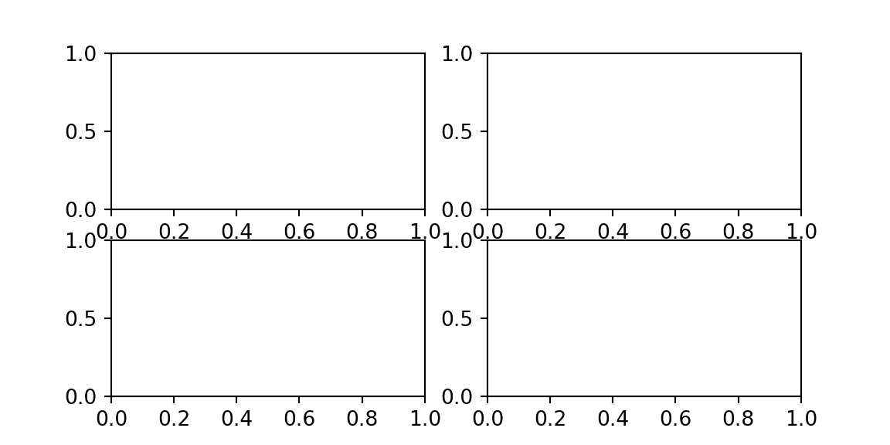

***

:::::: {.cols data-latex=""}
::: {.col data-latex="{0.45\textwidth}"}

```python
import matplotlib.pyplot as plt

a1 = list(range(1, 7)) # [1, 2, 3, 4, 5, 6]
a2 = [1, 4, 9, 16, 25, 36]
# Subplots handles add_axes for you according to the number of rows and columns
fig, axes = plt.subplots(nrows=2, ncols=2, figsize=(6, 3))
# axes is a numpy array, you can use it like using a list.
# print(axes)
axes[0][0].plot(a1, a2)
axes[0][1].plot(a1, a2)
axes[1][0].plot(a2, a1)
axes[1][1].plot(a2, a1)
```
:::

::: {.col data-latex="{0.10\textwidth}"}
\ 
:::

::: {.col data-latex="{0.45\textwidth}"}
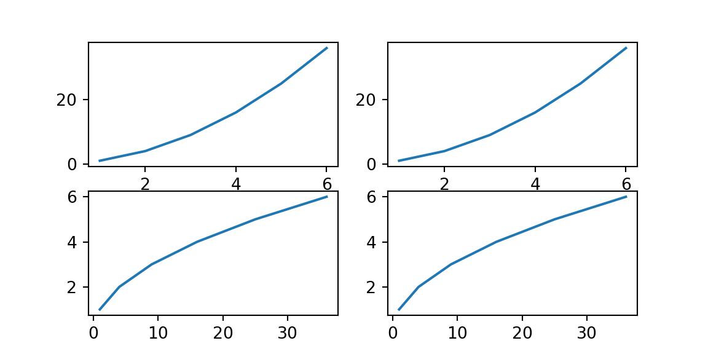
:::
::::::

#### color and linestyle

> * Color
>   * https://matplotlib.org/stable/tutorials/colors/colors.html
> * line-style (ls)
>   * https://matplotlib.org/stable/gallery/lines_bars_and_markers/linestyles.html
> * marker
>   * https://matplotlib.org/stable/api/markers_api.html
> * linewidth (lw)

:::::: {.cols data-latex=""}
::: {.col data-latex="{0.45\textwidth}"}

```python
import matplotlib.pyplot as plt

a1 = list(range(1, 7)) # [1, 2, 3, 4, 5, 6]
a2 = [1, 4, 9, 16, 25, 36]
# Subplots handles add_axes for you according to the number of rows and columns
fig, axes = plt.subplots(nrows=1, ncols=2, figsize=(6, 3))
# axes is a numpy array
axes[0].plot(a1, a2, color='green', linestyle='-.')
axes[0].plot(a2, a1, color=(1, 0, 0.5), marker='v', markersize=20)
axes[1].plot(a1, a2, linestyle='dotted')
axes[1].plot(a2, a1, linestyle=(0, (3, 10, 1, 10)))
```
:::

::: {.col data-latex="{0.10\textwidth}"}
\ 
:::

::: {.col data-latex="{0.45\textwidth}"}

:::
::::::

#### other inputs

- NumPy array
- Pandas series

#### legend

:::::: {.cols data-latex=""}
::: {.col data-latex="{0.45\textwidth}"}

```python
import matplotlib.pyplot as plt
import numpy as np

x = np.linspace(0, 10, 30)
y = x * x
fig = plt.figure()
ax = fig.add_axes([0, 0, 1, 1])
line1 = ax.plot(x, y, label="Competitor")
line2 = ax.plot(x, y**2, label="Us")
ax.legend()
```
:::

::: {.col data-latex="{0.10\textwidth}"}
\ 
:::

::: {.col data-latex="{0.45\textwidth}"}

:::
::::::

#### customize style

predefined styles


```python
import matplotlib.pyplot as plt

print(plt.style.available)
```

```
## ['Solarize_Light2', '_classic_test_patch', '_mpl-gallery', '_mpl-gallery-nogrid', 'bmh', 'classic', 'dark_background', 'fast', 'fivethirtyeight', 'ggplot', 'grayscale', 'seaborn-v0_8', 'seaborn-v0_8-bright', 'seaborn-v0_8-colorblind', 'seaborn-v0_8-dark', 'seaborn-v0_8-dark-palette', 'seaborn-v0_8-darkgrid', 'seaborn-v0_8-deep', 'seaborn-v0_8-muted', 'seaborn-v0_8-notebook', 'seaborn-v0_8-paper', 'seaborn-v0_8-pastel', 'seaborn-v0_8-poster', 'seaborn-v0_8-talk', 'seaborn-v0_8-ticks', 'seaborn-v0_8-white', 'seaborn-v0_8-whitegrid', 'tableau-colorblind10']
```

:::::: {.cols data-latex=""}
::: {.col data-latex="{0.45\textwidth}"}

```python
import matplotlib.pyplot as plt

a1 = list(range(1, 7)) # [1, 2, 3, 4, 5, 6]
a2 = [1, 4, 9, 16, 25, 36]
fig = plt.figure()
plt.style.use('ggplot')
ax = fig.add_axes([0, 0, 1, 1])
ax.plot(a1, a2)
```
:::

::: {.col data-latex="{0.10\textwidth}"}
\ 
:::

::: {.col data-latex="{0.45\textwidth}"}

:::
::::::

restore default style


```python
import matplotlib.pyplot as plt

plt.style.use('default') # But strangely enough figure size gets changed still
```


```python
import matplotlib.pyplot as plt

plt.rcParams["figure.figsize"] = (6, 4)
plt.rcParams["figure.dpi"] = 100
```

#### save to file

> `savefig` saves image to file. We also set the `bbox_inches` parameter to `tight` to make sure the image doesn't get out of the image bound.

save to .png


```python
import matplotlib.pyplot as plt

a1 = list(range(1, 7)) # [1, 2, 3, 4, 5, 6]
a2 = [1, 4, 9, 16, 25, 36]
fig = plt.figure()
ax = fig.add_axes([0, 0, 1, 1])
ax.plot(a1, a2)
fig.savefig('out.png', bbox_inches = 'tight')
```

save to .pdf


```python
import matplotlib.pyplot as plt

a1 = list(range(1, 7)) # [1, 2, 3, 4, 5, 6]
a2 = [1, 4, 9, 16, 25, 36]
fig = plt.figure()
ax = fig.add_axes([0, 0, 1, 1])
ax.plot(a1, a2)
fig.savefig('out.pdf', bbox_inches = 'tight')
```

### Seaborn

- [Kimberly Fessel](https://www.youtube.com/@KimberlyFessel/playlists)
  - [visually explained](https://www.youtube.com/playlist?list=PLtPIclEQf-3cYc7tP_mxrvNtp82NWVf8p)
  - [Seaborn](https://www.youtube.com/playlist?list=PLtPIclEQf-3cG31dxSMZ8KTcDG7zYng1j)
  - [MatPlotLib](https://www.youtube.com/playlist?list=PLtPIclEQf-3dJmAj3IsSRwRoLbX-n3J81)
  - [Pandas](https://www.youtube.com/playlist?list=PLtPIclEQf-3c-pUgSttUGV-3Y2D9g_0sW)
  - [iPyWidgets](https://www.youtube.com/playlist?list=PLtPIclEQf-3fhfoFQU2MJYnQ6CyjQLQEa)

<div class="figure">

<p class="caption">(\#fig:seaborn-plot-type)seaborn plot type</p>
</div>
- Seaborn
  - figure-level plot
  - axes-level plot


R or RStudio run Python with installing packages or modules by using `reticulate`, R package

and directly using Anaconda `conda` environment for convenience, instead of `virtualenv`

https://rstudio.github.io/reticulate/articles/python_packages.html


```r
# library(reticulate)
# conda_list()
# use_condaenv(condaenv = 'sandbox-3.9')

## install Seaborn
# conda_install("r-reticulate", "seaborn")

## import Seaborn (it will be automatically discovered in "r-reticulate")
# seaborn <- import("seaborn")
```

#### basic


```python
import matplotlib.pyplot as plt  # need it sometimes
import seaborn as sns

sns.set_theme() # set the default theme
```

***

:::::: {.cols data-latex=""}
::: {.col data-latex="{0.45\textwidth}"}

```python
import seaborn as sns

x = [3, 5, 1.2, 8.7, 6.4]
y = [8.2, 4.3, 7, 9.6, 4]
sns.scatterplot(x=x, y=y)
```
:::

::: {.col data-latex="{0.10\textwidth}"}
\ 
:::

::: {.col data-latex="{0.45\textwidth}"}

:::
::::::

***

:::::: {.cols data-latex=""}
::: {.col data-latex="{0.45\textwidth}"}

```python
import seaborn as sns

x = [3, 5, 1.2, 8.7, 6.4]
y = [8.2, 4.3, 7, 9.6, 4]
sns.lineplot(x=x, y=y)
```
:::

::: {.col data-latex="{0.10\textwidth}"}
\ 
:::

::: {.col data-latex="{0.45\textwidth}"}

:::
::::::

#### data frame

`sns.load_dataset`

:::::: {.cols data-latex=""}
::: {.col data-latex="{0.45\textwidth}"}

```python
import seaborn as sns

tips = sns.load_dataset("tips")
tips
```
:::

::: {.col data-latex="{0.10\textwidth}"}
\ 
:::

::: {.col data-latex="{0.45\textwidth}"}

```
##      total_bill   tip     sex smoker   day    time  size
## 0         16.99  1.01  Female     No   Sun  Dinner     2
## 1         10.34  1.66    Male     No   Sun  Dinner     3
## 2         21.01  3.50    Male     No   Sun  Dinner     3
## 3         23.68  3.31    Male     No   Sun  Dinner     2
## 4         24.59  3.61  Female     No   Sun  Dinner     4
## ..          ...   ...     ...    ...   ...     ...   ...
## 239       29.03  5.92    Male     No   Sat  Dinner     3
## 240       27.18  2.00  Female    Yes   Sat  Dinner     2
## 241       22.67  2.00    Male    Yes   Sat  Dinner     2
## 242       17.82  1.75    Male     No   Sat  Dinner     2
## 243       18.78  3.00  Female     No  Thur  Dinner     2
## 
## [244 rows x 7 columns]
```
:::
::::::

***

`data`

:::::: {.cols data-latex=""}
::: {.col data-latex="{0.45\textwidth}"}

```python
import seaborn as sns

tips = sns.load_dataset("tips")
sns.scatterplot(data=tips, 
                x='total_bill', 
                y='tip')
```
:::

::: {.col data-latex="{0.10\textwidth}"}
\ 
:::

::: {.col data-latex="{0.45\textwidth}"}

:::
::::::

***

`hue`

:::::: {.cols data-latex=""}
::: {.col data-latex="{0.45\textwidth}"}

```python
import seaborn as sns

tips = sns.load_dataset("tips")
sns.scatterplot(data=tips, 
                x='total_bill', 
                y='tip', 
                hue='smoker')
```
:::

::: {.col data-latex="{0.10\textwidth}"}
\ 
:::

::: {.col data-latex="{0.45\textwidth}"}

:::
::::::

***

`style`

:::::: {.cols data-latex=""}
::: {.col data-latex="{0.45\textwidth}"}

```python
import seaborn as sns

tips = sns.load_dataset("tips")
sns.scatterplot(data=tips, 
                x='total_bill', 
                y='tip', 
                hue='smoker', 
                style='time')
```
:::

::: {.col data-latex="{0.10\textwidth}"}
\ 
:::

::: {.col data-latex="{0.45\textwidth}"}

:::
::::::

***

`size`

:::::: {.cols data-latex=""}
::: {.col data-latex="{0.45\textwidth}"}

```python
import seaborn as sns

tips = sns.load_dataset("tips")
sns.scatterplot(data=tips, 
                x='total_bill', 
                y='tip', 
                hue='smoker', 
                style='time', 
                size='size')
```
:::

::: {.col data-latex="{0.10\textwidth}"}
\ 
:::

::: {.col data-latex="{0.45\textwidth}"}

:::
::::::

> * Legend is covering up the graph, it's getting out of hand. Let's tune the range of x
> * `sns.scatterplot()` actually returns something that resembles Matplotlib axis. So we use a Matplotlib axis function:

`ax = sns.scatterplot(...)`

https://stackoverflow.com/questions/26597116/seaborn-plots-not-showing-up

:::::: {.cols data-latex=""}
::: {.col data-latex="{0.45\textwidth}"}

```python
import matplotlib.pyplot as plt
import seaborn as sns

tips = sns.load_dataset("tips")
ax = sns.scatterplot(data=tips, 
                x='total_bill', 
                y='tip', 
                hue='smoker', 
                style='time', 
                size='size')
ax.set_xlim((0, 70))
# alternatively:
# ax.set(xlim=(0, 70))
plt.show()
```
:::

::: {.col data-latex="{0.10\textwidth}"}
\ 
:::

::: {.col data-latex="{0.45\textwidth}"}

```
## (0.0, 70.0)
```

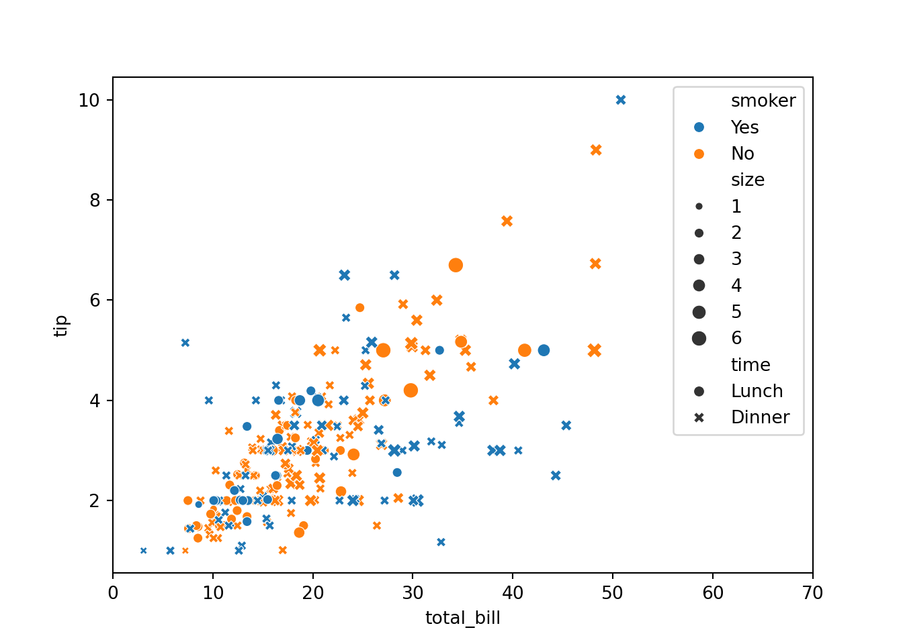
:::
::::::

#### axis-level plot and figure-level plot

`sns.relplot`

<div class="figure">

<p class="caption">(\#fig:unnamed-chunk-58)seaborn plot type</p>
</div>

:::::: {.cols data-latex=""}
::: {.col data-latex="{0.45\textwidth}"}

```python
import seaborn as sns

tips = sns.load_dataset("tips")
sns.relplot(kind='scatter', 
            data=tips, 
            x='total_bill', 
            y='tip')
```
:::

::: {.col data-latex="{0.10\textwidth}"}
\ 
:::

::: {.col data-latex="{0.45\textwidth}"}

:::
::::::

***

:::::: {.cols data-latex=""}
::: {.col data-latex="{0.45\textwidth}"}

```python
import seaborn as sns

tips = sns.load_dataset("tips")
sns.relplot(kind='line', 
            data=tips, 
            x='total_bill', 
            y='tip')
```
:::

::: {.col data-latex="{0.10\textwidth}"}
\ 
:::

::: {.col data-latex="{0.45\textwidth}"}

:::
::::::

***

> With figure-level plot, we can draw more than one plot (one `axes`).

> Here we specify that different `sex` be on different column by specifying `col=sex`.

`col=sex`

:::::: {.cols data-latex=""}
::: {.col data-latex="{0.45\textwidth}"}

```python
import seaborn as sns

tips = sns.load_dataset("tips")
sns.relplot(kind='scatter',
            data=tips,
            x='total_bill', 
            y='tip', 
            hue='smoker', 
            style='time', 
            size='size',
            col='sex')
```
:::

::: {.col data-latex="{0.10\textwidth}"}
\ 
:::

::: {.col data-latex="{0.45\textwidth}"}

:::
::::::

***

`col=sex` `row=smoker`

:::::: {.cols data-latex=""}
::: {.col data-latex="{0.45\textwidth}"}

```python
import seaborn as sns

tips = sns.load_dataset("tips")
sns.relplot(kind='scatter',
            data=tips,
            x='total_bill', 
            y='tip', 
            style='time', 
            hue='size',
            row='smoker', 
            col='sex')
```
:::

::: {.col data-latex="{0.10\textwidth}"}
\ 
:::

::: {.col data-latex="{0.45\textwidth}"}

:::
::::::

#### accessing fgure and axes objects

> Recall that Seaborn uses Matplotlib to draw the graphics. So underneath the Seaborn libray, you can still access Matplotlib's figure object and axes objects if necessary. The call to figure-level plot returns an object.

:::::: {.cols data-latex=""}
::: {.col data-latex="{0.45\textwidth}"}

```python
import seaborn as sns

tips = sns.load_dataset("tips")
g = sns.relplot(kind='scatter',
                data=tips,
                x='total_bill', 
                y='tip', 
                style='time', 
                hue='size',
                row='smoker', 
                col='sex')
print(type(g))
print(type(g.fig)) # g.fig gets you the Figure
g.fig
```
:::

::: {.col data-latex="{0.10\textwidth}"}
\ 
:::

::: {.col data-latex="{0.45\textwidth}"}

```
## <class 'seaborn.axisgrid.FacetGrid'>
```

```
## <class 'matplotlib.figure.Figure'>
```


:::
::::::

#### distribution plot

`sns.displot`

##### histogram

***

:::::: {.cols data-latex=""}
::: {.col data-latex="{0.45\textwidth}"}

```python
import seaborn as sns

tips = sns.load_dataset("tips")
sns.displot(kind='hist',
            data=tips,
            x='total_bill')
```
:::

::: {.col data-latex="{0.10\textwidth}"}
\ 
:::

::: {.col data-latex="{0.45\textwidth}"}

:::
::::::

***

`bins`

:::::: {.cols data-latex=""}
::: {.col data-latex="{0.45\textwidth}"}

```python
import seaborn as sns

tips = sns.load_dataset("tips")
sns.displot(kind='hist', bins=20,
            data=tips,
            x='total_bill')
```
:::

::: {.col data-latex="{0.10\textwidth}"}
\ 
:::

::: {.col data-latex="{0.45\textwidth}"}

:::
::::::

##### ECDF = empirical cumulative distrutive function

***

:::::: {.cols data-latex=""}
::: {.col data-latex="{0.45\textwidth}"}

```python
import seaborn as sns

tips = sns.load_dataset("tips")
sns.displot(kind='ecdf',
            data=tips,
            x='total_bill')
```
:::

::: {.col data-latex="{0.10\textwidth}"}
\ 
:::

::: {.col data-latex="{0.45\textwidth}"}

:::
::::::

##### KDE = kernel density estimation

***

:::::: {.cols data-latex=""}
::: {.col data-latex="{0.45\textwidth}"}

```python
import seaborn as sns

tips = sns.load_dataset("tips")
sns.displot(kind='kde',
            data=tips,
            x='total_bill')
```
:::

::: {.col data-latex="{0.10\textwidth}"}
\ 
:::

::: {.col data-latex="{0.45\textwidth}"}
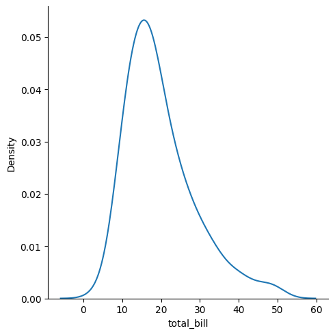
:::
::::::

***

histogram with KDE

:::::: {.cols data-latex=""}
::: {.col data-latex="{0.45\textwidth}"}

```python
import seaborn as sns

tips = sns.load_dataset("tips")
sns.displot(kind='hist', bins=20, kde='true',
            data=tips,
            x='total_bill')
```
:::

::: {.col data-latex="{0.10\textwidth}"}
\ 
:::

::: {.col data-latex="{0.45\textwidth}"}


```
## '% This file was created with tikzplotlib v0.10.1.\n\\begin{tikzpicture}\n\n\\definecolor{darkgray176}{RGB}{176,176,176}\n\\definecolor{steelblue31119180}{RGB}{31,119,180}\n\n\\begin{axis}[\ntick align=outside,\ntick pos=left,\nx grid style={darkgray176},\nxlabel={total_bill},\nxmin=0.682999999999999, xmax=53.197,\nxtick style={color=black},\ny grid style={darkgray176},\nylabel={Count},\nymin=0, ymax=38.85,\nytick style={color=black}\n]\n\\draw[draw=black,fill=steelblue31119180,fill opacity=0.5] (axis cs:3.07,0) rectangle (axis cs:5.457,1);\n\\draw[draw=black,fill=steelblue31119180,fill opacity=0.5] (axis cs:5.457,0) rectangle (axis cs:7.844,6);\n\\draw[draw=black,fill=steelblue31119180,fill opacity=0.5] (axis cs:7.844,0) rectangle (axis cs:10.231,13);\n\\draw[draw=black,fill=steelblue31119180,fill opacity=0.5] (axis cs:10.231,0) rectangle (axis cs:12.618,29);\n\\draw[draw=black,fill=steelblue31119180,fill opacity=0.5] (axis cs:12.618,0) rectangle (axis cs:15.005,31);\n\\draw[draw=black,fill=steelblue31119180,fill opacity=0.5] (axis cs:15.005,0) rectangle (axis cs:17.392,37);\n\\draw[draw=black,fill=steelblue31119180,fill opacity=0.5] (axis cs:17.392,0) rectangle (axis cs:19.779,28);\n\\draw[draw=black,fill=steelblue31119180,fill opacity=0.5] (axis cs:19.779,0) rectangle (axis cs:22.166,23);\n\\draw[draw=black,fill=steelblue31119180,fill opacity=0.5] (axis cs:22.166,0) rectangle (axis cs:24.553,18);\n\\draw[draw=black,fill=steelblue31119180,fill opacity=0.5] (axis cs:24.553,0) rectangle (axis cs:26.94,13);\n\\draw[draw=black,fill=steelblue31119180,fill opacity=0.5] (axis cs:26.94,0) rectangle (axis cs:29.327,10);\n\\draw[draw=black,fill=steelblue31119180,fill opacity=0.5] (axis cs:29.327,0) rectangle (axis cs:31.714,9);\n\\draw[draw=black,fill=steelblue31119180,fill opacity=0.5] (axis cs:31.714,0) rectangle (axis cs:34.101,5);\n\\draw[draw=black,fill=steelblue31119180,fill opacity=0.5] (axis cs:34.101,0) rectangle (axis cs:36.488,7);\n\\draw[draw=black,fill=steelblue31119180,fill opacity=0.5] (axis cs:36.488,0) rectangle (axis cs:38.875,3);\n\\draw[draw=black,fill=steelblue31119180,fill opacity=0.5] (axis cs:38.875,0) rectangle (axis cs:41.262,4);\n\\draw[draw=black,fill=steelblue31119180,fill opacity=0.5] (axis cs:41.262,0) rectangle (axis cs:43.649,1);\n\\draw[draw=black,fill=steelblue31119180,fill opacity=0.5] (axis cs:43.649,0) rectangle (axis cs:46.036,2);\n\\draw[draw=black,fill=steelblue31119180,fill opacity=0.5] (axis cs:46.036,0) rectangle (axis cs:48.423,3);\n\\draw[draw=black,fill=steelblue31119180,fill opacity=0.5] (axis cs:48.423,0) rectangle (axis cs:50.81,1);\n\\addplot [semithick, steelblue31119180]\ntable {%\n3.07 1.81650227371093\n3.30989949748744 2.0434643264896\n3.54979899497487 2.2946853892412\n3.78969849246231 2.57191856721816\n4.02959798994975 2.87687103964454\n4.26949748743719 3.2111703368463\n4.50939698492462 3.57632865116155\n4.74929648241206 3.97370595578498\n4.9891959798995 4.40447280025508\n5.22909547738693 4.86957372234809\n5.46899497487437 5.36969226057983\n5.70889447236181 5.90521856710491\n5.94879396984925 6.47622060619422\n6.18869346733668 7.08241987817059\n6.42859296482412 7.72317253298626\n6.66849246231156 8.39745663256822\n6.90839195979899 9.10386618836671\n7.14829145728643 9.84061244261478\n7.38819095477387 10.605532681721\n7.62809045226131 11.3961066717526\n7.86798994974874 12.2094805936589\n8.10788944723618 13.0424981350657\n8.34778894472362 13.8917381722816\n8.58768844221106 14.7535582575524\n8.82758793969849 15.6241429202311\n9.06748743718593 16.4995556046295\n9.30738693467337 17.3757929103925\n9.5472864321608 18.2488396817903\n9.78718592964824 19.1147234183632\n10.0270854271357 19.9695664579337\n10.2669849246231 20.8096344196708\n10.5068844221106 21.6313794931092\n10.746783919598 22.4314773197019\n10.9866834170854 23.2068564344639\n11.2265829145729 23.9547195110843\n11.4664824120603 24.6725559755833\n11.7063819095477 25.3581459088295\n11.9462814070352 26.0095555316024\n12.1861809045226 26.6251249394887\n12.4260804020101 27.2034491092342\n12.6659798994975 27.7433535131461\n12.9058793969849 28.2438659343764\n13.1457788944724 28.7041862560547\n13.3856783919598 29.1236560873048\n13.6255778894472 29.5017300798215\n13.8654773869347 29.8379506761731\n14.1053768844221 30.1319278179194\n14.3452763819095 30.3833248371542\n14.585175879397 30.591851374701\n14.8250753768844 30.7572637330083\n15.0649748743719 30.8793726073093\n15.3048743718593 30.9580576730616\n15.5447738693467 30.9932880701113\n15.7846733668342 30.9851474422087\n16.0245728643216 30.9338618888512\n16.264472361809 30.8398289841961\n16.5043718592965 30.7036459275097\n16.7442713567839 30.5261349162415\n16.9841708542714 30.3083639732627\n17.2240703517588 30.0516617033457\n17.4639698492462 29.7576247830678\n17.7038693467337 29.4281173801778\n17.9437688442211 29.0652621267963\n18.1836683417085 28.671422708\n18.423567839196 28.2491785464713\n18.6634673366834 27.8012924408185\n18.9033668341709 27.3306723300243\n19.1432663316583 26.8403285949087\n19.3831658291457 26.3333284612471\n19.6230653266332 25.8127491361762\n19.8629648241206 25.2816312933759\n20.102864321608 24.7429344316665\n20.3427638190955 24.1994954781583\n20.5826633165829 23.6539918052482\n20.8225628140704 23.1089095957794\n21.0624623115578 22.5665182374548\n21.3023618090452 22.0288511696841\n21.5422613065327 21.4976933549977\n21.7821608040201 20.9745753121716\n22.0220603015075 20.4607734360394\n22.261959798995 19.9573161441721\n22.5018592964824 19.4649952359086\n22.7417587939699 18.9843817259491\n22.9816582914573 18.5158453233279\n23.2215577889447 18.0595766669415\n23.4614572864322 17.615611400536\n23.7013567839196 17.1838551725645\n23.941256281407 16.7641086787571\n24.1811557788945 16.3560919263279\n24.4210552763819 15.9594669865189\n24.6609547738693 15.5738586137688\n24.9008542713568 15.1988722412078\n25.1407537688442 14.8341090082362\n25.3806532663317 14.4791776303403\n25.6205527638191 14.1337030768421\n25.8604522613065 13.7973321712685\n26.100351758794 13.4697363637648\n26.3402512562814 13.150612038339\n26.5801507537688 12.8396788037574\n26.8200502512563 12.5366762713579\n27.0599497487437 12.2413598437652\n27.2998492462312 11.9534960256898\n27.5397487437186 11.6728577243006\n27.779648241206 11.3992199369156\n28.0195477386935 11.1323561346653\n28.2594472361809 10.8720355503384\n28.4993467336683 10.618021475438\n28.7392462311558 10.3700705740342\n28.9791457286432 10.1279331369088\n29.2190452261307 9.89135413483068\n29.4589447236181 9.66007488858728\n29.6988442211055 9.43383515726144\n29.938743718593 9.21237545429534\n30.1786432160804 8.99543942987608\n30.4185427135678 8.78277620282414\n30.6584422110553 8.57414257872065\n30.8983417085427 8.36930514594295\n31.1382412060302 8.16804229007108\n31.3781407035176 7.97014620304912\n31.618040201005 7.77542498131078\n31.8579396984925 7.58370490367017\n32.0978391959799 7.39483295445693\n32.3377386934673 7.20867961205857\n32.5776381909548 7.02514186210763\n32.8175376884422 6.84414632449376\n33.0574371859297 6.66565231214501\n33.2973366834171 6.48965457576794\n33.5372361809045 6.31618544094476\n33.777135678392 6.1453160195762\n34.0170351758794 5.97715618216116\n34.2569346733668 5.81185301380445\n34.4968341708543 5.64958754514477\n34.7367336683417 5.4905696464633\n34.9766331658291 5.33503109293979\n35.2165326633166 5.18321694268858\n35.456432160804 5.03537550629672\n35.6963316582915 4.89174731561885\n35.9362311557789 4.75255360914146\n36.1761306532663 4.61798493100736\n36.4160301507538 4.48819048255514\n36.6559296482412 4.36326886361301\n36.8958291457286 4.24326079384011\n37.1357286432161 4.12814431384217\n37.3756281407035 4.01783283689438\n37.615527638191 3.91217626335446\n37.8554271356784 3.81096519221432\n38.0953266331658 3.71393808027978\n38.3352261306533 3.6207910222994\n38.5751256281407 3.53118966756817\n38.8150251256281 3.44478266114206\n39.0549246231156 3.3612159094193\n39.294824120603 3.28014692600479\n39.5347236180905 3.20125851656009\n39.7746231155779 3.12427110932688\n40.0145226130653 3.04895312649168\n40.2544221105528 2.97512891305667\n40.4943216080402 2.90268388486196\n40.7342211055276 2.83156671514291\n40.9741206030151 2.76178853850247\n41.2140201005025 2.69341930205747\n41.45391959799 2.62658152681276\n41.6938190954774 2.56144185109477\n41.9337185929648 2.49820080763016\n42.1736180904523 2.43708133466766\n42.4135175879397 2.37831653999644\n42.6534170854271 2.32213722758936\n42.8933165829146 2.26875966439028\n43.133216080402 2.21837401507579\n43.3731155778895 2.17113381152285\n43.6130150753769 2.12714675709877\n43.8529145728643 2.08646709892452\n44.0928140703518 2.04908973796103\n44.3327135678392 2.01494618973935\n44.5726130653266 1.9839024589303\n44.8125125628141 1.95575884849134\n45.0524120603015 1.93025168749459\n45.2923115577889 1.90705692886651\n45.5322110552764 1.88579553680867\n45.7721105527638 1.8660405514497\n46.0120100502513 1.84732568370606\n46.2519095477387 1.82915525570066\n46.4918090452261 1.81101526177134\n46.7317085427136 1.79238528356458\n46.971608040201 1.77275095240831\n47.2115075376884 1.75161661627327\n47.4514070351759 1.72851784072741\n47.6913065326633 1.70303335688259\n47.9312060301508 1.67479606749064\n48.1711055276382 1.64350273728161\n48.4110050251256 1.6089220264205\n48.6509045226131 1.57090057632539\n48.8908040201005 1.52936692339272\n49.1307035175879 1.48433309547015\n49.3706030150754 1.43589383418153\n49.6105025125628 1.38422347865573\n49.8504020100503 1.32957063768011\n50.0903015075377 1.27225086266426\n50.3302010050251 1.21263760837119\n50.5701005025126 1.15115182824249\n50.81 1.08825059345319\n};\n\\end{axis}\n\n\\end{tikzpicture}\n'
```


:::
::::::

***

TikZ / `tikzpicture` with PGFplots `axis` by transforming Matplotlib-based Seaborn plot to .tex via Python package `tikzplotlib`

`xlabel={total_bill},` changed to `xlabel={total bill},` wihout _ in text

X `ylabel={Count},` changed to `ylabel={$\text{Count}$},`: not necessoary to be changed, the problem is _ in xlabel name

<div class="figure">

<p class="caption">(\#fig:unnamed-chunk-79)tikzplotlib</p>
</div>

***

:::::: {.cols data-latex=""}
::: {.col data-latex="{0.45\textwidth}"}

```python
import seaborn as sns

tips = sns.load_dataset("tips")
sns.displot(kind='hist', bins=20, kde='true',
            data=tips,
            x='total_bill',
            hue='smoker',
            col='sex'
            )
```
:::

::: {.col data-latex="{0.10\textwidth}"}
\ 
:::

::: {.col data-latex="{0.45\textwidth}"}

:::
::::::

***

> Let's cutomize the label and title.

:::::: {.cols data-latex=""}
::: {.col data-latex="{0.45\textwidth}"}

```python
import seaborn as sns

tips = sns.load_dataset("tips")
g = sns.displot(kind='hist', bins=20, kde='true',
                data=tips,
                x='total_bill',
                hue='smoker',
                col='sex'
                )
g.set(xlabel='Total bill')
g.axes[0][0].set(title='Male')
g.axes[0][1].set(title='Female')
g.fig
```
:::

::: {.col data-latex="{0.10\textwidth}"}
\ 
:::

::: {.col data-latex="{0.45\textwidth}"}

:::
::::::

#### categorical plot

`sns.catplot`

:::::: {.cols data-latex=""}
::: {.col data-latex="{0.45\textwidth}"}

```python
import seaborn as sns

tips = sns.load_dataset("tips")
sns.catplot(kind='box', 
            data=tips, 
            x="day", hue="day",
            y="total_bill"
            )
```
:::

::: {.col data-latex="{0.10\textwidth}"}
\ 
:::

::: {.col data-latex="{0.45\textwidth}"}

:::
::::::

***

:::::: {.cols data-latex=""}
::: {.col data-latex="{0.45\textwidth}"}

```python
import seaborn as sns

tips = sns.load_dataset("tips")
sns.catplot(kind='violin', 
            data=tips, 
            x="day", hue="day",
            y="total_bill",
            col='sex'
            )
```
:::

::: {.col data-latex="{0.10\textwidth}"}
\ 
:::

::: {.col data-latex="{0.45\textwidth}"}

:::
::::::

#### joint plot

`sns.jointplot`

:::::: {.cols data-latex=""}
::: {.col data-latex="{0.45\textwidth}"}

```python
import matplotlib.pyplot as plt
import seaborn as sns

tips = sns.load_dataset("tips")
sns.jointplot(data=tips,
              x="total_bill",
              y="tip",
              hue='sex'
              )
plt.show()
```
:::

::: {.col data-latex="{0.10\textwidth}"}
\ 
:::

::: {.col data-latex="{0.45\textwidth}"}

```
## <seaborn.axisgrid.JointGrid object at 0x000001FD5044F550>
```


:::
::::::

#### pair plot

`sns.pairplot`

:::::: {.cols data-latex=""}
::: {.col data-latex="{0.45\textwidth}"}

```python
import seaborn as sns

penguins = sns.load_dataset("penguins")
sns.pairplot(data=penguins,
             hue='species')
```
:::

::: {.col data-latex="{0.10\textwidth}"}
\ 
:::

::: {.col data-latex="{0.45\textwidth}"}

:::
::::::

#### palette

> Changing the color with Matplotlib's color

> A list of color: https://matplotlib.org/stable/tutorials/colors/colormaps.html

:::::: {.cols data-latex=""}
::: {.col data-latex="{0.45\textwidth}"}

```python
import seaborn as sns

penguins = sns.load_dataset("penguins")
sns.pairplot(data=penguins,
             hue='species',
             palette='Pastel1')
```
:::

::: {.col data-latex="{0.10\textwidth}"}
\ 
:::

::: {.col data-latex="{0.45\textwidth}"}

:::
::::::

#### volcano plot

#### heatmap

## export

### .svg

https://stackoverflow.com/questions/24525111/how-can-i-get-the-output-of-a-matplotlib-plot-as-an-svg


```python
import matplotlib.pyplot as plt
import seaborn as sns

penguins = sns.load_dataset("penguins")
sns.pairplot(data=penguins,
             hue='species')

plt.savefig("test.svg")
# plt.savefig("test.svg", dpi=1200)
```

### .eps

https://stackoverflow.com/questions/16183462/saving-images-in-python-at-a-very-high-quality

The PostScript backend does not support transparency; partially transparent artists will be rendered opaque.


```python
import matplotlib.pyplot as plt
import seaborn as sns

penguins = sns.load_dataset("penguins")
sns.pairplot(data=penguins,
             hue='species')

plt.savefig("test.eps")
# plt.savefig("test.eps", dpi=1200)
```

<!--chapter:end:202403181222-MatPlotLib.Rmd-->

# survial analysis

## Python package `tableone`

## Python package `lifelines`

<!--chapter:end:202403181821-survival-analysis.Rmd-->

# Manim

<style type="text/css">
pre {
  max-width: 400px;
  overflow-x: auto;
  max-height: 600px;
  overflow-y: auto;
}

/*
pre[class] {
  max-height: 100px;
}
*/
</style>

## VSCode extension: Manim Sideview

https://marketplace.visualstudio.com/items?itemName=Rickaym.manim-sideview

`ffmpeg.exe` placed in the same folder with `.py`

VSCode Ctrl + Shift + P: `open Mobject gallery`

## installation

https://docs.manim.community/en/stable/installation.html

### Conda

```
conda install -c conda-forge manim
```

## quickstart

https://docs.manim.community/en/stable/tutorials/quickstart.html

https://www.w3schools.com/tags/att_video_autoplay.asp

https://www.w3schools.com/tags/att_video_loop.asp

:::::: {.cols data-latex=""}

::: {.col data-latex="{0.45\textwidth}"}


```python
from manim import *

class CreateCircle(Scene):
    def construct(self):
        circle = Circle()  # create a circle
        circle.set_fill(PINK, opacity=0.5)  # set the color and transparency
        self.play(Create(circle))  # show the circle on screen
```

```
manim -pql scene.py CreateCircle
```

:::

::: {.col data-latex="{0.10\textwidth}"}
\ 
:::

::: {show-in="html"}

<div class="col">
  <video width=350 height=200 autoplay loop> <!-- controls  -->
      <source src="manim/CreateCircle.mp4" type="video/mp4">
  </video>
</div>

:::

::::::

<!--chapter:end:202403190029-Manim.Rmd-->

# ggplot2

https://bookdown.org/xiangyun/msg/system.html#chap:system

Modern Statistical Graphics [section 5.1](https://bookdown.org/xiangyun/msg/system.html#sec:ggplot2)

- https://www.rdocumentation.org/ to search function
- ggplot2
  - https://ggplot2.tidyverse.org/index.html to search ggplot2 function
  - panel = layer
    - geom = geometric objects / geometry = element
      - [element](https://bookdown.org/xiangyun/msg/elements.html#cha:elements)
    - statistic
    - scale
    - coordinate system
    - facet

<style type="text/css">
pre {
  max-width: 400px;
  overflow-x: auto;
  max-height: 600px;
  overflow-y: auto;
}

/*
pre {
  max-height: 300px;
  overflow-y: auto;
}

pre[class] {
  max-height: 100px;
}
*/
</style>

:::::: {.cols data-latex=""}
::: {.col data-latex="{0.45\textwidth}"}

```r
library(ggplot2)

p <- ggplot(aes(x = hp, y = mpg), data = mtcars) +
  geom_point() # layer of scatterplot
p + geom_smooth(method = "loess") # add layer of smooth
```
:::

::: {.col data-latex="{0.10\textwidth}"}
\ 
:::

::: {.col data-latex="{0.45\textwidth}"}

```
## Warning: package 'ggplot2' was built under R version 4.3.3
```

```
## `geom_smooth()` using formula = 'y ~ x'
```


:::
::::::

## geom

https://bookdown.org/xiangyun/msg/system.html#section-13

:::::: {.cols data-latex=""}
::: {.col data-latex="{0.45\textwidth}"}

```r
library(ggplot2)

ggplot(aes(x = hp, y = mpg), data = mtcars) +
  geom_point() +
  geom_smooth(method = "loess")
```
:::

::: {.col data-latex="{0.10\textwidth}"}
\ 
:::

::: {.col data-latex="{0.45\textwidth}"}

```
## `geom_smooth()` using formula = 'y ~ x'
```


:::
::::::

points https://ggplot2.tidyverse.org/reference/geom_point.html?q=geom_point#null

`geom_point`

smoothed conditional means https://ggplot2.tidyverse.org/reference/geom_smooth.html?q=geom_sm#null

> Aids the eye in seeing patterns in the presence of overplotting. `geom_smooth()` and `stat_smooth()` are effectively aliases: they both use the same arguments. Use `stat_smooth()` if you want to display the results with a non-standard geom.

`geom_smooth`

`stat_smooth`

> `method` Smoothing method (function) to use, accepts either NULL or a character vector, e.g. `"lm"`, `"glm"`, `"gam"`, `"loess"` or a function, e.g. `MASS::rlm` or `mgcv::gam`, `stats::lm`, or `stats::loess`. `"auto"` is also accepted for backwards compatibility. It is equivalent to `NULL`.

***


```r
# install.packages("hexbin")
```

:::::: {.cols data-latex=""}
::: {.col data-latex="{0.45\textwidth}"}

```r
library(ggplot2)

ggplot(aes(x = carat, y = price), data = diamonds) +
  geom_hex() +
  scale_fill_gradient(low = "blue3", high = "red3")
```
:::

::: {.col data-latex="{0.10\textwidth}"}
\ 
:::

::: {.col data-latex="{0.45\textwidth}"}

:::
::::::

gradient color scales https://ggplot2.tidyverse.org/reference/scale_gradient.html?q=scale_fill_gradient#ref-usage

https://ggplot2.tidyverse.org/reference/scale_gradient.html?q=scale_fill_gradient#ref-examples

***

:::::: {.cols data-latex=""}
::: {.col data-latex="{0.45\textwidth}"}

```r
library(ggplot2)

ggplot(aes(x = Petal.Length, y = Petal.Width), data = iris) +
  geom_point(aes(color = Species, shape = Species))
```
:::

::: {.col data-latex="{0.10\textwidth}"}
\ 
:::

::: {.col data-latex="{0.45\textwidth}"}

:::
::::::

***

basic plot system

https://bookdown.org/xiangyun/msg/elements.html#sec:points

:::::: {.cols data-latex=""}
::: {.col data-latex="{0.45\textwidth}"}

```r
# iris species converted to type integer 1, 2, 3 for further using vectors
idx <- as.integer(iris[["Species"]])
plot(iris[, 3:4],
  pch = c(24, 21, 25)[idx],
  col = c("black", "red", "blue")[idx], panel.first = grid()
)
legend("topleft",
  legend = levels(iris[["Species"]]),
  col = c("black", "red", "blue"), pch = c(24, 21, 25), bty = "n"
)
```
:::

::: {.col data-latex="{0.10\textwidth}"}
\ 
:::

::: {.col data-latex="{0.45\textwidth}"}

:::
::::::

`plot` https://www.rdocumentation.org/packages/graphics/versions/3.6.2/topics/plot.default

> `pch` a vector of **plotting characters** or symbols: see [`points`](https://www.rdocumentation.org/packages/graphics/versions/3.6.2/topics/points).

> `col` The **colors** for lines and points. Multiple colors can be specified so that each point can be given its own color. If there are fewer colors than points they are recycled in the standard fashion. Lines will all be plotted in the first colour specified.

> `panel.first` an ‘expression’ to be evaluated after the plot axes are set up but before any plotting takes place. This can be useful for drawing **background grids** or **scatterplot smooths**. Note that this works by lazy evaluation: passing this argument from other plot methods may well not work since it may be evaluated too early.

`legend` https://www.rdocumentation.org/packages/graphics/versions/3.6.2/topics/legend

> `bty` the **type of box** to be drawn around the legend. The allowed values are "o" (the default) and "n".

https://stackoverflow.com/questions/10108073/plot-legends-without-border-and-with-white-background

> Use option `bty = "n"` in legend to remove the box around the legend.

> `legend` a character or expression vector of length $\ge 1$ to appear in the legend. Other objects will be coerced by [`as.graphicsAnnot`](https://www.rdocumentation.org/packages/grDevices/versions/3.6.2/topics/as.graphicsAnnot)

### basic plot system decomposition

:::::: {.cols data-latex=""}
::: {.col data-latex="{0.45\textwidth}"}

```r
iris
```
:::

::: {.col data-latex="{0.10\textwidth}"}
\ 
:::

::: {.col data-latex="{0.45\textwidth}"}

```
##     Sepal.Length Sepal.Width Petal.Length Petal.Width    Species
## 1            5.1         3.5          1.4         0.2     setosa
## 2            4.9         3.0          1.4         0.2     setosa
## 3            4.7         3.2          1.3         0.2     setosa
## 4            4.6         3.1          1.5         0.2     setosa
## 5            5.0         3.6          1.4         0.2     setosa
## 6            5.4         3.9          1.7         0.4     setosa
## 7            4.6         3.4          1.4         0.3     setosa
## 8            5.0         3.4          1.5         0.2     setosa
## 9            4.4         2.9          1.4         0.2     setosa
## 10           4.9         3.1          1.5         0.1     setosa
## 11           5.4         3.7          1.5         0.2     setosa
## 12           4.8         3.4          1.6         0.2     setosa
## 13           4.8         3.0          1.4         0.1     setosa
## 14           4.3         3.0          1.1         0.1     setosa
## 15           5.8         4.0          1.2         0.2     setosa
## 16           5.7         4.4          1.5         0.4     setosa
## 17           5.4         3.9          1.3         0.4     setosa
## 18           5.1         3.5          1.4         0.3     setosa
## 19           5.7         3.8          1.7         0.3     setosa
## 20           5.1         3.8          1.5         0.3     setosa
## 21           5.4         3.4          1.7         0.2     setosa
## 22           5.1         3.7          1.5         0.4     setosa
## 23           4.6         3.6          1.0         0.2     setosa
## 24           5.1         3.3          1.7         0.5     setosa
## 25           4.8         3.4          1.9         0.2     setosa
## 26           5.0         3.0          1.6         0.2     setosa
## 27           5.0         3.4          1.6         0.4     setosa
## 28           5.2         3.5          1.5         0.2     setosa
## 29           5.2         3.4          1.4         0.2     setosa
## 30           4.7         3.2          1.6         0.2     setosa
## 31           4.8         3.1          1.6         0.2     setosa
## 32           5.4         3.4          1.5         0.4     setosa
## 33           5.2         4.1          1.5         0.1     setosa
## 34           5.5         4.2          1.4         0.2     setosa
## 35           4.9         3.1          1.5         0.2     setosa
## 36           5.0         3.2          1.2         0.2     setosa
## 37           5.5         3.5          1.3         0.2     setosa
## 38           4.9         3.6          1.4         0.1     setosa
## 39           4.4         3.0          1.3         0.2     setosa
## 40           5.1         3.4          1.5         0.2     setosa
## 41           5.0         3.5          1.3         0.3     setosa
## 42           4.5         2.3          1.3         0.3     setosa
## 43           4.4         3.2          1.3         0.2     setosa
## 44           5.0         3.5          1.6         0.6     setosa
## 45           5.1         3.8          1.9         0.4     setosa
## 46           4.8         3.0          1.4         0.3     setosa
## 47           5.1         3.8          1.6         0.2     setosa
## 48           4.6         3.2          1.4         0.2     setosa
## 49           5.3         3.7          1.5         0.2     setosa
## 50           5.0         3.3          1.4         0.2     setosa
## 51           7.0         3.2          4.7         1.4 versicolor
## 52           6.4         3.2          4.5         1.5 versicolor
## 53           6.9         3.1          4.9         1.5 versicolor
## 54           5.5         2.3          4.0         1.3 versicolor
## 55           6.5         2.8          4.6         1.5 versicolor
## 56           5.7         2.8          4.5         1.3 versicolor
## 57           6.3         3.3          4.7         1.6 versicolor
## 58           4.9         2.4          3.3         1.0 versicolor
## 59           6.6         2.9          4.6         1.3 versicolor
## 60           5.2         2.7          3.9         1.4 versicolor
## 61           5.0         2.0          3.5         1.0 versicolor
## 62           5.9         3.0          4.2         1.5 versicolor
## 63           6.0         2.2          4.0         1.0 versicolor
## 64           6.1         2.9          4.7         1.4 versicolor
## 65           5.6         2.9          3.6         1.3 versicolor
## 66           6.7         3.1          4.4         1.4 versicolor
## 67           5.6         3.0          4.5         1.5 versicolor
## 68           5.8         2.7          4.1         1.0 versicolor
## 69           6.2         2.2          4.5         1.5 versicolor
## 70           5.6         2.5          3.9         1.1 versicolor
## 71           5.9         3.2          4.8         1.8 versicolor
## 72           6.1         2.8          4.0         1.3 versicolor
## 73           6.3         2.5          4.9         1.5 versicolor
## 74           6.1         2.8          4.7         1.2 versicolor
## 75           6.4         2.9          4.3         1.3 versicolor
## 76           6.6         3.0          4.4         1.4 versicolor
## 77           6.8         2.8          4.8         1.4 versicolor
## 78           6.7         3.0          5.0         1.7 versicolor
## 79           6.0         2.9          4.5         1.5 versicolor
## 80           5.7         2.6          3.5         1.0 versicolor
## 81           5.5         2.4          3.8         1.1 versicolor
## 82           5.5         2.4          3.7         1.0 versicolor
## 83           5.8         2.7          3.9         1.2 versicolor
## 84           6.0         2.7          5.1         1.6 versicolor
## 85           5.4         3.0          4.5         1.5 versicolor
## 86           6.0         3.4          4.5         1.6 versicolor
## 87           6.7         3.1          4.7         1.5 versicolor
## 88           6.3         2.3          4.4         1.3 versicolor
## 89           5.6         3.0          4.1         1.3 versicolor
## 90           5.5         2.5          4.0         1.3 versicolor
## 91           5.5         2.6          4.4         1.2 versicolor
## 92           6.1         3.0          4.6         1.4 versicolor
## 93           5.8         2.6          4.0         1.2 versicolor
## 94           5.0         2.3          3.3         1.0 versicolor
## 95           5.6         2.7          4.2         1.3 versicolor
## 96           5.7         3.0          4.2         1.2 versicolor
## 97           5.7         2.9          4.2         1.3 versicolor
## 98           6.2         2.9          4.3         1.3 versicolor
## 99           5.1         2.5          3.0         1.1 versicolor
## 100          5.7         2.8          4.1         1.3 versicolor
## 101          6.3         3.3          6.0         2.5  virginica
## 102          5.8         2.7          5.1         1.9  virginica
## 103          7.1         3.0          5.9         2.1  virginica
## 104          6.3         2.9          5.6         1.8  virginica
## 105          6.5         3.0          5.8         2.2  virginica
## 106          7.6         3.0          6.6         2.1  virginica
## 107          4.9         2.5          4.5         1.7  virginica
## 108          7.3         2.9          6.3         1.8  virginica
## 109          6.7         2.5          5.8         1.8  virginica
## 110          7.2         3.6          6.1         2.5  virginica
## 111          6.5         3.2          5.1         2.0  virginica
## 112          6.4         2.7          5.3         1.9  virginica
## 113          6.8         3.0          5.5         2.1  virginica
## 114          5.7         2.5          5.0         2.0  virginica
## 115          5.8         2.8          5.1         2.4  virginica
## 116          6.4         3.2          5.3         2.3  virginica
## 117          6.5         3.0          5.5         1.8  virginica
## 118          7.7         3.8          6.7         2.2  virginica
## 119          7.7         2.6          6.9         2.3  virginica
## 120          6.0         2.2          5.0         1.5  virginica
## 121          6.9         3.2          5.7         2.3  virginica
## 122          5.6         2.8          4.9         2.0  virginica
## 123          7.7         2.8          6.7         2.0  virginica
## 124          6.3         2.7          4.9         1.8  virginica
## 125          6.7         3.3          5.7         2.1  virginica
## 126          7.2         3.2          6.0         1.8  virginica
## 127          6.2         2.8          4.8         1.8  virginica
## 128          6.1         3.0          4.9         1.8  virginica
## 129          6.4         2.8          5.6         2.1  virginica
## 130          7.2         3.0          5.8         1.6  virginica
## 131          7.4         2.8          6.1         1.9  virginica
## 132          7.9         3.8          6.4         2.0  virginica
## 133          6.4         2.8          5.6         2.2  virginica
## 134          6.3         2.8          5.1         1.5  virginica
## 135          6.1         2.6          5.6         1.4  virginica
## 136          7.7         3.0          6.1         2.3  virginica
## 137          6.3         3.4          5.6         2.4  virginica
## 138          6.4         3.1          5.5         1.8  virginica
## 139          6.0         3.0          4.8         1.8  virginica
## 140          6.9         3.1          5.4         2.1  virginica
## 141          6.7         3.1          5.6         2.4  virginica
## 142          6.9         3.1          5.1         2.3  virginica
## 143          5.8         2.7          5.1         1.9  virginica
## 144          6.8         3.2          5.9         2.3  virginica
## 145          6.7         3.3          5.7         2.5  virginica
## 146          6.7         3.0          5.2         2.3  virginica
## 147          6.3         2.5          5.0         1.9  virginica
## 148          6.5         3.0          5.2         2.0  virginica
## 149          6.2         3.4          5.4         2.3  virginica
## 150          5.9         3.0          5.1         1.8  virginica
```
:::
::::::

***

:::::: {.cols data-latex=""}
::: {.col data-latex="{0.45\textwidth}"}

```r
iris$Species
```
:::

::: {.col data-latex="{0.10\textwidth}"}
\ 
:::

::: {.col data-latex="{0.45\textwidth}"}

```
##   [1] setosa     setosa     setosa     setosa     setosa     setosa    
##   [7] setosa     setosa     setosa     setosa     setosa     setosa    
##  [13] setosa     setosa     setosa     setosa     setosa     setosa    
##  [19] setosa     setosa     setosa     setosa     setosa     setosa    
##  [25] setosa     setosa     setosa     setosa     setosa     setosa    
##  [31] setosa     setosa     setosa     setosa     setosa     setosa    
##  [37] setosa     setosa     setosa     setosa     setosa     setosa    
##  [43] setosa     setosa     setosa     setosa     setosa     setosa    
##  [49] setosa     setosa     versicolor versicolor versicolor versicolor
##  [55] versicolor versicolor versicolor versicolor versicolor versicolor
##  [61] versicolor versicolor versicolor versicolor versicolor versicolor
##  [67] versicolor versicolor versicolor versicolor versicolor versicolor
##  [73] versicolor versicolor versicolor versicolor versicolor versicolor
##  [79] versicolor versicolor versicolor versicolor versicolor versicolor
##  [85] versicolor versicolor versicolor versicolor versicolor versicolor
##  [91] versicolor versicolor versicolor versicolor versicolor versicolor
##  [97] versicolor versicolor versicolor versicolor virginica  virginica 
## [103] virginica  virginica  virginica  virginica  virginica  virginica 
## [109] virginica  virginica  virginica  virginica  virginica  virginica 
## [115] virginica  virginica  virginica  virginica  virginica  virginica 
## [121] virginica  virginica  virginica  virginica  virginica  virginica 
## [127] virginica  virginica  virginica  virginica  virginica  virginica 
## [133] virginica  virginica  virginica  virginica  virginica  virginica 
## [139] virginica  virginica  virginica  virginica  virginica  virginica 
## [145] virginica  virginica  virginica  virginica  virginica  virginica 
## Levels: setosa versicolor virginica
```
:::
::::::

***

:::::: {.cols data-latex=""}
::: {.col data-latex="{0.45\textwidth}"}

```r
iris[["Species"]]
```
:::

::: {.col data-latex="{0.10\textwidth}"}
\ 
:::

::: {.col data-latex="{0.45\textwidth}"}

```
##   [1] setosa     setosa     setosa     setosa     setosa     setosa    
##   [7] setosa     setosa     setosa     setosa     setosa     setosa    
##  [13] setosa     setosa     setosa     setosa     setosa     setosa    
##  [19] setosa     setosa     setosa     setosa     setosa     setosa    
##  [25] setosa     setosa     setosa     setosa     setosa     setosa    
##  [31] setosa     setosa     setosa     setosa     setosa     setosa    
##  [37] setosa     setosa     setosa     setosa     setosa     setosa    
##  [43] setosa     setosa     setosa     setosa     setosa     setosa    
##  [49] setosa     setosa     versicolor versicolor versicolor versicolor
##  [55] versicolor versicolor versicolor versicolor versicolor versicolor
##  [61] versicolor versicolor versicolor versicolor versicolor versicolor
##  [67] versicolor versicolor versicolor versicolor versicolor versicolor
##  [73] versicolor versicolor versicolor versicolor versicolor versicolor
##  [79] versicolor versicolor versicolor versicolor versicolor versicolor
##  [85] versicolor versicolor versicolor versicolor versicolor versicolor
##  [91] versicolor versicolor versicolor versicolor versicolor versicolor
##  [97] versicolor versicolor versicolor versicolor virginica  virginica 
## [103] virginica  virginica  virginica  virginica  virginica  virginica 
## [109] virginica  virginica  virginica  virginica  virginica  virginica 
## [115] virginica  virginica  virginica  virginica  virginica  virginica 
## [121] virginica  virginica  virginica  virginica  virginica  virginica 
## [127] virginica  virginica  virginica  virginica  virginica  virginica 
## [133] virginica  virginica  virginica  virginica  virginica  virginica 
## [139] virginica  virginica  virginica  virginica  virginica  virginica 
## [145] virginica  virginica  virginica  virginica  virginica  virginica 
## Levels: setosa versicolor virginica
```
:::
::::::

***

:::::: {.cols data-latex=""}
::: {.col data-latex="{0.45\textwidth}"}

```r
as.integer(iris[["Species"]])
```
:::

::: {.col data-latex="{0.10\textwidth}"}
\ 
:::

::: {.col data-latex="{0.45\textwidth}"}

```
##   [1] 1 1 1 1 1 1 1 1 1 1 1 1 1 1 1 1 1 1 1 1 1 1 1 1 1 1 1 1 1 1 1 1 1 1 1 1 1
##  [38] 1 1 1 1 1 1 1 1 1 1 1 1 1 2 2 2 2 2 2 2 2 2 2 2 2 2 2 2 2 2 2 2 2 2 2 2 2
##  [75] 2 2 2 2 2 2 2 2 2 2 2 2 2 2 2 2 2 2 2 2 2 2 2 2 2 2 3 3 3 3 3 3 3 3 3 3 3
## [112] 3 3 3 3 3 3 3 3 3 3 3 3 3 3 3 3 3 3 3 3 3 3 3 3 3 3 3 3 3 3 3 3 3 3 3 3 3
## [149] 3 3
```
:::
::::::

***

:::::: {.cols data-latex=""}
::: {.col data-latex="{0.45\textwidth}"}

```r
levels(iris[["Species"]])
```
:::

::: {.col data-latex="{0.10\textwidth}"}
\ 
:::

::: {.col data-latex="{0.45\textwidth}"}

```
## [1] "setosa"     "versicolor" "virginica"
```
:::
::::::

***

:::::: {.cols data-latex=""}
::: {.col data-latex="{0.45\textwidth}"}

```r
idx <- as.integer(iris[["Species"]])
idx
```
:::

::: {.col data-latex="{0.10\textwidth}"}
\ 
:::

::: {.col data-latex="{0.45\textwidth}"}

```
##   [1] 1 1 1 1 1 1 1 1 1 1 1 1 1 1 1 1 1 1 1 1 1 1 1 1 1 1 1 1 1 1 1 1 1 1 1 1 1
##  [38] 1 1 1 1 1 1 1 1 1 1 1 1 1 2 2 2 2 2 2 2 2 2 2 2 2 2 2 2 2 2 2 2 2 2 2 2 2
##  [75] 2 2 2 2 2 2 2 2 2 2 2 2 2 2 2 2 2 2 2 2 2 2 2 2 2 2 3 3 3 3 3 3 3 3 3 3 3
## [112] 3 3 3 3 3 3 3 3 3 3 3 3 3 3 3 3 3 3 3 3 3 3 3 3 3 3 3 3 3 3 3 3 3 3 3 3 3
## [149] 3 3
```
:::
::::::

***

:::::: {.cols data-latex=""}
::: {.col data-latex="{0.45\textwidth}"}

```r
idx <- as.integer(iris[["Species"]])
c(24, 21, 25)[idx]
```
:::

::: {.col data-latex="{0.10\textwidth}"}
\ 
:::

::: {.col data-latex="{0.45\textwidth}"}

```
##   [1] 24 24 24 24 24 24 24 24 24 24 24 24 24 24 24 24 24 24 24 24 24 24 24 24 24
##  [26] 24 24 24 24 24 24 24 24 24 24 24 24 24 24 24 24 24 24 24 24 24 24 24 24 24
##  [51] 21 21 21 21 21 21 21 21 21 21 21 21 21 21 21 21 21 21 21 21 21 21 21 21 21
##  [76] 21 21 21 21 21 21 21 21 21 21 21 21 21 21 21 21 21 21 21 21 21 21 21 21 21
## [101] 25 25 25 25 25 25 25 25 25 25 25 25 25 25 25 25 25 25 25 25 25 25 25 25 25
## [126] 25 25 25 25 25 25 25 25 25 25 25 25 25 25 25 25 25 25 25 25 25 25 25 25 25
```
:::
::::::

## statistic

https://bookdown.org/xiangyun/msg/system.html#section-14

:::::: {.cols data-latex=""}
::: {.col data-latex="{0.45\textwidth}"}

```r
library(ggplot2)

ggplot(diamonds, aes(x = price)) +
  stat_density(aes(ymax = ..density.., ymin = -..density..),
    geom = "ribbon", position = "identity"
  )
```
:::

::: {.col data-latex="{0.10\textwidth}"}
\ 
:::

::: {.col data-latex="{0.45\textwidth}"}

```
## Warning: The dot-dot notation (`..density..`) was deprecated in ggplot2 3.4.0.
## ℹ Please use `after_stat(density)` instead.
## This warning is displayed once every 8 hours.
## Call `lifecycle::last_lifecycle_warnings()` to see where this warning was
## generated.
```


:::
::::::

smoothed density estimates https://ggplot2.tidyverse.org/reference/geom_density.html

> Computes and draws kernel density estimate, which is a smoothed version of the histogram. This is a useful alternative to the histogram for continuous data that comes from an underlying smooth distribution.

`geom_density`

`stat_density`

https://ggplot2.tidyverse.org/reference/geom_density.html#ref-examples

## scale

ggplot2

https://bookdown.org/xiangyun/msg/system.html#section-15

:::::: {.cols data-latex=""}
::: {.col data-latex="{0.45\textwidth}"}

```r
library(ggplot2)

data(quake6, package = "MSG")
ggplot(quake6, aes(x = year, y = month)) +
  stat_sum(aes(size = ..n..)) + scale_size(range = c(1, 8))
```
:::

::: {.col data-latex="{0.10\textwidth}"}
\ 
:::

::: {.col data-latex="{0.45\textwidth}"}

```
## Warning: package 'ggplot2' was built under R version 4.3.3
```

```
## Warning: The dot-dot notation (`..n..`) was deprecated in ggplot2 3.4.0.
## ℹ Please use `after_stat(n)` instead.
## This warning is displayed once every 8 hours.
## Call `lifecycle::last_lifecycle_warnings()` to see where this warning was
## generated.
```


:::
::::::

count overlapping points https://ggplot2.tidyverse.org/reference/geom_count.html?q=stat_sum#ref-usage

> This is a variant `geom_point()` that counts the number of observations at each location, then maps the count to point area. It useful when you have discrete data and overplotting.

`geom_count`

`stat_sum`

https://ggplot2.tidyverse.org/reference/geom_count.html?q=stat_sum#ref-examples

scales for area or radius https://ggplot2.tidyverse.org/reference/scale_size.html?q=scale_size#null

`scale_size`

## coordinate system

https://bookdown.org/xiangyun/msg/system.html#section-16

:::::: {.cols data-latex=""}
::: {.col data-latex="{0.45\textwidth}"}

```r
library(ggplot2)

p <- ggplot(aes(x = cut, y = log(price)), data = diamonds) +
  geom_boxplot()
p
p + coord_flip()
```
:::

::: {.col data-latex="{0.10\textwidth}"}
\ 
:::

::: {.col data-latex="{0.45\textwidth}"}

:::
::::::

***

:::::: {.cols data-latex=""}
::: {.col data-latex="{0.45\textwidth}"}

```r
library(ggplot2)

ggplot(aes(x = cut, fill = cut), data = diamonds) +
  coord_polar() +
  geom_bar(width = 1, show.legend = FALSE)
```
:::

::: {.col data-latex="{0.10\textwidth}"}
\ 
:::

::: {.col data-latex="{0.45\textwidth}"}

:::
::::::

## facet

https://bookdown.org/xiangyun/msg/system.html#subsec:facet

:::::: {.cols data-latex=""}
::: {.col data-latex="{0.45\textwidth}"}

```r
library(ggplot2)

ggplot(aes(x = carat), data = diamonds) +
  geom_density() +
  facet_grid(cut ~ .)
```
:::

::: {.col data-latex="{0.10\textwidth}"}
\ 
:::

::: {.col data-latex="{0.45\textwidth}"}

:::
::::::

## jitter

https://bookdown.org/xiangyun/msg/system.html#section-17

:::::: {.cols data-latex=""}
::: {.col data-latex="{0.45\textwidth}"}

```r
library(ggplot2)

ggplot(aes(x = Petal.Length, y = Petal.Width), data = iris) +
  geom_point() +
  geom_jitter(color = "red")
```
:::

::: {.col data-latex="{0.10\textwidth}"}
\ 
:::

::: {.col data-latex="{0.45\textwidth}"}

:::
::::::

## font

https://bookdown.org/xiangyun/msg/system.html#subsec:font

<!--chapter:end:202403211208-ggplot2.Rmd-->

# notational system for design

[@hu2022] p.51

NSD = notational system for design

[@campbell1963]

## graphic notation

[@hu2022] p.51

- $X$: treatment or exposure to an agent or an event of interest
- $P$: **placebo**, i.e. blank treatment or exposure, or standard treatment, or exposure as an active control
- $O$: **observation** or process of measurement
- $R$: **randomization**, i.e. random assignment of research subjects to separate treatment or exposure groups
- subscript
  - $_g$: **groups**
  - $_k$: **kinds** of treatments, exposures, or placebos
  - $_t$: **time** or sequential order

https://tex.stackexchange.com/questions/591882/citation-within-a-latex-figure-caption-in-rmarkdown

`(ref:rudolph) *nice* cite: [@Lam94].`

`(ref:campbell1963) *nice* cite: [@campbell1963].`

`(ref:campbell1963) ([@campbell1963]`

`(ref:campbell1963) \ [@campbell1963]`

(ref:campbell1963) \ [@campbell1963]

<div class="figure">

<p class="caption">(\#fig:unnamed-chunk-1)pre- and true experimental designs ((ref:campbell1963) p.8)</p>
</div>

<div class="figure">

<p class="caption">(\#fig:unnamed-chunk-2)quasi-experimental designs ((ref:campbell1963) p.40)</p>
</div>

<div class="figure">

<p class="caption">(\#fig:unnamed-chunk-3)quasi-experimental designs continued ((ref:campbell1963) p.56)</p>
</div>

## pre-experimental design

[@campbell1963] p.6

### one-shot case study

$$
\begin{array}{ccc}
X & O
\end{array}
$$

### one-group pretest-posttest design

$$
\begin{array}{ccc}
O & X & O
\end{array}
$$
paired $t$ test

[@hu2022] p.62

$$
\begin{array}{ccc}
O & X & O \\
O_{t} & X & O_{t} \\
O_{0} & X & O_{1}
\end{array}
$$

***

$$
\begin{array}{ccc}
O & X & O \\
O_{gt} & X_{g} & O_{gt} \\
O_{10} & X & O_{11}
\end{array}
$$

### static-group comparison

$$
\begin{array}{ccc}
X & O \\
X_{g} & O_{gt} \\
X & O_{11} \\
  & O_{21}
\end{array}
$$

***

$$
\begin{array}{ccc}
X & O \\
X_{g} & O_{gt} \\
X & O_{11} \\
  & O_{01}
\end{array}
$$


## true experimental design

[@campbell1963] p.13

### posttest-only control group design

basic experimental design

two-sample $t$ test

[@hu2022] p.53

$$
\begin{array}{ccc}
R & X & O\\
R &  & O
\end{array}
$$
or, with a placebo or an active control,
$$
\begin{array}{ccc}
R & X & O\\
R & P & O
\end{array}
$$

***

$$
\begin{array}{ccc}
R & X_{g} & O_{gt}\end{array}
$$

***

$$
\begin{array}{ccc}
R & X_{g}=X_{1}=X & O_{gt}=O_{11}\\
R & X_{g}=X_{2}=\emptyset & O_{gt}=O_{21}
\end{array}
$$
or, with a placebo or an active control
$$
\begin{array}{ccc}
R & X_{g}=X_{1}=X & O_{gt}=O_{11}\\
R & X_{g}=X_{2}=P & O_{gt}=O_{21}
\end{array}
$$

***

$$
\begin{array}{ccc}
R & X & O_{11}\\
R &  & O_{21}
\end{array}
$$
or, with a placebo or an active control
$$
\begin{array}{ccc}
R & X & O_{11}\\
R & P & O_{21}
\end{array}
$$

***

$$
\begin{array}{ccc}
R & X_{g} & O_{gt}\\
R & X & O_{11}\\
R & P & O_{21}
\end{array}
$$

***

$$
\begin{array}{ccc}
R & X & O\\
R & X_{g} & O_{gt}\\
R & X & O_{11}\\
R & P & O_{21}
\end{array}
$$

### pretest-posttest control group design

$$
\begin{array}{cccc}
R & O & X & O\\
R & O_{gt} & X_{g} & O_{gt}\\
R & O_{10} & X & O_{11}\\
R & O_{20} &  & O_{21}
\end{array}
$$

### Solomon four-group design

[@hu2022] p.52

Solomon 4-group design = pretest-posttest + posttest-only control group design

$$
\begin{array}{cccc}
R & O_{gt} & X_{g} & O_{gt}\\
R & O_{10} & X & O_{11}\\
R & O_{20} &  & O_{21}\\
R &  & X & O_{31}\\
R &  &  & O_{41}
\end{array}
$$

***

$$
\begin{array}{cccc}
R & O & X & O\\
R & O_{gt} & X_{g} & O_{gt}\\
R & O_{10} & X & O_{11}\\
R & O_{20} &  & O_{21}\\
R &  & X & O_{31}\\
R &  &  & O_{41}
\end{array}
$$

## quasi-experimental design

[@campbell1963] p.34

## correlational and ex post facto designs

[@campbell1963] p.64

## graphic notation, advanced

[@hu2022] p.74

- $X$: treatment or exposure to an agent or an event of interest
- $P$: **placebo**, i.e. blank treatment or exposure, or standard treatment, or exposure as an active control
- $O$: **observation** or process of measurement
- $R$: **randomization**, i.e. random assignment of research subjects to separate treatment or exposure groups
- subscript
  - $_g$: **groups**
  - $_k$: **kinds** of treatments, exposures, or placebos
  - $_t$: **time** or sequential order
- $V$: **variable(s)**
  - $B(V)$: **blocking** by the variable(s)
  - $M(V)$: **matching** by the variable(s)
  - $S(V)$: **stratifying** by the variable(s)
  - $L(V/L)$: **limiting** to the level(s) of the variable(s)
- $M^{*}$: research **material(s)** selected
- $-$: cohort
  

<!--chapter:end:202403231659-notational-system-for-design.Rmd-->

# design of experiment

experimental design = experiment design = design of experiments = DoE

[@hu2022] p.72

question-design-analysis loop

## [notational system for design]^[\@ref(notational-system-for-design)]^

[graphic notation, advanced]^[\@ref(graphic-notation-advanced)]^

## terminology

- population
  - sample
    - subsample
- unit
  - experimental unit
    - response
    - block: group of similar experimental unit ([@milliken2004] p.74)
  - observational unit / measurement unit ^[https://passel2.unl.edu/view/lesson/2e09f0055f13/6]
- replication ([@hu2022] p.76): an independent observation of the treatment ([@milliken2004] p.74)
  - treatment replication: experimental-unit-to-experimental-unit variation
  - measurement replication = subsample: measurement-to-measurement variation
- replicate
  - experimental replicate
  - biological replicate
  - technical replicate

***

[@milliken2004] p.73

$Y_{\scriptscriptstyle{ij}}$: the response observed from the $j$^th^ experimental unit assigned to the $i$^th^ treatment

$\mu_{\scriptscriptstyle{i}}$: the mean response to the $i$^th^ treatment

$\mathcal{E}_{\scriptscriptstyle{ij}}$: the noise from other possible natural variation or nonrandom and random error

$$
Y_{{\scriptscriptstyle i}{\scriptscriptstyle j}}=\mu_{{\scriptscriptstyle i}}+\mathcal{E}_{{\scriptscriptstyle i}{\scriptscriptstyle j}},\begin{cases}
i\in\mathbb{N}\cap\left[1,n_{{\scriptscriptstyle i}}\right] & \mathbb{N}\ni n_{{\scriptscriptstyle i}}\text{ treatments}\\
j\in\mathbb{N}\cap\left[1,n_{{\scriptscriptstyle j}}\right] & \mathbb{N}\ni n_{{\scriptscriptstyle j}}\text{ experimental units per treatment}
\end{cases}
$$

Each treatment has $n_{j}$ experimental units, so there are totally $n_{i}n_{j}$ experimental units.

If experimental units cannot be homogeneous, we can try to 

- stratify them
- group them, and measure group to group variation
- block them

here $n_{j}$ blocks each with $n_{i}$ experimental units where **each treatment occurs once in each block**

$$
\begin{aligned}
Y_{{\scriptscriptstyle i}{\scriptscriptstyle j}}= & \mu_{{\scriptscriptstyle i}}+\mathcal{E}_{{\scriptscriptstyle i}{\scriptscriptstyle j}}\\
= & \mu_{{\scriptscriptstyle i}}+b_{{\scriptscriptstyle j}}+\mathcal{E}_{{\scriptscriptstyle i}{\scriptscriptstyle j}}^{*},\begin{cases}
i\in\mathbb{N}\cap\left[1,n_{{\scriptscriptstyle i}}\right] & \mathbb{N}\ni n_{{\scriptscriptstyle i}}\text{ experimental units per block}\\
j\in\mathbb{N}\cap\left[1,n_{{\scriptscriptstyle j}}\right] & \mathbb{N}\ni n_{{\scriptscriptstyle j}}\text{ blocks}
\end{cases}
\end{aligned}
$$

where

$$
\mathcal{E}_{{\scriptscriptstyle i}{\scriptscriptstyle j}}=b_{{\scriptscriptstyle j}}+\mathcal{E}_{{\scriptscriptstyle i}{\scriptscriptstyle j}}^{*}
$$

> i.e. the variation between groups or blocks of experimental units has been identified and isolated from $\mathcal{E}_{ij}^{*}$, which represents the variability of experimental units within a block. By isolating the block effect from the experimental units, the within-block variation can be used to compare treatment effects, which involves computing the estimated standard errors of contrasts of the treatments.

$$
\begin{aligned}
Y_{{\scriptscriptstyle i}{\scriptscriptstyle j}}-Y_{{\scriptscriptstyle i^{\prime}}{\scriptscriptstyle j}}= & \left(\mu_{{\scriptscriptstyle i}}+b_{{\scriptscriptstyle j}}+\mathcal{E}_{{\scriptscriptstyle i}{\scriptscriptstyle j}}^{*}\right)\\
- & \left(\mu_{{\scriptscriptstyle i^{\prime}}}+b_{{\scriptscriptstyle j}}+\mathcal{E}_{{\scriptscriptstyle i^{\prime}}{\scriptscriptstyle j}}^{*}\right)\\
= & \left(\mu_{{\scriptscriptstyle i}}-\mu_{{\scriptscriptstyle i^{\prime}}}\right)+\left(\mathcal{E}_{{\scriptscriptstyle i}{\scriptscriptstyle j}}^{*}-\mathcal{E}_{{\scriptscriptstyle i^{\prime}}{\scriptscriptstyle j}}^{*}\right)
\end{aligned}
$$

> which does not depend on the block effect $b_{j}$ or free of block effects. The result of this difference is that the variance of the difference of two treatment responses within a block depends on the within-block variation among the experimental units and not the between-block variation.

### replication vs. subsample

> It is very important to distinguish between a **subsample** and a **replication** since the error variance estimated from between subsamples is in general considerably smaller than the error variance estimated from replications or between experimental units. ([@milliken2004] p.77)

https://www.researchgate.net/post/What-is-Experimental-Unit-Replicate-Total-sample-size-treatment-size

### replication vs. repeated measurements

### replication, replicate

#### technical replicate, biological replicate

https://www.youtube.com/watch?v=c_cpl5YsBV8

(ref:buchanan2005) \ [@buchanan2005]

<div class="figure">

<p class="caption">(\#fig:unnamed-chunk-1)experimental, biological, technical replicates ((ref:buchanan2005))</p>
</div>

### Latin square design

LSD = Latin square design

[@zhang2021] p.505~507

https://tex.stackexchange.com/questions/501671/how-to-get-math-mode-curly-braces-in-tikz

`\\usepackage{pgfplots}` in `engine.opts=list(extra.preamble=c("\\usepackage{pgfplots}"))`

`\usetikzlibrary{decorations}`

<div class="figure">

<p class="caption">(\#fig:unnamed-chunk-2)Latin square example</p>
</div>

$$
Y_{{\scriptscriptstyle ijk}}=\mu+\alpha_{{\scriptscriptstyle i}}+\beta_{{\scriptscriptstyle j}}+\gamma_{{\scriptscriptstyle k}}+\mathcal{E}_{{\scriptscriptstyle ijk}},\begin{cases}
i\in\mathbb{N}\cap\left[1,p\right] & \mathbb{N}\ni p\text{ treatments}\\
j\in\mathbb{N}\cap\left[1,p\right] & \mathbb{N}\ni p\text{ rows}\\
k\in\mathbb{N}\cap\left[1,p\right] & \mathbb{N}\ni p\text{ columns}
\end{cases}
$$

$$
\mathcal{E}_{{\scriptscriptstyle ijk}}\overset{\text{i.i.d.}}{\sim}\mathrm{n}\left(0,\sigma^{2}\right)
$$

***

$\rho_{{\scriptscriptstyle i}}$: $i$^th^ row

$\kappa_{{\scriptscriptstyle j}}$: $j$^th^ column

$\tau_{{\scriptscriptstyle k}}$: $k$^th^ treatment

$$
\begin{aligned}
Y_{{\scriptscriptstyle ijk}}= & \mu+\alpha_{{\scriptscriptstyle i}}+\beta_{{\scriptscriptstyle j}}+\gamma_{{\scriptscriptstyle k}}+\mathcal{E}_{{\scriptscriptstyle ijk}},\begin{cases}
i\in\mathbb{N}\cap\left[1,p\right] & \mathbb{N}\ni p\text{ treatments}\\
j\in\mathbb{N}\cap\left[1,p\right] & \mathbb{N}\ni p\text{ rows}\\
k\in\mathbb{N}\cap\left[1,p\right] & \mathbb{N}\ni p\text{ columns}
\end{cases}\\
= & \mu+\rho_{{\scriptscriptstyle i}}+\kappa_{{\scriptscriptstyle j}}+\tau_{{\scriptscriptstyle k}}+\mathcal{E}_{{\scriptscriptstyle ijk}},\begin{cases}
i\in\mathbb{N}\cap\left[1,p\right] & \mathbb{N}\ni p\text{ rows}\\
j\in\mathbb{N}\cap\left[1,p\right] & \mathbb{N}\ni p\text{ columns}\\
k\in\mathbb{N}\cap\left[1,p\right] & \mathbb{N}\ni p\text{ treatments}
\end{cases}
\end{aligned}
$$

### model assumption and experimental unit, measurement/observational unit

(ref:casler2015) \ [@casler2015]

<div class="figure">

<p class="caption">(\#fig:unnamed-chunk-3)model assumption and experimental unit 1 ((ref:casler2015) fig.1)</p>
</div>

<div class="figure">

<p class="caption">(\#fig:unnamed-chunk-4)model assumption and experimental unit 2 ((ref:casler2015) fig.2)</p>
</div>

<div class="figure">

<p class="caption">(\#fig:unnamed-chunk-5)model assumption and experimental unit 3 ((ref:casler2015) fig.3)</p>
</div>

<div class="figure">

<p class="caption">(\#fig:unnamed-chunk-6)model assumption and experimental unit 4 ((ref:casler2015) fig.4)</p>
</div>

***

$$
Y_{{\scriptscriptstyle ijk}}=\mu+\tau_{{\scriptscriptstyle i}}+\beta_{{\scriptscriptstyle j}}+\epsilon_{{\scriptscriptstyle ij}}+\varDelta_{{\scriptscriptstyle ijk}}
$$

## experiment structure

### treatment structure

[@milliken2004] p.77

- 1-way treatment structure
- 2-way treatment structure
- factorial arrangement treatment structure
- *fractional* factorial arrangement treatment structure
- factorial arrangement with one or more controls

### design structure

[@milliken2004] p.77

- CRD = completely randomized design
- RCBD = randomized complete block design
  - ? why not called CRBD = completely randomized block design
- LSD = [Latin square design]^[\@ref(latin-square-design)]^
- IBD = incomplete block design
  - BIBD = balanced IBD
- various combinations and generalizations

### size of experimental unit

- split-plot design
  - split-split-plot design
  - split-split-split-plot design
- repeated measures design
  - cross-over design
  - change-over design
- nested design = hierarchical design
- variations and combinations
  - SSEU = several sizes of experimental units

## approach to experimentation

[@hu2022] p.75

- approach to experimentation
  - best-guess approach
  - one-factor-at-a-time approach = OFAT
  - factorial approach

## sample size estimation

## statistical analysis plan

## protocol

[@hu2022] p.95

- study objective
- study endpoint
  - primary endpoint
  - secondary endpoint(s)
- experimental unit(s)
- [treatment structure]^[\@ref(treatment-structure)]^
- [design structure]^[\@ref(design-structure)]^
- potential confounder(s)
- randomization
- blinding
- chance reduction
- [sample size estimation]^[\@ref(sample-size-estimation)]^
- data collection
- data management system
- [statistical analysis plan]^[\@ref(statistical-analysis-plan)]^
- DSMB / DSMC = data and safety monitoring board / committee

## DoE course with six sigma and Mintab

https://zhuanlan.zhihu.com/p/265914617

https://www.zhihu.com/question/416312693/answer/1426399810

### evolution

- Fisher
- Rao

<!--chapter:end:202403232342-experimental-design.Rmd-->

# quine

https://www.youtube.com/watch?v=vdZr-O3nTPY

::: {show-in="html"}
<iframe width=500 height=300 frameborder="0" allowfullscreen src="https://www.youtube.com/embed/vdZr-O3nTPY"></iframe>

<iframe width=500 height=300 frameborder="0" allowfullscreen src="https://player.bilibili.com/player.html?bvid=BV1Wu4m1u7SF&autoplay=0"></iframe>
:::

https://www.bilibili.com/video/BV1Wu4m1u7SF


```python
s = 's = %r\nprint(s%%s)'
print(s%s)
```

```
## s = 's = %r\nprint(s%%s)'
## print(s%s)
```

This snippet is a clever example of a quine. A quine is a computer program that takes no input and produces a copy of its own source code as its output. The given code in Python is written to print its own source when executed. Let's break it down:

`s = 's = %r\nprint(s%%s)'`: This line defines a string `s` that contains a format string. `%r` is a placeholder that gets replaced with the `repr()` of the argument provided to the `%` operator, which in this case will be the string s itself. This means it will insert the string representation of `s` into the format string at `%r`.

`print(s%s)`: This line prints the result of `s%s`. Here, the `%` operator is used to format the string `s` with itself. The `%s` inside the print statement is replaced by the string `s`, leading to the entire string being printed out, including the print statement itself.

This is because the format operation replaces %r with the representation of the string `s`, and `%%` is a way to escape the `%` sign in format strings, resulting in a single `%` in the output. This output is exactly the same as the source code, making it a quine.

## `%r`

The `%r` in Python string formatting represents the "representation" of a value, which is typically the way you would see it if you were to type it into a Python interpreter. It uses the `repr()` function to convert the value to a string. This is useful for debugging, among other things, because it shows strings with quotes around them and escapes special characters. Essentially, `%r` gives you the "developer's view" of what a variable looks like.

Here's a simple example to illustrate %r versus %s in string formatting:


```python
my_str = "Hello, World!\nNew line character is represented with \\n"
print("Using %%s: %s" % my_str)
```

```
## Using %s: Hello, World!
## New line character is represented with \n
```

```python
print("Using %%r: %r" % my_str)
```

```
## Using %r: 'Hello, World!\nNew line character is represented with \\n'
```

In this example:

The `%s` specifier tells Python to convert the object using `str()`, which is designed to be readable and outputs the string `"Hello, World!\nNew line character is represented with \n"`, interpreting the escape character `\n` as a newline.

The `%r` specifier tells Python to convert the object using `repr()`, which aims to generate output that could be used to recreate the object, outputting the string `'Hello, World!\nNew line character is represented with \\n'`, preserving the actual escape characters in the output.

Notice how `%r` preserves the string exactly as it is, including the quotes and escaped characters, making it clear it's a string and showing the escape sequence explicitly.

<!--chapter:end:202403251238-quine.Rmd-->

# quaternion

## TaylorCatAlice

https://www.bilibili.com/video/BV1PV411P7w4

::: {show-in="html"}
<iframe width=500 height=300 frameborder="0" allowfullscreen src="https://player.bilibili.com/player.html?bvid=BV1PV411P7w4&autoplay=0"></iframe>

曹則賢 2022 跨年演說

https://www.bilibili.com/video/BV1qa411B792

<iframe width=500 height=300 frameborder="0" allowfullscreen src="https://player.bilibili.com/player.html?bvid=BV1qa411B792&autoplay=0"></iframe>
:::

https://en.wikipedia.org/wiki/Blackboard_bold

### complex / dionion / bionion

$$
\begin{aligned}
 & c=a+b\mathrm{i}=a+\mathrm{i}b,\begin{cases}
c\in\mathbb{C}\\
\mathrm{i}^{2}=-1\\
a,b\in\mathbb{R} & \Leftrightarrow\left\langle a,b\right\rangle \in\mathbb{R}^{2}
\end{cases}\\
= & z=x+y\mathrm{i}=x+\mathrm{i}y,\begin{cases}
z\in\mathbb{C}\\
\mathrm{i}^{2}=-1\\
x,y\in\mathbb{R} & \Leftrightarrow\left\langle x,y\right\rangle \in\mathbb{R}^{2}
\end{cases}\\
= & \sqrt{x^{2}+y^{2}}\left(\dfrac{x}{\sqrt{x^{2}+y^{2}}}+\dfrac{y}{\sqrt{x^{2}+y^{2}}}\mathrm{i}\right)=r\left(\cos\theta+\mathrm{i}\sin\theta\right)=r\mathrm{e}^{\mathrm{i}\theta}
\end{aligned}
$$

Also see [complex group representation]^[\@ref(complex-group-representation)]^.

### trionion / triernion / triplex / ternion

https://zh.wikipedia.org/zh-tw/%E4%B8%89%E5%85%83%E6%95%B8

https://math.stackexchange.com/questions/1784166/why-are-there-no-triernions-3-dimensional-analogue-of-complex-numbers-quate

https://math.stackexchange.com/questions/32100/is-there-a-third-dimension-of-numbers/4453131

$$
\begin{aligned}
 & t=a+b\mathrm{i}+c\mathrm{j}=a+\mathrm{i}b+\mathrm{j}c,\begin{cases}
t\in\mathbb{T}\\
\mathrm{i}^{2}=-1\\
\mathrm{j}^{2}=-1
\end{cases}\\
= & w=x+y\mathrm{i}+z\mathrm{j}=x+\mathrm{i}y+\mathrm{j}z,\begin{cases}
w\in\mathbb{T}\\
\mathrm{i}^{2}=-1\\
\mathrm{j}^{2}=-1
\end{cases}\\
= & \sqrt{x^{2}+y^{2}+z^{2}}\left(\dfrac{x}{\sqrt{x^{2}+y^{2}+z^{2}}}+\dfrac{y}{\sqrt{x^{2}+y^{2}+z^{2}}}\mathrm{i}+\dfrac{z}{\sqrt{x^{2}+y^{2}+z^{2}}}\mathrm{j}\right)=?
\end{aligned}
$$

***

$$
\begin{cases}
A\left(BC\right)=\left(AB\right)C & \left(a\right)\text{associativity}\\
A\left(B+C\right)=AB+AC & \left(d\right)\text{distributivity}
\end{cases}
$$

$$
\begin{aligned}
\mathbb{T}\ni\mathrm{i}\mathrm{j}= & X+Y\mathrm{i}+Z\mathrm{j}\in\mathbb{T}\\
-\mathrm{j}=\left(\mathrm{i}^{2}\right)\mathrm{j}\overset{\left(a\right)}{=}\mathrm{i}\left(\mathrm{i}\mathrm{j}\right)= & \mathrm{i}\left(X+Y\mathrm{i}+Z\mathrm{j}\right)\overset{\left(d\right)}{=}-Y+X\mathrm{i}+Z\mathrm{i}\mathrm{j}\\
\mathrm{i}\mathrm{j}= & \dfrac{Y}{Z}-\dfrac{X}{Z}\mathrm{i}-\dfrac{1}{Z}\mathrm{j}\Rightarrow\begin{cases}
X=\dfrac{Y}{Z}\\
Y=-\dfrac{X}{Z}\\
Z=-\dfrac{1}{Z} & \Rightarrow Z^{2}=-1\Rightarrow Z\notin\mathbb{R}
\end{cases}\\
-\mathrm{i}=\mathrm{i}\left(\mathrm{j}^{2}\right)\overset{\left(a\right)}{=}\left(\mathrm{i}\mathrm{j}\right)\mathrm{j}= & \left(X+Y\mathrm{i}+Z\mathrm{j}\right)\mathrm{j}\overset{\left(d\right)}{=}-Z+X\mathrm{j}+Y\mathrm{i}\mathrm{j}\\
\mathrm{i}\mathrm{j}= & \dfrac{Z}{Y}-\dfrac{1}{Y}\mathrm{i}-\dfrac{X}{Y}\mathrm{j}\Rightarrow\begin{cases}
X=\dfrac{Z}{Y}\\
Y=-\dfrac{1}{Y} & \Rightarrow Y^{2}=-1\Rightarrow Y\notin\mathbb{R}\\
Z=-\dfrac{X}{Y}
\end{cases}
\end{aligned}
$$

### quaternion

https://en.wikipedia.org/wiki/Quaternion

$$
\begin{aligned}
 & q=a+b\mathrm{i}+c\mathrm{j}+d\mathrm{k}=a+\mathrm{i}b+\mathrm{j}c+\mathrm{k}d,\begin{cases}
q\in\mathbb{H}\\
a,b,c,d\in\mathbb{R} & \Leftrightarrow\left\langle a,b,c,d\right\rangle \in\mathbb{R}^{4}
\end{cases}\\
= & w=t+x\mathrm{i}+y\mathrm{j}+z\mathrm{k}=t+\mathrm{i}x+\mathrm{j}y+\mathrm{k}z,\begin{cases}
w\in\mathbb{H}\\
t,x,y,z\in\mathbb{R} & \Leftrightarrow\left\langle t,x,y,z\right\rangle \in\mathbb{R}^{4}
\end{cases}\\
= & ?
\end{aligned}
$$

$$
\begin{aligned}
 & q=a+b\mathrm{i}+c\mathrm{j}+d\mathrm{k}=a+\mathrm{i}b+\mathrm{j}c+\mathrm{k}d,\begin{cases}
q\in\mathbb{H}\\
\mathrm{i}^{2}=\mathrm{j}^{2}=\mathrm{k}^{2}=-1=\mathrm{i}\mathrm{j}\mathrm{k} & \Rightarrow\mathrm{i}\mathrm{j}=\mathrm{k}\\
a,b,c,d\in\mathbb{R} & \Leftrightarrow\left\langle a,b,c,d\right\rangle \in\mathbb{R}^{4}
\end{cases}\\
= & w=t+x\mathrm{i}+y\mathrm{j}+z\mathrm{k}=t+\mathrm{i}x+\mathrm{j}y+\mathrm{k}z,\begin{cases}
w\in\mathbb{H}\\
\mathrm{i}^{2}=\mathrm{j}^{2}=\mathrm{k}^{2}=-1=\mathrm{i}\mathrm{j}\mathrm{k} & \Rightarrow\mathrm{i}\mathrm{j}=\mathrm{k}\\
t,x,y,z\in\mathbb{R} & \Leftrightarrow\left\langle t,x,y,z\right\rangle \in\mathbb{R}^{4}
\end{cases}\\
= & t+\begin{pmatrix}\mathrm{i} & \mathrm{j} & \mathrm{k}\end{pmatrix}\begin{pmatrix}x\\
y\\
z
\end{pmatrix}=x_{{\scriptscriptstyle 0}}+\begin{pmatrix}\boldsymbol{i} & \boldsymbol{j} & \boldsymbol{k}\end{pmatrix}\begin{pmatrix}x\\
y\\
z
\end{pmatrix}=x_{{\scriptscriptstyle 0}}+\begin{pmatrix}\boldsymbol{e}_{{\scriptscriptstyle 1}} & \boldsymbol{e}_{{\scriptscriptstyle 2}} & \boldsymbol{e}_{{\scriptscriptstyle 3}}\end{pmatrix}\begin{pmatrix}x_{{\scriptscriptstyle 1}}\\
x_{{\scriptscriptstyle 2}}\\
x_{{\scriptscriptstyle 3}}
\end{pmatrix}=x_{{\scriptscriptstyle 0}}+\boldsymbol{x},\begin{cases}
\boldsymbol{e}_{{\scriptscriptstyle 1}}=\boldsymbol{i}=\mathrm{i}\\
\boldsymbol{e}_{{\scriptscriptstyle 2}}=\boldsymbol{j}=\mathrm{j}\\
\boldsymbol{e}_{{\scriptscriptstyle 3}}=\boldsymbol{k}=\mathrm{k}
\end{cases}\\
= & t+\dfrac{\mathrm{i}x+\mathrm{j}y+\mathrm{k}z}{r}r,\begin{cases}
r^{2}=x^{2}+y^{2}+z^{2} & \left|q\right|^{2}=t^{2}+r^{2}\\
\left\Vert \boldsymbol{n}\right\Vert ^{2}=\left(\dfrac{\mathrm{i}x+\mathrm{j}y+\mathrm{k}z}{r}\right)^{2}=-1
\end{cases}\\
= & \sqrt{t^{2}+r^{2}}\left(\dfrac{t}{\sqrt{t^{2}+r^{2}}}+\boldsymbol{n}\dfrac{r}{\sqrt{t^{2}+r^{2}}}\right)=\left|q\right|\left(\cos\dfrac{\theta}{2}+\boldsymbol{n}\sin\dfrac{\theta}{2}\right)=\left|q\right|\mathrm{e}^{\boldsymbol{n}\frac{\theta}{2}}
\end{aligned}
$$

***

The quaternion set is denoted $\mathbb{H}$ for Sir R.W. **Hamilton**, because he suddenly and strikingly realized

$$
\begin{cases}
\mathrm{i}\mathrm{j}=\mathrm{k}\\
\mathrm{k}\in\mathbb{H}
\end{cases}\Rightarrow\mathrm{i}\mathrm{j}\in\mathbb{H}\text{ for closure property}
$$

***

for the sake of rigorosity, see [group theory]^[\@ref(group-theory)]^

$$
\mathrm{k}^{2}=-1
$$

$$
\begin{aligned}
\mathrm{i}\mathrm{j} & =\mathrm{k}\\
\mathrm{i}\mathrm{j}\mathrm{k}=\mathrm{i}\left(\mathrm{j}\mathrm{k}\right)\overset{\left(a\right)}{=}\left(\mathrm{i}\mathrm{j}\right)\mathrm{k} & =\mathrm{k}\mathrm{k}=\mathrm{k}^{2}=-1\\
\mathrm{k}\mathrm{i}\mathrm{j}=\left(\mathrm{k}\mathrm{i}\right)\mathrm{j}\overset{\left(a\right)}{=}\mathrm{k}\left(\mathrm{i}\mathrm{j}\right) & =\mathrm{k}\mathrm{k}=\mathrm{k}^{2}=-1
\end{aligned}
$$

$$
\begin{aligned}
\mathrm{i}\mathrm{j} & =\mathrm{k}\\
-\mathrm{j}=\left(\mathrm{i}^{2}\right)\mathrm{j}\overset{\left(a\right)}{=}\mathrm{i}\left(\mathrm{i}\mathrm{j}\right) & =\mathrm{i}\mathrm{k}\\
-\mathrm{i}=\mathrm{i}\left(\mathrm{j}^{2}\right)\overset{\left(a\right)}{=}\left(\mathrm{i}\mathrm{j}\right)\mathrm{j} & =\mathrm{k}\mathrm{j}
\end{aligned}
$$

$$
\begin{aligned}
-\mathrm{j}=\left(\mathrm{i}^{2}\right)\mathrm{j}\overset{\left(a\right)}{=}\mathrm{i}\left(\mathrm{i}\mathrm{j}\right) & =\mathrm{i}\mathrm{k}\\
1=-\mathrm{j}^{2}=\mathrm{j}\left(-\mathrm{j}\right) & =\mathrm{j}\left(\mathrm{i}\mathrm{k}\right)\overset{\left(a\right)}{=}\left(\mathrm{j}\mathrm{i}\right)\mathrm{k}\\
\mathrm{k}=\left[1\right]\mathrm{k} & =\left[\left(\mathrm{j}\mathrm{i}\right)\mathrm{k}\right]\mathrm{k}\overset{\left(a\right)}{=}\left(\mathrm{j}\mathrm{i}\right)\left(\mathrm{k}^{2}\right)=\left(\mathrm{j}\mathrm{i}\right)\left(-1\right)\\
-\mathrm{k} & =\mathrm{j}\mathrm{i}\\
-\mathrm{i}=\mathrm{i}\left(\mathrm{j}^{2}\right)\overset{\left(a\right)}{=}\left(\mathrm{i}\mathrm{j}\right)\mathrm{j} & =\mathrm{k}\mathrm{j}\\
1=\left(-\mathrm{i}\right)\mathrm{i} & =\left(\mathrm{k}\mathrm{j}\right)\mathrm{i}\overset{\left(a\right)}{=}\mathrm{k}\left(\mathrm{j}\mathrm{i}\right)=\mathrm{k}\mathrm{j}\mathrm{i}\\
1 & =\mathrm{k}\mathrm{j}\mathrm{i}
\end{aligned}
$$

There is no more [commutativity]^[\@ref(commutativity)]^, i.e.

$$
AB\not\equiv BA
$$

but

$$
AB+BA=0\Leftrightarrow AB=-BA
$$
satisfying [anticommutativity]^[\@ref(anticommutativity)]^.

$$
\begin{aligned}
\begin{cases}
\mathrm{i}\mathrm{j}=\mathrm{k}\\
\mathrm{j}\mathrm{i}=-\mathrm{k}
\end{cases}\Leftrightarrow & \mathrm{j}\mathrm{i}=-\mathrm{k}=-\mathrm{i}\mathrm{j}\\
\Rightarrow & \mathrm{j}\mathrm{i}=-\mathrm{i}\mathrm{j}\\
\Leftrightarrow & \mathrm{i}\mathrm{j}+\mathrm{j}\mathrm{i}=0
\end{aligned}
$$

$$
\begin{aligned}
\begin{cases}
\mathrm{k}\mathrm{i}\mathrm{j}=-1\\
\mathrm{k}\mathrm{j}\mathrm{i}=1
\end{cases}\Leftrightarrow & \mathrm{k}\mathrm{i}\mathrm{j}=-1=-\mathrm{k}\mathrm{j}\mathrm{i}\\
\Rightarrow & \mathrm{k}\mathrm{i}\mathrm{j}=-\mathrm{k}\mathrm{j}\mathrm{i}\\
\Leftrightarrow & \mathrm{k}\mathrm{i}\mathrm{j}+\mathrm{k}\mathrm{j}\mathrm{i}=0
\end{aligned}
$$

***

$$
\begin{aligned}
 & q=a+b\mathrm{i}+c\mathrm{j}+d\mathrm{k}=a+\mathrm{i}b+\mathrm{j}c+\mathrm{k}d,\begin{cases}
q\in\mathbb{H}\\
\mathrm{i}^{2}=\mathrm{j}^{2}=\mathrm{k}^{2}=-1=\mathrm{i}\mathrm{j}\mathrm{k} & \Rightarrow\mathrm{i}\mathrm{j}=\mathrm{k}\\
a,b,c,d\in\mathbb{R} & \Leftrightarrow\left\langle a,b,c,d\right\rangle \in\mathbb{R}^{4}
\end{cases}\\
= & w=t+x\mathrm{i}+y\mathrm{j}+z\mathrm{k}=t+\mathrm{i}x+\mathrm{j}y+\mathrm{k}z,\begin{cases}
w\in\mathbb{H}\\
\mathrm{i}^{2}=\mathrm{j}^{2}=\mathrm{k}^{2}=-1=\mathrm{i}\mathrm{j}\mathrm{k} & \Rightarrow\mathrm{i}\mathrm{j}=\mathrm{k}\\
t,x,y,z\in\mathbb{R} & \Leftrightarrow\left\langle t,x,y,z\right\rangle \in\mathbb{R}^{4}
\end{cases}\\
= & t+\begin{pmatrix}\mathrm{i} & \mathrm{j} & \mathrm{k}\end{pmatrix}\begin{pmatrix}x\\
y\\
z
\end{pmatrix}=x_{{\scriptscriptstyle 0}}+\begin{pmatrix}\boldsymbol{i} & \boldsymbol{j} & \boldsymbol{k}\end{pmatrix}\begin{pmatrix}x\\
y\\
z
\end{pmatrix}=x_{{\scriptscriptstyle 0}}+\begin{pmatrix}\boldsymbol{e}_{{\scriptscriptstyle 1}} & \boldsymbol{e}_{{\scriptscriptstyle 2}} & \boldsymbol{e}_{{\scriptscriptstyle 3}}\end{pmatrix}\begin{pmatrix}x_{{\scriptscriptstyle 1}}\\
x_{{\scriptscriptstyle 2}}\\
x_{{\scriptscriptstyle 3}}
\end{pmatrix}=x_{{\scriptscriptstyle 0}}+\boldsymbol{x},\begin{cases}
\boldsymbol{e}_{{\scriptscriptstyle 1}}=\boldsymbol{i}=\mathrm{i}\\
\boldsymbol{e}_{{\scriptscriptstyle 2}}=\boldsymbol{j}=\mathrm{j}\\
\boldsymbol{e}_{{\scriptscriptstyle 3}}=\boldsymbol{k}=\mathrm{k}
\end{cases}
\end{aligned}
$$
<div class="figure">

<p class="caption">(\#fig:unnamed-chunk-1)quaternion multiplication table</p>
</div>

<div class="figure">

<p class="caption">(\#fig:unnamed-chunk-2)quaternion basis group table</p>
</div>

<div class="figure">

<p class="caption">(\#fig:unnamed-chunk-3)quaternion basis group table 2</p>
</div>

#### true origin of ( dot product & cross product ) / ( inner product & outer product )

product of two pure imaginary quaternions

$$
\begin{aligned}
\boldsymbol{x}_{{\scriptscriptstyle 1}}\boldsymbol{x}_{{\scriptscriptstyle 2}}= & \left(x_{{\scriptscriptstyle 1}{\scriptscriptstyle 1}}\mathrm{i}+x_{{\scriptscriptstyle 1}{\scriptscriptstyle 2}}\mathrm{j}+x_{{\scriptscriptstyle 1}{\scriptscriptstyle 3}}\mathrm{k}\right)\left(x_{{\scriptscriptstyle 2}{\scriptscriptstyle 1}}\mathrm{i}+x_{{\scriptscriptstyle 2}{\scriptscriptstyle 2}}\mathrm{j}+x_{{\scriptscriptstyle 2}{\scriptscriptstyle 3}}\mathrm{k}\right)\\
= & x_{{\scriptscriptstyle 1}{\scriptscriptstyle 1}}x_{{\scriptscriptstyle 2}{\scriptscriptstyle 1}}\mathrm{i}^{{\scriptscriptstyle 2}}+x_{{\scriptscriptstyle 1}{\scriptscriptstyle 1}}x_{{\scriptscriptstyle 2}{\scriptscriptstyle 2}}\mathrm{i}\mathrm{j}+x_{{\scriptscriptstyle 1}{\scriptscriptstyle 1}}x_{{\scriptscriptstyle 2}{\scriptscriptstyle 3}}\mathrm{i}\mathrm{k}\\
+ & x_{{\scriptscriptstyle 1}{\scriptscriptstyle 2}}x_{{\scriptscriptstyle 2}{\scriptscriptstyle 1}}\mathrm{j}\mathrm{i}+x_{{\scriptscriptstyle 1}{\scriptscriptstyle 2}}x_{{\scriptscriptstyle 2}{\scriptscriptstyle 2}}\mathrm{j}^{{\scriptscriptstyle 2}}+x_{{\scriptscriptstyle 1}{\scriptscriptstyle 2}}x_{{\scriptscriptstyle 2}{\scriptscriptstyle 3}}\mathrm{j}\mathrm{k}\\
+ & x_{{\scriptscriptstyle 1}{\scriptscriptstyle 3}}x_{{\scriptscriptstyle 2}{\scriptscriptstyle 1}}\mathrm{k}\mathrm{i}+x_{{\scriptscriptstyle 1}{\scriptscriptstyle 3}}x_{{\scriptscriptstyle 2}{\scriptscriptstyle 2}}\mathrm{k}\mathrm{j}+x_{{\scriptscriptstyle 1}{\scriptscriptstyle 3}}x_{{\scriptscriptstyle 2}{\scriptscriptstyle 3}}\mathrm{k}^{{\scriptscriptstyle 2}}\\
= & -\left(x_{{\scriptscriptstyle 1}{\scriptscriptstyle 1}}x_{{\scriptscriptstyle 2}{\scriptscriptstyle 1}}+x_{{\scriptscriptstyle 1}{\scriptscriptstyle 2}}x_{{\scriptscriptstyle 2}{\scriptscriptstyle 2}}+x_{{\scriptscriptstyle 1}{\scriptscriptstyle 3}}x_{{\scriptscriptstyle 2}{\scriptscriptstyle 3}}\right)\\
+ & \left(x_{{\scriptscriptstyle 1}{\scriptscriptstyle 2}}x_{{\scriptscriptstyle 2}{\scriptscriptstyle 3}}-x_{{\scriptscriptstyle 1}{\scriptscriptstyle 3}}x_{{\scriptscriptstyle 2}{\scriptscriptstyle 2}}\right)\mathrm{j}\mathrm{k}+\left(x_{{\scriptscriptstyle 1}{\scriptscriptstyle 3}}x_{{\scriptscriptstyle 2}{\scriptscriptstyle 1}}-x_{{\scriptscriptstyle 1}{\scriptscriptstyle 1}}x_{{\scriptscriptstyle 2}{\scriptscriptstyle 3}}\right)\mathrm{k}\mathrm{i}+\left(x_{{\scriptscriptstyle 1}{\scriptscriptstyle 1}}x_{{\scriptscriptstyle 2}{\scriptscriptstyle 2}}-x_{{\scriptscriptstyle 1}{\scriptscriptstyle 2}}x_{{\scriptscriptstyle 2}{\scriptscriptstyle 1}}\right)\mathrm{i}\mathrm{j}\\
= & -\left(x_{{\scriptscriptstyle 1}{\scriptscriptstyle 1}}x_{{\scriptscriptstyle 2}{\scriptscriptstyle 1}}+x_{{\scriptscriptstyle 1}{\scriptscriptstyle 2}}x_{{\scriptscriptstyle 2}{\scriptscriptstyle 2}}+x_{{\scriptscriptstyle 1}{\scriptscriptstyle 3}}x_{{\scriptscriptstyle 2}{\scriptscriptstyle 3}}\right)\\
+ & \left(x_{{\scriptscriptstyle 1}{\scriptscriptstyle 2}}x_{{\scriptscriptstyle 2}{\scriptscriptstyle 3}}-x_{{\scriptscriptstyle 1}{\scriptscriptstyle 3}}x_{{\scriptscriptstyle 2}{\scriptscriptstyle 2}}\right)\mathrm{i}+\left(x_{{\scriptscriptstyle 1}{\scriptscriptstyle 3}}x_{{\scriptscriptstyle 2}{\scriptscriptstyle 1}}-x_{{\scriptscriptstyle 1}{\scriptscriptstyle 1}}x_{{\scriptscriptstyle 2}{\scriptscriptstyle 3}}\right)\mathrm{j}+\left(x_{{\scriptscriptstyle 1}{\scriptscriptstyle 1}}x_{{\scriptscriptstyle 2}{\scriptscriptstyle 2}}-x_{{\scriptscriptstyle 1}{\scriptscriptstyle 2}}x_{{\scriptscriptstyle 2}{\scriptscriptstyle 1}}\right)\mathrm{k}\\
= & -\left(\boldsymbol{x}_{{\scriptscriptstyle 1}}\cdot\boldsymbol{x}_{{\scriptscriptstyle 2}}\right)+\left(\boldsymbol{x}_{{\scriptscriptstyle 1}}\times\boldsymbol{x}_{{\scriptscriptstyle 2}}\right),\begin{cases}
\boldsymbol{x}_{{\scriptscriptstyle 1}}\cdot\boldsymbol{x}_{{\scriptscriptstyle 2}}=x_{{\scriptscriptstyle 1}{\scriptscriptstyle 1}}x_{{\scriptscriptstyle 2}{\scriptscriptstyle 1}}+x_{{\scriptscriptstyle 1}{\scriptscriptstyle 2}}x_{{\scriptscriptstyle 2}{\scriptscriptstyle 2}}+x_{{\scriptscriptstyle 1}{\scriptscriptstyle 3}}x_{{\scriptscriptstyle 2}{\scriptscriptstyle 3}}\\
\boldsymbol{x}_{{\scriptscriptstyle 1}}\times\boldsymbol{x}_{{\scriptscriptstyle 2}}=\begin{vmatrix}\mathrm{i} & \mathrm{j} & \mathrm{k}\\
x_{{\scriptscriptstyle 1}{\scriptscriptstyle 1}} & x_{{\scriptscriptstyle 1}{\scriptscriptstyle 2}} & x_{{\scriptscriptstyle 1}{\scriptscriptstyle 3}}\\
x_{{\scriptscriptstyle 2}{\scriptscriptstyle 1}} & x_{{\scriptscriptstyle 2}{\scriptscriptstyle 2}} & x_{{\scriptscriptstyle 2}{\scriptscriptstyle 3}}
\end{vmatrix}
\end{cases}\\
= & -\boldsymbol{x}_{{\scriptscriptstyle 1}}\cdot\boldsymbol{x}_{{\scriptscriptstyle 2}}+\boldsymbol{x}_{{\scriptscriptstyle 1}}\times\boldsymbol{x}_{{\scriptscriptstyle 2}}
\end{aligned}
$$

product of two general quaternions / ordinary quaternions = Grassmann product

$$
\begin{aligned}
q_{{\scriptscriptstyle 1}}q_{{\scriptscriptstyle 2}}= & \left(q_{{\scriptscriptstyle 10}}+q_{{\scriptscriptstyle 11}}\mathrm{i}+q_{{\scriptscriptstyle 12}}\mathrm{j}+q_{{\scriptscriptstyle 13}}\mathrm{k}\right)\left(q_{{\scriptscriptstyle 20}}+q_{{\scriptscriptstyle 21}}\mathrm{i}+q_{{\scriptscriptstyle 22}}\mathrm{j}+q_{{\scriptscriptstyle 23}}\mathrm{k}\right)\\
= & \left(x_{{\scriptscriptstyle 10}}+\boldsymbol{x}_{{\scriptscriptstyle 1}}\right)\left(x_{{\scriptscriptstyle 20}}+\boldsymbol{x}_{{\scriptscriptstyle 2}}\right),\begin{cases}
x_{{\scriptscriptstyle i\mu}}=q_{{\scriptscriptstyle i\mu}} & \mu\in\left\{ 0\right\} \cup\left(\mathbb{N}\cap\left[1,3\right]\right)\\
\boldsymbol{x}_{{\scriptscriptstyle i}}=x_{{\scriptscriptstyle ij}}\boldsymbol{e}_{{\scriptscriptstyle j}} & i,j\in\mathbb{N}\cap\left[1,3\right],\begin{cases}
\boldsymbol{e}_{{\scriptscriptstyle 1}}=\mathrm{i}\\
\boldsymbol{e}_{{\scriptscriptstyle 2}}=\mathrm{j}\\
\boldsymbol{e}_{{\scriptscriptstyle 3}}=\mathrm{k}
\end{cases}
\end{cases}\\
= & x_{{\scriptscriptstyle 10}}x_{{\scriptscriptstyle 20}}+x_{{\scriptscriptstyle 10}}\boldsymbol{x}_{{\scriptscriptstyle 2}}+x_{{\scriptscriptstyle 20}}\boldsymbol{x}_{{\scriptscriptstyle 1}}+\boldsymbol{x}_{{\scriptscriptstyle 1}}\boldsymbol{x}_{{\scriptscriptstyle 2}}\\
= & x_{{\scriptscriptstyle 10}}x_{{\scriptscriptstyle 20}}+x_{{\scriptscriptstyle 10}}\boldsymbol{x}_{{\scriptscriptstyle 2}}+x_{{\scriptscriptstyle 20}}\boldsymbol{x}_{{\scriptscriptstyle 1}}-\boldsymbol{x}_{{\scriptscriptstyle 1}}\cdot\boldsymbol{x}_{{\scriptscriptstyle 2}}+\boldsymbol{x}_{{\scriptscriptstyle 1}}\times\boldsymbol{x}_{{\scriptscriptstyle 2}}\\
= & \left(x_{{\scriptscriptstyle 10}}x_{{\scriptscriptstyle 20}}-\boldsymbol{x}_{{\scriptscriptstyle 1}}\cdot\boldsymbol{x}_{{\scriptscriptstyle 2}}\right)+\left(x_{{\scriptscriptstyle 10}}\boldsymbol{x}_{{\scriptscriptstyle 2}}+x_{{\scriptscriptstyle 20}}\boldsymbol{x}_{{\scriptscriptstyle 1}}+\boldsymbol{x}_{{\scriptscriptstyle 1}}\times\boldsymbol{x}_{{\scriptscriptstyle 2}}\right)\\
x_{{\scriptscriptstyle 10}}x_{{\scriptscriptstyle 20}}-\boldsymbol{x}_{{\scriptscriptstyle 1}}\cdot\boldsymbol{x}_{{\scriptscriptstyle 2}}= & \begin{pmatrix}q_{{\scriptscriptstyle 10}} & q_{{\scriptscriptstyle 11}} & q_{{\scriptscriptstyle 12}} & q_{{\scriptscriptstyle 13}}\end{pmatrix}\begin{pmatrix}1\\
 & -1\\
 &  & -1\\
 &  &  & -1
\end{pmatrix}\begin{pmatrix}q_{{\scriptscriptstyle 20}}\\
q_{{\scriptscriptstyle 21}}\\
q_{{\scriptscriptstyle 22}}\\
q_{{\scriptscriptstyle 23}}
\end{pmatrix}=q_{{\scriptscriptstyle 1}}^{{\scriptscriptstyle \mu}}\eta_{{\scriptscriptstyle \mu\nu}}q_{{\scriptscriptstyle 2}}^{{\scriptscriptstyle \nu}}\\
= & \begin{pmatrix}q_{{\scriptscriptstyle 10}} & q_{{\scriptscriptstyle 11}} & q_{{\scriptscriptstyle 12}} & q_{{\scriptscriptstyle 13}}\end{pmatrix}\begin{pmatrix}1 & 0 & 0 & 0\\
0 & -1 & 0 & 0\\
0 & 0 & -1 & 0\\
0 & 0 & 0 & -1
\end{pmatrix}\begin{pmatrix}q_{{\scriptscriptstyle 20}}\\
q_{{\scriptscriptstyle 21}}\\
q_{{\scriptscriptstyle 22}}\\
q_{{\scriptscriptstyle 23}}
\end{pmatrix}=\boldsymbol{q}_{{\scriptscriptstyle 1}}^{\intercal}H\boldsymbol{q}_{{\scriptscriptstyle 2}},H=\left[\eta_{{\scriptscriptstyle \mu\nu}}\right]_{4\times4}=\eta_{{\scriptscriptstyle \mu\nu}}
\end{aligned}
$$

$$
\begin{aligned}
q_{{\scriptscriptstyle 1}}q_{{\scriptscriptstyle 2}}= & \left(x_{{\scriptscriptstyle 10}}x_{{\scriptscriptstyle 20}}-\boldsymbol{x}_{{\scriptscriptstyle 1}}\cdot\boldsymbol{x}_{{\scriptscriptstyle 2}}\right)+\left(x_{{\scriptscriptstyle 10}}\boldsymbol{x}_{{\scriptscriptstyle 2}}+x_{{\scriptscriptstyle 20}}\boldsymbol{x}_{{\scriptscriptstyle 1}}+\boldsymbol{x}_{{\scriptscriptstyle 1}}\times\boldsymbol{x}_{{\scriptscriptstyle 2}}\right)\\
QP= & \left(Q_{{\scriptscriptstyle 0}}P_{{\scriptscriptstyle 0}}-\boldsymbol{Q}\cdot\boldsymbol{P}\right)+\left(Q_{{\scriptscriptstyle 0}}\boldsymbol{P}+P_{{\scriptscriptstyle 0}}\boldsymbol{Q}+\boldsymbol{Q}\times\boldsymbol{P}\right)
\end{aligned}
$$

$$
ab=\left(a_{{\scriptscriptstyle 0}}b_{{\scriptscriptstyle 0}}-\boldsymbol{a}\cdot\boldsymbol{b}\right)+\left(a_{{\scriptscriptstyle 0}}\boldsymbol{b}+b_{{\scriptscriptstyle 0}}\boldsymbol{a}+\boldsymbol{a}\times\boldsymbol{b}\right)
$$

Minkowski metric tensor

$$
\eta=H=\left[\eta_{{\scriptscriptstyle \mu\nu}}\right]_{4\times4}=\begin{pmatrix}1 & 0 & 0 & 0\\
0 & -1 & 0 & 0\\
0 & 0 & -1 & 0\\
0 & 0 & 0 & -1
\end{pmatrix}=\begin{pmatrix}1\\
 & -1\\
 &  & -1\\
 &  &  & -1
\end{pmatrix}=\eta_{{\scriptscriptstyle \mu\nu}}
$$

and quaternions as 4-vectors or four-vectors

$$
\boldsymbol{q}_{{\scriptscriptstyle 1}}^{\intercal}=\begin{pmatrix}q_{{\scriptscriptstyle 10}} & q_{{\scriptscriptstyle 11}} & q_{{\scriptscriptstyle 12}} & q_{{\scriptscriptstyle 13}}\end{pmatrix}
$$

$$
\boldsymbol{q}_{{\scriptscriptstyle 2}}=\begin{pmatrix}q_{{\scriptscriptstyle 20}}\\
q_{{\scriptscriptstyle 21}}\\
q_{{\scriptscriptstyle 22}}\\
q_{{\scriptscriptstyle 23}}
\end{pmatrix}
$$

#### commutativity vs. anticommutativity

##### commutativity

::: {show-in="html"}
交換律 = 交換性 = 對易性
:::

::: {show-in="pdf"}
\begin{CJK}{UTF8}{bsmi}
交換律 = 交換性 = 對易性
\end{CJK}
:::

$$
AB=BA\Leftrightarrow AB-BA=0
$$

$$
AB=BA\Rightarrow AB\equiv BA
$$

##### anticommutativity

::: {show-in="html"}
反交換律 = 反交換性 = 反對易性
:::

::: {show-in="pdf"}
\begin{CJK}{UTF8}{bsmi}
反交換律 = 反交換性 = 反對易性
\end{CJK}
:::

$$
AB+BA=0\Leftrightarrow AB=-BA
$$

$$
AB=-BA\Rightarrow AB\not\equiv BA
$$

#### bracket

##### self-invented bracket

::: {show-in="html"}
自創括號 = 自創括
:::

::: {show-in="pdf"}
\begin{CJK}{UTF8}{bsmi}
自創括號 = 自創括
\end{CJK}
:::

###### commutative bracket

::: {show-in="html"}
交換括號 = 對易式
:::

::: {show-in="pdf"}
\begin{CJK}{UTF8}{bsmi}
交換括號 = 對易式
\end{CJK}
:::

$$
\left[X,Y\right]=\dfrac{XY-YX}{2}
$$

###### anticommutative bracket

::: {show-in="html"}
反交換括號 = 反對易式
:::

::: {show-in="pdf"}
\begin{CJK}{UTF8}{bsmi}
反交換括號 = 反對易式
\end{CJK}
:::

$$
\left\{ X,Y\right\} =\dfrac{XY+YX}{2}
$$

##### Poisson bracket

https://en.wikipedia.org/wiki/Poisson_bracket

##### Lagrange bracket

##### Lie bracket

#### triple product

product = double product = Grassmann product

$$
ab=\left(a_{{\scriptscriptstyle 0}}b_{{\scriptscriptstyle 0}}-\boldsymbol{a}\cdot\boldsymbol{b}\right)+\left(a_{{\scriptscriptstyle 0}}\boldsymbol{b}+b_{{\scriptscriptstyle 0}}\boldsymbol{a}+\boldsymbol{a}\times\boldsymbol{b}\right)
$$
pure imaginary

$$
\begin{aligned}
ab= & \left(a_{{\scriptscriptstyle 0}}b_{{\scriptscriptstyle 0}}-\boldsymbol{a}\cdot\boldsymbol{b}\right)+\left(a_{{\scriptscriptstyle 0}}\boldsymbol{b}+b_{{\scriptscriptstyle 0}}\boldsymbol{a}+\boldsymbol{a}\times\boldsymbol{b}\right)\\
\overset{\begin{cases}
a_{0}=0\\
b_{0}=0
\end{cases}}{=} & \left(00-\boldsymbol{a}\cdot\boldsymbol{b}\right)+\left(0\boldsymbol{b}+0\boldsymbol{a}+\boldsymbol{a}\times\boldsymbol{b}\right)\\
= & -\boldsymbol{a}\cdot\boldsymbol{b}+\boldsymbol{a}\times\boldsymbol{b}
\end{aligned}
$$

pure imaginary product can get both ( real & imaginary ) / ( scalar & vector ) parts

$$
ab=\boldsymbol{a}\boldsymbol{b}=-\boldsymbol{a}\cdot\boldsymbol{b}+\boldsymbol{a}\times\boldsymbol{b},\begin{cases}
a=0+\boldsymbol{a}=\boldsymbol{a}\\
b=0+\boldsymbol{b}=\boldsymbol{b}
\end{cases}
$$

***

triple product

https://en.wikipedia.org/wiki/Triple_product

pure imaginary

$$
\begin{cases}
a=0+\boldsymbol{a}=\boldsymbol{a}\\
b=0+\boldsymbol{b}=\boldsymbol{b}\\
c=0+\boldsymbol{c}=\boldsymbol{c}
\end{cases}
$$

$$
\begin{aligned}
abc=\boldsymbol{a}\boldsymbol{b}\boldsymbol{c}= & \left(\boldsymbol{a}\boldsymbol{b}\right)\boldsymbol{c}=\left(-\boldsymbol{a}\cdot\boldsymbol{b}+\boldsymbol{a}\times\boldsymbol{b}\right)\boldsymbol{c}\\
= & \boldsymbol{a}\left(\boldsymbol{b}\boldsymbol{c}\right)=\boldsymbol{a}\left(-\boldsymbol{b}\cdot\boldsymbol{c}+\boldsymbol{b}\times\boldsymbol{c}\right)
\end{aligned}
$$

$$
\begin{aligned}
\boldsymbol{a}\boldsymbol{b}\boldsymbol{c}=\left(\boldsymbol{a}\boldsymbol{b}\right)\boldsymbol{c}= & \left(-\boldsymbol{a}\cdot\boldsymbol{b}+\boldsymbol{a}\times\boldsymbol{b}\right)\boldsymbol{c}\\
= & -\left(\boldsymbol{a}\cdot\boldsymbol{b}\right)\boldsymbol{c}+\left(\boldsymbol{a}\times\boldsymbol{b}\right)\boldsymbol{c}\\
= & -\left(\boldsymbol{a}\cdot\boldsymbol{b}\right)\boldsymbol{c}+\left(-\left(\boldsymbol{a}\times\boldsymbol{b}\right)\cdot\boldsymbol{c}+\left(\boldsymbol{a}\times\boldsymbol{b}\right)\times\boldsymbol{c}\right)\\
= & \left[-\left(\boldsymbol{a}\times\boldsymbol{b}\right)\cdot\boldsymbol{c}\right]+\left[\left(\boldsymbol{a}\times\boldsymbol{b}\right)\times\boldsymbol{c}-\left(\boldsymbol{a}\cdot\boldsymbol{b}\right)\boldsymbol{c}\right]\\
=\boldsymbol{a}\left(\boldsymbol{b}\boldsymbol{c}\right)= & \boldsymbol{a}\left(-\boldsymbol{b}\cdot\boldsymbol{c}+\boldsymbol{b}\times\boldsymbol{c}\right)\\
= & -\boldsymbol{a}\left(\boldsymbol{b}\cdot\boldsymbol{c}\right)+\boldsymbol{a}\left(\boldsymbol{b}\times\boldsymbol{c}\right)\\
= & -\boldsymbol{a}\left(\boldsymbol{b}\cdot\boldsymbol{c}\right)+\left(-\boldsymbol{a}\cdot\left(\boldsymbol{b}\times\boldsymbol{c}\right)+\boldsymbol{a}\times\left(\boldsymbol{b}\times\boldsymbol{c}\right)\right)\\
= & \left[-\boldsymbol{a}\cdot\left(\boldsymbol{b}\times\boldsymbol{c}\right)\right]+\left[\boldsymbol{a}\times\left(\boldsymbol{b}\times\boldsymbol{c}\right)-\boldsymbol{a}\left(\boldsymbol{b}\cdot\boldsymbol{c}\right)\right]
\end{aligned}
$$

by comparing ( real & imaginary ) / ( scalar & vector ) parts,

$$
\begin{aligned}
 & \begin{cases}
-\left(\boldsymbol{a}\times\boldsymbol{b}\right)\cdot\boldsymbol{c}=-\boldsymbol{a}\cdot\left(\boldsymbol{b}\times\boldsymbol{c}\right)\\
\left(\boldsymbol{a}\times\boldsymbol{b}\right)\times\boldsymbol{c}-\left(\boldsymbol{a}\cdot\boldsymbol{b}\right)\boldsymbol{c}=\boldsymbol{a}\times\left(\boldsymbol{b}\times\boldsymbol{c}\right)-\boldsymbol{a}\left(\boldsymbol{b}\cdot\boldsymbol{c}\right)
\end{cases}\\
\Rightarrow & \begin{cases}
\left(\boldsymbol{a}\times\boldsymbol{b}\right)\cdot\boldsymbol{c}=\boldsymbol{a}\cdot\left(\boldsymbol{b}\times\boldsymbol{c}\right) & \left(s\right)\\
\left(\boldsymbol{a}\times\boldsymbol{b}\right)\times\boldsymbol{c}-\left(\boldsymbol{a}\cdot\boldsymbol{b}\right)\boldsymbol{c}=\boldsymbol{a}\times\left(\boldsymbol{b}\times\boldsymbol{c}\right)-\boldsymbol{a}\left(\boldsymbol{b}\cdot\boldsymbol{c}\right) & \left(v\right)
\end{cases}
\end{aligned}
$$

***

permutation

$$
\sigma=\begin{pmatrix}x_{{\scriptscriptstyle 1}} & x_{{\scriptscriptstyle 2}} & \cdots\\
\sigma\left(x_{{\scriptscriptstyle 1}}\right) & \sigma\left(x_{{\scriptscriptstyle 2}}\right) & \cdots
\end{pmatrix}
$$

$$
\begin{pmatrix}a & b & c\\
a & b & c
\end{pmatrix},\begin{pmatrix}a & b & c\\
b & c & a
\end{pmatrix},\begin{pmatrix}a & b & c\\
c & a & b
\end{pmatrix},\begin{pmatrix}a & b & c\\
a & c & b
\end{pmatrix},\begin{pmatrix}a & b & c\\
b & a & c
\end{pmatrix},\begin{pmatrix}a & b & c\\
c & b & a
\end{pmatrix}
$$

***

$$
\begin{aligned}
\left(s\right)\Rightarrow & \begin{cases}
\left(\boldsymbol{a}\times\boldsymbol{b}\right)\cdot\boldsymbol{c}=\boldsymbol{a}\cdot\left(\boldsymbol{b}\times\boldsymbol{c}\right) & \begin{pmatrix}a & b & c\\
a & b & c
\end{pmatrix},s_{{\scriptscriptstyle 1}}\\
\left(\boldsymbol{b}\times\boldsymbol{c}\right)\cdot\boldsymbol{a}=\boldsymbol{b}\cdot\left(\boldsymbol{c}\times\boldsymbol{a}\right) & \begin{pmatrix}a & b & c\\
b & c & a
\end{pmatrix},s_{{\scriptscriptstyle 2}}\\
\left(\boldsymbol{c}\times\boldsymbol{a}\right)\cdot\boldsymbol{b}=\boldsymbol{c}\cdot\left(\boldsymbol{a}\times\boldsymbol{b}\right) & \begin{pmatrix}a & b & c\\
c & a & b
\end{pmatrix},s_{{\scriptscriptstyle 3}}\\
\left(\boldsymbol{b}\times\boldsymbol{a}\right)\cdot\boldsymbol{c}=\boldsymbol{b}\cdot\left(\boldsymbol{a}\times\boldsymbol{c}\right) & \begin{pmatrix}a & b & c\\
b & a & c
\end{pmatrix},s_{{\scriptscriptstyle 4}}\\
\left(\boldsymbol{a}\times\boldsymbol{c}\right)\cdot\boldsymbol{b}=\boldsymbol{a}\cdot\left(\boldsymbol{c}\times\boldsymbol{b}\right) & \begin{pmatrix}a & b & c\\
a & c & b
\end{pmatrix},s_{{\scriptscriptstyle 5}}\\
\left(\boldsymbol{c}\times\boldsymbol{b}\right)\cdot\boldsymbol{a}=\boldsymbol{c}\cdot\left(\boldsymbol{b}\times\boldsymbol{a}\right) & \begin{pmatrix}a & b & c\\
c & b & a
\end{pmatrix},s_{{\scriptscriptstyle 6}}
\end{cases}\\
\overset{\cdot\text{ commutative}}{\Rightarrow} & \left(\boldsymbol{a}\times\boldsymbol{b}\right)\cdot\boldsymbol{c}\overset{s_{{\scriptscriptstyle 1}}}{=}\left(\boldsymbol{b}\times\boldsymbol{c}\right)\cdot\boldsymbol{a}\overset{s_{{\scriptscriptstyle 2}}}{=}\left(\boldsymbol{c}\times\boldsymbol{a}\right)\cdot\boldsymbol{b}\overset{s_{{\scriptscriptstyle 3}}}{=}\left(\boldsymbol{a}\times\boldsymbol{b}\right)\cdot\boldsymbol{c}\\
\overset{\times\text{ anticommutative}}{=} & -\left(\boldsymbol{b}\times\boldsymbol{a}\right)\cdot\boldsymbol{c}\overset{s_{{\scriptscriptstyle 6}}}{=}-\left(\boldsymbol{c}\times\boldsymbol{b}\right)\cdot\boldsymbol{a}\overset{s_{{\scriptscriptstyle 5}}}{=}-\left(\boldsymbol{a}\times\boldsymbol{c}\right)\cdot\boldsymbol{b}\overset{s_{{\scriptscriptstyle 4}}}{=}-\left(\boldsymbol{b}\times\boldsymbol{a}\right)\cdot\boldsymbol{c}\\
\Leftrightarrow & \boldsymbol{a}\cdot\left(\boldsymbol{b}\times\boldsymbol{c}\right)=\boldsymbol{b}\cdot\left(\boldsymbol{c}\times\boldsymbol{a}\right)=\boldsymbol{c}\cdot\left(\boldsymbol{a}\times\boldsymbol{b}\right)\\
= & -\boldsymbol{a}\cdot\left(\boldsymbol{c}\times\boldsymbol{b}\right)=-\boldsymbol{b}\cdot\left(\boldsymbol{a}\times\boldsymbol{c}\right)=-\boldsymbol{c}\cdot\left(\boldsymbol{b}\times\boldsymbol{a}\right)
\end{aligned}
$$

***

$$
\begin{aligned}
\left(v\right)\Rightarrow & \begin{cases}
\left(\boldsymbol{a}\times\boldsymbol{b}\right)\times\boldsymbol{c}-\left(\boldsymbol{a}\cdot\boldsymbol{b}\right)\boldsymbol{c}=\boldsymbol{a}\times\left(\boldsymbol{b}\times\boldsymbol{c}\right)-\boldsymbol{a}\left(\boldsymbol{b}\cdot\boldsymbol{c}\right) & \begin{pmatrix}a & b & c\\
a & b & c
\end{pmatrix},v_{{\scriptscriptstyle 1}}\\
\left(\boldsymbol{b}\times\boldsymbol{c}\right)\times\boldsymbol{a}-\left(\boldsymbol{b}\cdot\boldsymbol{c}\right)\boldsymbol{a}=\boldsymbol{b}\times\left(\boldsymbol{c}\times\boldsymbol{a}\right)-\boldsymbol{b}\left(\boldsymbol{c}\cdot\boldsymbol{a}\right) & \begin{pmatrix}a & b & c\\
b & c & a
\end{pmatrix},v_{{\scriptscriptstyle 2}}\\
\left(\boldsymbol{c}\times\boldsymbol{a}\right)\times\boldsymbol{b}-\left(\boldsymbol{c}\cdot\boldsymbol{a}\right)\boldsymbol{b}=\boldsymbol{c}\times\left(\boldsymbol{a}\times\boldsymbol{b}\right)-\boldsymbol{c}\left(\boldsymbol{a}\cdot\boldsymbol{b}\right) & \begin{pmatrix}a & b & c\\
c & a & b
\end{pmatrix},v_{{\scriptscriptstyle 3}}\\
\left(\boldsymbol{b}\times\boldsymbol{a}\right)\times\boldsymbol{c}-\left(\boldsymbol{b}\cdot\boldsymbol{a}\right)\boldsymbol{c}=\boldsymbol{b}\times\left(\boldsymbol{a}\times\boldsymbol{c}\right)-\boldsymbol{b}\left(\boldsymbol{a}\cdot\boldsymbol{c}\right) & \begin{pmatrix}a & b & c\\
b & a & c
\end{pmatrix},v_{{\scriptscriptstyle 4}}\\
\left(\boldsymbol{a}\times\boldsymbol{c}\right)\times\boldsymbol{b}-\left(\boldsymbol{a}\cdot\boldsymbol{c}\right)\boldsymbol{b}=\boldsymbol{a}\times\left(\boldsymbol{c}\times\boldsymbol{b}\right)-\boldsymbol{a}\left(\boldsymbol{c}\cdot\boldsymbol{b}\right) & \begin{pmatrix}a & b & c\\
a & c & b
\end{pmatrix},v_{{\scriptscriptstyle 5}}\\
\left(\boldsymbol{c}\times\boldsymbol{b}\right)\times\boldsymbol{a}-\left(\boldsymbol{c}\cdot\boldsymbol{b}\right)\boldsymbol{a}=\boldsymbol{c}\times\left(\boldsymbol{b}\times\boldsymbol{a}\right)-\boldsymbol{c}\left(\boldsymbol{b}\cdot\boldsymbol{a}\right) & \begin{pmatrix}a & b & c\\
c & b & a
\end{pmatrix},v_{{\scriptscriptstyle 6}}
\end{cases}\\
\Rightarrow & \begin{cases}
-Z-C=X-A & v_{{\scriptscriptstyle 1}}\\
-X-A=Y-B & v_{{\scriptscriptstyle 2}}\\
-Y-B=Z-C & v_{{\scriptscriptstyle 3}}\\
Z-C=-Y-B & v_{{\scriptscriptstyle 4}}\\
Y-B=-X-A & v_{{\scriptscriptstyle 5}}\\
X-A=-Z-C & v_{{\scriptscriptstyle 6}}
\end{cases},\begin{cases}
\cdot\text{ and scalar-vector product} & \text{commutative}\\
\times & \text{anticommutative}
\end{cases},\\
 & \begin{cases}
X=\boldsymbol{a}\times\left(\boldsymbol{b}\times\boldsymbol{c}\right)=-\left(\boldsymbol{b}\times\boldsymbol{c}\right)\times\boldsymbol{a}=-\boldsymbol{a}\times\left(\boldsymbol{c}\times\boldsymbol{b}\right)=\left(\boldsymbol{c}\times\boldsymbol{b}\right)\times\boldsymbol{a}\\
Y=\boldsymbol{b}\times\left(\boldsymbol{c}\times\boldsymbol{a}\right)=-\left(\boldsymbol{c}\times\boldsymbol{a}\right)\times\boldsymbol{b}=-\boldsymbol{b}\times\left(\boldsymbol{a}\times\boldsymbol{c}\right)=\left(\boldsymbol{a}\times\boldsymbol{c}\right)\times\boldsymbol{b}\\
Z=\boldsymbol{c}\times\left(\boldsymbol{a}\times\boldsymbol{b}\right)=-\left(\boldsymbol{a}\times\boldsymbol{b}\right)\times\boldsymbol{c}=-\boldsymbol{c}\times\left(\boldsymbol{b}\times\boldsymbol{a}\right)=\left(\boldsymbol{b}\times\boldsymbol{a}\right)\times\boldsymbol{c}\\
A=\boldsymbol{a}\left(\boldsymbol{b}\cdot\boldsymbol{c}\right)=\boldsymbol{a}\left(\boldsymbol{c}\cdot\boldsymbol{b}\right)=\left(\boldsymbol{c}\cdot\boldsymbol{b}\right)\boldsymbol{a}=\left(\boldsymbol{b}\cdot\boldsymbol{c}\right)\boldsymbol{a}\\
B=\boldsymbol{b}\left(\boldsymbol{c}\cdot\boldsymbol{a}\right)=\boldsymbol{b}\left(\boldsymbol{a}\cdot\boldsymbol{c}\right)=\left(\boldsymbol{a}\cdot\boldsymbol{c}\right)\boldsymbol{b}=\left(\boldsymbol{c}\cdot\boldsymbol{a}\right)\boldsymbol{b}\\
C=\boldsymbol{c}\left(\boldsymbol{a}\cdot\boldsymbol{b}\right)=\boldsymbol{c}\left(\boldsymbol{b}\cdot\boldsymbol{a}\right)=\left(\boldsymbol{b}\cdot\boldsymbol{a}\right)\boldsymbol{c}=\left(\boldsymbol{a}\cdot\boldsymbol{b}\right)\boldsymbol{c}
\end{cases}\\
\Rightarrow & \begin{cases}
-Z-C=X-A & v_{{\scriptscriptstyle 1}}=v_{{\scriptscriptstyle 6}}\\
-X-A=Y-B & v_{{\scriptscriptstyle 2}}=v_{{\scriptscriptstyle 5}}\\
-Y-B=Z-C & v_{{\scriptscriptstyle 3}}=v_{{\scriptscriptstyle 4}}
\end{cases}\Leftrightarrow\begin{cases}
Z+X=A-C\\
X+Y=B-A\\
Y+Z=C-B
\end{cases}\Leftrightarrow\begin{cases}
X+Y=B-A\\
Y+Z=C-B\\
Z+X=A-C
\end{cases}\\
\Leftrightarrow & \begin{cases}
2\left(X+Y+Z\right)=0 & \Rightarrow X+Y+Z=0\\
Y+Z=C-B & \Rightarrow X=B-C\Leftrightarrow\boldsymbol{a}\times\left(\boldsymbol{b}\times\boldsymbol{c}\right)=\boldsymbol{b}\left(\boldsymbol{c}\cdot\boldsymbol{a}\right)-\boldsymbol{c}\left(\boldsymbol{a}\cdot\boldsymbol{b}\right)\text{ "back cab"}\\
Z+X=A-C & \Rightarrow Y=C-A\Leftrightarrow\boldsymbol{b}\times\left(\boldsymbol{c}\times\boldsymbol{a}\right)=\boldsymbol{c}\left(\boldsymbol{a}\cdot\boldsymbol{b}\right)-\boldsymbol{a}\left(\boldsymbol{b}\cdot\boldsymbol{c}\right)\\
X+Y=B-A & \Rightarrow Z=A-B\Leftrightarrow\boldsymbol{c}\times\left(\boldsymbol{a}\times\boldsymbol{b}\right)=\boldsymbol{a}\left(\boldsymbol{b}\cdot\boldsymbol{c}\right)-\boldsymbol{b}\left(\boldsymbol{c}\cdot\boldsymbol{a}\right)
\end{cases}
\end{aligned}
$$

#### differential operator

https://en.wikipedia.org/wiki/Differential_operator

##### 4-differential operator

4-differential operator / four-differential operator = d'Alembert operator

$$
\begin{aligned}
\mathrm{D}= & \dfrac{\partial}{\partial t}+\mathrm{i}\dfrac{\partial}{\partial x}+\mathrm{j}\dfrac{\partial}{\partial y}+\mathrm{k}\dfrac{\partial}{\partial z}=\partial_{{\scriptscriptstyle t}}+\mathrm{i}\partial_{{\scriptscriptstyle x}}+\mathrm{j}\partial_{{\scriptscriptstyle y}}+\mathrm{k}\partial_{z}\\
= & \dfrac{\partial}{\partial t}+\boldsymbol{i}\dfrac{\partial}{\partial x}+\boldsymbol{j}\dfrac{\partial}{\partial y}+\boldsymbol{k}\dfrac{\partial}{\partial z}=\partial_{{\scriptscriptstyle t}}+\boldsymbol{i}\partial_{{\scriptscriptstyle x}}+\boldsymbol{j}\partial_{{\scriptscriptstyle y}}+\boldsymbol{k}\partial_{z}\\
= & \dfrac{\partial}{\partial x_{{\scriptscriptstyle 0}}}+\boldsymbol{e}_{{\scriptscriptstyle 1}}\dfrac{\partial}{\partial x_{{\scriptscriptstyle 1}}}+\boldsymbol{e}_{{\scriptscriptstyle 2}}\dfrac{\partial}{\partial x_{{\scriptscriptstyle 2}}}+\boldsymbol{e}_{{\scriptscriptstyle 3}}\dfrac{\partial}{\partial x_{{\scriptscriptstyle 3}}}=\partial_{{\scriptscriptstyle 0}}+\boldsymbol{e}_{{\scriptscriptstyle i}}\partial_{{\scriptscriptstyle i}}=\partial_{{\scriptscriptstyle 0}}+\boldsymbol{\nabla}
\end{aligned}
$$

$$
\mathrm{D}=\partial_{{\scriptscriptstyle 0}}+\mathrm{i}\partial_{{\scriptscriptstyle 1}}+\mathrm{j}\partial_{{\scriptscriptstyle 2}}+\mathrm{k}\partial_{{\scriptscriptstyle 3}}=\partial_{{\scriptscriptstyle 0}}+\boldsymbol{\nabla}=\mathrm{D}_{{\scriptscriptstyle 0}}+\boldsymbol{\mathrm{D}}
$$

##### nabla

nabla = spatial differential operator = 3-differential operator / three-differential operator

$$
\boldsymbol{\nabla}=\boldsymbol{e}_{{\scriptscriptstyle i}}\partial_{{\scriptscriptstyle i}}=\sum_{i=1}^{3}\boldsymbol{e}_{{\scriptscriptstyle i}}\partial_{{\scriptscriptstyle i}}=\sum_{i=1}^{3}\boldsymbol{e}_{{\scriptscriptstyle i}}\dfrac{\partial}{\partial x_{{\scriptscriptstyle i}}}=\begin{pmatrix}\dfrac{\partial}{\partial x} & \dfrac{\partial}{\partial y} & \dfrac{\partial}{\partial z}\end{pmatrix}^{\intercal}=\begin{pmatrix}\dfrac{\partial}{\partial x}\\
\dfrac{\partial}{\partial y}\\
\dfrac{\partial}{\partial z}
\end{pmatrix}
$$

##### Laplace operator

Laplace operator = Laplacian

$$
\triangle=\boldsymbol{\nabla}^{2}=\boldsymbol{\nabla}\cdot\boldsymbol{\nabla}=\dfrac{\partial^{2}}{\partial x^{2}}+\dfrac{\partial^{2}}{\partial y^{2}}+\dfrac{\partial^{2}}{\partial z^{2}}
$$

##### d'Alembert operator

$$
\square=\square_{{\scriptscriptstyle c}}=\dfrac{1}{c^{2}}\dfrac{\partial^{2}}{\partial t^{2}}-\dfrac{\partial^{2}}{\partial x^{2}}-\dfrac{\partial^{2}}{\partial y^{2}}-\dfrac{\partial^{2}}{\partial z^{2}}=\dfrac{1}{c^{2}}\dfrac{\partial^{2}}{\partial t^{2}}-\triangle=\dfrac{1}{c^{2}}\dfrac{\partial^{2}}{\partial t^{2}}-\boldsymbol{\nabla}^{2}
$$

$$
\square_{{\scriptscriptstyle 1}}=\square_{{\scriptscriptstyle c=1}}=\dfrac{\partial^{2}}{\partial t^{2}}-\dfrac{\partial^{2}}{\partial x^{2}}-\dfrac{\partial^{2}}{\partial y^{2}}-\dfrac{\partial^{2}}{\partial z^{2}}=\dfrac{\partial^{2}}{\partial t^{2}}-\triangle=\dfrac{\partial^{2}}{\partial t^{2}}-\boldsymbol{\nabla}^{2}
$$

#### electromagnetism

Maxwell

##### 4-potential

electromagnetic 4-potential / four-potential

$$
A=A_{{\scriptscriptstyle 0}}++\mathrm{i}A_{{\scriptscriptstyle 1}}+\mathrm{j}A_{{\scriptscriptstyle 2}}+\mathrm{k}A_{{\scriptscriptstyle 3}}=A_{0}+\boldsymbol{A}
$$

[4-differential operator]^[\@ref(differential-operator-1)]^

$$
\mathrm{D}=\partial_{{\scriptscriptstyle 0}}+\mathrm{i}\partial_{{\scriptscriptstyle 1}}+\mathrm{j}\partial_{{\scriptscriptstyle 2}}+\mathrm{k}\partial_{{\scriptscriptstyle 3}}=\partial_{{\scriptscriptstyle 0}}+\boldsymbol{\nabla}=\mathrm{D}_{{\scriptscriptstyle 0}}+\boldsymbol{\mathrm{D}}
$$

$$
QP=\left(Q_{{\scriptscriptstyle 0}}P_{{\scriptscriptstyle 0}}-\boldsymbol{Q}\cdot\boldsymbol{P}\right)+\left(Q_{{\scriptscriptstyle 0}}\boldsymbol{P}+P_{{\scriptscriptstyle 0}}\boldsymbol{Q}+\boldsymbol{Q}\times\boldsymbol{P}\right)
$$

[commutative bracket]^[\@ref(commutative-bracket)]^

$$
\begin{aligned}
\left[\mathrm{D},A\right]= & \dfrac{\mathrm{D}A-A\mathrm{D}}{2}\\
2\left[\mathrm{D},A\right]= & \mathrm{D}A-A\mathrm{D}\\
= & \left(\partial_{{\scriptscriptstyle 0}}+\mathrm{i}\partial_{{\scriptscriptstyle 1}}+\mathrm{j}\partial_{{\scriptscriptstyle 2}}+\mathrm{k}\partial_{{\scriptscriptstyle 3}}\right)\left(A_{{\scriptscriptstyle 0}}++\mathrm{i}A_{{\scriptscriptstyle 1}}+\mathrm{j}A_{{\scriptscriptstyle 2}}+\mathrm{k}A_{{\scriptscriptstyle 3}}\right)\\
- & \left(A_{{\scriptscriptstyle 0}}++\mathrm{i}A_{{\scriptscriptstyle 1}}+\mathrm{j}A_{{\scriptscriptstyle 2}}+\mathrm{k}A_{{\scriptscriptstyle 3}}\right)\left(\partial_{{\scriptscriptstyle 0}}+\mathrm{i}\partial_{{\scriptscriptstyle 1}}+\mathrm{j}\partial_{{\scriptscriptstyle 2}}+\mathrm{k}\partial_{{\scriptscriptstyle 3}}\right)\\
\mathrm{D}A= & \left(\mathrm{D}_{{\scriptscriptstyle 0}}A_{{\scriptscriptstyle 0}}-\boldsymbol{\mathrm{D}}\cdot\boldsymbol{A}\right)+\left(\mathrm{D}_{{\scriptscriptstyle 0}}\boldsymbol{A}+A_{{\scriptscriptstyle 0}}\boldsymbol{\mathrm{D}}+\boldsymbol{\mathrm{D}}\times\boldsymbol{A}\right)\\
= & \left(\mathrm{D}_{{\scriptscriptstyle 0}}A_{{\scriptscriptstyle 0}}-\boldsymbol{\mathrm{D}}\cdot\boldsymbol{A}\right)+\left(\mathrm{D}_{{\scriptscriptstyle 0}}\boldsymbol{A}+\boldsymbol{\mathrm{D}}A_{{\scriptscriptstyle 0}}+\boldsymbol{\mathrm{D}}\times\boldsymbol{A}\right)\\
= & \mathrm{D}_{{\scriptscriptstyle 0}}\left(A_{{\scriptscriptstyle 0}}+\boldsymbol{A}\right)-\boldsymbol{\mathrm{D}}\cdot\boldsymbol{A}+\boldsymbol{\mathrm{D}}A_{{\scriptscriptstyle 0}}+\boldsymbol{\mathrm{D}}\times\boldsymbol{A}\\
= & \mathrm{D}_{{\scriptscriptstyle 0}}A-\boldsymbol{\mathrm{D}}\cdot\boldsymbol{A}+\boldsymbol{\mathrm{D}}A_{{\scriptscriptstyle 0}}+\boldsymbol{\mathrm{D}}\times\boldsymbol{A}\\
= & \partial_{{\scriptscriptstyle 0}}A-\boldsymbol{\nabla}\cdot\boldsymbol{A}+\boldsymbol{\nabla}A_{{\scriptscriptstyle 0}}+\boldsymbol{\nabla}\times\boldsymbol{A}\\
A\mathrm{D}= & \left(A_{{\scriptscriptstyle 0}}\mathrm{D}_{{\scriptscriptstyle 0}}-\boldsymbol{A}\cdot\boldsymbol{\mathrm{D}}\right)+\left(A_{{\scriptscriptstyle 0}}\boldsymbol{\mathrm{D}}+\mathrm{D}_{{\scriptscriptstyle 0}}\boldsymbol{A}+\boldsymbol{A}\times\boldsymbol{\mathrm{D}}\right)\\
= & \left(\mathrm{D}_{{\scriptscriptstyle 0}}A_{{\scriptscriptstyle 0}}-\boldsymbol{\mathrm{D}}\cdot\boldsymbol{A}\right)+\left(\boldsymbol{\mathrm{D}}A_{{\scriptscriptstyle 0}}+\mathrm{D}_{{\scriptscriptstyle 0}}\boldsymbol{A}-\boldsymbol{\mathrm{D}}\times\boldsymbol{A}\right)\\
= & \left(\mathrm{D}_{{\scriptscriptstyle 0}}A_{{\scriptscriptstyle 0}}-\boldsymbol{\mathrm{D}}\cdot\boldsymbol{A}\right)+\left(\mathrm{D}_{{\scriptscriptstyle 0}}\boldsymbol{A}+\boldsymbol{\mathrm{D}}A_{{\scriptscriptstyle 0}}-\boldsymbol{\mathrm{D}}\times\boldsymbol{A}\right)\\
= & \mathrm{D}_{{\scriptscriptstyle 0}}\left(A_{{\scriptscriptstyle 0}}+\boldsymbol{A}\right)-\boldsymbol{\mathrm{D}}\cdot\boldsymbol{A}+\boldsymbol{\mathrm{D}}A_{{\scriptscriptstyle 0}}-\boldsymbol{\mathrm{D}}\times\boldsymbol{A}\\
= & \mathrm{D}_{{\scriptscriptstyle 0}}A-\boldsymbol{\mathrm{D}}\cdot\boldsymbol{A}+\boldsymbol{\mathrm{D}}A_{{\scriptscriptstyle 0}}-\boldsymbol{\mathrm{D}}\times\boldsymbol{A}\\
= & \partial_{{\scriptscriptstyle 0}}A-\boldsymbol{\nabla}\cdot\boldsymbol{A}+\boldsymbol{\nabla}A_{{\scriptscriptstyle 0}}-\boldsymbol{\nabla}\times\boldsymbol{A}
\end{aligned}
$$

$$
\begin{aligned}
\mathrm{D}A= & \mathrm{D}_{{\scriptscriptstyle 0}}A-\boldsymbol{\mathrm{D}}\cdot\boldsymbol{A}+\boldsymbol{\mathrm{D}}A_{{\scriptscriptstyle 0}}+\boldsymbol{\mathrm{D}}\times\boldsymbol{A}=\partial_{{\scriptscriptstyle 0}}A-\boldsymbol{\nabla}\cdot\boldsymbol{A}+\boldsymbol{\nabla}A_{{\scriptscriptstyle 0}}+\boldsymbol{\nabla}\times\boldsymbol{A}\\
A\mathrm{D}= & \mathrm{D}_{{\scriptscriptstyle 0}}A-\boldsymbol{\mathrm{D}}\cdot\boldsymbol{A}+\boldsymbol{\mathrm{D}}A_{{\scriptscriptstyle 0}}-\boldsymbol{\mathrm{D}}\times\boldsymbol{A}=\partial_{{\scriptscriptstyle 0}}A-\boldsymbol{\nabla}\cdot\boldsymbol{A}+\boldsymbol{\nabla}A_{{\scriptscriptstyle 0}}-\boldsymbol{\nabla}\times\boldsymbol{A}
\end{aligned}
$$

$$
\begin{aligned}
 & \mathrm{D}A-A\mathrm{D}=2\boldsymbol{\mathrm{D}}\times\boldsymbol{A}=2\boldsymbol{\nabla}\times\boldsymbol{A}\\
\left[\mathrm{D},A\right]= & \dfrac{\mathrm{D}A-A\mathrm{D}}{2}=\boldsymbol{\mathrm{D}}\times\boldsymbol{A}=\boldsymbol{\nabla}\times\boldsymbol{A}
\end{aligned}
$$

[anticommutative bracket]^[\@ref(anticommutative-bracket)]^

$$
\begin{aligned}
 & \mathrm{D}A+A\mathrm{D}=2\left(\mathrm{D}_{{\scriptscriptstyle 0}}A-\boldsymbol{\mathrm{D}}\cdot\boldsymbol{A}+\boldsymbol{\mathrm{D}}A_{{\scriptscriptstyle 0}}\right)=2\left(\partial_{{\scriptscriptstyle 0}}A-\boldsymbol{\nabla}\cdot\boldsymbol{A}+\boldsymbol{\nabla}A_{{\scriptscriptstyle 0}}\right)\\
\left\{ \mathrm{D},A\right\} = & \dfrac{\mathrm{D}A+A\mathrm{D}}{2}=\mathrm{D}_{{\scriptscriptstyle 0}}A-\boldsymbol{\mathrm{D}}\cdot\boldsymbol{A}+\boldsymbol{\mathrm{D}}A_{{\scriptscriptstyle 0}}=\partial_{{\scriptscriptstyle 0}}A-\boldsymbol{\nabla}\cdot\boldsymbol{A}+\boldsymbol{\nabla}A_{{\scriptscriptstyle 0}}
\end{aligned}
$$

commutation and anticommutation on differential operator and any quaternion

$$
\begin{aligned}
\left[\mathrm{D},Q\right]= & \boldsymbol{\nabla}\times\boldsymbol{Q}\\
\left\{ \mathrm{D},Q\right\} = & \partial_{{\scriptscriptstyle 0}}Q-\boldsymbol{\nabla}\cdot\boldsymbol{Q}+\boldsymbol{\nabla}Q_{{\scriptscriptstyle 0}}
\end{aligned}
$$

or more evident

$$
\begin{aligned}
\left[\mathrm{D},Q\right]= & \boldsymbol{\nabla}\times\boldsymbol{Q}\\
\left\{ \mathrm{D},Q\right\} = & \partial_{{\scriptscriptstyle 0}}Q-\boldsymbol{\nabla}\cdot\boldsymbol{Q}+\boldsymbol{\nabla}Q_{{\scriptscriptstyle 0}}\\
= & \partial_{{\scriptscriptstyle 0}}\left(Q_{{\scriptscriptstyle 0}}+\boldsymbol{Q}\right)-\boldsymbol{\nabla}\cdot\boldsymbol{Q}+\boldsymbol{\nabla}Q_{{\scriptscriptstyle 0}}\\
= & \left(\partial_{{\scriptscriptstyle 0}}Q_{{\scriptscriptstyle 0}}-\boldsymbol{\nabla}\cdot\boldsymbol{Q}\right)+\left(\partial_{{\scriptscriptstyle 0}}\boldsymbol{Q}+\boldsymbol{\nabla}Q_{{\scriptscriptstyle 0}}\right)\\
= & \left(\dfrac{\partial Q_{{\scriptscriptstyle 0}}}{\partial t}-\boldsymbol{\nabla}\cdot\boldsymbol{Q}\right)+\left(\dfrac{\partial\boldsymbol{Q}}{\partial t}+\boldsymbol{\nabla}Q_{{\scriptscriptstyle 0}}\right)
\end{aligned}
$$

##### Maxwell compromise for both quaternion and 3-vector

electric potential and vector potential

$$
A=A_{{\scriptscriptstyle 0}}++\mathrm{i}A_{{\scriptscriptstyle 1}}+\mathrm{j}A_{{\scriptscriptstyle 2}}+\mathrm{k}A_{{\scriptscriptstyle 3}}=A_{0}+\boldsymbol{A}=U+\boldsymbol{A}
$$

electric quaternion and electric field

$$
\begin{aligned}
E= & -\left\{ \mathrm{D},A\right\} \\
= & -\left(\partial_{{\scriptscriptstyle 0}}A-\boldsymbol{\nabla}\cdot\boldsymbol{A}+\boldsymbol{\nabla}A_{{\scriptscriptstyle 0}}\right)\\
= & -\partial_{{\scriptscriptstyle 0}}A+\boldsymbol{\nabla}\cdot\boldsymbol{A}-\boldsymbol{\nabla}A_{{\scriptscriptstyle 0}}\\
= & -\partial_{{\scriptscriptstyle t}}\left(U+\boldsymbol{A}\right)+\boldsymbol{\nabla}\cdot\boldsymbol{A}-\boldsymbol{\nabla}U\\
= & -\dfrac{\partial U}{\partial t}+\boldsymbol{\nabla}\cdot\boldsymbol{A}-\boldsymbol{\nabla}U-\dfrac{\partial\boldsymbol{A}}{\partial t}\\
= & E_{{\scriptscriptstyle 0}}+\boldsymbol{E},\begin{cases}
E_{{\scriptscriptstyle 0}}=-\dfrac{\partial U}{\partial t}+\boldsymbol{\nabla}\cdot\boldsymbol{A}\\
\boldsymbol{E}=-\boldsymbol{\nabla}U-\dfrac{\partial\boldsymbol{A}}{\partial t} & \text{electric field 3-vector}
\end{cases}
\end{aligned}
$$

magnetic field

$$
B=\left[\mathrm{D},A\right]=\boldsymbol{\nabla}\times\boldsymbol{A}=\begin{vmatrix}\boldsymbol{i} & \boldsymbol{j} & \boldsymbol{k}\\
\dfrac{\partial}{\partial x} & \dfrac{\partial}{\partial y} & \dfrac{\partial}{\partial z}\\
A_{{\scriptscriptstyle 1}} & A_{{\scriptscriptstyle 2}} & A_{{\scriptscriptstyle 3}}
\end{vmatrix}=\boldsymbol{B}
$$

Work on time? Yes.

$$
qE=qE_{{\scriptscriptstyle 0}}+q\boldsymbol{E}=qE_{{\scriptscriptstyle 0}}+\boldsymbol{F}_{E}
$$

force equivalent on time

$$
qE_{{\scriptscriptstyle 0}}
$$

***

$$
\begin{cases}
E=-\left\{ \mathrm{D},A\right\} =E_{{\scriptscriptstyle 0}}+\boldsymbol{E}\\
B=+\left[\mathrm{D},A\right]=B_{{\scriptscriptstyle 0}}+\boldsymbol{B}=0+\boldsymbol{B}=\boldsymbol{B} & B_{{\scriptscriptstyle 0}}=0
\end{cases}
$$

***

for any quaternion commutating and anticommutating with differential operator

$$
\begin{aligned}
\left[\mathrm{D},Q\right]= & \boldsymbol{\nabla}\times\boldsymbol{Q}\\
\left\{ \mathrm{D},Q\right\} = & \partial_{{\scriptscriptstyle 0}}Q-\boldsymbol{\nabla}\cdot\boldsymbol{Q}+\boldsymbol{\nabla}Q_{{\scriptscriptstyle 0}}\\
= & \partial_{{\scriptscriptstyle 0}}\left(Q_{{\scriptscriptstyle 0}}+\boldsymbol{Q}\right)-\boldsymbol{\nabla}\cdot\boldsymbol{Q}+\boldsymbol{\nabla}Q_{{\scriptscriptstyle 0}}\\
= & \left(\partial_{{\scriptscriptstyle 0}}Q_{{\scriptscriptstyle 0}}-\boldsymbol{\nabla}\cdot\boldsymbol{Q}\right)+\left(\partial_{{\scriptscriptstyle 0}}\boldsymbol{Q}+\boldsymbol{\nabla}Q_{{\scriptscriptstyle 0}}\right)\\
= & \left(\dfrac{\partial Q_{{\scriptscriptstyle 0}}}{\partial t}-\boldsymbol{\nabla}\cdot\boldsymbol{Q}\right)+\left(\dfrac{\partial\boldsymbol{Q}}{\partial t}+\boldsymbol{\nabla}Q_{{\scriptscriptstyle 0}}\right)
\end{aligned}
$$

***

$$
\begin{cases}
\left[\mathrm{D},E\right]=\boldsymbol{\nabla}\times\boldsymbol{E}=\left(0\right)+\left(\boldsymbol{\nabla}\times\boldsymbol{E}\right)\\
\left\{ \mathrm{D},E\right\} =\left(\partial_{{\scriptscriptstyle 0}}E_{{\scriptscriptstyle 0}}-\boldsymbol{\nabla}\cdot\boldsymbol{E}\right)+\left(\partial_{{\scriptscriptstyle 0}}\boldsymbol{E}+\boldsymbol{\nabla}E_{{\scriptscriptstyle 0}}\right)=\left(\dfrac{\partial E_{{\scriptscriptstyle 0}}}{\partial t}-\boldsymbol{\nabla}\cdot\boldsymbol{E}\right)+\left(\dfrac{\partial\boldsymbol{E}}{\partial t}+\boldsymbol{\nabla}E_{{\scriptscriptstyle 0}}\right)\\
\left[\mathrm{D},B\right]=\boldsymbol{\nabla}\times\boldsymbol{B}=\left(0\right)+\left(\boldsymbol{\nabla}\times\boldsymbol{B}\right)\\
\left\{ \mathrm{D},B\right\} =\left(\partial_{{\scriptscriptstyle 0}}B_{{\scriptscriptstyle 0}}-\boldsymbol{\nabla}\cdot\boldsymbol{B}\right)+\left(\partial_{{\scriptscriptstyle 0}}\boldsymbol{B}+\boldsymbol{\nabla}B_{{\scriptscriptstyle 0}}\right)\overset{B_{{\scriptscriptstyle 0}}=0}{=}-\boldsymbol{\nabla}\cdot\boldsymbol{B}+\partial_{{\scriptscriptstyle 0}}\boldsymbol{B}=\left(-\boldsymbol{\nabla}\cdot\boldsymbol{B}\right)+\left(\dfrac{\partial\boldsymbol{B}}{\partial t}\right)
\end{cases}
$$

by comparing ( real & imaginary ) / ( scalar & vector ) parts,

Maxwell equations without source terms

::: {show-in="html"}
$$
\begin{aligned}
 & \begin{cases}
\left[\mathrm{D},B\right]=+\left\{ \mathrm{D},E\right\}  & \Leftrightarrow\left(0\right)+\left(\boldsymbol{\nabla}\times\boldsymbol{B}\right)=\left(\dfrac{\partial E_{{\scriptscriptstyle 0}}}{\partial t}-\boldsymbol{\nabla}\cdot\boldsymbol{E}\right)+\left(\dfrac{\partial\boldsymbol{E}}{\partial t}+\boldsymbol{\nabla}E_{{\scriptscriptstyle 0}}\right)\\
\left[\mathrm{D},E\right]=-\left\{ \mathrm{D},B\right\}  & \Leftrightarrow\left(0\right)+\left(\boldsymbol{\nabla}\times\boldsymbol{E}\right)=\left(-\boldsymbol{\nabla}\cdot\boldsymbol{B}\right)+\left(\dfrac{\partial\boldsymbol{B}}{\partial t}\right)
\end{cases}\\
\Leftrightarrow & \begin{cases}
\dfrac{\partial E_{{\scriptscriptstyle 0}}}{\partial t}-\boldsymbol{\nabla}\cdot\boldsymbol{E}=0 & \Leftrightarrow\boldsymbol{\nabla}\cdot\boldsymbol{E}=\dfrac{\partial E_{{\scriptscriptstyle 0}}}{\partial t}\\
\dfrac{\partial\boldsymbol{E}}{\partial t}+\boldsymbol{\nabla}E_{{\scriptscriptstyle 0}}=\boldsymbol{\nabla}\times\boldsymbol{B} & \Leftrightarrow\boldsymbol{\nabla}\times\boldsymbol{B}=\dfrac{\partial\boldsymbol{E}}{\partial t}+\boldsymbol{\nabla}E_{{\scriptscriptstyle 0}}\text{ 動電生磁}\\
-\boldsymbol{\nabla}\cdot\boldsymbol{B}=0 & \Leftrightarrow\boldsymbol{\nabla}\cdot\boldsymbol{B}=0\\
\dfrac{\partial\boldsymbol{B}}{\partial t}=\boldsymbol{\nabla}\times\boldsymbol{E} & \Leftrightarrow\boldsymbol{\nabla}\times\boldsymbol{E}=\dfrac{\partial\boldsymbol{B}}{\partial t}\text{ 動磁生電}
\end{cases}
\end{aligned}
$$
:::

::: {show-in="pdf"}
\begin{CJK}{UTF8}{bsmi}
$$
\begin{aligned}
 & \begin{cases}
\left[\mathrm{D},B\right]=+\left\{ \mathrm{D},E\right\}  & \Leftrightarrow\left(0\right)+\left(\boldsymbol{\nabla}\times\boldsymbol{B}\right)=\left(\dfrac{\partial E_{{\scriptscriptstyle 0}}}{\partial t}-\boldsymbol{\nabla}\cdot\boldsymbol{E}\right)+\left(\dfrac{\partial\boldsymbol{E}}{\partial t}+\boldsymbol{\nabla}E_{{\scriptscriptstyle 0}}\right)\\
\left[\mathrm{D},E\right]=-\left\{ \mathrm{D},B\right\}  & \Leftrightarrow\left(0\right)+\left(\boldsymbol{\nabla}\times\boldsymbol{E}\right)=\left(-\boldsymbol{\nabla}\cdot\boldsymbol{B}\right)+\left(\dfrac{\partial\boldsymbol{B}}{\partial t}\right)
\end{cases}\\
\Leftrightarrow & \begin{cases}
\dfrac{\partial E_{{\scriptscriptstyle 0}}}{\partial t}-\boldsymbol{\nabla}\cdot\boldsymbol{E}=0 & \Leftrightarrow\boldsymbol{\nabla}\cdot\boldsymbol{E}=\dfrac{\partial E_{{\scriptscriptstyle 0}}}{\partial t}\\
\dfrac{\partial\boldsymbol{E}}{\partial t}+\boldsymbol{\nabla}E_{{\scriptscriptstyle 0}}=\boldsymbol{\nabla}\times\boldsymbol{B} & \Leftrightarrow\boldsymbol{\nabla}\times\boldsymbol{B}=\dfrac{\partial\boldsymbol{E}}{\partial t}+\boldsymbol{\nabla}E_{{\scriptscriptstyle 0}}\text{ 動電生磁}\\
-\boldsymbol{\nabla}\cdot\boldsymbol{B}=0 & \Leftrightarrow\boldsymbol{\nabla}\cdot\boldsymbol{B}=0\\
\dfrac{\partial\boldsymbol{B}}{\partial t}=\boldsymbol{\nabla}\times\boldsymbol{E} & \Leftrightarrow\boldsymbol{\nabla}\times\boldsymbol{E}=\dfrac{\partial\boldsymbol{B}}{\partial t}\text{ 動磁生電}
\end{cases}
\end{aligned}
$$
\end{CJK}
:::

#### Joule heat vs. Thomson heat (Kelvin heat?)

The Lord Kelvin = William Thomson

##### thermoelectric effect

thermoelectric effect = Seebeck effect = Peltier effect = Thomson effect

#### source term

$$
J=J_{{\scriptscriptstyle 0}}+\mathrm{i}J_{{\scriptscriptstyle 1}}+\mathrm{j}J_{{\scriptscriptstyle 2}}+\mathrm{k}J_{{\scriptscriptstyle 3}}=J_{{\scriptscriptstyle 0}}+\boldsymbol{J}=\rho+\boldsymbol{J}
$$

Maxwell equations with source terms

::: {show-in="html"}
$$
\begin{aligned}
 & \begin{cases}
\left[\mathrm{D},B\right]=J+\left\{ \mathrm{D},E\right\}  & \Leftrightarrow\left(0\right)+\left(\boldsymbol{\nabla}\times\boldsymbol{B}\right)=\left(\rho+\dfrac{\partial E_{{\scriptscriptstyle 0}}}{\partial t}-\boldsymbol{\nabla}\cdot\boldsymbol{E}\right)+\left(\boldsymbol{J}+\dfrac{\partial\boldsymbol{E}}{\partial t}+\boldsymbol{\nabla}E_{{\scriptscriptstyle 0}}\right)\\
\left[\mathrm{D},E\right]=0-\left\{ \mathrm{D},B\right\}  & \Leftrightarrow\left(0\right)+\left(\boldsymbol{\nabla}\times\boldsymbol{E}\right)=\left(-\boldsymbol{\nabla}\cdot\boldsymbol{B}\right)+\left(\dfrac{\partial\boldsymbol{B}}{\partial t}\right)
\end{cases}\\
\Leftrightarrow & \begin{cases}
\rho+\dfrac{\partial E_{{\scriptscriptstyle 0}}}{\partial t}-\boldsymbol{\nabla}\cdot\boldsymbol{E}=0 & \Leftrightarrow\boldsymbol{\nabla}\cdot\boldsymbol{E}=\rho+\dfrac{\partial E_{{\scriptscriptstyle 0}}}{\partial t}\\
\boldsymbol{J}+\dfrac{\partial\boldsymbol{E}}{\partial t}+\boldsymbol{\nabla}E_{{\scriptscriptstyle 0}}=\boldsymbol{\nabla}\times\boldsymbol{B} & \Leftrightarrow\boldsymbol{\nabla}\times\boldsymbol{B}=\boldsymbol{J}+\dfrac{\partial\boldsymbol{E}}{\partial t}+\boldsymbol{\nabla}E_{{\scriptscriptstyle 0}}\text{ 動電生磁}\\
-\boldsymbol{\nabla}\cdot\boldsymbol{B}=0 & \Leftrightarrow\boldsymbol{\nabla}\cdot\boldsymbol{B}=0\\
\dfrac{\partial\boldsymbol{B}}{\partial t}=\boldsymbol{\nabla}\times\boldsymbol{E} & \Leftrightarrow\boldsymbol{\nabla}\times\boldsymbol{E}=\dfrac{\partial\boldsymbol{B}}{\partial t}\text{ 動磁生電}
\end{cases}
\end{aligned}
$$
:::

::: {show-in="pdf"}
\begin{CJK}{UTF8}{bsmi}
$$
\begin{aligned}
 & \begin{cases}
\left[\mathrm{D},B\right]=J+\left\{ \mathrm{D},E\right\}  & \Leftrightarrow\left(0\right)+\left(\boldsymbol{\nabla}\times\boldsymbol{B}\right)=\left(\rho+\dfrac{\partial E_{{\scriptscriptstyle 0}}}{\partial t}-\boldsymbol{\nabla}\cdot\boldsymbol{E}\right)+\left(\boldsymbol{J}+\dfrac{\partial\boldsymbol{E}}{\partial t}+\boldsymbol{\nabla}E_{{\scriptscriptstyle 0}}\right)\\
\left[\mathrm{D},E\right]=0-\left\{ \mathrm{D},B\right\}  & \Leftrightarrow\left(0\right)+\left(\boldsymbol{\nabla}\times\boldsymbol{E}\right)=\left(-\boldsymbol{\nabla}\cdot\boldsymbol{B}\right)+\left(\dfrac{\partial\boldsymbol{B}}{\partial t}\right)
\end{cases}\\
\Leftrightarrow & \begin{cases}
\rho+\dfrac{\partial E_{{\scriptscriptstyle 0}}}{\partial t}-\boldsymbol{\nabla}\cdot\boldsymbol{E}=0 & \Leftrightarrow\boldsymbol{\nabla}\cdot\boldsymbol{E}=\rho+\dfrac{\partial E_{{\scriptscriptstyle 0}}}{\partial t}\\
\boldsymbol{J}+\dfrac{\partial\boldsymbol{E}}{\partial t}+\boldsymbol{\nabla}E_{{\scriptscriptstyle 0}}=\boldsymbol{\nabla}\times\boldsymbol{B} & \Leftrightarrow\boldsymbol{\nabla}\times\boldsymbol{B}=\boldsymbol{J}+\dfrac{\partial\boldsymbol{E}}{\partial t}+\boldsymbol{\nabla}E_{{\scriptscriptstyle 0}}\text{ 動電生磁}\\
-\boldsymbol{\nabla}\cdot\boldsymbol{B}=0 & \Leftrightarrow\boldsymbol{\nabla}\cdot\boldsymbol{B}=0\\
\dfrac{\partial\boldsymbol{B}}{\partial t}=\boldsymbol{\nabla}\times\boldsymbol{E} & \Leftrightarrow\boldsymbol{\nabla}\times\boldsymbol{E}=\dfrac{\partial\boldsymbol{B}}{\partial t}\text{ 動磁生電}
\end{cases}
\end{aligned}
$$
\end{CJK}
:::

### quaternion group

https://en.wikipedia.org/wiki/Quaternion_group

[group theory]^[\@ref(group-theory)]^

or please first see [quaternion group representation]^[\@ref(quaternion-group-representation)]^.

https://www.bilibili.com/video/BV1rj41117VW

::: {show-in="html"}
<iframe width=500 height=300 frameborder="0" allowfullscreen src="https://player.bilibili.com/player.html?bvid=BV1rj41117VW&autoplay=0"></iframe>
:::

#### 2D rotation

##### matrix

$$
\boldsymbol{r}=\left(x,y\right)=\left\langle x,y\right\rangle =\begin{pmatrix}x\\
y
\end{pmatrix}=\begin{pmatrix}r\cos\alpha\\
r\sin\alpha
\end{pmatrix}
$$

$$
\boldsymbol{r}^{\prime}=\left(x^{\prime},y^{\prime}\right)=\left\langle x^{\prime},y^{\prime}\right\rangle =\begin{pmatrix}x^{\prime}\\
y^{\prime}
\end{pmatrix}=\begin{pmatrix}r\cos\left(\alpha+\theta\right)\\
r\sin\left(\alpha+\theta\right)
\end{pmatrix}
$$

$$
\begin{aligned}
\boldsymbol{r}^{\prime}= & \begin{pmatrix}r\cos\left(\alpha+\theta\right)\\
r\sin\left(\alpha+\theta\right)
\end{pmatrix}=r\begin{pmatrix}\cos\left(\alpha+\theta\right)\\
\sin\left(\alpha+\theta\right)
\end{pmatrix}\\
= & r\begin{pmatrix}\cos\alpha\cos\theta-\sin\alpha\sin\theta\\
\sin\alpha\cos\theta+\cos\alpha\sin\theta
\end{pmatrix}=r\begin{pmatrix}\cos\theta\cos\alpha-\sin\theta\sin\alpha\\
\sin\theta\cos\alpha+\cos\theta\sin\alpha
\end{pmatrix}\\
= & r\begin{pmatrix}\cos\theta & -\sin\theta\\
\sin\theta & \cos\theta
\end{pmatrix}\begin{pmatrix}\cos\alpha\\
\sin\alpha
\end{pmatrix}=\begin{pmatrix}\cos\theta & -\sin\theta\\
\sin\theta & \cos\theta
\end{pmatrix}\begin{pmatrix}r\cos\alpha\\
r\sin\alpha
\end{pmatrix}\\
= & R\boldsymbol{r},\begin{cases}
R=\begin{pmatrix}\cos\theta & -\sin\theta\\
\sin\theta & \cos\theta
\end{pmatrix}=R\left(\theta\right)=R_{{\scriptscriptstyle \theta}}\\
\boldsymbol{r}=\begin{pmatrix}r\cos\alpha\\
r\sin\alpha
\end{pmatrix},\boldsymbol{r}^{\prime}=\begin{pmatrix}r\cos\left(\alpha+\theta\right)\\
r\sin\left(\alpha+\theta\right)
\end{pmatrix}
\end{cases}
\end{aligned}
$$

orthonormal matrix

$$
\boldsymbol{r}^{\prime}=O\boldsymbol{r}
$$


$$
\begin{aligned}
\left|\boldsymbol{r}^{\prime}\right|^{2}= & \left|\boldsymbol{r}\right|^{2}\\
\boldsymbol{r}^{\prime}\cdot\boldsymbol{r}^{\prime}= & \boldsymbol{r}\cdot\boldsymbol{r}\\
\boldsymbol{r}^{\prime\intercal}\boldsymbol{r}^{\prime}= & \boldsymbol{r}^{\intercal}\boldsymbol{r}\\
\left(O\boldsymbol{r}\right)^{\intercal}\left(O\boldsymbol{r}\right)=\\
\boldsymbol{r}^{\intercal}O^{\intercal}O\boldsymbol{r}=\\
\boldsymbol{r}^{\intercal}O^{\intercal}O\boldsymbol{r}= & \boldsymbol{r}^{\intercal}\boldsymbol{r}\\
O^{\intercal}O= & 1=I=I_{{\scriptscriptstyle 2}}
\end{aligned}
$$

$$
\begin{aligned}
R^{\intercal}R= & \begin{pmatrix}\cos\theta & -\sin\theta\\
\sin\theta & \cos\theta
\end{pmatrix}^{\intercal}\begin{pmatrix}\cos\theta & -\sin\theta\\
\sin\theta & \cos\theta
\end{pmatrix}\\
= & \begin{pmatrix}\cos\theta & \sin\theta\\
-\sin\theta & \cos\theta
\end{pmatrix}\begin{pmatrix}\cos\theta & -\sin\theta\\
\sin\theta & \cos\theta
\end{pmatrix}\\
= & \begin{pmatrix}\cos^{2}\theta+\sin^{2}\theta & -\cos\theta\sin\theta+\sin\theta\cos\theta\\
-\sin\theta\cos\theta+\cos\theta\sin\theta & \sin^{2}\theta+\cos^{2}\theta
\end{pmatrix}\\
= & \begin{pmatrix}1 & 0\\
0 & 1
\end{pmatrix}=1=I\\
R^{\intercal}R= & 1\Rightarrow R\in\left\{ O\middle|O^{\intercal}O=1\right\} 
\end{aligned}
$$

https://en.wikipedia.org/wiki/Transformation_matrix#Affine_transformations

reflection matrix

$$
\begin{cases}
P_{{\scriptscriptstyle x}}=\begin{pmatrix}-1 & 0\\
0 & 1
\end{pmatrix} & P_{{\scriptscriptstyle x}}^{\intercal}P_{{\scriptscriptstyle x}}=P_{{\scriptscriptstyle x}}^{2}=\begin{pmatrix}-1 & 0\\
0 & 1
\end{pmatrix}^{2}=\begin{pmatrix}1 & 0\\
0 & 1
\end{pmatrix}=1\Rightarrow P_{{\scriptscriptstyle x}}\in\left\{ O\middle|O^{\intercal}O=1\right\} \\
P_{{\scriptscriptstyle y}}=\begin{pmatrix}1 & 0\\
0 & -1
\end{pmatrix} & P_{{\scriptscriptstyle y}}^{\intercal}P_{{\scriptscriptstyle y}}=P_{{\scriptscriptstyle y}}^{2}=\begin{pmatrix}1 & 0\\
0 & -1
\end{pmatrix}^{2}=\begin{pmatrix}1 & 0\\
0 & 1
\end{pmatrix}=1\Rightarrow P_{{\scriptscriptstyle y}}\in\left\{ O\middle|O^{\intercal}O=1\right\} 
\end{cases}
$$

translation matrix?

$$
\begin{pmatrix}0 & 1\\
1 & 0
\end{pmatrix}\begin{pmatrix}0 & 1\\
1 & 0
\end{pmatrix}=\begin{pmatrix}1 & 0\\
0 & 1
\end{pmatrix}=1
$$

$$
\begin{pmatrix}0 & -1\\
-1 & 0
\end{pmatrix}\begin{pmatrix}0 & -1\\
-1 & 0
\end{pmatrix}=\begin{pmatrix}1 & 0\\
0 & 1
\end{pmatrix}=1
$$

$O\left(2\right)$ group

$$
\begin{aligned}
O\left(2\right)=&\left\{ 1,R,P_{{\scriptscriptstyle x}},P_{{\scriptscriptstyle y}}\right\} \\=&\left\{ I_{{\scriptscriptstyle 2}},R_{{\scriptscriptstyle \theta}},P_{{\scriptscriptstyle x}},P_{{\scriptscriptstyle y}}\right\} \subseteq\left\{ O\middle|O^{\intercal}O=1\right\}
\end{aligned}
$$

$$
\begin{aligned}
1= & O^{\intercal}O\\
1= & \det1=\det I=\det\left(I_{{\scriptscriptstyle 2}}\right)\\
= & \det\left(O^{\intercal}O\right)=\left(\det O^{\intercal}\right)\left(\det O\right)=\left(\det O\right)\left(\det O\right)=\left(\det O\right)^{2}\\
1= & \left(\det O\right)^{2}\\
\det O= & \pm1
\end{aligned}
$$

$$
\det R=\det R_{{\scriptscriptstyle \theta}}=\begin{vmatrix}\cos\theta & -\sin\theta\\
\sin\theta & \cos\theta
\end{vmatrix}=\cos^{2}\theta-\left(-\sin^{2}\theta\right)=\cos^{2}\theta+\sin^{2}\theta=1
$$

$$
\begin{cases}
P_{{\scriptscriptstyle x}}=\begin{pmatrix}-1 & 0\\
0 & 1
\end{pmatrix} & \det P_{{\scriptscriptstyle x}}=-1\\
P_{{\scriptscriptstyle y}}=\begin{pmatrix}1 & 0\\
0 & -1
\end{pmatrix} & \det P_{{\scriptscriptstyle y}}=-1
\end{cases}
$$

special orthonormal group of degree 2

$$
\begin{aligned}
SO\left(2\right)= & \left\{ 1,R\right\} =\left\{ I_{{\scriptscriptstyle 2}},R_{{\scriptscriptstyle \theta}}\right\} \subseteq\left\{ O\middle|\begin{cases}
O^{\intercal}O=1 & O\\
\det O=1 & S
\end{cases}\right\} \\
\subset & \left\{ 1,R,P_{{\scriptscriptstyle x}},P_{{\scriptscriptstyle y}}\right\} =O\left(2\right)\subseteq\left\{ O\middle|O^{\intercal}O=1\right\} 
\end{aligned}
$$

See also [Lie group]^[\@ref(lie-group)]^

Mathemaniac: Lie group https://www.youtube.com/playlist?list=PLDcSwjT2BF_WDki-WvmJ__Q0nLIHuNPbP

https://www.youtube.com/watch?v=erA0jb9dSm0&list=PLDcSwjT2BF_WDki-WvmJ__Q0nLIHuNPbP&index=2

::: {show-in="html"}
<iframe width=500 height=300 frameborder="0" allowfullscreen src="https://www.youtube.com/embed/erA0jb9dSm0"></iframe>
:::

##### complex

$$
z=r\left(\cos\alpha+\mathrm{i}\sin\alpha\right)=r\mathrm{e}^{\mathrm{i}\alpha}
$$

$$
z^{\prime}=r\left(\cos\left(\alpha+\theta\right)+\mathrm{i}\sin\left(\alpha+\theta\right)\right)=r\mathrm{e}^{\mathrm{i}\left(\alpha+\theta\right)}
$$

$$
\begin{aligned}
z^{\prime}= & z_{{\scriptscriptstyle \theta}}z\\
z_{{\scriptscriptstyle \theta}}= & \dfrac{z^{\prime}}{z}=\dfrac{r^{\prime}\mathrm{e}^{\mathrm{i}\left(\alpha+\theta\right)}}{r\mathrm{e}^{\mathrm{i}\alpha}}=\dfrac{r^{\prime}}{r}\mathrm{e}^{\mathrm{i}\theta}=\dfrac{r^{\prime}}{r}\left(\cos\theta+\mathrm{i}\sin\theta\right)
\end{aligned}
$$

$$
\begin{aligned}
z_{{\scriptscriptstyle \theta}}z= & \left[\dfrac{r^{\prime}}{r}\left(\cos\theta+\mathrm{i}\sin\theta\right)\right]\left[r\left(\cos\alpha+\mathrm{i}\sin\alpha\right)\right]\\
= & r^{\prime}\left[\left(\cos\theta\cos\alpha-\sin\theta\sin\alpha\right)+\mathrm{i}\left(\sin\theta\cos\alpha+\cos\theta\sin\alpha\right)\right]\\
= & r^{\prime}\left[\cos\left(\alpha+\theta\right)+\mathrm{i}\sin\left(\alpha+\theta\right)\right]=z^{\prime}
\end{aligned}
$$

$$
\hat{z}_{{\scriptscriptstyle \theta}}=z_{{\scriptscriptstyle \theta}}\left(\dfrac{r^{\prime}}{r}=1\right)=\mathrm{e}^{\mathrm{i}\theta}=\cos\theta+\mathrm{i}\sin\theta
$$

$$
\hat{z}_{{\scriptscriptstyle \theta}}^{*}=\overline{\hat{z}_{{\scriptscriptstyle \theta}}}=\mathrm{e}^{-\mathrm{i}\theta}=\cos\theta-\mathrm{i}\sin\theta
$$

$$
\hat{z}_{{\scriptscriptstyle \theta}}^{*}\hat{z}_{{\scriptscriptstyle \theta}}=\mathrm{e}^{\mathrm{i}\theta}\mathrm{e}^{-\mathrm{i}\theta}=\mathrm{e}^{\mathrm{i}\theta+\left(-\mathrm{i}\theta\right)}=\mathrm{e}^{\mathrm{i}0}=\mathrm{e}^{0}=1
$$

unitary group of degree 1

$$
U\left(1\right)=\left\{ 1,\hat{z}_{{\scriptscriptstyle \theta}}\right\} =\left\{ \mathrm{e}^{\mathrm{i}0},\mathrm{e}^{\mathrm{i}\theta}\right\} 
$$

##### $SO\left(2\right)\cong U\left(1\right)$

$\mathbb{C}\leftrightarrow\mathcal{M}_{2\times2}\left(\mathbb{R}\right)=\mathcal{M}_{2}\left(\mathbb{R}\right)$ [complex group representation]^[\@ref(complex-group-representation)]^

$$
x+y\mathrm{i}\leftrightarrow\begin{pmatrix}x & -y\\
y & x
\end{pmatrix}=xI+yJ
$$

$$
\begin{aligned}
U\left(1\right)= & \left\{ 1,\hat{z}_{{\scriptscriptstyle \theta}}\right\} =\left\{ \mathrm{e}^{\mathrm{i}0},\mathrm{e}^{\mathrm{i}\theta}\right\} \\
= & \left\{ \cos0+\mathrm{i}\sin0,\cos\theta+\mathrm{i}\sin\theta\right\} \\
\leftrightarrow & \left\{ \begin{pmatrix}1 & 0\\
0 & 1
\end{pmatrix}\cos0+\begin{pmatrix}0 & -1\\
1 & 0
\end{pmatrix}\sin0,\begin{pmatrix}1 & 0\\
0 & 1
\end{pmatrix}\cos\theta+\begin{pmatrix}0 & -1\\
1 & 0
\end{pmatrix}\sin\theta\right\} \\
= & \left\{ \begin{pmatrix}1 & 0\\
0 & 1
\end{pmatrix}1+\begin{pmatrix}0 & -1\\
1 & 0
\end{pmatrix}0,\begin{pmatrix}1 & 0\\
0 & 1
\end{pmatrix}\cos\theta+\begin{pmatrix}0 & -1\\
1 & 0
\end{pmatrix}\sin\theta\right\} \\
= & \left\{ \begin{pmatrix}1 & 0\\
0 & 1
\end{pmatrix},\begin{pmatrix}\cos\theta & -\sin\theta\\
\sin\theta & \cos\theta
\end{pmatrix}\right\} =\left\{ I_{{\scriptscriptstyle 2}},R_{{\scriptscriptstyle \theta}}\right\} =\left\{ 1,R\right\} =SO\left(2\right)\\
U\left(1\right)\cong & SO\left(2\right)\Leftrightarrow SO\left(2\right)\cong U\left(1\right)
\end{aligned}
$$

unitary group of degree 1 and special orthonormal group of degree 2 are isomorphism

#### 3D rotation

##### matrix

###### construction with 2D rotation matrix

$$
\begin{aligned}
\boldsymbol{r}^{\prime}= & \begin{pmatrix}r\cos\left(\alpha+\theta\right)\\
r\sin\left(\alpha+\theta\right)\\
z^{\prime}
\end{pmatrix}\overset{z^{\prime}=z}{=}\begin{pmatrix}r\cos\left(\alpha+\theta\right)\\
r\sin\left(\alpha+\theta\right)\\
z
\end{pmatrix}=\begin{pmatrix}R\left(\theta\right)\\
 & 1
\end{pmatrix}\begin{pmatrix}r\cos\alpha\\
r\sin\alpha\\
z
\end{pmatrix}\\
= & \begin{pmatrix}\cos\theta & -\sin\theta & 0\\
\sin\theta & \cos\theta & 0\\
0 & 0 & 1
\end{pmatrix}\begin{pmatrix}r\cos\alpha\\
r\sin\alpha\\
z
\end{pmatrix}=R_{{\scriptscriptstyle z}}\left(\theta\right)\boldsymbol{r},\begin{cases}
R_{{\scriptscriptstyle z}}\left(\theta\right)=\begin{pmatrix}\cos\theta & -\sin\theta & 0\\
\sin\theta & \cos\theta & 0\\
0 & 0 & 1
\end{pmatrix}\\
\boldsymbol{r}=\begin{pmatrix}r\cos\alpha\\
r\sin\alpha\\
z
\end{pmatrix}
\end{cases}
\end{aligned}
$$

$$
\begin{aligned}
\boldsymbol{r}^{\prime}= & \begin{pmatrix}x^{\prime}\\
r\cos\left(\alpha+\theta\right)\\
r\sin\left(\alpha+\theta\right)
\end{pmatrix}\overset{x^{\prime}=x}{=}\begin{pmatrix}x\\
r\cos\left(\alpha+\theta\right)\\
r\sin\left(\alpha+\theta\right)
\end{pmatrix}=\begin{pmatrix}1\\
 & R\left(\theta\right)
\end{pmatrix}\begin{pmatrix}x\\
r\cos\alpha\\
r\sin\alpha
\end{pmatrix}\\
= & \begin{pmatrix}1 & 0 & 0\\
0 & \cos\theta & -\sin\theta\\
0 & \sin\theta & \cos\theta
\end{pmatrix}\begin{pmatrix}x\\
r\cos\alpha\\
r\sin\alpha
\end{pmatrix}=R_{{\scriptscriptstyle x}}\left(\theta\right)\boldsymbol{r},\begin{cases}
R_{{\scriptscriptstyle x}}\left(\theta\right)=\begin{pmatrix}1 & 0 & 0\\
0 & \cos\theta & -\sin\theta\\
0 & \sin\theta & \cos\theta
\end{pmatrix}\\
\boldsymbol{r}=\begin{pmatrix}x\\
r\cos\alpha\\
r\sin\alpha
\end{pmatrix}
\end{cases}
\end{aligned}
$$

$$
\begin{aligned}
\boldsymbol{r}^{\prime}= & \begin{pmatrix}r\sin\left(\alpha+\theta\right)\\
y^{\prime}\\
r\cos\left(\alpha+\theta\right)
\end{pmatrix}\overset{y^{\prime}=y}{=}\begin{pmatrix}r\sin\left(\alpha+\theta\right)\\
y\\
r\cos\left(\alpha+\theta\right)
\end{pmatrix}\\
= & \begin{pmatrix}\cos\theta & 0 & \sin\theta\\
0 & 1 & 0\\
-\sin\theta & 0 & \cos\theta
\end{pmatrix}\begin{pmatrix}r\sin\alpha\\
y\\
r\cos\alpha
\end{pmatrix}=R_{{\scriptscriptstyle y}}\left(\theta\right)\boldsymbol{r},\begin{cases}
R_{{\scriptscriptstyle y}}\left(\theta\right)=\begin{pmatrix}\cos\theta & 0 & \sin\theta\\
0 & 1 & 0\\
-\sin\theta & 0 & \cos\theta
\end{pmatrix}\\
\boldsymbol{r}=\begin{pmatrix}r\sin\alpha\\
y\\
r\cos\alpha
\end{pmatrix}
\end{cases}
\end{aligned}
$$

###### Euler angle

$z\rightarrow x\rightarrow z:\alpha\rightarrow\beta\rightarrow\gamma$

$$
\begin{aligned}
 & R_{{\scriptscriptstyle z}}\left(\gamma\right)R_{{\scriptscriptstyle x}}\left(\beta\right)R_{{\scriptscriptstyle z}}\left(\alpha\right)\\
= & \begin{pmatrix}\cos\gamma & -\sin\gamma & 0\\
\sin\gamma & \cos\gamma & 0\\
0 & 0 & 1
\end{pmatrix}\begin{pmatrix}1 & 0 & 0\\
0 & \cos\beta & -\sin\beta\\
0 & \sin\beta & \cos\beta
\end{pmatrix}\begin{pmatrix}\cos\alpha & -\sin\alpha & 0\\
\sin\alpha & \cos\alpha & 0\\
0 & 0 & 1
\end{pmatrix}\\
= & \begin{pmatrix}\cos\gamma & -\sin\gamma & 0\\
\sin\gamma & \cos\gamma & 0\\
0 & 0 & 1
\end{pmatrix}\begin{pmatrix}\cos\alpha & -\sin\alpha & 0\\
\cos\beta\sin\alpha & \cos\beta\cos\alpha & -\sin\beta\\
\sin\beta\sin\alpha & \sin\beta\cos\alpha & \cos\beta
\end{pmatrix}\\
= & \begin{pmatrix}\cos\gamma\cos\alpha-\sin\gamma\cos\beta\sin\alpha & -\cos\gamma\sin\alpha-\sin\gamma\cos\beta\cos\alpha & \sin\gamma\sin\beta\\
\sin\gamma\cos\alpha+\cos\gamma\cos\beta\sin\alpha & -\sin\gamma\sin\alpha-\cos\gamma\cos\beta\cos\alpha & -\cos\gamma\sin\beta\\
\sin\beta\sin\alpha & \sin\beta\cos\alpha & \cos\beta
\end{pmatrix}
\end{aligned}
$$

$x\rightarrow y\rightarrow z:\alpha\rightarrow\beta\rightarrow\gamma$

$$
\begin{aligned}
 & R_{{\scriptscriptstyle z}}\left(\gamma\right)R_{{\scriptscriptstyle y}}\left(\beta\right)R_{{\scriptscriptstyle x}}\left(\alpha\right)\\
= & \begin{pmatrix}\cos\gamma & -\sin\gamma & 0\\
\sin\gamma & \cos\gamma & 0\\
0 & 0 & 1
\end{pmatrix}\begin{pmatrix}\cos\beta & 0 & \sin\beta\\
0 & 1 & 0\\
-\sin\beta & 0 & \cos\beta
\end{pmatrix}\begin{pmatrix}1 & 0 & 0\\
0 & \cos\alpha & -\sin\alpha\\
0 & \sin\alpha & \cos\alpha
\end{pmatrix}\\
= & \begin{pmatrix}\cos\gamma & -\sin\gamma & 0\\
\sin\gamma & \cos\gamma & 0\\
0 & 0 & 1
\end{pmatrix}\begin{pmatrix}\cos\beta & \sin\beta\sin\alpha & \sin\beta\cos\alpha\\
0 & \cos\alpha & -\sin\alpha\\
-\sin\beta & \cos\beta\sin\alpha & \cos\beta\cos\alpha
\end{pmatrix}\\
= & \begin{pmatrix}\cos\gamma\cos\beta & \cos\gamma\sin\beta\sin\alpha-\sin\gamma\cos\alpha & \cos\gamma\sin\beta\cos\alpha+\sin\gamma\sin\alpha\\
\sin\gamma\cos\beta & \sin\gamma\sin\beta\sin\alpha+\cos\gamma\cos\alpha & \sin\gamma\sin\beta\cos\alpha-\cos\gamma\sin\alpha\\
-\sin\beta & \cos\beta\sin\alpha & \cos\beta\cos\alpha
\end{pmatrix}
\end{aligned}
$$

###### 3D rotation about an arbitrary axis

https://math.stackexchange.com/questions/4550704/rotation-around-an-arbitrary-axis

spherical coordinate unit vector

$$
\begin{cases}
\hat{x}=r\sin\theta\cos\phi & \overset{r=1}{=}\sin\theta\cos\phi\\
\hat{y}=r\sin\theta\sin\phi & \overset{r=1}{=}\sin\theta\sin\phi\\
\hat{z}=r\cos\theta & \overset{r=1}{=}\cos\theta
\end{cases}
$$

although I prefer $\theta$ and $\phi$ switched back to be compatible with 2D coordinate

$$
\begin{cases}
\hat{x}=r\sin\phi\cos\theta & \overset{r=1}{=}\sin\phi\cos\theta\\
\hat{y}=r\sin\phi\sin\theta & \overset{r=1}{=}\sin\phi\sin\theta\\
\hat{z}=r\cos\phi & \overset{r=1}{=}\cos\phi
\end{cases}
$$

or $\cos$ first in $x,y$-plane

$$
\begin{cases}
\hat{x}=r\cos\phi\cos\theta & \overset{r=1}{=}\cos\phi\cos\theta\\
\hat{y}=r\cos\phi\sin\theta & \overset{r=1}{=}\cos\phi\sin\theta\\
\hat{z}=r\sin\phi & \overset{r=1}{=}\sin\phi
\end{cases}
$$

***

still use the most convention

$$
\hat{\boldsymbol{n}}=\begin{pmatrix}\hat{x}\\
\hat{y}\\
\hat{z}
\end{pmatrix}=\begin{pmatrix}\sin\theta\cos\phi\\
\sin\theta\sin\phi\\
\cos\theta
\end{pmatrix}
$$

***

$$
\begin{cases}
\hat{\boldsymbol{n}}=\begin{pmatrix}\sin\theta\cos\phi\\
\sin\theta\sin\phi\\
\cos\theta
\end{pmatrix}\\
\hat{\boldsymbol{u}}=\begin{pmatrix}\cos\theta\cos\phi\\
\cos\theta\sin\phi\\
-\sin\theta
\end{pmatrix}\Leftarrow\cos\theta\sin\theta-\cos\theta\sin\theta=0\Rightarrow & \hat{\boldsymbol{u}}\cdot\hat{\boldsymbol{n}}=0\Leftrightarrow\hat{\boldsymbol{u}}\perp\hat{\boldsymbol{n}}\\
\hat{\boldsymbol{v}}=\hat{\boldsymbol{n}}\times\hat{\boldsymbol{u}}=\begin{vmatrix}\boldsymbol{i} & \boldsymbol{j} & \boldsymbol{k}\\
\sin\theta\cos\phi & \sin\theta\sin\phi & \cos\theta\\
\cos\theta\cos\phi & \cos\theta\sin\phi & -\sin\theta
\end{vmatrix}=\begin{pmatrix}-\sin\phi\\
\cos\phi\\
0
\end{pmatrix} & \Rightarrow\begin{cases}
\hat{\boldsymbol{v}}\perp\hat{\boldsymbol{n}}\\
\hat{\boldsymbol{v}}\perp\hat{\boldsymbol{u}}
\end{cases}
\end{cases}
$$


$$
S=\left\{ \hat{\boldsymbol{n}},\hat{\boldsymbol{u}},\hat{\boldsymbol{v}}\right\} =\left\{ \hat{\boldsymbol{u}},\hat{\boldsymbol{v}},\hat{\boldsymbol{n}}\right\} \text{ is a basis of the spherical coordinate}
$$


$$
\left[\boldsymbol{V}\right]_{S}=\begin{pmatrix}u\\
v\\
n
\end{pmatrix}
$$


$$
\begin{aligned}
\boldsymbol{V}= & \begin{pmatrix}\hat{\boldsymbol{u}} & \hat{\boldsymbol{v}} & \hat{\boldsymbol{n}}\end{pmatrix}\begin{pmatrix}u\\
v\\
n
\end{pmatrix}=u\hat{\boldsymbol{u}}+v\hat{\boldsymbol{v}}+n\hat{\boldsymbol{n}}\\
= & \begin{pmatrix}\cos\theta\cos\phi & -\sin\phi & \sin\theta\cos\phi\\
\cos\theta\sin\phi & \cos\phi & \sin\theta\sin\phi\\
-\sin\theta & 0 & \cos\theta
\end{pmatrix}\begin{pmatrix}u\\
v\\
n
\end{pmatrix}=S\left[\boldsymbol{V}\right]_{S}\\
\begin{pmatrix}u\\
v\\
n
\end{pmatrix}= & \begin{pmatrix}\cos\theta\cos\phi & -\sin\phi & \sin\theta\cos\phi\\
\cos\theta\sin\phi & \cos\phi & \sin\theta\sin\phi\\
-\sin\theta & 0 & \cos\theta
\end{pmatrix}^{-1}\boldsymbol{V}\\
\left[\boldsymbol{V}\right]_{S}= & S^{-1}\boldsymbol{V}
\end{aligned}
$$


$$
\begin{aligned}
S^{-1}= & \begin{pmatrix}\cos\theta\cos\phi & -\sin\phi & \sin\theta\cos\phi\\
\cos\theta\sin\phi & \cos\phi & \sin\theta\sin\phi\\
-\sin\theta & 0 & \cos\theta
\end{pmatrix}^{-1},S\in\left\{ O\middle|O^{\intercal}O=1\right\} \\
= & \begin{pmatrix}\cos\theta\cos\phi & -\sin\phi & \sin\theta\cos\phi\\
\cos\theta\sin\phi & \cos\phi & \sin\theta\sin\phi\\
-\sin\theta & 0 & \cos\theta
\end{pmatrix}^{\intercal}\\
= & \begin{pmatrix}\cos\theta\cos\phi & \cos\theta\sin\phi & -\sin\theta\\
-\sin\phi & \cos\phi & 0\\
\sin\theta\cos\phi & \sin\theta\sin\phi & \cos\theta
\end{pmatrix}=\begin{pmatrix}\hat{\boldsymbol{u}}^{\intercal}\\
\hat{\boldsymbol{v}}^{\intercal}\\
\hat{\boldsymbol{n}}^{\intercal}
\end{pmatrix}\\
S^{-1}S= & \begin{pmatrix}\cos\theta\cos\phi & \cos\theta\sin\phi & -\sin\theta\\
-\sin\phi & \cos\phi & 0\\
\sin\theta\cos\phi & \sin\theta\sin\phi & \cos\theta
\end{pmatrix}\begin{pmatrix}\cos\theta\cos\phi & -\sin\phi & \sin\theta\cos\phi\\
\cos\theta\sin\phi & \cos\phi & \sin\theta\sin\phi\\
-\sin\theta & 0 & \cos\theta
\end{pmatrix}\\
= & \begin{pmatrix}1 & 0 & 0\\
0 & 1 & 0\\
0 & 0 & 1
\end{pmatrix}=1
\end{aligned}
$$

$\hat{\boldsymbol{n}}$ as $z$ direction

$$
\begin{aligned}
\left[\boldsymbol{V}\right]_{S}= & S^{-1}\boldsymbol{V}\\
\left[\boldsymbol{V}^{\prime}\right]_{S}=R_{{\scriptscriptstyle z}}\left(\gamma\right)\left[\boldsymbol{V}\right]_{S}= & R_{{\scriptscriptstyle z}}\left(\gamma\right)S^{-1}\boldsymbol{V}\\
\boldsymbol{V}^{\prime}=S\left[\boldsymbol{V}^{\prime}\right]_{S}= & SR_{{\scriptscriptstyle z}}\left(\gamma\right)\left[\boldsymbol{V}\right]_{S}=SR_{{\scriptscriptstyle z}}\left(\gamma\right)S^{-1}\boldsymbol{V}\\
\boldsymbol{V}^{\prime}= & SR_{{\scriptscriptstyle z}}\left(\gamma\right)S^{-1}\boldsymbol{V}
\end{aligned}
$$
https://www.symbolab.com/

$$
\begin{aligned}
 & SR_{{\scriptscriptstyle z}}\left(\gamma\right)S^{-1}\\
= & \begin{pmatrix}\cos\theta\cos\phi & -\sin\phi & \sin\theta\cos\phi\\
\cos\theta\sin\phi & \cos\phi & \sin\theta\sin\phi\\
-\sin\theta & 0 & \cos\theta
\end{pmatrix}\begin{pmatrix}\cos\gamma & -\sin\gamma & 0\\
\sin\gamma & \cos\gamma & 0\\
0 & 0 & 1
\end{pmatrix}\begin{pmatrix}\cos\theta\cos\phi & \cos\theta\sin\phi & -\sin\theta\\
-\sin\phi & \cos\phi & 0\\
\sin\theta\cos\phi & \sin\theta\sin\phi & \cos\theta
\end{pmatrix}\\
= & \begin{pmatrix}c_{1}c_{2} & -s_{2} & s_{1}c_{2}\\
c_{1}s_{2} & c_{2} & s_{1}s_{2}\\
-s_{1} & 0 & c_{1}
\end{pmatrix}\begin{pmatrix}c_{3} & -s_{3} & 0\\
s_{3} & c_{3} & 0\\
0 & 0 & 1
\end{pmatrix}\begin{pmatrix}c_{1}c_{2} & c_{1}s_{2} & -s_{1}\\
-s_{2} & c_{2} & 0\\
s_{1}c_{2} & s_{1}s_{2} & c_{1}
\end{pmatrix},\begin{cases}
c_{1}=\cos\theta & s_{1}=\sin\theta\\
c_{2}=\cos\phi & s_{2}=\sin\phi\\
c_{3}=\cos\gamma & s_{3}=\sin\gamma
\end{cases}\\
= & \begin{pmatrix}c_{1}c_{2} & -s_{2} & s_{1}c_{2}\\
c_{1}s_{2} & c_{2} & s_{1}s_{2}\\
-s_{1} & 0 & c_{1}
\end{pmatrix}\begin{pmatrix}c_{3}c_{1}c_{2}+s_{3}s_{2} & c_{3}c_{1}s_{2}-c_{2}s_{3} & -c_{3}s_{1}\\
c_{1}c_{2}s_{3}-c_{3}s_{2} & c_{3}c_{2}+c_{1}s_{3}s_{2} & -s_{3}s_{1}\\
c_{2}s_{1} & s_{2}s_{1} & c_{1}
\end{pmatrix}\\
= & \begin{pmatrix}c_{1}^{2}c_{2}^{2}c_{3}+c_{3}s_{2}^{2}+c_{2}^{2}s_{1}^{2} & c_{1}s_{2}\left(c_{1}c_{2}c_{3}-s_{2}s_{3}\right)+c_{2}\left(-c_{1}c_{2}s_{3}-c_{3}s_{2}\right)+c_{2}s_{2}s_{1}^{2} & c_{1}c_{2}s_{1}-s_{1}\left(c_{1}c_{2}c_{3}-s_{2}s_{3}\right)\\
c_{1}c_{2}\left(c_{1}c_{3}s_{2}+c_{2}s_{3}\right)-s_{2}\left(c_{2}c_{3}-c_{1}s_{2}s_{3}\right)+c_{2}s_{2}s_{1}^{2} & c_{1}^{2}c_{3}s_{2}^{2}+s_{2}^{2}s_{1}^{2}+c_{2}^{2}c_{3} & c_{1}s_{2}s_{1}-s_{1}\left(c_{1}c_{3}s_{2}+c_{2}s_{3}\right)\\
-c_{1}c_{2}c_{3}s_{1}-s_{2}s_{1}s_{3}+c_{1}c_{2}s_{1} & -c_{1}c_{3}s_{2}s_{1}+c_{2}s_{1}s_{3}+c_{1}s_{2}s_{1} & c_{3}s_{1}^{2}+c_{1}^{2}
\end{pmatrix}
\end{aligned}
$$

##### quaternion

https://math.stackexchange.com/questions/328117/how-does-one-derive-this-rotation-quaternion-formula


$$
\begin{aligned}
 & q=a+b\mathrm{i}+c\mathrm{j}+d\mathrm{k}=a+\mathrm{i}b+\mathrm{j}c+\mathrm{k}d,\begin{cases}
q\in\mathbb{H}\\
\mathrm{i}^{2}=\mathrm{j}^{2}=\mathrm{k}^{2}=-1=\mathrm{i}\mathrm{j}\mathrm{k} & \Rightarrow\mathrm{i}\mathrm{j}=\mathrm{k}\\
a,b,c,d\in\mathbb{R} & \Leftrightarrow\left\langle a,b,c,d\right\rangle \in\mathbb{R}^{4}
\end{cases}\\
= & w=t+x\mathrm{i}+y\mathrm{j}+z\mathrm{k}=t+\mathrm{i}x+\mathrm{j}y+\mathrm{k}z,\begin{cases}
w\in\mathbb{H}\\
\mathrm{i}^{2}=\mathrm{j}^{2}=\mathrm{k}^{2}=-1=\mathrm{i}\mathrm{j}\mathrm{k} & \Rightarrow\mathrm{i}\mathrm{j}=\mathrm{k}\\
t,x,y,z\in\mathbb{R} & \Leftrightarrow\left\langle t,x,y,z\right\rangle \in\mathbb{R}^{4}
\end{cases}\\
= & t+\begin{pmatrix}\mathrm{i} & \mathrm{j} & \mathrm{k}\end{pmatrix}\begin{pmatrix}x\\
y\\
z
\end{pmatrix}=x_{{\scriptscriptstyle 0}}+\begin{pmatrix}\boldsymbol{i} & \boldsymbol{j} & \boldsymbol{k}\end{pmatrix}\begin{pmatrix}x\\
y\\
z
\end{pmatrix}=x_{{\scriptscriptstyle 0}}+\begin{pmatrix}\boldsymbol{e}_{{\scriptscriptstyle 1}} & \boldsymbol{e}_{{\scriptscriptstyle 2}} & \boldsymbol{e}_{{\scriptscriptstyle 3}}\end{pmatrix}\begin{pmatrix}x_{{\scriptscriptstyle 1}}\\
x_{{\scriptscriptstyle 2}}\\
x_{{\scriptscriptstyle 3}}
\end{pmatrix}=x_{{\scriptscriptstyle 0}}+\boldsymbol{x},\begin{cases}
\boldsymbol{e}_{{\scriptscriptstyle 1}}=\boldsymbol{i}=\mathrm{i}\\
\boldsymbol{e}_{{\scriptscriptstyle 2}}=\boldsymbol{j}=\mathrm{j}\\
\boldsymbol{e}_{{\scriptscriptstyle 3}}=\boldsymbol{k}=\mathrm{k}
\end{cases}
\end{aligned}
$$


$$
q_{{\scriptscriptstyle 1}}q_{{\scriptscriptstyle 2}}=\left(x_{{\scriptscriptstyle 10}}x_{{\scriptscriptstyle 20}}-\boldsymbol{x}_{{\scriptscriptstyle 1}}\cdot\boldsymbol{x}_{{\scriptscriptstyle 2}}\right)+\left(x_{{\scriptscriptstyle 10}}\boldsymbol{x}_{{\scriptscriptstyle 2}}+x_{{\scriptscriptstyle 20}}\boldsymbol{x}_{{\scriptscriptstyle 1}}+\boldsymbol{x}_{{\scriptscriptstyle 1}}\times\boldsymbol{x}_{{\scriptscriptstyle 2}}\right)
$$


$$
QP=\left(Q_{{\scriptscriptstyle 0}}P_{{\scriptscriptstyle 0}}-\boldsymbol{Q}\cdot\boldsymbol{P}\right)+\left(Q_{{\scriptscriptstyle 0}}\boldsymbol{P}+P_{{\scriptscriptstyle 0}}\boldsymbol{Q}+\boldsymbol{Q}\times\boldsymbol{P}\right)
$$


$$
q=q_{{\scriptscriptstyle 0}}+\boldsymbol{q}=q_{{\scriptscriptstyle 0}}+q_{{\scriptscriptstyle 1}}\mathrm{i}+q_{{\scriptscriptstyle 2}}\mathrm{j}+q_{{\scriptscriptstyle 3}}\mathrm{k}=q_{{\scriptscriptstyle 0}}+q_{{\scriptscriptstyle 1}}\boldsymbol{\mathrm{i}}+q_{{\scriptscriptstyle 2}}\boldsymbol{\mathrm{j}}+q_{{\scriptscriptstyle 3}}\boldsymbol{\mathrm{k}}
$$


$$
\begin{aligned}
q^{*}=\overline{q}= & \overline{q_{{\scriptscriptstyle 0}}+\boldsymbol{q}}=q_{{\scriptscriptstyle 0}}-\boldsymbol{q}\\
= & \overline{q_{{\scriptscriptstyle 0}}+q_{{\scriptscriptstyle 1}}\mathrm{i}+q_{{\scriptscriptstyle 2}}\mathrm{j}+q_{{\scriptscriptstyle 3}}\mathrm{k}}=q_{{\scriptscriptstyle 0}}-q_{{\scriptscriptstyle 1}}\mathrm{i}-q_{{\scriptscriptstyle 2}}\mathrm{j}-q_{{\scriptscriptstyle 3}}\mathrm{k}\\
= & q_{{\scriptscriptstyle 0}}-q_{{\scriptscriptstyle 1}}\boldsymbol{\mathrm{i}}-q_{{\scriptscriptstyle 2}}\boldsymbol{\mathrm{j}}-q_{{\scriptscriptstyle 3}}\boldsymbol{\mathrm{k}}
\end{aligned}
$$


$$
v=v_{{\scriptscriptstyle 0}}+\boldsymbol{v}=v_{{\scriptscriptstyle 0}}+v_{{\scriptscriptstyle 1}}\mathrm{i}+v_{{\scriptscriptstyle 2}}\mathrm{j}+v_{{\scriptscriptstyle 3}}\mathrm{k}=v_{{\scriptscriptstyle 0}}+v_{{\scriptscriptstyle 1}}\boldsymbol{\mathrm{i}}+v_{{\scriptscriptstyle 2}}\boldsymbol{\mathrm{j}}+v_{{\scriptscriptstyle 3}}\boldsymbol{\mathrm{k}}
$$

$$
\boldsymbol{v}=v_{{\scriptscriptstyle 1}}\mathrm{i}+v_{{\scriptscriptstyle 2}}\mathrm{j}+v_{{\scriptscriptstyle 3}}\mathrm{k}=v_{{\scriptscriptstyle 1}}\boldsymbol{\mathrm{i}}+v_{{\scriptscriptstyle 2}}\boldsymbol{\mathrm{j}}+v_{{\scriptscriptstyle 3}}\boldsymbol{\mathrm{k}}
$$

$$
\begin{aligned}
qv= & \left(q_{{\scriptscriptstyle 0}}v_{{\scriptscriptstyle 0}}-\boldsymbol{q}\cdot\boldsymbol{v}\right)+\left(q_{{\scriptscriptstyle 0}}\boldsymbol{v}+v_{{\scriptscriptstyle 0}}\boldsymbol{q}+\boldsymbol{q}\times\boldsymbol{v}\right)\\
 & \overset{v_{{\scriptscriptstyle 0}}=0}{=}\left(q_{{\scriptscriptstyle 0}}0-\boldsymbol{q}\cdot\boldsymbol{v}\right)+\left(q_{{\scriptscriptstyle 0}}\boldsymbol{v}+0\boldsymbol{q}+\boldsymbol{q}\times\boldsymbol{v}\right)\\
 & =\left(-\boldsymbol{q}\cdot\boldsymbol{v}\right)+\left(q_{{\scriptscriptstyle 0}}\boldsymbol{v}+\boldsymbol{q}\times\boldsymbol{v}\right)\\
q\boldsymbol{v}= & \left(-\boldsymbol{q}\cdot\boldsymbol{v}\right)+\left(q_{{\scriptscriptstyle 0}}\boldsymbol{v}+\boldsymbol{q}\times\boldsymbol{v}\right)
\end{aligned}
$$

$$
\begin{aligned}
v\overline{q}= & \left(v_{{\scriptscriptstyle 0}}q_{{\scriptscriptstyle 0}}-\boldsymbol{v}\cdot\overline{\boldsymbol{q}}\right)+\left(v_{{\scriptscriptstyle 0}}\overline{\boldsymbol{q}}+q_{{\scriptscriptstyle 0}}\boldsymbol{v}+\boldsymbol{v}\times\overline{\boldsymbol{q}}\right)\\
 & \overset{v_{{\scriptscriptstyle 0}}=0}{=}\left(0q_{{\scriptscriptstyle 0}}-\boldsymbol{v}\cdot\overline{\boldsymbol{q}}\right)+\left(0\overline{\boldsymbol{q}}+q_{{\scriptscriptstyle 0}}\boldsymbol{v}+\boldsymbol{v}\times\overline{\boldsymbol{q}}\right)\\
 & =\left(-\boldsymbol{v}\cdot\overline{\boldsymbol{q}}\right)+\left(q_{{\scriptscriptstyle 0}}\boldsymbol{v}+\boldsymbol{v}\times\overline{\boldsymbol{q}}\right)\\
 & =\left(-\boldsymbol{v}\cdot\left(-\boldsymbol{q}\right)\right)+\left(q_{{\scriptscriptstyle 0}}\boldsymbol{v}+\boldsymbol{v}\times\left(-\boldsymbol{q}\right)\right)\\
 & =\left(\boldsymbol{v}\cdot\boldsymbol{q}\right)+\left(q_{{\scriptscriptstyle 0}}\boldsymbol{v}-\boldsymbol{v}\times\boldsymbol{q}\right)\\
\boldsymbol{v}\overline{q}= & \left(\boldsymbol{v}\cdot\boldsymbol{q}\right)+\left(q_{{\scriptscriptstyle 0}}\boldsymbol{v}-\boldsymbol{v}\times\boldsymbol{q}\right)
\end{aligned}
$$

https://math.stackexchange.com/questions/41574/can-eulers-identity-be-extended-to-quaternions

$$
\begin{aligned}
q= & a+b\mathrm{i}+c\mathrm{j}+d\mathrm{k}=a+\mathrm{i}b+\mathrm{j}c+\mathrm{k}d\\
= & a+r\dfrac{\mathrm{i}b+\mathrm{j}c+\mathrm{k}d}{r},r^{2}=b^{2}+c^{2}+d^{2}\\
= & a+\theta\dfrac{\mathrm{i}b+\mathrm{j}c+\mathrm{k}d}{\theta},\theta^{2}=b^{2}+c^{2}+d^{2}
\end{aligned}
$$

$$
\begin{aligned}
\left(\dfrac{\mathrm{i}b+\mathrm{j}c+\mathrm{k}d}{r}\right)^{2}= & \dfrac{-b^{2}-c^{2}-d^{2}+bc\left(\mathrm{i}\mathrm{j}+\mathrm{j}\mathrm{i}\right)+cd\left(\mathrm{j}\mathrm{k}+\mathrm{k}\mathrm{j}\right)+db\left(\mathrm{k}\mathrm{i}+\mathrm{i}\mathrm{k}\right)}{r^{2}}\\
= & \dfrac{-b^{2}-c^{2}-d^{2}+bc\left(\mathrm{k}-\mathrm{k}\right)+cd\left(\mathrm{i}-\mathrm{i}\right)+db\left(\mathrm{j}-\mathrm{j}\right)}{r^{2}}\\
= & \dfrac{-b^{2}-c^{2}-d^{2}+bc0+cd0+db0}{r^{2}}=\dfrac{-b^{2}-c^{2}-d^{2}}{r^{2}}\\
= & \dfrac{-b^{2}-c^{2}-d^{2}}{b^{2}+c^{2}+d^{2}}=-1\\
\dfrac{\mathrm{i}b+\mathrm{j}c+\mathrm{k}d}{r}= & \pm\sqrt{-1}
\end{aligned}
$$

$$
\begin{aligned}
\mathrm{e}^{q}= & \mathrm{e}^{a+\mathrm{i}b+\mathrm{j}c+\mathrm{k}d}\\
= & \mathrm{e}^{a+r\sqrt{-1}}=\mathrm{e}^{a}\mathrm{e}^{r\sqrt{-1}}=\mathrm{e}^{a+\theta\sqrt{-1}}=\mathrm{e}^{a}\mathrm{e}^{\theta\sqrt{-1}}\\
= & \mathrm{e}^{a}\left(\cos r+\sqrt{-1}\sin r\right)=\mathrm{e}^{a}\left(\cos\theta+\sqrt{-1}\sin\theta\right)\\
= & \mathrm{e}^{a}\left(\cos r+\dfrac{\mathrm{i}b+\mathrm{j}c+\mathrm{k}d}{r}\sin r\right)=\mathrm{e}^{a}\left[\cos r+\left(\mathrm{i}b+\mathrm{j}c+\mathrm{k}d\right)\dfrac{\sin r}{r}\right]\\
= & \mathrm{e}^{a}\left(\cos\theta+\dfrac{\mathrm{i}b+\mathrm{j}c+\mathrm{k}d}{\theta}\sin\theta\right)=\mathrm{e}^{a}\left[\cos\theta+\left(\mathrm{i}b+\mathrm{j}c+\mathrm{k}d\right)\dfrac{\sin\theta}{\theta}\right]
\end{aligned}
$$

$$
\begin{aligned}
q= & a+b\mathrm{i}+c\mathrm{j}+d\mathrm{k}=a+\mathrm{i}b+\mathrm{j}c+\mathrm{k}d\\
= & a+r\dfrac{\mathrm{i}b+\mathrm{j}c+\mathrm{k}d}{r},r^{2}=b^{2}+c^{2}+d^{2}\\
= & \sqrt{a^{2}+r^{2}}\left(\dfrac{a}{\sqrt{a^{2}+r^{2}}}+\dfrac{\mathrm{i}b+\mathrm{j}c+\mathrm{k}d}{r}\dfrac{r}{\sqrt{a^{2}+r^{2}}}\right)\\
= & \rho\left(\cos\phi+\sqrt{-1}\sin\phi\right),\begin{cases}
\rho=\sqrt{a^{2}+r^{2}}\\
\tan\phi=\dfrac{r}{a}\Leftrightarrow\phi=\arctan\dfrac{r}{a}
\end{cases}\\
= & \rho\mathrm{e}^{\phi\sqrt{-1}}\\
q= & \rho\mathrm{e}^{\phi\sqrt{-1}},\begin{cases}
q=a+\mathrm{i}b+\mathrm{j}c+\mathrm{k}d\\
\rho=\sqrt{a^{2}+r^{2}}=\sqrt{a^{2}+b^{2}+c^{2}+d^{2}}\\
\tan\phi=\dfrac{r}{a}\Leftrightarrow\phi=\arctan\dfrac{r}{a}=\arctan\dfrac{\pm\sqrt{b^{2}+c^{2}+d^{2}}}{a}
\end{cases}
\end{aligned}
$$

$$
\begin{aligned}
\rho\mathrm{e}^{-\phi\sqrt{-1}}= & \rho\left[\cos\left(-\phi\right)+\sqrt{-1}\sin\left(-\phi\right)\right]\\
= & \rho\left[\cos\phi-\sqrt{-1}\sin\phi\right]\\
= & \sqrt{a^{2}+r^{2}}\left[\dfrac{a}{\sqrt{a^{2}+r^{2}}}-\dfrac{\mathrm{i}b+\mathrm{j}c+\mathrm{k}d}{r}\dfrac{r}{\sqrt{a^{2}+r^{2}}}\right]\\
= & a-\left(\mathrm{i}b+\mathrm{j}c+\mathrm{k}d\right)=a-\mathrm{i}b-\mathrm{j}c-\mathrm{k}d=\overline{q}=q^{*}
\end{aligned}
$$

### octonion

## Krasjet

https://github.com/Krasjet/quaternion

https://krasjet.github.io/quaternion/

https://krasjet.github.io/quaternion/bonus_gimbal_lock.pdf

### Rodrigues rotation

$$
\boldsymbol{v}\rightarrow\boldsymbol{v}^{\prime}
$$


$$
\boldsymbol{v}\xrightarrow{\text{rotate about }\boldsymbol{u}}\boldsymbol{v}^{\prime}
$$


$$
\boldsymbol{v}\xrightarrow{\text{rotate about }\boldsymbol{n}}\boldsymbol{v}^{\prime}
$$


$$
\begin{cases}
\boldsymbol{v}=\boldsymbol{v}_{{\scriptscriptstyle \parallel\boldsymbol{n}}}+\boldsymbol{v}_{{\scriptscriptstyle \perp\boldsymbol{n}}}=\boldsymbol{v}_{{\scriptscriptstyle \parallel}}+\boldsymbol{v}_{{\scriptscriptstyle \perp}} & \Rightarrow\boldsymbol{v}_{{\scriptscriptstyle \perp}}=\boldsymbol{v}-\boldsymbol{v}_{{\scriptscriptstyle \parallel}}\\
\boldsymbol{v}^{\prime}=\boldsymbol{v}_{{\scriptscriptstyle \parallel\boldsymbol{n}}}^{\prime}+\boldsymbol{v}_{{\scriptscriptstyle \perp\boldsymbol{n}}}^{\prime}=\boldsymbol{v}_{{\scriptscriptstyle \parallel}}^{\prime}+\boldsymbol{v}_{{\scriptscriptstyle \perp}}^{\prime} & \Rightarrow\boldsymbol{v}_{{\scriptscriptstyle \perp}}^{\prime}=\boldsymbol{v}^{\prime}-\boldsymbol{v}_{{\scriptscriptstyle \parallel}}^{\prime}
\end{cases}
$$


$$
\begin{aligned}
\boldsymbol{v}_{{\scriptscriptstyle \parallel\boldsymbol{n}}}=\boldsymbol{v}_{{\scriptscriptstyle \parallel}}= & \mathrm{proj}_{{\scriptscriptstyle \boldsymbol{n}}}\boldsymbol{v}=\dfrac{\boldsymbol{v}\cdot\boldsymbol{n}}{\left\Vert \boldsymbol{n}\right\Vert }\hat{\boldsymbol{n}}\\
= & \dfrac{\boldsymbol{v}\cdot\boldsymbol{n}}{\left\Vert \boldsymbol{n}\right\Vert }\dfrac{\boldsymbol{n}}{\left\Vert \boldsymbol{n}\right\Vert }=\dfrac{\boldsymbol{v}\cdot\boldsymbol{n}}{\left\Vert \boldsymbol{n}\right\Vert ^{2}}\boldsymbol{n}
\end{aligned}
$$


$$
\begin{aligned}
\boldsymbol{v}_{{\scriptscriptstyle \parallel\hat{\boldsymbol{n}}}}=\boldsymbol{v}_{{\scriptscriptstyle \parallel}}= & \mathrm{proj}_{\hat{{\scriptscriptstyle \boldsymbol{n}}}}\boldsymbol{v}=\dfrac{\boldsymbol{v}\cdot\hat{\boldsymbol{n}}}{\left\Vert \hat{\boldsymbol{n}}\right\Vert }\hat{\boldsymbol{n}}\overset{\left\Vert \hat{\boldsymbol{n}}\right\Vert =1}{=}\left(\boldsymbol{v}\cdot\hat{\boldsymbol{n}}\right)\hat{\boldsymbol{n}}=\boldsymbol{v}\cdot\hat{\boldsymbol{n}}\hat{\boldsymbol{n}}\\
= & \dfrac{\boldsymbol{v}\cdot\hat{\boldsymbol{n}}}{\left\Vert \hat{\boldsymbol{n}}\right\Vert }\dfrac{\hat{\boldsymbol{n}}}{\left\Vert \hat{\boldsymbol{n}}\right\Vert }=\dfrac{\boldsymbol{v}\cdot\hat{\boldsymbol{n}}}{\left\Vert \hat{\boldsymbol{n}}\right\Vert ^{2}}\hat{\boldsymbol{n}}\overset{\left\Vert \hat{\boldsymbol{n}}\right\Vert =1}{=}\left(\boldsymbol{v}\cdot\hat{\boldsymbol{n}}\right)\hat{\boldsymbol{n}}=\boldsymbol{v}\cdot\hat{\boldsymbol{n}}\hat{\boldsymbol{n}}
\end{aligned}
$$

$$
\boldsymbol{n}=\hat{\boldsymbol{n}}
$$

$$
\begin{aligned}
\boldsymbol{v}_{{\scriptscriptstyle \parallel\boldsymbol{n}}}=\boldsymbol{v}_{{\scriptscriptstyle \parallel}}= & \mathrm{proj}_{{\scriptscriptstyle \boldsymbol{n}}}\boldsymbol{v}=\dfrac{\boldsymbol{v}\cdot\boldsymbol{n}}{\left\Vert \boldsymbol{n}\right\Vert }\hat{\boldsymbol{n}}\overset{\left\Vert \boldsymbol{n}\right\Vert =1}{=}\left(\boldsymbol{v}\cdot\hat{\boldsymbol{n}}\right)\hat{\boldsymbol{n}}=\boldsymbol{v}\cdot\hat{\boldsymbol{n}}\hat{\boldsymbol{n}}\\
= & \dfrac{\boldsymbol{v}\cdot\boldsymbol{n}}{\left\Vert \boldsymbol{n}\right\Vert }\dfrac{\boldsymbol{n}}{\left\Vert \boldsymbol{n}\right\Vert }=\dfrac{\boldsymbol{v}\cdot\boldsymbol{n}}{\left\Vert \boldsymbol{n}\right\Vert ^{2}}\boldsymbol{n}\overset{\left\Vert \boldsymbol{n}\right\Vert =1}{=}\left(\boldsymbol{v}\cdot\boldsymbol{n}\right)\boldsymbol{n}=\boldsymbol{v}\cdot\boldsymbol{n}\boldsymbol{n}
\end{aligned}
$$

$$
\boldsymbol{v}_{{\scriptscriptstyle \parallel}}=\left(\boldsymbol{v}\cdot\boldsymbol{n}\right)\boldsymbol{n}
$$

$$
\boldsymbol{v}_{{\scriptscriptstyle \perp}}=\boldsymbol{v}-\boldsymbol{v}_{{\scriptscriptstyle \parallel}}=\boldsymbol{v}-\left(\boldsymbol{v}\cdot\boldsymbol{n}\right)\boldsymbol{n}
$$


$$
\boldsymbol{v}_{{\scriptscriptstyle \parallel}}+\boldsymbol{v}_{{\scriptscriptstyle \perp}}=\boldsymbol{v}\xrightarrow{\text{rotate about }\boldsymbol{n}}\boldsymbol{v}^{\prime}=\boldsymbol{v}_{{\scriptscriptstyle \parallel}}^{\prime}+\boldsymbol{v}_{{\scriptscriptstyle \perp}}^{\prime}
$$


$$
\boldsymbol{v}_{{\scriptscriptstyle \parallel}}\xrightarrow{\text{rotate about }\boldsymbol{n}}\boldsymbol{v}_{{\scriptscriptstyle \parallel}}^{\prime}
$$


$$
\boldsymbol{v}_{{\scriptscriptstyle \parallel}}=\boldsymbol{v}_{{\scriptscriptstyle \parallel\boldsymbol{n}}}=\boldsymbol{v}_{{\scriptscriptstyle \parallel\boldsymbol{n}}}^{\prime}=\boldsymbol{v}_{{\scriptscriptstyle \parallel}}^{\prime}
$$


$$
\boldsymbol{v}_{{\scriptscriptstyle \parallel}}=\boldsymbol{v}_{{\scriptscriptstyle \parallel}}^{\prime}
$$


$$
\boldsymbol{v}_{{\scriptscriptstyle \parallel}}^{\prime}=\boldsymbol{v}_{{\scriptscriptstyle \parallel}}
$$

$$
\begin{cases}
\boldsymbol{u}=\boldsymbol{n}\times\boldsymbol{v}_{{\scriptscriptstyle \perp}} & \begin{cases}
\boldsymbol{u}\perp\boldsymbol{n}\\
\boldsymbol{u}\perp\boldsymbol{v}_{{\scriptscriptstyle \perp}}
\end{cases}\\
\left\Vert \boldsymbol{u}\right\Vert =\left\Vert \boldsymbol{n}\times\boldsymbol{v}_{{\scriptscriptstyle \perp}}\right\Vert =\left\Vert \boldsymbol{n}\right\Vert \left\Vert \boldsymbol{v}_{{\scriptscriptstyle \perp}}\right\Vert \sin\dfrac{\pi}{2}=\left\Vert \boldsymbol{v}_{{\scriptscriptstyle \perp}}\right\Vert  & \begin{cases}
\boldsymbol{n}\perp\boldsymbol{v}_{{\scriptscriptstyle \perp}}\\
\left\Vert \boldsymbol{n}\right\Vert =1
\end{cases}
\end{cases}
$$


$$
\begin{aligned}
\boldsymbol{v}_{{\scriptscriptstyle \perp}}^{\prime}= & \boldsymbol{v}_{{\scriptscriptstyle \parallel\boldsymbol{v}_{{\scriptscriptstyle \perp}}}}^{\prime}+\boldsymbol{v}_{{\scriptscriptstyle \parallel\boldsymbol{u}}}^{\prime}\\
= & \left(\cos\theta\right)\boldsymbol{v}_{{\scriptscriptstyle \perp}}+\left(\sin\theta\right)\boldsymbol{u},\theta=\angle\boldsymbol{v}_{{\scriptscriptstyle \perp}}^{\prime}\boldsymbol{v}_{{\scriptscriptstyle \perp}}\\
= & \cos\theta\boldsymbol{v}_{{\scriptscriptstyle \perp}}+\sin\theta\boldsymbol{u}\\
= & \cos\theta\boldsymbol{v}_{{\scriptscriptstyle \perp}}+\sin\theta\left(\boldsymbol{n}\times\boldsymbol{v}_{{\scriptscriptstyle \perp}}\right)\\
\boldsymbol{v}_{{\scriptscriptstyle \perp}}^{\prime}= & \cos\theta\boldsymbol{v}_{{\scriptscriptstyle \perp}}+\sin\theta\left(\boldsymbol{n}\times\boldsymbol{v}_{{\scriptscriptstyle \perp}}\right)
\end{aligned}
$$


$$
\boldsymbol{v}_{{\scriptscriptstyle \perp}}^{\prime}=\cos\theta\boldsymbol{v}_{{\scriptscriptstyle \perp}}+\sin\theta\left(\boldsymbol{n}\times\boldsymbol{v}_{{\scriptscriptstyle \perp}}\right),\theta=\angle\boldsymbol{v}_{{\scriptscriptstyle \perp}}^{\prime}\boldsymbol{v}_{{\scriptscriptstyle \perp}}
$$

***

$$
\boldsymbol{v}_{{\scriptscriptstyle \perp}}^{\prime}=\cos\theta\boldsymbol{v}_{{\scriptscriptstyle \perp}}+\sin\theta\left(\boldsymbol{n}\times\boldsymbol{v}_{{\scriptscriptstyle \perp}}\right)
$$

***

$$
\begin{aligned}
\boldsymbol{v}^{\prime}= & \boldsymbol{v}_{{\scriptscriptstyle \parallel}}^{\prime}+\boldsymbol{v}_{{\scriptscriptstyle \perp}}^{\prime},\begin{cases}
\boldsymbol{v}_{{\scriptscriptstyle \parallel}}^{\prime}=\boldsymbol{v}_{{\scriptscriptstyle \parallel}}\\
\boldsymbol{v}_{{\scriptscriptstyle \perp}}^{\prime}=\cos\theta\boldsymbol{v}_{{\scriptscriptstyle \perp}}+\sin\theta\left(\boldsymbol{n}\times\boldsymbol{v}_{{\scriptscriptstyle \perp}}\right),\theta=\angle\boldsymbol{v}_{{\scriptscriptstyle \perp}}^{\prime}\boldsymbol{v}_{{\scriptscriptstyle \perp}}
\end{cases}\\
= & \boldsymbol{v}_{{\scriptscriptstyle \parallel}}+\cos\theta\boldsymbol{v}_{{\scriptscriptstyle \perp}}+\sin\theta\left(\boldsymbol{n}\times\boldsymbol{v}_{{\scriptscriptstyle \perp}}\right),\theta=\angle\boldsymbol{v}_{{\scriptscriptstyle \perp}}^{\prime}\boldsymbol{v}_{{\scriptscriptstyle \perp}}\\
= & \boldsymbol{v}_{{\scriptscriptstyle \parallel}}+\cos\theta\boldsymbol{v}_{{\scriptscriptstyle \perp}}+\sin\theta\left(\boldsymbol{n}\times\boldsymbol{v}_{{\scriptscriptstyle \perp}}\right),\begin{cases}
\boldsymbol{v}_{{\scriptscriptstyle \parallel}}=\left(\boldsymbol{v}\cdot\boldsymbol{n}\right)\boldsymbol{n}\\
\boldsymbol{v}_{{\scriptscriptstyle \perp}}=\boldsymbol{v}-\boldsymbol{v}_{{\scriptscriptstyle \parallel}}=\boldsymbol{v}-\left(\boldsymbol{v}\cdot\boldsymbol{n}\right)\boldsymbol{n}
\end{cases}\\
= & \left(\boldsymbol{v}\cdot\boldsymbol{n}\right)\boldsymbol{n}+\cos\theta\left[\boldsymbol{v}-\left(\boldsymbol{v}\cdot\boldsymbol{n}\right)\boldsymbol{n}\right]+\sin\theta\left[\boldsymbol{n}\times\left(\boldsymbol{v}-\boldsymbol{v}_{{\scriptscriptstyle \parallel}}\right)\right]\\
= & \left(\boldsymbol{v}\cdot\boldsymbol{n}\right)\boldsymbol{n}+\cos\theta\boldsymbol{v}-\cos\theta\left(\boldsymbol{v}\cdot\boldsymbol{n}\right)\boldsymbol{n}+\sin\theta\left[\boldsymbol{n}\times\boldsymbol{v}-\boldsymbol{n}\times\boldsymbol{v}_{{\scriptscriptstyle \parallel}}\right]\\
= & \cos\theta\boldsymbol{v}+\left(1-\cos\theta\right)\left(\boldsymbol{v}\cdot\boldsymbol{n}\right)\boldsymbol{n}+\sin\theta\left[\boldsymbol{n}\times\boldsymbol{v}-\boldsymbol{0}\right]\\
= & \cos\theta\boldsymbol{v}+\left(1-\cos\theta\right)\left(\boldsymbol{v}\cdot\boldsymbol{n}\right)\boldsymbol{n}+\sin\theta\boldsymbol{n}\times\boldsymbol{v}
\end{aligned}
$$

***

$$
\boldsymbol{v}^{\prime}=\cos\theta\boldsymbol{v}+\left(1-\cos\theta\right)\left(\boldsymbol{v}\cdot\boldsymbol{n}\right)\boldsymbol{n}+\sin\theta\boldsymbol{n}\times\boldsymbol{v}
$$

***

$$
\begin{aligned}
\boldsymbol{v}^{\prime}= & \cos\theta\boldsymbol{v}+\left(1-\cos\theta\right)\left(\boldsymbol{v}\cdot\boldsymbol{n}\right)\boldsymbol{n}+\sin\theta\boldsymbol{n}\times\boldsymbol{v}\\
= & \cos\theta\boldsymbol{v}+\left[1-\left(1-2\sin^{2}\dfrac{\theta}{2}\right)\right]\left(\boldsymbol{v}\cdot\boldsymbol{n}\right)\boldsymbol{n}+\left[2\sin\dfrac{\theta}{2}\cos\dfrac{\theta}{2}\right]\boldsymbol{n}\times\boldsymbol{v}\\
= & \cos\theta\boldsymbol{v}+\left[2\sin^{2}\dfrac{\theta}{2}\right]\left(\boldsymbol{v}\cdot\boldsymbol{n}\right)\boldsymbol{n}+\left[2\sin\dfrac{\theta}{2}\cos\dfrac{\theta}{2}\right]\boldsymbol{n}\times\boldsymbol{v}\\
= & \cos\theta\boldsymbol{v}+2\sin\dfrac{\theta}{2}\left[\left(\sin\dfrac{\theta}{2}\right)\left(\boldsymbol{v}\cdot\boldsymbol{n}\right)\boldsymbol{n}+\left(\cos\dfrac{\theta}{2}\right)\boldsymbol{n}\times\boldsymbol{v}\right]\\
= & \cos\theta\boldsymbol{v}+2\sin\dfrac{\theta}{2}\left[\left(\cos\dfrac{\theta}{2}\right)\boldsymbol{n}\times\boldsymbol{v}+\left(\sin\dfrac{\theta}{2}\right)\left(\boldsymbol{v}\cdot\boldsymbol{n}\right)\boldsymbol{n}\right]\\
= & \left[2\cos^{2}\dfrac{\theta}{2}-1\right]\boldsymbol{v}+2\sin\dfrac{\theta}{2}\left[\left(\cos\dfrac{\theta}{2}\right)\boldsymbol{n}\times\boldsymbol{v}+\left(\sin\dfrac{\theta}{2}\right)\left(\boldsymbol{v}\cdot\boldsymbol{n}\right)\boldsymbol{n}\right]
\end{aligned}
$$

### quaternion operation

$$
\begin{aligned}
q= & a+b\mathrm{i}+c\mathrm{j}+d\mathrm{k}\\
\varrho= & \alpha+\beta\mathrm{i}+\gamma\mathrm{j}+\delta\mathrm{k}
\end{aligned}
$$


$$
\begin{aligned}
\begin{pmatrix}a\\
b\\
c\\
d
\end{pmatrix}\begin{pmatrix}\alpha\\
\beta\\
\gamma\\
\delta
\end{pmatrix}\leftarrow q\varrho= & \left(a+b\mathrm{i}+c\mathrm{j}+d\mathrm{k}\right)\left(\alpha+\beta\mathrm{i}+\gamma\mathrm{j}+\delta\mathrm{k}\right)\\
= & a\left(\alpha+\beta\mathrm{i}+\gamma\mathrm{j}+\delta\mathrm{k}\right)\\
+ & b\mathrm{i}\left(\alpha+\beta\mathrm{i}+\gamma\mathrm{j}+\delta\mathrm{k}\right)\\
+ & c\mathrm{j}\left(\alpha+\beta\mathrm{i}+\gamma\mathrm{j}+\delta\mathrm{k}\right)\\
+ & d\mathrm{k}\left(\alpha+\beta\mathrm{i}+\gamma\mathrm{j}+\delta\mathrm{k}\right)\\
= & a\alpha+a\beta\mathrm{i}+a\gamma\mathrm{j}+a\delta\mathrm{k}\\
+ & b\alpha\mathrm{i}-b\beta+b\gamma\mathrm{k}-b\delta\mathrm{j}\\
+ & c\alpha\mathrm{j}-c\beta\mathrm{k}-c\gamma+c\delta\mathrm{i}\\
+ & d\alpha\mathrm{k}+d\beta\mathrm{j}-d\gamma\mathrm{i}-d\delta\\
= & \left(a\alpha-b\beta-c\gamma-d\delta\right)\\
+ & \left(b\alpha+a\beta-d\gamma+c\delta\right)\mathrm{i}\\
+ & \left(c\alpha+d\beta+a\gamma-b\delta\right)\mathrm{j}\\
+ & \left(d\alpha-c\beta+b\gamma+a\delta\right)\mathrm{k}\\
\begin{pmatrix}a & -b & -c & -d\\
b & a & -d & c\\
c & d & a & -b\\
d & -c & b & a
\end{pmatrix}\begin{pmatrix}\alpha\\
\beta\\
\gamma\\
\delta
\end{pmatrix}\leftarrow\\
= & \left(\alpha a-\beta b-\gamma c-\delta d\right)\\
+ & \left(\beta a+\alpha b+\delta c-\gamma d\right)\mathrm{i}\\
+ & \left(\gamma a-\delta b+\alpha c+\beta d\right)\mathrm{j}\\
+ & \left(\delta a+\gamma b-\beta c+\alpha d\right)\mathrm{k}\\
\begin{pmatrix}\alpha & -\beta & -\gamma & -\delta\\
\beta & \alpha & \delta & -\gamma\\
\gamma & -\delta & \alpha & \beta\\
\delta & \gamma & -\beta & \alpha
\end{pmatrix}\begin{pmatrix}a\\
b\\
c\\
d
\end{pmatrix}\leftarrow
\end{aligned}
$$


$$
qv\leftrightarrow\begin{pmatrix}a & -b & -c & -d\\
b & a & -d & c\\
c & d & a & -b\\
d & -c & b & a
\end{pmatrix}\begin{pmatrix}v_{{\scriptscriptstyle 0}}\\
v_{{\scriptscriptstyle 1}}\\
v_{{\scriptscriptstyle 2}}\\
v_{{\scriptscriptstyle 3}}
\end{pmatrix}=Q_{{\scriptscriptstyle l}}v
$$

concept like [quaternion group representation]^[\@ref(quaternion-group-representation)]^

$$
\begin{aligned}
L\left(q\right)=Q_{{\scriptscriptstyle l}}=\begin{pmatrix}a & -b & -c & -d\\
b & a & -d & c\\
c & d & a & -b\\
d & -c & b & a
\end{pmatrix}= & \begin{pmatrix}1 & 0 & 0 & 0\\
0 & 1 & 0 & 0\\
0 & 0 & 1 & 0\\
0 & 0 & 0 & 1
\end{pmatrix}a+\begin{pmatrix}0 & -1 & 0 & 0\\
1 & 0 & 0 & 0\\
0 & 0 & 0 & -1\\
0 & 0 & 1 & 0
\end{pmatrix}b\\
+ & \begin{pmatrix}0 & 0 & -1 & 0\\
0 & 0 & 0 & 1\\
1 & 0 & 0 & 0\\
0 & -1 & 0 & 0
\end{pmatrix}c+\begin{pmatrix}0 & 0 & 0 & -1\\
0 & 0 & -1 & 0\\
0 & 1 & 0 & 0\\
1 & 0 & 0 & 0
\end{pmatrix}d\\
\leftrightarrow & 1a+\mathrm{i}b+\mathrm{j}c+\mathrm{k}d
\end{aligned}
$$

$$
\mathrm{i}\mathrm{j}\leftrightarrow\begin{pmatrix}0 & -1 & 0 & 0\\
1 & 0 & 0 & 0\\
0 & 0 & 0 & -1\\
0 & 0 & 1 & 0
\end{pmatrix}\begin{pmatrix}0 & 0 & -1 & 0\\
0 & 0 & 0 & 1\\
1 & 0 & 0 & 0\\
0 & -1 & 0 & 0
\end{pmatrix}=\begin{pmatrix}0 & 0 & 0 & -1\\
0 & 0 & -1 & 0\\
0 & 1 & 0 & 0\\
1 & 0 & 0 & 0
\end{pmatrix}\leftrightarrow\mathrm{k}
$$
$$
\mathrm{j}\mathrm{i}\leftrightarrow\begin{pmatrix}0 & 0 & -1 & 0\\
0 & 0 & 0 & 1\\
1 & 0 & 0 & 0\\
0 & -1 & 0 & 0
\end{pmatrix}\begin{pmatrix}0 & -1 & 0 & 0\\
1 & 0 & 0 & 0\\
0 & 0 & 0 & -1\\
0 & 0 & 1 & 0
\end{pmatrix}=-\begin{pmatrix}0 & 0 & 0 & -1\\
0 & 0 & -1 & 0\\
0 & 1 & 0 & 0\\
1 & 0 & 0 & 0
\end{pmatrix}\leftrightarrow-\mathrm{k}
$$
$$
\mathrm{k}\mathrm{i}\leftrightarrow\begin{pmatrix}0 & 0 & 0 & -1\\
0 & 0 & -1 & 0\\
0 & 1 & 0 & 0\\
1 & 0 & 0 & 0
\end{pmatrix}\begin{pmatrix}0 & -1 & 0 & 0\\
1 & 0 & 0 & 0\\
0 & 0 & 0 & -1\\
0 & 0 & 1 & 0
\end{pmatrix}=\begin{pmatrix}0 & 0 & -1 & 0\\
0 & 0 & 0 & 1\\
1 & 0 & 0 & 0\\
0 & -1 & 0 & 0
\end{pmatrix}\leftrightarrow\mathrm{j}
$$

$$
Q_{{\scriptscriptstyle l}}=\begin{pmatrix}a & -b & -c & -d\\
b & a & -d & c\\
c & d & a & -b\\
d & -c & b & a
\end{pmatrix}=\begin{pmatrix}a & -\begin{pmatrix}b & c & d\end{pmatrix}\\
\begin{pmatrix}b\\
c\\
d
\end{pmatrix} & \begin{pmatrix}a & -d & c\\
d & a & -b\\
-c & b & a
\end{pmatrix}
\end{pmatrix}=\begin{pmatrix}q_{{\scriptscriptstyle 0}} & -\boldsymbol{q}^{\intercal}\\
\boldsymbol{q} & Q_{{\scriptscriptstyle i}}
\end{pmatrix},\begin{cases}
a=q_{{\scriptscriptstyle 0}}\\
\boldsymbol{q}=\begin{pmatrix}b\\
c\\
d
\end{pmatrix}\\
Q_{{\scriptscriptstyle i}}=\begin{pmatrix}a & -d & c\\
d & a & -b\\
-c & b & a
\end{pmatrix}
\end{cases}
$$

Grassmann product

$$
qv\leftrightarrow\begin{pmatrix}a & -b & -c & -d\\
b & a & -d & c\\
c & d & a & -b\\
d & -c & b & a
\end{pmatrix}\begin{pmatrix}v_{{\scriptscriptstyle 0}}\\
v_{{\scriptscriptstyle 1}}\\
v_{{\scriptscriptstyle 2}}\\
v_{{\scriptscriptstyle 3}}
\end{pmatrix}=Q_{{\scriptscriptstyle l}}v=\begin{pmatrix}q_{{\scriptscriptstyle 0}} & -\boldsymbol{q}^{\intercal}\\
\boldsymbol{q} & Q_{{\scriptscriptstyle i}}
\end{pmatrix}\begin{pmatrix}v_{{\scriptscriptstyle 0}}\\
\boldsymbol{v}
\end{pmatrix}=\begin{pmatrix}q_{{\scriptscriptstyle 0}}v_{{\scriptscriptstyle 0}}-\boldsymbol{q}^{\intercal}\boldsymbol{v}\\
\boldsymbol{q}v_{{\scriptscriptstyle 0}}+Q_{{\scriptscriptstyle i}}\boldsymbol{v}
\end{pmatrix}=\begin{pmatrix}q_{{\scriptscriptstyle 0}}v_{{\scriptscriptstyle 0}}-\boldsymbol{q}\cdot\boldsymbol{v}\\
\boldsymbol{q}v_{{\scriptscriptstyle 0}}+q_{{\scriptscriptstyle 0}}\boldsymbol{v}+\boldsymbol{q}\times\boldsymbol{v}
\end{pmatrix}
$$

$$
vq\leftrightarrow\begin{pmatrix}a & -b & -c & -d\\
b & a & d & -c\\
c & -d & a & b\\
d & c & -b & a
\end{pmatrix}\begin{pmatrix}v_{{\scriptscriptstyle 0}}\\
v_{{\scriptscriptstyle 1}}\\
v_{{\scriptscriptstyle 2}}\\
v_{{\scriptscriptstyle 3}}
\end{pmatrix}=Q_{{\scriptscriptstyle r}}v
$$

$$
\begin{aligned}
R\left(q\right)=Q_{{\scriptscriptstyle r}}=\begin{pmatrix}a & -b & -c & -d\\
b & a & d & -c\\
c & -d & a & b\\
d & c & -b & a
\end{pmatrix}= & a\begin{pmatrix}1 & 0 & 0 & 0\\
0 & 1 & 0 & 0\\
0 & 0 & 1 & 0\\
0 & 0 & 0 & 1
\end{pmatrix}+b\begin{pmatrix}0 & -1 & 0 & 0\\
1 & 0 & 0 & 0\\
0 & 0 & 0 & 1\\
0 & 0 & -1 & 0
\end{pmatrix}\\
+ & c\begin{pmatrix}0 & 0 & -1 & 0\\
0 & 0 & 0 & -1\\
1 & 0 & 0 & 0\\
0 & 1 & 0 & 0
\end{pmatrix}+d\begin{pmatrix}0 & 0 & 0 & -1\\
0 & 0 & 1 & 0\\
0 & -1 & 0 & 0\\
1 & 0 & 0 & 0
\end{pmatrix}\\
\leftrightarrow & a1+b\mathrm{i}+c\mathrm{j}+d\mathrm{k}
\end{aligned}
$$

$$
\mathrm{i}\mathrm{j}\leftrightarrow\begin{pmatrix}0 & -1 & 0 & 0\\
1 & 0 & 0 & 0\\
0 & 0 & 0 & 1\\
0 & 0 & -1 & 0
\end{pmatrix}\begin{pmatrix}0 & 0 & -1 & 0\\
0 & 0 & 0 & -1\\
1 & 0 & 0 & 0\\
0 & 1 & 0 & 0
\end{pmatrix}=-\begin{pmatrix}0 & 0 & 0 & -1\\
0 & 0 & 1 & 0\\
0 & -1 & 0 & 0\\
1 & 0 & 0 & 0
\end{pmatrix}\leftrightarrow-\mathrm{k}
$$

$$
\mathrm{j}\mathrm{i}\leftrightarrow\begin{pmatrix}0 & 0 & -1 & 0\\
0 & 0 & 0 & -1\\
1 & 0 & 0 & 0\\
0 & 1 & 0 & 0
\end{pmatrix}\begin{pmatrix}0 & -1 & 0 & 0\\
1 & 0 & 0 & 0\\
0 & 0 & 0 & 1\\
0 & 0 & -1 & 0
\end{pmatrix}=\begin{pmatrix}0 & 0 & 0 & -1\\
0 & 0 & 1 & 0\\
0 & -1 & 0 & 0\\
1 & 0 & 0 & 0
\end{pmatrix}\leftrightarrow\mathrm{k}
$$

$$
\mathrm{k}\mathrm{i}\leftrightarrow\begin{pmatrix}0 & 0 & 0 & -1\\
0 & 0 & 1 & 0\\
0 & -1 & 0 & 0\\
1 & 0 & 0 & 0
\end{pmatrix}\begin{pmatrix}0 & -1 & 0 & 0\\
1 & 0 & 0 & 0\\
0 & 0 & 0 & 1\\
0 & 0 & -1 & 0
\end{pmatrix}=-\begin{pmatrix}0 & 0 & -1 & 0\\
0 & 0 & 0 & -1\\
1 & 0 & 0 & 0\\
0 & 1 & 0 & 0
\end{pmatrix}\leftrightarrow-\mathrm{j}
$$

$$
\begin{aligned}
R\left(q\right)=Q_{{\scriptscriptstyle r}}=\begin{pmatrix}a & -b & -c & -d\\
b & a & d & -c\\
c & -d & a & b\\
d & c & -b & a
\end{pmatrix}\leftrightarrow & \begin{pmatrix}a+bi & -c+di\\
c+di & a-bi
\end{pmatrix}\\
= & \begin{pmatrix}\alpha & -\overline{\beta}\\
\beta & \overline{\alpha}
\end{pmatrix},\begin{cases}
\alpha=a+bi & \overline{\alpha}=a-bi\\
\beta=c+di & \overline{\beta}=c-di
\end{cases}
\end{aligned}
$$

$$
Q_{{\scriptscriptstyle r}}=\begin{pmatrix}a & -b & -c & -d\\
b & a & d & -c\\
c & -d & a & b\\
d & c & -b & a
\end{pmatrix}=\begin{pmatrix}a & -\begin{pmatrix}b & c & d\end{pmatrix}\\
\begin{pmatrix}b\\
c\\
d
\end{pmatrix} & \begin{pmatrix}a & d & -c\\
-d & a & b\\
c & -b & a
\end{pmatrix}
\end{pmatrix}=\begin{pmatrix}q_{{\scriptscriptstyle 0}} & -\boldsymbol{q}^{\intercal}\\
\boldsymbol{q} & Q_{{\scriptscriptstyle i}}^{\intercal}
\end{pmatrix},\begin{cases}
a=q_{{\scriptscriptstyle 0}}\\
\boldsymbol{q}=\begin{pmatrix}b\\
c\\
d
\end{pmatrix}\\
Q_{{\scriptscriptstyle i}}=\begin{pmatrix}a & -d & c\\
d & a & -b\\
-c & b & a
\end{pmatrix}
\end{cases}
$$


$$
vq\leftrightarrow\begin{pmatrix}a & -b & -c & -d\\
b & a & d & -c\\
c & -d & a & b\\
d & c & -b & a
\end{pmatrix}\begin{pmatrix}v_{{\scriptscriptstyle 0}}\\
v_{{\scriptscriptstyle 1}}\\
v_{{\scriptscriptstyle 2}}\\
v_{{\scriptscriptstyle 3}}
\end{pmatrix}=Q_{{\scriptscriptstyle r}}v=\begin{pmatrix}q_{{\scriptscriptstyle 0}} & -\boldsymbol{q}^{\intercal}\\
\boldsymbol{q} & Q_{{\scriptscriptstyle i}}^{\intercal}
\end{pmatrix}\begin{pmatrix}v_{{\scriptscriptstyle 0}}\\
\boldsymbol{v}
\end{pmatrix}=\begin{pmatrix}v_{{\scriptscriptstyle 0}}q_{{\scriptscriptstyle 0}}-\boldsymbol{q}^{\intercal}\boldsymbol{v}\\
v_{{\scriptscriptstyle 0}}\boldsymbol{q}+Q_{{\scriptscriptstyle i}}^{\intercal}\boldsymbol{v}
\end{pmatrix}=\begin{pmatrix}v_{{\scriptscriptstyle 0}}q_{{\scriptscriptstyle 0}}-\boldsymbol{v}\cdot\boldsymbol{q}\\
v_{{\scriptscriptstyle 0}}\boldsymbol{q}+q_{{\scriptscriptstyle 0}}\boldsymbol{v}+\boldsymbol{v}\times\boldsymbol{q}
\end{pmatrix}=\begin{pmatrix}q_{{\scriptscriptstyle 0}}v_{{\scriptscriptstyle 0}}-\boldsymbol{q}\cdot\boldsymbol{v}\\
\boldsymbol{q}v_{{\scriptscriptstyle 0}}+q_{{\scriptscriptstyle 0}}\boldsymbol{v}-\boldsymbol{q}\times\boldsymbol{v}
\end{pmatrix}
$$


$$
\begin{cases}
qv\leftrightarrow Q_{{\scriptscriptstyle l}}v=\begin{pmatrix}q_{{\scriptscriptstyle 0}} & -\boldsymbol{q}^{\intercal}\\
\boldsymbol{q} & Q_{{\scriptscriptstyle i}}
\end{pmatrix}\begin{pmatrix}v_{{\scriptscriptstyle 0}}\\
\boldsymbol{v}
\end{pmatrix}=\begin{pmatrix}q_{{\scriptscriptstyle 0}}v_{{\scriptscriptstyle 0}}-\boldsymbol{q}^{\intercal}\boldsymbol{v}\\
\boldsymbol{q}v_{{\scriptscriptstyle 0}}+Q_{{\scriptscriptstyle i}}\boldsymbol{v}
\end{pmatrix}=\begin{pmatrix}q_{{\scriptscriptstyle 0}}v_{{\scriptscriptstyle 0}}-\boldsymbol{q}\cdot\boldsymbol{v}\\
\boldsymbol{q}v_{{\scriptscriptstyle 0}}+q_{{\scriptscriptstyle 0}}\boldsymbol{v}+\boldsymbol{q}\times\boldsymbol{v}
\end{pmatrix}=\begin{pmatrix}q_{{\scriptscriptstyle 0}}v_{{\scriptscriptstyle 0}}-\boldsymbol{q}\cdot\boldsymbol{v}\\
\boldsymbol{q}v_{{\scriptscriptstyle 0}}+q_{{\scriptscriptstyle 0}}\boldsymbol{v}+\boldsymbol{q}\times\boldsymbol{v}
\end{pmatrix}\\
vq\leftrightarrow Q_{{\scriptscriptstyle r}}v=\begin{pmatrix}q_{{\scriptscriptstyle 0}} & -\boldsymbol{q}^{\intercal}\\
\boldsymbol{q} & Q_{{\scriptscriptstyle i}}^{\intercal}
\end{pmatrix}\begin{pmatrix}v_{{\scriptscriptstyle 0}}\\
\boldsymbol{v}
\end{pmatrix}=\begin{pmatrix}v_{{\scriptscriptstyle 0}}q_{{\scriptscriptstyle 0}}-\boldsymbol{q}^{\intercal}\boldsymbol{v}\\
v_{{\scriptscriptstyle 0}}\boldsymbol{q}+Q_{{\scriptscriptstyle i}}^{\intercal}\boldsymbol{v}
\end{pmatrix}=\begin{pmatrix}v_{{\scriptscriptstyle 0}}q_{{\scriptscriptstyle 0}}-\boldsymbol{v}\cdot\boldsymbol{q}\\
v_{{\scriptscriptstyle 0}}\boldsymbol{q}+\boldsymbol{v}q_{{\scriptscriptstyle 0}}+\boldsymbol{v}\times\boldsymbol{q}
\end{pmatrix}=\begin{pmatrix}q_{{\scriptscriptstyle 0}}v_{{\scriptscriptstyle 0}}-\boldsymbol{q}\cdot\boldsymbol{v}\\
\boldsymbol{q}v_{{\scriptscriptstyle 0}}+q_{{\scriptscriptstyle 0}}\boldsymbol{v}-\boldsymbol{q}\times\boldsymbol{v}
\end{pmatrix}
\end{cases}
$$


$$
\begin{cases}
qv=\begin{pmatrix}q_{{\scriptscriptstyle 0}}\\
\boldsymbol{q}
\end{pmatrix}\begin{pmatrix}v_{{\scriptscriptstyle 0}}\\
\boldsymbol{v}
\end{pmatrix}=L\left(q\right)v=Q_{{\scriptscriptstyle l}}v=\begin{pmatrix}q_{{\scriptscriptstyle 0}} & -\boldsymbol{q}^{\intercal}\\
\boldsymbol{q} & Q_{{\scriptscriptstyle i}}
\end{pmatrix}\begin{pmatrix}v_{{\scriptscriptstyle 0}}\\
\boldsymbol{v}
\end{pmatrix}\\
vq=\begin{pmatrix}v_{{\scriptscriptstyle 0}}\\
\boldsymbol{v}
\end{pmatrix}\begin{pmatrix}q_{{\scriptscriptstyle 0}}\\
\boldsymbol{q}
\end{pmatrix}=R\left(q\right)v=Q_{{\scriptscriptstyle r}}v=\begin{pmatrix}q_{{\scriptscriptstyle 0}} & -\boldsymbol{q}^{\intercal}\\
\boldsymbol{q} & Q_{{\scriptscriptstyle i}}^{\intercal}
\end{pmatrix}\begin{pmatrix}v_{{\scriptscriptstyle 0}}\\
\boldsymbol{v}
\end{pmatrix}
\end{cases}
$$


$$
\begin{aligned}
 & \begin{cases}
\boldsymbol{v}\xrightarrow{\text{rotate about }\boldsymbol{n}}\boldsymbol{v}^{\prime}\\
\begin{cases}
\boldsymbol{v}=\boldsymbol{v}_{{\scriptscriptstyle \parallel\boldsymbol{n}}}+\boldsymbol{v}_{{\scriptscriptstyle \perp\boldsymbol{n}}}=\boldsymbol{v}_{{\scriptscriptstyle \parallel}}+\boldsymbol{v}_{{\scriptscriptstyle \perp}}= & \Rightarrow\boldsymbol{v}_{{\scriptscriptstyle \perp}}=\boldsymbol{v}-\boldsymbol{v}_{{\scriptscriptstyle \parallel}}\\
\boldsymbol{v}^{\prime}=\boldsymbol{v}_{{\scriptscriptstyle \parallel\boldsymbol{n}}}^{\prime}+\boldsymbol{v}_{{\scriptscriptstyle \perp\boldsymbol{n}}}^{\prime}=\boldsymbol{v}_{{\scriptscriptstyle \parallel}}^{\prime}+\boldsymbol{v}_{{\scriptscriptstyle \perp}}^{\prime} & \Rightarrow\boldsymbol{v}_{{\scriptscriptstyle \perp}}^{\prime}=\boldsymbol{v}^{\prime}-\boldsymbol{v}_{{\scriptscriptstyle \parallel}}^{\prime}
\end{cases}\\
\begin{cases}
\boldsymbol{u}=\boldsymbol{n}\times\boldsymbol{v}_{{\scriptscriptstyle \perp}} & \begin{cases}
\boldsymbol{u}\perp\boldsymbol{n}\\
\boldsymbol{u}\perp\boldsymbol{v}_{{\scriptscriptstyle \perp}}
\end{cases}\\
\left\Vert \boldsymbol{u}\right\Vert =\left\Vert \boldsymbol{n}\times\boldsymbol{v}_{{\scriptscriptstyle \perp}}\right\Vert =\left\Vert \boldsymbol{n}\right\Vert \left\Vert \boldsymbol{v}_{{\scriptscriptstyle \perp}}\right\Vert \sin\dfrac{\pi}{2}=\left\Vert \boldsymbol{v}_{{\scriptscriptstyle \perp}}\right\Vert  & \begin{cases}
\boldsymbol{n}\perp\boldsymbol{v}_{{\scriptscriptstyle \perp}}\\
\left\Vert \boldsymbol{n}\right\Vert =1
\end{cases}
\end{cases}\\
\boldsymbol{v}_{{\scriptscriptstyle \parallel}}^{\prime}=\boldsymbol{v}_{{\scriptscriptstyle \parallel}}\\
\boldsymbol{v}_{{\scriptscriptstyle \perp}}^{\prime}=\cos\theta\boldsymbol{v}_{{\scriptscriptstyle \perp}}+\sin\theta\left(\boldsymbol{n}\times\boldsymbol{v}_{{\scriptscriptstyle \perp}}\right),\theta=\angle\boldsymbol{v}_{{\scriptscriptstyle \perp}}^{\prime}\boldsymbol{v}_{{\scriptscriptstyle \perp}}
\end{cases}\\
\leftrightarrow & \begin{cases}
v\xrightarrow{\text{rotate about }n}v^{\prime}\\
\begin{cases}
v=\begin{pmatrix}0\\
\boldsymbol{v}
\end{pmatrix}=\begin{pmatrix}0\\
\boldsymbol{v}_{{\scriptscriptstyle \parallel\boldsymbol{n}}}
\end{pmatrix}+\begin{pmatrix}0\\
\boldsymbol{v}_{{\scriptscriptstyle \perp\boldsymbol{n}}}
\end{pmatrix}=\begin{pmatrix}0\\
\boldsymbol{v}_{{\scriptscriptstyle \parallel}}
\end{pmatrix}+\begin{pmatrix}0\\
\boldsymbol{v}_{{\scriptscriptstyle \perp}}
\end{pmatrix}=v_{{\scriptscriptstyle \parallel}}+v_{{\scriptscriptstyle \perp}} & \Rightarrow v_{{\scriptscriptstyle \perp}}=v-v_{{\scriptscriptstyle \parallel}}\\
v^{\prime}=\begin{pmatrix}0\\
\boldsymbol{v}^{\prime}
\end{pmatrix}=\begin{pmatrix}0\\
\boldsymbol{v}^{\prime}_{{\scriptscriptstyle \parallel\boldsymbol{n}}}
\end{pmatrix}+\begin{pmatrix}0\\
\boldsymbol{v}^{\prime}_{{\scriptscriptstyle \perp\boldsymbol{n}}}
\end{pmatrix}=\begin{pmatrix}0\\
\boldsymbol{v}^{\prime}_{{\scriptscriptstyle \parallel}}
\end{pmatrix}+\begin{pmatrix}0\\
\boldsymbol{v}^{\prime}_{{\scriptscriptstyle \perp}}
\end{pmatrix}=v_{{\scriptscriptstyle \parallel}}^{\prime}+v_{{\scriptscriptstyle \perp}}^{\prime} & \Rightarrow v_{{\scriptscriptstyle \perp}}^{\prime}=v^{\prime}-v_{{\scriptscriptstyle \parallel}}^{\prime}
\end{cases}\\
\begin{cases}
u=\begin{pmatrix}0\\
\boldsymbol{u}
\end{pmatrix}=\begin{pmatrix}0\\
\boldsymbol{n}\times\boldsymbol{v}_{{\scriptscriptstyle \perp}}
\end{pmatrix}=\begin{pmatrix}00-0\\
\boldsymbol{n}0+0\boldsymbol{v}_{{\scriptscriptstyle \perp}}+\boldsymbol{n}\times\boldsymbol{v}_{{\scriptscriptstyle \perp}}
\end{pmatrix}=\begin{pmatrix}n_{{\scriptscriptstyle 0}}v_{{\scriptscriptstyle \perp}0}-\boldsymbol{n}\cdot\boldsymbol{v}_{{\scriptscriptstyle \perp}}\\
\boldsymbol{n}v_{{\scriptscriptstyle \perp}0}+n_{{\scriptscriptstyle 0}}\boldsymbol{v}_{{\scriptscriptstyle \perp}}+\boldsymbol{n}\times\boldsymbol{v}_{{\scriptscriptstyle \perp}}
\end{pmatrix}=nv_{{\scriptscriptstyle \perp}} & \begin{cases}
\boldsymbol{u}\perp\boldsymbol{n}\\
\boldsymbol{u}\perp\boldsymbol{v}_{{\scriptscriptstyle \perp}}
\end{cases}\\
\left\Vert \boldsymbol{u}\right\Vert =\left\Vert \boldsymbol{n}\times\boldsymbol{v}_{{\scriptscriptstyle \perp}}\right\Vert =\left\Vert \boldsymbol{n}\right\Vert \left\Vert \boldsymbol{v}_{{\scriptscriptstyle \perp}}\right\Vert \sin\dfrac{\pi}{2}=\left\Vert \boldsymbol{v}_{{\scriptscriptstyle \perp}}\right\Vert  & \begin{cases}
\boldsymbol{n}\perp\boldsymbol{v}_{{\scriptscriptstyle \perp}}\\
\left\Vert \boldsymbol{n}\right\Vert =1
\end{cases}
\end{cases}\\
v_{{\scriptscriptstyle \parallel}}^{\prime}=\begin{pmatrix}0\\
\boldsymbol{v}_{{\scriptscriptstyle \parallel}}^{\prime}
\end{pmatrix}=\begin{pmatrix}0\\
\boldsymbol{v}_{{\scriptscriptstyle \parallel}}
\end{pmatrix}=v_{{\scriptscriptstyle \parallel}}\\
v_{{\scriptscriptstyle \perp}}^{\prime}=\begin{pmatrix}0\\
\boldsymbol{v}_{{\scriptscriptstyle \perp}}^{\prime}
\end{pmatrix}=\cos\theta\begin{pmatrix}0\\
\boldsymbol{v}_{{\scriptscriptstyle \perp}}
\end{pmatrix}+\sin\theta\begin{pmatrix}0\\
\boldsymbol{n}\times\boldsymbol{v}_{{\scriptscriptstyle \perp}}
\end{pmatrix}=\cos\theta v_{{\scriptscriptstyle \perp}}+\sin\theta nv_{{\scriptscriptstyle \perp}}=\left(\cos\theta+\sin\theta n\right)v_{{\scriptscriptstyle \perp}}
\end{cases}
\end{aligned}
$$


$$
v_{{\scriptscriptstyle \perp}}^{\prime}=\left(\cos\theta+\sin\theta n\right)v_{{\scriptscriptstyle \perp}}
$$


$$
v_{{\scriptscriptstyle \perp}}^{\prime}=pv_{{\scriptscriptstyle \perp}},p=\cos\theta+\sin\theta n=\cos\theta\begin{pmatrix}1\\
\boldsymbol{0}
\end{pmatrix}+\sin\theta\begin{pmatrix}0\\
\boldsymbol{n}
\end{pmatrix}=\begin{pmatrix}\cos\theta\\
\sin\theta\boldsymbol{n}
\end{pmatrix}
$$

$$
p=\begin{pmatrix}p_{{\scriptscriptstyle 0}}\\
\boldsymbol{p}
\end{pmatrix}=\begin{pmatrix}\cos\theta\\
\sin\theta\boldsymbol{n}
\end{pmatrix}=\cos\theta+\sin\theta n,\left\Vert \boldsymbol{n}\right\Vert =1
$$

$$
\left|p\right|=\left\Vert \begin{pmatrix}\cos\theta\\
\sin\theta\boldsymbol{n}
\end{pmatrix}\right\Vert =\sqrt{\begin{pmatrix}\cos\theta\\
\sin\theta\boldsymbol{n}
\end{pmatrix}^{\intercal}\begin{pmatrix}\cos\theta\\
\sin\theta\boldsymbol{n}
\end{pmatrix}}=\sqrt{\cos^{2}\theta+\sin^{2}\theta\left\Vert \boldsymbol{n}\right\Vert ^{2}}=\sqrt{\cos^{2}\theta+\sin^{2}\theta}=1
$$


$$
\left|p\right|=\left\Vert \begin{pmatrix}\cos\theta\\
\sin\theta\boldsymbol{n}
\end{pmatrix}\right\Vert =1
$$

$$
p^{*}=\overline{p}=\begin{pmatrix}p_{{\scriptscriptstyle 0}}\\
-\boldsymbol{p}
\end{pmatrix}=\begin{pmatrix}\cos\theta\\
-\sin\theta\boldsymbol{n}
\end{pmatrix}=\cos\theta-\sin\theta n
$$


$$
\begin{aligned}
p^{*}p=\overline{p}p= & \begin{pmatrix}p_{{\scriptscriptstyle 0}}\\
-\boldsymbol{p}
\end{pmatrix}\begin{pmatrix}p_{{\scriptscriptstyle 0}}\\
\boldsymbol{p}
\end{pmatrix}=\begin{pmatrix}p_{{\scriptscriptstyle 0}}p_{{\scriptscriptstyle 0}}-\left(-\boldsymbol{p}\right)\cdot\boldsymbol{p}\\
-\boldsymbol{p}p_{{\scriptscriptstyle 0}}+p_{{\scriptscriptstyle 0}}\boldsymbol{p}+\left(-\boldsymbol{p}\right)\times\boldsymbol{p}
\end{pmatrix}\\
= & \begin{pmatrix}p_{{\scriptscriptstyle 0}}p_{{\scriptscriptstyle 0}}+\boldsymbol{p}\cdot\boldsymbol{p}\\
\boldsymbol{0}+\boldsymbol{0}
\end{pmatrix}=p_{{\scriptscriptstyle 0}}p_{{\scriptscriptstyle 0}}+\boldsymbol{p}\cdot\boldsymbol{p}=p_{{\scriptscriptstyle 0}}^{2}+\left\Vert \boldsymbol{p}\right\Vert ^{2}=\left|p\right|^{2}=1^{2}=1\\
= & \begin{pmatrix}p_{{\scriptscriptstyle 0}}p_{{\scriptscriptstyle 0}}-\boldsymbol{p}\cdot\left(-\boldsymbol{p}\right)\\
\boldsymbol{p}p_{{\scriptscriptstyle 0}}+p_{{\scriptscriptstyle 0}}\left(-\boldsymbol{p}\right)+\boldsymbol{p}\times\left(-\boldsymbol{p}\right)
\end{pmatrix}=p\overline{p}=pp^{*}
\end{aligned}
$$


$$
p^{*}p=\overline{p}p=1=p\overline{p}=pp^{*}=\left|p\right|^{2}=p_{{\scriptscriptstyle 0}}^{2}+\left\Vert \boldsymbol{p}\right\Vert ^{2}\Rightarrow p^{*}=\dfrac{1}{p}=p^{-1}
$$


$$
\begin{aligned}
p^{2}=pp= & \begin{pmatrix}p_{{\scriptscriptstyle 0}}p_{{\scriptscriptstyle 0}}-\boldsymbol{p}\cdot\boldsymbol{p}\\
\boldsymbol{p}p_{{\scriptscriptstyle 0}}+p_{{\scriptscriptstyle 0}}\boldsymbol{p}+\boldsymbol{p}\times\boldsymbol{p}
\end{pmatrix}=\begin{pmatrix}\cos^{2}\theta-\sin^{2}\theta\left\Vert \boldsymbol{n}\right\Vert ^{2}\\
2\left(\sin\theta\boldsymbol{n}\right)\cos\theta+\boldsymbol{0}
\end{pmatrix}\\
= & \begin{pmatrix}\cos^{2}\theta-\sin^{2}\theta\\
2\sin\theta\cos\theta\boldsymbol{n}
\end{pmatrix}=\begin{pmatrix}\cos2\theta\\
\sin2\theta\boldsymbol{n}
\end{pmatrix}\\
\begin{pmatrix}\cos\theta\\
\sin\theta\boldsymbol{n}
\end{pmatrix}^{2}= & \begin{pmatrix}\cos2\theta\\
\sin2\theta\boldsymbol{n}
\end{pmatrix}\\
q^{2}=\begin{pmatrix}\cos\dfrac{\theta}{2}\\
\sin\dfrac{\theta}{2}\boldsymbol{n}
\end{pmatrix}^{2}= & \begin{pmatrix}\cos\theta\\
\sin\theta\boldsymbol{n}
\end{pmatrix}=p
\end{aligned}
$$

$qv_{{\scriptscriptstyle \parallel}}=v_{{\scriptscriptstyle \parallel}}q$

$$
\begin{aligned}
\begin{pmatrix}\alpha\\
\beta\boldsymbol{n}
\end{pmatrix}v_{{\scriptscriptstyle \parallel\boldsymbol{n}}}= & \begin{pmatrix}\alpha\\
\beta\boldsymbol{n}
\end{pmatrix}v_{{\scriptscriptstyle \parallel}}=\begin{pmatrix}\alpha\\
\beta\boldsymbol{n}
\end{pmatrix}\begin{pmatrix}0\\
\boldsymbol{v}_{{\scriptscriptstyle \parallel}}
\end{pmatrix}\\
= & \begin{pmatrix}\alpha0-\beta\boldsymbol{n}\cdot\boldsymbol{v}_{{\scriptscriptstyle \parallel}}\\
\beta\boldsymbol{n}0+\alpha\boldsymbol{v}_{{\scriptscriptstyle \parallel}}+\beta\boldsymbol{n}\times\boldsymbol{v}_{{\scriptscriptstyle \parallel}}
\end{pmatrix}=\begin{pmatrix}-\beta\boldsymbol{n}\cdot\boldsymbol{v}_{{\scriptscriptstyle \parallel}}\\
\alpha\boldsymbol{v}_{{\scriptscriptstyle \parallel}}+\boldsymbol{0}
\end{pmatrix}=\begin{pmatrix}-\beta\boldsymbol{n}\cdot\boldsymbol{v}_{{\scriptscriptstyle \parallel}}\\
\alpha\boldsymbol{v}_{{\scriptscriptstyle \parallel}}
\end{pmatrix}\\
= & \begin{pmatrix}0\alpha-\boldsymbol{v}_{{\scriptscriptstyle \parallel}}\cdot\beta\boldsymbol{n}\\
\boldsymbol{v}_{{\scriptscriptstyle \parallel}}\alpha+0\beta\boldsymbol{n}+\boldsymbol{v}_{{\scriptscriptstyle \parallel}}\times\beta\boldsymbol{n}
\end{pmatrix}=\begin{pmatrix}-\boldsymbol{v}_{{\scriptscriptstyle \parallel}}\cdot\beta\boldsymbol{n}\\
\alpha\boldsymbol{v}_{{\scriptscriptstyle \parallel}}+\boldsymbol{0}
\end{pmatrix}=\begin{pmatrix}-\beta\boldsymbol{n}\cdot\boldsymbol{v}_{{\scriptscriptstyle \parallel}}\\
\alpha\boldsymbol{v}_{{\scriptscriptstyle \parallel}}
\end{pmatrix}\\
= & \begin{pmatrix}0\\
\boldsymbol{v}_{{\scriptscriptstyle \parallel}}
\end{pmatrix}\begin{pmatrix}\alpha\\
\beta\boldsymbol{n}
\end{pmatrix}=v_{{\scriptscriptstyle \parallel}}\begin{pmatrix}\alpha\\
\beta\boldsymbol{n}
\end{pmatrix}=v_{{\scriptscriptstyle \parallel\boldsymbol{n}}}\begin{pmatrix}\alpha\\
\beta\boldsymbol{n}
\end{pmatrix}\\
\begin{pmatrix}\alpha\\
\beta\boldsymbol{n}
\end{pmatrix}v_{{\scriptscriptstyle \parallel}}= & v_{{\scriptscriptstyle \parallel}}\begin{pmatrix}\alpha\\
\beta\boldsymbol{n}
\end{pmatrix}
\end{aligned}
$$

$qv_{{\scriptscriptstyle \perp}}=v_{{\scriptscriptstyle \perp}}q^{*}$

$$
\begin{aligned}
\begin{pmatrix}\alpha\\
\beta\boldsymbol{n}
\end{pmatrix}v_{{\scriptscriptstyle \perp\boldsymbol{n}}}= & \begin{pmatrix}\alpha\\
\beta\boldsymbol{n}
\end{pmatrix}v_{{\scriptscriptstyle \perp}}=\begin{pmatrix}\alpha\\
\beta\boldsymbol{n}
\end{pmatrix}\begin{pmatrix}0\\
\boldsymbol{v}_{{\scriptscriptstyle \perp}}
\end{pmatrix}\\
= & \begin{pmatrix}\alpha0-\beta\boldsymbol{n}\cdot\boldsymbol{v}_{{\scriptscriptstyle \perp}}\\
\beta\boldsymbol{n}0+\alpha\boldsymbol{v}_{{\scriptscriptstyle \perp}}+\beta\boldsymbol{n}\times\boldsymbol{v}_{{\scriptscriptstyle \perp}}
\end{pmatrix}=\begin{pmatrix}0-0\\
\alpha\boldsymbol{v}_{{\scriptscriptstyle \perp}}+\beta\boldsymbol{n}\times\boldsymbol{v}_{{\scriptscriptstyle \perp}}
\end{pmatrix}=\begin{pmatrix}0\\
\alpha\boldsymbol{v}_{{\scriptscriptstyle \perp}}+\boldsymbol{v}_{{\scriptscriptstyle \perp}}\times\left(-\beta\boldsymbol{n}\right)
\end{pmatrix}\\
= & \begin{pmatrix}0\alpha-\boldsymbol{v}_{{\scriptscriptstyle \perp}}\cdot\left(-\beta\boldsymbol{n}\right)\\
\boldsymbol{v}_{{\scriptscriptstyle \perp}}\alpha+0\left(-\beta\boldsymbol{n}\right)+\boldsymbol{v}_{{\scriptscriptstyle \perp}}\times\left(-\beta\boldsymbol{n}\right)
\end{pmatrix}=\begin{pmatrix}0-0\\
\alpha\boldsymbol{v}_{{\scriptscriptstyle \perp}}+\boldsymbol{v}_{{\scriptscriptstyle \perp}}\times\left(-\beta\boldsymbol{n}\right)
\end{pmatrix}=\begin{pmatrix}0\\
\alpha\boldsymbol{v}_{{\scriptscriptstyle \perp}}+\beta\boldsymbol{n}\times\boldsymbol{v}_{{\scriptscriptstyle \perp}}
\end{pmatrix}\\
= & \begin{pmatrix}0\\
\boldsymbol{v}_{{\scriptscriptstyle \perp}}
\end{pmatrix}\begin{pmatrix}\alpha\\
-\beta\boldsymbol{n}
\end{pmatrix}=v_{{\scriptscriptstyle \perp}}\begin{pmatrix}\alpha\\
-\beta\boldsymbol{n}
\end{pmatrix}=v_{{\scriptscriptstyle \perp\boldsymbol{n}}}\begin{pmatrix}\alpha\\
-\beta\boldsymbol{n}
\end{pmatrix}\\
\begin{pmatrix}\alpha\\
\beta\boldsymbol{n}
\end{pmatrix}v_{{\scriptscriptstyle \perp}}= & v_{{\scriptscriptstyle \perp}}\begin{pmatrix}\alpha\\
-\beta\boldsymbol{n}
\end{pmatrix}=v_{{\scriptscriptstyle \perp}}\begin{pmatrix}\alpha\\
\beta\boldsymbol{n}
\end{pmatrix}^{*}=v_{{\scriptscriptstyle \perp}}\overline{\begin{pmatrix}\alpha\\
\beta\boldsymbol{n}
\end{pmatrix}}
\end{aligned}
$$


$$
\begin{aligned}
q=\cos\dfrac{\theta}{2}+\sin\dfrac{\theta}{2}n\in & \left\{ p\middle|\begin{cases}
p=\cos\theta+\sin\theta n\\
n=\begin{pmatrix}0\\
\boldsymbol{n}
\end{pmatrix},\left\Vert \boldsymbol{n}\right\Vert =1
\end{cases}\right\} \subset\left\{ \begin{pmatrix}\alpha\\
\beta\boldsymbol{n}
\end{pmatrix}\middle|\begin{cases}
\alpha,\beta\in\mathbb{R}\\
\left\Vert \boldsymbol{n}\right\Vert =1
\end{cases}\right\} \\
\Rightarrow & \begin{cases}
q^{*}q=\overline{q}q=1=q\overline{q}=qq^{*}=\left|q\right|^{2}=q_{{\scriptscriptstyle 0}}^{2}+\left\Vert \boldsymbol{q}\right\Vert ^{2}\Rightarrow q^{*}=\dfrac{1}{q}=q^{-1} & \left(u\right)\text{unit quaternion}\\
qv_{{\scriptscriptstyle \parallel}}=v_{{\scriptscriptstyle \parallel}}q & \left(c\right)\text{commutativity}\\
qv_{{\scriptscriptstyle \perp}}=v_{{\scriptscriptstyle \perp}}q^{*}=v_{{\scriptscriptstyle \perp}}\overline{q}\Leftrightarrow\begin{pmatrix}\cos\dfrac{\theta}{2}\\
\sin\dfrac{\theta}{2}\boldsymbol{n}
\end{pmatrix}v_{{\scriptscriptstyle \perp}}=v_{{\scriptscriptstyle \perp}}\begin{pmatrix}\cos\dfrac{\theta}{2}\\
-\sin\dfrac{\theta}{2}\boldsymbol{n}
\end{pmatrix} & \left(a\right)\text{anticommutativity}
\end{cases}
\end{aligned}
$$


$$
\begin{aligned}
v^{\prime}= & v_{{\scriptscriptstyle \parallel}}^{\prime}+v_{{\scriptscriptstyle \perp}}^{\prime},\begin{cases}
v_{{\scriptscriptstyle \parallel}}^{\prime}=v_{{\scriptscriptstyle \parallel}} & q=\cos\dfrac{\theta}{2}+\sin\dfrac{\theta}{2}n,\left|n\right|=1\\
v_{{\scriptscriptstyle \perp}}^{\prime}=pv_{{\scriptscriptstyle \perp}}=q^{2}v_{{\scriptscriptstyle \perp}} & p=q^{2}=\cos\theta+\sin\theta n
\end{cases}\\
= & v_{{\scriptscriptstyle \parallel}}+q^{2}v_{{\scriptscriptstyle \perp}}\overset{\left(u\right)}{=}1v_{{\scriptscriptstyle \parallel}}+qqv_{{\scriptscriptstyle \perp}}\\
\overset{\left(a\right)}{=} & qq^{*}v_{{\scriptscriptstyle \parallel}}+qv_{{\scriptscriptstyle \perp}}q^{*}\overset{\left(c\right)}{=}qv_{{\scriptscriptstyle \parallel}}q^{*}+qv_{{\scriptscriptstyle \perp}}q^{*}\\
= & q\left(v_{{\scriptscriptstyle \parallel}}+v_{{\scriptscriptstyle \perp}}\right)q^{*}=q\left(v\right)q^{*}=qvq^{*}
\end{aligned}
$$

***

$$
\begin{aligned}
v^{\prime}= & qvq^{-1},q=\cos\dfrac{\theta}{2}+\sin\dfrac{\theta}{2}n,\left|n\right|=1\\
= & qvq^{*}=q\left(v_{{\scriptscriptstyle \parallel}}+v_{{\scriptscriptstyle \perp}}\right)q^{*}\\
= & qv_{{\scriptscriptstyle \parallel}}q^{*}+qv_{{\scriptscriptstyle \perp}}q^{*}=qq^{*}v_{{\scriptscriptstyle \parallel}}+qqv_{{\scriptscriptstyle \perp}}=1v_{{\scriptscriptstyle \parallel}}+q^{2}v_{{\scriptscriptstyle \perp}}\\
= & v_{{\scriptscriptstyle \parallel}}+pv_{{\scriptscriptstyle \perp}},p=q^{2}=\cos\theta+\sin\theta n
\end{aligned}
$$

***


$$
\begin{aligned}
v^{\prime}=qvq^{*}=q\left(vq^{*}\right)\leftrightarrow & L\left(q\right)R\left(q^{*}\right)v=Q_{{\scriptscriptstyle l}}Q_{{\scriptscriptstyle r}}v=\begin{pmatrix}q_{{\scriptscriptstyle 0}} & -\boldsymbol{q}^{\intercal}\\
\boldsymbol{q} & Q_{{\scriptscriptstyle i}}
\end{pmatrix}\begin{pmatrix}q_{{\scriptscriptstyle 0}} & -\boldsymbol{q}^{\intercal}\\
\boldsymbol{q} & Q_{{\scriptscriptstyle i}}^{\intercal}
\end{pmatrix}\begin{pmatrix}v_{{\scriptscriptstyle 0}}\\
\boldsymbol{v}
\end{pmatrix}\\
=\left(qv\right)q^{*}\leftrightarrow & R\left(q^{*}\right)L\left(q\right)v=Q_{{\scriptscriptstyle r}}Q_{{\scriptscriptstyle l}}v=\begin{pmatrix}q_{{\scriptscriptstyle 0}} & -\boldsymbol{q}^{\intercal}\\
\boldsymbol{q} & Q_{{\scriptscriptstyle i}}^{\intercal}
\end{pmatrix}\begin{pmatrix}q_{{\scriptscriptstyle 0}} & -\boldsymbol{q}^{\intercal}\\
\boldsymbol{q} & Q_{{\scriptscriptstyle i}}
\end{pmatrix}\begin{pmatrix}v_{{\scriptscriptstyle 0}}\\
\boldsymbol{v}
\end{pmatrix}\\
\begin{pmatrix}q_{{\scriptscriptstyle 0}} & -\boldsymbol{q}^{\intercal}\\
\boldsymbol{q} & Q_{{\scriptscriptstyle i}}
\end{pmatrix}\begin{pmatrix}q_{{\scriptscriptstyle 0}} & -\boldsymbol{q}^{\intercal}\\
\boldsymbol{q} & Q_{{\scriptscriptstyle i}}^{\intercal}
\end{pmatrix}= & \begin{pmatrix}q_{{\scriptscriptstyle 0}}^{2}-\boldsymbol{q}^{\intercal}\boldsymbol{q} & -q_{{\scriptscriptstyle 0}}\boldsymbol{q}^{\intercal}-\boldsymbol{q}^{\intercal}Q_{{\scriptscriptstyle i}}^{\intercal}\\
\boldsymbol{q}q_{{\scriptscriptstyle 0}}+Q_{{\scriptscriptstyle i}}\boldsymbol{q} & -\boldsymbol{q}\boldsymbol{q}^{\intercal}+Q_{{\scriptscriptstyle i}}Q_{{\scriptscriptstyle i}}^{\intercal}
\end{pmatrix}=L\left(q\right)R\left(q^{*}\right)\\
\begin{pmatrix}q_{{\scriptscriptstyle 0}} & -\boldsymbol{q}^{\intercal}\\
\boldsymbol{q} & Q_{{\scriptscriptstyle i}}^{\intercal}
\end{pmatrix}\begin{pmatrix}q_{{\scriptscriptstyle 0}} & -\boldsymbol{q}^{\intercal}\\
\boldsymbol{q} & Q_{{\scriptscriptstyle i}}
\end{pmatrix}= & \begin{pmatrix}q_{{\scriptscriptstyle 0}}^{2}-\boldsymbol{q}^{\intercal}\boldsymbol{q} & -q_{{\scriptscriptstyle 0}}\boldsymbol{q}^{\intercal}-\boldsymbol{q}^{\intercal}Q_{{\scriptscriptstyle i}}\\
\boldsymbol{q}q_{{\scriptscriptstyle 0}}+Q_{{\scriptscriptstyle i}}^{\intercal}\boldsymbol{q} & -\boldsymbol{q}\boldsymbol{q}^{\intercal}+Q_{{\scriptscriptstyle i}}^{\intercal}Q_{{\scriptscriptstyle i}}
\end{pmatrix}=R\left(q^{*}\right)L\left(q\right)
\end{aligned}
$$


$$
\begin{aligned}
q= & a+b\mathrm{i}+c\mathrm{j}+d\mathrm{k}=\cos\dfrac{\theta}{2}+\sin\dfrac{\theta}{2}n=\cos\dfrac{\theta}{2}+b\mathrm{i}+c\mathrm{j}+d\mathrm{k}\\
\Rightarrow Q_{{\scriptscriptstyle i}}Q_{{\scriptscriptstyle i}}^{\intercal}= & \begin{pmatrix}a & -d & c\\
d & a & -b\\
-c & b & a
\end{pmatrix}\begin{pmatrix}a & d & -c\\
-d & a & b\\
c & -b & a
\end{pmatrix}=\begin{pmatrix}a^{2}+d^{2}+c^{2} & -cb & -db\\
-cb & d^{2}+a^{2}+b^{2} & -dc\\
-db & -dc & c^{2}+b^{2}+a^{2}
\end{pmatrix}\\
=Q_{{\scriptscriptstyle i}}^{\intercal}Q_{{\scriptscriptstyle i}}= & \begin{pmatrix}a & d & -c\\
-d & a & b\\
c & -b & a
\end{pmatrix}\begin{pmatrix}a & -d & c\\
d & a & -b\\
-c & b & a
\end{pmatrix}=\begin{pmatrix}a^{2}+d^{2}+c^{2} & -cb & -db\\
-cb & d^{2}+a^{2}+b^{2} & -dc\\
-db & -dc & c^{2}+b^{2}+a^{2}
\end{pmatrix}\\
\boldsymbol{q}^{\intercal}Q_{{\scriptscriptstyle i}}^{\intercal}= & \begin{pmatrix}b & c & d\end{pmatrix}\begin{pmatrix}a & d & -c\\
-d & a & b\\
c & -b & a
\end{pmatrix}=\begin{pmatrix}ba & ca & da\end{pmatrix}\\
=\boldsymbol{q}^{\intercal}Q_{{\scriptscriptstyle i}}= & \begin{pmatrix}b & c & d\end{pmatrix}\begin{pmatrix}a & -d & c\\
d & a & -b\\
-c & b & a
\end{pmatrix}=\begin{pmatrix}ba & ca & da\end{pmatrix}\\
Q_{{\scriptscriptstyle i}}\boldsymbol{q}= & \begin{pmatrix}a & -d & c\\
d & a & -b\\
-c & b & a
\end{pmatrix}\begin{pmatrix}b\\
c\\
d
\end{pmatrix}=\begin{pmatrix}ab\\
ac\\
ad
\end{pmatrix}\\
=Q_{{\scriptscriptstyle i}}^{\intercal}\boldsymbol{q}= & \begin{pmatrix}a & d & -c\\
-d & a & b\\
c & -b & a
\end{pmatrix}\begin{pmatrix}b\\
c\\
d
\end{pmatrix}=\begin{pmatrix}ab\\
ac\\
ad
\end{pmatrix}
\end{aligned}
$$


$$
\begin{aligned}
 & \begin{pmatrix}q_{{\scriptscriptstyle 0}} & -\boldsymbol{q}^{\intercal}\\
\boldsymbol{q} & Q_{{\scriptscriptstyle i}}
\end{pmatrix}\begin{pmatrix}q_{{\scriptscriptstyle 0}} & -\boldsymbol{q}^{\intercal}\\
\boldsymbol{q} & Q_{{\scriptscriptstyle i}}^{\intercal}
\end{pmatrix}=\begin{pmatrix}q_{{\scriptscriptstyle 0}}^{2}-\boldsymbol{q}^{\intercal}\boldsymbol{q} & -q_{{\scriptscriptstyle 0}}\boldsymbol{q}^{\intercal}-\boldsymbol{q}^{\intercal}Q_{{\scriptscriptstyle i}}^{\intercal}\\
\boldsymbol{q}q_{{\scriptscriptstyle 0}}+Q_{{\scriptscriptstyle i}}\boldsymbol{q} & -\boldsymbol{q}\boldsymbol{q}^{\intercal}+Q_{{\scriptscriptstyle i}}Q_{{\scriptscriptstyle i}}^{\intercal}
\end{pmatrix}=L\left(q\right)R\left(q^{*}\right)\\
= & \begin{pmatrix}q_{{\scriptscriptstyle 0}} & -\boldsymbol{q}^{\intercal}\\
\boldsymbol{q} & Q_{{\scriptscriptstyle i}}^{\intercal}
\end{pmatrix}\begin{pmatrix}q_{{\scriptscriptstyle 0}} & -\boldsymbol{q}^{\intercal}\\
\boldsymbol{q} & Q_{{\scriptscriptstyle i}}
\end{pmatrix}=\begin{pmatrix}q_{{\scriptscriptstyle 0}}^{2}-\boldsymbol{q}^{\intercal}\boldsymbol{q} & -q_{{\scriptscriptstyle 0}}\boldsymbol{q}^{\intercal}-\boldsymbol{q}^{\intercal}Q_{{\scriptscriptstyle i}}\\
\boldsymbol{q}q_{{\scriptscriptstyle 0}}+Q_{{\scriptscriptstyle i}}^{\intercal}\boldsymbol{q} & -\boldsymbol{q}\boldsymbol{q}^{\intercal}+Q_{{\scriptscriptstyle i}}^{\intercal}Q_{{\scriptscriptstyle i}}
\end{pmatrix}=R\left(q^{*}\right)L\left(q\right)\\
\Downarrow\\
L\left(q\right)R\left(q^{*}\right)= & R\left(q^{*}\right)L\left(q\right)\\
\updownarrow\\
v^{\prime}=qvq^{*}=q\left(vq^{*}\right)= & \left(qv\right)q^{*}
\end{aligned}
$$

***

$$
a=\cos\dfrac{\theta}{2}\Rightarrow\theta=2\arccos a=2\cos^{-1}a
$$

$$
\sin\dfrac{\theta}{2}n=\sin\dfrac{2\arccos a}{2}n=\sin\left(\cos^{-1}a\right)n
$$

$$
n=\begin{pmatrix}0\\
\boldsymbol{n}
\end{pmatrix}=\begin{pmatrix}0\\
\hat{\boldsymbol{n}}
\end{pmatrix},\left\Vert \boldsymbol{n}\right\Vert =1,\boldsymbol{n}=\begin{pmatrix}\sin\gamma\cos\varphi\\
\sin\gamma\sin\varphi\\
\cos\gamma
\end{pmatrix},\begin{cases}
\varphi=\angle\hat{\boldsymbol{n}}_{{\scriptscriptstyle xy}}\hat{\boldsymbol{x}}\\
\gamma=\angle\hat{\boldsymbol{n}}\hat{\boldsymbol{z}}
\end{cases}
$$

***

$$
\begin{aligned}
q= & a+b\mathrm{i}+c\mathrm{j}+d\mathrm{k}\\
= & \cos\dfrac{\theta}{2}+\sin\dfrac{\theta}{2}n,n=\begin{pmatrix}0\\
\boldsymbol{n}
\end{pmatrix}=\begin{pmatrix}0\\
\hat{\boldsymbol{n}}
\end{pmatrix}=\begin{pmatrix}0\\
\sin\gamma\cos\varphi\\
\sin\gamma\sin\varphi\\
\cos\gamma
\end{pmatrix},\left\Vert \boldsymbol{n}\right\Vert =1,\begin{cases}
\varphi=\angle\hat{\boldsymbol{n}}_{{\scriptscriptstyle xy}}\hat{\boldsymbol{x}}\\
\gamma=\angle\hat{\boldsymbol{n}}\hat{\boldsymbol{z}}
\end{cases}\\
= & \cos\dfrac{\theta}{2}+\sin\dfrac{\theta}{2}\boldsymbol{n},\boldsymbol{n}=\left(\sin\gamma\cos\varphi\right)\mathrm{i}+\left(\sin\gamma\sin\varphi\right)\mathrm{j}+\left(\cos\gamma\right)\mathrm{k}\\
= & \cos\dfrac{\theta}{2}+\sin\dfrac{\theta}{2}\left[\left(\sin\gamma\cos\varphi\right)\mathrm{i}+\left(\sin\gamma\sin\varphi\right)\mathrm{j}+\left(\cos\gamma\right)\mathrm{k}\right]\\
= & \cos\dfrac{\theta}{2}+\boldsymbol{n}\sin\dfrac{\theta}{2}\\
q^{-1}=q^{*}= & \cos\dfrac{\theta}{2}-\boldsymbol{n}\sin\dfrac{\theta}{2}\\
= & \cos\dfrac{\theta}{2}-\sin\dfrac{\theta}{2}\left[\left(\sin\gamma\cos\varphi\right)\mathrm{i}+\left(\sin\gamma\sin\varphi\right)\mathrm{j}+\left(\cos\gamma\right)\mathrm{k}\right]\\
\boldsymbol{v}^{\prime}=v^{\prime}= & qvq^{-1}=q\boldsymbol{v}q^{-1},\begin{cases}
v=\boldsymbol{v}=v_{{\scriptscriptstyle 1}}\mathrm{i}+v_{{\scriptscriptstyle 2}}\mathrm{j}+v_{{\scriptscriptstyle 3}}\mathrm{k}\\
v^{\prime}=\boldsymbol{v}^{\prime}=v_{{\scriptscriptstyle 1}}^{\prime}\mathrm{i}+v_{{\scriptscriptstyle 2}}^{\prime}\mathrm{j}+v_{{\scriptscriptstyle 3}}^{\prime}\mathrm{k}
\end{cases}\\
= & \left\{ \cos\dfrac{\theta}{2}+\sin\dfrac{\theta}{2}\left[\left(\sin\gamma\cos\varphi\right)\mathrm{i}+\left(\sin\gamma\sin\varphi\right)\mathrm{j}+\left(\cos\gamma\right)\mathrm{k}\right]\right\} \boldsymbol{v}\\
 & \left\{ \cos\dfrac{\theta}{2}-\sin\dfrac{\theta}{2}\left[\left(\sin\gamma\cos\varphi\right)\mathrm{i}+\left(\sin\gamma\sin\varphi\right)\mathrm{j}+\left(\cos\gamma\right)\mathrm{k}\right]\right\} \\
= & q\left(\theta,\gamma,\varphi\right)\boldsymbol{v}q^{-1}\left(\theta,\gamma,\varphi\right)\\
= & \left\{ \cos\dfrac{\theta}{2}+\sin\dfrac{\theta}{2}\left[n_{{\scriptscriptstyle x}}\mathrm{i}+n_{{\scriptscriptstyle y}}\mathrm{j}+n_{{\scriptscriptstyle z}}\mathrm{k}\right]\right\} \boldsymbol{v}\left\{ \cos\dfrac{\theta}{2}-\sin\dfrac{\theta}{2}\left[n_{{\scriptscriptstyle x}}\mathrm{i}+n_{{\scriptscriptstyle y}}\mathrm{j}+n_{{\scriptscriptstyle z}}\mathrm{k}\right]\right\} \\
= & \left\{ \cos\dfrac{\theta}{2}+\sin\dfrac{\theta}{2}\left[n_{{\scriptscriptstyle x}}\mathrm{i}\pm\sqrt{1-n_{{\scriptscriptstyle x}}^{2}-n_{{\scriptscriptstyle z}}^{2}}\mathrm{j}+n_{{\scriptscriptstyle z}}\mathrm{k}\right]\right\} \boldsymbol{v}\\
 & \left\{ \cos\dfrac{\theta}{2}-\sin\dfrac{\theta}{2}\left[n_{{\scriptscriptstyle x}}\mathrm{i}\pm\sqrt{1-n_{{\scriptscriptstyle x}}^{2}-n_{{\scriptscriptstyle z}}^{2}}\mathrm{j}+n_{{\scriptscriptstyle z}}\mathrm{k}\right]\right\} \\
= & q\left(\theta,n_{{\scriptscriptstyle z}},n_{{\scriptscriptstyle x}}\right)\boldsymbol{v}q^{-1}\left(\theta,n_{{\scriptscriptstyle z}},n_{{\scriptscriptstyle x}}\right)
\end{aligned}
$$

***

$$
\boldsymbol{v}^{\prime}=v^{\prime}=qvq^{-1}=q\boldsymbol{v}q^{-1},\begin{cases}
v=\boldsymbol{v}=v_{{\scriptscriptstyle 1}}\mathrm{i}+v_{{\scriptscriptstyle 2}}\mathrm{j}+v_{{\scriptscriptstyle 3}}\mathrm{k}\\
v^{\prime}=\boldsymbol{v}^{\prime}=v_{{\scriptscriptstyle 1}}^{\prime}\mathrm{i}+v_{{\scriptscriptstyle 2}}^{\prime}\mathrm{j}+v_{{\scriptscriptstyle 3}}^{\prime}\mathrm{k}\\
q=\cos\dfrac{\theta}{2}+\sin\dfrac{\theta}{2}\left[\left(\sin\gamma\cos\varphi\right)\mathrm{i}+\left(\sin\gamma\sin\varphi\right)\mathrm{j}+\left(\cos\gamma\right)\mathrm{k}\right]\\
q^{-1}=\cos\dfrac{\theta}{2}-\sin\dfrac{\theta}{2}\left[\left(\sin\gamma\cos\varphi\right)\mathrm{i}+\left(\sin\gamma\sin\varphi\right)\mathrm{j}+\left(\cos\gamma\right)\mathrm{k}\right]
\end{cases}
$$

### matrix form

$$
q\overset{\left|q\right|=1}{=}a+b\mathrm{i}+c\mathrm{j}+d\mathrm{k},\begin{cases}
a=\cos\dfrac{\theta}{2}\\
b=\sin\dfrac{\theta}{2}\sin\gamma\cos\varphi\\
c=\sin\dfrac{\theta}{2}\sin\gamma\sin\varphi\\
d=\sin\dfrac{\theta}{2}\cos\gamma
\end{cases}
$$

$$
L\left(q\right)=Q_{{\scriptscriptstyle l}}=\begin{pmatrix}a & -b & -c & -d\\
b & a & -d & c\\
c & d & a & -b\\
d & -c & b & a
\end{pmatrix}
$$

$$
R\left(q\right)=Q_{{\scriptscriptstyle r}}=\begin{pmatrix}a & -b & -c & -d\\
b & a & d & -c\\
c & -d & a & b\\
d & c & -b & a
\end{pmatrix}
$$

$$
R\left(q^{*}\right)=\begin{pmatrix}a & b & c & d\\
-b & a & -d & c\\
-c & d & a & -b\\
-d & -c & b & a
\end{pmatrix}
$$

$$
\begin{aligned}
v^{\prime}=qvq^{*}=\left(qv\right)q^{*}\leftrightarrow & R\left(q^{*}\right)L\left(q\right)v\\
=q\left(vq^{*}\right)\leftrightarrow & L\left(q\right)R\left(q^{*}\right)v\\
= & \begin{pmatrix}a & -b & -c & -d\\
b & a & -d & c\\
c & d & a & -b\\
d & -c & b & a
\end{pmatrix}\begin{pmatrix}a & b & c & d\\
-b & a & -d & c\\
-c & d & a & -b\\
-d & -c & b & a
\end{pmatrix}v\\
= & \begin{pmatrix}a^{2}+b^{2}+c^{2}+d^{2} & 0 & 0 & 0\\
0 & b^{2}+a^{2}-d^{2}-c^{2} & -2ad+2bc & 2ac+2bd\\
0 & 2ad+2bc & c^{2}-d^{2}+a^{2}-b^{2} & 2cd-2ab\\
0 & -2ac+2bd & 2cd+2ab & d^{2}-c^{2}-b^{2}+a^{2}
\end{pmatrix}v\\
= & \begin{pmatrix}1 & 0 & 0 & 0\\
0 & 1-2\left(d^{2}+c^{2}\right) & 2\left(bc-ad\right) & 2\left(bd+ac\right)\\
0 & 2\left(bc+ad\right) & 1-2\left(d^{2}+b^{2}\right) & 2\left(cd-ab\right)\\
0 & 2\left(bd-ac\right) & 2\left(cd+ab\right) & 1-2\left(c^{2}+b^{2}\right)
\end{pmatrix}v\\
\begin{pmatrix}0\\
\boldsymbol{v}^{\prime}
\end{pmatrix}= & \begin{pmatrix}1 & 0 & 0 & 0\\
0 & 1-2\left(d^{2}+c^{2}\right) & 2\left(bc-ad\right) & 2\left(bd+ac\right)\\
0 & 2\left(bc+ad\right) & 1-2\left(d^{2}+b^{2}\right) & 2\left(cd-ab\right)\\
0 & 2\left(bd-ac\right) & 2\left(cd+ab\right) & 1-2\left(c^{2}+b^{2}\right)
\end{pmatrix}\begin{pmatrix}0\\
\boldsymbol{v}
\end{pmatrix}
\end{aligned}
$$

***

$$
\boldsymbol{v}^{\prime}=\begin{pmatrix}1-2\left(d^{2}+c^{2}\right) & 2\left(bc-ad\right) & 2\left(bd+ac\right)\\
2\left(bc+ad\right) & 1-2\left(d^{2}+b^{2}\right) & 2\left(cd-ab\right)\\
2\left(bd-ac\right) & 2\left(cd+ab\right) & 1-2\left(c^{2}+b^{2}\right)
\end{pmatrix}\boldsymbol{v}
$$

***

$$
q\overset{\left|q\right|=1}{=}a+b\mathrm{i}+c\mathrm{j}+d\mathrm{k},\begin{cases}
a=\cos\dfrac{\theta}{2}\\
b=\sin\dfrac{\theta}{2}\sin\gamma\cos\varphi\\
c=\sin\dfrac{\theta}{2}\sin\gamma\sin\varphi\\
d=\sin\dfrac{\theta}{2}\cos\gamma
\end{cases}
$$

### exponential form

$$
\begin{aligned}
q= & a+b\mathrm{i}+c\mathrm{j}+d\mathrm{k}=a+\mathrm{i}b+\mathrm{j}c+\mathrm{k}d\\
= & a+r\dfrac{\mathrm{i}b+\mathrm{j}c+\mathrm{k}d}{r},r^{2}=b^{2}+c^{2}+d^{2}\\
\overset{\left|q\right|=1}{=} & \cos\dfrac{\theta}{2}+\sin\dfrac{\theta}{2}\boldsymbol{n},\begin{cases}
a=\cos\dfrac{\theta}{2} & \cos\dfrac{\theta}{2}=a\\
r=\sin\dfrac{\theta}{2} & \sin\dfrac{\theta}{2}=r\\
\dfrac{\mathrm{i}b+\mathrm{j}c+\mathrm{k}d}{r}=\boldsymbol{n} & \boldsymbol{n}=\dfrac{\mathrm{i}b+\mathrm{j}c+\mathrm{k}d}{r}
\end{cases}
\end{aligned}
$$


$$
\begin{aligned}
\left\Vert \boldsymbol{n}\right\Vert ^{2}=\left(\dfrac{\mathrm{i}b+\mathrm{j}c+\mathrm{k}d}{r}\right)^{2}= & \dfrac{-b^{2}-c^{2}-d^{2}+bc\left(\mathrm{i}\mathrm{j}+\mathrm{j}\mathrm{i}\right)+cd\left(\mathrm{j}\mathrm{k}+\mathrm{k}\mathrm{j}\right)+db\left(\mathrm{k}\mathrm{i}+\mathrm{i}\mathrm{k}\right)}{r^{2}}\\
= & \dfrac{-b^{2}-c^{2}-d^{2}+bc\left(\mathrm{k}-\mathrm{k}\right)+cd\left(\mathrm{i}-\mathrm{i}\right)+db\left(\mathrm{j}-\mathrm{j}\right)}{r^{2}}\\
= & \dfrac{-b^{2}-c^{2}-d^{2}+bc0+cd0+db0}{r^{2}}=\dfrac{-b^{2}-c^{2}-d^{2}}{r^{2}}\\
= & \dfrac{-b^{2}-c^{2}-d^{2}}{b^{2}+c^{2}+d^{2}}=-1\\
\boldsymbol{n}=\dfrac{\mathrm{i}b+\mathrm{j}c+\mathrm{k}d}{r}= & \pm\sqrt{-1}
\end{aligned}
$$


$$
\begin{aligned}
q= & a+b\mathrm{i}+c\mathrm{j}+d\mathrm{k}=a+\mathrm{i}b+\mathrm{j}c+\mathrm{k}d\\
= & a+r\dfrac{\mathrm{i}b+\mathrm{j}c+\mathrm{k}d}{r},r^{2}=b^{2}+c^{2}+d^{2}\\
= & \sqrt{a^{2}+r^{2}}\left(\dfrac{a}{\sqrt{a^{2}+r^{2}}}+\dfrac{\mathrm{i}b+\mathrm{j}c+\mathrm{k}d}{r}\dfrac{r}{\sqrt{a^{2}+r^{2}}}\right)\\
= & \rho\left(\cos\phi+\sqrt{-1}\sin\phi\right),\begin{cases}
\rho=\sqrt{a^{2}+r^{2}}\\
\tan\phi=\dfrac{r}{a}\Leftrightarrow\phi=\arctan\dfrac{r}{a}=\dfrac{\theta}{2}
\end{cases}\\
= & \rho\mathrm{e}^{\phi\sqrt{-1}}\overset{\left|q\right|=1}{=}\left|q\right|\mathrm{e}^{\boldsymbol{n}\frac{\theta}{2}}=\mathrm{e}^{\boldsymbol{n}\frac{\theta}{2}}\\
q= & \rho\mathrm{e}^{\phi\sqrt{-1}}\overset{\left|q\right|=1}{=}\mathrm{e}^{\boldsymbol{n}\frac{\theta}{2}},\begin{cases}
q=a+\mathrm{i}b+\mathrm{j}c+\mathrm{k}d\\
\rho=\sqrt{a^{2}+r^{2}}=\left|q\right|=\sqrt{a^{2}+b^{2}+c^{2}+d^{2}}=1\\
\tan\dfrac{\theta}{2}=\dfrac{r}{a}\Leftrightarrow\dfrac{\theta}{2}=\arctan\dfrac{r}{a}=\arctan\dfrac{\pm\sqrt{b^{2}+c^{2}+d^{2}}}{a}
\end{cases}
\end{aligned}
$$


$$
\begin{aligned}
\boldsymbol{v}^{\prime}=v^{\prime}= & qvq^{-1}=q\boldsymbol{v}q^{-1},\begin{cases}
v=\boldsymbol{v}=v_{{\scriptscriptstyle 1}}\mathrm{i}+v_{{\scriptscriptstyle 2}}\mathrm{j}+v_{{\scriptscriptstyle 3}}\mathrm{k}\\
v^{\prime}=\boldsymbol{v}^{\prime}=v_{{\scriptscriptstyle 1}}^{\prime}\mathrm{i}+v_{{\scriptscriptstyle 2}}^{\prime}\mathrm{j}+v_{{\scriptscriptstyle 3}}^{\prime}\mathrm{k}
\end{cases},\boldsymbol{n}=\begin{pmatrix}\sin\gamma\cos\varphi\\
\sin\gamma\sin\varphi\\
\cos\gamma
\end{pmatrix},\begin{cases}
\varphi=\angle\hat{\boldsymbol{n}}_{{\scriptscriptstyle xy}}\hat{\boldsymbol{x}}\\
\gamma=\angle\hat{\boldsymbol{n}}\hat{\boldsymbol{z}}
\end{cases}\\
= & \left\{ \cos\dfrac{\theta}{2}+\sin\dfrac{\theta}{2}\left[\left(\sin\gamma\cos\varphi\right)\mathrm{i}+\left(\sin\gamma\sin\varphi\right)\mathrm{j}+\left(\cos\gamma\right)\mathrm{k}\right]\right\} \boldsymbol{v}\\
 & \left\{ \cos\dfrac{\theta}{2}-\sin\dfrac{\theta}{2}\left[\left(\sin\gamma\cos\varphi\right)\mathrm{i}+\left(\sin\gamma\sin\varphi\right)\mathrm{j}+\left(\cos\gamma\right)\mathrm{k}\right]\right\} \\
= & q\left(\theta,\gamma,\varphi\right)\boldsymbol{v}q^{-1}\left(\theta,\gamma,\varphi\right)=q\left(\dfrac{\theta}{2},\gamma,\varphi\right)\boldsymbol{v}q^{-1}\left(\dfrac{\theta}{2},\gamma,\varphi\right)\\
= & \left\{ \cos\dfrac{\theta}{2}+\sin\dfrac{\theta}{2}\left[n_{{\scriptscriptstyle x}}\mathrm{i}+n_{{\scriptscriptstyle y}}\mathrm{j}+n_{{\scriptscriptstyle z}}\mathrm{k}\right]\right\} \boldsymbol{v}\left\{ \cos\dfrac{\theta}{2}-\sin\dfrac{\theta}{2}\left[n_{{\scriptscriptstyle x}}\mathrm{i}+n_{{\scriptscriptstyle y}}\mathrm{j}+n_{{\scriptscriptstyle z}}\mathrm{k}\right]\right\} \\
= & \left\{ \cos\dfrac{\theta}{2}+\sin\dfrac{\theta}{2}\left[n_{{\scriptscriptstyle x}}\mathrm{i}\pm\sqrt{1-n_{{\scriptscriptstyle x}}^{2}-n_{{\scriptscriptstyle z}}^{2}}\mathrm{j}+n_{{\scriptscriptstyle z}}\mathrm{k}\right]\right\} \boldsymbol{v}\\
 & \left\{ \cos\dfrac{\theta}{2}-\sin\dfrac{\theta}{2}\left[n_{{\scriptscriptstyle x}}\mathrm{i}\pm\sqrt{1-n_{{\scriptscriptstyle x}}^{2}-n_{{\scriptscriptstyle z}}^{2}}\mathrm{j}+n_{{\scriptscriptstyle z}}\mathrm{k}\right]\right\} \\
= & \left\{ \cos\dfrac{\theta}{2}+\sin\dfrac{\theta}{2}\left[n_{{\scriptscriptstyle x}}\mathrm{i}+n_{{\scriptscriptstyle y}}\mathrm{j}\pm\sqrt{1-n_{{\scriptscriptstyle x}}^{2}-n_{{\scriptscriptstyle y}}^{2}}\mathrm{k}\right]\right\} \boldsymbol{v}\\
 & \left\{ \cos\dfrac{\theta}{2}-\sin\dfrac{\theta}{2}\left[n_{{\scriptscriptstyle x}}\mathrm{i}+n_{{\scriptscriptstyle y}}\mathrm{j}\pm\sqrt{1-n_{{\scriptscriptstyle x}}^{2}-n_{{\scriptscriptstyle y}}^{2}}\mathrm{k}\right]\right\} \\
= & q\left(n_{{\scriptscriptstyle x}},n_{{\scriptscriptstyle y}},\theta\right)\boldsymbol{v}q^{-1}\left(n_{{\scriptscriptstyle x}},n_{{\scriptscriptstyle y}},\theta\right)=q\left(n_{{\scriptscriptstyle x}},n_{{\scriptscriptstyle y}},\dfrac{\theta}{2}\right)\boldsymbol{v}q^{-1}\left(n_{{\scriptscriptstyle x}},n_{{\scriptscriptstyle y}},\dfrac{\theta}{2}\right)\\
= & \mathrm{e}^{\boldsymbol{n}\frac{\theta}{2}}\boldsymbol{v}\mathrm{e}^{-\boldsymbol{n}\frac{\theta}{2}}
\end{aligned}
$$

***

$$
\begin{aligned}
\boldsymbol{v}^{\prime}= & q\boldsymbol{v}q^{-1},\\
 & \begin{cases}
q=q\left(n_{{\scriptscriptstyle x}},n_{{\scriptscriptstyle y}},\theta\right) & =\cos\dfrac{\theta}{2}+\sin\dfrac{\theta}{2}\left[n_{{\scriptscriptstyle x}}\mathrm{i}+n_{{\scriptscriptstyle y}}\mathrm{j}\pm\sqrt{1-n_{{\scriptscriptstyle x}}^{2}-n_{{\scriptscriptstyle y}}^{2}}\mathrm{k}\right]\\
q^{-1}=q^{*}=\overline{q} & =\cos\dfrac{\theta}{2}-\sin\dfrac{\theta}{2}\left[n_{{\scriptscriptstyle x}}\mathrm{i}+n_{{\scriptscriptstyle y}}\mathrm{j}\pm\sqrt{1-n_{{\scriptscriptstyle x}}^{2}-n_{{\scriptscriptstyle y}}^{2}}\mathrm{k}\right]
\end{cases},\\
 & \begin{cases}
n_{{\scriptscriptstyle x}} & =\sin\gamma\cos\varphi\\
n_{{\scriptscriptstyle y}} & =\sin\gamma\sin\varphi
\end{cases}\Rightarrow\pm\sqrt{1-n_{{\scriptscriptstyle x}}^{2}-n_{{\scriptscriptstyle y}}^{2}}=n_{{\scriptscriptstyle z}}=\cos\gamma
\end{aligned}
$$

***

$$
\boldsymbol{v}^{\prime}=\mathrm{e}^{\boldsymbol{n}\frac{\theta}{2}}\boldsymbol{v}\mathrm{e}^{-\boldsymbol{n}\frac{\theta}{2}}
$$

***

general quaternion exponential form

$$
\begin{aligned}
q= & \rho\mathrm{e}^{\phi\sqrt{-1}}=\left|q\right|\mathrm{e}^{\boldsymbol{n}\phi},\begin{cases}
q=a+\mathrm{i}b+\mathrm{j}c+\mathrm{k}d=a+r\dfrac{\mathrm{i}b+\mathrm{j}c+\mathrm{k}d}{r}=a+r\boldsymbol{n}\\
\rho=\sqrt{a^{2}+r^{2}}=\left|q\right|=\sqrt{a^{2}+b^{2}+c^{2}+d^{2}}\\
\tan\phi=\dfrac{r}{a}\Leftrightarrow\phi=\arctan\dfrac{r}{a}=\arctan\dfrac{\pm\sqrt{b^{2}+c^{2}+d^{2}}}{a}
\end{cases}\\
= & \mathrm{e}^{\ln\left|q\right|}\mathrm{e}^{\boldsymbol{n}\phi}=\mathrm{e}^{\ln\left|q\right|+\boldsymbol{n}\phi}
\end{aligned}
$$

### double cover

https://www.bilibili.com/video/BV1rj41117VW/?t=15m15s

$$
\begin{array}{cccccccccccccccccc}
\theta & 0 & \rightarrow & \dfrac{\pi}{2} & \rightarrow & \pi & \rightarrow & \dfrac{3\pi}{2} & \rightarrow & 2\pi & \rightarrow & \dfrac{5\pi}{2} & \rightarrow & 3\pi & \rightarrow & \dfrac{7\pi}{2} & \rightarrow & 4\pi\\
\dfrac{\theta}{2} & 0 & \rightarrow & \dfrac{\pi}{4} & \rightarrow & \dfrac{\pi}{2} & \rightarrow & \dfrac{3\pi}{4} & \rightarrow & \pi & \rightarrow & \dfrac{5\pi}{4} & \rightarrow & \dfrac{3\pi}{2} & \rightarrow & \dfrac{7\pi}{4} & \rightarrow & 2\pi\\
\mathrm{e}^{\boldsymbol{n}\frac{\theta}{2}} & 1 & \rightarrow & \mathrm{e}^{\boldsymbol{n}\frac{\pi}{4}} & \rightarrow & \boldsymbol{n} & \rightarrow & \mathrm{e}^{\boldsymbol{n}\frac{3\pi}{4}} & \rightarrow & -1 & \rightarrow & \mathrm{e}^{\boldsymbol{n}\frac{5\pi}{4}} & \rightarrow & -\boldsymbol{n} & \rightarrow & \mathrm{e}^{\boldsymbol{n}\frac{7\pi}{4}} & \rightarrow & 1\\
\mathrm{e}^{-\boldsymbol{n}\frac{\theta}{2}} & 1 & \rightarrow & \mathrm{e}^{\boldsymbol{n}\frac{-\pi}{4}} & \rightarrow & -\boldsymbol{n} & \rightarrow & \mathrm{e}^{\boldsymbol{n}\frac{-3\pi}{4}} & \rightarrow & -1 & \rightarrow & \mathrm{e}^{\boldsymbol{n}\frac{-5\pi}{4}} & \rightarrow & \boldsymbol{n} & \rightarrow & \mathrm{e}^{\boldsymbol{n}\frac{-7\pi}{4}} & \rightarrow & 1\\
\boldsymbol{v}^{\prime}=\mathrm{e}^{\boldsymbol{n}\frac{\theta}{2}}\boldsymbol{v}\mathrm{e}^{-\boldsymbol{n}\frac{\theta}{2}} & \boldsymbol{v} & \rightarrow &  & \rightarrow & -\boldsymbol{n}\boldsymbol{v}\boldsymbol{n} & \rightarrow &  & \rightarrow & \boldsymbol{v} & \rightarrow &  & \rightarrow & -\boldsymbol{n}\boldsymbol{v}\boldsymbol{n} & \rightarrow &  & \rightarrow & \boldsymbol{v}
\end{array}
$$

$$
SU\left(2\right)=\left\{ 1\left(\cdot\right)1,\mathrm{e}^{\boldsymbol{n}\frac{\theta}{2}}\left(\cdot\right)\mathrm{e}^{-\boldsymbol{n}\frac{\theta}{2}}\right\} 
$$

[3D rotation about an arbitrary axis]^[\@ref(d-rotation-about-an-arbitrary-axis)]^

$$
\boldsymbol{V}^{\prime}=SR_{{\scriptscriptstyle z}}\left(\gamma\right)S^{-1}\boldsymbol{V}
$$

$$
\boldsymbol{v}^{\prime}=SR_{{\scriptscriptstyle z}}\left(\theta\right)S^{-1}\boldsymbol{v}
$$

$$
SO\left(3\right)=\left\{ 1,SR_{{\scriptscriptstyle z}}\left(\theta\right)S^{-1}\right\} =\left\{ \begin{pmatrix}1 & 0 & 0\\
0 & 1 & 0\\
0 & 0 & 1
\end{pmatrix},SR_{{\scriptscriptstyle z}}\left(\theta\right)S^{-1}\right\} 
$$

$$
SU\left(2\right)\cong2\cdot SO\left(3\right)
$$

Special unitary group of degree 2 $SU\left(2\right)$ is the boss of special orthonormal group of degree 3 $SO\left(3\right)$, $SU\left(2\right)$ double covers $SO\left(3\right)$.

https://en.wikipedia.org/wiki/Special_unitary_group#The_group_SU(2)

https://en.wikipedia.org/wiki/Unitary_group

"Particle is group representation, spin is square root of 4-vector."?

::: {show-in="html"}
「粒子是群表示，自旋是四維向量開根號。」？
:::

::: {show-in="pdf"}
\begin{CJK}{UTF8}{bsmi}
「粒子是群表示，自旋是四維向量開根號。」？
\end{CJK}
:::

See also [spinor]^[\@ref(spinor)]^ and [Lie group]^[\@ref(lie-group)]^

https://zhuanlan.zhihu.com/p/143972449

### right-hand vs. left-hand coordinates

::: {show-in="html"}
Krasjet_四元數與三維旋轉 p.63~73
:::

::: {show-in="pdf"}
\begin{CJK}{UTF8}{bsmi}
Krasjet 四元數與三維旋轉 p.63~73
\end{CJK}
:::

#### clock

$$
\boldsymbol{v}^{\prime}=\mathrm{e}^{\boldsymbol{n}\frac{\theta}{2}}\boldsymbol{v}\mathrm{e}^{-\boldsymbol{n}\frac{\theta}{2}}
$$

$$
\boldsymbol{v}^{\prime}=\mathrm{e}^{-\boldsymbol{n}\frac{\theta}{2}}\boldsymbol{v}\mathrm{e}^{\boldsymbol{n}\frac{\theta}{2}}
$$

right-hand = anticlockwise

$$
\left[\boldsymbol{v}^{\prime}\right]_{{\scriptscriptstyle R}}=\left[\mathrm{e}^{\boldsymbol{n}\frac{\theta}{2}}\right]_{{\scriptscriptstyle R}}\left[\boldsymbol{v}\right]_{{\scriptscriptstyle R}}\left[\mathrm{e}^{-\boldsymbol{n}\frac{\theta}{2}}\right]_{{\scriptscriptstyle R}}
$$

$$
\left[\boldsymbol{v}^{\prime}\right]_{{\scriptscriptstyle L}}=\left[\mathrm{e}^{-\boldsymbol{n}\frac{\theta}{2}}\right]_{{\scriptscriptstyle R}}\left[\boldsymbol{v}\right]_{{\scriptscriptstyle L}}\left[\mathrm{e}^{\boldsymbol{n}\frac{\theta}{2}}\right]_{{\scriptscriptstyle R}}
$$

$$
\left[\boldsymbol{v}^{\prime}\right]_{{\scriptscriptstyle L}}=\left[\mathrm{e}^{\boldsymbol{n}\frac{\theta}{2}}\right]_{{\scriptscriptstyle L}}\left[\boldsymbol{v}\right]_{{\scriptscriptstyle L}}\left[\mathrm{e}^{-\boldsymbol{n}\frac{\theta}{2}}\right]_{{\scriptscriptstyle L}}
$$

#### Rodrigues rotation in right-hand vs. left-hand coordinates

$$
\boldsymbol{u}=\boldsymbol{n}\times\boldsymbol{v}_{{\scriptscriptstyle \perp}}
$$

$$
\left[\boldsymbol{u}\right]_{{\scriptscriptstyle R}}=\left[\boldsymbol{n}\right]_{{\scriptscriptstyle R}}\times_{{\scriptscriptstyle R}}\left[\boldsymbol{v}_{{\scriptscriptstyle \perp}}\right]_{{\scriptscriptstyle R}}=\left[\boldsymbol{n}\right]_{{\scriptscriptstyle L}}\times_{{\scriptscriptstyle L}}\left[\boldsymbol{v}_{{\scriptscriptstyle \perp}}\right]_{{\scriptscriptstyle L}}=\left[\boldsymbol{u}\right]_{{\scriptscriptstyle L}}
$$

$$
\begin{pmatrix}0\\
1\\
0
\end{pmatrix}=\begin{pmatrix}0\\
0\\
1
\end{pmatrix}\times_{{\scriptscriptstyle R}}\begin{pmatrix}1\\
0\\
0
\end{pmatrix}=\begin{pmatrix}0\\
0\\
1
\end{pmatrix}\times_{{\scriptscriptstyle L}}\begin{pmatrix}1\\
0\\
0
\end{pmatrix}=\begin{pmatrix}0\\
1\\
0
\end{pmatrix}
$$

$$
\left[\left[\boldsymbol{u}\right]_{{\scriptscriptstyle L}}\right]_{{\scriptscriptstyle R}}=-\left[\boldsymbol{u}\right]_{{\scriptscriptstyle R}}
$$

$$
\left[\begin{pmatrix}0\\
1\\
0
\end{pmatrix}_{{\scriptscriptstyle L}}\right]_{{\scriptscriptstyle R}}=-\begin{pmatrix}0\\
1\\
0
\end{pmatrix}=\begin{pmatrix}0\\
-1\\
0
\end{pmatrix}_{{\scriptscriptstyle R}}
$$

$$
\det O=\pm1
$$

$\det O=-1$ will change handedness of the coordinate.

### gimbal lock

https://krasjet.github.io/quaternion/bonus_gimbal_lock.pdf

https://www.zhihu.com/question/47736315/answer/3146533323

### Lie group

https://zhuanlan.zhihu.com/p/684801875

https://www.zhihu.com/question/541029773/answer/3327615524

#### Mathemaniac

https://www.youtube.com/playlist?list=PLDcSwjT2BF_WDki-WvmJ__Q0nLIHuNPbP

https://www.youtube.com/watch?v=ZRca3Ggpy_g&list=PLDcSwjT2BF_WDki-WvmJ__Q0nLIHuNPbP&index=3

::: {show-in="html"}
<iframe width=500 height=300 frameborder="0" allowfullscreen src="https://www.youtube.com/embed/ZRca3Ggpy_g"></iframe>
:::

https://www.youtube.com/watch?v=ZRca3Ggpy_g&list=PLDcSwjT2BF_WDki-WvmJ__Q0nLIHuNPbP&index=3&t=7m23s

::: {show-in="html"}
<iframe width=500 height=300 frameborder="0" allowfullscreen src="https://www.youtube.com/embed/ZRca3Ggpy_g?start=7m23s"></iframe>
:::

::: {show-in="html"}
<iframe width=500 height=300 frameborder="0" allowfullscreen src="https://www.youtube.com/embed/ZRca3Ggpy_g?start=443"></iframe>
:::

$$
\begin{aligned}
\boldsymbol{v}^{\prime}= & q\boldsymbol{v}q^{-1},\\
 & \begin{cases}
q=q\left(n_{{\scriptscriptstyle x}},n_{{\scriptscriptstyle y}},\theta\right) & =\cos\dfrac{\theta}{2}+\sin\dfrac{\theta}{2}\left[n_{{\scriptscriptstyle x}}\mathrm{i}+n_{{\scriptscriptstyle y}}\mathrm{j}\pm\sqrt{1-n_{{\scriptscriptstyle x}}^{2}-n_{{\scriptscriptstyle y}}^{2}}\mathrm{k}\right]\\
q^{-1}=q^{*}=\overline{q} & =\cos\dfrac{\theta}{2}-\sin\dfrac{\theta}{2}\left[n_{{\scriptscriptstyle x}}\mathrm{i}+n_{{\scriptscriptstyle y}}\mathrm{j}\pm\sqrt{1-n_{{\scriptscriptstyle x}}^{2}-n_{{\scriptscriptstyle y}}^{2}}\mathrm{k}\right]
\end{cases},\\
 & \begin{cases}
n_{{\scriptscriptstyle x}} & =\sin\gamma\cos\varphi\\
n_{{\scriptscriptstyle y}} & =\sin\gamma\sin\varphi
\end{cases}\Rightarrow\pm\sqrt{1-n_{{\scriptscriptstyle x}}^{2}-n_{{\scriptscriptstyle y}}^{2}}=n_{{\scriptscriptstyle z}}=\cos\gamma
\end{aligned}
$$

$q$ or $q\left(\cdot\right)q^{-1}=\mathrm{e}^{\boldsymbol{n}\frac{\theta}{2}}\left(\cdot\right)\mathrm{e}^{-\boldsymbol{n}\frac{\theta}{2}}$ corresponding 3D manifold is a solid ball by coordinate $\left(n_{{\scriptscriptstyle x}},n_{{\scriptscriptstyle y}},\theta\right)$

$$
q=q\left(n_{{\scriptscriptstyle x}},n_{{\scriptscriptstyle y}},\theta\right)=q\left(\begin{pmatrix}n_{{\scriptscriptstyle x}}\\
n_{{\scriptscriptstyle y}}\\
\theta
\end{pmatrix}\right)=q\left(\left\langle \begin{array}{c}
n_{{\scriptscriptstyle x}}\\
n_{{\scriptscriptstyle y}}\\
\theta
\end{array}\right\rangle \right)=q\begin{pmatrix}n_{{\scriptscriptstyle x}}\\
n_{{\scriptscriptstyle y}}\\
\theta
\end{pmatrix}=q\begin{pmatrix}\sin\gamma\cos\varphi\\
\sin\gamma\sin\varphi\\
\theta
\end{pmatrix},\begin{cases}
\gamma\in\left[0,\pi\right]\\
\varphi\in\left[-\pi,\pi\right]\\
\theta\in\left[-\pi,\pi\right]
\end{cases}
$$

https://www.youtube.com/watch?v=9CBS5CAynBE&list=PLDcSwjT2BF_WDki-WvmJ__Q0nLIHuNPbP&index=4

::: {show-in="html"}
<iframe width=500 height=300 frameborder="0" allowfullscreen src="https://www.youtube.com/embed/9CBS5CAynBE"></iframe>
:::

See also (by Elliot Schneider) [Taylor expansion or Taylor series]^[\@ref(taylor-expansion-or-taylor-series)]^ Elliot Schneider section or

https://www.youtube.com/watch?v=HQsZG8Yxb7w

https://www.youtube.com/watch?v=HQsZG8Yxb7w&t=12m25s

https://www.youtube.com/watch?v=B2PJh2K-jdU&list=PLDcSwjT2BF_WDki-WvmJ__Q0nLIHuNPbP&index=5

::: {show-in="html"}
<iframe width=500 height=300 frameborder="0" allowfullscreen src="https://www.youtube.com/embed/B2PJh2K-jdU"></iframe>
:::

See also (by Elliot Schneider) https://www.youtube.com/watch?v=0kY3Wpvutfs Hamiltonian flow and its relation to matrix exponential

https://www.youtube.com/watch?v=0kY3Wpvutfs&t=22m45s

https://www.youtube.com/watch?v=gj4kvpy1eCE&list=PLDcSwjT2BF_WDki-WvmJ__Q0nLIHuNPbP&index=6

::: {show-in="html"}
<iframe width=500 height=300 frameborder="0" allowfullscreen src="https://www.youtube.com/embed/gj4kvpy1eCE"></iframe>
:::

See also [Shinonome Masaki]^[\@ref(shinonome-masaki)]^ especially

::: {show-in="html"}
[東雲正樹：群論 (Group Theory) 終極速成 / SU(2) 與 SO(3) 的夢幻聯動](https://zhuanlan.zhihu.com/p/341625428)
:::

::: {show-in="pdf"}
\begin{CJK}{UTF8}{bsmi}
東雲正樹：群論 (Group Theory) 終極速成 / SU(2) 與 SO(3) 的夢幻聯動 https://zhuanlan.zhihu.com/p/341625428
\end{CJK}
:::

#### Liang, Can-Bin

https://www.bilibili.com/video/BV1pV4y1a7y5

https://www.youtube.com/playlist?list=PLstdOGDXMaWLhtcJwsGiw6V9YLGmCmmhO

::: {show-in="html"}
周彬
:::

::: {show-in="pdf"}
\begin{CJK}{UTF8}{bsmi}
周彬
\end{CJK}
:::

https://www.youtube.com/playlist?list=PLstdOGDXMaWK4JpSoKjH8mnfxXwh9dtb6

#### special unitary group

### geometric algebra and Clifford algebra

https://en.wikipedia.org/wiki/Geometric_algebra

https://en.wikipedia.org/wiki/Clifford_algebra

John Vince_2009_Geometric Algebra_ An Algebraic System for Computer Games and Animation

https://www.amazon.com/Geometric-Algebra-Algebraic-Computer-Animation/dp/1848823789

### dual quaternion

### interpolation

#### Lerp

#### Nlerp

#### Slerp

## visualization

https://zhuanlan.zhihu.com/p/684379741

https://space.bilibili.com/3546564685466124/video

## 3Blue1Brown

### Ben Eater

https://eater.net/quaternions/video/intro

https://eater.net/quaternions

### 3B1B

https://www.youtube.com/watch?v=zjMuIxRvygQ

::: {show-in="html"}
<iframe width=500 height=300 frameborder="0" allowfullscreen src="https://www.youtube.com/embed/zjMuIxRvygQ"></iframe>

<iframe width=500 height=300 frameborder="0" allowfullscreen src="https://www.youtube.com/embed/d4EgbgTm0Bg"></iframe>
:::

https://www.youtube.com/watch?v=d4EgbgTm0Bg

### Sutrabla

https://www.youtube.com/watch?v=syQnn_xuB8U

::: {show-in="html"}
<iframe width=500 height=300 frameborder="0" allowfullscreen src="https://www.youtube.com/embed/syQnn_xuB8U"></iframe>

<iframe width=500 height=300 frameborder="0" allowfullscreen src="https://www.youtube.com/embed/4mXL751ko0w"></iframe>
:::

https://www.youtube.com/watch?v=4mXL751ko0w

https://www.newscientist.com/article/mg20427391-600-alices-adventures-in-algebra-wonderland-solved/

https://threejs.org/

## CCJou: LA Revelation

::: {show-in="html"}
https://ccjou.wordpress.com/2014/04/21/四元數/
:::

::: {show-in="pdf"}
\begin{CJK}{UTF8}{bsmi}
https://ccjou.wordpress.com/2014/04/21/四元數/
\end{CJK}
:::


<!--chapter:end:202403251511-quaternion.Rmd-->

# DICOM

## Innolitics: DICOM Standard Browser

https://dicom.innolitics.com/ciods

https://dicom.innolitics.com/ciods/parametric-map/parametric-map-multi-frame-functional-groups/52009229/0048021a/0040072a

## David Clunie: Medical Image Format Site

https://www.dclunie.com/

## Hsiao, Chia-Hung

https://www.youtube.com/@user-zp9yy1ln6u/videos

<!--chapter:end:202403251757-DICOM.Rmd-->

# tendon pathophysiology

Mark E. Schweitzer, MD

https://www.youtube.com/watch?v=uIo58pQgxhY

::: {show-in="html"}
<iframe width=500 height=300 frameborder="0" allowfullscreen src="https://www.youtube.com/embed/uIo58pQgxhY"></iframe>
:::

## histology


MSk MRI

Lee, Jee Eun

https://www.youtube.com/@MSKMRI/playlists

<!--chapter:end:202403261404-tendon-pathophysiology.Rmd-->

# group theory

::: {show-in="html"}
{width=100% height=1000}

<object data="tensor-and-group.pdf" type="application/pdf" width="100%" height=1000></object>
:::

https://www.bilibili.com/video/BV1hm4y1v75R

::: {show-in="html"}
<iframe width=500 height=300 frameborder="0" allowfullscreen src="https://player.bilibili.com/player.html?bvid=BV1hm4y1v75R&autoplay=0"></iframe>
:::

https://en.wikipedia.org/wiki/Group_(mathematics)

## matrix group

subset of two-by-two matrices at least excluding zero matrix

$$
\mathcal{M}=\left(\mathcal{M},\cdot\right)\subset\left(\mathcal{M}_{2\times2}\left(\mathbb{C}\right)-\left\{ 0\right\} ,\cdot\right)=\mathcal{M}_{2\times2}\left(\mathbb{C}\right)-\left\{ \begin{pmatrix}0 & 0\\
0 & 0
\end{pmatrix}\right\} 
$$

matrix multiplication

$$
\begin{aligned}
 & \forall\left\langle M_{{\scriptscriptstyle 1}},M_{{\scriptscriptstyle 2}}\right\rangle \in\mathcal{M}^{2},\exists M_{{\scriptscriptstyle 1}}M_{{\scriptscriptstyle 2}}\in\mathcal{M}\left[M_{{\scriptscriptstyle 1}}M_{{\scriptscriptstyle 2}}=M_{{\scriptscriptstyle 1}}\cdot M_{{\scriptscriptstyle 2}}\right]\\
\Leftrightarrow & \cdot:\mathcal{M}\times\mathcal{M}=\mathcal{M}^{2}\rightarrow\mathcal{M}\\
\Leftrightarrow & \cdot:\mathcal{M}\times\mathcal{M}\rightarrow\mathcal{M}\\
\Leftrightarrow & \mathcal{M}\times\mathcal{M}\overset{\cdot}{\rightarrow}\mathcal{M}\\
\Leftrightarrow & \mathcal{M}^{2}\overset{\cdot}{\rightarrow}\mathcal{M}
\end{aligned}
$$

matrix group

$$
\begin{aligned}
 & \begin{cases}
\forall\left\langle M_{{\scriptscriptstyle 1}},M_{{\scriptscriptstyle 2}},M_{{\scriptscriptstyle 3}}\right\rangle \in\mathcal{M}^{3}\left[M_{{\scriptscriptstyle 1}}\left(M_{{\scriptscriptstyle 2}}M_{{\scriptscriptstyle 3}}\right)=\left(M_{{\scriptscriptstyle 1}}M_{{\scriptscriptstyle 2}}\right)M_{{\scriptscriptstyle 3}}\right] & \text{associativity}\\
\exists I=I_{2}=\begin{pmatrix}1 & 0\\
0 & 1
\end{pmatrix}\in\mathcal{M},\forall M\in\mathcal{M}\left[IM=M\right] & \text{left unit element}\\
\forall M\in\mathcal{M},\exists M^{-1}\in\mathcal{M}\left[M^{-1}M=I\right] & \text{left inverse (element)}
\end{cases}\\
\Rightarrow & \mathcal{M}=\left(\mathcal{M},\cdot\right)\text{ is a matrix group}
\end{aligned}
$$

## group definition and basic theorem

https://en.wikipedia.org/wiki/Group_(mathematics)#Elementary_consequences_of_the_group_axioms

::: {.definition #unnamed-chunk-1 name="group"}
group definition by a set and a binary operation on the set
:::

$$
\begin{aligned}
 & \begin{cases}
\circ:G\times G=G^{2}\rightarrow G & \text{binary operation}\\
\forall\left\langle g_{{\scriptscriptstyle 1}},g_{{\scriptscriptstyle 2}},g_{{\scriptscriptstyle 3}}\right\rangle \in G^{3}\left[g_{{\scriptscriptstyle 1}}\circ\left(g_{{\scriptscriptstyle 2}}\circ g_{{\scriptscriptstyle 3}}\right)=\left(g_{{\scriptscriptstyle 1}}\circ g_{{\scriptscriptstyle 2}}\right)\circ g_{{\scriptscriptstyle 3}}\right] & \text{associativity}\\
\exists e=\in G,\forall g\in G\left[e\circ g=g\right] & \text{left unit element}\\
\forall g\in G,\exists g^{-1}\in G\left[g^{-1}\circ g=e\right] & \text{left inverse (element)}
\end{cases}\\
\Leftrightarrow & G=\left(G,\circ\right)\text{ is a group}
\end{aligned}
$$

::: {.theorem #unnamed-chunk-2}
group left inverses equal right inverses
:::

$$
\
$$


Proof:

$$
\text{to be proved}
$$

$$
\tag*{$\Box$}
$$

## EpicOrganism = AIRoswell = Pan, Yi-Wen^[https://www.linkedin.com/in/yiwen-pan-16a90076]

https://space.bilibili.com/14316464/video

https://space.bilibili.com/14316464/channel/collectiondetail?sid=1768137

https://www.bilibili.com/video/BV1mC4y1Z78k

::: {show-in="html"}
<iframe width=500 height=300 frameborder="0" allowfullscreen src="https://player.bilibili.com/player.html?bvid=BV1mC4y1Z78k&autoplay=0&t=845"></iframe>
:::

https://www.bilibili.com/video/BV1Sp4y1w76M

::: {show-in="html"}
<iframe width=500 height=300 frameborder="0" allowfullscreen src="https://player.bilibili.com/player.html?bvid=BV1Sp4y1w76M&autoplay=0&t=845"></iframe>
:::

https://www.bilibili.com/video/BV1cc411o7Hc

::: {show-in="html"}
<iframe width=500 height=300 frameborder="0" allowfullscreen src="https://player.bilibili.com/player.html?bvid=BV1cc411o7Hc&autoplay=0&t=845"></iframe>
:::

https://www.bilibili.com/video/BV1d8411v7t9

::: {show-in="html"}
<iframe width=500 height=300 frameborder="0" allowfullscreen src="https://player.bilibili.com/player.html?bvid=BV1d8411v7t9&autoplay=0&t=845"></iframe>
:::

https://www.bilibili.com/video/BV1Rw411e7km

::: {show-in="html"}
<iframe width=500 height=300 frameborder="0" allowfullscreen src="https://player.bilibili.com/player.html?bvid=BV1Rw411e7km&autoplay=0&t=845"></iframe>
:::

https://www.bilibili.com/video/BV1Q84y127ZQ

::: {show-in="html"}
<iframe width=500 height=300 frameborder="0" allowfullscreen src="https://player.bilibili.com/player.html?bvid=BV1Q84y127ZQ&autoplay=0&t=845"></iframe>
:::

https://www.bilibili.com/video/BV1hm4y1g7A9

::: {show-in="html"}
<iframe width=500 height=300 frameborder="0" allowfullscreen src="https://player.bilibili.com/player.html?bvid=BV1hm4y1g7A9&autoplay=0&t=845"></iframe>
:::

https://www.bilibili.com/video/BV1s94y1L7MU

::: {show-in="html"}
<iframe width=500 height=300 frameborder="0" allowfullscreen src="https://player.bilibili.com/player.html?bvid=BV1s94y1L7MU&autoplay=0&t=845"></iframe>
:::

https://www.bilibili.com/video/BV1j84y1d7eY

::: {show-in="html"}
<iframe width=500 height=300 frameborder="0" allowfullscreen src="https://player.bilibili.com/player.html?bvid=BV1j84y1d7eY&autoplay=0&t=845"></iframe>
:::

https://www.bilibili.com/video/BV18z4y1P7oB

::: {show-in="html"}
<iframe width=500 height=300 frameborder="0" allowfullscreen src="https://player.bilibili.com/player.html?bvid=BV18z4y1P7oB&autoplay=0&t=845"></iframe>
:::

https://www.bilibili.com/video/BV1cN4y1m77z

::: {show-in="html"}
<iframe width=500 height=300 frameborder="0" allowfullscreen src="https://player.bilibili.com/player.html?bvid=BV1cN4y1m77z&autoplay=0&t=845"></iframe>
:::

https://www.bilibili.com/video/BV18N4y1a7a3

::: {show-in="html"}
<iframe width=500 height=300 frameborder="0" allowfullscreen src="https://player.bilibili.com/player.html?bvid=BV18N4y1a7a3&autoplay=0&t=845"></iframe>
:::

https://www.bilibili.com/video/BV1Ma4y1r7nT

::: {show-in="html"}
<iframe width=500 height=300 frameborder="0" allowfullscreen src="https://player.bilibili.com/player.html?bvid=BV1Ma4y1r7nT&autoplay=0&t=845"></iframe>
:::

https://www.bilibili.com/video/BV11N4y187QW

::: {show-in="html"}
<iframe width=500 height=300 frameborder="0" allowfullscreen src="https://player.bilibili.com/player.html?bvid=BV11N4y187QW&autoplay=0&t=845"></iframe>
:::

## PKU-CFCS

https://www.bilibili.com/video/BV11r421E7kD

::: {show-in="html"}
<iframe width=500 height=300 frameborder="0" allowfullscreen src="https://player.bilibili.com/player.html?bvid=BV11r421E7kD&autoplay=0"></iframe>
:::

## Mathemaniac

https://www.youtube.com/playlist?list=PLDcSwjT2BF_VuNbn8HiHZKKy59SgnIAeO

## Polya enumeration theorem

https://www.bilibili.com/video/BV17s4y1R7fW

::: {show-in="html"}
<iframe width=500 height=300 frameborder="0" allowfullscreen src="https://player.bilibili.com/player.html?bvid=BV17s4y1R7fW&autoplay=0"></iframe>
:::

## complex group representation

### complex basis group

$$
\begin{aligned}
G= & \left\{ 1,\mathrm{i},-1,-\mathrm{i}\right\} \\
= & \left\{ \mathrm{i}^{0},\mathrm{i}^{1},\mathrm{i}^{2},\mathrm{i}^{3}\right\} 
\end{aligned}
$$

$$
\begin{aligned}
 & \forall\left\langle g_{{\scriptscriptstyle 1}},g_{{\scriptscriptstyle 2}}\right\rangle \in G^{2},\exists g_{{\scriptscriptstyle 1}}g_{{\scriptscriptstyle 2}}\in G\left[g_{{\scriptscriptstyle 1}}g_{{\scriptscriptstyle 2}}=g_{{\scriptscriptstyle 1}}\cdot g_{{\scriptscriptstyle 2}}\right]\\
\Leftrightarrow & \cdot:G\times G=G^{2}\rightarrow G
\end{aligned}
$$

https://tex.stackexchange.com/questions/627708/tikz-how-to-put-tables-within-arbitrarily-placed-nodes

\begin{tabular}{|c|c|c|c|c|}
\hline 
$\cdot$ & $1$ & $\mathrm{i}$ & $-1$ & $-\mathrm{i}$\tabularnewline
\hline 
$1$ & $1$ & $\mathrm{i}$ & $-1$ & $-\mathrm{i}$\tabularnewline
\hline 
$\mathrm{i}$ & $\mathrm{i}$ & $-1$ & $-\mathrm{i}$ & $1$\tabularnewline
\hline 
$-1$ & $-1$ & $-\mathrm{i}$ & $1$ & $\mathrm{i}$\tabularnewline
\hline 
$-\mathrm{i}$ & $-\mathrm{i}$ & $1$ & $\mathrm{i}$ & $-1$\tabularnewline
\hline 
\end{tabular}

<div class="figure">

<p class="caption">(\#fig:unnamed-chunk-3)complex basis group table</p>
</div>

### $\mathbb{C}\rightarrow\mathcal{M}_{2\times2}\left(\mathbb{R}\right)$

$$
1\leftrightarrow\begin{pmatrix}1 & 0\\
0 & 1
\end{pmatrix}=I_{2}=I
$$

$$
\begin{aligned}
c_{{\scriptscriptstyle 1}}\begin{pmatrix}1 & 0\\
0 & 1
\end{pmatrix}+c_{{\scriptscriptstyle 2}}\begin{pmatrix}a & b\\
c & d
\end{pmatrix}= & x\begin{pmatrix}1 & 0\\
0 & 1
\end{pmatrix}+y\begin{pmatrix}a & b\\
c & d
\end{pmatrix},\left\langle a,b,c,d\right\rangle \in\mathbb{R}^{4}\\
= & xI+yJ,J=\begin{pmatrix}a & b\\
c & d
\end{pmatrix}\in\mathcal{M}_{2\times2}\left(\mathbb{R}\right),\left\langle x,y\right\rangle \in\mathbb{R}^{2}
\end{aligned}
$$

***

$$
J^{2}=-I
$$

***

$$
\begin{aligned}
J^{2}= & -I\\
\begin{pmatrix}a^{2}+bc & ab+bd\\
ca+cd & cb+d^{2}
\end{pmatrix}=\begin{pmatrix}a & b\\
c & d
\end{pmatrix}\begin{pmatrix}a & b\\
c & d
\end{pmatrix}= & -\begin{pmatrix}1 & 0\\
0 & 1
\end{pmatrix}=\begin{pmatrix}-1 & 0\\
0 & -1
\end{pmatrix}\\
\begin{cases}
a^{2}+bc=-1 & b=0\Rightarrow a^{2}=-1\Rightarrow\Leftarrow a\in\mathbb{R}\Rightarrow b\ne0\\
ab+bd=0 & \left(b=0\right)\vee\left(a=-d\right)\overset{b\ne0}{\Rightarrow}a=-d\\
ca+cd=0\\
cb+d^{2}=-1 & a^{2}=d^{2}\Rightarrow\left(a=d\right)\vee\left(a=-d\right)
\end{cases} & \overset{\text{if }a=d}{\Rightarrow}\begin{cases}
a=d\\
a=-d
\end{cases}\\
 & \Rightarrow a=d=0\Rightarrow bc=-1
\end{aligned}
$$
$$
J=\begin{pmatrix}a & b\\
c & d
\end{pmatrix}=\begin{pmatrix}a & b\\
\dfrac{-a^{2}-1}{b} & -a
\end{pmatrix}=J\left(a,b\right),b\ne0
$$

$$
\begin{aligned}
J\left(a,b\right)=\begin{pmatrix}a & b\\
\dfrac{-a^{2}-1}{b} & -a
\end{pmatrix},b\ne0
\end{aligned}
$$

***

$$
J\left(a=1,b\right)=\begin{pmatrix}1 & b\\
\dfrac{-2}{b} & -1
\end{pmatrix}\Rightarrow J^{2}\left(a=1,b\right)=\begin{pmatrix}-1 & 0\\
0 & -1
\end{pmatrix}=-I
$$

$$
\begin{aligned}
xI+yJ\left(a=1,b\right)=\begin{pmatrix}x+y & yb\\
y\cdot\dfrac{-2}{b} & x-y
\end{pmatrix}
\end{aligned}
$$

***

$$
J\left(a=0,b\right)=\begin{pmatrix}0 & b\\
\dfrac{-1}{b} & 0
\end{pmatrix}
$$

***

$$
J\left(a=0,b=1\right)=\begin{pmatrix}0 & 1\\
-1 & 0
\end{pmatrix}
$$

***

$$
\begin{aligned}
J\left(a=0,b=-1\right)= & \begin{pmatrix}0 & -1\\
1 & 0
\end{pmatrix}=-\begin{pmatrix}0 & 1\\
-1 & 0
\end{pmatrix}=-J\left(a=0,b=1\right)\\
\Rightarrow J^{2}\left(a=0,b=-1\right)= & \begin{pmatrix}0 & -1\\
1 & 0
\end{pmatrix}\begin{pmatrix}0 & -1\\
1 & 0
\end{pmatrix}=\begin{pmatrix}-1 & 0\\
0 & -1
\end{pmatrix}=-I
\end{aligned}
$$

$$
\begin{aligned}
J=J\left(a=0,b=-1\right)= & \begin{pmatrix}0 & -1\\
1 & 0
\end{pmatrix}\\
\Rightarrow & \begin{cases}
1\leftrightarrow I=\begin{pmatrix}1 & 0\\
0 & 1
\end{pmatrix}\\
\mathrm{i}\leftrightarrow J=\begin{pmatrix}0 & -1\\
1 & 0
\end{pmatrix}
\end{cases}\\
\Rightarrow x+y\mathrm{i}\leftrightarrow & xI+yJ\\
= & x\begin{pmatrix}1 & 0\\
0 & 1
\end{pmatrix}+y\begin{pmatrix}0 & -1\\
1 & 0
\end{pmatrix}=\begin{pmatrix}x & -y\\
y & x
\end{pmatrix}
\end{aligned}
$$

***

$$
x+y\mathrm{i}\leftrightarrow\begin{pmatrix}x & -y\\
y & x
\end{pmatrix}=xI+yJ
$$

realizing

$$
\mathbb{C}\rightarrow\mathcal{M}_{2\times2}\left(\mathbb{R}\right)=\mathcal{M}_{2}\left(\mathbb{R}\right)
$$

### ( determinant of complex group representation ) equivalent to ( squared modulus of complex number )

$$
\det\left(xI+yJ\right)=\det\begin{pmatrix}x & -y\\
y & x
\end{pmatrix}=\begin{vmatrix}x & -y\\
y & x
\end{vmatrix}=x^{2}+y^{2}=\left|x+y\mathrm{i}\right|^{2}
$$

#### Lagrange identity

::: {show-in="html"}
https://en.wikipedia.org/wiki/Lagrange's_identity

generalization of [Brahmagupta–Fibonacci identity](https://en.wikipedia.org/wiki/Lagrange's_identity)

specialization of [Binet–Cauchy identity](https://en.wikipedia.org/wiki/Binet–Cauchy_identity)
:::

::: {show-in="pdf"}
Lagrange identity

generalization of Brahmagupta–Fibonacci identity

specialization of Binet–Cauchy identity
:::

cf. [Euler identity]^[\@ref(euler-identity)]^

$$
\begin{aligned}
 & \det\left[\left(aI+bJ\right)\left(cI+dJ\right)\right]\\
= & \det\left[\begin{pmatrix}a & -b\\
b & a
\end{pmatrix}\begin{pmatrix}c & -d\\
d & c
\end{pmatrix}\right]\\
= & \det\begin{pmatrix}ac-bd & -ad-bc\\
ad+bc & ac-bd
\end{pmatrix}=\left|\left(ac-bd\right)+\left(ad+bc\right)\mathrm{i}\right|^{2}=\left(ac-bd\right)^{2}+\left(ad+bc\right)^{2}\\
= & \left[\det\begin{pmatrix}a & -b\\
b & a
\end{pmatrix}\right]\left[\det\begin{pmatrix}c & -d\\
d & c
\end{pmatrix}\right]=\left|a+b\mathrm{i}\right|^{2}\left|c+d\mathrm{i}\right|^{2}=\left(a^{2}+b^{2}\right)\left(c^{2}+d^{2}\right)
\end{aligned}
$$

$$
\left|a+b\mathrm{i}\right|^{2}\left|c+d\mathrm{i}\right|^{2}=\left(a^{2}+b^{2}\right)\left(c^{2}+d^{2}\right)=\left(ac-bd\right)^{2}+\left(ad+bc\right)^{2}
$$

$$
\begin{aligned}
 & \det\left[\left(x_{{\scriptscriptstyle 1}}I+y_{{\scriptscriptstyle 1}}J\right)\left(x_{{\scriptscriptstyle 2}}I+y_{{\scriptscriptstyle 2}}J\right)\right]\\
= & \det\left[\begin{pmatrix}x_{{\scriptscriptstyle 1}} & -y_{{\scriptscriptstyle 1}}\\
y_{{\scriptscriptstyle 1}} & x_{{\scriptscriptstyle 1}}
\end{pmatrix}\begin{pmatrix}x_{{\scriptscriptstyle 2}} & -y_{{\scriptscriptstyle 2}}\\
y_{{\scriptscriptstyle 2}} & x_{{\scriptscriptstyle 2}}
\end{pmatrix}\right]\\
= & \det\begin{pmatrix}x_{{\scriptscriptstyle 1}}x_{{\scriptscriptstyle 2}}-y_{{\scriptscriptstyle 1}}y_{{\scriptscriptstyle 2}} & -x_{{\scriptscriptstyle 1}}y_{{\scriptscriptstyle 2}}-y_{{\scriptscriptstyle 1}}x_{{\scriptscriptstyle 2}}\\
x_{{\scriptscriptstyle 1}}y_{{\scriptscriptstyle 2}}+y_{{\scriptscriptstyle 1}}x_{{\scriptscriptstyle 2}} & x_{{\scriptscriptstyle 1}}x_{{\scriptscriptstyle 2}}-y_{{\scriptscriptstyle 1}}y_{{\scriptscriptstyle 2}}
\end{pmatrix}=\left|\left(x_{{\scriptscriptstyle 1}}x_{{\scriptscriptstyle 2}}-y_{{\scriptscriptstyle 1}}y_{{\scriptscriptstyle 2}}\right)+\left(x_{{\scriptscriptstyle 1}}y_{{\scriptscriptstyle 2}}+y_{{\scriptscriptstyle 1}}x_{{\scriptscriptstyle 2}}\right)\mathrm{i}\right|^{2}=\left(x_{{\scriptscriptstyle 1}}x_{{\scriptscriptstyle 2}}-y_{{\scriptscriptstyle 1}}y_{{\scriptscriptstyle 2}}\right)^{2}+\left(x_{{\scriptscriptstyle 1}}y_{{\scriptscriptstyle 2}}+y_{{\scriptscriptstyle 1}}x_{{\scriptscriptstyle 2}}\right)^{2}\\
= & \left[\det\begin{pmatrix}x_{{\scriptscriptstyle 1}} & -y_{{\scriptscriptstyle 1}}\\
y_{{\scriptscriptstyle 1}} & x_{{\scriptscriptstyle 1}}
\end{pmatrix}\right]\left[\det\begin{pmatrix}x_{{\scriptscriptstyle 2}} & -y_{{\scriptscriptstyle 2}}\\
y_{{\scriptscriptstyle 2}} & x_{{\scriptscriptstyle 2}}
\end{pmatrix}\right]=\left|x_{{\scriptscriptstyle 1}}+y_{{\scriptscriptstyle 1}}\mathrm{i}\right|^{2}\left|x_{{\scriptscriptstyle 2}}+y_{{\scriptscriptstyle 2}}\mathrm{i}\right|^{2}=\left(x_{{\scriptscriptstyle 1}}^{2}+y_{{\scriptscriptstyle 1}}^{2}\right)\left(x_{{\scriptscriptstyle 2}}^{2}+y_{{\scriptscriptstyle 2}}^{2}\right)
\end{aligned}
$$

$$
\left|x_{{\scriptscriptstyle 1}}+y_{{\scriptscriptstyle 1}}\mathrm{i}\right|^{2}\left|x_{{\scriptscriptstyle 2}}+y_{{\scriptscriptstyle 2}}\mathrm{i}\right|^{2}=\left(x_{{\scriptscriptstyle 1}}^{2}+y_{{\scriptscriptstyle 1}}^{2}\right)\left(x_{{\scriptscriptstyle 2}}^{2}+y_{{\scriptscriptstyle 2}}^{2}\right)=\left(x_{{\scriptscriptstyle 1}}x_{{\scriptscriptstyle 2}}-y_{{\scriptscriptstyle 1}}y_{{\scriptscriptstyle 2}}\right)^{2}+\left(x_{{\scriptscriptstyle 1}}y_{{\scriptscriptstyle 2}}+y_{{\scriptscriptstyle 1}}x_{{\scriptscriptstyle 2}}\right)^{2}
$$

### Euler formula proved by complex group representation

https://www.bilibili.com/video/BV1mM4y1J79a

::: {show-in="html"}
<iframe width=500 height=300 frameborder="0" allowfullscreen src="https://player.bilibili.com/player.html?bvid=BV1mM4y1J79a&autoplay=0"></iframe>
:::

$$
\begin{aligned}
\begin{pmatrix}x^{\prime}\\
y^{\prime}
\end{pmatrix}= & \begin{pmatrix}\cos\theta & -\sin\theta\\
\sin\theta & \cos\theta
\end{pmatrix}\begin{pmatrix}x\\
y
\end{pmatrix}=R_{{\scriptscriptstyle \theta}}\begin{pmatrix}x\\
y
\end{pmatrix}\\
= & \begin{pmatrix}\cos n\frac{\theta}{n} & -\sin n\frac{\theta}{n}\\
\sin n\frac{\theta}{n} & \cos n\frac{\theta}{n}
\end{pmatrix}\begin{pmatrix}x\\
y
\end{pmatrix}=\begin{pmatrix}\cos\frac{\theta}{n} & -\sin\frac{\theta}{n}\\
\sin\frac{\theta}{n} & \cos\frac{\theta}{n}
\end{pmatrix}^{n}\begin{pmatrix}x\\
y
\end{pmatrix}=R_{{\scriptscriptstyle \frac{\theta}{n}}}^{n}\begin{pmatrix}x\\
y
\end{pmatrix}
\end{aligned}
$$

$$
\begin{aligned}
\lim_{n\rightarrow\infty}R_{{\scriptscriptstyle \frac{\theta}{n}}}=\lim_{n\rightarrow\infty}\begin{pmatrix}\cos\frac{\theta}{n} & -\sin\frac{\theta}{n}\\
\sin\frac{\theta}{n} & \cos\frac{\theta}{n}
\end{pmatrix}= & \begin{pmatrix}1 & -\frac{\theta}{n}\\
\frac{\theta}{n} & 1
\end{pmatrix}\\
= & \begin{pmatrix}1 & 0\\
0 & 1
\end{pmatrix}+\dfrac{\theta}{n}\begin{pmatrix}0 & -1\\
1 & 0
\end{pmatrix}\\
= & \begin{pmatrix}1 & 0\\
0 & 1
\end{pmatrix}+\dfrac{\theta}{n}\begin{pmatrix}\cos\frac{\pi}{2} & -\sin\frac{\pi}{2}\\
\sin\frac{\pi}{2} & \cos\frac{\pi}{2}
\end{pmatrix}\\
= & I+\dfrac{\theta}{n}R_{{\scriptscriptstyle \frac{\pi}{2}}}
\end{aligned}
$$

***

$$
\lim_{n\rightarrow\infty}R_{{\scriptscriptstyle \frac{\theta}{n}}}=\lim_{n\rightarrow\infty}\begin{pmatrix}\cos\frac{\theta}{n} & -\sin\frac{\theta}{n}\\
\sin\frac{\theta}{n} & \cos\frac{\theta}{n}
\end{pmatrix}=\begin{pmatrix}1 & -\frac{\theta}{n}\\
\frac{\theta}{n} & 1
\end{pmatrix}=I+\dfrac{\theta}{n}R_{{\scriptscriptstyle \frac{\pi}{2}}}
$$

***

$$
\begin{aligned}
\begin{pmatrix}x^{\prime}\\
y^{\prime}
\end{pmatrix}=\lim_{n\rightarrow\infty}\begin{pmatrix}x^{\prime}\\
y^{\prime}
\end{pmatrix}= & \lim_{n\rightarrow\infty}R_{{\scriptscriptstyle \frac{\theta}{n}}}^{n}\begin{pmatrix}x\\
y
\end{pmatrix}=\left[\lim_{n\rightarrow\infty}R_{{\scriptscriptstyle \frac{\theta}{n}}}^{n}\right]\left[\lim_{n\rightarrow\infty}\begin{pmatrix}x\\
y
\end{pmatrix}\right]=\left[\lim_{n\rightarrow\infty}R_{{\scriptscriptstyle \frac{\theta}{n}}}^{n}\right]\begin{pmatrix}x\\
y
\end{pmatrix}\\
= & \lim_{n\rightarrow\infty}\left[\lim_{n\rightarrow\infty}R_{{\scriptscriptstyle \frac{\theta}{n}}}\right]^{n}\begin{pmatrix}x\\
y
\end{pmatrix}=\lim_{n\rightarrow\infty}\left[I+\dfrac{\theta}{n}R_{{\scriptscriptstyle \frac{\pi}{2}}}\right]^{n}\begin{pmatrix}x\\
y
\end{pmatrix}\\
= & \lim_{n\rightarrow\infty}\left[I+\dfrac{\theta}{n}\begin{pmatrix}0 & -1\\
1 & 0
\end{pmatrix}\right]^{n}\begin{pmatrix}x\\
y
\end{pmatrix}=\lim_{n\rightarrow\infty}\left[I+\dfrac{\theta J}{n}\right]^{n}\begin{pmatrix}x\\
y
\end{pmatrix},J=\begin{pmatrix}0 & -1\\
1 & 0
\end{pmatrix}\\
= & \mathrm{e}^{J\theta}\begin{pmatrix}x\\
y
\end{pmatrix}
\end{aligned}
$$

$$
\begin{aligned}
 & \begin{cases}
\begin{pmatrix}x^{\prime}\\
y^{\prime}
\end{pmatrix}=\begin{pmatrix}\cos\theta & -\sin\theta\\
\sin\theta & \cos\theta
\end{pmatrix}\begin{pmatrix}x\\
y
\end{pmatrix}\\
\begin{pmatrix}x^{\prime}\\
y^{\prime}
\end{pmatrix}=\mathrm{e}^{J\theta}\begin{pmatrix}x\\
y
\end{pmatrix}
\end{cases}\\
\Rightarrow & \mathrm{e}^{J\theta}=\begin{pmatrix}\cos\theta & -\sin\theta\\
\sin\theta & \cos\theta
\end{pmatrix}\overset{x+y\mathrm{i}\leftrightarrow\begin{pmatrix}x & -y\\
y & x
\end{pmatrix}=xI+yJ}{\Rightarrow}\mathrm{e}^{\mathrm{i}\theta}=\cos\theta+\mathrm{i}\sin\theta
\end{aligned}
$$

$$
\ \tag*{$\Box$}
$$

## quaternion group representation

https://groupprops.subwiki.org/wiki/Linear_representation_theory_of_quaternion_group#Two-dimensional_irreducible_representation_over_a_splitting_field

$$
\begin{aligned}
 & q=a+b\mathrm{i}+c\mathrm{j}+d\mathrm{k}=a+\mathrm{i}b+\mathrm{j}c+\mathrm{k}d,\begin{cases}
q\in\mathbb{H}\\
a,b,c,d\in\mathbb{R} & \Leftrightarrow\left\langle a,b,c,d\right\rangle \in\mathbb{R}^{4}
\end{cases}\\
= & w=t+x\mathrm{i}+y\mathrm{j}+z\mathrm{k}=t+\mathrm{i}x+\mathrm{j}y+\mathrm{k}z,\begin{cases}
w\in\mathbb{H}\\
t,x,y,z\in\mathbb{R} & \Leftrightarrow\left\langle t,x,y,z\right\rangle \in\mathbb{R}^{4}
\end{cases}\\
= & a1+b\mathrm{i}+c\mathrm{j}+d\mathrm{k}=t1+x\mathrm{i}+y\mathrm{j}+z\mathrm{k}=x_{{\scriptscriptstyle 0}}1+\boldsymbol{e}_{{\scriptscriptstyle i}}x_{{\scriptscriptstyle i}}
\end{aligned}
$$

### $\mathbb{H}\rightarrow\mathcal{M}_{2\times2}\left(\mathbb{C}\right)$

$$
1=\begin{pmatrix}1 & 0\\
0 & 1
\end{pmatrix}=1_{2}=1
$$

$$
\begin{aligned}
\boldsymbol{e}= & \begin{pmatrix}a & b\\
c & d
\end{pmatrix}=\begin{pmatrix}a & b\\
\dfrac{-a^{2}-1}{b} & -a
\end{pmatrix}\\
= & \begin{cases}
\begin{pmatrix}a & b\\
\dfrac{-a^{2}-1}{b} & -a
\end{pmatrix}=\begin{pmatrix}0 & b\\
\dfrac{-1}{b} & 0
\end{pmatrix}=\begin{pmatrix}0 & \beta\\
-\beta & 0
\end{pmatrix}\Rightarrow\boldsymbol{e}_{{\scriptscriptstyle 2}}=J=\begin{pmatrix}0 & -1\\
1 & 0
\end{pmatrix}=\mathrm{j} & a=0\\
\begin{pmatrix}a & b\\
\dfrac{-a^{2}-1}{b} & -a
\end{pmatrix}=\begin{pmatrix}\alpha & \beta\\
\beta & -\alpha
\end{pmatrix} & a\ne0
\end{cases}
\end{aligned}
$$

$$
\begin{aligned}
\begin{pmatrix}\alpha^{2}+\beta^{2} & 0\\
0 & \beta^{2}+\alpha^{2}
\end{pmatrix}=\begin{pmatrix}\alpha & \beta\\
\beta & -\alpha
\end{pmatrix}\begin{pmatrix}\alpha & \beta\\
\beta & -\alpha
\end{pmatrix}=\boldsymbol{e}^{2}= & -1=-\begin{pmatrix}1 & 0\\
0 & 1
\end{pmatrix}=\begin{pmatrix}-1 & 0\\
0 & -1
\end{pmatrix}\\
\Downarrow\\
\alpha^{2}+\beta^{2}= & -1\Leftrightarrow\beta^{2}+\alpha^{2}=-1
\end{aligned}
$$

$$
\alpha^{2}+\beta^{2}=-1\Rightarrow\left\langle \alpha,\beta\right\rangle \notin\mathbb{R}^{2}\Rightarrow\Leftarrow\left\langle \alpha,\beta\right\rangle \in\mathbb{R}^{2}\Rightarrow\alpha^{2}+\beta^{2}\ge0
$$

> quaternion group has no irreducible two-dimensional representation over the reals ^[https://groupprops.subwiki.org/wiki/Linear_representation_theory_of_quaternion_group#Four-dimensional_irreducible_representation_over_a_non-splitting_field]

$$
\left\langle \alpha,\beta\right\rangle \in\mathbb{C}^{2}-\mathbb{R}^{2}
$$

$$
\alpha^{2}+\beta^{2}=-1=\beta^{2}+\alpha^{2}
$$

$$
\begin{pmatrix}\beta & \alpha\\
\alpha & -\beta
\end{pmatrix}\begin{pmatrix}\beta & \alpha\\
\alpha & -\beta
\end{pmatrix}=\begin{pmatrix}\beta^{2}+\alpha^{2} & 0\\
0 & \alpha^{2}+\beta^{2}
\end{pmatrix}=\begin{pmatrix}-1 & 0\\
0 & -1
\end{pmatrix}=-\begin{pmatrix}1 & 0\\
0 & 1
\end{pmatrix}=-1
$$

$$
1=\begin{pmatrix}1 & 0\\
0 & 1
\end{pmatrix},\boldsymbol{e}_{{\scriptscriptstyle 1}}=\begin{pmatrix}\alpha & \beta\\
\beta & -\alpha
\end{pmatrix},\boldsymbol{e}_{{\scriptscriptstyle 2}}=\begin{pmatrix}0 & -1\\
1 & 0
\end{pmatrix}
$$

$$
1=\begin{pmatrix}1 & 0\\
0 & 1
\end{pmatrix},\mathrm{i}=\begin{pmatrix}\alpha & \beta\\
\beta & -\alpha
\end{pmatrix},\mathrm{j}=\begin{pmatrix}0 & -1\\
1 & 0
\end{pmatrix}
$$

$$
\mathrm{i}\mathrm{j}=\begin{pmatrix}\alpha & \beta\\
\beta & -\alpha
\end{pmatrix}\begin{pmatrix}0 & -1\\
1 & 0
\end{pmatrix}=\begin{pmatrix}\beta & -\alpha\\
-\alpha & -\beta
\end{pmatrix}=\mathrm{k}
$$

$$
1=\begin{pmatrix}1 & 0\\
0 & 1
\end{pmatrix},\boldsymbol{e}_{{\scriptscriptstyle 1}}=\begin{pmatrix}\alpha & \beta\\
\beta & -\alpha
\end{pmatrix},\boldsymbol{e}_{{\scriptscriptstyle 2}}=\begin{pmatrix}0 & -1\\
1 & 0
\end{pmatrix},\boldsymbol{e}_{{\scriptscriptstyle 3}}=\begin{pmatrix}\beta & -\alpha\\
-\alpha & -\beta
\end{pmatrix}
$$
$$
1=\begin{pmatrix}1 & 0\\
0 & 1
\end{pmatrix},\mathrm{i}=\begin{pmatrix}\alpha & \beta\\
\beta & -\alpha
\end{pmatrix},\mathrm{j}=\begin{pmatrix}0 & -1\\
1 & 0
\end{pmatrix},\mathrm{k}=\begin{pmatrix}\beta & -\alpha\\
-\alpha & -\beta
\end{pmatrix}
$$

$$
\mathrm{j}\mathrm{k}=\begin{pmatrix}0 & -1\\
1 & 0
\end{pmatrix}\begin{pmatrix}\beta & -\alpha\\
-\alpha & -\beta
\end{pmatrix}=\begin{pmatrix}\alpha & \beta\\
\beta & -\alpha
\end{pmatrix}=\mathrm{i}
$$


***

$$
\begin{array}{ccccc}
 & \alpha^{2}+\beta^{2}=-1 & \begin{cases}
\alpha=\sqrt{-1}\\
\beta=0
\end{cases} & \begin{cases}
\alpha=\sqrt{-2}\\
\beta=1
\end{cases} & \beta=\alpha^{2},n\in\left\{ 1,2,4,5\right\} \\
1 & \begin{pmatrix}1 & 0\\
0 & 1
\end{pmatrix} & \begin{pmatrix}1 & 0\\
0 & 1
\end{pmatrix} & \begin{pmatrix}1 & 0\\
0 & 1
\end{pmatrix} & \begin{pmatrix}1 & 0\\
0 & 1
\end{pmatrix}\\
-1 & \begin{pmatrix}-1 & 0\\
0 & -1
\end{pmatrix} & \begin{pmatrix}-1 & 0\\
0 & -1
\end{pmatrix} & \begin{pmatrix}-1 & 0\\
0 & -1
\end{pmatrix} & \begin{pmatrix}-1 & 0\\
0 & -1
\end{pmatrix}\\
\mathrm{i} & \begin{pmatrix}\alpha & \beta\\
\beta & -\alpha
\end{pmatrix} & \begin{pmatrix}\sqrt{-1} & 0\\
0 & -\sqrt{-1}
\end{pmatrix} & \begin{pmatrix}\sqrt{-2} & 1\\
1 & -\sqrt{-2}
\end{pmatrix} & \begin{pmatrix}\mathrm{e}^{\pi\frac{n}{3}\sqrt{-1}} & \mathrm{e}^{\pi\frac{2n}{3}\sqrt{-1}}\\
\mathrm{e}^{\pi\frac{2n}{3}\sqrt{-1}} & -\mathrm{e}^{\pi\frac{n}{3}\sqrt{-1}}
\end{pmatrix}\\
-\mathrm{i} & \begin{pmatrix}-\alpha & -\beta\\
-\beta & \alpha
\end{pmatrix} & \begin{pmatrix}-\sqrt{-1} & 0\\
0 & \sqrt{-1}
\end{pmatrix} & \begin{pmatrix}-\sqrt{-2} & -1\\
-1 & \sqrt{-2}
\end{pmatrix} & \begin{pmatrix}-\mathrm{e}^{\pi\frac{n}{3}\sqrt{-1}} & -\mathrm{e}^{\pi\frac{2n}{3}\sqrt{-1}}\\
-\mathrm{e}^{\pi\frac{2n}{3}\sqrt{-1}} & \mathrm{e}^{\pi\frac{n}{3}\sqrt{-1}}
\end{pmatrix}\\
\mathrm{j} & \begin{pmatrix}0 & -1\\
1 & 0
\end{pmatrix} & \begin{pmatrix}0 & -1\\
1 & 0
\end{pmatrix} & \begin{pmatrix}0 & -1\\
1 & 0
\end{pmatrix} & \begin{pmatrix}0 & -1\\
1 & 0
\end{pmatrix}\\
-\mathrm{j} & \begin{pmatrix}0 & 1\\
-1 & 0
\end{pmatrix} & \begin{pmatrix}0 & 1\\
-1 & 0
\end{pmatrix} & \begin{pmatrix}0 & 1\\
-1 & 0
\end{pmatrix} & \begin{pmatrix}0 & 1\\
-1 & 0
\end{pmatrix}\\
\mathrm{k} & \begin{pmatrix}\beta & -\alpha\\
-\alpha & -\beta
\end{pmatrix} & \begin{pmatrix}0 & -\sqrt{-1}\\
-\sqrt{-1} & 0
\end{pmatrix} & \begin{pmatrix}1 & -\sqrt{-2}\\
-\sqrt{-2} & -1
\end{pmatrix} & \begin{pmatrix}\mathrm{e}^{\pi\frac{2n}{3}\sqrt{-1}} & -\mathrm{e}^{\pi\frac{n}{3}\sqrt{-1}}\\
-\mathrm{e}^{\pi\frac{n}{3}\sqrt{-1}} & -\mathrm{e}^{\pi\frac{2n}{3}\sqrt{-1}}
\end{pmatrix}\\
-\mathrm{k} & \begin{pmatrix}-\beta & \alpha\\
\alpha & \beta
\end{pmatrix} & \begin{pmatrix}0 & \sqrt{-1}\\
\sqrt{-1} & 0
\end{pmatrix} & \begin{pmatrix}-1 & \sqrt{-2}\\
\sqrt{-2} & 1
\end{pmatrix} & \begin{pmatrix}-\mathrm{e}^{\pi\frac{2n}{3}\sqrt{-1}} & \mathrm{e}^{\pi\frac{n}{3}\sqrt{-1}}\\
\mathrm{e}^{\pi\frac{n}{3}\sqrt{-1}} & \mathrm{e}^{\pi\frac{2n}{3}\sqrt{-1}}
\end{pmatrix}
\end{array}
$$

***

$$
\begin{aligned}
-1= & \alpha^{2}+\beta^{2}\\
\overset{\beta=\alpha^{2}}{=} & \alpha^{2}+\alpha^{4}\\
\alpha^{4}+\alpha^{2}+1= & 0,\alpha^{4}+\alpha^{2}+1=\left(\alpha^{2}+\alpha+1\right)\left(\alpha^{2}-\alpha+1\right)\\
\left(\alpha^{2}-1\right)\left(\alpha^{4}+\alpha^{2}+1\right)= & 0\\
\alpha^{6}-1= & 0\\
\alpha^{6}= & 1=\mathrm{e}^{2\pi k\sqrt{-1}},k\in\mathbb{Z}\\
\alpha= & \mathrm{e}^{2\pi\frac{n}{6}\sqrt{-1}},n\in\left\{ 0,1,2,3,4,5\right\} -\left\{ 0,3\right\} \\
= & \mathrm{e}^{\pi\frac{n}{3}\sqrt{-1}},n\in\left\{ 1,2,4,5\right\} 
\end{aligned}
$$

***

$$
\begin{array}{ccccc}
 & \alpha^{2}+\beta^{2}=-1 & \begin{cases}
\alpha=i\\
\beta=0
\end{cases} & \begin{cases}
\alpha=\sqrt{2}i\\
\beta=1
\end{cases} & \omega=\mathrm{e}^{i\pi\frac{n}{3}},n\in\left\{ 1,2,4,5\right\} \\
1 & \begin{pmatrix}1 & 0\\
0 & 1
\end{pmatrix} & \begin{pmatrix}1 & 0\\
0 & 1
\end{pmatrix} & \begin{pmatrix}1 & 0\\
0 & 1
\end{pmatrix} & \begin{pmatrix}1 & 0\\
0 & 1
\end{pmatrix}\\
-1 & \begin{pmatrix}-1 & 0\\
0 & -1
\end{pmatrix} & \begin{pmatrix}-1 & 0\\
0 & -1
\end{pmatrix} & \begin{pmatrix}-1 & 0\\
0 & -1
\end{pmatrix} & \begin{pmatrix}-1 & 0\\
0 & -1
\end{pmatrix}\\
\mathrm{i} & \begin{pmatrix}\alpha & \beta\\
\beta & -\alpha
\end{pmatrix} & \begin{pmatrix}i & 0\\
0 & -i
\end{pmatrix} & \begin{pmatrix}\sqrt{2}i & 1\\
1 & -\sqrt{2}i
\end{pmatrix} & \begin{pmatrix}\omega & \omega^{2}\\
\omega^{2} & -\omega
\end{pmatrix}\\
-\mathrm{i} & \begin{pmatrix}-\alpha & -\beta\\
-\beta & \alpha
\end{pmatrix} & \begin{pmatrix}-i & 0\\
0 & i
\end{pmatrix} & \begin{pmatrix}-\sqrt{2}i & -1\\
-1 & \sqrt{2}i
\end{pmatrix} & \begin{pmatrix}-\omega & -\omega^{2}\\
-\omega^{2} & \omega
\end{pmatrix}\\
\mathrm{j} & \begin{pmatrix}0 & -1\\
1 & 0
\end{pmatrix} & \begin{pmatrix}0 & -1\\
1 & 0
\end{pmatrix} & \begin{pmatrix}0 & -1\\
1 & 0
\end{pmatrix} & \begin{pmatrix}0 & -1\\
1 & 0
\end{pmatrix}\\
-\mathrm{j} & \begin{pmatrix}0 & 1\\
-1 & 0
\end{pmatrix} & \begin{pmatrix}0 & 1\\
-1 & 0
\end{pmatrix} & \begin{pmatrix}0 & 1\\
-1 & 0
\end{pmatrix} & \begin{pmatrix}0 & 1\\
-1 & 0
\end{pmatrix}\\
\mathrm{k} & \begin{pmatrix}\beta & -\alpha\\
-\alpha & -\beta
\end{pmatrix} & \begin{pmatrix}0 & -i\\
-i & 0
\end{pmatrix} & \begin{pmatrix}1 & -\sqrt{2}i\\
-\sqrt{2}i & -1
\end{pmatrix} & \begin{pmatrix}\omega^{2} & -\omega\\
-\omega & -\omega^{2}
\end{pmatrix}\\
-\mathrm{k} & \begin{pmatrix}-\beta & \alpha\\
\alpha & \beta
\end{pmatrix} & \begin{pmatrix}0 & i\\
i & 0
\end{pmatrix} & \begin{pmatrix}-1 & \sqrt{2}i\\
\sqrt{2}i & 1
\end{pmatrix} & \begin{pmatrix}-\omega^{2} & \omega\\
\omega & \omega^{2}
\end{pmatrix}
\end{array}
$$

realizing

$$
\mathbb{H}\rightarrow\mathcal{M}_{2\times2}\left(\mathbb{C}\right)=\mathcal{M}_{2}\left(\mathbb{C}\right)
$$

#### Euler identity

cf. [Lagrange identity]^[\@ref(lagrange-identity)]^

$$
\begin{aligned}
 & \det\left(a+b\mathrm{i}+c\mathrm{j}+d\mathrm{k}\right)\\
= & \det\left[a\begin{pmatrix}1 & 0\\
0 & 1
\end{pmatrix}+b\begin{pmatrix}i & 0\\
0 & -i
\end{pmatrix}+c\begin{pmatrix}0 & -1\\
1 & 0
\end{pmatrix}+d\begin{pmatrix}0 & -i\\
-i & 0
\end{pmatrix}\right]\\
= & \det\begin{pmatrix}a+bi & -c-di\\
c-di & a-bi
\end{pmatrix}=\begin{vmatrix}a+bi & -c-di\\
c-di & a-bi
\end{vmatrix}\\
= & \left(a^{2}+b^{2}\right)+\left(c^{2}+d^{2}\right)=a^{2}+b^{2}+c^{2}+d^{2}
\end{aligned}
$$

$$
\det\left(a+b\mathrm{i}+c\mathrm{j}+d\mathrm{k}\right)=\det\begin{pmatrix}a+bi & -c-di\\
c-di & a-bi
\end{pmatrix}=a^{2}+b^{2}+c^{2}+d^{2}
$$

$$
\begin{aligned}
 & \det\left[\left(q_{{\scriptscriptstyle 10}}+q_{{\scriptscriptstyle 11}}\mathrm{i}+q_{{\scriptscriptstyle 12}}\mathrm{j}+q_{{\scriptscriptstyle 13}}\mathrm{k}\right)\left(q_{{\scriptscriptstyle 20}}+q_{{\scriptscriptstyle 21}}\mathrm{i}+q_{{\scriptscriptstyle 22}}\mathrm{j}+q_{{\scriptscriptstyle 23}}\mathrm{k}\right)\right]=\det\left[\left(a+b\mathrm{i}+c\mathrm{j}+d\mathrm{k}\right)\left(\alpha+\beta\mathrm{i}+\gamma\mathrm{j}+\delta\mathrm{k}\right)\right]\\
= & \det\Biggl\{\left[q_{{\scriptscriptstyle 10}}\begin{pmatrix}1 & 0\\
0 & 1
\end{pmatrix}+q_{{\scriptscriptstyle 11}}\begin{pmatrix}i & 0\\
0 & -i
\end{pmatrix}+q_{{\scriptscriptstyle 12}}\begin{pmatrix}0 & -1\\
1 & 0
\end{pmatrix}+q_{{\scriptscriptstyle 13}}\begin{pmatrix}0 & -i\\
-i & 0
\end{pmatrix}\right]\\
 & \left[q_{{\scriptscriptstyle 20}}\begin{pmatrix}1 & 0\\
0 & 1
\end{pmatrix}+q_{{\scriptscriptstyle 21}}\begin{pmatrix}i & 0\\
0 & -i
\end{pmatrix}+q_{{\scriptscriptstyle 22}}\begin{pmatrix}0 & -1\\
1 & 0
\end{pmatrix}+q_{{\scriptscriptstyle 23}}\begin{pmatrix}0 & -i\\
-i & 0
\end{pmatrix}\right]\Biggr\}\\
= & \det\Biggl\{\left[a\begin{pmatrix}1 & 0\\
0 & 1
\end{pmatrix}+b\begin{pmatrix}i & 0\\
0 & -i
\end{pmatrix}+c\begin{pmatrix}0 & -1\\
1 & 0
\end{pmatrix}+d\begin{pmatrix}0 & -i\\
-i & 0
\end{pmatrix}\right]\\
 & \left[\alpha\begin{pmatrix}1 & 0\\
0 & 1
\end{pmatrix}+\beta\begin{pmatrix}i & 0\\
0 & -i
\end{pmatrix}+\gamma\begin{pmatrix}0 & -1\\
1 & 0
\end{pmatrix}+\delta\begin{pmatrix}0 & -i\\
-i & 0
\end{pmatrix}\right]\Biggr\}\\
= & \det\left\{ \begin{pmatrix}a+bi & -c-di\\
c-di & a-bi
\end{pmatrix}\begin{pmatrix}\alpha+\beta i & -\gamma-\delta i\\
\gamma-\delta i & \alpha-\beta i
\end{pmatrix}\right\} \\
 & =\det\begin{pmatrix}a+bi & -c-di\\
c-di & a-bi
\end{pmatrix}\det\begin{pmatrix}\alpha+\beta i & -\gamma-\delta i\\
\gamma-\delta i & \alpha-\beta i
\end{pmatrix}=\left(a^{2}+b^{2}+c^{2}+d^{2}\right)\left(\alpha^{2}+\beta^{2}+\gamma^{2}+\delta^{2}\right)\\
= & \det\left\{ \begin{pmatrix}\left[a+bi\right]\left[\alpha+\beta i\right]-\left[c+di\right]\left[\gamma-\delta i\right] & \left[a+bi\right]\left[-\gamma-\delta i\right]-\left[c+di\right]\left[\alpha-\beta i\right]\\
\left[c-di\right]\left[\alpha+\beta i\right]+\left[a-bi\right]\left[\gamma-\delta i\right] & \left[c-di\right]\left[-\gamma-\delta i\right]+\left[a-bi\right]\left[\alpha-\beta i\right]
\end{pmatrix}\right\} \\
= & \det\left\{ \begin{pmatrix}\left(a\alpha-b\beta-c\gamma-d\delta\right)+i\left(a\beta+b\alpha+c\delta-d\gamma\right) & -\left(a\gamma-b\delta+c\alpha+d\beta\right)-i\left(a\delta+b\gamma-c\beta+d\alpha\right)\\
\left(a\gamma-b\delta+c\alpha+d\beta\right)-i\left(a\delta+b\gamma-c\beta+d\alpha\right) & \left(a\alpha-b\beta-c\gamma-d\delta\right)-i\left(a\beta+b\alpha+c\delta-d\gamma\right)
\end{pmatrix}\right\} \\
= & \det\left\{ \left(a\alpha-b\beta-c\gamma-d\delta\right)+\left(a\beta+b\alpha+c\delta-d\gamma\right)\mathrm{i}+\left(a\gamma-b\delta+c\alpha+d\beta\right)\mathrm{j}+\left(a\delta+b\gamma-c\beta+d\alpha\right)\mathrm{k}\right\} \\
= & \left(a\alpha-b\beta-c\gamma-d\delta\right)^{2}+\left(a\beta+b\alpha+c\delta-d\gamma\right)^{2}+\left(a\gamma-b\delta+c\alpha+d\beta\right)^{2}+\left(a\delta+b\gamma-c\beta+d\alpha\right)^{2}\\
= & \left(q_{{\scriptscriptstyle 10}}q_{{\scriptscriptstyle 20}}-q_{{\scriptscriptstyle 11}}q_{{\scriptscriptstyle 21}}-q_{{\scriptscriptstyle 12}}q_{{\scriptscriptstyle 22}}-q_{{\scriptscriptstyle 13}}q_{{\scriptscriptstyle 23}}\right)^{2}+\left(q_{{\scriptscriptstyle 10}}q_{{\scriptscriptstyle 21}}+q_{{\scriptscriptstyle 11}}q_{{\scriptscriptstyle 20}}+q_{{\scriptscriptstyle 12}}q_{{\scriptscriptstyle 23}}-q_{{\scriptscriptstyle 13}}q_{{\scriptscriptstyle 22}}\right)^{2}\\
+ & \left(q_{{\scriptscriptstyle 10}}q_{{\scriptscriptstyle 22}}-q_{{\scriptscriptstyle 11}}q_{{\scriptscriptstyle 23}}+q_{{\scriptscriptstyle 12}}q_{{\scriptscriptstyle 20}}+q_{{\scriptscriptstyle 13}}q_{{\scriptscriptstyle 21}}\right)^{2}+\left(q_{{\scriptscriptstyle 10}}q_{{\scriptscriptstyle 23}}+q_{{\scriptscriptstyle 11}}q_{{\scriptscriptstyle 22}}-q_{{\scriptscriptstyle 12}}q_{{\scriptscriptstyle 21}}+q_{{\scriptscriptstyle 13}}q_{{\scriptscriptstyle 20}}\right)^{2}
\end{aligned}
$$

$$
\begin{aligned}
 & \left(a^{2}+b^{2}+c^{2}+d^{2}\right)\left(\alpha^{2}+\beta^{2}+\gamma^{2}+\delta^{2}\right)\\
= & \left(a\alpha-b\beta-c\gamma-d\delta\right)^{2}+\left(a\beta+b\alpha+c\delta-d\gamma\right)^{2}\\
 & +\left(a\gamma-b\delta+c\alpha+d\beta\right)^{2}+\left(a\delta+b\gamma-c\beta+d\alpha\right)^{2}
\end{aligned}
$$

***

::: {.theorem #unnamed-chunk-4}
For any two integers greater than zero, their multiplication can be the summation of squared four integers greater than zero.
:::

$$
\forall\left\langle m_{{\scriptscriptstyle 1}},m_{2}\right\rangle \in\left(\mathbb{N}\cup\left\{ 0\right\} \right)^{2},\exists\left\langle k_{{\scriptscriptstyle 1}},k_{2},k_{{\scriptscriptstyle 3}},k_{4}\right\rangle \in\left(\mathbb{N}\cup\left\{ 0\right\} \right)^{4}\left[m_{{\scriptscriptstyle 1}}m_{2}=k_{{\scriptscriptstyle 1}}^{2}+k_{2}^{2}+k_{{\scriptscriptstyle 3}}^{2}+k_{4}^{2}\right]
$$

Proof:

Let $\begin{cases}
m_{{\scriptscriptstyle 1}}=a^{2}+b^{2}+c^{2}+d^{2} & \left\langle a,b,c,d\right\rangle \in\left(\mathbb{N}\cup\left\{ 0\right\} \right)^{4}\\
m_{{\scriptscriptstyle 2}}=\alpha^{2}+\beta^{2}+\gamma^{2}+\delta^{2} & \left\langle \alpha,\beta,\gamma,\delta\right\rangle \in\left(\mathbb{N}\cup\left\{ 0\right\} \right)^{4}
\end{cases}\overset{\text{closure property}}{\Rightarrow}\begin{pmatrix}m_{{\scriptscriptstyle 1}}\\
m_{2}
\end{pmatrix}=\begin{pmatrix}a^{2}+b^{2}+c^{2}+d^{2}\\
\alpha^{2}+\beta^{2}+\gamma^{2}+\delta^{2}
\end{pmatrix}\in\left(\mathbb{N}\cup\left\{ 0\right\} \right)^{2}$,

$$
\begin{aligned}
m_{{\scriptscriptstyle 1}}m_{2} & =\left(a^{2}+b^{2}+c^{2}+d^{2}\right)\left(\alpha^{2}+\beta^{2}+\gamma^{2}+\delta^{2}\right)\\
 & \overset{\text{Euler identity}}{=}\left(a\alpha-b\beta-c\gamma-d\delta\right)^{2}+\left(a\beta+b\alpha+c\delta-d\gamma\right)^{2}\\
 & +\left(a\gamma-b\delta+c\alpha+d\beta\right)^{2}+\left(a\delta+b\gamma-c\beta+d\alpha\right)^{2}\\
 & =\left|a\alpha-b\beta-c\gamma-d\delta\right|^{2}\\
 & +\left|a\beta+b\alpha+c\delta-d\gamma\right|^{2}\\
 & +\left|a\gamma-b\delta+c\alpha+d\beta\right|^{2}\\
 & +\left|a\delta+b\gamma-c\beta+d\alpha\right|^{2}\\
 & =k_{{\scriptscriptstyle 1}}^{2}+k_{2}^{2}+k_{{\scriptscriptstyle 3}}^{2}+k_{4}^{2},\begin{pmatrix}k_{{\scriptscriptstyle 1}}\\
k_{2}\\
k_{{\scriptscriptstyle 3}}\\
k_{4}
\end{pmatrix}=\begin{pmatrix}\left|a\alpha-b\beta-c\gamma-d\delta\right|\\
\left|a\beta+b\alpha+c\delta-d\gamma\right|\\
\left|a\gamma-b\delta+c\alpha+d\beta\right|\\
\left|a\delta+b\gamma-c\beta+d\alpha\right|
\end{pmatrix}\in\left(\mathbb{N}\cup\left\{ 0\right\} \right)^{4}
\end{aligned}
$$

$$
\begin{aligned}
\because & \begin{cases}
\left\langle a,b,c,d\right\rangle \in\left(\mathbb{N}\cup\left\{ 0\right\} \right)^{4}\\
\left\langle \alpha,\beta,\gamma,\delta\right\rangle \in\left(\mathbb{N}\cup\left\{ 0\right\} \right)^{4}
\end{cases}\\
\overset{\text{closure property}}{\Rightarrow} & \begin{pmatrix}\left|a\alpha-b\beta-c\gamma-d\delta\right|\\
\left|a\beta+b\alpha+c\delta-d\gamma\right|\\
\left|a\gamma-b\delta+c\alpha+d\beta\right|\\
\left|a\delta+b\gamma-c\beta+d\alpha\right|
\end{pmatrix}\in\left(\mathbb{N}\cup\left\{ 0\right\} \right)^{4}
\end{aligned}
$$
$$
\ \tag*{$\Box$}
$$


### $\mathbb{H}\rightarrow\mathcal{M}_{4\times4}\left(\mathbb{R}\right)$

https://groupprops.subwiki.org/wiki/Linear_representation_theory_of_quaternion_group#Four-dimensional_irreducible_representation_over_a_non-splitting_field

$$
\mathbb{H}\rightarrow\mathcal{M}_{2}\left(\mathbb{C}\right)\overset{\mathbb{C}\rightarrow\mathcal{M}_{2}\left(\mathbb{R}\right)}{\rightarrow}\mathcal{M}_{4\times4}\left(\mathbb{R}\right)=\mathcal{M}_{4}\left(\mathbb{R}\right)
$$

$$
\mathbb{C}\rightarrow\mathcal{M}_{2}\left(\mathbb{R}\right)\Leftarrow\begin{cases}
1\rightarrow\begin{pmatrix}1 & 0\\
0 & 1
\end{pmatrix}\\
i\rightarrow\begin{pmatrix}0 & -1\\
1 & 0
\end{pmatrix}
\end{cases}
$$

***

$$
1\rightarrow\begin{pmatrix}1 & 0\\
0 & 1
\end{pmatrix}\rightarrow\begin{pmatrix}\begin{pmatrix}1 & 0\\
0 & 1
\end{pmatrix} & \begin{pmatrix}0 & 0\\
0 & 0
\end{pmatrix}\\
\begin{pmatrix}0 & 0\\
0 & 0
\end{pmatrix} & \begin{pmatrix}1 & 0\\
0 & 1
\end{pmatrix}
\end{pmatrix}\rightarrow\begin{pmatrix}1 & 0 & 0 & 0\\
0 & 1 & 0 & 0\\
0 & 0 & 1 & 0\\
0 & 0 & 0 & 1
\end{pmatrix}
$$

$$
-1\rightarrow\begin{pmatrix}-1 & 0\\
0 & -1
\end{pmatrix}\rightarrow\begin{pmatrix}\begin{pmatrix}-1 & 0\\
0 & -1
\end{pmatrix} & \begin{pmatrix}0 & 0\\
0 & 0
\end{pmatrix}\\
\begin{pmatrix}0 & 0\\
0 & 0
\end{pmatrix} & \begin{pmatrix}-1 & 0\\
0 & -1
\end{pmatrix}
\end{pmatrix}\rightarrow\begin{pmatrix}-1 & 0 & 0 & 0\\
0 & -1 & 0 & 0\\
0 & 0 & -1 & 0\\
0 & 0 & 0 & -1
\end{pmatrix}
$$

$$
\mathrm{i}\rightarrow\begin{pmatrix}i & 0\\
0 & -i
\end{pmatrix}\rightarrow\begin{pmatrix}\begin{pmatrix}0 & -1\\
1 & 0
\end{pmatrix} & \begin{pmatrix}0 & 0\\
0 & 0
\end{pmatrix}\\
\begin{pmatrix}0 & 0\\
0 & 0
\end{pmatrix} & \begin{pmatrix}0 & 1\\
-1 & 0
\end{pmatrix}
\end{pmatrix}\rightarrow\begin{pmatrix}0 & -1 & 0 & 0\\
1 & 0 & 0 & 0\\
0 & 0 & 0 & 1\\
0 & 0 & -1 & 0
\end{pmatrix}
$$

$$
-\mathrm{i}\rightarrow\begin{pmatrix}-i & 0\\
0 & i
\end{pmatrix}\rightarrow\begin{pmatrix}\begin{pmatrix}0 & 1\\
-1 & 0
\end{pmatrix} & \begin{pmatrix}0 & 0\\
0 & 0
\end{pmatrix}\\
\begin{pmatrix}0 & 0\\
0 & 0
\end{pmatrix} & \begin{pmatrix}0 & -1\\
1 & 0
\end{pmatrix}
\end{pmatrix}\rightarrow\begin{pmatrix}0 & 1 & 0 & 0\\
-1 & 0 & 0 & 0\\
0 & 0 & 0 & -1\\
0 & 0 & 1 & 0
\end{pmatrix}
$$

$$
\mathrm{j}\rightarrow\begin{pmatrix}0 & -1\\
1 & 0
\end{pmatrix}\rightarrow\begin{pmatrix}\begin{pmatrix}0 & 0\\
0 & 0
\end{pmatrix} & \begin{pmatrix}-1 & 0\\
0 & -1
\end{pmatrix}\\
\begin{pmatrix}1 & 0\\
0 & 1
\end{pmatrix} & \begin{pmatrix}0 & 0\\
0 & 0
\end{pmatrix}
\end{pmatrix}\rightarrow\begin{pmatrix}0 & 0 & -1 & 0\\
0 & 0 & 0 & -1\\
1 & 0 & 0 & 0\\
0 & 1 & 0 & 0
\end{pmatrix}
$$

$$
-\mathrm{j}\rightarrow\begin{pmatrix}0 & 1\\
-1 & 0
\end{pmatrix}\rightarrow\begin{pmatrix}\begin{pmatrix}0 & 0\\
0 & 0
\end{pmatrix} & \begin{pmatrix}1 & 0\\
0 & 1
\end{pmatrix}\\
\begin{pmatrix}-1 & 0\\
0 & -1
\end{pmatrix} & \begin{pmatrix}0 & 0\\
0 & 0
\end{pmatrix}
\end{pmatrix}\rightarrow\begin{pmatrix}0 & 0 & 1 & 0\\
0 & 0 & 0 & 1\\
-1 & 0 & 0 & 0\\
0 & -1 & 0 & 0
\end{pmatrix}
$$

$$
\mathrm{k}\rightarrow\begin{pmatrix}0 & -i\\
-i & 0
\end{pmatrix}\rightarrow\begin{pmatrix}\begin{pmatrix}0 & 0\\
0 & 0
\end{pmatrix} & \begin{pmatrix}0 & 1\\
-1 & 0
\end{pmatrix}\\
\begin{pmatrix}0 & 1\\
-1 & 0
\end{pmatrix} & \begin{pmatrix}0 & 0\\
0 & 0
\end{pmatrix}
\end{pmatrix}\rightarrow\begin{pmatrix}0 & 0 & 0 & 1\\
0 & 0 & -1 & 0\\
0 & 1 & 0 & 0\\
-1 & 0 & 0 & 0
\end{pmatrix}
$$

$$
-\mathrm{k}\rightarrow\begin{pmatrix}0 & i\\
i & 0
\end{pmatrix}\rightarrow\begin{pmatrix}\begin{pmatrix}0 & 0\\
0 & 0
\end{pmatrix} & \begin{pmatrix}0 & -1\\
1 & 0
\end{pmatrix}\\
\begin{pmatrix}0 & -1\\
1 & 0
\end{pmatrix} & \begin{pmatrix}0 & 0\\
0 & 0
\end{pmatrix}
\end{pmatrix}\rightarrow\begin{pmatrix}0 & 0 & 0 & -1\\
0 & 0 & 1 & 0\\
0 & -1 & 0 & 0\\
1 & 0 & 0 & 0
\end{pmatrix}
$$

***

some examinations

$$
\mathrm{i}\mathrm{j}\rightarrow\begin{pmatrix}0 & -1 & 0 & 0\\
1 & 0 & 0 & 0\\
0 & 0 & 0 & 1\\
0 & 0 & -1 & 0
\end{pmatrix}\begin{pmatrix}0 & 0 & -1 & 0\\
0 & 0 & 0 & -1\\
1 & 0 & 0 & 0\\
0 & 1 & 0 & 0
\end{pmatrix}=\begin{pmatrix}0 & 0 & 0 & 1\\
0 & 0 & -1 & 0\\
0 & 1 & 0 & 0\\
-1 & 0 & 0 & 0
\end{pmatrix}\leftarrow\mathrm{k}
$$

$$
\mathrm{j}\mathrm{i}\rightarrow\begin{pmatrix}0 & 0 & -1 & 0\\
0 & 0 & 0 & -1\\
1 & 0 & 0 & 0\\
0 & 1 & 0 & 0
\end{pmatrix}\begin{pmatrix}0 & -1 & 0 & 0\\
1 & 0 & 0 & 0\\
0 & 0 & 0 & 1\\
0 & 0 & -1 & 0
\end{pmatrix}=\begin{pmatrix}0 & 0 & 0 & -1\\
0 & 0 & 1 & 0\\
0 & -1 & 0 & 0\\
1 & 0 & 0 & 0
\end{pmatrix}\leftarrow-\mathrm{k}
$$

$$
\mathrm{i}^{2}=\mathrm{i}\mathrm{i}\rightarrow\begin{pmatrix}0 & -1 & 0 & 0\\
1 & 0 & 0 & 0\\
0 & 0 & 0 & 1\\
0 & 0 & -1 & 0
\end{pmatrix}\begin{pmatrix}0 & -1 & 0 & 0\\
1 & 0 & 0 & 0\\
0 & 0 & 0 & 1\\
0 & 0 & -1 & 0
\end{pmatrix}=\begin{pmatrix}-1 & 0 & 0 & 0\\
0 & -1 & 0 & 0\\
0 & 0 & -1 & 0\\
0 & 0 & 0 & -1
\end{pmatrix}\leftarrow-1
$$

***

$$
\begin{array}{ccccc}
 & \begin{cases}
\alpha=i\\
\beta=0
\end{cases} & \begin{cases}
1\rightarrow\begin{pmatrix}1 & 0\\
0 & 1
\end{pmatrix}\\
i\rightarrow\begin{pmatrix}0 & -1\\
1 & 0
\end{pmatrix}
\end{cases} & \begin{cases}
\alpha=\sqrt{2}i\\
\beta=1
\end{cases} & \begin{cases}
1\rightarrow\begin{pmatrix}1 & 0\\
0 & 1
\end{pmatrix}\\
i\rightarrow\begin{pmatrix}0 & -1\\
1 & 0
\end{pmatrix}
\end{cases}\\
1 & \begin{pmatrix}1 & 0\\
0 & 1
\end{pmatrix} & \begin{pmatrix}1 & 0 & 0 & 0\\
0 & 1 & 0 & 0\\
0 & 0 & 1 & 0\\
0 & 0 & 0 & 1
\end{pmatrix} & \begin{pmatrix}1 & 0\\
0 & 1
\end{pmatrix} & \begin{pmatrix}1 & 0 & 0 & 0\\
0 & 1 & 0 & 0\\
0 & 0 & 1 & 0\\
0 & 0 & 0 & 1
\end{pmatrix}\\
-1 & \begin{pmatrix}-1 & 0\\
0 & -1
\end{pmatrix} & \begin{pmatrix}-1 & 0 & 0 & 0\\
0 & -1 & 0 & 0\\
0 & 0 & -1 & 0\\
0 & 0 & 0 & -1
\end{pmatrix} & \begin{pmatrix}-1 & 0\\
0 & -1
\end{pmatrix} & \begin{pmatrix}-1 & 0 & 0 & 0\\
0 & -1 & 0 & 0\\
0 & 0 & -1 & 0\\
0 & 0 & 0 & -1
\end{pmatrix}\\
\mathrm{i} & \begin{pmatrix}i & 0\\
0 & -i
\end{pmatrix} & \begin{pmatrix}0 & -1 & 0 & 0\\
1 & 0 & 0 & 0\\
0 & 0 & 0 & 1\\
0 & 0 & -1 & 0
\end{pmatrix} & \begin{pmatrix}\sqrt{2}i & 1\\
1 & -\sqrt{2}i
\end{pmatrix} & \begin{pmatrix}0 & -\sqrt{2} & 1 & 0\\
\sqrt{2} & 0 & 0 & 1\\
1 & 0 & 0 & \sqrt{2}\\
0 & 1 & -\sqrt{2} & 0
\end{pmatrix}\\
-\mathrm{i} & \begin{pmatrix}-i & 0\\
0 & i
\end{pmatrix} & \begin{pmatrix}0 & 1 & 0 & 0\\
-1 & 0 & 0 & 0\\
0 & 0 & 0 & -1\\
0 & 0 & 1 & 0
\end{pmatrix} & \begin{pmatrix}-\sqrt{2}i & -1\\
-1 & \sqrt{2}i
\end{pmatrix} & \begin{pmatrix}0 & -1 & -1 & 0\\
1 & 0 & 0 & -1\\
-1 & 0 & 0 & 1\\
0 & -1 & -1 & 0
\end{pmatrix}\\
\mathrm{j} & \begin{pmatrix}0 & -1\\
1 & 0
\end{pmatrix} & \begin{pmatrix}0 & 0 & -1 & 0\\
0 & 0 & 0 & -1\\
1 & 0 & 0 & 0\\
0 & 1 & 0 & 0
\end{pmatrix} & \begin{pmatrix}0 & -1\\
1 & 0
\end{pmatrix} & \begin{pmatrix}0 & 0 & -1 & 0\\
0 & 0 & 0 & -1\\
1 & 0 & 0 & 0\\
0 & 1 & 0 & 0
\end{pmatrix}\\
-\mathrm{j} & \begin{pmatrix}0 & 1\\
-1 & 0
\end{pmatrix} & \begin{pmatrix}0 & 0 & 1 & 0\\
0 & 0 & 0 & 1\\
-1 & 0 & 0 & 0\\
0 & -1 & 0 & 0
\end{pmatrix} & \begin{pmatrix}0 & 1\\
-1 & 0
\end{pmatrix} & \begin{pmatrix}0 & 0 & 1 & 0\\
0 & 0 & 0 & 1\\
-1 & 0 & 0 & 0\\
0 & -1 & 0 & 0
\end{pmatrix}\\
\mathrm{k} & \begin{pmatrix}0 & -i\\
-i & 0
\end{pmatrix} & \begin{pmatrix}0 & 0 & 0 & 1\\
0 & 0 & -1 & 0\\
0 & 1 & 0 & 0\\
-1 & 0 & 0 & 0
\end{pmatrix} & \begin{pmatrix}1 & -\sqrt{2}i\\
-\sqrt{2}i & -1
\end{pmatrix} & \begin{pmatrix}1 & 0 & 0 & \sqrt{2}\\
0 & 1 & -\sqrt{2} & 0\\
0 & \sqrt{2} & -1 & 0\\
-\sqrt{2} & 0 & 0 & -1
\end{pmatrix}\\
-\mathrm{k} & \begin{pmatrix}0 & i\\
i & 0
\end{pmatrix} & \begin{pmatrix}0 & 0 & 0 & -1\\
0 & 0 & 1 & 0\\
0 & -1 & 0 & 0\\
1 & 0 & 0 & 0
\end{pmatrix} & \begin{pmatrix}-1 & \sqrt{2}i\\
\sqrt{2}i & 1
\end{pmatrix} & \begin{pmatrix}-1 & 0 & 0 & -\sqrt{2}\\
0 & -1 & \sqrt{2} & 0\\
0 & -\sqrt{2} & 1 & 0\\
\sqrt{2} & 0 & 0 & 1
\end{pmatrix}
\end{array}
$$

***

some examinations

$$
\mathrm{i}\mathrm{j}\rightarrow\begin{pmatrix}0 & -\sqrt{2} & 1 & 0\\
\sqrt{2} & 0 & 0 & 1\\
1 & 0 & 0 & \sqrt{2}\\
0 & 1 & -\sqrt{2} & 0
\end{pmatrix}\begin{pmatrix}0 & 0 & -1 & 0\\
0 & 0 & 0 & -1\\
1 & 0 & 0 & 0\\
0 & 1 & 0 & 0
\end{pmatrix}=\begin{pmatrix}1 & 0 & 0 & \sqrt{2}\\
0 & 1 & -\sqrt{2} & 0\\
0 & \sqrt{2} & -1 & 0\\
-\sqrt{2} & 0 & 0 & -1
\end{pmatrix}\leftarrow\mathrm{k}
$$

<!--chapter:end:202403281312-group-theory.Rmd-->

# tensor

## Einstein summation convention

### dummy index

### free index

## EpicOrganism = AIRoswell = Pan, Yi-Wen^[https://www.linkedin.com/in/yiwen-pan-16a90076]

https://space.bilibili.com/14316464/video

https://www.bilibili.com/video/BV1T5411D7mS

::: {show-in="html"}
<iframe width=500 height=300 frameborder="0" allowfullscreen src="https://player.bilibili.com/player.html?bvid=BV1T5411D7mS&autoplay=0&t=845"></iframe>
:::

https://www.bilibili.com/video/BV1QA4y1X7Xk

::: {show-in="html"}
<iframe width=500 height=300 frameborder="0" allowfullscreen src="https://player.bilibili.com/player.html?bvid=BV1QA4y1X7Xk&autoplay=0&t=845"></iframe>
:::

https://www.bilibili.com/video/BV1K34y1i75w

::: {show-in="html"}
<iframe width=500 height=300 frameborder="0" allowfullscreen src="https://player.bilibili.com/player.html?bvid=BV1K34y1i75w&autoplay=0&t=845"></iframe>
:::

https://www.bilibili.com/video/BV1ZU411o7xL

::: {show-in="html"}
<iframe width=500 height=300 frameborder="0" allowfullscreen src="https://player.bilibili.com/player.html?bvid=BV1ZU411o7xL&autoplay=0&t=845"></iframe>
:::

## EigenChris

### tensor for beginner

https://www.youtube.com/playlist?list=PLJHszsWbB6hrkmmq57lX8BV-o-YIOFsiG

::: {show-in="html"}
[東雲正樹: 張量運算](https://zhuanlan.zhihu.com/p/311558501)

[東雲正樹: 張量指標運算](https://zhuanlan.zhihu.com/p/359082678)
:::

### tensor calculus

https://www.youtube.com/playlist?list=PLJHszsWbB6hpk5h8lSfBkVrpjsqvUGTCx

## Elliot Schneider

- Elliot Schneider: [Physics with Elliot](https://www.youtube.com/@PhysicswithElliot/playlists)

### Fundamentals of Cartesian Tensors

https://courses.physicswithelliot.com/products/part-i-fundamentals-of-cartesian-tensors/categories/2154478208/posts/2176662131

https://courses.physicswithelliot.com/products/part-i-fundamentals-of-cartesian-tensors/categories/2154478208/posts/2174076341

https://courses.physicswithelliot.com/products/part-i-fundamentals-of-cartesian-tensors/categories/2154478208/posts/2174076344

https://courses.physicswithelliot.com/products/part-i-fundamentals-of-cartesian-tensors/categories/2155140686/posts/2176745848

https://courses.physicswithelliot.com/products/part-i-fundamentals-of-cartesian-tensors/categories/2155140686/posts/2176745896

https://courses.physicswithelliot.com/products/part-i-fundamentals-of-cartesian-tensors/categories/2155140686/posts/2176745882

vector notation

$$
\vec{V}=\overrightarrow{V}=\overset{\backslash\text{harpoon}}{V}=\mathbf{V}=\boldsymbol{V}
$$

`\boldsymbol{}` is relatively more elegant.

`\del` or `\nabla`

vector del = vector nabla

$$
\vec{\nabla}=\overrightarrow{\nabla}=\overset{\backslash\text{harpoon}}{\nabla}=\mathbf{\nabla}=\boldsymbol{\nabla}
$$

scalar del = scalar nabla

$$
\nabla
$$

vector field

e.g. [magnetic] vector potential

$$
\begin{aligned}
\boldsymbol{A}\left(\boldsymbol{r}\right)=\vec{A}\left(\vec{r}\right)= & \boldsymbol{A}\left(\left(x_{{\scriptscriptstyle 1}},x_{{\scriptscriptstyle 2}},x_{{\scriptscriptstyle 3}}\right)\right)=\boldsymbol{A}\left(x_{{\scriptscriptstyle 1}},x_{{\scriptscriptstyle 2}},x_{{\scriptscriptstyle 3}}\right)=\begin{pmatrix}A_{{\scriptscriptstyle 1}}\left(x_{{\scriptscriptstyle 1}},x_{{\scriptscriptstyle 2}},x_{{\scriptscriptstyle 3}}\right)\\
A_{{\scriptscriptstyle 2}}\left(x_{{\scriptscriptstyle 1}},x_{{\scriptscriptstyle 2}},x_{{\scriptscriptstyle 3}}\right)\\
A_{{\scriptscriptstyle 3}}\left(x_{{\scriptscriptstyle 1}},x_{{\scriptscriptstyle 2}},x_{{\scriptscriptstyle 3}}\right)
\end{pmatrix}\\
= & \boldsymbol{A}\left(\begin{pmatrix}x_{{\scriptscriptstyle 1}}\\
x_{{\scriptscriptstyle 2}}\\
x_{{\scriptscriptstyle 3}}
\end{pmatrix}\right)=\boldsymbol{A}\begin{pmatrix}x_{{\scriptscriptstyle 1}}\\
x_{{\scriptscriptstyle 2}}\\
x_{{\scriptscriptstyle 3}}
\end{pmatrix}=\begin{pmatrix}A_{{\scriptscriptstyle 1}}\left(\begin{pmatrix}x_{{\scriptscriptstyle 1}}\\
x_{{\scriptscriptstyle 2}}\\
x_{{\scriptscriptstyle 3}}
\end{pmatrix}\right)\\
A_{{\scriptscriptstyle 2}}\left(\begin{pmatrix}x_{{\scriptscriptstyle 1}}\\
x_{{\scriptscriptstyle 2}}\\
x_{{\scriptscriptstyle 3}}
\end{pmatrix}\right)\\
A_{{\scriptscriptstyle 3}}\left(\begin{pmatrix}x_{{\scriptscriptstyle 1}}\\
x_{{\scriptscriptstyle 2}}\\
x_{{\scriptscriptstyle 3}}
\end{pmatrix}\right)
\end{pmatrix}=\begin{pmatrix}A_{{\scriptscriptstyle 1}}\begin{pmatrix}x_{{\scriptscriptstyle 1}}\\
x_{{\scriptscriptstyle 2}}\\
x_{{\scriptscriptstyle 3}}
\end{pmatrix}\\
A_{{\scriptscriptstyle 2}}\begin{pmatrix}x_{{\scriptscriptstyle 1}}\\
x_{{\scriptscriptstyle 2}}\\
x_{{\scriptscriptstyle 3}}
\end{pmatrix}\\
A_{{\scriptscriptstyle 3}}\begin{pmatrix}x_{{\scriptscriptstyle 1}}\\
x_{{\scriptscriptstyle 2}}\\
x_{{\scriptscriptstyle 3}}
\end{pmatrix}
\end{pmatrix}
\end{aligned}
$$

scalar field

e.g. temperature

$$
\begin{aligned}
T\left(\boldsymbol{r}\right)=T\left(\vec{r}\right)= & T\left(\left(x_{{\scriptscriptstyle 1}},x_{{\scriptscriptstyle 2}},x_{{\scriptscriptstyle 3}}\right)\right)=T\left(x_{{\scriptscriptstyle 1}},x_{{\scriptscriptstyle 2}},x_{{\scriptscriptstyle 3}}\right)\\
= & T\left(\begin{pmatrix}x_{{\scriptscriptstyle 1}}\\
x_{{\scriptscriptstyle 2}}\\
x_{{\scriptscriptstyle 3}}
\end{pmatrix}\right)=T\begin{pmatrix}x_{{\scriptscriptstyle 1}}\\
x_{{\scriptscriptstyle 2}}\\
x_{{\scriptscriptstyle 3}}
\end{pmatrix}
\end{aligned}
$$

or generally

$$
f\left(\boldsymbol{r}\right)=f\left(\vec{r}\right)=f\left(x_{{\scriptscriptstyle 1}},x_{{\scriptscriptstyle 2}},x_{{\scriptscriptstyle 3}}\right)=f\left(\cdots,x_{{\scriptscriptstyle i}},\cdots\right)
$$

::: {.definition #unnamed-chunk-1}
directional derivative
:::

$$
\begin{aligned}
\nabla_{{\scriptscriptstyle \boldsymbol{V}}}f\left(\boldsymbol{r}\right)= & \lim\limits _{\epsilon\rightarrow0}\dfrac{f\left(\boldsymbol{r}+\epsilon\boldsymbol{V}\right)-f\left(\boldsymbol{r}\right)}{\epsilon}\\
=\nabla_{{\scriptscriptstyle \vec{V}}}f\left(\vec{r}\right)= & \lim\limits _{\epsilon\rightarrow0}\dfrac{f\left(\vec{r}+\epsilon\vec{V}\right)-f\left(\vec{r}\right)}{\epsilon}
\end{aligned}
$$

1D directional derivative

$$
\begin{aligned}
f_{{\scriptscriptstyle x}}\left(\boldsymbol{r}\right)=f^{\prime}\left(x\right)= & \begin{cases}
\dfrac{\partial f}{\partial x} & f=f\left(\cdots,x,\cdots\right)\\
\dfrac{\mathrm{d}f}{\mathrm{d}x} & f=f\left(x\right)
\end{cases}\\
= & \nabla_{{\scriptscriptstyle \frac{\vec{x}}{\left\Vert \vec{x}\right\Vert }}}f\left(\vec{r}\right)=\nabla_{{\scriptscriptstyle \frac{\boldsymbol{x}}{\left\Vert \boldsymbol{x}\right\Vert }}}f\left(\boldsymbol{r}\right)=\nabla_{{\scriptscriptstyle \frac{\vec{x}}{\left|\vec{x}\right|}}}f\left(\vec{r}\right)=\nabla_{{\scriptscriptstyle \frac{\boldsymbol{x}}{\left|\boldsymbol{x}\right|}}}f\left(\boldsymbol{r}\right)\\
= & \nabla_{{\scriptscriptstyle \hat{x}}}f\left(\vec{r}\right)=\nabla_{{\scriptscriptstyle \hat{\boldsymbol{x}}}}f\left(\boldsymbol{r}\right)=\begin{cases}
\lim\limits _{\epsilon\rightarrow0}\dfrac{f\left(\boldsymbol{r}+\epsilon\hat{\boldsymbol{x}}\right)-f\left(\boldsymbol{r}\right)}{\epsilon} & f=f\left(\cdots,x,\cdots\right)\\
\lim\limits _{\epsilon\rightarrow0}\dfrac{f\left(x+\epsilon\right)-f\left(x\right)}{\epsilon} & f=f\left(x\right)
\end{cases}
\end{aligned}
$$

***

According to [$\mathrm{d}f$]^[\@ref(mathrmdf)]^,

$$
\mathrm{d}f=f^{\prime}\left(x\right)\mathrm{d}x=\left(\dfrac{\mathrm{d}f}{\mathrm{d}x}\right)\mathrm{d}x=\dfrac{\mathrm{d}f}{\mathrm{d}x}\mathrm{d}x
$$

is the differential of $f$, read as "d $f$".

$$
\begin{aligned}
\mathrm{d}f=\left(\dfrac{\mathrm{d}f}{\mathrm{d}x}\right)\mathrm{d}x=\dfrac{\mathrm{d}f}{\mathrm{d}x}\mathrm{d}x= & \left(\dfrac{\mathrm{d}f}{\mathrm{d}x}\hat{\boldsymbol{x}}\right)\cdot\left(\mathrm{d}x\hat{\boldsymbol{x}}\right)\\
= & \boldsymbol{\nabla}_{{\scriptscriptstyle \hat{\boldsymbol{x}}}}f\left(\boldsymbol{r}\right)\cdot\mathrm{d}\hat{\boldsymbol{x}}\\
= & \boldsymbol{\nabla}f\cdot\mathrm{d}\boldsymbol{r}=\vec{\nabla}f\cdot\mathrm{d}\vec{r}\\
\overset{\text{commutative}}{=} & \mathrm{d}\boldsymbol{r}\cdot\boldsymbol{\nabla}f=\mathrm{d}\vec{r}\cdot\vec{\nabla}f
\end{aligned}
$$

***

$$
\begin{aligned}
\mathrm{d}f=\mathrm{d}\boldsymbol{r}\cdot\boldsymbol{\nabla}f=\mathrm{d}\vec{r}\cdot\vec{\nabla}f
\end{aligned}
$$

$\boldsymbol{\nabla}f$ is the gradient of $f$, read as "del $f$".

***

According to [$\mathrm{d}f$]^[\@ref(mathrmdf)]^,

$$
\mathrm{d}f=f^{\prime}\left(x\right)\mathrm{d}x=\left(\dfrac{\mathrm{d}f}{\mathrm{d}x}\right)\mathrm{d}x=\dfrac{\mathrm{d}f}{\mathrm{d}x}\mathrm{d}x
$$

is the differential of $f$, read as "d $f$".

***

2D directional derivative

According to [$\mathrm{d}f$]^[\@ref(mathrmdf)]^,

$$
\mathrm{d}f=\dfrac{\partial f}{\partial x}\mathrm{d}x+\dfrac{\partial f}{\partial y}\mathrm{d}y
$$

$$
\begin{aligned}
\mathrm{d}f= & \dfrac{\partial f}{\partial x}\mathrm{d}x+\dfrac{\partial f}{\partial y}\mathrm{d}y\\
= & \left(\dfrac{\partial f}{\partial x}\hat{\boldsymbol{x}}+\dfrac{\partial f}{\partial y}\hat{\boldsymbol{y}}\right)\cdot\left(\mathrm{d}x\hat{\boldsymbol{x}}+\mathrm{d}y\hat{\boldsymbol{y}}\right)\\
= & \boldsymbol{\nabla}f\cdot\mathrm{d}\boldsymbol{r},\begin{cases}
\boldsymbol{\nabla}f=\dfrac{\partial f}{\partial x}\hat{\boldsymbol{x}}+\dfrac{\partial f}{\partial y}\hat{\boldsymbol{y}}\\
\mathrm{d}\boldsymbol{r}=\mathrm{d}x\hat{\boldsymbol{x}}+\mathrm{d}y\hat{\boldsymbol{y}}
\end{cases}
\end{aligned}
$$

***

example:

$f\left(\boldsymbol{r}\right)=f\left(x_{{\scriptscriptstyle 1}},x_{{\scriptscriptstyle 2}}\right)=f\left(x,y\right)=\sqrt{x^{2}+y^{2}}$

using [Feynman method of differentiation / derivative technique]^[\@ref(feynman-method-of-differentiation-derivative-technique)]^,

$$
\begin{aligned}
\boldsymbol{\nabla}f=\dfrac{\partial f}{\partial x}\hat{\boldsymbol{x}}+\dfrac{\partial f}{\partial y}\hat{\boldsymbol{y}}= & \dfrac{\partial\sqrt{x^{2}+y^{2}}}{\partial x}\hat{\boldsymbol{x}}+\dfrac{\partial\sqrt{x^{2}+y^{2}}}{\partial y}\hat{\boldsymbol{y}}\\
\overset{\text{Feynman}}{=} & \dfrac{\frac{1}{2}\cdot2x}{\sqrt{x^{2}+y^{2}}}\hat{\boldsymbol{x}}+\dfrac{\frac{1}{2}\cdot2y}{\sqrt{x^{2}+y^{2}}}\hat{\boldsymbol{y}}\\
= & \dfrac{x}{\sqrt{x^{2}+y^{2}}}\hat{\boldsymbol{x}}+\dfrac{y}{\sqrt{x^{2}+y^{2}}}\hat{\boldsymbol{y}}\\
= & \dfrac{x\hat{\boldsymbol{x}}+y\hat{\boldsymbol{y}}}{\sqrt{x^{2}+y^{2}}}=\dfrac{\boldsymbol{r}}{\left|\boldsymbol{r}\right|}=\frac{\boldsymbol{r}}{\left\Vert \boldsymbol{r}\right\Vert }=\frac{\vec{r}}{\left\Vert \vec{r}\right\Vert }
\end{aligned}
$$

***

geometric meaning of a gradient

$\boldsymbol{\nabla}f$ points in the direction of "steepest ascent" of $f$.

directional derivative: from definition to calculation

$$
\begin{aligned}
\mathrm{d}f= & \mathrm{d}\boldsymbol{r}\cdot\boldsymbol{\nabla}f=\mathrm{d}\vec{r}\cdot\vec{\nabla}f\\
= & \epsilon\boldsymbol{V}\cdot\boldsymbol{\nabla}f=\epsilon\vec{V}\cdot\vec{\nabla}f
\end{aligned}
$$

$$
\mathrm{d}f=f\left(\boldsymbol{r}+\epsilon\boldsymbol{V}\right)-f\left(\boldsymbol{r}\right)=f\left(\vec{r}+\epsilon\vec{V}\right)-f\left(\vec{r}\right)
$$

$$
\begin{aligned}
 & \nabla_{{\scriptscriptstyle \boldsymbol{V}}}f\left(\boldsymbol{r}\right)=\nabla_{{\scriptscriptstyle \vec{V}}}f\left(\vec{r}\right)\\
= & \lim\limits _{\epsilon\rightarrow0}\dfrac{f\left(\boldsymbol{r}+\epsilon\boldsymbol{V}\right)-f\left(\boldsymbol{r}\right)}{\epsilon}=\lim\limits _{\epsilon\rightarrow0}\dfrac{f\left(\vec{r}+\epsilon\vec{V}\right)-f\left(\vec{r}\right)}{\epsilon}\\
= & \lim\limits _{\epsilon\rightarrow0}\dfrac{\mathrm{d}f}{\epsilon}=\lim\limits _{\epsilon\rightarrow0}\dfrac{\mathrm{d}f}{\epsilon}\\
= & \lim\limits _{\epsilon\rightarrow0}\dfrac{\mathrm{d}\boldsymbol{r}\cdot\boldsymbol{\nabla}f}{\epsilon}=\lim\limits _{\epsilon\rightarrow0}\dfrac{\mathrm{d}\vec{r}\cdot\vec{\nabla}f}{\epsilon}\\
= & \lim\limits _{\epsilon\rightarrow0}\dfrac{\epsilon\boldsymbol{V}\cdot\boldsymbol{\nabla}f}{\epsilon}=\lim\limits _{\epsilon\rightarrow0}\dfrac{\epsilon\vec{V}\cdot\vec{\nabla}f}{\epsilon}\\
= & \lim\limits _{\epsilon\rightarrow0}\dfrac{\boldsymbol{V}\cdot\boldsymbol{\nabla}f}{1}=\lim\limits _{\epsilon\rightarrow0}\dfrac{\vec{V}\cdot\vec{\nabla}f}{1}\\
= & \boldsymbol{V}\cdot\boldsymbol{\nabla}f=\vec{V}\cdot\vec{\nabla}f
\end{aligned}
$$

***

$$
\nabla_{{\scriptscriptstyle \boldsymbol{V}}}f=\nabla_{{\scriptscriptstyle \boldsymbol{V}}}f\left(\boldsymbol{r}\right)=\boldsymbol{V}\cdot\boldsymbol{\nabla}f=\nabla_{{\scriptscriptstyle \vec{V}}}f=\nabla_{{\scriptscriptstyle \vec{V}}}f\left(\vec{r}\right)=\vec{V}\cdot\vec{\nabla}f
$$

***

$$
\begin{aligned}
\nabla_{{\scriptscriptstyle \boldsymbol{V}}}f= & \boldsymbol{V}\cdot\boldsymbol{\nabla}f\\
=\nabla_{{\scriptscriptstyle \vec{V}}}f= & \vec{V}\cdot\vec{\nabla}f
\end{aligned}
$$

***

in the view of operator acting on scalar field(s)

$$
\boldsymbol{V}=V_{{\scriptscriptstyle x}}\hat{\boldsymbol{x}}+V_{{\scriptscriptstyle y}}\hat{\boldsymbol{y}}
$$

grad or gradient = vector del or vector nabla as a vector operator acting on scalar field(s)

$$
\begin{aligned}
\boldsymbol{\nabla}f=\vec{\nabla}f= & \dfrac{\partial f}{\partial x}\hat{\boldsymbol{x}}+\dfrac{\partial f}{\partial y}\hat{\boldsymbol{y}}=\nabla_{{\scriptscriptstyle \hat{\boldsymbol{x}}}}f\hat{\boldsymbol{x}}+\nabla_{{\scriptscriptstyle \hat{\boldsymbol{y}}}}f\hat{\boldsymbol{y}}\\
= & \hat{\boldsymbol{x}}\dfrac{\partial f}{\partial x}+\hat{\boldsymbol{y}}\dfrac{\partial f}{\partial y}=\hat{\boldsymbol{x}}\nabla_{{\scriptscriptstyle \hat{\boldsymbol{x}}}}f+\hat{\boldsymbol{y}}\nabla_{{\scriptscriptstyle \hat{\boldsymbol{y}}}}f\\
= & \left(\hat{\boldsymbol{x}}\dfrac{\partial}{\partial x}+\hat{\boldsymbol{y}}\dfrac{\partial}{\partial y}\right)f=\left(\hat{\boldsymbol{x}}\nabla_{{\scriptscriptstyle \hat{\boldsymbol{x}}}}+\hat{\boldsymbol{y}}\nabla_{{\scriptscriptstyle \hat{\boldsymbol{y}}}}\right)f\\
\Downarrow\\
\boldsymbol{\nabla}=\vec{\nabla}= & \hat{\boldsymbol{x}}\dfrac{\partial}{\partial x}+\hat{\boldsymbol{y}}\dfrac{\partial}{\partial y}=\hat{\boldsymbol{x}}\nabla_{{\scriptscriptstyle \hat{\boldsymbol{x}}}}+\hat{\boldsymbol{y}}\nabla_{{\scriptscriptstyle \hat{\boldsymbol{y}}}}
\end{aligned}
$$

directional derivative = scalar del or scalar nabla as a scalar operator acting on scalar field(s)

$$
\begin{aligned}
\nabla_{{\scriptscriptstyle \boldsymbol{V}}}f=\nabla_{{\scriptscriptstyle \vec{V}}}f= & \boldsymbol{V}\cdot\boldsymbol{\nabla}f=\vec{V}\cdot\vec{\nabla}f\\
= & \left(V_{{\scriptscriptstyle x}}\hat{\boldsymbol{x}}+V_{{\scriptscriptstyle y}}\hat{\boldsymbol{y}}\right)\cdot\left(\nabla_{{\scriptscriptstyle \hat{\boldsymbol{x}}}}f\hat{\boldsymbol{x}}+\nabla_{{\scriptscriptstyle \hat{\boldsymbol{y}}}}f\hat{\boldsymbol{y}}\right)\\
= & V_{{\scriptscriptstyle x}}\nabla_{{\scriptscriptstyle \hat{\boldsymbol{x}}}}f+V_{{\scriptscriptstyle y}}\nabla_{{\scriptscriptstyle \hat{\boldsymbol{y}}}}f=\left(V_{{\scriptscriptstyle x}}\nabla_{{\scriptscriptstyle \hat{\boldsymbol{x}}}}+V_{{\scriptscriptstyle y}}\nabla_{{\scriptscriptstyle \hat{\boldsymbol{y}}}}\right)f\\
= & V_{{\scriptscriptstyle x}}\dfrac{\partial f}{\partial x}+V_{{\scriptscriptstyle y}}\dfrac{\partial f}{\partial y}=\left(V_{{\scriptscriptstyle x}}\dfrac{\partial}{\partial x}+V_{{\scriptscriptstyle y}}\dfrac{\partial}{\partial y}\right)f\\
\Downarrow\\
\nabla_{{\scriptscriptstyle \boldsymbol{V}}}=\nabla_{{\scriptscriptstyle \vec{V}}}= & V_{{\scriptscriptstyle x}}\nabla_{{\scriptscriptstyle \hat{\boldsymbol{x}}}}+V_{{\scriptscriptstyle y}}\nabla_{{\scriptscriptstyle \hat{\boldsymbol{y}}}}=V_{{\scriptscriptstyle x}}\dfrac{\partial}{\partial x}+V_{{\scriptscriptstyle y}}\dfrac{\partial}{\partial y}
\end{aligned}
$$

***

product rule

$$
\begin{aligned}
\nabla_{{\scriptscriptstyle \boldsymbol{V}}}\left(fg\right)= & \nabla_{{\scriptscriptstyle \vec{V}}}\left(fg\right)=\boldsymbol{V}\cdot\boldsymbol{\nabla}\left(fg\right)=\vec{V}\cdot\vec{\nabla}\left(fg\right)\\
= & \boldsymbol{V}\cdot\left[\left(\boldsymbol{\nabla}f\right)g+f\boldsymbol{\nabla}g\right]=\boldsymbol{V}\cdot\left[g\boldsymbol{\nabla}f+f\boldsymbol{\nabla}g\right]=\boldsymbol{V}\cdot\left[f\boldsymbol{\nabla}g+g\boldsymbol{\nabla}f\right]\\
= & f\left(\boldsymbol{V}\cdot\boldsymbol{\nabla}g\right)+g\left(\boldsymbol{V}\cdot\boldsymbol{\nabla}f\right)=g\left(\boldsymbol{V}\cdot\boldsymbol{\nabla}f\right)+f\left(\boldsymbol{V}\cdot\boldsymbol{\nabla}g\right)\\
 & =f\left(\nabla_{{\scriptscriptstyle \boldsymbol{V}}}g\right)+g\left(\nabla_{{\scriptscriptstyle \boldsymbol{V}}}f\right)=g\left(\nabla_{{\scriptscriptstyle \boldsymbol{V}}}f\right)+f\left(\nabla_{{\scriptscriptstyle \boldsymbol{V}}}g\right)\\
= & f\boldsymbol{V}\cdot\boldsymbol{\nabla}g+g\boldsymbol{V}\cdot\boldsymbol{\nabla}f=g\boldsymbol{V}\cdot\boldsymbol{\nabla}f+f\boldsymbol{V}\cdot\boldsymbol{\nabla}g\\
 & =f\nabla_{{\scriptscriptstyle \boldsymbol{V}}}g+g\nabla_{{\scriptscriptstyle \boldsymbol{V}}}f=g\nabla_{{\scriptscriptstyle \boldsymbol{V}}}f+f\nabla_{{\scriptscriptstyle \boldsymbol{V}}}g\\
\nabla_{{\scriptscriptstyle \boldsymbol{V}}}\left(fg\right)= & f\nabla_{{\scriptscriptstyle \boldsymbol{V}}}g+g\nabla_{{\scriptscriptstyle \boldsymbol{V}}}f
\end{aligned}
$$

***

two kinds of linearities or bilinearity of directional derivative operator

$$
\begin{aligned}
\nabla_{{\scriptscriptstyle \boldsymbol{V}}}\left(f+\lambda g\right)= & \nabla_{{\scriptscriptstyle \vec{V}}}\left(f+\lambda g\right)=\boldsymbol{V}\cdot\boldsymbol{\nabla}\left(f+\lambda g\right)=\vec{V}\cdot\vec{\nabla}\left(f+\lambda g\right)\\
= & \boldsymbol{V}\cdot\left[\boldsymbol{\nabla}f+\boldsymbol{\nabla}\left(\lambda g\right)\right]=\boldsymbol{V}\cdot\left[\boldsymbol{\nabla}f+\lambda\boldsymbol{\nabla}g\right]\\
= & \boldsymbol{V}\cdot\boldsymbol{\nabla}f+\lambda\left(\boldsymbol{V}\cdot\boldsymbol{\nabla}g\right)\\
= & \nabla_{{\scriptscriptstyle \boldsymbol{V}}}f+\lambda\nabla_{{\scriptscriptstyle \boldsymbol{V}}}g\\
\nabla_{{\scriptscriptstyle \boldsymbol{V}}}\left(f+\lambda g\right)= & \nabla_{{\scriptscriptstyle \boldsymbol{V}}}f+\lambda\nabla_{{\scriptscriptstyle \boldsymbol{V}}}g
\end{aligned}
$$

$$
\begin{aligned}
\nabla_{{\scriptscriptstyle \boldsymbol{V}+\lambda\boldsymbol{W}}}f= & \nabla_{{\scriptscriptstyle \vec{V}+\lambda\vec{W}}}f=\left(\boldsymbol{V}+\lambda\boldsymbol{W}\right)\cdot\boldsymbol{\nabla}f=\left(\vec{V}+\lambda\vec{W}\right)\cdot\vec{\nabla}f\\
= & \boldsymbol{V}\cdot\boldsymbol{\nabla}f+\lambda\boldsymbol{W}\cdot\boldsymbol{\nabla}f=\vec{V}\cdot\vec{\nabla}f+\lambda\vec{W}\cdot\vec{\nabla}f\\
= & \nabla_{{\scriptscriptstyle \boldsymbol{V}}}f+\lambda\nabla_{{\scriptscriptstyle \boldsymbol{W}}}f=\nabla_{{\scriptscriptstyle \vec{V}}}f+\lambda\nabla_{{\scriptscriptstyle \vec{W}}}f\\
\nabla_{{\scriptscriptstyle \boldsymbol{V}+\lambda\boldsymbol{W}}}f= & \nabla_{{\scriptscriptstyle \boldsymbol{V}}}f+\lambda\nabla_{{\scriptscriptstyle \boldsymbol{W}}}f
\end{aligned}
$$

***

$$
\begin{cases}
\nabla_{{\scriptscriptstyle \boldsymbol{V}}}\left(f+\lambda g\right) & =\nabla_{{\scriptscriptstyle \boldsymbol{V}}}f+\lambda\nabla_{{\scriptscriptstyle \boldsymbol{V}}}g\\
\nabla_{{\scriptscriptstyle \boldsymbol{V}+\lambda\boldsymbol{W}}}f & =\nabla_{{\scriptscriptstyle \boldsymbol{V}}}f+\lambda\nabla_{{\scriptscriptstyle \boldsymbol{W}}}f
\end{cases}
$$

$$
\begin{cases}
\nabla_{{\scriptscriptstyle \boldsymbol{V}}}\left(f+\lambda g\right)=\nabla_{{\scriptscriptstyle \boldsymbol{V}}}f+\lambda\nabla_{{\scriptscriptstyle \boldsymbol{V}}}g & \Leftrightarrow\nabla_{{\scriptscriptstyle \boldsymbol{V}}}\left(\lambda f+\mu g\right)=\lambda\nabla_{{\scriptscriptstyle \boldsymbol{V}}}f+\mu\nabla_{{\scriptscriptstyle \boldsymbol{V}}}g\\
\nabla_{{\scriptscriptstyle \boldsymbol{V}+\lambda\boldsymbol{W}}}f=\nabla_{{\scriptscriptstyle \boldsymbol{V}}}f+\lambda\nabla_{{\scriptscriptstyle \boldsymbol{W}}}f & \Leftrightarrow\nabla_{{\scriptscriptstyle \lambda\boldsymbol{V}+\mu\boldsymbol{W}}}f=\lambda\nabla_{{\scriptscriptstyle \boldsymbol{V}}}f+\mu\nabla_{{\scriptscriptstyle \boldsymbol{W}}}f
\end{cases}
$$

$$
\begin{aligned}
\nabla_{{\scriptscriptstyle \lambda\boldsymbol{V}+\mu\boldsymbol{W}}}f= & \nabla_{{\scriptscriptstyle \lambda\boldsymbol{V}}}f+\nabla_{{\scriptscriptstyle \mu\boldsymbol{W}}}f\\
= & \lambda\nabla_{{\scriptscriptstyle \boldsymbol{V}}}f+\mu\nabla_{{\scriptscriptstyle \boldsymbol{W}}}f\\
= & \lambda\dfrac{\partial}{\partial V}f+\mu\dfrac{\partial}{\partial W}f\\
= & \lambda\dfrac{\partial f}{\partial V}+\mu\dfrac{\partial f}{\partial W}\\
\nabla_{{\scriptscriptstyle \boldsymbol{V}}}f=\nabla_{{\scriptscriptstyle V_{{\scriptscriptstyle x}}\hat{\boldsymbol{x}}+V_{{\scriptscriptstyle y}}\hat{\boldsymbol{y}}}}f= & \nabla_{{\scriptscriptstyle V_{{\scriptscriptstyle x}}\hat{\boldsymbol{x}}}}f+\nabla_{{\scriptscriptstyle V_{{\scriptscriptstyle y}}\hat{\boldsymbol{y}}}}f\\
= & V_{{\scriptscriptstyle x}}\nabla_{{\scriptscriptstyle \hat{\boldsymbol{x}}}}f+V_{{\scriptscriptstyle y}}\nabla_{{\scriptscriptstyle \hat{\boldsymbol{y}}}}f\\
= & V_{{\scriptscriptstyle x}}\dfrac{\partial}{\partial x}f+V_{{\scriptscriptstyle y}}\dfrac{\partial}{\partial y}f\\
= & V_{{\scriptscriptstyle x}}\dfrac{\partial f}{\partial x}+V_{{\scriptscriptstyle y}}\dfrac{\partial f}{\partial y}
\end{aligned}
$$

***

directional derivative of a 3D vector field

$$
\begin{aligned}
\nabla_{{\scriptscriptstyle \boldsymbol{V}}}\boldsymbol{A}=\nabla_{{\scriptscriptstyle \vec{V}}}\vec{A}= & \boldsymbol{V}\cdot\boldsymbol{\nabla}\boldsymbol{A}=\vec{V}\cdot\vec{\nabla}\vec{A}\\
= & \left(\hat{\boldsymbol{x}}V_{{\scriptscriptstyle x}}+\hat{\boldsymbol{y}}V_{{\scriptscriptstyle y}}+\hat{\boldsymbol{z}}V_{{\scriptscriptstyle z}}\right)\cdot\left(\hat{\boldsymbol{x}}\dfrac{\partial\boldsymbol{A}}{\partial x}+\hat{\boldsymbol{y}}\dfrac{\partial\boldsymbol{A}}{\partial x}+\hat{\boldsymbol{z}}\dfrac{\partial\boldsymbol{A}}{\partial x}\right)\\
 & =\left(\hat{\boldsymbol{x}}V_{{\scriptscriptstyle x}}+\hat{\boldsymbol{y}}V_{{\scriptscriptstyle y}}+\hat{\boldsymbol{z}}V_{{\scriptscriptstyle z}}\right)\cdot\left(\hat{\boldsymbol{x}}\dfrac{\partial\vec{A}}{\partial x}+\hat{\boldsymbol{y}}\dfrac{\partial\vec{A}}{\partial x}+\hat{\boldsymbol{z}}\dfrac{\partial\vec{A}}{\partial x}\right)\\
\boldsymbol{\nabla}\boldsymbol{A}=\vec{\nabla}\vec{A}= & \hat{\boldsymbol{x}}\dfrac{\partial\boldsymbol{A}}{\partial x}+\hat{\boldsymbol{y}}\dfrac{\partial\boldsymbol{A}}{\partial x}+\hat{\boldsymbol{z}}\dfrac{\partial\boldsymbol{A}}{\partial x}=\hat{\boldsymbol{x}}\dfrac{\partial\vec{A}}{\partial x}+\hat{\boldsymbol{y}}\dfrac{\partial\vec{A}}{\partial x}+\hat{\boldsymbol{z}}\dfrac{\partial\vec{A}}{\partial x}\\
= & \hat{\boldsymbol{x}}\dfrac{\partial\left(\hat{\boldsymbol{x}}A_{{\scriptscriptstyle x}}+\hat{\boldsymbol{y}}A_{{\scriptscriptstyle y}}+\hat{\boldsymbol{z}}A_{{\scriptscriptstyle z}}\right)}{\partial x}\\
+ & \hat{\boldsymbol{y}}\dfrac{\partial\left(\hat{\boldsymbol{x}}A_{{\scriptscriptstyle x}}+\hat{\boldsymbol{y}}A_{{\scriptscriptstyle y}}+\hat{\boldsymbol{z}}A_{{\scriptscriptstyle z}}\right)}{\partial x}\\
+ & \hat{\boldsymbol{z}}\dfrac{\partial\left(\hat{\boldsymbol{x}}A_{{\scriptscriptstyle x}}+\hat{\boldsymbol{y}}A_{{\scriptscriptstyle y}}+\hat{\boldsymbol{z}}A_{{\scriptscriptstyle z}}\right)}{\partial x}\\
= & \hat{\boldsymbol{x}}\hat{\boldsymbol{x}}\dfrac{\partial A_{{\scriptscriptstyle x}}}{\partial x}+\hat{\boldsymbol{x}}\hat{\boldsymbol{y}}\dfrac{\partial A_{{\scriptscriptstyle y}}}{\partial x}+\hat{\boldsymbol{x}}\hat{\boldsymbol{z}}\dfrac{\partial A_{{\scriptscriptstyle z}}}{\partial x}\\
+ & \hat{\boldsymbol{y}}\hat{\boldsymbol{x}}\dfrac{\partial A_{{\scriptscriptstyle x}}}{\partial x}+\hat{\boldsymbol{y}}\hat{\boldsymbol{y}}\dfrac{\partial A_{{\scriptscriptstyle y}}}{\partial x}+\hat{\boldsymbol{y}}\hat{\boldsymbol{z}}\dfrac{\partial A_{{\scriptscriptstyle z}}}{\partial x}\\
+ & \hat{\boldsymbol{z}}\hat{\boldsymbol{x}}\dfrac{\partial A_{{\scriptscriptstyle x}}}{\partial x}+\hat{\boldsymbol{z}}\hat{\boldsymbol{y}}\dfrac{\partial A_{{\scriptscriptstyle y}}}{\partial x}+\hat{\boldsymbol{z}}\hat{\boldsymbol{z}}\dfrac{\partial A_{{\scriptscriptstyle z}}}{\partial x}\\
= & \hat{\boldsymbol{x}}\otimes\hat{\boldsymbol{x}}\dfrac{\partial A_{{\scriptscriptstyle x}}}{\partial x}+\hat{\boldsymbol{x}}\otimes\hat{\boldsymbol{y}}\dfrac{\partial A_{{\scriptscriptstyle y}}}{\partial x}+\hat{\boldsymbol{x}}\otimes\hat{\boldsymbol{z}}\dfrac{\partial A_{{\scriptscriptstyle z}}}{\partial x}\\
+ & \hat{\boldsymbol{y}}\otimes\hat{\boldsymbol{x}}\dfrac{\partial A_{{\scriptscriptstyle x}}}{\partial x}+\hat{\boldsymbol{y}}\otimes\hat{\boldsymbol{y}}\dfrac{\partial A_{{\scriptscriptstyle y}}}{\partial x}+\hat{\boldsymbol{y}}\otimes\hat{\boldsymbol{z}}\dfrac{\partial A_{{\scriptscriptstyle z}}}{\partial x}\\
+ & \hat{\boldsymbol{z}}\otimes\hat{\boldsymbol{x}}\dfrac{\partial A_{{\scriptscriptstyle x}}}{\partial x}+\hat{\boldsymbol{z}}\otimes\hat{\boldsymbol{y}}\dfrac{\partial A_{{\scriptscriptstyle y}}}{\partial x}+\hat{\boldsymbol{z}}\otimes\hat{\boldsymbol{z}}\dfrac{\partial A_{{\scriptscriptstyle z}}}{\partial x}
\end{aligned}
$$

$\boldsymbol{\nabla}\boldsymbol{A}=\vec{\nabla}\vec{A}$ is a rank-2 tensor.

$\otimes$ is tensor product.

$\nabla_{{\scriptscriptstyle \boldsymbol{V}}}\boldsymbol{A}=\nabla_{{\scriptscriptstyle \vec{V}}}\vec{A}=\boldsymbol{V}\cdot\boldsymbol{\nabla}\boldsymbol{A}=\vec{V}\cdot\vec{\nabla}\vec{A}$ yields a vector, instead of a scalar.

Dan Fleisch: What's a Tensor?

https://www.youtube.com/watch?v=f5liqUk0ZTw

::: {show-in="html"}
<iframe width=500 height=300 frameborder="0" allowfullscreen src="https://www.youtube.com/embed/f5liqUk0ZTw"></iframe>
:::

[UdiProd](https://www.youtube.com/@udiprod/playlists): [tensor](https://www.youtube.com/playlist?list=PL2aHrV9pFqNTEMuDFre16Wx2SwBCNiR7j)

https://www.youtube.com/watch?v=YxXyN2ifK8A&list=PL2aHrV9pFqNTEMuDFre16Wx2SwBCNiR7j&index=1

::: {show-in="html"}
<iframe width=500 height=300 frameborder="0" allowfullscreen src="https://www.youtube.com/embed/YxXyN2ifK8A"></iframe>
:::

https://www.youtube.com/watch?v=A95jdIuUUW0&list=PL2aHrV9pFqNTEMuDFre16Wx2SwBCNiR7j&index=2

::: {show-in="html"}
<iframe width=500 height=300 frameborder="0" allowfullscreen src="https://www.youtube.com/embed/A95jdIuUUW0"></iframe>
:::

https://www.youtube.com/watch?v=51ARho2bvQY&list=PL2aHrV9pFqNTEMuDFre16Wx2SwBCNiR7j&index=3

::: {show-in="html"}
<iframe width=500 height=300 frameborder="0" allowfullscreen src="https://www.youtube.com/embed/51ARho2bvQY"></iframe>
:::

<style type="text/css">
pre {
  max-width: 400px;
  overflow-x: auto;
  max-height: 600px;
  overflow-y: auto;
}

/*
pre[class] {
  max-height: 100px;
}
*/
</style>


```
## (-8.0, 8.0, -8.0, 8.0)
## (-8.0, 8.0, -8.0, 8.0)
## (-8.0, 8.0, -8.0, 8.0)
## (-8.0, 8.0, -8.0, 8.0)
## (-8.0, 8.0, -8.0, 8.0)
## (-8.0, 8.0, -8.0, 8.0)
## (-8.0, 8.0, -8.0, 8.0)
## (-8.0, 8.0, -8.0, 8.0)
## (-8.0, 8.0, -8.0, 8.0)
```


:::::: {.cols data-latex=""}
::: {.col data-latex="{0.45\textwidth}"}

```python
import numpy as np
import matplotlib.pyplot as plt

A = np.array([[ 0,-1],
              [ 1, 0]])

B = np.array([[ 1, 0],
              [ 0, 1]])

C = np.array([[ 1,-1],
              [ 1, 1]])

D = np.array([[ 1, 1],
              [ 1, 1]])

E = np.array([[-1, 0],
              [ 0,-1]])

F = np.array([[ 3, 1],
              [-2, 2]])

t = np.arange(0, 2 * np.pi, np.pi/5)

# Creating arrow 
X = np.cos(t)
Y = np.sin(t)
 
# X, Y = np.meshgrid(x, y)

# V = np.array([X, Y])

# u = x
# v = y

# u, v = np.matmul(A, V)
u, v = np.matmul(A, np.array([X, Y]))
dx, dy = np.matmul(B, np.array([X, Y]))
dx2, dy2 = np.matmul(C, np.array([X, Y]))
dx3, dy3 = np.matmul(D, np.array([X, Y]))
dx4, dy4 = np.matmul(E, np.array([X, Y]))
dx5, dy5 = np.matmul(F, np.array([X, Y]))

# n = -2
 
# Defining color
# color = np.sqrt(((v-n)/2)*2 + ((u-n)/2)*2)
# color = (u**2+v**2)**(1/2)
color = u*v
 
# Creating plot
fig, ax = plt.subplots(3,3,figsize =(15,15), gridspec_kw = {'wspace':0.1, 'hspace':0.1})

# ax.quiver(X, Y, u, v, color, alpha = 1)
for i in range(-2,3):
    for j in range(-2,3):
        # ax.quiver(1.0*X+4*i, 1.0*Y+4*j, u, v)#, color, alpha = 1)
        # ax.quiver(1.5*X+4*i, 1.5*Y+4*j, u, v)#, color, alpha = 1)
        # ax.quiver(2.0*X+4*i, 2.0*Y+4*j, u, v)#, color, alpha = 1)

        ax[0,0].quiver(0.5*X+4*i, 0.5*Y+4*j, u, v, u*v, alpha = 0.50, cmap='spring')
        ax[0,0].quiver(1.0*X+4*i, 1.0*Y+4*j, u, v, u*v, alpha = 1.00, cmap='spring')
        ax[0,0].quiver(1.5*X+4*i, 1.5*Y+4*j, u, v, u*v, alpha = 0.25, cmap='spring')
        ax[0,0].quiver(2.0*X+4*i, 2.0*Y+4*j, u, v, u*v, alpha = 0.10, cmap='spring')

        ax[0,1].quiver(0.5*X+4*i, 0.5*Y+4*j, dx, dy, dx*dy, alpha = 1.00, cmap='summer')
        # ax[0,1].quiver(1.0*X+4*i, 1.0*Y+4*j, dx, dy, dx*dy, alpha = 0.50, cmap='summer')
        ax[0,1].quiver(1.5*X+4*i, 1.5*Y+4*j, dx, dy, dx*dy, alpha = 0.25, cmap='summer')
        # ax[0,1].quiver(2.0*X+4*i, 2.0*Y+4*j, dx, dy, dx*dy, alpha = 0.10, cmap='summer')

        ax[1,0].quiver(0.5*X+4*i, 0.5*Y+4*j, dx2, dy2, dx2*dy2, alpha = 1.00, cmap='winter')
        ax[1,0].quiver(1.0*X+4*i, 1.0*Y+4*j, dx2, dy2, dx2*dy2, alpha = 0.50, cmap='winter')
        ax[1,0].quiver(1.5*X+4*i, 1.5*Y+4*j, dx2, dy2, dx2*dy2, alpha = 0.25, cmap='winter')
        ax[1,0].quiver(2.0*X+4*i, 2.0*Y+4*j, dx2, dy2, dx2*dy2, alpha = 0.10, cmap='winter')

        # ax[2,0].quiver(0.5*X+4*i, 0.5*Y+4*j, dx3, dy3, dx3*dy3, alpha = 0.50, cmap='cool')
        ax[2,0].quiver(1.0*X+4*i, 1.0*Y+4*j, dx3, dy3, dx3*dy3, alpha = 1.00, cmap='cool')
        # ax[2,0].quiver(1.5*X+4*i, 1.5*Y+4*j, dx3, dy3, dx3*dy3, alpha = 0.25, cmap='cool')
        ax[2,0].quiver(2.0*X+4*i, 2.0*Y+4*j, dx3, dy3, dx3*dy3, alpha = 0.10, cmap='cool')

        # ax[0,2].quiver(0.5*X+4*i, 0.5*Y+4*j, dx4, dy4, dx4*dy4, alpha = 0.50)
        # ax[0,2].quiver(1.0*X+4*i, 1.0*Y+4*j, dx4, dy4, dx4*dy4, alpha = 0.25)
        ax[0,2].quiver(1.5*X+4*i, 1.5*Y+4*j, dx4, dy4, dx4*dy4, alpha = 1.00)
        ax[0,2].quiver(2.0*X+4*i, 2.0*Y+4*j, dx4, dy4, dx4*dy4, alpha = 0.10)

        ax[1,2].quiver(0.5*X+4*i, 0.5*Y+4*j, dx5, dy5, dx5*dy5, alpha = 0.50)
        ax[1,2].quiver(1.0*X+4*i, 1.0*Y+4*j, dx5, dy5, dx5*dy5, alpha = 1.00)
        ax[1,2].quiver(1.5*X+4*i, 1.5*Y+4*j, dx5, dy5, dx5*dy5, alpha = 0.25)
        ax[1,2].quiver(2.0*X+4*i, 2.0*Y+4*j, dx5, dy5, dx5*dy5, alpha = 0.10)

        ax[1,1].quiver(0.5*X+4*i, 0.5*Y+4*j, u, v, u*v, alpha = 1.00, cmap='spring')
        ax[1,1].quiver(1.0*X+4*i, 1.0*Y+4*j, dx, dy, dx*dy, alpha = 1.00, cmap='summer')
        ax[1,1].quiver(1.0*X+4*i, 1.0*Y+4*j, dx2, dy2, dx2*dy2, alpha = 1.00, cmap='winter')

        ax[2,1].quiver(0.5*X+4*i, 0.5*Y+4*j, u, v, u*v, alpha = 1.00, cmap='spring')
        ax[2,1].quiver(1.0*X+4*i, 1.0*Y+4*j, dx, dy, dx*dy, alpha = 1.00, cmap='summer')
        ax[2,1].quiver(1.0*X+4*i, 1.0*Y+4*j, dx2, dy2, dx2*dy2, alpha = 1.00, cmap='winter')
        ax[2,1].quiver(1.0*X+4*i, 1.0*Y+4*j, dx3, dy3, dx3*dy3, alpha = 1.00, cmap='cool')

for ax in fig.get_axes():
    # ax.xaxis.set_ticks([])
    # ax.yaxis.set_ticks([])
    ax.axis([-8, 8, -8, 8])
    ax.set_aspect('equal')
 
# show plot
plt.show()
```
:::

::: {.col data-latex="{0.10\textwidth}"}
\ 
:::

::: {.col data-latex="{0.45\textwidth}"}

```
## (-8.0, 8.0, -8.0, 8.0)
## (-8.0, 8.0, -8.0, 8.0)
## (-8.0, 8.0, -8.0, 8.0)
## (-8.0, 8.0, -8.0, 8.0)
## (-8.0, 8.0, -8.0, 8.0)
## (-8.0, 8.0, -8.0, 8.0)
## (-8.0, 8.0, -8.0, 8.0)
## (-8.0, 8.0, -8.0, 8.0)
## (-8.0, 8.0, -8.0, 8.0)
```


:::
::::::

https://courses.physicswithelliot.com/products/part-i-fundamentals-of-cartesian-tensors/categories/2155140686/posts/2176745916

### Fundamentals of Curvilinear Tensors

### Fundamentals of Spacetime Tensors

## Lin, Hsiu-Hau / Porcupine Lin / Hedgehog Note

<!--chapter:end:202403291050-tensor.Rmd-->

# dual space

dual space and linear functional

::: {show-in="html"}
https://ccjou.wordpress.com/2011/06/13/線性泛函與對偶空間/
:::

::: {show-in="pdf"}
\begin{CJK}{UTF8}{bsmi}
https://ccjou.wordpress.com/2011/06/13/線性泛函與對偶空間/
\end{CJK}
:::

## linear equations

$$
\begin{aligned}
a_{{\scriptscriptstyle 11}}x_{{\scriptscriptstyle 1}}+a_{{\scriptscriptstyle 12}}x_{{\scriptscriptstyle 2}}+\cdots+a_{{\scriptscriptstyle 1n}}x_{{\scriptscriptstyle n}}= & b_{{\scriptscriptstyle 1}}\\
a_{{\scriptscriptstyle 21}}x_{{\scriptscriptstyle 1}}+a_{{\scriptscriptstyle 22}}x_{{\scriptscriptstyle 2}}+\cdots+a_{{\scriptscriptstyle 2n}}x_{{\scriptscriptstyle n}}= & b_{{\scriptscriptstyle 2}}\\
\vdots\\
a_{{\scriptscriptstyle m1}}x_{{\scriptscriptstyle 1}}+a_{{\scriptscriptstyle m2}}x_{{\scriptscriptstyle 2}}+\cdots+a_{{\scriptscriptstyle mn}}x_{{\scriptscriptstyle n}}= & b_{{\scriptscriptstyle m}}
\end{aligned}
$$

$$
\begin{pmatrix}a_{{\scriptscriptstyle 11}} & a_{{\scriptscriptstyle 12}} & \cdots & a_{{\scriptscriptstyle 1n}}\\
a_{{\scriptscriptstyle 21}} & a_{{\scriptscriptstyle 22}} & \cdots & a_{{\scriptscriptstyle 2n}}\\
\vdots & \vdots & \ddots & \vdots\\
a_{{\scriptscriptstyle m1}} & a_{{\scriptscriptstyle m2}} & \cdots & a_{{\scriptscriptstyle mn}}
\end{pmatrix}\begin{pmatrix}x_{{\scriptscriptstyle 1}}\\
x_{{\scriptscriptstyle 2}}\\
\vdots\\
x_{{\scriptscriptstyle n}}
\end{pmatrix}=\begin{pmatrix}b_{{\scriptscriptstyle 1}}\\
b_{{\scriptscriptstyle 2}}\\
\vdots\\
b_{{\scriptscriptstyle n}}
\end{pmatrix}
$$

$$
A\boldsymbol{x}=\boldsymbol{b}
$$

$$
\begin{pmatrix}a_{{\scriptscriptstyle i1}} & a_{{\scriptscriptstyle i2}} & \cdots & a_{{\scriptscriptstyle in}}\end{pmatrix}\begin{pmatrix}x_{{\scriptscriptstyle 1}}\\
x_{{\scriptscriptstyle 2}}\\
\vdots\\
x_{{\scriptscriptstyle n}}
\end{pmatrix}=\begin{pmatrix}b_{{\scriptscriptstyle i}}\end{pmatrix}=b_{{\scriptscriptstyle i}}
$$

$$
\begin{pmatrix}a_{{\scriptscriptstyle i1}} & \cdots & a_{{\scriptscriptstyle ij}} & \cdots & a_{{\scriptscriptstyle in}}\end{pmatrix}\begin{pmatrix}x_{{\scriptscriptstyle 1}}\\
\vdots\\
x_{{\scriptscriptstyle j}}\\
\vdots\\
x_{{\scriptscriptstyle n}}
\end{pmatrix}=\begin{pmatrix}b_{{\scriptscriptstyle i}}\end{pmatrix}=b_{{\scriptscriptstyle i}}
$$

$$
\begin{pmatrix}\cdots & a_{{\scriptscriptstyle ij}} & \cdots\end{pmatrix}\begin{pmatrix}\vdots\\
x_{{\scriptscriptstyle j}}\\
\vdots
\end{pmatrix}=b_{{\scriptscriptstyle i}}
$$

$$
\boldsymbol{a}_{{\scriptscriptstyle i}}^{\intercal}\boldsymbol{x}=\boldsymbol{a}_{{\scriptscriptstyle i}}\cdot\boldsymbol{x}=b_{i}
$$

$$
a_{{\scriptscriptstyle ij}}x_{{\scriptscriptstyle j}}=\boldsymbol{a}_{{\scriptscriptstyle i}}^{\intercal}\boldsymbol{x}=\boldsymbol{a}_{{\scriptscriptstyle i}}\cdot\boldsymbol{x}=b_{i}
$$

***

$$
\boldsymbol{a}_{{\scriptscriptstyle i}}\cdot\boldsymbol{x}=\boldsymbol{a}_{{\scriptscriptstyle i}}^{\intercal}\boldsymbol{x}=a_{{\scriptscriptstyle ij}}x_{{\scriptscriptstyle j}}=\cdots+a_{{\scriptscriptstyle ij}}x_{{\scriptscriptstyle j}}+\cdots
$$

if finite,

$$
\boldsymbol{a}_{{\scriptscriptstyle i}}\cdot\boldsymbol{x}=\boldsymbol{a}_{{\scriptscriptstyle i}}^{\intercal}\boldsymbol{x}=a_{{\scriptscriptstyle ij}}x_{{\scriptscriptstyle j}}=a_{{\scriptscriptstyle i1}}x_{{\scriptscriptstyle 1}}+\cdots+a_{{\scriptscriptstyle ij}}x_{{\scriptscriptstyle j}}+\cdots+a_{{\scriptscriptstyle in}}x_{{\scriptscriptstyle n}}
$$

## matrix multiplication

$$
\begin{pmatrix}a_{{\scriptscriptstyle 11}} & a_{{\scriptscriptstyle 12}} & \cdots & a_{{\scriptscriptstyle 1n}}\\
a_{{\scriptscriptstyle 21}} & a_{{\scriptscriptstyle 22}} & \cdots & a_{{\scriptscriptstyle 2n}}\\
\vdots & \vdots & \ddots & \vdots\\
a_{{\scriptscriptstyle m1}} & a_{{\scriptscriptstyle m2}} & \cdots & a_{{\scriptscriptstyle mn}}
\end{pmatrix}\begin{pmatrix}x_{{\scriptscriptstyle 11}} & x_{{\scriptscriptstyle 12}} & \cdots & x_{{\scriptscriptstyle 1p}}\\
x_{{\scriptscriptstyle 21}} & x_{{\scriptscriptstyle 22}} & \cdots & x_{{\scriptscriptstyle 2p}}\\
\vdots & \vdots & \ddots & \vdots\\
x_{{\scriptscriptstyle n1}} & x_{{\scriptscriptstyle n2}} & \cdots & x_{{\scriptscriptstyle np}}
\end{pmatrix}=\begin{pmatrix}b_{{\scriptscriptstyle 11}} & b_{{\scriptscriptstyle 12}} & \cdots & b_{{\scriptscriptstyle 1p}}\\
b_{{\scriptscriptstyle 21}} & b_{{\scriptscriptstyle 22}} & \cdots & b_{{\scriptscriptstyle 2p}}\\
\vdots & \vdots & \ddots & \vdots\\
b_{{\scriptscriptstyle m1}} & b_{{\scriptscriptstyle m2}} & \cdots & b_{{\scriptscriptstyle mp}}
\end{pmatrix}
$$

$$
AX=B
$$

$$
\begin{pmatrix}a_{{\scriptscriptstyle i1}} & a_{{\scriptscriptstyle i2}} & \cdots & a_{{\scriptscriptstyle in}}\end{pmatrix}\begin{pmatrix}x_{{\scriptscriptstyle 1k}}\\
x_{{\scriptscriptstyle 2k}}\\
\vdots\\
x_{{\scriptscriptstyle nk}}
\end{pmatrix}=\begin{pmatrix}b_{{\scriptscriptstyle ik}}\end{pmatrix}=b_{{\scriptscriptstyle ik}}
$$

$$
\begin{pmatrix}a_{{\scriptscriptstyle i1}} & \cdots & a_{{\scriptscriptstyle ij}} & \cdots & a_{{\scriptscriptstyle in}}\end{pmatrix}\begin{pmatrix}x_{{\scriptscriptstyle 1k}}\\
\vdots\\
x_{{\scriptscriptstyle jk}}\\
\vdots\\
x_{{\scriptscriptstyle nk}}
\end{pmatrix}=\begin{pmatrix}b_{{\scriptscriptstyle ik}}\end{pmatrix}=b_{{\scriptscriptstyle ik}}
$$

$$
\begin{pmatrix}\cdots & a_{{\scriptscriptstyle ij}} & \cdots\end{pmatrix}\begin{pmatrix}\vdots\\
x_{{\scriptscriptstyle jk}}\\
\vdots
\end{pmatrix}=b_{{\scriptscriptstyle ik}}
$$

::: {show-in="html"}

$$
\boldsymbol{a}_{{\scriptscriptstyle i}}^{\intercal}\boldsymbol{x}_{{\scriptscriptstyle k}}=\boldsymbol{a}_{{\scriptscriptstyle i}}\cdot\boldsymbol{x}_{{\scriptscriptstyle k}}=b_{ik}
$$

$$
\begin{aligned}
\begin{pmatrix}a_{{\scriptscriptstyle 11}} & a_{{\scriptscriptstyle 12}} & \cdots & a_{{\scriptscriptstyle 1n}}\\
a_{{\scriptscriptstyle 21}} & a_{{\scriptscriptstyle 22}} & \cdots & a_{{\scriptscriptstyle 2n}}\\
\vdots & \vdots & \ddots & \vdots\\
a_{{\scriptscriptstyle m1}} & a_{{\scriptscriptstyle m2}} & \cdots & a_{{\scriptscriptstyle mn}}
\end{pmatrix}\begin{pmatrix}x_{{\scriptscriptstyle 11}} & x_{{\scriptscriptstyle 12}} & \cdots & x_{{\scriptscriptstyle 1p}}\\
x_{{\scriptscriptstyle 21}} & x_{{\scriptscriptstyle 22}} & \cdots & x_{{\scriptscriptstyle 2p}}\\
\vdots & \vdots & \ddots & \vdots\\
x_{{\scriptscriptstyle n1}} & x_{{\scriptscriptstyle n2}} & \cdots & x_{{\scriptscriptstyle np}}
\end{pmatrix}\\
=\begin{pmatrix}b_{{\scriptscriptstyle 11}} & b_{{\scriptscriptstyle 12}} & \cdots & b_{{\scriptscriptstyle 1p}}\\
b_{{\scriptscriptstyle 21}} & b_{{\scriptscriptstyle 22}} & \cdots & b_{{\scriptscriptstyle 2p}}\\
\vdots & \vdots & \ddots & \vdots\\
b_{{\scriptscriptstyle m1}} & b_{{\scriptscriptstyle m2}} & \cdots & b_{{\scriptscriptstyle mp}}
\end{pmatrix}= & \begin{pmatrix}\boldsymbol{a}_{{\scriptscriptstyle 1}}\cdot\boldsymbol{x}_{{\scriptscriptstyle 1}} & \boldsymbol{a}_{{\scriptscriptstyle 1}}\cdot\boldsymbol{x}_{{\scriptscriptstyle 2}} & \cdots & \boldsymbol{a}_{{\scriptscriptstyle 1}}\cdot\boldsymbol{x}_{{\scriptscriptstyle p}}\\
\boldsymbol{a}_{{\scriptscriptstyle 2}}\cdot\boldsymbol{x}_{{\scriptscriptstyle 1}} & \boldsymbol{a}_{{\scriptscriptstyle 2}}\cdot\boldsymbol{x}_{{\scriptscriptstyle 2}} & \cdots & \boldsymbol{a}_{{\scriptscriptstyle 2}}\cdot\boldsymbol{x}_{{\scriptscriptstyle p}}\\
\vdots & \vdots & \ddots & \vdots\\
\boldsymbol{a}_{{\scriptscriptstyle m}}\cdot\boldsymbol{x}_{{\scriptscriptstyle 1}} & \boldsymbol{a}_{{\scriptscriptstyle m}}\cdot\boldsymbol{x}_{{\scriptscriptstyle 2}} & \cdots & \boldsymbol{a}_{{\scriptscriptstyle m}}\cdot\boldsymbol{x}_{{\scriptscriptstyle p}}
\end{pmatrix}\\
= & \begin{pmatrix}\boldsymbol{a}_{{\scriptscriptstyle 1}}^{\intercal}\boldsymbol{x}_{{\scriptscriptstyle 1}} & \boldsymbol{a}_{{\scriptscriptstyle 1}}^{\intercal}\boldsymbol{x}_{{\scriptscriptstyle 2}} & \cdots & \boldsymbol{a}_{{\scriptscriptstyle 1}}^{\intercal}\boldsymbol{x}_{{\scriptscriptstyle p}}\\
\boldsymbol{a}_{{\scriptscriptstyle 2}}^{\intercal}\boldsymbol{x}_{{\scriptscriptstyle 1}} & \boldsymbol{a}_{{\scriptscriptstyle 2}}^{\intercal}\boldsymbol{x}_{{\scriptscriptstyle 2}} & \cdots & \boldsymbol{a}_{{\scriptscriptstyle 2}}^{\intercal}\boldsymbol{x}_{{\scriptscriptstyle p}}\\
\vdots & \vdots & \ddots & \vdots\\
\boldsymbol{a}_{{\scriptscriptstyle m}}^{\intercal}\boldsymbol{x}_{{\scriptscriptstyle 1}} & \boldsymbol{a}_{{\scriptscriptstyle m}}^{\intercal}\boldsymbol{x}_{{\scriptscriptstyle 2}} & \cdots & \boldsymbol{a}_{{\scriptscriptstyle m}}^{\intercal}\boldsymbol{x}_{{\scriptscriptstyle p}}
\end{pmatrix}
\end{aligned}
$$

:::

$$
a_{{\scriptscriptstyle ij}}x_{{\scriptscriptstyle j}}=\boldsymbol{a}_{{\scriptscriptstyle i}}^{\intercal}\boldsymbol{x}=\boldsymbol{a}_{{\scriptscriptstyle i}}\cdot\boldsymbol{x}=b_{i}
$$

$$
\boldsymbol{a}_{{\scriptscriptstyle i}}\cdot\boldsymbol{x}=\boldsymbol{a}_{{\scriptscriptstyle i}}^{\intercal}\boldsymbol{x}=a_{{\scriptscriptstyle ij}}x_{{\scriptscriptstyle j}}
$$

`\iddots` in MathJax

https://math.meta.stackexchange.com/questions/23273/mathjax-and-iddots-udots-or-reflectbox


::: {show-in="html"}

```
\newcommand\iddots{\mathinner{
  \kern1mu\raise1pt{.}
  \kern2mu\raise4pt{.}
  \kern2mu\raise7pt{\Rule{0pt}{7pt}{0pt}.}
  \kern1mu
}}

\begin{aligned}
\begin{pmatrix}a_{{\scriptscriptstyle 11}} & \cdots & a_{{\scriptscriptstyle 1j}} & \cdots & a_{{\scriptscriptstyle 1n}}\\
\vdots & \ddots & \vdots & \iddots & \vdots\\
a_{{\scriptscriptstyle i1}} & \cdots & a_{{\scriptscriptstyle ij}} & \cdots & a_{{\scriptscriptstyle in}}\\
\vdots & \iddots & \vdots & \ddots & \vdots\\
a_{{\scriptscriptstyle m1}} & \cdots & a_{{\scriptscriptstyle mj}} & \cdots & a_{{\scriptscriptstyle mn}}
\end{pmatrix}\begin{pmatrix}x_{{\scriptscriptstyle 11}} & \cdots & x_{{\scriptscriptstyle 1k}} & \cdots & x_{{\scriptscriptstyle 1p}}\\
\vdots & \ddots & \vdots & \iddots & \vdots\\
x_{{\scriptscriptstyle j1}} & \cdots & x_{{\scriptscriptstyle jk}} & \cdots & x_{{\scriptscriptstyle jp}}\\
\vdots & \iddots & \vdots & \ddots & \vdots\\
x_{{\scriptscriptstyle n1}} & \cdots & x_{{\scriptscriptstyle nk}} & \cdots & x_{{\scriptscriptstyle np}}
\end{pmatrix}\\
=\begin{pmatrix}b_{{\scriptscriptstyle 11}} & \cdots & b_{{\scriptscriptstyle 1k}} & \cdots & b_{{\scriptscriptstyle 1p}}\\
\vdots & \ddots & \vdots & \iddots & \vdots\\
b_{{\scriptscriptstyle i1}} & \cdots & b_{{\scriptscriptstyle ik}} & \cdots & b_{{\scriptscriptstyle ip}}\\
\vdots & \iddots & \vdots & \ddots & \vdots\\
b_{{\scriptscriptstyle m1}} & \cdots & b_{{\scriptscriptstyle mk}} & \cdots & b_{{\scriptscriptstyle mp}}
\end{pmatrix}= & \begin{pmatrix}\boldsymbol{a}_{{\scriptscriptstyle 1}}\cdot\boldsymbol{x}_{{\scriptscriptstyle 1}} & \cdots & \boldsymbol{a}_{{\scriptscriptstyle 1}}\cdot\boldsymbol{x}_{{\scriptscriptstyle k}} & \cdots & \boldsymbol{a}_{{\scriptscriptstyle 1}}\cdot\boldsymbol{x}_{{\scriptscriptstyle p}}\\
\vdots & \ddots & \vdots & \iddots & \vdots\\
\boldsymbol{a}_{{\scriptscriptstyle i}}\cdot\boldsymbol{x}_{{\scriptscriptstyle 1}} & \cdots & \boldsymbol{a}_{{\scriptscriptstyle i}}\cdot\boldsymbol{x}_{{\scriptscriptstyle k}} & \cdots & \boldsymbol{a}_{{\scriptscriptstyle i}}\cdot\boldsymbol{x}_{{\scriptscriptstyle p}}\\
\vdots & \iddots & \vdots & \ddots & \vdots\\
\boldsymbol{a}_{{\scriptscriptstyle m}}\cdot\boldsymbol{x}_{{\scriptscriptstyle 1}} & \cdots & \boldsymbol{a}_{{\scriptscriptstyle m}}\cdot\boldsymbol{x}_{{\scriptscriptstyle k}} & \cdots & \boldsymbol{a}_{{\scriptscriptstyle m}}\cdot\boldsymbol{x}_{{\scriptscriptstyle p}}
\end{pmatrix}\\
= & \begin{pmatrix}\boldsymbol{a}_{{\scriptscriptstyle 1}}^{\intercal}\boldsymbol{x}_{{\scriptscriptstyle 1}} & \cdots & \boldsymbol{a}_{{\scriptscriptstyle 1}}^{\intercal}\boldsymbol{x}_{{\scriptscriptstyle k}} & \cdots & \boldsymbol{a}_{{\scriptscriptstyle 1}}^{\intercal}\boldsymbol{x}_{{\scriptscriptstyle p}}\\
\vdots & \ddots & \vdots & \iddots & \vdots\\
\boldsymbol{a}_{{\scriptscriptstyle i}}^{\intercal}\boldsymbol{x}_{{\scriptscriptstyle 1}} & \cdots & \boldsymbol{a}_{{\scriptscriptstyle i}}^{\intercal}\boldsymbol{x}_{{\scriptscriptstyle k}} & \cdots & \boldsymbol{a}_{{\scriptscriptstyle i}}^{\intercal}\boldsymbol{x}_{{\scriptscriptstyle p}}\\
\vdots & \iddots & \vdots & \ddots & \vdots\\
\boldsymbol{a}_{{\scriptscriptstyle m}}^{\intercal}\boldsymbol{x}_{{\scriptscriptstyle 1}} & \cdots & \boldsymbol{a}_{{\scriptscriptstyle m}}^{\intercal}\boldsymbol{x}_{{\scriptscriptstyle k}} & \cdots & \boldsymbol{a}_{{\scriptscriptstyle m}}^{\intercal}\boldsymbol{x}_{{\scriptscriptstyle p}}
\end{pmatrix}
\end{aligned}

$$
\begin{pmatrix}\ddots & \vdots & \iddots\\
\cdots & a_{{\scriptscriptstyle ij}} & \cdots\\
\iddots & \vdots & \ddots
\end{pmatrix}\begin{pmatrix}\ddots & \vdots & \iddots\\
\cdots & x_{{\scriptscriptstyle jk}} & \cdots\\
\iddots & \vdots & \ddots
\end{pmatrix}=\begin{pmatrix}\ddots & \vdots & \iddots\\
\cdots & b_{{\scriptscriptstyle ik}} & \cdots\\
\iddots & \vdots & \ddots
\end{pmatrix}=\begin{pmatrix}\ddots & \vdots & \iddots\\
\cdots & \boldsymbol{a}_{{\scriptscriptstyle i}}\cdot\boldsymbol{x}_{{\scriptscriptstyle k}} & \cdots\\
\iddots & \vdots & \ddots
\end{pmatrix}=\begin{pmatrix}\ddots & \vdots & \iddots\\
\cdots & \boldsymbol{a}_{{\scriptscriptstyle i}}^{\intercal}\boldsymbol{x}_{{\scriptscriptstyle k}} & \cdots\\
\iddots & \vdots & \ddots
\end{pmatrix}
$$
```

:::

$$
b_{{\scriptscriptstyle ik}}=a_{{\scriptscriptstyle ij}}x_{{\scriptscriptstyle jk}}=\boldsymbol{a}_{{\scriptscriptstyle i}}\cdot\boldsymbol{x}_{{\scriptscriptstyle k}}=\boldsymbol{a}_{{\scriptscriptstyle i}}^{\intercal}\boldsymbol{x}_{{\scriptscriptstyle k}}
$$

$$
\mathrm{row}\left(A\right)\mathrm{col}\left(X\right)=b_{\mathrm{row},\mathrm{col}}
$$

$$
\boldsymbol{a}_{{\scriptscriptstyle i}}\cdot\boldsymbol{x}_{{\scriptscriptstyle k}}=\boldsymbol{a}_{{\scriptscriptstyle i}}^{\intercal}\boldsymbol{x}_{{\scriptscriptstyle k}}=a_{{\scriptscriptstyle ij}}x_{{\scriptscriptstyle jk}}
$$

$$
\boldsymbol{a}_{{\scriptscriptstyle i}}\cdot\boldsymbol{x}_{{\scriptscriptstyle j}}=\boldsymbol{a}_{{\scriptscriptstyle i}}^{\intercal}\boldsymbol{x}_{{\scriptscriptstyle j}}=a_{{\scriptscriptstyle ik}}x_{{\scriptscriptstyle kj}}
$$

***

$$
\boldsymbol{a}_{{\scriptscriptstyle i}}\cdot\boldsymbol{x}_{{\scriptscriptstyle j}}=\boldsymbol{a}_{{\scriptscriptstyle i}}^{\intercal}\boldsymbol{x}_{{\scriptscriptstyle j}}=a_{{\scriptscriptstyle ik}}x_{{\scriptscriptstyle kj}}=\cdots+a_{{\scriptscriptstyle ik}}x_{{\scriptscriptstyle kj}}+\cdots
$$

if finite,

$$
\boldsymbol{a}_{{\scriptscriptstyle i}}\cdot\boldsymbol{x}_{{\scriptscriptstyle j}}=\boldsymbol{a}_{{\scriptscriptstyle i}}^{\intercal}\boldsymbol{x}_{{\scriptscriptstyle j}}=a_{{\scriptscriptstyle ik}}x_{{\scriptscriptstyle kj}}=a_{{\scriptscriptstyle i1}}x_{{\scriptscriptstyle 1j}}+\cdots+a_{{\scriptscriptstyle ik}}x_{{\scriptscriptstyle kj}}+\cdots+a_{{\scriptscriptstyle in}}x_{{\scriptscriptstyle nj}}
$$

## functional

( innder product or dot product ) or linear equations

$$
\boldsymbol{a}_{{\scriptscriptstyle i}}\cdot\boldsymbol{x}=\boldsymbol{a}_{{\scriptscriptstyle i}}^{\intercal}\boldsymbol{x}=a_{{\scriptscriptstyle ij}}x_{{\scriptscriptstyle j}}=\cdots+a_{{\scriptscriptstyle ij}}x_{{\scriptscriptstyle j}}+\cdots
$$

if finite,

$$
\boldsymbol{a}_{{\scriptscriptstyle i}}\cdot\boldsymbol{x}=\boldsymbol{a}_{{\scriptscriptstyle i}}^{\intercal}\boldsymbol{x}=a_{{\scriptscriptstyle ij}}x_{{\scriptscriptstyle j}}=a_{{\scriptscriptstyle i1}}x_{{\scriptscriptstyle 1}}+\cdots+a_{{\scriptscriptstyle ij}}x_{{\scriptscriptstyle j}}+\cdots+a_{{\scriptscriptstyle in}}x_{{\scriptscriptstyle n}}
$$

***

actually, several rows

$$
\begin{array}{c}
\vdots\\
\boldsymbol{a}_{{\scriptscriptstyle i}}\cdot\boldsymbol{x}\\
\vdots
\end{array}=\begin{array}{c}
\vdots\\
\boldsymbol{a}_{{\scriptscriptstyle i}}^{\intercal}\boldsymbol{x}\\
\vdots
\end{array}=\begin{array}{c}
\vdots\\
a_{{\scriptscriptstyle ij}}x_{{\scriptscriptstyle j}}\\
\vdots
\end{array}=\begin{array}{c}
\vdots\\
\cdots+a_{{\scriptscriptstyle ij}}x_{{\scriptscriptstyle j}}+\cdots\\
\vdots
\end{array}
$$

if finite,

$$
\begin{array}{c}
\vdots\\
\boldsymbol{a}_{{\scriptscriptstyle i}}\cdot\boldsymbol{x}\\
\vdots
\end{array}=\begin{array}{c}
\vdots\\
\boldsymbol{a}_{{\scriptscriptstyle i}}^{\intercal}\boldsymbol{x}\\
\vdots
\end{array}=\begin{array}{c}
\vdots\\
a_{{\scriptscriptstyle ij}}x_{{\scriptscriptstyle j}}\\
\vdots
\end{array}=\begin{array}{c}
\vdots\\
a_{{\scriptscriptstyle i1}}x_{{\scriptscriptstyle 1}}+\cdots+a_{{\scriptscriptstyle ij}}x_{{\scriptscriptstyle j}}+\cdots+a_{{\scriptscriptstyle in}}x_{{\scriptscriptstyle n}}\\
\vdots
\end{array}
$$

***

in functional aspect,

$$
\begin{array}{c}
\vdots\\
f_{{\scriptscriptstyle i}}\left(\boldsymbol{x}\right)\\
\vdots
\end{array}=\begin{array}{c}
\vdots\\
\boldsymbol{a}_{{\scriptscriptstyle i}}\cdot\boldsymbol{x}\\
\vdots
\end{array}=\begin{array}{c}
\vdots\\
\boldsymbol{a}_{{\scriptscriptstyle i}}^{\intercal}\boldsymbol{x}\\
\vdots
\end{array}=\begin{array}{c}
\vdots\\
a_{{\scriptscriptstyle ij}}x_{{\scriptscriptstyle j}}\\
\vdots
\end{array}=\begin{array}{c}
\vdots\\
\cdots+a_{{\scriptscriptstyle ij}}x_{{\scriptscriptstyle j}}+\cdots\\
\vdots
\end{array}
$$

if finite,

$$
\begin{array}{c}
\vdots\\
f_{{\scriptscriptstyle i}}\left(\boldsymbol{x}\right)\\
\vdots
\end{array}=\begin{array}{c}
\vdots\\
\boldsymbol{a}_{{\scriptscriptstyle i}}\cdot\boldsymbol{x}\\
\vdots
\end{array}=\begin{array}{c}
\vdots\\
\boldsymbol{a}_{{\scriptscriptstyle i}}^{\intercal}\boldsymbol{x}\\
\vdots
\end{array}=\begin{array}{c}
\vdots\\
a_{{\scriptscriptstyle ij}}x_{{\scriptscriptstyle j}}\\
\vdots
\end{array}=\begin{array}{c}
\vdots\\
a_{{\scriptscriptstyle i1}}x_{{\scriptscriptstyle 1}}+\cdots+a_{{\scriptscriptstyle ij}}x_{{\scriptscriptstyle j}}+\cdots+a_{{\scriptscriptstyle in}}x_{{\scriptscriptstyle n}}\\
\vdots
\end{array}
$$

***

$$
\begin{array}{c}
\vdots\\
f_{{\scriptscriptstyle i}}\left(\cdots,x_{{\scriptscriptstyle j}},\cdots\right)\\
\vdots
\end{array}=\begin{array}{c}
\vdots\\
f_{{\scriptscriptstyle i}}\left(x_{{\scriptscriptstyle j}}\right)\\
\vdots
\end{array}=\begin{array}{c}
\vdots\\
f_{{\scriptscriptstyle i}}\left(\boldsymbol{x}\right)\\
\vdots
\end{array}=\begin{array}{c}
\vdots\\
\boldsymbol{a}_{{\scriptscriptstyle i}}\cdot\boldsymbol{x}\\
\vdots
\end{array}=\begin{array}{c}
\vdots\\
\boldsymbol{a}_{{\scriptscriptstyle i}}^{\intercal}\boldsymbol{x}\\
\vdots
\end{array}=\begin{array}{c}
\vdots\\
a_{{\scriptscriptstyle ij}}x_{{\scriptscriptstyle j}}\\
\vdots
\end{array}=\begin{array}{c}
\vdots\\
\cdots+a_{{\scriptscriptstyle ij}}x_{{\scriptscriptstyle j}}+\cdots\\
\vdots
\end{array}
$$

if finite,

$$
\begin{array}{c}
\vdots\\
f_{{\scriptscriptstyle i}}\left(x_{{\scriptscriptstyle 1}},\cdots,x_{{\scriptscriptstyle j}},\cdots,x_{{\scriptscriptstyle n}}\right)\\
\vdots
\end{array}=\begin{array}{c}
\vdots\\
f_{{\scriptscriptstyle i}}\left(x_{{\scriptscriptstyle j}}\right)\\
\vdots
\end{array}=\begin{array}{c}
\vdots\\
f_{{\scriptscriptstyle i}}\left(\boldsymbol{x}\right)\\
\vdots
\end{array}=\begin{array}{c}
\vdots\\
\boldsymbol{a}_{{\scriptscriptstyle i}}\cdot\boldsymbol{x}\\
\vdots
\end{array}=\begin{array}{c}
\vdots\\
\boldsymbol{a}_{{\scriptscriptstyle i}}^{\intercal}\boldsymbol{x}\\
\vdots
\end{array}=\begin{array}{c}
\vdots\\
a_{{\scriptscriptstyle ij}}x_{{\scriptscriptstyle j}}\\
\vdots
\end{array}=\begin{array}{c}
\vdots\\
a_{{\scriptscriptstyle i1}}x_{{\scriptscriptstyle 1}}+\cdots+a_{{\scriptscriptstyle ij}}x_{{\scriptscriptstyle j}}+\cdots+a_{{\scriptscriptstyle in}}x_{{\scriptscriptstyle n}}\\
\vdots
\end{array}
$$


***

or simply

$$
f_{{\scriptscriptstyle i}}\left(\cdots,x_{{\scriptscriptstyle j}},\cdots\right)=f_{{\scriptscriptstyle i}}\left(x_{{\scriptscriptstyle j}}\right)=f_{{\scriptscriptstyle i}}\left(\boldsymbol{x}\right)=\boldsymbol{a}_{{\scriptscriptstyle i}}\cdot\boldsymbol{x}_{{\scriptscriptstyle j}}=\boldsymbol{a}_{{\scriptscriptstyle i}}^{\intercal}\boldsymbol{x}_{{\scriptscriptstyle j}}=a_{{\scriptscriptstyle ik}}x_{{\scriptscriptstyle kj}}=\cdots+a_{{\scriptscriptstyle ij}}x_{{\scriptscriptstyle j}}+\cdots
$$

if scalar with complex as the field,

$$
f_{{\scriptscriptstyle i}}:\mathbb{C}^{\infty}\rightarrow\mathbb{C}
$$

if scalar with a field,

$$
f_{{\scriptscriptstyle i}}:\mathbb{F}^{\infty}\rightarrow\mathbb{F}
$$

or more abstract notation,

$$
f_{{\scriptscriptstyle i}}:F^{\infty}\rightarrow F
$$
if scalar with real as the field,

$$
f_{{\scriptscriptstyle i}}:\mathbb{R}^{\infty}\rightarrow\mathbb{R}
$$

***

if finite,

$$
f_{{\scriptscriptstyle i}}\left(x_{{\scriptscriptstyle 1}},\cdots,x_{{\scriptscriptstyle j}},\cdots,x_{{\scriptscriptstyle n}}\right)=f_{{\scriptscriptstyle i}}\left(x_{{\scriptscriptstyle j}}\right)=f_{{\scriptscriptstyle i}}\left(\boldsymbol{x}\right)=\boldsymbol{a}_{{\scriptscriptstyle i}}\cdot\boldsymbol{x}_{{\scriptscriptstyle j}}=\boldsymbol{a}_{{\scriptscriptstyle i}}^{\intercal}\boldsymbol{x}_{{\scriptscriptstyle j}}=a_{{\scriptscriptstyle ij}}x_{{\scriptscriptstyle j}}=a_{{\scriptscriptstyle i1}}x_{{\scriptscriptstyle 1}}+\cdots+a_{{\scriptscriptstyle ij}}x_{{\scriptscriptstyle j}}+\cdots+a_{{\scriptscriptstyle in}}x_{{\scriptscriptstyle n}}
$$

$$
\begin{aligned}
f_{{\scriptscriptstyle i}}\left(x_{{\scriptscriptstyle 1}},x_{{\scriptscriptstyle 2}},\cdots,x_{{\scriptscriptstyle n}}\right)= & f_{{\scriptscriptstyle i}}\left(x_{{\scriptscriptstyle 1}},\cdots,x_{{\scriptscriptstyle j}},\cdots,x_{{\scriptscriptstyle n}}\right)=f_{{\scriptscriptstyle i}}\left(x_{{\scriptscriptstyle j}}\right)=f_{{\scriptscriptstyle i}}\left(\boldsymbol{x}\right)\\
= & \boldsymbol{a}_{{\scriptscriptstyle i}}\cdot\boldsymbol{x}_{{\scriptscriptstyle j}}=\boldsymbol{a}_{{\scriptscriptstyle i}}^{\intercal}\boldsymbol{x}_{{\scriptscriptstyle j}}=a_{{\scriptscriptstyle ij}}x_{{\scriptscriptstyle j}}=a_{{\scriptscriptstyle i1}}x_{{\scriptscriptstyle 1}}+\cdots+a_{{\scriptscriptstyle ij}}x_{{\scriptscriptstyle j}}+\cdots+a_{{\scriptscriptstyle in}}x_{{\scriptscriptstyle n}}
\end{aligned}
$$

if scalar with complex as the field,

$$
f_{{\scriptscriptstyle i}}:\mathbb{C}^{n}\rightarrow\mathbb{C}
$$

if scalar with a field,

$$
f_{{\scriptscriptstyle i}}:\mathbb{F}^{n}\rightarrow\mathbb{F}
$$

or more abstract notation,

$$
f_{{\scriptscriptstyle i}}:F^{n}\rightarrow F
$$
if scalar with real as the field,

$$
f_{{\scriptscriptstyle i}}:\mathbb{R}^{n}\rightarrow\mathbb{R}
$$

***

functionals are a set of fuctions mapping $n$-dimensional vectors to scalars

$$
f_{{\scriptscriptstyle i}}:F^{n}\rightarrow F
$$

***

$$
\begin{array}{c}
\vdots\\
f_{{\scriptscriptstyle i}}\left(\cdots,x_{{\scriptscriptstyle j}},\cdots\right)\\
\vdots
\end{array}=\begin{array}{c}
\vdots\\
f_{{\scriptscriptstyle i}}\left(x_{{\scriptscriptstyle j}}\right)\\
\vdots
\end{array}=\begin{array}{c}
\vdots\\
f_{{\scriptscriptstyle i}}\left(\boldsymbol{x}\right)\\
\vdots
\end{array}=\begin{array}{c}
\vdots\\
\boldsymbol{a}_{{\scriptscriptstyle i}}\cdot\boldsymbol{x}\\
\vdots
\end{array}=\begin{array}{c}
\vdots\\
\boldsymbol{a}_{{\scriptscriptstyle i}}^{\intercal}\boldsymbol{x}\\
\vdots
\end{array}=\begin{array}{c}
\vdots\\
a_{{\scriptscriptstyle ij}}x_{{\scriptscriptstyle j}}\\
\vdots
\end{array}=\begin{array}{c}
\vdots\\
\cdots+a_{{\scriptscriptstyle ij}}x_{{\scriptscriptstyle j}}+\cdots\\
\vdots
\end{array}
$$

$$
f=\left\{ f_{{\scriptscriptstyle i}}\middle|f_{{\scriptscriptstyle i}}:F^{\infty}\rightarrow F\right\} =\left\{ \begin{array}{c}
\vdots\\
f_{{\scriptscriptstyle i}}\left(\cdots,x_{{\scriptscriptstyle j}},\cdots\right)=f_{{\scriptscriptstyle i}}\left(x_{{\scriptscriptstyle j}}\right)=f_{{\scriptscriptstyle i}}\left(\boldsymbol{x}\right)=\boldsymbol{a}_{{\scriptscriptstyle i}}\cdot\boldsymbol{x}=\boldsymbol{a}_{{\scriptscriptstyle i}}^{\intercal}\boldsymbol{x}=a_{{\scriptscriptstyle ij}}x_{{\scriptscriptstyle j}},\\
\vdots
\end{array}\right\} 
$$

if finite,

$$
\begin{array}{c}
\vdots\\
f_{{\scriptscriptstyle i}}\left(x_{{\scriptscriptstyle 1}},\cdots,x_{{\scriptscriptstyle j}},\cdots,x_{{\scriptscriptstyle n}}\right)\\
\vdots
\end{array}=\begin{array}{c}
\vdots\\
f_{{\scriptscriptstyle i}}\left(x_{{\scriptscriptstyle j}}\right)\\
\vdots
\end{array}=\begin{array}{c}
\vdots\\
f_{{\scriptscriptstyle i}}\left(\boldsymbol{x}\right)\\
\vdots
\end{array}=\begin{array}{c}
\vdots\\
\boldsymbol{a}_{{\scriptscriptstyle i}}\cdot\boldsymbol{x}\\
\vdots
\end{array}=\begin{array}{c}
\vdots\\
\boldsymbol{a}_{{\scriptscriptstyle i}}^{\intercal}\boldsymbol{x}\\
\vdots
\end{array}=\begin{array}{c}
\vdots\\
a_{{\scriptscriptstyle ij}}x_{{\scriptscriptstyle j}}\\
\vdots
\end{array}=\begin{array}{c}
\vdots\\
a_{{\scriptscriptstyle i1}}x_{{\scriptscriptstyle 1}}+\cdots+a_{{\scriptscriptstyle ij}}x_{{\scriptscriptstyle j}}+\cdots+a_{{\scriptscriptstyle in}}x_{{\scriptscriptstyle n}}\\
\vdots
\end{array}
$$

$$
f=\left\{ f_{{\scriptscriptstyle i}}\middle|f_{{\scriptscriptstyle i}}:F^{n}\rightarrow F\right\} =\left\{ \begin{array}{c}
\vdots\\
f_{{\scriptscriptstyle i}}\left(x_{{\scriptscriptstyle 1}},x_{{\scriptscriptstyle 2}},\cdots,x_{{\scriptscriptstyle n}}\right)=f_{{\scriptscriptstyle i}}\left(\boldsymbol{x}\right)=a_{{\scriptscriptstyle i1}}x_{{\scriptscriptstyle 1}}+\cdots+a_{{\scriptscriptstyle ij}}x_{{\scriptscriptstyle j}}+\cdots+a_{{\scriptscriptstyle in}}x_{{\scriptscriptstyle n}},\\
\vdots
\end{array}\right\} 
$$

***

linear functionals are a set of fuctions mapping vectors to scalars linearly

$$
f=\left\{ f_{{\scriptscriptstyle i}}\middle|f_{{\scriptscriptstyle i}}:F^{n}\rightarrow F\right\} =\left\{ \begin{array}{c}
\vdots\\
f_{{\scriptscriptstyle i}}\left(x_{{\scriptscriptstyle 1}},x_{{\scriptscriptstyle 2}},\cdots,x_{{\scriptscriptstyle n}}\right)=f_{{\scriptscriptstyle i}}\left(\boldsymbol{x}\right)=a_{{\scriptscriptstyle i1}}x_{{\scriptscriptstyle 1}}+\cdots+a_{{\scriptscriptstyle ij}}x_{{\scriptscriptstyle j}}+\cdots+a_{{\scriptscriptstyle in}}x_{{\scriptscriptstyle n}},\\
\vdots
\end{array}\right\} 
$$

## definition of linear functional

functionals generalized to general vector space

$$
f=\left\{ f_{{\scriptscriptstyle i}}\middle|f_{{\scriptscriptstyle i}}:V\rightarrow F\right\} 
$$

linear functionals generalized to general vector space is a linear transformation

$$
f=\left\{ f_{{\scriptscriptstyle i}}\middle|\begin{cases}
f_{{\scriptscriptstyle i}}:V\rightarrow F\\
\forall\left\langle \boldsymbol{x},\boldsymbol{y}\right\rangle \in V^{2}\left[f_{{\scriptscriptstyle i}}\left(\boldsymbol{x}+\boldsymbol{y}\right)=f_{{\scriptscriptstyle i}}\left(\boldsymbol{x}\right)+f_{{\scriptscriptstyle i}}\left(\boldsymbol{y}\right)\right]\\
\forall\boldsymbol{x}\in V,c\in F\left[f_{{\scriptscriptstyle i}}\left(c\boldsymbol{x}\right)=cf_{{\scriptscriptstyle i}}\left(\boldsymbol{x}\right)\right]
\end{cases}\right\} 
$$

$$
f=\left\{ f_{{\scriptscriptstyle i}}\middle|\begin{cases}
f_{{\scriptscriptstyle i}}:V\rightarrow F\\
\forall\boldsymbol{x},\boldsymbol{y}\in V\left[f_{{\scriptscriptstyle i}}\left(\boldsymbol{x}+\boldsymbol{y}\right)=f_{{\scriptscriptstyle i}}\left(\boldsymbol{x}\right)+f_{{\scriptscriptstyle i}}\left(\boldsymbol{y}\right)\right]\\
\forall\boldsymbol{x}\in V,c\in F\left[f_{{\scriptscriptstyle i}}\left(c\boldsymbol{x}\right)=cf_{{\scriptscriptstyle i}}\left(\boldsymbol{x}\right)\right]
\end{cases}\right\} 
$$

if $\begin{cases}
F=\mathbb{C}\\
V=\mathbb{C}^{n}
\end{cases}$,

$$
f=\left\{ f_{{\scriptscriptstyle i}}\middle|\begin{cases}
f_{{\scriptscriptstyle i}}:\mathbb{C}^{n}\rightarrow\mathbb{C}\\
\forall\left\langle \boldsymbol{x},\boldsymbol{y}\right\rangle \in\left(\mathbb{C}^{n}\right)^{2}\left[f_{{\scriptscriptstyle i}}\left(\boldsymbol{x}+\boldsymbol{y}\right)=f_{{\scriptscriptstyle i}}\left(\boldsymbol{x}\right)+f_{{\scriptscriptstyle i}}\left(\boldsymbol{y}\right)\right]\\
\forall\boldsymbol{x}\in\mathbb{C}^{n},c\in\mathbb{C}\left[f_{{\scriptscriptstyle i}}\left(c\boldsymbol{x}\right)=cf_{{\scriptscriptstyle i}}\left(\boldsymbol{x}\right)\right]
\end{cases}\right\} 
$$

$$
f=\left\{ f_{{\scriptscriptstyle i}}\middle|\begin{cases}
f_{{\scriptscriptstyle i}}:\mathbb{C}^{n}\rightarrow\mathbb{C}\\
\forall\boldsymbol{x},\boldsymbol{y}\in\mathbb{C}^{n}\left[f_{{\scriptscriptstyle i}}\left(\boldsymbol{x}+\boldsymbol{y}\right)=f_{{\scriptscriptstyle i}}\left(\boldsymbol{x}\right)+f_{{\scriptscriptstyle i}}\left(\boldsymbol{y}\right)\right]\\
\forall\boldsymbol{x}\in\mathbb{C}^{n},c\in\mathbb{C}\left[f_{{\scriptscriptstyle i}}\left(c\boldsymbol{x}\right)=cf_{{\scriptscriptstyle i}}\left(\boldsymbol{x}\right)\right]
\end{cases}\right\} 
$$

then

$$
f_{{\scriptscriptstyle i}}\left(\boldsymbol{x}\right)=a_{{\scriptscriptstyle i1}}x_{{\scriptscriptstyle 1}}+\cdots+a_{{\scriptscriptstyle ij}}x_{{\scriptscriptstyle j}}+\cdots+a_{{\scriptscriptstyle in}}x_{{\scriptscriptstyle n}}
$$

satisfying

$$
\begin{aligned}
f_{{\scriptscriptstyle i}}\left(\boldsymbol{x}+\boldsymbol{y}\right)= & a_{{\scriptscriptstyle i1}}\left(x+y\right)_{{\scriptscriptstyle 1}}+\cdots+a_{{\scriptscriptstyle ij}}\left(x+y\right)_{{\scriptscriptstyle j}}+\cdots+a_{{\scriptscriptstyle in}}\left(x+y\right)_{{\scriptscriptstyle n}}\\
= & a_{{\scriptscriptstyle i1}}\left(x_{{\scriptscriptstyle 1}}+y_{{\scriptscriptstyle 1}}\right)+\cdots+a_{{\scriptscriptstyle ij}}\left(x_{{\scriptscriptstyle j}}+y_{{\scriptscriptstyle j}}\right)+\cdots+a_{{\scriptscriptstyle in}}\left(x_{{\scriptscriptstyle n}}+y_{{\scriptscriptstyle n}}\right)\\
= & \left(a_{{\scriptscriptstyle i1}}x_{{\scriptscriptstyle 1}}+a_{{\scriptscriptstyle i1}}y_{{\scriptscriptstyle 1}}\right)+\cdots+\left(a_{{\scriptscriptstyle ij}}x_{{\scriptscriptstyle j}}+a_{{\scriptscriptstyle ij}}y_{{\scriptscriptstyle j}}\right)+\cdots+\left(a_{{\scriptscriptstyle in}}x_{{\scriptscriptstyle n}}+a_{{\scriptscriptstyle in}}y_{{\scriptscriptstyle n}}\right)\\
= & \left(a_{{\scriptscriptstyle i1}}x_{{\scriptscriptstyle 1}}+\cdots+a_{{\scriptscriptstyle ij}}x_{{\scriptscriptstyle j}}+\cdots+a_{{\scriptscriptstyle in}}x_{{\scriptscriptstyle n}}\right)+\left(a_{{\scriptscriptstyle i1}}y_{{\scriptscriptstyle 1}}+\cdots+a_{{\scriptscriptstyle ij}}y_{{\scriptscriptstyle j}}+\cdots+a_{{\scriptscriptstyle in}}y_{{\scriptscriptstyle n}}\right)\\
= & f_{{\scriptscriptstyle i}}\left(\boldsymbol{x}\right)+f_{{\scriptscriptstyle i}}\left(\boldsymbol{y}\right)
\end{aligned}
$$

$$
\begin{aligned}
f_{{\scriptscriptstyle i}}\left(c\boldsymbol{x}\right)= & a_{{\scriptscriptstyle i1}}\left(cx\right)_{{\scriptscriptstyle 1}}+\cdots+a_{{\scriptscriptstyle ij}}\left(cx\right)_{{\scriptscriptstyle j}}+\cdots+a_{{\scriptscriptstyle in}}\left(cx\right)_{{\scriptscriptstyle n}}\\
= & a_{{\scriptscriptstyle i1}}\left(cx_{{\scriptscriptstyle 1}}\right)+\cdots+a_{{\scriptscriptstyle ij}}\left(cx_{{\scriptscriptstyle j}}\right)+\cdots+a_{{\scriptscriptstyle in}}\left(cx_{{\scriptscriptstyle n}}\right)\\
= & c\left(a_{{\scriptscriptstyle i1}}x_{{\scriptscriptstyle 1}}\right)+\cdots+c\left(a_{{\scriptscriptstyle ij}}x_{{\scriptscriptstyle j}}\right)+\cdots+c\left(a_{{\scriptscriptstyle in}}x_{{\scriptscriptstyle n}}\right)\\
= & c\left(a_{{\scriptscriptstyle i1}}x_{{\scriptscriptstyle 1}}+\cdots+a_{{\scriptscriptstyle ij}}x_{{\scriptscriptstyle j}}+\cdots+a_{{\scriptscriptstyle in}}x_{{\scriptscriptstyle n}}\right)\\
= & cf_{{\scriptscriptstyle i}}\left(\boldsymbol{x}\right)
\end{aligned}
$$

***

different functional has different $a_{\scriptscriptstyle{ij}}$

let

$$
a_{{\scriptscriptstyle ij}}=f_{{\scriptscriptstyle i}}\left(\boldsymbol{e}_{{\scriptscriptstyle j}}\right),\boldsymbol{e}_{{\scriptscriptstyle j}}=\left\langle \overset{j-1}{\overbrace{0,\cdots,0}},1,0,\cdots,0\right\rangle =\begin{pmatrix}0 & \cdots & 0 & 1 & 0 & \cdots & 0\end{pmatrix}^{\intercal}=\begin{pmatrix}0\\
\vdots\\
0\\
1\\
0\\
\vdots\\
0
\end{pmatrix}=\begin{pmatrix}0\\
\vdots\\
0\\
1\\
0\\
\vdots\\
0
\end{pmatrix}_{n\times1}
$$

if $f_{{\scriptscriptstyle i}}$ is a linear functional, then

$$
\begin{aligned}
f_{{\scriptscriptstyle i}}\left(\boldsymbol{x}\right)= & f_{{\scriptscriptstyle i}}\left(x_{{\scriptscriptstyle 1}}\boldsymbol{e}_{{\scriptscriptstyle 1}}+\cdots+x_{{\scriptscriptstyle j}}\boldsymbol{e}_{{\scriptscriptstyle j}}+\cdots+x_{{\scriptscriptstyle n}}\boldsymbol{e}_{{\scriptscriptstyle n}}\right)\\
= & f_{{\scriptscriptstyle i}}\left(x_{{\scriptscriptstyle 1}}\boldsymbol{e}_{{\scriptscriptstyle 1}}\right)+\cdots+f_{{\scriptscriptstyle i}}\left(x_{{\scriptscriptstyle j}}\boldsymbol{e}_{{\scriptscriptstyle j}}\right)+\cdots+f_{{\scriptscriptstyle i}}\left(x_{{\scriptscriptstyle n}}\boldsymbol{e}_{{\scriptscriptstyle n}}\right)\\
= & x_{{\scriptscriptstyle 1}}f_{{\scriptscriptstyle i}}\left(\boldsymbol{e}_{{\scriptscriptstyle 1}}\right)+\cdots+x_{{\scriptscriptstyle j}}f_{{\scriptscriptstyle i}}\left(\boldsymbol{e}_{{\scriptscriptstyle j}}\right)+\cdots+x_{{\scriptscriptstyle n}}f_{{\scriptscriptstyle i}}\left(\boldsymbol{e}_{{\scriptscriptstyle n}}\right)\\
= & x_{{\scriptscriptstyle 1}}a_{{\scriptscriptstyle i1}}+\cdots+x_{{\scriptscriptstyle j}}a_{{\scriptscriptstyle ij}}+\cdots+x_{{\scriptscriptstyle n}}a_{{\scriptscriptstyle in}}\\
= & a_{{\scriptscriptstyle i1}}x_{{\scriptscriptstyle 1}}+\cdots+a_{{\scriptscriptstyle ij}}x_{{\scriptscriptstyle j}}+\cdots+a_{{\scriptscriptstyle in}}x_{{\scriptscriptstyle n}}\\
= & f_{{\scriptscriptstyle i}}\left(\boldsymbol{x}\right)
\end{aligned}
$$

## set of all linear transformations is a vector space

::: {show-in="html"}
https://ccjou.wordpress.com/2011/04/08/線性變換集合構成向量空間/
:::

::: {show-in="pdf"}
\begin{CJK}{UTF8}{bsmi}
https://ccjou.wordpress.com/2011/04/08/線性變換集合構成向量空間/
\end{CJK}
:::

[vector space]^[\@ref(vector-space)]^

https://math.stackexchange.com/questions/2381942/the-set-of-all-linear-maps-tv-w-is-a-vector-space

$$
	T:V\rightarrow W
\Leftrightarrow	\forall\boldsymbol{v}\in V,\exists!\boldsymbol{w}\in W\left[\boldsymbol{w}=T\left(\boldsymbol{v}\right)\right]
$$

$$
\begin{aligned}
 & \begin{cases}
V,W\text{ are vector spaces}\\
T:V\rightarrow W\\
\begin{cases}
\forall\boldsymbol{u},\boldsymbol{v}\in V\left[T\left(\boldsymbol{u}+\boldsymbol{v}\right)=T\left(\boldsymbol{u}\right)+T\left(\boldsymbol{v}\right)\right]\\
\forall\boldsymbol{v}\in V,c\in F\left[T\left(c\boldsymbol{v}\right)=cT\left(\boldsymbol{v}\right)\right]
\end{cases} & \text{linearity}
\end{cases}\\
\Leftrightarrow & T\text{ is a linear tranformation}
\end{aligned}
$$

$$
\begin{cases}
V,W\text{ are vector spaces, both over }F\\
T,U:V\rightarrow W\begin{cases}
T:V\rightarrow W\\
U:V\rightarrow W
\end{cases}\\
T,U\text{ are both linear tranformations}\\
\boldsymbol{v}\in V\\
c\in F
\end{cases}
$$

There is still linearity over linear transformations

$\left(va\right)$

$$
\begin{aligned}
\left(T+U\right)\left(\boldsymbol{u}+\boldsymbol{v}\right)= & T\left(\boldsymbol{u}+\boldsymbol{v}\right)+U\left(\boldsymbol{u}+\boldsymbol{v}\right)\\
= & \left[T\left(\boldsymbol{u}\right)+T\left(\boldsymbol{v}\right)\right]+\left[U\left(\boldsymbol{u}\right)+U\left(\boldsymbol{v}\right)\right]\\
= & \left[T\left(\boldsymbol{u}\right)+U\left(\boldsymbol{u}\right)\right]+\left[T\left(\boldsymbol{v}\right)+U\left(\boldsymbol{v}\right)\right]\\
= & \left(T+U\right)\left(\boldsymbol{u}\right)+\left(T+U\right)\left(\boldsymbol{v}\right)
\end{aligned}
$$

$\left(sm\right)$

$$
\begin{aligned}
\left(T+U\right)\left(c\boldsymbol{v}\right)= & T\left(c\boldsymbol{v}\right)+U\left(c\boldsymbol{v}\right)\\
= & cT\left(\boldsymbol{v}\right)+cU\left(\boldsymbol{v}\right)\\
= & c\left[T\left(\boldsymbol{v}\right)+U\left(\boldsymbol{v}\right)\right]\\
= & c\left(T+U\right)\left(\boldsymbol{v}\right)
\end{aligned}
$$

so we can define

$$
\begin{cases}
\left(T+U\right)\left(\boldsymbol{v}\right)=T\left(\boldsymbol{v}\right)+U\left(\boldsymbol{v}\right) & \text{linear transformation addition}\\
\left(cT\right)\left(\boldsymbol{v}\right)=cT\left(\boldsymbol{v}\right) & \text{scalar linear transformation multiplication}
\end{cases}
$$

***

the set of all linear tranformations is a vector space

$\mathcal{T}$ is the set of all linear tranformations

$$
\begin{aligned}
 & \begin{cases}
F & \left(f\right)F\text{ is a field}\\
\mathcal{T}\ne\emptyset & \left(ne\right)\text{nonempty set}\\
+:\mathcal{T}\times\mathcal{T}=\mathcal{T}^{2}\overset{+}{\rightarrow}\mathcal{T}\Leftrightarrow\forall T,U\in\mathcal{T},\exists S\in\mathcal{T}\left[S=T+U\right] & \left(va\right)\text{vector addition}\\
\cdot:F\times\mathcal{T}\overset{\cdot}{\rightarrow}\mathcal{T}\Leftrightarrow\forall c\in F,\forall T\in\mathcal{T},\exists U\in\mathcal{T}\left[U=cT=c\cdot T\right] & \left(sm\right)\text{scalar multiplication}\\
\begin{cases}
\forall S,T,U\in\mathcal{T}\left[S+\left(T+U\right)=\left(S+T\right)+U\right] & \left(a\right)\\
\forall T,U\in\mathcal{T}\left[T+U=U+T\right] & \left(c\right)\\
\exists!O\in\mathcal{T},\forall T\in\mathcal{T}\left[O+T=T\right] & \left(e\right)\\
\forall T\in\mathcal{T},\exists!-T\in\mathcal{T}\left[\left(-T\right)+T=O\right] & \left(i\right)
\end{cases} & \left(va\right)\text{vector addition axioms}\\
\begin{cases}
\forall b,c\in F,T\in\mathcal{T}\left[b\left(cT\right)=\left(bc\right)T\right] & \left(a\right)\\
\exists!1\in F,\forall T\in\mathcal{T}\left[1T=T\right] & \left(e\right)\\
\forall c\in F,T,U\in\mathcal{T}\left[c\left(T+U\right)=cT+cU\right] & \left(dv\right)\\
\forall b,c\in F,T\in\mathcal{T}\left[\left(b+c\right)T=bT+cT\right] & \left(ds\right)
\end{cases} & \left(sm\right)\text{scalar multiplication axioms}
\end{cases}\\
\Leftrightarrow & \mathcal{T}=\mathcal{T}\left(F,+,\cdot\right)=\left(\mathcal{T},F,+,\cdot\right)\text{ is a vector space over the field }F\\
\Leftrightarrow & \mathcal{T}\text{ is a vector space}
\end{aligned}
$$

Selected proofs of 8 vector space axioms due to some trivial field and vector space properties:

$\left(va\right)\left(a\right)$

$$
\begin{aligned}
\left(S+\left(T+U\right)\right)\left(\boldsymbol{v}\right)= & S\left(\boldsymbol{v}\right)+\left(T+U\right)\left(\boldsymbol{v}\right)\\
= & S\left(\boldsymbol{v}\right)+T\left(\boldsymbol{v}\right)+U\left(\boldsymbol{v}\right)\\
= & \left(S+T\right)\left(\boldsymbol{v}\right)+U\left(\boldsymbol{v}\right)\\
= & \left(\left(S+T\right)+U\right)\left(\boldsymbol{v}\right)
\end{aligned}
$$

$\left(va\right)\left(c\right)$

$$
\begin{aligned}
\left(T+U\right)\left(\boldsymbol{v}\right)= & T\left(\boldsymbol{v}\right)+U\left(\boldsymbol{v}\right)\\
= & U\left(\boldsymbol{v}\right)+T\left(\boldsymbol{v}\right)\\
= & \left(U+T\right)\left(\boldsymbol{v}\right)
\end{aligned}
$$

$\left(va\right)\left(e\right)$

$$
O\left(\boldsymbol{v}\right)=0\boldsymbol{w}\in W
$$

$$
\begin{aligned}
\left(O+T\right)\left(\boldsymbol{v}\right)= & O\left(\boldsymbol{v}\right)+T\left(\boldsymbol{v}\right)\\
= & 0\boldsymbol{w}+T\left(\boldsymbol{v}\right)\\
= & T\left(\boldsymbol{v}\right)
\end{aligned}
$$

$$
O_{1}\left(\boldsymbol{v}\right)-O_{2}\left(\boldsymbol{v}\right)=0\boldsymbol{w}-0\boldsymbol{w}=0\boldsymbol{w}\Rightarrow O_{1}\left(\boldsymbol{v}\right)=O_{2}\left(\boldsymbol{v}\right)
$$

$\left(sm\right)\left(dv\right)$

$$
\begin{aligned}
\left(c\left(T+U\right)\right)\left(\boldsymbol{v}\right)= & c\left(T+U\right)\left(\boldsymbol{v}\right)\\
= & c\left[T\left(\boldsymbol{v}\right)+U\left(\boldsymbol{v}\right)\right]\\
= & cT\left(\boldsymbol{v}\right)+cU\left(\boldsymbol{v}\right)\\
= & \left(cT+cU\right)\left(\boldsymbol{v}\right)
\end{aligned}
$$

$$
\text{The set of all linear tranformations } \mathcal{T} \text{ is a vector space.}
$$

$$
\ \tag*{$\Box$}
$$


## definition of dual space

$$
\begin{aligned}
 & V^{*}=L\left(V,F\right)\\
= & f=\left\{ f_{{\scriptscriptstyle i}}\middle|\begin{cases}
f_{{\scriptscriptstyle i}}:V\rightarrow F & \text{functional mapping vector to field scalar}\\
\begin{cases}
\forall\boldsymbol{x},\boldsymbol{y}\in V\left[f_{{\scriptscriptstyle i}}\left(\boldsymbol{x}+\boldsymbol{y}\right)=f_{{\scriptscriptstyle i}}\left(\boldsymbol{x}\right)+f_{{\scriptscriptstyle i}}\left(\boldsymbol{y}\right)\right]\\
\forall\boldsymbol{x}\in V,c\in F\left[f_{{\scriptscriptstyle i}}\left(c\boldsymbol{x}\right)=cf_{{\scriptscriptstyle i}}\left(\boldsymbol{x}\right)\right]
\end{cases} & \left(L\right)\text{linearity}
\end{cases}\right\} \\
\Leftrightarrow & V^{*}\text{ is a dual space, a set of linear functionals }f_{{\scriptscriptstyle i}}\text{ mapping vectors in the vector space }V\text{ to scalars in the field }F
\end{aligned}
$$

[vector space]^[\@ref(vector-space)]^

https://web.math.sinica.edu.tw/mathmedia/HTMLarticle18.jsp?mID=31304

https://web.math.sinica.edu.tw/mathmedia/author18.jsp?query_filter=%E9%BE%94%E6%98%87

## double dual

double dual = second dual

::: {show-in="html"}
https://ccjou.wordpress.com/2014/04/10/雙重對偶/
:::

::: {show-in="pdf"}
\begin{CJK}{UTF8}{bsmi}
https://ccjou.wordpress.com/2014/04/10/雙重對偶/
\end{CJK}
:::

https://www.zhihu.com/question/444079322/answer/1749490720

Hough Transform

https://www.cnblogs.com/php-rearch/p/6760683.html

<!--chapter:end:202403311111-dual-space.Rmd-->

# vector space

https://www.bilibili.com/video/BV1ez4y1n7h8

::: {show-in="html"}
<iframe width=500 height=300 frameborder="0" allowfullscreen src="https://player.bilibili.com/player.html?bvid=BV1ez4y1n7h8&autoplay=0"></iframe>
:::

::: {show-in="html"}
https://ccjou.wordpress.com/2010/04/15/同構的向量空間/
:::

::: {show-in="pdf"}
\begin{CJK}{UTF8}{bsmi}
https://ccjou.wordpress.com/2010/04/15/同構的向量空間/
\end{CJK}
:::

::: {show-in="html"}
[東雲正樹: 從對應到張量](https://zhuanlan.zhihu.com/p/356975719)

[東雲正樹: 《線性代數》課程，你會如何設計](https://www.zhihu.com/question/450323486/answer/1790888257)
:::

## What is a vector?

**What is a vector?** or **What is an element in a vector space?**

**Binary operations defined on a vector space satisfying some properties** is more important than **what is a vector**.

ultimate answer: [double dual concept]^[\@ref(double-dual-concept)]^

## vector space definition

https://tex.stackexchange.com/a/141489 multiline node

<div class="figure">

<p class="caption">(\#fig:vector-construction)vector space construction</p>
</div>

$$
\begin{aligned}
 & \begin{cases}
F\text{ is a field} & \left(f\right)\text{field}\\
V\ne\emptyset & \left(ne\right)\text{nonempty set}\\
+:V\times V=V^{2}\overset{+}{\rightarrow}V\Leftrightarrow\forall\boldsymbol{u},\boldsymbol{v}\in V,\exists!\boldsymbol{w}\in V\left[\boldsymbol{w}=\boldsymbol{u}+\boldsymbol{v}\right] & \left(va\right)\text{vector addition}\\
\cdot:F\times V\overset{\cdot}{\rightarrow}V\Leftrightarrow\forall s\in F,\forall\boldsymbol{v}\in V,\exists!\boldsymbol{u}\in V\left[\boldsymbol{u}=s\boldsymbol{v}=s\cdot\boldsymbol{v}\right] & \left(sm\right)\text{scalar multiplication}\\
\begin{cases}
\exists!\boldsymbol{0}\in V,\forall\boldsymbol{v}\in V\left[\boldsymbol{0}+\boldsymbol{v}=\boldsymbol{v}\right] & \left(e\right)\text{identity}\\
\forall\boldsymbol{v}\in V,\exists!-\boldsymbol{v}\in V\left[\left(-\boldsymbol{v}\right)+\boldsymbol{v}=\boldsymbol{0}\right] & \left(i\right)\text{inverse}\\
\forall\boldsymbol{u},\boldsymbol{v},\boldsymbol{w}\in V\left[\boldsymbol{u}+\left(\boldsymbol{v}+\boldsymbol{w}\right)=\left(\boldsymbol{u}+\boldsymbol{v}\right)+\boldsymbol{w}\right] & \left(a\right)\text{associativity}\\
\forall\boldsymbol{u},\boldsymbol{v}\in V\left[\boldsymbol{u}+\boldsymbol{v}=\boldsymbol{v}+\boldsymbol{u}\right] & \left(c\right)\text{commutativity}
\end{cases} & \left(va\right)\text{axioms}\\
\begin{cases}
\exists!1\in F,\forall\boldsymbol{v}\in V\left[1\boldsymbol{v}=\boldsymbol{v}\right] & \left(e\right)\text{identity}\\
\forall s,t\in F,\boldsymbol{v}\in V\left[s\left(t\boldsymbol{v}\right)=\left(st\right)\boldsymbol{v}\right] & \left(a\right)\text{associativity}\\
\forall s,t\in F,\boldsymbol{v}\in V\left[\left(s+t\right)\boldsymbol{v}=s\boldsymbol{v}+t\boldsymbol{v}\right] & \left(ds\right)\text{scalar distributivity}\\
\forall s\in F,\boldsymbol{u},\boldsymbol{v}\in V\left[s\left(\boldsymbol{u}+\boldsymbol{v}\right)=s\boldsymbol{u}+s\boldsymbol{v}\right] & \left(dv\right)\text{vector distributivity}
\end{cases} & \left(sm\right)\text{axioms}
\end{cases}\\
\Leftrightarrow & V=V\left(F,+,\cdot\right)=\left(V,F,+,\cdot\right)\text{ is a vector space over the field }F\\
\Leftrightarrow & V\text{ is a vector space}
\end{aligned}
$$

### commutative group structure of vector space

$\left(va\right)$ axioms = vector addition axioms

$$
\begin{aligned}
 & V=\left(V,+\right)\text{ is a commutative group}\Leftrightarrow V=\left(V,+\right)\text{ is an abelian group}\\
\Leftrightarrow & \begin{cases}
V=\left(V,+\right)=\left(V,+_{{\scriptscriptstyle V}}\right)\text{ is a group} & \left(g\right)\text{group}\\
\forall\boldsymbol{u},\boldsymbol{v}\in V\left[\boldsymbol{u}+\boldsymbol{v}=\boldsymbol{v}+\boldsymbol{u}\right] & \left(c\right)\text{commutativity}
\end{cases}\\
\Leftrightarrow & \begin{cases}
\begin{cases}
+:V\times V=V^{2}\overset{+}{\rightarrow}V\Leftrightarrow\forall\boldsymbol{u},\boldsymbol{v}\in V,\exists!\boldsymbol{w}\in V\left[\boldsymbol{w}=\boldsymbol{u}+\boldsymbol{v}\right] & \left(cl\right)\text{closure}\\
\exists!\boldsymbol{0}\in V,\forall\boldsymbol{v}\in V\left[\boldsymbol{0}+\boldsymbol{v}=\boldsymbol{v}\right] & \left(e\right)\text{identity}\\
\forall\boldsymbol{v}\in V,\exists!-\boldsymbol{v}\in V\left[\left(-\boldsymbol{v}\right)+\boldsymbol{v}=\boldsymbol{0}\right] & \left(i\right)\text{inverse}\\
\forall\boldsymbol{u},\boldsymbol{v},\boldsymbol{w}\in V\left[\boldsymbol{u}+\left(\boldsymbol{v}+\boldsymbol{w}\right)=\left(\boldsymbol{u}+\boldsymbol{v}\right)+\boldsymbol{w}\right] & \left(a\right)\text{associativity}
\end{cases} & \left(g\right)\\
\forall\boldsymbol{u},\boldsymbol{v}\in V\left[\boldsymbol{u}+\boldsymbol{v}=\boldsymbol{v}+\boldsymbol{u}\right] & \left(c\right)
\end{cases}
\end{aligned}
$$

$$
\begin{aligned}
&V\text{ is a vector space}\\\Leftrightarrow&V=V\left(F,+,\cdot\right)=\left(V,F,+,\cdot\right)\text{ is a vector space over the field }F\\\Leftrightarrow&\begin{cases}
F\text{ is a field} & \left(f\right)\text{field}\\
V\ne\emptyset & \left(ne\right)\text{nonempty set}\\
V=\left(V,+\right)\text{ is a commutative group}\Leftrightarrow V=\left(V,+\right)\text{ is an abelian group} & \left(va\right)\text{vector addition}\\
\cdot:F\times V\overset{\cdot}{\rightarrow}V\Leftrightarrow\forall s\in F,\forall\boldsymbol{v}\in V,\exists!\boldsymbol{u}\in V\left[\boldsymbol{u}=s\boldsymbol{v}=s\cdot\boldsymbol{v}\right] & \left(sm\right)\text{scalar multiplication}\\
\begin{cases}
\exists!1\in F,\forall\boldsymbol{v}\in V\left[1\boldsymbol{v}=\boldsymbol{v}\right] & \left(e\right)\text{identity}\\
\forall s,t\in F,\boldsymbol{v}\in V\left[s\left(t\boldsymbol{v}\right)=\left(st\right)\boldsymbol{v}\right] & \left(a\right)\text{associativity}\\
\forall s,t\in F,\boldsymbol{v}\in V\left[\left(s+t\right)\boldsymbol{v}=s\boldsymbol{v}+t\boldsymbol{v}\right] & \left(ds\right)\text{scalar distributivity}\\
\forall s\in F,\boldsymbol{u},\boldsymbol{v}\in V\left[s\left(\boldsymbol{u}+\boldsymbol{v}\right)=s\boldsymbol{u}+s\boldsymbol{v}\right] & \left(dv\right)\text{vector distributivity}
\end{cases} & \left(sm\right)\text{axioms}
\end{cases}\\\Leftrightarrow&\begin{cases}
F\text{ is a field} & \left(f\right)\text{field}\\
V\ne\emptyset & \left(ne\right)\text{nonempty set}\\
\begin{cases}
V=\left(V,+\right)=\left(V,+_{{\scriptscriptstyle V}}\right)\text{ is a group} & \left(g\right)\text{group}\\
\forall\boldsymbol{u},\boldsymbol{v}\in V\left[\boldsymbol{u}+\boldsymbol{v}=\boldsymbol{v}+\boldsymbol{u}\right] & \left(c\right)\text{commutativity}
\end{cases} & \left(va\right)\text{vector addition}\\
\cdot=\cdot_{{\scriptscriptstyle F\times V}}:F\times V\overset{\cdot}{\rightarrow}V\Leftrightarrow\forall s\in F,\forall\boldsymbol{v}\in V,\exists!\boldsymbol{u}\in V\left[\boldsymbol{u}=s\boldsymbol{v}=s\cdot\boldsymbol{v}\right] & \left(sm\right)\text{scalar multiplication}\\
\begin{cases}
\exists!1\in F,\forall\boldsymbol{v}\in V\left[1\boldsymbol{v}=\boldsymbol{v}\right] & \left(e\right)\text{identity}\\
\forall s,t\in F,\boldsymbol{v}\in V\left[s\left(t\boldsymbol{v}\right)=\left(st\right)\boldsymbol{v}\right] & \left(a\right)\text{associativity}\\
\forall s,t\in F,\boldsymbol{v}\in V\left[\left(s+t\right)\boldsymbol{v}=s\boldsymbol{v}+t\boldsymbol{v}\right] & \left(ds\right)\text{scalar distributivity}\\
\forall s\in F,\boldsymbol{u},\boldsymbol{v}\in V\left[s\left(\boldsymbol{u}+\boldsymbol{v}\right)=s\boldsymbol{u}+s\boldsymbol{v}\right] & \left(dv\right)\text{vector distributivity}
\end{cases} & \left(sm\right)\text{axioms}
\end{cases}\\\Leftrightarrow&\begin{cases}
F=F\left(+_{{\scriptscriptstyle F}},\cdot_{{\scriptscriptstyle F}}\right)=\left(F,+_{{\scriptscriptstyle F}},\cdot_{{\scriptscriptstyle F}}\right)=\left(F,+,\cdot\right)\text{ is a field} & \left(f\right)\\
V\ne\emptyset & \left(ne\right)\\
\begin{cases}
\begin{cases}
+:V\times V=V^{2}\overset{+}{\rightarrow}V\Leftrightarrow\forall\boldsymbol{u},\boldsymbol{v}\in V,\exists!\boldsymbol{w}\in V\left[\boldsymbol{w}=\boldsymbol{u}+\boldsymbol{v}\right] & \left(cl\right)\text{closure}\\
\exists!\boldsymbol{0}\in V,\forall\boldsymbol{v}\in V\left[\boldsymbol{0}+\boldsymbol{v}=\boldsymbol{v}\right] & \left(e\right)\text{identity}\\
\forall\boldsymbol{v}\in V,\exists!-\boldsymbol{v}\in V\left[\left(-\boldsymbol{v}\right)+\boldsymbol{v}=\boldsymbol{0}\right] & \left(i\right)\text{inverse}\\
\forall\boldsymbol{u},\boldsymbol{v},\boldsymbol{w}\in V\left[\boldsymbol{u}+\left(\boldsymbol{v}+\boldsymbol{w}\right)=\left(\boldsymbol{u}+\boldsymbol{v}\right)+\boldsymbol{w}\right] & \left(a\right)\text{associativity}
\end{cases} & \left(g\right)\\
\forall\boldsymbol{u},\boldsymbol{v}\in V\left[\boldsymbol{u}+\boldsymbol{v}=\boldsymbol{v}+\boldsymbol{u}\right] & \left(c\right)
\end{cases} & \left(va\right)\\
\begin{cases}
\cdot:F\times V\overset{\cdot}{\rightarrow}V\Leftrightarrow\forall s\in F,\forall\boldsymbol{v}\in V,\exists!\boldsymbol{u}\in V\left[\boldsymbol{u}=s\boldsymbol{v}=s\cdot\boldsymbol{v}\right] & \left(cl\right)\text{closure}\\
\exists!1\in F,\forall\boldsymbol{v}\in V\left[1\boldsymbol{v}=\boldsymbol{v}\right] & \left(e\right)\text{identity}\\
\forall s,t\in F,\boldsymbol{v}\in V\left[s\left(t\boldsymbol{v}\right)=s\cdot_{{\scriptscriptstyle F\times V}}\left(t\cdot_{{\scriptscriptstyle F\times V}}\boldsymbol{v}\right)=\left(s\cdot_{{\scriptscriptstyle F}}t\right)\cdot_{{\scriptscriptstyle F\times V}}\boldsymbol{v}=\left(st\right)\boldsymbol{v}\right] & \left(a\right)\text{associativity}\\
\forall s,t\in F,\boldsymbol{v}\in V\left[\left(s+t\right)\boldsymbol{v}=\left(s+_{{\scriptscriptstyle F}}t\right)\boldsymbol{v}=s\boldsymbol{v}+_{{\scriptscriptstyle V}}t\boldsymbol{v}=s\boldsymbol{v}+t\boldsymbol{v}\right] & \left(ds\right)\text{scalar distributivity}\\
\forall s\in F,\boldsymbol{u},\boldsymbol{v}\in V\left[s\left(\boldsymbol{u}+\boldsymbol{v}\right)=s\boldsymbol{u}+s\boldsymbol{v}\right] & \left(dv\right)\text{vector distributivity}
\end{cases} & \left(sm\right)
\end{cases}
\end{aligned}
$$

### scalar distributivity

$\left(sm\right)\left(ds\right)$

$$
\forall s,t\in F,\boldsymbol{v}\in V\left[\left(s+t\right)\boldsymbol{v}=s\boldsymbol{v}+t\boldsymbol{v}\right]
$$

$$
\forall s,t\in F,\boldsymbol{v}\in V\left[\left(s+_{{\scriptscriptstyle F}}t\right)\boldsymbol{v}=s\boldsymbol{v}+t\boldsymbol{v}\right]
$$

$$
\forall s,t\in F,\boldsymbol{v}\in V\left[\left(s+_{{\scriptscriptstyle F}}t\right)\boldsymbol{v}=s\boldsymbol{v}+_{{\scriptscriptstyle V}}t\boldsymbol{v}\right]
$$

## linearity

$$
\begin{aligned}
 & \begin{cases}
f\left(x+y\right)=f\left(x\right)+f\left(y\right) & \text{additivity}\\
f\left(\lambda x\right)=\lambda f\left(x\right) & \text{homogeneity}
\end{cases}\\
\Leftrightarrow & f\left(\lambda x+y\right)=\lambda f\left(x\right)+f\left(y\right)\\
\Leftrightarrow & f\text{ is linear}
\end{aligned}
$$

### linear structure of vector space

$$
\forall s\in F,\boldsymbol{u},\boldsymbol{v}\in V\left[\boldsymbol{u}+s\boldsymbol{v}\in V\right]
$$

$$
\forall s\in F,\forall\boldsymbol{u},\boldsymbol{v}\in V\left[\boldsymbol{u}+s\boldsymbol{v}\in V\right]
$$

$$
\forall s\in F,\left\langle \boldsymbol{u},\boldsymbol{v}\right\rangle \in V^{2}\left[\boldsymbol{u}+s\boldsymbol{v}\in V\right]
$$

$$
\begin{aligned}
 & \begin{cases}
\forall\boldsymbol{u},\boldsymbol{v}\in V\left[\boldsymbol{u}+\boldsymbol{v}\in V\right] & \text{vector addition closure}\\
\forall s\in F,\boldsymbol{v}\in V\left[s\boldsymbol{v}\in V\right] & \text{scalar multiplication closure}
\end{cases}\\
\Leftrightarrow & \begin{cases}
\forall\boldsymbol{u},\boldsymbol{v}\in V\left[\boldsymbol{u}+\boldsymbol{v}\in V\right] & \left(a\right)\text{additivity}\\
\forall s\in F,\boldsymbol{v}\in V\left[s\boldsymbol{v}\in V\right] & \left(h\right)\text{homogeneity}
\end{cases}\\
\Leftrightarrow & \forall s\in F,\boldsymbol{u},\boldsymbol{v}\in V\left[\boldsymbol{u}+s\boldsymbol{v}\in V\right]\text{ }\left(l\right)\text{linearity}
\end{aligned}
$$

### linear transformation or linear map

$$
\begin{aligned}
 & \begin{cases}
V,W\text{ are vector spaces}\\
T:V\rightarrow W\\
\begin{cases}
\forall\boldsymbol{u},\boldsymbol{v}\in V\left[T\left(\boldsymbol{u}+\boldsymbol{v}\right)=T\left(\boldsymbol{u}\right)+T\left(\boldsymbol{v}\right)\right] & \left(a\right)\text{additivity}\\
\forall\boldsymbol{v}\in V,c\in F\left[T\left(c\boldsymbol{v}\right)=cT\left(\boldsymbol{v}\right)\right] & \left(h\right)\text{homogeneity}
\end{cases} & \left(L\right)
\end{cases}\\
\Leftrightarrow & \begin{cases}
V,W\text{ are vector spaces}\\
T:V\rightarrow W\\
\forall\boldsymbol{u},\boldsymbol{v}\in V,c\in F\left[T\left(\boldsymbol{u}+c\boldsymbol{v}\right)=T\left(\boldsymbol{u}\right)+cT\left(\boldsymbol{v}\right)\right] & \left(l\right)\text{linearity}
\end{cases}\\
\Leftrightarrow & T\text{ is a linear map from }V\text{ to }W\\
\Leftrightarrow & T\text{ is a linear tranformation}
\end{aligned}
$$

## vector space example

- arrow vector
- number
  - integer
  - real
  - complex
  - quaternion
- function
  - polynomial function
  - continuous function
- matrix
  - real matrix
  - complex matrix
- reciprocal space

https://www.bilibili.com/video/BV1NC4y1J7UL

::: {show-in="html"}
<iframe width=500 height=300 frameborder="0" allowfullscreen src="https://player.bilibili.com/player.html?bvid=BV1NC4y1J7UL&autoplay=0&t=845"></iframe>
:::

applications in different disciplines

- math
  - recursive number series
  - Fourier series
- physics
  - electrical circuit: linear response / [superposition theorem](https://en.wikipedia.org/wiki/Superposition_theorem) in [linear circuit](https://en.wikipedia.org/wiki/Linear_circuit) / linear network
- chemistry
  - [balancing chemical equation](https://en.wikipedia.org/wiki/Chemical_equation#Balancing_chemical_equations)

### reciprocal space

::: {show-in="html"}
reciprocal space = 倒易空間
:::

::: {show-in="pdf"}
\begin{CJK}{UTF8}{bsmi}
reciprocal space = 倒易空間
\end{CJK}
:::

$$
\begin{cases}
\boldsymbol{e}_{{\scriptscriptstyle 1}}=\boldsymbol{a} & \boldsymbol{a}\times\boldsymbol{b}\ne\boldsymbol{0}\\
\boldsymbol{e}_{{\scriptscriptstyle 2}}=\boldsymbol{b} & \boldsymbol{b}\times\boldsymbol{c}\ne\boldsymbol{0}\\
\boldsymbol{e}_{{\scriptscriptstyle 3}}=\boldsymbol{c} & \boldsymbol{c}\times\boldsymbol{a}\ne\boldsymbol{0}
\end{cases}\Rightarrow\begin{cases}
\boldsymbol{e}_{{\scriptscriptstyle 1}}^{\prime}=\dfrac{\boldsymbol{b}\times\boldsymbol{c}}{\Omega}\\
\boldsymbol{e}_{{\scriptscriptstyle 2}}^{\prime}=\dfrac{\boldsymbol{c}\times\boldsymbol{a}}{\Omega}\\
\boldsymbol{e}_{{\scriptscriptstyle 3}}^{\prime}=\dfrac{\boldsymbol{a}\times\boldsymbol{b}}{\Omega}
\end{cases},
$$

$$
\Omega=\boldsymbol{a}\cdot\left(\boldsymbol{b}\times\boldsymbol{c}\right)=\boldsymbol{b}\cdot\left(\boldsymbol{c}\times\boldsymbol{a}\right)=\boldsymbol{c}\cdot\left(\boldsymbol{a}\times\boldsymbol{b}\right)
$$

reciprocal space as dual space and contravariant vector

$$
\begin{aligned}
 & \mathrm{span}\left\{ \boldsymbol{e}_{{\scriptscriptstyle 1}},\boldsymbol{e}_{{\scriptscriptstyle 2}},\boldsymbol{e}_{{\scriptscriptstyle 3}}\right\} =\mathrm{span}\left\{ \boldsymbol{a},\boldsymbol{b},\boldsymbol{c}\right\} =V\\
=\mathbb{R}^{3}= & \mathrm{span}\left\{ \boldsymbol{e}_{{\scriptscriptstyle 1}}^{\prime},\boldsymbol{e}_{{\scriptscriptstyle 2}}^{\prime},\boldsymbol{e}_{{\scriptscriptstyle 3}}^{\prime}\right\} =\mathrm{span}\left\{ \dfrac{\boldsymbol{b}\times\boldsymbol{c}}{\Omega},\dfrac{\boldsymbol{c}\times\boldsymbol{a}}{\Omega},\dfrac{\boldsymbol{a}\times\boldsymbol{b}}{\Omega}\right\} \\
= & \mathrm{span}\left\{ \boldsymbol{e}^{{\scriptscriptstyle 1}},\boldsymbol{e}^{{\scriptscriptstyle 2}},\boldsymbol{e}^{{\scriptscriptstyle 3}}\right\} =\mathrm{span}\left\{ \boldsymbol{e}^{{\scriptscriptstyle *}}\right\} _{{\scriptscriptstyle *\in\left\{ 1,2,3\right\} }}=V^{*}
\end{aligned}
$$

#### Kronecker delta

$$
\begin{pmatrix}\boldsymbol{e}_{{\scriptscriptstyle 1}}\cdot\boldsymbol{e}_{{\scriptscriptstyle 1}}^{\prime} & \boldsymbol{e}_{{\scriptscriptstyle 1}}\cdot\boldsymbol{e}_{{\scriptscriptstyle 2}}^{\prime} & \boldsymbol{e}_{{\scriptscriptstyle 1}}\cdot\boldsymbol{e}_{{\scriptscriptstyle 3}}^{\prime}\\
\boldsymbol{e}_{{\scriptscriptstyle 2}}\cdot\boldsymbol{e}_{{\scriptscriptstyle 1}}^{\prime} & \boldsymbol{e}_{{\scriptscriptstyle 2}}\cdot\boldsymbol{e}_{{\scriptscriptstyle 2}}^{\prime} & \boldsymbol{e}_{{\scriptscriptstyle 2}}\cdot\boldsymbol{e}_{{\scriptscriptstyle 3}}^{\prime}\\
\boldsymbol{e}_{{\scriptscriptstyle 3}}\cdot\boldsymbol{e}_{{\scriptscriptstyle 1}}^{\prime} & \boldsymbol{e}_{{\scriptscriptstyle 3}}\cdot\boldsymbol{e}_{{\scriptscriptstyle 2}}^{\prime} & \boldsymbol{e}_{{\scriptscriptstyle 3}}\cdot\boldsymbol{e}_{{\scriptscriptstyle 3}}^{\prime}
\end{pmatrix}=\left[\delta_{{\scriptscriptstyle ij}}\right]=\begin{pmatrix}1 & 0 & 0\\
0 & 1 & 0\\
0 & 0 & 1
\end{pmatrix}=\begin{pmatrix}\boldsymbol{e}^{{\scriptscriptstyle 1}}\cdot\boldsymbol{e}_{{\scriptscriptstyle 1}} & \boldsymbol{e}^{{\scriptscriptstyle 1}}\cdot\boldsymbol{e}_{{\scriptscriptstyle 2}} & \boldsymbol{e}^{{\scriptscriptstyle 1}}\cdot\boldsymbol{e}_{{\scriptscriptstyle 3}}\\
\boldsymbol{e}^{{\scriptscriptstyle 2}}\cdot\boldsymbol{e}_{{\scriptscriptstyle 1}} & \boldsymbol{e}^{{\scriptscriptstyle 2}}\cdot\boldsymbol{e}_{{\scriptscriptstyle 2}} & \boldsymbol{e}^{{\scriptscriptstyle 2}}\cdot\boldsymbol{e}_{{\scriptscriptstyle 3}}\\
\boldsymbol{e}^{{\scriptscriptstyle 3}}\cdot\boldsymbol{e}_{{\scriptscriptstyle 1}} & \boldsymbol{e}^{{\scriptscriptstyle 3}}\cdot\boldsymbol{e}_{{\scriptscriptstyle 2}} & \boldsymbol{e}^{{\scriptscriptstyle 3}}\cdot\boldsymbol{e}_{{\scriptscriptstyle 3}}
\end{pmatrix}
$$

Kronecker delta

$$
\boldsymbol{e}_{{\scriptscriptstyle i}}\cdot\boldsymbol{e}_{{\scriptscriptstyle j}}^{\prime}=\delta_{{\scriptscriptstyle ij}}=\begin{cases}
1 & i=j\\
0 & i\ne j
\end{cases}
$$

Kronecker delta tensor = Kronecker tensor

$$
\boldsymbol{e}^{{\scriptscriptstyle i}}\left(\boldsymbol{e}_{{\scriptscriptstyle j}}\right)=\boldsymbol{e}^{{\scriptscriptstyle i}}\cdot\boldsymbol{e}_{{\scriptscriptstyle j}}=\delta_{{\scriptscriptstyle j}}^{{\scriptscriptstyle i}}=\delta^{{\scriptscriptstyle i}}{}_{{\scriptscriptstyle j}}=\begin{cases}
1 & i=j\\
0 & i\ne j
\end{cases}
$$

$$
\boldsymbol{v}=v_{{\scriptscriptstyle a}}\boldsymbol{a}+v_{{\scriptscriptstyle b}}\boldsymbol{b}+v_{{\scriptscriptstyle c}}\boldsymbol{c}=v_{{\scriptscriptstyle 1}}\boldsymbol{e}_{{\scriptscriptstyle 1}}+v_{{\scriptscriptstyle 2}}\boldsymbol{e}_{{\scriptscriptstyle 2}}+v_{{\scriptscriptstyle 3}}\boldsymbol{e}_{{\scriptscriptstyle 3}}
$$


$$
\boldsymbol{e}^{{\scriptscriptstyle 1}}\cdot\boldsymbol{v}=\boldsymbol{v}\cdot\boldsymbol{e}_{{\scriptscriptstyle 1}}^{\prime}=v_{{\scriptscriptstyle 1}}\boldsymbol{e}_{{\scriptscriptstyle 1}}\cdot\boldsymbol{e}_{{\scriptscriptstyle 1}}^{\prime}+v_{{\scriptscriptstyle 2}}\boldsymbol{e}_{{\scriptscriptstyle 2}}\cdot\boldsymbol{e}_{{\scriptscriptstyle 1}}^{\prime}+v_{{\scriptscriptstyle 3}}\boldsymbol{e}_{{\scriptscriptstyle 3}}\cdot\boldsymbol{e}_{{\scriptscriptstyle 1}}^{\prime}=v_{{\scriptscriptstyle 1}}
$$


$$
\boldsymbol{e}^{{\scriptscriptstyle 2}}\cdot\boldsymbol{v}=\boldsymbol{v}\cdot\boldsymbol{e}_{{\scriptscriptstyle 2}}^{\prime}=v_{{\scriptscriptstyle 1}}\boldsymbol{e}_{{\scriptscriptstyle 1}}\cdot\boldsymbol{e}_{{\scriptscriptstyle 2}}^{\prime}+v_{{\scriptscriptstyle 2}}\boldsymbol{e}_{{\scriptscriptstyle 2}}\cdot\boldsymbol{e}_{{\scriptscriptstyle 2}}^{\prime}+v_{{\scriptscriptstyle 3}}\boldsymbol{e}_{{\scriptscriptstyle 3}}\cdot\boldsymbol{e}_{{\scriptscriptstyle 2}}^{\prime}=v_{{\scriptscriptstyle 2}}
$$


$$
\boldsymbol{e}^{{\scriptscriptstyle 3}}\cdot\boldsymbol{v}=\boldsymbol{v}\cdot\boldsymbol{e}_{{\scriptscriptstyle 3}}^{\prime}=v_{{\scriptscriptstyle 1}}\boldsymbol{e}_{{\scriptscriptstyle 1}}\cdot\boldsymbol{e}_{{\scriptscriptstyle 3}}^{\prime}+v_{{\scriptscriptstyle 2}}\boldsymbol{e}_{{\scriptscriptstyle 2}}\cdot\boldsymbol{e}_{{\scriptscriptstyle 3}}^{\prime}+v_{{\scriptscriptstyle 3}}\boldsymbol{e}_{{\scriptscriptstyle 3}}\cdot\boldsymbol{e}_{{\scriptscriptstyle 3}}^{\prime}=v_{{\scriptscriptstyle 3}}
$$

$$
\begin{aligned}
\boldsymbol{v}= & v_{{\scriptscriptstyle 1}}\boldsymbol{e}_{{\scriptscriptstyle 1}}+v_{{\scriptscriptstyle 2}}\boldsymbol{e}_{{\scriptscriptstyle 2}}+v_{{\scriptscriptstyle 3}}\boldsymbol{e}_{{\scriptscriptstyle 3}}\\
= & \left(\boldsymbol{v}\cdot\boldsymbol{e}_{{\scriptscriptstyle 1}}^{\prime}\right)\boldsymbol{e}_{{\scriptscriptstyle 1}}+\left(\boldsymbol{v}\cdot\boldsymbol{e}_{{\scriptscriptstyle 2}}^{\prime}\right)\boldsymbol{e}_{{\scriptscriptstyle 2}}+\left(\boldsymbol{v}\cdot\boldsymbol{e}_{{\scriptscriptstyle 3}}^{\prime}\right)\boldsymbol{e}_{{\scriptscriptstyle 3}}\\
= & \left(\boldsymbol{e}^{{\scriptscriptstyle 1}}\cdot\boldsymbol{v}\right)\boldsymbol{e}_{{\scriptscriptstyle 1}}+\left(\boldsymbol{e}^{{\scriptscriptstyle 2}}\cdot\boldsymbol{v}\right)\boldsymbol{e}_{{\scriptscriptstyle 2}}+\left(\boldsymbol{e}^{{\scriptscriptstyle 3}}\cdot\boldsymbol{v}\right)\boldsymbol{e}_{{\scriptscriptstyle 3}}\\
= & \boldsymbol{e}^{{\scriptscriptstyle 1}}\left(\boldsymbol{v}\right)\boldsymbol{e}_{{\scriptscriptstyle 1}}+\boldsymbol{e}^{{\scriptscriptstyle 2}}\left(\boldsymbol{v}\right)\boldsymbol{e}_{{\scriptscriptstyle 2}}+\boldsymbol{e}^{{\scriptscriptstyle 3}}\left(\boldsymbol{v}\right)\boldsymbol{e}_{{\scriptscriptstyle 3}}
\end{aligned}
$$

$$
\begin{cases}
\boldsymbol{e}^{{\scriptscriptstyle 1}}\left(\boldsymbol{v}\right)=\boldsymbol{e}^{{\scriptscriptstyle 1}}\cdot\boldsymbol{v}=\boldsymbol{v}\cdot\boldsymbol{e}_{{\scriptscriptstyle 1}}^{\prime}=v_{{\scriptscriptstyle 1}}\\
\boldsymbol{e}^{{\scriptscriptstyle 2}}\left(\boldsymbol{v}\right)=\boldsymbol{e}^{{\scriptscriptstyle 2}}\cdot\boldsymbol{v}=\boldsymbol{v}\cdot\boldsymbol{e}_{{\scriptscriptstyle 2}}^{\prime}=v_{{\scriptscriptstyle 2}}\\
\boldsymbol{e}^{{\scriptscriptstyle 3}}\left(\boldsymbol{v}\right)=\boldsymbol{e}^{{\scriptscriptstyle 3}}\cdot\boldsymbol{v}=\boldsymbol{v}\cdot\boldsymbol{e}_{{\scriptscriptstyle 3}}^{\prime}=v_{{\scriptscriptstyle 3}}
\end{cases}
$$

$$
\boldsymbol{e}^{{\scriptscriptstyle i}}\left(\boldsymbol{e}_{{\scriptscriptstyle j}}\right)=\boldsymbol{e}^{{\scriptscriptstyle i}}\cdot\boldsymbol{e}_{{\scriptscriptstyle j}}=\delta_{{\scriptscriptstyle j}}^{{\scriptscriptstyle i}}=\delta^{{\scriptscriptstyle i}}{}_{{\scriptscriptstyle j}}=\begin{cases}
1 & i=j\\
0 & i\ne j
\end{cases}
$$

reciprocal space is a dual space of its original vector space

$$
\begin{aligned}
V= & \mathrm{span}\left\{ \boldsymbol{e}_{{\scriptscriptstyle 1}},\boldsymbol{e}_{{\scriptscriptstyle 2}},\boldsymbol{e}_{{\scriptscriptstyle 3}}\right\} =\left\{ v_{{\scriptscriptstyle 1}}\boldsymbol{e}_{{\scriptscriptstyle 1}}+v_{{\scriptscriptstyle 2}}\boldsymbol{e}_{{\scriptscriptstyle 2}}+v_{{\scriptscriptstyle 3}}\boldsymbol{e}_{{\scriptscriptstyle 3}}\right\} \\
= & \left\{ \sum_{j=1}^{3}v_{{\scriptscriptstyle j}}\boldsymbol{e}_{{\scriptscriptstyle j}}\right\} =\left\{ v_{{\scriptscriptstyle j}}\boldsymbol{e}_{{\scriptscriptstyle j}}\middle|\begin{cases}
v_{{\scriptscriptstyle j}}\in F\\
\boldsymbol{e}_{{\scriptscriptstyle j}}\in F^{3}
\end{cases}\right\} =\left\{ \boldsymbol{v}\middle|\boldsymbol{v}\in V\right\} \\
V^{*}= & \mathrm{span}\left\{ \boldsymbol{e}^{{\scriptscriptstyle 1}},\boldsymbol{e}^{{\scriptscriptstyle 2}},\boldsymbol{e}^{{\scriptscriptstyle 3}}\right\} =\left\{ v^{*{\scriptscriptstyle 1}}\boldsymbol{e}^{{\scriptscriptstyle 1}}+v^{*{\scriptscriptstyle 2}}\boldsymbol{e}^{{\scriptscriptstyle 2}}+v^{*{\scriptscriptstyle 3}}\boldsymbol{e}^{{\scriptscriptstyle 3}}\right\} \\
= & \left\{ \sum_{i=1}^{3}v^{*{\scriptscriptstyle i}}\boldsymbol{e}^{{\scriptscriptstyle i}}\right\} =\left\{ v^{*{\scriptscriptstyle i}}\boldsymbol{e}^{{\scriptscriptstyle i}}\middle|\begin{cases}
v^{*{\scriptscriptstyle i}}\in F\\
\boldsymbol{e}^{{\scriptscriptstyle i}}\in F^{3}
\end{cases}\right\} =\left\{ \boldsymbol{v}^{*}\middle|\boldsymbol{v}^{*}\in V^{*}\right\} 
\end{aligned}
$$


$$
\begin{aligned}
\boldsymbol{v}^{*}\left(\boldsymbol{v}\right)= & \left(v^{*{\scriptscriptstyle i}}\boldsymbol{e}^{{\scriptscriptstyle i}}\right)\left(\boldsymbol{v}\right),\boldsymbol{v}\in V\\
= & \left(v^{*{\scriptscriptstyle 1}}\boldsymbol{e}^{{\scriptscriptstyle 1}}+v^{*{\scriptscriptstyle 2}}\boldsymbol{e}^{{\scriptscriptstyle 2}}+v^{*{\scriptscriptstyle 3}}\boldsymbol{e}^{{\scriptscriptstyle 3}}\right)\left(\boldsymbol{v}\right)\\
= & v^{*{\scriptscriptstyle 1}}\boldsymbol{e}^{{\scriptscriptstyle 1}}\left(\boldsymbol{v}\right)+v^{*{\scriptscriptstyle 2}}\boldsymbol{e}^{{\scriptscriptstyle 2}}\left(\boldsymbol{v}\right)+v^{*{\scriptscriptstyle 3}}\boldsymbol{e}^{{\scriptscriptstyle 3}}\left(\boldsymbol{v}\right)\\
= & v^{*{\scriptscriptstyle 1}}v_{{\scriptscriptstyle 1}}+v^{*{\scriptscriptstyle 2}}v_{{\scriptscriptstyle 2}}+v^{*{\scriptscriptstyle 3}}v_{{\scriptscriptstyle 3}}\in F
\end{aligned}
$$

element in dual space is a functional or mapping from its original vector space to the field

$$
\boldsymbol{v}^{*}:V\rightarrow F
$$

$$
V\overset{\boldsymbol{v}^{*}}{\rightarrow}F
$$

***

$V^{*}=\left\{ \boldsymbol{v}^{*}\middle|\boldsymbol{v}^{*}:V\rightarrow F\right\}$

$$
\begin{array}{cccccccccc}
 &  &  & V & =\{ & \boldsymbol{e}_{{\scriptscriptstyle 1}} & \boldsymbol{e}_{{\scriptscriptstyle 2}} & \boldsymbol{e}_{{\scriptscriptstyle 3}} & \boldsymbol{v} & \cdots\}\\
 & \boldsymbol{e}^{{\scriptscriptstyle 1}} & : & \downarrow &  & \downarrow & \downarrow & \downarrow & \downarrow\\
V^{*}=\{ & \boldsymbol{e}^{{\scriptscriptstyle 2}} & \} & F & \supseteq\{ & 1 & 0 & 0 & v_{{\scriptscriptstyle 1}} & \cdots\}\\
 & \boldsymbol{e}^{{\scriptscriptstyle 3}} &  & V & =\{ & \boldsymbol{e}_{{\scriptscriptstyle 1}} & \boldsymbol{e}_{{\scriptscriptstyle 2}} & \boldsymbol{e}_{{\scriptscriptstyle 3}} & \boldsymbol{v} & \cdots\}\\
 & \boldsymbol{v}^{*} & : & \downarrow &  & \downarrow & \downarrow & \downarrow & \downarrow\\
 & \vdots &  & F & \supseteq\{ & v^{*{\scriptscriptstyle 1}} & v^{*{\scriptscriptstyle 2}} & v^{*{\scriptscriptstyle 3}} & v^{*{\scriptscriptstyle i}}v_{{\scriptscriptstyle i}} & \cdots\}
\end{array}
$$

***

$$
\begin{aligned}
V^{*}=\left\{ \boldsymbol{v}^{*}\middle|\boldsymbol{v}^{*}\in V^{*}\right\} =&\left\{ \boldsymbol{v}^{*}\middle|\boldsymbol{v}^{*}:V\rightarrow F\right\} \\=&\left\{ \boldsymbol{v}^{*}\middle|V\overset{\boldsymbol{v}^{*}}{\rightarrow}F\right\} \\=&\left\{ \boldsymbol{\omega}\middle|\boldsymbol{\omega}:V\rightarrow F\right\} \\=&\left\{ \omega^{{\scriptscriptstyle i}}\boldsymbol{e}^{{\scriptscriptstyle i}}\middle|\begin{cases}
\omega^{{\scriptscriptstyle i}}\in F\\
\boldsymbol{e}^{{\scriptscriptstyle i}}\in F^{3}
\end{cases}\right\} 
\end{aligned}
$$

By defining vector addition and scalar multiplication on the dual space

$$
\begin{cases}
+:V^{*}\times V^{*}\rightarrow V^{*}\Leftrightarrow\forall\boldsymbol{\omega}_{{\scriptscriptstyle 1}},\boldsymbol{\omega}_{{\scriptscriptstyle 2}}\in V^{*},\exists!\left(\boldsymbol{\omega}_{{\scriptscriptstyle 1}}+\boldsymbol{\omega}_{{\scriptscriptstyle 2}}\right)\in V^{*}\left[\left(\boldsymbol{\omega}_{{\scriptscriptstyle 1}}+\boldsymbol{\omega}_{{\scriptscriptstyle 2}}\right)\left(\boldsymbol{v}\right)=\boldsymbol{\omega}_{{\scriptscriptstyle 1}}\left(\boldsymbol{v}\right)+\boldsymbol{\omega}_{{\scriptscriptstyle 2}}\left(\boldsymbol{v}\right)\right]\\
\cdot:F\times V^{*}\rightarrow V^{*}\Leftrightarrow\forall k\in F,\forall\boldsymbol{\omega}\in V^{*},\exists!\left(k\boldsymbol{\omega}\right)\in V^{*}\left[\left(k\boldsymbol{\omega}\right)\left(\boldsymbol{v}\right)=k\cdot\boldsymbol{\omega}\left(\boldsymbol{v}\right)\right]\\
\forall\boldsymbol{\omega}\in V^{*},\exists!\boldsymbol{0}\in V^{*}\left[\left(\boldsymbol{\omega}+\boldsymbol{0}\right)\left(\boldsymbol{v}\right)=\boldsymbol{\omega}\left(\boldsymbol{v}\right)+\boldsymbol{0}\left(\boldsymbol{v}\right)=\boldsymbol{\omega}\left(\boldsymbol{v}\right)\right]
\end{cases}
$$

the dual space also becomes a vector space.

#### double dual concept

double dual space = second dual space

$$
\begin{aligned}
V^{**}= & \left(V^{*}\right)^{*}\\
= & \left\{ \boldsymbol{\omega}^{*}\middle|\boldsymbol{\omega}^{*}:V^{*}\rightarrow F\right\} \\
= & \left\{ \boldsymbol{\omega}^{*}\middle|\boldsymbol{\omega}^{*}\in V^{**}\right\} 
\end{aligned}
$$

$$
\begin{aligned}
V^{**}=\left(V^{*}\right)^{*}= & \mathrm{span}\left\{ \boldsymbol{e}^{{\scriptscriptstyle \mu}}\right\} _{{\scriptscriptstyle \mu\in\left\{ 1,2,3\right\} }}^{*}\\
= & \mathrm{span}\left\{ \boldsymbol{e}^{{\scriptscriptstyle 1}},\boldsymbol{e}^{{\scriptscriptstyle 2}},\boldsymbol{e}^{{\scriptscriptstyle 3}}\right\} ^{*}\\
= & \mathrm{span}\left\{ \boldsymbol{e}^{{\scriptscriptstyle 1}*},\boldsymbol{e}^{{\scriptscriptstyle 2}*},\boldsymbol{e}^{{\scriptscriptstyle 3}*}\right\} \\
= & \mathrm{span}\left\{ \boldsymbol{e}^{{\scriptscriptstyle \nu}*}\right\} _{{\scriptscriptstyle \nu\in\left\{ 1,2,3\right\} }}
\end{aligned}
$$

$$
\begin{aligned}
\boldsymbol{\omega}^{*}\left(\boldsymbol{\omega}\right)= & \left(\omega^{*{\scriptscriptstyle \nu}}\boldsymbol{e}^{{\scriptscriptstyle \nu}*}\right)\left(\boldsymbol{\omega}\right),\boldsymbol{\omega}\in V^{*}\\
= & \left(\omega^{*{\scriptscriptstyle 1}}\boldsymbol{e}^{{\scriptscriptstyle 1}*}+\omega^{*{\scriptscriptstyle 2}}\boldsymbol{e}^{{\scriptscriptstyle 2}*}+\omega^{*{\scriptscriptstyle 3}}\boldsymbol{e}^{{\scriptscriptstyle 3}*}\right)\left(\boldsymbol{\omega}\right)\\
= & \omega^{*{\scriptscriptstyle 1}}\boldsymbol{e}^{{\scriptscriptstyle 1}*}\left(\boldsymbol{\omega}\right)+\omega^{*{\scriptscriptstyle 2}}\boldsymbol{e}^{{\scriptscriptstyle 2}*}\left(\boldsymbol{\omega}\right)+\omega^{*{\scriptscriptstyle 3}}\boldsymbol{e}^{{\scriptscriptstyle 3}*}\left(\boldsymbol{\omega}\right)\\
= & \omega^{*{\scriptscriptstyle 1}}\omega_{{\scriptscriptstyle 1}}+\omega^{*{\scriptscriptstyle 2}}\omega_{{\scriptscriptstyle 2}}+\omega^{*{\scriptscriptstyle 3}}\omega_{{\scriptscriptstyle 3}}\in F
\end{aligned}
$$

***

$V^{**}=\left\{ \boldsymbol{\omega}^{*}\middle|\boldsymbol{\omega}^{*}:V^{*}\rightarrow F\right\}$

$$
\begin{array}{cccccccccc}
 &  &  & V^{*} & =\{ & \boldsymbol{e}^{{\scriptscriptstyle 1}} & \boldsymbol{e}^{{\scriptscriptstyle 2}} & \boldsymbol{e}^{{\scriptscriptstyle 3}} & \boldsymbol{\omega} & \cdots\}\\
 & \boldsymbol{e}^{{\scriptscriptstyle 1}*} & : & \downarrow &  & \downarrow & \downarrow & \downarrow & \downarrow\\
V^{**}=\{ & \boldsymbol{e}^{{\scriptscriptstyle 2}*} & \} & F & \supseteq\{ & 1 & 0 & 0 & \omega^{{\scriptscriptstyle 1}} & \cdots\}\\
 & \boldsymbol{e}^{{\scriptscriptstyle 3}*} &  & V^{*} & =\{ & \boldsymbol{e}_{{\scriptscriptstyle 1}} & \boldsymbol{e}_{{\scriptscriptstyle 2}} & \boldsymbol{e}_{{\scriptscriptstyle 3}} & \boldsymbol{v} & \cdots\}\\
 & \boldsymbol{\omega}^{*} & : & \downarrow &  & \downarrow & \downarrow & \downarrow & \downarrow\\
 & \vdots &  & F & \supseteq\{ & \omega^{{\scriptscriptstyle 1}*} & \omega^{{\scriptscriptstyle 2}*} & \omega^{{\scriptscriptstyle 3}*} & \omega^{{\scriptscriptstyle \mu}*}\omega^{{\scriptscriptstyle \mu}} & \cdots\}
\end{array}
$$

***

$$
\begin{cases}
\boldsymbol{e}^{{\scriptscriptstyle 1}*}\left(\boldsymbol{\omega}\right)=\boldsymbol{e}^{{\scriptscriptstyle 1}*}\cdot\boldsymbol{\omega}=\boldsymbol{\omega}\cdot\boldsymbol{e}^{{\scriptscriptstyle 1}*}=\boldsymbol{\omega}\left(\boldsymbol{e}^{{\scriptscriptstyle 1}*}\right)\\
\boldsymbol{e}^{{\scriptscriptstyle 2}*}\left(\boldsymbol{\omega}\right)=\boldsymbol{e}^{{\scriptscriptstyle 2}*}\cdot\boldsymbol{\omega}=\boldsymbol{\omega}\cdot\boldsymbol{e}^{{\scriptscriptstyle 2}*}=\boldsymbol{\omega}\left(\boldsymbol{e}^{{\scriptscriptstyle 2}*}\right)\\
\boldsymbol{e}^{{\scriptscriptstyle 3}*}\left(\boldsymbol{\omega}\right)=\boldsymbol{e}^{{\scriptscriptstyle 3}*}\cdot\boldsymbol{\omega}=\boldsymbol{\omega}\cdot\boldsymbol{e}^{{\scriptscriptstyle 3}*}=\boldsymbol{\omega}\left(\boldsymbol{e}^{{\scriptscriptstyle 3}*}\right)
\end{cases}
$$

$$
\boldsymbol{\omega}^{*}\left(\boldsymbol{\omega}\right)=\boldsymbol{\omega}^{*}\cdot\boldsymbol{\omega}=\boldsymbol{\omega}\cdot\boldsymbol{\omega}^{*}=\boldsymbol{\omega}\left(\boldsymbol{\omega}^{*}\right)
$$
i.e. $\boldsymbol{f}$ acts on $\boldsymbol{x}$ equivalent to $\boldsymbol{x}$ acts on $\boldsymbol{f}$

$$
\boldsymbol{x}\left(\boldsymbol{f}\right)=\boldsymbol{x}\cdot\boldsymbol{f}=\boldsymbol{f}\cdot\boldsymbol{x}=\boldsymbol{f}\left(\boldsymbol{x}\right)
$$

$$
\boldsymbol{e}^{{\scriptscriptstyle \mu}}\left(\boldsymbol{e}_{{\scriptscriptstyle \nu}}\right)=\boldsymbol{e}^{{\scriptscriptstyle \mu}}\cdot\boldsymbol{e}_{{\scriptscriptstyle \nu}}=\delta_{{\scriptscriptstyle \nu}}^{{\scriptscriptstyle \mu}}=\delta^{{\scriptscriptstyle \mu}}{}_{{\scriptscriptstyle \nu}}=\begin{cases}
1 & \mu=\nu\\
0 & \mu\ne\nu
\end{cases}
$$

$$
\begin{aligned}
\boldsymbol{e}^{{\scriptscriptstyle \nu}*}\left(\boldsymbol{e}^{{\scriptscriptstyle \mu}}\right)\overset{\text{def.}}{=}\boldsymbol{e}_{{\scriptscriptstyle \nu}}\cdot\boldsymbol{e}^{{\scriptscriptstyle \mu}}= & \boldsymbol{e}^{{\scriptscriptstyle \mu}}\cdot\boldsymbol{e}_{{\scriptscriptstyle \nu}}=\boldsymbol{e}^{{\scriptscriptstyle \mu}}\left(\boldsymbol{e}_{{\scriptscriptstyle \nu}}\right)\\
\Downarrow\\
V^{**}=\mathrm{span}\left\{ \boldsymbol{e}^{{\scriptscriptstyle \nu}*}\right\} _{{\scriptscriptstyle \nu\in\left\{ 1,2,3\right\} }}\cong & \mathrm{span}\left\{ \boldsymbol{e}_{{\scriptscriptstyle \nu}}\right\} _{{\scriptscriptstyle \nu\in\left\{ 1,2,3\right\} }}=V\\
V^{**}\cong & V\\
\Downarrow & \begin{cases}
V^{**}\cong V & V,V^{**}\text{ are isomorphism}\\
 & \text{independent of choice of bases}
\end{cases}\\
V,V^{**} & \text{ are naturally isomorphism}
\end{aligned}
$$

***

$V^{**}=\left\{ \boldsymbol{\omega}^{*}\middle|\boldsymbol{\omega}^{*}:V^{*}\rightarrow F\right\} \cong V=\left\{ v\middle|v:V^{*}\rightarrow F\right\}$

$$
\begin{array}{cccccccccc}
 &  &  & V^{*} & =\{ & \boldsymbol{e}^{{\scriptscriptstyle 1}} & \boldsymbol{e}^{{\scriptscriptstyle 2}} & \boldsymbol{e}^{{\scriptscriptstyle 3}} & \boldsymbol{\omega} & \cdots\}\\
 & \boldsymbol{e}^{{\scriptscriptstyle 1}*} & : & \downarrow &  & \downarrow & \downarrow & \downarrow & \downarrow\\
V^{**}=\{ & \boldsymbol{e}^{{\scriptscriptstyle 2}*} & \} & F & \supseteq\{ & 1 & 0 & 0 & \omega^{{\scriptscriptstyle 1}} & \cdots\}\\
 & \boldsymbol{e}^{{\scriptscriptstyle 3}*} &  & V^{*} & =\{ & \boldsymbol{e}^{{\scriptscriptstyle 1}} & \boldsymbol{e}^{{\scriptscriptstyle 2}} & \boldsymbol{e}^{{\scriptscriptstyle 3}} & \boldsymbol{\omega} & \cdots\}\\
 & \boldsymbol{\omega}^{*} & : & \downarrow &  & \downarrow & \downarrow & \downarrow & \downarrow\\
 & \vdots &  & F & \supseteq\{ & \omega^{{\scriptscriptstyle 1}*} & \omega^{{\scriptscriptstyle 2}*} & \omega^{{\scriptscriptstyle 3}*} & \omega^{{\scriptscriptstyle \mu}*}\omega^{{\scriptscriptstyle \mu}} & \cdots\}\\
 &  &  & V^{*} & =\{ & \boldsymbol{e}^{{\scriptscriptstyle 1}} & \boldsymbol{e}^{{\scriptscriptstyle 2}} & \boldsymbol{e}^{{\scriptscriptstyle 3}} & \boldsymbol{v}^{*} & \cdots\}\\
 & \boldsymbol{e}_{{\scriptscriptstyle 1}} & : & \downarrow &  & \downarrow & \downarrow & \downarrow & \downarrow\\
\cong V=\{ & \boldsymbol{e}_{{\scriptscriptstyle 2}} & \} & F & \supseteq\{ & 1 & 0 & 0 & v^{*{\scriptscriptstyle 1}} & \cdots\}\\
 & \boldsymbol{e}_{{\scriptscriptstyle 3}} &  & V^{*} & =\{ & \boldsymbol{e}^{{\scriptscriptstyle 1}} & \boldsymbol{e}^{{\scriptscriptstyle 2}} & \boldsymbol{e}^{{\scriptscriptstyle 3}} & \boldsymbol{v}^{*} & \cdots\}\\
 & \boldsymbol{v} & : & \downarrow &  & \downarrow & \downarrow & \downarrow & \downarrow\\
 & \vdots &  & F & \supseteq\{ & v_{{\scriptscriptstyle 1}} & v_{{\scriptscriptstyle 2}} & v_{{\scriptscriptstyle 3}} & v_{{\scriptscriptstyle \mu}}v^{*{\scriptscriptstyle \mu}} & \cdots\}
\end{array}
$$

***

$$
V\cong V^{**}
$$

***

$$
V\cong V^{**}=\left\{ \boldsymbol{\omega}^{*}\middle|\boldsymbol{\omega}^{*}:V^{*}\rightarrow F\right\} 
$$

$$
V=\left\{ v\middle|v:V^{*}\rightarrow F\right\} 
$$

i.e. **vector space is a set of functionals or mappings from its dual space to the field**, answering [What is a vector?]^[\@ref(what-is-a-vector)]^, and satifying Fig: \@ref(fig:vector-construction).

## EpicOrganism = AIRoswell = Pan, Yi-Wen^[https://www.linkedin.com/in/yiwen-pan-16a90076]

https://space.bilibili.com/14316464/video

https://www.bilibili.com/video/BV1dC4y1171H

::: {show-in="html"}
<iframe width=500 height=300 frameborder="0" allowfullscreen src="https://player.bilibili.com/player.html?bvid=BV1dC4y1171H&autoplay=0&t=845"></iframe>
:::

https://www.bilibili.com/video/BV14H4y1C7A9

::: {show-in="html"}
<iframe width=500 height=300 frameborder="0" allowfullscreen src="https://player.bilibili.com/player.html?bvid=BV14H4y1C7A9&autoplay=0&t=845"></iframe>
:::

https://www.bilibili.com/video/BV1MW421N7HS

::: {show-in="html"}
<iframe width=500 height=300 frameborder="0" allowfullscreen src="https://player.bilibili.com/player.html?bvid=BV1MW421N7HS&autoplay=0&t=845"></iframe>
:::

## field

https://web.math.sinica.edu.tw/math_media/d312/31202.pdf

## module

https://web.math.sinica.edu.tw/mathmedia/HTMLarticle18.jsp?mID=31304

## subspace

<!--chapter:end:202403311536-vector-space.Rmd-->

# $\mathrm{d}f$

::: {show-in="html"}
<iframe width=500 height=300 frameborder="0" allowfullscreen src="https://player.bilibili.com/player.html?bvid=BV1Ns4y1672c&autoplay=0"></iframe>
:::

## $\mathrm{d}f$ decomposed with partials as a set of basis in vector space

$$
f=\left\{ f_{{\scriptscriptstyle i}}\right\} =\left\{ f_{{\scriptscriptstyle 1}},f_{{\scriptscriptstyle 2}},\cdots\right\} =\left\{ f,g,\cdots\right\} 
$$

$$
\boldsymbol{v}:f\rightarrow F
$$

$$
\boldsymbol{v}\left(af+bg\right)=a\boldsymbol{v}\left(f\right)+b\boldsymbol{v}\left(g\right)
$$

$$
\boldsymbol{v}\left(fg\right)=f|_{{\scriptscriptstyle P}}\boldsymbol{v}\left(g\right)+\boldsymbol{v}\left(f\right)g|_{{\scriptscriptstyle P}}
$$

$$
\dfrac{\mathrm{d}}{\mathrm{d}x}\left[f\left(x\right)g\left(x\right)\right]|_{x=x_{{\scriptscriptstyle 0}}}=f\left(x_{{\scriptscriptstyle 0}}\right)\dfrac{\mathrm{d}}{\mathrm{d}x}g\left(x\right)|_{x=x_{{\scriptscriptstyle 0}}}+\dfrac{\mathrm{d}}{\mathrm{d}x}f\left(x\right)|_{x=x_{{\scriptscriptstyle 0}}}g\left(x_{{\scriptscriptstyle 0}}\right)
$$

$$
V=\left\{ \boldsymbol{v}\middle|\boldsymbol{v}:f\rightarrow F\right\} 
$$

$$
\begin{aligned}
f= & f\left(\boldsymbol{x}\right)\\
= & f\left(x_{{\scriptscriptstyle 1}},\cdots,x_{{\scriptscriptstyle j}},\cdots,x_{{\scriptscriptstyle n}}\right)\\
= & f\left(x^{{\scriptscriptstyle 1}},\cdots,x^{{\scriptscriptstyle j}},\cdots,x^{{\scriptscriptstyle n}}\right)
\end{aligned}
$$

$$
\boldsymbol{x}=\left\langle x^{{\scriptscriptstyle 1}},\cdots,x^{{\scriptscriptstyle j}},\cdots,x^{{\scriptscriptstyle n}}\right\rangle 
$$

$$
\boldsymbol{x}\left(t\right)=\left\langle x^{{\scriptscriptstyle 1}}\left(t\right),\cdots,x^{{\scriptscriptstyle j}}\left(t\right),\cdots,x^{{\scriptscriptstyle n}}\left(t\right)\right\rangle 
$$

$$
\begin{aligned}
\dfrac{\mathrm{d}f}{\mathrm{d}t}= & \dfrac{\mathrm{d}x^{{\scriptscriptstyle 1}}}{\mathrm{d}t}\dfrac{\partial f}{\partial x^{{\scriptscriptstyle 1}}}+\cdots+\dfrac{\mathrm{d}x^{{\scriptscriptstyle j}}}{\mathrm{d}t}\dfrac{\partial f}{\partial x^{{\scriptscriptstyle j}}}+\cdots+\dfrac{\mathrm{d}x^{{\scriptscriptstyle n}}}{\mathrm{d}t}\dfrac{\partial f}{\partial x^{{\scriptscriptstyle n}}}\\
= & \cdots+\dfrac{\mathrm{d}x^{{\scriptscriptstyle j}}}{\mathrm{d}t}\dfrac{\partial f}{\partial x^{{\scriptscriptstyle j}}}+\cdots=\dfrac{\mathrm{d}x^{{\scriptscriptstyle j}}}{\mathrm{d}t}\dfrac{\partial f}{\partial x^{{\scriptscriptstyle j}}}=\dfrac{\mathrm{d}x^{{\scriptscriptstyle j}}}{\mathrm{d}t}\partial_{{\scriptscriptstyle j}}f
\end{aligned}
$$

$$
\begin{aligned}
V= & \mathrm{span}\left\{ \boldsymbol{e}_{{\scriptscriptstyle 1}},\cdots,\boldsymbol{e}_{{\scriptscriptstyle j}},\cdots,\boldsymbol{e}_{{\scriptscriptstyle n}}\right\} \\
= & \mathrm{span}\left\{ \dfrac{\partial}{\partial x^{{\scriptscriptstyle 1}}}|_{{\scriptscriptstyle P}},\cdots,\dfrac{\partial}{\partial x^{{\scriptscriptstyle j}}}|_{{\scriptscriptstyle P}},\cdots,\dfrac{\partial}{\partial x^{{\scriptscriptstyle n}}}|_{{\scriptscriptstyle P}}\right\} \\
= & \mathrm{span}\left\{ \boldsymbol{\partial}_{{\scriptscriptstyle 1}},\cdots,\boldsymbol{\partial}_{{\scriptscriptstyle j}},\cdots,\boldsymbol{\partial}_{{\scriptscriptstyle n}}\right\} \\
= & \left\{ \boldsymbol{\partial}_{{\scriptscriptstyle t}}\middle|\boldsymbol{\partial}_{{\scriptscriptstyle t}}=a_{{\scriptscriptstyle j}}\boldsymbol{e}_{{\scriptscriptstyle j}}=a_{{\scriptscriptstyle j}}\boldsymbol{\partial}_{{\scriptscriptstyle j}}=a_{{\scriptscriptstyle j}}\dfrac{\partial}{\partial x^{{\scriptscriptstyle j}}}|_{{\scriptscriptstyle P}}\right\} \\
= & \left\{ \dfrac{\partial}{\partial t}|_{{\scriptscriptstyle P}}\middle|\dfrac{\partial}{\partial t}|_{{\scriptscriptstyle P}}=a_{{\scriptscriptstyle 1}}\dfrac{\partial}{\partial x^{{\scriptscriptstyle 1}}}|_{{\scriptscriptstyle P}}+\cdots+a_{{\scriptscriptstyle j}}\dfrac{\partial}{\partial x^{{\scriptscriptstyle j}}}|_{{\scriptscriptstyle P}}+\cdots+a_{{\scriptscriptstyle n}}\dfrac{\partial}{\partial x^{{\scriptscriptstyle n}}}|_{{\scriptscriptstyle P}}\right\} 
\end{aligned}
$$

## dual space of span of partials

$$
V^{*}=\left\{ \boldsymbol{\omega}_{{\scriptscriptstyle f}}\middle|\boldsymbol{\omega}_{{\scriptscriptstyle f}}:V\rightarrow F\right\} 
$$

$$
\boldsymbol{\omega}_{{\scriptscriptstyle f}}\left(\boldsymbol{e}_{{\scriptscriptstyle j}}\right)=\boldsymbol{\omega}_{{\scriptscriptstyle f}}\left(\boldsymbol{\partial}_{{\scriptscriptstyle j}}\right)=\boldsymbol{\omega}_{{\scriptscriptstyle f}}\left(\dfrac{\partial}{\partial x^{{\scriptscriptstyle j}}}|_{{\scriptscriptstyle P}}\right)=\dfrac{\partial f}{\partial x^{{\scriptscriptstyle j}}}|_{{\scriptscriptstyle P}}\in F
$$

$$
\begin{aligned}
\boldsymbol{\omega}_{{\scriptscriptstyle fg}}\left(\boldsymbol{\partial}_{{\scriptscriptstyle j}}\right)=\dfrac{\partial fg}{\partial x^{{\scriptscriptstyle j}}}|_{{\scriptscriptstyle P}}= & f|_{{\scriptscriptstyle P}}\dfrac{\partial g}{\partial x^{{\scriptscriptstyle j}}}|_{{\scriptscriptstyle P}}+\dfrac{\partial f}{\partial x^{{\scriptscriptstyle j}}}|_{{\scriptscriptstyle P}}g|_{{\scriptscriptstyle P}}\\
= & f|_{{\scriptscriptstyle P}}\boldsymbol{\omega}_{{\scriptscriptstyle g}}\left(\boldsymbol{\partial}_{{\scriptscriptstyle j}}\right)+\boldsymbol{\omega}_{{\scriptscriptstyle f}}\left(\boldsymbol{\partial}_{{\scriptscriptstyle j}}\right)g|_{{\scriptscriptstyle P}}
\end{aligned}
$$

$$
\boldsymbol{\omega}_{{\scriptscriptstyle x}^{{\scriptscriptstyle i}}}\left(\boldsymbol{\partial}_{{\scriptscriptstyle j}}\right)=\boldsymbol{\omega}_{{\scriptscriptstyle x}^{{\scriptscriptstyle i}}}\left(\dfrac{\partial}{\partial x^{{\scriptscriptstyle j}}}|_{{\scriptscriptstyle P}}\right)=\dfrac{\partial x^{{\scriptscriptstyle i}}}{\partial x^{{\scriptscriptstyle j}}}|_{{\scriptscriptstyle P}}=\delta_{{\scriptscriptstyle ij}}=\begin{cases}
1 & i=j\\
0 & i\ne j
\end{cases}
$$

$$
\begin{aligned}
V^{*}= & \left\{ \boldsymbol{\omega}_{{\scriptscriptstyle f}}\middle|\boldsymbol{\omega}_{{\scriptscriptstyle f}}:V\rightarrow F\right\} =\left\{ \boldsymbol{\omega}_{{\scriptscriptstyle f}}\middle|\begin{cases}
\boldsymbol{\omega}_{{\scriptscriptstyle f}}\left(\boldsymbol{e}_{{\scriptscriptstyle j}}\right)=\boldsymbol{\omega}_{{\scriptscriptstyle f}}\left(\boldsymbol{\partial}_{{\scriptscriptstyle j}}\right)=\boldsymbol{\omega}_{{\scriptscriptstyle f}}\left(\dfrac{\partial}{\partial x^{{\scriptscriptstyle j}}}|_{{\scriptscriptstyle P}}\right)=\dfrac{\partial f}{\partial x^{{\scriptscriptstyle j}}}|_{{\scriptscriptstyle P}}\in F\\
\boldsymbol{\omega}_{{\scriptscriptstyle fg}}\left(\boldsymbol{\partial}_{{\scriptscriptstyle j}}\right)=f|_{{\scriptscriptstyle P}}\boldsymbol{\omega}_{{\scriptscriptstyle g}}\left(\boldsymbol{\partial}_{{\scriptscriptstyle j}}\right)+\boldsymbol{\omega}_{{\scriptscriptstyle f}}\left(\boldsymbol{\partial}_{{\scriptscriptstyle j}}\right)g|_{{\scriptscriptstyle P}}\\
\boldsymbol{\omega}_{{\scriptscriptstyle x}^{{\scriptscriptstyle i}}}\left(\boldsymbol{\partial}_{{\scriptscriptstyle j}}\right)=\boldsymbol{\omega}_{{\scriptscriptstyle x}^{{\scriptscriptstyle i}}}\left(\dfrac{\partial}{\partial x^{{\scriptscriptstyle j}}}|_{{\scriptscriptstyle P}}\right)=\dfrac{\partial x^{{\scriptscriptstyle i}}}{\partial x^{{\scriptscriptstyle j}}}|_{{\scriptscriptstyle P}}=\delta_{{\scriptscriptstyle ij}}=\begin{cases}
1 & i=j\\
0 & i\ne j
\end{cases}
\end{cases}\right\} \\
= & \left\{ \mathrm{d}f\middle|\mathrm{d}f:V\rightarrow F\right\} =\left\{ \mathrm{d}f\middle|\begin{cases}
\mathrm{d}f\left(\boldsymbol{e}_{{\scriptscriptstyle j}}\right)=\mathrm{d}f\left(\boldsymbol{\partial}_{{\scriptscriptstyle j}}\right)=\mathrm{d}f\left(\dfrac{\partial}{\partial x^{{\scriptscriptstyle j}}}|_{{\scriptscriptstyle P}}\right)=\dfrac{\partial f}{\partial x^{{\scriptscriptstyle j}}}|_{{\scriptscriptstyle P}}\in F\\
\mathrm{d}fg\left(\boldsymbol{\partial}_{{\scriptscriptstyle j}}\right)=f|_{{\scriptscriptstyle P}}\left(\mathrm{d}g\right)+\left(\mathrm{d}f\right)g|_{{\scriptscriptstyle P}}\\
\mathrm{d}x^{{\scriptscriptstyle i}}\left(\boldsymbol{\partial}_{{\scriptscriptstyle j}}\right)=\mathrm{d}x^{{\scriptscriptstyle i}}\left(\dfrac{\partial}{\partial x^{{\scriptscriptstyle j}}}|_{{\scriptscriptstyle P}}\right)=\dfrac{\partial x^{{\scriptscriptstyle i}}}{\partial x^{{\scriptscriptstyle j}}}|_{{\scriptscriptstyle P}}=\delta_{{\scriptscriptstyle ij}}=\begin{cases}
1 & i=j\\
0 & i\ne j
\end{cases}
\end{cases}\right\} 
\end{aligned}
$$

$$
\mathrm{d}x^{{\scriptscriptstyle i}}\left(\dfrac{\partial}{\partial x^{{\scriptscriptstyle j}}}|_{{\scriptscriptstyle P}}\right)=\delta_{{\scriptscriptstyle ij}}=\boldsymbol{e}^{{\scriptscriptstyle i}}\cdot\boldsymbol{e}_{{\scriptscriptstyle j}}\Rightarrow\begin{cases}
\boldsymbol{e}^{{\scriptscriptstyle i}}=\mathrm{d}x^{{\scriptscriptstyle i}}\\
\boldsymbol{e}_{{\scriptscriptstyle j}}=\dfrac{\partial}{\partial x^{{\scriptscriptstyle j}}}|_{{\scriptscriptstyle P}}
\end{cases}
$$

$$
\begin{aligned}
V^{*}= & \left\{ \mathrm{d}f\middle|\mathrm{d}f:V\rightarrow F\right\} =\left\{ \mathrm{d}f\middle|\begin{cases}
\mathrm{d}f\left(\boldsymbol{e}_{{\scriptscriptstyle j}}\right)=\mathrm{d}f\left(\boldsymbol{\partial}_{{\scriptscriptstyle j}}\right)=\mathrm{d}f\left(\dfrac{\partial}{\partial x^{{\scriptscriptstyle j}}}|_{{\scriptscriptstyle P}}\right)=\dfrac{\partial f}{\partial x^{{\scriptscriptstyle j}}}|_{{\scriptscriptstyle P}}\in F\\
\mathrm{d}fg\left(\boldsymbol{\partial}_{{\scriptscriptstyle j}}\right)=f|_{{\scriptscriptstyle P}}\left(\mathrm{d}g\right)+\left(\mathrm{d}f\right)g|_{{\scriptscriptstyle P}}\\
\mathrm{d}x^{{\scriptscriptstyle i}}\left(\boldsymbol{\partial}_{{\scriptscriptstyle j}}\right)=\mathrm{d}x^{{\scriptscriptstyle i}}\left(\dfrac{\partial}{\partial x^{{\scriptscriptstyle j}}}|_{{\scriptscriptstyle P}}\right)=\dfrac{\partial x^{{\scriptscriptstyle i}}}{\partial x^{{\scriptscriptstyle j}}}|_{{\scriptscriptstyle P}}=\delta_{{\scriptscriptstyle ij}}=\begin{cases}
1 & i=j\\
0 & i\ne j
\end{cases}
\end{cases}\right\} \\
= & \mathrm{span}\left\{ \mathrm{d}x^{{\scriptscriptstyle 1}},\cdots,\mathrm{d}x^{{\scriptscriptstyle i}},\cdots,\mathrm{d}x^{{\scriptscriptstyle n}}\right\} =\mathrm{span}\left\{ \boldsymbol{e}^{{\scriptscriptstyle 1}},\cdots,\boldsymbol{e}^{{\scriptscriptstyle j}},\cdots,\boldsymbol{e}^{{\scriptscriptstyle n}}\right\} 
\end{aligned}
$$

## directional derivative

$$
\begin{aligned}
\mathrm{d}f\left(\boldsymbol{v}\right)= & \mathrm{d}f\left(v_{{\scriptscriptstyle j}}\boldsymbol{e}_{{\scriptscriptstyle j}}\right)=v_{{\scriptscriptstyle j}}\mathrm{d}f\left(\boldsymbol{e}_{{\scriptscriptstyle j}}\right)\\
= & v_{{\scriptscriptstyle j}}\mathrm{d}f\left(\boldsymbol{\partial}_{{\scriptscriptstyle j}}\right)=v_{{\scriptscriptstyle j}}\dfrac{\partial f}{\partial x^{{\scriptscriptstyle j}}}|_{{\scriptscriptstyle P}}\\
= & v_{{\scriptscriptstyle 1}}\dfrac{\partial f}{\partial x^{{\scriptscriptstyle 1}}}|_{{\scriptscriptstyle P}}+\cdots+v_{{\scriptscriptstyle j}}\dfrac{\partial f}{\partial x^{{\scriptscriptstyle j}}}|_{{\scriptscriptstyle P}}+\cdots+v_{{\scriptscriptstyle n}}\dfrac{\partial f}{\partial x^{{\scriptscriptstyle n}}}|_{{\scriptscriptstyle P}}\\
= & \begin{pmatrix}v_{{\scriptscriptstyle 1}} & \cdots & v_{{\scriptscriptstyle j}} & \cdots & v_{{\scriptscriptstyle n}}\end{pmatrix}\boldsymbol{\nabla}f
\end{aligned}
$$

***

$$
\overset{\frown}{PQ}=C\left(t\right)-C\left(0\right)=Q-P
$$

$$
\boldsymbol{v}=\dfrac{\partial}{\partial t}|_{{\scriptscriptstyle P}}
$$

$$
\begin{aligned}
\mathrm{d}f\left(s\boldsymbol{v}\right)= & \mathrm{d}f\left(s\dfrac{\partial}{\partial t}|_{{\scriptscriptstyle P}}\right)=s\dfrac{\partial f}{\partial t}|_{{\scriptscriptstyle P}}\\
= & s\boldsymbol{v}\left(f\right)=s\cdot\lim_{t\rightarrow0}\dfrac{f\left(C\left(t\right)\right)-f\left(C\left(0\right)\right)}{t}\\
\approx & s\cdot\dfrac{f\left(Q\right)-f\left(P\right)}{s}=f\left(Q\right)-f\left(P\right)=\Delta f
\end{aligned}
$$

## coefficient of linear combination for vector space and dual space

$$
\begin{aligned}
V= & \left\{ \boldsymbol{v}\middle|\boldsymbol{v}:f\rightarrow F\right\} \\
= & \mathrm{span}\left\{ \boldsymbol{e}_{{\scriptscriptstyle 1}},\cdots,\boldsymbol{e}_{{\scriptscriptstyle j}},\cdots,\boldsymbol{e}_{{\scriptscriptstyle n}}\right\} \\
= & \mathrm{span}\left\{ \dfrac{\partial}{\partial x^{{\scriptscriptstyle 1}}}|_{{\scriptscriptstyle P}},\cdots,\dfrac{\partial}{\partial x^{{\scriptscriptstyle j}}}|_{{\scriptscriptstyle P}},\cdots,\dfrac{\partial}{\partial x^{{\scriptscriptstyle n}}}|_{{\scriptscriptstyle P}}\right\} =\mathrm{span}\left\{ \boldsymbol{\partial}_{{\scriptscriptstyle 1}},\cdots,\boldsymbol{\partial}_{{\scriptscriptstyle j}},\cdots,\boldsymbol{\partial}_{{\scriptscriptstyle n}}\right\} \\
= & \left\{ \boldsymbol{\partial}_{{\scriptscriptstyle t}}\middle|\boldsymbol{\partial}_{{\scriptscriptstyle t}}=a_{{\scriptscriptstyle j}}\boldsymbol{e}_{{\scriptscriptstyle j}}=a_{{\scriptscriptstyle j}}\boldsymbol{\partial}_{{\scriptscriptstyle j}}=a_{{\scriptscriptstyle j}}\dfrac{\partial}{\partial x^{{\scriptscriptstyle j}}}|_{{\scriptscriptstyle P}}\right\} \\
= & \left\{ \dfrac{\partial}{\partial t}|_{{\scriptscriptstyle P}}\middle|\dfrac{\partial}{\partial t}|_{{\scriptscriptstyle P}}=a_{{\scriptscriptstyle 1}}\dfrac{\partial}{\partial x^{{\scriptscriptstyle 1}}}|_{{\scriptscriptstyle P}}+\cdots+a_{{\scriptscriptstyle j}}\dfrac{\partial}{\partial x^{{\scriptscriptstyle j}}}|_{{\scriptscriptstyle P}}+\cdots+a_{{\scriptscriptstyle n}}\dfrac{\partial}{\partial x^{{\scriptscriptstyle n}}}|_{{\scriptscriptstyle P}}\right\} \\
V^{*}= & \left\{ \mathrm{d}f\middle|\mathrm{d}f:V\rightarrow F\right\} \\
= & \mathrm{span}\left\{ \boldsymbol{e}^{{\scriptscriptstyle 1}},\cdots,\boldsymbol{e}^{{\scriptscriptstyle i}},\cdots,\boldsymbol{e}^{{\scriptscriptstyle n}}\right\} \\
= & \mathrm{span}\left\{ \mathrm{d}x^{{\scriptscriptstyle 1}},\cdots,\mathrm{d}x^{{\scriptscriptstyle i}},\cdots,\mathrm{d}x^{{\scriptscriptstyle n}}\right\} \\
= & \left\{ \mathrm{d}f\middle|\mathrm{d}f=b^{{\scriptscriptstyle i}}\boldsymbol{e}^{{\scriptscriptstyle i}}=b^{{\scriptscriptstyle i}}\mathrm{d}x^{{\scriptscriptstyle i}}\right\} \\
= & \left\{ \mathrm{d}f\middle|\mathrm{d}f=b^{{\scriptscriptstyle 1}}\mathrm{d}x^{{\scriptscriptstyle 1}}+\cdots+b^{{\scriptscriptstyle i}}\mathrm{d}x^{{\scriptscriptstyle i}}+\cdots+b^{{\scriptscriptstyle n}}\mathrm{d}x^{{\scriptscriptstyle n}}\right\} 
\end{aligned}
$$

***

or more simply to be comparison

$$
\begin{array}{ccccccccccc}
V & =\mathrm{span}\{ & \boldsymbol{e}_{{\scriptscriptstyle j}}= & \partial_{{\scriptscriptstyle j}} & \}=\{ & \boldsymbol{v}= & \partial_{{\scriptscriptstyle t}}|_{{\scriptscriptstyle P}} & =a_{{\scriptscriptstyle j}}\thinspace\boldsymbol{e}_{{\scriptscriptstyle j}}= & a_{{\scriptscriptstyle j}}\ \partial_{{\scriptscriptstyle j}}|_{{\scriptscriptstyle P}} & :f\rightarrow F & \}\\
V^{*} & =\mathrm{span}\{ & \boldsymbol{e}^{{\scriptscriptstyle i}}= & \mathrm{d}x^{{\scriptscriptstyle i}} & \}=\{ & \boldsymbol{\omega}= & \mathrm{d}f & =b^{{\scriptscriptstyle i}}\thinspace\boldsymbol{e}^{{\scriptscriptstyle i}}= & b^{{\scriptscriptstyle i}}\ \mathrm{d}x^{{\scriptscriptstyle i}} & :V\rightarrow F & \}
\end{array}
$$

***

$$
\begin{aligned}
 & \begin{cases}
\mathrm{d}x^{{\scriptscriptstyle i}}\left(\boldsymbol{\partial}_{{\scriptscriptstyle j}}\right)=\mathrm{d}x^{{\scriptscriptstyle i}}\left(\dfrac{\partial}{\partial x^{{\scriptscriptstyle j}}}|_{{\scriptscriptstyle P}}\right)=\dfrac{\partial x^{{\scriptscriptstyle i}}}{\partial x^{{\scriptscriptstyle j}}}|_{{\scriptscriptstyle P}}=\delta_{{\scriptscriptstyle ij}}=\begin{cases}
1 & i=j\\
0 & i\ne j
\end{cases}\\
\boldsymbol{\partial}_{{\scriptscriptstyle t}}=a_{{\scriptscriptstyle j}}\boldsymbol{e}_{{\scriptscriptstyle j}}=a_{{\scriptscriptstyle j}}\boldsymbol{\partial}_{{\scriptscriptstyle j}}\Leftrightarrow\dfrac{\partial}{\partial t}|_{{\scriptscriptstyle P}}=a_{{\scriptscriptstyle 1}}\dfrac{\partial}{\partial x^{{\scriptscriptstyle 1}}}|_{{\scriptscriptstyle P}}+\cdots+a_{{\scriptscriptstyle j}}\dfrac{\partial}{\partial x^{{\scriptscriptstyle j}}}|_{{\scriptscriptstyle P}}+\cdots+a_{{\scriptscriptstyle n}}\dfrac{\partial}{\partial x^{{\scriptscriptstyle n}}}|_{{\scriptscriptstyle P}}
\end{cases}\\
\Rightarrow & \begin{cases}
\mathrm{d}x^{{\scriptscriptstyle i}}\left(\boldsymbol{\partial}_{{\scriptscriptstyle t}}\right)=\mathrm{d}x^{{\scriptscriptstyle i}}\left(\dfrac{\partial}{\partial t}|_{{\scriptscriptstyle P}}\right)=\dfrac{\partial x^{{\scriptscriptstyle i}}}{\partial t}|_{{\scriptscriptstyle P}}\\
\mathrm{d}x^{{\scriptscriptstyle i}}\left(\boldsymbol{\partial}_{{\scriptscriptstyle t}}\right)=\mathrm{d}x^{{\scriptscriptstyle i}}\left(a_{{\scriptscriptstyle j}}\boldsymbol{\partial}_{{\scriptscriptstyle j}}\right)=a_{{\scriptscriptstyle j}}\mathrm{d}x^{{\scriptscriptstyle i}}\left(\boldsymbol{\partial}_{{\scriptscriptstyle j}}\right)=a_{{\scriptscriptstyle j}}\delta_{{\scriptscriptstyle ij}}=a_{{\scriptscriptstyle i}}
\end{cases}\Rightarrow a_{{\scriptscriptstyle i}}=\mathrm{d}x^{{\scriptscriptstyle i}}\left(\boldsymbol{\partial}_{{\scriptscriptstyle t}}\right)=\dfrac{\partial x^{{\scriptscriptstyle i}}}{\partial t}|_{{\scriptscriptstyle P}}\\
\Rightarrow & a_{{\scriptscriptstyle i}}=\dfrac{\partial x^{{\scriptscriptstyle i}}}{\partial t}|_{{\scriptscriptstyle P}}\Rightarrow a_{{\scriptscriptstyle j}}=\dfrac{\partial x^{{\scriptscriptstyle j}}}{\partial t}|_{{\scriptscriptstyle P}}=\partial_{{\scriptscriptstyle t}}x^{{\scriptscriptstyle j}}|_{{\scriptscriptstyle P}}\\
\Rightarrow & \dfrac{\partial}{\partial t}|_{{\scriptscriptstyle P}}=a_{{\scriptscriptstyle i}}\dfrac{\partial}{\partial x^{{\scriptscriptstyle i}}}|_{{\scriptscriptstyle P}}=\dfrac{\partial x^{{\scriptscriptstyle i}}}{\partial t}|_{{\scriptscriptstyle P}}\dfrac{\partial}{\partial x^{{\scriptscriptstyle i}}}|_{{\scriptscriptstyle P}}=\dfrac{\partial x^{{\scriptscriptstyle i}}}{\partial t}\dfrac{\partial}{\partial x^{{\scriptscriptstyle i}}}|_{{\scriptscriptstyle P}}\Rightarrow\dfrac{\partial}{\partial t}=\dfrac{\partial x^{{\scriptscriptstyle i}}}{\partial t}\dfrac{\partial}{\partial x^{{\scriptscriptstyle i}}}\\
\Rightarrow & \partial_{{\scriptscriptstyle t}}|_{{\scriptscriptstyle P}}=\dfrac{\partial x^{{\scriptscriptstyle j}}}{\partial t}\partial_{{\scriptscriptstyle j}}|_{{\scriptscriptstyle P}}\Leftrightarrow\partial_{{\scriptscriptstyle t}}|_{{\scriptscriptstyle P}}=\partial_{{\scriptscriptstyle t}}x^{{\scriptscriptstyle j}}\partial_{{\scriptscriptstyle j}}|_{{\scriptscriptstyle P}}
\end{aligned}
$$

$$
\begin{aligned}
\mathrm{d}f= & b^{{\scriptscriptstyle i}}\boldsymbol{e}^{{\scriptscriptstyle i}}=b^{{\scriptscriptstyle i}}\mathrm{d}x^{{\scriptscriptstyle i}}\\
\dfrac{\partial f}{\partial x^{{\scriptscriptstyle j}}}=\mathrm{d}f\left(\boldsymbol{\partial}_{{\scriptscriptstyle j}}\right)=\mathrm{d}f\left(\boldsymbol{e}_{{\scriptscriptstyle j}}\right)= & b^{{\scriptscriptstyle i}}\boldsymbol{e}^{{\scriptscriptstyle i}}\cdot\boldsymbol{e}_{{\scriptscriptstyle j}}=b^{{\scriptscriptstyle i}}\delta_{{\scriptscriptstyle ij}}=b^{{\scriptscriptstyle j}}\\
b^{{\scriptscriptstyle j}}= & \dfrac{\partial f}{\partial x^{{\scriptscriptstyle j}}}\\
b^{{\scriptscriptstyle i}}= & \dfrac{\partial f}{\partial x^{{\scriptscriptstyle i}}}=\partial_{{\scriptscriptstyle i}}f\\
\mathrm{d}f=b^{{\scriptscriptstyle i}}\boldsymbol{e}^{{\scriptscriptstyle i}}=b^{{\scriptscriptstyle i}}\mathrm{d}x^{{\scriptscriptstyle i}}= & \dfrac{\partial f}{\partial x^{{\scriptscriptstyle i}}}\mathrm{d}x^{{\scriptscriptstyle i}}\\
\mathrm{d}f= & \dfrac{\partial f}{\partial x^{{\scriptscriptstyle i}}}\mathrm{d}x^{{\scriptscriptstyle i}}\\
\mathrm{d}f= & \partial_{{\scriptscriptstyle i}}f\mathrm{d}x^{{\scriptscriptstyle i}}
\end{aligned}
$$

***

$$
\begin{array}{ccccccccccc}
V & =\mathrm{span}\{ & \boldsymbol{e}_{{\scriptscriptstyle j}}= & \partial_{{\scriptscriptstyle j}} & \}=\{ & \boldsymbol{v}= & \partial_{{\scriptscriptstyle t}}|_{{\scriptscriptstyle P}} & =a_{{\scriptscriptstyle j}}\thinspace\boldsymbol{e}_{{\scriptscriptstyle j}}= & \partial_{{\scriptscriptstyle t}}x^{{\scriptscriptstyle j}}\ \partial_{{\scriptscriptstyle j}}|_{{\scriptscriptstyle P}} & :f\rightarrow F & \}\\
V^{*} & =\mathrm{span}\{ & \boldsymbol{e}^{{\scriptscriptstyle i}}= & \mathrm{d}x^{{\scriptscriptstyle i}} & \}=\{ & \boldsymbol{\omega}= & \mathrm{d}f & =b^{{\scriptscriptstyle i}}\thinspace\boldsymbol{e}^{{\scriptscriptstyle i}}= & \partial_{{\scriptscriptstyle i}}f\ \mathrm{d}x^{{\scriptscriptstyle i}} & :V\rightarrow F & \}
\end{array}
$$

## change of basis / change of coordinate

$$
\dfrac{\partial}{\partial t}=\dfrac{\partial x^{{\scriptscriptstyle i}}}{\partial t}\dfrac{\partial}{\partial x^{{\scriptscriptstyle i}}}\overset{t=x^{\prime{\scriptscriptstyle j}}}{\Rightarrow}\dfrac{\partial}{\partial x^{\prime{\scriptscriptstyle j}}}=\dfrac{\partial x^{{\scriptscriptstyle i}}}{\partial x^{\prime{\scriptscriptstyle j}}}\dfrac{\partial}{\partial x^{{\scriptscriptstyle i}}}=\dfrac{\partial x^{{\scriptscriptstyle 1}}}{\partial x^{\prime{\scriptscriptstyle j}}}\dfrac{\partial}{\partial x^{{\scriptscriptstyle 1}}}+\dfrac{\partial x^{{\scriptscriptstyle 2}}}{\partial x^{\prime{\scriptscriptstyle j}}}\dfrac{\partial}{\partial x^{{\scriptscriptstyle 2}}}+\dfrac{\partial x^{{\scriptscriptstyle 3}}}{\partial x^{\prime{\scriptscriptstyle j}}}\dfrac{\partial}{\partial x^{{\scriptscriptstyle 3}}}
$$

$$
\begin{aligned}
\mathrm{d}f= & \dfrac{\partial f}{\partial x^{{\scriptscriptstyle i}}}\mathrm{d}x^{{\scriptscriptstyle i}}\\
f=x^{\prime{\scriptscriptstyle j}}\Downarrow\\
\mathrm{d}x^{\prime{\scriptscriptstyle j}}= & \dfrac{\partial x^{\prime{\scriptscriptstyle j}}}{\partial x^{{\scriptscriptstyle i}}}\mathrm{d}x^{{\scriptscriptstyle i}}
\end{aligned}
$$

***

$$
\begin{cases}
\dfrac{\partial}{\partial x^{\prime{\scriptscriptstyle j}}}=\dfrac{\partial x^{{\scriptscriptstyle i}}}{\partial x^{\prime{\scriptscriptstyle j}}}\dfrac{\partial}{\partial x^{{\scriptscriptstyle i}}}=\sum\limits _{i}\dfrac{\partial x^{{\scriptscriptstyle i}}}{\partial x^{\prime{\scriptscriptstyle j}}}\dfrac{\partial}{\partial x^{{\scriptscriptstyle i}}}\\
\mathrm{d}x^{\prime{\scriptscriptstyle j}}=\dfrac{\partial x^{\prime{\scriptscriptstyle j}}}{\partial x^{{\scriptscriptstyle i}}}\mathrm{d}x^{{\scriptscriptstyle i}}=\sum\limits_{i}\dfrac{\partial x^{\prime{\scriptscriptstyle j}}}{\partial x^{{\scriptscriptstyle i}}}\mathrm{d}x^{{\scriptscriptstyle i}}
\end{cases}
$$

## ambiguity with partial notation

https://www.youtube.com/watch?v=mICbKwwHziI

::: {show-in="html"}
<iframe width=500 height=300 frameborder="0" allowfullscreen src="https://www.youtube.com/embed/mICbKwwHziI"></iframe>
:::

## 1-form

1-form = one-form

## What is Math: differential geometry

https://www.youtube.com/playlist?list=PLXo8Tdaw0czOWyRD-esa6mNajlPZnjHQs

## Liang, Can-bin: differential geometry and general relativity

https://www.bilibili.com/video/BV1o4411L72E

https://www.youtube.com/playlist?list=PLstdOGDXMaWIKCWheiNIRumejII0gItYM

https://www.youtube.com/playlist?list=PLstdOGDXMaWICAkLFdCX24pwcWww5YzyQ

<!--chapter:end:202404061810-df.Rmd-->

# determinant

https://www.bilibili.com/video/BV13e411m7Js

::: {show-in="html"}
<iframe width=500 height=300 frameborder="0" allowfullscreen src="https://player.bilibili.com/player.html?bvid=BV13e411m7Js&autoplay=0"></iframe>
:::

https://www.youtube.com/watch?v=Sv7VseMsOQc

::: {show-in="html"}
<iframe width=500 height=300 frameborder="0" allowfullscreen src="https://www.youtube.com/embed/Sv7VseMsOQc"></iframe>
:::

## induction of determinant axioms

## determinant axioms

determinant axioms

$$
\begin{aligned}
 & \begin{cases}
\begin{cases}
\det\left(\boldsymbol{u},\boldsymbol{v}\right)=\det\left(\boldsymbol{u}+s\boldsymbol{v},\boldsymbol{v}\right)\\
\det\left(\boldsymbol{u},\boldsymbol{v}\right)=\det\left(\boldsymbol{u},\boldsymbol{v}+s\boldsymbol{u}\right)
\end{cases} & \text{translation invariance}\\
\begin{cases}
\det\left(s\boldsymbol{u},\boldsymbol{v}\right)=s\det\left(\boldsymbol{u},\boldsymbol{v}\right)\\
\det\left(\boldsymbol{u},s\boldsymbol{v}\right)=s\det\left(\boldsymbol{u},\boldsymbol{v}\right)
\end{cases} & \text{scaling}\\
\begin{cases}
\det\left(\boldsymbol{u}_{{\scriptscriptstyle 1}}+\boldsymbol{u}_{{\scriptscriptstyle 2}},\boldsymbol{v}\right)=\det\left(\boldsymbol{u}_{{\scriptscriptstyle 1}},\boldsymbol{v}\right)+\det\left(\boldsymbol{u}_{{\scriptscriptstyle 2}},\boldsymbol{v}\right)\\
\det\left(\boldsymbol{u},\boldsymbol{v}_{{\scriptscriptstyle 1}}+\boldsymbol{v}_{{\scriptscriptstyle 2}}\right)=\det\left(\boldsymbol{u},\boldsymbol{v}_{{\scriptscriptstyle 1}}\right)+\det\left(\boldsymbol{u},\boldsymbol{v}_{{\scriptscriptstyle 2}}\right)
\end{cases} & \text{decomposition}
\end{cases}\\
\Leftrightarrow & \begin{cases}
\begin{cases}
\det\left(\boldsymbol{u},\boldsymbol{v}\right)=\det\left(\boldsymbol{u}+s\boldsymbol{v},\boldsymbol{v}\right)\\
\det\left(\boldsymbol{u},\boldsymbol{v}\right)=\det\left(\boldsymbol{u},\boldsymbol{v}+s\boldsymbol{u}\right)
\end{cases} & \text{translation invariance}\\
\begin{cases}
\det\left(\boldsymbol{u}_{{\scriptscriptstyle 1}}+s\boldsymbol{u}_{{\scriptscriptstyle 2}},\boldsymbol{v}\right)=\det\left(\boldsymbol{u}_{{\scriptscriptstyle 1}},\boldsymbol{v}\right)+s\det\left(\boldsymbol{u}_{{\scriptscriptstyle 2}},\boldsymbol{v}\right)\\
\det\left(\boldsymbol{u},\boldsymbol{v}_{{\scriptscriptstyle 1}}+s\boldsymbol{v}_{{\scriptscriptstyle 2}}\right)=\det\left(\boldsymbol{u},\boldsymbol{v}_{{\scriptscriptstyle 1}}\right)+s\det\left(\boldsymbol{u},\boldsymbol{v}_{{\scriptscriptstyle 2}}\right)
\end{cases} & \text{linearity}
\end{cases}
\end{aligned}
$$

## determinant theorems or properties

## ellipse area

## Cramer rule geometry perspective

<!--chapter:end:202404071853-determinant.Rmd-->

# hypergeometric function

## linear space of function

https://www.bilibili.com/video/BV1PX4y167RS

::: {show-in="html"}
<iframe width=500 height=300 frameborder="0" allowfullscreen src="https://player.bilibili.com/player.html?bvid=BV1PX4y167RS&autoplay=0"></iframe>
:::

[quantum state]^[\@ref(quantum-state)]^

[Taylor vs. Fourier]^[\@ref(taylor-vs.-fourier)]^

$$
f\left(x\right)=a_{{\scriptscriptstyle 0}}x^{0}+a_{{\scriptscriptstyle 1}}x^{1}+a_{{\scriptscriptstyle 2}}x^{2}+\cdots=\sum\limits _{k=0}^{\infty}a_{{\scriptscriptstyle k}}x^{k}
$$

$$
f\left(x\right)=x_{{\scriptscriptstyle 0}}x^{0}+x_{{\scriptscriptstyle 1}}x^{1}+x_{{\scriptscriptstyle 2}}x^{2}+\cdots=\sum\limits _{k=0}^{\infty}x_{{\scriptscriptstyle k}}x^{k}
$$

Def: \@ref(def:distance)

$$
\left\langle f\middle|g\right\rangle =\int_{a}^{b}\overline{f\left(x\right)}g\left(x\right)\mathrm{d}x\overset{f,g:\mathbb{R}\rightarrow\mathbb{R}}{=}\int_{a}^{b}f\left(x\right)g\left(x\right)\mathrm{d}x
$$

[Dirac bracket]^[\@ref(dirac-bracket)]^

$$
\left\langle x^{2}\middle|x\right\rangle \overset{x^{2},x:\mathbb{R}\rightarrow\mathbb{R}}{=}\int_{a}^{b}x^{2}x\mathrm{d}x=\int_{a}^{b}x^{3}\mathrm{d}x=\left[\dfrac{x^{4}}{4}\right]_{a}^{b}\not\equiv0
$$

$$
x^{0}\not\perp x^{1},x^{1}\not\perp x^{2},\cdots
$$

$$
\left\langle x_{{\scriptscriptstyle m}}\middle|x^{n}\right\rangle =\int_{a}^{b}x_{{\scriptscriptstyle m}}x^{n}\mathrm{d}x=\delta_{{\scriptscriptstyle mn}}
$$

$$
\left\langle 1\middle|x^{n}\right\rangle =\int_{a}^{b}x_{{\scriptscriptstyle 0}}x^{n}\mathrm{d}x=\delta_{{\scriptscriptstyle 0n}}\Rightarrow x_{{\scriptscriptstyle 0}}=\delta\left(x\right)=\delta\left(x-0\right)
$$

$$
\left\langle x_{{\scriptscriptstyle m}}\middle|x^{n}\right\rangle =\int_{a}^{b}x_{{\scriptscriptstyle m}}x^{n}\mathrm{d}x=\delta_{{\scriptscriptstyle mn}}\Rightarrow x_{{\scriptscriptstyle m}}=\dfrac{\left(-1\right)^{m}}{m!}\delta^{\left(m\right)}\left(x\right)
$$

$$
\left|f\right\rangle =1\left|f\right\rangle =\left(\sum\limits _{i}\left|\hat{f}_{{\scriptscriptstyle i}}\right\rangle \left\langle \hat{f}_{{\scriptscriptstyle i}}\right|\right)\left|f\right\rangle =\sum\limits _{i}\left|\hat{f}_{{\scriptscriptstyle i}}\right\rangle \left\langle \hat{f}_{{\scriptscriptstyle i}}\middle|f\right\rangle 
$$

$$
\begin{aligned}
\left|f\right\rangle = & 1\left|f\right\rangle =\left(\sum\limits _{i}\left|\hat{f}_{{\scriptscriptstyle i}}\right\rangle \left\langle \hat{f}_{{\scriptscriptstyle i}}\right|\right)\left|f\right\rangle =\sum\limits _{i}\left|\hat{f}_{{\scriptscriptstyle i}}\right\rangle \left\langle \hat{f}_{{\scriptscriptstyle i}}\middle|f\right\rangle \\
= & 1\left|f\right\rangle =\left(\sum\limits _{n}\left|x^{n}\right\rangle \left\langle x^{n}\right|\right)\left|f\right\rangle =\sum\limits _{n}\left|x^{n}\right\rangle \left\langle x^{n}\middle|f\right\rangle =\sum\limits _{n}\left\langle x^{n}\middle|f\right\rangle \left|x^{n}\right\rangle \\
\left\langle x^{n}\right|\left|f\right\rangle = & \left\langle x^{n}\middle|f\right\rangle =\int_{a}^{b}x_{{\scriptscriptstyle n}}f\left(x\right)\mathrm{d}x=\int_{a}^{b}\dfrac{\left(-1\right)^{n}}{n!}\delta^{\left(n\right)}\left(x\right)f\left(x\right)\mathrm{d}x=\dfrac{f^{\left(n\right)}\left(0\right)}{n!}\\
\left|f\right\rangle = & \sum\limits _{n}\left\langle x^{n}\middle|f\right\rangle \left|x^{n}\right\rangle =\sum\limits _{n}\dfrac{f^{\left(n\right)}\left(0\right)}{n!}\left|x^{n}\right\rangle \\
\left|f\right\rangle = & \sum\limits _{n}\dfrac{f^{\left(n\right)}\left(0\right)}{n!}\left|x^{n}\right\rangle \\
\Downarrow\\
f\left(x\right)= & \sum\limits _{n}\dfrac{f^{\left(n\right)}\left(0\right)}{n!}x^{n}
\end{aligned}
$$

## beta function

https://www.bilibili.com/video/BV1pa4y1P7Da

::: {show-in="html"}
<iframe width=500 height=300 frameborder="0" allowfullscreen src="https://player.bilibili.com/player.html?bvid=BV1pa4y1P7Da&autoplay=0"></iframe>
:::

$$
\begin{aligned}
\dbinom{n}{k}=\mathrm{C}_{k}^{n}= & \dfrac{n!}{\left(n-k\right)!k!}\\
= & \dfrac{n\left(n-1\right)\cdots\left(n-k+1\right)}{k!},\begin{cases}
n\in\mathbb{N}\\
k\in\left(\left\{ 0\right\} \cup\mathbb{N}\right)
\end{cases}\\
\dbinom{r}{k}= & \begin{cases}
\dfrac{r\left(r-1\right)\cdots\left(r-k+1\right)}{k!} & k\ge0,k\in\mathbb{Z}\\
0 & k<0,k\in\mathbb{Z}
\end{cases}
\end{aligned}
$$

$$
\sum\limits _{k=0}^{n}\dbinom{r}{k}\left(\cdot\right)
$$

$$
\sum\limits _{k=-\infty}^{n}\dbinom{r}{k}\left(\cdot\right)=\left(0+0+\cdots\right)+\sum\limits _{k=0}^{n}\dbinom{r}{k}\left(\cdot\right)
$$

$$
\sum\limits _{k=-\infty}^{\infty}\dbinom{r}{k}\left(\cdot\right)
$$

***

$$
n!=\Gamma\left(n+1\right)=\int_{0}^{\infty}x^{\left(n+1\right)-1}\mathrm{e}^{-x}\mathrm{d}x
$$

$$
\Gamma\left(z\right)=\int_{0}^{\infty}x^{z-1}\mathrm{e}^{-x}\mathrm{d}x
$$

$$
\Gamma\left(z+1\right)=z\Gamma\left(z\right)
$$

$$
\Gamma\left(z\right)\Gamma\left(1-z\right)=\dfrac{\pi}{\sin\left(\pi z\right)}
$$

$$
\begin{aligned}
\Gamma\left(z\right)\Gamma\left(1-z\right)= & \dfrac{\pi}{\sin\left(\pi z\right)}\\
\left[\Gamma\left(z\right)\Gamma\left(1-z\right)\right]_{z=-n}= & \left[\dfrac{\pi}{\sin\left(\pi z\right)}\right]_{z=-n},n\in\mathbb{N}\\
\Gamma\left(-n\right)n!=\Gamma\left(n+1\right)=\Gamma\left(-n\right)\Gamma\left(1-\left(-n\right)\right)= & \dfrac{\pi}{\sin\left(\pi\left(-n\right)\right)}=\dfrac{\pi}{-\sin\left(n\pi\right)}\\
\Gamma\left(-n\right)= & \dfrac{-\pi}{n!\sin\left(n\pi\right)}=\dfrac{-\pi}{n!0}\rightarrow-\infty,n\in\mathbb{N}
\end{aligned}
$$

$$
\begin{aligned}
\dbinom{n}{k}=\mathrm{C}_{k}^{n}= & \dfrac{n!}{\left(n-k\right)!k!}\\
= & \dfrac{\Gamma\left(n+1\right)}{\Gamma\left(n-k+1\right)\Gamma\left(k+1\right)}
\end{aligned}
$$

$$
\dbinom{n}{k}=\dfrac{\Gamma\left(n+1\right)}{\Gamma\left(n-k+1\right)\Gamma\left(k+1\right)}
$$

$$
\dbinom{n}{k}=\dfrac{\Gamma\left(n+1\right)}{\Gamma\left(n-k+1\right)\Gamma\left(k+1\right)}\overset{k\le0}{=}\begin{cases}
\dfrac{\Gamma\left(n+1\right)}{\Gamma\left(n+1\right)\Gamma\left(1\right)}=\dfrac{\Gamma\left(n+1\right)}{\Gamma\left(n+1\right)1}=1 & k=0\\
\dfrac{\Gamma\left(n+1\right)}{\Gamma\left(n-k+1\right)\left(-\infty\right)}=0 & k\le-1,k\in\mathbb{Z}
\end{cases}
$$

beta function = $\beta$ function

::: {.definition #beta-function}
beta function = $\beta$ function
:::

$$
B\left(p,q\right)=\int_{0}^{1}x^{p-1}\left(1-x\right)^{q-1}\mathrm{d}x=\dfrac{\Gamma\left(p\right)\Gamma\left(q\right)}{\Gamma\left(p+q\right)}
$$

$$
\begin{aligned}
\dbinom{n}{k}= & \dfrac{\Gamma\left(n+1\right)}{\Gamma\left(n-k+1\right)\Gamma\left(k+1\right)}\\
\left[\dbinom{n}{k}\right]_{{\scriptscriptstyle \begin{cases}
n=a+b\\
k=a
\end{cases}}}= & \left[\dfrac{\Gamma\left(n+1\right)}{\Gamma\left(n-k+1\right)\Gamma\left(k+1\right)}\right]_{{\scriptscriptstyle \begin{cases}
n=a+b\\
k=a
\end{cases}}}\\
\dbinom{a+b}{a}= & \dfrac{\Gamma\left(a+b+1\right)}{\Gamma\left(a+b-a+1\right)\Gamma\left(a+1\right)}\\
= & \dfrac{\Gamma\left(a+b+1\right)}{\Gamma\left(b+1\right)\Gamma\left(a+1\right)}
\end{aligned}
$$

$$
\begin{aligned}
B\left(p,q\right)= & \dfrac{\Gamma\left(p\right)\Gamma\left(q\right)}{\Gamma\left(p+q\right)}\\
\left[B\left(p,q\right)\right]_{{\scriptscriptstyle \begin{cases}
p=a+1\\
q=b+1
\end{cases}}}= & \left[\dfrac{\Gamma\left(p\right)\Gamma\left(q\right)}{\Gamma\left(p+q\right)}\right]_{{\scriptscriptstyle \begin{cases}
p=a+1\\
q=b+1
\end{cases}}}\\
B\left(a+1,b+1\right)= & \dfrac{\Gamma\left(a+1\right)\Gamma\left(b+1\right)}{\Gamma\left(a+1+b+1\right)}\\
= & \dfrac{\Gamma\left(a+1\right)\Gamma\left(b+1\right)}{\Gamma\left(\left[a+b+1\right]+1\right)}=\dfrac{\Gamma\left(a+1\right)\Gamma\left(b+1\right)}{\left[a+b+1\right]\Gamma\left(a+b+1\right)}
\end{aligned}
$$

$$
\begin{aligned}
\dbinom{a+b}{a}= & \dfrac{\Gamma\left(a+b+1\right)}{\Gamma\left(b+1\right)\Gamma\left(a+1\right)}=\dfrac{1}{\dfrac{\Gamma\left(b+1\right)\Gamma\left(a+1\right)}{\Gamma\left(a+b+1\right)}}\\
= & \dfrac{1}{\left[a+b+1\right]\dfrac{\Gamma\left(b+1\right)\Gamma\left(a+1\right)}{\left[a+b+1\right]\Gamma\left(a+b+1\right)}}\\
= & \dfrac{1}{\left[a+b+1\right]B\left(a+1,b+1\right)}
\end{aligned}
$$

***

https://en.wikipedia.org/wiki/Beta_function

https://en.wikipedia.org/wiki/Beta_function#Other_identities_and_formulas

https://en.wikipedia.org/wiki/Beta_function#Multivariate_beta_function

https://www.bilibili.com/video/BV1pa4y1P7Da/?t=4m

### Wallis product formula

https://en.wikipedia.org/wiki/Wallis_product

https://www.bilibili.com/video/BV1pa4y1P7Da/?t=4m10s

https://www.math.sinica.edu.tw/mathmedia/journals/4739?keywords%5B%5D=Paul+Dirac

## gamma function

https://www.bilibili.com/video/BV1cT411H7Hp

::: {show-in="html"}
<iframe width=500 height=300 frameborder="0" allowfullscreen src="https://player.bilibili.com/player.html?bvid=BV1cT411H7Hp&autoplay=0"></iframe>
:::

## recursion

https://www.bilibili.com/video/BV1FV4y1Z7jm

::: {show-in="html"}
<iframe width=500 height=300 frameborder="0" allowfullscreen src="https://player.bilibili.com/player.html?bvid=BV1FV4y1Z7jm&autoplay=0"></iframe>
:::

https://www.bilibili.com/video/BV1Sg4y1L7DF

::: {show-in="html"}
<iframe width=500 height=300 frameborder="0" allowfullscreen src="https://player.bilibili.com/player.html?bvid=BV1Sg4y1L7DF&autoplay=0"></iframe>
:::

## mean and variance of discrete probability distributions

https://www.bilibili.com/video/BV1Tk4y1n7NX

::: {show-in="html"}
<iframe width=500 height=300 frameborder="0" allowfullscreen src="https://player.bilibili.com/player.html?bvid=BV1Tk4y1n7NX&autoplay=0"></iframe>
:::

## CORDIC = coordinate rotation digital computer

https://www.bilibili.com/video/BV1ge411e7K7

https://space.bilibili.com/11008987/channel/collectiondetail?sid=2053177

https://www.bilibili.com/video/BV1AW4y1A7HN

https://www.bilibili.com/video/BV115411i7VS

<!--chapter:end:202404150925-hypergeometric-function.Rmd-->

# Feynman method

## Feynman method of differentiation / derivative technique

https://www.bilibili.com/video/BV1hG411Z7Cb

::: {show-in="html"}
<iframe width=500 height=300 frameborder="0" allowfullscreen src="https://player.bilibili.com/player.html?bvid=BV1hG411Z7Cb&autoplay=0"></iframe>
:::

::: {show-in="html"}
分式微分不是難而是煩
:::

::: {show-in="pdf"}
\begin{CJK}{UTF8}{bsmi}
分式微分不是難而是煩
\end{CJK}
:::

### principle

::: {.theorem #unnamed-chunk-1}
Feynman method of differentiation / derivative
:::

$$
\begin{array}{c}
f\left(t\right)=k\left[u\left(t\right)\right]^{a}\left[v\left(t\right)\right]^{b}\left[w\left(t\right)\right]^{c}\cdots\\
\Downarrow\\
f^{\prime}\left(t\right)=f\left(t\right)\left[a\dfrac{u^{\prime}\left(t\right)}{u\left(t\right)}+b\dfrac{v^{\prime}\left(t\right)}{v\left(t\right)}+c\dfrac{w^{\prime}\left(t\right)}{w\left(t\right)}+\cdots\right]
\end{array}
$$

Proof:

$$
f\left(t\right)=k\left[u\left(t\right)\right]^{a}\left[v\left(t\right)\right]^{b}\left[w\left(t\right)\right]^{c}\cdots
$$

$$
f=ku^{a}v^{b}w^{c}\cdots=k\cdot u^{a}\cdot v^{b}\cdot w^{c}\cdot\cdots
$$

$$
\begin{aligned}
f= & ku^{a}v^{b}w^{c}\cdots=k\cdot u^{a}\cdot v^{b}\cdot w^{c}\cdot\cdots\\
\ln f= & \ln\left(ku^{a}v^{b}w^{c}\cdots\right)=\ln k+\ln u^{a}+\ln v^{b}+\ln w^{c}+\cdots\\
= & \ln k+a\ln u+b\ln v+c\ln w+\cdots\\
\dfrac{\mathrm{d}}{\mathrm{d}t}\ln f= & \dfrac{\mathrm{d}}{\mathrm{d}t}\left(\ln k+a\ln u+b\ln v+c\ln w+\cdots\right)\\
\dfrac{\dfrac{\mathrm{d}}{\mathrm{d}t}f}{f}= & 0+\dfrac{\mathrm{d}}{\mathrm{d}t}\left(a\ln u\right)+\dfrac{\mathrm{d}}{\mathrm{d}t}\left(b\ln v\right)+\dfrac{\mathrm{d}}{\mathrm{d}t}\left(c\ln w\right)+\cdots\\
= & a\dfrac{\mathrm{d}}{\mathrm{d}t}\ln u+b\dfrac{\mathrm{d}}{\mathrm{d}t}\ln v+c\dfrac{\mathrm{d}}{\mathrm{d}t}\ln w+\cdots\\
= & a\dfrac{\dfrac{\mathrm{d}}{\mathrm{d}t}u}{u}+b\dfrac{\dfrac{\mathrm{d}}{\mathrm{d}t}v}{v}+c\dfrac{\dfrac{\mathrm{d}}{\mathrm{d}t}w}{w}+\cdots\\
\dfrac{f^{\prime}}{f}= & a\dfrac{u^{\prime}}{u}+b\dfrac{v^{\prime}}{v}+c\dfrac{w^{\prime}}{w}+\cdots\\
f^{\prime}= & f\left(a\dfrac{u^{\prime}}{u}+b\dfrac{v^{\prime}}{v}+c\dfrac{w^{\prime}}{w}+\cdots\right)\\
f^{\prime}\left(t\right)= & f\left(t\right)\left[a\dfrac{u^{\prime}\left(t\right)}{u\left(t\right)}+b\dfrac{v^{\prime}\left(t\right)}{v\left(t\right)}+c\dfrac{w^{\prime}\left(t\right)}{w\left(t\right)}+\cdots\right]
\end{aligned}
$$

$$
\tag*{$\Box$}
$$

### examples

$f\left(x\right)=x^{x}$

$$
\left(x^{x}\right)^{\prime}=x^{x}+x^{x}\ln x
$$

$$
\begin{aligned}
f\left(x\right)= & x^{x}\\
\ln f\left(x\right)= & x\ln x\\
\dfrac{\mathrm{d}}{\mathrm{d}x}\ln f\left(x\right)= & \dfrac{\mathrm{d}}{\mathrm{d}x}\left[x\ln x\right]\\
\dfrac{f^{\prime}\left(x\right)}{f\left(x\right)}= & \left[x\ln x\right]^{\prime}\\
f^{\prime}\left(x\right)= & f\left(x\right)\left[x\ln x\right]^{\prime}=x^{x}\left[\left(x\right)^{\prime}\ln x+x\left(\ln x\right)^{\prime}\right]\\
= & x^{x}\left[1\ln x+x\dfrac{1}{x}\right]=x^{x}\left[\ln x+1\right]=x^{x}\left[1+\ln x\right]\\
= & x^{x}+x^{x}\ln x
\end{aligned}
$$

$$
\tag*{$\Box$}
$$

***

[3D delta function]^[\@ref(d-delta-function)]^

$\Delta\left(\dfrac{1}{r}\right)=\boldsymbol{\nabla}^{2}\left(\dfrac{1}{\sqrt{\boldsymbol{r}^{2}}}\right)=\boldsymbol{\nabla}\cdot\boldsymbol{\nabla}\left(\dfrac{1}{\sqrt{\boldsymbol{r}\cdot\boldsymbol{r}}}\right)=\boldsymbol{\nabla}\cdot\left(\dfrac{\partial}{\partial x},\dfrac{\partial}{\partial y},\dfrac{\partial}{\partial z}\right)\left(\dfrac{1}{\sqrt{x^{2}+y^{2}+z^{2}}}\right)$

$$
\dfrac{\partial}{\partial x}\dfrac{1}{\sqrt{x^{2}+y^{2}+z^{2}}}
$$

$$
\begin{aligned}
 & \dfrac{\partial}{\partial x}\dfrac{1}{\sqrt{x^{2}+y^{2}+z^{2}}}=\dfrac{\partial}{\partial x}\left[\left(x^{2}+y^{2}+z^{2}\right)^{\frac{-1}{2}}\right]\\
= & \left(x^{2}+y^{2}+z^{2}\right)^{\frac{-1}{2}}\left[\frac{-1}{2}\dfrac{2x}{x^{2}+y^{2}+z^{2}}\right]\\
= & \dfrac{-x}{\left(x^{2}+y^{2}+z^{2}\right)^{\frac{-3}{2}}}
\end{aligned}
$$

$$
\boldsymbol{\nabla}\left(\dfrac{1}{r}\right)=\boldsymbol{\nabla}\left(\dfrac{1}{\sqrt{\boldsymbol{r}\cdot\boldsymbol{r}}}\right)=\left(\dfrac{\partial}{\partial x},\dfrac{\partial}{\partial y},\dfrac{\partial}{\partial z}\right)\left(\dfrac{1}{\sqrt{x^{2}+y^{2}+z^{2}}}\right)=\left(\dfrac{-x}{\left(x^{2}+y^{2}+z^{2}\right)^{\frac{3}{2}}},\dfrac{-y}{\left(x^{2}+y^{2}+z^{2}\right)^{\frac{3}{2}}},\dfrac{-z}{\left(x^{2}+y^{2}+z^{2}\right)^{\frac{3}{2}}}\right)
$$

$$
\begin{aligned}
\boldsymbol{\nabla}\cdot\boldsymbol{\nabla}\left(\dfrac{1}{r}\right)= & \boldsymbol{\nabla}\cdot\left(\dfrac{-x}{\left(x^{2}+y^{2}+z^{2}\right)^{\frac{3}{2}}},\dfrac{-y}{\left(x^{2}+y^{2}+z^{2}\right)^{\frac{3}{2}}},\dfrac{-z}{\left(x^{2}+y^{2}+z^{2}\right)^{\frac{3}{2}}}\right)\\
= & \dfrac{\partial}{\partial x}\dfrac{-x}{\left(x^{2}+y^{2}+z^{2}+\epsilon^{2}\right)^{\frac{3}{2}}}+\dfrac{\partial}{\partial y}\dfrac{-y}{\left(x^{2}+y^{2}+z^{2}+\epsilon^{2}\right)^{\frac{3}{2}}}+\dfrac{\partial}{\partial z}\dfrac{-z}{\left(x^{2}+y^{2}+z^{2}+\epsilon^{2}\right)^{\frac{3}{2}}}
\end{aligned}
$$

$$
\dfrac{\partial}{\partial x}\dfrac{-x}{\left(x^{2}+y^{2}+z^{2}+\epsilon^{2}\right)^{\frac{3}{2}}}
$$

$$
\begin{aligned}
 & \dfrac{\partial}{\partial x}\dfrac{-x}{\left(x^{2}+y^{2}+z^{2}\right)^{\frac{3}{2}}}\\
= & \dfrac{-x}{\left(x^{2}+y^{2}+z^{2}\right)^{\frac{3}{2}}}\left[1\cdot\dfrac{1}{x}+\dfrac{-3}{2}\dfrac{2x}{x^{2}+y^{2}+z^{2}}\right]\\
= & \dfrac{-1}{\left(x^{2}+y^{2}+z^{2}\right)^{\frac{3}{2}}}+\dfrac{3x^{2}}{\left(x^{2}+y^{2}+z^{2}\right)^{\frac{5}{2}}}\\
= & \dfrac{-\left(x^{2}+y^{2}+z^{2}\right)+3x^{2}}{\left(x^{2}+y^{2}+z^{2}\right)^{\frac{5}{2}}}=\dfrac{2x^{2}-y^{2}-z^{2}}{\left(x^{2}+y^{2}+z^{2}\right)^{\frac{5}{2}}}
\end{aligned}
$$

$$
\begin{aligned}
\boldsymbol{\nabla}\cdot\boldsymbol{\nabla}\left(\dfrac{1}{r}\right)= & \dfrac{\partial}{\partial x}\dfrac{-x}{\left(x^{2}+y^{2}+z^{2}+\epsilon^{2}\right)^{\frac{3}{2}}}+\dfrac{\partial}{\partial y}\dfrac{-y}{\left(x^{2}+y^{2}+z^{2}+\epsilon^{2}\right)^{\frac{3}{2}}}+\dfrac{\partial}{\partial z}\dfrac{-z}{\left(x^{2}+y^{2}+z^{2}+\epsilon^{2}\right)^{\frac{3}{2}}}\\
= & \dfrac{+2x^{2}-y^{2}-z^{2}}{\left(x^{2}+y^{2}+z^{2}\right)^{\frac{5}{2}}}+\dfrac{-x^{2}+2y^{2}-z^{2}}{\left(x^{2}+y^{2}+z^{2}\right)^{\frac{5}{2}}}+\dfrac{-x^{2}-y^{2}+2z^{2}}{\left(x^{2}+y^{2}+z^{2}\right)^{\frac{5}{2}}}=0
\end{aligned}
$$

$$
\Delta\left(\dfrac{1}{r}\right)=\boldsymbol{\nabla}\cdot\boldsymbol{\nabla}\left(\dfrac{1}{r}\right)=0
$$

$$
\tag*{$\Box$}
$$

***

$\dfrac{6\left(1+2t^{2}\right)\left(t^{3}-t\right)^{2}}{\sqrt{t+5t^{2}}\left(4t\right)^{\frac{3}{2}}}+\dfrac{\sqrt{1+2t}}{t+\sqrt{1+t^{2}}}$

$$
\dfrac{\mathrm{d}}{\mathrm{d}t}\left[\dfrac{6\left(1+2t^{2}\right)\left(t^{3}-t\right)^{2}}{\sqrt{t+5t^{2}}\left(4t\right)^{\frac{3}{2}}}+\dfrac{\sqrt{1+2t}}{t+\sqrt{1+t^{2}}}\right]
$$

***

$$
\dfrac{\mathrm{d}}{\mathrm{d}t}\left[\dfrac{6\left(1+2t^{2}\right)\left(t^{3}-t\right)^{2}}{\sqrt{t+5t^{2}}\left(4t\right)^{\frac{3}{2}}}\right]
$$

$$
\begin{aligned}
 & \dfrac{\mathrm{d}}{\mathrm{d}t}\left[\dfrac{6\left(1+2t^{2}\right)\left(t^{3}-t\right)^{2}}{\sqrt{t+5t^{2}}\left(4t\right)^{\frac{3}{2}}}\right]\\
= & \dfrac{6\left(1+2t^{2}\right)\left(t^{3}-t\right)^{2}}{\sqrt{t+5t^{2}}\left(4t\right)^{\frac{3}{2}}}\cdot[\\
= & \dfrac{6\left[1+2t^{2}\right]\left(t^{3}-t\right)^{2}}{\sqrt{t+5t^{2}}\left(4t\right)^{\frac{3}{2}}}\cdot[1\cdot\dfrac{1}{1+2t^{2}}\cdot4t,\left[1+2t^{2}\right]\rightarrow\begin{cases}
\text{exponential}: & 1\\
\text{linear to denominator}: & \dfrac{1}{1+2t^{2}}\\
\text{differentiation} & 4t
\end{cases}\\
= & \dfrac{6\left(1+2t^{2}\right)\left[\left(t^{3}-t\right)^{2}\right]}{\sqrt{t+5t^{2}}\left(4t\right)^{\frac{3}{2}}}\cdot[\dfrac{4t}{1+2t^{2}}+2\cdot\dfrac{1}{t^{3}-t}\cdot\left(3t^{2}-1\right)\\
 & ,\left[\left(t^{3}-t\right)^{2}\right]\rightarrow\begin{cases}
\text{exponential}: & 2\\
\text{linear to denominator}: & \dfrac{1}{t^{3}-t}\\
\text{differentiation} & 3t^{2}-1
\end{cases}\\
= & \dfrac{6\left(1+2t^{2}\right)\left(t^{3}-t\right)^{2}}{\left[\sqrt{t+5t^{2}}\right]\left(4t\right)^{\frac{3}{2}}}\cdot[\dfrac{4t}{1+2t^{2}}+\dfrac{6t^{2}-2}{t^{3}-t}+\dfrac{-1}{2}\cdot\dfrac{1}{t+5t^{2}}\cdot\left(1+10t\right)\\
 & ,\left[\sqrt{t+5t^{2}}\right]\rightarrow\begin{cases}
\text{exponential}: & \dfrac{-1}{2}\\
\text{linear to denominator}: & \dfrac{1}{t+5t^{2}}\\
\text{differentiation} & 1+10t
\end{cases}\\
= & \dfrac{6\left(1+2t^{2}\right)\left(t^{3}-t\right)^{2}}{\sqrt{t+5t^{2}}\left[\left(4t\right)^{\frac{3}{2}}\right]}\cdot\left[\dfrac{4t}{1+2t^{2}}+\dfrac{6t^{2}-2}{t^{3}-t}-\dfrac{1+10t}{2t+10t^{2}}+\dfrac{-3}{2}\cdot\dfrac{1}{4t}\cdot4\right]\\
 & ,\left[\left(4t\right)^{\frac{3}{2}}\right]\rightarrow\begin{cases}
\text{exponential}: & \dfrac{-3}{2}\\
\text{linear to denominator}: & \dfrac{1}{4t}\\
\text{differentiation} & 4
\end{cases}\\
= & \dfrac{6\left(1+2t^{2}\right)\left(t^{3}-t\right)^{2}}{\sqrt{t+5t^{2}}\left(4t\right)^{\frac{3}{2}}}\left[\dfrac{4t}{1+2t^{2}}+\dfrac{6t^{2}-2}{t^{3}-t}-\dfrac{1+10t}{2t+10t^{2}}-\dfrac{3}{2t}\right]
\end{aligned}
$$

***

$$
\dfrac{\mathrm{d}}{\mathrm{d}t}\left[\dfrac{\sqrt{1+2t}}{t+\sqrt{1+t^{2}}}\right]
$$

$$
\begin{aligned}
 & \dfrac{\mathrm{d}}{\mathrm{d}t}\left[\dfrac{\sqrt{1+2t}}{t+\sqrt{1+t^{2}}}\right]\\
= & \dfrac{\sqrt{1+2t}}{t+\left[\sqrt{1+t^{2}}\right]}\left[\dfrac{1}{2}\dfrac{2}{1+2t}+\left(-1\right)\dfrac{1+\left[\frac{1}{2}\frac{2t}{\sqrt{1+t^{2}}}\right]}{t+\sqrt{1+t^{2}}}\right]
\end{aligned}
$$

$$
\tag*{$\Box$}
$$

## Feynman method of integration / integral technique

### principle

https://www.bilibili.com/video/BV1Lj411L79X/?t=2m38s

https://www.youtube.com/watch?v=GW86SShcYbM

$$
I=\int f\left(x\right)\mathrm{d}x
$$

$$
I\left(t\right)=\int f\left(x,t\right)\mathrm{d}x
$$

$$
\begin{aligned}
I= & \int f\left(x\right)\mathrm{d}x\\
I\left(t\right)= & \int f\left(x,t\right)\mathrm{d}x\\
\dfrac{\mathrm{d}}{\mathrm{d}t}I\left(t\right)=I^{\prime}\left(t\right)= & \dfrac{\mathrm{d}}{\mathrm{d}t}\int f\left(x,t\right)\mathrm{d}x\\
\overset{\text{Lebniz integral rule}}{=} & f\left(x,b\left(x\right),t\right)\dfrac{\mathrm{d}b\left(x\right)}{\mathrm{d}x}-f\left(x,a\left(x\right),t\right)\dfrac{\mathrm{d}a\left(x\right)}{\mathrm{d}x}+\int_{a\left(x\right)}^{b\left(x\right)}\dfrac{\partial}{\partial t}f\left(x,t\right)\mathrm{d}x\\
\overset{\cdots}{=} & \int\dfrac{\partial}{\partial t}f\left(x,t\right)\mathrm{d}x=\int\dfrac{\partial f\left(x,t\right)}{\partial t}\mathrm{d}x=\int f_{{\scriptscriptstyle t}}\left(x,t\right)\mathrm{d}x\\
I\left(t\right)= & \int I^{\prime}\left(t\right)\mathrm{d}t=\int I^{\prime}\left(t\right)\mathrm{d}t+C=\left[\int I^{\prime}\left(t\right)\mathrm{d}t\right]\left(t\right)\\
\Downarrow & \text{ if }f\left(x,t=0\right)=f\left(x,0\right)=f\left(x\right)\\
I\overset{f\left(x,0\right)=f\left(x\right)}{=}I\left(0\right)= & \left[\int I^{\prime}\left(t\right)\mathrm{d}t\right]\left(0\right)
\end{aligned}
$$

### Dirichlet integral

as a example by Feynman method of integration / integral technique

https://en.wikipedia.org/wiki/Dirichlet_integral

https://www.bilibili.com/video/BV1Lj411L79X/?t=4m38s

$\int_{0}^{\infty}\dfrac{\sin x}{x}\mathrm{d}x$

https://www.youtube.com/watch?v=ZZccxuOpb4k

::: {show-in="html"}
<iframe width=500 height=300 frameborder="0" allowfullscreen src="https://www.youtube.com/embed/ZZccxuOpb4k"></iframe>
:::

https://blog.csdn.net/zhuoqingjoking97298/article/details/127950915

$\int_{-\infty}^{\infty}\dfrac{\sin x}{x}\mathrm{d}x$

$$
\int_{-\infty}^{\infty}\dfrac{\sin x}{x}\mathrm{d}x
$$

$$
f\left(x\right)=\dfrac{\sin x}{x}\text{ is an even function}\Leftrightarrow f\left(-x\right)=\dfrac{\sin\left(-x\right)}{\left(-x\right)}=\dfrac{-\sin\left(x\right)}{-x}=\dfrac{\sin x}{x}=f\left(x\right)
$$

$$
\begin{aligned}
\int_{-\infty}^{\infty}\dfrac{\sin x}{x}\mathrm{d}x= & \int_{-\infty}^{0}\dfrac{\sin x}{x}\mathrm{d}x+\int_{0}^{\infty}\dfrac{\sin x}{x}\mathrm{d}x\\
= & \int_{x=-\infty}^{x=0}\dfrac{\sin x}{x}\mathrm{d}x+\int_{0}^{\infty}\dfrac{\sin x}{x}\mathrm{d}x\\
= & \int_{x=-\infty}^{x=0}\dfrac{\sin x}{x}\mathrm{d}x\left(,x^{\prime}=-x\Leftrightarrow x=-x^{\prime}\right)+\int_{0}^{\infty}\dfrac{\sin x}{x}\mathrm{d}x\\
= & \int_{\left(-x^{\prime}\right)=-\infty}^{\left(-x^{\prime}\right)=0}\dfrac{\sin\left(-x^{\prime}\right)}{\left(-x^{\prime}\right)}\mathrm{d}\left(-x^{\prime}\right)+\int_{0}^{\infty}\dfrac{\sin x}{x}\mathrm{d}x\\
= & \int_{x^{\prime}=-\left(-\infty\right)}^{x^{\prime}=-0}\dfrac{-\sin x^{\prime}}{-x^{\prime}}\left(-\mathrm{d}x^{\prime}\right)+\int_{0}^{\infty}\dfrac{\sin x}{x}\mathrm{d}x\\
= & \int_{x^{\prime}=\infty}^{x^{\prime}=0}\dfrac{\sin x^{\prime}}{x^{\prime}}\left(-\mathrm{d}x^{\prime}\right)+\int_{0}^{\infty}\dfrac{\sin x}{x}\mathrm{d}x\\
= & -\int_{x^{\prime}=\infty}^{x^{\prime}=0}\dfrac{\sin x^{\prime}}{x^{\prime}}\mathrm{d}x^{\prime}+\int_{0}^{\infty}\dfrac{\sin x}{x}\mathrm{d}x\\
= & \int_{x^{\prime}=0}^{x^{\prime}=\infty}\dfrac{\sin x^{\prime}}{x^{\prime}}\mathrm{d}x^{\prime}+\int_{0}^{\infty}\dfrac{\sin x}{x}\mathrm{d}x\\
= & \int_{0}^{\infty}\dfrac{\sin x}{x}\mathrm{d}x+\int_{0}^{\infty}\dfrac{\sin x}{x}\mathrm{d}x=2\int_{0}^{\infty}\dfrac{\sin x}{x}\mathrm{d}x
\end{aligned}
$$

***

$$
\int_{-\infty}^{\infty}\dfrac{\sin x}{x}\mathrm{d}x=2\int_{0}^{\infty}\dfrac{\sin x}{x}\mathrm{d}x
$$

***

$\int_{0}^{\infty}\dfrac{\sin x}{x}\mathrm{d}x$

$$
\begin{aligned}
I=\int_{0}^{\infty}\dfrac{\sin x}{x}\mathrm{d}x= & \int_{0}^{\infty}f\left(x\right)\mathrm{d}x,f\left(x\right)=\dfrac{\sin x}{x}\\
\int_{0}^{\infty}\mathrm{e}^{-tx}\dfrac{\sin x}{x}\mathrm{d}x= & \int_{0}^{\infty}\mathrm{e}^{-tx}f\left(x\right)\mathrm{d}x,\text{ Laplacian transform of }f\left(x\right)\\
= & \int_{0}^{\infty}f\left(x,t\right)\mathrm{d}x,\begin{cases}
f\left(x,t\right)=\mathrm{e}^{-tx}f\left(x\right)\\
f\left(x,0\right)=\mathrm{e}^{-0x}f\left(x\right)=1\cdot f\left(x\right)=f\left(x\right) & \Downarrow
\end{cases}\\
I\left(t\right)= & \int_{0}^{\infty}f\left(x,t\right)\mathrm{d}x=\int_{0}^{\infty}\mathrm{e}^{-tx}f\left(x\right)\mathrm{d}x=\int_{0}^{\infty}\mathrm{e}^{-tx}\dfrac{\sin x}{x}\mathrm{d}x\Rightarrow I\left(0\right)=I\\
\dfrac{\mathrm{d}}{\mathrm{d}t}I\left(t\right)=I^{\prime}\left(t\right)= & \dfrac{\mathrm{d}}{\mathrm{d}t}\int_{0}^{\infty}f\left(x,t\right)\mathrm{d}x=\int_{0}^{\infty}\dfrac{\partial f\left(x,t\right)}{\partial t}\mathrm{d}x=\int_{0}^{\infty}\dfrac{\partial\mathrm{e}^{-tx}\dfrac{\sin x}{x}}{\partial t}\mathrm{d}x\\
= & \int_{0}^{\infty}\dfrac{\sin x}{x}\left[\dfrac{\partial\mathrm{e}^{-tx}}{\partial t}\right]\mathrm{d}x=\int_{0}^{\infty}\dfrac{\sin x}{x}\left[-x\mathrm{e}^{-tx}\right]\mathrm{d}x=\int_{0}^{\infty}\sin x\left[-\mathrm{e}^{-tx}\right]\mathrm{d}x\\
= & -\int_{0}^{\infty}\mathrm{e}^{-tx}\sin x\mathrm{d}x,\text{ Laplacian transform of }-\sin x\\
= & \int_{0}^{\infty}\mathrm{e}^{-tx}\left(-\sin x\right)\mathrm{d}x=\int_{x=0}^{x=\infty}\mathrm{e}^{-tx}\mathrm{d}\cos x,I^{\prime}\left(t\right)=\int_{0}^{\infty}\mathrm{e}^{-tx}\left(-\sin x\right)\mathrm{d}x\\
= & \left[\mathrm{e}^{-tx}\cos x\right]_{x=0}^{x=\infty}-\int_{x=0}^{x=\infty}\cos x\mathrm{d}\mathrm{e}^{-tx}\\
= & \left[\mathrm{e}^{-t\infty}\cos\infty\right]-\left[\mathrm{e}^{-t0}\cos0\right]-\int_{x=0}^{x=\infty}\cos x\left(-t\mathrm{e}^{-tx}\mathrm{d}x\right)\\
= & \left[0\cos\infty\right]-\left[1\cdot1\right]+\int_{0}^{\infty}t\mathrm{e}^{-tx}\cos x\mathrm{d}x\\
= & 0-1+\int_{0}^{\infty}t\mathrm{e}^{-tx}\cos x\mathrm{d}x=-1+\int_{x=0}^{x=\infty}t\mathrm{e}^{-tx}\mathrm{d}\sin x\\
= & -1+\left[t\mathrm{e}^{-tx}\sin x\right]_{x=0}^{x=\infty}-\int_{x=0}^{x=\infty}\sin x\mathrm{d}\left(t\mathrm{e}^{-tx}\right)\\
= & -1+\left[0-0\right]-\int_{0}^{\infty}\sin x\left(t\mathrm{e}^{-tx}\left(-t\right)\mathrm{d}x\right)=-1-\int_{0}^{\infty}t^{2}\mathrm{e}^{-tx}\left(-\sin x\right)\mathrm{d}x\\
= & -1-t^{2}\int_{0}^{\infty}\mathrm{e}^{-tx}\left(-\sin x\right)\mathrm{d}x=-1-t^{2}I^{\prime}\left(t\right)\\
I^{\prime}\left(t\right)= & -1-t^{2}I^{\prime}\left(t\right)\\
I^{\prime}\left(t\right)= & \dfrac{-1}{1+t^{2}}\\
I\left(t\right)= & \int\dfrac{-1}{1+t^{2}}\mathrm{d}t\overset{t=\tan\theta}{=}\int\dfrac{-1}{1+\tan^{2}\theta}\mathrm{d}\tan\theta=-\int\dfrac{1}{\sec^{2}\theta}\sec^{2}\theta\mathrm{d}\theta=-\int\mathrm{d}\theta=-\theta+C\\
= & -\arctan t+C=-\tan^{-1}t+C\\
 & \int_{0}^{\infty}\mathrm{e}^{-tx}\dfrac{\sin x}{x}\mathrm{d}x=I\left(t\right)=-\arctan t+C\\
\Downarrow & \Rightarrow I=\int_{0}^{\infty}\dfrac{\sin x}{x}\mathrm{d}x=\int_{0}^{\infty}\mathrm{e}^{-0x}\dfrac{\sin x}{x}\mathrm{d}x=I\left(0\right)=-\arctan0+C=-0+C\Rightarrow C=I\\
\Rightarrow & 0=\int_{0}^{\infty}0\dfrac{\sin x}{x}\mathrm{d}x=\int_{0}^{\infty}\mathrm{e}^{-\infty x}\dfrac{\sin x}{x}\mathrm{d}x=I\left(\infty\right)=-\arctan\infty+C=\dfrac{-\pi}{2}+C\\
 & 0=\dfrac{-\pi}{2}+C\Rightarrow C=\dfrac{\pi}{2}\\
I= & I\left(0\right)=C=\dfrac{\pi}{2},I=\int_{0}^{\infty}\dfrac{\sin x}{x}\mathrm{d}x\\
\int_{0}^{\infty}\dfrac{\sin x}{x}\mathrm{d}x= & \dfrac{\pi}{2}
\end{aligned}
$$

***

$$
\int_{0}^{\infty}\dfrac{\sin x}{x}\mathrm{d}x=\dfrac{\pi}{2}
$$

***

$$
\int_{-\infty}^{\infty}\dfrac{\sin x}{x}\mathrm{d}x=2\int_{0}^{\infty}\dfrac{\sin x}{x}\mathrm{d}x=2\cdot\dfrac{\pi}{2}=\pi
$$

***

$$
\int_{-\infty}^{\infty}\dfrac{\sin x}{x}\mathrm{d}x=\pi
$$

$$
\tag*{$\Box$}
$$

#### residue method

https://www.bilibili.com/video/BV1Lj411L79X/?t=7m26s

#### sinc function

https://en.wikipedia.org/wiki/Sinc_function

https://en.wikipedia.org/wiki/Anti-aliasing_filter

https://en.wikipedia.org/wiki/Borwein_integral

https://blog.udn.com/paraquat/22455342

<div class="figure">

<p class="caption">(\#fig:unnamed-chunk-2)$\mathrm{sin}(x)$</p>
</div>

https://tex.stackexchange.com/questions/235006/declaring-sinc-in-tikz

<div class="figure">

<p class="caption">(\#fig:unnamed-chunk-3)$\mathrm{sinc}(x)$</p>
</div>

### Gaussian integral

https://www.youtube.com/watch?v=jP-6j6mEpRg

::: {show-in="html"}
<iframe width=500 height=300 frameborder="0" allowfullscreen src="https://www.youtube.com/embed/jP-6j6mEpRg"></iframe>
:::

$\int_{-\infty}^{\infty}\mathrm{e}^{-x^{2}}\mathrm{d}x$

$$
\int_{-\infty}^{\infty}\mathrm{e}^{-x^{2}}\mathrm{d}x
$$

$$
f\left(x\right)=\mathrm{e}^{-x^{2}}\text{ is an even function}\Leftrightarrow f\left(-x\right)=\mathrm{e}^{-\left(-x\right)^{2}}=\mathrm{e}^{-x^{2}}=f\left(x\right)
$$

$$
\begin{aligned}
\int_{-\infty}^{\infty}\mathrm{e}^{-x^{2}}\mathrm{d}x= & \int_{-\infty}^{0}\mathrm{e}^{-x^{2}}\mathrm{d}x+\int_{0}^{\infty}\mathrm{e}^{-x^{2}}\mathrm{d}x\\
= & \int_{x=-\infty}^{x=0}\mathrm{e}^{-x^{2}}\mathrm{d}x+\int_{0}^{\infty}\mathrm{e}^{-x^{2}}\mathrm{d}x\\
= & \int_{x=-\infty}^{x=0}\mathrm{e}^{-x^{2}}\mathrm{d}x\left(,x^{\prime}=-x\Leftrightarrow x=-x^{\prime}\right)+\int_{0}^{\infty}\mathrm{e}^{-x^{2}}\mathrm{d}x\\
= & \int_{\left(-x^{\prime}\right)=-\infty}^{\left(-x^{\prime}\right)=0}\mathrm{e}^{-\left(-x^{\prime}\right)^{2}}\mathrm{d}\left(-x^{\prime}\right)+\int_{0}^{\infty}\mathrm{e}^{-x^{2}}\mathrm{d}x\\
= & \int_{x^{\prime}=-\left(-\infty\right)}^{x^{\prime}=-0}\mathrm{e}^{-\left(x^{\prime}\right)^{2}}\left(-\mathrm{d}x^{\prime}\right)+\int_{0}^{\infty}\mathrm{e}^{-x^{2}}\mathrm{d}x\\
= & \int_{x^{\prime}=\infty}^{x^{\prime}=0}\mathrm{e}^{-\left(x^{\prime}\right)^{2}}\mathrm{d}x^{\prime}+\int_{0}^{\infty}\mathrm{e}^{-x^{2}}\mathrm{d}x\\
= & -\int_{x^{\prime}=\infty}^{x^{\prime}=0}\mathrm{e}^{-\left(x^{\prime}\right)^{2}}\mathrm{d}x^{\prime}+\int_{0}^{\infty}\mathrm{e}^{-x^{2}}\mathrm{d}x\\
= & \int_{x^{\prime}=0}^{x^{\prime}=\infty}\mathrm{e}^{-\left(x^{\prime}\right)^{2}}\mathrm{d}x+\int_{0}^{\infty}\mathrm{e}^{-x^{2}}\mathrm{d}x\\
= & \int_{0}^{\infty}\mathrm{e}^{-x^{2}}\mathrm{d}x+\int_{0}^{\infty}\mathrm{e}^{-x^{2}}\mathrm{d}x=2\int_{0}^{\infty}\mathrm{e}^{-x^{2}}\mathrm{d}x
\end{aligned}
$$

***

$$
\int_{-\infty}^{\infty}\mathrm{e}^{-x^{2}}\mathrm{d}x=2\int_{0}^{\infty}\mathrm{e}^{-x^{2}}\mathrm{d}x
$$

***

$\int_{0}^{\infty}\mathrm{e}^{-x^{2}}\mathrm{d}x$

$$
I\left(t\right)=\left[\int_{0}^{t}\mathrm{e}^{-x^{2}}\mathrm{d}x\right]^{2}
$$

$$
\begin{aligned}
I^{\prime}\left(t\right)=\dfrac{\mathrm{d}I\left(t\right)}{\mathrm{d}t}= & \dfrac{\mathrm{d}\left[\int_{0}^{t}\mathrm{e}^{-x^{2}}\mathrm{d}x\right]^{2}}{\mathrm{d}t}=\dfrac{\mathrm{d}\left[\int_{0}^{t}\mathrm{e}^{-x^{2}}\mathrm{d}x\right]^{2}}{\mathrm{d}\left[\int_{0}^{t}\mathrm{e}^{-x^{2}}\mathrm{d}x\right]}\dfrac{\mathrm{d}\left[\int_{0}^{t}\mathrm{e}^{-x^{2}}\mathrm{d}x\right]}{\mathrm{d}t}=2\left[\int_{0}^{t}\mathrm{e}^{-x^{2}}\mathrm{d}x\right]\left[\dfrac{\mathrm{d}}{\mathrm{d}t}\int_{0}^{t}\mathrm{e}^{-x^{2}}\mathrm{d}x\right]\\
= & 2\left[\int_{0}^{t}\mathrm{e}^{-x^{2}}\mathrm{d}x\right]\left[\dfrac{\mathrm{d}}{\mathrm{d}t}\int_{0}^{t}\mathrm{e}^{-x^{2}}\mathrm{d}x\right]\overset{\text{FToC}}{=}2\left[\int_{0}^{t}\mathrm{e}^{-x^{2}}\mathrm{d}x\right]\left[\mathrm{e}^{-t^{2}}\right]\\
= & 2\int_{0}^{t}\mathrm{e}^{-x^{2}}\mathrm{e}^{-t^{2}}\mathrm{d}x=2\int_{0}^{t}\mathrm{e}^{-\left(x^{2}+t^{2}\right)}\mathrm{d}x=2\int_{x=0}^{x=t}\mathrm{e}^{-\left(x^{2}+t^{2}\right)}\mathrm{d}x,x^{\prime}=\dfrac{x}{t}\Leftrightarrow x=tx^{\prime}\\
= & 2\int_{tx^{\prime}=0}^{tx^{\prime}=t}\mathrm{e}^{-\left(\left(tx^{\prime}\right)^{2}+t^{2}\right)}\mathrm{d}tx^{\prime}=2\int_{x^{\prime}=0}^{x^{\prime}=1}\mathrm{e}^{-t^{2}\left(\left(x^{\prime}\right)^{2}+1\right)}t\mathrm{d}x^{\prime}=2\int_{0}^{1}t\mathrm{e}^{-t^{2}\left(x^{2}+1\right)}\mathrm{d}x\\
= & -\int_{0}^{1}\left(-2t\right)\mathrm{e}^{-t^{2}\left(x^{2}+1\right)}\mathrm{d}x=-\int_{0}^{1}\dfrac{\partial}{\partial t}\dfrac{\mathrm{e}^{-t^{2}\left(x^{2}+1\right)}}{x^{2}+1}\mathrm{d}x=-\dfrac{\mathrm{d}}{\mathrm{d}t}\int_{0}^{1}\dfrac{\mathrm{e}^{-t^{2}\left(x^{2}+1\right)}}{x^{2}+1}\mathrm{d}x\\
\left[\int_{0}^{t}\mathrm{e}^{-x^{2}}\mathrm{d}x\right]^{2}= & I\left(t\right)=-\int_{0}^{1}\dfrac{\mathrm{e}^{-t^{2}\left(x^{2}+1\right)}}{x^{2}+1}\mathrm{d}x+C\\
0=\left[\int_{0}^{0}\mathrm{e}^{-x^{2}}\mathrm{d}x\right]^{2}= & I\left(0\right)=\int_{0}^{1}\dfrac{1}{x^{2}+1}\mathrm{d}x+C\overset{x=\tan\theta}{=}\left[-\arctan x\right]_{0}^{1}+C=\dfrac{-\pi}{4}+C\Rightarrow C=\dfrac{\pi}{4}\\
\left[\int_{0}^{t}\mathrm{e}^{-x^{2}}\mathrm{d}x\right]^{2}= & I\left(t\right)=-\int_{0}^{1}\dfrac{\mathrm{e}^{-t^{2}\left(x^{2}+1\right)}}{x^{2}+1}\mathrm{d}x+C=-\int_{0}^{1}\dfrac{\mathrm{e}^{-t^{2}\left(x^{2}+1\right)}}{x^{2}+1}\mathrm{d}x+\dfrac{\pi}{4}\\
\left[\int_{0}^{\infty}\mathrm{e}^{-x^{2}}\mathrm{d}x\right]^{2}= & \lim_{t\rightarrow\infty}I\left(t\right)=I\left(\infty\right)=-\int_{0}^{1}\dfrac{\mathrm{e}^{-\infty^{2}\left(x^{2}+1\right)}}{x^{2}+1}\mathrm{d}x+\dfrac{\pi}{4}=-\int_{0}^{1}\dfrac{0}{x^{2}+1}\mathrm{d}x+\dfrac{\pi}{4}=\dfrac{\pi}{4}\\
\left[\int_{0}^{\infty}\mathrm{e}^{-x^{2}}\mathrm{d}x\right]^{2}= & \dfrac{\pi}{4}\\
\int_{0}^{\infty}\mathrm{e}^{-x^{2}}\mathrm{d}x= & \dfrac{\sqrt{\pi}}{2}
\end{aligned}
$$

***

$$
\int_{0}^{\infty}\mathrm{e}^{-x^{2}}\mathrm{d}x=\dfrac{\sqrt{\pi}}{2}
$$

***

$$
\int_{-\infty}^{\infty}\mathrm{e}^{-x^{2}}\mathrm{d}x=2\int_{0}^{\infty}\mathrm{e}^{-x^{2}}\mathrm{d}x=2\cdot\dfrac{\sqrt{\pi}}{2}=\sqrt{\pi}
$$

***

$$
\int_{-\infty}^{\infty}\mathrm{e}^{-x^{2}}\mathrm{d}x=\sqrt{\pi}
$$

$$
\tag*{$\Box$}
$$

### other examples

https://www.youtube.com/watch?v=GW86SShcYbM

$\int_{0}^{1}\ln x\mathrm{d}x$

$$
I=\int_{0}^{1}\ln x\mathrm{d}x=\int_{0}^{1}\ln\left(x\right)\mathrm{d}x,f\left(x\right)=\ln x
$$

$$
I\left(t\right)=\int_{0}^{1}\ln tx\mathrm{d}x=\int_{0}^{1}f\left(tx\right)\mathrm{d}x=\int_{0}^{1}f\left(x,t\right)\mathrm{d}x,\begin{cases}
f\left(x,t\right)=f\left(tx\right)=\ln tx\\
f\left(x,1\right)=f\left(x\right)=\ln x
\end{cases}
$$

$$
\begin{aligned}
I\left(t\right)= & \int_{0}^{1}f\left(x,t\right)\mathrm{d}x=\int_{0}^{1}f\left(tx\right)\mathrm{d}x=\int_{0}^{1}\ln tx\mathrm{d}x\Rightarrow I\left(1\right)=I\\
\dfrac{\mathrm{d}}{\mathrm{d}t}I\left(t\right)=I^{\prime}\left(t\right)= & \dfrac{\mathrm{d}}{\mathrm{d}t}\int_{0}^{1}f\left(x,t\right)\mathrm{d}x=\int_{0}^{1}\dfrac{\partial f\left(x,t\right)}{\partial t}\mathrm{d}x=\int_{0}^{1}\dfrac{\partial\ln tx}{\partial t}\mathrm{d}x\\
= & \int_{0}^{1}\dfrac{1}{tx}x\mathrm{d}x=\int_{0}^{1}\dfrac{1}{t}\mathrm{d}x=\dfrac{1}{t}\int_{0}^{1}\mathrm{d}x=\dfrac{1}{t}\left[x\right]_{0}^{1}=\dfrac{1}{t}\\
I\left(t\right)= & \int I^{\prime}\left(t\right)\mathrm{d}t=\int\dfrac{1}{t}\mathrm{d}t=\ln\left|t\right|+C\\
\Downarrow & \Rightarrow I=\int_{0}^{1}\ln x\mathrm{d}x=\int_{0}^{1}\ln1x\mathrm{d}x=I\left(1\right)=\ln\left|1\right|+C=0+C\Rightarrow C=I\\
\text{no more known } & \text{boundary condition}
\end{aligned}
$$

$$
\begin{aligned}
\Im\left(t\right)= & \int_{0}^{1}x^{t}\mathrm{d}x=\left[\dfrac{x^{t+1}}{t+1}\right]_{x=0}^{1}=\dfrac{1}{t+1}\\
\dfrac{-1}{\left(t+1\right)^{2}}=\dfrac{\mathrm{d}}{\mathrm{d}t}\dfrac{1}{t+1}=\dfrac{\mathrm{d}}{\mathrm{d}t}\Im\left(t\right)=\Im^{\prime}\left(t\right)= & \dfrac{\mathrm{d}}{\mathrm{d}t}\int_{0}^{1}x^{t}\mathrm{d}x=\int_{0}^{1}\dfrac{\partial x^{t}}{\partial t}\mathrm{d}x=\int_{0}^{1}x^{t}\ln x\mathrm{d}x\\
-1=\left[\dfrac{-1}{\left(t+1\right)^{2}}\right]_{t=0}=\Im^{\prime}\left(0\right)= & \int_{0}^{1}x^{0}\ln x\mathrm{d}x=\int_{0}^{1}1\ln x\mathrm{d}x=\int_{0}^{1}\ln x\mathrm{d}x\\
\int_{0}^{1}\ln x\mathrm{d}x= & -1
\end{aligned}
$$

***

https://zhuanlan.zhihu.com/p/687355703

https://www.zhihu.com/question/646881575/answer/3417318090

***

TaylorCatAlice: Feynman method of integration and residue theorem

https://www.bilibili.com/video/BV1Lj411L79X

::: {show-in="html"}
<iframe width=500 height=300 frameborder="0" allowfullscreen src="https://player.bilibili.com/player.html?bvid=BV1Lj411L79X&autoplay=0"></iframe>
:::

MatheManiac: complex integral

https://www.youtube.com/watch?v=EyBDtUtyshk&list=PLDcSwjT2BF_UDdkQ3KQjX5SRQ2DLLwv0R&index=11

https://www.youtube.com/watch?v=EyBDtUtyshk

::: {show-in="html"}
<iframe width=500 height=300 frameborder="0" allowfullscreen src="https://www.youtube.com/embed/EyBDtUtyshk"></iframe>
:::

## Feynman method of path integral

Elliot Schneider: [Physics with Elliot](https://www.youtube.com/@PhysicswithElliot/playlists)

https://www.youtube.com/watch?v=W8QZ-yxebFA

::: {show-in="html"}
<iframe width=500 height=300 frameborder="0" allowfullscreen src="https://www.youtube.com/embed/W8QZ-yxebFA"></iframe>
:::

https://www.youtube.com/watch?v=Se-CpexiJLQ

::: {show-in="html"}
<iframe width=500 height=300 frameborder="0" allowfullscreen src="https://www.youtube.com/embed/Se-CpexiJLQ"></iframe>
:::

Feynman method of path integral in quantum dynamics

https://www.youtube.com/watch?v=Sp5SvdDh2u8

::: {show-in="html"}
<iframe width=500 height=300 frameborder="0" allowfullscreen src="https://www.youtube.com/embed/Sp5SvdDh2u8"></iframe>
:::

history of path integral

https://en.wikipedia.org/wiki/Path_integral_formulation

https://www.youtube.com/watch?v=7yjv-gLHFqg

<!--chapter:end:202404150929-Feynman-method.Rmd-->

# Hilbert space


```r
knitr::opts_chunk$set(fig.pos = "H", out.extra = "")
```

<div class="figure">

<p class="caption">(\#fig:unnamed-chunk-2)Euclid space construction</p>
</div>
^[https://zhuanlan.zhihu.com/p/85867887]

## Taylor expansion or Taylor series

https://www.bilibili.com/video/BV15s4y1g7HQ

::: {show-in="html"}
<iframe width=500 height=300 frameborder="0" allowfullscreen src="https://player.bilibili.com/player.html?bvid=BV15s4y1g7HQ&autoplay=0"></iframe>
:::

::: {.lemma #unnamed-chunk-3}
Newton-Leibniz formula = N-LF, equivalent to first mean value theorem for derivatives / Lagrange mean value theorem = MVTdL / MVTd1
:::

::: {show-in="html"}
牛頓-萊布尼茨公式 Newton-Leibniz formula = N-LF, equivalent to 第一微分均值定理 / 拉格朗日均值定理 first mean value theorem for derivatives / Lagrange mean
value theorem = MVTdL / MVTd1 \ref{thm:MVTd1} \label{thm:N-LF}
:::

::: {show-in="pdf"}
\begin{CJK}{UTF8}{bsmi}
牛頓-萊布尼茨公式 Newton-Leibniz formula = N-LF, equivalent to 第一微分均值定理 / 拉格朗日均值定理 first mean value theorem for derivatives / Lagrange mean
value theorem = MVTdL / MVTd1 \ref{thm:MVTd1} \label{thm:N-LF}
\end{CJK}
:::

\begin{equation}
\int_{a}^{b}f^{\prime}\left(x\right)\mathrm{d}x=f\left(b\right)-f\left(a\right)\label{eq:N-LF}
\end{equation}

$$
\begin{aligned}
 & \begin{cases}
\begin{cases}
f:\left[a,b\right]\rightarrow\mathbb{R} & \left(0\right)\\
f\text{ continuous on }\left[a,b\right] & \left(1\right)\\
f\text{ differentiable on }\left(a,b\right) & \left(2\right)
\end{cases}\\
\begin{cases}
f^{\prime}:\left[a,b\right]\rightarrow\mathbb{R}\,\left(4\right) & a<b\,\left(3\right)\\
f^{\prime}\text{ continuous on }\left[a,b\right] & \left(5\right)
\end{cases}\Rightarrow\exists c\in\left(a,b\right)\left(f^{\prime}\left(c\right)=\dfrac{\int_{a}^{b}f^{\prime}\left(x\right)\mathrm{d}x}{b-a}\right) & \text{MVTi1 }\ref{thm:MVTi1}
\end{cases}\\
\Rightarrow & \begin{array}{c}
\exists c\in\left(a,b\right)\left\{ f^{\prime}\left(c\right)\left(b-a\right)=f\left(b\right)-f\left(a\right)\right\} \,\ref{eq:MVTd1fromN-LFandMVTi1}\\
\Updownarrow\\
\int_{a}^{b}f^{\prime}\left(x\right)\mathrm{d}x=f\left(b\right)-f\left(a\right)\,\ref{eq:N-LFfromMVTd1}
\end{array}
\end{aligned}
$$

$\left(\Downarrow\right)$:

$$
\begin{aligned}
 & \begin{cases}
\begin{cases}
f:\left[a,b\right]\rightarrow\mathbb{R} & \left(0\right)\\
f\text{ continuous on }\left[a,b\right] & \left(1\right)\\
f\text{ differentiable on }\left(a,b\right) & \left(2\right)
\end{cases}\overset{\ref{thm:Rolle}}{\Rightarrow}\exists c\in\left(a,b\right)\left\{ f^{\prime}\left(c\right)\left(b-a\right)=f\left(b\right)-f\left(a\right)\right\}  & \text{MVTd1 }\ref{thm:MVTd1}\\
\left[a,b\right]=\left[x_{0},x_{n}\right]=\left[x_{0},x_{1}\right]\cup\left[x_{0},x_{2}\right]\cup\cdots\cup\left[x_{n-1},x_{n}\right] & \ref{eq:-72}
\end{cases}\nonumber \\
 & \overset{\stackrel{\ref{thm:Rolle}}{\ref{thm:MVTd1}}}{\Rightarrow}\int_{a}^{b}f^{\prime}\left(x\right)\mathrm{d}x=f\left(b\right)-f\left(a\right)\label{eq:N-LFfromMVTd1}
\end{aligned}
$$

$\left(\Uparrow\right)$:

$$
\begin{aligned}
 & \begin{cases}
\begin{cases}
f:\left[a,b\right]\rightarrow\mathbb{R} & \left(0\right)\\
f\text{ continuous on }\left[a,b\right] & \left(1\right)\\
f\text{ differentiable on }\left(a,b\right) & \left(2\right)
\end{cases}\overset{\stackrel{\ref{thm:Rolle}}{\ref{thm:MVTd1}}}{\Rightarrow}\int_{a}^{b}f^{\prime}\left(x\right)\mathrm{d}x=f\left(b\right)-f\left(a\right) & \text{N-LF }\ref{eq:N-LF}\\
\begin{cases}
f^{\prime}:\left[a,b\right]\rightarrow\mathbb{R}\,\left(4\right) & a<b\,\left(3\right)\\
f^{\prime}\text{ continuous on }\left[a,b\right] & \left(5\right)
\end{cases}\Rightarrow\exists c\in\left(a,b\right)\left(f^{\prime}\left(c\right)=\dfrac{\int_{a}^{b}f^{\prime}\left(x\right)\mathrm{d}x}{b-a}\right) & \text{MVTi1 }\ref{thm:MVTi1}
\end{cases}\nonumber \\
\Rightarrow & \exists c\in\left(a,b\right)\left\{ f^{\prime}\left(c\right)\left(b-a\right)=f\left(b\right)-f\left(a\right)\right\} \label{eq:MVTd1fromN-LFandMVTi1}
\end{aligned}
$$

Proof: $\left(\Downarrow\right)$

::: {show-in="html"}
重疊端點分割 $\left[a,b\right]$ 成 $n$ 部分聯集 $\left(n\in\mathbb{N}\right)$
:::

::: {show-in="pdf"}
\begin{CJK}{UTF8}{bsmi}
重疊端點分割 $\left[a,b\right]$ 成 $n$ 部分聯集 $\left(n\in\mathbb{N}\right)$
\end{CJK}
:::

\begin{equation}
\left[a,b\right]=\left[x_{0},x_{n}\right]=\left[x_{0},x_{1}\right]\cup\left[x_{0},x_{2}\right]\cup\cdots\cup\left[x_{n-1},x_{n}\right]\label{eq:-72}
\end{equation}

$$
\begin{aligned}
 & \begin{cases}
\begin{cases}
f:\left[a,b\right]\rightarrow\mathbb{R} & \left(0\right)\\
f\text{ continuous on }\left[a,b\right] & \left(1\right)\\
f\text{ differentiable on }\left(a,b\right) & \left(2\right)
\end{cases}\overset{\ref{thm:Rolle}}{\Rightarrow}\exists c\in\left(a,b\right)\left\{ f^{\prime}\left(c\right)\left(b-a\right)=f\left(b\right)-f\left(a\right)\right\}  & \text{MVTd1 }\ref{thm:MVTd1}\\
\left[a,b\right]=\left[x_{0},x_{n}\right]=\left[x_{0},x_{1}\right]\cup\left[x_{0},x_{2}\right]\cup\cdots\cup\left[x_{n-1},x_{n}\right] & \ref{eq:-72}
\end{cases}\\
\Rightarrow & \begin{cases}
\left(f:\left[x_{0},x_{n}\right]\rightarrow\mathbb{R}\right)=\left(f:\left[x_{0},x_{1}\right]\cup\left[x_{0},x_{2}\right]\cup\cdots\cup\left[x_{n-1},x_{n}\right]\rightarrow\mathbb{R}\right) & \Leftarrow\left(0\right)\\
f\text{ continuous on }\left[x_{0},x_{1}\right]\cup\left[x_{0},x_{2}\right]\cup\cdots\cup\left[x_{n-1},x_{n}\right] & \Leftarrow\left(1\right)\\
f\text{ differentiable on }\left(x_{0},x_{1}\right]\cup\left[x_{0},x_{2}\right]\cup\cdots\cup\left[x_{n-1},x_{n}\right) & \Leftarrow\left(2\right)
\end{cases}\\
\Rightarrow & \begin{cases}
f:\left[x_{0},x_{1}\right]\rightarrow\mathbb{R},f:\left[x_{0},x_{2}\right]\rightarrow\mathbb{R},\cdots,f:\left[x_{n-1},x_{n}\right]\rightarrow\mathbb{R} & \Leftarrow\left(0\right)\\
f\text{ continuous on }\left[x_{0},x_{1}\right],\left[x_{0},x_{2}\right],\cdots,\left[x_{n-1},x_{n}\right] & \Leftarrow\left(1\right)\\
f\text{ differentiable on }\left(x_{0},x_{1}\right],\left[x_{0},x_{2}\right],\cdots,\left[x_{n-1},x_{n}\right)\Rightarrow f\text{ differentiable on }\left(x_{0},x_{1}\right),\left(x_{0},x_{2}\right),\cdots,\left(x_{n-1},x_{n}\right) & \Leftarrow\left(2\right)
\end{cases}\\
 & \overset{\stackrel{\ref{thm:Rolle}}{\ref{thm:MVTd1}}}{\Rightarrow}\begin{cases}
\exists c_{1}\in\left(x_{0},x_{1}\right)\left\{ f^{\prime}\left(c_{1}\right)\left(x_{1}-x_{0}\right)=f\left(x_{1}\right)-f\left(x_{0}\right)\right\} \\
\exists c_{2}\in\left(x_{1},x_{2}\right)\left\{ f^{\prime}\left(c_{2}\right)\left(x_{2}-x_{1}\right)=f\left(x_{2}\right)-f\left(x_{1}\right)\right\} \\
\vdots\\
\exists c_{k}\in\left(x_{k-1},x_{k}\right)\left\{ f^{\prime}\left(c_{k}\right)\left(x_{k}-x_{k-1}\right)=f\left(x_{k}\right)-f\left(x_{k-1}\right)\right\}  & \forall k\in\mathbb{N}\cap\left[1,n\right]\\
\vdots\\
\exists c_{n}\in\left(x_{n-1},x_{n}\right)\left\{ f^{\prime}\left(c_{n}\right)\left(x_{n}-x_{n-1}\right)=f\left(x_{n}\right)-f\left(x_{n-1}\right)\right\} 
\end{cases}\\
\Rightarrow & f^{\prime}\left(c_{k}\right)\left(x_{k}-x_{k-1}\right)=f\left(x_{k}\right)-f\left(x_{k-1}\right)\\
\Rightarrow & \sum_{k}f^{\prime}\left(c_{k}\right)\left(x_{k}-x_{k-1}\right)=\sum_{k}f\left(x_{k}\right)-f\left(x_{k-1}\right)\\
\Rightarrow & \sum_{k=1}^{n}f^{\prime}\left(c_{k}\right)\left(x_{k}-x_{k-1}\right)=\sum_{k=1}^{n}f\left(x_{k}\right)-f\left(x_{k-1}\right)\\
 & =\left[f\left(x_{1}\right)-f\left(x_{0}\right)\right]+\left[f\left(x_{2}\right)-f\left(x_{1}\right)\right]+\cdots+\left[f\left(x_{n}\right)-f\left(x_{n-1}\right)\right]\\
 & =f\left(x_{n}\right)-f\left(x_{0}\right)=f\left(b\right)-f\left(a\right)\\
 & \Rightarrow\sum_{k=1}^{n}f^{\prime}\left(c_{k}\right)\left(x_{k}-x_{k-1}\right)=f\left(b\right)-f\left(a\right)\overset{\Delta x_{k}=x_{k}-x_{k-1}}{\Leftrightarrow}\sum_{k=1}^{n}f^{\prime}\left(c_{k}\right)\Delta x_{k}=f\left(b\right)-f\left(a\right)\\
\Rightarrow & \lim_{n\rightarrow\infty}\lim_{\Delta x_{k}=\frac{x_{n}-x_{0}}{n}}\sum_{k=1}^{n}f^{\prime}\left(c_{k}\right)\Delta x_{k}=\lim_{n\rightarrow\infty}\lim_{\Delta x_{k}=\frac{b-a}{n}\rightarrow0}f\left(b\right)-f\left(a\right)=f\left(b\right)-f\left(a\right)\\
\Rightarrow & \int_{a}^{b}f^{\prime}\left(x\right)\mathrm{d}x=\int_{x_{0}}^{x_{n}}f^{\prime}\left(x\right)\mathrm{d}x=f\left(b\right)-f\left(a\right)\\
\Rightarrow & \int_{a}^{b}f^{\prime}\left(x\right)\mathrm{d}x=f\left(b\right)-f\left(a\right)
\end{aligned}
$$

$$
\int_{a}^{b}f^{\prime}\left(x\right)\mathrm{d}x=f\left(b\right)-f\left(a\right)
$$


::: {show-in="html"}
得到 牛頓-萊布尼茨公式 Newton-Leibniz formula = N-LF [eq:N-LF]
:::

::: {show-in="pdf"}
\begin{CJK}{UTF8}{bsmi}
得到 牛頓-萊布尼茨公式 Newton-Leibniz formula = N-LF [eq:N-LF]
\end{CJK}
:::

$$
\tag*{$\Box$}
$$

Proof: $\left(\Uparrow\right)$

$$
\begin{aligned}
 & \begin{cases}
\begin{cases}
f:\left[a,b\right]\rightarrow\mathbb{R} & \left(0\right)\\
f\text{ continuous on }\left[a,b\right] & \left(1\right)\\
f\text{ differentiable on }\left(a,b\right) & \left(2\right)
\end{cases}\overset{\stackrel{\ref{thm:Rolle}}{\ref{thm:MVTd1}}}{\Rightarrow}\int_{a}^{b}f^{\prime}\left(x\right)\mathrm{d}x=f\left(b\right)-f\left(a\right) & \text{N-LF }\ref{eq:N-LF}\\
\begin{cases}
f:\left[a,b\right]\rightarrow\mathbb{R} & a<b\,\left(3\right)\\
f\text{ continuous on }\left[a,b\right] & \left(1\right)
\end{cases}\Rightarrow\exists c\in\left(a,b\right)\left(f\left(c\right)=\dfrac{\int_{a}^{b}f\left(x\right)\mathrm{d}x}{b-a}\right) & \text{MVTi1 }\ref{thm:MVTi1}
\end{cases}\\
\Rightarrow & \begin{cases}
\begin{cases}
f:\left[a,b\right]\rightarrow\mathbb{R} & \left(0\right)\\
f\text{ continuous on }\left[a,b\right] & \left(1\right)\\
f\text{ differentiable on }\left(a,b\right) & \left(2\right)
\end{cases}\overset{\stackrel{\ref{thm:Rolle}}{\ref{thm:MVTd1}}}{\Rightarrow}\int_{a}^{b}f^{\prime}\left(x\right)\mathrm{d}x=f\left(b\right)-f\left(a\right) & \text{N-LF }\ref{eq:N-LF}\\
\begin{cases}
f:\left[a,b\right]\rightarrow\mathbb{R} & a<b\,\left(3\right)\\
f\text{ continuous on }\left[a,b\right] & \left(1\right)
\end{cases}\Rightarrow\exists c\in\left(a,b\right)\left\{ f\left(c\right)\left(b-a\right)=\int_{a}^{b}f\left(x\right)\mathrm{d}x\right\}  & \text{MVTi1 }\ref{thm:MVTi1}
\end{cases}\\
\Rightarrow & \begin{cases}
\begin{cases}
f:\left[a,b\right]\rightarrow\mathbb{R} & \left(0\right)\\
f\text{ continuous on }\left[a,b\right] & \left(1\right)\\
f\text{ differentiable on }\left(a,b\right) & \left(2\right)
\end{cases}\overset{\stackrel{\ref{thm:Rolle}}{\ref{thm:MVTd1}}}{\Rightarrow}\int_{a}^{b}f^{\prime}\left(x\right)\mathrm{d}x=f\left(b\right)-f\left(a\right) & \text{N-LF }\ref{eq:N-LF}\\
\begin{cases}
\text{if }f^{\prime}:\left[a,b\right]\rightarrow\mathbb{R} & \left(4\right)\\
\text{if }f^{\prime}\text{ continuous on }\left[a,b\right] & \left(5\right)
\end{cases}\Rightarrow\exists c\in\left(a,b\right)\left\{ f^{\prime}\left(c\right)\left(b-a\right)=\int_{a}^{b}f^{\prime}\left(x\right)\mathrm{d}x\right\}  & \text{MVTi1 }\ref{thm:MVTi1}
\end{cases}\\
\Rightarrow & \exists c\in\left(a,b\right)\left\{ f^{\prime}\left(c\right)\left(b-a\right)=\int_{a}^{b}f^{\prime}\left(x\right)\mathrm{d}x=f\left(b\right)-f\left(a\right)\right\} \\
\Rightarrow & \exists c\in\left(a,b\right)\left\{ f^{\prime}\left(c\right)\left(b-a\right)=f\left(b\right)-f\left(a\right)\right\} 
\end{aligned}
$$

$$
\exists c\in\left(a,b\right)\left[f^{\prime}\left(c\right)\left(b-a\right)=f\left(b\right)-f\left(a\right)\right]
$$

::: {show-in="html"}
得到 第一微分均值定理 / 拉格朗日均值定理 first mean value theorem for derivatives / Lagrange mean value theorem = MVTdL / MVTd1 [thm:MVTd1]
:::

::: {show-in="pdf"}
\begin{CJK}{UTF8}{bsmi}
得到 第一微分均值定理 / 拉格朗日均值定理 first mean value theorem for derivatives / Lagrange mean value theorem = MVTdL / MVTd1 [thm:MVTd1]
\end{CJK}
:::

$$
\tag*{$\Box$}
$$

$$
\begin{aligned}
\int_{a}^{b}f^{\prime}\left(x\right)\mathrm{d}x= & f\left(b\right)-f\left(a\right)\\
\int_{x_{{\scriptscriptstyle 0}}}^{x}f^{\prime}\left(t\right)\mathrm{d}t= & f\left(x\right)-f\left(x_{{\scriptscriptstyle 0}}\right)\\
f\left(x\right)= & f\left(x_{{\scriptscriptstyle 0}}\right)+\int_{x_{{\scriptscriptstyle 0}}}^{x}f^{\prime}\left(t\right)\mathrm{d}t
\end{aligned}
$$

***

$$
f\left(x\right)=f\left(x_{{\scriptscriptstyle 0}}\right)+\int_{x_{{\scriptscriptstyle 0}}}^{x}f^{\prime}\left(t\right)\mathrm{d}t
$$

***

::: {.lemma #unnamed-chunk-4}
univariable product rule
:::

$$
\mathrm{d}\left(uv\right)=\left(\mathrm{d}u\right)v+u\mathrm{d}v=v\mathrm{d}u+u\mathrm{d}v
$$

$$
\frac{\mathrm{d}\left(uv\right)}{\mathrm{d}t}=v\frac{\mathrm{d}u}{\mathrm{d}t}+u\frac{\mathrm{d}v}{\mathrm{d}t}
$$

::: {.lemma #unnamed-chunk-5}
integration by parts
:::

\begin{eqnarray}
\int\frac{\mathrm{d}\left(uv\right)}{\mathrm{d}t}\thinspace\mathrm{d}t & = & \int v\frac{\mathrm{d}u}{\mathrm{d}t}+u\frac{\mathrm{d}v}{\mathrm{d}t}\mathrm{d}t\nonumber \\
\int\mathrm{d}\left(uv\right)= &  & =\int v\frac{\mathrm{d}u}{\mathrm{d}t}\mathrm{d}t+\int u\frac{\mathrm{d}v}{\mathrm{d}t}\mathrm{d}t\nonumber \\
uv= &  & =\int v\mathrm{d}u+\int u\mathrm{d}v\nonumber \\
\int u\frac{\mathrm{d}v}{\mathrm{d}t}\mathrm{d}t & = & uv-\int v\frac{\mathrm{d}u}{\mathrm{d}t}\mathrm{d}t\text{ "switching derivatives"}\label{eq:switchingDerivatives}\\
\int u\mathrm{d}v & = & uv-\int v\mathrm{d}u\text{ "switching differentials"}\label{eq:switchingDifferentials}
\end{eqnarray}

::: {.theorem #unnamed-chunk-6}
univariable Taylor theorem with the remainder in integral form
:::

$$
f\left(x\right)=\sum\limits _{k=0}^{n}\frac{f^{\left(k\right)}\left(a\right)}{k!}\left(x-a\right)^{k}+\int_{a}^{x}f^{\left(n+1\right)}\left(t\right)\frac{\left(t-x\right)^{n}}{n!}\mathrm{d}t
$$

$$
f\left(x\right)=\sum\limits _{k=0}^{n}\frac{f^{\left(k\right)}\left(a\right)}{k!}\left(x-a\right)^{k}+\int_{a}^{x}f^{\left(n+1\right)}\left(t\right)\frac{\left(x-t\right)^{n}}{n!}\mathrm{d}t
$$

<details>
<summary>Proof: relatively weird $(t-x)$</summary>
\begin{eqnarray}
 &  & f\left(x\right)-f\left(a\right)\\
 & \overset{\ref{thm:N-LF}}{=} & \int_{a}^{x}f'\left(t\right)\mathrm{d}t=\int_{a}^{x}f'\left(t\right)\frac{\mathrm{d}\left(t-x\right)}{\mathrm{d}t}\mathrm{d}t\overset{\ref{eq:switchingDerivatives}}{=}\left[f'\left(t\right)\left(t-x\right)\right]_{t=a}^{x}-\int_{a}^{x}\left(t-x\right)\frac{\mathrm{d}f'\left(t\right)}{\mathrm{d}t}\mathrm{d}t\\
 & = & \left[-f'\left(a\right)\left(a-x\right)\right]-\int_{a}^{x}f''\left(t\right)\left(t-x\right)\mathrm{d}t=f'\left(a\right)\left(x-a\right)-\int_{a}^{x}f''\left(t\right)\frac{\mathrm{d}\frac{\left(t-x\right)^{2}}{2}}{\mathrm{d}t}\mathrm{d}t\\
 & = & f'\left(a\right)\left(x-a\right)-\left(\left[f''\left(t\right)\frac{\left(t-x\right)^{2}}{2}\right]_{t=a}^{x}-\int_{a}^{x}\frac{\left(t-x\right)^{2}}{2}\frac{\mathrm{d}f''\left(t\right)}{\mathrm{d}t}\mathrm{d}t\right)\\
 & = & f'\left(a\right)\left(x-a\right)-\left(\left[-f''\left(a\right)\frac{\left(x-a\right)^{2}}{2}\right]-\int_{a}^{x}f'''\left(t\right)\frac{\left(t-x\right)^{2}}{2}\mathrm{d}t\right)\\
 & = & f'\left(a\right)\left(x-a\right)+f''\left(a\right)\frac{\left(x-a\right)^{2}}{2}+\int_{a}^{x}f'''\left(t\right)\frac{\left(t-x\right)^{2}}{2}\mathrm{d}t\\
 & = & f'\left(a\right)\left(x-a\right)+f''\left(a\right)\frac{\left(x-a\right)^{2}}{2}+\int_{a}^{x}f'''\left(t\right)\frac{\mathrm{d}\frac{\left(t-x\right)^{3}}{2\cdot3}}{\mathrm{d}t}\mathrm{d}t\\
 & = & f'\left(a\right)\left(x-a\right)+f''\left(a\right)\frac{\left(x-a\right)^{2}}{2}+\left(\left[f'''\left(t\right)\frac{\left(t-x\right)^{3}}{2\cdot3}\right]_{t=a}^{x}-\int_{a}^{x}\frac{\left(t-x\right)^{3}}{2\cdot3}\frac{\mathrm{d}f'''\left(t\right)}{\mathrm{d}t}\mathrm{d}t\right)\\
 & = & f'\left(a\right)\left(x-a\right)+f''\left(a\right)\frac{\left(x-a\right)^{2}}{2}+\left(\left[f'''\left(a\right)\frac{\left(x-a\right)^{3}}{2\cdot3}\right]-\int_{a}^{x}f^{\left(4\right)}\left(t\right)\frac{\left(t-x\right)^{3}}{2\cdot3}\mathrm{d}t\right)\\
 & = & f'\left(a\right)\left(x-a\right)+f''\left(a\right)\frac{\left(x-a\right)^{2}}{2}+f'''\left(t\right)\frac{\left(x-a\right)^{3}}{2\cdot3}-\int_{a}^{x}f^{\left(4\right)}\left(t\right)\frac{\left(t-x\right)^{3}}{2\cdot3}\mathrm{d}t\\
 & = & f'\left(a\right)\left(x-a\right)+f''\left(a\right)\frac{\left(x-a\right)^{2}}{2}+f'''\left(t\right)\frac{\left(x-a\right)^{3}}{2\cdot3}-\int_{a}^{x}f^{\left(4\right)}\left(t\right)\frac{\mathrm{d}\frac{\left(t-x\right)^{4}}{2\cdot3\cdot4}}{\mathrm{d}t}\mathrm{d}t\\
 & = & f'\left(a\right)\left(x-a\right)+f''\left(a\right)\frac{\left(x-a\right)^{2}}{2}+f'''\left(t\right)\frac{\left(x-a\right)^{3}}{2\cdot3}\\
 &  & -\left(\left[f^{\left(4\right)}\left(t\right)\frac{\left(t-x\right)^{4}}{2\cdot3\cdot4}\right]_{t=a}^{x}-\int_{a}^{x}\frac{\left(t-x\right)^{4}}{2\cdot3\cdot4}\frac{\mathrm{d}f^{\left(4\right)}\left(t\right)}{\mathrm{d}t}\mathrm{d}t\right)\\
 & = & f'\left(t\right)\left(x-a\right)+f''\left(a\right)\frac{\left(x-a\right)^{2}}{2}+f'''\left(t\right)\frac{\left(x-a\right)^{3}}{2\cdot3}\\
 &  & -\left(\left[-f^{\left(4\right)}\left(a\right)\frac{\left(x-a\right)^{4}}{2\cdot3\cdot4}\right]-\int_{a}^{x}f^{\left(5\right)}\left(t\right)\frac{\left(t-x\right)^{4}}{2\cdot3\cdot4}\mathrm{d}t\right)\\
 & = & f'\left(t\right)\left(x-a\right)+f''\left(a\right)\frac{\left(x-a\right)^{2}}{2}+f'''\left(a\right)\frac{\left(x-a\right)^{3}}{2\cdot3}+f^{\left(4\right)}\left(a\right)\frac{\left(x-a\right)^{4}}{2\cdot3\cdot4}\\
 & \vdots & +\int_{a}^{x}f^{\left(5\right)}\left(t\right)\frac{\left(t-x\right)^{4}}{2\cdot3\cdot4}\mathrm{d}t\\
 & = & \sum_{k=1}^{n}\frac{f^{\left(k\right)}\left(a\right)}{k!}\left(x-a\right)^{k}+\int_{a}^{x}f^{\left(n+1\right)}\left(t\right)\frac{\left(t-x\right)^{n}}{n!}\mathrm{d}t\textrm{ remainder in integral form}
\end{eqnarray}

$$
\tag*{$\Box$}
$$
</details>

Proof:

$$
\begin{aligned}
 & f\left(x\right)-f\left(a\right)\\
\overset{\ref{thm:N-LF}}{=} & \int_{a}^{x}f'\left(t\right)\mathrm{d}t=\int_{a}^{x}f'\left(t\right)\frac{\mathrm{d}\left(t-x\right)}{\mathrm{d}t}\mathrm{d}t\overset{\ref{eq:switchingDerivatives}}{=}\left[f'\left(t\right)\left(t-x\right)\right]_{t=a}^{x}-\int_{a}^{x}\left(t-x\right)\frac{\mathrm{d}f'\left(t\right)}{\mathrm{d}t}\mathrm{d}t\\
= & \left[-f'\left(a\right)\left(a-x\right)\right]-\int_{a}^{x}f''\left(t\right)\left(t-x\right)\mathrm{d}t=f'\left(a\right)\left(x-a\right)+\int_{a}^{x}f''\left(t\right)\left(x-t\right)\mathrm{d}t\\
= & f'\left(a\right)\left(x-a\right)-\int_{a}^{x}f''\left(t\right)\left(t-x\right)\mathrm{d}t=\sum\limits _{k=1}^{1}\frac{f^{\left(k\right)}\left(a\right)}{k!}\left(x-a\right)^{k}+\int_{a}^{x}f''\left(t\right)\left(x-t\right)\mathrm{d}t\\
= & f'\left(a\right)\left(x-a\right)-\int_{a}^{x}f''\left(t\right)\frac{\mathrm{d}\frac{\left(t-x\right)^{2}}{2}}{\mathrm{d}t}\mathrm{d}t\\
= & f'\left(a\right)\left(x-a\right)-\left(\left[f''\left(t\right)\frac{\left(t-x\right)^{2}}{2}\right]_{t=a}^{x}-\int_{a}^{x}\frac{\left(t-x\right)^{2}}{2}\frac{\mathrm{d}f''\left(t\right)}{\mathrm{d}t}\mathrm{d}t\right)\\
= & f'\left(a\right)\left(x-a\right)-\left(\left[-f''\left(a\right)\frac{\left(x-a\right)^{2}}{2}\right]-\int_{a}^{x}f'''\left(t\right)\frac{\left(t-x\right)^{2}}{2}\mathrm{d}t\right)\\
= & f'\left(a\right)\left(x-a\right)+f''\left(a\right)\frac{\left(x-a\right)^{2}}{2}+\int_{a}^{x}f'''\left(t\right)\frac{\left(t-x\right)^{2}}{2}\mathrm{d}t\\
= & \sum\limits _{k=1}^{2}\frac{f^{\left(k\right)}\left(a\right)}{k!}\left(x-a\right)^{k}+\int_{a}^{x}f'''\left(t\right)\frac{\left(t-x\right)^{2}}{2}\mathrm{d}t=\sum\limits _{k=1}^{2}\frac{f^{\left(k\right)}\left(a\right)}{k!}\left(x-a\right)^{k}+\int_{a}^{x}f'''\left(t\right)\frac{\left(x-t\right)^{2}}{2!}\mathrm{d}t\\
= & f'\left(a\right)\left(x-a\right)+f''\left(a\right)\frac{\left(x-a\right)^{2}}{2}+\int_{a}^{x}f'''\left(t\right)\frac{\mathrm{d}\frac{\left(t-x\right)^{3}}{2\cdot3}}{\mathrm{d}t}\mathrm{d}t\\
= & f'\left(a\right)\left(x-a\right)+f''\left(a\right)\frac{\left(x-a\right)^{2}}{2}+\left(\left[f'''\left(t\right)\frac{\left(t-x\right)^{3}}{2\cdot3}\right]_{t=a}^{x}-\int_{a}^{x}\frac{\left(t-x\right)^{3}}{2\cdot3}\frac{\mathrm{d}f'''\left(t\right)}{\mathrm{d}t}\mathrm{d}t\right)\\
= & f'\left(a\right)\left(x-a\right)+f''\left(a\right)\frac{\left(x-a\right)^{2}}{2}+\left(\left[f'''\left(a\right)\frac{\left(x-a\right)^{3}}{2\cdot3}\right]-\int_{a}^{x}f^{\left(4\right)}\left(t\right)\frac{\left(t-x\right)^{3}}{2\cdot3}\mathrm{d}t\right)\\
= & f'\left(a\right)\left(x-a\right)+f''\left(a\right)\frac{\left(x-a\right)^{2}}{2}+f'''\left(t\right)\frac{\left(x-a\right)^{3}}{2\cdot3}-\int_{a}^{x}f^{\left(4\right)}\left(t\right)\frac{\left(t-x\right)^{3}}{2\cdot3}\mathrm{d}t\\
= & \sum\limits _{k=1}^{3}\frac{f^{\left(k\right)}\left(a\right)}{k!}\left(x-a\right)^{k}-\int_{a}^{x}f^{\left(4\right)}\left(t\right)\frac{\left(t-x\right)^{3}}{2\cdot3}\mathrm{d}t=\sum\limits _{k=1}^{3}\frac{f^{\left(k\right)}\left(a\right)}{k!}\left(x-a\right)^{k}+\int_{a}^{x}f^{\left(4\right)}\left(t\right)\frac{\left(x-t\right)^{3}}{3!}\mathrm{d}t\\
\overset{\vdots}{=} & \sum_{k=1}^{n}\frac{f^{\left(k\right)}\left(a\right)}{k!}\left(x-a\right)^{k}+\int_{a}^{x}f^{\left(n+1\right)}\left(t\right)\frac{\left(x-t\right)^{n}}{n!}\mathrm{d}t\\
f\left(x\right)-f\left(a\right)= & \sum_{k=1}^{n}\frac{f^{\left(k\right)}\left(a\right)}{k!}\left(x-a\right)^{k}+\int_{a}^{x}f^{\left(n+1\right)}\left(t\right)\frac{\left(x-t\right)^{n}}{n!}\mathrm{d}t\\
f\left(x\right)= & f\left(a\right)+\sum_{k=1}^{n}\frac{f^{\left(k\right)}\left(a\right)}{k!}\left(x-a\right)^{k}+\int_{a}^{x}f^{\left(n+1\right)}\left(t\right)\frac{\left(x-t\right)^{n}}{n!}\mathrm{d}t\\
= & \frac{f^{\left(0\right)}\left(a\right)}{0!}\left(x-a\right)^{0}+\sum_{k=1}^{n}\frac{f^{\left(k\right)}\left(a\right)}{k!}\left(x-a\right)^{k}+\int_{a}^{x}f^{\left(n+1\right)}\left(t\right)\frac{\left(x-t\right)^{n}}{n!}\mathrm{d}t\\
= & \sum_{k=0}^{n}\frac{f^{\left(k\right)}\left(a\right)}{k!}\left(x-a\right)^{k}+\int_{a}^{x}f^{\left(n+1\right)}\left(t\right)\frac{\left(x-t\right)^{n}}{n!}\mathrm{d}t
\end{aligned}
$$

$$
\tag*{$\Box$}
$$

::: {.theorem #unnamed-chunk-7}
univariable Taylor theorem with the remainder in Lagrange form
:::

$$
f\left(x\right)=\sum_{k=0}^{n}\frac{f^{\left(k\right)}\left(a\right)}{k!}\left(x-a\right)^{k}+\frac{f^{\left(n+1\right)}\left(\xi\right)}{\left(n+1\right)!}\left(x-a\right)^{n+1}
$$

Proof:

::: {show-in="html"}
by 連續函數 極值定理 / 最大最小值定理 / 最小最大值定理 continuous function extreme value theorem = CFEVT / extreme value theorem = EVT \ref{thm:EVT} and 連續函數
介值定理 / 中間值定理 continuous function intermediate value theorem = CFIVT / intermediate value theorem = IVT \ref{thm:IVT}
:::

::: {show-in="pdf"}
\begin{CJK}{UTF8}{bsmi}
by 連續函數 極值定理 / 最大最小值定理 / 最小最大值定理 continuous function extreme value theorem = CFEVT / extreme value theorem = EVT \ref{thm:EVT} and 連續函數
介值定理 / 中間值定理 continuous function intermediate value theorem = CFIVT / intermediate value theorem = IVT \ref{thm:IVT}
\end{CJK}
:::

\begin{eqnarray}
\textrm{let }f\left(x\right) & = & \sum_{k=0}^{n}\frac{f^{\left(k\right)}\left(a\right)}{k!}\left(x-a\right)^{k}+r_{n}\left(x\right)\\
r_{n}\left(x\right) & = & \int_{a}^{x}f^{\left(n+1\right)}\left(t\right)\frac{\left(t-x\right)^{n}}{n!}\mathrm{d}t\\
\textrm{let }n & \in & \left\{ 2k-1|k\in\mathbb{N}\right\} \\
\textrm{let }f\left(t\right) & \overset{\ref{thm:EVT}}{\in} & \left[m,M\right]\subseteq f\left(\left(a,x\right)\right)\textrm{ when }a<x\\
\int_{a}^{x}m\frac{\left(t-x\right)^{n}}{n!}\mathrm{d}t\le & r_{n}\left(x\right) & \le\int_{a}^{x}M\frac{\left(t-x\right)^{n}}{n!}\mathrm{d}t\\
m\int_{a}^{x}\frac{\left(t-x\right)^{n}}{n!}\mathrm{d}t= &  & =M\int_{a}^{x}\frac{\left(t-x\right)^{n}}{n!}\mathrm{d}t\\
m\left[\frac{\left(t-x\right)^{n+1}}{\left(n+1\right)!}\right]_{t=a}^{x}= &  & =M\left[\frac{\left(t-x\right)^{n+1}}{\left(n+1\right)!}\right]_{t=a}^{x}\\
m\frac{\left(x-a\right)^{n+1}}{\left(n+1\right)!}= &  & =M\frac{\left(x-a\right)^{n+1}}{\left(n+1\right)!}\\
 & \Downarrow & \ref{thm:IVT}\\
r_{n}\left(x\right) & \overset{\exists\xi\in\left(a,x\right)}{=} & f^{\left(n+1\right)}\left(\xi\right)\frac{\left(x-a\right)^{n+1}}{\left(n+1\right)!}\\
f\left(x\right) & = & \sum_{k=0}^{n}\frac{f^{\left(k\right)}\left(a\right)}{k!}\left(x-a\right)^{k}+f^{\left(n+1\right)}\left(\xi\right)\frac{\left(x-a\right)^{n+1}}{\left(n+1\right)!}\\
 & = & \sum_{k=0}^{n}\frac{f^{\left(k\right)}\left(a\right)}{k!}\left(x-a\right)^{k}+\frac{f^{\left(n+1\right)}\left(\xi\right)}{\left(n+1\right)!}\left(x-a\right)^{n+1}
\end{eqnarray}

$$
\tag*{$\Box$}
$$

::: {.theorem #unnamed-chunk-8}
univariable Taylor theorem with the remainder in big O form
:::

$$
f\left(a+h\right)=\sum_{k=0}^{n}\frac{f^{\left(k\right)}\left(a\right)}{k!}h^{k}+\mathrm{O}\left(h^{n+1}\right)
$$

Proof:

\begin{eqnarray}
\textrm{if }\left|f^{\left(n+1\right)}\left(t\right)\right| & \le & K\thinspace\forall t\in\left(a,x\right)\\
\left|r_{n}\left(x\right)\right|=\left|\frac{f^{\left(n+1\right)}\left(\xi\right)}{\left(n+1\right)!}\left(x-a\right)^{n+1}\right| & \le & \frac{K}{\left(n+1\right)!}\left|x-a\right|^{n+1}\\
r_{n}\left(x\right) & \in & \mathrm{O}\left(\left(x-a\right)^{n+1}\right)\\
\textrm{let }R_{n}\left(h\right) & = & r_{n}\left(a+h\right)\\
R_{n}\left(h\right) & \in & \mathrm{O}\left(h^{n+1}\right)\\
f\left(a+h\right) & = & \sum_{k=0}^{n}\frac{f^{\left(k\right)}\left(a\right)}{k!}h^{k}+\frac{f^{\left(n+1\right)}\left(\xi\right)}{\left(n+1\right)!}h^{n+1}\\
 & = & \sum_{k=0}^{n}\frac{f^{\left(k\right)}\left(a\right)}{k!}h^{k}+\mathrm{O}\left(h^{n+1}\right)
\end{eqnarray}

$$
\tag*{$\Box$}
$$

***

$$
f\left(x\right)=\sum\limits _{k=0}^{n}\frac{f^{\left(k\right)}\left(a\right)}{k!}\left(x-a\right)^{k}+\int_{a}^{x}f^{\left(n+1\right)}\left(t\right)\frac{\left(x-t\right)^{n}}{n!}\mathrm{d}t
$$

$f\left(x\right)=\sin\left(x\right)$

$$
\sin\left(x\right)=\sum\limits _{k=0}^{n}\frac{\sin^{\left(k\right)}\left(a\right)}{k!}\left(x-a\right)^{k}+\int_{a}^{x}\sin^{\left(n+1\right)}\left(t\right)\frac{\left(x-t\right)^{n}}{n!}\mathrm{d}t
$$

$a=0$

$$
\sin\left(x\right)=\sum\limits _{k=0}^{n}\frac{\sin^{\left(k\right)}\left(0\right)}{k!}\left(x-0\right)^{k}+\int_{0}^{x}\sin^{\left(n+1\right)}\left(t\right)\frac{\left(x-t\right)^{n}}{n!}\mathrm{d}t
$$

$$
\begin{aligned}
\sin\left(x\right)= & \sum\limits _{k=0}^{n}\frac{\sin^{\left(k\right)}\left(0\right)}{k!}\left(x-0\right)^{k}+\int_{0}^{x}\sin^{\left(n+1\right)}\left(t\right)\frac{\left(x-t\right)^{n}}{n!}\mathrm{d}t\\
= & \sum\limits _{k=0}^{n}\frac{\sin^{\left(k\right)}\left(0\right)}{k!}x^{k}+\int_{0}^{x}\sin^{\left(n+1\right)}\left(t\right)\frac{\left(x-t\right)^{n}}{n!}\mathrm{d}t\\
= & \frac{\sin^{\left(0\right)}\left(0\right)}{0!}x^{0}+\frac{\sin^{\left(1\right)}\left(0\right)}{1!}x^{1}+\frac{\sin^{\left(2\right)}\left(0\right)}{2!}x^{2}+\frac{\sin^{\left(3\right)}\left(0\right)}{3!}x^{3}\\
 & +\int_{0}^{x}\sin^{\left(3+1\right)}\left(t\right)\frac{\left(x-t\right)^{3}}{3!}\mathrm{d}t\\
= & \frac{0}{0!}x^{0}+\frac{\cos\left(0\right)}{1!}x^{1}+\frac{-\sin\left(0\right)}{2!}x^{2}+\frac{-\cos\left(0\right)}{3!}x^{3}\\
 & +\int_{0}^{x}\sin^{\left(4\right)}\left(t\right)\frac{\left(x-t\right)^{3}}{3!}\mathrm{d}t\\
= & 0+\frac{1}{1}x+0-\frac{1}{6}x^{3}+\int_{0}^{x}\sin\left(t\right)\frac{\left(x-t\right)^{3}}{6}\mathrm{d}t\\
= & x-\frac{1}{6}x^{3}+\frac{1}{6}\int_{0}^{x}\left(x-t\right)^{3}\sin\left(t\right)\mathrm{d}t\\
\sin\left(x\right)= & x-\frac{1}{6}x^{3}+\frac{1}{6}\int_{0}^{x}\left(x-t\right)^{3}\sin\left(t\right)\mathrm{d}t
\end{aligned}
$$

$$
\begin{aligned}
\sin\left(x\right)= & \sum\limits _{k=0}^{n}\frac{\sin^{\left(k\right)}\left(0\right)}{k!}\left(x-0\right)^{k}+\int_{0}^{x}\sin^{\left(n+1\right)}\left(t\right)\frac{\left(x-t\right)^{n}}{n!}\mathrm{d}t\\
= & \sum\limits _{k=0}^{n}\frac{\sin^{\left(k\right)}\left(0\right)}{k!}x^{k}+\int_{0}^{x}\sin^{\left(n+1\right)}\left(t\right)\frac{\left(x-t\right)^{n}}{n!}\mathrm{d}t\\
= & \frac{\sin^{\left(0\right)}\left(0\right)}{0!}x^{0}+\frac{\sin^{\left(1\right)}\left(0\right)}{1!}x^{1}+\frac{\sin^{\left(2\right)}\left(0\right)}{2!}x^{2}+\frac{\sin^{\left(3\right)}\left(0\right)}{3!}x^{3}+\frac{\sin^{\left(4\right)}\left(0\right)}{4!}x^{4}\\
 & +\int_{0}^{x}\sin^{\left(4+1\right)}\left(t\right)\frac{\left(x-t\right)^{4}}{4!}\mathrm{d}t\\
= & \frac{0}{0!}x^{0}+\frac{\cos\left(0\right)}{1!}x^{1}+\frac{-\sin\left(0\right)}{2!}x^{2}+\frac{-\cos\left(0\right)}{3!}x^{3}+\frac{\sin\left(0\right)}{4!}x^{4}\\
 & +\int_{0}^{x}\sin^{\left(5\right)}\left(t\right)\frac{\left(x-t\right)^{4}}{4!}\mathrm{d}t\\
= & 0+\frac{1}{1}x+0-\frac{1}{6}x^{3}+0+\int_{0}^{x}\cos\left(t\right)\frac{\left(x-t\right)^{4}}{24}\mathrm{d}t\\
= & x-\frac{1}{6}x^{3}+\frac{1}{24}\int_{0}^{x}\left(x-t\right)^{4}\cos\left(t\right)\mathrm{d}t\\
\sin\left(x\right)= & x-\frac{1}{6}x^{3}+\frac{1}{24}\int_{0}^{x}\left(x-t\right)^{4}\cos\left(t\right)\mathrm{d}t
\end{aligned}
$$

$$
\begin{aligned}
\sin\left(x\right)= & x-\frac{1}{6}x^{3}+\frac{1}{6}\int_{0}^{x}\left(x-t\right)^{3}\sin\left(t\right)\mathrm{d}t\\
= & x-\frac{1}{6}x^{3}+\frac{1}{24}\int_{0}^{x}\left(x-t\right)^{4}\cos\left(t\right)\mathrm{d}t\\
\Downarrow\\
\frac{1}{6}\int_{0}^{x}\left(x-t\right)^{3}\sin\left(t\right)\mathrm{d}t= & \frac{1}{24}\int_{0}^{x}\left(x-t\right)^{4}\cos\left(t\right)\mathrm{d}t\\
\Downarrow\\
\int_{0}^{x}\left(x-t\right)^{4}\cos\left(t\right)\mathrm{d}t= & 4\int_{0}^{x}\left(x-t\right)^{3}\sin\left(t\right)\mathrm{d}t
\end{aligned}
$$

***

$$
f\left(x\right)=\sum\limits _{k=0}^{n}\frac{f^{\left(k\right)}\left(a\right)}{k!}\left(x-a\right)^{k}+\int_{a}^{x}f^{\left(n+1\right)}\left(t\right)\frac{\left(x-t\right)^{n}}{n!}\mathrm{d}t
$$

$f\left(x\right)=\mathrm{e}^{x}=\exp\left(x\right)$

$$
\mathrm{e}^{x}=\sum\limits _{k=0}^{n}\frac{\exp^{\left(k\right)}\left(a\right)}{k!}\left(x-a\right)^{k}+\int_{a}^{x}\exp^{\left(n+1\right)}\left(t\right)\frac{\left(x-t\right)^{n}}{n!}\mathrm{d}t
$$

$a=0$

$$
\mathrm{e}^{x}=\sum\limits _{k=0}^{n}\frac{\exp^{\left(k\right)}\left(0\right)}{k!}\left(x-0\right)^{k}+\int_{0}^{x}\exp^{\left(n+1\right)}\left(t\right)\frac{\left(x-t\right)^{n}}{n!}\mathrm{d}t
$$

$$
\begin{aligned}
\mathrm{e}^{x}= & \sum\limits _{k=0}^{n}\frac{\exp^{\left(k\right)}\left(0\right)}{k!}\left(x-0\right)^{k}+\int_{0}^{x}\exp^{\left(n+1\right)}\left(t\right)\frac{\left(x-t\right)^{n}}{n!}\mathrm{d}t\\
= & \sum\limits _{k=0}^{n}\frac{\exp^{\left(k\right)}\left(0\right)}{k!}x^{k}+\int_{0}^{x}\exp^{\left(n+1\right)}\left(t\right)\frac{\left(x-t\right)^{n}}{n!}\mathrm{d}t\\
= & \sum\limits _{k=0}^{n}\frac{\exp\left(0\right)}{k!}x^{k}+\int_{0}^{x}\exp\left(t\right)\frac{\left(x-t\right)^{n}}{n!}\mathrm{d}t\\
= & \sum\limits _{k=0}^{n}\frac{\mathrm{e}^{0}}{k!}x^{k}+\int_{0}^{x}\mathrm{e}^{t}\frac{\left(x-t\right)^{n}}{n!}\mathrm{d}t=\sum\limits _{k=0}^{n}\frac{1}{k!}x^{k}+\int_{0}^{x}\mathrm{e}^{t}\frac{\left(x-t\right)^{n}}{n!}\mathrm{d}t\\
= & \sum\limits _{k=0}^{n}\frac{x^{k}}{k!}+\frac{1}{n!}\int_{0}^{x}\left(x-t\right)^{n}\mathrm{e}^{t}\mathrm{d}t\\
\mathrm{e}^{x}= & \sum\limits _{k=0}^{n}\frac{x^{k}}{k!}+\frac{1}{n!}\int_{0}^{x}\left(x-t\right)^{n}\mathrm{e}^{t}\mathrm{d}t
\end{aligned}
$$

$$
\mathrm{e}^{x}=\sum\limits _{k=0}^{n}\frac{x^{k}}{k!}+\frac{1}{n!}\int_{0}^{x}\left(x-t\right)^{n}\mathrm{e}^{t}\mathrm{d}t
$$

***

$\lim\limits _{n\rightarrow\infty}\dfrac{1+n+\dfrac{n^{2}}{2}+\cdots+\dfrac{n^{n}}{n!}}{\mathrm{e}^{n}}$

$$
\begin{aligned}
 & \lim\limits _{n\rightarrow\infty}\dfrac{1+n+\dfrac{n^{2}}{2}+\cdots+\dfrac{n^{n}}{n!}}{\mathrm{e}^{n}},\wedge\mathrm{e}^{x}=\sum\limits _{k=0}^{n}\frac{x^{k}}{k!}+\frac{1}{n!}\int_{0}^{x}\left(x-t\right)^{n}\mathrm{e}^{t}\mathrm{d}t\\
= & \lim\limits _{n\rightarrow\infty}\dfrac{1+n+\dfrac{n^{2}}{2}+\cdots+\dfrac{n^{n}}{n!}}{\left[\sum\limits _{k=0}^{n}\frac{x^{k}}{k!}+\frac{1}{n!}\int_{0}^{x}\left(x-t\right)^{n}\mathrm{e}^{t}\mathrm{d}t\right]_{x=n}}\\
= & \lim\limits _{n\rightarrow\infty}\dfrac{\sum\limits _{k=0}^{n}\frac{n^{k}}{k!}}{\sum\limits _{k=0}^{n}\frac{n^{k}}{k!}+\frac{1}{n!}\int_{0}^{n}\left(n-t\right)^{n}\mathrm{e}^{t}\mathrm{d}t}=\lim\limits _{n\rightarrow\infty}\dfrac{1}{1+\dfrac{\frac{1}{n!}\int_{0}^{n}\left(n-t\right)^{n}\mathrm{e}^{t}\mathrm{d}t}{\sum\limits _{k=0}^{n}\frac{n^{k}}{k!}}}
\end{aligned}
$$

$$
\begin{aligned}
 & \lim\limits _{n\rightarrow\infty}\dfrac{1+n+\dfrac{n^{2}}{2}+\cdots+\dfrac{n^{n}}{n!}}{\mathrm{e}^{n}},\wedge\mathrm{e}^{x}=\sum\limits _{k=0}^{n}\frac{x^{k}}{k!}+\frac{1}{n!}\int_{0}^{x}\left(x-t\right)^{n}\mathrm{e}^{t}\mathrm{d}t\\
= & \lim\limits _{n\rightarrow\infty}\dfrac{\sum\limits _{k=0}^{n}\frac{n^{k}}{k!}}{\mathrm{e}^{n}},\wedge\mathrm{e}^{n}=\sum\limits _{k=0}^{n}\frac{n^{k}}{k!}+\frac{1}{n!}\int_{0}^{n}\left(n-t\right)^{n}\mathrm{e}^{t}\mathrm{d}t\Rightarrow\sum\limits _{k=0}^{n}\frac{n^{k}}{k!}=\mathrm{e}^{n}-\frac{1}{n!}\int_{0}^{n}\left(n-t\right)^{n}\mathrm{e}^{t}\mathrm{d}t\\
= & \lim\limits _{n\rightarrow\infty}\dfrac{\mathrm{e}^{n}-\frac{1}{n!}\int_{0}^{n}\left(n-t\right)^{n}\mathrm{e}^{t}\mathrm{d}t}{\mathrm{e}^{n}}=\lim\limits _{n\rightarrow\infty}\left[1-\frac{1}{n!}\int_{0}^{n}\left(n-t\right)^{n}\mathrm{e}^{t-n}\mathrm{d}t\right],\text{ if }\lim\limits _{n\rightarrow\infty}\frac{1}{n!}\int_{0}^{n}\left(t-n\right)^{n}\mathrm{e}^{t-n}\mathrm{d}t\in\mathbb{R}\\
= & \lim\limits _{n\rightarrow\infty}1-\lim\limits _{n\rightarrow\infty}\frac{1}{n!}\int_{0}^{n}\left(n-t\right)^{n}\mathrm{e}^{t-n}\mathrm{d}t=1-\lim\limits _{n\rightarrow\infty}\frac{1}{n!}\int_{0}^{n}\left(n-t\right)^{n}\mathrm{e}^{t-n}\mathrm{d}t
\end{aligned}
$$

$\lim\limits _{n\rightarrow\infty}\frac{1}{n!}\int_{0}^{n}\left(n-t\right)^{n}\mathrm{e}^{t-n}\mathrm{d}t$

$$
\begin{aligned}
 & \lim\limits _{n\rightarrow\infty}\frac{1}{n!}\int_{0}^{n}\left(n-t\right)^{n}\mathrm{e}^{t-n}\mathrm{d}t,x=n-t\\
= & \lim\limits _{n\rightarrow\infty}\frac{1}{n!}\int_{t=0}^{t=n}\left(n-t\right)^{n}\mathrm{e}^{t-n}\mathrm{d}t,t=n-x\\
= & \lim\limits _{n\rightarrow\infty}\frac{1}{n!}\int_{n-x=0}^{n-x=n}\left(n-\left(n-x\right)\right)^{n}\mathrm{e}^{\left(n-x\right)-n}\mathrm{d}\left(n-x\right)\\
= & \lim\limits _{n\rightarrow\infty}\frac{1}{n!}\left(-\int_{x=n}^{x=0}x^{n}\mathrm{e}^{-x}\mathrm{d}x\right)=\lim\limits _{n\rightarrow\infty}\frac{1}{n!}\left(\int_{x=0}^{x=n}x^{n}\mathrm{e}^{-x}\mathrm{d}x\right)\\
= & \lim\limits _{n\rightarrow\infty}\frac{1}{n!}\int_{0}^{n}x^{n}\mathrm{e}^{-x}\mathrm{d}x
\end{aligned}
$$

$\int x^{n}\mathrm{e}^{-x}\mathrm{d}x$

difficult process

$$
\begin{aligned}
\int x^{n}\mathrm{e}^{-x}\mathrm{d}x= & -\int x^{n}\mathrm{d}\mathrm{e}^{-x}\\
= & -\left[x^{n}\mathrm{e}^{-x}-\int\mathrm{e}^{-x}\mathrm{d}x^{n}\right]\\
= & -\left[x^{n}\mathrm{e}^{-x}-\int\mathrm{e}^{-x}nx^{n-1}\mathrm{d}x\right]\\
= & -x^{n}\mathrm{e}^{-x}+n\int x^{n-1}\mathrm{e}^{-x}\mathrm{d}x
\end{aligned}
$$

$$
\int x^{n}\mathrm{e}^{-x}\mathrm{d}x=-x^{n}\mathrm{e}^{-x}+n\int x^{n-1}\mathrm{e}^{-x}\mathrm{d}x
$$

$$
\begin{aligned}
\int_{0}^{n}x^{n}\mathrm{e}^{-x}\mathrm{d}x= & \left[-x^{n}\mathrm{e}^{-x}\right]_{x=0}^{n}+n\int_{0}^{n}x^{n-1}\mathrm{e}^{-x}\mathrm{d}x\\
= & \left[-n^{n}\mathrm{e}^{-n}-\left(-0^{n}\mathrm{e}^{-0}\right)\right]+n\int_{0}^{n}x^{n-1}\mathrm{e}^{-x}\mathrm{d}x\\
= & -n^{n}\mathrm{e}^{-n}+n\int_{0}^{n}x^{n-1}\mathrm{e}^{-x}\mathrm{d}x
\end{aligned}
$$

$$
\int_{0}^{n}x^{n}\mathrm{e}^{-x}\mathrm{d}x=-n^{n}\mathrm{e}^{-n}+n\int_{0}^{n}x^{n-1}\mathrm{e}^{-x}\mathrm{d}x
$$

more formal process with gamma function

https://www.wolframalpha.com/input?i2d=true&i=Divide%5BIntegrate%5BPower%5Bx%2Cn%5DPower%5Be%2C-x%5D%2C%7Bx%2C0%2Cn%7D%5D%2Cn%21%5D

https://www.wolframalpha.com/input?i2d=true&i=Limit%5BDivide%5BIntegrate%5BPower%5Bx%2Cn%5DPower%5Be%2C-x%5D%2C%7Bx%2C0%2Cn%7D%5D%2Cn%21%5D%2Cn-%3E%E2%88%9E%5D

$$
\text{to be proved}
$$

***

https://www.bilibili.com/video/BV1du411a7qB

::: {show-in="html"}
<iframe width=500 height=300 frameborder="0" allowfullscreen src="https://player.bilibili.com/player.html?bvid=BV1du411a7qB&autoplay=0"></iframe>
:::

### Elliot Schneider: Taylor series

https://www.youtube.com/watch?v=HQsZG8Yxb7w

::: {show-in="html"}
<iframe width=500 height=300 frameborder="0" allowfullscreen src="https://www.youtube.com/embed/HQsZG8Yxb7w"></iframe>
:::

https://www.youtube.com/watch?v=HQsZG8Yxb7w&t=12m25s

$$
f\left(x\right)=\sum\limits _{k=0}^{n}\frac{f^{\left(k\right)}\left(x_{{\scriptscriptstyle 0}}\right)}{k!}\left(x-x_{{\scriptscriptstyle 0}}\right)^{k}+\frac{f^{\left(n+1\right)}\left(\xi\right)}{\left(n+1\right)!}\left(x-x_{{\scriptscriptstyle 0}}\right)^{n+1}
$$

$$
f\left(x_{{\scriptscriptstyle 0}}+\epsilon\right)=\sum\limits _{k=0}^{n}\frac{f^{\left(k\right)}\left(x_{{\scriptscriptstyle 0}}\right)}{k!}\epsilon^{k}+\mathrm{O}\left(\epsilon^{n+1}\right),\epsilon=x-x_{{\scriptscriptstyle 0}}
$$

$$
f\left(x+\epsilon\right)=\sum\limits _{n=0}^{\infty}\frac{f^{\left(n\right)}\left(x\right)}{n!}\epsilon^{n}
$$

$$
\begin{aligned}
f\left(x+\epsilon\right)= & \sum\limits _{n=0}^{\infty}\frac{f^{\left(n\right)}\left(x\right)}{n!}\epsilon^{n}=\sum\limits _{n=0}^{\infty}\frac{\dfrac{\mathrm{d}^{n}}{\mathrm{d}x^{n}}f\left(x\right)}{n!}\epsilon^{n}=\sum\limits _{n=0}^{\infty}\frac{\left(\dfrac{\mathrm{d}}{\mathrm{d}x}\right)^{n}f\left(x\right)}{n!}\epsilon^{n}\\
= & \sum\limits _{n=0}^{\infty}\frac{\left(\epsilon\dfrac{\mathrm{d}}{\mathrm{d}x}\right)^{n}f\left(x\right)}{n!}=\left(\sum\limits _{n=0}^{\infty}\frac{\left(\epsilon\dfrac{\mathrm{d}}{\mathrm{d}x}\right)^{n}}{n!}\right)f\left(x\right)=\mathrm{e}^{{\scriptscriptstyle \epsilon\frac{\mathrm{d}}{\mathrm{d}x}}}f\left(x\right)
\end{aligned}
$$

***

univariable Taylor operator

$$
f\left(x+\epsilon\right)=\mathrm{e}^{{\scriptscriptstyle \epsilon\frac{\mathrm{d}}{\mathrm{d}x}}}f\left(x\right)
$$

$$
\mathrm{e}^{{\scriptscriptstyle \epsilon\frac{\mathrm{d}}{\mathrm{d}x}}}=\sum\limits _{n=0}^{\infty}\frac{\left(\epsilon\dfrac{\mathrm{d}}{\mathrm{d}x}\right)^{n}}{n!}=1+\epsilon\dfrac{\mathrm{d}}{\mathrm{d}x}+\dfrac{1}{2}\epsilon^{2}\dfrac{\mathrm{d}^{2}}{\mathrm{d}x^{2}}+\cdots
$$

***

$f\left(x\right)=mx+b$,

$$
\begin{aligned}
\mathrm{e}^{{\scriptscriptstyle \epsilon\frac{\mathrm{d}}{\mathrm{d}x}}}f\left(x\right)= & \left(1+\epsilon\dfrac{\mathrm{d}}{\mathrm{d}x}+\dfrac{1}{2}\epsilon^{2}\dfrac{\mathrm{d}^{2}}{\mathrm{d}x^{2}}+\cdots\right)\left(mx+b\right)\\
= & 1\left(mx+b\right)+\epsilon\dfrac{\mathrm{d}}{\mathrm{d}x}\left(mx+b\right)+\dfrac{1}{2}\epsilon^{2}\dfrac{\mathrm{d}^{2}}{\mathrm{d}x^{2}}\left(mx+b\right)+\cdots\\
= & \left(mx+b\right)+\left(\epsilon m\right)+\left(\dfrac{1}{2}\epsilon^{2}0\right)+\left(0+0+\cdots\right)\\
= & \left(mx+b\right)+\left(\epsilon m\right)+\left(0+0+\cdots\right)\\
= & \left(mx+b\right)+\left(\epsilon m\right)+0\\
= & mx+b+m\epsilon=m\left(x+\epsilon\right)+b=f\left(x+\epsilon\right)
\end{aligned}
$$

***

https://www.youtube.com/watch?v=HQsZG8Yxb7w&t=15m34s

multivariable ...

$$
\begin{aligned}
f\left(x+\epsilon\right)= & \mathrm{e}^{{\scriptscriptstyle \epsilon\frac{\mathrm{d}}{\mathrm{d}x}}}f\left(x\right)\\
f\left(x+\epsilon_{{\scriptscriptstyle x}},y+\epsilon_{{\scriptscriptstyle y}},z+\epsilon_{{\scriptscriptstyle z}}\right)= & f\left(x,y+\epsilon_{{\scriptscriptstyle y}},z+\epsilon_{{\scriptscriptstyle z}}\right)\\
+ & \epsilon\dfrac{\partial}{\partial x}f\left(x,y+\epsilon_{{\scriptscriptstyle y}},z+\epsilon_{{\scriptscriptstyle z}}\right)\\
+ & \dfrac{1}{2}\epsilon^{2}\dfrac{\partial^{2}}{\partial x^{2}}f\left(x,y+\epsilon_{{\scriptscriptstyle y}},z+\epsilon_{{\scriptscriptstyle z}}\right)\\
+ & \cdots
\end{aligned}
$$

$$
\begin{aligned}
f\left(x+\epsilon\right)= & \mathrm{e}^{{\scriptscriptstyle \epsilon\frac{\mathrm{d}}{\mathrm{d}x}}}f\left(x\right)\\
f\left(x+\epsilon_{{\scriptscriptstyle x}},y+\epsilon_{{\scriptscriptstyle y}},z+\epsilon_{{\scriptscriptstyle z}}\right)=f\left(\boldsymbol{r}+\boldsymbol{\epsilon}\right)= & \mathrm{e}^{{\scriptscriptstyle \boldsymbol{\epsilon}\cdot\boldsymbol{\nabla}}}f\left(\boldsymbol{r}\right),\begin{cases}
\boldsymbol{r}=\left(x,y,z\right)\\
\boldsymbol{\epsilon}=\left(\epsilon_{{\scriptscriptstyle x}},\epsilon_{{\scriptscriptstyle y}},\epsilon_{{\scriptscriptstyle z}}\right)\\
\boldsymbol{\nabla}=\left(\dfrac{\partial}{\partial x},\dfrac{\partial}{\partial y},\dfrac{\partial}{\partial z}\right)
\end{cases}
\end{aligned}
$$

$$
\boldsymbol{\epsilon}\cdot\boldsymbol{\nabla}=\left(\epsilon_{{\scriptscriptstyle x}},\epsilon_{{\scriptscriptstyle y}},\epsilon_{{\scriptscriptstyle z}}\right)\cdot\left(\dfrac{\partial}{\partial x},\dfrac{\partial}{\partial y},\dfrac{\partial}{\partial z}\right)=\epsilon_{{\scriptscriptstyle x}}\dfrac{\partial}{\partial x}+\epsilon_{{\scriptscriptstyle y}}\dfrac{\partial}{\partial y}+\epsilon_{{\scriptscriptstyle z}}\dfrac{\partial}{\partial z}
$$

***

multivariable Taylor operator

$$
f\left(\boldsymbol{r}+\boldsymbol{\epsilon}\right)=\mathrm{e}^{{\scriptscriptstyle \boldsymbol{\epsilon}\cdot\boldsymbol{\nabla}}}f\left(\boldsymbol{r}\right)
$$

***

https://www.youtube.com/watch?v=HQsZG8Yxb7w&t=17m36s

physics

#### making complicated equastion simple

linearize

simple pendulum

sin(x) to x linearization

potential energy

$$
f\left(x_{{\scriptscriptstyle 0}}+\epsilon\right)=\sum\limits _{k=0}^{n}\frac{f^{\left(k\right)}\left(x_{{\scriptscriptstyle 0}}\right)}{k!}\epsilon^{k}+\mathrm{O}\left(\epsilon^{n+1}\right)
$$

$$
U\left(x_{{\scriptscriptstyle 0}}+\epsilon\right)=\sum\limits _{k=0}^{n}\frac{U^{\left(k\right)}\left(x_{{\scriptscriptstyle 0}}\right)}{k!}\epsilon^{k}+\mathrm{O}\left(\epsilon^{n+1}\right)=U\left(x_{{\scriptscriptstyle 0}}\right)+U^{\prime}\left(x_{{\scriptscriptstyle 0}}\right)x+\dfrac{1}{2}U^{\prime\prime}\left(x_{{\scriptscriptstyle 0}}\right)x^{2}+\cdots
$$

$$
F=\dfrac{-\mathrm{d}U}{\mathrm{d}x}=-U^{\prime}\left(x_{{\scriptscriptstyle 0}}\right)-U^{\prime\prime}\left(x_{{\scriptscriptstyle 0}}\right)x-\cdots\overset{\text{if }U^{\prime}\left(x_{{\scriptscriptstyle 0}}\right)=0}{=}-U^{\prime\prime}\left(x_{{\scriptscriptstyle 0}}\right)x=-kx,k=U^{\prime\prime}\left(x_{{\scriptscriptstyle 0}}\right)
$$

#### non-relativistic limit

https://www.youtube.com/watch?v=HQsZG8Yxb7w&t=22m32s

$$
\begin{aligned}
E= & \sqrt{\left(mc^{2}\right)^{2}+\left(pc\right)^{2}}=\sqrt{m^{2}c^{4}+p^{2}c^{2}}\\
= & mc^{2}\sqrt{1+\left(\dfrac{pc}{mc^{2}}\right)^{2}}=mc^{2}\sqrt{1+\left(\dfrac{p}{mc}\right)^{2}}=mc^{2}\left(1+\left(\dfrac{p}{mc}\right)^{2}\right)^{\frac{1}{2}}\\
= & mc^{2}\left[\dfrac{1}{0!}+\dfrac{1}{1!}\left(\dfrac{1}{2}\right)\left(\left(\dfrac{p}{mc}\right)^{2}\right)^{1}+\dfrac{1}{2!}\left(\dfrac{1}{2}\right)\left(\dfrac{1}{2}-1\right)\left(\left(\dfrac{p}{mc}\right)^{2}\right)^{2}+\cdots\right]\\
= & mc^{2}\left[1+\dfrac{1}{2}\left(\dfrac{p}{mc}\right)^{2}-\dfrac{1}{8}\left(\dfrac{p}{mc}\right)^{4}+\cdots\right]=mc^{2}\left[1+\dfrac{1}{2}\dfrac{p^{2}}{m^{2}c^{2}}-\dfrac{1}{8}\dfrac{p^{4}}{m^{4}c^{4}}+\cdots\right]\\
= & mc^{2}+\dfrac{1}{2}\dfrac{p^{2}}{m}-\dfrac{1}{8}\dfrac{p^{4}}{m^{3}c^{2}}+\cdots=mc^{2}+\dfrac{p^{2}}{2m}-\dfrac{p^{4}}{8m^{3}c^{2}}+\cdots\\
= & E_{{\scriptscriptstyle 0}}+\dfrac{p^{2}}{2m}-\dfrac{p^{4}}{8m^{3}c^{2}}+\cdots,\begin{cases}
E_{{\scriptscriptstyle 0}}=mc^{2}\\
\dfrac{p^{2}}{2m}=\dfrac{\left(mv\right)^{2}}{2m}=\dfrac{mv^{2}}{2}=\dfrac{1}{2}mv^{2}
\end{cases}
\end{aligned}
$$

sluppy here $p=\gamma mv$

https://www.youtube.com/watch?v=HQsZG8Yxb7w&t=24m50s

leading relativistic correction

$$
-\dfrac{p^{4}}{8m^{3}c^{2}}
$$

binding energy of hydrogen atom

https://www.youtube.com/watch?v=HQsZG8Yxb7w&t=25m40s

fine-structure constant

#### quantum momentum operator

https://www.youtube.com/watch?v=HQsZG8Yxb7w&t=29m13s

## Dirac delta function

https://www.bilibili.com/video/BV1qu411578c

::: {show-in="html"}
<iframe width=500 height=300 frameborder="0" allowfullscreen src="https://player.bilibili.com/player.html?bvid=BV1qu411578c&autoplay=0"></iframe>
:::

Dirac function = Dirac delta function

https://tikz.net/delta_function/

https://tikz.dev/tikz-arrows

:::::: {.cols data-latex=""}
::: {.col data-latex="{0.49\textwidth}"}
<div class="figure">
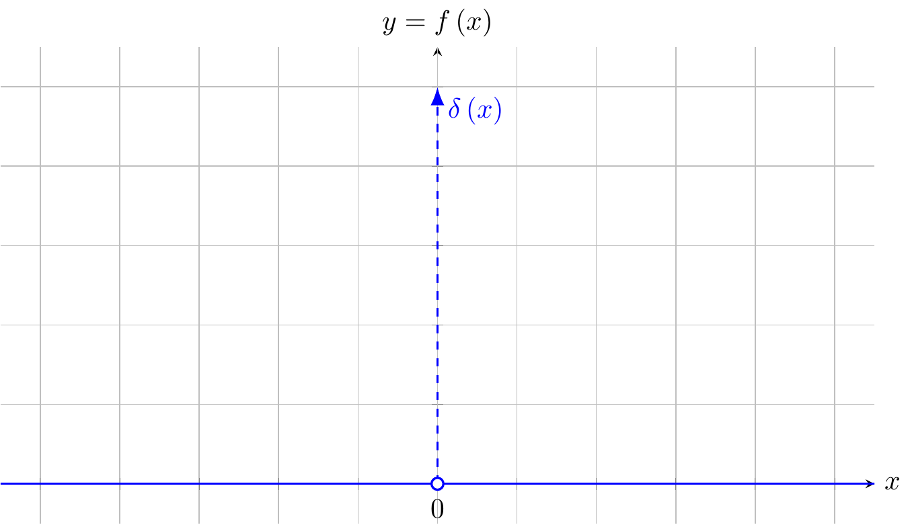
<p class="caption">(\#fig:unnamed-chunk-9)Dirac function = Dirac delta function</p>
</div>
:::

::: {.col data-latex="{0.02\textwidth}"}
\ 
:::

::: {.col data-latex="{0.49\textwidth}"}
$$
\delta\left(x\right)=\begin{cases}
0 & x\ne0\\
\infty & x=0
\end{cases},\int_{-\infty}^{\infty}\delta\left(x\right)\mathrm{d}x=1
$$
:::
::::::

$$
\mathrm{supp}\left(f\right)=\left\{ x\middle|\begin{cases}
x\in\mathcal{D}\\
f\left(x\right)\ne0
\end{cases}\right\} 
$$

$$
\mathrm{supp}\left(\delta\right)=\left\{ x\middle|\begin{cases}
x\in\mathcal{D}=\mathbb{R}\\
\delta\left(x\right)\ne0
\end{cases}\right\} =\left\{ 0\right\} 
$$

:::::: {.cols data-latex=""}
::: {.col data-latex="{0.49\textwidth}"}
<div class="figure">

<p class="caption">(\#fig:unnamed-chunk-10)$f(x)=1 \text{ if } x=0 \text{ else } 0$</p>
</div>
:::

::: {.col data-latex="{0.02\textwidth}"}
\ 
:::

::: {.col data-latex="{0.49\textwidth}"}
$$
f\left(x\right)=\begin{cases}
0 & x\ne0\\
1 & x=0
\end{cases}
$$
:::
::::::

https://tex.stackexchange.com/questions/45275/tikz-get-values-for-predefined-dash-patterns

:::::: {.cols data-latex=""}
::: {.col data-latex="{0.49\textwidth}"}
<div class="figure">

<p class="caption">(\#fig:unnamed-chunk-11)$\delta_{{\scriptscriptstyle n}}\left(x\right)$</p>
</div>
:::

::: {.col data-latex="{0.02\textwidth}"}
\ 
:::

::: {.col data-latex="{0.49\textwidth}"}
$$
\delta_{{\scriptscriptstyle n}}\left(x\right)=\begin{cases}
0 & \left|x\right|>\dfrac{1}{2n}\\
n & \left|x\right|\le\dfrac{1}{2n}
\end{cases},\forall n\in\mathbb{N}
$$

$$
\delta\left(x\right)=\left\{ \delta_{{\scriptscriptstyle n}}\left(x\right)\middle|n\in\mathbb{N}\right\} =\left\{ \delta_{{\scriptscriptstyle 1}}\left(x\right),\delta_{{\scriptscriptstyle 2}}\left(x\right),\cdots\right\} =\lim\limits _{n\rightarrow\infty}\delta_{{\scriptscriptstyle n}}\left(x\right)
$$
:::
::::::

$$
\delta_{{\scriptscriptstyle n}}\left(x\right)=\begin{cases}
0 & \left|x\right|>\dfrac{1}{2n}\Leftrightarrow\begin{cases}
x>\dfrac{1}{2n}\\
x<\dfrac{-1}{2n}
\end{cases}\\
n & \left|x\right|\le\dfrac{1}{2n}\Leftrightarrow\dfrac{-1}{2n}\le x\le\dfrac{1}{2n}\Leftrightarrow x\in\left[\dfrac{-1}{2n},\dfrac{1}{2n}\right]
\end{cases},\forall n\in\mathbb{N}
$$

$$
\int_{-\infty}^{\infty}\delta_{{\scriptscriptstyle n}}\left(x\right)\mathrm{d}x=\int_{-\frac{1}{2n}}^{\frac{1}{2n}}n\mathrm{d}x=n\int_{-\frac{1}{2n}}^{\frac{1}{2n}}\mathrm{d}x=n\left[x\right]_{\frac{-1}{2n}}^{\frac{1}{2n}}=n\left[\frac{1}{2n}-\frac{-1}{2n}\right]=n\cdot\dfrac{1}{n}=1
$$

$$
\begin{aligned}
\int_{-\infty}^{\infty}\delta\left(x\right)f\left(x\right)\mathrm{d}x= & \lim\limits _{n\rightarrow\infty}\int_{-\infty}^{\infty}\delta_{{\scriptscriptstyle n}}\left(x\right)f\left(x\right)\mathrm{d}x\\
= & \lim\limits _{n\rightarrow\infty}\int_{-\frac{1}{2n}}^{\frac{1}{2n}}\delta_{{\scriptscriptstyle n}}\left(x\right)f\left(x\right)\mathrm{d}x\\
= & \lim\limits _{n\rightarrow\infty}\int_{-\frac{1}{2n}}^{\frac{1}{2n}}nf\left(x\right)\mathrm{d}x,\begin{cases}
f\left(x\right)\in\left[m,M\right]\subseteq f\left(\left[\dfrac{-1}{2n},\dfrac{1}{2n}\right]\right)\\
\Downarrow\\
m\le f\left(x\right)\le M
\end{cases}\\
\int_{-\frac{1}{2n}}^{\frac{1}{2n}}nm\mathrm{d}x\le & \int_{-\frac{1}{2n}}^{\frac{1}{2n}}nf\left(x\right)\mathrm{d}x\le\int_{-\frac{1}{2n}}^{\frac{1}{2n}}nM\mathrm{d}x\\
m=m\cdot1=m\int_{-\frac{1}{2n}}^{\frac{1}{2n}}n\mathrm{d}x\le & \int_{-\frac{1}{2n}}^{\frac{1}{2n}}nf\left(x\right)\mathrm{d}x\le M\int_{-\frac{1}{2n}}^{\frac{1}{2n}}n\mathrm{d}x=M\cdot1=M\\
\Downarrow & \ref{thm:IVT}\\
\int_{-\frac{1}{2n}}^{\frac{1}{2n}}nf\left(x\right)\mathrm{d}x\overset{\exists\xi_{{\scriptscriptstyle n}}\in\left(\frac{-1}{2n},\frac{1}{2n}\right)}{=} & f\left(\xi_{{\scriptscriptstyle n}}\right)\int_{-\frac{1}{2n}}^{\frac{1}{2n}}n\mathrm{d}x=f\left(\xi_{{\scriptscriptstyle n}}\right)\cdot1=f\left(\xi_{{\scriptscriptstyle n}}\right)\\
\int_{-\infty}^{\infty}\delta\left(x\right)f\left(x\right)\mathrm{d}x=\lim\limits _{n\rightarrow\infty}\int_{-\frac{1}{2n}}^{\frac{1}{2n}}nf\left(x\right)\mathrm{d}x= & \lim\limits _{n\rightarrow\infty}f\left(\xi_{{\scriptscriptstyle n}}\right),\xi_{{\scriptscriptstyle n}}\in\left(\frac{-1}{2n},\frac{1}{2n}\right)\\
= & f\left(0\right)\\
\int_{-\infty}^{\infty}\delta\left(x\right)f\left(x\right)\mathrm{d}x= & f\left(0\right)
\end{aligned}
$$

$$
\int_{-\infty}^{\infty}\delta\left(x\right)f\left(x\right)\mathrm{d}x=f\left(0\right)
$$

:::::: {.cols data-latex=""}
::: {.col data-latex="{0.49\textwidth}"}
<div class="figure">

<p class="caption">(\#fig:unnamed-chunk-12)$\int_{-\infty}^{\infty}\delta\left(x\right)f\left(x\right)\mathrm{d}x=f\left(0\right)$</p>
</div>
:::

::: {.col data-latex="{0.02\textwidth}"}
\ 
:::

::: {.col data-latex="{0.49\textwidth}"}
$$
\begin{aligned}
\int_{-\infty}^{\infty}\delta\left(x\right)f\left(x\right)\mathrm{d}x= & \lim\limits _{n\rightarrow\infty}\int_{-\frac{1}{2n}}^{\frac{1}{2n}}\delta_{{\scriptscriptstyle n}}\left(x\right)f\left(x\right)\mathrm{d}x\\
= & \lim\limits _{n\rightarrow\infty}\int_{-\frac{1}{2n}}^{\frac{1}{2n}}nf\left(x\right)\mathrm{d}x\\
= & \lim\limits _{n\rightarrow\infty}f\left(\xi_{{\scriptscriptstyle n}}\right),\xi_{{\scriptscriptstyle n}}\in\left(\frac{-1}{2n},\frac{1}{2n}\right)
\end{aligned}
$$

$$
\int_{-\infty}^{\infty}\delta\left(x\right)f\left(x\right)\mathrm{d}x=f\left(0\right)
$$

$$
\int_{-\infty}^{\infty}\delta\left(x-0\right)f\left(x\right)\mathrm{d}x=f\left(0\right)
$$
:::
::::::

***

$$
\int_{-\infty}^{\infty}\delta\left(x\right)f\left(x\right)\mathrm{d}x=f\left(0\right)
$$

$$
\int_{-\infty}^{\infty}\delta\left(x-0\right)f\left(x\right)\mathrm{d}x=f\left(0\right)
$$

https://math.stackexchange.com/questions/73010/proof-of-dirac-deltas-sifting-property

https://www.youtube.com/watch?v=2QaRZ7u-BgM

SIFTing property

SIFT = scale-invariant feature transform

https://en.wikipedia.org/wiki/Scale-invariant_feature_transform

Proof:

Similarly to:

$$
\begin{aligned}
\int_{-\infty}^{\infty}\delta\left(x\right)f\left(x\right)\mathrm{d}x= & \lim\limits _{n\rightarrow\infty}\int_{-\infty}^{\infty}\delta_{{\scriptscriptstyle n}}\left(x\right)f\left(x\right)\mathrm{d}x\\
= & \lim\limits _{n\rightarrow\infty}\int_{-\frac{1}{2n}}^{\frac{1}{2n}}\delta_{{\scriptscriptstyle n}}\left(x\right)f\left(x\right)\mathrm{d}x\\
= & \lim\limits _{n\rightarrow\infty}\int_{-\frac{1}{2n}}^{\frac{1}{2n}}nf\left(x\right)\mathrm{d}x,\begin{cases}
f\left(x\right)\in\left[m,M\right]\subseteq f\left(\left[\dfrac{-1}{2n},\dfrac{1}{2n}\right]\right)\\
\Downarrow\\
m\le f\left(x\right)\le M
\end{cases}\\
\int_{-\frac{1}{2n}}^{\frac{1}{2n}}nm\mathrm{d}x\le & \int_{-\frac{1}{2n}}^{\frac{1}{2n}}nf\left(x\right)\mathrm{d}x\le\int_{-\frac{1}{2n}}^{\frac{1}{2n}}nM\mathrm{d}x\\
m=m\cdot1=m\int_{-\frac{1}{2n}}^{\frac{1}{2n}}n\mathrm{d}x\le & \int_{-\frac{1}{2n}}^{\frac{1}{2n}}nf\left(x\right)\mathrm{d}x\le M\int_{-\frac{1}{2n}}^{\frac{1}{2n}}n\mathrm{d}x=M\cdot1=M\\
\Downarrow & \ref{thm:IVT}\\
\int_{-\frac{1}{2n}}^{\frac{1}{2n}}nf\left(x\right)\mathrm{d}x\overset{\exists\xi_{{\scriptscriptstyle n}}\in\left(\frac{-1}{2n},\frac{1}{2n}\right)}{=} & f\left(\xi_{{\scriptscriptstyle n}}\right)\int_{-\frac{1}{2n}}^{\frac{1}{2n}}n\mathrm{d}x=f\left(\xi_{{\scriptscriptstyle n}}\right)\cdot1=f\left(\xi_{{\scriptscriptstyle n}}\right)\\
\int_{-\infty}^{\infty}\delta\left(x\right)f\left(x\right)\mathrm{d}x=\lim\limits _{n\rightarrow\infty}\int_{-\frac{1}{2n}}^{\frac{1}{2n}}nf\left(x\right)\mathrm{d}x= & \lim\limits _{n\rightarrow\infty}f\left(\xi_{{\scriptscriptstyle n}}\right),\xi_{{\scriptscriptstyle n}}\in\left(\frac{-1}{2n},\frac{1}{2n}\right)\\
= & f\left(0\right)\\
\int_{-\infty}^{\infty}\delta\left(x\right)f\left(x\right)\mathrm{d}x= & f\left(0\right)
\end{aligned}
$$

$f\left(x\right)\in\left[m,M\right]\subseteq f\left(\left[x_{{\scriptscriptstyle 0}}-\frac{1}{2n},x_{{\scriptscriptstyle 0}}+\frac{1}{2n}\right]\right)$,

$$
\begin{aligned}
\int_{-\infty}^{\infty}\delta\left(x-x_{{\scriptscriptstyle 0}}\right)f\left(x\right)\mathrm{d}x= & \lim\limits _{n\rightarrow\infty}\int_{-\infty}^{\infty}\delta_{{\scriptscriptstyle n}}\left(x-x_{{\scriptscriptstyle 0}}\right)f\left(x\right)\mathrm{d}x\\
=\lim\limits _{n\rightarrow\infty}\Biggl[\int_{-\infty}^{x_{{\scriptscriptstyle 0}}-\frac{1}{2n}}\delta_{{\scriptscriptstyle n}}\left(x-x_{{\scriptscriptstyle 0}}\right)f\left(x\right)\mathrm{d}x+ & \int_{x_{{\scriptscriptstyle 0}}-\frac{1}{2n}}^{x_{{\scriptscriptstyle 0}}+\frac{1}{2n}}\delta_{{\scriptscriptstyle n}}\left(x-x_{{\scriptscriptstyle 0}}\right)f\left(x\right)\mathrm{d}x+\lim\limits _{n\rightarrow\infty}\int_{x_{{\scriptscriptstyle 0}}+\frac{1}{2n}}^{\infty}\delta_{{\scriptscriptstyle n}}\left(x-x_{{\scriptscriptstyle 0}}\right)f\left(x\right)\mathrm{d}x\Biggr]\\
=\lim\limits _{n\rightarrow\infty}\Biggl[\int_{-\infty}^{x_{{\scriptscriptstyle 0}}-\frac{1}{2n}}0f\left(x\right)\mathrm{d}x+ & \int_{x_{{\scriptscriptstyle 0}}-\frac{1}{2n}}^{x_{{\scriptscriptstyle 0}}+\frac{1}{2n}}nf\left(x\right)\mathrm{d}x+\lim\limits _{n\rightarrow\infty}\int_{x_{{\scriptscriptstyle 0}}+\frac{1}{2n}}^{\infty}0f\left(x\right)\mathrm{d}x\Biggr]\\
= & \lim\limits _{n\rightarrow\infty}\int_{x_{{\scriptscriptstyle 0}}-\frac{1}{2n}}^{x_{{\scriptscriptstyle 0}}+\frac{1}{2n}}nf\left(x\right)\mathrm{d}x,\begin{cases}
f\left(x\right)\in\left[m,M\right]\subseteq f\left(\left[x_{{\scriptscriptstyle 0}}-\frac{1}{2n},x_{{\scriptscriptstyle 0}}+\frac{1}{2n}\right]\right)\\
\Downarrow\\
m\le f\left(x\right)\le M
\end{cases}\\
\int_{x_{{\scriptscriptstyle 0}}-\frac{1}{2n}}^{x_{{\scriptscriptstyle 0}}+\frac{1}{2n}}nm\mathrm{d}x\le & \int_{x_{{\scriptscriptstyle 0}}-\frac{1}{2n}}^{x_{{\scriptscriptstyle 0}}+\frac{1}{2n}}nf\left(x\right)\mathrm{d}x\le\int_{x_{{\scriptscriptstyle 0}}-\frac{1}{2n}}^{x_{{\scriptscriptstyle 0}}+\frac{1}{2n}}nM\mathrm{d}x\\
m=m\cdot1=m\int_{x_{{\scriptscriptstyle 0}}-\frac{1}{2n}}^{x_{{\scriptscriptstyle 0}}+\frac{1}{2n}}n\mathrm{d}x\le & \int_{x_{{\scriptscriptstyle 0}}-\frac{1}{2n}}^{x_{{\scriptscriptstyle 0}}+\frac{1}{2n}}nf\left(x\right)\mathrm{d}x\le M\int_{x_{{\scriptscriptstyle 0}}-\frac{1}{2n}}^{x_{{\scriptscriptstyle 0}}+\frac{1}{2n}}n\mathrm{d}x=M\cdot1=M\\
\Downarrow & \ref{thm:IVT}\\
\int_{x_{{\scriptscriptstyle 0}}-\frac{1}{2n}}^{x_{{\scriptscriptstyle 0}}+\frac{1}{2n}}nf\left(x\right)\mathrm{d}x\overset{\exists\xi_{{\scriptscriptstyle n}}\in\left(x_{{\scriptscriptstyle 0}}-\frac{1}{2n},x_{{\scriptscriptstyle 0}}+\frac{1}{2n}\right)}{=} & f\left(\xi_{{\scriptscriptstyle n}}\right)\int_{x_{{\scriptscriptstyle 0}}-\frac{1}{2n}}^{x_{{\scriptscriptstyle 0}}+\frac{1}{2n}}n\mathrm{d}x=f\left(\xi_{{\scriptscriptstyle n}}\right)\cdot1=f\left(\xi_{{\scriptscriptstyle n}}\right)\\
\int_{-\infty}^{\infty}\delta\left(x\right)f\left(x\right)\mathrm{d}x=\lim\limits _{n\rightarrow\infty}\int_{x_{{\scriptscriptstyle 0}}-\frac{1}{2n}}^{x_{{\scriptscriptstyle 0}}+\frac{1}{2n}}nf\left(x\right)\mathrm{d}x= & \lim\limits _{n\rightarrow\infty}f\left(\xi_{{\scriptscriptstyle n}}\right),\xi_{{\scriptscriptstyle n}}\in\left(x_{{\scriptscriptstyle 0}}-\frac{1}{2n},x_{{\scriptscriptstyle 0}}+\frac{1}{2n}\right)\\
= & f\left(x_{{\scriptscriptstyle 0}}\right)\\
\int_{-\infty}^{\infty}\delta\left(x-x_{{\scriptscriptstyle 0}}\right)f\left(x\right)\mathrm{d}x= & f\left(x_{{\scriptscriptstyle 0}}\right)
\end{aligned}
$$

$$
\int_{-\infty}^{\infty}\delta\left(x-x_{{\scriptscriptstyle 0}}\right)f\left(x\right)\mathrm{d}x=f\left(x_{{\scriptscriptstyle 0}}\right)
$$

$$
\tag*{$\Box$}
$$

$$
\int_{-\infty}^{\infty}\delta\left(x-x_{{\scriptscriptstyle 0}}\right)f\left(x\right)\mathrm{d}x=f\left(x_{{\scriptscriptstyle 0}}\right)
$$

$$
\int_{-\infty}^{\infty}\delta\left(x-x^{\prime}\right)f\left(x\right)\mathrm{d}x=f\left(x^{\prime}\right)
$$

***

https://www.youtube.com/watch?v=nDa3cqFk80o

$$
\begin{aligned}
 & \left\{ \left\{ f_{{\scriptscriptstyle n}}\left(x\right)\middle|n\in\mathbb{N}\right\} \middle|\begin{cases}
f_{{\scriptscriptstyle n}}:\mathbb{R}\rightarrow\mathbb{R}\\
\int_{-\infty}^{\infty}f_{{\scriptscriptstyle n}}\left(x\right)\mathrm{d}x=1
\end{cases}\right\} \\
=\Biggl\{ & \left\{ \dfrac{n}{2}\mathrm{e}^{-n\left|x\right|}\middle|n\in\mathbb{N}\right\} ,\\
 & \left\{ \dfrac{1}{\pi}\dfrac{n}{n^{2}x^{2}+1}\middle|n\in\mathbb{N}\right\} ,\\
 & \left\{ \dfrac{n}{\sqrt{\pi}}\mathrm{e}^{-n^{2}x^{2}}\middle|n\in\mathbb{N}\right\} ,\\
 & \left\{ \dfrac{1}{\pi}\dfrac{\sin\left(nx\right)}{x}\middle|n\in\mathbb{N}\right\} ,\cdots\Biggr\}
\end{aligned}
$$

$$
\left\{ \delta\left(x\right)\middle|\begin{cases}
\delta:\mathbb{R}\rightarrow\mathbb{R}\\
\int_{-\infty}^{\infty}\delta\left(x\right)\cdot1\mathrm{d}x=1
\end{cases}\right\} 
$$

$$
\left\{ \delta\left(x\right)\middle|\begin{cases}
\delta:\mathbb{R}\rightarrow\mathbb{R}\\
\int_{-\infty}^{\infty}\delta\left(x-0\right)\cdot f\left(x\right)\mathrm{d}x=f\left(0\right)
\end{cases}\right\} 
$$

In measure theory, we can define the distance of two functions by

$$
d\left(f,g\right)=\sqrt{\int_{-\infty}^{\infty}\left[f\left(x\right)-g\left(x\right)\right]^{2}\mathrm{d}x}
$$

for real distance of two square delta function approximations,

$$
\begin{aligned}
d\left(\delta_{{\scriptscriptstyle m}},\delta_{{\scriptscriptstyle n}}\right)= & \sqrt{\int_{-\infty}^{\infty}\left[\delta_{{\scriptscriptstyle m}}\left(x\right)-\delta_{{\scriptscriptstyle n}}\left(x\right)\right]^{2}\mathrm{d}x}\\
= & \sqrt{\int_{-\infty}^{\infty}\left[\delta_{{\scriptscriptstyle m}}\left(x\right)\right]^{2}-2\delta_{{\scriptscriptstyle m}}\left(x\right)\delta_{{\scriptscriptstyle n}}\left(x\right)+\left[\delta_{{\scriptscriptstyle n}}\left(x\right)\right]^{2}\mathrm{d}x}\\
= & \sqrt{\int_{-\infty}^{\infty}\left[\delta_{{\scriptscriptstyle m}}\left(x\right)\right]^{2}\mathrm{d}x-2\int_{-\infty}^{\infty}\delta_{{\scriptscriptstyle m}}\left(x\right)\delta_{{\scriptscriptstyle n}}\left(x\right)\mathrm{d}x+\int_{-\infty}^{\infty}\left[\delta_{{\scriptscriptstyle n}}\left(x\right)\right]^{2}\mathrm{d}x}\\
= & \sqrt{\int_{-\infty}^{\infty}\delta_{{\scriptscriptstyle m}}\left(x\right)\delta_{{\scriptscriptstyle m}}\left(x\right)\mathrm{d}x-2\int_{-\infty}^{\infty}\delta_{{\scriptscriptstyle m}}\left(x\right)\delta_{{\scriptscriptstyle n}}\left(x\right)\mathrm{d}x+\int_{-\infty}^{\infty}\delta_{{\scriptscriptstyle n}}\left(x\right)\delta_{{\scriptscriptstyle n}}\left(x\right)\mathrm{d}x}\\
= & \sqrt{\delta_{{\scriptscriptstyle m}}\left(\xi_{{\scriptscriptstyle m}}\right)-2\int_{-\infty}^{\infty}\delta_{{\scriptscriptstyle m}}\left(x\right)\delta_{{\scriptscriptstyle n}}\left(x\right)\mathrm{d}x+\delta_{{\scriptscriptstyle n}}\left(\xi_{{\scriptscriptstyle n}}\right)},\begin{cases}
\xi_{{\scriptscriptstyle m}}\in\left(\frac{-1}{2m},\frac{1}{2m}\right)\\
\xi_{{\scriptscriptstyle n}}\in\left(\frac{-1}{2n},\frac{1}{2n}\right)
\end{cases}\\
= & \sqrt{m-2\int_{-\infty}^{\infty}\delta_{{\scriptscriptstyle m}}\left(x\right)\delta_{{\scriptscriptstyle n}}\left(x\right)\mathrm{d}x+n},\text{ if }m>n\\
= & \sqrt{m-2\delta_{{\scriptscriptstyle n}}\left(\xi_{{\scriptscriptstyle n}}\right)+n},\xi_{{\scriptscriptstyle n}}\in\left(\frac{-1}{2n},\frac{1}{2n}\right)\\
= & \sqrt{m-2n+n}=\sqrt{m-n}\in\mathbb{R}\\
d\left(\delta_{{\scriptscriptstyle m}},\delta_{{\scriptscriptstyle n}}\right)\overset{m>n}{=} & \sqrt{m-n}\in\mathbb{R}
\end{aligned}
$$

$$
\left\langle d\left(\delta_{{\scriptscriptstyle m}},\delta_{{\scriptscriptstyle n}}\right)\right\rangle _{{\scriptscriptstyle n\in\mathbb{N}}}=\left\langle \sqrt{m-n}\right\rangle _{{\scriptscriptstyle n\in\mathbb{N}}}\text{ is not a Cauchy series, not even mentioned convergence}
$$

Def: \@ref(def:cauchy-sequence)

### complex delta function

$$
\delta\left(k\right)=\frac{1}{2\pi}\int_{-\infty}^{\infty}\mathrm{e}^{\mathrm{i}kx}\mathrm{d}x
$$

$$
\begin{aligned}
 & \int_{-\infty}^{\infty}\left(\frac{1}{2\pi}\int_{-\infty}^{\infty}\mathrm{e}^{\mathrm{i}kx}\mathrm{d}x\right)f\left(k,x\right)\mathrm{d}k\\
= & \lim\limits _{k^{\prime}\rightarrow0}\left[\int_{-\infty}^{k^{\prime-}}\left(\frac{1}{2\pi}\int_{-\infty}^{\infty}\mathrm{e}^{\mathrm{i}kx}\mathrm{d}x\right)f\left(k,x\right)\mathrm{d}k+\int_{k^{\prime-}}^{k^{\prime+}}\left(\frac{1}{2\pi}\int_{-\infty}^{\infty}\mathrm{e}^{\mathrm{i}kx}\mathrm{d}x\right)f\left(k,x\right)\mathrm{d}k+\int_{k^{\prime+}}^{\infty}\left(\frac{1}{2\pi}\int_{-\infty}^{\infty}\mathrm{e}^{\mathrm{i}kx}\mathrm{d}x\right)f\left(k,x\right)\mathrm{d}k\right]\\
\approx & \lim\limits _{k^{\prime}\rightarrow0}\left[\int_{-\infty}^{0}\left(\frac{1}{2\pi}\int_{-\infty}^{\infty}\mathrm{e}^{\mathrm{i}kx}\mathrm{d}x\right)f\left(k,x\right)\mathrm{d}k+\int_{k^{\prime-}}^{k^{\prime+}}\left(\frac{1}{2\pi}\int_{-\infty}^{\infty}\mathrm{e}^{\mathrm{i}0x}\mathrm{d}x\right)f\left(0,x\right)\mathrm{d}k+\int_{0}^{\infty}\left(\frac{1}{2\pi}\int_{-\infty}^{\infty}\mathrm{e}^{\mathrm{i}kx}\mathrm{d}x\right)f\left(k,x\right)\mathrm{d}k\right]\\
\approx & \lim\limits _{k^{\prime}\rightarrow0}\left[\int_{-\infty}^{0}\left(\frac{1}{2\pi}\int_{-\infty}^{\infty}\mathrm{e}^{\mathrm{i}kx}\mathrm{d}x\right)f\left(k,x\right)\mathrm{d}k+\int_{k^{\prime-}}^{k^{\prime+}}\left(\frac{1}{2\pi}\int_{-\infty}^{\infty}1\mathrm{d}x\right)f\left(0,x\right)\mathrm{d}k+\int_{0}^{\infty}\left(\frac{1}{2\pi}\int_{-\infty}^{\infty}\mathrm{e}^{\mathrm{i}kx}\mathrm{d}x\right)f\left(k,x\right)\mathrm{d}k\right]\\
\approx & \lim\limits _{k^{\prime}\rightarrow0}\left[-\int_{0}^{\infty}\left(\frac{1}{2\pi}\int_{-\infty}^{\infty}\mathrm{e}^{-\mathrm{i}kx}\mathrm{d}x\right)f\left(k,x\right)\mathrm{d}k+\int_{k^{\prime-}}^{k^{\prime+}}\left(\frac{1}{2\pi}\int_{-\infty}^{\infty}1\mathrm{d}x\right)f\left(0,x\right)\mathrm{d}k+\int_{0}^{\infty}\left(\frac{1}{2\pi}\int_{-\infty}^{\infty}\mathrm{e}^{\mathrm{i}kx}\mathrm{d}x\right)f\left(k,x\right)\mathrm{d}k\right]\\
\approx & \lim\limits _{k^{\prime}\rightarrow0}\left[-\int_{0}^{\infty}\left(\frac{1}{2\pi}\int_{-\infty}^{\infty}\mathrm{e}^{-\mathrm{i}kx}\mathrm{d}x\right)f\left(x\right)\mathrm{d}k+\int_{k^{\prime-}}^{k^{\prime+}}\left(\frac{1}{2\pi}\infty\right)f\left(0,x\right)\mathrm{d}k+\int_{0}^{\infty}\left(\frac{1}{2\pi}\int_{-\infty}^{\infty}\mathrm{e}^{\mathrm{i}kx}\mathrm{d}x\right)f\left(k,x\right)\mathrm{d}k\right]\\
\approx & \lim\limits _{k^{\prime}\rightarrow0}\left[\int_{k^{\prime-}}^{k^{\prime+}}\dfrac{1}{\mathrm{d}k}f\left(0,x\right)\mathrm{d}k+\int_{0}^{\infty}\left(\frac{1}{2\pi}\int_{-\infty}^{\infty}\mathrm{e}^{\mathrm{i}kx}-\mathrm{e}^{-\mathrm{i}kx}\mathrm{d}x\right)f\left(k,x\right)\mathrm{d}k\right]\\
\approx & \lim\limits _{k^{\prime}\rightarrow0}\left[f\left(0,x\right)+\int_{0}^{\infty}\left(\frac{1}{2\pi}0\right)f\left(k,x\right)\mathrm{d}k\right]\approx f\left(0,x\right)\\
 & f\left(0,x\right)=\int_{-\infty}^{\infty}\left(\frac{1}{2\pi}\int_{-\infty}^{\infty}\mathrm{e}^{\mathrm{i}kx}\mathrm{d}x\right)f\left(k,x\right)\mathrm{d}k=\int_{-\infty}^{\infty}\delta\left(k\right)f\left(k,x\right)\mathrm{d}k=\int_{-\infty}^{\infty}\delta\left(k-0\right)f\left(k,x\right)\mathrm{d}k
\end{aligned}
$$

https://tex.stackexchange.com/questions/150138/how-can-i-create-a-polar-plot-on-a-cartesian-grid

:::::: {.cols data-latex=""}
::: {.col data-latex="{0.49\textwidth}"}
<div class="figure">

<p class="caption">(\#fig:unnamed-chunk-13)$\int_{-\infty}^{\infty}\left(\frac{1}{2\pi}\int_{-\infty}^{\infty}\mathrm{e}^{\mathrm{i}kx}\mathrm{d}x\right)f\left(k,x\right)\mathrm{d}k$</p>
</div>
:::

::: {.col data-latex="{0.02\textwidth}"}
\ 
:::

::: {.col data-latex="{0.49\textwidth}"}
$$
\begin{aligned}
f\left(0,x\right)= & \int_{-\infty}^{\infty}\left(\frac{1}{2\pi}\int_{-\infty}^{\infty}\mathrm{e}^{\mathrm{i}kx}\mathrm{d}x\right)f\left(k,x\right)\mathrm{d}k\\
= & \int_{-\infty}^{\infty}\delta\left(k-0\right)f\left(k,x\right)\mathrm{d}k
\end{aligned}
$$
:::
::::::

***

[@bernstein2004a] p.18~20

$$
\delta\left(x\right)=\begin{cases}
0 & x\ne0\\
\int_{-\infty}^{\infty}\delta\left(x\right)\mathrm{d}x=1
\end{cases}
$$

According the SIFTing property above,

$$
\int_{-\infty}^{\infty}\delta\left(x-x^{\prime}\right)f\left(x\right)\mathrm{d}x=f\left(x^{\prime}\right)
$$

And according to Fourier transform and inverse transform, [Fourier analysis]^[\@ref(fourier-analysis)]^ with $2\pi$ in the powers,

$$
f\left(x\right)=\int_{-\infty}^{\infty}\mathrm{e}^{2\pi\mathrm{i}xk}\left(\int_{-\infty}^{\infty}\mathrm{e}^{-2\pi\mathrm{i}kx^{\prime}}f\left(x^{\prime}\right)\mathrm{d}x^{\prime}\right)\mathrm{d}k
$$

$$
\begin{aligned}
f\left(x\right)= & \int_{-\infty}^{\infty}\mathrm{e}^{2\pi\mathrm{i}xk}\left(\int_{-\infty}^{\infty}\mathrm{e}^{-2\pi\mathrm{i}kx^{\prime}}f\left(x^{\prime}\right)\mathrm{d}x^{\prime}\right)\mathrm{d}k\\
= & \int_{-\infty}^{\infty}\mathrm{e}^{2\pi\mathrm{i}xk}f\left(x^{\prime}\right)\mathrm{d}x^{\prime}\left(\int_{-\infty}^{\infty}\mathrm{e}^{-2\pi\mathrm{i}kx^{\prime}}\right)\mathrm{d}k\\
= & \int_{-\infty}^{\infty}f\left(x^{\prime}\right)\mathrm{d}x^{\prime}\left(\int_{-\infty}^{\infty}\mathrm{e}^{2\pi\mathrm{i}xk}\mathrm{e}^{-2\pi\mathrm{i}kx^{\prime}}\right)\mathrm{d}k\\
= & \int_{-\infty}^{\infty}f\left(x^{\prime}\right)\mathrm{d}x^{\prime}\left(\int_{-\infty}^{\infty}\mathrm{e}^{2\pi\mathrm{i}k\left(x-x^{\prime}\right)}\right)\mathrm{d}k\\
= & \int_{-\infty}^{\infty}\left(\int_{-\infty}^{\infty}\mathrm{e}^{2\pi\mathrm{i}k\left(x-x^{\prime}\right)}\right)f\left(x^{\prime}\right)\mathrm{d}x^{\prime}\mathrm{d}k\\
\overset{\text{Fubini}}{=} & \int_{-\infty}^{\infty}\left(\int_{-\infty}^{\infty}\mathrm{e}^{2\pi\mathrm{i}k\left(x-x^{\prime}\right)}\right)f\left(x^{\prime}\right)\mathrm{d}k\mathrm{d}x^{\prime}\\
= & \int_{-\infty}^{\infty}\left(\int_{-\infty}^{\infty}\mathrm{e}^{2\pi\mathrm{i}k\left(x-x^{\prime}\right)}\mathrm{d}k\right)f\left(x^{\prime}\right)\mathrm{d}x^{\prime}\\
f\left(x\right)= & \int_{-\infty}^{\infty}\left(\int_{-\infty}^{\infty}\mathrm{e}^{2\pi\mathrm{i}k\left(x-x^{\prime}\right)}\mathrm{d}k\right)f\left(x^{\prime}\right)\mathrm{d}x^{\prime}
\end{aligned}
$$

comparing with SIFTing definition of Dirac delta function,

$$
\int_{-\infty}^{\infty}\delta\left(x-x^{\prime}\right)f\left(x\right)\mathrm{d}x=f\left(x^{\prime}\right)
$$

thus

$$
\int_{-\infty}^{\infty}\mathrm{e}^{2\pi\mathrm{i}k\left(x-x^{\prime}\right)}\mathrm{d}k=\delta\left(x-x^{\prime}\right)
$$

i.e.

$$
\delta\left(x-x^{\prime}\right)=\int_{-\infty}^{\infty}\mathrm{e}^{2\pi\mathrm{i}k\left(x-x^{\prime}\right)}\mathrm{d}k
$$

$$
\begin{aligned}
f\left(x\right)= & \int_{-\infty}^{\infty}\left(\int_{-\infty}^{\infty}\mathrm{e}^{2\pi\mathrm{i}k\left(x-x^{\prime}\right)}\mathrm{d}k\right)f\left(x^{\prime}\right)\mathrm{d}x^{\prime}\\
= & \int_{-\infty}^{\infty}\delta\left(x-x^{\prime}\right)f\left(x^{\prime}\right)\mathrm{d}x^{\prime},\begin{cases}
k^{\prime}=2\pi k & \Leftrightarrow k=\dfrac{k^{\prime}}{2\pi}\\
x-x^{\prime}=\varepsilon & \Leftrightarrow x^{\prime}=x-\varepsilon
\end{cases}\\
= & \int_{-\infty}^{\infty}\left(\dfrac{1}{2\pi}\int_{-\infty}^{\infty}\mathrm{e}^{\mathrm{i}\varepsilon k^{\prime}}\mathrm{d}k^{\prime}\right)f\left(x^{\prime}\right)\mathrm{d}x^{\prime}=\int_{-\infty}^{\infty}\lim\limits _{K\rightarrow\infty}\left(\dfrac{1}{2\pi}\int_{-K}^{K}\mathrm{e}^{\mathrm{i}\varepsilon k^{\prime}}\mathrm{d}k^{\prime}\right)f\left(x^{\prime}\right)\mathrm{d}x^{\prime},K>0\\
= & \int_{-\infty}^{\infty}\lim\limits _{K\rightarrow\infty}\left(\dfrac{1}{2\pi}\left[\dfrac{\mathrm{e}^{\mathrm{i}\varepsilon k^{\prime}}}{\mathrm{i}\varepsilon}\right]_{{\scriptscriptstyle k^{\prime}=-K}}^{{\scriptscriptstyle K}}\right)f\left(x^{\prime}\right)\mathrm{d}x^{\prime}=\int_{-\infty}^{\infty}\lim\limits _{K\rightarrow\infty}\left(\dfrac{1}{2\pi}\left[\dfrac{\mathrm{e}^{\mathrm{i}\varepsilon K}-\mathrm{e}^{\mathrm{i}\varepsilon\left(-K\right)}}{\mathrm{i}\varepsilon}\right]\right)f\left(x^{\prime}\right)\mathrm{d}x^{\prime}\\
= & \int_{-\infty}^{\infty}\lim\limits _{K\rightarrow\infty}\left(\dfrac{1}{\pi\varepsilon}\left[\dfrac{\mathrm{e}^{\mathrm{i}\varepsilon K}-\mathrm{e}^{-\mathrm{i}\varepsilon K}}{2\mathrm{i}}\right]\right)f\left(x^{\prime}\right)\mathrm{d}x^{\prime}=\int_{-\infty}^{\infty}\lim\limits _{K\rightarrow\infty}\left(\dfrac{1}{\pi\varepsilon}\left[\sin\left(\varepsilon K\right)\right]\right)f\left(x^{\prime}\right)\mathrm{d}x^{\prime}\\
= & \int_{-\infty}^{\infty}\lim\limits _{K\rightarrow\infty}\left(\dfrac{1}{\pi}\dfrac{\sin\left(\varepsilon K\right)}{\varepsilon}\right)f\left(x^{\prime}\right)\mathrm{d}x^{\prime}=\int_{-\infty}^{\infty}\lim\limits _{K\rightarrow\infty}\left(\dfrac{1}{\pi}\dfrac{\sin\left(K\varepsilon\right)}{\varepsilon}\right)f\left(x^{\prime}\right)\mathrm{d}x^{\prime},\begin{cases}
x^{\prime}-x=-\varepsilon & \Leftrightarrow\varepsilon=x-x^{\prime}\\
 & \Downarrow x=0\\
x^{\prime}=-\varepsilon & \Leftrightarrow\varepsilon=-x^{\prime}\\
Kx^{\prime}=u & \Leftrightarrow x^{\prime}=\dfrac{u}{K}
\end{cases}\\
\overset{x=0}{=} & \int_{-\infty}^{\infty}\lim\limits _{K\rightarrow\infty}\left(\dfrac{1}{\pi}\dfrac{\sin\left(K\left[-x^{\prime}\right]\right)}{-x^{\prime}}\right)f\left(x^{\prime}\right)\mathrm{d}x^{\prime}=\int_{-\infty}^{\infty}\lim\limits _{K\rightarrow\infty}\left(\dfrac{1}{\pi}\dfrac{-\sin\left(Kx^{\prime}\right)}{-x^{\prime}}\right)f\left(x^{\prime}\right)\mathrm{d}x^{\prime}\\
= & \int_{x^{\prime}=-\infty}^{x^{\prime}=\infty}\lim\limits _{K\rightarrow\infty}\left(\dfrac{1}{\pi}\dfrac{\sin\left(Kx^{\prime}\right)}{x^{\prime}}\right)f\left(x^{\prime}\right)\mathrm{d}x^{\prime},\begin{cases}
x^{\prime}=-\varepsilon & \Leftrightarrow\varepsilon=-x^{\prime}\\
Kx^{\prime}=u & \Leftrightarrow x^{\prime}=\dfrac{u}{K},\wedge K>0
\end{cases}\\
= & \int_{\dfrac{u}{K}=-\infty}^{\dfrac{u}{K}=\infty}\lim\limits _{K\rightarrow\infty}\left(\dfrac{1}{\pi}\dfrac{\sin\left(u\right)}{\dfrac{u}{K}}\right)f\left(\dfrac{u}{K}\right)\mathrm{d}\dfrac{u}{K}=\int_{u=-\infty}^{u=\infty}\lim\limits _{K\rightarrow\infty}\left(\dfrac{K}{\pi}\dfrac{\sin\left(u\right)}{u}\right)f\left(\dfrac{u}{K}\right)\dfrac{1}{K}\mathrm{d}u\\
= & \int_{-\infty}^{\infty}\lim\limits _{K\rightarrow\infty}\left(\dfrac{K}{\pi}\dfrac{\sin\left(u\right)}{u}\right)f\left(\dfrac{u}{K}\right)\dfrac{1}{K}\mathrm{d}u=\int_{-\infty}^{\infty}\lim\limits _{K\rightarrow\infty}\left(\dfrac{1}{\pi}\dfrac{\sin\left(u\right)}{u}\right)f\left(\dfrac{u}{K}\right)\mathrm{d}u\\
= & \dfrac{1}{\pi}\lim\limits _{K\rightarrow\infty}\int_{-\infty}^{\infty}\dfrac{\sin\left(u\right)}{u}f\left(\dfrac{u}{K}\right)\mathrm{d}u\overset{\text{MVT}}{=}\dfrac{1}{\pi}\lim\limits _{K\rightarrow\infty}f\left(\dfrac{\xi}{K}\right)\int_{-\infty}^{\infty}\dfrac{\sin\left(u\right)}{u}\mathrm{d}u,\exists\xi\in\left(-\epsilon,+\epsilon\right),\epsilon\in\mathbb{R}_{{\scriptscriptstyle >0}}\\
= & \dfrac{1}{\pi}f\left(0\right)\int_{-\infty}^{\infty}\dfrac{\sin\left(u\right)}{u}\mathrm{d}u\overset{\text{Feynman method or residue method}}{=}\dfrac{1}{\pi}f\left(0\right)\pi=f\left(0\right)=\left[f\left(x\right)\right]_{{\scriptscriptstyle x=0}}
\end{aligned}
$$

$\int_{-\infty}^{\infty}\dfrac{\sin\left(u\right)}{u}\mathrm{d}u=\pi$ see [Feynman method of integration / integral technique]^[\@ref(feynman-method-of-integration-integral-technique)]^

***

According to Fourier transform and inverse transform, [Fourier analysis]^[\@ref(fourier-analysis)]^ without $2\pi$ in the powers,

$$
f\left(t\right)=\frac{1}{2\pi}\int_{-\infty}^{\infty}\mathrm{e}^{\mathrm{i}t\cdot\omega}\left(\int_{-\infty}^{\infty}\mathrm{e}^{-\mathrm{i}\omega\cdot s}f\left(s\right)\mathrm{d}s\right)\mathrm{d}\omega
$$

$$
f\left(x\right)=\frac{1}{2\pi}\int_{-\infty}^{\infty}\mathrm{e}^{\mathrm{i}xk}\left(\int_{-\infty}^{\infty}\mathrm{e}^{-\mathrm{i}kx^{\prime}}f\left(x^{\prime}\right)\mathrm{d}x^{\prime}\right)\mathrm{d}k
$$

or

$$
f\left(t\right)=\frac{1}{\sqrt{2\pi}}\int_{-\infty}^{\infty}\mathrm{e}^{\mathrm{i}t\cdot\omega}\left(\frac{1}{\sqrt{2\pi}}\int_{-\infty}^{\infty}\mathrm{e}^{-\mathrm{i}\imath\omega\cdot s}f\left(s\right)\mathrm{d}s\right)\mathrm{d}\omega
$$

$$
f\left(t\right)=\frac{1}{\sqrt{2\pi}}\int_{-\infty}^{\infty}\mathrm{e}^{\mathrm{i}xk}\left(\frac{1}{\sqrt{2\pi}}\int_{-\infty}^{\infty}\mathrm{e}^{-\mathrm{i}kx^{\prime}}f\left(x^{\prime}\right)\mathrm{d}x^{\prime}\right)\mathrm{d}k
$$

***

complex function if analytic always with better properties than real function

$$
\begin{aligned}
 & \left\{ \left\{ \delta\left(k\right)\middle|k\in\mathbb{R}\right\} \middle|\begin{cases}
\delta:\mathbb{R}\rightarrow\mathbb{C}\\
\int_{-\infty}^{\infty}\delta\left(k-0\right)f\left(k,x\right)\mathrm{d}k=f\left(0,x\right)
\end{cases}\right\} \\
= & \left\{ \left\{ K\int_{-\infty}^{\infty}\mathrm{e}^{\mathrm{i}kx}\left(\cdot\right)\mathrm{d}k\middle|k\in\mathbb{R}\right\} ,\cdots\right\} 
\end{aligned}
$$

***

$$
\delta\left(k\right)=\frac{1}{2\pi}\int_{-\infty}^{\infty}\mathrm{e}^{\mathrm{i}kx}\left(\cdot\right)\mathrm{d}x
$$

$$
\delta\left(x\right)=\frac{1}{2\pi}\int_{-\infty}^{\infty}\mathrm{e}^{\mathrm{i}kx}\left(\cdot\right)\mathrm{d}k
$$

$$
\delta\left(x^{\prime}\right)=\frac{1}{2\pi}\int_{-\infty}^{\infty}\mathrm{e}^{\mathrm{i}kx^{\prime}}\left(\cdot\right)\mathrm{d}k
$$

***

$\psi\left(x\right)=\frac{1}{\sqrt{2\pi}}\int_{-\infty}^{\infty}\mathrm{e}^{\mathrm{i}kx}\psi\left(k\right)\mathrm{d}k$

$$
\psi\left(k\right)=\dfrac{1}{\sqrt{2\pi}}\int\mathrm{e}^{-\mathrm{i}kx}\psi\left(x\right)\mathrm{d}x
$$

$$
\begin{aligned}
 & \frac{1}{\sqrt{2\pi}}\int_{-\infty}^{\infty}\mathrm{e}^{\mathrm{i}kx}\psi\left(k\right)\mathrm{d}k\\
= & \frac{1}{\sqrt{2\pi}}\int_{-\infty}^{\infty}\mathrm{e}^{\mathrm{i}kx}\left(\dfrac{1}{\sqrt{2\pi}}\int_{-\infty}^{\infty}\mathrm{e}^{-\mathrm{i}kx^{\prime}}\psi\left(x^{\prime}\right)\mathrm{d}x^{\prime}\right)\mathrm{d}k\\
= & \frac{1}{2\pi}\int_{-\infty}^{\infty}\left(\int_{-\infty}^{\infty}\mathrm{e}^{\mathrm{i}kx}\mathrm{e}^{-\mathrm{i}kx^{\prime}}\psi\left(x^{\prime}\right)\mathrm{d}x^{\prime}\right)\mathrm{d}k\\
\overset{\text{Fubini}}{=} & \frac{1}{2\pi}\int_{-\infty}^{\infty}\left(\int_{-\infty}^{\infty}\mathrm{e}^{\mathrm{i}k\left(x-x^{\prime}\right)}\psi\left(x^{\prime}\right)\mathrm{d}k\right)\mathrm{d}x^{\prime}\\
= & \int_{-\infty}^{\infty}\left(\frac{1}{2\pi}\int_{-\infty}^{\infty}\mathrm{e}^{\mathrm{i}k\left(x-x^{\prime}\right)}\psi\left(x^{\prime}\right)\mathrm{d}k\right)\mathrm{d}x^{\prime}\\
= & \int_{-\infty}^{\infty}\psi\left(x^{\prime}\right)\left(\frac{1}{2\pi}\int_{-\infty}^{\infty}\mathrm{e}^{\mathrm{i}k\left(x-x^{\prime}\right)}\mathrm{d}k\right)\mathrm{d}x^{\prime}\\
= & \int_{-\infty}^{\infty}\psi\left(x^{\prime}\right)\delta\left(x-x^{\prime}\right)\mathrm{d}x^{\prime}=\int_{-\infty}^{\infty}\delta\left(x-x^{\prime}\right)\psi\left(x^{\prime}\right)\mathrm{d}x^{\prime}=\psi\left(x\right)
\end{aligned}
$$

$$
\psi\left(x\right)=\frac{1}{\sqrt{2\pi}}\int_{-\infty}^{\infty}\mathrm{e}^{\mathrm{i}kx}\psi\left(k\right)\mathrm{d}k
$$

***

$\int_{-\infty}^{\infty}\left|\psi\left(k\right)\right|^{2}\mathrm{d}k=\int_{-\infty}^{\infty}\left|\psi\left(x\right)\right|^{2}\mathrm{d}x$

$$
\begin{cases}
\psi\left(x\right)=\frac{1}{\sqrt{2\pi}}\int_{-\infty}^{\infty}\mathrm{e}^{\mathrm{i}kx}\psi\left(k\right)\mathrm{d}k\\
\psi\left(k\right)=\dfrac{1}{\sqrt{2\pi}}\int_{-\infty}^{\infty}\mathrm{e}^{-\mathrm{i}kx}\psi\left(x\right)\mathrm{d}x
\end{cases}
$$

$$
\begin{aligned}
\psi^{*}\left(k\right)=\overline{\psi}\left(k\right)= & \overline{\dfrac{1}{\sqrt{2\pi}}\int_{-\infty}^{\infty}\mathrm{e}^{-\mathrm{i}kx}\psi\left(x\right)\mathrm{d}x}\\
= & \dfrac{1}{\sqrt{2\pi}}\int_{-\infty}^{\infty}\overline{\mathrm{e}^{-\mathrm{i}kx}\psi\left(x\right)}\mathrm{d}x\\
= & \dfrac{1}{\sqrt{2\pi}}\int_{-\infty}^{\infty}\overline{\mathrm{e}^{-\mathrm{i}kx}}\overline{\psi\left(x\right)}\mathrm{d}x\\
= & \dfrac{1}{\sqrt{2\pi}}\int_{-\infty}^{\infty}\mathrm{e}^{\mathrm{i}kx}\psi^{*}\left(x\right)\mathrm{d}x
\end{aligned}
$$

$$
\begin{aligned}
 & \int_{-\infty}^{\infty}\left|\psi\left(k\right)\right|^{2}\mathrm{d}k=\int_{-\infty}^{\infty}\psi^{*}\left(k\right)\psi\left(k\right)\mathrm{d}k\\
= & \int_{-\infty}^{\infty}\left(\dfrac{1}{\sqrt{2\pi}}\int_{-\infty}^{\infty}\mathrm{e}^{\mathrm{i}kx}\psi^{*}\left(x\right)\mathrm{d}x\right)\left(\dfrac{1}{\sqrt{2\pi}}\int_{-\infty}^{\infty}\mathrm{e}^{-\mathrm{i}kx^{\prime}}\psi\left(x^{\prime}\right)\mathrm{d}x^{\prime}\right)\mathrm{d}k\\
= & \frac{1}{2\pi}\int_{-\infty}^{\infty}\left(\int_{-\infty}^{\infty}\mathrm{e}^{\mathrm{i}kx}\psi^{*}\left(x\right)\mathrm{d}x\right)\left(\int_{-\infty}^{\infty}\mathrm{e}^{-\mathrm{i}kx^{\prime}}\psi\left(x^{\prime}\right)\mathrm{d}x^{\prime}\right)\mathrm{d}k\\
= & \frac{1}{2\pi}\int_{-\infty}^{\infty}\int_{-\infty}^{\infty}\psi^{*}\left(x\right)\int_{-\infty}^{\infty}\mathrm{e}^{\mathrm{i}kx}\mathrm{e}^{-\mathrm{i}kx^{\prime}}\psi\left(x^{\prime}\right)\mathrm{d}x^{\prime}\mathrm{d}x\mathrm{d}k\\
= & \frac{1}{2\pi}\int_{-\infty}^{\infty}\int_{-\infty}^{\infty}\psi^{*}\left(x\right)\int_{-\infty}^{\infty}\mathrm{e}^{\mathrm{i}k\left(x-x^{\prime}\right)}\psi\left(x^{\prime}\right)\mathrm{d}x^{\prime}\mathrm{d}x\mathrm{d}k\\
= & \int_{-\infty}^{\infty}\int_{-\infty}^{\infty}\psi^{*}\left(x\right)\frac{1}{2\pi}\int_{-\infty}^{\infty}\mathrm{e}^{\mathrm{i}k\left(x-x^{\prime}\right)}\psi\left(x^{\prime}\right)\mathrm{d}x^{\prime}\mathrm{d}x\mathrm{d}k\\
\overset{\text{Fubini}}{=} & \int_{-\infty}^{\infty}\int_{-\infty}^{\infty}\psi^{*}\left(x\right)\frac{1}{2\pi}\int_{-\infty}^{\infty}\mathrm{e}^{\mathrm{i}k\left(x-x^{\prime}\right)}\psi\left(x^{\prime}\right)\mathrm{d}k\mathrm{d}x^{\prime}\mathrm{d}x\\
= & \int_{-\infty}^{\infty}\int_{-\infty}^{\infty}\psi^{*}\left(x\right)\psi\left(x^{\prime}\right)\frac{1}{2\pi}\int_{-\infty}^{\infty}\mathrm{e}^{\mathrm{i}k\left(x-x^{\prime}\right)}\mathrm{d}k\mathrm{d}x^{\prime}\mathrm{d}x\\
= & \int_{-\infty}^{\infty}\int_{-\infty}^{\infty}\psi^{*}\left(x\right)\psi\left(x^{\prime}\right)\delta\left(x-x^{\prime}\right)\mathrm{d}x^{\prime}\mathrm{d}x\\
= & \int_{-\infty}^{\infty}\psi^{*}\left(x\right)\int_{-\infty}^{\infty}\psi\left(x^{\prime}\right)\delta\left(x-x^{\prime}\right)\mathrm{d}x^{\prime}\mathrm{d}x\\
= & \int_{-\infty}^{\infty}\psi^{*}\left(x\right)\psi\left(x\right)\mathrm{d}x=\int_{-\infty}^{\infty}\left|\psi\left(x\right)\right|^{2}\mathrm{d}x
\end{aligned}
$$

$$
\int_{-\infty}^{\infty}\left|\psi\left(k\right)\right|^{2}\mathrm{d}k=\int_{-\infty}^{\infty}\left|\psi\left(x\right)\right|^{2}\mathrm{d}x
$$

***

convolution

$\psi\left(x\right)=\int_{-\infty}^{\infty}\psi_{{\scriptscriptstyle 1}}\left(y\right)\psi_{{\scriptscriptstyle 2}}\left(x-y\right)\mathrm{d}y\Rightarrow\psi\left(k\right)=\sqrt{2\pi}\psi_{{\scriptscriptstyle 1}}\left(k\right)\psi_{{\scriptscriptstyle 2}}\left(k\right)$

$$
\psi\left(x\right)=\int_{-\infty}^{\infty}\psi_{{\scriptscriptstyle 1}}\left(y\right)\psi_{{\scriptscriptstyle 2}}\left(x-y\right)\mathrm{d}y
$$

$$
\frac{1}{\sqrt{2\pi}}\int_{-\infty}^{\infty}\mathrm{e}^{\mathrm{i}k_{{\scriptscriptstyle 1}}y}\psi_{{\scriptscriptstyle 1}}\left(k_{{\scriptscriptstyle 1}}\right)\mathrm{d}k_{{\scriptscriptstyle 1}}
$$

$$
\psi_{{\scriptscriptstyle 2}}\left(x-y\right)=\frac{1}{\sqrt{2\pi}}\int_{-\infty}^{\infty}\mathrm{e}^{\mathrm{i}k_{{\scriptscriptstyle 2}}\left(x-y\right)}\psi_{{\scriptscriptstyle 2}}\left(k_{{\scriptscriptstyle 2}}\right)\mathrm{d}k_{{\scriptscriptstyle 2}}
$$

$$
\begin{cases}
\psi\left(x\right)= & \int_{-\infty}^{\infty}\psi_{{\scriptscriptstyle 1}}\left(y\right)\psi_{{\scriptscriptstyle 2}}\left(x-y\right)\mathrm{d}y\\
\psi_{{\scriptscriptstyle 1}}\left(y\right)= & \frac{1}{\sqrt{2\pi}}\int_{-\infty}^{\infty}\mathrm{e}^{\mathrm{i}k_{{\scriptscriptstyle 1}}y}\psi_{{\scriptscriptstyle 1}}\left(k_{{\scriptscriptstyle 1}}\right)\mathrm{d}k_{{\scriptscriptstyle 1}}\\
\psi_{{\scriptscriptstyle 2}}\left(x-y\right)= & \frac{1}{\sqrt{2\pi}}\int_{-\infty}^{\infty}\mathrm{e}^{\mathrm{i}k_{{\scriptscriptstyle 2}}\left(x-y\right)}\psi_{{\scriptscriptstyle 2}}\left(k_{{\scriptscriptstyle 2}}\right)\mathrm{d}k_{{\scriptscriptstyle 2}}
\end{cases}
$$

$$
\begin{aligned}
 & \psi\left(k\right)=\dfrac{1}{\sqrt{2\pi}}\int_{-\infty}^{\infty}\mathrm{e}^{-\mathrm{i}kx}\psi\left(x\right)\mathrm{d}x=\dfrac{1}{\sqrt{2\pi}}\int_{-\infty}^{\infty}\mathrm{e}^{-\mathrm{i}kx}\int_{-\infty}^{\infty}\psi_{{\scriptscriptstyle 1}}\left(y\right)\psi_{{\scriptscriptstyle 2}}\left(x-y\right)\mathrm{d}y\mathrm{d}x\\
= & \dfrac{1}{\left(\sqrt{2\pi}\right)^{3}}\int_{-\infty}^{\infty}\mathrm{e}^{-\mathrm{i}kx}\int_{-\infty}^{\infty}\left(\int_{-\infty}^{\infty}\mathrm{e}^{\mathrm{i}k_{{\scriptscriptstyle 1}}y}\psi_{{\scriptscriptstyle 1}}\left(k_{{\scriptscriptstyle 1}}\right)\mathrm{d}k_{{\scriptscriptstyle 1}}\right)\left(\int_{-\infty}^{\infty}\mathrm{e}^{\mathrm{i}k_{{\scriptscriptstyle 2}}\left(x-y\right)}\psi_{{\scriptscriptstyle 2}}\left(k_{{\scriptscriptstyle 2}}\right)\mathrm{d}k_{{\scriptscriptstyle 2}}\right)\mathrm{d}y\mathrm{d}x\\
= & \dfrac{1}{\left(\sqrt{2\pi}\right)^{3}}\int_{-\infty}^{\infty}\int_{-\infty}^{\infty}\int_{-\infty}^{\infty}\int_{-\infty}^{\infty}\mathrm{e}^{\mathrm{i}k_{{\scriptscriptstyle 1}}y}\mathrm{e}^{-\mathrm{i}k_{{\scriptscriptstyle 2}}y}\psi_{{\scriptscriptstyle 1}}\left(k_{{\scriptscriptstyle 1}}\right)\mathrm{e}^{-\mathrm{i}kx}\mathrm{e}^{\mathrm{i}k_{{\scriptscriptstyle 2}}x}\psi_{{\scriptscriptstyle 2}}\left(k_{{\scriptscriptstyle 2}}\right)\mathrm{d}k_{{\scriptscriptstyle 1}}\mathrm{d}k_{{\scriptscriptstyle 2}}\mathrm{d}y\mathrm{d}x\\
= & \dfrac{1}{\left(\sqrt{2\pi}\right)^{3}}\int_{-\infty}^{\infty}\int_{-\infty}^{\infty}\int_{-\infty}^{\infty}\int_{-\infty}^{\infty}\mathrm{e}^{\mathrm{i}\left(k_{{\scriptscriptstyle 1}}-k_{{\scriptscriptstyle 2}}\right)y}\psi_{{\scriptscriptstyle 1}}\left(k_{{\scriptscriptstyle 1}}\right)\mathrm{e}^{\mathrm{i}\left(k_{{\scriptscriptstyle 2}}-k\right)x}\psi_{{\scriptscriptstyle 2}}\left(k_{{\scriptscriptstyle 2}}\right)\mathrm{d}k_{{\scriptscriptstyle 1}}\mathrm{d}k_{{\scriptscriptstyle 2}}\mathrm{d}y\mathrm{d}x\\
\overset{\text{Fubini}}{=} & \dfrac{1}{\left(\sqrt{2\pi}\right)^{3}}\int_{-\infty}^{\infty}\int_{-\infty}^{\infty}\int_{-\infty}^{\infty}\int_{-\infty}^{\infty}\mathrm{e}^{\mathrm{i}\left(k_{{\scriptscriptstyle 1}}-k_{{\scriptscriptstyle 2}}\right)y}\psi_{{\scriptscriptstyle 1}}\left(k_{{\scriptscriptstyle 1}}\right)\mathrm{e}^{\mathrm{i}\left(k_{{\scriptscriptstyle 2}}-k\right)x}\psi_{{\scriptscriptstyle 2}}\left(k_{{\scriptscriptstyle 2}}\right)\mathrm{d}y\mathrm{d}x\mathrm{d}k_{{\scriptscriptstyle 1}}\mathrm{d}k_{{\scriptscriptstyle 2}}\\
= & \dfrac{1}{\left(\sqrt{2\pi}\right)^{3}}\int_{-\infty}^{\infty}\int_{-\infty}^{\infty}\left(\int_{-\infty}^{\infty}\mathrm{e}^{\mathrm{i}\left(k_{{\scriptscriptstyle 1}}-k_{{\scriptscriptstyle 2}}\right)y}\psi_{{\scriptscriptstyle 1}}\left(k_{{\scriptscriptstyle 1}}\right)\mathrm{d}y\right)\left(\int_{-\infty}^{\infty}\mathrm{e}^{\mathrm{i}\left(k_{{\scriptscriptstyle 2}}-k\right)x}\psi_{{\scriptscriptstyle 2}}\left(k_{{\scriptscriptstyle 2}}\right)\mathrm{d}x\right)\mathrm{d}k_{{\scriptscriptstyle 1}}\mathrm{d}k_{{\scriptscriptstyle 2}}
\end{aligned}
$$

$$
\begin{aligned}
 & \dfrac{1}{\left(\sqrt{2\pi}\right)^{3}}\int_{-\infty}^{\infty}\int_{-\infty}^{\infty}\left(\int_{-\infty}^{\infty}\mathrm{e}^{\mathrm{i}\left(k_{{\scriptscriptstyle 1}}-k_{{\scriptscriptstyle 2}}\right)y}\psi_{{\scriptscriptstyle 1}}\left(k_{{\scriptscriptstyle 1}}\right)\mathrm{d}y\right)\left(\int_{-\infty}^{\infty}\mathrm{e}^{\mathrm{i}\left(k_{{\scriptscriptstyle 2}}-k\right)x}\psi_{{\scriptscriptstyle 2}}\left(k_{{\scriptscriptstyle 2}}\right)\mathrm{d}x\right)\mathrm{d}k_{{\scriptscriptstyle 1}}\mathrm{d}k_{{\scriptscriptstyle 2}}\\
= & \sqrt{2\pi}\int_{-\infty}^{\infty}\int_{-\infty}^{\infty}\left[\frac{1}{2\pi}\int_{-\infty}^{\infty}\mathrm{e}^{\mathrm{i}\left(k_{{\scriptscriptstyle 1}}-k_{{\scriptscriptstyle 2}}\right)y}\psi_{{\scriptscriptstyle 1}}\left(k_{{\scriptscriptstyle 1}}\right)\mathrm{d}y\right]\left[\frac{1}{2\pi}\int_{-\infty}^{\infty}\mathrm{e}^{\mathrm{i}\left(k_{{\scriptscriptstyle 2}}-k\right)x}\psi_{{\scriptscriptstyle 2}}\left(k_{{\scriptscriptstyle 2}}\right)\mathrm{d}x\right]\mathrm{d}k_{{\scriptscriptstyle 1}}\mathrm{d}k_{{\scriptscriptstyle 2}}\\
= & \sqrt{2\pi}\int_{-\infty}^{\infty}\int_{-\infty}^{\infty}\left[\psi_{{\scriptscriptstyle 1}}\left(k_{{\scriptscriptstyle 1}}\right)\frac{1}{2\pi}\int_{-\infty}^{\infty}\mathrm{e}^{\mathrm{i}\left(k_{{\scriptscriptstyle 1}}-k_{{\scriptscriptstyle 2}}\right)y}\mathrm{d}y\right]\left[\psi_{{\scriptscriptstyle 2}}\left(k_{{\scriptscriptstyle 2}}\right)\frac{1}{2\pi}\int_{-\infty}^{\infty}\mathrm{e}^{\mathrm{i}\left(k_{{\scriptscriptstyle 2}}-k\right)x}\mathrm{d}x\right]\mathrm{d}k_{{\scriptscriptstyle 1}}\mathrm{d}k_{{\scriptscriptstyle 2}}\\
= & \sqrt{2\pi}\int_{-\infty}^{\infty}\int_{-\infty}^{\infty}\left[\psi_{{\scriptscriptstyle 1}}\left(k_{{\scriptscriptstyle 1}}\right)\delta\left(k_{{\scriptscriptstyle 1}}-k_{{\scriptscriptstyle 2}}\right)\right]\left[\psi_{{\scriptscriptstyle 2}}\left(k_{{\scriptscriptstyle 2}}\right)\delta\left(k_{{\scriptscriptstyle 2}}-k\right)\right]\mathrm{d}k_{{\scriptscriptstyle 1}}\mathrm{d}k_{{\scriptscriptstyle 2}}\\
\overset{\text{Fubini}}{=} & \sqrt{2\pi}\int_{-\infty}^{\infty}\int_{-\infty}^{\infty}\left[\psi_{{\scriptscriptstyle 1}}\left(k_{{\scriptscriptstyle 1}}\right)\delta\left(k_{{\scriptscriptstyle 1}}-k_{{\scriptscriptstyle 2}}\right)\right]\left[\psi_{{\scriptscriptstyle 2}}\left(k_{{\scriptscriptstyle 2}}\right)\delta\left(k_{{\scriptscriptstyle 2}}-k\right)\right]\mathrm{d}k_{{\scriptscriptstyle 2}}\mathrm{d}k_{{\scriptscriptstyle 1}}\\
= & \sqrt{2\pi}\int_{-\infty}^{\infty}\left[\psi_{{\scriptscriptstyle 1}}\left(k_{{\scriptscriptstyle 1}}\right)\right]\left[\int_{-\infty}^{\infty}\delta\left(k_{{\scriptscriptstyle 1}}-k_{{\scriptscriptstyle 2}}\right)\psi_{{\scriptscriptstyle 2}}\left(k_{{\scriptscriptstyle 2}}\right)\delta\left(k_{{\scriptscriptstyle 2}}-k\right)\mathrm{d}k_{{\scriptscriptstyle 2}}\right]\mathrm{d}k_{{\scriptscriptstyle 1}}\\
= & \sqrt{2\pi}\int_{-\infty}^{\infty}\left[\psi_{{\scriptscriptstyle 1}}\left(k_{{\scriptscriptstyle 1}}\right)\right]\left[\delta\left(k_{{\scriptscriptstyle 1}}-k\right)\psi_{{\scriptscriptstyle 2}}\left(k\right)\right]\mathrm{d}k_{{\scriptscriptstyle 1}}=\sqrt{2\pi}\psi_{{\scriptscriptstyle 2}}\left(k\right)\int_{-\infty}^{\infty}\psi_{{\scriptscriptstyle 1}}\left(k_{{\scriptscriptstyle 1}}\right)\delta\left(k_{{\scriptscriptstyle 1}}-k\right)\mathrm{d}k_{{\scriptscriptstyle 1}}\\
= & \sqrt{2\pi}\psi_{{\scriptscriptstyle 2}}\left(k\right)\psi_{{\scriptscriptstyle 1}}\left(k\right)=\sqrt{2\pi}\psi_{{\scriptscriptstyle 1}}\left(k\right)\psi_{{\scriptscriptstyle 2}}\left(k\right)
\end{aligned}
$$

$$
\begin{array}{c}
\begin{cases}
\psi\left(x\right)= & \int_{-\infty}^{\infty}\psi_{{\scriptscriptstyle 1}}\left(y\right)\psi_{{\scriptscriptstyle 2}}\left(x-y\right)\mathrm{d}y\\
\psi_{{\scriptscriptstyle 1}}\left(y\right)= & \frac{1}{\sqrt{2\pi}}\int_{-\infty}^{\infty}\mathrm{e}^{\mathrm{i}k_{{\scriptscriptstyle 1}}y}\psi_{{\scriptscriptstyle 1}}\left(k_{{\scriptscriptstyle 1}}\right)\mathrm{d}k_{{\scriptscriptstyle 1}}\\
\psi_{{\scriptscriptstyle 2}}\left(x-y\right)= & \frac{1}{\sqrt{2\pi}}\int_{-\infty}^{\infty}\mathrm{e}^{\mathrm{i}k_{{\scriptscriptstyle 2}}\left(x-y\right)}\psi_{{\scriptscriptstyle 2}}\left(k_{{\scriptscriptstyle 2}}\right)\mathrm{d}k_{{\scriptscriptstyle 2}}
\end{cases}\\
\Downarrow\\
\psi\left(k\right)=\sqrt{2\pi}\psi_{{\scriptscriptstyle 1}}\left(k\right)\psi_{{\scriptscriptstyle 2}}\left(k\right)
\end{array}
$$

### 3D delta function

https://www.youtube.com/watch?v=Y8y965ZAmQE

$$
\delta\left(\boldsymbol{r}-\boldsymbol{r}^{\prime}\right)=\delta\left(x-x^{\prime}\right)\delta\left(y-y^{\prime}\right)\delta\left(z-z^{\prime}\right)
$$

Poisson equation

[Feynman method of differentiation / derivative technique]^[\@ref(feynman-method-of-differentiation-derivative-technique)]^

$$
\begin{aligned}
\Delta\left(\dfrac{1}{r}\right)= & \boldsymbol{\nabla}^{2}\left(\dfrac{1}{\sqrt{\boldsymbol{r}^{2}}}\right)=\boldsymbol{\nabla}\cdot\boldsymbol{\nabla}\left(\dfrac{1}{\sqrt{\boldsymbol{r}\cdot\boldsymbol{r}}}\right)=\boldsymbol{\nabla}\cdot\left(\dfrac{\partial}{\partial x},\dfrac{\partial}{\partial y},\dfrac{\partial}{\partial z}\right)\left(\dfrac{1}{\sqrt{x^{2}+y^{2}+z^{2}}}\right)\\
= & \boldsymbol{\nabla}\cdot\left(\dfrac{-x}{\left(x^{2}+y^{2}+z^{2}\right)^{\frac{3}{2}}},\dfrac{-y}{\left(x^{2}+y^{2}+z^{2}\right)^{\frac{3}{2}}},\dfrac{-z}{\left(x^{2}+y^{2}+z^{2}\right)^{\frac{3}{2}}}\right)=\boldsymbol{\nabla}\cdot\dfrac{-\boldsymbol{r}}{r^{3}}\\
= & \left(\dfrac{\partial}{\partial x},\dfrac{\partial}{\partial y},\dfrac{\partial}{\partial z}\right)\cdot\left(\dfrac{-x}{\left(x^{2}+y^{2}+z^{2}\right)^{\frac{3}{2}}},\dfrac{-y}{\left(x^{2}+y^{2}+z^{2}\right)^{\frac{3}{2}}},\dfrac{-z}{\left(x^{2}+y^{2}+z^{2}\right)^{\frac{3}{2}}}\right)\\
= & \dfrac{\partial}{\partial x}\dfrac{-x}{\left(x^{2}+y^{2}+z^{2}\right)^{\frac{3}{2}}}+\dfrac{\partial}{\partial y}\dfrac{-y}{\left(x^{2}+y^{2}+z^{2}\right)^{\frac{3}{2}}}+\dfrac{\partial}{\partial z}\dfrac{-z}{\left(x^{2}+y^{2}+z^{2}\right)^{\frac{3}{2}}}\\
= & \dfrac{+2x^{2}-y^{2}-z^{2}}{\left(x^{2}+y^{2}+z^{2}\right)^{\frac{5}{2}}}+\dfrac{-x^{2}+2y^{2}-z^{2}}{\left(x^{2}+y^{2}+z^{2}\right)^{\frac{5}{2}}}+\dfrac{-x^{2}-y^{2}+2z^{2}}{\left(x^{2}+y^{2}+z^{2}\right)^{\frac{5}{2}}}=0
\end{aligned}
$$

$\Delta\left(\dfrac{1}{r}\right)=-4\pi\delta\left(\boldsymbol{r}\right)$

https://math.stackexchange.com/questions/3774483/derivatives-of-frac1r-and-dirac-delta-function

$$
\begin{aligned}
\Delta\dfrac{1}{r\left(\epsilon\right)}= & \boldsymbol{\nabla}^{2}\dfrac{1}{\sqrt{\boldsymbol{r}^{2}+\epsilon^{2}}}=\boldsymbol{\nabla}\cdot\boldsymbol{\nabla}\dfrac{1}{\sqrt{x^{2}+y^{2}+z^{2}+\epsilon^{2}}}\\
= & \boldsymbol{\nabla}\cdot\left(\dfrac{\partial}{\partial x},\dfrac{\partial}{\partial y},\dfrac{\partial}{\partial z}\right)\left(\dfrac{1}{\sqrt{x^{2}+y^{2}+z^{2}+\epsilon^{2}}}\right)\\
= & \boldsymbol{\nabla}\cdot\left(\dfrac{-x}{\left(x^{2}+y^{2}+z^{2}+\epsilon^{2}\right)^{\frac{3}{2}}},\dfrac{-y}{\left(x^{2}+y^{2}+z^{2}+\epsilon^{2}\right)^{\frac{3}{2}}},\dfrac{-z}{\left(x^{2}+y^{2}+z^{2}+\epsilon^{2}\right)^{\frac{3}{2}}}\right)\\
= & \dfrac{\partial}{\partial x}\dfrac{-x}{\left(x^{2}+y^{2}+z^{2}+\epsilon^{2}\right)^{\frac{3}{2}}}+\dfrac{\partial}{\partial y}\dfrac{-y}{\left(x^{2}+y^{2}+z^{2}+\epsilon^{2}\right)^{\frac{3}{2}}}+\dfrac{\partial}{\partial z}\dfrac{-z}{\left(x^{2}+y^{2}+z^{2}+\epsilon^{2}\right)^{\frac{3}{2}}}\\
= & \dfrac{+2x^{2}-y^{2}-z^{2}-\epsilon^{2}}{\left(x^{2}+y^{2}+z^{2}+\epsilon^{2}\right)^{\frac{5}{2}}}+\dfrac{-x^{2}+2y^{2}-z^{2}-\epsilon^{2}}{\left(x^{2}+y^{2}+z^{2}+\epsilon^{2}\right)^{\frac{5}{2}}}+\dfrac{-x^{2}-y^{2}+2z^{2}-\epsilon^{2}}{\left(x^{2}+y^{2}+z^{2}+\epsilon^{2}\right)^{\frac{5}{2}}}\\
= & \dfrac{-3\epsilon^{2}}{\left(x^{2}+y^{2}+z^{2}+\epsilon^{2}\right)^{\frac{5}{2}}}=\dfrac{-3\epsilon^{2}}{\left(\boldsymbol{r}^{2}+\epsilon^{2}\right)^{\frac{5}{2}}}
\end{aligned}
$$

$$
\Delta\left(\dfrac{1}{r}\right)=\boldsymbol{\nabla}^{2}\left(\dfrac{1}{r}\right)=\boldsymbol{\nabla}^{2}\dfrac{1}{\left|\boldsymbol{r}\right|}=\boldsymbol{\nabla}^{2}\dfrac{1}{\left|\boldsymbol{r}-\boldsymbol{0}\right|}=\Delta\dfrac{1}{\left|\boldsymbol{r}-\boldsymbol{0}\right|}=\Delta\left(\boldsymbol{r}-\boldsymbol{0}\right)=\Delta\left(\boldsymbol{r}\right)
$$

$$
\Delta\dfrac{1}{r\left(\epsilon\right)}=\Delta_{\epsilon}\left(r\right)=\Delta_{\epsilon}\left(\boldsymbol{r}\right)=\Delta_{\epsilon}\left(\boldsymbol{r}-\boldsymbol{0}\right)
$$

$$
\lim\limits _{\epsilon\rightarrow0}\Delta_{\epsilon}\left(\boldsymbol{r}\right)=\lim\limits _{\epsilon\rightarrow0}\Delta\dfrac{1}{r\left(\epsilon\right)}=\Delta\left(\dfrac{1}{r}\right)=\Delta\left(\boldsymbol{r}\right)
$$

$$
K_{{\scriptscriptstyle 3}}\int_{\mathbb{R}^{3}}f\left(\boldsymbol{r}\right)\Delta\left(\boldsymbol{r}\right)\mathrm{d}\boldsymbol{r}=\lim\limits _{\epsilon\rightarrow0}K_{{\scriptscriptstyle 3}}\int_{\mathbb{R}^{3}}f\left(\boldsymbol{r}\right)\Delta_{\epsilon}\left(\boldsymbol{r}\right)\mathrm{d}\boldsymbol{r}=\lim\limits _{\epsilon\rightarrow0}K_{{\scriptscriptstyle 3}}\int_{\mathbb{R}^{3}}f\left(\boldsymbol{r}\right)\Delta_{\epsilon}\left(\boldsymbol{r}-\boldsymbol{0}\right)\mathrm{d}\boldsymbol{r}=f\left(\boldsymbol{0}\right)
$$

$$
K_{{\scriptscriptstyle 1}}\int_{\mathbb{R}^{1}}f\left(x\right)\delta\left(x\right)\mathrm{d}x=\lim\limits _{n\rightarrow\infty}K_{{\scriptscriptstyle 1}}\int_{\mathbb{R}^{1}}f\left(x\right)\delta_{{\scriptscriptstyle n}}\left(x\right)\mathrm{d}x=K_{{\scriptscriptstyle 1}}\int_{\mathbb{R}^{1}}f\left(x\right)\delta_{{\scriptscriptstyle n}}\left(x-0\right)\mathrm{d}x=f\left(0\right)
$$

$$
\begin{aligned}
 & \int_{\mathbb{R}^{3}}f\left(\boldsymbol{r}\right)\Delta_{\epsilon}\left(\boldsymbol{r}\right)\mathrm{d}\boldsymbol{r}=\int_{\mathbb{R}^{3}}f\left(\boldsymbol{r}\right)\dfrac{-3\epsilon^{2}}{\left(\boldsymbol{r}^{2}+\epsilon^{2}\right)^{\frac{5}{2}}}\mathrm{d}\boldsymbol{r},\begin{cases}
\boldsymbol{r}=r\boldsymbol{n}_{\mathbb{{\scriptscriptstyle S}}}\\
\boldsymbol{n}_{\mathbb{{\scriptscriptstyle S}}}=\begin{pmatrix}\sin\phi\cos\theta\\
\sin\phi\sin\theta\\
\cos\phi
\end{pmatrix}
\end{cases}\\
= & \int_{0}^{\infty}\int_{\mathbb{S}^{2}}f\left(r\boldsymbol{n}_{\mathbb{{\scriptscriptstyle S}}}\right)\dfrac{-3\epsilon^{2}}{\left(r^{2}+\epsilon^{2}\right)^{\frac{5}{2}}}r^{2}\sigma\left(\mathrm{d}\boldsymbol{n}_{{\scriptscriptstyle S}}\right)\mathrm{d}r,\begin{cases}
\mathbb{S}^{2}=\text{unit sphere centered at the origin}\\
\sigma\left(\mathrm{d}\boldsymbol{n}_{{\scriptscriptstyle S}}\right)\text{ is the surface measure of }\mathbb{S}^{2}\\
r^{2}\sigma\left(\mathrm{d}\boldsymbol{n}_{{\scriptscriptstyle S}}\right)=r^{2}\sin\phi\mathrm{d}\phi\mathrm{d}\theta\\
r=\epsilon s
\end{cases}\\
= & \int_{0}^{\infty}\int_{\mathbb{S}^{2}}f\left(\epsilon s\boldsymbol{n}_{\mathbb{{\scriptscriptstyle S}}}\right)\dfrac{-3\epsilon^{2}}{\left(\left(\epsilon s\right)^{2}+\epsilon^{2}\right)^{\frac{5}{2}}}\left(\epsilon s\right)^{2}\sigma\left(\mathrm{d}\boldsymbol{n}_{{\scriptscriptstyle S}}\right)\mathrm{d}\epsilon s\\
= & \int_{0}^{\infty}\int_{\mathbb{S}^{2}}f\left(\epsilon s\boldsymbol{n}_{\mathbb{{\scriptscriptstyle S}}}\right)\dfrac{-3\epsilon^{5}}{\epsilon^{5}\left(s^{2}+1\right)^{\frac{5}{2}}}s^{2}\sigma\left(\mathrm{d}\boldsymbol{n}_{{\scriptscriptstyle S}}\right)\mathrm{d}s=-\int_{0}^{\infty}\int_{\mathbb{S}^{2}}f\left(\epsilon s\boldsymbol{n}_{\mathbb{{\scriptscriptstyle S}}}\right)\dfrac{3s^{2}}{\left(s^{2}+1\right)^{\frac{5}{2}}}\sigma\left(\mathrm{d}\boldsymbol{n}_{\mathbb{{\scriptscriptstyle S}}}\right)\mathrm{d}s\\
= & -\int_{0}^{\infty}\int_{0}^{2\pi}\int_{0}^{2\pi}f\left(\epsilon s\boldsymbol{n}_{\mathbb{{\scriptscriptstyle S}}}\right)\dfrac{3s^{2}}{\left(s^{2}+1\right)^{\frac{5}{2}}}\sin\phi\mathrm{d}\phi\mathrm{d}\theta\mathrm{d}s=-\int_{0}^{\infty}4\pi f\left(\epsilon s\boldsymbol{n}_{\mathbb{{\scriptscriptstyle S}}}\right)\dfrac{3s^{2}}{\left(s^{2}+1\right)^{\frac{5}{2}}}\mathrm{d}s
\end{aligned}
$$
$$
\begin{aligned}
 & \lim\limits _{\epsilon\rightarrow0}\int_{\mathbb{R}^{3}}f\left(\boldsymbol{r}\right)\Delta_{\epsilon}\left(\boldsymbol{r}\right)\mathrm{d}\boldsymbol{r}\\
= & \lim\limits _{\epsilon\rightarrow0}\left[-\int_{0}^{\infty}4\pi f\left(\epsilon s\boldsymbol{n}_{\mathbb{{\scriptscriptstyle S}}}\right)\dfrac{3s^{2}}{\left(s^{2}+1\right)^{\frac{5}{2}}}\mathrm{d}s\right]\\
= & -4\pi f\left(\boldsymbol{0}\right)\int_{0}^{\infty}\dfrac{3s^{2}}{\left(s^{2}+1\right)^{\frac{5}{2}}}\mathrm{d}s
\end{aligned}
$$

https://www.integral-calculator.com/

$$
\begin{aligned}
 & \int\dfrac{3s^{2}}{\left(s^{2}+1\right)^{\frac{5}{2}}}\mathrm{d}s,s=\tan u\\
= & \int\dfrac{3\tan^{2}u}{\left(\tan^{2}u+1\right)^{\frac{5}{2}}}\mathrm{d}\tan u=\int\dfrac{3\tan^{2}u}{\left(\tan^{2}u+1\right)^{\frac{5}{2}}}\sec^{2}u\mathrm{d}u\\
= & \int\dfrac{3\tan^{2}u}{\left(\sec^{2}u\right)^{\frac{5}{2}}}\sec^{2}u\mathrm{d}u=\int\dfrac{3\tan^{2}u}{\sec^{5}u}\sec^{2}u\mathrm{d}u=\int\dfrac{3\tan^{2}u}{\sec^{3}u}\mathrm{d}u\\
= & \int\dfrac{3\left(\frac{\sin u}{\cos u}\right)^{2}}{\left(\frac{1}{\cos u}\right)^{3}}\mathrm{d}u=3\int\sin^{2}u\cos u\mathrm{d}u=3\int\sin^{2}u\mathrm{d}\sin u=3\dfrac{\sin^{3}u}{3}+C\\
= & \sin^{3}u+C=\left(\frac{s}{\sqrt{s^{2}+1}}\right)^{3}+C=\dfrac{s^{3}}{\left(s^{2}+1\right)^{\frac{3}{2}}}+C\overset{s>0}{=}\dfrac{1}{\left(1+s^{-2}\right)^{\frac{3}{2}}}+C
\end{aligned}
$$

$$
\int_{0}^{\infty}\dfrac{3s^{2}}{\left(s^{2}+1\right)^{\frac{5}{2}}}\mathrm{d}s=\left[\dfrac{s^{3}}{\left(s^{2}+1\right)^{\frac{3}{2}}}\right]_{0}^{\infty}=\left[\dfrac{1}{\left(1+s^{-2}\right)^{\frac{3}{2}}}\right]_{s=\infty}-\left[\dfrac{s^{3}}{\left(s^{2}+1\right)^{\frac{3}{2}}}\right]_{s=0}=1-0=1
$$

$$
\begin{aligned}
 & \lim\limits _{\epsilon\rightarrow0}\int_{\mathbb{R}^{3}}f\left(\boldsymbol{r}\right)\Delta_{\epsilon}\left(\boldsymbol{r}\right)\mathrm{d}\boldsymbol{r}\\
= & \lim\limits _{\epsilon\rightarrow0}\left[-\int_{0}^{\infty}4\pi f\left(\epsilon s\boldsymbol{n}_{\mathbb{{\scriptscriptstyle S}}}\right)\dfrac{3s^{2}}{\left(s^{2}+1\right)^{\frac{5}{2}}}\mathrm{d}s\right]\\
= & -4\pi f\left(\boldsymbol{0}\right)\int_{0}^{\infty}\dfrac{3s^{2}}{\left(s^{2}+1\right)^{\frac{5}{2}}}\mathrm{d}s=-4\pi f\left(\boldsymbol{0}\right)1=-4\pi f\left(\boldsymbol{0}\right)
\end{aligned}
$$

$$
\int_{\mathbb{R}^{3}}f\left(\boldsymbol{r}\right)\Delta\left(\boldsymbol{r}\right)\mathrm{d}\boldsymbol{r}=\lim\limits _{\epsilon\rightarrow0}\int_{\mathbb{R}^{3}}f\left(\boldsymbol{r}\right)\Delta_{\epsilon}\left(\boldsymbol{r}\right)\mathrm{d}\boldsymbol{r}=-4\pi f\left(\boldsymbol{0}\right)=-4\pi\int_{\mathbb{R}^{3}}f\left(\boldsymbol{r}\right)\delta\left(\boldsymbol{r}\right)\mathrm{d}\boldsymbol{r}
$$

$$
\Delta\left(\dfrac{1}{r}\right)=\Delta\left(\boldsymbol{r}\right)=-4\pi\delta\left(\boldsymbol{r}\right)
$$

Big Delta reciprocal r is minus 4 pi delta r.

$$
\tag*{$\Box$}
$$

***

$$
\Delta\left(\dfrac{1}{r}\right)=-4\pi\delta\left(\boldsymbol{r}\right)
$$

***

Poisson equation rigorous proof by general function and Green theorem

https://zhuanlan.zhihu.com/p/154094937

<div class="figure">

<p class="caption">(\#fig:unnamed-chunk-14)Poisson equation rigorous proof by general function and Green theorem</p>
</div>

***

https://math.stackexchange.com/questions/368155/where-does-the-relation-nabla21-r-4-pi-delta3-bf-r-between-laplacian

***

$$
\begin{aligned}
 & \left\{ \left\{ \delta\left(k\right)\middle|k\in\mathbb{R}\right\} \middle|\begin{cases}
\delta:\mathbb{R}\rightarrow\mathbb{C}\\
\int_{-\infty}^{\infty}\delta\left(k-0\right)f\left(k,x\right)\mathrm{d}k=f\left(0,x\right)
\end{cases}\right\} \\
= & \left\{ \left\{ K\int_{-\infty}^{\infty}\mathrm{e}^{\mathrm{i}kx}\left(\cdot\right)\mathrm{d}k\middle|k\in\mathbb{R}\right\} ,\cdots\right\} 
\end{aligned}
$$

[\@ref(quaternion-1)]

$$
\begin{aligned}
 & \left\{ \left\{ \delta\left(\boldsymbol{k}\right)\middle|\boldsymbol{k}\in\mathbb{R}^{3}\right\} \middle|\begin{cases}
\delta:\mathbb{R}^{3}\rightarrow\mathbb{H}\\
\int_{-\infty}^{\infty}\int_{-\infty}^{\infty}\int_{-\infty}^{\infty}\delta\left(\boldsymbol{k}-\boldsymbol{0}\right)f\left(\boldsymbol{k},\boldsymbol{r}\right)\mathrm{d}^{3}\boldsymbol{r}=f\left(\boldsymbol{0},\boldsymbol{r}\right)
\end{cases}\right\} \\
= & \left\{ \left\{ K\int_{-\infty}^{\infty}\int_{-\infty}^{\infty}\int_{-\infty}^{\infty}\mathrm{e}^{\mathrm{i}\boldsymbol{k}\cdot\boldsymbol{r}}\left(\cdot\right)\mathrm{d}^{3}\boldsymbol{k}\middle|\boldsymbol{k}\in\mathbb{R}^{3}\right\} ,\cdots\right\} 
\end{aligned}
$$

***

Columb law

$$
F_{\text{e}}=k\dfrac{Qq}{r^{2}}
$$
$$
\boldsymbol{F}_{\text{e}}=k\dfrac{Qq}{r^{2}}\hat{\boldsymbol{r}}
$$

electric field from point electric charge

$$
\begin{aligned}
\boldsymbol{E}\left(\boldsymbol{r}\right)=\boldsymbol{E}\left(r\right)=\boldsymbol{E}=&k\dfrac{q}{r^{2}}\hat{\boldsymbol{r}}=k_{\text{e}}\dfrac{q}{\left|\boldsymbol{r}\right|^{2}}\dfrac{\boldsymbol{r}}{\left|\boldsymbol{r}\right|}=k_{\text{e}}q\dfrac{\boldsymbol{r}}{\left|\boldsymbol{r}\right|^{3}}=k_{\text{e}}q\dfrac{\boldsymbol{r}}{\left(\boldsymbol{r}^{2}\right)^{\frac{3}{2}}}\\=&k_{\text{e}}q\dfrac{\boldsymbol{r}}{\left(\boldsymbol{r}^{2}\right)^{\frac{3}{2}}}=k_{\text{e}}q\left(-\boldsymbol{\nabla}\frac{1}{\sqrt{\boldsymbol{r}\cdot\boldsymbol{r}}}\right)=-k_{\text{e}}q\boldsymbol{\nabla}\dfrac{1}{\left\Vert \boldsymbol{r}\right\Vert }
\end{aligned}
$$

$$
\boldsymbol{E}\left(\boldsymbol{r}\right)=-k_{\text{e}}q\boldsymbol{\nabla}\dfrac{1}{\left\Vert \boldsymbol{r}\right\Vert }
$$

electric field from tiny point electric charge

$$
\begin{aligned}
\mathrm{d}\boldsymbol{E}\left(\boldsymbol{r}\right)=\mathrm{d}\boldsymbol{E}\left(r\right)=\mathrm{d}\boldsymbol{E}= & k\dfrac{\mathrm{d}q}{r^{2}}\hat{\boldsymbol{r}}=k\dfrac{\mathrm{d}q\left(r\right)}{r^{2}}\hat{\boldsymbol{r}}=k_{\text{e}}\mathrm{d}q\left(\boldsymbol{r}\right)\dfrac{\boldsymbol{r}}{\left(\boldsymbol{r}^{2}\right)^{\frac{3}{2}}}\\
= & k_{\text{e}}\mathrm{d}q\left(\boldsymbol{r}\right)\dfrac{\boldsymbol{r}}{\left(\boldsymbol{r}^{2}\right)^{\frac{3}{2}}}=k_{\text{e}}\mathrm{d}q\left(\boldsymbol{r}\right)\boldsymbol{\nabla}\dfrac{1}{\left\Vert \boldsymbol{r}\right\Vert }
\end{aligned}
$$

$$
\mathrm{d}\boldsymbol{E}\left(\boldsymbol{r}\right)=-k_{\text{e}}\mathrm{d}q\left(\boldsymbol{r}\right)\boldsymbol{\nabla}\dfrac{1}{\left\Vert \boldsymbol{r}\right\Vert }
$$

$$
\mathrm{d}q=\rho\mathrm{d}V\Leftrightarrow\rho=\dfrac{\mathrm{d}q}{\mathrm{d}V}
$$

$$
\mathrm{d}q\left(\boldsymbol{r}\right)=\rho\left(\boldsymbol{r}\right)\mathrm{d}V\Leftrightarrow\rho\left(\boldsymbol{r}\right)=\dfrac{\mathrm{d}q\left(\boldsymbol{r}\right)}{\mathrm{d}V}
$$

$$
q=\int_{q}\mathrm{d}q\left(\boldsymbol{r}\right)=\int_{V}\rho\left(\boldsymbol{r}\right)\mathrm{d}V=\iiint_{V}\rho\left(\boldsymbol{r}\right)\mathrm{d}^{3}\boldsymbol{r}
$$

$$
\begin{aligned}
\boldsymbol{E}= & \iiint_{V}\boldsymbol{E}\left(\boldsymbol{r}\right)\mathrm{d}^{3}\boldsymbol{r}=\iiint_{V}\left(-k_{\text{e}}\rho\left(\boldsymbol{r}\right)\boldsymbol{\nabla}\dfrac{1}{\left\Vert \boldsymbol{r}\right\Vert }\right)\mathrm{d}^{3}\boldsymbol{r}\\
= & -k_{\text{e}}\iiint_{V}\left(\rho\left(\boldsymbol{r}\right)\boldsymbol{\nabla}\dfrac{1}{\left\Vert \boldsymbol{r}\right\Vert }\right)\mathrm{d}^{3}\boldsymbol{r}\\
= & -k_{\text{e}}\iiint_{V}\left(\rho\left(\boldsymbol{r}\right)\boldsymbol{\nabla}\dfrac{1}{\left\Vert \boldsymbol{r}-\boldsymbol{0}\right\Vert }\right)\mathrm{d}^{3}\boldsymbol{r}=\boldsymbol{E}\left(\boldsymbol{0}\right)
\end{aligned}
$$

$$
\begin{aligned}
\Downarrow & \begin{cases}
Q\text{ at }\boldsymbol{r}\\
\mathrm{d}q\text{ or }\rho\text{ at }\boldsymbol{r}^{\prime},\text{ totally }V
\end{cases}\\
\boldsymbol{E}\left(\boldsymbol{r}\right)= & \iiint_{V}\left(-k_{\text{e}}\rho\left(\boldsymbol{r}^{\prime}\right)\boldsymbol{\nabla}\dfrac{1}{\left\Vert \boldsymbol{r}-\boldsymbol{r}^{\prime}\right\Vert }\right)\mathrm{d}^{3}\boldsymbol{r}^{\prime}=\iiint_{V}\left(-k_{\text{e}}\rho\left(\boldsymbol{r}^{\prime}\right)\boldsymbol{\nabla}_{{\scriptscriptstyle \boldsymbol{r}}}\dfrac{1}{\left\Vert \boldsymbol{r}-\boldsymbol{r}^{\prime}\right\Vert }\right)\mathrm{d}^{3}\boldsymbol{r}^{\prime}\\
\boldsymbol{\nabla}_{{\scriptscriptstyle \boldsymbol{r}}}\cdot\boldsymbol{E}\left(\boldsymbol{r}\right)= & \boldsymbol{\nabla}_{{\scriptscriptstyle \boldsymbol{r}}}\cdot\iiint_{V}\left(-k_{\text{e}}\rho\left(\boldsymbol{r}^{\prime}\right)\boldsymbol{\nabla}_{{\scriptscriptstyle \boldsymbol{r}}}\dfrac{1}{\left\Vert \boldsymbol{r}-\boldsymbol{r}^{\prime}\right\Vert }\right)\mathrm{d}^{3}\boldsymbol{r}^{\prime}=\iiint_{V}\left(-k_{\text{e}}\rho\left(\boldsymbol{r}^{\prime}\right)\boldsymbol{\nabla}_{{\scriptscriptstyle \boldsymbol{r}}}\cdot\boldsymbol{\nabla}_{{\scriptscriptstyle \boldsymbol{r}}}\dfrac{1}{\left\Vert \boldsymbol{r}-\boldsymbol{r}^{\prime}\right\Vert }\right)\mathrm{d}^{3}\boldsymbol{r}^{\prime}\\
= & \iiint_{V}\left(-k_{\text{e}}\rho\left(\boldsymbol{r}^{\prime}\right)\boldsymbol{\nabla}_{{\scriptscriptstyle \boldsymbol{r}}}^{2}\dfrac{1}{\left\Vert \boldsymbol{r}-\boldsymbol{r}^{\prime}\right\Vert }\right)\mathrm{d}^{3}\boldsymbol{r}^{\prime}=\iiint_{V}\left(-k_{\text{e}}\rho\left(\boldsymbol{r}^{\prime}\right)\Delta_{{\scriptscriptstyle \boldsymbol{r}}}\dfrac{1}{\left\Vert \boldsymbol{r}-\boldsymbol{r}^{\prime}\right\Vert }\right)\mathrm{d}^{3}\boldsymbol{r}^{\prime}\\
= & \iiint_{V}f\left(\boldsymbol{r}^{\prime}\right)\Delta\left(\boldsymbol{r}-\boldsymbol{r}^{\prime}\right)\mathrm{d}^{3}\boldsymbol{r}^{\prime},f\left(\boldsymbol{r}^{\prime}\right)=-k_{\text{e}}\rho\left(\boldsymbol{r}^{\prime}\right)\\
= & \iiint_{V}f\left(\boldsymbol{r}^{\prime}\right)\delta\left(\boldsymbol{r}-\boldsymbol{r}^{\prime}\right)\mathrm{d}^{3}\boldsymbol{r}^{\prime},f\left(\boldsymbol{r}^{\prime}\right)=-k_{\text{e}}\rho\left(\boldsymbol{r}^{\prime}\right)\\
= & -4\pi f\left(\boldsymbol{r}^{\prime}=\boldsymbol{r}\right)=-4\pi\left[-k_{\text{e}}\rho\left(\boldsymbol{r}^{\prime}=\boldsymbol{r}\right)\right]\\
= & -4\pi f\left(\boldsymbol{r}\right)=-4\pi\left[-k_{\text{e}}\rho\left(\boldsymbol{r}\right)\right]=4\pi k_{\text{e}}\rho\left(\boldsymbol{r}\right)\\
\boldsymbol{\nabla}\cdot\boldsymbol{E}\left(\boldsymbol{r}\right)= & 4\pi k_{\text{e}}\rho\left(\boldsymbol{r}\right)
\end{aligned}
$$

$$
\boldsymbol{\nabla}\cdot\boldsymbol{E}\left(\boldsymbol{r}\right)=4\pi k_{\text{e}}\rho\left(\boldsymbol{r}\right)
$$

***

gravity

https://zhuanlan.zhihu.com/p/695160620

***

https://www.bilibili.com/video/BV1qu411578c/?t=7m26s

https://en.wikipedia.org/wiki/Helmholtz_equation

Helmholtz equation

$$
\left(\Delta+k^{2}\right)\dfrac{\mathrm{e}^{\pm\mathrm{i}\boldsymbol{k}\cdot\boldsymbol{r}}}{r}=-4\pi\delta\left(\boldsymbol{r}\right)
$$

$$
\left(\boldsymbol{\nabla}_{{\scriptscriptstyle \boldsymbol{r}}}^{2}+\boldsymbol{k}^{2}\right)\dfrac{\mathrm{e}^{\pm\mathrm{i}\boldsymbol{k}\cdot\boldsymbol{r}}}{\left\Vert \boldsymbol{r}\right\Vert }=-4\pi\delta\left(\boldsymbol{r}\right)
$$

### quantum state

https://www.bilibili.com/video/BV1qu411578c/?t=7m45s

https://www.bilibili.com/video/BV1xu4y1S7W2

::: {show-in="html"}
<iframe width=500 height=300 frameborder="0" allowfullscreen src="https://player.bilibili.com/player.html?bvid=BV1xu4y1S7W2&autoplay=0"></iframe>
:::

### rigorous definition of delta function

$$
\int_{-\infty}^{\infty}\delta\left(x-0\right)\cdot f\left(x\right)\mathrm{d}x=f\left(0\right)
$$

$$
\int\delta\left(x\right)f\left(x\right)\mathrm{d}x=f\left(0\right)
$$

$$
\int\delta\left(x\right)\left(\cdot\right)\mathrm{d}x:f\left(x\right)\rightarrow f\left(0\right)
$$

$$
f\left(x\right)\overset{\int\delta\left(x\right)\left(\cdot\right)\mathrm{d}x}{\rightarrow}f\left(0\right)
$$

$$
f\text{ must be with good properties}
$$

$$
\text{continuous linear functional}\begin{cases}
\text{function-like} & \eta_{{\scriptscriptstyle \varphi}}\left(f\right)=\int\varphi\left(x\right)f\left(x\right)\mathrm{d}x\\
\text{non-function-like},\text{ e.g.} & \delta_{{\scriptscriptstyle x^{\prime}}}\left(f\right)=f\left(x^{\prime}\right)
\end{cases}
$$

general function with "formally" integral notation

$$
\delta_{{\scriptscriptstyle x^{\prime}}}\left(f\right)=\int\delta\left(x-x^{\prime}\right)f\left(x\right)\mathrm{d}x=f\left(x^{\prime}\right)
$$

https://www.bilibili.com/video/BV1qu411578c/?t=11m36s

Quantum mechanics is founded on Hilbert space; Hoever, Dirac delta function is not a linear functional on Hilbert space.?

One of the reason is that we cannot find 1-1 of Dirac delta function, but many-to-one or one-to-many functions.

::: {show-in="html"}
量子力學本不需 Dirac delta function, 其 卻仍大行其道, 實 廣義函數 為其負重前行.
:::

::: {show-in="pdf"}
\begin{CJK}{UTF8}{bsmi}
量子力學本不需 Dirac delta function, 其 卻仍大行其道, 實 廣義函數 為其負重前行.
\end{CJK}
:::

::: {show-in="html"}
狄拉克 函數 不是 希爾伯特空間 的 線性泛函. Dirac delta function is not a linear functional on Hilbert space.

狄拉克 括號 卻是 希爾伯特空間 的 向量表示. Dirac bra-ket brackets are vector representation on Hilbert space.
:::

::: {show-in="pdf"}
\begin{CJK}{UTF8}{bsmi}
狄拉克 函數 不是 希爾伯特空間 的 線性泛函. Dirac delta function is not a linear functional on Hilbert space.

狄拉克 括號 卻是 希爾伯特空間 的 向量表示. Dirac bra-ket brackets are vector representation on Hilbert space.
\end{CJK}
:::

## Fourier expansion or Fourier series

[vector space definition]^[\@ref(vector-space-definition)]^

Fig: \@ref(fig:vector-construction)

[linear space of function]^[\@ref(linear-space-of-function)]^

https://www.bilibili.com/video/BV1PX4y167RS

https://www.bilibili.com/video/BV1m24y1A74K

::: {show-in="html"}
<iframe width=500 height=300 frameborder="0" allowfullscreen src="https://player.bilibili.com/player.html?bvid=BV1m24y1A74K&autoplay=0"></iframe>
:::

https://www.bilibili.com/video/BV1m24y1A74K/?=3m2s

### Taylor vs. Fourier

$$
f\left(x\right)=x_{{\scriptscriptstyle 0}}x^{0}+x_{{\scriptscriptstyle 1}}x^{1}+x_{{\scriptscriptstyle 2}}x^{2}+\cdots=\sum\limits _{k=0}^{\infty}x_{{\scriptscriptstyle k}}x^{k},x_{{\scriptscriptstyle k}}=\dfrac{f^{\left(k\right)}\left(0\right)}{k!}
$$

$$
f\left(r\right)=r_{{\scriptscriptstyle 0}}r^{0}+r_{{\scriptscriptstyle 1}}r^{1}+r_{{\scriptscriptstyle 2}}r^{2}+\cdots=\sum\limits _{k=0}^{\infty}r_{{\scriptscriptstyle k}}r^{k},r_{{\scriptscriptstyle k}}=\dfrac{f^{\left(k\right)}\left(0\right)}{k!}
$$

$$
f\left(\theta\right)=a_{{\scriptscriptstyle 0}}\cos\left(0\theta\right)+a_{{\scriptscriptstyle 1}}\cos\left(1\theta\right)+a_{{\scriptscriptstyle 2}}\cos\left(2\theta\right)+\cdots=\sum\limits _{k=0}^{\infty}a_{{\scriptscriptstyle k}}\cos\left(k\theta\right)
$$

$$
a_{{\scriptscriptstyle k}}=\int_{-\infty}^{\infty}\cos\left(k\theta\right)f\left(\theta\right)\mathrm{d}\theta
$$

$$
\begin{aligned}
 & f\left(\theta\right)=a_{{\scriptscriptstyle 0}}\cos\left(0\theta\right)+a_{{\scriptscriptstyle 1}}\cos\left(1\theta\right)+a_{{\scriptscriptstyle 2}}\cos\left(2\theta\right)+\cdots=\sum\limits _{k=0}^{\infty}a_{{\scriptscriptstyle k}}\cos\left(k\theta\right)\\
= & a_{{\scriptscriptstyle 0}}\Re\left[\mathrm{e}^{\mathrm{i}0\theta}\right]+a_{{\scriptscriptstyle 1}}\Re\left[\mathrm{e}^{\mathrm{i}1\theta}\right]+a_{{\scriptscriptstyle 2}}\Re\left[\mathrm{e}^{\mathrm{i}2\theta}\right]+\cdots=\sum\limits _{k=0}^{\infty}a_{{\scriptscriptstyle k}}\Re\left[\mathrm{e}^{\mathrm{i}k\theta}\right]=\sum\limits _{k=0}^{\infty}a_{{\scriptscriptstyle k}}\Re\left[\left(\mathrm{e}^{\mathrm{i}\theta}\right)^{k}\right]\\
= & \Re\left[a_{{\scriptscriptstyle 0}}\mathrm{e}^{\mathrm{i}0\theta}+a_{{\scriptscriptstyle 1}}\mathrm{e}^{\mathrm{i}1\theta}+a_{{\scriptscriptstyle 2}}\mathrm{e}^{\mathrm{i}2\theta}+\cdots\right]=\Re\left[\sum\limits _{k=0}^{\infty}a_{{\scriptscriptstyle k}}\mathrm{e}^{\mathrm{i}k\theta}\right]=\Re\left[\sum\limits _{k=0}^{\infty}a_{{\scriptscriptstyle k}}\left(\mathrm{e}^{\mathrm{i}\theta}\right)^{k}\right]
\end{aligned}
$$

$$
f\left(x\right)=x_{{\scriptscriptstyle 0}}x^{0}+x_{{\scriptscriptstyle 1}}x^{1}+x_{{\scriptscriptstyle 2}}x^{2}+\cdots=\sum\limits _{k=0}^{\infty}x_{{\scriptscriptstyle k}}x^{k}
$$

$$
f\left(z\right)=z_{{\scriptscriptstyle 0}}z^{0}+z_{{\scriptscriptstyle 1}}z^{1}+z_{{\scriptscriptstyle 2}}z^{2}+\cdots=\sum\limits _{k=0}^{\infty}z_{{\scriptscriptstyle k}}z^{k}
$$

$$
z=r\mathrm{e}^{\mathrm{i}\theta}
$$

$$
\begin{aligned}
f\left(z\right)= & z_{{\scriptscriptstyle 0}}z^{0}+z_{{\scriptscriptstyle 1}}z^{1}+z_{{\scriptscriptstyle 2}}z^{2}+\cdots=\sum\limits _{k=0}^{\infty}z_{{\scriptscriptstyle k}}z^{k}\\
f\left(r\mathrm{e}^{\mathrm{i}\theta}\right)= & z_{{\scriptscriptstyle 0}}\left(r\mathrm{e}^{\mathrm{i}\theta}\right)^{0}+z_{{\scriptscriptstyle 1}}\left(r\mathrm{e}^{\mathrm{i}\theta}\right)^{1}+z_{{\scriptscriptstyle 2}}\left(r\mathrm{e}^{\mathrm{i}\theta}\right)^{2}+\cdots=\sum\limits _{k=0}^{\infty}z_{{\scriptscriptstyle k}}\left(r\mathrm{e}^{\mathrm{i}\theta}\right)^{k}\\
=f\left(r\right)= & z_{{\scriptscriptstyle 0}}\left(\mathrm{e}^{\mathrm{i}\theta}\right)^{0}r^{0}+z_{{\scriptscriptstyle 1}}\left(\mathrm{e}^{\mathrm{i}\theta}\right)^{1}r^{1}+z_{{\scriptscriptstyle 2}}\left(\mathrm{e}^{\mathrm{i}\theta}\right)^{2}r^{2}+\cdots=\sum\limits _{k=0}^{\infty}z_{{\scriptscriptstyle k}}\left(\mathrm{e}^{\mathrm{i}\theta}\right)^{k}r^{k}\\
= & r_{{\scriptscriptstyle 0}}r^{0}+r_{{\scriptscriptstyle 1}}r^{1}+r_{{\scriptscriptstyle 2}}r^{2}+\cdots=\sum\limits _{k=0}^{\infty}r_{{\scriptscriptstyle k}}r^{k},r_{{\scriptscriptstyle k}}=z_{{\scriptscriptstyle k}}\left(\mathrm{e}^{\mathrm{i}\theta}\right)^{k}\\
=f\left(\mathrm{e}^{\mathrm{i}\theta}\right)= & z_{{\scriptscriptstyle 0}}r^{0}\left(\mathrm{e}^{\mathrm{i}\theta}\right)^{0}+z_{{\scriptscriptstyle 1}}r^{1}\left(\mathrm{e}^{\mathrm{i}\theta}\right)^{1}+z_{{\scriptscriptstyle 2}}r^{2}\left(\mathrm{e}^{\mathrm{i}\theta}\right)^{2}+\cdots=\sum\limits _{k=0}^{\infty}z_{{\scriptscriptstyle k}}r^{k}\left(\mathrm{e}^{\mathrm{i}\theta}\right)^{k}\\
= & \left(\mathrm{e}^{\mathrm{i}\theta}\right)_{{\scriptscriptstyle 0}}\left(\mathrm{e}^{\mathrm{i}\theta}\right)^{0}+\left(\mathrm{e}^{\mathrm{i}\theta}\right)_{{\scriptscriptstyle 1}}\left(\mathrm{e}^{\mathrm{i}\theta}\right)^{1}+\left(\mathrm{e}^{\mathrm{i}\theta}\right)_{{\scriptscriptstyle 2}}\left(\mathrm{e}^{\mathrm{i}\theta}\right)^{2}+\cdots=\sum\limits _{k=0}^{\infty}\left(\mathrm{e}^{\mathrm{i}\theta}\right)_{{\scriptscriptstyle k}}\left(\mathrm{e}^{\mathrm{i}\theta}\right)^{k}\\
 & ,\left(\mathrm{e}^{\mathrm{i}\theta}\right)_{{\scriptscriptstyle k}}=z_{{\scriptscriptstyle k}}r^{k}
\end{aligned}
$$

https://www.bilibili.com/video/BV1nV411F7es

## Hilbert space construction

https://www.zhihu.com/question/19967778/answer/2572975608

https://www.bilibili.com/video/BV1cV411T7hb

::: {show-in="html"}
<iframe width=500 height=300 frameborder="0" allowfullscreen src="https://player.bilibili.com/player.html?bvid=BV1cV411T7hb&autoplay=0"></iframe>
:::

::: {.definition #unnamed-chunk-15}
sequence limit
:::

$$
\lim_{n\rightarrow\infty}a_{n}=a\Leftrightarrow\forall\epsilon>0,\exists N\in\mathbb{N},\forall n\in\mathbb{N}\left(n>N\Rightarrow\left|a_{n}-a\right|<\epsilon\right)
$$

$$
x_{{\scriptscriptstyle 1}},x_{{\scriptscriptstyle 2}},\cdots,x_{{\scriptscriptstyle n}},x_{{\scriptscriptstyle n+1}},\cdots
$$

- to find convergence
  - monotone convergence theorem
  - split into known sequence
  - fraction: Stolz theorem
  - sequence itself
    - ratio $\dfrac{x_{{\scriptscriptstyle m}}}{x_{{\scriptscriptstyle n}}}$, but not good for some terms being zero 
    - difference $x_{{\scriptscriptstyle m}}-x_{{\scriptscriptstyle n}}$

::: {.theorem #unnamed-chunk-16}
Cauchy convergence theorem
:::

$$
\begin{array}{c}
\left\{ x_{{\scriptscriptstyle n}}\right\} _{{\scriptscriptstyle n\in\mathbb{N}}}\text{ is convergent}\\
\Updownarrow\\
\forall\epsilon>0,\exists N\in\mathbb{N},\forall m,n\in\mathbb{N}\left(m,n>N\Rightarrow\left|x_{{\scriptscriptstyle m}}-x_{{\scriptscriptstyle n}}\right|<\epsilon\right)\Leftrightarrow\left\{ x_{{\scriptscriptstyle n}}\right\} _{{\scriptscriptstyle n\in\mathbb{N}}}\text{ is a Cauchy sequence}
\end{array}
$$

::: {.definition #cauchy-sequence}
Cauchy sequence
:::

$$
\begin{array}{c}
\left\{ x_{{\scriptscriptstyle n}}\right\} _{{\scriptscriptstyle n\in\mathbb{N}}}\text{ is a Cauchy sequence}\\
\Updownarrow\\
\forall\epsilon>0,\exists N\in\mathbb{N},\forall m,n\in\mathbb{N}\left(m,n>N\Rightarrow\left|x_{{\scriptscriptstyle m}}-x_{{\scriptscriptstyle n}}\right|<\epsilon\right)
\end{array}
$$

$$
\text{convergence}\begin{cases}
\left|x_{{\scriptscriptstyle n}}-x\right|<\epsilon & \text{convergent sequence}\\
\left|x_{{\scriptscriptstyle m}}-x_{{\scriptscriptstyle n}}\right|<\epsilon & \text{Cauchy sequence}
\end{cases}
$$

$$
\text{convergence}\begin{cases}
\left|x_{{\scriptscriptstyle n}}-x\right|<\epsilon & \text{convergent sequence}\\
\Downarrow\text{easy proof} & \Uparrow\text{hard proof, weak condition needs all real number as supporting base}\\
\left|x_{{\scriptscriptstyle m}}-x_{{\scriptscriptstyle n}}\right|<\epsilon & \text{Cauchy sequence}
\end{cases}
$$

$$
\text{convergence}\begin{cases}
\left|x_{{\scriptscriptstyle n}}-x\right|<\epsilon & \text{convergent sequence}\\
\Downarrow & \Uparrow x_{{\scriptscriptstyle n}},x_{{\scriptscriptstyle m}},x\in\mathbb{R}\text{ with real completeness}\\
\left|x_{{\scriptscriptstyle m}}-x_{{\scriptscriptstyle n}}\right|<\epsilon & \text{Cauchy sequence}
\end{cases}
$$

### inner product space

[vector space definition]^[\@ref(vector-space-definition)]^

Fig: \@ref(fig:vector-construction)

<div class="figure">

<p class="caption">(\#fig:inner-construction)inner product space construction</p>
</div>

$$
\left\langle \cdot\middle|\cdot\right\rangle :\begin{cases}
\left\langle f\middle|g+h\right\rangle =\left\langle f\middle|g\right\rangle +\left\langle f\middle|h\right\rangle \\
\left\langle f\middle|cg\right\rangle =c\left\langle f\middle|g\right\rangle \\
\left\langle f\middle|g\right\rangle =\overline{\left\langle g\middle|f\right\rangle }=\left\langle g\middle|f\right\rangle ^{*}\\
\left\langle f\middle|f\right\rangle \underset{f=0\Leftrightarrow\left\langle f\middle|f\right\rangle =0}{\ge}0
\end{cases}
$$

definition of distance

::: {.definition #distance}
distance
:::

$$
d\left(f,g\right)=d\left\langle f\middle|g\right\rangle =\sqrt{\left\langle f-g\middle|f-g\right\rangle }
$$

For real number,

$$
\begin{array}{c}
\begin{cases}
d\left(f,g\right)=d\left\langle f\middle|g\right\rangle =\sqrt{\left\langle f-g\middle|f-g\right\rangle }\\
f,g\in\mathbb{R}\\
\left\langle f\middle|g\right\rangle =fg=f\cdot g
\end{cases}\\
\Downarrow\\
d\left\langle f\middle|g\right\rangle =\sqrt{\left(f-g\right)^{2}}=\left|f-g\right|
\end{array}
$$

For $n$-dimensional vector

$$
\begin{array}{c}
\begin{cases}
d\left(f,g\right)=d\left\langle f\middle|g\right\rangle =\sqrt{\left\langle f-g\middle|f-g\right\rangle }\\
f,g\in F^{n}\\
\left\langle f\middle|g\right\rangle =\sum\limits _{k=1}^{n}f_{{\scriptscriptstyle k}}g_{{\scriptscriptstyle k}}
\end{cases}\\
\Downarrow\\
d\left\langle f\middle|g\right\rangle =\sqrt{\sum\limits _{k=1}^{n}\left(f_{{\scriptscriptstyle k}}-g_{{\scriptscriptstyle k}}\right)^{2}}
\end{array}
$$

For continuous complex function on $\left[a,b\right]$,

$$
\begin{array}{c}
\begin{cases}
d\left(f,g\right)=d\left\langle f\middle|g\right\rangle =\sqrt{\left\langle f-g\middle|f-g\right\rangle }\\
f,g\in C_{\mathbb{{\scriptscriptstyle C}}}\left(\left[a,b\right]\right) & \text{continuous complex function}\\
\left\langle f\middle|g\right\rangle =\int_{a}^{b}\overline{f\left(x\right)}g\left(x\right)\mathrm{d}x
\end{cases}\\
\Downarrow\\
d\left\langle f\middle|g\right\rangle =\sqrt{\int_{a}^{b}\overline{\left[f-g\right]\left(x\right)}\left[f-g\right]\left(x\right)\mathrm{d}x}=\sqrt{\int_{a}^{b}\left|\left[f-g\right]\left(x\right)\right|^{2}\mathrm{d}x}
\end{array}
$$

***

For real number sequence,

$$
\begin{array}{c}
\begin{cases}
d\left(f,g\right)=d\left\langle f\middle|g\right\rangle =\sqrt{\left\langle f-g\middle|f-g\right\rangle }\\
f,g\in\mathbb{R}\\
\left\langle f\middle|g\right\rangle =fg=f\cdot g
\end{cases}\\
\Downarrow\\
d\left\langle f\middle|g\right\rangle =\sqrt{\left(f-g\right)^{2}}=\left|f-g\right|
\end{array}
$$

$$
\text{convergence}\begin{cases}
\left|x_{{\scriptscriptstyle n}}-x\right|<\epsilon & \text{convergent sequence}\\
\left|x_{{\scriptscriptstyle m}}-x_{{\scriptscriptstyle n}}\right|<\epsilon & \text{Cauchy sequence}
\end{cases}
$$

$$
\text{convergence}\begin{cases}
\left|x_{{\scriptscriptstyle n}}-x\right|<\epsilon & \text{convergent sequence}\\
\Downarrow & \Uparrow x_{{\scriptscriptstyle n}},x_{{\scriptscriptstyle m}},x\in\mathbb{R}\text{ with real completeness}\\
\left|x_{{\scriptscriptstyle m}}-x_{{\scriptscriptstyle n}}\right|<\epsilon & \text{Cauchy sequence}
\end{cases}
$$

For complex function sequence,

$$
\begin{array}{c}
\begin{cases}
d\left(f,g\right)=d\left\langle f\middle|g\right\rangle =\sqrt{\left\langle f-g\middle|f-g\right\rangle }\\
f,g\in C_{\mathbb{{\scriptscriptstyle C}}}\left(\left[a,b\right]\right) & \text{continuous complex function}\\
\left\langle f\middle|g\right\rangle =\int_{a}^{b}\overline{f\left(x\right)}g\left(x\right)\mathrm{d}x
\end{cases}\\
\Downarrow\\
d\left\langle f\middle|g\right\rangle =\sqrt{\int_{a}^{b}\overline{\left[f-g\right]\left(x\right)}\left[f-g\right]\left(x\right)\mathrm{d}x}=\sqrt{\int_{a}^{b}\left|\left[f-g\right]\left(x\right)\right|^{2}\mathrm{d}x}
\end{array}
$$

$$
\text{function convergence}\begin{cases}
d\left\langle f_{{\scriptscriptstyle n}}\middle|f\right\rangle <\epsilon & \text{convergent function sequence}\\
d\left\langle f_{{\scriptscriptstyle m}}\middle|f_{{\scriptscriptstyle n}}\right\rangle <\epsilon & \text{Cauchy function sequence}
\end{cases}
$$

$$
\text{function convergence}\begin{cases}
d\left\langle f_{{\scriptscriptstyle n}}\middle|f\right\rangle <\epsilon & \text{convergent function sequence}\\
\Downarrow & \not\Uparrow\text{ not always continuous}\\
d\left\langle f_{{\scriptscriptstyle m}}\middle|f_{{\scriptscriptstyle n}}\right\rangle <\epsilon & \text{Cauchy function sequence}
\end{cases}
$$

<div class="figure">

<p class="caption">(\#fig:Hilbert-construction)Hilbert space construction</p>
</div>

https://www.zhihu.com/question/19967778/answer/2572975608

<div class="figure">

<p class="caption">(\#fig:unnamed-chunk-17)metric vs. inner product</p>
</div>

<div class="figure">

<p class="caption">(\#fig:unnamed-chunk-18)Euclid space construction</p>
</div>

https://zhuanlan.zhihu.com/p/85867887

### Riesz representation theorem

https://zhuanlan.zhihu.com/p/308879557

## Dirac bracket

https://www.bilibili.com/video/BV1GN411m7A9

::: {show-in="html"}
<iframe width=500 height=300 frameborder="0" allowfullscreen src="https://player.bilibili.com/player.html?bvid=BV1GN411m7A9&autoplay=0"></iframe>
:::

[reciprocal space]^[\@ref(reciprocal-space)]^

[double dual concept]^[\@ref(double-dual-concept)]^

$$
\begin{array}{cccccccccc}
 &  &  & V & =\{ & \boldsymbol{e}_{{\scriptscriptstyle 1}} & \boldsymbol{e}_{{\scriptscriptstyle 2}} & \boldsymbol{e}_{{\scriptscriptstyle 3}} & \boldsymbol{v} & \cdots\}\\
 & \boldsymbol{e}^{{\scriptscriptstyle 1}} & : & \downarrow &  & \downarrow & \downarrow & \downarrow & \downarrow\\
V^{*}=\{ & \boldsymbol{e}^{{\scriptscriptstyle 2}} & \} & F & \supseteq\{ & 1 & 0 & 0 & v_{{\scriptscriptstyle 1}} & \cdots\}\\
 & \boldsymbol{e}^{{\scriptscriptstyle 3}} &  & V & =\{ & \boldsymbol{e}_{{\scriptscriptstyle 1}} & \boldsymbol{e}_{{\scriptscriptstyle 2}} & \boldsymbol{e}_{{\scriptscriptstyle 3}} & \boldsymbol{v} & \cdots\}\\
 & \boldsymbol{v}^{*} & : & \downarrow &  & \downarrow & \downarrow & \downarrow & \downarrow\\
 & \vdots &  & F & \supseteq\{ & v^{*{\scriptscriptstyle 1}} & v^{*{\scriptscriptstyle 2}} & v^{*{\scriptscriptstyle 3}} & v^{*{\scriptscriptstyle i}}v_{{\scriptscriptstyle i}} & \cdots\}
\end{array}
$$

***

$$
\begin{array}{cccccccccc}
 &  &  & V^{*} & =\{ & \boldsymbol{e}^{{\scriptscriptstyle 1}} & \boldsymbol{e}^{{\scriptscriptstyle 2}} & \boldsymbol{e}^{{\scriptscriptstyle 3}} & \boldsymbol{\omega} & \cdots\}\\
 & \boldsymbol{e}^{{\scriptscriptstyle 1}*} & : & \downarrow &  & \downarrow & \downarrow & \downarrow & \downarrow\\
V^{**}=\{ & \boldsymbol{e}^{{\scriptscriptstyle 2}*} & \} & F & \supseteq\{ & 1 & 0 & 0 & \omega^{{\scriptscriptstyle 1}} & \cdots\}\\
 & \boldsymbol{e}^{{\scriptscriptstyle 3}*} &  & V^{*} & =\{ & \boldsymbol{e}^{{\scriptscriptstyle 1}} & \boldsymbol{e}^{{\scriptscriptstyle 2}} & \boldsymbol{e}^{{\scriptscriptstyle 3}} & \boldsymbol{\omega} & \cdots\}\\
 & \boldsymbol{\omega}^{*} & : & \downarrow &  & \downarrow & \downarrow & \downarrow & \downarrow\\
 & \vdots &  & F & \supseteq\{ & \omega^{{\scriptscriptstyle 1}*} & \omega^{{\scriptscriptstyle 2}*} & \omega^{{\scriptscriptstyle 3}*} & \omega^{{\scriptscriptstyle \mu}*}\omega^{{\scriptscriptstyle \mu}} & \cdots\}\\
 &  &  & V^{*} & =\{ & \boldsymbol{e}^{{\scriptscriptstyle 1}} & \boldsymbol{e}^{{\scriptscriptstyle 2}} & \boldsymbol{e}^{{\scriptscriptstyle 3}} & \boldsymbol{v}^{*} & \cdots\}\\
 & \boldsymbol{e}_{{\scriptscriptstyle 1}} & : & \downarrow &  & \downarrow & \downarrow & \downarrow & \downarrow\\
\cong V=\{ & \boldsymbol{e}_{{\scriptscriptstyle 2}} & \} & F & \supseteq\{ & 1 & 0 & 0 & v^{*{\scriptscriptstyle 1}} & \cdots\}\\
 & \boldsymbol{e}_{{\scriptscriptstyle 3}} &  & V^{*} & =\{ & \boldsymbol{e}^{{\scriptscriptstyle 1}} & \boldsymbol{e}^{{\scriptscriptstyle 2}} & \boldsymbol{e}^{{\scriptscriptstyle 3}} & \boldsymbol{v}^{*} & \cdots\}\\
 & \boldsymbol{v} & : & \downarrow &  & \downarrow & \downarrow & \downarrow & \downarrow\\
 & \vdots &  & F & \supseteq\{ & v_{{\scriptscriptstyle 1}} & v_{{\scriptscriptstyle 2}} & v_{{\scriptscriptstyle 3}} & v_{{\scriptscriptstyle \mu}}v^{*{\scriptscriptstyle \mu}} & \cdots\}
\end{array}
$$

***

[dual space of span of partials]^[\@ref(dual-space-of-span-of-partials)]^

[coefficient of linear combination for vector space and dual space]^[\@ref(coefficient-of-linear-combination-for-vector-space-and-dual-space)]^

$$
\begin{array}{cccccccccc}
 &  &  & V & =\{ & \boldsymbol{e}_{{\scriptscriptstyle 1}} & \boldsymbol{e}_{{\scriptscriptstyle 2}} & \boldsymbol{e}_{{\scriptscriptstyle 3}} & \boldsymbol{v} & \cdots\}\\
 & \boldsymbol{e}^{{\scriptscriptstyle 1}} & : & \downarrow &  & \downarrow & \downarrow & \downarrow & \downarrow\\
V^{*}=\{ & \boldsymbol{e}^{{\scriptscriptstyle 2}} & \} & F & \supseteq\{ & 1 & 0 & 0 & v_{{\scriptscriptstyle 1}} & \cdots\}\\
 & \boldsymbol{e}^{{\scriptscriptstyle 3}} &  & V & =\{ & \boldsymbol{e}_{{\scriptscriptstyle 1}} & \boldsymbol{e}_{{\scriptscriptstyle 2}} & \boldsymbol{e}_{{\scriptscriptstyle 3}} & \boldsymbol{v} & \cdots\}\\
 & \boldsymbol{v}^{*} & : & \downarrow &  & \downarrow & \downarrow & \downarrow & \downarrow\\
 & \vdots &  & F & \supseteq\{ & v^{*{\scriptscriptstyle 1}} & v^{*{\scriptscriptstyle 2}} & v^{*{\scriptscriptstyle 3}} & v^{*{\scriptscriptstyle i}}v_{{\scriptscriptstyle i}} & \cdots\}
\end{array}
$$

[inner product space]^[\@ref(inner-product-space)]^

$$
\begin{array}{c}
\begin{cases}
d\left(f,g\right)=d\left\langle f\middle|g\right\rangle =\sqrt{\left\langle f-g\middle|f-g\right\rangle }\\
f,g\in C_{\mathbb{{\scriptscriptstyle C}}}\left(\left[a,b\right]\right) & \text{continuous complex function}\\
\left(f,g\right)=\left\langle f\middle|g\right\rangle =\int_{a}^{b}\overline{f\left(x\right)}g\left(x\right)\mathrm{d}x=\int_{a}^{b}f^{*}\left(x\right)g\left(x\right)\mathrm{d}x
\end{cases}\\
\Downarrow\\
d\left\langle f\middle|g\right\rangle =\sqrt{\int_{a}^{b}\overline{\left[f-g\right]\left(x\right)}\left[f-g\right]\left(x\right)\mathrm{d}x}=\sqrt{\int_{a}^{b}\left|\left[f-g\right]\left(x\right)\right|^{2}\mathrm{d}x}
\end{array}
$$

$$
v^{*}\left(f\right)=\eta_{{\scriptscriptstyle f}}\left(\cdot\right)=\left(f,\cdot\right)=\left\langle f\middle|\cdot\right\rangle =\int_{a}^{b}\overline{f\left(x\right)}\left(\cdot\right)\mathrm{d}x=\int_{a}^{b}f^{*}\left(x\right)\left(\cdot\right)\mathrm{d}x
$$

$$
\eta_{{\scriptscriptstyle f}}\left(g\right)=\left(f,g\right)=\left\langle f\middle|g\right\rangle =\int_{a}^{b}\overline{f\left(x\right)}g\left(x\right)\mathrm{d}x=\int_{a}^{b}f^{*}\left(x\right)g\left(x\right)\mathrm{d}x
$$

https://en.wikipedia.org/wiki/Antilinear_map

$$
\begin{cases}
v^{*}\left(f+g\right)=v^{*}\left(f\right)+v^{*}\left(g\right) & \text{addivity}=\text{superposition}\\
v^{*}\left(\lambda f\right)=\lambda^{*}v^{*}\left(f\right)=\overline{\lambda}v^{*}\left(f\right) & \text{conjugate homogeneity}=\text{complex conjugate}
\end{cases}
$$

$$
\begin{aligned}
 & \begin{cases}
v^{*}\left(f+g\right)=v^{*}\left(f\right)+v^{*}\left(g\right) & \text{addivity}=\text{superposition}\\
v^{*}\left(\lambda f\right)=\lambda^{*}v^{*}\left(f\right)=\overline{\lambda}v^{*}\left(f\right) & \text{conjugate homogeneity}=\text{complex conjugate}
\end{cases}\\
\Leftrightarrow & \begin{cases}
v^{*}\left(f+g\right)=\lambda^{*}v^{*}\left(f\right)+v^{*}\left(g\right)=\overline{\lambda}v^{*}\left(f\right)+v^{*}\left(g\right) & \text{antilinearity}\end{cases}
\end{aligned}
$$

$$
\begin{array}{cccccccccc}
 &  &  & V & =\{ & \hat{f}_{{\scriptscriptstyle 1}} & \hat{f}_{{\scriptscriptstyle 2}} & \hat{f}_{{\scriptscriptstyle 3}} & f & \cdots\}\\
 & \hat{f}^{{\scriptscriptstyle 1}}=\left(\hat{f}_{{\scriptscriptstyle 1}},\cdot\right) & : & \downarrow &  & \downarrow & \downarrow & \downarrow & \downarrow\\
V^{*}=\{ & \hat{f}^{{\scriptscriptstyle 2}}=\left(\hat{f}_{{\scriptscriptstyle 2}},\cdot\right) & \} & F & \supseteq\{ & \left(\hat{f}_{{\scriptscriptstyle 1}},\hat{f}_{{\scriptscriptstyle 1}}\right)=1 & \left(\hat{f}_{{\scriptscriptstyle 1}},\hat{f}_{{\scriptscriptstyle 2}}\right)=0 & \left(\hat{f}_{{\scriptscriptstyle 1}},\hat{f}_{{\scriptscriptstyle 3}}\right)=0 & \left(\hat{f}_{{\scriptscriptstyle 1}},f\right) & \cdots\}\\
 & \hat{f}^{{\scriptscriptstyle 3}}=\left(\hat{f}_{{\scriptscriptstyle 3}},\cdot\right) &  & V & =\{ & \hat{f}_{{\scriptscriptstyle 1}} & \hat{f}_{{\scriptscriptstyle 2}} & \hat{f}_{{\scriptscriptstyle 3}} & f & \cdots\}\\
 & f^{*}=\left(f,\cdot\right) & : & \downarrow &  & \downarrow & \downarrow & \downarrow & \downarrow\\
 & \vdots &  & F & \supseteq\{ & \left(f,\hat{f}_{{\scriptscriptstyle 1}}\right) & \left(f,\hat{f}_{{\scriptscriptstyle 2}}\right) & \left(f,\hat{f}_{{\scriptscriptstyle 3}}\right) & \left(f,f\right) & \cdots\}
\end{array}
$$

$$
\begin{array}{cccccccccc}
 &  &  & V & =\{ & \hat{f}_{{\scriptscriptstyle 1}} & \hat{f}_{{\scriptscriptstyle 2}} & \hat{f}_{{\scriptscriptstyle 3}} & f & \cdots\}\\
 & \hat{f}^{{\scriptscriptstyle 1}}=\left\langle \hat{f}_{{\scriptscriptstyle 1}}\middle|\cdot\right\rangle  & : & \downarrow &  & \downarrow & \downarrow & \downarrow & \downarrow\\
V^{*}=\{ & \hat{f}^{{\scriptscriptstyle 2}}=\left\langle \hat{f}_{{\scriptscriptstyle 2}}\middle|\cdot\right\rangle  & \} & F & \supseteq\{ & \left\langle \hat{f}_{{\scriptscriptstyle 1}}\middle|\hat{f}_{{\scriptscriptstyle 1}}\right\rangle =1 & \left\langle \hat{f}_{{\scriptscriptstyle 1}}\middle|\hat{f}_{{\scriptscriptstyle 2}}\right\rangle =0 & \left\langle \hat{f}_{{\scriptscriptstyle 1}}\middle|\hat{f}_{{\scriptscriptstyle 3}}\right\rangle =0 & \left\langle \hat{f}_{{\scriptscriptstyle 1}}\middle|f\right\rangle  & \cdots\}\\
 & \hat{f}^{{\scriptscriptstyle 3}}=\left\langle \hat{f}_{{\scriptscriptstyle 3}}\middle|\cdot\right\rangle  &  & V & =\{ & \hat{f}_{{\scriptscriptstyle 1}} & \hat{f}_{{\scriptscriptstyle 2}} & \hat{f}_{{\scriptscriptstyle 3}} & f & \cdots\}\\
 & f^{*}=\left\langle f\middle|\cdot\right\rangle  & : & \downarrow &  & \downarrow & \downarrow & \downarrow & \downarrow\\
 & \vdots &  & F & \supseteq\{ & \left\langle f\middle|\hat{f}_{{\scriptscriptstyle 1}}\right\rangle  & \left\langle f\middle|\hat{f}_{{\scriptscriptstyle 2}}\right\rangle  & \left\langle f\middle|\hat{f}_{{\scriptscriptstyle 3}}\right\rangle  & \left\langle f\middle|f\right\rangle  & \cdots\}
\end{array}
$$

row vector is dual vector of column vector

$$
f=\begin{pmatrix}a\\
b
\end{pmatrix}\rightarrow v^{*}\left(f\right)=\eta_{{\scriptscriptstyle f}}=\begin{pmatrix}a^{*} & b^{*}\end{pmatrix}=\begin{pmatrix}\overline{a} & \overline{b}\end{pmatrix}=\overline{\begin{pmatrix}a\\
b
\end{pmatrix}}^{\intercal}=\overline{\begin{pmatrix}a\\
b
\end{pmatrix}^{\intercal}}=\begin{pmatrix}a\\
b
\end{pmatrix}^{\dagger}
$$

$$
\eta_{{\scriptscriptstyle f}}\cdot f=\begin{pmatrix}a^{*} & b^{*}\end{pmatrix}\begin{pmatrix}a\\
b
\end{pmatrix}=a^{*}a+b^{*}b
$$

https://www.bilibili.com/video/BV1GN411m7A9/?t=2m40s

https://en.wikipedia.org/wiki/Riesz_representation_theorem

::: {.theorem #unnamed-chunk-19}
Riesz representation theorem
:::

$$
\text{to be proved}
$$

https://www.bilibili.com/video/BV1GN411m7A9/?t=6m20s

$$
\text{Hilbert space }V\begin{cases}
B=\left\{ \hat{f}_{{\scriptscriptstyle i}}\right\} _{i\in I}=\left\{ \cdots,\hat{f}_{{\scriptscriptstyle i}},\cdots\right\} \\
\begin{cases}
\sum\limits _{i}c_{{\scriptscriptstyle i}}\hat{f}_{{\scriptscriptstyle i}}=0\Rightarrow c_{{\scriptscriptstyle i}}=0 & \text{bases are linear independent}\\
f=\sum\limits _{i}c_{{\scriptscriptstyle i}}\hat{f}_{{\scriptscriptstyle i}},c_{{\scriptscriptstyle i}}\in\mathbb{C} & \text{expansion over bases}
\end{cases}\\
\begin{cases}
\left(\hat{f}_{{\scriptscriptstyle i}},\hat{f}_{{\scriptscriptstyle j}}\right)=\left\langle \hat{f}_{{\scriptscriptstyle i}}\middle|\hat{f}_{{\scriptscriptstyle j}}\right\rangle =\delta_{{\scriptscriptstyle ij}}\\
\text{completeness}:\forall\hat{f}_{{\scriptscriptstyle i}}\in B,\not\exists f\in V-B\left[\left(\hat{f}_{{\scriptscriptstyle i}},f\right)=\left\langle \hat{f}_{{\scriptscriptstyle i}}\middle|f\right\rangle =0\right]
\end{cases}
\end{cases}
$$

$$
f=\sum\limits _{i}\left(\hat{f}_{{\scriptscriptstyle i}}\cdot f\right)\hat{f}_{{\scriptscriptstyle i}}=\sum\limits _{i}\left(\hat{f}_{{\scriptscriptstyle i}},\hat{f}_{{\scriptscriptstyle j}}\right)\hat{f}_{{\scriptscriptstyle i}}=\sum\limits _{i}\left\langle \hat{f}_{{\scriptscriptstyle i}}\middle|\hat{f}_{{\scriptscriptstyle j}}\right\rangle \hat{f}_{{\scriptscriptstyle i}}
$$

https://www.bilibili.com/video/BV1GN411m7A9/?t=7m55s

### Dirac bracket symmetry

$$
f=\sum\limits _{i}\left(\hat{f}_{{\scriptscriptstyle i}},f\right)\hat{f}_{{\scriptscriptstyle i}}=\sum\limits _{i}\hat{f}_{{\scriptscriptstyle i}}\left(\hat{f}_{{\scriptscriptstyle i}},f\right)
$$

$$
\begin{aligned}
f^{*}=\left(f,\cdot\right)= & \left(\sum\limits _{i}\left(\hat{f}_{{\scriptscriptstyle i}},f\right)\hat{f}_{{\scriptscriptstyle i}},\cdot\right)=\left(\sum\limits _{i}\hat{f}_{{\scriptscriptstyle i}}\left(\hat{f}_{{\scriptscriptstyle i}},f\right),\cdot\right)\\
\overset{\text{antilinearity}}{=} & \overline{\sum\limits _{i}\left(\hat{f}_{{\scriptscriptstyle i}},f\right)}\left(\hat{f}_{{\scriptscriptstyle i}},\cdot\right)=\sum\limits _{i}\overline{\left(\hat{f}_{{\scriptscriptstyle i}},f\right)}\left(\hat{f}_{{\scriptscriptstyle i}},\cdot\right)\\
= & \sum\limits _{i}\left(f,\hat{f}_{{\scriptscriptstyle i}}\right)\left(\hat{f}_{{\scriptscriptstyle i}},\cdot\right)\\
\overset{\text{Dirac bracket}}{\rightarrow} & \sum\limits _{i}\left\langle f\middle|\hat{f}_{{\scriptscriptstyle i}}\right\rangle \left\langle \hat{f}_{{\scriptscriptstyle i}}\right|=\left\langle f\right|\\
\Updownarrow\\
f= & \sum\limits _{i}\hat{f}_{{\scriptscriptstyle i}}\left(\hat{f}_{{\scriptscriptstyle i}},f\right)\\
\overset{\text{Dirac bracket}}{\rightarrow} & \sum\limits _{i}\left|\hat{f}_{{\scriptscriptstyle i}}\right\rangle \left\langle \hat{f}_{{\scriptscriptstyle i}}\middle|f\right\rangle =\left|f\right\rangle 
\end{aligned}
$$

***

$$
\begin{cases}
\left|f\right\rangle =\sum\limits _{i}\left|\hat{f}_{{\scriptscriptstyle i}}\right\rangle \left\langle \hat{f}_{{\scriptscriptstyle i}}\middle|f\right\rangle =\sum\limits _{i}\left\langle \hat{f}_{{\scriptscriptstyle i}}\middle|f\right\rangle \left|\hat{f}_{{\scriptscriptstyle i}}\right\rangle \\
\left\langle f\right|=\sum\limits _{i}\left\langle f\middle|\hat{f}_{{\scriptscriptstyle i}}\right\rangle \left\langle \hat{f}_{{\scriptscriptstyle i}}\right|\\
\left\langle \hat{f}_{{\scriptscriptstyle i}}\middle|\hat{f}_{{\scriptscriptstyle j}}\right\rangle =\delta_{{\scriptscriptstyle ij}}
\end{cases}
$$

***

$$
\begin{array}{cccccccccc}
 &  &  & V & =\{ & \left|\hat{f}_{{\scriptscriptstyle 1}}\right\rangle  & \left|\hat{f}_{{\scriptscriptstyle 2}}\right\rangle  & \left|\hat{f}_{{\scriptscriptstyle 3}}\right\rangle  & \left|f\right\rangle  & \cdots\}\\
 & \left\langle \hat{f}_{{\scriptscriptstyle 1}}\right| & : & \downarrow &  & \downarrow & \downarrow & \downarrow & \downarrow\\
V^{*}=\{ & \left\langle \hat{f}_{{\scriptscriptstyle 2}}\right| & \} & F & \supseteq\{ & \left\langle \hat{f}_{{\scriptscriptstyle 1}}\middle|\hat{f}_{{\scriptscriptstyle 1}}\right\rangle =1 & \left\langle \hat{f}_{{\scriptscriptstyle 1}}\middle|\hat{f}_{{\scriptscriptstyle 2}}\right\rangle =0 & \left\langle \hat{f}_{{\scriptscriptstyle 1}}\middle|\hat{f}_{{\scriptscriptstyle 3}}\right\rangle =0 & \left\langle \hat{f}_{{\scriptscriptstyle 1}}\middle|f\right\rangle  & \cdots\}\\
 & \left\langle \hat{f}_{{\scriptscriptstyle 3}}\right| &  & V & =\{ & \left|\hat{f}_{{\scriptscriptstyle 1}}\right\rangle  & \left|\hat{f}_{{\scriptscriptstyle 2}}\right\rangle  & \left|\hat{f}_{{\scriptscriptstyle 3}}\right\rangle  & \left|f\right\rangle  & \cdots\}\\
 & \left\langle f\right| & : & \downarrow &  & \downarrow & \downarrow & \downarrow & \downarrow\\
 & \vdots &  & F & \supseteq\{ & \left\langle f\middle|\hat{f}_{{\scriptscriptstyle 1}}\right\rangle  & \left\langle f\middle|\hat{f}_{{\scriptscriptstyle 2}}\right\rangle  & \left\langle f\middle|\hat{f}_{{\scriptscriptstyle 3}}\right\rangle  & \left\langle f\middle|f\right\rangle  & \cdots\}
\end{array}
$$

$$
\begin{aligned}
 & \begin{cases}
v^{*}\left(f+g\right)=v^{*}\left(f\right)+v^{*}\left(g\right) & \text{addivity}=\text{superposition}\\
v^{*}\left(\lambda f\right)=\lambda^{*}v^{*}\left(f\right)=\overline{\lambda}v^{*}\left(f\right) & \text{conjugate homogeneity}=\text{complex conjugate}
\end{cases}\\
\Leftrightarrow & \begin{cases}
v^{*}\left(f+g\right)=\lambda^{*}v^{*}\left(f\right)+v^{*}\left(g\right)=\overline{\lambda}v^{*}\left(f\right)+v^{*}\left(g\right) & \text{antilinearity}\end{cases}
\end{aligned}
$$

$$
\begin{cases}
\left(c\psi,\cdot\right)\rightarrow\left\langle c\psi\right|=c^{*}\left\langle \psi\right| & c\psi\rightarrow\left|c\psi\right\rangle =c\left|\psi\right\rangle \\
\left\langle \psi\right|\leftrightarrow\left|\psi\right\rangle \\
\left\langle \psi|\phi\right\rangle =\overline{\left\langle \phi|\psi\right\rangle } & \left\langle \phi|\psi\right\rangle =\overline{\left\langle \psi|\phi\right\rangle }\\
\left\langle c\psi|\phi\right\rangle =c^{*}\left\langle \psi|\phi\right\rangle  & \left\langle \phi|c\psi\right\rangle =c\left\langle \phi|\psi\right\rangle 
\end{cases}
$$

***

$\left|f\right\rangle \left\langle g\right|=?$

$$
\begin{array}{c}
\left|f\right\rangle \left\langle g\right|\left|h\right\rangle =\left|f\right\rangle \left\langle g\middle|h\right\rangle =\left\langle g\middle|h\right\rangle \left|f\right\rangle \\
\Downarrow\\
\left|h\right\rangle \overset{\left|f\right\rangle \left\langle g\right|}{\rightarrow}\left|f\right\rangle \left\langle g\right|\left|h\right\rangle =\left\langle g\middle|h\right\rangle \left|f\right\rangle 
\end{array}
$$

$$
\begin{array}{c}
\left\langle h\right|\left|f\right\rangle \left\langle g\right|=\left\langle h\middle|f\right\rangle \left\langle g\right|\\
\Downarrow\\
\left\langle h\right|\overset{\left|f\right\rangle \left\langle g\right|}{\rightarrow}\left\langle h\right|\left|f\right\rangle \left\langle g\right|=\left\langle h\middle|f\right\rangle \left\langle g\right|
\end{array}
$$

$$
\left|f\right\rangle \left\langle g\right|\text{ is a linear transform or rank-}2\text{ tensor}
$$

$$
\begin{aligned}
\left|f\right\rangle = & \sum\limits _{i}\left|\hat{f}_{{\scriptscriptstyle i}}\right\rangle \left\langle \hat{f}_{{\scriptscriptstyle i}}\middle|f\right\rangle \\
= & \sum\limits _{i}\left|\hat{f}_{{\scriptscriptstyle i}}\right\rangle \left\langle \hat{f}_{{\scriptscriptstyle i}}\right|\left|f\right\rangle \\
= & \left(\sum\limits _{i}\left|\hat{f}_{{\scriptscriptstyle i}}\right\rangle \left\langle \hat{f}_{{\scriptscriptstyle i}}\right|\right)\left|f\right\rangle =1\left|f\right\rangle =\left|f\right\rangle \\
1= & \sum\limits _{i}\left|\hat{f}_{{\scriptscriptstyle i}}\right\rangle \left\langle \hat{f}_{{\scriptscriptstyle i}}\right|\\
\sum\limits _{i}\left|\hat{f}_{{\scriptscriptstyle i}}\right\rangle \left\langle \hat{f}_{{\scriptscriptstyle i}}\right|= & 1
\end{aligned}
$$

***

$$
\sum\limits _{i}\left|\hat{f}_{{\scriptscriptstyle i}}\right\rangle \left\langle \hat{f}_{{\scriptscriptstyle i}}\right|=1
$$

the above is completeness relationship.

***

$$
\begin{cases}
\left|f\right\rangle =1\left|f\right\rangle =\left(\sum\limits _{i}\left|\hat{f}_{{\scriptscriptstyle i}}\right\rangle \left\langle \hat{f}_{{\scriptscriptstyle i}}\right|\right)\left|f\right\rangle =\sum\limits _{i}\left|\hat{f}_{{\scriptscriptstyle i}}\right\rangle \left\langle \hat{f}_{{\scriptscriptstyle i}}\middle|f\right\rangle \\
\left\langle f\right|=\left\langle f\right|1=\left\langle f\right|\left(\sum\limits _{i}\left|\hat{f}_{{\scriptscriptstyle i}}\right\rangle \left\langle \hat{f}_{{\scriptscriptstyle i}}\right|\right)=\sum\limits _{i}\left\langle f\middle|\hat{f}_{{\scriptscriptstyle i}}\right\rangle \left\langle \hat{f}_{{\scriptscriptstyle i}}\right|
\end{cases}
$$

***

> The sculpture is already complete within the marble block, before I start my work. It is already there, I just have to chisel away the superfluous material. 
> Michelangelo

https://www.goodreads.com/quotes/1191114-the-sculpture-is-already-complete-within-the-marble-block-before

https://www.bilibili.com/video/BV1y84y1U7Ps

::: {show-in="html"}
<iframe width=500 height=300 frameborder="0" allowfullscreen src="https://player.bilibili.com/player.html?bvid=BV1y84y1U7Ps&autoplay=0"></iframe>
:::

## quantum operator

https://www.bilibili.com/video/BV1za4y1F7xo

::: {show-in="html"}
<iframe width=500 height=300 frameborder="0" allowfullscreen src="https://player.bilibili.com/player.html?bvid=BV1za4y1F7xo&autoplay=0"></iframe>
:::

## Gram-Schmidt algorithm to find orthonormal basis

https://www.bilibili.com/video/BV1eu4y1S77C

::: {show-in="html"}
<iframe width=500 height=300 frameborder="0" allowfullscreen src="https://player.bilibili.com/player.html?bvid=BV1eu4y1S77C&autoplay=0"></iframe>
:::

## Hermite polynomials and Legendre polynomials

https://www.bilibili.com/video/BV1Lu411V7Rp

::: {show-in="html"}
<iframe width=500 height=300 frameborder="0" allowfullscreen src="https://player.bilibili.com/player.html?bvid=BV1Lu411V7Rp&autoplay=0"></iframe>
:::

<!--chapter:end:202404151246-Hilbert-space.Rmd-->

# Lagrange inversion

## Newton

https://www.bilibili.com/video/BV1ge411e7K7

::: {show-in="html"}
<iframe width=500 height=300 frameborder="0" allowfullscreen src="https://player.bilibili.com/player.html?bvid=BV1ge411e7K7&autoplay=0"></iframe>
:::

## Lagrange

Lagrange inversion theorem

::: {show-in="html"}
Lagrange–Bürmann formula

拉格朗日反演
:::

::: {show-in="pdf"}
\begin{CJK}{UTF8}{bsmi}
拉格朗日反演
\end{CJK}
:::

https://www.bilibili.com/video/BV13V411L7XL

::: {show-in="html"}
<iframe width=500 height=300 frameborder="0" allowfullscreen src="https://player.bilibili.com/player.html?bvid=BV13V411L7XL&autoplay=0"></iframe>
:::

https://www.bilibili.com/video/BV1AM41167y2

::: {show-in="html"}
<iframe width=500 height=300 frameborder="0" allowfullscreen src="https://player.bilibili.com/player.html?bvid=BV1AM41167y2&autoplay=0"></iframe>
:::

<!--chapter:end:202404151254-Lagrange-inversion.Rmd-->

# quantum color dynamics

https://www.youtube.com/watch?v=FL3ImtGcHqQ

::: {show-in="html"}
<iframe width=500 height=300 frameborder="0" allowfullscreen src="https://www.youtube.com/embed/FL3ImtGcHqQ"></iframe>
:::

<!--chapter:end:202404181458-QCD.Rmd-->

# Lagrangian

- Elliot Schneider: [Physics with Elliot](https://www.youtube.com/@PhysicswithElliot/playlists)
  - [Lagrangian fundamentals](https://courses.physicswithelliot.com/products/fundamentals-of-lagrangian-mechanics)
  - [Lagrangian mechanics](https://www.youtube.com/playlist?list=PL-IZN8QRUw-xRsoJPtXBlJyWlWrjVEF0x)

https://courses.physicswithelliot.com/products/fundamentals-of-lagrangian-mechanics/categories/2150492677/posts/2158458875

https://courses.physicswithelliot.com/products/fundamentals-of-lagrangian-mechanics/categories/2150492677/posts/2158458876

https://courses.physicswithelliot.com/products/fundamentals-of-lagrangian-mechanics/categories/2150492677/posts/2158458877

https://courses.physicswithelliot.com/products/fundamentals-of-lagrangian-mechanics/categories/2150492677/posts/2158458878

https://courses.physicswithelliot.com/products/fundamentals-of-lagrangian-mechanics/categories/2150492678/posts/2158458879

https://courses.physicswithelliot.com/products/fundamentals-of-lagrangian-mechanics/categories/2150492678/posts/2158458880

https://courses.physicswithelliot.com/products/fundamentals-of-lagrangian-mechanics/categories/2150492678/posts/2158458881

https://courses.physicswithelliot.com/products/fundamentals-of-lagrangian-mechanics/categories/2150492678/posts/2158458882

https://courses.physicswithelliot.com/products/fundamentals-of-lagrangian-mechanics/categories/2150492679/posts/2158458883

https://courses.physicswithelliot.com/products/fundamentals-of-lagrangian-mechanics/categories/2150492679/posts/2158458884

https://courses.physicswithelliot.com/products/fundamentals-of-lagrangian-mechanics/categories/2150492679/posts/2158458885

https://courses.physicswithelliot.com/products/fundamentals-of-lagrangian-mechanics/categories/2150492679/posts/2158458886

https://courses.physicswithelliot.com/products/fundamentals-of-lagrangian-mechanics/categories/2150492680/posts/2158458887

https://courses.physicswithelliot.com/products/fundamentals-of-lagrangian-mechanics/categories/2150492680/posts/2158458888

https://courses.physicswithelliot.com/products/fundamentals-of-lagrangian-mechanics/categories/2150492680/posts/2158458889

https://courses.physicswithelliot.com/products/fundamentals-of-lagrangian-mechanics/categories/2150492680/posts/2158458890

https://courses.physicswithelliot.com/products/fundamentals-of-lagrangian-mechanics/categories/2150492681/posts/2158458891

https://courses.physicswithelliot.com/products/fundamentals-of-lagrangian-mechanics/categories/2150492681/posts/2161912436

https://courses.physicswithelliot.com/products/fundamentals-of-lagrangian-mechanics/categories/2150492681/posts/2161912460

https://courses.physicswithelliot.com/products/fundamentals-of-lagrangian-mechanics/categories/2150492681/posts/2161912464

https://www.youtube.com/watch?v=0DHNGtsmmH8

::: {show-in="html"}
<iframe width=500 height=300 frameborder="0" allowfullscreen src="https://www.youtube.com/embed/0DHNGtsmmH8"></iframe>
:::

https://www.youtube.com/watch?v=sUk9y23FPHk

::: {show-in="html"}
<iframe width=500 height=300 frameborder="0" allowfullscreen src="https://www.youtube.com/embed/sUk9y23FPHk"></iframe>
:::

https://www.youtube.com/watch?v=O0NYaO_OnH4

::: {show-in="html"}
<iframe width=500 height=300 frameborder="0" allowfullscreen src="https://www.youtube.com/embed/O0NYaO_OnH4"></iframe>
:::

https://www.youtube.com/watch?v=KVk1QNTWBx

::: {show-in="html"}
<iframe width=500 height=300 frameborder="0" allowfullscreen src="https://www.youtube.com/embed/KVk1QNTWBxQ"></iframe>
:::

https://www.youtube.com/watch?v=h2SEK6Jjv3Y

::: {show-in="html"}
<iframe width=500 height=300 frameborder="0" allowfullscreen src="https://www.youtube.com/embed/h2SEK6Jjv3Y"></iframe>
:::

https://www.youtube.com/watch?v=KpIaWiWvuRs

::: {show-in="html"}
<iframe width=500 height=300 frameborder="0" allowfullscreen src="https://www.youtube.com/embed/KpIaWiWvuRs"></iframe>
:::

https://www.youtube.com/watch?v=13hCkUiu_mI

::: {show-in="html"}
<iframe width=500 height=300 frameborder="0" allowfullscreen src="https://www.youtube.com/embed/13hCkUiu_mI"></iframe>
:::

<!--chapter:end:202404181501-Lagrangian.Rmd-->

# Hamiltonian

- Elliot Schneider: [Physics with Elliot](https://www.youtube.com/@PhysicswithElliot/playlists)
  - [Hamiltonian mechanics](https://www.youtube.com/playlist?list=PL-IZN8QRUw-zBECgfYLuDQ3qkWsXWAGhM)

https://www.youtube.com/watch?v=Nd4b0_vJZUk
  
::: {show-in="html"}
<iframe width=500 height=300 frameborder="0" allowfullscreen src="https://www.youtube.com/embed/Nd4b0_vJZUk"></iframe>
:::

https://www.youtube.com/watch?v=uncm8DChdhc

::: {show-in="html"}
<iframe width=500 height=300 frameborder="0" allowfullscreen src="https://www.youtube.com/embed/uncm8DChdhc"></iframe>
:::

https://www.youtube.com/watch?v=_lz1VfI6Wxk

::: {show-in="html"}
<iframe width=500 height=300 frameborder="0" allowfullscreen src="https://www.youtube.com/embed/_lz1VfI6Wxk"></iframe>
:::

<!--chapter:end:202404181508-Hamiltonian.Rmd-->

# Fourier analysis

<div class="figure">

<p class="caption">(\#fig:unnamed-chunk-1)transform relationhsip: Fourier vs Laplace vs Z</p>
</div>

https://zhuanlan.zhihu.com/p/342952028

https://zhuanlan.zhihu.com/p/19763358

## basic calculation

$$
\int_{\frac{-\tau}{2}+\psi}^{\frac{\tau}{2}+\psi}\cos\left(n\frac{2\pi}{\tau}t+\phi\right){\rm d}t=\left[\frac{\sin\left(n\frac{2\pi}{\tau}t+\phi\right)}{n\frac{2\pi}{\tau}}\right]_{\frac{-\tau}{2}+\psi}^{\frac{\tau}{2}+\psi}=0
$$

$$
\begin{aligned}
\cos\alpha\cos\beta= & \frac{\cos\left(\alpha+\beta\right)+\cos\left(\alpha-\beta\right)}{2}\\
\sin\alpha\sin\beta= & \frac{-\cos\left(\alpha+\beta\right)+\cos\left(\alpha-\beta\right)}{2}\\
\sin\alpha\cos\beta= & \frac{\sin\left(\alpha+\beta\right)+\sin\left(\alpha-\beta\right)}{2}\\
\cos\alpha\sin\beta= & \frac{\sin\left(\alpha+\beta\right)-\sin\left(\alpha-\beta\right)}{2}
\end{aligned}
$$

$$
\begin{aligned}
 & \int\cos\left(m\frac{2\pi}{\tau}t\right)\cos\left(n\frac{2\pi}{\tau}t+\phi_{n}\right){\rm d}t\\
= & \begin{cases}
\int\cos\phi_{0}{\rm d}t & m=n=0\\
\int\dfrac{\cos\left(\left(m+n\right)\frac{2\pi}{\tau}t+\phi_{n}\right)+\cos\left(\left(m-n\right)\frac{2\pi}{\tau}t-\phi_{n}\right){\rm d}t}{2} & mn\ne0
\end{cases}\\
= & \begin{cases}
t\cos\phi_{0} & m=n=0\\
\begin{cases}
\int\dfrac{\cos\left(2n\frac{2\pi}{\tau}t+\phi_{n}\right)+\cos\left(-\phi_{n}\right)}{2}{\rm d}t & m=n\\
\int\dfrac{\cos\left(\left(m+n\right)\frac{2\pi}{\tau}t+\phi_{n}\right)+\cos\left(\left(m-n\right)\frac{2\pi}{\tau}t-\phi_{n}\right)}{2}{\rm d}t & m\ne n
\end{cases} & mn\ne0
\end{cases}\\
= & \begin{cases}
t\cos\phi_{0} & m=n=0\\
\begin{cases}
\int\dfrac{\cos\left(2n\frac{2\pi}{\tau}t+\phi_{n}\right)+\cos\phi_{n}}{2}{\rm d}t & m=n\\
\int\dfrac{\cos\left(\left(m+n\right)\frac{2\pi}{\tau}t+\phi_{n}\right)+\cos\left(\left(m-n\right)\frac{2\pi}{\tau}t-\phi_{n}\right)}{2}{\rm d}t & m\ne n
\end{cases} & mn\ne0
\end{cases}\\
= & \begin{cases}
t\cos\phi_{0} & m=n=0\\
\begin{cases}
\int\dfrac{\cos\left(2n\frac{2\pi}{\tau}t+\phi_{n}\right)}{2}{\rm d}t+\frac{t\cos\phi_{n}}{2} & m=n\\
\int\dfrac{\cos\left(\left(m+n\right)\frac{2\pi}{\tau}t+\phi_{n}\right)+\cos\left(\left(m-n\right)\frac{2\pi}{\tau}t-\phi_{n}\right)}{2}{\rm d}t & m\ne n
\end{cases} & mn\ne0
\end{cases}
\end{aligned}
$$

$$
\begin{aligned}
\cos\alpha\cos\beta= & \frac{\cos\left(\alpha+\beta\right)+\cos\left(\alpha-\beta\right)}{2}\\
\sin\alpha\sin\beta= & \frac{-\cos\left(\alpha+\beta\right)+\cos\left(\alpha-\beta\right)}{2}\\
\sin\alpha\cos\beta= & \frac{\sin\left(\alpha+\beta\right)+\sin\left(\alpha-\beta\right)}{2}\\
\cos\alpha\sin\beta= & \frac{\sin\left(\alpha+\beta\right)-\sin\left(\alpha-\beta\right)}{2}
\end{aligned}
$$

$$
\begin{aligned}
 & \int_{\frac{-\tau}{2}+\psi}^{\frac{\tau}{2}+\psi}\cos\left(m\frac{2\pi}{\tau}t\right)\cos\left(n\frac{2\pi}{\tau}t+\phi_{n}\right){\rm d}t\\
= & \begin{cases}
\tau\cos\phi_{0} & m=n=0\\
\begin{cases}
\frac{\tau\cos\phi_{n}}{2} & m=n\\
0 & m\ne n
\end{cases} & mn\ne0
\end{cases}\\
= & \begin{cases}
\begin{cases}
\tau\cos\phi_{0} & n=0\\
\frac{\tau\cos\phi_{n}}{2} & n\ne0
\end{cases} & m=n\\
0 & m\ne n
\end{cases}
\end{aligned}
$$

$$
\begin{aligned}
 & \frac{2}{\tau\cos\phi_{n}}\int_{\frac{-\tau}{2}+\psi}^{\frac{\tau}{2}+\psi}\cos\left(m\frac{2\pi}{\tau}t\right)\cos\left(n\frac{2\pi}{\tau}t+\phi_{n}\right){\rm d}t\\
= & \begin{cases}
\begin{cases}
2 & n=0\\
1 & n\ne0
\end{cases} & m=n\\
0 & m\ne n
\end{cases}
\end{aligned}
$$

$$
\begin{aligned}
 & \int_{\frac{-\tau}{2}+\psi}^{\frac{\tau}{2}+\psi}\sin\left(m\frac{2\pi}{\tau}t\right)\cos\left(n\frac{2\pi}{\tau}t+\phi_{n}\right){\rm d}t\\
= & \begin{cases}
0 & m=n\\
0 & m\ne n
\end{cases}
\end{aligned}
$$

$$
\begin{aligned}
 & \int_{\frac{-\tau}{2}+\psi}^{\frac{\tau}{2}+\psi}\cos\left(m\frac{2\pi}{\tau}t\right)\sin\left(n\frac{2\pi}{\tau}t+\phi_{n}\right){\rm d}t\\
= & \begin{cases}
0 & m=n\\
0 & m\ne n
\end{cases}
\end{aligned}
$$

***

$$
\begin{aligned}
\frac{2}{\tau\cos\phi_{n}}\int_{\frac{-\tau}{2}+\psi}^{\frac{\tau}{2}+\psi}\cos\left(m\frac{2\pi}{\tau}t\right)\cos\left(n\frac{2\pi}{\tau}t+\phi_{n}\right){\rm d}t= & \begin{cases}
\begin{cases}
2 & n=0\\
1 & n\ne0
\end{cases} & m=n\\
0 & m\ne n
\end{cases}\\
\frac{2}{\tau\cos\phi_{n}}\int_{\frac{-\tau}{2}+\psi}^{\frac{\tau}{2}+\psi}\sin\left(m\frac{2\pi}{\tau}t\right)\sin\left(n\frac{2\pi}{\tau}t+\phi_{n}\right){\rm d}t= & \begin{cases}
1 & m=n\ne0\\
0 & \neg\left(m=n\ne0\right)
\end{cases}\\
\int_{\frac{-\tau}{2}+\psi}^{\frac{\tau}{2}+\psi}\sin\left(m\frac{2\pi}{\tau}t\right)\cos\left(n\frac{2\pi}{\tau}t+\phi_{n}\right){\rm d}t= & \begin{cases}
0 & m=n\\
0 & m\ne n
\end{cases}\\
\int_{\frac{-\tau}{2}+\psi}^{\frac{\tau}{2}+\psi}\cos\left(m\frac{2\pi}{\tau}t\right)\sin\left(n\frac{2\pi}{\tau}t+\phi_{n}\right){\rm d}t= & \begin{cases}
0 & m=n\\
0 & m\ne n
\end{cases}
\end{aligned}
$$

## TaylorCatAlice: phase velocity vs. group velocity

https://www.bilibili.com/video/BV1nV411F7es

::: {show-in="html"}
<iframe width=500 height=300 frameborder="0" allowfullscreen src="https://player.bilibili.com/player.html?bvid=BV1nV411F7es&autoplay=0"></iframe>
:::

## quantum mechanics or wave mechanics

Elliot Schneider: [Physics with Elliot](https://www.youtube.com/@PhysicswithElliot/playlists)

https://www.youtube.com/watch?v=W8QZ-yxebFA

::: {show-in="html"}
<iframe width=500 height=300 frameborder="0" allowfullscreen src="https://www.youtube.com/embed/W8QZ-yxebFA"></iframe>
:::

### uncertainty principle

https://www.youtube.com/watch?v=p7bzE1E5PMY

::: {show-in="html"}
<iframe width=500 height=300 frameborder="0" allowfullscreen src="https://www.youtube.com/embed/p7bzE1E5PMY"></iframe>
:::

## Simon Xu

### DFT = discrete Fourier transform

https://www.youtube.com/watch?v=mkGsMWi_j4Q

::: {show-in="html"}
<iframe width=500 height=300 frameborder="0" allowfullscreen src="https://www.youtube.com/embed/mkGsMWi_j4Q"></iframe>
:::

[Reducible](https://www.youtube.com/@Reducible/playlists)

https://www.youtube.com/watch?v=yYEMxqreA10

::: {show-in="html"}
<iframe width=500 height=300 frameborder="0" allowfullscreen src="https://www.youtube.com/embed/yYEMxqreA10"></iframe>
:::

### FFT = fast Fourier transform

https://www.youtube.com/watch?v=htCj9exbGo0

::: {show-in="html"}
<iframe width=500 height=300 frameborder="0" allowfullscreen src="https://www.youtube.com/embed/htCj9exbGo0"></iframe>
:::

[Reducible](https://www.youtube.com/@Reducible/playlists)

https://www.youtube.com/playlist?list=PLpXOY-RxVRTNBfxhIuqoZcWtg-JZKCktX

https://www.youtube.com/watch?v=h7apO7q16V0

::: {show-in="html"}
<iframe width=500 height=300 frameborder="0" allowfullscreen src="https://www.youtube.com/embed/h7apO7q16V0"></iframe>
:::

https://www.youtube.com/watch?v=Ty0JcR6Dvis

::: {show-in="html"}
<iframe width=500 height=300 frameborder="0" allowfullscreen src="https://www.youtube.com/embed/Ty0JcR6Dvis"></iframe>
:::

### wavelet

https://www.youtube.com/watch?v=ZnmvUCtUAEE

::: {show-in="html"}
<iframe width=500 height=300 frameborder="0" allowfullscreen src="https://www.youtube.com/embed/ZnmvUCtUAEE"></iframe>
:::

[Artem Kirsanov](https://www.youtube.com/@ArtemKirsanov/playlists)

https://www.youtube.com/watch?v=jnxqHcObNK4

::: {show-in="html"}
<iframe width=500 height=300 frameborder="0" allowfullscreen src="https://www.youtube.com/embed/jnxqHcObNK4"></iframe>
:::

#### compressed sensing MRI

Michael (Miki) Lustig

https://www.youtube.com/watch?v=AP6JczMW8C8

::: {show-in="html"}
<iframe width=500 height=300 frameborder="0" allowfullscreen src="https://www.youtube.com/embed/AP6JczMW8C8"></iframe>
:::

Tseng, Wen-Yih

https://www.youtube.com/watch?v=P6tzQ9KQ9JQ&list=PLTpF-A8hKVUMRaGE0Zj4WCGJX9BZraFaU&index=14

https://www.youtube.com/watch?v=hxdZdUQ6y2k&list=PLTpF-A8hKVUMRaGE0Zj4WCGJX9BZraFaU&index=16 (Michael Lustig)

## sampling and reconstruction

https://www.youtube.com/playlist?list=PLTp0eSi9MdkPtCLf1VxMWvUSI5JI8kAtz

https://www.youtube.com/watch?v=8CPPyE1rvMU

::: {show-in="html"}
<iframe width=500 height=300 frameborder="0" allowfullscreen src="https://www.youtube.com/embed/8CPPyE1rvMU"></iframe>
:::

https://www.youtube.com/watch?v=Qd8fLSDwbQo

::: {show-in="html"}
<iframe width=500 height=300 frameborder="0" allowfullscreen src="https://www.youtube.com/embed/Qd8fLSDwbQo"></iframe>
:::

https://www.youtube.com/watch?v=0255KLvu75g

::: {show-in="html"}
<iframe width=500 height=300 frameborder="0" allowfullscreen src="https://www.youtube.com/embed/0255KLvu75g"></iframe>
:::

## signal and system

https://www.youtube.com/playlist?list=PLX6FA3vfNTfChkbNQGxVPrIsvkC_DwNV6

## image compression / data compression

[Reducible](https://www.youtube.com/@Reducible/playlists)

https://www.youtube.com/playlist?list=PLpXOY-RxVRTOR1PAtQUwoZN2tSs1ICSk7

## Lin, Chi–Kun

https://www.youtube.com/playlist?list=PLj6E8qlqmkFuX5N1O3FKoDfoySC6Hku-2

<!--chapter:end:202404221519-Fourier.Rmd-->

# axiom of choice

https://www.youtube.com/watch?v=szfsGJ_PGQ0

::: {show-in="html"}
<iframe width=500 height=300 frameborder="0" allowfullscreen src="https://www.youtube.com/embed/szfsGJ_PGQ0?start=628"></iframe>
:::

## Zorn lemma

https://zhuanlan.zhihu.com/p/670990411

<!--chapter:end:202404231631-axiom-of-choice.Rmd-->

# linear algebra

## The Art of Linear Algeba

https://github.com/kenjihiranabe/The-Art-of-Linear-Algebra

https://stackoverflow.com/questions/39173714/r-markdown-can-i-insert-a-pdf-to-the-r-markdown-file-as-an-image

https://stackoverflow.com/a/39177166

::: {show-in="html"}
{width=100% height=1000}
:::

::: {show-in="pdf"}
\begin{center} <br>
\includegraphics[width=8in]{The-Art-of-Linear-Algebra-zh-TW.pdf} <br>
\end{center}
:::

## CCJou

https://www.youtube.com/playlist?list=PLP-JUp2VR1LsFtHT-i_vZ3oNFIAc3t_Ju

### coordinate

https://www.youtube.com/watch?v=eMUFexQsKXA&list=PLP-JUp2VR1LsFtHT-i_vZ3oNFIAc3t_Ju&index=20

$$
\begin{aligned}
\boldsymbol{v}= & v^{{\scriptscriptstyle 1}}\boldsymbol{v}_{{\scriptscriptstyle 1}}+v^{{\scriptscriptstyle 2}}\boldsymbol{v}_{{\scriptscriptstyle 2}}+\cdots+v^{{\scriptscriptstyle n}}\boldsymbol{v}_{{\scriptscriptstyle n}}\\
= & v^{{\scriptscriptstyle 1}}\boldsymbol{v}_{{\scriptscriptstyle 1}}+\cdots+v^{{\scriptscriptstyle n}}\boldsymbol{v}_{{\scriptscriptstyle n}}\\
= & c^{{\scriptscriptstyle 1}}\boldsymbol{\beta}_{{\scriptscriptstyle 1}}+\cdots+c^{{\scriptscriptstyle n}}\boldsymbol{\beta}_{{\scriptscriptstyle n}}=c_{{\scriptscriptstyle 1}}\boldsymbol{\beta}_{{\scriptscriptstyle 1}}+\cdots+c_{{\scriptscriptstyle n}}\boldsymbol{\beta}_{{\scriptscriptstyle n}}=B\boldsymbol{c}=B\left[\boldsymbol{v}\right]_{{\scriptscriptstyle B}}\\
= & e^{{\scriptscriptstyle 1}}\hat{\boldsymbol{\beta}}_{{\scriptscriptstyle 1}}+\cdots+e^{{\scriptscriptstyle n}}\hat{\boldsymbol{\beta}}_{{\scriptscriptstyle n}}=e_{{\scriptscriptstyle 1}}\hat{\boldsymbol{\beta}}_{{\scriptscriptstyle 1}}+\cdots+e_{{\scriptscriptstyle n}}\hat{\boldsymbol{\beta}}_{{\scriptscriptstyle n}}\\
= & e^{{\scriptscriptstyle 1}}\hat{\boldsymbol{e}}_{{\scriptscriptstyle 1}}+\cdots+e^{{\scriptscriptstyle n}}\hat{\boldsymbol{e}}_{{\scriptscriptstyle n}}=e_{{\scriptscriptstyle 1}}\hat{\boldsymbol{e}}_{{\scriptscriptstyle 1}}+\cdots+e_{{\scriptscriptstyle n}}\hat{\boldsymbol{e}}_{{\scriptscriptstyle n}}\\
\overset{\text{e.g.}}{=} & e^{{\scriptscriptstyle 1}}\begin{pmatrix}1\\
\vdots\\
0\\
\vdots\\
0
\end{pmatrix}_{{\scriptscriptstyle n\times1}}+\cdots+e^{{\scriptscriptstyle n}}\begin{pmatrix}0\\
\vdots\\
0\\
\vdots\\
1
\end{pmatrix}_{{\scriptscriptstyle n\times1}}=e_{{\scriptscriptstyle 1}}\begin{pmatrix}1\\
\vdots\\
0\\
\vdots\\
0
\end{pmatrix}+\cdots+e_{{\scriptscriptstyle n}}\begin{pmatrix}0\\
\vdots\\
0\\
\vdots\\
1
\end{pmatrix}\\
= & \begin{pmatrix}1 & \cdots & 0 & \cdots & 0\\
\vdots & \ddots & \vdots & \ddots & \vdots\\
0 & \cdots & 1 & \cdots & 0\\
\vdots & \ddots & \vdots & \ddots & \vdots\\
0 & \cdots & 0 & \cdots & 1
\end{pmatrix}_{{\scriptscriptstyle n\times n}}\begin{pmatrix}e^{{\scriptscriptstyle 1}}\\
\vdots\\
e^{{\scriptscriptstyle j}}\\
\vdots\\
e^{{\scriptscriptstyle n}}
\end{pmatrix}_{{\scriptscriptstyle n\times1}}=I_{{\scriptscriptstyle n\times n}}\boldsymbol{e}=I\boldsymbol{e}
\end{aligned}
$$

$$
\begin{aligned}
B\boldsymbol{c}= & c^{{\scriptscriptstyle 1}}\begin{pmatrix}|\\
\boldsymbol{\beta}_{{\scriptscriptstyle 1}}\\
|
\end{pmatrix}+\cdots+c^{{\scriptscriptstyle j}}\begin{pmatrix}|\\
\boldsymbol{\beta}_{{\scriptscriptstyle j}}\\
|
\end{pmatrix}+\cdots+c^{{\scriptscriptstyle n}}\begin{pmatrix}|\\
\boldsymbol{\beta}_{{\scriptscriptstyle n}}\\
|
\end{pmatrix}=\begin{pmatrix}| &  & | &  & |\\
\boldsymbol{\beta}_{{\scriptscriptstyle 1}} & \cdots & \boldsymbol{\beta}_{{\scriptscriptstyle j}} & \cdots & \boldsymbol{\beta}_{{\scriptscriptstyle n}}\\
| &  & | &  & |
\end{pmatrix}\begin{pmatrix}c^{{\scriptscriptstyle 1}}\\
\vdots\\
c^{{\scriptscriptstyle j}}\\
\vdots\\
c^{{\scriptscriptstyle n}}
\end{pmatrix}\\
= & c^{{\scriptscriptstyle 1}}\begin{bmatrix}|\\
\boldsymbol{\beta}_{{\scriptscriptstyle 1}}\\
|
\end{bmatrix}+\cdots+c^{{\scriptscriptstyle j}}\begin{bmatrix}|\\
\boldsymbol{\beta}_{{\scriptscriptstyle j}}\\
|
\end{bmatrix}+\cdots+c^{{\scriptscriptstyle n}}\begin{bmatrix}|\\
\boldsymbol{\beta}_{{\scriptscriptstyle n}}\\
|
\end{bmatrix}=\begin{bmatrix}| &  & | &  & |\\
\boldsymbol{\beta}_{{\scriptscriptstyle 1}} & \cdots & \boldsymbol{\beta}_{{\scriptscriptstyle j}} & \cdots & \boldsymbol{\beta}_{{\scriptscriptstyle n}}\\
| &  & | &  & |
\end{bmatrix}\begin{bmatrix}c^{{\scriptscriptstyle 1}}\\
\vdots\\
c^{{\scriptscriptstyle j}}\\
\vdots\\
c^{{\scriptscriptstyle n}}
\end{bmatrix}\\
= & c^{{\scriptscriptstyle 1}}\boldsymbol{\beta}_{{\scriptscriptstyle 1}}+c^{{\scriptscriptstyle 2}}\boldsymbol{\beta}_{{\scriptscriptstyle 2}}+\cdots+c^{{\scriptscriptstyle n}}\boldsymbol{\beta}_{{\scriptscriptstyle n}}=c^{{\scriptscriptstyle 1}}\begin{pmatrix}|\\
\boldsymbol{\beta}_{{\scriptscriptstyle 1}}\\
|
\end{pmatrix}+c^{{\scriptscriptstyle 2}}\begin{pmatrix}|\\
\boldsymbol{\beta}_{{\scriptscriptstyle 2}}\\
|
\end{pmatrix}+\cdots+c^{{\scriptscriptstyle n}}\begin{pmatrix}|\\
\boldsymbol{\beta}_{{\scriptscriptstyle n}}\\
|
\end{pmatrix}=\begin{pmatrix}| & | &  & |\\
\boldsymbol{\beta}_{{\scriptscriptstyle 1}} & \boldsymbol{\beta}_{{\scriptscriptstyle 2}} & \cdots & \boldsymbol{\beta}_{{\scriptscriptstyle n}}\\
| & | &  & |
\end{pmatrix}\begin{pmatrix}c^{{\scriptscriptstyle 1}}\\
c^{{\scriptscriptstyle 2}}\\
\vdots\\
c^{{\scriptscriptstyle n}}
\end{pmatrix}\\
= & c^{{\scriptscriptstyle 1}}\boldsymbol{\beta}_{{\scriptscriptstyle 1}}+c^{{\scriptscriptstyle 2}}\boldsymbol{\beta}_{{\scriptscriptstyle 2}}+\cdots+c^{{\scriptscriptstyle n}}\boldsymbol{\beta}_{{\scriptscriptstyle n}}=c^{{\scriptscriptstyle 1}}\begin{bmatrix}|\\
\boldsymbol{\beta}_{{\scriptscriptstyle 1}}\\
|
\end{bmatrix}+c^{{\scriptscriptstyle 2}}\begin{bmatrix}|\\
\boldsymbol{\beta}_{{\scriptscriptstyle 2}}\\
|
\end{bmatrix}+\cdots+c^{{\scriptscriptstyle n}}\begin{bmatrix}|\\
\boldsymbol{\beta}_{{\scriptscriptstyle n}}\\
|
\end{bmatrix}=\begin{bmatrix}| & | &  & |\\
\boldsymbol{\beta}_{{\scriptscriptstyle 1}} & \boldsymbol{\beta}_{{\scriptscriptstyle 2}} & \cdots & \boldsymbol{\beta}_{{\scriptscriptstyle n}}\\
| & | &  & |
\end{bmatrix}\begin{bmatrix}c^{{\scriptscriptstyle 1}}\\
c^{{\scriptscriptstyle 2}}\\
\vdots\\
c^{{\scriptscriptstyle n}}
\end{bmatrix}\\
= & c^{{\scriptscriptstyle 1}}\boldsymbol{\beta}_{{\scriptscriptstyle 1}}+\cdots+c^{{\scriptscriptstyle n}}\boldsymbol{\beta}_{{\scriptscriptstyle n}}=c^{{\scriptscriptstyle 1}}\begin{pmatrix}|\\
\boldsymbol{\beta}_{{\scriptscriptstyle 1}}\\
|
\end{pmatrix}+\cdots+c^{{\scriptscriptstyle n}}\begin{pmatrix}|\\
\boldsymbol{\beta}_{{\scriptscriptstyle n}}\\
|
\end{pmatrix}=\begin{pmatrix}| &  & |\\
\boldsymbol{\beta}_{{\scriptscriptstyle 1}} & \cdots & \boldsymbol{\beta}_{{\scriptscriptstyle n}}\\
| &  & |
\end{pmatrix}\begin{pmatrix}c^{{\scriptscriptstyle 1}}\\
\vdots\\
c^{{\scriptscriptstyle n}}
\end{pmatrix}=B\left[\boldsymbol{v}\right]_{{\scriptscriptstyle B}}\\
= & c^{{\scriptscriptstyle 1}}\boldsymbol{\beta}_{{\scriptscriptstyle 1}}+\cdots+c^{{\scriptscriptstyle n}}\boldsymbol{\beta}_{{\scriptscriptstyle n}}=c^{{\scriptscriptstyle 1}}\begin{bmatrix}|\\
\boldsymbol{\beta}_{{\scriptscriptstyle 1}}\\
|
\end{bmatrix}+\cdots+c^{{\scriptscriptstyle n}}\begin{bmatrix}|\\
\boldsymbol{\beta}_{{\scriptscriptstyle n}}\\
|
\end{bmatrix}=\begin{bmatrix}| &  & |\\
\boldsymbol{\beta}_{{\scriptscriptstyle 1}} & \cdots & \boldsymbol{\beta}_{{\scriptscriptstyle n}}\\
| &  & |
\end{bmatrix}\begin{bmatrix}c^{{\scriptscriptstyle 1}}\\
\vdots\\
c^{{\scriptscriptstyle n}}
\end{bmatrix}=\begin{bmatrix}| &  & |\\
\boldsymbol{\beta}_{{\scriptscriptstyle 1}} & \cdots & \boldsymbol{\beta}_{{\scriptscriptstyle n}}\\
| &  & |
\end{bmatrix}\begin{bmatrix}v^{{\scriptscriptstyle 1}}\\
\vdots\\
v^{{\scriptscriptstyle n}}
\end{bmatrix}\\
B= & \begin{pmatrix}| &  & | &  & |\\
\boldsymbol{\beta}_{{\scriptscriptstyle 1}} & \cdots & \boldsymbol{\beta}_{{\scriptscriptstyle j}} & \cdots & \boldsymbol{\beta}_{{\scriptscriptstyle n}}\\
| &  & | &  & |
\end{pmatrix}=\begin{bmatrix}| &  & | &  & |\\
\boldsymbol{\beta}_{{\scriptscriptstyle 1}} & \cdots & \boldsymbol{\beta}_{{\scriptscriptstyle j}} & \cdots & \boldsymbol{\beta}_{{\scriptscriptstyle n}}\\
| &  & | &  & |
\end{bmatrix}=\begin{bmatrix}| & | &  & |\\
\boldsymbol{\beta}_{{\scriptscriptstyle 1}} & \boldsymbol{\beta}_{{\scriptscriptstyle 2}} & \cdots & \boldsymbol{\beta}_{{\scriptscriptstyle n}}\\
| & | &  & |
\end{bmatrix}=\begin{bmatrix}| &  & |\\
\boldsymbol{\beta}_{{\scriptscriptstyle 1}} & \cdots & \boldsymbol{\beta}_{{\scriptscriptstyle n}}\\
| &  & |
\end{bmatrix}\\
\left[\boldsymbol{v}\right]_{{\scriptscriptstyle B}}= & \boldsymbol{c}=\begin{bmatrix}c^{{\scriptscriptstyle 1}}\\
\vdots\\
c^{{\scriptscriptstyle n}}
\end{bmatrix}=\begin{bmatrix}v^{{\scriptscriptstyle 1}}\\
\vdots\\
v^{{\scriptscriptstyle n}}
\end{bmatrix}\in F^{n} = \mathbb{F}^n \in\left\{ \mathbb{R}^{n},\mathbb{C}^{n},\cdots\right\} 
\end{aligned}
$$

***

$$
\boldsymbol{v}=B\left[\boldsymbol{v}\right]_{{\scriptscriptstyle B}}
$$

***

$$
\begin{aligned}
\boldsymbol{v}= & B\left[\boldsymbol{v}\right]_{{\scriptscriptstyle B}}\\
B^{-1}\boldsymbol{v}= & B^{-1}B\left[\boldsymbol{v}\right]_{{\scriptscriptstyle B}}=I\left[\boldsymbol{v}\right]_{{\scriptscriptstyle B}}=\left[\boldsymbol{v}\right]_{{\scriptscriptstyle B}}\\
\left[\boldsymbol{v}\right]_{{\scriptscriptstyle B}}= & B^{-1}\boldsymbol{v}
\end{aligned}
$$

***

$$
\left[\boldsymbol{v}\right]_{{\scriptscriptstyle B}}=B^{-1}\boldsymbol{v}
$$

$$
\left[\boldsymbol{v}\right]_{{\scriptscriptstyle B}}=B^{-1}\boldsymbol{v}\in\in F^{n}\in\left\{ \mathbb{R}^{n},\mathbb{C}^{n},\cdots\right\} 
$$

***

$$
\boldsymbol{v}=B\left[\boldsymbol{v}\right]_{{\scriptscriptstyle B}}=B^{\prime}\left[\boldsymbol{v}\right]_{{\scriptscriptstyle B^{\prime}}}
$$

***

$$
\begin{aligned}
B\left[\boldsymbol{v}\right]_{{\scriptscriptstyle B}}= & B^{\prime}\left[\boldsymbol{v}\right]_{{\scriptscriptstyle B^{\prime}}}\\
\left[\boldsymbol{v}\right]_{{\scriptscriptstyle B}}=I\left[\boldsymbol{v}\right]_{{\scriptscriptstyle B}}=B^{-1}B\left[\boldsymbol{v}\right]_{{\scriptscriptstyle B}}= & B^{-1}B^{\prime}\left[\boldsymbol{v}\right]_{{\scriptscriptstyle B^{\prime}}}\\
\left[\boldsymbol{v}\right]_{{\scriptscriptstyle B}}= & B^{-1}B^{\prime}\left[\boldsymbol{v}\right]_{{\scriptscriptstyle B^{\prime}}}\\
B^{\prime}\left[\boldsymbol{v}\right]_{{\scriptscriptstyle B^{\prime}}}= & B\left[\boldsymbol{v}\right]_{{\scriptscriptstyle B}}\\
\left[\boldsymbol{v}\right]_{{\scriptscriptstyle B^{\prime}}}=I\left[\boldsymbol{v}\right]_{{\scriptscriptstyle B^{\prime}}}=B^{\prime-1}B^{\prime}\left[\boldsymbol{v}\right]_{{\scriptscriptstyle B^{\prime}}}= & B^{\prime-1}B\left[\boldsymbol{v}\right]_{{\scriptscriptstyle B}}\\
\left[\boldsymbol{v}\right]_{{\scriptscriptstyle B^{\prime}}}= & B^{\prime-1}B\left[\boldsymbol{v}\right]_{{\scriptscriptstyle B}}
\end{aligned}
$$

### linear transformation

$$
\begin{aligned}
\boldsymbol{v}= & v^{{\scriptscriptstyle 1}}\boldsymbol{v}_{{\scriptscriptstyle 1}}+\cdots+v^{{\scriptscriptstyle n}}\boldsymbol{v}_{{\scriptscriptstyle n}}=v^{{\scriptscriptstyle j}}\boldsymbol{v}_{{\scriptscriptstyle j}}=\sum_{j=1}^{n}v^{{\scriptscriptstyle j}}\boldsymbol{v}_{{\scriptscriptstyle j}}\\
= & v^{{\scriptscriptstyle 1}}\begin{bmatrix}|\\
\boldsymbol{v}_{{\scriptscriptstyle 1}}\\
|
\end{bmatrix}+\cdots+v^{{\scriptscriptstyle n}}\begin{bmatrix}|\\
\boldsymbol{v}_{{\scriptscriptstyle n}}\\
|
\end{bmatrix}=\begin{bmatrix}| &  & |\\
\boldsymbol{v}_{{\scriptscriptstyle 1}} & \cdots & \boldsymbol{v}_{{\scriptscriptstyle n}}\\
| &  & |
\end{bmatrix}\begin{bmatrix}v^{{\scriptscriptstyle 1}}\\
\vdots\\
v^{{\scriptscriptstyle n}}
\end{bmatrix}=V\left[\boldsymbol{v}\right]_{{\scriptscriptstyle V}}\\
, & \begin{cases}
V=\begin{bmatrix}| &  & |\\
\boldsymbol{v}_{{\scriptscriptstyle 1}} & \cdots & \boldsymbol{v}_{{\scriptscriptstyle n}}\\
| &  & |
\end{bmatrix},\mathfrak{V}=\left\{ \boldsymbol{v}_{{\scriptscriptstyle j}}\right\} _{{\scriptscriptstyle j}=1}^{{\scriptscriptstyle n}}=\left\{ \boldsymbol{v}_{{\scriptscriptstyle 1}},\cdots,\boldsymbol{v}_{{\scriptscriptstyle n}}\right\} \\
\left[\boldsymbol{v}\right]_{{\scriptscriptstyle V}}=\begin{bmatrix}v^{{\scriptscriptstyle 1}}\\
\vdots\\
v^{{\scriptscriptstyle n}}
\end{bmatrix}\in F^{n}\in\left\{ \mathbb{R}^{n},\mathbb{C}^{n},\cdots\right\} 
\end{cases}\overset{\text{if }V\text{ invertible}}{\implies}\left[\boldsymbol{v}\right]_{{\scriptscriptstyle V}}=V^{-1}\boldsymbol{v}
\end{aligned}
$$

$$
\backslash\text{mathfrak}V=\mathfrak{V}\text{ vs.}\backslash\text{mathfrak}B=\mathfrak{B}
$$

$$
\begin{aligned}
 & \boldsymbol{v}\in\mathcal{V}\overset{T}{\rightarrow}\mathcal{W}\ni\boldsymbol{w}=T\left(\boldsymbol{v}\right)\\
 & ,T:\mathcal{V}\rightarrow\mathcal{W}\begin{cases}
T\left(\boldsymbol{u}+\boldsymbol{v}\right)=T\left(\boldsymbol{u}\right)+T\left(\boldsymbol{v}\right) & \left(a\right)\text{additivity}\\
T\left(\lambda\boldsymbol{v}\right)=\lambda T\left(\boldsymbol{v}\right) & \left(h\right)\text{homogeneity}
\end{cases}
\end{aligned}
$$

$$
\begin{aligned}
\boldsymbol{w}=T\left(\boldsymbol{v}\right)= & T\left(v^{{\scriptscriptstyle 1}}\boldsymbol{v}_{{\scriptscriptstyle 1}}+\cdots+v^{{\scriptscriptstyle n}}\boldsymbol{v}_{{\scriptscriptstyle n}}\right)\overset{\left(a\right)}{=}T\left(v^{{\scriptscriptstyle 1}}\boldsymbol{v}_{{\scriptscriptstyle 1}}\right)+\cdots+T\left(v^{{\scriptscriptstyle n}}\boldsymbol{v}_{{\scriptscriptstyle n}}\right)\overset{\left(h\right)}{=}v^{{\scriptscriptstyle 1}}T\left(\boldsymbol{v}_{{\scriptscriptstyle 1}}\right)+\cdots+v^{{\scriptscriptstyle n}}T\left(\boldsymbol{v}_{{\scriptscriptstyle n}}\right)\\
= & v^{{\scriptscriptstyle 1}}\begin{bmatrix}|\\
T\left(\boldsymbol{v}_{{\scriptscriptstyle 1}}\right)\\
|
\end{bmatrix}+\cdots+v^{{\scriptscriptstyle n}}\begin{bmatrix}|\\
T\left(\boldsymbol{v}_{{\scriptscriptstyle n}}\right)\\
|
\end{bmatrix}=\begin{bmatrix}| &  & |\\
T\left(\boldsymbol{v}_{{\scriptscriptstyle 1}}\right) & \cdots & T\left(\boldsymbol{v}_{{\scriptscriptstyle n}}\right)\\
| &  & |
\end{bmatrix}\begin{bmatrix}v^{{\scriptscriptstyle 1}}\\
\vdots\\
v^{{\scriptscriptstyle n}}
\end{bmatrix}=\begin{bmatrix}| &  & |\\
T\left(\boldsymbol{v}_{{\scriptscriptstyle 1}}\right) & \cdots & T\left(\boldsymbol{v}_{{\scriptscriptstyle n}}\right)\\
| &  & |
\end{bmatrix}\left[\boldsymbol{v}\right]_{{\scriptscriptstyle V}}
\end{aligned}
$$

$$
\boldsymbol{w}=T\left(\boldsymbol{v}\right)=\begin{bmatrix}| &  & |\\
T\left(\boldsymbol{v}_{{\scriptscriptstyle 1}}\right) & \cdots & T\left(\boldsymbol{v}_{{\scriptscriptstyle n}}\right)\\
| &  & |
\end{bmatrix}\left[\boldsymbol{v}\right]_{{\scriptscriptstyle V}}=T\left(V\right)\left[\boldsymbol{v}\right]_{{\scriptscriptstyle V}},T\left(V\right)=\begin{bmatrix}| &  & |\\
T\left(\boldsymbol{v}_{{\scriptscriptstyle 1}}\right) & \cdots & T\left(\boldsymbol{v}_{{\scriptscriptstyle n}}\right)\\
| &  & |
\end{bmatrix}
$$

***

$$
\boldsymbol{w}=T\left(\boldsymbol{v}\right)\overset{\boldsymbol{v}=V\left[\boldsymbol{v}\right]_{{\scriptscriptstyle V}}}{=}T\left(V\left[\boldsymbol{v}\right]_{{\scriptscriptstyle V}}\right)\overset{T\text{ linear}}{=}T\left(V\right)\left[\boldsymbol{v}\right]_{{\scriptscriptstyle V}}
$$

***

$$
\begin{aligned}
T\left(\boldsymbol{v}\right)=\boldsymbol{w}= & w^{{\scriptscriptstyle 1}}\boldsymbol{w}_{{\scriptscriptstyle 1}}+\cdots+w^{{\scriptscriptstyle m}}\boldsymbol{w}_{{\scriptscriptstyle m}}=w^{{\scriptscriptstyle j}}\boldsymbol{w}_{{\scriptscriptstyle j}}=\sum_{j=1}^{n}w^{{\scriptscriptstyle j}}\boldsymbol{w}_{{\scriptscriptstyle j}}\\
= & w^{{\scriptscriptstyle 1}}\begin{bmatrix}|\\
\boldsymbol{w}_{{\scriptscriptstyle 1}}\\
|
\end{bmatrix}+\cdots+w^{{\scriptscriptstyle m}}\begin{bmatrix}|\\
\boldsymbol{w}_{{\scriptscriptstyle m}}\\
|
\end{bmatrix}=\begin{bmatrix}| &  & |\\
\boldsymbol{w}_{{\scriptscriptstyle 1}} & \cdots & \boldsymbol{w}_{{\scriptscriptstyle m}}\\
| &  & |
\end{bmatrix}\begin{bmatrix}w^{{\scriptscriptstyle 1}}\\
\vdots\\
w^{{\scriptscriptstyle m}}
\end{bmatrix}=W\left[\boldsymbol{w}\right]_{{\scriptscriptstyle W}}\overset{\boldsymbol{w}=T\left(\boldsymbol{v}\right)}{=}W\left[T\left(\boldsymbol{v}\right)\right]_{{\scriptscriptstyle W}}\\
, & \begin{cases}
W=\begin{bmatrix}| &  & |\\
\boldsymbol{w}_{{\scriptscriptstyle 1}} & \cdots & \boldsymbol{w}_{{\scriptscriptstyle m}}\\
| &  & |
\end{bmatrix},\mathfrak{W}=\left\{ \boldsymbol{w}_{{\scriptscriptstyle j}}\right\} _{{\scriptscriptstyle j}=1}^{{\scriptscriptstyle m}}=\left\{ \boldsymbol{w}_{{\scriptscriptstyle 1}},\cdots,\boldsymbol{w}_{{\scriptscriptstyle m}}\right\} \\
\left[\boldsymbol{w}\right]_{{\scriptscriptstyle W}}=\begin{bmatrix}w^{{\scriptscriptstyle 1}}\\
\vdots\\
w^{{\scriptscriptstyle m}}
\end{bmatrix}\in F^{m}\in\left\{ \mathbb{R}^{m},\mathbb{C}^{m},\cdots\right\} 
\end{cases}\overset{\text{if }W\text{ invertible}}{\implies}\left[\boldsymbol{w}\right]_{{\scriptscriptstyle W}}=W^{-1}\boldsymbol{w}
\end{aligned}
$$

$$
\backslash\text{mathfrak}W=\mathfrak{W}\text{ vs.}\backslash\text{mathfrak}V=\mathfrak{V}
$$

$$
\begin{aligned}
T\left(\boldsymbol{v}_{{\scriptscriptstyle 1}}\right)= & t_{{\scriptscriptstyle 1}}^{{\scriptscriptstyle 1}}\boldsymbol{w}_{{\scriptscriptstyle 1}}+\cdots+t_{{\scriptscriptstyle 1}}^{{\scriptscriptstyle m}}\boldsymbol{w}_{{\scriptscriptstyle m}}=t_{{\scriptscriptstyle 1}}^{{\scriptscriptstyle 1}}\begin{bmatrix}|\\
\boldsymbol{w}_{{\scriptscriptstyle 1}}\\
|
\end{bmatrix}+\cdots+t_{{\scriptscriptstyle 1}}^{{\scriptscriptstyle m}}\begin{bmatrix}|\\
\boldsymbol{w}_{{\scriptscriptstyle m}}\\
|
\end{bmatrix}\\
= & \begin{bmatrix}| &  & |\\
\boldsymbol{w}_{{\scriptscriptstyle 1}} & \cdots & \boldsymbol{w}_{{\scriptscriptstyle m}}\\
| &  & |
\end{bmatrix}\begin{bmatrix}t_{{\scriptscriptstyle 1}}^{{\scriptscriptstyle 1}}\\
\vdots\\
t_{{\scriptscriptstyle 1}}^{{\scriptscriptstyle m}}
\end{bmatrix}=\begin{bmatrix}| &  & |\\
\boldsymbol{w}_{{\scriptscriptstyle 1}} & \cdots & \boldsymbol{w}_{{\scriptscriptstyle m}}\\
| &  & |
\end{bmatrix}\begin{bmatrix}|\\
\left[T\left(\boldsymbol{v}_{{\scriptscriptstyle 1}}\right)\right]_{{\scriptscriptstyle W}}\\
|
\end{bmatrix}=W\left[T\left(\boldsymbol{v}_{{\scriptscriptstyle 1}}\right)\right]_{{\scriptscriptstyle W}}\\
\vdots\\
T\left(\boldsymbol{v}_{{\scriptscriptstyle n}}\right)= & t_{{\scriptscriptstyle n}}^{{\scriptscriptstyle 1}}\boldsymbol{w}_{{\scriptscriptstyle 1}}+\cdots+t_{{\scriptscriptstyle n}}^{{\scriptscriptstyle m}}\boldsymbol{w}_{{\scriptscriptstyle m}}=t_{{\scriptscriptstyle n}}^{{\scriptscriptstyle 1}}\begin{bmatrix}|\\
\boldsymbol{w}_{{\scriptscriptstyle 1}}\\
|
\end{bmatrix}+\cdots+t_{{\scriptscriptstyle n}}^{{\scriptscriptstyle m}}\begin{bmatrix}|\\
\boldsymbol{w}_{{\scriptscriptstyle m}}\\
|
\end{bmatrix}\\
= & \begin{bmatrix}| &  & |\\
\boldsymbol{w}_{{\scriptscriptstyle 1}} & \cdots & \boldsymbol{w}_{{\scriptscriptstyle m}}\\
| &  & |
\end{bmatrix}\begin{bmatrix}t_{{\scriptscriptstyle n}}^{{\scriptscriptstyle 1}}\\
\vdots\\
t_{{\scriptscriptstyle n}}^{{\scriptscriptstyle m}}
\end{bmatrix}=\begin{bmatrix}| &  & |\\
\boldsymbol{w}_{{\scriptscriptstyle 1}} & \cdots & \boldsymbol{w}_{{\scriptscriptstyle m}}\\
| &  & |
\end{bmatrix}\begin{bmatrix}|\\
\left[T\left(\boldsymbol{v}_{{\scriptscriptstyle n}}\right)\right]_{{\scriptscriptstyle W}}\\
|
\end{bmatrix}=W\left[T\left(\boldsymbol{v}_{{\scriptscriptstyle n}}\right)\right]_{{\scriptscriptstyle W}}
\end{aligned}
$$

$$
\begin{aligned}
T\left(V\right)=\begin{bmatrix}| &  & |\\
T\left(\boldsymbol{v}_{{\scriptscriptstyle 1}}\right) & \cdots & T\left(\boldsymbol{v}_{{\scriptscriptstyle n}}\right)\\
| &  & |
\end{bmatrix}= & \begin{bmatrix}| &  & |\\
\boldsymbol{w}_{{\scriptscriptstyle 1}} & \cdots & \boldsymbol{w}_{{\scriptscriptstyle m}}\\
| &  & |
\end{bmatrix}\begin{bmatrix}\begin{bmatrix}t_{{\scriptscriptstyle 1}}^{{\scriptscriptstyle 1}}\\
\vdots\\
t_{{\scriptscriptstyle 1}}^{{\scriptscriptstyle m}}
\end{bmatrix} & \cdots & \begin{bmatrix}t_{{\scriptscriptstyle n}}^{{\scriptscriptstyle 1}}\\
\vdots\\
t_{{\scriptscriptstyle n}}^{{\scriptscriptstyle m}}
\end{bmatrix}\end{bmatrix}\\
= & \begin{bmatrix}| &  & |\\
\boldsymbol{w}_{{\scriptscriptstyle 1}} & \cdots & \boldsymbol{w}_{{\scriptscriptstyle m}}\\
| &  & |
\end{bmatrix}\begin{bmatrix}t_{{\scriptscriptstyle 1}}^{{\scriptscriptstyle 1}} & \cdots & t_{{\scriptscriptstyle n}}^{{\scriptscriptstyle 1}}\\
\vdots & \ddots & \vdots\\
t_{{\scriptscriptstyle 1}}^{{\scriptscriptstyle m}} & \cdots & t_{{\scriptscriptstyle n}}^{{\scriptscriptstyle m}}
\end{bmatrix}\\
= & \begin{bmatrix}| &  & |\\
\boldsymbol{w}_{{\scriptscriptstyle 1}} & \cdots & \boldsymbol{w}_{{\scriptscriptstyle m}}\\
| &  & |
\end{bmatrix}\begin{bmatrix}| &  & |\\
\left[T\left(\boldsymbol{v}_{{\scriptscriptstyle 1}}\right)\right]_{{\scriptscriptstyle W}} & \cdots & \left[T\left(\boldsymbol{v}_{{\scriptscriptstyle n}}\right)\right]_{{\scriptscriptstyle W}}\\
| &  & |
\end{bmatrix}=WT\\
, & \begin{cases}
W=\begin{bmatrix}| &  & |\\
\boldsymbol{w}_{{\scriptscriptstyle 1}} & \cdots & \boldsymbol{w}_{{\scriptscriptstyle m}}\\
| &  & |
\end{bmatrix}\\
T=\begin{bmatrix}t_{{\scriptscriptstyle 1}}^{{\scriptscriptstyle 1}} & \cdots & t_{{\scriptscriptstyle n}}^{{\scriptscriptstyle 1}}\\
\vdots & \ddots & \vdots\\
t_{{\scriptscriptstyle 1}}^{{\scriptscriptstyle m}} & \cdots & t_{{\scriptscriptstyle n}}^{{\scriptscriptstyle m}}
\end{bmatrix}=\begin{bmatrix}| &  & |\\
\left[T\left(\boldsymbol{v}_{{\scriptscriptstyle 1}}\right)\right]_{{\scriptscriptstyle W}} & \cdots & \left[T\left(\boldsymbol{v}_{{\scriptscriptstyle n}}\right)\right]_{{\scriptscriptstyle W}}\\
| &  & |
\end{bmatrix}
\end{cases}
\end{aligned}
$$

$$
T\left(V\right)=\begin{bmatrix}| &  & |\\
T\left(\boldsymbol{v}_{{\scriptscriptstyle 1}}\right) & \cdots & T\left(\boldsymbol{v}_{{\scriptscriptstyle n}}\right)\\
| &  & |
\end{bmatrix}=WT,\begin{cases}
W=\begin{bmatrix}| &  & |\\
\boldsymbol{w}_{{\scriptscriptstyle 1}} & \cdots & \boldsymbol{w}_{{\scriptscriptstyle m}}\\
| &  & |
\end{bmatrix}\\
T=\begin{bmatrix}t_{{\scriptscriptstyle 1}}^{{\scriptscriptstyle 1}} & \cdots & t_{{\scriptscriptstyle n}}^{{\scriptscriptstyle 1}}\\
\vdots & \ddots & \vdots\\
t_{{\scriptscriptstyle 1}}^{{\scriptscriptstyle m}} & \cdots & t_{{\scriptscriptstyle n}}^{{\scriptscriptstyle m}}
\end{bmatrix}=\begin{bmatrix}| &  & |\\
\left[T\left(\boldsymbol{v}_{{\scriptscriptstyle 1}}\right)\right]_{{\scriptscriptstyle W}} & \cdots & \left[T\left(\boldsymbol{v}_{{\scriptscriptstyle n}}\right)\right]_{{\scriptscriptstyle W}}\\
| &  & |
\end{bmatrix}
\end{cases}
$$

$$
T=\begin{bmatrix}| &  & |\\
\left[T\left(\boldsymbol{v}_{{\scriptscriptstyle 1}}\right)\right]_{{\scriptscriptstyle W}} & \cdots & \left[T\left(\boldsymbol{v}_{{\scriptscriptstyle n}}\right)\right]_{{\scriptscriptstyle W}}\\
| &  & |
\end{bmatrix}\overset{V=\begin{bmatrix}| &  & |\\
\boldsymbol{v}_{{\scriptscriptstyle 1}} & \cdots & \boldsymbol{v}_{{\scriptscriptstyle n}}\\
| &  & |
\end{bmatrix}}{=}\left[T\left(V\right)\right]_{{\scriptscriptstyle W}}
$$

***

$$
\begin{aligned}
T=\left[T\left(V\right)\right]_{{\scriptscriptstyle W}}= & W^{{\scriptscriptstyle -1}}T\left(V\right)=\begin{bmatrix}| &  & |\\
\boldsymbol{w}_{{\scriptscriptstyle 1}} & \cdots & \boldsymbol{w}_{{\scriptscriptstyle m}}\\
| &  & |
\end{bmatrix}^{{\scriptscriptstyle -1}}T\left(V\right),\text{if }W\text{ invertible}\\
= & \begin{bmatrix}| &  & |\\
\boldsymbol{w}_{{\scriptscriptstyle 1}} & \cdots & \boldsymbol{w}_{{\scriptscriptstyle m}}\\
| &  & |
\end{bmatrix}^{{\scriptscriptstyle -1}}T\left(\begin{bmatrix}| &  & |\\
\boldsymbol{v}_{{\scriptscriptstyle 1}} & \cdots & \boldsymbol{v}_{{\scriptscriptstyle n}}\\
| &  & |
\end{bmatrix}\right)\\
= & \begin{bmatrix}| &  & |\\
\boldsymbol{w}_{{\scriptscriptstyle 1}} & \cdots & \boldsymbol{w}_{{\scriptscriptstyle m}}\\
| &  & |
\end{bmatrix}^{{\scriptscriptstyle -1}}\begin{bmatrix}| &  & |\\
T\left(\boldsymbol{v}_{{\scriptscriptstyle 1}}\right) & \cdots & T\left(\boldsymbol{v}_{{\scriptscriptstyle n}}\right)\\
| &  & |
\end{bmatrix}\\
= & W^{{\scriptscriptstyle -1}}\begin{bmatrix}| &  & |\\
T\left(\boldsymbol{v}_{{\scriptscriptstyle 1}}\right) & \cdots & T\left(\boldsymbol{v}_{{\scriptscriptstyle n}}\right)\\
| &  & |
\end{bmatrix}=\begin{bmatrix}| &  & |\\
W^{{\scriptscriptstyle -1}}T\left(\boldsymbol{v}_{{\scriptscriptstyle 1}}\right) & \cdots & W^{{\scriptscriptstyle -1}}T\left(\boldsymbol{v}_{{\scriptscriptstyle n}}\right)\\
| &  & |
\end{bmatrix}\\
= & \begin{bmatrix}| &  & |\\
\left[T\left(\boldsymbol{v}_{{\scriptscriptstyle 1}}\right)\right]_{{\scriptscriptstyle W}} & \cdots & \left[T\left(\boldsymbol{v}_{{\scriptscriptstyle n}}\right)\right]_{{\scriptscriptstyle W}}\\
| &  & |
\end{bmatrix}
\end{aligned}
$$

***

$$
T=\left[T\left(V\right)\right]_{{\scriptscriptstyle W}}=\begin{bmatrix}| &  & |\\
\boldsymbol{w}_{{\scriptscriptstyle 1}} & \cdots & \boldsymbol{w}_{{\scriptscriptstyle m}}\\
| &  & |
\end{bmatrix}^{{\scriptscriptstyle -1}}\begin{bmatrix}| &  & |\\
T\left(\boldsymbol{v}_{{\scriptscriptstyle 1}}\right) & \cdots & T\left(\boldsymbol{v}_{{\scriptscriptstyle n}}\right)\\
| &  & |
\end{bmatrix}=W^{{\scriptscriptstyle -1}}T\left(V\right)
$$

***

$$
\begin{aligned}
T= & \begin{bmatrix}t_{{\scriptscriptstyle 1}}^{{\scriptscriptstyle 1}} & \cdots & t_{{\scriptscriptstyle n}}^{{\scriptscriptstyle 1}}\\
\vdots & \ddots & \vdots\\
t_{{\scriptscriptstyle 1}}^{{\scriptscriptstyle m}} & \cdots & t_{{\scriptscriptstyle n}}^{{\scriptscriptstyle m}}
\end{bmatrix}=\begin{bmatrix}| &  & |\\
\left[T\left(\boldsymbol{v}_{{\scriptscriptstyle 1}}\right)\right]_{{\scriptscriptstyle W}} & \cdots & \left[T\left(\boldsymbol{v}_{{\scriptscriptstyle n}}\right)\right]_{{\scriptscriptstyle W}}\\
| &  & |
\end{bmatrix}=\left[T\left(V\right)\right]_{{\scriptscriptstyle W}}\\
= & \begin{bmatrix}| &  & |\\
\boldsymbol{t}_{{\scriptscriptstyle 1}} & \cdots & \boldsymbol{t}_{{\scriptscriptstyle n}}\\
| &  & |
\end{bmatrix}=\begin{bmatrix}| &  & |\\
\left[T\left(\boldsymbol{v}_{{\scriptscriptstyle 1}}\right)\right]_{{\scriptscriptstyle W}} & \cdots & \left[T\left(\boldsymbol{v}_{{\scriptscriptstyle n}}\right)\right]_{{\scriptscriptstyle W}}\\
| &  & |
\end{bmatrix},\boldsymbol{t}_{{\scriptscriptstyle j}}=\left[T\left(\boldsymbol{v}_{{\scriptscriptstyle j}}\right)\right]_{{\scriptscriptstyle W}}
\end{aligned}
$$

$$
\begin{aligned}
W\left[\boldsymbol{w}\right]_{{\scriptscriptstyle W}}=\boldsymbol{w}=T\left(\boldsymbol{v}\right)= & T\left(V\right)\left[\boldsymbol{v}\right]_{{\scriptscriptstyle V}}\overset{T\left(V\right)=WT}{=}WT\left[\boldsymbol{v}\right]_{{\scriptscriptstyle V}}=W\left(T\left[\boldsymbol{v}\right]_{{\scriptscriptstyle V}}\right)\\
W\left[\boldsymbol{w}\right]_{{\scriptscriptstyle W}}= & W\left(T\left[\boldsymbol{v}\right]_{{\scriptscriptstyle V}}\right)\\
\left[\boldsymbol{w}\right]_{{\scriptscriptstyle W}}=I\left[\boldsymbol{w}\right]_{{\scriptscriptstyle W}}=W^{{\scriptscriptstyle -1}}W\left[\boldsymbol{w}\right]_{{\scriptscriptstyle W}}= & W^{{\scriptscriptstyle -1}}W\left(T\left[\boldsymbol{v}\right]_{{\scriptscriptstyle V}}\right)=IT\left[\boldsymbol{v}\right]_{{\scriptscriptstyle V}}=T\left[\boldsymbol{v}\right]_{{\scriptscriptstyle V}},\text{if }W\text{ invertible}\\
\left[\boldsymbol{w}\right]_{{\scriptscriptstyle W}}= & T\left[\boldsymbol{v}\right]_{{\scriptscriptstyle V}}\\
\left[T\left(\boldsymbol{v}\right)\right]_{{\scriptscriptstyle W}}\overset{\boldsymbol{w}=T\left(\boldsymbol{v}\right)}{=}\left[\boldsymbol{w}\right]_{{\scriptscriptstyle W}}= & T\left[\boldsymbol{v}\right]_{{\scriptscriptstyle V}}\\
\left[T\left(\boldsymbol{v}\right)\right]_{{\scriptscriptstyle W}}= & T\left[\boldsymbol{v}\right]_{{\scriptscriptstyle V}}\overset{T=\left[T\left(V\right)\right]_{{\scriptscriptstyle W}}}{=}\left[T\left(V\right)\right]_{{\scriptscriptstyle W}}\left[\boldsymbol{v}\right]_{{\scriptscriptstyle V}}
\end{aligned}
$$

***

$$
\begin{aligned}
\left[\boldsymbol{w}\right]_{{\scriptscriptstyle W}}= & T\left[\boldsymbol{v}\right]_{{\scriptscriptstyle V}}\\
=\left[T\left(\boldsymbol{v}\right)\right]_{{\scriptscriptstyle W}}= & \left[T\left(V\right)\right]_{{\scriptscriptstyle W}}\left[\boldsymbol{v}\right]_{{\scriptscriptstyle V}}
\end{aligned}
$$

***

$$
\begin{aligned}
T=\begin{bmatrix}| &  & |\\
\boldsymbol{t}_{{\scriptscriptstyle 1}} & \cdots & \boldsymbol{t}_{{\scriptscriptstyle n}}\\
| &  & |
\end{bmatrix}= & \begin{bmatrix}\begin{bmatrix}t_{{\scriptscriptstyle 1}}^{{\scriptscriptstyle 1}}\\
\vdots\\
t_{{\scriptscriptstyle 1}}^{{\scriptscriptstyle m}}
\end{bmatrix} & \cdots & \begin{bmatrix}t_{{\scriptscriptstyle n}}^{{\scriptscriptstyle 1}}\\
\vdots\\
t_{{\scriptscriptstyle n}}^{{\scriptscriptstyle m}}
\end{bmatrix}\end{bmatrix}=\begin{bmatrix}t_{{\scriptscriptstyle 1}}^{{\scriptscriptstyle 1}} & \cdots & t_{{\scriptscriptstyle n}}^{{\scriptscriptstyle 1}}\\
\vdots & \ddots & \vdots\\
t_{{\scriptscriptstyle 1}}^{{\scriptscriptstyle m}} & \cdots & t_{{\scriptscriptstyle n}}^{{\scriptscriptstyle m}}
\end{bmatrix},\begin{array}{c}
\left[\boldsymbol{w}\right]_{{\scriptscriptstyle W}}=T\left[\boldsymbol{v}\right]_{{\scriptscriptstyle V}}\\
\Updownarrow\\
w^{{\scriptscriptstyle i}}=t_{{\scriptscriptstyle j}}^{{\scriptscriptstyle i}}v^{{\scriptscriptstyle j}}=t^{{\scriptscriptstyle i}}{}_{{\scriptscriptstyle j}}v^{{\scriptscriptstyle j}}
\end{array}\\
= & \begin{bmatrix}\begin{bmatrix}t^{{\scriptscriptstyle 1}}{}_{{\scriptscriptstyle 1}}\\
\vdots\\
t^{{\scriptscriptstyle m}}{}_{{\scriptscriptstyle 1}}
\end{bmatrix} & \cdots & \begin{bmatrix}t^{{\scriptscriptstyle 1}}{}_{{\scriptscriptstyle n}}\\
\vdots\\
t^{{\scriptscriptstyle m}}{}_{{\scriptscriptstyle n}}
\end{bmatrix}\end{bmatrix}=\begin{bmatrix}t^{{\scriptscriptstyle 1}}{}_{{\scriptscriptstyle 1}} & \cdots & t^{{\scriptscriptstyle 1}}{}_{{\scriptscriptstyle n}}\\
\vdots & \ddots & \vdots\\
t^{{\scriptscriptstyle m}}{}_{{\scriptscriptstyle 1}} & \cdots & t^{{\scriptscriptstyle m}}{}_{{\scriptscriptstyle n}}
\end{bmatrix}=\left[t^{{\scriptscriptstyle i}}{}_{{\scriptscriptstyle j}}\right]_{{\scriptscriptstyle m\times n}}=\left[t^{{\scriptscriptstyle i}}{}_{{\scriptscriptstyle j}}\right]=t^{{\scriptscriptstyle i}}{}_{{\scriptscriptstyle j}}\\
= & \begin{bmatrix}\begin{bmatrix}t_{{\scriptscriptstyle 11}}\\
\vdots\\
t_{{\scriptscriptstyle m1}}
\end{bmatrix} & \cdots & \begin{bmatrix}t_{{\scriptscriptstyle 1n}}\\
\vdots\\
t_{{\scriptscriptstyle mn}}
\end{bmatrix}\end{bmatrix}=\begin{bmatrix}t_{{\scriptscriptstyle 11}} & \cdots & t_{{\scriptscriptstyle 1n}}\\
\vdots & \ddots & \vdots\\
t_{{\scriptscriptstyle m1}} & \cdots & t_{{\scriptscriptstyle mn}}
\end{bmatrix}=\left[t_{{\scriptscriptstyle ij}}\right]_{{\scriptscriptstyle m\times n}}=\left[t_{{\scriptscriptstyle ij}}\right]=t_{{\scriptscriptstyle ij}}
\end{aligned}
$$

***

$$
T=\begin{bmatrix}| &  & |\\
\boldsymbol{t}_{{\scriptscriptstyle 1}} & \cdots & \boldsymbol{t}_{{\scriptscriptstyle n}}\\
| &  & |
\end{bmatrix}=\begin{bmatrix}t^{{\scriptscriptstyle 1}}{}_{{\scriptscriptstyle 1}} & \cdots & t^{{\scriptscriptstyle 1}}{}_{{\scriptscriptstyle n}}\\
\vdots & \ddots & \vdots\\
t^{{\scriptscriptstyle m}}{}_{{\scriptscriptstyle 1}} & \cdots & t^{{\scriptscriptstyle m}}{}_{{\scriptscriptstyle n}}
\end{bmatrix}=\left[t^{{\scriptscriptstyle i}}{}_{{\scriptscriptstyle j}}\right]_{{\scriptscriptstyle m\times n}}=t^{{\scriptscriptstyle i}}{}_{{\scriptscriptstyle j}}
$$

***

$$
\begin{aligned}
T\left(\boldsymbol{v}_{{\scriptscriptstyle 1}}\right)= & t_{{\scriptscriptstyle 1}}{}^{{\scriptscriptstyle 1}}\boldsymbol{w}_{{\scriptscriptstyle 1}}+\cdots+t_{{\scriptscriptstyle 1}}{}^{{\scriptscriptstyle m}}\boldsymbol{w}_{{\scriptscriptstyle m}}=t_{{\scriptscriptstyle 1}}{}^{{\scriptscriptstyle 1}}\begin{bmatrix}|\\
\boldsymbol{w}_{{\scriptscriptstyle 1}}\\
|
\end{bmatrix}+\cdots+t_{{\scriptscriptstyle 1}}{}^{{\scriptscriptstyle m}}\begin{bmatrix}|\\
\boldsymbol{w}_{{\scriptscriptstyle m}}\\
|
\end{bmatrix}=\begin{bmatrix}| &  & |\\
\boldsymbol{w}_{{\scriptscriptstyle 1}} & \cdots & \boldsymbol{w}_{{\scriptscriptstyle m}}\\
| &  & |
\end{bmatrix}\begin{bmatrix}t_{{\scriptscriptstyle 1}}{}^{{\scriptscriptstyle 1}}\\
\vdots\\
t_{{\scriptscriptstyle 1}}{}^{{\scriptscriptstyle m}}
\end{bmatrix}\\
= & W\left[T\left(\boldsymbol{v}_{{\scriptscriptstyle 1}}\right)\right]_{{\scriptscriptstyle W}}\\
\vdots\\
T\left(\boldsymbol{v}_{{\scriptscriptstyle n}}\right)= & t_{{\scriptscriptstyle n}}{}^{{\scriptscriptstyle 1}}\boldsymbol{w}_{{\scriptscriptstyle 1}}+\cdots+t_{{\scriptscriptstyle n}}{}^{{\scriptscriptstyle m}}\boldsymbol{w}_{{\scriptscriptstyle m}}=t_{{\scriptscriptstyle n}}{}^{{\scriptscriptstyle 1}}\begin{bmatrix}|\\
\boldsymbol{w}_{{\scriptscriptstyle 1}}\\
|
\end{bmatrix}+\cdots+t_{{\scriptscriptstyle n}}{}^{{\scriptscriptstyle m}}\begin{bmatrix}|\\
\boldsymbol{w}_{{\scriptscriptstyle m}}\\
|
\end{bmatrix}=\begin{bmatrix}| &  & |\\
\boldsymbol{w}_{{\scriptscriptstyle 1}} & \cdots & \boldsymbol{w}_{{\scriptscriptstyle m}}\\
| &  & |
\end{bmatrix}\begin{bmatrix}t_{{\scriptscriptstyle n}}{}^{{\scriptscriptstyle 1}}\\
\vdots\\
t_{{\scriptscriptstyle n}}{}^{{\scriptscriptstyle m}}
\end{bmatrix}\\
= & W\left[T\left(\boldsymbol{v}_{{\scriptscriptstyle n}}\right)\right]_{{\scriptscriptstyle W}}\\
\Downarrow\\
\begin{bmatrix}| &  & |\\
T\left(\boldsymbol{v}_{{\scriptscriptstyle 1}}\right) & \cdots & T\left(\boldsymbol{v}_{{\scriptscriptstyle n}}\right)\\
| &  & |
\end{bmatrix}= & \begin{array}{c}
t_{{\scriptscriptstyle 1}}{}^{{\scriptscriptstyle 1}}\\
\vdots\\
t_{{\scriptscriptstyle n}}{}^{{\scriptscriptstyle 1}}
\end{array}\begin{bmatrix}|\\
\boldsymbol{w}_{{\scriptscriptstyle 1}}\\
|
\end{bmatrix}\begin{array}{c}
+\\
\\
+
\end{array}\begin{array}{c}
\cdots\\
\curvearrowright\\
\cdots
\end{array}\begin{array}{c}
+\\
\\
+
\end{array}\begin{array}{c}
t_{{\scriptscriptstyle 1}}{}^{{\scriptscriptstyle m}}\\
\vdots\\
t_{{\scriptscriptstyle n}}{}^{{\scriptscriptstyle m}}
\end{array}\begin{bmatrix}|\\
\boldsymbol{w}_{{\scriptscriptstyle m}}\\
|
\end{bmatrix}\\
= & \begin{bmatrix}| &  & |\\
\boldsymbol{w}_{{\scriptscriptstyle 1}} & \cdots & \boldsymbol{w}_{{\scriptscriptstyle m}}\\
| &  & |
\end{bmatrix}\begin{bmatrix}t_{{\scriptscriptstyle 1}}{}^{{\scriptscriptstyle 1}} & \cdots & t_{{\scriptscriptstyle n}}{}^{{\scriptscriptstyle 1}}\\
\vdots & \ddots & \vdots\\
t_{{\scriptscriptstyle 1}}{}^{{\scriptscriptstyle m}} & \cdots & t_{{\scriptscriptstyle n}}{}^{{\scriptscriptstyle m}}
\end{bmatrix}=\begin{bmatrix}| &  & |\\
\boldsymbol{w}_{{\scriptscriptstyle 1}} & \cdots & \boldsymbol{w}_{{\scriptscriptstyle m}}\\
| &  & |
\end{bmatrix}\begin{bmatrix}| &  & |\\
\boldsymbol{t}_{{\scriptscriptstyle 1}} & \cdots & \boldsymbol{t}_{{\scriptscriptstyle n}}\\
| &  & |
\end{bmatrix}=WT\\
= & \begin{bmatrix}| &  & |\\
\boldsymbol{w}_{{\scriptscriptstyle 1}} & \cdots & \boldsymbol{w}_{{\scriptscriptstyle m}}\\
| &  & |
\end{bmatrix}\begin{bmatrix}| &  & |\\
\left[T\left(\boldsymbol{v}_{{\scriptscriptstyle 1}}\right)\right]_{{\scriptscriptstyle W}} & \cdots & \left[T\left(\boldsymbol{v}_{{\scriptscriptstyle n}}\right)\right]_{{\scriptscriptstyle W}}\\
| &  & |
\end{bmatrix}=W\left[T\left(V\right)\right]_{{\scriptscriptstyle W}}\\
T\left(V\right)= & WT=W\left[T\left(V\right)\right]_{{\scriptscriptstyle W}}
\end{aligned}
$$

***

$$
\begin{aligned}
WT= & T\left(V\right)\\
\Downarrow\\
T= & W^{{\scriptscriptstyle -1}}T\left(V\right)
\end{aligned}
$$

***

$$
T=\begin{bmatrix}t_{{\scriptscriptstyle 1}}{}^{{\scriptscriptstyle 1}} & \cdots & t_{{\scriptscriptstyle n}}{}^{{\scriptscriptstyle 1}}\\
\vdots & \ddots & \vdots\\
t_{{\scriptscriptstyle 1}}{}^{{\scriptscriptstyle m}} & \cdots & t_{{\scriptscriptstyle n}}{}^{{\scriptscriptstyle m}}
\end{bmatrix}=\begin{bmatrix}t_{{\scriptscriptstyle 1}}^{{\scriptscriptstyle 1}} & \cdots & t_{{\scriptscriptstyle n}}^{{\scriptscriptstyle 1}}\\
\vdots & \ddots & \vdots\\
t_{{\scriptscriptstyle 1}}^{{\scriptscriptstyle m}} & \cdots & t_{{\scriptscriptstyle n}}^{{\scriptscriptstyle m}}
\end{bmatrix}=\begin{bmatrix}| &  & |\\
\boldsymbol{t}_{{\scriptscriptstyle 1}} & \cdots & \boldsymbol{t}_{{\scriptscriptstyle n}}\\
| &  & |
\end{bmatrix}=\left[t_{{\scriptscriptstyle j}}^{{\scriptscriptstyle i}}\right]_{{\scriptscriptstyle m\times n}}=\left[t_{{\scriptscriptstyle j}}{}^{{\scriptscriptstyle i}}\right]_{{\scriptscriptstyle m\times n}}=t_{{\scriptscriptstyle j}}{}^{{\scriptscriptstyle i}}
$$

***

$$
\left[t_{{\scriptscriptstyle j}}{}^{{\scriptscriptstyle i}}\right]_{{\scriptscriptstyle m\times n}}=\left[t_{{\scriptscriptstyle j}}^{{\scriptscriptstyle i}}\right]_{{\scriptscriptstyle m\times n}}=\left[t^{{\scriptscriptstyle i}}{}_{{\scriptscriptstyle j}}\right]_{{\scriptscriptstyle m\times n}},\begin{cases}
w^{{\scriptscriptstyle i}}=t_{{\scriptscriptstyle j}}^{{\scriptscriptstyle i}}v^{{\scriptscriptstyle j}}=t^{{\scriptscriptstyle i}}{}_{{\scriptscriptstyle j}}v^{{\scriptscriptstyle j}}\\
T\left(\boldsymbol{v}_{{\scriptscriptstyle j}}\right)=t_{{\scriptscriptstyle j}}^{{\scriptscriptstyle i}}\boldsymbol{w}_{{\scriptscriptstyle i}}=t_{{\scriptscriptstyle j}}{}^{{\scriptscriptstyle i}}\boldsymbol{w}_{{\scriptscriptstyle i}}
\end{cases}
$$

***

$$
T=\left[t^{{\scriptscriptstyle i}}{}_{{\scriptscriptstyle j}}\right]_{{\scriptscriptstyle m\times n}}=t^{{\scriptscriptstyle i}}{}_{{\scriptscriptstyle j}}\text{ is the matrix representation of the linear transformation }T\left(\cdot\right):\mathcal{V}\rightarrow\mathcal{W}
$$

***

<div class="figure">

<p class="caption">(\#fig:unnamed-chunk-1)coordinate under linear transformation</p>
</div>

### change of basis

https://www.youtube.com/watch?v=WAtLPk55ljM&list=PLP-JUp2VR1LsFtHT-i_vZ3oNFIAc3t_Ju&index=22

$$
\boldsymbol{v}=B\left[\boldsymbol{v}\right]_{{\scriptscriptstyle B}}=B^{\prime}\left[\boldsymbol{v}\right]_{{\scriptscriptstyle B^{\prime}}}
$$

***

$$
\begin{aligned}
B\left[\boldsymbol{v}\right]_{{\scriptscriptstyle B}}= & B^{\prime}\left[\boldsymbol{v}\right]_{{\scriptscriptstyle B^{\prime}}}\\
\left[\boldsymbol{v}\right]_{{\scriptscriptstyle B}}=I\left[\boldsymbol{v}\right]_{{\scriptscriptstyle B}}=B^{-1}B\left[\boldsymbol{v}\right]_{{\scriptscriptstyle B}}= & B^{-1}B^{\prime}\left[\boldsymbol{v}\right]_{{\scriptscriptstyle B^{\prime}}}\\
\left[\boldsymbol{v}\right]_{{\scriptscriptstyle B}}= & B^{-1}B^{\prime}\left[\boldsymbol{v}\right]_{{\scriptscriptstyle B^{\prime}}}\\
B^{\prime}\left[\boldsymbol{v}\right]_{{\scriptscriptstyle B^{\prime}}}= & B\left[\boldsymbol{v}\right]_{{\scriptscriptstyle B}}\\
\left[\boldsymbol{v}\right]_{{\scriptscriptstyle B^{\prime}}}=I\left[\boldsymbol{v}\right]_{{\scriptscriptstyle B^{\prime}}}=B^{\prime-1}B^{\prime}\left[\boldsymbol{v}\right]_{{\scriptscriptstyle B^{\prime}}}= & B^{\prime-1}B\left[\boldsymbol{v}\right]_{{\scriptscriptstyle B}}\\
\left[\boldsymbol{v}\right]_{{\scriptscriptstyle B^{\prime}}}= & B^{\prime-1}B\left[\boldsymbol{v}\right]_{{\scriptscriptstyle B}}
\end{aligned}
$$

***

$$
\begin{aligned}
\boldsymbol{v}= & v^{{\scriptscriptstyle 1}}\boldsymbol{v}_{{\scriptscriptstyle 1}}+\cdots+v^{{\scriptscriptstyle n}}\boldsymbol{v}_{{\scriptscriptstyle n}}=v^{{\scriptscriptstyle j}}\boldsymbol{v}_{{\scriptscriptstyle j}}=\sum_{j=1}^{n}v^{{\scriptscriptstyle j}}\boldsymbol{v}_{{\scriptscriptstyle j}}=v^{{\scriptscriptstyle 1}}\begin{bmatrix}|\\
\boldsymbol{v}_{{\scriptscriptstyle 1}}\\
|
\end{bmatrix}+\cdots+v^{{\scriptscriptstyle n}}\begin{bmatrix}|\\
\boldsymbol{v}_{{\scriptscriptstyle n}}\\
|
\end{bmatrix}=\begin{bmatrix}| &  & |\\
\boldsymbol{v}_{{\scriptscriptstyle 1}} & \cdots & \boldsymbol{v}_{{\scriptscriptstyle n}}\\
| &  & |
\end{bmatrix}\begin{bmatrix}v^{{\scriptscriptstyle 1}}\\
\vdots\\
v^{{\scriptscriptstyle n}}
\end{bmatrix}=V\left[\boldsymbol{v}\right]_{{\scriptscriptstyle V}}\\
= & v^{\prime{\scriptscriptstyle 1}}\boldsymbol{v}_{{\scriptscriptstyle 1}}^{\prime}+\cdots+v^{\prime{\scriptscriptstyle n}}\boldsymbol{v}_{{\scriptscriptstyle n}}^{\prime}=v^{\prime{\scriptscriptstyle j}}\boldsymbol{v}_{{\scriptscriptstyle j}}^{\prime}=\sum_{j=1}^{n}v^{\prime{\scriptscriptstyle j}}\boldsymbol{v}_{{\scriptscriptstyle j}}^{\prime}=v^{\prime{\scriptscriptstyle 1}}\begin{bmatrix}|\\
\boldsymbol{v}_{{\scriptscriptstyle 1}}^{\prime}\\
|
\end{bmatrix}+\cdots+v^{\prime{\scriptscriptstyle n}}\begin{bmatrix}|\\
\boldsymbol{v}_{{\scriptscriptstyle n}}^{\prime}\\
|
\end{bmatrix}=\begin{bmatrix}| &  & |\\
\boldsymbol{v}_{{\scriptscriptstyle 1}}^{\prime} & \cdots & \boldsymbol{v}_{{\scriptscriptstyle n}}^{\prime}\\
| &  & |
\end{bmatrix}\begin{bmatrix}v^{\prime{\scriptscriptstyle 1}}\\
\vdots\\
v^{\prime{\scriptscriptstyle n}}
\end{bmatrix}=V^{\prime}\left[\boldsymbol{v}\right]_{{\scriptscriptstyle V^{\prime}}}\\
\boldsymbol{v}= & V\left[\boldsymbol{v}\right]_{{\scriptscriptstyle V}}=V^{\prime}\left[\boldsymbol{v}\right]_{{\scriptscriptstyle V^{\prime}}}
\end{aligned}
$$

$$
\begin{aligned}
\boldsymbol{w}= & w^{{\scriptscriptstyle 1}}\boldsymbol{w}_{{\scriptscriptstyle 1}}+\cdots+w^{{\scriptscriptstyle m}}\boldsymbol{w}_{{\scriptscriptstyle m}}=w^{{\scriptscriptstyle j}}\boldsymbol{w}_{{\scriptscriptstyle j}}=\sum_{j=1}^{m}w^{{\scriptscriptstyle j}}\boldsymbol{w}_{{\scriptscriptstyle j}}=w^{{\scriptscriptstyle 1}}\begin{bmatrix}|\\
\boldsymbol{w}_{{\scriptscriptstyle 1}}\\
|
\end{bmatrix}+\cdots+w^{{\scriptscriptstyle m}}\begin{bmatrix}|\\
\boldsymbol{w}_{{\scriptscriptstyle m}}\\
|
\end{bmatrix}=\begin{bmatrix}| &  & |\\
\boldsymbol{w}_{{\scriptscriptstyle 1}} & \cdots & \boldsymbol{w}_{{\scriptscriptstyle m}}\\
| &  & |
\end{bmatrix}\begin{bmatrix}w^{{\scriptscriptstyle 1}}\\
\vdots\\
w^{{\scriptscriptstyle m}}
\end{bmatrix}=W\left[\boldsymbol{w}\right]_{{\scriptscriptstyle W}}\\
= & w^{\prime{\scriptscriptstyle 1}}\boldsymbol{w}_{{\scriptscriptstyle 1}}^{\prime}+\cdots+w^{\prime{\scriptscriptstyle m}}\boldsymbol{w}_{{\scriptscriptstyle m}}^{\prime}=w^{\prime{\scriptscriptstyle j}}\boldsymbol{w}_{{\scriptscriptstyle j}}^{\prime}=\sum_{j=1}^{m}w^{\prime{\scriptscriptstyle j}}\boldsymbol{w}_{{\scriptscriptstyle j}}^{\prime}=w^{\prime{\scriptscriptstyle 1}}\begin{bmatrix}|\\
\boldsymbol{w}_{{\scriptscriptstyle 1}}^{\prime}\\
|
\end{bmatrix}+\cdots+w^{\prime{\scriptscriptstyle m}}\begin{bmatrix}|\\
\boldsymbol{w}_{{\scriptscriptstyle m}}^{\prime}\\
|
\end{bmatrix}=\begin{bmatrix}| &  & |\\
\boldsymbol{w}_{{\scriptscriptstyle 1}}^{\prime} & \cdots & \boldsymbol{w}_{{\scriptscriptstyle m}}^{\prime}\\
| &  & |
\end{bmatrix}\begin{bmatrix}w^{\prime{\scriptscriptstyle 1}}\\
\vdots\\
w^{\prime{\scriptscriptstyle m}}
\end{bmatrix}=W^{\prime}\left[\boldsymbol{w}\right]_{{\scriptscriptstyle W^{\prime}}}\\
\boldsymbol{w}= & W\left[\boldsymbol{w}\right]_{{\scriptscriptstyle W}}=W^{\prime}\left[\boldsymbol{w}\right]_{{\scriptscriptstyle W^{\prime}}}
\end{aligned}
$$

$$
\begin{aligned}
\boldsymbol{v}_{{\scriptscriptstyle 1}}= & v_{{\scriptscriptstyle 1}}^{\prime}{}^{{\scriptscriptstyle 1}}\boldsymbol{v}_{{\scriptscriptstyle 1}}^{\prime}+\cdots+v_{{\scriptscriptstyle 1}}^{\prime}{}^{{\scriptscriptstyle n}}\boldsymbol{v}_{{\scriptscriptstyle n}}^{\prime}=v_{{\scriptscriptstyle 1}}^{\prime}{}^{{\scriptscriptstyle 1}}\begin{bmatrix}|\\
\boldsymbol{v}_{{\scriptscriptstyle 1}}^{\prime}\\
|
\end{bmatrix}+\cdots+v_{{\scriptscriptstyle 1}}^{\prime}{}^{{\scriptscriptstyle n}}\begin{bmatrix}|\\
\boldsymbol{v}_{{\scriptscriptstyle n}}^{\prime}\\
|
\end{bmatrix}=\begin{bmatrix}| &  & |\\
\boldsymbol{v}_{{\scriptscriptstyle 1}}^{\prime} & \cdots & \boldsymbol{v}_{{\scriptscriptstyle n}}^{\prime}\\
| &  & |
\end{bmatrix}\begin{bmatrix}v_{{\scriptscriptstyle 1}}^{\prime}{}^{{\scriptscriptstyle 1}}\\
\vdots\\
v_{{\scriptscriptstyle 1}}^{\prime}{}^{{\scriptscriptstyle n}}
\end{bmatrix}=V^{\prime}\left[\boldsymbol{v}_{{\scriptscriptstyle 1}}\right]_{{\scriptscriptstyle V^{\prime}}}\\
\vdots\\
\boldsymbol{v}_{{\scriptscriptstyle n}}= & v_{{\scriptscriptstyle n}}^{\prime}{}^{{\scriptscriptstyle 1}}\boldsymbol{v}_{{\scriptscriptstyle 1}}^{\prime}+\cdots+v_{{\scriptscriptstyle n}}^{\prime}{}^{{\scriptscriptstyle n}}\boldsymbol{v}_{{\scriptscriptstyle n}}^{\prime}=v_{{\scriptscriptstyle n}}^{\prime}{}^{{\scriptscriptstyle 1}}\begin{bmatrix}|\\
\boldsymbol{v}_{{\scriptscriptstyle 1}}^{\prime}\\
|
\end{bmatrix}+\cdots+v_{{\scriptscriptstyle n}}^{\prime}{}^{{\scriptscriptstyle n}}\begin{bmatrix}|\\
\boldsymbol{v}_{{\scriptscriptstyle n}}^{\prime}\\
|
\end{bmatrix}=\begin{bmatrix}| &  & |\\
\boldsymbol{v}_{{\scriptscriptstyle 1}}^{\prime} & \cdots & \boldsymbol{v}_{{\scriptscriptstyle n}}^{\prime}\\
| &  & |
\end{bmatrix}\begin{bmatrix}v_{{\scriptscriptstyle 1}}^{\prime}{}^{{\scriptscriptstyle n}}\\
\vdots\\
v_{{\scriptscriptstyle n}}^{\prime}{}^{{\scriptscriptstyle n}}
\end{bmatrix}=V^{\prime}\left[\boldsymbol{v}_{{\scriptscriptstyle n}}\right]_{{\scriptscriptstyle V^{\prime}}}\\
\Downarrow\\
\begin{bmatrix}| &  & |\\
\boldsymbol{v}_{{\scriptscriptstyle 1}} & \cdots & \boldsymbol{v}_{{\scriptscriptstyle n}}\\
| &  & |
\end{bmatrix}= & \begin{array}{c}
v_{{\scriptscriptstyle 1}}^{\prime}{}^{{\scriptscriptstyle 1}}\\
\vdots\\
v_{{\scriptscriptstyle n}}^{\prime}{}^{{\scriptscriptstyle 1}}
\end{array}\begin{bmatrix}|\\
\boldsymbol{v}_{{\scriptscriptstyle 1}}^{\prime}\\
|
\end{bmatrix}\begin{array}{c}
+\\
\\
+
\end{array}\begin{array}{c}
\cdots\\
\curvearrowright\\
\cdots
\end{array}\begin{array}{c}
+\\
\\
+
\end{array}\begin{array}{c}
v_{{\scriptscriptstyle 1}}^{\prime}{}^{{\scriptscriptstyle n}}\\
\vdots\\
v_{{\scriptscriptstyle n}}^{\prime}{}^{{\scriptscriptstyle n}}
\end{array}\begin{bmatrix}|\\
\boldsymbol{v}_{{\scriptscriptstyle n}}^{\prime}\\
|
\end{bmatrix}\\
= & \begin{bmatrix}| &  & |\\
\boldsymbol{v}_{{\scriptscriptstyle 1}}^{\prime} & \cdots & \boldsymbol{v}_{{\scriptscriptstyle n}}^{\prime}\\
| &  & |
\end{bmatrix}\begin{bmatrix}v_{{\scriptscriptstyle 1}}^{\prime}{}^{{\scriptscriptstyle 1}} & \cdots & v_{{\scriptscriptstyle n}}^{\prime}{}^{{\scriptscriptstyle 1}}\\
\vdots & \ddots & \vdots\\
v_{{\scriptscriptstyle 1}}^{\prime}{}^{{\scriptscriptstyle n}} & \cdots & v_{{\scriptscriptstyle n}}^{\prime}{}^{{\scriptscriptstyle n}}
\end{bmatrix}=\begin{bmatrix}| &  & |\\
\boldsymbol{v}_{{\scriptscriptstyle 1}}^{\prime} & \cdots & \boldsymbol{v}_{{\scriptscriptstyle n}}^{\prime}\\
| &  & |
\end{bmatrix}\begin{bmatrix}| &  & |\\
\left[\boldsymbol{v}_{{\scriptscriptstyle 1}}\right]_{{\scriptscriptstyle V^{\prime}}} & \cdots & \left[\boldsymbol{v}_{{\scriptscriptstyle n}}\right]_{{\scriptscriptstyle V^{\prime}}}\\
| &  & |
\end{bmatrix}=V^{\prime}\left[V\right]_{{\scriptscriptstyle V^{\prime}}}\\
V= & V^{\prime}\left[V\right]_{{\scriptscriptstyle V^{\prime}}}\overset{\text{if }V^{\prime}\text{ invertible}}{\Longleftrightarrow}\left[V\right]_{{\scriptscriptstyle V^{\prime}}}=V^{\prime{\scriptscriptstyle -1}}V
\end{aligned}
$$

***

$$
\left[V\right]_{{\scriptscriptstyle V^{\prime}}}=V^{\prime{\scriptscriptstyle -1}}V:\left[V^{\prime}\middle|V\right]\overset{\text{Gauss-Jordan delimination}}{\longrightarrow}\left[I\middle|V^{\prime{\scriptscriptstyle -1}}V\right]=\left[I\middle|\left[V\right]_{{\scriptscriptstyle V^{\prime}}}\right]
$$

$$
\left[V^{\prime}\right]_{{\scriptscriptstyle V}}=V^{{\scriptscriptstyle -1}}V^{\prime}:\left[V\middle|V^{\prime}\right]\overset{\text{Gauss-Jordan delimination}}{\longrightarrow}\left[I\middle|V^{{\scriptscriptstyle -1}}V^{\prime}\right]=\left[I\middle|\left[V^{\prime}\right]_{{\scriptscriptstyle V}}\right]
$$

***

$$
\begin{cases}
\left[V\right]_{{\scriptscriptstyle V^{\prime}}}=V^{\prime{\scriptscriptstyle -1}}V: & \left[V^{\prime}\middle|V\right]\overset{\text{Gauss-Jordan delimination}}{\longrightarrow}\left[I\middle|V^{\prime{\scriptscriptstyle -1}}V\right]=\left[I\middle|\left[V\right]_{{\scriptscriptstyle V^{\prime}}}\right]\\
\left[V^{\prime}\right]_{{\scriptscriptstyle V}}=V^{{\scriptscriptstyle -1}}V^{\prime}: & \left[V\middle|V^{\prime}\right]\overset{\text{Gauss-Jordan delimination}}{\longrightarrow}\left[I\middle|V^{{\scriptscriptstyle -1}}V^{\prime}\right]=\left[I\middle|\left[V^{\prime}\right]_{{\scriptscriptstyle V}}\right]
\end{cases}
$$

***

$$
\begin{aligned}
\boldsymbol{v}= & V\left[\boldsymbol{v}\right]_{{\scriptscriptstyle V}}=V^{\prime}\left[\boldsymbol{v}\right]_{{\scriptscriptstyle V^{\prime}}}\\
= & V\left[\boldsymbol{v}\right]_{{\scriptscriptstyle V}},\wedge V=V^{\prime}\left[V\right]_{{\scriptscriptstyle V^{\prime}}}\\
= & V^{\prime}\left[V\right]_{{\scriptscriptstyle V^{\prime}}}\left[\boldsymbol{v}\right]_{{\scriptscriptstyle V}}\\
V^{\prime}\left[\boldsymbol{v}\right]_{{\scriptscriptstyle V^{\prime}}}= & V^{\prime}\left[V\right]_{{\scriptscriptstyle V^{\prime}}}\left[\boldsymbol{v}\right]_{{\scriptscriptstyle V}}\\
\left[\boldsymbol{v}\right]_{{\scriptscriptstyle V^{\prime}}}= & \left[V\right]_{{\scriptscriptstyle V^{\prime}}}\left[\boldsymbol{v}\right]_{{\scriptscriptstyle V}}
\end{aligned}
$$

***

$$
\left[\boldsymbol{v}\right]_{{\scriptscriptstyle V^{\prime}}}=\left[V\right]_{{\scriptscriptstyle V^{\prime}}}\left[\boldsymbol{v}\right]_{{\scriptscriptstyle V}}
$$

***

symmetrically,

$$
\left[\boldsymbol{v}\right]_{{\scriptscriptstyle V}}=\left[V^{\prime}\right]_{{\scriptscriptstyle V}}\left[\boldsymbol{v}\right]_{{\scriptscriptstyle V^{\prime}}}
$$

***

<div class="figure">

<p class="caption">(\#fig:unnamed-chunk-2)change of coordinate basis under linear transformation</p>
</div>

$\left[\boldsymbol{v}\right]_{{\scriptscriptstyle V}}\rightleftharpoons\left[\boldsymbol{v}\right]_{{\scriptscriptstyle V^{\prime}}}$

$$
\begin{aligned}
\left[\boldsymbol{v}\right]_{{\scriptscriptstyle V}}\overset{\left[V\right]_{{\scriptscriptstyle V^{\prime}}}}{\rightarrow}\left[\boldsymbol{v}\right]_{{\scriptscriptstyle V^{\prime}}}= & \left[V\right]_{{\scriptscriptstyle V^{\prime}}}\left[\boldsymbol{v}\right]_{{\scriptscriptstyle V}}\\
\left[\boldsymbol{v}\right]_{{\scriptscriptstyle V}}\overset{\left[V^{\prime}\right]_{{\scriptscriptstyle V}}}{\leftarrow}\left[\boldsymbol{v}\right]_{{\scriptscriptstyle V^{\prime}}}= & \left[V^{\prime}\right]_{{\scriptscriptstyle V}}^{{\scriptscriptstyle -1}}\left[\boldsymbol{v}\right]_{{\scriptscriptstyle V}}\\
\Downarrow\\
\left[V\right]_{{\scriptscriptstyle V^{\prime}}}= & \left[V^{\prime}\right]_{{\scriptscriptstyle V}}^{{\scriptscriptstyle -1}}\Leftrightarrow\left[V^{\prime}\right]_{{\scriptscriptstyle V}}=\left[V\right]_{{\scriptscriptstyle V^{\prime}}}^{{\scriptscriptstyle -1}}
\end{aligned}
$$

$\left[\boldsymbol{v}\right]_{{\scriptscriptstyle V}}\rightarrow\left[\boldsymbol{v}\right]_{{\scriptscriptstyle V^{\prime}}}$

$$
\begin{aligned}
\left[\boldsymbol{v}\right]_{{\scriptscriptstyle V}}\overset{\left[V\right]_{{\scriptscriptstyle V^{\prime}}}}{\rightarrow}\left[\boldsymbol{v}\right]_{{\scriptscriptstyle V^{\prime}}}= & \left[V\right]_{{\scriptscriptstyle V^{\prime}}}\left[\boldsymbol{v}\right]_{{\scriptscriptstyle V}}\\
\left[\boldsymbol{v}\right]_{{\scriptscriptstyle V}}\overset{V}{\rightarrow}\boldsymbol{v}\overset{V^{\prime{\scriptscriptstyle -1}}}{\rightarrow}\left[\boldsymbol{v}\right]_{{\scriptscriptstyle V^{\prime}}}= & V^{\prime{\scriptscriptstyle -1}}V\left[\boldsymbol{v}\right]_{{\scriptscriptstyle V}}\\
\Downarrow\\
\left[V\right]_{{\scriptscriptstyle V^{\prime}}}= & V^{\prime{\scriptscriptstyle -1}}V\overset{\left[V^{\prime}\right]_{{\scriptscriptstyle V}}=\left[V\right]_{{\scriptscriptstyle V^{\prime}}}^{{\scriptscriptstyle -1}}}{\Longleftrightarrow}\left[V^{\prime}\right]_{{\scriptscriptstyle V}}=\left(V^{\prime{\scriptscriptstyle -1}}V\right)^{{\scriptscriptstyle -1}}=V^{{\scriptscriptstyle -1}}V^{\prime}
\end{aligned}
$$

$\left[\boldsymbol{v}\right]_{{\scriptscriptstyle V^{\prime}}}\rightarrow\left[\boldsymbol{w}\right]_{{\scriptscriptstyle W^{\prime}}}$

$$
\begin{aligned}
\left[\boldsymbol{v}\right]_{{\scriptscriptstyle V^{\prime}}}\overset{T^{\prime}=\left[T\left(V^{\prime}\right)\right]_{{\scriptscriptstyle W^{\prime}}}}{\rightarrow}\left[\boldsymbol{w}\right]_{{\scriptscriptstyle W^{\prime}}}= & \left[T\left(V^{\prime}\right)\right]_{{\scriptscriptstyle W^{\prime}}}\left[\boldsymbol{v}\right]_{{\scriptscriptstyle V^{\prime}}}\\
\left[\boldsymbol{v}\right]_{{\scriptscriptstyle V^{\prime}}}\overset{\left[V^{\prime}\right]_{{\scriptscriptstyle V}}}{\rightarrow}\left[\boldsymbol{v}\right]_{{\scriptscriptstyle V}}\overset{T=\left[T\left(V\right)\right]_{{\scriptscriptstyle W}}}{\rightarrow}\left[\boldsymbol{w}\right]_{{\scriptscriptstyle W}}\overset{\left[W\right]_{{\scriptscriptstyle W^{\prime}}}}{\rightarrow}\left[\boldsymbol{w}\right]_{{\scriptscriptstyle W^{\prime}}}= & \left[W\right]_{{\scriptscriptstyle W^{\prime}}}\left[T\left(V\right)\right]_{{\scriptscriptstyle W}}\left[V^{\prime}\right]_{{\scriptscriptstyle V}}\left[\boldsymbol{v}\right]_{{\scriptscriptstyle V^{\prime}}}\\
\Downarrow\\
\left[T\left(V^{\prime}\right)\right]_{{\scriptscriptstyle W^{\prime}}}= & \left[W\right]_{{\scriptscriptstyle W^{\prime}}}\left[T\left(V\right)\right]_{{\scriptscriptstyle W}}\left[V^{\prime}\right]_{{\scriptscriptstyle V}}\\
= & W^{\prime{\scriptscriptstyle -1}}W\left[T\left(V\right)\right]_{{\scriptscriptstyle W}}V^{{\scriptscriptstyle -1}}V^{\prime}\\
= & W^{\prime{\scriptscriptstyle -1}}WW^{{\scriptscriptstyle -1}}T\left(V\right)V^{{\scriptscriptstyle -1}}V^{\prime}\\
= & W^{\prime{\scriptscriptstyle -1}}IT\left(V\right)V^{{\scriptscriptstyle -1}}V^{\prime}\\
= & W^{\prime{\scriptscriptstyle -1}}T\left(V\right)V^{{\scriptscriptstyle -1}}V^{\prime}
\end{aligned}
$$

***

$\left[T\left(V^{\prime}\right)\right]_{{\scriptscriptstyle W^{\prime}}}\rightleftharpoons\left[T\left(V\right)\right]_{{\scriptscriptstyle W}}$

$$
\left[T\left(V^{\prime}\right)\right]_{{\scriptscriptstyle W^{\prime}}}=\left[W\right]_{{\scriptscriptstyle W^{\prime}}}\left[T\left(V\right)\right]_{{\scriptscriptstyle W}}\left[V^{\prime}\right]_{{\scriptscriptstyle V}}
$$

***

$$
\left[T\left(V^{\prime}\right)\right]_{{\scriptscriptstyle W^{\prime}}}=W^{\prime{\scriptscriptstyle -1}}T\left(V\right)V^{{\scriptscriptstyle -1}}V^{\prime}
$$

***

$$
\begin{aligned}
W^{\prime}\left[T\left(V\right)\right]_{{\scriptscriptstyle W^{\prime}}}= & T\left(V\right)\\
\Downarrow\\
\left[T\left(V\right)\right]_{{\scriptscriptstyle W^{\prime}}}= & W^{\prime{\scriptscriptstyle -1}}T\left(V\right)
\end{aligned}
$$

***

$$
\begin{aligned}
\left[T\left(V^{\prime}\right)\right]_{{\scriptscriptstyle W^{\prime}}}= & W^{\prime{\scriptscriptstyle -1}}T\left(V\right)V^{{\scriptscriptstyle -1}}V^{\prime}\\
= & \left\{ W^{\prime{\scriptscriptstyle -1}}T\left(V\right)\right\} \left\{ V^{{\scriptscriptstyle -1}}V^{\prime}\right\} \\
= & \left\{ \left[T\left(V\right)\right]_{{\scriptscriptstyle W^{\prime}}}\right\} \left\{ V^{{\scriptscriptstyle -1}}V^{\prime}\right\} \\
= & \left[T\left(V\right)\right]_{{\scriptscriptstyle W^{\prime}}}V^{{\scriptscriptstyle -1}}V^{\prime}\\
, & \begin{cases}
\left[T\left(V\right)\right]_{{\scriptscriptstyle W^{\prime}}}=W^{\prime{\scriptscriptstyle -1}}T\left(V\right) & :W^{\prime}\left[T\left(V\right)\right]_{{\scriptscriptstyle W^{\prime}}}=T\left(V\right)\\
V^{{\scriptscriptstyle -1}}V^{\prime} & :\left[V\middle|V^{\prime}\right]\overset{\text{Gauss-Jordan delimination}}{\longrightarrow}\left[I\middle|V^{{\scriptscriptstyle -1}}V^{\prime}\right]
\end{cases}
\end{aligned}
$$

***

$T^{\prime}\rightleftharpoons T$

$$
\begin{aligned}
\left[T\left(V^{\prime}\right)\right]_{{\scriptscriptstyle W^{\prime}}}= & \left[W\right]_{{\scriptscriptstyle W^{\prime}}}\left[T\left(V\right)\right]_{{\scriptscriptstyle W}}\left[V^{\prime}\right]_{{\scriptscriptstyle V}}\\
T^{\prime}=\left[T\left(V^{\prime}\right)\right]_{{\scriptscriptstyle W^{\prime}}}\Updownarrow & T=\left[T\left(V\right)\right]_{{\scriptscriptstyle W}}\\
T^{\prime}= & \left[W\right]_{{\scriptscriptstyle W^{\prime}}}T\left[V^{\prime}\right]_{{\scriptscriptstyle V}}\\
= & \left[W^{\prime{\scriptscriptstyle -1}}W\right]T\left[V^{{\scriptscriptstyle -1}}V^{\prime}\right]\\
T^{\prime}= & W^{\prime{\scriptscriptstyle -1}}WTV^{{\scriptscriptstyle -1}}V^{\prime}
\end{aligned}
$$

***

$$
T^{\prime}=W^{\prime{\scriptscriptstyle -1}}WTV^{{\scriptscriptstyle -1}}V^{\prime}
$$

#### differential polynomial

##### Chebyshev polynomial

##### Hermite polynomial

### singular value decomposition

https://www.youtube.com/watch?v=oPHM-ZWWvlg&list=PLP-JUp2VR1LsFtHT-i_vZ3oNFIAc3t_Ju&index=42

https://www.youtube.com/watch?v=zagHmMPZyoo&list=PLP-JUp2VR1LsFtHT-i_vZ3oNFIAc3t_Ju&index=43

## Chi, Chen-Yu

https://www.youtube.com/playlist?list=PLJWAeYEa8SXBej3kuQMz8vV41VabZUILb

<!--chapter:end:202404240731-linear-algebra.Rmd-->

# analysis

## real analysis

https://zhuanlan.zhihu.com/p/665222184

## Chi, Chen-Yu

https://www.youtube.com/playlist?list=PLVJXJebpO4PhAc21JW-cYbzT3sq4s7Qg8

https://www.youtube.com/playlist?list=PLil-R4o6jmGihq7XzdNzb0d5hHqEJbr6L

https://www.youtube.com/playlist?list=PLil-R4o6jmGhUqtKbZf0LIFKd-xN__g_M

https://www.youtube.com/playlist?list=PLil-R4o6jmGhkuZPmKL_A5Y7N4HOsa1nX

## Chen, Jin-Tzu

https://www.youtube.com/playlist?list=PLil-R4o6jmGjoxAWZurHXAY0q9yxwXv5F

## $\sigma$-algebra

https://www.zhihu.com/question/68135067/answer/259982491

## complex anaylsis

### Mathemaniac

https://www.youtube.com/playlist?list=PLDcSwjT2BF_UDdkQ3KQjX5SRQ2DLLwv0R

<!--chapter:end:202404240739-analysis.Rmd-->

# matrix calculus

[@ccjou2013]

https://www.youtube.com/playlist?list=PLhcN-s3_Z7-YS6ltpJhjwqvHO1TYDbiZv

$$
\boldsymbol{x}=\left\langle x_{1},x_{2},\cdots,x_{n}\right\rangle =\begin{bmatrix}x_{1} & x_{2} & \cdots & x_{n}\end{bmatrix}^{\intercal}=\begin{bmatrix}x_{1}\\
x_{2}\\
\vdots\\
x_{n}
\end{bmatrix}
$$

$$
f\left(x_{1},x_{2},\cdots,x_{n}\right)=f\left(\left\langle x_{1},x_{2},\cdots,x_{n}\right\rangle \right)=f\left(\boldsymbol{x}\right)
$$
$$
\boldsymbol{y}=\left\langle y_{1},y_{2},\cdots,y_{m}\right\rangle =\begin{bmatrix}y_{1} & y_{2} & \cdots & y_{m}\end{bmatrix}^{\intercal}=\begin{bmatrix}y_{1}\\
y_{2}\\
\vdots\\
y_{m}
\end{bmatrix}
$$

## vector-by-scalar

$$
\dfrac{\partial\boldsymbol{y}}{\partial x}=\left[\begin{array}{c}
\dfrac{\partial y_{1}}{\partial x}\\
\dfrac{\partial y_{2}}{\partial x}\\
\vdots\\
\dfrac{\partial y_{m}}{\partial x}
\end{array}\right]
$$

## scalar-by-vector

$$
\boldsymbol{\nabla}f=\dfrac{\partial}{\partial\boldsymbol{x}}f=\dfrac{\partial f}{\partial\boldsymbol{x}}=\left\langle \dfrac{\partial f}{\partial x_{1}},\dfrac{\partial f}{\partial x_{2}},\cdots,\dfrac{\partial f}{\partial x_{n}}\right\rangle =\begin{bmatrix}\dfrac{\partial f}{\partial x_{1}} & \dfrac{\partial f}{\partial x_{2}} & \cdots & \dfrac{\partial f}{\partial x_{n}}\end{bmatrix}^{\intercal}=\begin{bmatrix}\dfrac{\partial f}{\partial x_{1}}\\
\dfrac{\partial f}{\partial x_{2}}\\
\vdots\\
\dfrac{\partial f}{\partial x_{n}}
\end{bmatrix}
$$

$$
f_i = f_i\left(x_{1},x_{2},\cdots,x_{n}\right)=f_i\left(\boldsymbol{x}\right)
$$

$$
\boldsymbol{f}=\left\langle f_{1},f_{2},\cdots,f_{m}\right\rangle =\begin{bmatrix}f_{1} & f_{2} & \cdots & f_{m}\end{bmatrix}^{\intercal}=\begin{bmatrix}f_{1}\\
f_{2}\\
\vdots\\
f_{m}
\end{bmatrix}
$$

## vector-by-vector

### numerator-layout notation

::: {show-in="html"}
分子布局
:::

::: {show-in="pdf"}
\begin{CJK}{UTF8}{bsmi}
分子布局
\end{CJK}
:::

$$
\dfrac{\partial\boldsymbol{y}}{\partial\boldsymbol{x}}=\begin{bmatrix}\dfrac{\partial y_{1}}{\partial\boldsymbol{x}}\\
\dfrac{\partial y_{2}}{\partial\boldsymbol{x}}\\
\vdots\\
\dfrac{\partial y_{p}}{\partial\boldsymbol{x}}
\end{bmatrix}=\begin{bmatrix}\dfrac{\partial\boldsymbol{y}}{\partial x_{1}} & \dfrac{\partial\boldsymbol{y}}{\partial x_{2}} & \cdots & \dfrac{\partial\boldsymbol{y}}{\partial x_{n}}\end{bmatrix}=\begin{bmatrix}\dfrac{\partial y_{1}}{\partial x_{1}} & \dfrac{\partial y_{1}}{\partial x_{2}} & \cdots & \dfrac{\partial y_{1}}{\partial x_{n}}\\
\dfrac{\partial y_{2}}{\partial x_{1}} & \dfrac{\partial y_{2}}{\partial x_{2}} & \cdots & \dfrac{\partial y_{2}}{\partial x_{n}}\\
\vdots & \vdots & \ddots & \vdots\\
\dfrac{\partial y_{m}}{\partial x_{1}} & \dfrac{\partial y_{m}}{\partial x_{2}} & \cdots & \dfrac{\partial y_{m}}{\partial x_{n}}
\end{bmatrix}=\left[\dfrac{\partial y_{i}}{\partial x_{j}}\right]_{m\times n}
$$

### denominator-layout notation 

::: {show-in="html"}
分母布局
:::

::: {show-in="pdf"}
\begin{CJK}{UTF8}{bsmi}
分母布局
\end{CJK}
:::

$$
\dfrac{\partial\boldsymbol{y}}{\partial\boldsymbol{x}}=\begin{bmatrix}\dfrac{\partial\boldsymbol{y}}{\partial x_{1}}\\
\dfrac{\partial\boldsymbol{y}}{\partial x_{2}}\\
\vdots\\
\dfrac{\partial\boldsymbol{y}}{\partial x_{n}}
\end{bmatrix}=\begin{bmatrix}\dfrac{\partial y_{1}}{\partial\boldsymbol{x}} & \dfrac{\partial y_{2}}{\partial\boldsymbol{x}} & \cdots & \dfrac{\partial y_{m}}{\partial\boldsymbol{x}}\end{bmatrix}=\begin{bmatrix}\dfrac{\partial y_{1}}{\partial x_{1}} & \dfrac{\partial y_{2}}{\partial x_{1}} & \cdots & \dfrac{\partial y_{m}}{\partial x_{1}}\\
\dfrac{\partial y_{1}}{\partial x_{2}} & \dfrac{\partial y_{2}}{\partial x_{2}} & \cdots & \dfrac{\partial y_{m}}{\partial x_{2}}\\
\vdots & \vdots & \ddots & \vdots\\
\dfrac{\partial y_{1}}{\partial x_{n}} & \dfrac{\partial y_{2}}{\partial x_{n}} & \cdots & \dfrac{\partial y_{m}}{\partial x_{n}}
\end{bmatrix}=\left[\dfrac{\partial y_{j}}{\partial x_{i}}\right]_{n\times m}
$$

https://zhuanlan.zhihu.com/p/692195114

<!--chapter:end:202404240800-matrix-calculus.Rmd-->

# genetics

::: {show-in="html"}
[楊欣洲: genetics](https://www.youtube.com/playlist?list=PLTp0eSi9MdkPp0swo8-VVplaG8bateq7q)
:::

::: {show-in="pdf"}
\begin{CJK}{UTF8}{bsmi}
楊欣洲: genetics https://www.youtube.com/playlist?list=PLTp0eSi9MdkPp0swo8-VVplaG8bateq7q
\end{CJK}
:::

## term

- chromosome
- locus (sl.) loci (pl.)
- marker
- allele
- haplotype
- genotype
- phenotype / trait
    - endophenotype
  
## marker

- large marker: STRP = short tandem repeat polymorphism, STRs = short tandem repeats
    - linkage analysis
    - paternity testing
    - taxonomy
- small marker: SNP = single-nucleotide polymorphism
    - association analysis
    - disease diagnosis
    - pharmacodynamics? drug design / pharmacogenomics = custom drug
- RFLP = restriction fragment length polymorphism
- platform
    - customized: MALDI-TOF MS(= mass spectrometry)
    - whole-genome gene chip
        - Affymetrix
            - Taiwan BioBank: TWB2.0
        - Illumina
    - NGS = next-generation sequencing

## genome project

- HGP = Human Genome Project
    - 20~25K genes
    - 3 billion bps(base pairs)
    - ELSI = ethical, legal, and social issues
    - 99.9% bps are exactly the same in all people
    - germline mutation
        - male : female = 2 : 1
- HapMap = International HapMap Project
    - SNP, haplotype, tag SNP
        - haplotypes are combination of SNPs
        - tag SNPs can identify unique haplotypes
    - HapMap 1 & 2
        - between-ancestry SNP: 1 common SNP per 5 Kb to 1 common SNP per 1 Kb
            - African
            - European
            - East Asian
                - Han Chinese
                - Japanese
    - HapMap 3: more ancestries
- 1000 Genomes Project
    - NGS
    - identify 95% genetic variants with frequencies at least 1%
    - final phase 77M SNPs
    - browser
        - Ensembl GRCh37
        - Ensembl GRCh38 http://asia.ensembl.org/Homo_sapiens/Info/Index
- TWB = Taiwan BioBank
    - browser: TaiwanView https://taiwanview.twbiobank.org.tw/index
    - pricing: https://www.biobank.org.tw/about_price.php
    
- TPMI = Taiwan Precision Medicine Initiative https://tpmi.ibms.sinica.edu.tw/www/precision-medicine/


## linkage analysis

- Mendel $1^{st}$ & $2^{nd}$ laws
    - law of segregation ~ 3 : 1
    - law of assortment ~ 9 : 3 : 3 : 1
- phenotypic model by R.A. Fisher
    - $$P = G + E$$
        - $G$ is the genotypic component
        - $E$ is the environmental component
    - $$P = G + E + G \cdot E$$
      - $G \cdot E$ is the interaction between the genotypic component and environmental component
- linkage = co-segregation = cosegregation
    - $\theta$ = recombination fraction: 1% recombination = 1 crossover per 100 meioses = 1 cM(centiMorgan) on genetic map
- statistical hypothesis testing for in linkage mapping
    - statistical hypothesis testing for categorical trait in linkage mapping: PLA = parametric linkage analysis
        - $H_0$: no linkage $\theta = 0.5$
        - $H_1$: linkage $\theta < 0.5$
    - statistical hypothesis testing for quantitative trait in linkage mapping: VCLA = variance component linkage analysis
        - $H_0$: no linkage $\sigma^2_{q} = 0$
        - $H_1$: linkage $\sigma^2_{q} > 0$
- study design
    - case control
    - trio
    - affected / discordant sib-pair
    - extended pedigree
- data format: linkage format
    - family-based
        - PID = pedigree Id
        - IID = individual Id
        - FID = father Id
        - MID = mother Id
        - gender
        - affection
        - marker
            - M1 = marker 1
            - M2 = marker 2
            - ...
- single major locus model
    - a two-allele $A$ and $a$ locus influences a dichotomous trait
    - allele frequency
        - $p = \mathrm{P}\left(A\right)$
        - $q = \mathrm{P}\left(a\right) = 1-p$
    - penetrance
        - $f_{AA} = \mathrm{P}\left(\text{affected}\mid AA\right)$
        - $f_{Aa} = \mathrm{P}\left(\text{affected}\mid Aa\right) = f_{aA}$
        - $f_{aa} = \mathrm{P}\left(\text{affected}\mid aa\right)$
    - disease mode of inheritance
        - dominant model
            - $\begin{cases}f_{AA} = 1 \\ f_{Aa} = 1 \\ f_{aa} = 0\end{cases}$
        - recessive model
            - $\begin{cases}f_{AA} = 0 \\ f_{Aa} = 0 \\ f_{aa} = 1\end{cases}$
        - additive model
            - $\begin{cases}f_{AA} = 1 \\ f_{Aa} = \frac{1}{2} \\ f_{aa} = 0\end{cases}$
        - phenocopy model
            - $f_{aa} > 0$ perhaps due to environmental cause
        - liability model
            - e.g. $f_{AA},f_{Aa},f_{aa}$ are age-dependent

### PLA = parametric linkage analysis

- LOD score

### VCLA = variance component linkage analysis

- allele-sharing: IBS and IBD
    - IBS = identity-by-state
    - IBD = identity-by-descent

## association analysis

- LD = linkage disequilibrium
- genotype & allele frequency
    - diallelic marker
        - $p_{AA}$
        - $p_{Aa}$
        - $p_{aA}$
        - $p_{aa}$
        - $p_{A}$
        - $p_{a}$
- HWC = Hardy-Weinberg condition
    - HWE = Hardy-Weinberg equilibrium
    - HWD = Hardy-Weinberg disequilibrium
- gametic or haplotype frequency
    - LE = linkage equilibrium
    - LD = linkage disequilibrium

<!--chapter:end:202404240920-genetics.Rmd-->

# multivariate normal distribution

::: {.definition #unnamed-chunk-1}
probability density function (PDF) of normal distribution (= Gaussian distribution)
:::

$$ 
\mathcal{N}\left(x \mid \mu, \sigma^2\right)=\frac{1}{\sqrt{2 \pi} \sigma} \exp \left\{-\frac{(x-\mu)^2}{2 \sigma^2}\right\}
$$

If a continuous random variable $X$ follows a normal distribution with mean 0 and variance $\sigma^2$

$$
\begin{aligned}
X & \sim \mathrm{n}\left(\mu, \sigma^2\right)=\mathcal{N}\left(\mu, \sigma^2\right) \\
\Leftrightarrow f_X(x) 
& =\frac{1}{\sigma \sqrt{2 \pi}}\mathrm{e}^{\frac{-1}{2}\left(\frac{x-\mu}{\sigma}\right)^2}
=\frac{\mathrm{e}^{\frac{-1}{2}\left(\frac{x-\mu}{\sigma}\right)^2}}{\sigma \sqrt{2 \pi}}
=\mathrm{n}\left(x \mid \mu, \sigma^2\right) \\
& =\frac{1}{\sqrt{2 \pi} \sigma} \exp \left\{-\frac{(x-\mu)^2}{2 \sigma^2}\right\}
=\mathcal{N}\left(x \mid \mu, \sigma^2\right) 
\end{aligned}
$$

A random variable $X$ can be standardized by subtracting the mean $\mu$ and dividing by the standard deviation $\sigma$, resulting in the standardized random variable $Z$

$$
Z=\dfrac{X-\mu}{\sigma}\text{ or } z=\dfrac{x-\mu}{\sigma}
$$

The standardized random variable $Z$ follows the standard normal distribution

$$
\begin{aligned}
Z & \sim \mathrm{n}\left(0,1^2\right)=\mathcal{N}\left(0,1^2\right) \\
\Leftrightarrow f_Z(z) & =\frac{\mathrm{e}^{\frac{-1}{2}\left(\frac{x-0}{1}\right)^2}}{1 \cdot \sqrt{2 \pi}}=\frac{1}{\sqrt{2 \pi}} \exp \left\{-\frac{z^2}{2}\right\} \\
& =\mathrm{n}\left(z \mid 0,1^2\right)=\mathcal{N}\left(z \mid 0,1^2\right)
\end{aligned}
$$

To generalize from univariate random variables to multivariate random vectors, a random vector [@ccjou2014]

$$
\boldsymbol{Z}=\left\langle Z_{1},Z_{2},\cdots,Z_{p}\right\rangle =\begin{bmatrix}Z_{1} & Z_{2} & \cdots & Z_{p}\end{bmatrix}^{\intercal}=\begin{bmatrix}Z_{1}\\
Z_{2}\\
\vdots\\
Z_{p}
\end{bmatrix}
$$

with $p$ random variable components is said to follow the standard multivariate normal distribution if and only if its joint PDF is given by

\begin{equation}
(\#eq:smnd)
f_{\boldsymbol{Z}}(\boldsymbol{z})=\frac{1}{(2\pi)^{p/2}}\exp\left\{ -\frac{\boldsymbol{z}^{\intercal}\boldsymbol{z}}{2}\right\} =\frac{1}{(2\pi)^{p/2}}\exp\left\{ -\frac{\boldsymbol{z}\cdot\boldsymbol{z}}{2}\right\} 
\end{equation}

\@ref(eq:smnd) can be rewritten as the following

$$
\begin{aligned}
f_{\boldsymbol{Z}}(\boldsymbol{z})= & \underbrace{\frac{1}{\sqrt{2\pi}}\frac{1}{\sqrt{2\pi}}\cdots\frac{1}{\sqrt{2\pi}}}_{p\text{ times }}\exp\left\{ -\frac{z_{1}^{2}}{2}-\frac{z_{2}^{2}}{2}-\cdots-\frac{z_{p}^{2}}{2}\right\} \\
= & \frac{1}{\sqrt{2\pi}}\exp\left\{ -\frac{z_{1}^{2}}{2}\right\} \frac{1}{\sqrt{2\pi}}\exp\left\{ -\frac{z_{2}^{2}}{2}\right\} \cdots\frac{1}{\sqrt{2\pi}}\exp\left\{ -\frac{z_{p}^{2}}{2}\right\} \\
= & f\left(z_{1}\right)f\left(z_{2}\right)\cdots f\left(z_{p}\right)
\end{aligned}
$$

where

\begin{equation}
(\#eq:iidsnd)
f_{Z_{i}}\left(z_{i}\right)=\frac{1}{\sqrt{2\pi}}\exp\left\{ -\frac{z_{i}^{2}}{2}\right\} =f\left(z_{i}\right)\Rightarrow Z_{i}\sim\mathcal{N}\left(0,1^{2}\right)=\mathrm{n}\left(0,1^{2}\right)
\end{equation}

$$
\begin{aligned}
f_{Z_{i}}\left(z_{i}\right)= & \int_{-\infty}^{\infty}\cdots\int_{-\infty}^{\infty}f_{\boldsymbol{Z}}\left(z_{1},\ldots,z_{i-1},z_{i},z_{i+1},\ldots,z_{p}\right)\mathrm{d}z_{1}\cdots\mathrm{d}z_{i-1}\mathrm{d}z_{i+1}\cdots\mathrm{d}z_{p}\\
= & \int_{-\infty}^{\infty}\cdots\int_{-\infty}^{\infty}f\left(z_{1}\right)\cdots f\left(z_{i-1}\right)f\left(z_{i}\right)f\left(z_{i+1}\right)\cdots f\left(z_{p}\right)\mathrm{d}z_{1}\cdots\mathrm{d}z_{i-1}\mathrm{d}z_{i+1}\cdots\mathrm{d}z_{p}\\
= & f\left(z_{i}\right)\int_{-\infty}^{\infty}f\left(z_{1}\right)\mathrm{d}z_{1}\cdots\int_{-\infty}^{\infty}f\left(z_{i-1}\right)\mathrm{d}z_{i-1}\int_{-\infty}^{\infty}f\left(z_{i+1}\right)\mathrm{d}z_{i+1}\cdots\int_{-\infty}^{\infty}f\left(z_{p}\right)\mathrm{d}z_{p}\\
= & f\left(z_{i}\right) \overset{\eqref{eq:iidsnd}}{=}\frac{1}{\sqrt{2\pi}}\exp\left\{ -\frac{z_{i}^{2}}{2}\right\}
\end{aligned}
$$

[covariance matrix]^[\@ref(covariance-matrix)]^

::: {.definition #unnamed-chunk-2}
covariance matrix of a random vector[@ccjou2014a]
:::

$$ 
  \mathrm{C}\left[\boldsymbol{X}\right]=\mathrm{Cov}\left[\boldsymbol{X}\right]=\mathrm{V}\left[\boldsymbol{X}\right]=\mathrm{E}\left[\left[\boldsymbol{X}-\mathrm{E}\left(\boldsymbol{X}\right)\right]\left[\boldsymbol{X}-\mathrm{E}\left(\boldsymbol{X}\right)\right]^{\intercal}\right]
$$

$$
\boldsymbol{X}=\left\langle X_{1},X_{2},\cdots,X_{p}\right\rangle =\begin{bmatrix}X_{1} & X_{2} & \cdots & X_{p}\end{bmatrix}^{\intercal}=\begin{bmatrix}X_{1}\\
X_{2}\\
\vdots\\
X_{p}
\end{bmatrix}
$$

$$
\mathrm{E}\left[\boldsymbol{X}\right]=\left\langle \mathrm{E}\left[X_{1}\right],\mathrm{E}\left[X_{2}\right],\cdots,\mathrm{E}\left[X_{p}\right]\right\rangle =\begin{bmatrix}\mathrm{E}\left[X_{1}\right] & \mathrm{E}\left[X_{2}\right] & \cdots & \mathrm{E}\left[X_{p}\right]\end{bmatrix}^{\intercal}=\begin{bmatrix}\mathrm{E}\left[X_{1}\right]\\
\mathrm{E}\left[X_{2}\right]\\
\vdots\\
\mathrm{E}\left[X_{p}\right]
\end{bmatrix}
$$

$$
\boldsymbol{X}-\mathrm{E}\left[\boldsymbol{X}\right]=\begin{bmatrix}X_{1}-\mathrm{E}\left[X_{1}\right]\\
X_{2}-\mathrm{E}\left[X_{2}\right]\\
\vdots\\
X_{p}-\mathrm{E}\left[X_{p}\right]
\end{bmatrix}
$$

$$
\begin{aligned}
 & \left[\boldsymbol{X}-\mathrm{E}\left(\boldsymbol{X}\right)\right]\left[\boldsymbol{X}-\mathrm{E}\left(\boldsymbol{X}\right)\right]^{\intercal}\\
= & \begin{bmatrix}X_{1}-\mathrm{E}\left[X_{1}\right]\\
X_{2}-\mathrm{E}\left[X_{2}\right]\\
\vdots\\
X_{p}-\mathrm{E}\left[X_{p}\right]
\end{bmatrix}\begin{bmatrix}X_{1}-\mathrm{E}\left[X_{1}\right] & X_{2}-\mathrm{E}\left[X_{2}\right] & \cdots & X_{p}-\mathrm{E}\left[X_{p}\right]\end{bmatrix}\\
= & \begin{bmatrix}\left(X_{1}-\mathrm{E}\left[X_{1}\right]\right)\left(X_{1}-\mathrm{E}\left[X_{1}\right]\right) & \left(X_{1}-\mathrm{E}\left[X_{1}\right]\right)\left(X_{2}-\mathrm{E}\left[X_{2}\right]\right) & \cdots & \left(X_{1}-\mathrm{E}\left[X_{1}\right]\right)\left(X_{p}-\mathrm{E}\left[X_{p}\right]\right)\\
\left(X_{2}-\mathrm{E}\left[X_{2}\right]\right)\left(X_{1}-\mathrm{E}\left[X_{1}\right]\right) & \left(X_{2}-\mathrm{E}\left[X_{2}\right]\right)\left(X_{2}-\mathrm{E}\left[X_{2}\right]\right) & \cdots & \left(X_{2}-\mathrm{E}\left[X_{2}\right]\right)\left(X_{p}-\mathrm{E}\left[X_{p}\right]\right)\\
\vdots & \vdots & \ddots & \vdots\\
\left(X_{p}-\mathrm{E}\left[X_{p}\right]\right)\left(X_{1}-\mathrm{E}\left[X_{1}\right]\right) & \left(X_{p}-\mathrm{E}\left[X_{p}\right]\right)\left(X_{2}-\mathrm{E}\left[X_{2}\right]\right) & \cdots & \left(X_{p}-\mathrm{E}\left[X_{p}\right]\right)\left(X_{p}-\mathrm{E}\left[X_{p}\right]\right)
\end{bmatrix}\\
= & \begin{bmatrix}\left(X_{1}-\mathrm{E}\left[X_{1}\right]\right)^{2} & \cdots & \left(X_{1}-\mathrm{E}\left[X_{1}\right]\right)\left(X_{p}-\mathrm{E}\left[X_{p}\right]\right)\\
\vdots & \ddots & \vdots\\
\left(X_{p}-\mathrm{E}\left[X_{p}\right]\right)\left(X_{1}-\mathrm{E}\left[X_{1}\right]\right) & \cdots & \left(X_{p}-\mathrm{E}\left[X_{p}\right]\right)^{2}
\end{bmatrix}
\end{aligned}
$$


\begin{align}
(\#eq:covmatrix)
 & \mathrm{E}\left[\left[\boldsymbol{X}-\mathrm{E}\left(\boldsymbol{X}\right)\right]\left[\boldsymbol{X}-\mathrm{E}\left(\boldsymbol{X}\right)\right]^{\intercal}\right]\\
= & \mathrm{E}\begin{bmatrix}\left(X_{1}-\mathrm{E}\left[X_{1}\right]\right)^{2} & \cdots & \left(X_{1}-\mathrm{E}\left[X_{1}\right]\right)\left(X_{p}-\mathrm{E}\left[X_{p}\right]\right)\\
\vdots & \ddots & \vdots\\
\left(X_{p}-\mathrm{E}\left[X_{p}\right]\right)\left(X_{1}-\mathrm{E}\left[X_{1}\right]\right) & \cdots & \left(X_{p}-\mathrm{E}\left[X_{p}\right]\right)^{2}
\end{bmatrix}\\
= & \begin{bmatrix}\mathrm{E}\left[\left(X_{1}-\mathrm{E}\left[X_{1}\right]\right)^{2}\right] & \cdots & \mathrm{E}\left[\left(X_{1}-\mathrm{E}\left[X_{1}\right]\right)\left(X_{p}-\mathrm{E}\left[X_{p}\right]\right)\right]\\
\vdots & \ddots & \vdots\\
\mathrm{E}\left[\left(X_{p}-\mathrm{E}\left[X_{p}\right]\right)\left(X_{1}-\mathrm{E}\left[X_{1}\right]\right)\right] & \cdots & \mathrm{E}\left[\left(X_{p}-\mathrm{E}\left[X_{p}\right]\right)^{2}\right]
\end{bmatrix}\\
= & \begin{bmatrix}\mathrm{V}\left(X_{1},X_{1}\right) & \cdots & \mathrm{V}\left(X_{1},X_{p}\right)\\
\vdots & \ddots & \vdots\\
\mathrm{V}\left(X_{p},X_{1}\right) & \cdots & \mathrm{V}\left(X_{p},X_{p}\right)
\end{bmatrix}=\begin{bmatrix}\mathrm{V}\left(X_{1},X_{1}\right) & \mathrm{V}\left(X_{1},X_{2}\right) & \cdots & \mathrm{V}\left(X_{1},X_{p}\right)\\
\mathrm{V}\left(X_{2},X_{1}\right) & \mathrm{V}\left(X_{2},X_{2}\right) & \cdots & \mathrm{V}\left(X_{2},X_{p}\right)\\
\vdots & \vdots & \ddots & \vdots\\
\mathrm{V}\left(X_{p},X_{1}\right) & \mathrm{V}\left(X_{p},X_{2}\right) & \cdots & \mathrm{V}\left(X_{p},X_{p}\right)
\end{bmatrix}\\
= & \begin{bmatrix}\mathrm{V}\left(X_{1}\right) & \cdots & \mathrm{V}\left(X_{1},X_{p}\right)\\
\vdots & \ddots & \vdots\\
\mathrm{V}\left(X_{p},X_{1}\right) & \cdots & \mathrm{V}\left(X_{p}\right)
\end{bmatrix}=\begin{bmatrix}\mathrm{V}\left(X_{1}\right) & \mathrm{V}\left(X_{1},X_{2}\right) & \cdots & \mathrm{V}\left(X_{1},X_{p}\right)\\
\mathrm{V}\left(X_{2},X_{1}\right) & \mathrm{V}\left(X_{2}\right) & \cdots & \mathrm{V}\left(X_{2},X_{p}\right)\\
\vdots & \vdots & \ddots & \vdots\\
\mathrm{V}\left(X_{p},X_{1}\right) & \mathrm{V}\left(X_{p},X_{2}\right) & \cdots & \mathrm{V}\left(X_{p}\right)
\end{bmatrix}\\
= & \begin{bmatrix}\mathrm{V}\left(X_{1}\right) & \cdots & \mathrm{C}\left(X_{1},X_{p}\right)\\
\vdots & \ddots & \vdots\\
\mathrm{C}\left(X_{p},X_{1}\right) & \cdots & \mathrm{V}\left(X_{p}\right)
\end{bmatrix}=\begin{bmatrix}\mathrm{V}\left(X_{1}\right) & \mathrm{C}\left(X_{1},X_{2}\right) & \cdots & \mathrm{C}\left(X_{1},X_{p}\right)\\
\mathrm{C}\left(X_{2},X_{1}\right) & \mathrm{V}\left(X_{2}\right) & \cdots & \mathrm{C}\left(X_{2},X_{p}\right)\\
\vdots & \vdots & \ddots & \vdots\\
\mathrm{C}\left(X_{p},X_{1}\right) & \mathrm{C}\left(X_{p},X_{2}\right) & \cdots & \mathrm{V}\left(X_{p}\right)
\end{bmatrix}\\
= & \begin{bmatrix}\sigma_{1}^{2} & \cdots & \sigma_{1p}\\
\vdots & \ddots & \vdots\\
\sigma_{p1} & \cdots & \sigma_{p}^{2}
\end{bmatrix}=\begin{bmatrix}\sigma_{1}^{2} & \sigma_{12} & \cdots & \sigma_{1p}\\
\sigma_{21} & \sigma_{2}^{2} & \cdots & \sigma_{2p}\\
\vdots & \vdots & \ddots & \vdots\\
\sigma_{p1} & \sigma_{p2} & \cdots & \sigma_{p}^{2}
\end{bmatrix}=\begin{bmatrix}\sigma_{11} & \sigma_{12} & \cdots & \sigma_{1p}\\
\sigma_{21} & \sigma_{22} & \cdots & \sigma_{2p}\\
\vdots & \vdots & \ddots & \vdots\\
\sigma_{p1} & \sigma_{p2} & \cdots & \sigma_{pp}
\end{bmatrix}=\left[\sigma_{ij}\right]_{p\times p}=\mathit{\Sigma}
\end{align}

$$
\boldsymbol{X}\sim\mathcal{D}\left(\boldsymbol{\mu},\mathit{\Sigma}\right)=\mathrm{d}\left(\boldsymbol{\mu}_{\boldsymbol{X}},\mathit{\Sigma}_{\boldsymbol{X}}\right)=\mathrm{d}\left(\mathrm{E}\left[\boldsymbol{X}\right],\mathrm{C}\left[\boldsymbol{X}\right]\right)=\mathrm{d}\left(\mathrm{E}\left[\boldsymbol{X}\right],\mathrm{V}\left[\boldsymbol{X}\right]\right)
$$

$$
\boldsymbol{Z}\sim\mathcal{N}\left(\boldsymbol{\mu}_{\boldsymbol{Z}},\mathit{\Sigma}_{\boldsymbol{Z}}\right)=\mathrm{n}\left(\mathrm{E}\left[\boldsymbol{Z}\right],\mathrm{V}\left[\boldsymbol{Z}\right]\right)
$$

$$
\begin{aligned}
 & \mathrm{E}\left[\boldsymbol{Z}\right]=\begin{bmatrix}\mathrm{E}\left[Z_{1}\right]\\
\mathrm{E}\left[Z_{2}\right]\\
\vdots\\
\mathrm{E}\left[Z_{p}\right]
\end{bmatrix}=\begin{bmatrix}\mathrm{E}\left[Z_{i}\right]\end{bmatrix}_{p\times1}\\
\Rightarrow & \mathrm{E}\left[Z_{i}\right]=\int_{-\infty}^{\infty}z_{i}f_{Z_{i}}\left(z_{i}\right)\mathrm{d}z_{i}\overset{\eqref{eq:iidsnd}}{=}\int_{-\infty}^{\infty}z_{i}\frac{\mathrm{e}^{\frac{-1}{2}z_{i}^{2}}}{\sqrt{2\pi}}\mathrm{d}z_{i}=0\\
\Rightarrow & \mathrm{E}\left[\boldsymbol{Z}\right]=\boldsymbol{0}\\
\Rightarrow & \boldsymbol{Z}\sim\mathcal{N}\left(\boldsymbol{\mu}_{\boldsymbol{Z}}=\boldsymbol{0},\mathit{\Sigma}_{\boldsymbol{Z}}\right)=\mathrm{n}\left(\boldsymbol{0},\mathrm{V}\left[\boldsymbol{Z}\right]\right)
\end{aligned}
$$

$$
\mathrm{V}\left(Z_{i}\right)=\int_{-\infty}^{\infty}\left(z_{i}-\mu_{Z_{i}}\right)^{2}f_{Z_{i}}\left(z_{i}\right)\mathrm{d}z_{i}\overset{\eqref{eq:iidsnd}}{=}\int_{-\infty}^{\infty}\left(z_{i}-0\right)^{2}\frac{\mathrm{e}^{\frac{-1}{2}z_{i}^{2}}}{\sqrt{2\pi}}\mathrm{d}z_{i}=1
$$

\begin{equation}
(\#eq:idpsmnd)
\mathrm{V}\left(Z_{i},Z_{j}\right)\overset{i\ne j\Rightarrow Z_{i},Z_{j}\text{are independent}}{=}0
\end{equation}

$$
\begin{aligned}
\mathrm{V}\left[\boldsymbol{Z}\right]= & \begin{bmatrix}\mathrm{V}\left(Z_{1}\right) & \mathrm{V}\left(Z_{1},Z_{2}\right) & \cdots & \mathrm{V}\left(Z_{1},Z_{p}\right)\\
\mathrm{V}\left(Z_{2},Z_{1}\right) & \mathrm{V}\left(Z_{2}\right) & \cdots & \mathrm{V}\left(Z_{2},Z_{p}\right)\\
\vdots & \vdots & \ddots & \vdots\\
\mathrm{V}\left(Z_{p},Z_{1}\right) & \mathrm{V}\left(Z_{p},Z_{2}\right) & \cdots & \mathrm{V}\left(Z_{p}\right)
\end{bmatrix}=\begin{bmatrix}\sigma_{11} & \sigma_{12} & \cdots & \sigma_{1p}\\
\sigma_{21} & \sigma_{22} & \cdots & \sigma_{2p}\\
\vdots & \vdots & \ddots & \vdots\\
\sigma_{p1} & \sigma_{p2} & \cdots & \sigma_{pp}
\end{bmatrix}\\
= & \begin{bmatrix}\sigma_{1}^{2} & \sigma_{12} & \cdots & \sigma_{1p}\\
\sigma_{21} & \sigma_{2}^{2} & \cdots & \sigma_{2p}\\
\vdots & \vdots & \ddots & \vdots\\
\sigma_{p1} & \sigma_{p2} & \cdots & \sigma_{p}^{2}
\end{bmatrix}\overset{\ref{eq:idpsmnd}}{=}\begin{bmatrix}1 & 0 & \cdots & 0\\
0 & 1 & \cdots & 0\\
\vdots & \vdots & \ddots & \vdots\\
0 & 0 & \cdots & 1
\end{bmatrix}=I_{p\times p}=I_{p}=I
\end{aligned}
$$

$$
\boldsymbol{Z}\sim\mathcal{N}\left(\boldsymbol{\mu}_{\boldsymbol{Z}},\mathit{\Sigma}_{\boldsymbol{Z}}\right)=\mathrm{n}\left(\mathrm{E}\left[\boldsymbol{Z}\right],\mathrm{V}\left[\boldsymbol{Z}\right]\right)=\mathcal{N}\left(\boldsymbol{0},I\right)\Leftrightarrow\begin{cases}
\boldsymbol{\mu}_{\boldsymbol{Z}}=\mathrm{E}\left[\boldsymbol{Z}\right]=\boldsymbol{0}=\left[0\right]_{p}=\left[0\right]_{p\times1}\\
\mathit{\Sigma}_{\boldsymbol{Z}}=\mathrm{V}\left[\boldsymbol{Z}\right]=I=I_{p}=I_{p\times p}
\end{cases}
$$

$$
\begin{aligned}
\boldsymbol{Z}= & \begin{bmatrix}Z_{1}\\
Z_{2}\\
\vdots\\
Z_{p}
\end{bmatrix}=\begin{bmatrix}\dfrac{X_{1}-\mu_{1}}{\sigma_{1}}\\
\dfrac{X_{2}-\mu_{2}}{\sigma_{2}}\\
\vdots\\
\dfrac{X_{p}-\mu_{p}}{\sigma_{p}}
\end{bmatrix}=\begin{bmatrix}\dfrac{1}{\sigma_{1}} & 0 & \cdots & 0\\
0 & \dfrac{1}{\sigma_{2}} & \cdots & 0\\
\vdots & \vdots & \ddots & \vdots\\
0 & 0 & \cdots & \dfrac{1}{\sigma_{p}}
\end{bmatrix}\begin{bmatrix}X_{1}-\mu_{1}\\
X_{2}-\mu_{2}\\
\vdots\\
X_{p}-\mu_{p}
\end{bmatrix}\\
= & \begin{bmatrix}\dfrac{1}{\sigma_{1}} & 0 & \cdots & 0\\
0 & \dfrac{1}{\sigma_{2}} & \cdots & 0\\
\vdots & \vdots & \ddots & \vdots\\
0 & 0 & \cdots & \dfrac{1}{\sigma_{p}}
\end{bmatrix}\left(\begin{bmatrix}X_{1}\\
X_{2}\\
\vdots\\
X_{p}
\end{bmatrix}-\begin{bmatrix}\mu_{1}\\
\mu_{2}\\
\vdots\\
\mu_{p}
\end{bmatrix}\right)=B^{-1}\left(\boldsymbol{X}-\boldsymbol{\mu}\right)\\
\Rightarrow\boldsymbol{X}= & B\boldsymbol{Z}+\boldsymbol{\mu}
\end{aligned}
$$

$$
\boldsymbol{X} = B\boldsymbol{Z} + \boldsymbol{\mu} = T\left(\boldsymbol{Z}\right)
$$

by [$\mathrm{V}\left[A\boldsymbol{X}+\boldsymbol{b}\right]=A\mathrm{V}\left[\boldsymbol{X}\right]A^{\intercal}$](#mathrmvleftaboldsymbolxboldsymbolbrightamathrmvleftboldsymbolxrightamathrmt)

\begin{equation}
(\#eq:covlt)
\mathit{\Sigma}=\mathit{\Sigma}_{\boldsymbol{X}}=\mathrm{V}\left[\boldsymbol{X}\right]=\mathrm{V}\left[B\boldsymbol{Z}+\boldsymbol{\mu}\right]=B\mathrm{V}\left[\boldsymbol{Z}\right]B^{\intercal}=BIB^{\intercal}=BB^{\intercal}
\end{equation}

Consider two infinitesimal volumes of $p$-dimensional parallelepipeds in the different $\mathbb{R}^p$ spaces[@ccjou2012]

$$
V_{\boldsymbol{x}}=\left[x_{1},x_{1}+\mathrm{d}x_{1}\right]\times\left[x_{2},x_{2}+\mathrm{d}x_{2}\right]\times\cdots\times\left[x_{p},x_{p}+\mathrm{d}x_{p}\right]
$$

and

$$
V_{\boldsymbol{z}}=\left[z_{1},z_{1}+\mathrm{d}z_{1}\right]\times\left[z_{2},z_{2}+\mathrm{d}z_{2}\right]\times\cdots\times\left[z_{p},z_{p}+\mathrm{d}z_{p}\right]
$$

Their relationship under linear transformation is

$$
\begin{aligned}
V_{\boldsymbol{x}}=T\left(V_{\boldsymbol{z}}\right)= & \left[T\left(z_{1}\right),T\left(z_{1}\right)+T\left(\mathrm{d}z_{1}\right)\right]\\
 & \times\left[T\left(z_{2}\right),T\left(z_{2}\right)+T\left(\mathrm{d}z_{2}\right)\right]\\
 & \times\cdots\\
 & \times\left[T\left(z_{p}\right),T\left(z_{p}\right)+T\left(\mathrm{d}z_{p}\right)\right]
\end{aligned}
$$

and

$$
\mathrm{d}x_{i}=\sum_{j}\dfrac{\partial x_{i}}{\partial z_{j}}\mathrm{d}z_{j}
$$

For examples in 2 dimension,

$$
\begin{bmatrix}\mathrm{d}x_{1}\\
\mathrm{d}x_{2}
\end{bmatrix}=\begin{bmatrix}\dfrac{\partial x_{1}}{\partial z_{1}} & \dfrac{\partial x_{1}}{\partial z_{2}}\\
\dfrac{\partial x_{2}}{\partial z_{1}} & \dfrac{\partial x_{2}}{\partial z_{2}}
\end{bmatrix}\begin{bmatrix}\mathrm{d}z_{1}\\
\mathrm{d}z_{2}
\end{bmatrix}
$$
Two element infinitesimal one-directional vectors of $\boldsymbol{Z}$ transformed into another space of $\boldsymbol{X}$ are

$$
T\left(\mathrm{d}\boldsymbol{z}_{1}\right)=\begin{bmatrix}\dfrac{\partial x_{1}}{\partial z_{1}} & \dfrac{\partial x_{1}}{\partial z_{2}}\\
\dfrac{\partial x_{2}}{\partial z_{1}} & \dfrac{\partial x_{2}}{\partial z_{2}}
\end{bmatrix}\begin{bmatrix}\mathrm{d}z_{1}\\
0
\end{bmatrix}=\begin{bmatrix}\dfrac{\partial x_{1}}{\partial z_{1}}\mathrm{d}z_{1}\\
\dfrac{\partial x_{2}}{\partial z_{1}}\mathrm{d}z_{1}
\end{bmatrix}
$$

and

$$
T\left(\mathrm{d}\boldsymbol{z}_{2}\right)=\begin{bmatrix}\dfrac{\partial x_{1}}{\partial z_{1}} & \dfrac{\partial x_{1}}{\partial z_{2}}\\
\dfrac{\partial x_{2}}{\partial z_{1}} & \dfrac{\partial x_{2}}{\partial z_{2}}
\end{bmatrix}\begin{bmatrix}0\\
\mathrm{d}z_{2}
\end{bmatrix}=\begin{bmatrix}\dfrac{\partial x_{1}}{\partial z_{2}}\mathrm{d}z_{2}\\
\dfrac{\partial x_{2}}{\partial z_{2}}\mathrm{d}z_{2}
\end{bmatrix}
$$

Their corresponding area(volume) in the space of $\boldsymbol{X}$ is

$$
\begin{aligned}
 & \int_{A_{\boldsymbol{x}}}\mathrm{d}A_{\boldsymbol{x}}=\int_{A_{\boldsymbol{x}}}\mathrm{d}x_{1}\mathrm{d}x_{2}=\int_{T\left(A_{\boldsymbol{z}}\right)}\mathrm{d}x_{1}\mathrm{d}x_{2}\\
= & \int_{A_{\boldsymbol{z}}}\left|\begin{bmatrix}T\left(\mathrm{d}\boldsymbol{z}_{1}\right) & T\left(\mathrm{d}\boldsymbol{z}_{2}\right)\end{bmatrix}\right|=\int_{A_{\boldsymbol{z}}}\begin{vmatrix}\dfrac{\partial x_{1}}{\partial z_{1}}\mathrm{d}z_{1} & \dfrac{\partial x_{1}}{\partial z_{2}}\mathrm{d}z_{2}\\
\dfrac{\partial x_{2}}{\partial z_{1}}\mathrm{d}z_{1} & \dfrac{\partial x_{2}}{\partial z_{2}}\mathrm{d}z_{2}
\end{vmatrix}\\
= & \int_{A_{\boldsymbol{z}}}\begin{vmatrix}\dfrac{\partial x_{1}}{\partial z_{1}} & \dfrac{\partial x_{1}}{\partial z_{2}}\\
\dfrac{\partial x_{2}}{\partial z_{1}} & \dfrac{\partial x_{2}}{\partial z_{2}}
\end{vmatrix}\mathrm{d}z_{1}\mathrm{d}z_{2}=\int_{A_{\boldsymbol{z}}}\left|J\right|\mathrm{d}A_{\boldsymbol{z}}
\end{aligned}
$$

To generalize for volumes in $p$ dimension,

$$
\begin{aligned}
 & \int_{V_{\boldsymbol{x}}}\mathrm{d}V_{\boldsymbol{x}}=\int_{V_{\boldsymbol{x}}}\mathrm{d}x_{1}\mathrm{d}x_{2}\cdots\mathrm{d}x_{p}=\int_{T\left(V_{\boldsymbol{z}}\right)}\mathrm{d}x_{1}\mathrm{d}x_{2}\cdots\mathrm{d}x_{p}\\
= & \int_{A_{\boldsymbol{z}}}\left|\begin{bmatrix}T\left(\mathrm{d}\boldsymbol{z}_{1}\right) & T\left(\mathrm{d}\boldsymbol{z}_{2}\right) & \cdots & T\left(\mathrm{d}\boldsymbol{z}_{p}\right)\end{bmatrix}\right|=\int_{V_{\boldsymbol{z}}}\begin{vmatrix}\left[\dfrac{\partial x_{i}}{\partial z_{j}}\mathrm{d}z_{j}\right]_{p\times p}\end{vmatrix}\\
= & \int_{V_{\boldsymbol{z}}}\begin{vmatrix}\left[\dfrac{\partial x_{i}}{\partial z_{j}}\right]_{p\times p}\end{vmatrix}\mathrm{d}z_{1}\mathrm{d}z_{2}\cdots\mathrm{d}z_{p}=\int_{V_{\boldsymbol{z}}}\left|J\right|\mathrm{d}V_{\boldsymbol{z}}
\end{aligned}
$$

i.e.

\begin{equation}
(\#eq:mitj)
\int_{V_{\boldsymbol{x}}}\mathrm{d}V_{\boldsymbol{x}}=\int_{V_{\boldsymbol{z}}}\left|J\right|\mathrm{d}V_{\boldsymbol{z}}
\end{equation}

where $J$ is a Jacobian matrix

$$
J=\left[\dfrac{\partial x_{i}}{\partial z_{j}}\right]_{p\times p}=\dfrac{\partial\boldsymbol{x}}{\partial\boldsymbol{z}}
$$

or $\left|J\right|$ is a Jacobian determinant or simply Jacobian

$$
\left|J\right|=\left|\dfrac{\partial x_{i}}{\partial z_{j}}\right|_{p\times p}=\left|\dfrac{\partial\boldsymbol{x}}{\partial\boldsymbol{z}}\right|
$$

The probability of the same event should be invariant under transformation.

$$
\begin{aligned}
 & \int_{V_{\boldsymbol{x}}}f_{\boldsymbol{X}}\left(\boldsymbol{x}\right)\mathrm{d}V_{\boldsymbol{x}}=\int_{V_{\boldsymbol{x}}}f_{\boldsymbol{X}}\left(\boldsymbol{x}\right)\mathrm{d}x_{1}\mathrm{d}x_{2}\cdots\mathrm{d}x_{p}\\
= & \int_{T\left(V_{\boldsymbol{z}}\right)}f_{\boldsymbol{X}}\left(\boldsymbol{x}\right)\mathrm{d}x_{1}\mathrm{d}x_{2}\cdots\mathrm{d}x_{p}\\
= & \int_{V_{\boldsymbol{z}}}f_{\boldsymbol{Z}}\left(\boldsymbol{z}\right)\mathrm{d}V_{\boldsymbol{z}}=\int_{V_{\boldsymbol{z}}}f_{\boldsymbol{Z}}\left(\boldsymbol{z}\right)\mathrm{d}z_{1}\mathrm{d}z_{2}\cdots\mathrm{d}z_{p}
\end{aligned}
$$

i.e.

\begin{equation}
(\#eq:ipmit)
\int_{V_{\boldsymbol{x}}}f_{\boldsymbol{X}}\left(\boldsymbol{x}\right)\mathrm{d}V_{\boldsymbol{x}}=\int_{V_{\boldsymbol{z}}}f_{\boldsymbol{Z}}\left(\boldsymbol{z}\right)\mathrm{d}V_{\boldsymbol{z}}
\end{equation}

$$
\begin{cases}
\int_{V_{\boldsymbol{x}}}f_{\boldsymbol{X}}\left(\boldsymbol{x}\right)\mathrm{d}V_{\boldsymbol{x}}=\int_{V_{\boldsymbol{z}}}f_{\boldsymbol{Z}}\left(\boldsymbol{z}\right)\mathrm{d}V_{\boldsymbol{z}} & \ref{eq:ipmit}\\
\int_{V_{\boldsymbol{x}}}\mathrm{d}V_{\boldsymbol{x}}=\int_{V_{\boldsymbol{z}}}\left|J\right|\mathrm{d}V_{\boldsymbol{z}} & \ref{eq:mitj}
\end{cases}
$$

\begin{align}
\boldsymbol{Z}= & B^{-1}\left(\boldsymbol{X}-\boldsymbol{\mu}\right)\nonumber \\
\boldsymbol{z}= & B^{-1}\left(\boldsymbol{x}-\boldsymbol{\mu}\right) (\#eq:sltx2z)\\
\boldsymbol{X}= & B\boldsymbol{Z}+\boldsymbol{\mu}\nonumber \\
\boldsymbol{x}= & B\boldsymbol{z}+\boldsymbol{\mu}\nonumber \\
J=\left[\dfrac{\partial x_{i}}{\partial z_{j}}\right]_{p\times p}=\dfrac{\partial\boldsymbol{x}}{\partial\boldsymbol{z}}= & B (\#eq:sltj)\\
\left|J\right|=\left|\dfrac{\partial x_{i}}{\partial z_{j}}\right|_{p\times p}=\left|\dfrac{\partial\boldsymbol{x}}{\partial\boldsymbol{z}}\right|= & \left|B\right|\nonumber 
\end{align}

$$
\begin{aligned}
\int_{V_{\boldsymbol{z}}}f_{\boldsymbol{Z}}\left(\boldsymbol{z}\right)\mathrm{d}V_{\boldsymbol{z}}\overset{\ref{eq:ipmit}}{=} & \int_{V_{\boldsymbol{x}}}f_{\boldsymbol{X}}\left(\boldsymbol{x}\right)\mathrm{d}V_{\boldsymbol{x}}=\int_{V_{\boldsymbol{x}}}\mathrm{d}V_{\boldsymbol{x}}f_{\boldsymbol{X}}\left(\boldsymbol{x}\right)\\
\overset{\ref{eq:mitj}}{=}\int_{V_{\boldsymbol{z}}}\left|J\right|\mathrm{d}V_{\boldsymbol{z}}f_{\boldsymbol{X}}\left(\boldsymbol{x}\left(\boldsymbol{z}\right)\right)= & \int_{V_{\boldsymbol{z}}}f_{\boldsymbol{X}}\left(\boldsymbol{x}\left(\boldsymbol{z}\right)\right)\left|J\right|\mathrm{d}V_{\boldsymbol{z}}\\
f_{\boldsymbol{Z}}\left(\boldsymbol{z}\right)\overset{\Downarrow}{=} & f_{\boldsymbol{X}}\left(\boldsymbol{x}\left(\boldsymbol{z}\right)\right)\left|J\right|\\
f_{\boldsymbol{X}}\left(\boldsymbol{x}\left(\boldsymbol{z}\right)\right)\overset{\Downarrow}{=} & \left|J\right|^{-1}f_{\boldsymbol{Z}}\left(\boldsymbol{z}\right)\overset{\ref{eq:smnd}}{=}\left|J\right|^{-1}\frac{1}{(2\pi)^{p/2}}\exp\left\{ \frac{-\boldsymbol{z}^{\intercal}\boldsymbol{z}}{2}\right\} \\
f_{\boldsymbol{X}}\left(\boldsymbol{x}\right)\overset{\Downarrow}{=} & \left|J\right|^{-1}f_{\boldsymbol{Z}}\left(\boldsymbol{z}\left(\boldsymbol{x}\right)\right)\overset{\ref{eq:sltj},\ref{eq:sltx2z}}{=}\left|B\right|^{-1}f_{\boldsymbol{Z}}\left(B^{-1}\left(\boldsymbol{x}-\boldsymbol{\mu}\right)\right)\\
= & \left|B\right|^{-1}(2\pi)^{-p/2}\exp\left\{ \frac{-1}{2}\left[B^{-1}\left(\boldsymbol{x}-\boldsymbol{\mu}\right)\right]^{\intercal}\left[B^{-1}\left(\boldsymbol{x}-\boldsymbol{\mu}\right)\right]\right\} \\
= & \left|B\right|^{-1/2}\left|B\right|^{-1/2}(2\pi)^{-p/2}\exp\left\{ \frac{-1}{2}\left(\boldsymbol{x}-\boldsymbol{\mu}\right)^{\intercal}\left(B^{-1}\right)^{\intercal}B^{-1}\left(\boldsymbol{x}-\boldsymbol{\mu}\right)\right\} \\
= & \left|B\right|^{-1/2}\left|B^{\intercal}\right|^{-1/2}(2\pi)^{-p/2}\exp\left\{ \frac{-1}{2}\left(\boldsymbol{x}-\boldsymbol{\mu}\right)^{\intercal}\left(B^{\intercal}\right)^{-1}B^{-1}\left(\boldsymbol{x}-\boldsymbol{\mu}\right)\right\} \\
= & \left|BB^{\intercal}\right|^{-1/2}(2\pi)^{-p/2}\exp\left\{ \frac{-1}{2}\left(\boldsymbol{x}-\boldsymbol{\mu}\right)^{\intercal}\left(BB^{\intercal}\right)^{-1}\left(\boldsymbol{x}-\boldsymbol{\mu}\right)\right\} \\
\overset{\ref{eq:covlt}}{=} & \left|\mathit{\Sigma}\right|^{-1/2}(2\pi)^{-p/2}\exp\left\{ \frac{-1}{2}\left(\boldsymbol{x}-\boldsymbol{\mu}\right)^{\intercal}\mathit{\Sigma}^{-1}\left(\boldsymbol{x}-\boldsymbol{\mu}\right)\right\} \\
= & \left(\left|\mathit{\Sigma}\right|\left(2\pi\right)^{p}\right)^{-1/2}\exp\left\{ \frac{-1}{2}\left(\boldsymbol{x}-\boldsymbol{\mu}\right)^{\intercal}\mathit{\Sigma}^{-1}\left(\boldsymbol{x}-\boldsymbol{\mu}\right)\right\} 
\end{aligned}
$$

::: {.definition #unnamed-chunk-3}
probability density function (PDF) of multivariate normal distribution (= multivariate Gaussian distribution)
:::

$$ 
\mathcal{N}\left(\boldsymbol{x}\mid\boldsymbol{\mu},\mathit{\Sigma}\right)=f_{\boldsymbol{X}}\left(\boldsymbol{x}\right)=\left(\left|\mathit{\Sigma}\right|\left(2\pi\right)^{p}\right)^{-1/2}\exp\left\{ \frac{-1}{2}\left(\boldsymbol{x}-\boldsymbol{\mu}\right)^{\intercal}\mathit{\Sigma}^{-1}\left(\boldsymbol{x}-\boldsymbol{\mu}\right)\right\} 
$$


::: {.definition #unnamed-chunk-4}
correlation coefficient
:::

$$
\rho_{ij}=\dfrac{\sigma_{ij}}{\sqrt{\sigma_{ii}}\sqrt{\sigma_{jj}}}=\dfrac{\sigma_{ij}}{\sqrt{\sigma_{i}^{2}}\sqrt{\sigma_{j}^{2}}}=\dfrac{\sigma_{ij}}{\sigma_{i}\sigma_{j}}=\dfrac{\mathrm{V}\left(X_{i},X_{j}\right)}{\sqrt{\mathrm{V}\left(X_{i}\right)}\sqrt{\mathrm{V}\left(X_{j}\right)}}=\mathrm{R}\left(X_{i},X_{j}\right)
$$

## bivariate normal distribution

$p=2$ is the case of bivariate normal distribution

$$
\mathit{\Sigma}=\left[\sigma_{ij}\right]_{2\times2}=\begin{bmatrix}\sigma_{11} & \sigma_{12}\\
\sigma_{21} & \sigma_{22}
\end{bmatrix}=\begin{bmatrix}\sigma_{1}^{2} & \sigma_{12}\\
\sigma_{21} & \sigma_{2}^{2}
\end{bmatrix}=\begin{bmatrix}\sigma_{1}^{2} & \sigma_{1}\sigma_{2}\rho_{12}\\
\sigma_{2}\sigma_{1}\rho_{21} & \sigma_{2}^{2}
\end{bmatrix}=\begin{bmatrix}\sigma_{1}^{2} & \sigma_{1}\sigma_{2}\rho\\
\sigma_{2}\sigma_{1}\rho & \sigma_{2}^{2}
\end{bmatrix}
$$

$$
\rho_{12}=\rho=\rho_{21}
$$

$$
\left|\mathit{\Sigma}\right|=\begin{vmatrix}\sigma_{1}^{2} & \sigma_{1}\sigma_{2}\rho_{12}\\
\sigma_{2}\sigma_{1}\rho_{21} & \sigma_{2}^{2}
\end{vmatrix}=\sigma_{1}^{2}\sigma_{2}^{2}\left(1-\rho_{12}\rho_{21}\right)=\sigma_{1}^{2}\sigma_{2}^{2}\left(1-\rho^{2}\right)
$$

$$
\left[\begin{array}{ll}
a & b\\
c & d
\end{array}\right]^{-1}=\frac{1}{\begin{vmatrix}a & b\\
c & d
\end{vmatrix}}\left[\begin{array}{cc}
d & -b\\
-c & a
\end{array}\right]
$$

$$
\begin{aligned}
\mathit{\Sigma}^{-1}= & \frac{1}{\left|\mathit{\Sigma}\right|}\left[\begin{array}{cc}
\sigma_{2}^{2} & -\sigma_{1}\sigma_{2}\rho\\
-\sigma_{2}\sigma_{1}\rho & \sigma_{1}^{2}
\end{array}\right]\\
= & \frac{1}{\sigma_{1}^{2}\sigma_{2}^{2}\left(1-\rho^{2}\right)}\left[\begin{array}{cc}
\sigma_{2}^{2} & -\sigma_{1}\sigma_{2}\rho\\
-\sigma_{2}\sigma_{1}\rho & \sigma_{1}^{2}
\end{array}\right]\\
= & \frac{1}{\left(1-\rho^{2}\right)}\left[\begin{array}{cc}
\dfrac{1}{\sigma_{1}^{2}} & \dfrac{-\rho}{\sigma_{1}\sigma_{2}}\\
\dfrac{-\rho}{\sigma_{2}\sigma_{1}} & \dfrac{1}{\sigma_{2}^{2}}
\end{array}\right]
\end{aligned}
$$

$$
\begin{aligned}
 & \mathcal{N}\left(\boldsymbol{x}=\begin{bmatrix}x_{1}\\
x_{2}
\end{bmatrix} \middle| \boldsymbol{\mu}=\begin{bmatrix}\mu_{1}\\
\mu_{2}
\end{bmatrix},\mathit{\Sigma}=\begin{bmatrix}\sigma_{1}^{2} & \sigma_{1}\sigma_{2}\rho\\
\sigma_{2}\sigma_{1}\rho & \sigma_{2}^{2}
\end{bmatrix}\right)\\
= & \left(\left|\mathit{\Sigma}\right|\left(2\pi\right)^{p=2}\right)^{-1/2}\exp\left\{ \frac{-1}{2}\left(\boldsymbol{x}-\boldsymbol{\mu}\right)^{\intercal}\mathit{\Sigma}^{-1}\left(\boldsymbol{x}-\boldsymbol{\mu}\right)\right\} \\
= & \left(\sigma_{1}^{2}\sigma_{2}^{2}\left(1-\rho^{2}\right)\left(2\pi\right)^{2}\right)^{-1/2}\exp\left\{ \frac{-1}{2}\begin{bmatrix}x_{1}-\mu_{1}\\
x_{2}-\mu_{2}
\end{bmatrix}^{\intercal}\mathit{\Sigma}^{-1}\begin{bmatrix}x_{1}-\mu_{1}\\
x_{2}-\mu_{2}
\end{bmatrix}\right\} \\
= & \dfrac{1}{2\pi\sigma_{1}\sigma_{2}\sqrt{1-\rho^{2}}}\exp\left\{ \frac{-1}{2}\begin{bmatrix}x_{1}-\mu_{1}\\
x_{2}-\mu_{2}
\end{bmatrix}^{\intercal}\frac{1}{\left(1-\rho^{2}\right)}\left[\begin{array}{cc}
\dfrac{1}{\sigma_{1}^{2}} & \dfrac{-\rho}{\sigma_{1}\sigma_{2}}\\
\dfrac{-\rho}{\sigma_{2}\sigma_{1}} & \dfrac{1}{\sigma_{2}^{2}}
\end{array}\right]\begin{bmatrix}x_{1}-\mu_{1}\\
x_{2}-\mu_{2}
\end{bmatrix}\right\} \\
= & \dfrac{1}{2\pi\sigma_{1}\sigma_{2}\sqrt{1-\rho^{2}}}\exp\left\{ \frac{-1}{2\left(1-\rho^{2}\right)}\begin{bmatrix}x_{1}-\mu_{1}\\
x_{2}-\mu_{2}
\end{bmatrix}^{\intercal}\left[\begin{array}{cc}
\dfrac{1}{\sigma_{1}^{2}} & \dfrac{-\rho}{\sigma_{1}\sigma_{2}}\\
\dfrac{-\rho}{\sigma_{2}\sigma_{1}} & \dfrac{1}{\sigma_{2}^{2}}
\end{array}\right]\begin{bmatrix}x_{1}-\mu_{1}\\
x_{2}-\mu_{2}
\end{bmatrix}\right\} \\
= & \dfrac{1}{2\pi\sigma_{1}\sigma_{2}\sqrt{1-\rho^{2}}}\exp\left\{ \frac{-1}{2\left(1-\rho^{2}\right)}\left[\left(\dfrac{x_{1}-\mu_{1}}{\sigma_{1}}\right)^{2}-2\rho\left(\dfrac{x_{1}-\mu_{1}}{\sigma_{1}}\right)\left(\dfrac{x_{2}-\mu_{2}}{\sigma_{2}}\right)+\left(\dfrac{x_{2}-\mu_{2}}{\sigma_{2}}\right)^{2}\right]\right\} 
\end{aligned}
$$

::: {.definition #unnamed-chunk-5}
probability density function (PDF) of bivariate normal distribution (= bivariate Gaussian distribution)
:::

$$
\begin{aligned}
 & \mathcal{N}\left(\begin{bmatrix}x_{1}\\
x_{2}
\end{bmatrix} \middle| \begin{bmatrix}\mu_{1}\\
\mu_{2}
\end{bmatrix},\begin{bmatrix}\sigma_{1}^{2} & \sigma_{1}\sigma_{2}\rho\\
\sigma_{2}\sigma_{1}\rho & \sigma_{2}^{2}
\end{bmatrix}\right)\\
= & \dfrac{1}{2\pi\sigma_{1}\sigma_{2}\sqrt{1-\rho^{2}}}\exp\left\{ \frac{-1}{2\left(1-\rho^{2}\right)}\left[\left(\dfrac{x_{1}-\mu_{1}}{\sigma_{1}}\right)^{2}-2\rho\left(\dfrac{x_{1}-\mu_{1}}{\sigma_{1}}\right)\left(\dfrac{x_{2}-\mu_{2}}{\sigma_{2}}\right)+\left(\dfrac{x_{2}-\mu_{2}}{\sigma_{2}}\right)^{2}\right]\right\} 
\end{aligned}
$$

<!--chapter:end:202404240927-multivariable-normal-distribution.Rmd-->

# logic

## Shai Ben-David

https://www.youtube.com/playlist?list=PLPW2keNyw-utXOOzLR-Wp1p0eE5LEtv3N

[LEAN]^[\@ref(lean)]^

<!--chapter:end:202404241201-logic.Rmd-->

# algorithm

## Chen, Vivian

https://www.youtube.com/playlist?list=PLTpF-A8hKVUMcBaEuGyWbBXBn21seO3vA

## The Bubble Sort Curve

https://www.youtube.com/watch?v=Gm8v_MR7TGk

::: {show-in="html"}
<iframe width=500 height=300 frameborder="0" allowfullscreen src="https://www.youtube.com/embed/Gm8v_MR7TGk"></iframe>
:::

https://linesthatconnect.github.io/blog/a-rigorous-derivation-of-the-bubble-sort-curve/

<!--chapter:end:202404241202-algorithm.Rmd-->

# computer graphics

## Cem Yuksel

### introduction

https://www.youtube.com/playlist?list=PLplnkTzzqsZTfYh4UbhLGpI5kGd5oW_Hh

#### 2D transformation

https://www.youtube.com/watch?v=EKN7dTJ4ep8&list=PLplnkTzzqsZTfYh4UbhLGpI5kGd5oW_Hh&index=6

##### translation

$$
\boldsymbol{p}^{\prime}=\boldsymbol{p}+\boldsymbol{t}\begin{bmatrix}p_{{\scriptscriptstyle x}}^{\prime}\\
p_{{\scriptscriptstyle y}}^{\prime}
\end{bmatrix}=\begin{bmatrix}p_{{\scriptscriptstyle x}}\\
p_{{\scriptscriptstyle y}}
\end{bmatrix}+\begin{bmatrix}t_{{\scriptscriptstyle x}}\\
t_{{\scriptscriptstyle y}}
\end{bmatrix}=\begin{bmatrix}p_{{\scriptscriptstyle x}}+t_{{\scriptscriptstyle x}}\\
p_{{\scriptscriptstyle y}}+t_{{\scriptscriptstyle y}}
\end{bmatrix}
$$

##### scale

$$
\boldsymbol{p}^{\prime}=s\boldsymbol{p}\begin{bmatrix}p_{{\scriptscriptstyle x}}^{\prime}\\
p_{{\scriptscriptstyle y}}^{\prime}
\end{bmatrix}=s\begin{bmatrix}p_{{\scriptscriptstyle x}}\\
p_{{\scriptscriptstyle y}}
\end{bmatrix}=\begin{bmatrix}sp_{{\scriptscriptstyle x}}\\
sp_{{\scriptscriptstyle y}}
\end{bmatrix}
$$


##### non-uniform scale

$$
\boldsymbol{p}^{\prime}=\begin{bmatrix}p_{{\scriptscriptstyle x}}^{\prime}\\
p_{{\scriptscriptstyle y}}^{\prime}
\end{bmatrix}=\begin{bmatrix}s_{{\scriptscriptstyle x}}p_{{\scriptscriptstyle x}}\\
s_{{\scriptscriptstyle y}}p_{{\scriptscriptstyle y}}
\end{bmatrix}=\begin{bmatrix}s_{{\scriptscriptstyle x}} & 0\\
0 & s_{{\scriptscriptstyle y}}
\end{bmatrix}\begin{bmatrix}p_{{\scriptscriptstyle x}}\\
p_{{\scriptscriptstyle y}}
\end{bmatrix}=S\boldsymbol{p}
$$

##### rotation

$$
\boldsymbol{p}=p_{{\scriptscriptstyle x}}\hat{\boldsymbol{x}}+p_{{\scriptscriptstyle y}}\hat{\boldsymbol{y}}=p_{{\scriptscriptstyle x}}\begin{bmatrix}1\\
0
\end{bmatrix}+p_{{\scriptscriptstyle y}}\begin{bmatrix}0\\
1
\end{bmatrix}=\begin{bmatrix}1 & 0\\
0 & 1
\end{bmatrix}\begin{bmatrix}p_{{\scriptscriptstyle x}}\\
p_{{\scriptscriptstyle y}}
\end{bmatrix}=I\boldsymbol{p}
$$

$$
\boldsymbol{p}^{\prime}=p_{{\scriptscriptstyle x}}\begin{bmatrix}\cos\theta\\
\sin\theta
\end{bmatrix}+p_{{\scriptscriptstyle y}}\begin{bmatrix}-\sin\theta\\
\cos\theta
\end{bmatrix}=\begin{bmatrix}\cos\theta & -\sin\theta\\
\sin\theta & \cos\theta
\end{bmatrix}\begin{bmatrix}p_{{\scriptscriptstyle x}}\\
p_{{\scriptscriptstyle y}}
\end{bmatrix}=R_{{\scriptscriptstyle \theta}}\boldsymbol{p}
$$


$$
\boldsymbol{p}^{\prime}=p_{{\scriptscriptstyle x}}\begin{bmatrix}\cos\theta\\
-\sin\theta
\end{bmatrix}+p_{{\scriptscriptstyle y}}\begin{bmatrix}\sin\theta\\
\cos\theta
\end{bmatrix}=\begin{bmatrix}\cos\theta & \sin\theta\\
-\sin\theta & \cos\theta
\end{bmatrix}\begin{bmatrix}p_{{\scriptscriptstyle x}}\\
p_{{\scriptscriptstyle y}}
\end{bmatrix}=R_{{\scriptscriptstyle -\theta}}\boldsymbol{p}
$$

##### skew = rotation + non-uniform scale + rotation 

$$
back\boldsymbol{p}^{\prime}=\begin{bmatrix}p_{{\scriptscriptstyle x}}^{\prime}\\
p_{{\scriptscriptstyle y}}^{\prime}
\end{bmatrix}=\begin{bmatrix}\cos\theta & \sin\theta\\
-\sin\theta & \cos\theta
\end{bmatrix}\begin{bmatrix}s_{{\scriptscriptstyle x}} & 0\\
0 & s_{{\scriptscriptstyle y}}
\end{bmatrix}\begin{bmatrix}\cos\theta & -\sin\theta\\
\sin\theta & \cos\theta
\end{bmatrix}\begin{bmatrix}p_{{\scriptscriptstyle x}}\\
p_{{\scriptscriptstyle y}}
\end{bmatrix}=R_{{\scriptscriptstyle -\theta}}SR_{{\scriptscriptstyle \theta}}\boldsymbol{p}
$$

##### any $2\times2$ matrix

$$
\boldsymbol{p}^{\prime}=M\boldsymbol{p}
$$

SVD = singular value decomposition

$$
M=U\varSigma V^{\intercal}\overset{\text{e.g.}}{=}RSR^{\intercal}=R_{{\scriptscriptstyle -\theta}}SR_{{\scriptscriptstyle \theta}}
$$

any $2\times2$ matrix + translation

$$
\boldsymbol{p}^{\prime}=M\boldsymbol{p}+\boldsymbol{t}
$$

$$
\boldsymbol{p}^{\prime}=M_{{\scriptscriptstyle 2}}\left(M_{{\scriptscriptstyle 1}}\boldsymbol{p}+\boldsymbol{t}_{{\scriptscriptstyle 1}}\right)+\boldsymbol{t}_{{\scriptscriptstyle 2}}
$$

##### homogeneous coordinate

$$
\boldsymbol{p}^{\prime}=\boldsymbol{p}+\boldsymbol{t}
$$

$$
\boldsymbol{p}^{\prime}=T\boldsymbol{p}=\boldsymbol{p}+\boldsymbol{t}
$$

$$
\begin{bmatrix}p_{{\scriptscriptstyle x}}^{\prime}\\
p_{{\scriptscriptstyle y}}^{\prime}
\end{bmatrix}=\begin{bmatrix}p_{{\scriptscriptstyle x}}+t_{{\scriptscriptstyle x}}\\
p_{{\scriptscriptstyle y}}+t_{{\scriptscriptstyle y}}
\end{bmatrix}=\begin{bmatrix}1 & 0 & t_{{\scriptscriptstyle x}}\\
0 & 1 & t_{{\scriptscriptstyle y}}
\end{bmatrix}\begin{bmatrix}p_{{\scriptscriptstyle x}}\\
p_{{\scriptscriptstyle y}}\\
1
\end{bmatrix}
$$

$$
\boldsymbol{p}^{\prime}=\begin{bmatrix}p_{{\scriptscriptstyle x}}^{\prime}\\
p_{{\scriptscriptstyle y}}^{\prime}\\
1
\end{bmatrix}=\begin{bmatrix}p_{{\scriptscriptstyle x}}+t_{{\scriptscriptstyle x}}\\
p_{{\scriptscriptstyle y}}+t_{{\scriptscriptstyle y}}\\
1
\end{bmatrix}=\begin{bmatrix}1 & 0 & t_{{\scriptscriptstyle x}}\\
0 & 1 & t_{{\scriptscriptstyle y}}\\
0 & 0 & 1
\end{bmatrix}\begin{bmatrix}p_{{\scriptscriptstyle x}}\\
p_{{\scriptscriptstyle y}}\\
1
\end{bmatrix}=T\boldsymbol{p}
$$

$$
\boldsymbol{p}^{\prime}=M\boldsymbol{p}\boldsymbol{p}^{\prime}=\begin{bmatrix}p_{{\scriptscriptstyle x}}^{\prime}\\
p_{{\scriptscriptstyle y}}^{\prime}\\
1
\end{bmatrix}=\begin{bmatrix}a & c & e\\
b & d & f\\
0 & 0 & 1
\end{bmatrix}\begin{bmatrix}p_{{\scriptscriptstyle x}}\\
p_{{\scriptscriptstyle y}}\\
1
\end{bmatrix}=M\boldsymbol{p}
$$

##### position vs. direction

position vector: transformation affected by rotation and translation

$$
\boldsymbol{p}^{\prime}=\begin{bmatrix}p_{{\scriptscriptstyle x}}^{\prime}\\
p_{{\scriptscriptstyle y}}^{\prime}\\
1
\end{bmatrix}=\begin{bmatrix}a & c & e\\
b & d & f\\
0 & 0 & 1
\end{bmatrix}\begin{bmatrix}p_{{\scriptscriptstyle x}}\\
p_{{\scriptscriptstyle y}}\\
1
\end{bmatrix}=M\boldsymbol{p}
$$

direction vector: transformation affected by only rotation but not translation

$$
\boldsymbol{d}^{\prime}=\begin{bmatrix}p_{{\scriptscriptstyle x}}^{\prime}\\
p_{{\scriptscriptstyle y}}^{\prime}\\
0
\end{bmatrix}=\begin{bmatrix}a & c & e\\
b & d & f\\
0 & 0 & 1
\end{bmatrix}\begin{bmatrix}p_{{\scriptscriptstyle x}}\\
p_{{\scriptscriptstyle y}}\\
0
\end{bmatrix}=M\boldsymbol{d}
$$

#### 3D transformation

https://www.youtube.com/watch?v=1z1S2kQKXDs&list=PLplnkTzzqsZTfYh4UbhLGpI5kGd5oW_Hh&index=7

##### homogeneous coordinate

affine transformation

$$
\boldsymbol{p}^{\prime}=\begin{bmatrix}p_{{\scriptscriptstyle x}}^{\prime}\\
p_{{\scriptscriptstyle y}}^{\prime}\\
1
\end{bmatrix}=\begin{bmatrix}a & c & e\\
b & d & f\\
0 & 0 & 1
\end{bmatrix}\begin{bmatrix}p_{{\scriptscriptstyle x}}\\
p_{{\scriptscriptstyle y}}\\
1
\end{bmatrix}=M\boldsymbol{p}
$$

$$
\boldsymbol{p}^{\prime}=\begin{bmatrix}p_{{\scriptscriptstyle x}}^{\prime}\\
p_{{\scriptscriptstyle y}}^{\prime}\\
p_{{\scriptscriptstyle z}}^{\prime}\\
1
\end{bmatrix}=\begin{bmatrix}a & d & g & j\\
b & e & h & k\\
c & f & i & l\\
0 & 0 & 0 & 1
\end{bmatrix}\begin{bmatrix}p_{{\scriptscriptstyle x}}\\
p_{{\scriptscriptstyle y}}\\
p_{{\scriptscriptstyle z}}\\
1
\end{bmatrix}=M\boldsymbol{p}
$$

##### scale

$$
\boldsymbol{p}^{\prime}=\begin{bmatrix}p_{{\scriptscriptstyle x}}^{\prime}\\
p_{{\scriptscriptstyle y}}^{\prime}\\
p_{{\scriptscriptstyle z}}^{\prime}\\
1
\end{bmatrix}=\begin{bmatrix}s_{{\scriptscriptstyle x}} & 0 & 0 & 0\\
0 & s_{{\scriptscriptstyle y}} & 0 & 0\\
0 & 0 & s_{{\scriptscriptstyle z}} & 0\\
0 & 0 & 0 & 1
\end{bmatrix}\begin{bmatrix}p_{{\scriptscriptstyle x}}\\
p_{{\scriptscriptstyle y}}\\
p_{{\scriptscriptstyle z}}\\
1
\end{bmatrix}=S\boldsymbol{p}
$$

##### translation

$$
\boldsymbol{p}^{\prime}=\begin{bmatrix}p_{{\scriptscriptstyle x}}^{\prime}\\
p_{{\scriptscriptstyle y}}^{\prime}\\
p_{{\scriptscriptstyle z}}^{\prime}\\
1
\end{bmatrix}=\begin{bmatrix}1 & 0 & 0 & t_{{\scriptscriptstyle x}}\\
0 & 1 & 0 & t_{{\scriptscriptstyle y}}\\
0 & 0 & 1 & t_{{\scriptscriptstyle z}}\\
0 & 0 & 0 & 1
\end{bmatrix}\begin{bmatrix}p_{{\scriptscriptstyle x}}\\
p_{{\scriptscriptstyle y}}\\
p_{{\scriptscriptstyle z}}\\
1
\end{bmatrix}=T\boldsymbol{p}
$$

### interactive

https://www.youtube.com/playlist?list=PLplnkTzzqsZS3R5DjmCQsqupu43oS9CFN

<!--chapter:end:202404241233-computer-graphics.Rmd-->

# autoregression in time series

::: {show-in="html"}
張翔老師. 2015. “ARMA Part1.” https://www.youtube.com/watch?v=G-0dR57W-fo.

張翔老師. 2015. “ARMA Part2.” https://www.youtube.com/watch?v=fQaZzO7E6FE.

張翔老師. 2015. “ARMA Part3.” https://www.youtube.com/watch?v=Ocw4NXoO8Xo.
:::

::: {show-in="pdf"}
\begin{CJK}{UTF8}{bsmi}
張翔老師. 2015. “ARMA Part1.” https://www.youtube.com/watch?v=G-0dR57W-fo.

張翔老師. 2015. “ARMA Part2.” https://www.youtube.com/watch?v=fQaZzO7E6FE.

張翔老師. 2015. “ARMA Part3.” https://www.youtube.com/watch?v=Ocw4NXoO8Xo.
\end{CJK}
:::

time series [data]

$$
\cdots,Y_{t-2},Y_{t-1},Y_{t},Y_{t+1},Y_{t+2},\cdots
$$

- lag
  - $1^\text{st}$ lag = lag $1$
    $$
    Y_{t-1}
    $$
  - $k^\text{th}$ lag = lag $k$
    $$
    Y_{t-k}
    $$

$1^\text{st}$ difference

$$
\Delta Y_{t}=Y_{t}-Y_{t-1}
$$ approximation for RoR = rate of return

$$
\begin{aligned}
\Delta\ln Y_{t}=\ln Y_{t}-\ln Y_{t-1}= & \ln\dfrac{Y_{t}}{Y_{t-1}}=\ln\left(1+\dfrac{Y_{t}-Y_{t-1}}{Y_{t-1}}\right)\\
= & \dfrac{Y_{t}-Y_{t-1}}{Y_{t-1}}+\mathrm{O}\left(\left(\dfrac{Y_{t}-Y_{t-1}}{Y_{t-1}}\right)^{2}\right)\\
\approx & \dfrac{Y_{t}-Y_{t-1}}{Y_{t-1}}=\mathrm{RoR}
\end{aligned}
$$

$$
\begin{cases}
\ln(1+x)=\sum\limits _{n=1}^{\infty}(-1)^{n+1}\dfrac{x^{n}}{n}=x-\frac{x^{2}}{2}+\frac{x^{3}}{3}-\cdots\\
\ln(1-x)=-\sum\limits _{n=1}^{\infty}\dfrac{x^{n}}{n}=-x-\frac{x^{2}}{2}-\frac{x^{3}}{3}-\cdots
\end{cases}
$$

$$
\begin{aligned}
\frac{1}{1+t}= & 1-t+t^{2}-t^{3}+\cdots\\
\ln(1+x)= & \int_{0}^{x}\frac{1}{1+t}dt\\
= & x-\frac{x^{2}}{2}+\frac{x^{3}}{3}-\frac{x^{4}}{4}+\cdots
\end{aligned}
$$

::: {.definition #unnamed-chunk-1}
autocorrelation = serial correlation
:::

$$
\exists t_{1}\ne t_{2}\left[\mathrm{V}\left(Y_{t_{1}},Y_{t_{2}}\right)\ne0\right]
$$


$$
\begin{cases}
\mathrm{E}\left(Y_{t}\right)\triangleq\mu_{t}\\
\mathrm{V}\left(Y_{t}\right)\triangleq\sigma_{t}^{2}
\end{cases}
$$

::: {.definition #unnamed-chunk-2}
$k^\text{th}$ order autocovariance
:::

$$
\mathrm{V}\left(Y_{t},Y_{t-k}\right)\triangleq\gamma\left(t,k\right)
$$

$$
\sigma_{t}^{2}\triangleq\mathrm{V}\left(Y_{t}\right)=\mathrm{V}\left(Y_{t},Y_{t}\right)=\mathrm{V}\left(Y_{t},Y_{t-0}\right)=\gamma\left(t,k=0\right)=\gamma\left(t,0\right)
$$

::: {.definition #unnamed-chunk-3}
$k^\text{th}$ order autocorrelation
:::

$$
\rho_{t,t-k}=\dfrac{\sigma_{t,t-k}}{\sqrt{\sigma_{tt}}\sqrt{\sigma_{t-k,t-k}}}=\dfrac{\sigma_{t,t-k}}{\sqrt{\sigma_{t}^{2}}\sqrt{\sigma_{t-k}^{2}}}=\dfrac{\sigma_{t,t-k}}{\sigma_{t}\sigma_{t-k}}=\dfrac{\mathrm{V}\left(Y_{t},Y_{t-k}\right)}{\sqrt{\mathrm{V}\left(Y_{t}\right)}\sqrt{\mathrm{V}\left(Y_{t-k}\right)}}\triangleq\mathrm{R}\left(Y_{t},Y_{t-k}\right)\triangleq\rho\left(t,k\right)
$$


::: {.definition #unnamed-chunk-4}
stationary time series
:::

$$
\begin{cases}
\mathrm{E}\left(Y_{t}\right)\triangleq\mu_{t}=\mu & \left(1\right)\text{independent of }t\\
\mathrm{V}\left(Y_{t}\right)\triangleq\sigma_{t}^{2}=\sigma^{2}<\infty & \left(2\right)\text{independent of }t\\
\mathrm{V}\left(Y_{t},Y_{t-k}\right)\triangleq\gamma\left(t,k\right)=\gamma\left(k\right) & \left(3\right)\text{independent of }t
\end{cases}
$$

properties

$$
\begin{cases}
\mathrm{V}\left(Y_{t}\right)\triangleq\sigma_{t}^{2}=\gamma\left(t,k=0\right)=\gamma\left(k=0\right)\overset{\left(3\right)}{=}\gamma\left(0\right)\triangleq\gamma_{0}\overset{\left(2\right)}{=}\sigma^{2} & \left(4\right)\Rightarrow\mathrm{V}\left(Y_{t-k}\right)=\gamma\left(0\right)\\
\mathrm{R}\left(Y_{t},Y_{t-k}\right)\triangleq\rho\left(t,k\right)\triangleq\dfrac{\mathrm{V}\left(Y_{t},Y_{t-k}\right)}{\sqrt{\mathrm{V}\left(Y_{t}\right)}\sqrt{\mathrm{V}\left(Y_{t-k}\right)}}\\
=\dfrac{\gamma\left(t,k\right)}{\sqrt{\gamma\left(0\right)}\sqrt{\gamma\left(0\right)}}\overset{\left(3\right)}{\underset{\left(4\right)}{=}}\dfrac{\gamma\left(k\right)}{\gamma\left(0\right)}\triangleq\dfrac{\gamma_{k}}{\gamma_{0}}\triangleq\rho\left(k\right)\triangleq\rho_{k} & \left(5\right)\\
\gamma\left(k\right)=\gamma\left(-k\right) & \left(6\right)\Rightarrow\rho\left(k\right)=\rho\left(-k\right)
\end{cases}
$$

$$
\gamma\left(k\right)\overset{\left(3\right)}{=}\mathrm{V}\left(Y_{t},Y_{t-k}\right)=\mathrm{V}\left(Y_{t-k},Y_{t}\right)=\mathrm{V}\left(Y_{t^{\prime}},Y_{t^{\prime}+k}\right)=\mathrm{V}\left(Y_{t^{\prime}},Y_{t^{\prime}-\left(-k\right)}\right)\overset{\left(3\right)}{=}\gamma\left(-k\right)\Rightarrow\left(6\right)
$$

point estimation

$$
\begin{cases}
\widehat{\mathrm{E}}\left(Y_{t}\right)\triangleq\overline{Y}\triangleq\widehat{\mu}=\dfrac{1}{T}\sum\limits _{t=1}^{T}Y_{t} & \rightarrow\mathrm{E}\left(Y_{t}\right)=\mu\\
\widehat{\mathrm{V}}\left(Y_{t}\right)\triangleq\widehat{\gamma}_{0}=\dfrac{1}{T}\sum\limits _{t=1}^{T}\left(Y_{t}-\overline{Y}\right)^{2} & \rightarrow\mathrm{V}\left(Y_{t}\right)=\sigma^{2}=\gamma_{0}\\
\widehat{\mathrm{V}}\left(Y_{t},Y_{t-k}\right)\triangleq\widehat{\gamma}_{k}\\
=\dfrac{1}{T}\sum\limits _{t=k+1}^{T}\left(Y_{t}-\overline{Y}\right)\left(Y_{t-k}-\overline{Y}\right)=\dfrac{1}{T}\sum\limits _{t=1}^{T-k}\left(Y_{t}-\overline{Y}\right)\left(Y_{t+k}-\overline{Y}\right) & \rightarrow\mathrm{V}\left(Y_{t},Y_{t-k}\right)=\gamma_{k}\\
\dfrac{\widehat{\mathrm{V}}\left(Y_{t},Y_{t-k}\right)}{\sqrt{\mathrm{\widehat{\mathrm{V}}}\left(Y_{t}\right)}\sqrt{\mathrm{\widehat{\mathrm{V}}}\left(Y_{t-k}\right)}}\triangleq\widehat{\rho}_{k}=\dfrac{\widehat{\gamma}_{k}}{\widehat{\gamma}_{0}}=\dfrac{\dfrac{1}{T}\sum\limits _{t=k+1}^{T}\left(Y_{t}-\overline{Y}\right)\left(Y_{t-k}-\overline{Y}\right)}{\dfrac{1}{T}\sum\limits _{t=1}^{T}\left(Y_{t}-\overline{Y}\right)^{2}} & \rightarrow\mathrm{R}\left(Y_{t},Y_{t-k}\right)=\rho_{k}
\end{cases}
$$

$$
Y_{1}Y_{1+k}+Y_{2}Y_{2+k}+\cdot\cdots+Y_{t}Y_{t+k}+\cdot\cdots+Y_{T-k}Y_{T}
$$

$1^\text{st}$-order autocorrelation estimation

$$
\widehat{\rho}_{1}=\dfrac{\widehat{\gamma}_{1}}{\widehat{\gamma}_{0}}=\dfrac{\dfrac{1}{T}\sum\limits _{t=1+1=2}^{T}\left(Y_{t}-\overline{Y}\right)\left(Y_{t-1}-\overline{Y}\right)}{\dfrac{1}{T}\sum\limits _{t=1}^{T}\left(Y_{t}-\overline{Y}\right)^{2}}
$$

## AR(1) = $1^\text{st}$-order autoregressive model = first-order autoregressive model

::: {show-in="html"}
張翔老師. 2015. “ARMA Part3.” https://www.youtube.com/watch?v=Ocw4NXoO8Xo.
:::

::: {show-in="pdf"}
\begin{CJK}{UTF8}{bsmi}
張翔老師. 2015. “ARMA Part3.” https://www.youtube.com/watch?v=Ocw4NXoO8Xo.
\end{CJK}
:::

::: {.definition #unnamed-chunk-5}
AR(1) = $1^\text{st}$-order autoregressive model$
:::

$$
Y_{t}=\beta_{0}+\beta_{1}Y_{t-1}+\mathcal{E}_{t}
$$

$$
\mathcal{E}_{t}\sim\mathcal{N}\left(0,\sigma_{\mathcal{E}}^{2}\right)
$$
$$
\begin{aligned}
Y_{t}= & \beta_{0}+\beta_{1}Y_{t-1}+\mathcal{E}_{t}\\
= & \beta_{0}+\beta_{1}\left(\beta_{0}+\beta_{1}Y_{t-2}+\mathcal{E}_{t-1}\right)+\mathcal{E}_{t}\\
= & \beta_{0}\left(1+\beta_{1}\right)+\beta_{1}^{2}Y_{t-2}+\mathcal{E}_{t}+\beta_{1}\mathcal{E}_{t-1}\\
= & \beta_{0}\left(1+\beta_{1}\right)+\beta_{1}^{2}\left(\beta_{0}+\beta_{1}Y_{t-3}+\mathcal{E}_{t-2}\right)+\mathcal{E}_{t}+\beta_{1}\mathcal{E}_{t-1}\\
= & \beta_{0}\left(1+\beta_{1}+\beta_{1}^{2}\right)+\beta_{1}^{3}Y_{t-3}+\mathcal{E}_{t}+\beta_{1}\mathcal{E}_{t-1}+\beta_{1}^{2}\mathcal{E}_{t-2}\\
\vdots\\
= & \beta_{0}\left(1+\beta_{1}+\beta_{1}^{2}+\cdots\right)+\mathcal{E}_{t}+\beta_{1}\mathcal{E}_{t-1}+\beta_{1}^{2}\mathcal{E}_{t-2}+\cdots\\
\overset{\left|\beta_{1}\right|<1}{=} & \dfrac{\beta_{0}}{1-\beta_{1}}+\sum_{k=0}^{\infty}\beta_{1}^{k}\mathcal{E}_{t-k}
\end{aligned}
$$

$$
\begin{cases}
\mu=\mathrm{E}\left(Y_{t}\right)=\mathrm{E}\left(\dfrac{\beta_{0}}{1-\beta_{1}}+\sum\limits _{i=0}^{\infty}\beta_{1}^{i}\mathcal{E}_{t-i}\right)\\
=\dfrac{\beta_{0}}{1-\beta_{1}}+\sum\limits _{i=0}^{\infty}\beta_{1}^{i}\mathrm{E}\left(\mathcal{E}_{t-i}\right)\overset{\mathcal{E}_{t}\sim\mathcal{N}\left(0,\sigma_{\mathcal{E}}^{2}\right)}{=}\dfrac{\beta_{0}}{1-\beta_{1}} & \mu=\dfrac{\beta_{0}}{1-\beta_{1}}\\
\gamma_{0}=\sigma^{2}=\mathrm{V}\left(Y_{t}\right)=\mathrm{V}\left(\mu+\sum\limits _{i=0}^{\infty}\beta_{1}^{i}\mathcal{E}_{t-i}\right)=\mathrm{V}\left(\sum\limits _{i=0}^{\infty}\beta_{1}^{i}\mathcal{E}_{t-i}\right)\\
=\sum_{i=0}^{\infty}\left(\beta_{1}^{i}\right)^{2}\mathrm{V}\left(\mathcal{E}_{t-i}\right)\overset{\mathcal{E}_{t}\sim\mathcal{N}\left(0,\sigma_{\mathcal{E}}^{2}\right)}{=}\sum\limits _{i=0}^{\infty}\left(\beta_{1}^{2}\right)^{i}\sigma_{\mathcal{E}}^{2}=\dfrac{\sigma_{\mathcal{E}}^{2}}{1-\beta_{1}^{2}} & \gamma_{0}=\sigma^{2}=\dfrac{\sigma_{\mathcal{E}}^{2}}{1-\beta_{1}^{2}}\\
\gamma_{k}=\mathrm{V}\left(Y_{t},Y_{t-k}\right)=\mathrm{V}\left(\mu+\sum\limits _{i=0}^{\infty}\beta_{1}^{i}\mathcal{E}_{t-i},\mu+\sum\limits _{i=0}^{\infty}\beta_{1}^{i}\mathcal{E}_{t-k-i}\right)\\
=\mathrm{V}\left(\sum\limits _{i=0}^{\infty}\beta_{1}^{i}\mathcal{E}_{t-i},\sum\limits _{i=0}^{\infty}\beta_{1}^{i}\mathcal{E}_{t-k-i}\right)=\cdots & \gamma_{k}=\dfrac{\beta_{1}^{k}\sigma_{\mathcal{E}}^{2}}{1-\beta_{1}^{2}}\\
\rho_{k}=\mathrm{R}\left(Y_{t},Y_{t-k}\right)=\dfrac{\gamma_{k}}{\gamma_{0}}=\dfrac{\dfrac{\beta_{1}^{k}\sigma_{\mathcal{E}}^{2}}{1-\beta_{1}^{2}}}{\dfrac{\sigma_{\mathcal{E}}^{2}}{1-\beta_{1}^{2}}}=\beta_{1}^{k} & \rho_{k}=\dfrac{\gamma_{k}}{\gamma_{0}}=\beta_{1}^{k}
\end{cases}
$$

$$
\rho_{1}=\dfrac{\gamma_{1}}{\gamma_{0}}=\beta_{1}^{1}=\beta_{1}
$$

$$
\begin{aligned}
\gamma_{k}=\mathrm{V}\left(Y_{t},Y_{t-k}\right)= & \mathrm{V}\left(\mu+\sum\limits _{i=0}^{\infty}\beta_{1}^{i}\mathcal{E}_{t-i},\mu+\sum\limits _{i=0}^{\infty}\beta_{1}^{i}\mathcal{E}_{t-k-i}\right)\\
= & \mathrm{V}\left(\sum\limits _{i=0}^{\infty}\beta_{1}^{i}\mathcal{E}_{t-i},\sum\limits _{i=0}^{\infty}\beta_{1}^{i}\mathcal{E}_{t-k-i}\right)=\cdots
\end{aligned}
$$

$$
\boldsymbol{Y}=\left\langle Y_{1},Y_{2},\cdots,Y_{T}\right\rangle =\begin{bmatrix}Y_{1} & Y_{2} & \cdots & Y_{T}\end{bmatrix}^{\mathrm{T}}=\begin{bmatrix}Y_{1}\\
Y_{2}\\
\vdots\\
Y_{T}
\end{bmatrix}
$$

AR(1) covariance matrix

by \@ref(eq:covmatrix)

$$
\begin{aligned}
\mathrm{V}\left(\boldsymbol{Y}\right)= & \mathrm{E}\left[\left[\boldsymbol{Y}-\mathrm{E}\left(\boldsymbol{Y}\right)\right]\left[\boldsymbol{Y}-\mathrm{E}\left(\boldsymbol{Y}\right)\right]^{\mathrm{T}}\right]\\
= & \begin{bmatrix}\sigma_{1}^{2} & \sigma_{12} & \cdots & \sigma_{1T}\\
\sigma_{21} & \sigma_{2}^{2} & \cdots & \sigma_{2T}\\
\vdots & \vdots & \ddots & \vdots\\
\sigma_{T1} & \sigma_{T2} & \cdots & \sigma_{T}^{2}
\end{bmatrix}=\begin{bmatrix}\sigma_{11} & \sigma_{12} & \cdots & \sigma_{1T}\\
\sigma_{21} & \sigma_{22} & \cdots & \sigma_{2T}\\
\vdots & \vdots & \ddots & \vdots\\
\sigma_{T1} & \sigma_{T2} & \cdots & \sigma_{TT}
\end{bmatrix}=\left[\sigma_{ij}\right]_{T\times T}=\mathit{\Sigma}\\
= & \begin{bmatrix}\gamma_{0} & \gamma_{1} & \cdots & \gamma_{T-1}\\
\gamma_{1} & \gamma_{0} & \cdots & \gamma_{T-2}\\
\vdots & \vdots & \ddots & \vdots\\
\gamma_{T-1} & \gamma_{T-2} & \cdots & \gamma_{0}
\end{bmatrix}=\begin{bmatrix}\dfrac{\sigma_{\mathcal{E}}^{2}}{1-\beta_{1}^{2}} & \dfrac{\beta_{1}^{1}\sigma_{\mathcal{E}}^{2}}{1-\beta_{1}^{2}} & \cdots & \dfrac{\beta_{1}^{T-1}\sigma_{\mathcal{E}}^{2}}{1-\beta_{1}^{2}}\\
\dfrac{\beta_{1}^{1}\sigma_{\mathcal{E}}^{2}}{1-\beta_{1}^{2}} & \dfrac{\sigma_{\mathcal{E}}^{2}}{1-\beta_{1}^{2}} & \cdots & \dfrac{\beta_{1}^{T-2}\sigma_{\mathcal{E}}^{2}}{1-\beta_{1}^{2}}\\
\vdots & \vdots & \ddots & \vdots\\
\dfrac{\beta_{1}^{T-1}\sigma_{\mathcal{E}}^{2}}{1-\beta_{1}^{2}} & \dfrac{\beta_{1}^{T-2}\sigma_{\mathcal{E}}^{2}}{1-\beta_{1}^{2}} & \cdots & \dfrac{\sigma_{\mathcal{E}}^{2}}{1-\beta_{1}^{2}}
\end{bmatrix}\\
= & \dfrac{\sigma_{\mathcal{E}}^{2}}{1-\beta_{1}^{2}}\begin{bmatrix}1 & \beta_{1} & \cdots & \beta_{1}^{T-1}\\
\beta_{1} & 1 & \cdots & \beta_{1}^{T-2}\\
\vdots & \vdots & \ddots & \vdots\\
\beta_{1}^{T-1} & \beta_{1}^{T-2} & \cdots & 1
\end{bmatrix}=\sigma^{2}\begin{bmatrix}1 & \beta_{1} & \beta_{1}^{2} & \cdots & \beta_{1}^{T-1}\\
\beta_{1} & 1 & \beta_{1} & \cdots & \beta_{1}^{T-2}\\
\beta_{1}^{2} & \beta_{1} & 1 & \cdots & \beta_{1}^{T-3}\\
\vdots & \vdots & \vdots & \ddots & \vdots\\
\beta_{1}^{T-1} & \beta_{1}^{T-2} & \beta_{1}^{T-3} & \cdots & 1
\end{bmatrix}\\
= & \sigma^{2}\begin{bmatrix}1 & \rho_{1} & \rho_{2} & \cdots & \rho_{T-1}\\
\rho_{1} & 1 & \rho_{1} & \cdots & \rho_{T-2}\\
\rho_{2} & \rho_{1} & 1 & \cdots & \rho_{T-3}\\
\vdots & \vdots & \vdots & \ddots & \vdots\\
\rho_{T-1} & \rho_{T-2} & \rho_{T-3} & \cdots & 1
\end{bmatrix}=\sigma^{2}\begin{bmatrix}1 & \rho & \rho^{2} & \cdots & \rho^{T-1}\\
\rho & 1 & \rho & \cdots & \rho^{T-2}\\
\rho^{2} & \rho & 1 & \cdots & \rho^{T-3}\\
\vdots & \vdots & \vdots & \ddots & \vdots\\
\rho^{T-1} & \rho^{T-2} & \rho^{T-3} & \cdots & 1
\end{bmatrix}
\end{aligned}
$$

$$
\boldsymbol{Y}\sim\mathcal{D}\left(\boldsymbol{\mu},\mathit{\Sigma}\right)=\mathrm{d}\left(\boldsymbol{\mu}_{\boldsymbol{Y}},\mathit{\Sigma}_{\boldsymbol{Y}}\right)=\mathrm{d}\left(\mathrm{E}\left[\boldsymbol{Y}\right],\mathrm{V}\left[\boldsymbol{Y}\right]\right)
$$

where

$$
\mathit{\Sigma}=\begin{bmatrix}\gamma_{0} & \gamma_{1} & \cdots & \gamma_{T-1}\\
\gamma_{1} & \gamma_{0} & \cdots & \gamma_{T-2}\\
\vdots & \vdots & \ddots & \vdots\\
\gamma_{T-1} & \gamma_{T-2} & \cdots & \gamma_{0}
\end{bmatrix}=\sigma^{2}\begin{bmatrix}1 & \rho & \rho^{2} & \cdots & \rho^{T-1}\\
\rho & 1 & \rho & \cdots & \rho^{T-2}\\
\rho^{2} & \rho & 1 & \cdots & \rho^{T-3}\\
\vdots & \vdots & \vdots & \ddots & \vdots\\
\rho^{T-1} & \rho^{T-2} & \rho^{T-3} & \cdots & 1
\end{bmatrix}
$$

## AR(2) = $2^\text{nd}$-order autoregressive model = second-order autoregressive model

::: {.definition #unnamed-chunk-6}
AR(2) = $2^\text{nd}$-order autoregressive model
:::

$$
Y_{t}=\beta_{0}+\beta_{1}Y_{t-1}+\beta_{2}Y_{t-2}+\mathcal{E}_{t}
$$

$$
\mathcal{E}_{t}\sim\mathcal{N}\left(0,\sigma_{\mathcal{E}}^{2}\right)
$$

## AR($p$) = $p^\text{th}$-order autoregressive model

$$
Y_{t}=\beta_{0}+\sum_{i=1}^{p}\beta_{i}Y_{t-i}+\mathcal{E}_{t}
$$

## MA($q$) = $q^\text{th}$-order moving-average model

$$
Y_{t}=\mu+\mathcal{E}_{t}+\sum_{i=1}^{q}\alpha_{i}\mathcal{E}_{t-i}
$$


## ARMA($p$,$q$) = $p^\text{th},q^\text{th}$-order autoregressive-moving-average model

$$
Y_{t}=\mathcal{E}_{t}+\sum_{i=1}^{q}\alpha_{i}\mathcal{E}_{t-i}+\sum_{i=1}^{p}\beta_{i}Y_{t-i}
$$

<!--chapter:end:202404250755-autoregression.Rmd-->

# conductivity

## resistance

https://www.bilibili.com/video/BV1tN41147SK

::: {show-in="html"}
<iframe width=500 height=300 frameborder="0" allowfullscreen src="https://player.bilibili.com/player.html?bvid=BV1tN41147SK&autoplay=0"></iframe>
:::

## semiconductor

https://www.youtube.com/watch?v=-lHXZk5M6cI

::: {show-in="html"}
<iframe width=500 height=300 frameborder="0" allowfullscreen src="https://www.youtube.com/embed/-lHXZk5M6cI"></iframe>
:::

<!--chapter:end:202404251200-conductivity.Rmd-->

# LaTeX annotation by TikZ


```r
knitr::opts_chunk$set(fig.pos = "H", out.extra = "")
```

<style type="text/css">
pre {
  max-width: 400px;
  overflow-x: auto;
  max-height: 600px;
  overflow-y: auto;
}

/*
pre {
  max-height: 300px;
  overflow-y: auto;
}

pre[class] {
  max-height: 100px;
}
*/
</style>

::: {show-in="html"}
<details>
<summary>annotated LaTeX formula by TikZ figure</summary>
<div class="figure">

<p class="caption">(\#fig:unnamed-chunk-3)test</p>
</div>
  <details>
  <summary>annotated LaTeX formula by TikZ figure 2</summary>
  <div class="figure">
  
  <p class="caption">(\#fig:unnamed-chunk-4)test</p>
  </div>
  </details>
</details>
:::

<div class="figure">

<p class="caption">(\#fig:unnamed-chunk-5)test</p>
</div>

:::::: {.cols data-latex=""}
::: {.col data-latex="{0.45\textwidth}"}

```tex
\begin{tikzpicture}
  \begin{axis}[
		%axis x line = center,
		%axis y line = center,
		%xlabel = {$ x $}, xlabel style = {right},
		%ylabel = {$ y=f\left(x\right) $}, ylabel style = {above},
		xmin = -1, xmax = 1,
		ymin = -0.5, ymax = 0.5,
		%hide obscured x ticks=false, % for origin x tick label i.e. xtick = {0}
		xtick= \empty,
		xticklabels= \empty,
		%extra x ticks={0},
		ytick = \empty,
		yticklabels= \empty,
		x = 5cm, y = 5cm, % x y scaling
		%grid = major,
		domain = -1:1,
		%samples = 1000		
	]
    \node at (axis cs: 0,0) {
      $\begin{aligned}
      f\left(x\right)= & x^{x}\\
      \ln f\left(x\right)= & x\ln x\\
      \dfrac{\mathrm{d}}{\mathrm{d}x}\ln f\left(x\right)= & \dfrac{\mathrm{d}}{\mathrm{d}x}\left[x\ln x\right]\\
      \dfrac{f^{\prime}\left(x\right)}{f\left(x\right)}= & \left[x\ln x\right]^{\prime}\\
      f^{\prime}\left(x\right)= & f\left(x\right)\left[x\ln x\right]^{\prime}=x^{x}\left[\left(x\right)^{\prime}\ln x+x\left(\ln x\right)^{\prime}\right]\\
      = & x^{x}\left[1\ln x+x\dfrac{1}{x}\right]=x^{x}\left[\ln x+1\right]=x^{x}\left[1+\ln x\right]\\
      = & x^{x}+x^{x}\ln x
      \end{aligned}$
      };
  \end{axis}
\end{tikzpicture}
```
:::

::: {.col data-latex="{0.10\textwidth}"}
\ 
:::

::: {.col data-latex="{0.45\textwidth}"}
<div class="figure">

<p class="caption">(\#fig:unnamed-chunk-7)test</p>
</div>
:::
::::::

https://tex.stackexchange.com/questions/670153/how-to-annotate-calculations

<div class="figure">

<p class="caption">(\#fig:unnamed-chunk-8)test</p>
</div>

:::::: {.cols data-latex=""}
::: {.col data-latex="{0.45\textwidth}"}

```tex
\begin{tikzpicture}
  \begin{axis}[
		%axis x line = center,
		%axis y line = center,
		%xlabel = {$ x $}, xlabel style = {right},
		%ylabel = {$ y=f\left(x\right) $}, ylabel style = {above},
		xmin = -0.7, xmax = 0.9,
		ymin = -0.3, ymax = 0.3,
		%hide obscured x ticks=false, % for origin x tick label i.e. xtick = {0}
		xtick= \empty,
		xticklabels= \empty,
		%extra x ticks={0},
		ytick = \empty,
		yticklabels= \empty,
		x = 5cm, y = 5cm, % x y scaling
		%grid = major,
		domain = -1:1,
		%samples = 1000		
	]
    \node at (axis cs:0,0) {
      $\tikzmarknode{a1}{\frac{4}{2}}+\tikzmarknode{a2}{\frac{6}{3}}=
      \frac{\tikzmarknode{b1}{(3\times 4)}+\tikzmarknode{b2}{(2\times 6)}}{\tikzmarknode{b3}{2\times 3}}=\tikzmarknode{c1}{\frac{12+12}{6}}=\tikzmarknode{c2}{\frac{24}{6}}=\tikzmarknode{d1}{4}$};

    \draw[red, thick, ->, shorten <=1em, , shorten >=1em](a2.south east)--node[below, pos=.45, scale=.4]{1}(a1.north west);
    \node[draw=red, thick, ellipse, fit=(b1), inner ysep=0, inner xsep=-1mm](ell){};
    \draw[thick, red] (ell)--++(0,.5)node[above, red, scale=.4]{This is important!};
    \draw[red, thick] (b2.south west)--node[above=2mm, red, scale=.5]{\bfseries WRONG!}(b2.north east);
    \draw[green!70!black, thick] (b3.east)--node[below]{$\uparrow$}node[below=5mm, align=left, green!70!black, scale=.5]{This multiplication is not\\necessary Try to simplify.}(b3.west) ([yshift=2pt]b3.east)--([yshift=2pt]b3.west);
    \node[draw=blue, thick, fit=(c1), inner xsep=1pt](box){};
    \draw[blue, thick, ->, shorten >=3pt] (box) to[out=90, in=90] (c2.north);
    \node[draw=yellow!70!orange, thick, circle, fit=(d1), inner sep=1pt](cir){};
    \node[draw=yellow!70!orange, thick, text=yellow!70!orange, single arrow, shape border rotate=180, anchor=west, scale=.4, single arrow tip angle=40, minimum height=30mm] at (cir.east){\quad RESULT};
  \end{axis}
\end{tikzpicture}
```
:::

::: {.col data-latex="{0.10\textwidth}"}
\ 
:::

::: {.col data-latex="{0.45\textwidth}"}
<div class="figure">

<p class="caption">(\#fig:unnamed-chunk-10)test</p>
</div>
:::
::::::

https://tex.stackexchange.com/questions/494884/anchor-alignment-in-tikzmarknode

<div class="figure">

<p class="caption">(\#fig:unnamed-chunk-11)test</p>
</div>

:::::: {.cols data-latex=""}
::: {.col data-latex="{0.45\textwidth}"}

```tex
\tikzset{every tikzmarknode/.append style={inner sep=3pt,rounded
corners}}

\begin{tikzpicture}
  \begin{axis}[
		%axis x line = center,
		%axis y line = center,
		%xlabel = {$ x $}, xlabel style = {right},
		%ylabel = {$ y=f\left(x\right) $}, ylabel style = {above},
		xmin = -1.5, xmax = 1.5,
		ymin = -0.4, ymax = 0.4,
		%hide obscured x ticks=false, % for origin x tick label i.e. xtick = {0}
		xtick= \empty,
		xticklabels= \empty,
		%extra x ticks={0},
		ytick = \empty,
		yticklabels= \empty,
		x = 5cm, y = 5cm, % x y scaling
		%grid = major,
		domain = -1:1,
		%samples = 1000		
	]
    \node at (axis cs: 0,0) {
      $\begin{aligned}
  \sum\limits_{i=1}^{3}\sum\limits_{j=1}^{4} a_{ij}&=
  \tikzmarknode[fill=red!20]{red1}{\sum\limits_{j=1}^{4}a_{1j}} +
  \tikzmarknode[fill=green!20]{green1}{\sum\limits_{j=1}^{4}a_{2j}} +
  \tikzmarknode[fill=blue!20]{blue1}{\sum\limits_{j=1}^{4}a_{3j}}\\
  \\
  &=
  \tikzmarknode[fill=red!20]{red2}{a_{11} + a_{12} + a_{13} + a_{14}} +
  \tikzmarknode[fill=green!20]{green2}{a_{21} + a_{22} + a_{23} + a_{24}} +
  \tikzmarknode[fill=blue!20]{blue2}{a_{31} + a_{32} + a_{33} + a_{34}}
\end{aligned}$
      };
    \draw[->,red!20] (red1.south) to[out=-90,in=120,looseness=0.3] (red2.north);
    \draw[->,green!20] (green1) to[out=-90,in=120,looseness=0.3] (green2);
    \draw[->,blue!20] (blue1) to[out=-90,in=135,looseness=0.3] (blue2);
  \end{axis}
\end{tikzpicture}
```
:::

::: {.col data-latex="{0.10\textwidth}"}
\ 
:::

::: {.col data-latex="{0.45\textwidth}"}
<div class="figure">

<p class="caption">(\#fig:unnamed-chunk-13)test</p>
</div>
:::
::::::

***

https://zhuanlan.zhihu.com/p/694787336

LaTeX macro: annotate-equations

`\usepackage{annotate-equations}`

***

https://github.com/synercys/annotated_latex_equations

https://github.com/synercys/annotated_latex_equations/blob/main/example_prob.tex

<!--chapter:end:202404282219-LaTeX-annotation-by-TikZ.Rmd-->

# Shannon sampling

https://www.youtube.com/watch?v=ePGDQpJAvjE

::: {show-in="html"}
<iframe width=500 height=300 frameborder="0" allowfullscreen src="https://www.youtube.com/embed/ePGDQpJAvjE"></iframe>
:::

<!--chapter:end:202404291055-Shannon-sampling.Rmd-->

# brachistochrone

https://www.youtube.com/watch?v=2c_bdVC9KS8

::: {show-in="html"}
<iframe width=500 height=300 frameborder="0" allowfullscreen src="https://www.youtube.com/embed/2c_bdVC9KS8"></iframe>
:::

<!--chapter:end:202404291059-brachistochrone.Rmd-->

# magnetic resonance

## NMR

### Bloch equation

https://en.wikipedia.org/wiki/Bloch_equations

$$
\dot{\boldsymbol{M}}=\boldsymbol{M}\times\gamma\boldsymbol{B}-\dfrac{\boldsymbol{M}_{{\scriptscriptstyle xy}}}{T_{{\scriptscriptstyle 2}}}-\dfrac{\boldsymbol{M}_{{\scriptscriptstyle z}}-\boldsymbol{M}_{{\scriptscriptstyle z0}}}{T_{{\scriptscriptstyle 1}}}
$$

$$
\begin{aligned}
\dot{M}_{{\scriptscriptstyle x}}= & \left(\boldsymbol{M}\times\gamma\boldsymbol{B}\right)_{{\scriptscriptstyle x}}-\dfrac{M_{{\scriptscriptstyle x}}}{T_{{\scriptscriptstyle 2}}}\\
\dot{M}_{{\scriptscriptstyle y}}= & \left(\boldsymbol{M}\times\gamma\boldsymbol{B}\right)_{{\scriptscriptstyle y}}-\dfrac{M_{{\scriptscriptstyle y}}}{T_{{\scriptscriptstyle 2}}}\\
\dot{M}_{{\scriptscriptstyle z}}= & \left(\boldsymbol{M}\times\gamma\boldsymbol{B}\right)_{{\scriptscriptstyle z}}-\dfrac{M_{{\scriptscriptstyle z}}-M_{{\scriptscriptstyle z0}}}{T_{{\scriptscriptstyle 1}}}
\end{aligned}
$$

### Bloch-Torrey equation

Bloch-Torrey equation = Bloch equation + diffusion term

https://journals.aps.org/pr/abstract/10.1103/PhysRev.104.563  https://journals.aps.org/pr/pdf/10.1103/PhysRev.104.563

https://en.wikipedia.org/wiki/Diffusion_MRI#Magnetization_dynamics

https://arxiv.org/abs/1608.02859  https://arxiv.org/pdf/1608.02859

$$
\dot{\boldsymbol{M}}=\boldsymbol{M}\times\gamma\boldsymbol{B}-\dfrac{\boldsymbol{M}_{{\scriptscriptstyle xy}}}{T_{{\scriptscriptstyle 2}}}-\dfrac{\boldsymbol{M}_{{\scriptscriptstyle z}}-\boldsymbol{M}_{{\scriptscriptstyle z0}}}{T_{{\scriptscriptstyle 1}}}+\boldsymbol{\nabla}\cdot D\boldsymbol{\nabla}\boldsymbol{M}
$$

$$
\begin{aligned}
\dot{M}_{{\scriptscriptstyle x}}= & \left(\boldsymbol{M}\times\gamma\boldsymbol{B}\right)_{{\scriptscriptstyle x}}-\dfrac{M_{{\scriptscriptstyle x}}}{T_{{\scriptscriptstyle 2}}}+\boldsymbol{\nabla}\cdot D\boldsymbol{\nabla}\left(M_{{\scriptscriptstyle x}}-M_{{\scriptscriptstyle x0}}\right)\\
\dot{M}_{{\scriptscriptstyle y}}= & \left(\boldsymbol{M}\times\gamma\boldsymbol{B}\right)_{{\scriptscriptstyle y}}-\dfrac{M_{{\scriptscriptstyle y}}}{T_{{\scriptscriptstyle 2}}}+\boldsymbol{\nabla}\cdot D\boldsymbol{\nabla}\left(M_{{\scriptscriptstyle y}}-M_{{\scriptscriptstyle y0}}\right)\\
\dot{M}_{{\scriptscriptstyle z}}= & \left(\boldsymbol{M}\times\gamma\boldsymbol{B}\right)_{{\scriptscriptstyle z}}-\dfrac{M_{{\scriptscriptstyle z}}-M_{{\scriptscriptstyle z0}}}{T_{{\scriptscriptstyle 1}}}+\boldsymbol{\nabla}\cdot D\boldsymbol{\nabla}\left(M_{{\scriptscriptstyle z}}-M_{{\scriptscriptstyle z0}}\right)
\end{aligned}
$$

## MRI

### Lin, Hsiu-Hau

Lin, Hsiu-Hau / Porcupine Lin / Hedgehog Note

https://www.youtube.com/watch?v=Y-z-1XCu7fE&list=PLS0SUwlYe8czNqxfQq2XWeAHDqT8vYjmC&index=60

::: {show-in="html"}
<iframe width=500 height=300 frameborder="0" allowfullscreen src="https://www.youtube.com/embed/Y-z-1XCu7fE"></iframe>
:::

### MRI: Physics and Image Creation

https://www.youtube.com/playlist?list=PLRaiBmx1XQs5mrhyhzCmZWGHAG4bMlLXj

### Tseng, Wen-Yih Isaac

https://www.youtube.com/playlist?list=PLTpF-A8hKVUMRaGE0Zj4WCGJX9BZraFaU

<!--chapter:end:202404300610-MR.Rmd-->

# OpenMMLab

MMLab

## Tongji TommyZihao

https://github.com/TommyZihao

https://space.bilibili.com/1900783/channel/series

## official

https://github.com/open-mmlab

https://space.bilibili.com/1293512903/channel/series

<!--chapter:end:202404300612-OpenMMLab.Rmd-->

# linear programming

https://www.youtube.com/watch?v=E72DWgKP_1Y

https://www.bilibili.com/video/BV1KC411J7kU

::: {show-in="html"}
<iframe width=500 height=300 frameborder="0" allowfullscreen src="https://www.youtube.com/embed/E72DWgKP_1Y"></iframe>

<iframe width=500 height=300 frameborder="0" allowfullscreen src="https://player.bilibili.com/player.html?bvid=BV1KC411J7kU&autoplay=0"></iframe>
:::

## simplex method

## duality method

https://www.bilibili.com/video/BV1kT411b7Ph

::: {show-in="html"}
<iframe width=500 height=300 frameborder="0" allowfullscreen src="https://player.bilibili.com/player.html?bvid=BV1kT411b7Ph&autoplay=0"></iframe>
:::

## integer linear programming

<!--chapter:end:202405031219-linear-programming.Rmd-->

# TaylorCatAlice physics

## dimensional analysis

::: {show-in="html"}
dimensional analysis = 量綱分析 = 因次分析
:::

::: {show-in="pdf"}
\begin{CJK}{UTF8}{bsmi}
dimensional analysis = 量綱分析 = 因次分析
\end{CJK}
:::

https://www.bilibili.com/video/BV1314y1B7Hx [@sunbóhuá2016] https://www.books.com.tw/products/CN11371614

::: {show-in="html"}
<iframe width=500 height=300 frameborder="0" allowfullscreen src="https://player.bilibili.com/player.html?bvid=BV1314y1B7Hx&autoplay=0"></iframe>
:::

## classic mechanics

### Galileo

https://www.bilibili.com/video/BV1C14y1B7Bv

::: {show-in="html"}
<iframe width=500 height=300 frameborder="0" allowfullscreen src="https://player.bilibili.com/player.html?bvid=BV1C14y1B7Bv&autoplay=0"></iframe>
:::

### Newton

https://www.bilibili.com/video/BV1mh4y1c7QD

::: {show-in="html"}
<iframe width=500 height=300 frameborder="0" allowfullscreen src="https://player.bilibili.com/player.html?bvid=BV1mh4y1c7QD&autoplay=0"></iframe>
:::

### Lagrange

::: {show-in="html"}
光力類比 = light-force analogy
:::

::: {show-in="pdf"}
\begin{CJK}{UTF8}{bsmi}
光力類比 = light-force analogy
\end{CJK}
:::

https://zhuanlan.zhihu.com/p/666330436

https://www.zhihu.com/question/26435474/answer/2723574018

https://www.youtube.com/watch?v=Uvx5OA605x4&t=5m14s

::: {show-in="html"}
<iframe width=500 height=300 frameborder="0" allowfullscreen src="https://www.youtube.com/embed/Uvx5OA605x4?start=5m14s"></iframe>
:::

::: {show-in="html"}
高崇文: 墓碑不留白
:::

::: {show-in="pdf"}
\begin{CJK}{UTF8}{bsmi}
高崇文: 墓碑不留白
\end{CJK}
:::

https://www.youtube.com/watch?v=9mmUpWw6x-w

### Hamilton

## electromagnetism

[UdiProd](https://www.youtube.com/@udiprod/playlists): [tensor](https://www.youtube.com/playlist?list=PL2aHrV9pFqNTEMuDFre16Wx2SwBCNiR7j)

https://www.youtube.com/watch?v=YxXyN2ifK8A&list=PL2aHrV9pFqNTEMuDFre16Wx2SwBCNiR7j&index=1

::: {show-in="html"}
<iframe width=500 height=300 frameborder="0" allowfullscreen src="https://www.youtube.com/embed/YxXyN2ifK8A"></iframe>
:::

https://www.youtube.com/watch?v=A95jdIuUUW0&list=PL2aHrV9pFqNTEMuDFre16Wx2SwBCNiR7j&index=2

::: {show-in="html"}
<iframe width=500 height=300 frameborder="0" allowfullscreen src="https://www.youtube.com/embed/A95jdIuUUW0"></iframe>
:::

https://www.youtube.com/watch?v=51ARho2bvQY&list=PL2aHrV9pFqNTEMuDFre16Wx2SwBCNiR7j&index=3

::: {show-in="html"}
<iframe width=500 height=300 frameborder="0" allowfullscreen src="https://www.youtube.com/embed/51ARho2bvQY"></iframe>
:::

https://zhuanlan.zhihu.com/p/680649946

https://www.bilibili.com/video/BV1PV411P7w4

[quaternion]^[\@ref(quaternion)]^

https://space.bilibili.com/11008987/channel/collectiondetail?sid=1643029

https://www.bilibili.com/video/BV1SN411b7cn

::: {show-in="html"}
<iframe width=500 height=300 frameborder="0" allowfullscreen src="https://player.bilibili.com/player.html?bvid=BV1SN411b7cn&autoplay=0"></iframe>
:::

https://www.bilibili.com/video/BV1pp4y137e4

::: {show-in="html"}
<iframe width=500 height=300 frameborder="0" allowfullscreen src="https://player.bilibili.com/player.html?bvid=BV1pp4y137e4&autoplay=0"></iframe>
:::

https://www.bilibili.com/video/BV19P411x7Nv

::: {show-in="html"}
<iframe width=500 height=300 frameborder="0" allowfullscreen src="https://player.bilibili.com/player.html?bvid=BV1Ua4y1q7Q9&autoplay=0"></iframe>
:::

https://www.bilibili.com/video/BV1Nu4y1E78j

::: {show-in="html"}
<iframe width=500 height=300 frameborder="0" allowfullscreen src="https://player.bilibili.com/player.html?bvid=BV1Nu4y1E78j&autoplay=0"></iframe>
:::

## relativity

https://space.bilibili.com/11008987/channel/collectiondetail?sid=1643042

https://www.bilibili.com/video/BV1sV4y1Y7fX

::: {show-in="html"}
<iframe width=500 height=300 frameborder="0" allowfullscreen src="https://player.bilibili.com/player.html?bvid=BV1sV4y1Y7fX&autoplay=0"></iframe>
:::

https://www.bilibili.com/video/BV1gP411s7PY

::: {show-in="html"}
<iframe width=500 height=300 frameborder="0" allowfullscreen src="https://player.bilibili.com/player.html?bvid=BV1gP411s7PY&autoplay=0"></iframe>
:::

## quantum theory

### old quantum theory

https://www.youtube.com/watch?v=D2gS-nURAjE

::: {show-in="html"}
<iframe width=500 height=300 frameborder="0" allowfullscreen src="https://www.youtube.com/embed/D2gS-nURAjE"></iframe>
:::

https://space.bilibili.com/11008987/channel/collectiondetail?sid=1643062

https://www.bilibili.com/video/BV1U84y1o7zk

::: {show-in="html"}
<iframe width=500 height=300 frameborder="0" allowfullscreen src="https://player.bilibili.com/player.html?bvid=BV1U84y1o7zk&autoplay=0"></iframe>
:::

https://www.bilibili.com/video/BV1Zh4y1S7AW

::: {show-in="html"}
<iframe width=500 height=300 frameborder="0" allowfullscreen src="https://player.bilibili.com/player.html?bvid=BV1Zh4y1S7AW&autoplay=0"></iframe>
:::

### black-body radiation

https://space.bilibili.com/11008987/channel/collectiondetail?sid=1643054

https://www.bilibili.com/video/BV1G14y1X7o4

::: {show-in="html"}
<iframe width=500 height=300 frameborder="0" allowfullscreen src="https://player.bilibili.com/player.html?bvid=BV1G14y1X7o4&autoplay=0"></iframe>
:::

https://www.bilibili.com/video/BV17u411G76U

::: {show-in="html"}
<iframe width=500 height=300 frameborder="0" allowfullscreen src="https://player.bilibili.com/player.html?bvid=BV17u411G76U&autoplay=0"></iframe>
:::

https://www.bilibili.com/video/BV16h4y1k7qj

::: {show-in="html"}
<iframe width=500 height=300 frameborder="0" allowfullscreen src="https://player.bilibili.com/player.html?bvid=BV16h4y1k7qj&autoplay=0"></iframe>
:::

https://www.bilibili.com/video/BV1YM4y1W7XY

::: {show-in="html"}
<iframe width=500 height=300 frameborder="0" allowfullscreen src="https://player.bilibili.com/player.html?bvid=BV1YM4y1W7XY&autoplay=0"></iframe>
:::

### quantum mechanics

https://space.bilibili.com/11008987/channel/collectiondetail?sid=1643065

#### Heisenberg: matrix mechanics

https://www.bilibili.com/video/BV1Rm4y1M7oL

::: {show-in="html"}
<iframe width=500 height=300 frameborder="0" allowfullscreen src="https://player.bilibili.com/player.html?bvid=BV1Rm4y1M7oL&autoplay=0"></iframe>
:::

https://www.bilibili.com/video/BV1mN4y197pY

::: {show-in="html"}
<iframe width=500 height=300 frameborder="0" allowfullscreen src="https://player.bilibili.com/player.html?bvid=BV1mN4y197pY&autoplay=0"></iframe>
:::

#### Schrodinger: wave mechanics

https://www.bilibili.com/video/BV1nV411F7es

::: {show-in="html"}
<iframe width=500 height=300 frameborder="0" allowfullscreen src="https://player.bilibili.com/player.html?bvid=BV1nV411F7es&autoplay=0"></iframe>
:::

https://www.bilibili.com/video/BV1gj411B7wz

::: {show-in="html"}
<iframe width=500 height=300 frameborder="0" allowfullscreen src="https://player.bilibili.com/player.html?bvid=BV1gj411B7wz&autoplay=0"></iframe>
:::

https://www.bilibili.com/video/BV1kF41117cp

::: {show-in="html"}
<iframe width=500 height=300 frameborder="0" allowfullscreen src="https://player.bilibili.com/player.html?bvid=BV1kF41117cp&autoplay=0"></iframe>
:::

https://www.bilibili.com/video/BV1KK4y1c7S8

::: {show-in="html"}
<iframe width=500 height=300 frameborder="0" allowfullscreen src="https://player.bilibili.com/player.html?bvid=BV1KK4y1c7S8&autoplay=0"></iframe>
:::

https://www.bilibili.com/video/BV18H4y1U7VN

::: {show-in="html"}
<iframe width=500 height=300 frameborder="0" allowfullscreen src="https://player.bilibili.com/player.html?bvid=BV18H4y1U7VN&autoplay=0"></iframe>
:::

https://www.bilibili.com/video/BV1uF4112785

::: {show-in="html"}
<iframe width=500 height=300 frameborder="0" allowfullscreen src="https://player.bilibili.com/player.html?bvid=BV1uF4112785&autoplay=0"></iframe>
:::

https://www.bilibili.com/video/BV1zN411t7x1

::: {show-in="html"}
<iframe width=500 height=300 frameborder="0" allowfullscreen src="https://player.bilibili.com/player.html?bvid=BV1zN411t7x1&autoplay=0"></iframe>
:::

https://www.bilibili.com/video/BV1Yc411r7sr

::: {show-in="html"}
<iframe width=500 height=300 frameborder="0" allowfullscreen src="https://player.bilibili.com/player.html?bvid=BV1Yc411r7sr&autoplay=0"></iframe>
:::

https://www.bilibili.com/video/BV1q5411v7p3

::: {show-in="html"}
<iframe width=500 height=300 frameborder="0" allowfullscreen src="https://player.bilibili.com/player.html?bvid=BV1q5411v7p3&autoplay=0"></iframe>
:::

https://www.bilibili.com/video/BV1Xr421g7ki

::: {show-in="html"}
<iframe width=500 height=300 frameborder="0" allowfullscreen src="https://player.bilibili.com/player.html?bvid=BV1Xr421g7ki&autoplay=0"></iframe>
:::

###### matrix mechanics = wave mechanics

https://www.bilibili.com/video/BV1vy4y1c7cs

::: {show-in="html"}
<iframe width=500 height=300 frameborder="0" allowfullscreen src="https://player.bilibili.com/player.html?bvid=BV1vy4y1c7cs&autoplay=0"></iframe>
:::

https://www.bilibili.com/video/BV1c5411z7Nc

::: {show-in="html"}
<iframe width=500 height=300 frameborder="0" allowfullscreen src="https://player.bilibili.com/player.html?bvid=BV1c5411z7Nc&autoplay=0"></iframe>
:::

#### Dirac: relativistic quantum mechanics

https://www.bilibili.com/video/BV1oB4y1d7JV

::: {show-in="html"}
<iframe width=500 height=300 frameborder="0" allowfullscreen src="https://player.bilibili.com/player.html?bvid=BV1oB4y1d7JV&autoplay=0"></iframe>
:::

https://www.bilibili.com/video/BV1GC4y137Nh

::: {show-in="html"}
<iframe width=500 height=300 frameborder="0" allowfullscreen src="https://player.bilibili.com/player.html?bvid=BV1GC4y137Nh&autoplay=0"></iframe>
:::

https://www.bilibili.com/video/BV1y84y1U7Ps

::: {show-in="html"}
<iframe width=500 height=300 frameborder="0" allowfullscreen src="https://player.bilibili.com/player.html?bvid=BV1y84y1U7Ps&autoplay=0"></iframe>
:::

##### spin

https://www.bilibili.com/video/BV1mv421i7v7

::: {show-in="html"}
<iframe width=500 height=300 frameborder="0" allowfullscreen src="https://player.bilibili.com/player.html?bvid=BV1mv421i7v7&autoplay=0"></iframe>
:::

#### other

https://www.bilibili.com/video/BV1qm4y1g7Km

::: {show-in="html"}
<iframe width=500 height=300 frameborder="0" allowfullscreen src="https://player.bilibili.com/player.html?bvid=BV1qm4y1g7Km&autoplay=0"></iframe>
:::

https://www.bilibili.com/video/BV1ac411o7NJ

::: {show-in="html"}
<iframe width=500 height=300 frameborder="0" allowfullscreen src="https://player.bilibili.com/player.html?bvid=BV1ac411o7NJ&autoplay=0"></iframe>
:::

### resistance and conductivity

https://space.bilibili.com/11008987/channel/collectiondetail?sid=1786884

https://www.bilibili.com/video/BV1tN41147SK

::: {show-in="html"}
<iframe width=500 height=300 frameborder="0" allowfullscreen src="https://player.bilibili.com/player.html?bvid=BV1tN41147SK&autoplay=0"></iframe>
:::

https://www.bilibili.com/video/BV1Cw411A75x

::: {show-in="html"}
<iframe width=500 height=300 frameborder="0" allowfullscreen src="https://player.bilibili.com/player.html?bvid=BV1Cw411A75x&autoplay=0"></iframe>
:::

https://www.bilibili.com/video/BV1Hj411x7rg

::: {show-in="html"}
<iframe width=500 height=300 frameborder="0" allowfullscreen src="https://player.bilibili.com/player.html?bvid=BV1Hj411x7rg&autoplay=0"></iframe>
:::

https://www.bilibili.com/video/BV1BM411S7pM

::: {show-in="html"}
<iframe width=500 height=300 frameborder="0" allowfullscreen src="https://player.bilibili.com/player.html?bvid=BV1BM411S7pM&autoplay=0"></iframe>
:::

https://www.bilibili.com/video/BV1mN4y1U7b2

::: {show-in="html"}
<iframe width=500 height=300 frameborder="0" allowfullscreen src="https://player.bilibili.com/player.html?bvid=BV1mN4y1U7b2&autoplay=0"></iframe>
:::

https://www.bilibili.com/video/BV1Mw411P7Vt

::: {show-in="html"}
<iframe width=500 height=300 frameborder="0" allowfullscreen src="https://player.bilibili.com/player.html?bvid=BV1Mw411P7Vt&autoplay=0"></iframe>
:::

<!--chapter:end:202405031229-TaylorCatAlice-physics.Rmd-->

# fundamental theorem of algebra

## Gauss

### FToA

FToA = fundamental theorem of algebra

cf. FToLA = fundamental theorem of linear algebra

::: {show-in="html"}
https://ccjou.wordpress.com/2009/03/23/線性代數基本定理-一
:::

::: {show-in="pdf"}
\begin{CJK}{UTF8}{bsmi}
https://ccjou.wordpress.com/2009/03/23/線性代數基本定理-一
\end{CJK}
:::

cf. FToPF = fundamental theorem of prime factorization = fundamental theorem of arithmetic = prime factorization theorem = unique factorization theorem

https://en.wikipedia.org/wiki/Fundamental_theorem_of_arithmetic

***

https://www.bilibili.com/video/BV1pW4y1c7Zi

::: {show-in="html"}
<iframe width=500 height=300 frameborder="0" allowfullscreen src="https://player.bilibili.com/player.html?bvid=BV1pW4y1c7Zi&autoplay=0"></iframe>
:::

https://www.bilibili.com/video/BV1U7421K7gX

::: {show-in="html"}
<iframe width=500 height=300 frameborder="0" allowfullscreen src="https://player.bilibili.com/player.html?bvid=BV1U7421K7gX&autoplay=0"></iframe>
:::

### trial and error

https://www.bilibili.com/video/BV1g94y1w7sy

::: {show-in="html"}
<iframe width=500 height=300 frameborder="0" allowfullscreen src="https://player.bilibili.com/player.html?bvid=BV1g94y1w7sy&autoplay=0"></iframe>
:::

### heptadecagon

https://www.bilibili.com/video/BV18V411Q7nD

::: {show-in="html"}
<iframe width=500 height=300 frameborder="0" allowfullscreen src="https://player.bilibili.com/player.html?bvid=BV18V411Q7nD&autoplay=0"></iframe>
:::

## equation

### cubic equation

https://en.wikipedia.org/wiki/Cubic_equation

https://www.bilibili.com/video/BV1nd4y1f7t8

https://www.bilibili.com/video/BV1Wh411c7jf

### qunitic equation

https://en.wikipedia.org/wiki/Quintic_function

https://www.bilibili.com/video/BV1ya4y1G79P

<!--chapter:end:202405040051-FToA.Rmd-->

# Basel problem

https://en.wikipedia.org/wiki/Basel_problem

## TaylorCatAlice

https://www.bilibili.com/video/BV1wW421A75k

::: {show-in="html"}
<iframe width=500 height=300 frameborder="0" allowfullscreen src="https://player.bilibili.com/player.html?bvid=BV1wW421A75k&autoplay=0"></iframe>
:::

## 3B1B

https://www.youtube.com/watch?v=d-o3eB9sfls

::: {show-in="html"}
<iframe width=500 height=300 frameborder="0" allowfullscreen src="https://www.youtube.com/embed/d-o3eB9sfls"></iframe>
:::

## Riemann hypothesis

https://www.youtube.com/playlist?list=PL300nJOfVNKZH3H-2J_g1bZRYOx-dQUp3

https://zhuanlan.zhihu.com/p/672704574

<!--chapter:end:202405040102-Basel-problem.Rmd-->

# number theory

## 4 important theorems

https://www.bilibili.com/video/BV1Nw4117757

::: {show-in="html"}
<iframe width=500 height=300 frameborder="0" allowfullscreen src="https://player.bilibili.com/player.html?bvid=BV1Nw4117757&autoplay=0"></iframe>
:::

## congruence modulo

https://www.bilibili.com/video/BV18W4y1F7FU

::: {show-in="html"}
<iframe width=500 height=300 frameborder="0" allowfullscreen src="https://player.bilibili.com/player.html?bvid=BV18W4y1F7FU&autoplay=0"></iframe>
:::

<!--chapter:end:202405040109-number-theory.Rmd-->

# spinor

## EigenChris

spinor for beginner

https://www.youtube.com/playlist?list=PLJHszsWbB6hoOo_wMb0b6T44KM_ABZtBs

https://www.zhihu.com/question/554324716/answer/3101029714

https://zhuanlan.zhihu.com/p/341625428

https://www.cnblogs.com/quantum-condensed-matter-physics/category/1911234.html

https://www.cnblogs.com/quantum-condensed-matter-physics/p/14299801.html

https://www.cnblogs.com/quantum-condensed-matter-physics/p/14299854.html

https://arxiv.org/abs/1312.3824

https://arxiv.org/pdf/1312.3824

## Shinonome Masaki

::: {show-in="html"}
[東雲正樹：群論 (Group Theory) 終極速成 / 物理系零基礎火箭級 notes](https://zhuanlan.zhihu.com/p/294221308)

[東雲正樹：群論 (Group Theory) 終極速成 / 群表示理論](https://zhuanlan.zhihu.com/p/314567658)

[東雲正樹：群論 (Group Theory) 終極速成 / 群表示論下的正交性與完備性](https://zhuanlan.zhihu.com/p/337650698)

[東雲正樹：群論 (Group Theory) 終極速成 / 李群 (Lie group) 的定義與常見李群](https://zhuanlan.zhihu.com/p/340870993)

[東雲正樹：群論 (Group Theory) 終極速成 / SU(2) 與 SO(3) 的夢幻聯動](https://zhuanlan.zhihu.com/p/341625428)

[東雲正樹：群論 (Group Theory) 終極速成 / SU(2) 的全體不可約表示與李群上的積分](https://zhuanlan.zhihu.com/p/342592239)

[東雲正樹：群論 (Group Theory) 終極速成 / 李群對應的李代數與可愛又迷人的伴隨表示](https://zhuanlan.zhihu.com/p/348680652)

[東雲正樹：群論 (Group Theory) 終極速成 / 淺談洛倫茲群 (Lorentz group) 與洛倫茲代數](https://zhuanlan.zhihu.com/p/370828021)

[東雲正樹：群論 (Group Theory) 終極速成 / マボロシの旋量空間與哈人的 Clifford 代數](https://zhuanlan.zhihu.com/p/373020066)
:::

::: {show-in="pdf"}
\begin{CJK}{UTF8}{bsmi}
東雲正樹：群論 (Group Theory) 終極速成 / 物理系零基礎火箭級 notes https://zhuanlan.zhihu.com/p/294221308

東雲正樹：群論 (Group Theory) 終極速成 / 群表示理論 https://zhuanlan.zhihu.com/p/314567658

東雲正樹：群論 (Group Theory) 終極速成 / 群表示論下的正交性與完備性 https://zhuanlan.zhihu.com/p/337650698

東雲正樹：群論 (Group Theory) 終極速成 / 李群 (Lie group) 的定義與常見李群 https://zhuanlan.zhihu.com/p/340870993

東雲正樹：群論 (Group Theory) 終極速成 / SU(2) 與 SO(3) 的夢幻聯動 https://zhuanlan.zhihu.com/p/341625428

東雲正樹：群論 (Group Theory) 終極速成 / SU(2) 的全體不可約表示與李群上的積分 https://zhuanlan.zhihu.com/p/342592239

東雲正樹：群論 (Group Theory) 終極速成 / 李群對應的李代數與可愛又迷人的伴隨表示 https://zhuanlan.zhihu.com/p/348680652

東雲正樹：群論 (Group Theory) 終極速成 / 淺談洛倫茲群 (Lorentz group) 與洛倫茲代數 https://zhuanlan.zhihu.com/p/370828021

東雲正樹：群論 (Group Theory) 終極速成 / マボロシの旋量空間與哈人的 Clifford 代數 https://zhuanlan.zhihu.com/p/373020066
\end{CJK}
:::

https://zhuanlan.zhihu.com/p/332873718

<!--chapter:end:202405050818-spinor.Rmd-->

# singular value decomposition

## Visual Kernel

https://www.youtube.com/playlist?list=PLWhu9osGd2dB9uMG5gKBARmk73oHUUQZS

https://www.youtube.com/watch?v=vSczTbgc8Rc&list=PLWhu9osGd2dB9uMG5gKBARmk73oHUUQZS&index=4

https://www.youtube.com/watch?v=vSczTbgc8Rc

::: {show-in="html"}
<iframe width=500 height=300 frameborder="0" allowfullscreen src="https://www.youtube.com/embed/vSczTbgc8Rc"></iframe>
:::

## CCJou: LA Revelation

::: {show-in="html"}
https://ccjou.wordpress.com/專題探究/奇異值分解專題/
:::

::: {show-in="pdf"}
\begin{CJK}{UTF8}{bsmi}
https://ccjou.wordpress.com/專題探究/奇異值分解專題/
\end{CJK}
:::


<!--chapter:end:202405050841-SVD.Rmd-->

# support vector machine

SVM = support vector machine

## Visually Explained

https://www.youtube.com/playlist?list=PLqwozWPBo-FvuHWx3_aYwG2WVdbb-wC6q

https://www.youtube.com/watch?v=_YPScrckx28

::: {show-in="html"}
<iframe width=500 height=300 frameborder="0" allowfullscreen src="https://www.youtube.com/embed/_YPScrckx28"></iframe>
:::

<!--chapter:end:202405050844-SVM.Rmd-->

# principal component analysis

PCA = principal component analysis

## Visually Explained

https://www.youtube.com/watch?v=FD4DeN81ODY&list=PLqwozWPBo-FtNyPKLDPTVDOHwK12QbVsM&index=4

https://www.youtube.com/watch?v=FD4DeN81ODY

::: {show-in="html"}
<iframe width=500 height=300 frameborder="0" allowfullscreen src="https://www.youtube.com/embed/FD4DeN81ODY"></iframe>
:::

## dimension reduction: PCA, tSNE, UMAP

<!--chapter:end:202405050846-PCA.Rmd-->

# transformer

## Lee, Hung-Yi

https://www.youtube.com/watch?v=uhNsUCb2fJI&list=PLJV_el3uVTsPz6CTopeRp2L2t4aL_KgiI&index=11

https://www.youtube.com/watch?v=uhNsUCb2fJI

::: {show-in="html"}
<iframe width=500 height=300 frameborder="0" allowfullscreen src="https://www.youtube.com/embed/uhNsUCb2fJI"></iframe>
:::

## 3B1B

https://www.youtube.com/playlist?list=PLZHQObOWTQDNU6R1_67000Dx_ZCJB-3pi

https://www.youtube.com/watch?v=wjZofJX0v4M&list=PLZHQObOWTQDNU6R1_67000Dx_ZCJB-3pi&index=5

https://www.youtube.com/watch?v=wjZofJX0v4M

::: {show-in="html"}
<iframe width=500 height=300 frameborder="0" allowfullscreen src="https://www.youtube.com/embed/wjZofJX0v4M"></iframe>
:::

https://www.youtube.com/watch?v=eMlx5fFNoYc&list=PLZHQObOWTQDNU6R1_67000Dx_ZCJB-3pi&index=6

https://www.youtube.com/watch?v=eMlx5fFNoYc

::: {show-in="html"}
<iframe width=500 height=300 frameborder="0" allowfullscreen src="https://www.youtube.com/embed/eMlx5fFNoYc"></iframe>
:::

<!--chapter:end:202405051022-transformer.Rmd-->

# differential equation

DE = differential equation

https://www.youtube.com/watch?v=0kY3Wpvutfs

::: {show-in="html"}
<iframe width=500 height=300 frameborder="0" allowfullscreen src="https://www.youtube.com/embed/0kY3Wpvutfs"></iframe>
:::

- guess: ansatz
- energy conservation
- series expansion
- Laplace transform
- Hamiltonian flow
- matrix exponential
- linear operator

## ODE = ordinary DE = ordinary differential equation

https://www.zhihu.com/question/33177784/answer/237992320

https://www.zhihu.com/question/572977895/answer/2814177886

https://zhuanlan.zhihu.com/p/666958247

### Sturm-Liouville theory

https://zhuanlan.zhihu.com/p/156941491

https://en.wikipedia.org/wiki/Sturm%E2%80%93Liouville_theory

## PDE = partial DE = partial differential equation

<!--chapter:end:202405051107-differential-equation.Rmd-->

# Shannon

## entropy

https://www.zhihu.com/question/27068465/answer/3318941468

<!--chapter:end:202405051301-Shannon.Rmd-->

# LEAN

$\mathrm{L}\exists\forall\mathrm{N}$ = LEAN

## LEAN 4

https://en.wikipedia.org/wiki/Lean_(proof_assistant)

https://leanprover-community.github.io/

https://lean-lang.org/

### type theory

https://www.bilibili.com/video/BV12m4y1x7CA

### installation

https://space.bilibili.com/520713026/channel/collectiondetail?sid=2671954

## ELAN

LEAN version control

## MathLib = mathlib

library of LEAN theorems

https://leanprover-community.github.io/mathlib-overview.html

https://leanprover-community.github.io/mathlib4_docs/

<!--chapter:end:202405102208-LEAN.Rmd-->

# recreational math

## solved

### Monty Hall problem

https://en.wikipedia.org/wiki/Monty_Hall_problem

https://www.youtube.com/watch?v=uNYVuk3JgQc

### goat grazing problem

https://en.wikipedia.org/wiki/Goat_grazing_problem

## not yet solved

### moving sofa problem

https://en.wikipedia.org/wiki/Moving_sofa_problem

<!--chapter:end:202405130835-recreational.Rmd-->

# causal inference

- [Brady Neal: causal inference](https://www.bradyneal.com/causal-inference-course)
  - [full lecture](https://www.youtube.com/playlist?list=PLoazKTcS0RzZ1SUgeOgc6SWt51gfT80N0)
  - [short lecture](https://www.youtube.com/playlist?list=PLoazKTcS0Rzb6bb9L508cyJ1z-U9iWkA0)

<!--chapter:end:202405131046-causal-inference.Rmd-->

# Einstein-de Hass effect

::: {show-in="html"}
https://zh.wikipedia.org/wiki/愛因斯坦-德哈斯效應

https://en.wikipedia.org/wiki/Einstein%E2%80%93de_Haas_effect

<iframe width=500 height=300 frameborder="0" allowfullscreen src="https://www.youtube.com/embed/BbEHApXFTQc"></iframe>
:::

::: {show-in="pdf"}
\begin{CJK}{UTF8}{bsmi}
https://zh.wikipedia.org/wiki/愛因斯坦-德哈斯效應

https://en.wikipedia.org/wiki/Einstein%E2%80%93de_Haas_effect
\end{CJK}
:::

https://www.youtube.com/watch?v=BbEHApXFTQc

<!--chapter:end:202405161148-Einstein-de-Haas.Rmd-->

# pythagorean theorem

## 2023 new proof with trigonometry

https://www.youtube.com/watch?v=eFSvQHfrHQc

::: {show-in="html"}
<iframe width=500 height=300 frameborder="0" allowfullscreen src="https://www.youtube.com/embed/eFSvQHfrHQc"></iframe>
:::

<!--chapter:end:202405171351-Pythagorean-theorem.Rmd-->

# general relativity

## EpicOrganism = AIRoswell = Pan, Yi-Wen^[https://www.linkedin.com/in/yiwen-pan-16a90076]

https://space.bilibili.com/14316464/video

https://www.bilibili.com/video/BV1T5411D7mS

::: {show-in="html"}
<iframe width=500 height=300 frameborder="0" allowfullscreen src="https://player.bilibili.com/player.html?bvid=BV1T5411D7mS&autoplay=0&t=845"></iframe>
:::

https://www.bilibili.com/video/BV1QA4y1X7Xk

::: {show-in="html"}
<iframe width=500 height=300 frameborder="0" allowfullscreen src="https://player.bilibili.com/player.html?bvid=BV1QA4y1X7Xk&autoplay=0&t=845"></iframe>
:::

https://www.bilibili.com/video/BV1K34y1i75w

::: {show-in="html"}
<iframe width=500 height=300 frameborder="0" allowfullscreen src="https://player.bilibili.com/player.html?bvid=BV1K34y1i75w&autoplay=0&t=845"></iframe>
:::

https://www.bilibili.com/video/BV1ZU411o7xL

::: {show-in="html"}
<iframe width=500 height=300 frameborder="0" allowfullscreen src="https://player.bilibili.com/player.html?bvid=BV1ZU411o7xL&autoplay=0&t=845"></iframe>
:::

## Elliot Schneider

- Elliot Schneider: [Physics with Elliot](https://www.youtube.com/@PhysicswithElliot/playlists)

<!--chapter:end:202405211510-general-relativity.Rmd-->

# LaTeX RegEx

```
\usepackage{xcolor}
\usepackage{expl3,xparse}

\ExplSyntaxOn
\NewDocumentCommand{\recolor}{m}
{
    \tl_set:Nn \l_tmpa_tl { #1 }
    \regex_replace_all:nnN { 2 } { \c{ensuremath}{\c{color}{red}{2}} } \l_tmpa_tl
    \tl_use:N \l_tmpa_tl
}
\ExplSyntaxOff

\recolor{c^{2}=a^{2}+b^{2}}
```

https://stackoverflow.com/questions/2116944/insert-programming-code-in-a-lyx-document

https://tex.stackexchange.com/questions/53260/lyx-is-ignoring-typewriter-font-setting-for-program-listings

::: {show-in="html"}
{width=100% height=1000}
:::

::: {show-in="html"}
<iframe width=500 height=300 frameborder="0" allowfullscreen src="ExpL3.mp4"></iframe>
:::

::: {show-in="html"}
{width=100% height=450}
:::

The LATEX3 Interfaces-20240220-including ExpL3,RegEx

::: {show-in="html"}
{width=100% height=1000}
:::

::: {show-in="pdf"}
\begin{center} <br>
\includegraphics[width=8in]{The LATEX3 Interfaces-20240220-including ExpL3,RegEx.pdf} <br>
\end{center}
:::


https://tex.stackexchange.com/questions/534581/tex-compilation-after-regex-replace

https://www.overleaf.com/project/66512b6948077364474110de

```
\documentclass[a4paper,11pt]{article}

\usepackage{expl3,xparse}
\usepackage{textcomp}

\ExplSyntaxOn
\NewDocumentCommand{\midarrow}{m}
{
    \tl_set:Nn \l_tmpa_tl { (#1) }
    \regex_replace_all:nnN { \, } { \c{textrightarrow} } \l_tmpa_tl
    \regex_replace_all:nnN { \; } { \)\; \c{hspace}\cB\{ 1cm \cE\} \( } \l_tmpa_tl
    \tl_use:N \l_tmpa_tl
}
\ExplSyntaxOff

\begin{document}
    \midarrow{a,A;b,B;c,C}
\end{document}
```
::: {show-in="html"}
$$
\require{expl3,xparse}
$$

\ExplSyntaxOff
\NewDocumentCommand{\midarrow}{m}
{
  \tl_set:Nn \l_tmpa_tl { (#1) }
  \regex_replace_all:nnN { \, } { \c{rightarrow} } \l_tmpa_tl
  \tl_use:N \l_tmpa_tl
}
\ExplSyntaxOff

$$
\midarrow{a,A;b,B;c,C}
$$

\ExplSyntaxOn
\RenewDocumentCommand{\recolor}{m}
{
    \tl_set:Nn \l_tmpa_tl { #1 }
    \regex_replace_all:nnN { \c{omega} } { {\c{color}{red}{\0}} } \l_tmpa_tl
    \tl_use:N \l_tmpa_tl
}
\ExplSyntaxOff

$$
\recolor{\begin{aligned}\boldsymbol{\omega}= & \left[\boldsymbol{\omega}\right]^{{\scriptscriptstyle V}}V^{*}=\left[\boldsymbol{\omega}\right]^{{\scriptscriptstyle \tilde{V}}}\tilde{V}^{*}\\
= & \omega_{{\scriptscriptstyle i}}^{{\scriptscriptstyle \boldsymbol{v}}}V^{*}{}^{{\scriptscriptstyle i}}{}_{{\scriptscriptstyle k}}=\omega_{{\scriptscriptstyle j}}^{{\scriptscriptstyle \tilde{\boldsymbol{v}}}}\tilde{V}^{*}{}^{{\scriptscriptstyle j}}{}_{{\scriptscriptstyle k}}\\
\omega_{{\scriptscriptstyle j}}^{{\scriptscriptstyle \tilde{\boldsymbol{v}}}}\tilde{V}^{*}{}^{{\scriptscriptstyle j}}{}_{{\scriptscriptstyle k}}= & \omega_{{\scriptscriptstyle i}}^{{\scriptscriptstyle \boldsymbol{v}}}V^{*}{}^{{\scriptscriptstyle i}}{}_{{\scriptscriptstyle k}}\\
\omega_{{\scriptscriptstyle j}}^{{\scriptscriptstyle \tilde{\boldsymbol{v}}}}= & \omega_{{\scriptscriptstyle i}}^{{\scriptscriptstyle \boldsymbol{v}}}V^{*}{}^{{\scriptscriptstyle i}}{}_{{\scriptscriptstyle k}}\left(\tilde{V}^{*}{}^{{\scriptscriptstyle j}}{}_{{\scriptscriptstyle k}}\right)^{{\scriptscriptstyle -1}}=\omega_{{\scriptscriptstyle i}}^{{\scriptscriptstyle \boldsymbol{v}}}V^{*}{}^{{\scriptscriptstyle i}}{}_{{\scriptscriptstyle k}}\left(\tilde{V}^{*}{}^{{\scriptscriptstyle -1}}\right)^{{\scriptscriptstyle k}}{}_{{\scriptscriptstyle j}}=\omega_{{\scriptscriptstyle i}}^{{\scriptscriptstyle \boldsymbol{v}}}Q^{{\scriptscriptstyle i}}{}_{{\scriptscriptstyle j}}\\
\boldsymbol{\omega}\left(\tilde{\boldsymbol{v}}_{{\scriptscriptstyle j}}\right)=\omega_{{\scriptscriptstyle j}}^{{\scriptscriptstyle \tilde{\boldsymbol{v}}}}= & \omega_{{\scriptscriptstyle i}}^{{\scriptscriptstyle \boldsymbol{v}}}Q^{{\scriptscriptstyle i}}{}_{{\scriptscriptstyle j}}=\boldsymbol{\omega}\left(\boldsymbol{v}_{{\scriptscriptstyle i}}\right)Q^{{\scriptscriptstyle i}}{}_{{\scriptscriptstyle j}}=\boldsymbol{\omega}\left(\tilde{\boldsymbol{v}}_{{\scriptscriptstyle k}}B^{{\scriptscriptstyle k}}{}_{{\scriptscriptstyle i}}\right)Q^{{\scriptscriptstyle i}}{}_{{\scriptscriptstyle j}}=\boldsymbol{\omega}\left(\tilde{\boldsymbol{v}}_{{\scriptscriptstyle k}}\right)B^{{\scriptscriptstyle k}}{}_{{\scriptscriptstyle i}}Q^{{\scriptscriptstyle i}}{}_{{\scriptscriptstyle j}}\\
\boldsymbol{\omega}\left(\tilde{\boldsymbol{v}}_{{\scriptscriptstyle j}}\right)= & \boldsymbol{\omega}\left(\tilde{\boldsymbol{v}}_{{\scriptscriptstyle k}}\right)B^{{\scriptscriptstyle k}}{}_{{\scriptscriptstyle i}}Q^{{\scriptscriptstyle i}}{}_{{\scriptscriptstyle j}}\\
B^{{\scriptscriptstyle k}}{}_{{\scriptscriptstyle i}}Q^{{\scriptscriptstyle i}}{}_{{\scriptscriptstyle j}}= & \delta^{{\scriptscriptstyle k}}{}_{{\scriptscriptstyle j}}\Rightarrow Q^{{\scriptscriptstyle i}}{}_{{\scriptscriptstyle j}}=F^{{\scriptscriptstyle i}}{}_{{\scriptscriptstyle j}}\\
\omega_{{\scriptscriptstyle j}}^{{\scriptscriptstyle \tilde{\boldsymbol{v}}}}= & \omega_{{\scriptscriptstyle i}}^{{\scriptscriptstyle \boldsymbol{v}}}Q^{{\scriptscriptstyle i}}{}_{{\scriptscriptstyle j}}=\omega_{{\scriptscriptstyle i}}^{{\scriptscriptstyle \boldsymbol{v}}}F^{{\scriptscriptstyle i}}{}_{{\scriptscriptstyle j}}\\
\omega_{{\scriptscriptstyle j}}^{{\scriptscriptstyle \tilde{\boldsymbol{v}}}}= & \omega_{{\scriptscriptstyle i}}^{{\scriptscriptstyle \boldsymbol{v}}}F^{{\scriptscriptstyle i}}{}_{{\scriptscriptstyle j}}\Rightarrow\begin{bmatrix}\vdots\\
\omega_{{\scriptscriptstyle i}}^{{\scriptscriptstyle \tilde{\boldsymbol{v}}}}\\
\vdots
\end{bmatrix}^{{\scriptscriptstyle \intercal}}=\begin{bmatrix}\vdots\\
\omega_{{\scriptscriptstyle i}}^{{\scriptscriptstyle \boldsymbol{v}}}\\
\vdots
\end{bmatrix}^{{\scriptscriptstyle \intercal}}F\\
\omega_{{\scriptscriptstyle k}}^{{\scriptscriptstyle \tilde{\boldsymbol{v}}}}B^{{\scriptscriptstyle k}}{}_{{\scriptscriptstyle j}}= & \omega_{{\scriptscriptstyle i}}^{{\scriptscriptstyle \boldsymbol{v}}}F^{{\scriptscriptstyle i}}{}_{{\scriptscriptstyle k}}B^{{\scriptscriptstyle k}}{}_{{\scriptscriptstyle j}}=\omega_{{\scriptscriptstyle i}}^{{\scriptscriptstyle \boldsymbol{v}}}\delta^{{\scriptscriptstyle i}}{}_{{\scriptscriptstyle j}}=\omega_{{\scriptscriptstyle j}}^{{\scriptscriptstyle \boldsymbol{v}}}\\
\omega_{{\scriptscriptstyle j}}^{{\scriptscriptstyle \boldsymbol{v}}}= & \omega_{{\scriptscriptstyle k}}^{{\scriptscriptstyle \tilde{\boldsymbol{v}}}}B^{{\scriptscriptstyle k}}{}_{{\scriptscriptstyle j}}\Rightarrow\begin{bmatrix}\vdots\\
\omega_{{\scriptscriptstyle i}}^{{\scriptscriptstyle \boldsymbol{v}}}\\
\vdots
\end{bmatrix}^{{\scriptscriptstyle \intercal}}=\begin{bmatrix}\vdots\\
\omega_{{\scriptscriptstyle i}}^{{\scriptscriptstyle \tilde{\boldsymbol{v}}}}\\
\vdots
\end{bmatrix}^{{\scriptscriptstyle \intercal}}B
\end{aligned}
}
$$
:::

<!--chapter:end:202405252228-LaTeX-RegEx.Rmd-->

# operator theory

MathematicS:  https://www.bilibili.com/video/BV1Kf421X7X9

::: {show-in="html"}
<iframe width=500 height=300 frameborder="0" allowfullscreen src="https://player.bilibili.com/player.html?bvid=BV1Kf421X7X9&autoplay=0"></iframe>
:::

::: {show-in="html"}
<object data="202406020800-operator-theory.pdf" type="application/pdf" width="100%" height=1200></object>
:::

<!--chapter:end:202406020800-operator-theory.Rmd-->

<!--

# references {-}

-->

# references {-}

<!--chapter:end:209912312359-reference.Rmd-->

